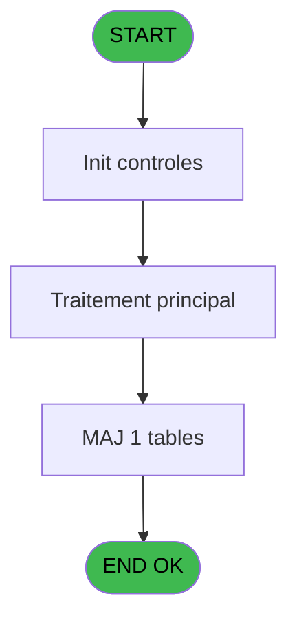
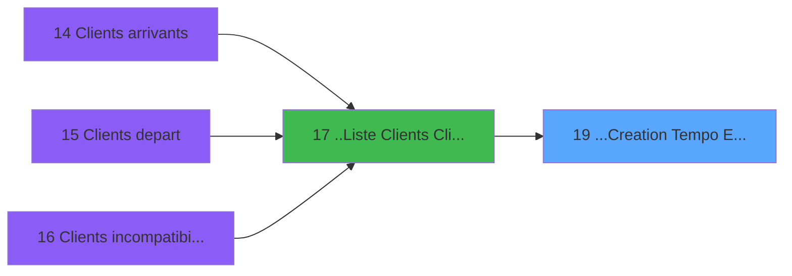

# PTR IDE 19 - ...Creation Tempo Ecran Ticket

> **Analyse**: Phases 1-4 2026-02-03 18:14 -> 18:15 (15s) | Assemblage 18:15
> **Pipeline**: V7.2 Enrichi
> **Structure**: 4 onglets (Resume | Ecrans | Donnees | Connexions)

<!-- TAB:Resume -->

## 1. FICHE D'IDENTITE

| Attribut | Valeur |
|----------|--------|
| Projet | PTR |
| IDE Position | 19 |
| Nom Programme | ...Creation Tempo Ecran Ticket |
| Fichier source | `Prg_19.xml` |
| Dossier IDE | Listes |
| Taches | 1 (0 ecrans visibles) |
| Tables modifiees | 1 |
| Programmes appeles | 0 |

## 2. DESCRIPTION FONCTIONNELLE

**...Creation Tempo Ecran Ticket** assure la gestion complete de ce processus, accessible depuis [..Liste  Clients (ClipArt)+ (IDE 17)](PTR-IDE-17.md).

Le flux de traitement s'organise en **1 blocs fonctionnels** :

- **Creation** (1 tache) : insertion d'enregistrements en base (mouvements, prestations)

**Donnees modifiees** : 1 tables en ecriture (libelle_ecart_reference).

## 3. BLOCS FONCTIONNELS

### 3.1 Creation (1 tache)

Insertion de nouveaux enregistrements en base.

---

#### 19 - ...Creation Tempo Ecran

**Role** : Creation d'enregistrement : ...Creation Tempo Ecran.

## 5. REGLES METIER

*(Aucune regle metier identifiee)*

## 6. CONTEXTE

- **Appele par**: [..Liste  Clients (ClipArt)+ (IDE 17)](PTR-IDE-17.md)
- **Appelle**: 0 programmes | **Tables**: 1 (W:1 R:0 L:0) | **Taches**: 1 | **Expressions**: 25

<!-- TAB:Ecrans -->

## 8. ECRANS

*(Programme sans ecran visible)*

## 9. NAVIGATION

### 9.3 Structure hierarchique (1 tache)

| Position | Tache | Type | Dimensions | Bloc |
|----------|-------|------|------------|------|
| **19.1** | [**...Creation Tempo Ecran** (19)](#t1) | MDI | - | Creation |

### 9.4 Algorigramme

> **Legende**: Vert = START/END OK | Rouge = END KO | Bleu = Decisions
> *Algorigramme auto-genere. Utiliser `/algorigramme` pour une synthese metier detaillee.*

<!-- TAB:Donnees -->

## 10. TABLES

### Tables utilisees (1)

| ID | Nom | Description | Type | R | W | L | Usages |
|----|-----|-------------|------|---|---|---|--------|
| 686 | libelle_ecart_reference |  | DB |   | **W** |   | 1 |

### Colonnes par table (1 / 1 tables avec colonnes identifiees)

Table 686 - libelle_ecart_reference (**W**) - 1 usages

| Lettre | Variable | Acces | Type |
|--------|----------|-------|------|
| A | P0-Societe | W | Alpha |
| B | P0-Code Ferry | W | Alpha |
| C | P0-Nom | W | Alpha |
| D | P0-Prenom | W | Alpha |
| E | P0-Sexe | W | Alpha |
| F | P0-Qualite | W | Alpha |
| G | P0-Type Client | W | Alpha |
| H | P0-N° Adherent | W | Numeric |
| I | P0-Filiation Club | W | Numeric |
| J | P0-Nationalite | W | Alpha |
| K | P0-Date Naissance | W | Date |
| L | P0-N° Passeport | W | Alpha |
| M | P0-Date Delivrance | W | Date |
| N | P0 Ville Delivrance | W | Alpha |
| O | P0 Date Expiration | W | Date |
| P | P0 N° Dossier | W | Numeric |
| Q | P0 N° Ordre | W | Numeric |
| R | P0-Code Vol SIN | W | Alpha |
| S | P0-Compagnie SIN | W | Unicode |
| T | P0 Date Vol SIN | W | Date |
| U | P0 Heure Vol SIN | W | Time |
| V | P0 Ville | W | Alpha |
| W | P0-Compte | W | Numeric |
| X | P0-Filiation | W | Numeric |

## 11. VARIABLES

### 11.1 Parametres entrants (7)

Variables recues du programme appelant ([..Liste  Clients (ClipArt)+ (IDE 17)](PTR-IDE-17.md)).

| Lettre | Nom | Type | Usage dans |
|--------|-----|------|-----------|
| N | P0 Ville Delivrance | Alpha | 1x parametre entrant |
| O | P0 Date Expiration | Date | 1x parametre entrant |
| P | P0 N° Dossier | Numeric | 1x parametre entrant |
| Q | P0 N° Ordre | Numeric | 1x parametre entrant |
| T | P0 Date Vol SIN | Date | 1x parametre entrant |
| U | P0 Heure Vol SIN | Time | 1x parametre entrant |
| V | P0 Ville | Alpha | 2x parametre entrant |

### 11.2 Autres (17)

Variables diverses.

| Lettre | Nom | Type | Usage dans |
|--------|-----|------|-----------|
| A | P0-Societe | Alpha | 1x refs |
| B | P0-Code Ferry | Alpha | 1x refs |
| C | P0-Nom | Alpha | 1x refs |
| D | P0-Prenom | Alpha | 1x refs |
| E | P0-Sexe | Alpha | 1x refs |
| F | P0-Qualite | Alpha | 1x refs |
| G | P0-Type Client | Alpha | 1x refs |
| H | P0-N° Adherent | Numeric | 1x refs |
| I | P0-Filiation Club | Numeric | 1x refs |
| J | P0-Nationalite | Alpha | 1x refs |
| K | P0-Date Naissance | Date | 1x refs |
| L | P0-N° Passeport | Alpha | 1x refs |
| M | P0-Date Delivrance | Date | 1x refs |
| R | P0-Code Vol SIN | Alpha | 1x refs |
| S | P0-Compagnie SIN | Unicode | 1x refs |
| W | P0-Compte | Numeric | 1x refs |
| X | P0-Filiation | Numeric | 1x refs |

Toutes les 24 variables (liste complete)

| Cat | Lettre | Nom Variable | Type |
|-----|--------|--------------|------|
| P0 | **N** | P0 Ville Delivrance | Alpha |
| P0 | **O** | P0 Date Expiration | Date |
| P0 | **P** | P0 N° Dossier | Numeric |
| P0 | **Q** | P0 N° Ordre | Numeric |
| P0 | **T** | P0 Date Vol SIN | Date |
| P0 | **U** | P0 Heure Vol SIN | Time |
| P0 | **V** | P0 Ville | Alpha |
| Autre | **A** | P0-Societe | Alpha |
| Autre | **B** | P0-Code Ferry | Alpha |
| Autre | **C** | P0-Nom | Alpha |
| Autre | **D** | P0-Prenom | Alpha |
| Autre | **E** | P0-Sexe | Alpha |
| Autre | **F** | P0-Qualite | Alpha |
| Autre | **G** | P0-Type Client | Alpha |
| Autre | **H** | P0-N° Adherent | Numeric |
| Autre | **I** | P0-Filiation Club | Numeric |
| Autre | **J** | P0-Nationalite | Alpha |
| Autre | **K** | P0-Date Naissance | Date |
| Autre | **L** | P0-N° Passeport | Alpha |
| Autre | **M** | P0-Date Delivrance | Date |
| Autre | **R** | P0-Code Vol SIN | Alpha |
| Autre | **S** | P0-Compagnie SIN | Unicode |
| Autre | **W** | P0-Compte | Numeric |
| Autre | **X** | P0-Filiation | Numeric |

## 12. EXPRESSIONS

**25 / 25 expressions decodees (100%)**

### 12.1 Repartition par type

| Type | Expressions | Regles |
|------|-------------|--------|
| OTHER | 24 | 0 |
| REFERENCE_VG | 1 | 0 |

### 12.2 Expressions cles par type

#### OTHER (24 expressions)

| Type | IDE | Expression | Regle |
|------|-----|------------|-------|
| OTHER | 17 | `P0 N° Dossier [P]` | - |
| OTHER | 18 | `P0 N° Ordre [Q]` | - |
| OTHER | 19 | `P0-Code Vol SIN [R]` | - |
| OTHER | 14 | `P0-Date Delivrance [M]` | - |
| OTHER | 15 | `P0 Ville Delivrance [N]` | - |
| ... | | *+19 autres* | |

#### REFERENCE_VG (1 expressions)

| Type | IDE | Expression | Regle |
|------|-----|------------|-------|
| REFERENCE_VG | 2 | `VG2` | - |

### 12.3 Toutes les expressions (25)

Voir les 25 expressions

#### OTHER (24)

| IDE | Expression Decodee |
|-----|-------------------|
| 1 | `P0-Societe [A]` |
| 3 | `P0-Code Ferry [B]` |
| 4 | `P0-Nom [C]` |
| 5 | `P0-Prenom [D]` |
| 6 | `P0-Sexe [E]` |
| 7 | `P0-Qualite [F]` |
| 8 | `P0-Type Client [G]` |
| 9 | `P0-N° Adherent [H]` |
| 10 | `P0-Filiation Club [I]` |
| 11 | `P0-Nationalite [J]` |
| 12 | `P0-Date Naissance [K]` |
| 13 | `P0-N° Passeport [L]` |
| 14 | `P0-Date Delivrance [M]` |
| 15 | `P0 Ville Delivrance [N]` |
| 16 | `P0 Date Expiration [O]` |
| 17 | `P0 N° Dossier [P]` |
| 18 | `P0 N° Ordre [Q]` |
| 19 | `P0-Code Vol SIN [R]` |
| 20 | `[CR]` |
| 21 | `P0-Compagnie SIN [S]` |
| 22 | `P0 Date Vol SIN [T]` |
| 23 | `P0 Heure Vol SIN [U]` |
| 24 | `P0 Ville [V]` |
| 25 | `P0-Compte [W]` |

#### REFERENCE_VG (1)

| IDE | Expression Decodee |
|-----|-------------------|
| 2 | `VG2` |

<!-- TAB:Connexions -->

## 13. GRAPHE D'APPELS

### 13.1 Chaine depuis Main (Callers)

Main -> ... -> [..Liste  Clients (ClipArt)+ (IDE 17)](PTR-IDE-17.md) -> **...Creation Tempo Ecran Ticket (IDE 19)**

### 13.2 Callers

| IDE | Nom Programme | Nb Appels |
|-----|---------------|-----------|
| [17](PTR-IDE-17.md) | ..Liste  Clients (ClipArt)+ | 2 |

### 13.3 Callees (programmes appeles)

### 13.4 Detail Callees avec contexte

| IDE | Nom Programme | Appels | Contexte |
|-----|---------------|--------|----------|
| - | (aucun) | - | - |

## 14. RECOMMANDATIONS MIGRATION

### 14.1 Profil du programme

| Metrique | Valeur | Impact migration |
|----------|--------|-----------------|
| Lignes de logique | 53 | Programme compact |
| Expressions | 25 | Peu de logique |
| Tables WRITE | 1 | Impact faible |
| Sous-programmes | 0 | Peu de dependances |
| Ecrans visibles | 0 | Ecran unique ou traitement batch |
| Code desactive | 0% (0 / 53) | Code sain |
| Regles metier | 0 | Pas de regle identifiee |

### 14.2 Plan de migration par bloc

#### Creation (1 tache: 0 ecran, 1 traitement)

- **Strategie** : Repository pattern avec Entity Framework Core.
- Insertion via `IRepository<T>.CreateAsync()`

### 14.3 Dependances critiques

| Dependance | Type | Appels | Impact |
|------------|------|--------|--------|
| libelle_ecart_reference | Table WRITE (Database) | 1x | Schema + repository |

---
*Spec DETAILED generee par Pipeline V7.2 - 2026-02-03 18:15*
