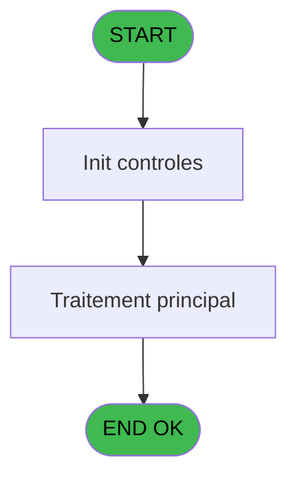
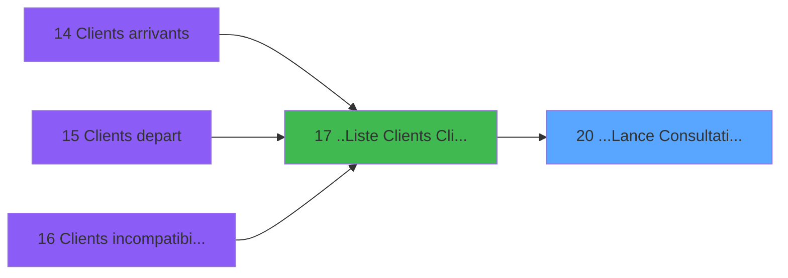
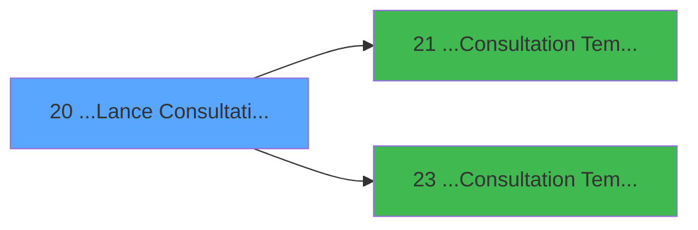

# PTR IDE 20 - ...Lance Consultation Ecran

> **Analyse**: Phases 1-4 2026-02-03 18:15 -> 18:15 (15s) | Assemblage 18:15
> **Pipeline**: V7.2 Enrichi
> **Structure**: 4 onglets (Resume | Ecrans | Donnees | Connexions)

<!-- TAB:Resume -->

## 1. FICHE D'IDENTITE

| Attribut | Valeur |
|----------|--------|
| Projet | PTR |
| IDE Position | 20 |
| Nom Programme | ...Lance Consultation Ecran |
| Fichier source | `Prg_20.xml` |
| Dossier IDE | Listes |
| Taches | 2 (0 ecrans visibles) |
| Tables modifiees | 0 |
| Programmes appeles | 2 |

## 2. DESCRIPTION FONCTIONNELLE

**...Lance Consultation Ecran** assure la gestion complete de ce processus, accessible depuis [..Liste  Clients (ClipArt)+ (IDE 17)](PTR-IDE-17.md).

Le flux de traitement s'organise en **1 blocs fonctionnels** :

- **Traitement** (2 taches) : traitements metier divers

**Logique metier** : 1 regles identifiees couvrant conditions metier.

## 3. BLOCS FONCTIONNELS

### 3.1 Traitement (2 taches)

Traitements internes.

---

#### 20 - ...Consultation Tempo Ecran

**Role** : Consultation/chargement : ...Consultation Tempo Ecran.
**Variables liees** : U (W0-EcranNormal), V (W0-EcranStandard), W (W0-EcranSecretariat)
**Delegue a** : [...Consultation Tempo Ecran Tt (IDE 21)](PTR-IDE-21.md), [...Consultation Tempo Ecran TK (IDE 23)](PTR-IDE-23.md)

---

#### 20.1 - Enlève Accent

**Role** : Traitement : Enlève Accent.
**Delegue a** : [...Consultation Tempo Ecran Tt (IDE 21)](PTR-IDE-21.md), [...Consultation Tempo Ecran TK (IDE 23)](PTR-IDE-23.md)

## 5. REGLES METIER

1 regles identifiees:

### Autres (1 regles)

#### [RM-001] Si InStr (P0-Libelle Liste [D] alors 'DEPART')>0 sinon 2,1)

| Element | Detail |
|---------|--------|
| **Condition** | `InStr (P0-Libelle Liste [D]` |
| **Si vrai** | 'DEPART')>0 |
| **Si faux** | 2,1) |
| **Variables** | D (P0-Libelle Liste) |
| **Expression source** | Expression 2 : `IF (InStr (P0-Libelle Liste [D],'DEPART')>0,2,1)` |
| **Exemple** | Si InStr (P0-Libelle Liste [D] → 'DEPART')>0. Sinon → 2,1) |

## 6. CONTEXTE

- **Appele par**: [..Liste  Clients (ClipArt)+ (IDE 17)](PTR-IDE-17.md)
- **Appelle**: 2 programmes | **Tables**: 0 (W:0 R:0 L:0) | **Taches**: 2 | **Expressions**: 7

<!-- TAB:Ecrans -->

## 8. ECRANS

*(Programme sans ecran visible)*

## 9. NAVIGATION

### 9.3 Structure hierarchique (2 taches)

| Position | Tache | Type | Dimensions | Bloc |
|----------|-------|------|------------|------|
| **20.1** | [**...Consultation Tempo Ecran** (20)](#t1) | MDI | - | Traitement |
| 20.1.1 | [Enlève Accent (20.1)](#t2) | MDI | - | |

### 9.4 Algorigramme

> **Legende**: Vert = START/END OK | Rouge = END KO | Bleu = Decisions
> *Algorigramme auto-genere. Utiliser `/algorigramme` pour une synthese metier detaillee.*

<!-- TAB:Donnees -->

## 10. TABLES

### Tables utilisees (0)

| ID | Nom | Description | Type | R | W | L | Usages |
|----|-----|-------------|------|---|---|---|--------|

### Colonnes par table (0 / 0 tables avec colonnes identifiees)

## 11. VARIABLES

### 11.1 Autres (31)

Variables diverses.

| Lettre | Nom | Type | Usage dans |
|--------|-----|------|-----------|
| A | P0-Societe | Alpha | - |
| B | P0-Code Edition | Alpha | 3x refs |
| C | P0-Liste Cpt | Alpha | - |
| D | P0-Libelle Liste | Alpha | 1x refs |
| E | P0-Liste | Alpha | 1x refs |
| F | P0-Village | Alpha | - |
| G | P0-Format Imprimante | Alpha | - |
| H | P0-Date | Date | - |
| I | P0-Total Selection | Alpha | - |
| J | P0-Selection 1/5 | Alpha | - |
| K | P0-Selection 6/10 | Alpha | - |
| L | P0-Selection 11/15 | Alpha | - |
| M | P0-Present | Alpha | - |
| N | P0-Code Vol | Alpha | - |
| O | P0_Compagnie | Alpha | - |
| P | P0-Code Ville TK | Alpha | - |
| Q | P0-Nombre Total | Numeric | - |
| R | P1-Ajout | Numeric | - |
| S | P0-Lieu Sejour | Alpha | - |
| T | W0-Type Affichage | Numeric | - |
| U | W0-EcranNormal | Alpha | - |
| V | W0-EcranStandard | Alpha | - |
| W | W0-EcranSecretariat | Alpha | - |
| X | W0-FinLigenStandard | Alpha | 1x refs |
| Y | W0-FinLigneNormal | Alpha | - |
| Z | W0-Fin Programme | Alpha | - |
| BA | P1-Code Vol Arrivee | Alpha | - |
| BB | P1-Nom | Alpha | - |
| BC | P1-Prenom | Alpha | - |
| BD | P1-Sexe | Alpha | - |
| BE | P1-Cle | Numeric | - |

Toutes les 31 variables (liste complete)

| Cat | Lettre | Nom Variable | Type |
|-----|--------|--------------|------|
| Autre | **A** | P0-Societe | Alpha |
| Autre | **B** | P0-Code Edition | Alpha |
| Autre | **C** | P0-Liste Cpt | Alpha |
| Autre | **D** | P0-Libelle Liste | Alpha |
| Autre | **E** | P0-Liste | Alpha |
| Autre | **F** | P0-Village | Alpha |
| Autre | **G** | P0-Format Imprimante | Alpha |
| Autre | **H** | P0-Date | Date |
| Autre | **I** | P0-Total Selection | Alpha |
| Autre | **J** | P0-Selection 1/5 | Alpha |
| Autre | **K** | P0-Selection 6/10 | Alpha |
| Autre | **L** | P0-Selection 11/15 | Alpha |
| Autre | **M** | P0-Present | Alpha |
| Autre | **N** | P0-Code Vol | Alpha |
| Autre | **O** | P0_Compagnie | Alpha |
| Autre | **P** | P0-Code Ville TK | Alpha |
| Autre | **Q** | P0-Nombre Total | Numeric |
| Autre | **R** | P1-Ajout | Numeric |
| Autre | **S** | P0-Lieu Sejour | Alpha |
| Autre | **T** | W0-Type Affichage | Numeric |
| Autre | **U** | W0-EcranNormal | Alpha |
| Autre | **V** | W0-EcranStandard | Alpha |
| Autre | **W** | W0-EcranSecretariat | Alpha |
| Autre | **X** | W0-FinLigenStandard | Alpha |
| Autre | **Y** | W0-FinLigneNormal | Alpha |
| Autre | **Z** | W0-Fin Programme | Alpha |
| Autre | **BA** | P1-Code Vol Arrivee | Alpha |
| Autre | **BB** | P1-Nom | Alpha |
| Autre | **BC** | P1-Prenom | Alpha |
| Autre | **BD** | P1-Sexe | Alpha |
| Autre | **BE** | P1-Cle | Numeric |

## 12. EXPRESSIONS

**7 / 7 expressions decodees (100%)**

### 12.1 Repartition par type

| Type | Expressions | Regles |
|------|-------------|--------|
| CONDITION | 6 | 5 |
| CONSTANTE | 1 | 0 |

### 12.2 Expressions cles par type

#### CONDITION (6 expressions)

| Type | IDE | Expression | Regle |
|------|-----|------------|-------|
| CONDITION | 2 | `IF (InStr (P0-Libelle Liste [D],'DEPART')>0,2,1)` | [RM-001](#rm-RM-001) |
| CONDITION | 6 | `P0-Code Edition [B]='TK'` | - |
| CONDITION | 7 | `Trim(P0-Liste [E])<>''` | - |
| CONDITION | 5 | `P0-Code Edition [B]<>'TK'` | - |
| CONDITION | 1 | `W0-FinLigenStandard [X]='F'` | - |
| ... | | *+1 autres* | |

#### CONSTANTE (1 expressions)

| Type | IDE | Expression | Regle |
|------|-----|------------|-------|
| CONSTANTE | 3 | `4` | - |

<!-- TAB:Connexions -->

## 13. GRAPHE D'APPELS

### 13.1 Chaine depuis Main (Callers)

Main -> ... -> [..Liste  Clients (ClipArt)+ (IDE 17)](PTR-IDE-17.md) -> **...Lance Consultation Ecran (IDE 20)**

### 13.2 Callers

| IDE | Nom Programme | Nb Appels |
|-----|---------------|-----------|
| [17](PTR-IDE-17.md) | ..Liste  Clients (ClipArt)+ | 1 |

### 13.3 Callees (programmes appeles)

### 13.4 Detail Callees avec contexte

| IDE | Nom Programme | Appels | Contexte |
|-----|---------------|--------|----------|
| [21](PTR-IDE-21.md) | ...Consultation Tempo Ecran Tt | 1 | Sous-programme |
| [23](PTR-IDE-23.md) | ...Consultation Tempo Ecran TK | 1 | Sous-programme |

## 14. RECOMMANDATIONS MIGRATION

### 14.1 Profil du programme

| Metrique | Valeur | Impact migration |
|----------|--------|-----------------|
| Lignes de logique | 57 | Programme compact |
| Expressions | 7 | Peu de logique |
| Tables WRITE | 0 | Impact faible |
| Sous-programmes | 2 | Peu de dependances |
| Ecrans visibles | 0 | Ecran unique ou traitement batch |
| Code desactive | 0% (0 / 57) | Code sain |
| Regles metier | 1 | Quelques regles a preserver |

### 14.2 Plan de migration par bloc

#### Traitement (2 taches: 0 ecran, 2 traitements)

- **Strategie** : 2 service(s) backend injectable(s) (Domain Services).
- 2 sous-programme(s) a migrer ou a reutiliser depuis les services existants.
- Decomposer les taches en services unitaires testables.

### 14.3 Dependances critiques

| Dependance | Type | Appels | Impact |
|------------|------|--------|--------|
| [...Consultation Tempo Ecran TK (IDE 23)](PTR-IDE-23.md) | Sous-programme | 1x | Normale - Sous-programme |
| [...Consultation Tempo Ecran Tt (IDE 21)](PTR-IDE-21.md) | Sous-programme | 1x | Normale - Sous-programme |

---
*Spec DETAILED generee par Pipeline V7.2 - 2026-02-03 18:15*
