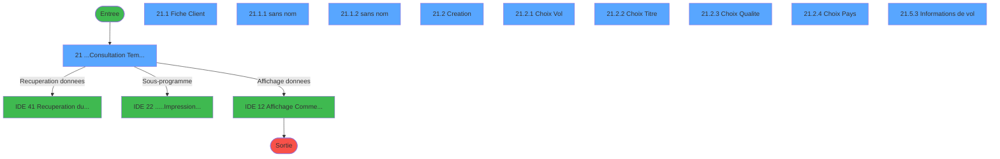
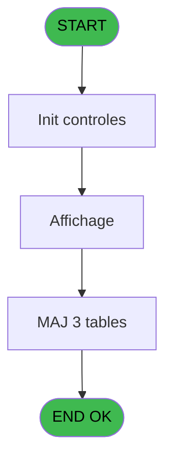
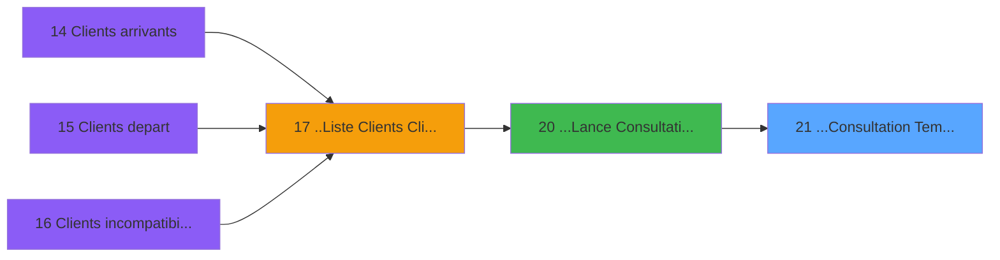
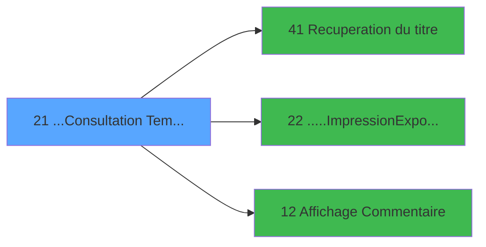

# PTR IDE 21 - ...Consultation Tempo Ecran Tt

> **Analyse**: Phases 1-4 2026-02-03 18:15 -> 18:15 (15s) | Assemblage 18:15
> **Pipeline**: V7.2 Enrichi
> **Structure**: 4 onglets (Resume | Ecrans | Donnees | Connexions)

<!-- TAB:Resume -->

## 1. FICHE D'IDENTITE

| Attribut | Valeur |
|----------|--------|
| Projet | PTR |
| IDE Position | 21 |
| Nom Programme | ...Consultation Tempo Ecran Tt |
| Fichier source | `Prg_21.xml` |
| Dossier IDE | Listes |
| Taches | 17 (10 ecrans visibles) |
| Tables modifiees | 3 |
| Programmes appeles | 3 |

## 2. DESCRIPTION FONCTIONNELLE

**...Consultation Tempo Ecran Tt** assure la gestion complete de ce processus, accessible depuis [...Lance Consultation Ecran (IDE 20)](PTR-IDE-20.md).

Le flux de traitement s'organise en **4 blocs fonctionnels** :

- **Traitement** (7 taches) : traitements metier divers
- **Consultation** (4 taches) : ecrans de recherche, selection et consultation
- **Creation** (4 taches) : insertion d'enregistrements en base (mouvements, prestations)
- **Saisie** (2 taches) : ecrans de saisie utilisateur (formulaires, champs, donnees)

**Donnees modifiees** : 3 tables en ecriture (tables_pays_ventes, classe_monetaire_reference, comptes_charge_reference).

**Logique metier** : 7 regles identifiees couvrant conditions metier, valeurs par defaut.

Detail : phases du traitement

#### Phase 1 : Traitement (7 taches)

- **21** - ...Consultation Tempo Ecran **[[ECRAN]](#ecran-t1)**
- **21.1** - Fiche Client **[[ECRAN]](#ecran-t2)**
- **21.1.1** - (sans nom) **[[ECRAN]](#ecran-t3)**
- **21.1.2** - (sans nom) **[[ECRAN]](#ecran-t4)**
- **21.3** - Suppression
- **21.4** - Charge Libelle
- **21.5.3** - Informations de vol **[[ECRAN]](#ecran-t18)**

Delegue a : [Recuperation du titre (IDE 41)](PTR-IDE-41.md), [.....Impression/Export Tt (IDE 22)](PTR-IDE-22.md)

#### Phase 2 : Creation (4 taches)

- **21.2** - Creation **[[ECRAN]](#ecran-t5)**
- **21.2.5** - Creation Physique
- **21.5.1** - Creation tempo vol export
- **21.5.2** - Creation tempo vol export

#### Phase 3 : Consultation (4 taches)

- **21.2.1** - Choix Vol **[[ECRAN]](#ecran-t6)**
- **21.2.2** - Choix Titre **[[ECRAN]](#ecran-t7)**
- **21.2.3** - Choix Qualite **[[ECRAN]](#ecran-t8)**
- **21.2.4** - Choix Pays **[[ECRAN]](#ecran-t9)**

Delegue a : [Recuperation du titre (IDE 41)](PTR-IDE-41.md), [Affichage Commentaire (IDE 12)](PTR-IDE-12.md)

#### Phase 4 : Saisie (2 taches)

- **21.5** - Temp saisie vol
- **21.5.3.1** - Vérifie saisie

#### Tables impactees

| Table | Operations | Role metier |
|-------|-----------|-------------|
| comptes_charge_reference | **W**/L (5 usages) | Comptes GM (generaux) |
| classe_monetaire_reference | **W**/L (4 usages) |  |
| tables_pays_ventes | **W** (1 usages) | Donnees de ventes |

## 3. BLOCS FONCTIONNELS

### 3.1 Traitement (7 taches)

Traitements internes.

---

#### 21 - ...Consultation Tempo Ecran [[ECRAN]](#ecran-t1)

**Role** : Tache d'orchestration : point d'entree du programme (7 sous-taches). Coordonne l'enchainement des traitements.
**Ecran** : 1266 x 318 DLU (MDI) | [Voir mockup](#ecran-t1)

6 sous-taches directes

| Tache | Nom | Bloc |
|-------|-----|------|
| [21.1](#t2) | Fiche Client **[[ECRAN]](#ecran-t2)** | Traitement |
| [21.1.1](#t3) | (sans nom) **[[ECRAN]](#ecran-t3)** | Traitement |
| [21.1.2](#t4) | (sans nom) **[[ECRAN]](#ecran-t4)** | Traitement |
| [21.3](#t11) | Suppression | Traitement |
| [21.4](#t12) | Charge Libelle | Traitement |
| [21.5.3](#t18) | Informations de vol **[[ECRAN]](#ecran-t18)** | Traitement |

**Variables liees** : BB (W0-EcranNormal), BC (W0-EcranStandard), BD (W0-EcranSecretariat)
**Delegue a** : [Recuperation du titre (IDE 41)](PTR-IDE-41.md), [.....Impression/Export Tt (IDE 22)](PTR-IDE-22.md)

---

#### 21.1 - Fiche Client [[ECRAN]](#ecran-t2)

**Role** : Traitement : Fiche Client.
**Ecran** : 907 x 297 DLU (MDI) | [Voir mockup](#ecran-t2)
**Delegue a** : [Recuperation du titre (IDE 41)](PTR-IDE-41.md), [.....Impression/Export Tt (IDE 22)](PTR-IDE-22.md)

---

#### 21.1.1 - (sans nom) [[ECRAN]](#ecran-t3)

**Role** : Traitement interne.
**Ecran** : 905 x 69 DLU (Modal) | [Voir mockup](#ecran-t3)
**Delegue a** : [Recuperation du titre (IDE 41)](PTR-IDE-41.md), [.....Impression/Export Tt (IDE 22)](PTR-IDE-22.md)

---

#### 21.1.2 - (sans nom) [[ECRAN]](#ecran-t4)

**Role** : Traitement interne.
**Ecran** : 895 x 54 DLU (Modal) | [Voir mockup](#ecran-t4)
**Delegue a** : [Recuperation du titre (IDE 41)](PTR-IDE-41.md), [.....Impression/Export Tt (IDE 22)](PTR-IDE-22.md)

---

#### 21.3 - Suppression

**Role** : Traitement : Suppression.
**Delegue a** : [Recuperation du titre (IDE 41)](PTR-IDE-41.md), [.....Impression/Export Tt (IDE 22)](PTR-IDE-22.md)

---

#### 21.4 - Charge Libelle

**Role** : Traitement : Charge Libelle.
**Variables liees** : D (P0-Libelle Liste)
**Delegue a** : [Recuperation du titre (IDE 41)](PTR-IDE-41.md), [.....Impression/Export Tt (IDE 22)](PTR-IDE-22.md)

---

#### 21.5.3 - Informations de vol [[ECRAN]](#ecran-t18)

**Role** : Selection par l'operateur : Informations de vol.
**Ecran** : 1149 x 224 DLU | [Voir mockup](#ecran-t18)
**Delegue a** : [Recuperation du titre (IDE 41)](PTR-IDE-41.md), [.....Impression/Export Tt (IDE 22)](PTR-IDE-22.md)

### 3.2 Creation (4 taches)

Insertion de nouveaux enregistrements en base.

---

#### 21.2 - Creation [[ECRAN]](#ecran-t5)

**Role** : Creation d'enregistrement : Creation.
**Ecran** : 702 x 198 DLU (MDI) | [Voir mockup](#ecran-t5)

---

#### 21.2.5 - Creation Physique

**Role** : Creation d'enregistrement : Creation Physique.

---

#### 21.5.1 - Creation tempo vol export

**Role** : Selection par l'operateur : Creation tempo vol export.

---

#### 21.5.2 - Creation tempo vol export

**Role** : Selection par l'operateur : Creation tempo vol export.

### 3.3 Consultation (4 taches)

Ecrans de recherche et consultation.

---

#### 21.2.1 - Choix Vol [[ECRAN]](#ecran-t6)

**Role** : Selection par l'operateur : Choix Vol.
**Ecran** : 587 x 212 DLU (MDI) | [Voir mockup](#ecran-t6)
**Delegue a** : [Affichage Commentaire (IDE 12)](PTR-IDE-12.md)

---

#### 21.2.2 - Choix Titre [[ECRAN]](#ecran-t7)

**Role** : Selection par l'operateur : Choix Titre.
**Ecran** : 467 x 207 DLU (MDI) | [Voir mockup](#ecran-t7)
**Variables liees** : BN (v.Titre)
**Delegue a** : [Affichage Commentaire (IDE 12)](PTR-IDE-12.md)

---

#### 21.2.3 - Choix Qualite [[ECRAN]](#ecran-t8)

**Role** : Selection par l'operateur : Choix Qualite.
**Ecran** : 466 x 204 DLU (MDI) | [Voir mockup](#ecran-t8)
**Delegue a** : [Affichage Commentaire (IDE 12)](PTR-IDE-12.md)

---

#### 21.2.4 - Choix Pays [[ECRAN]](#ecran-t9)

**Role** : Selection par l'operateur : Choix Pays.
**Ecran** : 426 x 224 DLU (MDI) | [Voir mockup](#ecran-t9)
**Delegue a** : [Affichage Commentaire (IDE 12)](PTR-IDE-12.md)

### 3.4 Saisie (2 taches)

Ce bloc traite la saisie des donnees de la transaction.

---

#### 21.5 - Temp saisie vol

**Role** : Saisie des donnees : Temp saisie vol.

---

#### 21.5.3.1 - Vérifie saisie

**Role** : Saisie des donnees : Vérifie saisie.

## 5. REGLES METIER

7 regles identifiees:

### Autres (7 regles)

#### [RM-001] Si P0-Prenom [T]=1 alors P0-Fin Programme Pre [P] sinon '')

| Element | Detail |
|---------|--------|
| **Condition** | `P0-Prenom [T]=1` |
| **Si vrai** | P0-Fin Programme Pre [P] |
| **Si faux** | '') |
| **Variables** | P (P0-Fin Programme Pre), T (P0-Prenom) |
| **Expression source** | Expression 7 : `IF (P0-Prenom [T]=1,P0-Fin Programme Pre [P],'')` |
| **Exemple** | Si P0-Prenom [T]=1 → P0-Fin Programme Pre [P]. Sinon → '') |

#### [RM-002] Si P0-Prenom [T]=2 alors P0-Fin Programme Pre [P] sinon '')

| Element | Detail |
|---------|--------|
| **Condition** | `P0-Prenom [T]=2` |
| **Si vrai** | P0-Fin Programme Pre [P] |
| **Si faux** | '') |
| **Variables** | P (P0-Fin Programme Pre), T (P0-Prenom) |
| **Expression source** | Expression 9 : `IF (P0-Prenom [T]=2,P0-Fin Programme Pre [P],'')` |
| **Exemple** | Si P0-Prenom [T]=2 → P0-Fin Programme Pre [P]. Sinon → '') |

#### [RM-003] Si [AS]=999 alors 141 sinon 110)

| Element | Detail |
|---------|--------|
| **Condition** | `[AS]=999` |
| **Si vrai** | 141 |
| **Si faux** | 110) |
| **Expression source** | Expression 17 : `IF ([AS]=999,141,110)` |
| **Exemple** | Si [AS]=999 → 141. Sinon → 110) |

#### [RM-004] Si InStr (P0-Liste Cpt [C] alors 'Reveil')>0 sinon 'Reveil','')

| Element | Detail |
|---------|--------|
| **Condition** | `InStr (P0-Liste Cpt [C]` |
| **Si vrai** | 'Reveil')>0 |
| **Si faux** | 'Reveil','') |
| **Variables** | C (P0-Liste Cpt), E (P0-Liste) |
| **Expression source** | Expression 18 : `IF (InStr (P0-Liste Cpt [C],'Reveil')>0,'Reveil','')` |
| **Exemple** | Si InStr (P0-Liste Cpt [C] → 'Reveil')>0. Sinon → 'Reveil','') |

#### [RM-005] Valeur par defaut si P0-Societe [A] est vide

| Element | Detail |
|---------|--------|
| **Condition** | `P0-Societe [A]=''` |
| **Si vrai** | 'C' |
| **Si faux** | P0-Societe [A]) |
| **Variables** | A (P0-Societe) |
| **Expression source** | Expression 20 : `IF (P0-Societe [A]='','C',P0-Societe [A])` |
| **Exemple** | Si P0-Societe [A]='' → 'C'. Sinon → P0-Societe [A]) |

#### [RM-006] Valeur par defaut si LTrim (RTrim ([AU])) est vide

| Element | Detail |
|---------|--------|
| **Condition** | `LTrim (RTrim ([AU]))=''` |
| **Si vrai** | '' |
| **Si faux** | 'h') |
| **Expression source** | Expression 29 : `IF (LTrim (RTrim ([AU]))='','','h')` |
| **Exemple** | Si LTrim (RTrim ([AU]))='' → ''. Sinon → 'h') |

#### [RM-007] Valeur par defaut si LTrim (RTrim ([AW])) est vide

| Element | Detail |
|---------|--------|
| **Condition** | `LTrim (RTrim ([AW]))=''` |
| **Si vrai** | '' |
| **Si faux** | 'h') |
| **Expression source** | Expression 30 : `IF (LTrim (RTrim ([AW]))='','','h')` |
| **Exemple** | Si LTrim (RTrim ([AW]))='' → ''. Sinon → 'h') |

## 6. CONTEXTE

- **Appele par**: [...Lance Consultation Ecran (IDE 20)](PTR-IDE-20.md)
- **Appelle**: 3 programmes | **Tables**: 14 (W:3 R:7 L:9) | **Taches**: 17 | **Expressions**: 42

<!-- TAB:Ecrans -->

## 8. ECRANS

### 8.1 Forms visibles (10 / 17)

| # | Position | Tache | Nom | Type | Largeur | Hauteur | Bloc |
|---|----------|-------|-----|------|---------|---------|------|
| 1 | 21 | 21 | ...Consultation Tempo Ecran | MDI | 1266 | 318 | Traitement |
| 2 | 21.1 | 21.1 | Fiche Client | MDI | 907 | 297 | Traitement |
| 3 | 21.1.1 | 21.1.1 | (sans nom) | Modal | 905 | 69 | Traitement |
| 4 | 21.1.2 | 21.1.2 | (sans nom) | Modal | 895 | 54 | Traitement |
| 5 | 21.2 | 21.2 | Creation | MDI | 702 | 198 | Creation |
| 6 | 21.2.1 | 21.2.1 | Choix Vol | MDI | 587 | 212 | Consultation |
| 7 | 21.2.2 | 21.2.2 | Choix Titre | MDI | 467 | 207 | Consultation |
| 8 | 21.2.3 | 21.2.3 | Choix Qualite | MDI | 466 | 204 | Consultation |
| 9 | 21.2.4 | 21.2.4 | Choix Pays | MDI | 426 | 224 | Consultation |
| 10 | 21.5.3 | 21.5.3 | Informations de vol | Type0 | 1149 | 224 | Traitement |

### 8.2 Mockups Ecrans

---

#### 21 - ...Consultation Tempo Ecran
**Tache** : [21](#t1) | **Type** : MDI | **Dimensions** : 1266 x 318 DLU
**Bloc** : Traitement | **Titre IDE** : ...Consultation Tempo Ecran

<!-- FORM-DATA:
{
    "width":  1266,
    "vFactor":  8,
    "type":  "MDI",
    "hFactor":  8,
    "controls":  [
                     {
                         "x":  0,
                         "type":  "label",
                         "var":  "",
                         "y":  0,
                         "w":  1255,
                         "fmt":  "",
                         "name":  "",
                         "h":  20,
                         "color":  "",
                         "text":  "",
                         "parent":  null
                     },
                     {
                         "x":  1080,
                         "type":  "label",
                         "var":  "",
                         "y":  42,
                         "w":  173,
                         "fmt":  "",
                         "name":  "",
                         "h":  57,
                         "color":  "195",
                         "text":  "Nombre",
                         "parent":  null
                     },
                     {
                         "x":  7,
                         "type":  "table",
                         "var":  "",
                         "name":  "",
                         "titleH":  12,
                         "color":  "110",
                         "w":  1067,
                         "y":  44,
                         "fmt":  "",
                         "parent":  null,
                         "text":  "",
                         "rowH":  13,
                         "h":  195,
                         "cols":  [
                                      {
                                          "title":  "Nom",
                                          "layer":  1,
                                          "w":  200
                                      },
                                      {
                                          "title":  "Prénom",
                                          "layer":  2,
                                          "w":  142
                                      },
                                      {
                                          "title":  "Sexe",
                                          "layer":  3,
                                          "w":  65
                                      },
                                      {
                                          "title":  "Qualité",
                                          "layer":  4,
                                          "w":  117
                                      },
                                      {
                                          "title":  "Age",
                                          "layer":  5,
                                          "w":  59
                                      },
                                      {
                                          "title":  "Logement",
                                          "layer":  6,
                                          "w":  120
                                      },
                                      {
                                          "title":  "Pays",
                                          "layer":  7,
                                          "w":  57
                                      },
                                      {
                                          "title":  "B",
                                          "layer":  8,
                                          "w":  35
                                      },
                                      {
                                          "title":  "M",
                                          "layer":  9,
                                          "w":  39
                                      },
                                      {
                                          "title":  "F",
                                          "layer":  10,
                                          "w":  70
                                      },
                                      {
                                          "title":  "R",
                                          "layer":  11,
                                          "w":  38
                                      },
                                      {
                                          "title":  "Réveil",
                                          "layer":  12,
                                          "w":  93
                                      }
                                  ],
                         "rows":  12
                     },
                     {
                         "x":  1080,
                         "type":  "label",
                         "var":  "",
                         "y":  105,
                         "w":  173,
                         "fmt":  "",
                         "name":  "",
                         "h":  178,
                         "color":  "1",
                         "text":  "",
                         "parent":  null
                     },
                     {
                         "x":  10,
                         "type":  "label",
                         "var":  "",
                         "y":  246,
                         "w":  202,
                         "fmt":  "",
                         "name":  "",
                         "h":  38,
                         "color":  "195",
                         "text":  "Source",
                         "parent":  null
                     },
                     {
                         "x":  217,
                         "type":  "label",
                         "var":  "",
                         "y":  246,
                         "w":  420,
                         "fmt":  "",
                         "name":  "",
                         "h":  38,
                         "color":  "195",
                         "text":  "Arrivée",
                         "parent":  null
                     },
                     {
                         "x":  644,
                         "type":  "label",
                         "var":  "",
                         "y":  246,
                         "w":  422,
                         "fmt":  "",
                         "name":  "",
                         "h":  38,
                         "color":  "195",
                         "text":  "Départ",
                         "parent":  null
                     },
                     {
                         "x":  18,
                         "type":  "label",
                         "var":  "",
                         "y":  257,
                         "w":  69,
                         "fmt":  "",
                         "name":  "",
                         "h":  8,
                         "color":  "142",
                         "text":  "TRAFIC",
                         "parent":  34
                     },
                     {
                         "x":  18,
                         "type":  "label",
                         "var":  "",
                         "y":  268,
                         "w":  101,
                         "fmt":  "",
                         "name":  "",
                         "h":  8,
                         "color":  "142",
                         "text":  "PLANNING",
                         "parent":  34
                     },
                     {
                         "x":  0,
                         "type":  "label",
                         "var":  "",
                         "y":  291,
                         "w":  1261,
                         "fmt":  "",
                         "name":  "",
                         "h":  24,
                         "color":  "",
                         "text":  "",
                         "parent":  null
                     },
                     {
                         "x":  0,
                         "type":  "label",
                         "var":  "",
                         "y":  23,
                         "w":  1255,
                         "fmt":  "",
                         "name":  "",
                         "h":  20,
                         "color":  "",
                         "text":  "",
                         "parent":  null
                     },
                     {
                         "x":  6,
                         "type":  "label",
                         "var":  "",
                         "y":  29,
                         "w":  149,
                         "fmt":  "",
                         "name":  "",
                         "h":  9,
                         "color":  "",
                         "text":  "Lieu de sejour",
                         "parent":  143
                     },
                     {
                         "x":  1106,
                         "type":  "edit",
                         "var":  "",
                         "y":  73,
                         "w":  120,
                         "fmt":  "",
                         "name":  "",
                         "h":  10,
                         "color":  "",
                         "text":  "",
                         "parent":  4
                     },
                     {
                         "x":  21,
                         "type":  "edit",
                         "var":  "",
                         "y":  59,
                         "w":  181,
                         "fmt":  "U14",
                         "name":  "TLE Nom",
                         "h":  8,
                         "color":  "110",
                         "text":  "",
                         "parent":  5
                     },
                     {
                         "x":  224,
                         "type":  "edit",
                         "var":  "",
                         "y":  59,
                         "w":  109,
                         "fmt":  "UX8",
                         "name":  "",
                         "h":  8,
                         "color":  "110",
                         "text":  "",
                         "parent":  5
                     },
                     {
                         "x":  362,
                         "type":  "edit",
                         "var":  "",
                         "y":  59,
                         "w":  30,
                         "fmt":  "U2",
                         "name":  "",
                         "h":  8,
                         "color":  "110",
                         "text":  "",
                         "parent":  5
                     },
                     {
                         "x":  427,
                         "type":  "edit",
                         "var":  "",
                         "y":  59,
                         "w":  98,
                         "fmt":  "",
                         "name":  "",
                         "h":  8,
                         "color":  "110",
                         "text":  "",
                         "parent":  5
                     },
                     {
                         "x":  542,
                         "type":  "edit",
                         "var":  "",
                         "y":  59,
                         "w":  30,
                         "fmt":  "",
                         "name":  "",
                         "h":  8,
                         "color":  "110",
                         "text":  "",
                         "parent":  5
                     },
                     {
                         "x":  629,
                         "type":  "edit",
                         "var":  "",
                         "y":  59,
                         "w":  75,
                         "fmt":  "",
                         "name":  "",
                         "h":  8,
                         "color":  "110",
                         "text":  "",
                         "parent":  5
                     },
                     {
                         "x":  722,
                         "type":  "edit",
                         "var":  "",
                         "y":  59,
                         "w":  30,
                         "fmt":  "",
                         "name":  "",
                         "h":  8,
                         "color":  "110",
                         "text":  "",
                         "parent":  5
                     },
                     {
                         "x":  238,
                         "type":  "edit",
                         "var":  "",
                         "y":  257,
                         "w":  123,
                         "fmt":  "DD/MM/YYYYZ",
                         "name":  "",
                         "h":  9,
                         "color":  "",
                         "text":  "",
                         "parent":  35
                     },
                     {
                         "x":  366,
                         "type":  "edit",
                         "var":  "",
                         "y":  257,
                         "w":  78,
                         "fmt":  "",
                         "name":  "",
                         "h":  9,
                         "color":  "",
                         "text":  "",
                         "parent":  35
                     },
                     {
                         "x":  456,
                         "type":  "edit",
                         "var":  "",
                         "y":  257,
                         "w":  78,
                         "fmt":  "30",
                         "name":  "",
                         "h":  9,
                         "color":  "",
                         "text":  "",
                         "parent":  35
                     },
                     {
                         "x":  544,
                         "type":  "edit",
                         "var":  "",
                         "y":  257,
                         "w":  78,
                         "fmt":  "",
                         "name":  "",
                         "h":  9,
                         "color":  "",
                         "text":  "",
                         "parent":  35
                     },
                     {
                         "x":  667,
                         "type":  "edit",
                         "var":  "",
                         "y":  257,
                         "w":  123,
                         "fmt":  "DD/MM/YYYYZ",
                         "name":  "",
                         "h":  9,
                         "color":  "",
                         "text":  "",
                         "parent":  36
                     },
                     {
                         "x":  800,
                         "type":  "edit",
                         "var":  "",
                         "y":  257,
                         "w":  78,
                         "fmt":  "",
                         "name":  "",
                         "h":  9,
                         "color":  "",
                         "text":  "",
                         "parent":  36
                     },
                     {
                         "x":  885,
                         "type":  "edit",
                         "var":  "",
                         "y":  257,
                         "w":  78,
                         "fmt":  "30",
                         "name":  "",
                         "h":  9,
                         "color":  "",
                         "text":  "",
                         "parent":  36
                     },
                     {
                         "x":  973,
                         "type":  "edit",
                         "var":  "",
                         "y":  257,
                         "w":  78,
                         "fmt":  "",
                         "name":  "",
                         "h":  9,
                         "color":  "",
                         "text":  "",
                         "parent":  36
                     },
                     {
                         "x":  778,
                         "type":  "edit",
                         "var":  "",
                         "y":  59,
                         "w":  19,
                         "fmt":  "",
                         "name":  "",
                         "h":  8,
                         "color":  "110",
                         "text":  "",
                         "parent":  5
                     },
                     {
                         "x":  813,
                         "type":  "edit",
                         "var":  "",
                         "y":  59,
                         "w":  19,
                         "fmt":  "",
                         "name":  "",
                         "h":  8,
                         "color":  "110",
                         "text":  "",
                         "parent":  5
                     },
                     {
                         "x":  853,
                         "type":  "edit",
                         "var":  "",
                         "y":  59,
                         "w":  53,
                         "fmt":  "",
                         "name":  "",
                         "h":  8,
                         "color":  "110",
                         "text":  "",
                         "parent":  5
                     },
                     {
                         "x":  922,
                         "type":  "edit",
                         "var":  "",
                         "y":  59,
                         "w":  19,
                         "fmt":  "",
                         "name":  "",
                         "h":  8,
                         "color":  "110",
                         "text":  "",
                         "parent":  5
                     },
                     {
                         "x":  238,
                         "type":  "edit",
                         "var":  "",
                         "y":  268,
                         "w":  123,
                         "fmt":  "DD/MM/YYYYZ",
                         "name":  "",
                         "h":  9,
                         "color":  "",
                         "text":  "",
                         "parent":  35
                     },
                     {
                         "x":  366,
                         "type":  "edit",
                         "var":  "",
                         "y":  268,
                         "w":  34,
                         "fmt":  "U2",
                         "name":  "",
                         "h":  9,
                         "color":  "",
                         "text":  "",
                         "parent":  35
                     },
                     {
                         "x":  667,
                         "type":  "edit",
                         "var":  "",
                         "y":  268,
                         "w":  123,
                         "fmt":  "DD/MM/YYYYZ",
                         "name":  "",
                         "h":  9,
                         "color":  "",
                         "text":  "",
                         "parent":  36
                     },
                     {
                         "x":  800,
                         "type":  "edit",
                         "var":  "",
                         "y":  268,
                         "w":  34,
                         "fmt":  "U2",
                         "name":  "",
                         "h":  9,
                         "color":  "",
                         "text":  "",
                         "parent":  36
                     },
                     {
                         "x":  963,
                         "type":  "edit",
                         "var":  "",
                         "y":  59,
                         "w":  75,
                         "fmt":  "",
                         "name":  "",
                         "h":  8,
                         "color":  "110",
                         "text":  "",
                         "parent":  5
                     },
                     {
                         "x":  6,
                         "type":  "edit",
                         "var":  "",
                         "y":  6,
                         "w":  396,
                         "fmt":  "30",
                         "name":  "",
                         "h":  8,
                         "color":  "",
                         "text":  "",
                         "parent":  1
                     },
                     {
                         "x":  978,
                         "type":  "edit",
                         "var":  "",
                         "y":  6,
                         "w":  268,
                         "fmt":  "WWW DD MMM YYYYT",
                         "name":  "",
                         "h":  8,
                         "color":  "",
                         "text":  "",
                         "parent":  1
                     },
                     {
                         "x":  1106,
                         "type":  "edit",
                         "var":  "",
                         "y":  62,
                         "w":  120,
                         "fmt":  "10",
                         "name":  "",
                         "h":  8,
                         "color":  "7",
                         "text":  "",
                         "parent":  4
                     },
                     {
                         "x":  1091,
                         "type":  "image",
                         "var":  "",
                         "y":  145,
                         "w":  149,
                         "fmt":  "",
                         "name":  "",
                         "h":  71,
                         "color":  "7",
                         "text":  "",
                         "parent":  32
                     },
                     {
                         "x":  1089,
                         "type":  "button",
                         "var":  "",
                         "y":  200,
                         "w":  154,
                         "fmt":  "\u0026Voir",
                         "name":  "",
                         "h":  18,
                         "color":  "",
                         "text":  "",
                         "parent":  32
                     },
                     {
                         "x":  1089,
                         "type":  "button",
                         "var":  "",
                         "y":  226,
                         "w":  154,
                         "fmt":  "\u0026Imprimer",
                         "name":  "",
                         "h":  14,
                         "color":  "",
                         "text":  "",
                         "parent":  32
                     },
                     {
                         "x":  403,
                         "type":  "edit",
                         "var":  "",
                         "y":  268,
                         "w":  22,
                         "fmt":  "1",
                         "name":  "",
                         "h":  9,
                         "color":  "",
                         "text":  "",
                         "parent":  35
                     },
                     {
                         "x":  838,
                         "type":  "edit",
                         "var":  "",
                         "y":  268,
                         "w":  22,
                         "fmt":  "1",
                         "name":  "",
                         "h":  9,
                         "color":  "",
                         "text":  "",
                         "parent":  36
                     },
                     {
                         "x":  7,
                         "type":  "button",
                         "var":  "",
                         "y":  294,
                         "w":  154,
                         "fmt":  "\u0026Quitter",
                         "name":  "",
                         "h":  18,
                         "color":  "",
                         "text":  "",
                         "parent":  53
                     },
                     {
                         "x":  736,
                         "type":  "button",
                         "var":  "",
                         "y":  294,
                         "w":  154,
                         "fmt":  "\u0026Création",
                         "name":  "",
                         "h":  18,
                         "color":  "",
                         "text":  "",
                         "parent":  53
                     },
                     {
                         "x":  916,
                         "type":  "button",
                         "var":  "",
                         "y":  294,
                         "w":  154,
                         "fmt":  "\u0026Suppression",
                         "name":  "",
                         "h":  18,
                         "color":  "",
                         "text":  "",
                         "parent":  53
                     },
                     {
                         "x":  1099,
                         "type":  "button",
                         "var":  "",
                         "y":  294,
                         "w":  154,
                         "fmt":  "C\u0026ommentaires",
                         "name":  "",
                         "h":  18,
                         "color":  "",
                         "text":  "",
                         "parent":  53
                     },
                     {
                         "x":  168,
                         "type":  "edit",
                         "var":  "",
                         "y":  28,
                         "w":  230,
                         "fmt":  "",
                         "name":  "nom_import",
                         "h":  10,
                         "color":  "",
                         "text":  "",
                         "parent":  143
                     },
                     {
                         "x":  1089,
                         "type":  "button",
                         "var":  "",
                         "y":  250,
                         "w":  154,
                         "fmt":  "Exporter",
                         "name":  "",
                         "h":  14,
                         "color":  "",
                         "text":  "",
                         "parent":  32
                     }
                 ],
    "taskId":  "21",
    "height":  318
}
-->

<strong>Champs : 31 champs</strong>

| Pos (x,y) | Nom | Variable | Type |
|-----------|-----|----------|------|
| 1106,73 | (sans nom) | - | edit |
| 21,59 | TLE Nom | - | edit |
| 224,59 | UX8 | - | edit |
| 362,59 | U2 | - | edit |
| 427,59 | (sans nom) | - | edit |
| 542,59 | (sans nom) | - | edit |
| 629,59 | (sans nom) | - | edit |
| 722,59 | (sans nom) | - | edit |
| 238,257 | DD/MM/YYYYZ | - | edit |
| 366,257 | (sans nom) | - | edit |
| 456,257 | 30 | - | edit |
| 544,257 | (sans nom) | - | edit |
| 667,257 | DD/MM/YYYYZ | - | edit |
| 800,257 | (sans nom) | - | edit |
| 885,257 | 30 | - | edit |
| 973,257 | (sans nom) | - | edit |
| 778,59 | (sans nom) | - | edit |
| 813,59 | (sans nom) | - | edit |
| 853,59 | (sans nom) | - | edit |
| 922,59 | (sans nom) | - | edit |
| 238,268 | DD/MM/YYYYZ | - | edit |
| 366,268 | U2 | - | edit |
| 667,268 | DD/MM/YYYYZ | - | edit |
| 800,268 | U2 | - | edit |
| 963,59 | (sans nom) | - | edit |
| 6,6 | 30 | - | edit |
| 978,6 | WWW DD MMM YYYYT | - | edit |
| 1106,62 | 10 | - | edit |
| 403,268 | 1 | - | edit |
| 838,268 | 1 | - | edit |
| 168,28 | nom_import | - | edit |

<strong>Boutons : 7 boutons</strong>

| Bouton | Pos (x,y) | Action |
|--------|-----------|--------|
| Voir | 1089,200 | Bouton fonctionnel |
| Imprimer | 1089,226 | Lance l'impression |
| Quitter | 7,294 | Quitte le programme |
| Création | 736,294 | Bouton fonctionnel |
| Suppression | 916,294 | Supprime l'element selectionne |
| Commentaires | 1099,294 | Appel [Affichage Commentaire (IDE 12)](PTR-IDE-12.md) |
| Exporter | 1089,250 | Appel [.....Impression/Export Tt (IDE 22)](PTR-IDE-22.md) |

---

#### 21.1 - Fiche Client
**Tache** : [21.1](#t2) | **Type** : MDI | **Dimensions** : 907 x 297 DLU
**Bloc** : Traitement | **Titre IDE** : Fiche Client

<!-- FORM-DATA:
{
    "width":  907,
    "vFactor":  8,
    "type":  "MDI",
    "hFactor":  8,
    "controls":  [
                     {
                         "x":  6,
                         "type":  "label",
                         "var":  "",
                         "y":  4,
                         "w":  898,
                         "fmt":  "",
                         "name":  "",
                         "h":  68,
                         "color":  "195",
                         "text":  "Identification",
                         "parent":  null
                     },
                     {
                         "x":  25,
                         "type":  "label",
                         "var":  "",
                         "y":  27,
                         "w":  101,
                         "fmt":  "",
                         "name":  "",
                         "h":  8,
                         "color":  "",
                         "text":  "N° Adhérent",
                         "parent":  1
                     },
                     {
                         "x":  25,
                         "type":  "label",
                         "var":  "",
                         "y":  37,
                         "w":  101,
                         "fmt":  "",
                         "name":  "",
                         "h":  8,
                         "color":  "",
                         "text":  "Naissance",
                         "parent":  1
                     },
                     {
                         "x":  25,
                         "type":  "label",
                         "var":  "",
                         "y":  53,
                         "w":  101,
                         "fmt":  "",
                         "name":  "",
                         "h":  8,
                         "color":  "",
                         "text":  "Identité",
                         "parent":  1
                     },
                     {
                         "x":  6,
                         "type":  "label",
                         "var":  "",
                         "y":  73,
                         "w":  898,
                         "fmt":  "",
                         "name":  "",
                         "h":  50,
                         "color":  "195",
                         "text":  "Adresse",
                         "parent":  null
                     },
                     {
                         "x":  0,
                         "type":  "label",
                         "var":  "",
                         "y":  194,
                         "w":  906,
                         "fmt":  "",
                         "name":  "",
                         "h":  67,
                         "color":  "195",
                         "text":  "Prestations",
                         "parent":  null
                     },
                     {
                         "x":  0,
                         "type":  "label",
                         "var":  "",
                         "y":  270,
                         "w":  906,
                         "fmt":  "",
                         "name":  "",
                         "h":  24,
                         "color":  "",
                         "text":  "",
                         "parent":  null
                     },
                     {
                         "x":  6,
                         "type":  "button",
                         "var":  "",
                         "y":  273,
                         "w":  154,
                         "fmt":  "\u0026Quitter",
                         "name":  "",
                         "h":  18,
                         "color":  "",
                         "text":  "",
                         "parent":  25
                     },
                     {
                         "x":  153,
                         "type":  "edit",
                         "var":  "",
                         "y":  15,
                         "w":  34,
                         "fmt":  "",
                         "name":  "",
                         "h":  9,
                         "color":  "7",
                         "text":  "",
                         "parent":  1
                     },
                     {
                         "x":  153,
                         "type":  "edit",
                         "var":  "",
                         "y":  26,
                         "w":  26,
                         "fmt":  "",
                         "name":  "",
                         "h":  10,
                         "color":  "",
                         "text":  "",
                         "parent":  1
                     },
                     {
                         "x":  195,
                         "type":  "edit",
                         "var":  "",
                         "y":  26,
                         "w":  126,
                         "fmt":  "#10P0Z0",
                         "name":  "",
                         "h":  10,
                         "color":  "",
                         "text":  "",
                         "parent":  1
                     },
                     {
                         "x":  323,
                         "type":  "edit",
                         "var":  "",
                         "y":  26,
                         "w":  48,
                         "fmt":  "#3L",
                         "name":  "",
                         "h":  10,
                         "color":  "",
                         "text":  "",
                         "parent":  1
                     },
                     {
                         "x":  153,
                         "type":  "edit",
                         "var":  "",
                         "y":  38,
                         "w":  126,
                         "fmt":  "DD/MM/YYYYZ",
                         "name":  "",
                         "h":  10,
                         "color":  "",
                         "text":  "",
                         "parent":  1
                     },
                     {
                         "x":  278,
                         "type":  "edit",
                         "var":  "",
                         "y":  38,
                         "w":  406,
                         "fmt":  "",
                         "name":  "",
                         "h":  10,
                         "color":  "",
                         "text":  "",
                         "parent":  1
                     },
                     {
                         "x":  694,
                         "type":  "edit",
                         "var":  "",
                         "y":  39,
                         "w":  48,
                         "fmt":  "",
                         "name":  "",
                         "h":  10,
                         "color":  "",
                         "text":  "",
                         "parent":  1
                     },
                     {
                         "x":  153,
                         "type":  "edit",
                         "var":  "",
                         "y":  53,
                         "w":  26,
                         "fmt":  "",
                         "name":  "",
                         "h":  10,
                         "color":  "",
                         "text":  "",
                         "parent":  1
                     },
                     {
                         "x":  184,
                         "type":  "edit",
                         "var":  "",
                         "y":  53,
                         "w":  350,
                         "fmt":  "",
                         "name":  "",
                         "h":  10,
                         "color":  "",
                         "text":  "",
                         "parent":  1
                     },
                     {
                         "x":  551,
                         "type":  "edit",
                         "var":  "",
                         "y":  53,
                         "w":  126,
                         "fmt":  "DD/MM/YYYYZ",
                         "name":  "",
                         "h":  10,
                         "color":  "",
                         "text":  "",
                         "parent":  1
                     },
                     {
                         "x":  694,
                         "type":  "edit",
                         "var":  "",
                         "y":  53,
                         "w":  126,
                         "fmt":  "DD/MM/YYYYZ",
                         "name":  "",
                         "h":  10,
                         "color":  "",
                         "text":  "",
                         "parent":  1
                     },
                     {
                         "x":  138,
                         "type":  "edit",
                         "var":  "",
                         "y":  94,
                         "w":  483,
                         "fmt":  "",
                         "name":  "",
                         "h":  9,
                         "color":  "",
                         "text":  "",
                         "parent":  17
                     },
                     {
                         "x":  138,
                         "type":  "edit",
                         "var":  "",
                         "y":  106,
                         "w":  123,
                         "fmt":  "",
                         "name":  "",
                         "h":  9,
                         "color":  "",
                         "text":  "",
                         "parent":  17
                     },
                     {
                         "x":  274,
                         "type":  "edit",
                         "var":  "",
                         "y":  106,
                         "w":  347,
                         "fmt":  "",
                         "name":  "",
                         "h":  9,
                         "color":  "",
                         "text":  "",
                         "parent":  17
                     },
                     {
                         "x":  138,
                         "type":  "edit",
                         "var":  "",
                         "y":  82,
                         "w":  123,
                         "fmt":  "",
                         "name":  "",
                         "h":  9,
                         "color":  "",
                         "text":  "",
                         "parent":  17
                     },
                     {
                         "x":  274,
                         "type":  "edit",
                         "var":  "",
                         "y":  82,
                         "w":  347,
                         "fmt":  "",
                         "name":  "",
                         "h":  9,
                         "color":  "",
                         "text":  "",
                         "parent":  17
                     },
                     {
                         "x":  726,
                         "type":  "image",
                         "var":  "",
                         "y":  79,
                         "w":  152,
                         "fmt":  "",
                         "name":  "",
                         "h":  43,
                         "color":  "",
                         "text":  "",
                         "parent":  null
                     },
                     {
                         "x":  195,
                         "type":  "edit",
                         "var":  "",
                         "y":  15,
                         "w":  627,
                         "fmt":  "55",
                         "name":  "",
                         "h":  9,
                         "color":  "7",
                         "text":  "",
                         "parent":  1
                     }
                 ],
    "taskId":  "21.1",
    "height":  297
}
-->

<strong>Champs : 17 champs</strong>

| Pos (x,y) | Nom | Variable | Type |
|-----------|-----|----------|------|
| 153,15 | (sans nom) | - | edit |
| 153,26 | (sans nom) | - | edit |
| 195,26 | #10P0Z0 | - | edit |
| 323,26 | #3L | - | edit |
| 153,38 | DD/MM/YYYYZ | - | edit |
| 278,38 | (sans nom) | - | edit |
| 694,39 | (sans nom) | - | edit |
| 153,53 | (sans nom) | - | edit |
| 184,53 | (sans nom) | - | edit |
| 551,53 | DD/MM/YYYYZ | - | edit |
| 694,53 | DD/MM/YYYYZ | - | edit |
| 138,94 | (sans nom) | - | edit |
| 138,106 | (sans nom) | - | edit |
| 274,106 | (sans nom) | - | edit |
| 138,82 | (sans nom) | - | edit |
| 274,82 | (sans nom) | - | edit |
| 195,15 | 55 | - | edit |

<strong>Boutons : 1 boutons</strong>

| Bouton | Pos (x,y) | Action |
|--------|-----------|--------|
| Quitter | 6,273 | Quitte le programme |

---

#### 21.1.1 - (sans nom)
**Tache** : [21.1.1](#t3) | **Type** : Modal | **Dimensions** : 905 x 69 DLU
**Bloc** : Traitement | **Titre IDE** : (sans nom)

<!-- FORM-DATA:
{
    "width":  905,
    "vFactor":  8,
    "type":  "Modal",
    "hFactor":  8,
    "controls":  [
                     {
                         "x":  0,
                         "type":  "table",
                         "var":  "",
                         "name":  "",
                         "titleH":  12,
                         "color":  "110",
                         "w":  906,
                         "y":  2,
                         "fmt":  "",
                         "parent":  null,
                         "text":  "",
                         "rowH":  13,
                         "h":  64,
                         "cols":  [
                                      {
                                          "title":  "Date",
                                          "layer":  1,
                                          "w":  188
                                      },
                                      {
                                          "title":  "Date",
                                          "layer":  2,
                                          "w":  142
                                      },
                                      {
                                          "title":  "Heure",
                                          "layer":  3,
                                          "w":  67
                                      },
                                      {
                                          "title":  "Date",
                                          "layer":  4,
                                          "w":  150
                                      },
                                      {
                                          "title":  "Heure",
                                          "layer":  5,
                                          "w":  65
                                      },
                                      {
                                          "title":  "Libellé",
                                          "layer":  6,
                                          "w":  285
                                      }
                                  ],
                         "rows":  6
                     },
                     {
                         "x":  197,
                         "type":  "edit",
                         "var":  "",
                         "y":  17,
                         "w":  120,
                         "fmt":  "DD/MM/YYYYZ",
                         "name":  "",
                         "h":  8,
                         "color":  "110",
                         "text":  "",
                         "parent":  1
                     },
                     {
                         "x":  336,
                         "type":  "edit",
                         "var":  "",
                         "y":  17,
                         "w":  53,
                         "fmt":  "U2",
                         "name":  "",
                         "h":  8,
                         "color":  "110",
                         "text":  "",
                         "parent":  1
                     },
                     {
                         "x":  413,
                         "type":  "edit",
                         "var":  "",
                         "y":  17,
                         "w":  120,
                         "fmt":  "DD/MM/YYYYZ",
                         "name":  "",
                         "h":  8,
                         "color":  "110",
                         "text":  "",
                         "parent":  1
                     },
                     {
                         "x":  555,
                         "type":  "edit",
                         "var":  "",
                         "y":  17,
                         "w":  53,
                         "fmt":  "U2",
                         "name":  "",
                         "h":  8,
                         "color":  "110",
                         "text":  "",
                         "parent":  1
                     },
                     {
                         "x":  629,
                         "type":  "edit",
                         "var":  "",
                         "y":  17,
                         "w":  232,
                         "fmt":  "20",
                         "name":  "",
                         "h":  8,
                         "color":  "110",
                         "text":  "",
                         "parent":  1
                     },
                     {
                         "x":  22,
                         "type":  "edit",
                         "var":  "",
                         "y":  17,
                         "w":  142,
                         "fmt":  "12",
                         "name":  "",
                         "h":  8,
                         "color":  "110",
                         "text":  "",
                         "parent":  1
                     }
                 ],
    "taskId":  "21.1.1",
    "height":  69
}
-->

<strong>Champs : 6 champs</strong>

| Pos (x,y) | Nom | Variable | Type |
|-----------|-----|----------|------|
| 197,17 | DD/MM/YYYYZ | - | edit |
| 336,17 | U2 | - | edit |
| 413,17 | DD/MM/YYYYZ | - | edit |
| 555,17 | U2 | - | edit |
| 629,17 | 20 | - | edit |
| 22,17 | 12 | - | edit |

---

#### 21.1.2 - (sans nom)
**Tache** : [21.1.2](#t4) | **Type** : Modal | **Dimensions** : 895 x 54 DLU
**Bloc** : Traitement | **Titre IDE** : (sans nom)

<!-- FORM-DATA:
{
    "width":  895,
    "vFactor":  8,
    "type":  "Modal",
    "hFactor":  8,
    "controls":  [
                     {
                         "x":  0,
                         "type":  "table",
                         "var":  "",
                         "name":  "",
                         "titleH":  12,
                         "color":  "110",
                         "w":  894,
                         "y":  0,
                         "fmt":  "",
                         "parent":  null,
                         "text":  "",
                         "rowH":  13,
                         "h":  52,
                         "cols":  [
                                      {
                                          "title":  "",
                                          "layer":  1,
                                          "w":  186
                                      },
                                      {
                                          "title":  "",
                                          "layer":  2,
                                          "w":  320
                                      },
                                      {
                                          "title":  "",
                                          "layer":  3,
                                          "w":  192
                                      },
                                      {
                                          "title":  "",
                                          "layer":  4,
                                          "w":  181
                                      }
                                  ],
                         "rows":  4
                     },
                     {
                         "x":  35,
                         "type":  "edit",
                         "var":  "",
                         "y":  3,
                         "w":  75,
                         "fmt":  "",
                         "name":  "",
                         "h":  8,
                         "color":  "110",
                         "text":  "",
                         "parent":  1
                     },
                     {
                         "x":  514,
                         "type":  "edit",
                         "var":  "",
                         "y":  3,
                         "w":  120,
                         "fmt":  "DD/MM/YYYYZ",
                         "name":  "",
                         "h":  8,
                         "color":  "110",
                         "text":  "",
                         "parent":  1
                     },
                     {
                         "x":  711,
                         "type":  "edit",
                         "var":  "",
                         "y":  3,
                         "w":  120,
                         "fmt":  "DD/MM/YYYYZ",
                         "name":  "",
                         "h":  8,
                         "color":  "110",
                         "text":  "",
                         "parent":  1
                     },
                     {
                         "x":  197,
                         "type":  "edit",
                         "var":  "",
                         "y":  3,
                         "w":  232,
                         "fmt":  "",
                         "name":  "",
                         "h":  8,
                         "color":  "110",
                         "text":  "",
                         "parent":  1
                     }
                 ],
    "taskId":  "21.1.2",
    "height":  54
}
-->

<strong>Champs : 4 champs</strong>

| Pos (x,y) | Nom | Variable | Type |
|-----------|-----|----------|------|
| 35,3 | (sans nom) | - | edit |
| 514,3 | DD/MM/YYYYZ | - | edit |
| 711,3 | DD/MM/YYYYZ | - | edit |
| 197,3 | (sans nom) | - | edit |

---

#### 21.2 - Creation
**Tache** : [21.2](#t5) | **Type** : MDI | **Dimensions** : 702 x 198 DLU
**Bloc** : Creation | **Titre IDE** : Creation

<!-- FORM-DATA:
{
    "width":  702,
    "vFactor":  8,
    "type":  "MDI",
    "hFactor":  8,
    "controls":  [
                     {
                         "x":  7,
                         "type":  "label",
                         "var":  "",
                         "y":  5,
                         "w":  685,
                         "fmt":  "",
                         "name":  "",
                         "h":  99,
                         "color":  "195",
                         "text":  "Identification",
                         "parent":  null
                     },
                     {
                         "x":  26,
                         "type":  "label",
                         "var":  "",
                         "y":  16,
                         "w":  118,
                         "fmt":  "",
                         "name":  "",
                         "h":  8,
                         "color":  "",
                         "text":  "Nom",
                         "parent":  1
                     },
                     {
                         "x":  26,
                         "type":  "label",
                         "var":  "",
                         "y":  28,
                         "w":  118,
                         "fmt":  "",
                         "name":  "",
                         "h":  8,
                         "color":  "",
                         "text":  "Prenom",
                         "parent":  1
                     },
                     {
                         "x":  26,
                         "type":  "label",
                         "var":  "",
                         "y":  40,
                         "w":  118,
                         "fmt":  "",
                         "name":  "",
                         "h":  8,
                         "color":  "",
                         "text":  "Titre",
                         "parent":  1
                     },
                     {
                         "x":  26,
                         "type":  "label",
                         "var":  "",
                         "y":  52,
                         "w":  118,
                         "fmt":  "",
                         "name":  "",
                         "h":  8,
                         "color":  "",
                         "text":  "Qualité",
                         "parent":  1
                     },
                     {
                         "x":  26,
                         "type":  "label",
                         "var":  "",
                         "y":  64,
                         "w":  118,
                         "fmt":  "",
                         "name":  "",
                         "h":  8,
                         "color":  "",
                         "text":  "Age",
                         "parent":  1
                     },
                     {
                         "x":  26,
                         "type":  "label",
                         "var":  "",
                         "y":  76,
                         "w":  118,
                         "fmt":  "",
                         "name":  "",
                         "h":  8,
                         "color":  "",
                         "text":  "Logement",
                         "parent":  1
                     },
                     {
                         "x":  26,
                         "type":  "label",
                         "var":  "",
                         "y":  88,
                         "w":  118,
                         "fmt":  "",
                         "name":  "",
                         "h":  8,
                         "color":  "",
                         "text":  "Pays",
                         "parent":  1
                     },
                     {
                         "x":  5,
                         "type":  "label",
                         "var":  "",
                         "y":  106,
                         "w":  685,
                         "fmt":  "",
                         "name":  "",
                         "h":  58,
                         "color":  "195",
                         "text":  "Voyage",
                         "parent":  null
                     },
                     {
                         "x":  26,
                         "type":  "label",
                         "var":  "",
                         "y":  120,
                         "w":  118,
                         "fmt":  "",
                         "name":  "",
                         "h":  8,
                         "color":  "",
                         "text":  "Arrivée",
                         "parent":  16
                     },
                     {
                         "x":  26,
                         "type":  "label",
                         "var":  "",
                         "y":  132,
                         "w":  118,
                         "fmt":  "",
                         "name":  "",
                         "h":  8,
                         "color":  "",
                         "text":  "Départ",
                         "parent":  16
                     },
                     {
                         "x":  0,
                         "type":  "label",
                         "var":  "",
                         "y":  171,
                         "w":  698,
                         "fmt":  "",
                         "name":  "",
                         "h":  24,
                         "color":  "1",
                         "text":  "",
                         "parent":  null
                     },
                     {
                         "x":  159,
                         "type":  "edit",
                         "var":  "",
                         "y":  16,
                         "w":  182,
                         "fmt":  "",
                         "name":  "W3-Nom",
                         "h":  10,
                         "color":  "110",
                         "text":  "",
                         "parent":  1
                     },
                     {
                         "x":  159,
                         "type":  "edit",
                         "var":  "",
                         "y":  28,
                         "w":  126,
                         "fmt":  "",
                         "name":  "W3-Prenom",
                         "h":  10,
                         "color":  "110",
                         "text":  "",
                         "parent":  1
                     },
                     {
                         "x":  159,
                         "type":  "edit",
                         "var":  "",
                         "y":  40,
                         "w":  37,
                         "fmt":  "",
                         "name":  "W3-Sexe",
                         "h":  10,
                         "color":  "110",
                         "text":  "",
                         "parent":  1
                     },
                     {
                         "x":  159,
                         "type":  "edit",
                         "var":  "",
                         "y":  52,
                         "w":  104,
                         "fmt":  "",
                         "name":  "W3-Qualite",
                         "h":  10,
                         "color":  "110",
                         "text":  "",
                         "parent":  1
                     },
                     {
                         "x":  159,
                         "type":  "edit",
                         "var":  "",
                         "y":  64,
                         "w":  37,
                         "fmt":  "",
                         "name":  "W3-Age",
                         "h":  10,
                         "color":  "110",
                         "text":  "",
                         "parent":  1
                     },
                     {
                         "x":  159,
                         "type":  "edit",
                         "var":  "",
                         "y":  76,
                         "w":  82,
                         "fmt":  "",
                         "name":  "W3-Logement",
                         "h":  10,
                         "color":  "110",
                         "text":  "",
                         "parent":  1
                     },
                     {
                         "x":  159,
                         "type":  "edit",
                         "var":  "",
                         "y":  88,
                         "w":  37,
                         "fmt":  "",
                         "name":  "W3-Pays",
                         "h":  10,
                         "color":  "110",
                         "text":  "",
                         "parent":  1
                     },
                     {
                         "x":  159,
                         "type":  "edit",
                         "var":  "",
                         "y":  120,
                         "w":  123,
                         "fmt":  "DD/MM/YYYYZ",
                         "name":  "",
                         "h":  10,
                         "color":  "",
                         "text":  "",
                         "parent":  16
                     },
                     {
                         "x":  284,
                         "type":  "edit",
                         "var":  "",
                         "y":  120,
                         "w":  78,
                         "fmt":  "",
                         "name":  "",
                         "h":  10,
                         "color":  "",
                         "text":  "",
                         "parent":  16
                     },
                     {
                         "x":  371,
                         "type":  "edit",
                         "var":  "",
                         "y":  120,
                         "w":  82,
                         "fmt":  "30",
                         "name":  "W3-Code Vol Arrivee",
                         "h":  10,
                         "color":  "110",
                         "text":  "",
                         "parent":  16
                     },
                     {
                         "x":  483,
                         "type":  "edit",
                         "var":  "",
                         "y":  120,
                         "w":  78,
                         "fmt":  "",
                         "name":  "",
                         "h":  10,
                         "color":  "",
                         "text":  "",
                         "parent":  16
                     },
                     {
                         "x":  159,
                         "type":  "edit",
                         "var":  "",
                         "y":  132,
                         "w":  123,
                         "fmt":  "DD/MM/YYYYZ",
                         "name":  "",
                         "h":  10,
                         "color":  "",
                         "text":  "",
                         "parent":  16
                     },
                     {
                         "x":  284,
                         "type":  "edit",
                         "var":  "",
                         "y":  132,
                         "w":  78,
                         "fmt":  "",
                         "name":  "",
                         "h":  10,
                         "color":  "",
                         "text":  "",
                         "parent":  16
                     },
                     {
                         "x":  371,
                         "type":  "edit",
                         "var":  "",
                         "y":  132,
                         "w":  82,
                         "fmt":  "30",
                         "name":  "W3-Code Vol Depart",
                         "h":  10,
                         "color":  "110",
                         "text":  "",
                         "parent":  16
                     },
                     {
                         "x":  483,
                         "type":  "edit",
                         "var":  "",
                         "y":  132,
                         "w":  78,
                         "fmt":  "",
                         "name":  "",
                         "h":  10,
                         "color":  "",
                         "text":  "",
                         "parent":  16
                     },
                     {
                         "x":  197,
                         "type":  "button",
                         "var":  "",
                         "y":  40,
                         "w":  30,
                         "fmt":  "ò",
                         "name":  "",
                         "h":  10,
                         "color":  "",
                         "text":  "",
                         "parent":  null
                     },
                     {
                         "x":  264,
                         "type":  "button",
                         "var":  "",
                         "y":  52,
                         "w":  30,
                         "fmt":  "ò",
                         "name":  "",
                         "h":  10,
                         "color":  "",
                         "text":  "",
                         "parent":  null
                     },
                     {
                         "x":  196,
                         "type":  "button",
                         "var":  "",
                         "y":  88,
                         "w":  30,
                         "fmt":  "ò",
                         "name":  "",
                         "h":  10,
                         "color":  "",
                         "text":  "",
                         "parent":  null
                     },
                     {
                         "x":  453,
                         "type":  "button",
                         "var":  "",
                         "y":  120,
                         "w":  30,
                         "fmt":  "ò",
                         "name":  "",
                         "h":  10,
                         "color":  "",
                         "text":  "",
                         "parent":  null
                     },
                     {
                         "x":  453,
                         "type":  "button",
                         "var":  "",
                         "y":  132,
                         "w":  30,
                         "fmt":  "ò",
                         "name":  "",
                         "h":  10,
                         "color":  "",
                         "text":  "",
                         "parent":  null
                     },
                     {
                         "x":  18,
                         "type":  "button",
                         "var":  "",
                         "y":  174,
                         "w":  154,
                         "fmt":  "\u0026Quitter",
                         "name":  "",
                         "h":  18,
                         "color":  "",
                         "text":  "",
                         "parent":  null
                     },
                     {
                         "x":  273,
                         "type":  "button",
                         "var":  "",
                         "y":  174,
                         "w":  154,
                         "fmt":  "\u0026Annuler",
                         "name":  "",
                         "h":  18,
                         "color":  "",
                         "text":  "",
                         "parent":  null
                     },
                     {
                         "x":  529,
                         "type":  "button",
                         "var":  "",
                         "y":  174,
                         "w":  154,
                         "fmt":  "\u0026OK",
                         "name":  "",
                         "h":  18,
                         "color":  "",
                         "text":  "",
                         "parent":  null
                     }
                 ],
    "taskId":  "21.2",
    "height":  198
}
-->

<strong>Champs : 15 champs</strong>

| Pos (x,y) | Nom | Variable | Type |
|-----------|-----|----------|------|
| 159,16 | W3-Nom | - | edit |
| 159,28 | W3-Prenom | - | edit |
| 159,40 | W3-Sexe | - | edit |
| 159,52 | W3-Qualite | - | edit |
| 159,64 | W3-Age | - | edit |
| 159,76 | W3-Logement | - | edit |
| 159,88 | W3-Pays | - | edit |
| 159,120 | DD/MM/YYYYZ | - | edit |
| 284,120 | (sans nom) | - | edit |
| 371,120 | W3-Code Vol Arrivee | - | edit |
| 483,120 | (sans nom) | - | edit |
| 159,132 | DD/MM/YYYYZ | - | edit |
| 284,132 | (sans nom) | - | edit |
| 371,132 | W3-Code Vol Depart | - | edit |
| 483,132 | (sans nom) | - | edit |

<strong>Boutons : 8 boutons</strong>

| Bouton | Pos (x,y) | Action |
|--------|-----------|--------|
| ò | 197,40 | Bouton fonctionnel |
| ò | 264,52 | Bouton fonctionnel |
| ò | 196,88 | Bouton fonctionnel |
| ò | 453,120 | Bouton fonctionnel |
| ò | 453,132 | Bouton fonctionnel |
| Quitter | 18,174 | Quitte le programme |
| Annuler | 273,174 | Annule et retour au menu |
| OK | 529,174 | Valide la saisie et enregistre |

---

#### 21.2.1 - Choix Vol
**Tache** : [21.2.1](#t6) | **Type** : MDI | **Dimensions** : 587 x 212 DLU
**Bloc** : Consultation | **Titre IDE** : Choix Vol

<!-- FORM-DATA:
{
    "width":  587,
    "vFactor":  8,
    "type":  "MDI",
    "hFactor":  8,
    "controls":  [
                     {
                         "x":  10,
                         "type":  "table",
                         "var":  "",
                         "name":  "",
                         "titleH":  12,
                         "color":  "196",
                         "w":  579,
                         "y":  5,
                         "fmt":  "",
                         "parent":  null,
                         "text":  "",
                         "rowH":  12,
                         "h":  149,
                         "cols":  [
                                      {
                                          "title":  "Date",
                                          "layer":  1,
                                          "w":  126
                                      },
                                      {
                                          "title":  "Heure",
                                          "layer":  2,
                                          "w":  80
                                      },
                                      {
                                          "title":  "Vol",
                                          "layer":  3,
                                          "w":  90
                                      },
                                      {
                                          "title":  "Ville",
                                          "layer":  4,
                                          "w":  91
                                      },
                                      {
                                          "title":  "Code",
                                          "layer":  5,
                                          "w":  158
                                      }
                                  ],
                         "rows":  5
                     },
                     {
                         "x":  0,
                         "type":  "label",
                         "var":  "",
                         "y":  186,
                         "w":  583,
                         "fmt":  "",
                         "name":  "",
                         "h":  24,
                         "color":  "1",
                         "text":  "",
                         "parent":  null
                     },
                     {
                         "x":  13,
                         "type":  "edit",
                         "var":  "",
                         "y":  20,
                         "w":  120,
                         "fmt":  "DD/MM/YYYYZ",
                         "name":  "",
                         "h":  8,
                         "color":  "196",
                         "text":  "",
                         "parent":  1
                     },
                     {
                         "x":  149,
                         "type":  "edit",
                         "var":  "",
                         "y":  20,
                         "w":  64,
                         "fmt":  "",
                         "name":  "",
                         "h":  8,
                         "color":  "196",
                         "text":  "",
                         "parent":  1
                     },
                     {
                         "x":  229,
                         "type":  "edit",
                         "var":  "",
                         "y":  20,
                         "w":  75,
                         "fmt":  "",
                         "name":  "",
                         "h":  8,
                         "color":  "196",
                         "text":  "",
                         "parent":  1
                     },
                     {
                         "x":  322,
                         "type":  "edit",
                         "var":  "",
                         "y":  20,
                         "w":  75,
                         "fmt":  "",
                         "name":  "",
                         "h":  8,
                         "color":  "196",
                         "text":  "",
                         "parent":  1
                     },
                     {
                         "x":  410,
                         "type":  "edit",
                         "var":  "",
                         "y":  20,
                         "w":  120,
                         "fmt":  "",
                         "name":  "",
                         "h":  8,
                         "color":  "196",
                         "text":  "",
                         "parent":  1
                     },
                     {
                         "x":  15,
                         "type":  "button",
                         "var":  "",
                         "y":  189,
                         "w":  154,
                         "fmt":  "\u0026Sélectionner",
                         "name":  "",
                         "h":  18,
                         "color":  "",
                         "text":  "",
                         "parent":  13
                     },
                     {
                         "x":  417,
                         "type":  "button",
                         "var":  "",
                         "y":  189,
                         "w":  154,
                         "fmt":  "\u0026Abandonner",
                         "name":  "",
                         "h":  18,
                         "color":  "",
                         "text":  "",
                         "parent":  13
                     },
                     {
                         "x":  263,
                         "type":  "image",
                         "var":  "",
                         "y":  160,
                         "w":  56,
                         "fmt":  "",
                         "name":  "",
                         "h":  18,
                         "color":  "",
                         "text":  "",
                         "parent":  null
                     }
                 ],
    "taskId":  "21.2.1",
    "height":  212
}
-->

<strong>Champs : 5 champs</strong>

| Pos (x,y) | Nom | Variable | Type |
|-----------|-----|----------|------|
| 13,20 | DD/MM/YYYYZ | - | edit |
| 149,20 | (sans nom) | - | edit |
| 229,20 | (sans nom) | - | edit |
| 322,20 | (sans nom) | - | edit |
| 410,20 | (sans nom) | - | edit |

<strong>Boutons : 2 boutons</strong>

| Bouton | Pos (x,y) | Action |
|--------|-----------|--------|
| Sélectionner | 15,189 | Bouton fonctionnel |
| Abandonner | 417,189 | Annule et retour au menu |

---

#### 21.2.2 - Choix Titre
**Tache** : [21.2.2](#t7) | **Type** : MDI | **Dimensions** : 467 x 207 DLU
**Bloc** : Consultation | **Titre IDE** : Choix Titre

<!-- FORM-DATA:
{
    "width":  467,
    "vFactor":  8,
    "type":  "MDI",
    "hFactor":  8,
    "controls":  [
                     {
                         "x":  13,
                         "type":  "table",
                         "var":  "",
                         "name":  "",
                         "titleH":  12,
                         "color":  "196",
                         "w":  446,
                         "y":  3,
                         "fmt":  "",
                         "parent":  null,
                         "text":  "",
                         "rowH":  12,
                         "h":  146,
                         "cols":  [
                                      {
                                          "title":  "Titre",
                                          "layer":  1,
                                          "w":  414
                                      }
                                  ],
                         "rows":  1
                     },
                     {
                         "x":  2,
                         "type":  "label",
                         "var":  "",
                         "y":  183,
                         "w":  463,
                         "fmt":  "",
                         "name":  "",
                         "h":  24,
                         "color":  "1",
                         "text":  "",
                         "parent":  null
                     },
                     {
                         "x":  22,
                         "type":  "edit",
                         "var":  "",
                         "y":  19,
                         "w":  30,
                         "fmt":  "UX",
                         "name":  "",
                         "h":  8,
                         "color":  "196",
                         "text":  "",
                         "parent":  2
                     },
                     {
                         "x":  78,
                         "type":  "edit",
                         "var":  "",
                         "y":  19,
                         "w":  344,
                         "fmt":  "",
                         "name":  "",
                         "h":  8,
                         "color":  "196",
                         "text":  "",
                         "parent":  2
                     },
                     {
                         "x":  15,
                         "type":  "button",
                         "var":  "",
                         "y":  186,
                         "w":  154,
                         "fmt":  "\u0026Sélectionner",
                         "name":  "",
                         "h":  18,
                         "color":  "",
                         "text":  "",
                         "parent":  null
                     },
                     {
                         "x":  297,
                         "type":  "button",
                         "var":  "",
                         "y":  186,
                         "w":  154,
                         "fmt":  "\u0026Abandonner",
                         "name":  "",
                         "h":  18,
                         "color":  "",
                         "text":  "",
                         "parent":  null
                     },
                     {
                         "x":  205,
                         "type":  "image",
                         "var":  "",
                         "y":  156,
                         "w":  56,
                         "fmt":  "",
                         "name":  "",
                         "h":  18,
                         "color":  "",
                         "text":  "",
                         "parent":  null
                     }
                 ],
    "taskId":  "21.2.2",
    "height":  207
}
-->

<strong>Champs : 2 champs</strong>

| Pos (x,y) | Nom | Variable | Type |
|-----------|-----|----------|------|
| 22,19 | UX | - | edit |
| 78,19 | (sans nom) | - | edit |

<strong>Boutons : 2 boutons</strong>

| Bouton | Pos (x,y) | Action |
|--------|-----------|--------|
| Sélectionner | 15,186 | Bouton fonctionnel |
| Abandonner | 297,186 | Annule et retour au menu |

---

#### 21.2.3 - Choix Qualite
**Tache** : [21.2.3](#t8) | **Type** : MDI | **Dimensions** : 466 x 204 DLU
**Bloc** : Consultation | **Titre IDE** : Choix Qualite

<!-- FORM-DATA:
{
    "width":  466,
    "vFactor":  8,
    "type":  "MDI",
    "hFactor":  8,
    "controls":  [
                     {
                         "x":  6,
                         "type":  "table",
                         "var":  "",
                         "name":  "",
                         "titleH":  12,
                         "color":  "196",
                         "w":  453,
                         "y":  3,
                         "fmt":  "",
                         "parent":  null,
                         "text":  "",
                         "rowH":  12,
                         "h":  147,
                         "cols":  [
                                      {
                                          "title":  "Qualité",
                                          "layer":  1,
                                          "w":  420
                                      }
                                  ],
                         "rows":  1
                     },
                     {
                         "x":  0,
                         "type":  "label",
                         "var":  "",
                         "y":  178,
                         "w":  463,
                         "fmt":  "",
                         "name":  "",
                         "h":  24,
                         "color":  "1",
                         "text":  "",
                         "parent":  null
                     },
                     {
                         "x":  13,
                         "type":  "edit",
                         "var":  "",
                         "y":  19,
                         "w":  42,
                         "fmt":  "",
                         "name":  "",
                         "h":  8,
                         "color":  "196",
                         "text":  "",
                         "parent":  2
                     },
                     {
                         "x":  75,
                         "type":  "edit",
                         "var":  "",
                         "y":  19,
                         "w":  53,
                         "fmt":  "",
                         "name":  "",
                         "h":  8,
                         "color":  "196",
                         "text":  "",
                         "parent":  2
                     },
                     {
                         "x":  147,
                         "type":  "edit",
                         "var":  "",
                         "y":  19,
                         "w":  277,
                         "fmt":  "",
                         "name":  "",
                         "h":  8,
                         "color":  "196",
                         "text":  "",
                         "parent":  2
                     },
                     {
                         "x":  7,
                         "type":  "button",
                         "var":  "",
                         "y":  181,
                         "w":  154,
                         "fmt":  "\u0026Sélectionner",
                         "name":  "",
                         "h":  18,
                         "color":  "",
                         "text":  "",
                         "parent":  null
                     },
                     {
                         "x":  301,
                         "type":  "button",
                         "var":  "",
                         "y":  181,
                         "w":  154,
                         "fmt":  "\u0026Abandonner",
                         "name":  "",
                         "h":  18,
                         "color":  "",
                         "text":  "",
                         "parent":  null
                     },
                     {
                         "x":  203,
                         "type":  "image",
                         "var":  "",
                         "y":  153,
                         "w":  56,
                         "fmt":  "",
                         "name":  "",
                         "h":  18,
                         "color":  "",
                         "text":  "",
                         "parent":  null
                     }
                 ],
    "taskId":  "21.2.3",
    "height":  204
}
-->

<strong>Champs : 3 champs</strong>

| Pos (x,y) | Nom | Variable | Type |
|-----------|-----|----------|------|
| 13,19 | (sans nom) | - | edit |
| 75,19 | (sans nom) | - | edit |
| 147,19 | (sans nom) | - | edit |

<strong>Boutons : 2 boutons</strong>

| Bouton | Pos (x,y) | Action |
|--------|-----------|--------|
| Sélectionner | 7,181 | Bouton fonctionnel |
| Abandonner | 301,181 | Annule et retour au menu |

---

#### 21.2.4 - Choix Pays
**Tache** : [21.2.4](#t9) | **Type** : MDI | **Dimensions** : 426 x 224 DLU
**Bloc** : Consultation | **Titre IDE** : Choix Pays

<!-- FORM-DATA:
{
    "width":  426,
    "vFactor":  8,
    "type":  "MDI",
    "hFactor":  8,
    "controls":  [
                     {
                         "x":  18,
                         "type":  "table",
                         "var":  "",
                         "name":  "",
                         "titleH":  12,
                         "color":  "196",
                         "w":  397,
                         "y":  4,
                         "fmt":  "",
                         "parent":  null,
                         "text":  "",
                         "rowH":  12,
                         "h":  160,
                         "cols":  [
                                      {
                                          "title":  "Pays",
                                          "layer":  1,
                                          "w":  364
                                      }
                                  ],
                         "rows":  1
                     },
                     {
                         "x":  1,
                         "type":  "label",
                         "var":  "",
                         "y":  200,
                         "w":  423,
                         "fmt":  "",
                         "name":  "",
                         "h":  24,
                         "color":  "1",
                         "text":  "",
                         "parent":  null
                     },
                     {
                         "x":  27,
                         "type":  "edit",
                         "var":  "",
                         "y":  20,
                         "w":  30,
                         "fmt":  "",
                         "name":  "",
                         "h":  8,
                         "color":  "196",
                         "text":  "",
                         "parent":  2
                     },
                     {
                         "x":  90,
                         "type":  "edit",
                         "var":  "",
                         "y":  20,
                         "w":  288,
                         "fmt":  "",
                         "name":  "",
                         "h":  8,
                         "color":  "196",
                         "text":  "",
                         "parent":  2
                     },
                     {
                         "x":  14,
                         "type":  "button",
                         "var":  "",
                         "y":  203,
                         "w":  154,
                         "fmt":  "\u0026Sélectionner",
                         "name":  "",
                         "h":  18,
                         "color":  "",
                         "text":  "",
                         "parent":  6
                     },
                     {
                         "x":  254,
                         "type":  "button",
                         "var":  "",
                         "y":  203,
                         "w":  154,
                         "fmt":  "\u0026Abandonner",
                         "name":  "",
                         "h":  18,
                         "color":  "",
                         "text":  "",
                         "parent":  6
                     },
                     {
                         "x":  184,
                         "type":  "image",
                         "var":  "",
                         "y":  174,
                         "w":  56,
                         "fmt":  "",
                         "name":  "",
                         "h":  18,
                         "color":  "",
                         "text":  "",
                         "parent":  null
                     }
                 ],
    "taskId":  "21.2.4",
    "height":  224
}
-->

<strong>Champs : 2 champs</strong>

| Pos (x,y) | Nom | Variable | Type |
|-----------|-----|----------|------|
| 27,20 | (sans nom) | - | edit |
| 90,20 | (sans nom) | - | edit |

<strong>Boutons : 2 boutons</strong>

| Bouton | Pos (x,y) | Action |
|--------|-----------|--------|
| Sélectionner | 14,203 | Bouton fonctionnel |
| Abandonner | 254,203 | Annule et retour au menu |

---

#### 21.5.3 - Informations de vol
**Tache** : [21.5.3](#t18) | **Type** : Type0 | **Dimensions** : 1149 x 224 DLU
**Bloc** : Traitement | **Titre IDE** : Informations de vol

<!-- FORM-DATA:
{
    "width":  1149,
    "vFactor":  8,
    "type":  "Type0",
    "hFactor":  8,
    "controls":  [
                     {
                         "x":  8,
                         "type":  "table",
                         "var":  "",
                         "name":  "",
                         "titleH":  12,
                         "color":  "110",
                         "w":  1131,
                         "y":  25,
                         "fmt":  "",
                         "parent":  null,
                         "text":  "",
                         "rowH":  13,
                         "h":  169,
                         "cols":  [
                                      {
                                          "title":  "Vol",
                                          "layer":  1,
                                          "w":  119
                                      },
                                      {
                                          "title":  "Heure de départ",
                                          "layer":  2,
                                          "w":  158
                                      },
                                      {
                                          "title":  "Destination",
                                          "layer":  3,
                                          "w":  284
                                      },
                                      {
                                          "title":  "Bagages",
                                          "layer":  4,
                                          "w":  166
                                      },
                                      {
                                          "title":  "Départ du village",
                                          "layer":  5,
                                          "w":  148
                                      },
                                      {
                                          "title":  "Arrivée à l\u0027aéroport",
                                          "layer":  6,
                                          "w":  220
                                      }
                                  ],
                         "rows":  6
                     },
                     {
                         "x":  8,
                         "type":  "label",
                         "var":  "",
                         "y":  199,
                         "w":  1131,
                         "fmt":  "",
                         "name":  "",
                         "h":  24,
                         "color":  "",
                         "text":  "",
                         "parent":  null
                     },
                     {
                         "x":  14,
                         "type":  "label",
                         "var":  "",
                         "y":  8,
                         "w":  965,
                         "fmt":  "",
                         "name":  "",
                         "h":  12,
                         "color":  "",
                         "text":  "Vous devez saisir des informations complémentaires sur les vols de départ.",
                         "parent":  null
                     },
                     {
                         "x":  14,
                         "type":  "edit",
                         "var":  "",
                         "y":  41,
                         "w":  27,
                         "fmt":  "",
                         "name":  "tmp_compagnie",
                         "h":  10,
                         "color":  "110",
                         "text":  "",
                         "parent":  1
                     },
                     {
                         "x":  50,
                         "type":  "edit",
                         "var":  "",
                         "y":  41,
                         "w":  74,
                         "fmt":  "",
                         "name":  "tmp_vol",
                         "h":  10,
                         "color":  "110",
                         "text":  "",
                         "parent":  1
                     },
                     {
                         "x":  134,
                         "type":  "edit",
                         "var":  "",
                         "y":  41,
                         "w":  127,
                         "fmt":  "",
                         "name":  "tmp_heure",
                         "h":  10,
                         "color":  "110",
                         "text":  "",
                         "parent":  1
                     },
                     {
                         "x":  294,
                         "type":  "edit",
                         "var":  "",
                         "y":  41,
                         "w":  272,
                         "fmt":  "",
                         "name":  "tmp_ville_destination_vol",
                         "h":  10,
                         "color":  "110",
                         "text":  "",
                         "parent":  1
                     },
                     {
                         "x":  578,
                         "type":  "edit",
                         "var":  "",
                         "y":  41,
                         "w":  92,
                         "fmt":  "",
                         "name":  "tmp_heure_limite_bagages",
                         "h":  10,
                         "color":  "110",
                         "text":  "",
                         "parent":  1
                     },
                     {
                         "x":  742,
                         "type":  "edit",
                         "var":  "",
                         "y":  41,
                         "w":  92,
                         "fmt":  "",
                         "name":  "tmp_heure_depart_village",
                         "h":  10,
                         "color":  "110",
                         "text":  "",
                         "parent":  1
                     },
                     {
                         "x":  893,
                         "type":  "edit",
                         "var":  "",
                         "y":  41,
                         "w":  92,
                         "fmt":  "",
                         "name":  "Arrivée à l\u0027aéroport",
                         "h":  10,
                         "color":  "110",
                         "text":  "",
                         "parent":  1
                     },
                     {
                         "x":  18,
                         "type":  "button",
                         "var":  "",
                         "y":  202,
                         "w":  154,
                         "fmt":  "\u0026Abandonner",
                         "name":  "",
                         "h":  18,
                         "color":  "",
                         "text":  "",
                         "parent":  null
                     },
                     {
                         "x":  970,
                         "type":  "button",
                         "var":  "",
                         "y":  202,
                         "w":  154,
                         "fmt":  "\u0026OK",
                         "name":  "",
                         "h":  18,
                         "color":  "",
                         "text":  "",
                         "parent":  null
                     }
                 ],
    "taskId":  "21.5.3",
    "height":  224
}
-->

<strong>Champs : 7 champs</strong>

| Pos (x,y) | Nom | Variable | Type |
|-----------|-----|----------|------|
| 14,41 | tmp_compagnie | - | edit |
| 50,41 | tmp_vol | - | edit |
| 134,41 | tmp_heure | - | edit |
| 294,41 | tmp_ville_destination_vol | - | edit |
| 578,41 | tmp_heure_limite_bagages | - | edit |
| 742,41 | tmp_heure_depart_village | - | edit |
| 893,41 | Arrivée à l'aéroport | - | edit |

<strong>Boutons : 2 boutons</strong>

| Bouton | Pos (x,y) | Action |
|--------|-----------|--------|
| Abandonner | 18,202 | Annule et retour au menu |
| OK | 970,202 | Valide la saisie et enregistre |

## 9. NAVIGATION

### 9.1 Enchainement des ecrans

**Detail par enchainement :**

| Depuis | Action | Vers | Retour |
|--------|--------|------|--------|
| ...Consultation Tempo Ecran | Recuperation donnees | [Recuperation du titre (IDE 41)](PTR-IDE-41.md) | Retour ecran |
| ...Consultation Tempo Ecran | Sous-programme | [.....Impression/Export Tt (IDE 22)](PTR-IDE-22.md) | Retour ecran |
| ...Consultation Tempo Ecran | Affichage donnees | [Affichage Commentaire (IDE 12)](PTR-IDE-12.md) | Retour ecran |

### 9.3 Structure hierarchique (17 taches)

| Position | Tache | Type | Dimensions | Bloc |
|----------|-------|------|------------|------|
| **21.1** | [**...Consultation Tempo Ecran** (21)](#t1) [mockup](#ecran-t1) | MDI | 1266x318 | Traitement |
| 21.1.1 | [Fiche Client (21.1)](#t2) [mockup](#ecran-t2) | MDI | 907x297 | |
| 21.1.2 | [(sans nom) (21.1.1)](#t3) [mockup](#ecran-t3) | Modal | 905x69 | |
| 21.1.3 | [(sans nom) (21.1.2)](#t4) [mockup](#ecran-t4) | Modal | 895x54 | |
| 21.1.4 | [Suppression (21.3)](#t11) | MDI | - | |
| 21.1.5 | [Charge Libelle (21.4)](#t12) | MDI | - | |
| 21.1.6 | [Informations de vol (21.5.3)](#t18) [mockup](#ecran-t18) | - | 1149x224 | |
| **21.2** | [**Creation** (21.2)](#t5) [mockup](#ecran-t5) | MDI | 702x198 | Creation |
| 21.2.1 | [Creation Physique (21.2.5)](#t10) | MDI | - | |
| 21.2.2 | [Creation tempo vol export (21.5.1)](#t14) | - | - | |
| 21.2.3 | [Creation tempo vol export (21.5.2)](#t17) | - | - | |
| **21.3** | [**Choix Vol** (21.2.1)](#t6) [mockup](#ecran-t6) | MDI | 587x212 | Consultation |
| 21.3.1 | [Choix Titre (21.2.2)](#t7) [mockup](#ecran-t7) | MDI | 467x207 | |
| 21.3.2 | [Choix Qualite (21.2.3)](#t8) [mockup](#ecran-t8) | MDI | 466x204 | |
| 21.3.3 | [Choix Pays (21.2.4)](#t9) [mockup](#ecran-t9) | MDI | 426x224 | |
| **21.4** | [**Temp saisie vol** (21.5)](#t13) | - | - | Saisie |
| 21.4.1 | [Vérifie saisie (21.5.3.1)](#t19) | - | - | |

### 9.4 Algorigramme

> **Legende**: Vert = START/END OK | Rouge = END KO | Bleu = Decisions
> *Algorigramme auto-genere. Utiliser `/algorigramme` pour une synthese metier detaillee.*

<!-- TAB:Donnees -->

## 10. TABLES

### Tables utilisees (14)

| ID | Nom | Description | Type | R | W | L | Usages |
|----|-----|-------------|------|---|---|---|--------|
| 31 | gm-complet_______gmc |  | DB | R |   |   | 1 |
| 33 | prestations______pre | Prestations/services vendus | DB | R |   | L | 3 |
| 34 | hebergement______heb | Hebergement (chambres) | DB | R |   | L | 3 |
| 36 | client_gm |  | DB | R |   |   | 1 |
| 112 | tables_paris |  | DB | R |   | L | 2 |
| 118 | tables_imports |  | DB |   |   | L | 1 |
| 120 | tables_qualites__qua |  | DB | R |   |   | 1 |
| 121 | tables_pays_ventes | Donnees de ventes | DB |   | **W** |   | 1 |
| 127 | code_circuit |  | DB |   |   | L | 1 |
| 132 | code_vol_________vot |  | DB | R |   |   | 1 |
| 135 | libelle_prestation | Prestations/services vendus | DB |   |   | L | 2 |
| 171 | commentaire______com |  | DB |   |   | L | 1 |
| 681 | classe_monetaire_reference |  | DB |   | **W** | L | 4 |
| 683 | comptes_charge_reference | Comptes GM (generaux) | DB |   | **W** | L | 5 |

### Colonnes par table (8 / 10 tables avec colonnes identifiees)

Table 31 - gm-complet_______gmc (R) - 1 usages

| Lettre | Variable | Acces | Type |
|--------|----------|-------|------|
| A | B_Quitter | R | Alpha |
| B | V_Titre | R | Alpha |

Table 33 - prestations______pre (R/L) - 3 usages

*Table utilisee uniquement en Link ou aucune colonne Real identifiee dans le DataView.*

Table 34 - hebergement______heb (R/L) - 3 usages

*Table utilisee uniquement en Link ou aucune colonne Real identifiee dans le DataView.*

Table 36 - client_gm (R) - 1 usages

| Lettre | Variable | Acces | Type |
|--------|----------|-------|------|
| A | P0-Societe | R | Alpha |
| B | P0-Code Edition | R | Alpha |
| C | P0-Liste Cpt | R | Alpha |
| D | P0-Libelle Liste | R | Alpha |
| E | P0-Liste | R | Alpha |
| F | P0-Village | R | Alpha |
| G | P0-Format Imprimante | R | Alpha |
| H | P0-Date | R | Date |
| I | P0-Total Selection | R | Alpha |
| J | P0-Selection 1/5 | R | Alpha |
| K | P0-Selection 6/10 | R | Alpha |
| L | P0-Selection 11/15 | R | Alpha |
| M | P0-Present | R | Alpha |
| N | P0-Code Vol | R | Alpha |
| O | P0-Compagnie | R | Alpha |
| P | P0-Fin Programme Pre | R | Alpha |
| Q | P0-CodeVolRecherche | R | Alpha |
| R | P0-CompagnieRecherche | R | Alpha |
| S | P0-Nom | R | Alpha |
| T | P0-Prenom | R | Alpha |
| U | P0-Sexe | R | Alpha |
| V | P0-Cle Acces | R | Numeric |
| W | W0-AJOUTS | R | Numeric |
| X | P0-Nombre Total | R | Numeric |
| Y | P0-Lieu de sejour | R | Alpha |
| Z | W0 Commentaire | R | Numeric |
| BA | W0-Type Affichage | R | Numeric |
| BB | W0-EcranNormal | R | Alpha |
| BC | W0-EcranStandard | R | Alpha |
| BD | W0-EcranSecretariat | R | Alpha |
| BE | W0-FinLigenStandard | R | Alpha |
| BF | W0-FinLigneNormal | R | Alpha |
| BG | W0-(S)uppression | R | Alpha |
| BH | W0-S(uppression) | R | Alpha |
| BI | W0-(V)oir | R | Alpha |
| BJ | W0-V(oir) | R | Alpha |
| BK | W0-Fin Programme | R | Alpha |
| BL | W0-Blanc | R | Alpha |
| BM | W0-TableauGmSelect. | R | Alpha |
| BN | v.Titre | R | Alpha |
| BO | v.Vols saisis ? | R | Logical |
| BP | v.Code user bidon | R | Unicode |

Table 112 - tables_paris (R/L) - 2 usages

*Table utilisee uniquement en Link ou aucune colonne Real identifiee dans le DataView.*

Table 120 - tables_qualites__qua (R) - 1 usages

*Table utilisee uniquement en Link ou aucune colonne Real identifiee dans le DataView.*

Table 121 - tables_pays_ventes (**W**) - 1 usages

| Lettre | Variable | Acces | Type |
|--------|----------|-------|------|
| I | W3-Pays | W | Alpha |

Table 132 - code_vol_________vot (R) - 1 usages

| Lettre | Variable | Acces | Type |
|--------|----------|-------|------|
| A | v.Compagnie+CodeVol | R | Unicode |
| B | P0-Code Edition | R | Alpha |
| BP | v.Code user bidon | R | Unicode |
| L | W3-Code Vol Arrivee | R | Alpha |
| N | P0-Code Vol | R | Alpha |
| Q | P0-CodeVolRecherche | R | Alpha |

Table 681 - classe_monetaire_reference (**W**/L) - 4 usages

| Lettre | Variable | Acces | Type |
|--------|----------|-------|------|
| A | W5-Fin Programme | W | Alpha |
| B | v.N° séquence vol | W | Numeric |

Table 683 - comptes_charge_reference (**W**/L) - 5 usages

*Table utilisee uniquement en Link ou aucune colonne Real identifiee dans le DataView.*

## 11. VARIABLES

### 11.1 Variables de session (3)

Variables persistantes pendant toute la session.

| Lettre | Nom | Type | Usage dans |
|--------|-----|------|-----------|
| BN | v.Titre | Alpha | - |
| BO | v.Vols saisis ? | Logical | - |
| BP | v.Code user bidon | Unicode | 1x session |

### 11.2 Variables de travail (1)

Variables internes au programme.

| Lettre | Nom | Type | Usage dans |
|--------|-----|------|-----------|
| Z | W0 Commentaire | Numeric | - |

### 11.3 Autres (38)

Variables diverses.

| Lettre | Nom | Type | Usage dans |
|--------|-----|------|-----------|
| A | P0-Societe | Alpha | 1x refs |
| B | P0-Code Edition | Alpha | - |
| C | P0-Liste Cpt | Alpha | 4x refs |
| D | P0-Libelle Liste | Alpha | - |
| E | P0-Liste | Alpha | 4x refs |
| F | P0-Village | Alpha | - |
| G | P0-Format Imprimante | Alpha | - |
| H | P0-Date | Date | - |
| I | P0-Total Selection | Alpha | - |
| J | P0-Selection 1/5 | Alpha | - |
| K | P0-Selection 6/10 | Alpha | - |
| L | P0-Selection 11/15 | Alpha | - |
| M | P0-Present | Alpha | - |
| N | P0-Code Vol | Alpha | - |
| O | P0-Compagnie | Alpha | 1x refs |
| P | P0-Fin Programme Pre | Alpha | 2x refs |
| Q | P0-CodeVolRecherche | Alpha | 1x refs |
| R | P0-CompagnieRecherche | Alpha | 1x refs |
| S | P0-Nom | Alpha | 1x refs |
| T | P0-Prenom | Alpha | 5x refs |
| U | P0-Sexe | Alpha | - |
| V | P0-Cle Acces | Numeric | - |
| W | W0-AJOUTS | Numeric | 1x refs |
| X | P0-Nombre Total | Numeric | - |
| Y | P0-Lieu de sejour | Alpha | - |
| BA | W0-Type Affichage | Numeric | - |
| BB | W0-EcranNormal | Alpha | - |
| BC | W0-EcranStandard | Alpha | - |
| BD | W0-EcranSecretariat | Alpha | - |
| BE | W0-FinLigenStandard | Alpha | - |
| BF | W0-FinLigneNormal | Alpha | - |
| BG | W0-(S)uppression | Alpha | - |
| BH | W0-S(uppression) | Alpha | - |
| BI | W0-(V)oir | Alpha | - |
| BJ | W0-V(oir) | Alpha | - |
| BK | W0-Fin Programme | Alpha | - |
| BL | W0-Blanc | Alpha | - |
| BM | W0-TableauGmSelect. | Alpha | 2x refs |

Toutes les 42 variables (liste complete)

| Cat | Lettre | Nom Variable | Type |
|-----|--------|--------------|------|
| W0 | **Z** | W0 Commentaire | Numeric |
| V. | **BN** | v.Titre | Alpha |
| V. | **BO** | v.Vols saisis ? | Logical |
| V. | **BP** | v.Code user bidon | Unicode |
| Autre | **A** | P0-Societe | Alpha |
| Autre | **B** | P0-Code Edition | Alpha |
| Autre | **C** | P0-Liste Cpt | Alpha |
| Autre | **D** | P0-Libelle Liste | Alpha |
| Autre | **E** | P0-Liste | Alpha |
| Autre | **F** | P0-Village | Alpha |
| Autre | **G** | P0-Format Imprimante | Alpha |
| Autre | **H** | P0-Date | Date |
| Autre | **I** | P0-Total Selection | Alpha |
| Autre | **J** | P0-Selection 1/5 | Alpha |
| Autre | **K** | P0-Selection 6/10 | Alpha |
| Autre | **L** | P0-Selection 11/15 | Alpha |
| Autre | **M** | P0-Present | Alpha |
| Autre | **N** | P0-Code Vol | Alpha |
| Autre | **O** | P0-Compagnie | Alpha |
| Autre | **P** | P0-Fin Programme Pre | Alpha |
| Autre | **Q** | P0-CodeVolRecherche | Alpha |
| Autre | **R** | P0-CompagnieRecherche | Alpha |
| Autre | **S** | P0-Nom | Alpha |
| Autre | **T** | P0-Prenom | Alpha |
| Autre | **U** | P0-Sexe | Alpha |
| Autre | **V** | P0-Cle Acces | Numeric |
| Autre | **W** | W0-AJOUTS | Numeric |
| Autre | **X** | P0-Nombre Total | Numeric |
| Autre | **Y** | P0-Lieu de sejour | Alpha |
| Autre | **BA** | W0-Type Affichage | Numeric |
| Autre | **BB** | W0-EcranNormal | Alpha |
| Autre | **BC** | W0-EcranStandard | Alpha |
| Autre | **BD** | W0-EcranSecretariat | Alpha |
| Autre | **BE** | W0-FinLigenStandard | Alpha |
| Autre | **BF** | W0-FinLigneNormal | Alpha |
| Autre | **BG** | W0-(S)uppression | Alpha |
| Autre | **BH** | W0-S(uppression) | Alpha |
| Autre | **BI** | W0-(V)oir | Alpha |
| Autre | **BJ** | W0-V(oir) | Alpha |
| Autre | **BK** | W0-Fin Programme | Alpha |
| Autre | **BL** | W0-Blanc | Alpha |
| Autre | **BM** | W0-TableauGmSelect. | Alpha |

## 12. EXPRESSIONS

**42 / 42 expressions decodees (100%)**

### 12.1 Repartition par type

| Type | Expressions | Regles |
|------|-------------|--------|
| CONDITION | 16 | 7 |
| CONSTANTE | 7 | 0 |
| DATE | 1 | 0 |
| REFERENCE_VG | 2 | 0 |
| OTHER | 10 | 0 |
| CAST_LOGIQUE | 2 | 0 |
| STRING | 1 | 0 |
| CONCATENATION | 3 | 0 |

### 12.2 Expressions cles par type

#### CONDITION (16 expressions)

| Type | IDE | Expression | Regle |
|------|-----|------------|-------|
| CONDITION | 20 | `IF (P0-Societe [A]='','C',P0-Societe [A])` | [RM-005](#rm-RM-005) |
| CONDITION | 18 | `IF (InStr (P0-Liste Cpt [C],'Reveil')>0,'Reveil','')` | [RM-004](#rm-RM-004) |
| CONDITION | 30 | `IF (LTrim (RTrim ([AW]))='','','h')` | [RM-007](#rm-RM-007) |
| CONDITION | 29 | `IF (LTrim (RTrim ([AU]))='','','h')` | [RM-006](#rm-RM-006) |
| CONDITION | 17 | `IF ([AS]=999,141,110)` | [RM-003](#rm-RM-003) |
| ... | | *+11 autres* | |

#### CONSTANTE (7 expressions)

| Type | IDE | Expression | Regle |
|------|-----|------------|-------|
| CONSTANTE | 27 | `'V'` | - |
| CONSTANTE | 28 | `'oir'` | - |
| CONSTANTE | 39 | `'¯\_(ツ)_/¯'` | - |
| CONSTANTE | 26 | `'uppression'` | - |
| CONSTANTE | 1 | `8` | - |
| ... | | *+2 autres* | |

#### DATE (1 expressions)

| Type | IDE | Expression | Regle |
|------|-----|------------|-------|
| DATE | 5 | `Date ()` | - |

#### REFERENCE_VG (2 expressions)

| Type | IDE | Expression | Regle |
|------|-----|------------|-------|
| REFERENCE_VG | 19 | `VG2` | - |
| REFERENCE_VG | 6 | `VG2` | - |

#### OTHER (10 expressions)

| Type | IDE | Expression | Regle |
|------|-----|------------|-------|
| OTHER | 33 | `[AS]` | - |
| OTHER | 32 | `[AR]` | - |
| OTHER | 34 | `ExpCalc('20'EXP)` | - |
| OTHER | 40 | `[EL]` | - |
| OTHER | 36 | `[EG]` | - |
| ... | | *+5 autres* | |

#### CAST_LOGIQUE (2 expressions)

| Type | IDE | Expression | Regle |
|------|-----|------------|-------|
| CAST_LOGIQUE | 38 | `'TRUE'LOG` | - |
| CAST_LOGIQUE | 37 | `'FALSE'LOG` | - |

#### STRING (1 expressions)

| Type | IDE | Expression | Regle |
|------|-----|------------|-------|
| STRING | 3 | `Trim (P0-Liste Cpt [C])` | - |

#### CONCATENATION (3 expressions)

| Type | IDE | Expression | Regle |
|------|-----|------------|-------|
| CONCATENATION | 42 | `Trim([EP])&Trim([AL])` | - |
| CONCATENATION | 41 | `Trim([EO])&Trim([AH])` | - |
| CONCATENATION | 4 | `Trim (v.Code user bidon [BP])&' '&Trim (P0-Liste Cpt [C])` | - |

### 12.3 Toutes les expressions (42)

Voir les 42 expressions

#### CONDITION (16)

| IDE | Expression Decodee |
|-----|-------------------|
| 7 | `IF (P0-Prenom [T]=1,P0-Fin Programme Pre [P],'')` |
| 8 | `IF (P0-Prenom [T]=1,Trim([ER]),'')` |
| 9 | `IF (P0-Prenom [T]=2,P0-Fin Programme Pre [P],'')` |
| 10 | `IF (P0-Prenom [T]=2,Trim([ER]),'')` |
| 17 | `IF ([AS]=999,141,110)` |
| 18 | `IF (InStr (P0-Liste Cpt [C],'Reveil')>0,'Reveil','')` |
| 20 | `IF (P0-Societe [A]='','C',P0-Societe [A])` |
| 29 | `IF (LTrim (RTrim ([AU]))='','','h')` |
| 30 | `IF (LTrim (RTrim ([AW]))='','','h')` |
| 15 | `W0-TableauGmSelect. [BM]<>'F'` |
| 21 | `Stat (0,'C') OR W0-TableauGmSelect. [BM]='F'` |
| 22 | `[AS]<>999` |
| 23 | `[AY]=0` |
| 24 | `[AS]=999` |
| 35 | `[EG]<>''` |
| 2 | `InStr (P0-Liste Cpt [C],'DEPART')>0` |

#### CONSTANTE (7)

| IDE | Expression Decodee |
|-----|-------------------|
| 1 | `8` |
| 16 | `'F'` |
| 25 | `'S'` |
| 26 | `'uppression'` |
| 27 | `'V'` |
| 28 | `'oir'` |
| 39 | `'¯\_(ツ)_/¯'` |

#### DATE (1)

| IDE | Expression Decodee |
|-----|-------------------|
| 5 | `Date ()` |

#### REFERENCE_VG (2)

| IDE | Expression Decodee |
|-----|-------------------|
| 6 | `VG2` |
| 19 | `VG2` |

#### OTHER (10)

| IDE | Expression Decodee |
|-----|-------------------|
| 11 | `P0-Prenom [T]` |
| 12 | `P0-CodeVolRecherche [Q]` |
| 13 | `P0-CompagnieRecherche [R]` |
| 14 | `P0-Nom [S]` |
| 31 | `W0-AJOUTS [W]` |
| 32 | `[AR]` |
| 33 | `[AS]` |
| 34 | `ExpCalc('20'EXP)` |
| 36 | `[EG]` |
| 40 | `[EL]` |

#### CAST_LOGIQUE (2)

| IDE | Expression Decodee |
|-----|-------------------|
| 37 | `'FALSE'LOG` |
| 38 | `'TRUE'LOG` |

#### STRING (1)

| IDE | Expression Decodee |
|-----|-------------------|
| 3 | `Trim (P0-Liste Cpt [C])` |

#### CONCATENATION (3)

| IDE | Expression Decodee |
|-----|-------------------|
| 4 | `Trim (v.Code user bidon [BP])&' '&Trim (P0-Liste Cpt [C])` |
| 41 | `Trim([EO])&Trim([AH])` |
| 42 | `Trim([EP])&Trim([AL])` |

<!-- TAB:Connexions -->

## 13. GRAPHE D'APPELS

### 13.1 Chaine depuis Main (Callers)

Main -> ... -> [...Lance Consultation Ecran (IDE 20)](PTR-IDE-20.md) -> **...Consultation Tempo Ecran Tt (IDE 21)**

### 13.2 Callers

| IDE | Nom Programme | Nb Appels |
|-----|---------------|-----------|
| [20](PTR-IDE-20.md) | ...Lance Consultation Ecran | 1 |

### 13.3 Callees (programmes appeles)

### 13.4 Detail Callees avec contexte

| IDE | Nom Programme | Appels | Contexte |
|-----|---------------|--------|----------|
| [41](PTR-IDE-41.md) | Recuperation du titre | 3 | Recuperation donnees |
| [22](PTR-IDE-22.md) | .....Impression/Export Tt | 2 | Sous-programme |
| [12](PTR-IDE-12.md) | Affichage Commentaire | 1 | Affichage donnees |

## 14. RECOMMANDATIONS MIGRATION

### 14.1 Profil du programme

| Metrique | Valeur | Impact migration |
|----------|--------|-----------------|
| Lignes de logique | 470 | Taille moyenne |
| Expressions | 42 | Peu de logique |
| Tables WRITE | 3 | Impact modere |
| Sous-programmes | 3 | Peu de dependances |
| Ecrans visibles | 10 | Interface complexe multi-ecrans |
| Code desactive | 0% (0 / 470) | Code sain |
| Regles metier | 7 | Quelques regles a preserver |

### 14.2 Plan de migration par bloc

#### Traitement (7 taches: 5 ecrans, 2 traitements)

- **Strategie** : Orchestrateur avec 5 ecrans (Razor/React) et 2 traitements backend (services).
- Les ecrans deviennent des composants UI, les traitements invisibles deviennent des services injectables.
- 3 sous-programme(s) a migrer ou a reutiliser depuis les services existants.
- Decomposer les taches en services unitaires testables.

#### Creation (4 taches: 1 ecran, 3 traitements)

- **Strategie** : Repository pattern avec Entity Framework Core.
- Insertion via `IRepository<T>.CreateAsync()`

#### Consultation (4 taches: 4 ecrans, 0 traitement)

- **Strategie** : Composants de recherche/selection en modales.
- 4 ecrans : Choix Vol, Choix Titre, Choix Qualite, Choix Pays

#### Saisie (2 taches: 0 ecran, 2 traitements)

- **Strategie** : Formulaire React/Blazor avec validation Zod/FluentValidation.
- Validation temps reel cote client + serveur

### 14.3 Dependances critiques

| Dependance | Type | Appels | Impact |
|------------|------|--------|--------|
| tables_pays_ventes | Table WRITE (Database) | 1x | Schema + repository |
| classe_monetaire_reference | Table WRITE (Database) | 3x | Schema + repository |
| comptes_charge_reference | Table WRITE (Database) | 4x | Schema + repository |
| [Recuperation du titre (IDE 41)](PTR-IDE-41.md) | Sous-programme | 3x | **CRITIQUE** - Recuperation donnees |
| [.....Impression/Export Tt (IDE 22)](PTR-IDE-22.md) | Sous-programme | 2x | Haute - Sous-programme |
| [Affichage Commentaire (IDE 12)](PTR-IDE-12.md) | Sous-programme | 1x | Normale - Affichage donnees |

---
*Spec DETAILED generee par Pipeline V7.2 - 2026-02-03 18:15*
