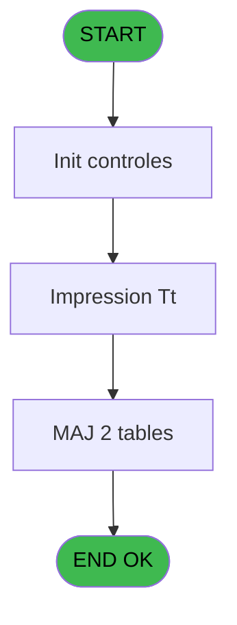
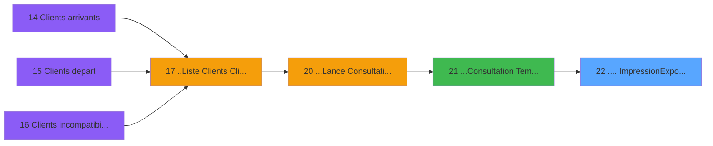

# PTR IDE 22 - .....Impression/Export Tt

> **Analyse**: Phases 1-4 2026-02-03 18:15 -> 18:16 (12s) | Assemblage 18:16
> **Pipeline**: V7.2 Enrichi
> **Structure**: 4 onglets (Resume | Ecrans | Donnees | Connexions)

<!-- TAB:Resume -->

## 1. FICHE D'IDENTITE

| Attribut | Valeur |
|----------|--------|
| Projet | PTR |
| IDE Position | 22 |
| Nom Programme | .....Impression/Export Tt |
| Fichier source | `Prg_22.xml` |
| Dossier IDE | Listes |
| Taches | 5 (1 ecrans visibles) |
| Tables modifiees | 2 |
| Programmes appeles | 1 |

## 2. DESCRIPTION FONCTIONNELLE

**.....Impression/Export Tt** assure la gestion complete de ce processus, accessible depuis [...Consultation Tempo Ecran Tt (IDE 21)](PTR-IDE-21.md).

Le flux de traitement s'organise en **2 blocs fonctionnels** :

- **Traitement** (4 taches) : traitements metier divers
- **Initialisation** (1 tache) : reinitialisation d'etats et de variables de travail

**Donnees modifiees** : 2 tables en ecriture (activite_plan_comptable_tempo, classe_monetaire_reference).

Detail : phases du traitement

#### Phase 1 : Traitement (4 taches)

- **22** - .....Impression/Export Tt **[[ECRAN]](#ecran-t1)**
- **22.1** - Un instant S.V.P. ... **[[ECRAN]](#ecran-t2)**
- **22.1.1** - Commentaire
- **22.1.2** - Lecture Totaux qualites

Delegue a : [LIST - Redirection d'un Etat (IDE 38)](PTR-IDE-38.md)

#### Phase 2 : Initialisation (1 tache)

- **22.2** - RAZ Tempo Qualites

#### Tables impactees

| Table | Operations | Role metier |
|-------|-----------|-------------|
| activite_plan_comptable_tempo | **W**/L (3 usages) | Table temporaire ecran |
| classe_monetaire_reference | **W** (1 usages) |  |

## 3. BLOCS FONCTIONNELS

### 3.1 Traitement (4 taches)

Traitements internes.

---

#### 22 - .....Impression/Export Tt [[ECRAN]](#ecran-t1)

**Role** : Generation du document : .....Impression/Export Tt.
**Ecran** : 427 x 58 DLU (MDI) | [Voir mockup](#ecran-t1)

3 sous-taches directes

| Tache | Nom | Bloc |
|-------|-----|------|
| [22.1](#t2) | Un instant S.V.P. ... **[[ECRAN]](#ecran-t2)** | Traitement |
| [22.1.1](#t3) | Commentaire | Traitement |
| [22.1.2](#t4) | Lecture Totaux qualites | Traitement |

**Delegue a** : [LIST - Redirection d'un Etat (IDE 38)](PTR-IDE-38.md)

---

#### 22.1 - Un instant S.V.P. ... [[ECRAN]](#ecran-t2)

**Role** : Traitement : Un instant S.V.P. ....
**Ecran** : 427 x 58 DLU (MDI) | [Voir mockup](#ecran-t2)
**Delegue a** : [LIST - Redirection d'un Etat (IDE 38)](PTR-IDE-38.md)

---

#### 22.1.1 - Commentaire

**Role** : Traitement : Commentaire.
**Delegue a** : [LIST - Redirection d'un Etat (IDE 38)](PTR-IDE-38.md)

---

#### 22.1.2 - Lecture Totaux qualites

**Role** : Calcul : Lecture Totaux qualites.
**Delegue a** : [LIST - Redirection d'un Etat (IDE 38)](PTR-IDE-38.md)

### 3.2 Initialisation (1 tache)

Reinitialisation d'etats et variables de travail.

---

#### 22.2 - RAZ Tempo Qualites

**Role** : Reinitialisation : RAZ Tempo Qualites.

## 5. REGLES METIER

*(Aucune regle metier identifiee)*

## 6. CONTEXTE

- **Appele par**: [...Consultation Tempo Ecran Tt (IDE 21)](PTR-IDE-21.md)
- **Appelle**: 1 programmes | **Tables**: 4 (W:2 R:1 L:2) | **Taches**: 5 | **Expressions**: 9

<!-- TAB:Ecrans -->

## 8. ECRANS

### 8.1 Forms visibles (1 / 5)

| # | Position | Tache | Nom | Type | Largeur | Hauteur | Bloc |
|---|----------|-------|-----|------|---------|---------|------|
| 1 | 22.1 | 22.1 | Un instant S.V.P. ... | MDI | 427 | 58 | Traitement |

### 8.2 Mockups Ecrans

---

#### 22.1 - Un instant S.V.P. ...
**Tache** : [22.1](#t2) | **Type** : MDI | **Dimensions** : 427 x 58 DLU
**Bloc** : Traitement | **Titre IDE** : Un instant S.V.P. ...

<!-- FORM-DATA:
{
    "width":  427,
    "vFactor":  8,
    "type":  "MDI",
    "hFactor":  8,
    "controls":  [
                     {
                         "x":  12,
                         "type":  "label",
                         "var":  "",
                         "y":  4,
                         "w":  400,
                         "fmt":  "",
                         "name":  "",
                         "h":  48,
                         "color":  "",
                         "text":  "",
                         "parent":  null
                     },
                     {
                         "x":  161,
                         "type":  "label",
                         "var":  "",
                         "y":  18,
                         "w":  221,
                         "fmt":  "",
                         "name":  "",
                         "h":  8,
                         "color":  "7",
                         "text":  "Impression en cours ...",
                         "parent":  1
                     },
                     {
                         "x":  226,
                         "type":  "edit",
                         "var":  "",
                         "y":  29,
                         "w":  37,
                         "fmt":  "",
                         "name":  "",
                         "h":  15,
                         "color":  "",
                         "text":  "",
                         "parent":  1
                     },
                     {
                         "x":  22,
                         "type":  "image",
                         "var":  "",
                         "y":  8,
                         "w":  106,
                         "fmt":  "",
                         "name":  "",
                         "h":  40,
                         "color":  "",
                         "text":  "",
                         "parent":  null
                     }
                 ],
    "taskId":  "22.1",
    "height":  58
}
-->

<strong>Champs : 1 champs</strong>

| Pos (x,y) | Nom | Variable | Type |
|-----------|-----|----------|------|
| 226,29 | (sans nom) | - | edit |

## 9. NAVIGATION

Ecran unique: **Un instant S.V.P. ...**

### 9.3 Structure hierarchique (5 taches)

| Position | Tache | Type | Dimensions | Bloc |
|----------|-------|------|------------|------|
| **22.1** | [**.....Impression/Export Tt** (22)](#t1) [mockup](#ecran-t1) | MDI | 427x58 | Traitement |
| 22.1.1 | [Un instant S.V.P. ... (22.1)](#t2) [mockup](#ecran-t2) | MDI | 427x58 | |
| 22.1.2 | [Commentaire (22.1.1)](#t3) | MDI | - | |
| 22.1.3 | [Lecture Totaux qualites (22.1.2)](#t4) | MDI | - | |
| **22.2** | [**RAZ Tempo Qualites** (22.2)](#t5) | MDI | - | Initialisation |

### 9.4 Algorigramme

> **Legende**: Vert = START/END OK | Rouge = END KO | Bleu = Decisions
> *Algorigramme auto-genere. Utiliser `/algorigramme` pour une synthese metier detaillee.*

<!-- TAB:Donnees -->

## 10. TABLES

### Tables utilisees (4)

| ID | Nom | Description | Type | R | W | L | Usages |
|----|-----|-------------|------|---|---|---|--------|
| 171 | commentaire______com |  | DB | R |   |   | 1 |
| 468 | activite_plan_comptable_tempo | Table temporaire ecran | TMP |   | **W** | L | 3 |
| 681 | classe_monetaire_reference |  | DB |   | **W** |   | 1 |
| 683 | comptes_charge_reference | Comptes GM (generaux) | DB |   |   | L | 1 |

### Colonnes par table (3 / 3 tables avec colonnes identifiees)

Table 171 - commentaire______com (R) - 1 usages

| Lettre | Variable | Acces | Type |
|--------|----------|-------|------|
| O | v.Commentaires | R | Alpha |

Table 468 - activite_plan_comptable_tempo (**W**/L) - 3 usages

| Lettre | Variable | Acces | Type |
|--------|----------|-------|------|
| A | V_Qualite 1 | W | Alpha |
| B | V_Qualite 2 | W | Alpha |
| C | V_Qualite 3 | W | Alpha |
| D | V_Qualite 4 | W | Alpha |
| E | V_Qualite 5 | W | Alpha |
| F | V_Qualite 6 | W | Alpha |
| G | V_Qualite 7 | W | Alpha |
| H | V_Qualite 8 | W | Alpha |
| I | V_Qualite 9 | W | Alpha |
| J | V_Qualite 10 | W | Alpha |
| K | V_Qualite 11 | W | Alpha |
| L | V_Qualite 12 | W | Alpha |
| M | V_Qualite 13 | W | Alpha |
| N | V_Qualite 14 | W | Alpha |
| O | V_Qualite 15 | W | Alpha |
| P | V_Qte 1 | W | Numeric |
| Q | V_Qte 2 | W | Numeric |
| R | V_Qte 3 | W | Numeric |
| S | V_Qte 4 | W | Numeric |
| T | V_Qte 5 | W | Numeric |
| U | V_Qte 6 | W | Numeric |
| V | V_Qte 7 | W | Numeric |
| W | V_Qte 8 | W | Numeric |
| X | V_Qte 9 | W | Numeric |
| Y | V_Qte 10 | W | Numeric |
| Z | V_Qte 11 | W | Numeric |
| BA | V_Qte 12 | W | Numeric |
| BB | V_Qte 13 | W | Numeric |
| BC | V_Qte 14 | W | Numeric |
| BD | V_Qte 15 | W | Numeric |

Table 681 - classe_monetaire_reference (**W**) - 1 usages

| Lettre | Variable | Acces | Type |
|--------|----------|-------|------|
| A | P_Societe | W | Alpha |
| B | P_Code Edition | W | Alpha |
| C | P_Libelle Liste | W | Alpha |
| D | P_Liste | W | Alpha |
| E | P_Village | W | Alpha |
| F | P_Date | W | Date |
| G | P_Cles acces | W | Numeric |
| H | P_Libelle Total selection | W | Alpha |
| I | P_Aperçu | W | Logical |
| J | P_Dialogue | W | Logical |
| K | W1-Boucle | W | Alpha |
| L | W1-Titre Edition | W | Alpha |
| M | W1-TOTAL SELECTION | W | Numeric |
| N | v.Export CSV | W | Alpha |
| O | v.Commentaires | W | Alpha |

## 11. VARIABLES

### 11.1 Parametres entrants (1)

Variables recues du programme appelant ([...Consultation Tempo Ecran Tt (IDE 21)](PTR-IDE-21.md)).

| Lettre | Nom | Type | Usage dans |
|--------|-----|------|-----------|
| K | P.Code user bindon | Unicode | 1x parametre entrant |

### 11.2 Variables de session (1)

Variables persistantes pendant toute la session.

| Lettre | Nom | Type | Usage dans |
|--------|-----|------|-----------|
| L | v.Export file | Alpha | - |

### 11.3 Autres (28)

Variables diverses.

| Lettre | Nom | Type | Usage dans |
|--------|-----|------|-----------|
| A | P_Societe | Alpha | - |
| B | P_Code | Alpha | - |
| C | P_Libelle Liste | Alpha | 1x refs |
| D | P_Liste | Alpha | 1x refs |
| E | P_Village | Alpha | - |
| F | P_Date | Date | 1x refs |
| G | P_Cles accès | Numeric | - |
| H | P_Libelle Total selection | Alpha | - |
| I | P_Exporter | Logical | - |
| J | P_Exporter détail vol | Logical | - |
| M | V_Aperçu | Logical | - |
| N | V_Dialogue | Logical | - |
| O | V_Impression | Logical | - |
| P | W0-Titre Edition | Alpha | - |
| Q | V_Qte 2 | Numeric | - |
| R | V_Qte 3 | Numeric | - |
| S | V_Qte 4 | Numeric | - |
| T | V_Qte 5 | Numeric | - |
| U | V_Qte 6 | Numeric | - |
| V | V_Qte 7 | Numeric | - |
| W | V_Qte 8 | Numeric | - |
| X | V_Qte 9 | Numeric | 2x refs |
| Y | V_Qte 10 | Numeric | 3x refs |
| Z | V_Qte 11 | Numeric | - |
| BA | V_Qte 12 | Numeric | - |
| BB | V_Qte 13 | Numeric | - |
| BC | V_Qte 14 | Numeric | - |
| BD | V_Qte 15 | Numeric | - |

Toutes les 30 variables (liste complete)

| Cat | Lettre | Nom Variable | Type |
|-----|--------|--------------|------|
| P0 | **K** | P.Code user bindon | Unicode |
| V. | **L** | v.Export file | Alpha |
| Autre | **A** | P_Societe | Alpha |
| Autre | **B** | P_Code | Alpha |
| Autre | **C** | P_Libelle Liste | Alpha |
| Autre | **D** | P_Liste | Alpha |
| Autre | **E** | P_Village | Alpha |
| Autre | **F** | P_Date | Date |
| Autre | **G** | P_Cles accès | Numeric |
| Autre | **H** | P_Libelle Total selection | Alpha |
| Autre | **I** | P_Exporter | Logical |
| Autre | **J** | P_Exporter détail vol | Logical |
| Autre | **M** | V_Aperçu | Logical |
| Autre | **N** | V_Dialogue | Logical |
| Autre | **O** | V_Impression | Logical |
| Autre | **P** | W0-Titre Edition | Alpha |
| Autre | **Q** | V_Qte 2 | Numeric |
| Autre | **R** | V_Qte 3 | Numeric |
| Autre | **S** | V_Qte 4 | Numeric |
| Autre | **T** | V_Qte 5 | Numeric |
| Autre | **U** | V_Qte 6 | Numeric |
| Autre | **V** | V_Qte 7 | Numeric |
| Autre | **W** | V_Qte 8 | Numeric |
| Autre | **X** | V_Qte 9 | Numeric |
| Autre | **Y** | V_Qte 10 | Numeric |
| Autre | **Z** | V_Qte 11 | Numeric |
| Autre | **BA** | V_Qte 12 | Numeric |
| Autre | **BB** | V_Qte 13 | Numeric |
| Autre | **BC** | V_Qte 14 | Numeric |
| Autre | **BD** | V_Qte 15 | Numeric |

## 12. EXPRESSIONS

**9 / 9 expressions decodees (100%)**

### 12.1 Repartition par type

| Type | Expressions | Regles |
|------|-------------|--------|
| CONCATENATION | 1 | 0 |
| FORMAT | 2 | 0 |
| OTHER | 5 | 0 |
| NEGATION | 1 | 0 |

### 12.2 Expressions cles par type

#### CONCATENATION (1 expressions)

| Type | IDE | Expression | Regle |
|------|-----|------------|-------|
| CONCATENATION | 5 | `MlsTrans ('LISTE DES')&' '&IF (P_Libelle Liste [C]=MlsTrans ('ERREURS'),'',Trim (P_Libelle Liste [C])&' '&Trim (P_Liste [D])&' '&MlsTrans ('LE')&' '&DStr (P_Date [F],'DD/MM/YYYY'))` | - |

#### FORMAT (2 expressions)

| Type | IDE | Expression | Regle |
|------|-----|------------|-------|
| FORMAT | 9 | `RepStr(V_Qte 9 [X], '  ', ' ')` | - |
| FORMAT | 7 | `Translate('%club_exportdata%')&RepStr(RepStr(Trim(V_Qte 9 [X]), ' ', '_'), '/', '')&'_'&DStr(Date(),'YYYYMMDD')&'_'&TStr(Time(),'HHMMSS')&'.csv'` | - |

#### OTHER (5 expressions)

| Type | IDE | Expression | Regle |
|------|-----|------------|-------|
| OTHER | 6 | `V_Qte 10 [Y]` | - |
| OTHER | 8 | `[AA]` | - |
| OTHER | 3 | `P.Code user bindon [K] OR V_Qte 10 [Y]` | - |
| OTHER | 1 | `SetCrsr (1)` | - |
| OTHER | 2 | `SetCrsr (2)` | - |

#### NEGATION (1 expressions)

| Type | IDE | Expression | Regle |
|------|-----|------------|-------|
| NEGATION | 4 | `NOT V_Qte 10 [Y]` | - |

<!-- TAB:Connexions -->

## 13. GRAPHE D'APPELS

### 13.1 Chaine depuis Main (Callers)

Main -> ... -> [...Consultation Tempo Ecran Tt (IDE 21)](PTR-IDE-21.md) -> **.....Impression/Export Tt (IDE 22)**

### 13.2 Callers

| IDE | Nom Programme | Nb Appels |
|-----|---------------|-----------|
| [21](PTR-IDE-21.md) | ...Consultation Tempo Ecran Tt | 2 |

### 13.3 Callees (programmes appeles)

### 13.4 Detail Callees avec contexte

| IDE | Nom Programme | Appels | Contexte |
|-----|---------------|--------|----------|
| [38](PTR-IDE-38.md) | LIST - Redirection d'un Etat | 1 | Configuration impression |

## 14. RECOMMANDATIONS MIGRATION

### 14.1 Profil du programme

| Metrique | Valeur | Impact migration |
|----------|--------|-----------------|
| Lignes de logique | 326 | Taille moyenne |
| Expressions | 9 | Peu de logique |
| Tables WRITE | 2 | Impact faible |
| Sous-programmes | 1 | Peu de dependances |
| Ecrans visibles | 1 | Ecran unique ou traitement batch |
| Code desactive | 0% (0 / 326) | Code sain |
| Regles metier | 0 | Pas de regle identifiee |

### 14.2 Plan de migration par bloc

#### Traitement (4 taches: 2 ecrans, 2 traitements)

- **Strategie** : Orchestrateur avec 2 ecrans (Razor/React) et 2 traitements backend (services).
- Les ecrans deviennent des composants UI, les traitements invisibles deviennent des services injectables.
- 1 sous-programme(s) a migrer ou a reutiliser depuis les services existants.
- Decomposer les taches en services unitaires testables.

#### Initialisation (1 tache: 0 ecran, 1 traitement)

- **Strategie** : Constructeur/methode `InitAsync()` dans l'orchestrateur.

### 14.3 Dependances critiques

| Dependance | Type | Appels | Impact |
|------------|------|--------|--------|
| activite_plan_comptable_tempo | Table WRITE (Temp) | 2x | Schema + repository |
| classe_monetaire_reference | Table WRITE (Database) | 1x | Schema + repository |
| [LIST - Redirection d'un Etat (IDE 38)](PTR-IDE-38.md) | Sous-programme | 1x | Normale - Configuration impression |

---
*Spec DETAILED generee par Pipeline V7.2 - 2026-02-03 18:16*
