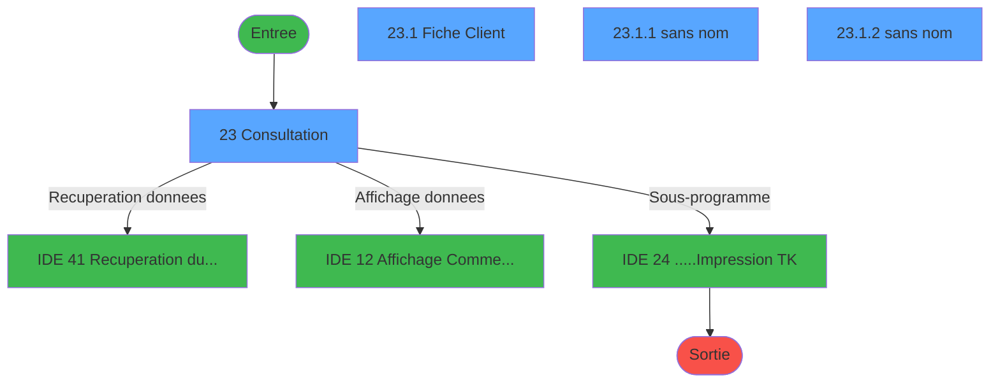
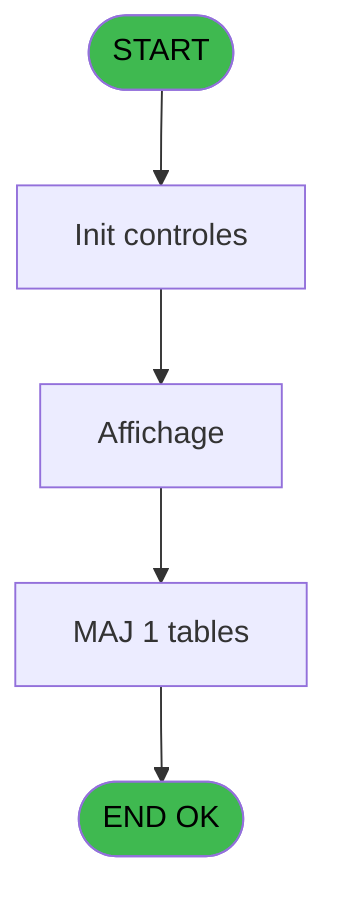
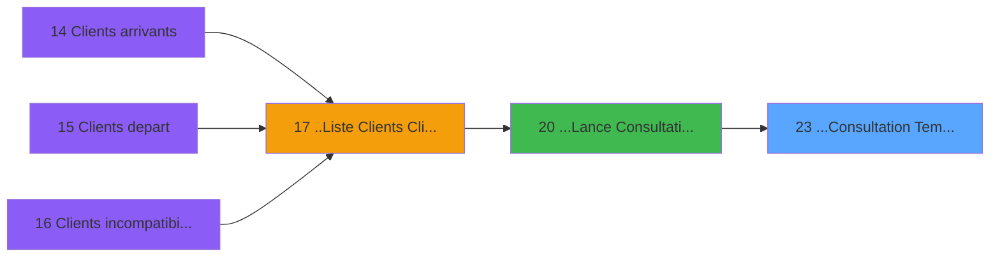
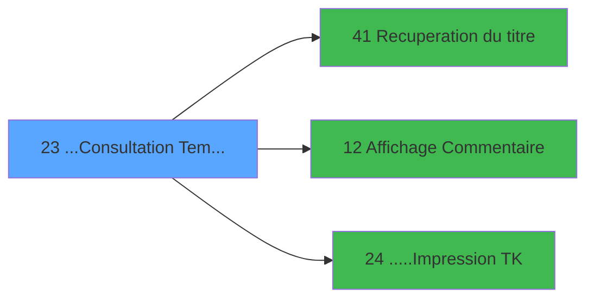

# PTR IDE 23 - ...Consultation Tempo Ecran TK

> **Analyse**: Phases 1-4 2026-02-03 18:16 -> 18:16 (15s) | Assemblage 18:16
> **Pipeline**: V7.2 Enrichi
> **Structure**: 4 onglets (Resume | Ecrans | Donnees | Connexions)

<!-- TAB:Resume -->

## 1. FICHE D'IDENTITE

| Attribut | Valeur |
|----------|--------|
| Projet | PTR |
| IDE Position | 23 |
| Nom Programme | ...Consultation Tempo Ecran TK |
| Fichier source | `Prg_23.xml` |
| Dossier IDE | Listes |
| Taches | 4 (4 ecrans visibles) |
| Tables modifiees | 1 |
| Programmes appeles | 3 |

## 2. DESCRIPTION FONCTIONNELLE

**...Consultation Tempo Ecran TK** assure la gestion complete de ce processus, accessible depuis [...Lance Consultation Ecran (IDE 20)](PTR-IDE-20.md).

Le flux de traitement s'organise en **1 blocs fonctionnels** :

- **Traitement** (4 taches) : traitements metier divers

**Donnees modifiees** : 1 tables en ecriture (gm-complet_______gmc).

**Logique metier** : 2 regles identifiees couvrant conditions metier, valeurs par defaut.

Detail : phases du traitement

#### Phase 1 : Traitement (4 taches)

- **23** - Consultation **[[ECRAN]](#ecran-t1)**
- **23.1** - Fiche Client **[[ECRAN]](#ecran-t2)**
- **23.1.1** - (sans nom) **[[ECRAN]](#ecran-t3)**
- **23.1.2** - (sans nom) **[[ECRAN]](#ecran-t4)**

Delegue a : [Recuperation du titre (IDE 41)](PTR-IDE-41.md), [.....Impression TK (IDE 24)](PTR-IDE-24.md)

#### Tables impactees

| Table | Operations | Role metier |
|-------|-----------|-------------|
| gm-complet_______gmc | R/**W** (2 usages) |  |

## 3. BLOCS FONCTIONNELS

### 3.1 Traitement (4 taches)

Traitements internes.

---

#### 23 - Consultation [[ECRAN]](#ecran-t1)

**Role** : Consultation/chargement : Consultation.
**Ecran** : 1264 x 322 DLU (MDI) | [Voir mockup](#ecran-t1)

3 sous-taches directes

| Tache | Nom | Bloc |
|-------|-----|------|
| [23.1](#t2) | Fiche Client **[[ECRAN]](#ecran-t2)** | Traitement |
| [23.1.1](#t3) | (sans nom) **[[ECRAN]](#ecran-t3)** | Traitement |
| [23.1.2](#t4) | (sans nom) **[[ECRAN]](#ecran-t4)** | Traitement |

**Delegue a** : [Recuperation du titre (IDE 41)](PTR-IDE-41.md), [.....Impression TK (IDE 24)](PTR-IDE-24.md)

---

#### 23.1 - Fiche Client [[ECRAN]](#ecran-t2)

**Role** : Traitement : Fiche Client.
**Ecran** : 907 x 297 DLU (MDI) | [Voir mockup](#ecran-t2)
**Delegue a** : [Recuperation du titre (IDE 41)](PTR-IDE-41.md), [.....Impression TK (IDE 24)](PTR-IDE-24.md)

---

#### 23.1.1 - (sans nom) [[ECRAN]](#ecran-t3)

**Role** : Traitement interne.
**Ecran** : 906 x 70 DLU (Modal) | [Voir mockup](#ecran-t3)
**Delegue a** : [Recuperation du titre (IDE 41)](PTR-IDE-41.md), [.....Impression TK (IDE 24)](PTR-IDE-24.md)

---

#### 23.1.2 - (sans nom) [[ECRAN]](#ecran-t4)

**Role** : Traitement interne.
**Ecran** : 898 x 55 DLU (Modal) | [Voir mockup](#ecran-t4)
**Delegue a** : [Recuperation du titre (IDE 41)](PTR-IDE-41.md), [.....Impression TK (IDE 24)](PTR-IDE-24.md)

## 5. REGLES METIER

2 regles identifiees:

### Autres (2 regles)

#### [RM-001] Valeur par defaut si P0-Societe [A] est vide

| Element | Detail |
|---------|--------|
| **Condition** | `P0-Societe [A]=''` |
| **Si vrai** | 'C' |
| **Si faux** | P0-Societe [A]) |
| **Variables** | A (P0-Societe) |
| **Expression source** | Expression 9 : `IF (P0-Societe [A]='','C',P0-Societe [A])` |
| **Exemple** | Si P0-Societe [A]='' → 'C'. Sinon → P0-Societe [A]) |

#### [RM-002] Si InStr (P0-Liste Cpt [C] alors 'DEPART')>0 sinon MlsTrans ('Part de'),MlsTrans ('Arrive à'))

| Element | Detail |
|---------|--------|
| **Condition** | `InStr (P0-Liste Cpt [C]` |
| **Si vrai** | 'DEPART')>0 |
| **Si faux** | MlsTrans ('Part de'),MlsTrans ('Arrive à')) |
| **Variables** | C (P0-Liste Cpt), E (P0-Liste) |
| **Expression source** | Expression 10 : `IF (InStr (P0-Liste Cpt [C],'DEPART')>0,MlsTrans ('Part de')` |
| **Exemple** | Si InStr (P0-Liste Cpt [C] → 'DEPART')>0. Sinon → MlsTrans ('Part de'),MlsTrans ('Arrive à')) |

## 6. CONTEXTE

- **Appele par**: [...Lance Consultation Ecran (IDE 20)](PTR-IDE-20.md)
- **Appelle**: 3 programmes | **Tables**: 8 (W:1 R:3 L:7) | **Taches**: 4 | **Expressions**: 22

<!-- TAB:Ecrans -->

## 8. ECRANS

### 8.1 Forms visibles (4 / 4)

| # | Position | Tache | Nom | Type | Largeur | Hauteur | Bloc |
|---|----------|-------|-----|------|---------|---------|------|
| 1 | 23 | 23 | Consultation | MDI | 1264 | 322 | Traitement |
| 2 | 23.1 | 23.1 | Fiche Client | MDI | 907 | 297 | Traitement |
| 3 | 23.1.1 | 23.1.1 | (sans nom) | Modal | 906 | 70 | Traitement |
| 4 | 23.1.2 | 23.1.2 | (sans nom) | Modal | 898 | 55 | Traitement |

### 8.2 Mockups Ecrans

---

#### 23 - Consultation
**Tache** : [23](#t1) | **Type** : MDI | **Dimensions** : 1264 x 322 DLU
**Bloc** : Traitement | **Titre IDE** : Consultation

<!-- FORM-DATA:
{
    "width":  1264,
    "vFactor":  8,
    "type":  "MDI",
    "hFactor":  8,
    "controls":  [
                     {
                         "x":  0,
                         "type":  "label",
                         "var":  "",
                         "y":  0,
                         "w":  1261,
                         "fmt":  "",
                         "name":  "",
                         "h":  20,
                         "color":  "",
                         "text":  "",
                         "parent":  null
                     },
                     {
                         "x":  1083,
                         "type":  "label",
                         "var":  "",
                         "y":  43,
                         "w":  178,
                         "fmt":  "",
                         "name":  "",
                         "h":  245,
                         "color":  "",
                         "text":  "",
                         "parent":  null
                     },
                     {
                         "x":  2,
                         "type":  "label",
                         "var":  "",
                         "y":  41,
                         "w":  1068,
                         "fmt":  "",
                         "name":  "",
                         "h":  17,
                         "color":  "",
                         "text":  "",
                         "parent":  null
                     },
                     {
                         "x":  0,
                         "type":  "table",
                         "var":  "",
                         "name":  "",
                         "titleH":  12,
                         "color":  "110",
                         "w":  1078,
                         "y":  60,
                         "fmt":  "",
                         "parent":  null,
                         "text":  "",
                         "rowH":  13,
                         "h":  181,
                         "cols":  [
                                      {
                                          "title":  "Nom",
                                          "layer":  1,
                                          "w":  207
                                      },
                                      {
                                          "title":  "Prénom",
                                          "layer":  2,
                                          "w":  160
                                      },
                                      {
                                          "title":  "Sexe",
                                          "layer":  3,
                                          "w":  63
                                      },
                                      {
                                          "title":  "Date Naissance",
                                          "layer":  4,
                                          "w":  170
                                      },
                                      {
                                          "title":  "Nat.",
                                          "layer":  5,
                                          "w":  69
                                      },
                                      {
                                          "title":  "Qualité",
                                          "layer":  6,
                                          "w":  127
                                      },
                                      {
                                          "title":  "N° Dossier",
                                          "layer":  7,
                                          "w":  162
                                      },
                                      {
                                          "title":  "N° Ordre",
                                          "layer":  8,
                                          "w":  86
                                      }
                                  ],
                         "rows":  8
                     },
                     {
                         "x":  2,
                         "type":  "label",
                         "var":  "",
                         "y":  242,
                         "w":  536,
                         "fmt":  "",
                         "name":  "",
                         "h":  46,
                         "color":  "",
                         "text":  "",
                         "parent":  null
                     },
                     {
                         "x":  543,
                         "type":  "label",
                         "var":  "",
                         "y":  242,
                         "w":  530,
                         "fmt":  "",
                         "name":  "",
                         "h":  46,
                         "color":  "",
                         "text":  "",
                         "parent":  null
                     },
                     {
                         "x":  606,
                         "type":  "label",
                         "var":  "",
                         "y":  252,
                         "w":  112,
                         "fmt":  "",
                         "name":  "",
                         "h":  8,
                         "color":  "",
                         "text":  "N° Passeport",
                         "parent":  27
                     },
                     {
                         "x":  22,
                         "type":  "label",
                         "var":  "",
                         "y":  261,
                         "w":  42,
                         "fmt":  "",
                         "name":  "",
                         "h":  9,
                         "color":  "",
                         "text":  "Vol",
                         "parent":  26
                     },
                     {
                         "x":  160,
                         "type":  "label",
                         "var":  "",
                         "y":  261,
                         "w":  27,
                         "fmt":  "",
                         "name":  "",
                         "h":  8,
                         "color":  "",
                         "text":  "du",
                         "parent":  26
                     },
                     {
                         "x":  606,
                         "type":  "label",
                         "var":  "",
                         "y":  270,
                         "w":  82,
                         "fmt":  "",
                         "name":  "",
                         "h":  8,
                         "color":  "",
                         "text":  "Expire le",
                         "parent":  27
                     },
                     {
                         "x":  0,
                         "type":  "label",
                         "var":  "",
                         "y":  292,
                         "w":  1260,
                         "fmt":  "",
                         "name":  "",
                         "h":  24,
                         "color":  "",
                         "text":  "",
                         "parent":  null
                     },
                     {
                         "x":  2,
                         "type":  "label",
                         "var":  "",
                         "y":  23,
                         "w":  1261,
                         "fmt":  "",
                         "name":  "",
                         "h":  18,
                         "color":  "",
                         "text":  "",
                         "parent":  null
                     },
                     {
                         "x":  6,
                         "type":  "label",
                         "var":  "",
                         "y":  28,
                         "w":  131,
                         "fmt":  "",
                         "name":  "",
                         "h":  9,
                         "color":  "",
                         "text":  "Lieu de séjour",
                         "parent":  107
                     },
                     {
                         "x":  227,
                         "type":  "edit",
                         "var":  "",
                         "y":  248,
                         "w":  45,
                         "fmt":  "",
                         "name":  "",
                         "h":  9,
                         "color":  "",
                         "text":  "",
                         "parent":  26
                     },
                     {
                         "x":  421,
                         "type":  "edit",
                         "var":  "",
                         "y":  47,
                         "w":  88,
                         "fmt":  "",
                         "name":  "",
                         "h":  8,
                         "color":  "7",
                         "text":  "",
                         "parent":  5
                     },
                     {
                         "x":  10,
                         "type":  "edit",
                         "var":  "",
                         "y":  76,
                         "w":  176,
                         "fmt":  "",
                         "name":  "",
                         "h":  8,
                         "color":  "110",
                         "text":  "",
                         "parent":  8
                     },
                     {
                         "x":  238,
                         "type":  "edit",
                         "var":  "",
                         "y":  76,
                         "w":  109,
                         "fmt":  "UX8",
                         "name":  "",
                         "h":  8,
                         "color":  "110",
                         "text":  "",
                         "parent":  8
                     },
                     {
                         "x":  387,
                         "type":  "edit",
                         "var":  "",
                         "y":  76,
                         "w":  30,
                         "fmt":  "",
                         "name":  "",
                         "h":  8,
                         "color":  "110",
                         "text":  "",
                         "parent":  8
                     },
                     {
                         "x":  691,
                         "type":  "edit",
                         "var":  "",
                         "y":  76,
                         "w":  98,
                         "fmt":  "",
                         "name":  "",
                         "h":  8,
                         "color":  "110",
                         "text":  "",
                         "parent":  8
                     },
                     {
                         "x":  621,
                         "type":  "edit",
                         "var":  "",
                         "y":  76,
                         "w":  30,
                         "fmt":  "",
                         "name":  "",
                         "h":  8,
                         "color":  "110",
                         "text":  "",
                         "parent":  8
                     },
                     {
                         "x":  454,
                         "type":  "edit",
                         "var":  "",
                         "y":  76,
                         "w":  120,
                         "fmt":  "DD/MM/YYYYZ",
                         "name":  "",
                         "h":  8,
                         "color":  "110",
                         "text":  "",
                         "parent":  8
                     },
                     {
                         "x":  718,
                         "type":  "edit",
                         "var":  "",
                         "y":  252,
                         "w":  347,
                         "fmt":  "",
                         "name":  "",
                         "h":  9,
                         "color":  "",
                         "text":  "",
                         "parent":  27
                     },
                     {
                         "x":  718,
                         "type":  "edit",
                         "var":  "",
                         "y":  270,
                         "w":  123,
                         "fmt":  "DD/MM/YYYYZ",
                         "name":  "",
                         "h":  9,
                         "color":  "",
                         "text":  "",
                         "parent":  27
                     },
                     {
                         "x":  821,
                         "type":  "edit",
                         "var":  "",
                         "y":  76,
                         "w":  109,
                         "fmt":  "#9P0",
                         "name":  "",
                         "h":  8,
                         "color":  "110",
                         "text":  "",
                         "parent":  8
                     },
                     {
                         "x":  978,
                         "type":  "edit",
                         "var":  "",
                         "y":  76,
                         "w":  42,
                         "fmt":  "#3P0",
                         "name":  "",
                         "h":  8,
                         "color":  "110",
                         "text":  "",
                         "parent":  8
                     },
                     {
                         "x":  70,
                         "type":  "edit",
                         "var":  "",
                         "y":  261,
                         "w":  78,
                         "fmt":  "30",
                         "name":  "",
                         "h":  9,
                         "color":  "",
                         "text":  "",
                         "parent":  26
                     },
                     {
                         "x":  227,
                         "type":  "edit",
                         "var":  "",
                         "y":  261,
                         "w":  123,
                         "fmt":  "DD/MM/YYYYZ",
                         "name":  "",
                         "h":  9,
                         "color":  "",
                         "text":  "",
                         "parent":  26
                     },
                     {
                         "x":  363,
                         "type":  "edit",
                         "var":  "",
                         "y":  261,
                         "w":  67,
                         "fmt":  "HH:MMZ",
                         "name":  "",
                         "h":  9,
                         "color":  "",
                         "text":  "",
                         "parent":  26
                     },
                     {
                         "x":  227,
                         "type":  "edit",
                         "var":  "",
                         "y":  274,
                         "w":  78,
                         "fmt":  "",
                         "name":  "",
                         "h":  9,
                         "color":  "",
                         "text":  "",
                         "parent":  26
                     },
                     {
                         "x":  506,
                         "type":  "edit",
                         "var":  "",
                         "y":  47,
                         "w":  75,
                         "fmt":  "",
                         "name":  "",
                         "h":  8,
                         "color":  "7",
                         "text":  "",
                         "parent":  5
                     },
                     {
                         "x":  6,
                         "type":  "edit",
                         "var":  "",
                         "y":  6,
                         "w":  396,
                         "fmt":  "30",
                         "name":  "",
                         "h":  8,
                         "color":  "",
                         "text":  "",
                         "parent":  1
                     },
                     {
                         "x":  978,
                         "type":  "edit",
                         "var":  "",
                         "y":  6,
                         "w":  268,
                         "fmt":  "WWW DD MMM YYYYT",
                         "name":  "",
                         "h":  8,
                         "color":  "",
                         "text":  "",
                         "parent":  1
                     },
                     {
                         "x":  1086,
                         "type":  "image",
                         "var":  "",
                         "y":  106,
                         "w":  169,
                         "fmt":  "",
                         "name":  "",
                         "h":  73,
                         "color":  "",
                         "text":  "",
                         "parent":  null
                     },
                     {
                         "x":  22,
                         "type":  "edit",
                         "var":  "",
                         "y":  248,
                         "w":  101,
                         "fmt":  "8",
                         "name":  "",
                         "h":  9,
                         "color":  "",
                         "text":  "",
                         "parent":  26
                     },
                     {
                         "x":  22,
                         "type":  "edit",
                         "var":  "",
                         "y":  274,
                         "w":  190,
                         "fmt":  "16",
                         "name":  "",
                         "h":  9,
                         "color":  "",
                         "text":  "",
                         "parent":  26
                     },
                     {
                         "x":  1097,
                         "type":  "button",
                         "var":  "",
                         "y":  207,
                         "w":  154,
                         "fmt":  "\u0026Voir",
                         "name":  "",
                         "h":  18,
                         "color":  "",
                         "text":  "",
                         "parent":  41
                     },
                     {
                         "x":  1097,
                         "type":  "button",
                         "var":  "",
                         "y":  235,
                         "w":  154,
                         "fmt":  "\u0026Impression",
                         "name":  "",
                         "h":  18,
                         "color":  "",
                         "text":  "",
                         "parent":  41
                     },
                     {
                         "x":  6,
                         "type":  "button",
                         "var":  "",
                         "y":  295,
                         "w":  154,
                         "fmt":  "\u0026Quitter",
                         "name":  "",
                         "h":  18,
                         "color":  "",
                         "text":  "",
                         "parent":  41
                     },
                     {
                         "x":  1092,
                         "type":  "button",
                         "var":  "",
                         "y":  295,
                         "w":  154,
                         "fmt":  "\u0026Commentaire",
                         "name":  "",
                         "h":  18,
                         "color":  "",
                         "text":  "",
                         "parent":  41
                     },
                     {
                         "x":  162,
                         "type":  "edit",
                         "var":  "",
                         "y":  28,
                         "w":  230,
                         "fmt":  "",
                         "name":  "nom_import",
                         "h":  9,
                         "color":  "",
                         "text":  "",
                         "parent":  107
                     }
                 ],
    "taskId":  "23",
    "height":  322
}
-->

<strong>Champs : 22 champs</strong>

| Pos (x,y) | Nom | Variable | Type |
|-----------|-----|----------|------|
| 227,248 | (sans nom) | - | edit |
| 421,47 | (sans nom) | - | edit |
| 10,76 | (sans nom) | - | edit |
| 238,76 | UX8 | - | edit |
| 387,76 | (sans nom) | - | edit |
| 691,76 | (sans nom) | - | edit |
| 621,76 | (sans nom) | - | edit |
| 454,76 | DD/MM/YYYYZ | - | edit |
| 718,252 | (sans nom) | - | edit |
| 718,270 | DD/MM/YYYYZ | - | edit |
| 821,76 | #9P0 | - | edit |
| 978,76 | #3P0 | - | edit |
| 70,261 | 30 | - | edit |
| 227,261 | DD/MM/YYYYZ | - | edit |
| 363,261 | HH:MMZ | - | edit |
| 227,274 | (sans nom) | - | edit |
| 506,47 | (sans nom) | - | edit |
| 6,6 | 30 | - | edit |
| 978,6 | WWW DD MMM YYYYT | - | edit |
| 22,248 | 8 | - | edit |
| 22,274 | 16 | - | edit |
| 162,28 | nom_import | - | edit |

<strong>Boutons : 4 boutons</strong>

| Bouton | Pos (x,y) | Action |
|--------|-----------|--------|
| Voir | 1097,207 | Bouton fonctionnel |
| Impression | 1097,235 | Appel [.....Impression TK (IDE 24)](PTR-IDE-24.md) |
| Quitter | 6,295 | Quitte le programme |
| Commentaire | 1092,295 | Appel [Affichage Commentaire (IDE 12)](PTR-IDE-12.md) |

---

#### 23.1 - Fiche Client
**Tache** : [23.1](#t2) | **Type** : MDI | **Dimensions** : 907 x 297 DLU
**Bloc** : Traitement | **Titre IDE** : Fiche Client

<!-- FORM-DATA:
{
    "width":  907,
    "vFactor":  8,
    "type":  "MDI",
    "hFactor":  8,
    "controls":  [
                     {
                         "x":  6,
                         "type":  "label",
                         "var":  "",
                         "y":  4,
                         "w":  898,
                         "fmt":  "",
                         "name":  "",
                         "h":  68,
                         "color":  "195",
                         "text":  "Identification",
                         "parent":  null
                     },
                     {
                         "x":  25,
                         "type":  "label",
                         "var":  "",
                         "y":  27,
                         "w":  101,
                         "fmt":  "",
                         "name":  "",
                         "h":  8,
                         "color":  "",
                         "text":  "N° Adhérent",
                         "parent":  1
                     },
                     {
                         "x":  25,
                         "type":  "label",
                         "var":  "",
                         "y":  37,
                         "w":  101,
                         "fmt":  "",
                         "name":  "",
                         "h":  8,
                         "color":  "",
                         "text":  "Naissance",
                         "parent":  1
                     },
                     {
                         "x":  25,
                         "type":  "label",
                         "var":  "",
                         "y":  53,
                         "w":  101,
                         "fmt":  "",
                         "name":  "",
                         "h":  8,
                         "color":  "",
                         "text":  "Identité",
                         "parent":  1
                     },
                     {
                         "x":  6,
                         "type":  "label",
                         "var":  "",
                         "y":  73,
                         "w":  898,
                         "fmt":  "",
                         "name":  "",
                         "h":  50,
                         "color":  "195",
                         "text":  "Adresse",
                         "parent":  null
                     },
                     {
                         "x":  0,
                         "type":  "label",
                         "var":  "",
                         "y":  194,
                         "w":  906,
                         "fmt":  "",
                         "name":  "",
                         "h":  69,
                         "color":  "195",
                         "text":  "Prestations",
                         "parent":  null
                     },
                     {
                         "x":  0,
                         "type":  "label",
                         "var":  "",
                         "y":  270,
                         "w":  906,
                         "fmt":  "",
                         "name":  "",
                         "h":  24,
                         "color":  "",
                         "text":  "",
                         "parent":  null
                     },
                     {
                         "x":  153,
                         "type":  "edit",
                         "var":  "",
                         "y":  15,
                         "w":  34,
                         "fmt":  "",
                         "name":  "",
                         "h":  9,
                         "color":  "7",
                         "text":  "",
                         "parent":  1
                     },
                     {
                         "x":  153,
                         "type":  "edit",
                         "var":  "",
                         "y":  26,
                         "w":  26,
                         "fmt":  "",
                         "name":  "",
                         "h":  10,
                         "color":  "",
                         "text":  "",
                         "parent":  1
                     },
                     {
                         "x":  195,
                         "type":  "edit",
                         "var":  "",
                         "y":  26,
                         "w":  126,
                         "fmt":  "",
                         "name":  "",
                         "h":  10,
                         "color":  "",
                         "text":  "",
                         "parent":  1
                     },
                     {
                         "x":  323,
                         "type":  "edit",
                         "var":  "",
                         "y":  26,
                         "w":  48,
                         "fmt":  "",
                         "name":  "",
                         "h":  10,
                         "color":  "",
                         "text":  "",
                         "parent":  1
                     },
                     {
                         "x":  153,
                         "type":  "edit",
                         "var":  "",
                         "y":  38,
                         "w":  126,
                         "fmt":  "DD/MM/YYYYZ",
                         "name":  "",
                         "h":  10,
                         "color":  "",
                         "text":  "",
                         "parent":  1
                     },
                     {
                         "x":  278,
                         "type":  "edit",
                         "var":  "",
                         "y":  38,
                         "w":  406,
                         "fmt":  "",
                         "name":  "",
                         "h":  10,
                         "color":  "",
                         "text":  "",
                         "parent":  1
                     },
                     {
                         "x":  694,
                         "type":  "edit",
                         "var":  "",
                         "y":  39,
                         "w":  48,
                         "fmt":  "",
                         "name":  "",
                         "h":  10,
                         "color":  "",
                         "text":  "",
                         "parent":  1
                     },
                     {
                         "x":  153,
                         "type":  "edit",
                         "var":  "",
                         "y":  53,
                         "w":  26,
                         "fmt":  "",
                         "name":  "",
                         "h":  10,
                         "color":  "",
                         "text":  "",
                         "parent":  1
                     },
                     {
                         "x":  184,
                         "type":  "edit",
                         "var":  "",
                         "y":  53,
                         "w":  350,
                         "fmt":  "",
                         "name":  "",
                         "h":  10,
                         "color":  "",
                         "text":  "",
                         "parent":  1
                     },
                     {
                         "x":  551,
                         "type":  "edit",
                         "var":  "",
                         "y":  53,
                         "w":  126,
                         "fmt":  "DD/MM/YYYYZ",
                         "name":  "",
                         "h":  10,
                         "color":  "",
                         "text":  "",
                         "parent":  1
                     },
                     {
                         "x":  694,
                         "type":  "edit",
                         "var":  "",
                         "y":  53,
                         "w":  126,
                         "fmt":  "DD/MM/YYYYZ",
                         "name":  "",
                         "h":  10,
                         "color":  "",
                         "text":  "",
                         "parent":  1
                     },
                     {
                         "x":  138,
                         "type":  "edit",
                         "var":  "",
                         "y":  94,
                         "w":  483,
                         "fmt":  "",
                         "name":  "",
                         "h":  9,
                         "color":  "",
                         "text":  "",
                         "parent":  17
                     },
                     {
                         "x":  138,
                         "type":  "edit",
                         "var":  "",
                         "y":  106,
                         "w":  123,
                         "fmt":  "",
                         "name":  "",
                         "h":  9,
                         "color":  "",
                         "text":  "",
                         "parent":  17
                     },
                     {
                         "x":  274,
                         "type":  "edit",
                         "var":  "",
                         "y":  106,
                         "w":  347,
                         "fmt":  "",
                         "name":  "",
                         "h":  9,
                         "color":  "",
                         "text":  "",
                         "parent":  17
                     },
                     {
                         "x":  138,
                         "type":  "edit",
                         "var":  "",
                         "y":  82,
                         "w":  123,
                         "fmt":  "",
                         "name":  "",
                         "h":  9,
                         "color":  "",
                         "text":  "",
                         "parent":  17
                     },
                     {
                         "x":  274,
                         "type":  "edit",
                         "var":  "",
                         "y":  82,
                         "w":  347,
                         "fmt":  "",
                         "name":  "",
                         "h":  9,
                         "color":  "",
                         "text":  "",
                         "parent":  17
                     },
                     {
                         "x":  648,
                         "type":  "image",
                         "var":  "",
                         "y":  79,
                         "w":  160,
                         "fmt":  "",
                         "name":  "",
                         "h":  42,
                         "color":  "",
                         "text":  "",
                         "parent":  17
                     },
                     {
                         "x":  6,
                         "type":  "button",
                         "var":  "",
                         "y":  273,
                         "w":  154,
                         "fmt":  "\u0026Quitter",
                         "name":  "",
                         "h":  18,
                         "color":  "",
                         "text":  "",
                         "parent":  25
                     },
                     {
                         "x":  195,
                         "type":  "edit",
                         "var":  "",
                         "y":  15,
                         "w":  627,
                         "fmt":  "55",
                         "name":  "",
                         "h":  9,
                         "color":  "7",
                         "text":  "",
                         "parent":  1
                     }
                 ],
    "taskId":  "23.1",
    "height":  297
}
-->

<strong>Champs : 17 champs</strong>

| Pos (x,y) | Nom | Variable | Type |
|-----------|-----|----------|------|
| 153,15 | (sans nom) | - | edit |
| 153,26 | (sans nom) | - | edit |
| 195,26 | (sans nom) | - | edit |
| 323,26 | (sans nom) | - | edit |
| 153,38 | DD/MM/YYYYZ | - | edit |
| 278,38 | (sans nom) | - | edit |
| 694,39 | (sans nom) | - | edit |
| 153,53 | (sans nom) | - | edit |
| 184,53 | (sans nom) | - | edit |
| 551,53 | DD/MM/YYYYZ | - | edit |
| 694,53 | DD/MM/YYYYZ | - | edit |
| 138,94 | (sans nom) | - | edit |
| 138,106 | (sans nom) | - | edit |
| 274,106 | (sans nom) | - | edit |
| 138,82 | (sans nom) | - | edit |
| 274,82 | (sans nom) | - | edit |
| 195,15 | 55 | - | edit |

<strong>Boutons : 1 boutons</strong>

| Bouton | Pos (x,y) | Action |
|--------|-----------|--------|
| Quitter | 6,273 | Quitte le programme |

---

#### 23.1.1 - (sans nom)
**Tache** : [23.1.1](#t3) | **Type** : Modal | **Dimensions** : 906 x 70 DLU
**Bloc** : Traitement | **Titre IDE** : (sans nom)

<!-- FORM-DATA:
{
    "width":  906,
    "vFactor":  8,
    "type":  "Modal",
    "hFactor":  8,
    "controls":  [
                     {
                         "x":  0,
                         "type":  "table",
                         "var":  "",
                         "name":  "",
                         "titleH":  12,
                         "color":  "110",
                         "w":  906,
                         "y":  2,
                         "fmt":  "",
                         "parent":  null,
                         "text":  "",
                         "rowH":  13,
                         "h":  64,
                         "cols":  [
                                      {
                                          "title":  "Type",
                                          "layer":  1,
                                          "w":  188
                                      },
                                      {
                                          "title":  "Date",
                                          "layer":  2,
                                          "w":  142
                                      },
                                      {
                                          "title":  "Heure",
                                          "layer":  3,
                                          "w":  67
                                      },
                                      {
                                          "title":  "Date",
                                          "layer":  4,
                                          "w":  150
                                      },
                                      {
                                          "title":  "Heure",
                                          "layer":  5,
                                          "w":  65
                                      },
                                      {
                                          "title":  "Libellé",
                                          "layer":  6,
                                          "w":  258
                                      }
                                  ],
                         "rows":  6
                     },
                     {
                         "x":  197,
                         "type":  "edit",
                         "var":  "",
                         "y":  17,
                         "w":  120,
                         "fmt":  "DD/MM/YYYYZ",
                         "name":  "",
                         "h":  8,
                         "color":  "110",
                         "text":  "",
                         "parent":  1
                     },
                     {
                         "x":  336,
                         "type":  "edit",
                         "var":  "",
                         "y":  17,
                         "w":  53,
                         "fmt":  "",
                         "name":  "",
                         "h":  8,
                         "color":  "110",
                         "text":  "",
                         "parent":  1
                     },
                     {
                         "x":  413,
                         "type":  "edit",
                         "var":  "",
                         "y":  17,
                         "w":  120,
                         "fmt":  "DD/MM/YYYYZ",
                         "name":  "",
                         "h":  8,
                         "color":  "110",
                         "text":  "",
                         "parent":  1
                     },
                     {
                         "x":  555,
                         "type":  "edit",
                         "var":  "",
                         "y":  17,
                         "w":  53,
                         "fmt":  "",
                         "name":  "",
                         "h":  8,
                         "color":  "110",
                         "text":  "",
                         "parent":  1
                     },
                     {
                         "x":  629,
                         "type":  "edit",
                         "var":  "",
                         "y":  17,
                         "w":  246,
                         "fmt":  "20",
                         "name":  "",
                         "h":  8,
                         "color":  "110",
                         "text":  "",
                         "parent":  1
                     },
                     {
                         "x":  22,
                         "type":  "edit",
                         "var":  "",
                         "y":  17,
                         "w":  142,
                         "fmt":  "12",
                         "name":  "",
                         "h":  8,
                         "color":  "110",
                         "text":  "",
                         "parent":  1
                     }
                 ],
    "taskId":  "23.1.1",
    "height":  70
}
-->

<strong>Champs : 6 champs</strong>

| Pos (x,y) | Nom | Variable | Type |
|-----------|-----|----------|------|
| 197,17 | DD/MM/YYYYZ | - | edit |
| 336,17 | (sans nom) | - | edit |
| 413,17 | DD/MM/YYYYZ | - | edit |
| 555,17 | (sans nom) | - | edit |
| 629,17 | 20 | - | edit |
| 22,17 | 12 | - | edit |

---

#### 23.1.2 - (sans nom)
**Tache** : [23.1.2](#t4) | **Type** : Modal | **Dimensions** : 898 x 55 DLU
**Bloc** : Traitement | **Titre IDE** : (sans nom)

<!-- FORM-DATA:
{
    "width":  898,
    "vFactor":  8,
    "type":  "Modal",
    "hFactor":  8,
    "controls":  [
                     {
                         "x":  11,
                         "type":  "table",
                         "var":  "",
                         "name":  "",
                         "titleH":  12,
                         "color":  "110",
                         "w":  879,
                         "y":  0,
                         "fmt":  "",
                         "parent":  null,
                         "text":  "",
                         "rowH":  13,
                         "h":  52,
                         "cols":  [
                                      {
                                          "title":  "",
                                          "layer":  1,
                                          "w":  187
                                      },
                                      {
                                          "title":  "",
                                          "layer":  2,
                                          "w":  317
                                      },
                                      {
                                          "title":  "",
                                          "layer":  3,
                                          "w":  195
                                      },
                                      {
                                          "title":  "",
                                          "layer":  4,
                                          "w":  153
                                      }
                                  ],
                         "rows":  4
                     },
                     {
                         "x":  46,
                         "type":  "edit",
                         "var":  "",
                         "y":  3,
                         "w":  75,
                         "fmt":  "",
                         "name":  "",
                         "h":  8,
                         "color":  "110",
                         "text":  "",
                         "parent":  1
                     },
                     {
                         "x":  525,
                         "type":  "edit",
                         "var":  "",
                         "y":  3,
                         "w":  120,
                         "fmt":  "DD/MM/YYYYZ",
                         "name":  "",
                         "h":  8,
                         "color":  "110",
                         "text":  "",
                         "parent":  1
                     },
                     {
                         "x":  722,
                         "type":  "edit",
                         "var":  "",
                         "y":  3,
                         "w":  120,
                         "fmt":  "DD/MM/YYYYZ",
                         "name":  "",
                         "h":  8,
                         "color":  "110",
                         "text":  "",
                         "parent":  1
                     },
                     {
                         "x":  208,
                         "type":  "edit",
                         "var":  "",
                         "y":  3,
                         "w":  232,
                         "fmt":  "",
                         "name":  "",
                         "h":  8,
                         "color":  "110",
                         "text":  "",
                         "parent":  1
                     }
                 ],
    "taskId":  "23.1.2",
    "height":  55
}
-->

<strong>Champs : 4 champs</strong>

| Pos (x,y) | Nom | Variable | Type |
|-----------|-----|----------|------|
| 46,3 | (sans nom) | - | edit |
| 525,3 | DD/MM/YYYYZ | - | edit |
| 722,3 | DD/MM/YYYYZ | - | edit |
| 208,3 | (sans nom) | - | edit |

## 9. NAVIGATION

### 9.1 Enchainement des ecrans

**Detail par enchainement :**

| Depuis | Action | Vers | Retour |
|--------|--------|------|--------|
| Consultation | Recuperation donnees | [Recuperation du titre (IDE 41)](PTR-IDE-41.md) | Retour ecran |
| Consultation | Affichage donnees | [Affichage Commentaire (IDE 12)](PTR-IDE-12.md) | Retour ecran |
| Consultation | Sous-programme | [.....Impression TK (IDE 24)](PTR-IDE-24.md) | Retour ecran |

### 9.3 Structure hierarchique (4 taches)

| Position | Tache | Type | Dimensions | Bloc |
|----------|-------|------|------------|------|
| **23.1** | [**Consultation** (23)](#t1) [mockup](#ecran-t1) | MDI | 1264x322 | Traitement |
| 23.1.1 | [Fiche Client (23.1)](#t2) [mockup](#ecran-t2) | MDI | 907x297 | |
| 23.1.2 | [(sans nom) (23.1.1)](#t3) [mockup](#ecran-t3) | Modal | 906x70 | |
| 23.1.3 | [(sans nom) (23.1.2)](#t4) [mockup](#ecran-t4) | Modal | 898x55 | |

### 9.4 Algorigramme

> **Legende**: Vert = START/END OK | Rouge = END KO | Bleu = Decisions
> *Algorigramme auto-genere. Utiliser `/algorigramme` pour une synthese metier detaillee.*

<!-- TAB:Donnees -->

## 10. TABLES

### Tables utilisees (8)

| ID | Nom | Description | Type | R | W | L | Usages |
|----|-----|-------------|------|---|---|---|--------|
| 31 | gm-complet_______gmc |  | DB | R | **W** |   | 2 |
| 33 | prestations______pre | Prestations/services vendus | DB | R |   | L | 2 |
| 34 | hebergement______heb | Hebergement (chambres) | DB | R |   | L | 2 |
| 118 | tables_imports |  | DB |   |   | L | 1 |
| 132 | code_vol_________vot |  | DB |   |   | L | 1 |
| 135 | libelle_prestation | Prestations/services vendus | DB |   |   | L | 2 |
| 171 | commentaire______com |  | DB |   |   | L | 1 |
| 686 | libelle_ecart_reference |  | DB |   |   | L | 1 |

### Colonnes par table (5 / 3 tables avec colonnes identifiees)

Table 31 - gm-complet_______gmc (R/**W**) - 2 usages

| Lettre | Variable | Acces | Type |
|--------|----------|-------|------|
| A | P0-Societe | W | Alpha |
| B | P0-Code Edition | W | Alpha |
| C | P0-Liste Cpt | W | Alpha |
| D | P0-Libelle Liste | W | Alpha |
| E | P0-Liste | W | Alpha |
| F | P0-Village | W | Alpha |
| G | P0-Format Imprimante | W | Alpha |
| H | P0-Date | W | Date |
| I | P0-Total Selection | W | Alpha |
| J | P0-Selection 1/5 | W | Alpha |
| K | P0-Selection 6/10 | W | Alpha |
| L | P0-Selection 11/15 | W | Alpha |
| M | P0-Present | W | Alpha |
| N | P0-Code Vol | W | Alpha |
| O | P0-Fin Programme Pre | W | Alpha |
| P | P0-CodeVolRecherche | W | Alpha |
| Q | P0-Nom | W | Alpha |
| R | P0-Prenom | W | Alpha |
| S | P0-Sexe | W | Alpha |
| T | P0-Cle Acces | W | Numeric |
| U | P0-AJOUTS | W | Numeric |
| V | P0 Code Ville Ticket | W | Alpha |
| W | P0-Lieu de séjour | W | Alpha |
| X | W0 Commentaire | W | Numeric |
| Y | W0-Choix | W | Alpha |
| Z | W0-EcranNormal | W | Alpha |
| BA | W0-EcranStandard | W | Alpha |
| BB | W0-EcranSecretariat | W | Alpha |
| BC | W0-Type Affichage | W | Numeric |
| BD | W0-FinLigenStandard | W | Alpha |
| BE | W0-FinLigneNormal | W | Alpha |
| BF | W0-Fin Programme | W | Alpha |
| BG | W0-Blanc | W | Alpha |
| BH | W0-TableauGmSelect. | W | Alpha |
| BI | V_Titre | W | Alpha |

Table 33 - prestations______pre (R/L) - 2 usages

*Table utilisee uniquement en Link ou aucune colonne Real identifiee dans le DataView.*

Table 34 - hebergement______heb (R/L) - 2 usages

*Table utilisee uniquement en Link ou aucune colonne Real identifiee dans le DataView.*

## 11. VARIABLES

### 11.1 Parametres entrants (1)

Variables recues du programme appelant ([...Lance Consultation Ecran (IDE 20)](PTR-IDE-20.md)).

| Lettre | Nom | Type | Usage dans |
|--------|-----|------|-----------|
| V | P0 Code Ville Ticket | Alpha | - |

### 11.2 Variables de travail (1)

Variables internes au programme.

| Lettre | Nom | Type | Usage dans |
|--------|-----|------|-----------|
| X | W0 Commentaire | Numeric | - |

### 11.3 Autres (33)

Variables diverses.

| Lettre | Nom | Type | Usage dans |
|--------|-----|------|-----------|
| A | P0-Societe | Alpha | 2x refs |
| B | P0-Code Edition | Alpha | - |
| C | P0-Liste Cpt | Alpha | 4x refs |
| D | P0-Libelle Liste | Alpha | - |
| E | P0-Liste | Alpha | 4x refs |
| F | P0-Village | Alpha | - |
| G | P0-Format Imprimante | Alpha | - |
| H | P0-Date | Date | 1x refs |
| I | P0-Total Selection | Alpha | - |
| J | P0-Selection 1/5 | Alpha | - |
| K | P0-Selection 6/10 | Alpha | - |
| L | P0-Selection 11/15 | Alpha | - |
| M | P0-Present | Alpha | - |
| N | P0-Code Vol | Alpha | - |
| O | P0-Fin Programme Pre | Alpha | - |
| P | P0-CodeVolRecherche | Alpha | - |
| Q | P0-Nom | Alpha | - |
| R | P0-Prenom | Alpha | - |
| S | P0-Sexe | Alpha | - |
| T | P0-Cle Acces | Numeric | - |
| U | P0-AJOUTS | Numeric | - |
| W | P0-Lieu de séjour | Alpha | 1x refs |
| Y | W0-Choix | Alpha | 1x refs |
| Z | W0-EcranNormal | Alpha | - |
| BA | W0-EcranStandard | Alpha | 1x refs |
| BB | W0-EcranSecretariat | Alpha | - |
| BC | W0-Type Affichage | Numeric | - |
| BD | W0-FinLigenStandard | Alpha | - |
| BE | W0-FinLigneNormal | Alpha | - |
| BF | W0-Fin Programme | Alpha | - |
| BG | W0-Blanc | Alpha | - |
| BH | W0-TableauGmSelect. | Alpha | - |
| BI | V_Titre | Alpha | - |

Toutes les 35 variables (liste complete)

| Cat | Lettre | Nom Variable | Type |
|-----|--------|--------------|------|
| P0 | **V** | P0 Code Ville Ticket | Alpha |
| W0 | **X** | W0 Commentaire | Numeric |
| Autre | **A** | P0-Societe | Alpha |
| Autre | **B** | P0-Code Edition | Alpha |
| Autre | **C** | P0-Liste Cpt | Alpha |
| Autre | **D** | P0-Libelle Liste | Alpha |
| Autre | **E** | P0-Liste | Alpha |
| Autre | **F** | P0-Village | Alpha |
| Autre | **G** | P0-Format Imprimante | Alpha |
| Autre | **H** | P0-Date | Date |
| Autre | **I** | P0-Total Selection | Alpha |
| Autre | **J** | P0-Selection 1/5 | Alpha |
| Autre | **K** | P0-Selection 6/10 | Alpha |
| Autre | **L** | P0-Selection 11/15 | Alpha |
| Autre | **M** | P0-Present | Alpha |
| Autre | **N** | P0-Code Vol | Alpha |
| Autre | **O** | P0-Fin Programme Pre | Alpha |
| Autre | **P** | P0-CodeVolRecherche | Alpha |
| Autre | **Q** | P0-Nom | Alpha |
| Autre | **R** | P0-Prenom | Alpha |
| Autre | **S** | P0-Sexe | Alpha |
| Autre | **T** | P0-Cle Acces | Numeric |
| Autre | **U** | P0-AJOUTS | Numeric |
| Autre | **W** | P0-Lieu de séjour | Alpha |
| Autre | **Y** | W0-Choix | Alpha |
| Autre | **Z** | W0-EcranNormal | Alpha |
| Autre | **BA** | W0-EcranStandard | Alpha |
| Autre | **BB** | W0-EcranSecretariat | Alpha |
| Autre | **BC** | W0-Type Affichage | Numeric |
| Autre | **BD** | W0-FinLigenStandard | Alpha |
| Autre | **BE** | W0-FinLigneNormal | Alpha |
| Autre | **BF** | W0-Fin Programme | Alpha |
| Autre | **BG** | W0-Blanc | Alpha |
| Autre | **BH** | W0-TableauGmSelect. | Alpha |
| Autre | **BI** | V_Titre | Alpha |

## 12. EXPRESSIONS

**22 / 22 expressions decodees (100%)**

### 12.1 Repartition par type

| Type | Expressions | Regles |
|------|-------------|--------|
| CONDITION | 7 | 2 |
| CONSTANTE | 3 | 0 |
| DATE | 1 | 0 |
| REFERENCE_VG | 2 | 0 |
| OTHER | 7 | 0 |
| CONCATENATION | 2 | 0 |

### 12.2 Expressions cles par type

#### CONDITION (7 expressions)

| Type | IDE | Expression | Regle |
|------|-----|------------|-------|
| CONDITION | 10 | `IF (InStr (P0-Liste Cpt [C],'DEPART')>0,MlsTrans ('Part de'),MlsTrans ('Arrive à'))` | [RM-002](#rm-RM-002) |
| CONDITION | 9 | `IF (P0-Societe [A]='','C',P0-Societe [A])` | [RM-001](#rm-RM-001) |
| CONDITION | 6 | `[BL]<>'F'` | - |
| CONDITION | 21 | `[EE]<>''` | - |
| CONDITION | 2 | `W0-EcranStandard [BA]=0` | - |
| ... | | *+2 autres* | |

#### CONSTANTE (3 expressions)

| Type | IDE | Expression | Regle |
|------|-----|------------|-------|
| CONSTANTE | 18 | `'A'` | - |
| CONSTANTE | 7 | `'F'` | - |
| CONSTANTE | 1 | `24` | - |

#### DATE (1 expressions)

| Type | IDE | Expression | Regle |
|------|-----|------------|-------|
| DATE | 3 | `Date ()` | - |

#### REFERENCE_VG (2 expressions)

| Type | IDE | Expression | Regle |
|------|-----|------------|-------|
| REFERENCE_VG | 8 | `VG2` | - |
| REFERENCE_VG | 4 | `VG2` | - |

#### OTHER (7 expressions)

| Type | IDE | Expression | Regle |
|------|-----|------------|-------|
| OTHER | 17 | `P0-Date [H]` | - |
| OTHER | 19 | `W0-Choix [Y]` | - |
| OTHER | 20 | `[EE]` | - |
| OTHER | 15 | `P0-Societe [A]` | - |
| OTHER | 12 | `P0-Lieu de séjour [W]` | - |
| ... | | *+2 autres* | |

#### CONCATENATION (2 expressions)

| Type | IDE | Expression | Regle |
|------|-----|------------|-------|
| CONCATENATION | 22 | `Trim([EK])&Trim([AO])` | - |
| CONCATENATION | 5 | `Trim ([BO])&' '&Trim (P0-Liste Cpt [C])` | - |

### 12.3 Toutes les expressions (22)

Voir les 22 expressions

#### CONDITION (7)

| IDE | Expression Decodee |
|-----|-------------------|
| 9 | `IF (P0-Societe [A]='','C',P0-Societe [A])` |
| 10 | `IF (InStr (P0-Liste Cpt [C],'DEPART')>0,MlsTrans ('Part de'),MlsTrans ('Arrive à'))` |
| 11 | `IF (InStr (P0-Liste Cpt [C],'DEPART')>0,MlsTrans ('à destination de'),MlsTrans ('en provenance de'))` |
| 16 | `IF (InStr (P0-Liste Cpt [C],'DEPART')>0,'R','A')` |
| 2 | `W0-EcranStandard [BA]=0` |
| 6 | `[BL]<>'F'` |
| 21 | `[EE]<>''` |

#### CONSTANTE (3)

| IDE | Expression Decodee |
|-----|-------------------|
| 1 | `24` |
| 7 | `'F'` |
| 18 | `'A'` |

#### DATE (1)

| IDE | Expression Decodee |
|-----|-------------------|
| 3 | `Date ()` |

#### REFERENCE_VG (2)

| IDE | Expression Decodee |
|-----|-------------------|
| 4 | `VG2` |
| 8 | `VG2` |

#### OTHER (7)

| IDE | Expression Decodee |
|-----|-------------------|
| 12 | `P0-Lieu de séjour [W]` |
| 13 | `[AS]` |
| 14 | `[AT]` |
| 15 | `P0-Societe [A]` |
| 17 | `P0-Date [H]` |
| 19 | `W0-Choix [Y]` |
| 20 | `[EE]` |

#### CONCATENATION (2)

| IDE | Expression Decodee |
|-----|-------------------|
| 5 | `Trim ([BO])&' '&Trim (P0-Liste Cpt [C])` |
| 22 | `Trim([EK])&Trim([AO])` |

<!-- TAB:Connexions -->

## 13. GRAPHE D'APPELS

### 13.1 Chaine depuis Main (Callers)

Main -> ... -> [...Lance Consultation Ecran (IDE 20)](PTR-IDE-20.md) -> **...Consultation Tempo Ecran TK (IDE 23)**

### 13.2 Callers

| IDE | Nom Programme | Nb Appels |
|-----|---------------|-----------|
| [20](PTR-IDE-20.md) | ...Lance Consultation Ecran | 1 |

### 13.3 Callees (programmes appeles)

### 13.4 Detail Callees avec contexte

| IDE | Nom Programme | Appels | Contexte |
|-----|---------------|--------|----------|
| [41](PTR-IDE-41.md) | Recuperation du titre | 2 | Recuperation donnees |
| [12](PTR-IDE-12.md) | Affichage Commentaire | 1 | Affichage donnees |
| [24](PTR-IDE-24.md) | .....Impression TK | 1 | Sous-programme |

## 14. RECOMMANDATIONS MIGRATION

### 14.1 Profil du programme

| Metrique | Valeur | Impact migration |
|----------|--------|-----------------|
| Lignes de logique | 183 | Programme compact |
| Expressions | 22 | Peu de logique |
| Tables WRITE | 1 | Impact faible |
| Sous-programmes | 3 | Peu de dependances |
| Ecrans visibles | 4 | Quelques ecrans |
| Code desactive | 0% (0 / 183) | Code sain |
| Regles metier | 2 | Quelques regles a preserver |

### 14.2 Plan de migration par bloc

#### Traitement (4 taches: 4 ecrans, 0 traitement)

- **Strategie** : 4 composant(s) UI (Razor/React) avec formulaires et validation.
- 3 sous-programme(s) a migrer ou a reutiliser depuis les services existants.
- Decomposer les taches en services unitaires testables.

### 14.3 Dependances critiques

| Dependance | Type | Appels | Impact |
|------------|------|--------|--------|
| gm-complet_______gmc | Table WRITE (Database) | 1x | Schema + repository |
| [Recuperation du titre (IDE 41)](PTR-IDE-41.md) | Sous-programme | 2x | Haute - Recuperation donnees |
| [.....Impression TK (IDE 24)](PTR-IDE-24.md) | Sous-programme | 1x | Normale - Sous-programme |
| [Affichage Commentaire (IDE 12)](PTR-IDE-12.md) | Sous-programme | 1x | Normale - Affichage donnees |

---
*Spec DETAILED generee par Pipeline V7.2 - 2026-02-03 18:16*
