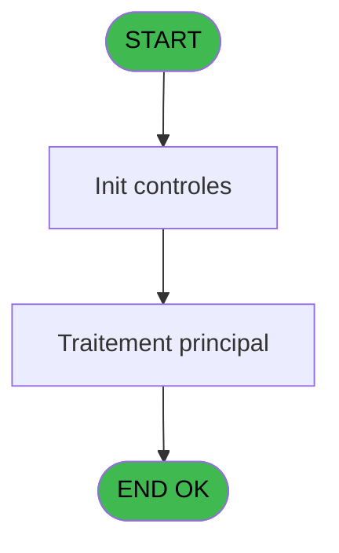
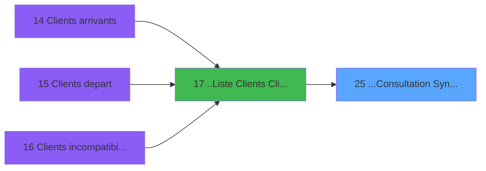
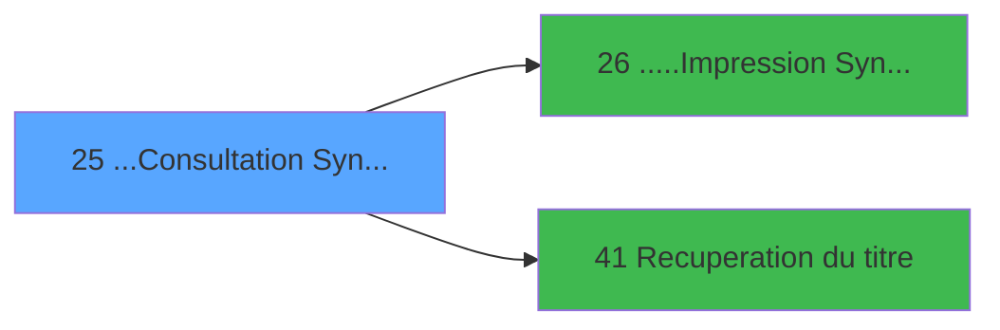

# PTR IDE 25 - ...Consultation Syntèse

> **Analyse**: Phases 1-4 2026-02-03 18:16 -> 18:17 (16s) | Assemblage 18:17
> **Pipeline**: V7.2 Enrichi
> **Structure**: 4 onglets (Resume | Ecrans | Donnees | Connexions)

<!-- TAB:Resume -->

## 1. FICHE D'IDENTITE

| Attribut | Valeur |
|----------|--------|
| Projet | PTR |
| IDE Position | 25 |
| Nom Programme | ...Consultation Syntèse |
| Fichier source | `Prg_25.xml` |
| Dossier IDE | Listes |
| Taches | 1 (1 ecrans visibles) |
| Tables modifiees | 0 |
| Programmes appeles | 2 |

## 2. DESCRIPTION FONCTIONNELLE

**...Consultation Syntèse** assure la gestion complete de ce processus, accessible depuis [..Liste  Clients (ClipArt)+ (IDE 17)](PTR-IDE-17.md).

Le flux de traitement s'organise en **1 blocs fonctionnels** :

- **Traitement** (1 tache) : traitements metier divers

**Logique metier** : 1 regles identifiees couvrant valeurs par defaut.

## 3. BLOCS FONCTIONNELS

### 3.1 Traitement (1 tache)

Traitements internes.

---

#### 25 - ...Consultation Syntèse [[ECRAN]](#ecran-t1)

**Role** : Consultation/chargement : ...Consultation Syntèse.
**Ecran** : 1277 x 313 DLU (MDI) | [Voir mockup](#ecran-t1)
**Delegue a** : [.....Impression Synthèse (IDE 26)](PTR-IDE-26.md), [Recuperation du titre (IDE 41)](PTR-IDE-41.md)

## 5. REGLES METIER

1 regles identifiees:

### Autres (1 regles)

#### [RM-001] Valeur par defaut si P0-Societe [A] est vide

| Element | Detail |
|---------|--------|
| **Condition** | `P0-Societe [A]=''` |
| **Si vrai** | 'C' |
| **Si faux** | P0-Societe [A]) |
| **Variables** | A (P0-Societe) |
| **Expression source** | Expression 11 : `IF (P0-Societe [A]='','C',P0-Societe [A])` |
| **Exemple** | Si P0-Societe [A]='' → 'C'. Sinon → P0-Societe [A]) |

## 6. CONTEXTE

- **Appele par**: [..Liste  Clients (ClipArt)+ (IDE 17)](PTR-IDE-17.md)
- **Appelle**: 2 programmes | **Tables**: 2 (W:0 R:1 L:1) | **Taches**: 1 | **Expressions**: 45

<!-- TAB:Ecrans -->

## 8. ECRANS

### 8.1 Forms visibles (1 / 1)

| # | Position | Tache | Nom | Type | Largeur | Hauteur | Bloc |
|---|----------|-------|-----|------|---------|---------|------|
| 1 | 25 | 25 | ...Consultation Syntèse | MDI | 1277 | 313 | Traitement |

### 8.2 Mockups Ecrans

---

#### 25 - ...Consultation Syntèse
**Tache** : [25](#t1) | **Type** : MDI | **Dimensions** : 1277 x 313 DLU
**Bloc** : Traitement | **Titre IDE** : ...Consultation Syntèse

<!-- FORM-DATA:
{
    "width":  1277,
    "vFactor":  8,
    "type":  "MDI",
    "hFactor":  8,
    "controls":  [
                     {
                         "x":  0,
                         "type":  "label",
                         "var":  "",
                         "y":  0,
                         "w":  1255,
                         "fmt":  "",
                         "name":  "",
                         "h":  20,
                         "color":  "",
                         "text":  "",
                         "parent":  null
                     },
                     {
                         "x":  0,
                         "type":  "table",
                         "var":  "",
                         "name":  "",
                         "titleH":  13,
                         "color":  "110",
                         "w":  1269,
                         "y":  52,
                         "fmt":  "",
                         "parent":  null,
                         "text":  "",
                         "rowH":  14,
                         "h":  211,
                         "cols":  [
                                      {
                                          "title":  "Vol",
                                          "layer":  1,
                                          "w":  121
                                      },
                                      {
                                          "title":  "DD/MM",
                                          "layer":  2,
                                          "w":  71
                                      },
                                      {
                                          "title":  "DD/MM",
                                          "layer":  3,
                                          "w":  71
                                      },
                                      {
                                          "title":  "DD/MM",
                                          "layer":  4,
                                          "w":  71
                                      },
                                      {
                                          "title":  "DD/MM",
                                          "layer":  5,
                                          "w":  70
                                      },
                                      {
                                          "title":  "DD/MM",
                                          "layer":  6,
                                          "w":  71
                                      },
                                      {
                                          "title":  "DD/MM",
                                          "layer":  7,
                                          "w":  70
                                      },
                                      {
                                          "title":  "DD/MM",
                                          "layer":  8,
                                          "w":  68
                                      },
                                      {
                                          "title":  "DD/MM",
                                          "layer":  9,
                                          "w":  69
                                      },
                                      {
                                          "title":  "DD/MM",
                                          "layer":  10,
                                          "w":  69
                                      },
                                      {
                                          "title":  "DD/MM",
                                          "layer":  11,
                                          "w":  68
                                      },
                                      {
                                          "title":  "DD/MM",
                                          "layer":  12,
                                          "w":  71
                                      },
                                      {
                                          "title":  "DD/MM",
                                          "layer":  13,
                                          "w":  69
                                      },
                                      {
                                          "title":  "DD/MM",
                                          "layer":  14,
                                          "w":  70
                                      },
                                      {
                                          "title":  "DD/MM",
                                          "layer":  15,
                                          "w":  73
                                      },
                                      {
                                          "title":  "DD/MM",
                                          "layer":  16,
                                          "w":  69
                                      },
                                      {
                                          "title":  "Total",
                                          "layer":  17,
                                          "w":  63
                                      }
                                  ],
                         "rows":  17
                     },
                     {
                         "x":  0,
                         "type":  "label",
                         "var":  "",
                         "y":  267,
                         "w":  1262,
                         "fmt":  "",
                         "name":  "",
                         "h":  13,
                         "color":  "2",
                         "text":  "",
                         "parent":  null
                     },
                     {
                         "x":  0,
                         "type":  "label",
                         "var":  "",
                         "y":  288,
                         "w":  1261,
                         "fmt":  "",
                         "name":  "",
                         "h":  24,
                         "color":  "",
                         "text":  "",
                         "parent":  null
                     },
                     {
                         "x":  0,
                         "type":  "label",
                         "var":  "",
                         "y":  21,
                         "w":  1255,
                         "fmt":  "",
                         "name":  "",
                         "h":  20,
                         "color":  "",
                         "text":  "",
                         "parent":  null
                     },
                     {
                         "x":  6,
                         "type":  "label",
                         "var":  "",
                         "y":  27,
                         "w":  131,
                         "fmt":  "",
                         "name":  "",
                         "h":  10,
                         "color":  "",
                         "text":  "Lieu de séjour",
                         "parent":  183
                     },
                     {
                         "x":  138,
                         "type":  "edit",
                         "var":  "",
                         "y":  68,
                         "w":  53,
                         "fmt":  "4Z",
                         "name":  "",
                         "h":  10,
                         "color":  "110",
                         "text":  "",
                         "parent":  5
                     },
                     {
                         "x":  202,
                         "type":  "edit",
                         "var":  "",
                         "y":  68,
                         "w":  53,
                         "fmt":  "4Z",
                         "name":  "",
                         "h":  10,
                         "color":  "110",
                         "text":  "",
                         "parent":  5
                     },
                     {
                         "x":  266,
                         "type":  "edit",
                         "var":  "",
                         "y":  68,
                         "w":  53,
                         "fmt":  "4Z",
                         "name":  "",
                         "h":  10,
                         "color":  "110",
                         "text":  "",
                         "parent":  5
                     },
                     {
                         "x":  338,
                         "type":  "edit",
                         "var":  "",
                         "y":  68,
                         "w":  53,
                         "fmt":  "4Z",
                         "name":  "",
                         "h":  10,
                         "color":  "110",
                         "text":  "",
                         "parent":  5
                     },
                     {
                         "x":  414,
                         "type":  "edit",
                         "var":  "",
                         "y":  68,
                         "w":  53,
                         "fmt":  "4Z",
                         "name":  "",
                         "h":  10,
                         "color":  "110",
                         "text":  "",
                         "parent":  5
                     },
                     {
                         "x":  486,
                         "type":  "edit",
                         "var":  "",
                         "y":  68,
                         "w":  53,
                         "fmt":  "4Z",
                         "name":  "",
                         "h":  10,
                         "color":  "110",
                         "text":  "",
                         "parent":  5
                     },
                     {
                         "x":  557,
                         "type":  "edit",
                         "var":  "",
                         "y":  68,
                         "w":  53,
                         "fmt":  "4Z",
                         "name":  "",
                         "h":  10,
                         "color":  "110",
                         "text":  "",
                         "parent":  5
                     },
                     {
                         "x":  622,
                         "type":  "edit",
                         "var":  "",
                         "y":  68,
                         "w":  53,
                         "fmt":  "4Z",
                         "name":  "",
                         "h":  10,
                         "color":  "110",
                         "text":  "",
                         "parent":  5
                     },
                     {
                         "x":  691,
                         "type":  "edit",
                         "var":  "",
                         "y":  68,
                         "w":  53,
                         "fmt":  "4Z",
                         "name":  "",
                         "h":  10,
                         "color":  "110",
                         "text":  "",
                         "parent":  5
                     },
                     {
                         "x":  762,
                         "type":  "edit",
                         "var":  "",
                         "y":  68,
                         "w":  53,
                         "fmt":  "4Z",
                         "name":  "",
                         "h":  10,
                         "color":  "110",
                         "text":  "",
                         "parent":  5
                     },
                     {
                         "x":  832,
                         "type":  "edit",
                         "var":  "",
                         "y":  68,
                         "w":  53,
                         "fmt":  "4Z",
                         "name":  "",
                         "h":  10,
                         "color":  "110",
                         "text":  "",
                         "parent":  5
                     },
                     {
                         "x":  898,
                         "type":  "edit",
                         "var":  "",
                         "y":  68,
                         "w":  53,
                         "fmt":  "4Z",
                         "name":  "",
                         "h":  10,
                         "color":  "110",
                         "text":  "",
                         "parent":  5
                     },
                     {
                         "x":  974,
                         "type":  "edit",
                         "var":  "",
                         "y":  68,
                         "w":  53,
                         "fmt":  "4Z",
                         "name":  "",
                         "h":  10,
                         "color":  "110",
                         "text":  "",
                         "parent":  5
                     },
                     {
                         "x":  1042,
                         "type":  "edit",
                         "var":  "",
                         "y":  68,
                         "w":  53,
                         "fmt":  "4Z",
                         "name":  "",
                         "h":  10,
                         "color":  "110",
                         "text":  "",
                         "parent":  5
                     },
                     {
                         "x":  1117,
                         "type":  "edit",
                         "var":  "",
                         "y":  68,
                         "w":  53,
                         "fmt":  "4Z",
                         "name":  "",
                         "h":  10,
                         "color":  "110",
                         "text":  "",
                         "parent":  5
                     },
                     {
                         "x":  1178,
                         "type":  "edit",
                         "var":  "",
                         "y":  68,
                         "w":  57,
                         "fmt":  "",
                         "name":  "",
                         "h":  10,
                         "color":  "110",
                         "text":  "",
                         "parent":  5
                     },
                     {
                         "x":  138,
                         "type":  "edit",
                         "var":  "",
                         "y":  268,
                         "w":  53,
                         "fmt":  "",
                         "name":  "",
                         "h":  10,
                         "color":  "",
                         "text":  "",
                         "parent":  40
                     },
                     {
                         "x":  202,
                         "type":  "edit",
                         "var":  "",
                         "y":  268,
                         "w":  53,
                         "fmt":  "",
                         "name":  "",
                         "h":  10,
                         "color":  "",
                         "text":  "",
                         "parent":  40
                     },
                     {
                         "x":  266,
                         "type":  "edit",
                         "var":  "",
                         "y":  268,
                         "w":  53,
                         "fmt":  "",
                         "name":  "",
                         "h":  10,
                         "color":  "",
                         "text":  "",
                         "parent":  null
                     },
                     {
                         "x":  338,
                         "type":  "edit",
                         "var":  "",
                         "y":  268,
                         "w":  53,
                         "fmt":  "",
                         "name":  "",
                         "h":  10,
                         "color":  "",
                         "text":  "",
                         "parent":  40
                     },
                     {
                         "x":  415,
                         "type":  "edit",
                         "var":  "",
                         "y":  268,
                         "w":  53,
                         "fmt":  "",
                         "name":  "",
                         "h":  10,
                         "color":  "",
                         "text":  "",
                         "parent":  null
                     },
                     {
                         "x":  486,
                         "type":  "edit",
                         "var":  "",
                         "y":  268,
                         "w":  53,
                         "fmt":  "",
                         "name":  "",
                         "h":  10,
                         "color":  "",
                         "text":  "",
                         "parent":  40
                     },
                     {
                         "x":  557,
                         "type":  "edit",
                         "var":  "",
                         "y":  268,
                         "w":  53,
                         "fmt":  "",
                         "name":  "",
                         "h":  10,
                         "color":  "",
                         "text":  "",
                         "parent":  null
                     },
                     {
                         "x":  622,
                         "type":  "edit",
                         "var":  "",
                         "y":  268,
                         "w":  53,
                         "fmt":  "",
                         "name":  "",
                         "h":  10,
                         "color":  "",
                         "text":  "",
                         "parent":  null
                     },
                     {
                         "x":  691,
                         "type":  "edit",
                         "var":  "",
                         "y":  268,
                         "w":  53,
                         "fmt":  "",
                         "name":  "",
                         "h":  10,
                         "color":  "",
                         "text":  "",
                         "parent":  null
                     },
                     {
                         "x":  761,
                         "type":  "edit",
                         "var":  "",
                         "y":  268,
                         "w":  53,
                         "fmt":  "",
                         "name":  "",
                         "h":  10,
                         "color":  "",
                         "text":  "",
                         "parent":  40
                     },
                     {
                         "x":  832,
                         "type":  "edit",
                         "var":  "",
                         "y":  268,
                         "w":  53,
                         "fmt":  "",
                         "name":  "",
                         "h":  10,
                         "color":  "",
                         "text":  "",
                         "parent":  null
                     },
                     {
                         "x":  897,
                         "type":  "edit",
                         "var":  "",
                         "y":  268,
                         "w":  53,
                         "fmt":  "",
                         "name":  "",
                         "h":  10,
                         "color":  "",
                         "text":  "",
                         "parent":  null
                     },
                     {
                         "x":  974,
                         "type":  "edit",
                         "var":  "",
                         "y":  268,
                         "w":  53,
                         "fmt":  "",
                         "name":  "",
                         "h":  10,
                         "color":  "",
                         "text":  "",
                         "parent":  40
                     },
                     {
                         "x":  1041,
                         "type":  "edit",
                         "var":  "",
                         "y":  268,
                         "w":  53,
                         "fmt":  "",
                         "name":  "",
                         "h":  10,
                         "color":  "",
                         "text":  "",
                         "parent":  40
                     },
                     {
                         "x":  1117,
                         "type":  "edit",
                         "var":  "",
                         "y":  268,
                         "w":  53,
                         "fmt":  "",
                         "name":  "",
                         "h":  10,
                         "color":  "",
                         "text":  "",
                         "parent":  null
                     },
                     {
                         "x":  1178,
                         "type":  "edit",
                         "var":  "",
                         "y":  268,
                         "w":  57,
                         "fmt":  "",
                         "name":  "",
                         "h":  10,
                         "color":  "",
                         "text":  "",
                         "parent":  40
                     },
                     {
                         "x":  6,
                         "type":  "edit",
                         "var":  "",
                         "y":  6,
                         "w":  396,
                         "fmt":  "30",
                         "name":  "",
                         "h":  8,
                         "color":  "",
                         "text":  "",
                         "parent":  1
                     },
                     {
                         "x":  978,
                         "type":  "edit",
                         "var":  "",
                         "y":  6,
                         "w":  268,
                         "fmt":  "WWW DD MMM YYYYT",
                         "name":  "",
                         "h":  8,
                         "color":  "",
                         "text":  "",
                         "parent":  1
                     },
                     {
                         "x":  0,
                         "type":  "edit",
                         "var":  "",
                         "y":  40,
                         "w":  1255,
                         "fmt":  "70",
                         "name":  "",
                         "h":  10,
                         "color":  "7",
                         "text":  "",
                         "parent":  null
                     },
                     {
                         "x":  8,
                         "type":  "edit",
                         "var":  "",
                         "y":  68,
                         "w":  117,
                         "fmt":  "13",
                         "name":  "",
                         "h":  10,
                         "color":  "142",
                         "text":  "",
                         "parent":  5
                     },
                     {
                         "x":  8,
                         "type":  "edit",
                         "var":  "",
                         "y":  268,
                         "w":  130,
                         "fmt":  "13",
                         "name":  "",
                         "h":  10,
                         "color":  "",
                         "text":  "",
                         "parent":  40
                     },
                     {
                         "x":  9,
                         "type":  "button",
                         "var":  "",
                         "y":  291,
                         "w":  154,
                         "fmt":  "\u0026Quitter",
                         "name":  "",
                         "h":  18,
                         "color":  "",
                         "text":  "",
                         "parent":  58
                     },
                     {
                         "x":  1093,
                         "type":  "button",
                         "var":  "",
                         "y":  291,
                         "w":  154,
                         "fmt":  "\u0026Impression",
                         "name":  "",
                         "h":  18,
                         "color":  "",
                         "text":  "",
                         "parent":  58
                     },
                     {
                         "x":  158,
                         "type":  "edit",
                         "var":  "",
                         "y":  27,
                         "w":  230,
                         "fmt":  "",
                         "name":  "nom_import",
                         "h":  10,
                         "color":  "5",
                         "text":  "",
                         "parent":  183
                     }
                 ],
    "taskId":  "25",
    "height":  313
}
-->

<strong>Champs : 38 champs</strong>

| Pos (x,y) | Nom | Variable | Type |
|-----------|-----|----------|------|
| 138,68 | 4Z | - | edit |
| 202,68 | 4Z | - | edit |
| 266,68 | 4Z | - | edit |
| 338,68 | 4Z | - | edit |
| 414,68 | 4Z | - | edit |
| 486,68 | 4Z | - | edit |
| 557,68 | 4Z | - | edit |
| 622,68 | 4Z | - | edit |
| 691,68 | 4Z | - | edit |
| 762,68 | 4Z | - | edit |
| 832,68 | 4Z | - | edit |
| 898,68 | 4Z | - | edit |
| 974,68 | 4Z | - | edit |
| 1042,68 | 4Z | - | edit |
| 1117,68 | 4Z | - | edit |
| 1178,68 | (sans nom) | - | edit |
| 138,268 | (sans nom) | - | edit |
| 202,268 | (sans nom) | - | edit |
| 266,268 | (sans nom) | - | edit |
| 338,268 | (sans nom) | - | edit |
| 415,268 | (sans nom) | - | edit |
| 486,268 | (sans nom) | - | edit |
| 557,268 | (sans nom) | - | edit |
| 622,268 | (sans nom) | - | edit |
| 691,268 | (sans nom) | - | edit |
| 761,268 | (sans nom) | - | edit |
| 832,268 | (sans nom) | - | edit |
| 897,268 | (sans nom) | - | edit |
| 974,268 | (sans nom) | - | edit |
| 1041,268 | (sans nom) | - | edit |
| 1117,268 | (sans nom) | - | edit |
| 1178,268 | (sans nom) | - | edit |
| 6,6 | 30 | - | edit |
| 978,6 | WWW DD MMM YYYYT | - | edit |
| 0,40 | 70 | - | edit |
| 8,68 | 13 | - | edit |
| 8,268 | 13 | - | edit |
| 158,27 | nom_import | - | edit |

<strong>Boutons : 2 boutons</strong>

| Bouton | Pos (x,y) | Action |
|--------|-----------|--------|
| Quitter | 9,291 | Quitte le programme |
| Impression | 1093,291 | Appel [.....Impression Synthèse (IDE 26)](PTR-IDE-26.md) |

## 9. NAVIGATION

Ecran unique: **...Consultation Syntèse**

### 9.3 Structure hierarchique (1 tache)

| Position | Tache | Type | Dimensions | Bloc |
|----------|-------|------|------------|------|
| **25.1** | [**...Consultation Syntèse** (25)](#t1) [mockup](#ecran-t1) | MDI | 1277x313 | Traitement |

### 9.4 Algorigramme

> **Legende**: Vert = START/END OK | Rouge = END KO | Bleu = Decisions
> *Algorigramme auto-genere. Utiliser `/algorigramme` pour une synthese metier detaillee.*

<!-- TAB:Donnees -->

## 10. TABLES

### Tables utilisees (2)

| ID | Nom | Description | Type | R | W | L | Usages |
|----|-----|-------------|------|---|---|---|--------|
| 118 | tables_imports |  | DB | R |   |   | 1 |
| 658 | tempo_trafic | Table temporaire ecran | DB |   |   | L | 1 |

### Colonnes par table (1 / 1 tables avec colonnes identifiees)

Table 118 - tables_imports (R) - 1 usages

| Lettre | Variable | Acces | Type |
|--------|----------|-------|------|
| A | P0-Societe | R | Alpha |
| B | P0-Liste CPt | R | Alpha |
| C | P0-Libelle Liste | R | Alpha |
| D | P0-Liste | R | Alpha |
| E | P0-Village | R | Alpha |
| F | P0-Format Imprimante | R | Alpha |
| G | P0-Date | R | Date |
| H | P0-Total Selection | R | Alpha |
| I | P0-Selection 1/5 | R | Alpha |
| J | P0-Selection 6/10 | R | Alpha |
| K | P0-Selection 11/15 | R | Alpha |
| L | P0-Première Date | R | Date |
| M | P0-Lieu de sejour | R | Alpha |
| N | V_Titre | R | Alpha |
| O | v.date | R | Alpha |
| P | v.date1 | R | Alpha |
| Q | v.date2 | R | Alpha |
| R | v.date3 | R | Alpha |
| S | v.date4 | R | Alpha |
| T | v.date5 | R | Alpha |
| U | v.date6 | R | Alpha |
| V | v.date7 | R | Alpha |
| W | v.date8 | R | Alpha |
| X | v.date9 | R | Alpha |
| Y | v.date10 | R | Alpha |
| Z | v.date11 | R | Alpha |
| BA | v.date12 | R | Alpha |
| BB | v.date13 | R | Alpha |
| BC | v.date14 | R | Alpha |
| BD | v.date15 | R | Alpha |

## 11. VARIABLES

### 11.1 Variables de session (16)

Variables persistantes pendant toute la session.

| Lettre | Nom | Type | Usage dans |
|--------|-----|------|-----------|
| O | v.date | Alpha | 18x session |
| P | v.date1 | Alpha | 17x session |
| Q | v.date2 | Alpha | - |
| R | v.date3 | Alpha | - |
| S | v.date4 | Alpha | - |
| T | v.date5 | Alpha | - |
| U | v.date6 | Alpha | - |
| V | v.date7 | Alpha | - |
| W | v.date8 | Alpha | - |
| X | v.date9 | Alpha | - |
| Y | v.date10 | Alpha | - |
| Z | v.date11 | Alpha | - |
| BA | v.date12 | Alpha | - |
| BB | v.date13 | Alpha | - |
| BC | v.date14 | Alpha | - |
| BD | v.date15 | Alpha | - |

### 11.2 Autres (14)

Variables diverses.

| Lettre | Nom | Type | Usage dans |
|--------|-----|------|-----------|
| A | P0-Societe | Alpha | 2x refs |
| B | P0-Liste CPt | Alpha | 1x refs |
| C | P0-Libelle Liste | Alpha | - |
| D | P0-Liste | Alpha | 1x refs |
| E | P0-Village | Alpha | - |
| F | P0-Format Imprimante | Alpha | - |
| G | P0-Date | Date | - |
| H | P0-Total Selection | Alpha | - |
| I | P0-Selection 1/5 | Alpha | - |
| J | P0-Selection 6/10 | Alpha | - |
| K | P0-Selection 11/15 | Alpha | - |
| L | P0-Première Date | Date | - |
| M | P0-Lieu de sejour | Alpha | - |
| N | V_Titre | Alpha | - |

Toutes les 30 variables (liste complete)

| Cat | Lettre | Nom Variable | Type |
|-----|--------|--------------|------|
| V. | **O** | v.date | Alpha |
| V. | **P** | v.date1 | Alpha |
| V. | **Q** | v.date2 | Alpha |
| V. | **R** | v.date3 | Alpha |
| V. | **S** | v.date4 | Alpha |
| V. | **T** | v.date5 | Alpha |
| V. | **U** | v.date6 | Alpha |
| V. | **V** | v.date7 | Alpha |
| V. | **W** | v.date8 | Alpha |
| V. | **X** | v.date9 | Alpha |
| V. | **Y** | v.date10 | Alpha |
| V. | **Z** | v.date11 | Alpha |
| V. | **BA** | v.date12 | Alpha |
| V. | **BB** | v.date13 | Alpha |
| V. | **BC** | v.date14 | Alpha |
| V. | **BD** | v.date15 | Alpha |
| Autre | **A** | P0-Societe | Alpha |
| Autre | **B** | P0-Liste CPt | Alpha |
| Autre | **C** | P0-Libelle Liste | Alpha |
| Autre | **D** | P0-Liste | Alpha |
| Autre | **E** | P0-Village | Alpha |
| Autre | **F** | P0-Format Imprimante | Alpha |
| Autre | **G** | P0-Date | Date |
| Autre | **H** | P0-Total Selection | Alpha |
| Autre | **I** | P0-Selection 1/5 | Alpha |
| Autre | **J** | P0-Selection 6/10 | Alpha |
| Autre | **K** | P0-Selection 11/15 | Alpha |
| Autre | **L** | P0-Première Date | Date |
| Autre | **M** | P0-Lieu de sejour | Alpha |
| Autre | **N** | V_Titre | Alpha |

## 12. EXPRESSIONS

**45 / 45 expressions decodees (100%)**

### 12.1 Repartition par type

| Type | Expressions | Regles |
|------|-------------|--------|
| CONDITION | 2 | 5 |
| CONSTANTE | 3 | 0 |
| CONCATENATION | 1 | 0 |
| DATE | 1 | 0 |
| FORMAT | 16 | 0 |
| OTHER | 19 | 0 |
| REFERENCE_VG | 2 | 0 |
| STRING | 1 | 0 |

### 12.2 Expressions cles par type

#### CONDITION (2 expressions)

| Type | IDE | Expression | Regle |
|------|-----|------------|-------|
| CONDITION | 11 | `IF (P0-Societe [A]='','C',P0-Societe [A])` | [RM-001](#rm-RM-001) |
| CONDITION | 45 | `[DQ]<>''` | - |

#### CONSTANTE (3 expressions)

| Type | IDE | Expression | Regle |
|------|-----|------------|-------|
| CONSTANTE | 9 | `'D_*'` | - |
| CONSTANTE | 8 | `'T_Total GM'` | - |
| CONSTANTE | 2 | `14` | - |

#### CONCATENATION (1 expressions)

| Type | IDE | Expression | Regle |
|------|-----|------------|-------|
| CONCATENATION | 5 | `'Visu des '&Trim (P0-Liste CPt [B])&' du '&DStr (v.date1 [P],'DD/MM/YYYYZ')&' au '&DStr (v.date1 [P]+14,'DD/MM/YYYYZ')` | - |

#### DATE (1 expressions)

| Type | IDE | Expression | Regle |
|------|-----|------------|-------|
| DATE | 6 | `Date ()` | - |

#### FORMAT (16 expressions)

| Type | IDE | Expression | Regle |
|------|-----|------------|-------|
| FORMAT | 23 | `DStr(AddDate(v.date1 [P],0,0,10),'DD/MM')` | - |
| FORMAT | 24 | `DStr(AddDate(v.date1 [P],0,0,11),'DD/MM')` | - |
| FORMAT | 21 | `DStr(AddDate(v.date1 [P],0,0,8),'DD/MM')` | - |
| FORMAT | 22 | `DStr(AddDate(v.date1 [P],0,0,9),'DD/MM')` | - |
| FORMAT | 27 | `DStr(AddDate(v.date1 [P],0,0,14),'DD/MM')` | - |
| ... | | *+11 autres* | |

#### OTHER (19 expressions)

| Type | IDE | Expression | Regle |
|------|-----|------------|-------|
| OTHER | 38 | `[DJ]` | - |
| OTHER | 39 | `[DK]` | - |
| OTHER | 36 | `[DH]` | - |
| OTHER | 37 | `[DI]` | - |
| OTHER | 40 | `[DL]` | - |
| ... | | *+14 autres* | |

#### REFERENCE_VG (2 expressions)

| Type | IDE | Expression | Regle |
|------|-----|------------|-------|
| REFERENCE_VG | 12 | `VG2` | - |
| REFERENCE_VG | 7 | `VG3` | - |

#### STRING (1 expressions)

| Type | IDE | Expression | Regle |
|------|-----|------------|-------|
| STRING | 1 | `Trim ([AZ])` | - |

### 12.3 Toutes les expressions (45)

Voir les 45 expressions

#### CONDITION (2)

| IDE | Expression Decodee |
|-----|-------------------|
| 11 | `IF (P0-Societe [A]='','C',P0-Societe [A])` |
| 45 | `[DQ]<>''` |

#### CONSTANTE (3)

| IDE | Expression Decodee |
|-----|-------------------|
| 2 | `14` |
| 8 | `'T_Total GM'` |
| 9 | `'D_*'` |

#### CONCATENATION (1)

| IDE | Expression Decodee |
|-----|-------------------|
| 5 | `'Visu des '&Trim (P0-Liste CPt [B])&' du '&DStr (v.date1 [P],'DD/MM/YYYYZ')&' au '&DStr (v.date1 [P]+14,'DD/MM/YYYYZ')` |

#### DATE (1)

| IDE | Expression Decodee |
|-----|-------------------|
| 6 | `Date ()` |

#### FORMAT (16)

| IDE | Expression Decodee |
|-----|-------------------|
| 13 | `DStr(v.date1 [P],'DD/MM')` |
| 14 | `DStr(AddDate(v.date1 [P],0,0,1),'DD/MM')` |
| 15 | `DStr(AddDate(v.date1 [P],0,0,2),'DD/MM')` |
| 16 | `DStr(AddDate(v.date1 [P],0,0,3),'DD/MM')` |
| 17 | `DStr(AddDate(v.date1 [P],0,0,4),'DD/MM')` |
| 18 | `DStr(AddDate(v.date1 [P],0,0,5),'DD/MM')` |
| 19 | `DStr(AddDate(v.date1 [P],0,0,6),'DD/MM')` |
| 20 | `DStr(AddDate(v.date1 [P],0,0,7),'DD/MM')` |
| 21 | `DStr(AddDate(v.date1 [P],0,0,8),'DD/MM')` |
| 22 | `DStr(AddDate(v.date1 [P],0,0,9),'DD/MM')` |
| 23 | `DStr(AddDate(v.date1 [P],0,0,10),'DD/MM')` |
| 24 | `DStr(AddDate(v.date1 [P],0,0,11),'DD/MM')` |
| 25 | `DStr(AddDate(v.date1 [P],0,0,12),'DD/MM')` |
| 26 | `DStr(AddDate(v.date1 [P],0,0,13),'DD/MM')` |
| 27 | `DStr(AddDate(v.date1 [P],0,0,14),'DD/MM')` |
| 28 | `DStr(AddDate(v.date1 [P],0,0,15),'DD/MM')` |

#### OTHER (19)

| IDE | Expression Decodee |
|-----|-------------------|
| 3 | `Right ([AI],14)` |
| 4 | `Right (v.date [O],13)` |
| 10 | `P0-Societe [A]` |
| 29 | `[DA]` |
| 30 | `[DB]` |
| 31 | `[DC]` |
| 32 | `[DD]` |
| 33 | `[DE]` |
| 34 | `[DF]` |
| 35 | `[DG]` |
| 36 | `[DH]` |
| 37 | `[DI]` |
| 38 | `[DJ]` |
| 39 | `[DK]` |
| 40 | `[DL]` |
| 41 | `[DM]` |
| 42 | `[DN]` |
| 43 | `[DX]` |
| 44 | `[DQ]` |

#### REFERENCE_VG (2)

| IDE | Expression Decodee |
|-----|-------------------|
| 7 | `VG3` |
| 12 | `VG2` |

#### STRING (1)

| IDE | Expression Decodee |
|-----|-------------------|
| 1 | `Trim ([AZ])` |

<!-- TAB:Connexions -->

## 13. GRAPHE D'APPELS

### 13.1 Chaine depuis Main (Callers)

Main -> ... -> [..Liste  Clients (ClipArt)+ (IDE 17)](PTR-IDE-17.md) -> **...Consultation Syntèse (IDE 25)**

### 13.2 Callers

| IDE | Nom Programme | Nb Appels |
|-----|---------------|-----------|
| [17](PTR-IDE-17.md) | ..Liste  Clients (ClipArt)+ | 1 |

### 13.3 Callees (programmes appeles)

### 13.4 Detail Callees avec contexte

| IDE | Nom Programme | Appels | Contexte |
|-----|---------------|--------|----------|
| [26](PTR-IDE-26.md) | .....Impression Synthèse | 1 | Sous-programme |
| [41](PTR-IDE-41.md) | Recuperation du titre | 1 | Recuperation donnees |

## 14. RECOMMANDATIONS MIGRATION

### 14.1 Profil du programme

| Metrique | Valeur | Impact migration |
|----------|--------|-----------------|
| Lignes de logique | 86 | Programme compact |
| Expressions | 45 | Peu de logique |
| Tables WRITE | 0 | Impact faible |
| Sous-programmes | 2 | Peu de dependances |
| Ecrans visibles | 1 | Ecran unique ou traitement batch |
| Code desactive | 0% (0 / 86) | Code sain |
| Regles metier | 1 | Quelques regles a preserver |

### 14.2 Plan de migration par bloc

#### Traitement (1 tache: 1 ecran, 0 traitement)

- **Strategie** : 1 composant(s) UI (Razor/React) avec formulaires et validation.
- 2 sous-programme(s) a migrer ou a reutiliser depuis les services existants.
- Decomposer les taches en services unitaires testables.

### 14.3 Dependances critiques

| Dependance | Type | Appels | Impact |
|------------|------|--------|--------|
| [Recuperation du titre (IDE 41)](PTR-IDE-41.md) | Sous-programme | 1x | Normale - Recuperation donnees |
| [.....Impression Synthèse (IDE 26)](PTR-IDE-26.md) | Sous-programme | 1x | Normale - Sous-programme |

---
*Spec DETAILED generee par Pipeline V7.2 - 2026-02-03 18:17*
