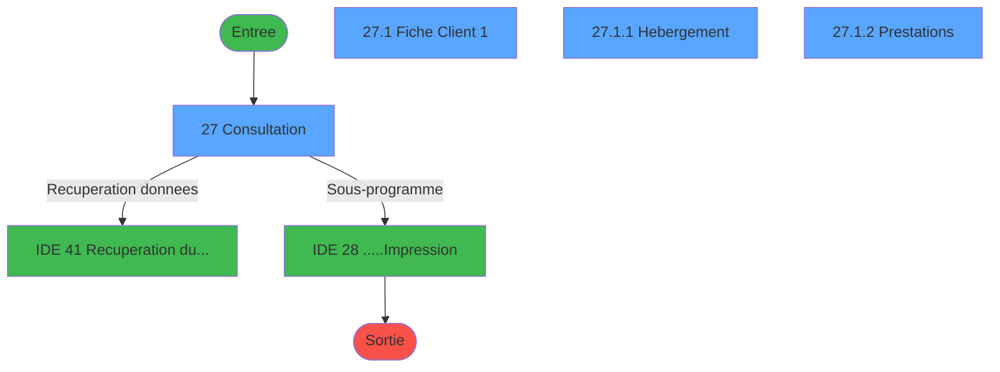
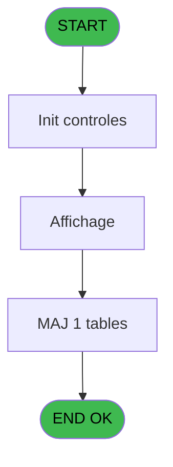
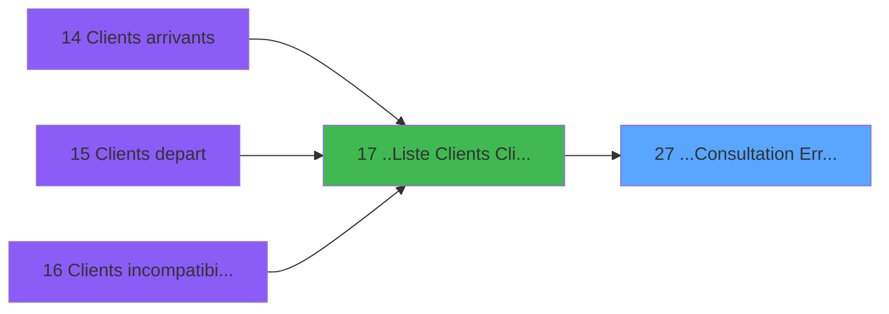
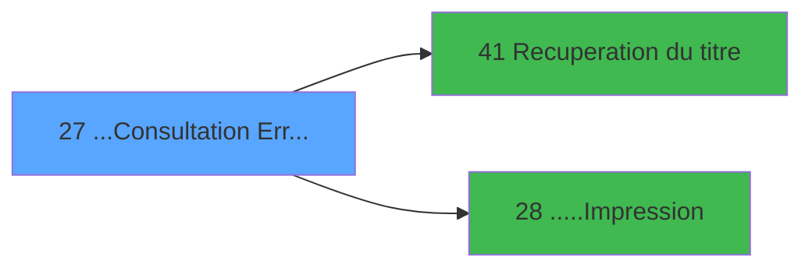

# PTR IDE 27 - ...Consultation Erreurs

> **Analyse**: Phases 1-4 2026-02-03 18:17 -> 18:18 (16s) | Assemblage 18:18
> **Pipeline**: V7.2 Enrichi
> **Structure**: 4 onglets (Resume | Ecrans | Donnees | Connexions)

<!-- TAB:Resume -->

## 1. FICHE D'IDENTITE

| Attribut | Valeur |
|----------|--------|
| Projet | PTR |
| IDE Position | 27 |
| Nom Programme | ...Consultation Erreurs |
| Fichier source | `Prg_27.xml` |
| Dossier IDE | Listes |
| Taches | 4 (4 ecrans visibles) |
| Tables modifiees | 1 |
| Programmes appeles | 2 |

## 2. DESCRIPTION FONCTIONNELLE

**...Consultation Erreurs** assure la gestion complete de ce processus, accessible depuis [..Liste  Clients (ClipArt)+ (IDE 17)](PTR-IDE-17.md).

Le flux de traitement s'organise en **1 blocs fonctionnels** :

- **Traitement** (4 taches) : traitements metier divers

**Donnees modifiees** : 1 tables en ecriture (gm-complet_______gmc).

**Logique metier** : 2 regles identifiees couvrant conditions metier, valeurs par defaut.

Detail : phases du traitement

#### Phase 1 : Traitement (4 taches)

- **27** - Consultation **[[ECRAN]](#ecran-t1)**
- **27.1** - Fiche Client 1 **[[ECRAN]](#ecran-t2)**
- **27.1.1** - Hebergement **[[ECRAN]](#ecran-t3)**
- **27.1.2** - Prestations **[[ECRAN]](#ecran-t4)**

Delegue a : [Recuperation du titre (IDE 41)](PTR-IDE-41.md), [.....Impression (IDE 28)](PTR-IDE-28.md)

#### Tables impactees

| Table | Operations | Role metier |
|-------|-----------|-------------|
| gm-complet_______gmc | **W** (1 usages) |  |

## 3. BLOCS FONCTIONNELS

### 3.1 Traitement (4 taches)

Traitements internes.

---

#### 27 - Consultation [[ECRAN]](#ecran-t1)

**Role** : Consultation/chargement : Consultation.
**Ecran** : 1267 x 298 DLU (MDI) | [Voir mockup](#ecran-t1)

3 sous-taches directes

| Tache | Nom | Bloc |
|-------|-----|------|
| [27.1](#t2) | Fiche Client 1 **[[ECRAN]](#ecran-t2)** | Traitement |
| [27.1.1](#t3) | Hebergement **[[ECRAN]](#ecran-t3)** | Traitement |
| [27.1.2](#t4) | Prestations **[[ECRAN]](#ecran-t4)** | Traitement |

**Delegue a** : [Recuperation du titre (IDE 41)](PTR-IDE-41.md), [.....Impression (IDE 28)](PTR-IDE-28.md)

---

#### 27.1 - Fiche Client 1 [[ECRAN]](#ecran-t2)

**Role** : Traitement : Fiche Client 1.
**Ecran** : 912 x 292 DLU (MDI) | [Voir mockup](#ecran-t2)
**Delegue a** : [Recuperation du titre (IDE 41)](PTR-IDE-41.md), [.....Impression (IDE 28)](PTR-IDE-28.md)

---

#### 27.1.1 - Hebergement [[ECRAN]](#ecran-t3)

**Role** : Traitement : Hebergement.
**Ecran** : 904 x 69 DLU (Modal) | [Voir mockup](#ecran-t3)
**Delegue a** : [Recuperation du titre (IDE 41)](PTR-IDE-41.md), [.....Impression (IDE 28)](PTR-IDE-28.md)

---

#### 27.1.2 - Prestations [[ECRAN]](#ecran-t4)

**Role** : Traitement : Prestations.
**Ecran** : 892 x 55 DLU (Modal) | [Voir mockup](#ecran-t4)
**Delegue a** : [Recuperation du titre (IDE 41)](PTR-IDE-41.md), [.....Impression (IDE 28)](PTR-IDE-28.md)

## 5. REGLES METIER

2 regles identifiees:

### Autres (2 regles)

#### [RM-001] Si InStr (P0-Liste Cpt [C] alors 'Reveil')>0 sinon 'Reveil','')

| Element | Detail |
|---------|--------|
| **Condition** | `InStr (P0-Liste Cpt [C]` |
| **Si vrai** | 'Reveil')>0 |
| **Si faux** | 'Reveil','') |
| **Variables** | C (P0-Liste Cpt), E (P0-Liste) |
| **Expression source** | Expression 11 : `IF (InStr (P0-Liste Cpt [C],'Reveil')>0,'Reveil','')` |
| **Exemple** | Si InStr (P0-Liste Cpt [C] → 'Reveil')>0. Sinon → 'Reveil','') |

#### [RM-002] Valeur par defaut si P0-Societe [A] est vide

| Element | Detail |
|---------|--------|
| **Condition** | `P0-Societe [A]=''` |
| **Si vrai** | 'C' |
| **Si faux** | P0-Societe [A]) |
| **Variables** | A (P0-Societe) |
| **Expression source** | Expression 13 : `IF (P0-Societe [A]='','C',P0-Societe [A])` |
| **Exemple** | Si P0-Societe [A]='' → 'C'. Sinon → P0-Societe [A]) |

## 6. CONTEXTE

- **Appele par**: [..Liste  Clients (ClipArt)+ (IDE 17)](PTR-IDE-17.md)
- **Appelle**: 2 programmes | **Tables**: 5 (W:1 R:3 L:1) | **Taches**: 4 | **Expressions**: 17

<!-- TAB:Ecrans -->

## 8. ECRANS

### 8.1 Forms visibles (4 / 4)

| # | Position | Tache | Nom | Type | Largeur | Hauteur | Bloc |
|---|----------|-------|-----|------|---------|---------|------|
| 1 | 27 | 27 | Consultation | MDI | 1267 | 298 | Traitement |
| 2 | 27.1 | 27.1 | Fiche Client 1 | MDI | 912 | 292 | Traitement |
| 3 | 27.1.1 | 27.1.1 | Hebergement | Modal | 904 | 69 | Traitement |
| 4 | 27.1.2 | 27.1.2 | Prestations | Modal | 892 | 55 | Traitement |

### 8.2 Mockups Ecrans

---

#### 27 - Consultation
**Tache** : [27](#t1) | **Type** : MDI | **Dimensions** : 1267 x 298 DLU
**Bloc** : Traitement | **Titre IDE** : Consultation

<!-- FORM-DATA:
{
    "width":  1267,
    "vFactor":  8,
    "type":  "MDI",
    "hFactor":  8,
    "controls":  [
                     {
                         "x":  0,
                         "type":  "label",
                         "var":  "",
                         "y":  0,
                         "w":  1255,
                         "fmt":  "",
                         "name":  "",
                         "h":  20,
                         "color":  "",
                         "text":  "",
                         "parent":  null
                     },
                     {
                         "x":  1078,
                         "type":  "label",
                         "var":  "",
                         "y":  22,
                         "w":  173,
                         "fmt":  "",
                         "name":  "",
                         "h":  42,
                         "color":  "195",
                         "text":  "Nombre",
                         "parent":  null
                     },
                     {
                         "x":  2,
                         "type":  "table",
                         "var":  "",
                         "name":  "",
                         "titleH":  12,
                         "color":  "110",
                         "w":  1070,
                         "y":  24,
                         "fmt":  "",
                         "parent":  null,
                         "text":  "",
                         "rowH":  13,
                         "h":  206,
                         "cols":  [
                                      {
                                          "title":  "Nom",
                                          "layer":  1,
                                          "w":  200
                                      },
                                      {
                                          "title":  "Prénom",
                                          "layer":  2,
                                          "w":  142
                                      },
                                      {
                                          "title":  "Sexe",
                                          "layer":  3,
                                          "w":  65
                                      },
                                      {
                                          "title":  "Qualité",
                                          "layer":  4,
                                          "w":  135
                                      },
                                      {
                                          "title":  "Age",
                                          "layer":  5,
                                          "w":  68
                                      },
                                      {
                                          "title":  "Logement",
                                          "layer":  6,
                                          "w":  93
                                      },
                                      {
                                          "title":  "Pays",
                                          "layer":  7,
                                          "w":  57
                                      },
                                      {
                                          "title":  "B",
                                          "layer":  8,
                                          "w":  35
                                      },
                                      {
                                          "title":  "M",
                                          "layer":  9,
                                          "w":  39
                                      },
                                      {
                                          "title":  "F",
                                          "layer":  10,
                                          "w":  70
                                      },
                                      {
                                          "title":  "R",
                                          "layer":  11,
                                          "w":  38
                                      },
                                      {
                                          "title":  "Réveil",
                                          "layer":  12,
                                          "w":  93
                                      }
                                  ],
                         "rows":  12
                     },
                     {
                         "x":  1078,
                         "type":  "label",
                         "var":  "",
                         "y":  67,
                         "w":  173,
                         "fmt":  "",
                         "name":  "",
                         "h":  201,
                         "color":  "1",
                         "text":  "",
                         "parent":  null
                     },
                     {
                         "x":  12,
                         "type":  "label",
                         "var":  "",
                         "y":  231,
                         "w":  202,
                         "fmt":  "",
                         "name":  "",
                         "h":  38,
                         "color":  "195",
                         "text":  "Source",
                         "parent":  null
                     },
                     {
                         "x":  220,
                         "type":  "label",
                         "var":  "",
                         "y":  231,
                         "w":  420,
                         "fmt":  "",
                         "name":  "",
                         "h":  38,
                         "color":  "195",
                         "text":  "Arrivee",
                         "parent":  null
                     },
                     {
                         "x":  647,
                         "type":  "label",
                         "var":  "",
                         "y":  231,
                         "w":  422,
                         "fmt":  "",
                         "name":  "",
                         "h":  38,
                         "color":  "195",
                         "text":  "Depart",
                         "parent":  null
                     },
                     {
                         "x":  21,
                         "type":  "label",
                         "var":  "",
                         "y":  242,
                         "w":  69,
                         "fmt":  "",
                         "name":  "",
                         "h":  8,
                         "color":  "142",
                         "text":  "TRAFIC",
                         "parent":  34
                     },
                     {
                         "x":  21,
                         "type":  "label",
                         "var":  "",
                         "y":  253,
                         "w":  101,
                         "fmt":  "",
                         "name":  "",
                         "h":  8,
                         "color":  "142",
                         "text":  "PLANNING",
                         "parent":  34
                     },
                     {
                         "x":  0,
                         "type":  "label",
                         "var":  "",
                         "y":  271,
                         "w":  1260,
                         "fmt":  "",
                         "name":  "",
                         "h":  24,
                         "color":  "",
                         "text":  "",
                         "parent":  null
                     },
                     {
                         "x":  1104,
                         "type":  "edit",
                         "var":  "",
                         "y":  46,
                         "w":  120,
                         "fmt":  "",
                         "name":  "",
                         "h":  10,
                         "color":  "",
                         "text":  "",
                         "parent":  4
                     },
                     {
                         "x":  14,
                         "type":  "edit",
                         "var":  "",
                         "y":  40,
                         "w":  181,
                         "fmt":  "",
                         "name":  "",
                         "h":  8,
                         "color":  "110",
                         "text":  "",
                         "parent":  5
                     },
                     {
                         "x":  218,
                         "type":  "edit",
                         "var":  "",
                         "y":  40,
                         "w":  109,
                         "fmt":  "",
                         "name":  "",
                         "h":  8,
                         "color":  "110",
                         "text":  "",
                         "parent":  5
                     },
                     {
                         "x":  355,
                         "type":  "edit",
                         "var":  "",
                         "y":  40,
                         "w":  30,
                         "fmt":  "",
                         "name":  "",
                         "h":  8,
                         "color":  "110",
                         "text":  "",
                         "parent":  5
                     },
                     {
                         "x":  422,
                         "type":  "edit",
                         "var":  "",
                         "y":  40,
                         "w":  98,
                         "fmt":  "",
                         "name":  "",
                         "h":  8,
                         "color":  "110",
                         "text":  "",
                         "parent":  5
                     },
                     {
                         "x":  557,
                         "type":  "edit",
                         "var":  "",
                         "y":  40,
                         "w":  30,
                         "fmt":  "",
                         "name":  "",
                         "h":  8,
                         "color":  "110",
                         "text":  "",
                         "parent":  5
                     },
                     {
                         "x":  624,
                         "type":  "edit",
                         "var":  "",
                         "y":  40,
                         "w":  75,
                         "fmt":  "",
                         "name":  "",
                         "h":  8,
                         "color":  "110",
                         "text":  "",
                         "parent":  5
                     },
                     {
                         "x":  717,
                         "type":  "edit",
                         "var":  "",
                         "y":  40,
                         "w":  30,
                         "fmt":  "",
                         "name":  "",
                         "h":  8,
                         "color":  "110",
                         "text":  "",
                         "parent":  5
                     },
                     {
                         "x":  242,
                         "type":  "edit",
                         "var":  "",
                         "y":  242,
                         "w":  123,
                         "fmt":  "DD/MM/YYYYZ",
                         "name":  "",
                         "h":  9,
                         "color":  "",
                         "text":  "",
                         "parent":  35
                     },
                     {
                         "x":  369,
                         "type":  "edit",
                         "var":  "",
                         "y":  242,
                         "w":  78,
                         "fmt":  "",
                         "name":  "",
                         "h":  9,
                         "color":  "",
                         "text":  "",
                         "parent":  35
                     },
                     {
                         "x":  483,
                         "type":  "edit",
                         "var":  "",
                         "y":  242,
                         "w":  54,
                         "fmt":  "",
                         "name":  "",
                         "h":  9,
                         "color":  "",
                         "text":  "",
                         "parent":  35
                     },
                     {
                         "x":  547,
                         "type":  "edit",
                         "var":  "",
                         "y":  242,
                         "w":  78,
                         "fmt":  "",
                         "name":  "",
                         "h":  9,
                         "color":  "",
                         "text":  "",
                         "parent":  35
                     },
                     {
                         "x":  670,
                         "type":  "edit",
                         "var":  "",
                         "y":  242,
                         "w":  123,
                         "fmt":  "DD/MM/YYYYZ",
                         "name":  "",
                         "h":  9,
                         "color":  "",
                         "text":  "",
                         "parent":  36
                     },
                     {
                         "x":  803,
                         "type":  "edit",
                         "var":  "",
                         "y":  242,
                         "w":  78,
                         "fmt":  "",
                         "name":  "",
                         "h":  9,
                         "color":  "",
                         "text":  "",
                         "parent":  36
                     },
                     {
                         "x":  914,
                         "type":  "edit",
                         "var":  "",
                         "y":  242,
                         "w":  54,
                         "fmt":  "",
                         "name":  "",
                         "h":  9,
                         "color":  "",
                         "text":  "",
                         "parent":  36
                     },
                     {
                         "x":  976,
                         "type":  "edit",
                         "var":  "",
                         "y":  242,
                         "w":  78,
                         "fmt":  "",
                         "name":  "",
                         "h":  9,
                         "color":  "",
                         "text":  "",
                         "parent":  36
                     },
                     {
                         "x":  773,
                         "type":  "edit",
                         "var":  "",
                         "y":  40,
                         "w":  19,
                         "fmt":  "",
                         "name":  "",
                         "h":  8,
                         "color":  "110",
                         "text":  "",
                         "parent":  5
                     },
                     {
                         "x":  808,
                         "type":  "edit",
                         "var":  "",
                         "y":  40,
                         "w":  19,
                         "fmt":  "",
                         "name":  "",
                         "h":  8,
                         "color":  "110",
                         "text":  "",
                         "parent":  5
                     },
                     {
                         "x":  846,
                         "type":  "edit",
                         "var":  "",
                         "y":  40,
                         "w":  53,
                         "fmt":  "",
                         "name":  "",
                         "h":  8,
                         "color":  "110",
                         "text":  "",
                         "parent":  5
                     },
                     {
                         "x":  917,
                         "type":  "edit",
                         "var":  "",
                         "y":  40,
                         "w":  19,
                         "fmt":  "",
                         "name":  "",
                         "h":  8,
                         "color":  "110",
                         "text":  "",
                         "parent":  5
                     },
                     {
                         "x":  242,
                         "type":  "edit",
                         "var":  "",
                         "y":  253,
                         "w":  123,
                         "fmt":  "DD/MM/YYYYZ",
                         "name":  "",
                         "h":  9,
                         "color":  "",
                         "text":  "",
                         "parent":  35
                     },
                     {
                         "x":  369,
                         "type":  "edit",
                         "var":  "",
                         "y":  253,
                         "w":  34,
                         "fmt":  "",
                         "name":  "",
                         "h":  9,
                         "color":  "",
                         "text":  "",
                         "parent":  35
                     },
                     {
                         "x":  670,
                         "type":  "edit",
                         "var":  "",
                         "y":  253,
                         "w":  123,
                         "fmt":  "DD/MM/YYYYZ",
                         "name":  "",
                         "h":  9,
                         "color":  "",
                         "text":  "",
                         "parent":  36
                     },
                     {
                         "x":  803,
                         "type":  "edit",
                         "var":  "",
                         "y":  253,
                         "w":  34,
                         "fmt":  "",
                         "name":  "",
                         "h":  9,
                         "color":  "",
                         "text":  "",
                         "parent":  36
                     },
                     {
                         "x":  958,
                         "type":  "edit",
                         "var":  "",
                         "y":  40,
                         "w":  75,
                         "fmt":  "",
                         "name":  "",
                         "h":  8,
                         "color":  "110",
                         "text":  "",
                         "parent":  5
                     },
                     {
                         "x":  978,
                         "type":  "edit",
                         "var":  "",
                         "y":  6,
                         "w":  268,
                         "fmt":  "WWW DD MMM YYYYT",
                         "name":  "",
                         "h":  8,
                         "color":  "",
                         "text":  "",
                         "parent":  1
                     },
                     {
                         "x":  1104,
                         "type":  "edit",
                         "var":  "",
                         "y":  35,
                         "w":  120,
                         "fmt":  "10",
                         "name":  "",
                         "h":  8,
                         "color":  "142",
                         "text":  "",
                         "parent":  4
                     },
                     {
                         "x":  1088,
                         "type":  "image",
                         "var":  "",
                         "y":  99,
                         "w":  154,
                         "fmt":  "",
                         "name":  "",
                         "h":  73,
                         "color":  "7",
                         "text":  "",
                         "parent":  32
                     },
                     {
                         "x":  1087,
                         "type":  "button",
                         "var":  "",
                         "y":  211,
                         "w":  154,
                         "fmt":  "\u0026Voir",
                         "name":  "",
                         "h":  18,
                         "color":  "",
                         "text":  "",
                         "parent":  32
                     },
                     {
                         "x":  1087,
                         "type":  "button",
                         "var":  "",
                         "y":  236,
                         "w":  154,
                         "fmt":  "\u0026Imprimer",
                         "name":  "",
                         "h":  18,
                         "color":  "",
                         "text":  "",
                         "parent":  32
                     },
                     {
                         "x":  4,
                         "type":  "button",
                         "var":  "",
                         "y":  274,
                         "w":  154,
                         "fmt":  "\u0026Quitter",
                         "name":  "",
                         "h":  18,
                         "color":  "",
                         "text":  "",
                         "parent":  51
                     },
                     {
                         "x":  6,
                         "type":  "edit",
                         "var":  "",
                         "y":  6,
                         "w":  396,
                         "fmt":  "30",
                         "name":  "",
                         "h":  8,
                         "color":  "",
                         "text":  "",
                         "parent":  1
                     },
                     {
                         "x":  457,
                         "type":  "edit",
                         "var":  "",
                         "y":  242,
                         "w":  25,
                         "fmt":  "",
                         "name":  "tle_ville_arrivee",
                         "h":  9,
                         "color":  "",
                         "text":  "",
                         "parent":  35
                     },
                     {
                         "x":  887,
                         "type":  "edit",
                         "var":  "",
                         "y":  242,
                         "w":  25,
                         "fmt":  "",
                         "name":  "tle_compagnie_vol_depart_0001",
                         "h":  9,
                         "color":  "",
                         "text":  "",
                         "parent":  36
                     }
                 ],
    "taskId":  "27",
    "height":  298
}
-->

<strong>Champs : 30 champs</strong>

| Pos (x,y) | Nom | Variable | Type |
|-----------|-----|----------|------|
| 1104,46 | (sans nom) | - | edit |
| 14,40 | (sans nom) | - | edit |
| 218,40 | (sans nom) | - | edit |
| 355,40 | (sans nom) | - | edit |
| 422,40 | (sans nom) | - | edit |
| 557,40 | (sans nom) | - | edit |
| 624,40 | (sans nom) | - | edit |
| 717,40 | (sans nom) | - | edit |
| 242,242 | DD/MM/YYYYZ | - | edit |
| 369,242 | (sans nom) | - | edit |
| 483,242 | (sans nom) | - | edit |
| 547,242 | (sans nom) | - | edit |
| 670,242 | DD/MM/YYYYZ | - | edit |
| 803,242 | (sans nom) | - | edit |
| 914,242 | (sans nom) | - | edit |
| 976,242 | (sans nom) | - | edit |
| 773,40 | (sans nom) | - | edit |
| 808,40 | (sans nom) | - | edit |
| 846,40 | (sans nom) | - | edit |
| 917,40 | (sans nom) | - | edit |
| 242,253 | DD/MM/YYYYZ | - | edit |
| 369,253 | (sans nom) | - | edit |
| 670,253 | DD/MM/YYYYZ | - | edit |
| 803,253 | (sans nom) | - | edit |
| 958,40 | (sans nom) | - | edit |
| 978,6 | WWW DD MMM YYYYT | - | edit |
| 1104,35 | 10 | - | edit |
| 6,6 | 30 | - | edit |
| 457,242 | tle_ville_arrivee | - | edit |
| 887,242 | tle_compagnie_vol_depart_0001 | - | edit |

<strong>Boutons : 3 boutons</strong>

| Bouton | Pos (x,y) | Action |
|--------|-----------|--------|
| Voir | 1087,211 | Bouton fonctionnel |
| Imprimer | 1087,236 | Lance l'impression |
| Quitter | 4,274 | Quitte le programme |

---

#### 27.1 - Fiche Client 1
**Tache** : [27.1](#t2) | **Type** : MDI | **Dimensions** : 912 x 292 DLU
**Bloc** : Traitement | **Titre IDE** : Fiche Client 1

<!-- FORM-DATA:
{
    "width":  912,
    "vFactor":  8,
    "type":  "MDI",
    "hFactor":  8,
    "controls":  [
                     {
                         "x":  6,
                         "type":  "label",
                         "var":  "",
                         "y":  4,
                         "w":  898,
                         "fmt":  "",
                         "name":  "",
                         "h":  68,
                         "color":  "195",
                         "text":  "Identification",
                         "parent":  null
                     },
                     {
                         "x":  25,
                         "type":  "label",
                         "var":  "",
                         "y":  27,
                         "w":  101,
                         "fmt":  "",
                         "name":  "",
                         "h":  8,
                         "color":  "",
                         "text":  "N° Adherent",
                         "parent":  1
                     },
                     {
                         "x":  25,
                         "type":  "label",
                         "var":  "",
                         "y":  37,
                         "w":  101,
                         "fmt":  "",
                         "name":  "",
                         "h":  8,
                         "color":  "",
                         "text":  "Naissance",
                         "parent":  1
                     },
                     {
                         "x":  25,
                         "type":  "label",
                         "var":  "",
                         "y":  53,
                         "w":  101,
                         "fmt":  "",
                         "name":  "",
                         "h":  8,
                         "color":  "",
                         "text":  "Identite",
                         "parent":  1
                     },
                     {
                         "x":  6,
                         "type":  "label",
                         "var":  "",
                         "y":  73,
                         "w":  898,
                         "fmt":  "",
                         "name":  "",
                         "h":  50,
                         "color":  "195",
                         "text":  "Adresse",
                         "parent":  null
                     },
                     {
                         "x":  2,
                         "type":  "label",
                         "var":  "",
                         "y":  194,
                         "w":  906,
                         "fmt":  "",
                         "name":  "",
                         "h":  69,
                         "color":  "195",
                         "text":  "Prestations",
                         "parent":  null
                     },
                     {
                         "x":  0,
                         "type":  "label",
                         "var":  "",
                         "y":  265,
                         "w":  906,
                         "fmt":  "",
                         "name":  "",
                         "h":  24,
                         "color":  "",
                         "text":  "",
                         "parent":  null
                     },
                     {
                         "x":  153,
                         "type":  "edit",
                         "var":  "",
                         "y":  15,
                         "w":  34,
                         "fmt":  "",
                         "name":  "",
                         "h":  9,
                         "color":  "7",
                         "text":  "",
                         "parent":  1
                     },
                     {
                         "x":  153,
                         "type":  "edit",
                         "var":  "",
                         "y":  26,
                         "w":  26,
                         "fmt":  "",
                         "name":  "",
                         "h":  10,
                         "color":  "",
                         "text":  "",
                         "parent":  1
                     },
                     {
                         "x":  195,
                         "type":  "edit",
                         "var":  "",
                         "y":  26,
                         "w":  126,
                         "fmt":  "",
                         "name":  "",
                         "h":  10,
                         "color":  "",
                         "text":  "",
                         "parent":  1
                     },
                     {
                         "x":  323,
                         "type":  "edit",
                         "var":  "",
                         "y":  26,
                         "w":  48,
                         "fmt":  "",
                         "name":  "",
                         "h":  10,
                         "color":  "",
                         "text":  "",
                         "parent":  1
                     },
                     {
                         "x":  153,
                         "type":  "edit",
                         "var":  "",
                         "y":  38,
                         "w":  126,
                         "fmt":  "DD/MM/YYYYZ",
                         "name":  "",
                         "h":  10,
                         "color":  "",
                         "text":  "",
                         "parent":  1
                     },
                     {
                         "x":  278,
                         "type":  "edit",
                         "var":  "",
                         "y":  38,
                         "w":  406,
                         "fmt":  "",
                         "name":  "",
                         "h":  10,
                         "color":  "",
                         "text":  "",
                         "parent":  1
                     },
                     {
                         "x":  694,
                         "type":  "edit",
                         "var":  "",
                         "y":  39,
                         "w":  48,
                         "fmt":  "",
                         "name":  "",
                         "h":  10,
                         "color":  "",
                         "text":  "",
                         "parent":  1
                     },
                     {
                         "x":  153,
                         "type":  "edit",
                         "var":  "",
                         "y":  53,
                         "w":  26,
                         "fmt":  "",
                         "name":  "",
                         "h":  10,
                         "color":  "",
                         "text":  "",
                         "parent":  1
                     },
                     {
                         "x":  184,
                         "type":  "edit",
                         "var":  "",
                         "y":  53,
                         "w":  350,
                         "fmt":  "",
                         "name":  "",
                         "h":  10,
                         "color":  "",
                         "text":  "",
                         "parent":  1
                     },
                     {
                         "x":  551,
                         "type":  "edit",
                         "var":  "",
                         "y":  53,
                         "w":  126,
                         "fmt":  "DD/MM/YYYYZ",
                         "name":  "",
                         "h":  10,
                         "color":  "",
                         "text":  "",
                         "parent":  1
                     },
                     {
                         "x":  694,
                         "type":  "edit",
                         "var":  "",
                         "y":  53,
                         "w":  126,
                         "fmt":  "DD/MM/YYYYZ",
                         "name":  "",
                         "h":  10,
                         "color":  "",
                         "text":  "",
                         "parent":  1
                     },
                     {
                         "x":  138,
                         "type":  "edit",
                         "var":  "",
                         "y":  94,
                         "w":  483,
                         "fmt":  "",
                         "name":  "",
                         "h":  9,
                         "color":  "",
                         "text":  "",
                         "parent":  17
                     },
                     {
                         "x":  138,
                         "type":  "edit",
                         "var":  "",
                         "y":  106,
                         "w":  123,
                         "fmt":  "",
                         "name":  "",
                         "h":  9,
                         "color":  "",
                         "text":  "",
                         "parent":  17
                     },
                     {
                         "x":  274,
                         "type":  "edit",
                         "var":  "",
                         "y":  106,
                         "w":  347,
                         "fmt":  "",
                         "name":  "",
                         "h":  9,
                         "color":  "",
                         "text":  "",
                         "parent":  17
                     },
                     {
                         "x":  138,
                         "type":  "edit",
                         "var":  "",
                         "y":  82,
                         "w":  123,
                         "fmt":  "",
                         "name":  "",
                         "h":  9,
                         "color":  "",
                         "text":  "",
                         "parent":  17
                     },
                     {
                         "x":  274,
                         "type":  "edit",
                         "var":  "",
                         "y":  82,
                         "w":  347,
                         "fmt":  "",
                         "name":  "",
                         "h":  9,
                         "color":  "",
                         "text":  "",
                         "parent":  17
                     },
                     {
                         "x":  674,
                         "type":  "image",
                         "var":  "",
                         "y":  80,
                         "w":  155,
                         "fmt":  "",
                         "name":  "",
                         "h":  41,
                         "color":  "",
                         "text":  "",
                         "parent":  17
                     },
                     {
                         "x":  11,
                         "type":  "button",
                         "var":  "",
                         "y":  268,
                         "w":  154,
                         "fmt":  "\u0026Quitter",
                         "name":  "",
                         "h":  18,
                         "color":  "",
                         "text":  "",
                         "parent":  25
                     },
                     {
                         "x":  195,
                         "type":  "edit",
                         "var":  "",
                         "y":  15,
                         "w":  627,
                         "fmt":  "55",
                         "name":  "",
                         "h":  9,
                         "color":  "7",
                         "text":  "",
                         "parent":  1
                     }
                 ],
    "taskId":  "27.1",
    "height":  292
}
-->

<strong>Champs : 17 champs</strong>

| Pos (x,y) | Nom | Variable | Type |
|-----------|-----|----------|------|
| 153,15 | (sans nom) | - | edit |
| 153,26 | (sans nom) | - | edit |
| 195,26 | (sans nom) | - | edit |
| 323,26 | (sans nom) | - | edit |
| 153,38 | DD/MM/YYYYZ | - | edit |
| 278,38 | (sans nom) | - | edit |
| 694,39 | (sans nom) | - | edit |
| 153,53 | (sans nom) | - | edit |
| 184,53 | (sans nom) | - | edit |
| 551,53 | DD/MM/YYYYZ | - | edit |
| 694,53 | DD/MM/YYYYZ | - | edit |
| 138,94 | (sans nom) | - | edit |
| 138,106 | (sans nom) | - | edit |
| 274,106 | (sans nom) | - | edit |
| 138,82 | (sans nom) | - | edit |
| 274,82 | (sans nom) | - | edit |
| 195,15 | 55 | - | edit |

<strong>Boutons : 1 boutons</strong>

| Bouton | Pos (x,y) | Action |
|--------|-----------|--------|
| Quitter | 11,268 | Quitte le programme |

---

#### 27.1.1 - Hebergement
**Tache** : [27.1.1](#t3) | **Type** : Modal | **Dimensions** : 904 x 69 DLU
**Bloc** : Traitement | **Titre IDE** : Hebergement

<!-- FORM-DATA:
{
    "width":  904,
    "vFactor":  8,
    "type":  "Modal",
    "hFactor":  8,
    "controls":  [
                     {
                         "x":  0,
                         "type":  "table",
                         "var":  "",
                         "name":  "",
                         "titleH":  12,
                         "color":  "110",
                         "w":  904,
                         "y":  1,
                         "fmt":  "",
                         "parent":  null,
                         "text":  "",
                         "rowH":  13,
                         "h":  65,
                         "cols":  [
                                      {
                                          "title":  "Type",
                                          "layer":  1,
                                          "w":  188
                                      },
                                      {
                                          "title":  "Date",
                                          "layer":  2,
                                          "w":  142
                                      },
                                      {
                                          "title":  "Heure",
                                          "layer":  3,
                                          "w":  67
                                      },
                                      {
                                          "title":  "Date",
                                          "layer":  4,
                                          "w":  150
                                      },
                                      {
                                          "title":  "Heure",
                                          "layer":  5,
                                          "w":  65
                                      },
                                      {
                                          "title":  "Libellé",
                                          "layer":  6,
                                          "w":  258
                                      }
                                  ],
                         "rows":  6
                     },
                     {
                         "x":  197,
                         "type":  "edit",
                         "var":  "",
                         "y":  17,
                         "w":  120,
                         "fmt":  "DD/MM/YYYYZ",
                         "name":  "",
                         "h":  8,
                         "color":  "110",
                         "text":  "",
                         "parent":  1
                     },
                     {
                         "x":  336,
                         "type":  "edit",
                         "var":  "",
                         "y":  17,
                         "w":  53,
                         "fmt":  "",
                         "name":  "",
                         "h":  8,
                         "color":  "110",
                         "text":  "",
                         "parent":  1
                     },
                     {
                         "x":  413,
                         "type":  "edit",
                         "var":  "",
                         "y":  17,
                         "w":  120,
                         "fmt":  "DD/MM/YYYYZ",
                         "name":  "",
                         "h":  8,
                         "color":  "110",
                         "text":  "",
                         "parent":  1
                     },
                     {
                         "x":  555,
                         "type":  "edit",
                         "var":  "",
                         "y":  17,
                         "w":  53,
                         "fmt":  "",
                         "name":  "",
                         "h":  8,
                         "color":  "110",
                         "text":  "",
                         "parent":  1
                     },
                     {
                         "x":  629,
                         "type":  "edit",
                         "var":  "",
                         "y":  17,
                         "w":  232,
                         "fmt":  "20",
                         "name":  "",
                         "h":  8,
                         "color":  "110",
                         "text":  "",
                         "parent":  1
                     },
                     {
                         "x":  22,
                         "type":  "edit",
                         "var":  "",
                         "y":  17,
                         "w":  142,
                         "fmt":  "12",
                         "name":  "",
                         "h":  8,
                         "color":  "110",
                         "text":  "",
                         "parent":  1
                     }
                 ],
    "taskId":  "27.1.1",
    "height":  69
}
-->

<strong>Champs : 6 champs</strong>

| Pos (x,y) | Nom | Variable | Type |
|-----------|-----|----------|------|
| 197,17 | DD/MM/YYYYZ | - | edit |
| 336,17 | (sans nom) | - | edit |
| 413,17 | DD/MM/YYYYZ | - | edit |
| 555,17 | (sans nom) | - | edit |
| 629,17 | 20 | - | edit |
| 22,17 | 12 | - | edit |

---

#### 27.1.2 - Prestations
**Tache** : [27.1.2](#t4) | **Type** : Modal | **Dimensions** : 892 x 55 DLU
**Bloc** : Traitement | **Titre IDE** : Prestations

<!-- FORM-DATA:
{
    "width":  892,
    "vFactor":  8,
    "type":  "Modal",
    "hFactor":  8,
    "controls":  [
                     {
                         "x":  7,
                         "type":  "table",
                         "var":  "",
                         "name":  "",
                         "titleH":  12,
                         "color":  "110",
                         "w":  886,
                         "y":  1,
                         "fmt":  "",
                         "parent":  null,
                         "text":  "",
                         "rowH":  13,
                         "h":  52,
                         "cols":  [
                                      {
                                          "title":  "",
                                          "layer":  1,
                                          "w":  186
                                      },
                                      {
                                          "title":  "",
                                          "layer":  2,
                                          "w":  321
                                      },
                                      {
                                          "title":  "",
                                          "layer":  3,
                                          "w":  199
                                      },
                                      {
                                          "title":  "",
                                          "layer":  4,
                                          "w":  146
                                      }
                                  ],
                         "rows":  4
                     },
                     {
                         "x":  42,
                         "type":  "edit",
                         "var":  "",
                         "y":  4,
                         "w":  75,
                         "fmt":  "",
                         "name":  "",
                         "h":  8,
                         "color":  "110",
                         "text":  "",
                         "parent":  1
                     },
                     {
                         "x":  521,
                         "type":  "edit",
                         "var":  "",
                         "y":  4,
                         "w":  120,
                         "fmt":  "DD/MM/YYYYZ",
                         "name":  "",
                         "h":  8,
                         "color":  "110",
                         "text":  "",
                         "parent":  1
                     },
                     {
                         "x":  718,
                         "type":  "edit",
                         "var":  "",
                         "y":  4,
                         "w":  120,
                         "fmt":  "DD/MM/YYYYZ",
                         "name":  "",
                         "h":  8,
                         "color":  "110",
                         "text":  "",
                         "parent":  1
                     },
                     {
                         "x":  204,
                         "type":  "edit",
                         "var":  "",
                         "y":  4,
                         "w":  232,
                         "fmt":  "",
                         "name":  "",
                         "h":  8,
                         "color":  "110",
                         "text":  "",
                         "parent":  1
                     }
                 ],
    "taskId":  "27.1.2",
    "height":  55
}
-->

<strong>Champs : 4 champs</strong>

| Pos (x,y) | Nom | Variable | Type |
|-----------|-----|----------|------|
| 42,4 | (sans nom) | - | edit |
| 521,4 | DD/MM/YYYYZ | - | edit |
| 718,4 | DD/MM/YYYYZ | - | edit |
| 204,4 | (sans nom) | - | edit |

## 9. NAVIGATION

### 9.1 Enchainement des ecrans

**Detail par enchainement :**

| Depuis | Action | Vers | Retour |
|--------|--------|------|--------|
| Consultation | Recuperation donnees | [Recuperation du titre (IDE 41)](PTR-IDE-41.md) | Retour ecran |
| Consultation | Sous-programme | [.....Impression (IDE 28)](PTR-IDE-28.md) | Retour ecran |

### 9.3 Structure hierarchique (4 taches)

| Position | Tache | Type | Dimensions | Bloc |
|----------|-------|------|------------|------|
| **27.1** | [**Consultation** (27)](#t1) [mockup](#ecran-t1) | MDI | 1267x298 | Traitement |
| 27.1.1 | [Fiche Client 1 (27.1)](#t2) [mockup](#ecran-t2) | MDI | 912x292 | |
| 27.1.2 | [Hebergement (27.1.1)](#t3) [mockup](#ecran-t3) | Modal | 904x69 | |
| 27.1.3 | [Prestations (27.1.2)](#t4) [mockup](#ecran-t4) | Modal | 892x55 | |

### 9.4 Algorigramme

> **Legende**: Vert = START/END OK | Rouge = END KO | Bleu = Decisions
> *Algorigramme auto-genere. Utiliser `/algorigramme` pour une synthese metier detaillee.*

<!-- TAB:Donnees -->

## 10. TABLES

### Tables utilisees (5)

| ID | Nom | Description | Type | R | W | L | Usages |
|----|-----|-------------|------|---|---|---|--------|
| 31 | gm-complet_______gmc |  | DB |   | **W** |   | 1 |
| 33 | prestations______pre | Prestations/services vendus | DB | R |   |   | 1 |
| 34 | hebergement______heb | Hebergement (chambres) | DB | R |   |   | 1 |
| 135 | libelle_prestation | Prestations/services vendus | DB |   |   | L | 1 |
| 681 | classe_monetaire_reference |  | DB | R |   |   | 1 |

### Colonnes par table (2 / 4 tables avec colonnes identifiees)

Table 31 - gm-complet_______gmc (**W**) - 1 usages

*Table utilisee uniquement en Link ou aucune colonne Real identifiee dans le DataView.*

Table 33 - prestations______pre (R) - 1 usages

*Table utilisee uniquement en Link ou aucune colonne Real identifiee dans le DataView.*

Table 34 - hebergement______heb (R) - 1 usages

*Table utilisee uniquement en Link ou aucune colonne Real identifiee dans le DataView.*

Table 681 - classe_monetaire_reference (R) - 1 usages

| Lettre | Variable | Acces | Type |
|--------|----------|-------|------|
| A | P0-Societe | R | Alpha |
| B | P0-Type Edition | R | Alpha |
| C | P0-Liste Cpt | R | Alpha |
| D | P0-Libelle Liste | R | Alpha |
| E | P0-Liste | R | Alpha |
| F | P0-Village | R | Alpha |
| G | P0-Format Imprimante | R | Alpha |
| H | P0-Date | R | Date |
| I | P0-Total Selection | R | Alpha |
| J | P0-Selection 1/5 | R | Alpha |
| K | P0-Selection 6/10 | R | Alpha |
| L | P0-Selection 11/15 | R | Alpha |
| M | P0-Present | R | Alpha |
| N | P0-Fin Programme Pre | R | Alpha |
| O | P0-Code Vol Arrivee | R | Alpha |
| P | P0-Nom | R | Alpha |
| Q | P0-Prenom | R | Alpha |
| R | P0-Sexe | R | Alpha |
| S | P_Nombre Total | R | Numeric |
| T | W0-EcranNormal | R | Alpha |
| U | W0-EcranStandard | R | Alpha |
| V | W0-EcranSecretariat | R | Alpha |
| W | W0-Type Affichage | R | Numeric |
| X | W0-FinLigenStandard | R | Alpha |
| Y | W0-FinLigneNormal | R | Alpha |
| Z | W0-(S)uppression | R | Alpha |
| BA | W0-S(uppression) | R | Alpha |
| BB | W0-(V)oir | R | Alpha |
| BC | W0-V(oir) | R | Alpha |
| BD | V_Titre | R | Alpha |

## 11. VARIABLES

### 11.1 Autres (30)

Variables diverses.

| Lettre | Nom | Type | Usage dans |
|--------|-----|------|-----------|
| A | P0-Societe | Alpha | 1x refs |
| B | P0-Type Edition | Alpha | - |
| C | P0-Liste Cpt | Alpha | 3x refs |
| D | P0-Libelle Liste | Alpha | - |
| E | P0-Liste | Alpha | 3x refs |
| F | P0-Village | Alpha | - |
| G | P0-Format Imprimante | Alpha | - |
| H | P0-Date | Date | - |
| I | P0-Total Selection | Alpha | - |
| J | P0-Selection 1/5 | Alpha | - |
| K | P0-Selection 6/10 | Alpha | - |
| L | P0-Selection 11/15 | Alpha | - |
| M | P0-Present | Alpha | - |
| N | P0-Fin Programme Pre | Alpha | - |
| O | P0-Code Vol Arrivee | Alpha | 1x refs |
| P | P0-Nom | Alpha | 1x refs |
| Q | P0-Prenom | Alpha | 1x refs |
| R | P0-Sexe | Alpha | 1x refs |
| S | P_Nombre Total | Numeric | - |
| T | W0-EcranNormal | Alpha | - |
| U | W0-EcranStandard | Alpha | - |
| V | W0-EcranSecretariat | Alpha | - |
| W | W0-Type Affichage | Numeric | - |
| X | W0-FinLigenStandard | Alpha | - |
| Y | W0-FinLigneNormal | Alpha | - |
| Z | W0-(S)uppression | Alpha | - |
| BA | W0-S(uppression) | Alpha | - |
| BB | W0-(V)oir | Alpha | - |
| BC | W0-V(oir) | Alpha | - |
| BD | V_Titre | Alpha | - |

Toutes les 30 variables (liste complete)

| Cat | Lettre | Nom Variable | Type |
|-----|--------|--------------|------|
| Autre | **A** | P0-Societe | Alpha |
| Autre | **B** | P0-Type Edition | Alpha |
| Autre | **C** | P0-Liste Cpt | Alpha |
| Autre | **D** | P0-Libelle Liste | Alpha |
| Autre | **E** | P0-Liste | Alpha |
| Autre | **F** | P0-Village | Alpha |
| Autre | **G** | P0-Format Imprimante | Alpha |
| Autre | **H** | P0-Date | Date |
| Autre | **I** | P0-Total Selection | Alpha |
| Autre | **J** | P0-Selection 1/5 | Alpha |
| Autre | **K** | P0-Selection 6/10 | Alpha |
| Autre | **L** | P0-Selection 11/15 | Alpha |
| Autre | **M** | P0-Present | Alpha |
| Autre | **N** | P0-Fin Programme Pre | Alpha |
| Autre | **O** | P0-Code Vol Arrivee | Alpha |
| Autre | **P** | P0-Nom | Alpha |
| Autre | **Q** | P0-Prenom | Alpha |
| Autre | **R** | P0-Sexe | Alpha |
| Autre | **S** | P_Nombre Total | Numeric |
| Autre | **T** | W0-EcranNormal | Alpha |
| Autre | **U** | W0-EcranStandard | Alpha |
| Autre | **V** | W0-EcranSecretariat | Alpha |
| Autre | **W** | W0-Type Affichage | Numeric |
| Autre | **X** | W0-FinLigenStandard | Alpha |
| Autre | **Y** | W0-FinLigneNormal | Alpha |
| Autre | **Z** | W0-(S)uppression | Alpha |
| Autre | **BA** | W0-S(uppression) | Alpha |
| Autre | **BB** | W0-(V)oir | Alpha |
| Autre | **BC** | W0-V(oir) | Alpha |
| Autre | **BD** | V_Titre | Alpha |

## 12. EXPRESSIONS

**17 / 17 expressions decodees (100%)**

### 12.1 Repartition par type

| Type | Expressions | Regles |
|------|-------------|--------|
| CONDITION | 3 | 2 |
| CONSTANTE | 5 | 0 |
| DATE | 1 | 0 |
| REFERENCE_VG | 2 | 0 |
| OTHER | 4 | 0 |
| CONCATENATION | 1 | 0 |
| STRING | 1 | 0 |

### 12.2 Expressions cles par type

#### CONDITION (3 expressions)

| Type | IDE | Expression | Regle |
|------|-----|------------|-------|
| CONDITION | 13 | `IF (P0-Societe [A]='','C',P0-Societe [A])` | [RM-002](#rm-RM-002) |
| CONDITION | 11 | `IF (InStr (P0-Liste Cpt [C],'Reveil')>0,'Reveil','')` | [RM-001](#rm-RM-001) |
| CONDITION | 2 | `[AP]<>999` | - |

#### CONSTANTE (5 expressions)

| Type | IDE | Expression | Regle |
|------|-----|------------|-------|
| CONSTANTE | 16 | `'V'` | - |
| CONSTANTE | 17 | `'oir'` | - |
| CONSTANTE | 15 | `'uppression'` | - |
| CONSTANTE | 1 | `9` | - |
| CONSTANTE | 14 | `'S'` | - |

#### DATE (1 expressions)

| Type | IDE | Expression | Regle |
|------|-----|------------|-------|
| DATE | 5 | `Date ()` | - |

#### REFERENCE_VG (2 expressions)

| Type | IDE | Expression | Regle |
|------|-----|------------|-------|
| REFERENCE_VG | 12 | `VG2` | - |
| REFERENCE_VG | 6 | `VG2` | - |

#### OTHER (4 expressions)

| Type | IDE | Expression | Regle |
|------|-----|------------|-------|
| OTHER | 9 | `P0-Sexe [R]` | - |
| OTHER | 10 | `P0-Code Vol Arrivee [O]` | - |
| OTHER | 7 | `P0-Nom [P]` | - |
| OTHER | 8 | `P0-Prenom [Q]` | - |

#### CONCATENATION (1 expressions)

| Type | IDE | Expression | Regle |
|------|-----|------------|-------|
| CONCATENATION | 3 | `Trim ([BF])&' '&Trim (P0-Liste Cpt [C])` | - |

#### STRING (1 expressions)

| Type | IDE | Expression | Regle |
|------|-----|------------|-------|
| STRING | 4 | `Trim (P0-Liste Cpt [C])` | - |

<!-- TAB:Connexions -->

## 13. GRAPHE D'APPELS

### 13.1 Chaine depuis Main (Callers)

Main -> ... -> [..Liste  Clients (ClipArt)+ (IDE 17)](PTR-IDE-17.md) -> **...Consultation Erreurs (IDE 27)**

### 13.2 Callers

| IDE | Nom Programme | Nb Appels |
|-----|---------------|-----------|
| [17](PTR-IDE-17.md) | ..Liste  Clients (ClipArt)+ | 1 |

### 13.3 Callees (programmes appeles)

### 13.4 Detail Callees avec contexte

| IDE | Nom Programme | Appels | Contexte |
|-----|---------------|--------|----------|
| [41](PTR-IDE-41.md) | Recuperation du titre | 2 | Recuperation donnees |
| [28](PTR-IDE-28.md) | .....Impression | 1 | Sous-programme |

## 14. RECOMMANDATIONS MIGRATION

### 14.1 Profil du programme

| Metrique | Valeur | Impact migration |
|----------|--------|-----------------|
| Lignes de logique | 154 | Programme compact |
| Expressions | 17 | Peu de logique |
| Tables WRITE | 1 | Impact faible |
| Sous-programmes | 2 | Peu de dependances |
| Ecrans visibles | 4 | Quelques ecrans |
| Code desactive | 0% (0 / 154) | Code sain |
| Regles metier | 2 | Quelques regles a preserver |

### 14.2 Plan de migration par bloc

#### Traitement (4 taches: 4 ecrans, 0 traitement)

- **Strategie** : 4 composant(s) UI (Razor/React) avec formulaires et validation.
- 2 sous-programme(s) a migrer ou a reutiliser depuis les services existants.
- Decomposer les taches en services unitaires testables.

### 14.3 Dependances critiques

| Dependance | Type | Appels | Impact |
|------------|------|--------|--------|
| gm-complet_______gmc | Table WRITE (Database) | 1x | Schema + repository |
| [Recuperation du titre (IDE 41)](PTR-IDE-41.md) | Sous-programme | 2x | Haute - Recuperation donnees |
| [.....Impression (IDE 28)](PTR-IDE-28.md) | Sous-programme | 1x | Normale - Sous-programme |

---
*Spec DETAILED generee par Pipeline V7.2 - 2026-02-03 18:18*
