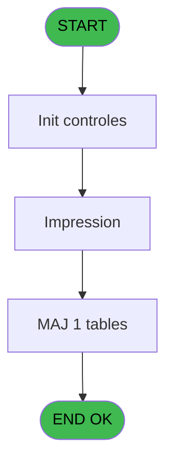
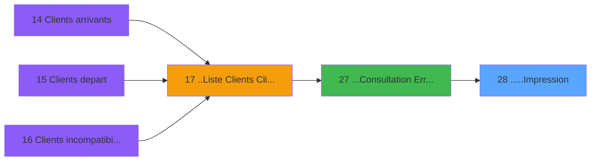

# PTR IDE 28 - .....Impression

> **Analyse**: Phases 1-4 2026-02-03 18:18 -> 18:18 (17s) | Assemblage 18:18
> **Pipeline**: V7.2 Enrichi
> **Structure**: 4 onglets (Resume | Ecrans | Donnees | Connexions)

<!-- TAB:Resume -->

## 1. FICHE D'IDENTITE

| Attribut | Valeur |
|----------|--------|
| Projet | PTR |
| IDE Position | 28 |
| Nom Programme | .....Impression |
| Fichier source | `Prg_28.xml` |
| Dossier IDE | Listes |
| Taches | 2 (1 ecrans visibles) |
| Tables modifiees | 1 |
| Programmes appeles | 1 |

## 2. DESCRIPTION FONCTIONNELLE

**.....Impression** assure la gestion complete de ce processus, accessible depuis [...Consultation Erreurs (IDE 27)](PTR-IDE-27.md).

Le flux de traitement s'organise en **1 blocs fonctionnels** :

- **Traitement** (2 taches) : traitements metier divers

**Donnees modifiees** : 1 tables en ecriture (classe_monetaire_reference).

## 3. BLOCS FONCTIONNELS

### 3.1 Traitement (2 taches)

Traitements internes.

---

#### 28 - .....Impression [[ECRAN]](#ecran-t1)

**Role** : Generation du document : .....Impression.
**Ecran** : 242 x 39 DLU (MDI) | [Voir mockup](#ecran-t1)
**Delegue a** : [LIST - Redirection d'un Etat (IDE 38)](PTR-IDE-38.md)

---

#### 28.1 - Un instant S.V.P. ... [[ECRAN]](#ecran-t2)

**Role** : Traitement : Un instant S.V.P. ....
**Ecran** : 431 x 59 DLU (MDI) | [Voir mockup](#ecran-t2)
**Delegue a** : [LIST - Redirection d'un Etat (IDE 38)](PTR-IDE-38.md)

## 5. REGLES METIER

*(Aucune regle metier identifiee)*

## 6. CONTEXTE

- **Appele par**: [...Consultation Erreurs (IDE 27)](PTR-IDE-27.md)
- **Appelle**: 1 programmes | **Tables**: 1 (W:1 R:0 L:0) | **Taches**: 2 | **Expressions**: 3

<!-- TAB:Ecrans -->

## 8. ECRANS

### 8.1 Forms visibles (1 / 2)

| # | Position | Tache | Nom | Type | Largeur | Hauteur | Bloc |
|---|----------|-------|-----|------|---------|---------|------|
| 1 | 28.1 | 28.1 | Un instant S.V.P. ... | MDI | 431 | 59 | Traitement |

### 8.2 Mockups Ecrans

---

#### 28.1 - Un instant S.V.P. ...
**Tache** : [28.1](#t2) | **Type** : MDI | **Dimensions** : 431 x 59 DLU
**Bloc** : Traitement | **Titre IDE** : Un instant S.V.P. ...

<!-- FORM-DATA:
{
    "width":  431,
    "vFactor":  8,
    "type":  "MDI",
    "hFactor":  8,
    "controls":  [
                     {
                         "x":  12,
                         "type":  "label",
                         "var":  "",
                         "y":  4,
                         "w":  400,
                         "fmt":  "",
                         "name":  "",
                         "h":  48,
                         "color":  "",
                         "text":  "",
                         "parent":  null
                     },
                     {
                         "x":  161,
                         "type":  "label",
                         "var":  "",
                         "y":  18,
                         "w":  221,
                         "fmt":  "",
                         "name":  "",
                         "h":  8,
                         "color":  "7",
                         "text":  "Impression en cours ...",
                         "parent":  1
                     },
                     {
                         "x":  226,
                         "type":  "edit",
                         "var":  "",
                         "y":  29,
                         "w":  37,
                         "fmt":  "",
                         "name":  "",
                         "h":  15,
                         "color":  "",
                         "text":  "",
                         "parent":  1
                     },
                     {
                         "x":  22,
                         "type":  "image",
                         "var":  "",
                         "y":  8,
                         "w":  106,
                         "fmt":  "",
                         "name":  "",
                         "h":  40,
                         "color":  "",
                         "text":  "",
                         "parent":  null
                     }
                 ],
    "taskId":  "28.1",
    "height":  59
}
-->

<strong>Champs : 1 champs</strong>

| Pos (x,y) | Nom | Variable | Type |
|-----------|-----|----------|------|
| 226,29 | (sans nom) | - | edit |

## 9. NAVIGATION

Ecran unique: **Un instant S.V.P. ...**

### 9.3 Structure hierarchique (2 taches)

| Position | Tache | Type | Dimensions | Bloc |
|----------|-------|------|------------|------|
| **28.1** | [**.....Impression** (28)](#t1) [mockup](#ecran-t1) | MDI | 242x39 | Traitement |
| 28.1.1 | [Un instant S.V.P. ... (28.1)](#t2) [mockup](#ecran-t2) | MDI | 431x59 | |

### 9.4 Algorigramme

> **Legende**: Vert = START/END OK | Rouge = END KO | Bleu = Decisions
> *Algorigramme auto-genere. Utiliser `/algorigramme` pour une synthese metier detaillee.*

<!-- TAB:Donnees -->

## 10. TABLES

### Tables utilisees (1)

| ID | Nom | Description | Type | R | W | L | Usages |
|----|-----|-------------|------|---|---|---|--------|
| 681 | classe_monetaire_reference |  | DB |   | **W** |   | 1 |

### Colonnes par table (1 / 1 tables avec colonnes identifiees)

Table 681 - classe_monetaire_reference (**W**) - 1 usages

| Lettre | Variable | Acces | Type |
|--------|----------|-------|------|
| A | P_Societe | W | Alpha |
| B | P_Libelle Liste | W | Alpha |
| C | P_Liste | W | Alpha |
| D | P_Date | W | Date |
| E | P_Village | W | Alpha |
| F | P_Aperçu | W | Logical |
| G | P_Dialogue | W | Logical |
| H | W1-Boucle | W | Alpha |
| I | W1-Titre Edition | W | Alpha |

## 11. VARIABLES

### 11.1 Autres (9)

Variables diverses.

| Lettre | Nom | Type | Usage dans |
|--------|-----|------|-----------|
| A | P_Societe | Alpha | - |
| B | P_Libelle Liste | Alpha | - |
| C | P_Liste | Alpha | - |
| D | P_Date | Date | - |
| E | P_Village | Alpha | - |
| F | V_Apercu | Logical | - |
| G | V_Dialogue | Logical | - |
| H | V_Impression | Logical | 1x refs |
| I | W1-Titre Edition | Alpha | - |

## 12. EXPRESSIONS

**3 / 3 expressions decodees (100%)**

### 12.1 Repartition par type

| Type | Expressions | Regles |
|------|-------------|--------|
| OTHER | 3 | 0 |

### 12.2 Expressions cles par type

#### OTHER (3 expressions)

| Type | IDE | Expression | Regle |
|------|-----|------------|-------|
| OTHER | 3 | `V_Impression [H]` | - |
| OTHER | 2 | `SetCrsr (1)` | - |
| OTHER | 1 | `SetCrsr (2)` | - |

<!-- TAB:Connexions -->

## 13. GRAPHE D'APPELS

### 13.1 Chaine depuis Main (Callers)

Main -> ... -> [...Consultation Erreurs (IDE 27)](PTR-IDE-27.md) -> **.....Impression (IDE 28)**

### 13.2 Callers

| IDE | Nom Programme | Nb Appels |
|-----|---------------|-----------|
| [27](PTR-IDE-27.md) | ...Consultation Erreurs | 1 |

### 13.3 Callees (programmes appeles)

### 13.4 Detail Callees avec contexte

| IDE | Nom Programme | Appels | Contexte |
|-----|---------------|--------|----------|
| [38](PTR-IDE-38.md) | LIST - Redirection d'un Etat | 1 | Configuration impression |

## 14. RECOMMANDATIONS MIGRATION

### 14.1 Profil du programme

| Metrique | Valeur | Impact migration |
|----------|--------|-----------------|
| Lignes de logique | 66 | Programme compact |
| Expressions | 3 | Peu de logique |
| Tables WRITE | 1 | Impact faible |
| Sous-programmes | 1 | Peu de dependances |
| Ecrans visibles | 1 | Ecran unique ou traitement batch |
| Code desactive | 0% (0 / 66) | Code sain |
| Regles metier | 0 | Pas de regle identifiee |

### 14.2 Plan de migration par bloc

#### Traitement (2 taches: 2 ecrans, 0 traitement)

- **Strategie** : 2 composant(s) UI (Razor/React) avec formulaires et validation.
- 1 sous-programme(s) a migrer ou a reutiliser depuis les services existants.
- Decomposer les taches en services unitaires testables.

### 14.3 Dependances critiques

| Dependance | Type | Appels | Impact |
|------------|------|--------|--------|
| classe_monetaire_reference | Table WRITE (Database) | 1x | Schema + repository |
| [LIST - Redirection d'un Etat (IDE 38)](PTR-IDE-38.md) | Sous-programme | 1x | Normale - Configuration impression |

---
*Spec DETAILED generee par Pipeline V7.2 - 2026-02-03 18:18*
