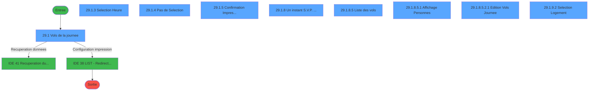
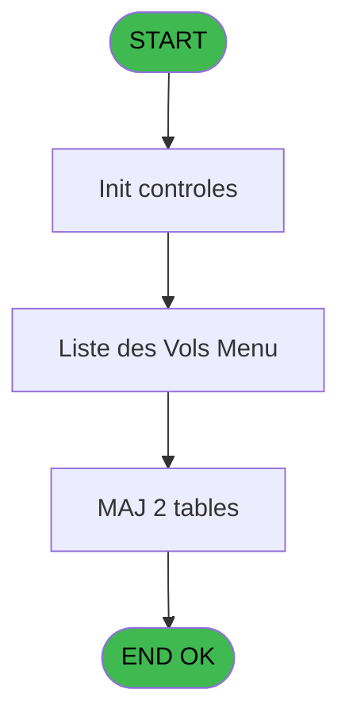
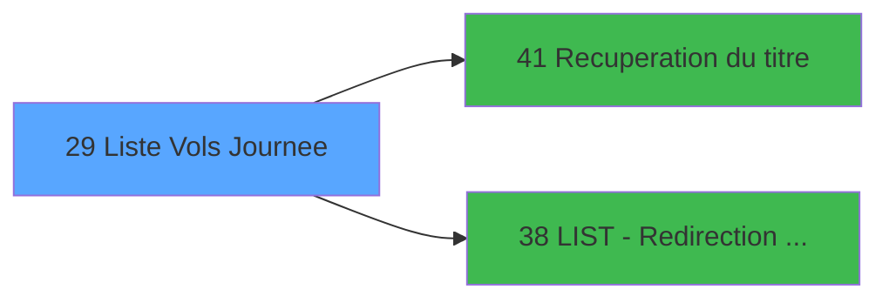

# PTR IDE 29 - Liste Vols Journee

> **Analyse**: Phases 1-4 2026-02-03 18:18 -> 18:18 (13s) | Assemblage 18:18
> **Pipeline**: V7.2 Enrichi
> **Structure**: 4 onglets (Resume | Ecrans | Donnees | Connexions)

<!-- TAB:Resume -->

## 1. FICHE D'IDENTITE

| Attribut | Valeur |
|----------|--------|
| Projet | PTR |
| IDE Position | 29 |
| Nom Programme | Liste Vols Journee |
| Fichier source | `Prg_29.xml` |
| Dossier IDE | Listes |
| Taches | 21 (9 ecrans visibles) |
| Tables modifiees | 2 |
| Programmes appeles | 2 |
| :warning: Statut | **ORPHELIN_POTENTIEL** |

## 2. DESCRIPTION FONCTIONNELLE

**Liste Vols Journee** assure la gestion complete de ce processus.

Le flux de traitement s'organise en **5 blocs fonctionnels** :

- **Traitement** (10 taches) : traitements metier divers
- **Consultation** (7 taches) : ecrans de recherche, selection et consultation
- **Impression** (2 taches) : generation de tickets et documents
- **Validation** (1 tache) : controles et verifications de coherence
- **Initialisation** (1 tache) : reinitialisation d'etats et de variables de travail

**Donnees modifiees** : 2 tables en ecriture (tables_imports, comptes_charge_reference).

**Logique metier** : 5 regles identifiees couvrant conditions metier, valeurs par defaut.

Detail : phases du traitement

#### Phase 1 : Traitement (10 taches)

- **29** - Liste des Vols
- **29.1** - Vols de la journee **[[ECRAN]](#ecran-t2)**
- **29.1.1** - Minimum Date
- **29.1.5** - Confirmation Impression **[[ECRAN]](#ecran-t7)**
- **29.1.6** - Remise à Zero
- **29.1.8** - Un instant S.V.P. ... **[[ECRAN]](#ecran-t10)**
- **29.1.8.2** - Ecriture Temporaire
- **29.1.8.3** - Ecriture Temporaire
- **29.1.8.4** - Efface Temporaire
- **29.1.8.5** - Liste des vols **[[ECRAN]](#ecran-t15)**

Delegue a : [Recuperation du titre (IDE 41)](PTR-IDE-41.md), [LIST - Redirection d'un Etat (IDE 38)](PTR-IDE-38.md)

#### Phase 2 : Consultation (7 taches)

- **29.1.2** - Selection Date
- **29.1.3** - Selection Heure **[[ECRAN]](#ecran-t5)**
- **29.1.4** - Pas de Selection **[[ECRAN]](#ecran-t6)**
- **29.1.8.1** - Recherche Voyageurs
- **29.1.8.5.1** - Affichage Personnes **[[ECRAN]](#ecran-t16)**
- **29.1.9** - Selection Logement
- **29.1.9.2** - Selection Logement **[[ECRAN]](#ecran-t21)**

Delegue a : [Recuperation du titre (IDE 41)](PTR-IDE-41.md)

#### Phase 3 : Initialisation (1 tache)

- **29.1.7** - Definition Age Bebe

#### Phase 4 : Impression (2 taches)

- **29.1.8.5.2** - Edition Vols Journee **[[ECRAN]](#ecran-t17)**
- **29.1.8.5.2.1** - Edition Vols Journee **[[ECRAN]](#ecran-t18)**

Delegue a : [LIST - Redirection d'un Etat (IDE 38)](PTR-IDE-38.md)

#### Phase 5 : Validation (1 tache)

- **29.1.9.1** - Verification Logement

#### Tables impactees

| Table | Operations | Role metier |
|-------|-----------|-------------|
| comptes_charge_reference | R/**W**/L (6 usages) | Comptes GM (generaux) |
| tables_imports | R/**W** (3 usages) |  |

## 3. BLOCS FONCTIONNELS

### 3.1 Traitement (10 taches)

Traitements internes.

---

#### 29 - Liste des Vols

**Role** : Tache d'orchestration : point d'entree du programme (10 sous-taches). Coordonne l'enchainement des traitements.

9 sous-taches directes

| Tache | Nom | Bloc |
|-------|-----|------|
| [29.1](#t2) | Vols de la journee **[[ECRAN]](#ecran-t2)** | Traitement |
| [29.1.1](#t3) | Minimum Date | Traitement |
| [29.1.5](#t7) | Confirmation Impression **[[ECRAN]](#ecran-t7)** | Traitement |
| [29.1.6](#t8) | Remise à Zero | Traitement |
| [29.1.8](#t10) | Un instant S.V.P. ... **[[ECRAN]](#ecran-t10)** | Traitement |
| [29.1.8.2](#t12) | Ecriture Temporaire | Traitement |
| [29.1.8.3](#t13) | Ecriture Temporaire | Traitement |
| [29.1.8.4](#t14) | Efface Temporaire | Traitement |
| [29.1.8.5](#t15) | Liste des vols **[[ECRAN]](#ecran-t15)** | Traitement |

**Variables liees** : BD (W1-Liste Blanche), BK (W1-Position_Liste)
**Delegue a** : [Recuperation du titre (IDE 41)](PTR-IDE-41.md), [LIST - Redirection d'un Etat (IDE 38)](PTR-IDE-38.md)

---

#### 29.1 - Vols de la journee [[ECRAN]](#ecran-t2)

**Role** : Selection par l'operateur : Vols de la journee.
**Ecran** : 694 x 199 DLU (MDI) | [Voir mockup](#ecran-t2)
**Delegue a** : [Recuperation du titre (IDE 41)](PTR-IDE-41.md), [LIST - Redirection d'un Etat (IDE 38)](PTR-IDE-38.md)

---

#### 29.1.1 - Minimum Date

**Role** : Traitement : Minimum Date.
**Variables liees** : G (W0-DateMiniDebut), H (W0-DateMaxiDebut), I (W0-DateMiniFin), J (W0-DateMaxiFin), O (W1-Date Village)
**Delegue a** : [Recuperation du titre (IDE 41)](PTR-IDE-41.md), [LIST - Redirection d'un Etat (IDE 38)](PTR-IDE-38.md)

---

#### 29.1.5 - Confirmation Impression [[ECRAN]](#ecran-t7)

**Role** : Generation du document : Confirmation Impression.
**Ecran** : 256 x 48 DLU (Modal) | [Voir mockup](#ecran-t7)
**Variables liees** : S (W1-Impression)
**Delegue a** : [Recuperation du titre (IDE 41)](PTR-IDE-41.md), [LIST - Redirection d'un Etat (IDE 38)](PTR-IDE-38.md)

---

#### 29.1.6 - Remise à Zero

**Role** : Calcul fidelite/avantage : Remise à Zero.
**Delegue a** : [Recuperation du titre (IDE 41)](PTR-IDE-41.md), [LIST - Redirection d'un Etat (IDE 38)](PTR-IDE-38.md)

---

#### 29.1.8 - Un instant S.V.P. ... [[ECRAN]](#ecran-t10)

**Role** : Traitement : Un instant S.V.P. ....
**Ecran** : 427 x 57 DLU (MDI) | [Voir mockup](#ecran-t10)
**Delegue a** : [Recuperation du titre (IDE 41)](PTR-IDE-41.md), [LIST - Redirection d'un Etat (IDE 38)](PTR-IDE-38.md)

---

#### 29.1.8.2 - Ecriture Temporaire

**Role** : Traitement : Ecriture Temporaire.
**Delegue a** : [Recuperation du titre (IDE 41)](PTR-IDE-41.md), [LIST - Redirection d'un Etat (IDE 38)](PTR-IDE-38.md)

---

#### 29.1.8.3 - Ecriture Temporaire

**Role** : Traitement : Ecriture Temporaire.
**Delegue a** : [Recuperation du titre (IDE 41)](PTR-IDE-41.md), [LIST - Redirection d'un Etat (IDE 38)](PTR-IDE-38.md)

---

#### 29.1.8.4 - Efface Temporaire

**Role** : Traitement : Efface Temporaire.
**Delegue a** : [Recuperation du titre (IDE 41)](PTR-IDE-41.md), [LIST - Redirection d'un Etat (IDE 38)](PTR-IDE-38.md)

---

#### 29.1.8.5 - Liste des vols [[ECRAN]](#ecran-t15)

**Role** : Selection par l'operateur : Liste des vols.
**Ecran** : 1306 x 309 DLU (MDI) | [Voir mockup](#ecran-t15)
**Variables liees** : BD (W1-Liste Blanche), BK (W1-Position_Liste)
**Delegue a** : [Recuperation du titre (IDE 41)](PTR-IDE-41.md), [LIST - Redirection d'un Etat (IDE 38)](PTR-IDE-38.md)

### 3.2 Consultation (7 taches)

Ecrans de recherche et consultation.

---

#### 29.1.2 - Selection Date

**Role** : Selection par l'operateur : Selection Date.
**Variables liees** : G (W0-DateMiniDebut), H (W0-DateMaxiDebut), I (W0-DateMiniFin), J (W0-DateMaxiFin), O (W1-Date Village)

---

#### 29.1.3 - Selection Heure [[ECRAN]](#ecran-t5)

**Role** : Selection par l'operateur : Selection Heure.
**Ecran** : 498 x 95 DLU (MDI) | [Voir mockup](#ecran-t5)
**Variables liees** : P (W1-Heure Village), BG (W1-Heure Mini), BH (W1-Heure Maxi), BI (W1-Libelle Heure), BN (W1-Total Selection)

---

#### 29.1.4 - Pas de Selection [[ECRAN]](#ecran-t6)

**Role** : Selection par l'operateur : Pas de Selection.
**Ecran** : 640 x 68 DLU (Modal) | [Voir mockup](#ecran-t6)
**Variables liees** : BN (W1-Total Selection), BO (W1-Selection 1/5), BP (W1-Selection 6/10), BQ (W1-Selection 11/15)

---

#### 29.1.8.1 - Recherche Voyageurs

**Role** : Traitement : Recherche Voyageurs.

---

#### 29.1.8.5.1 - Affichage Personnes [[ECRAN]](#ecran-t16)

**Role** : Reinitialisation : Affichage Personnes.
**Ecran** : 488 x 224 DLU (Modal) | [Voir mockup](#ecran-t16)
**Variables liees** : R (W1-Affichage)

---

#### 29.1.9 - Selection Logement

**Role** : Selection par l'operateur : Selection Logement.
**Variables liees** : L (V_Titre Logement), Q (W1-Logement), Z (W1-Logement), BN (W1-Total Selection), BO (W1-Selection 1/5)

---

#### 29.1.9.2 - Selection Logement [[ECRAN]](#ecran-t21)

**Role** : Selection par l'operateur : Selection Logement.
**Ecran** : 339 x 164 DLU (MDI) | [Voir mockup](#ecran-t21)
**Variables liees** : L (V_Titre Logement), Q (W1-Logement), Z (W1-Logement), BN (W1-Total Selection), BO (W1-Selection 1/5)

### 3.3 Initialisation (1 tache)

Reinitialisation d'etats et variables de travail.

---

#### 29.1.7 - Definition Age Bebe

**Role** : Reinitialisation : Definition Age Bebe.
**Variables liees** : BB (W1-Bebe)

### 3.4 Impression (2 taches)

Generation des documents et tickets.

---

#### 29.1.8.5.2 - Edition Vols Journee [[ECRAN]](#ecran-t17)

**Role** : Generation du document : Edition Vols Journee.
**Ecran** : 160 x 32 DLU (MDI) | [Voir mockup](#ecran-t17)

---

#### 29.1.8.5.2.1 - Edition Vols Journee [[ECRAN]](#ecran-t18)

**Role** : Generation du document : Edition Vols Journee.
**Ecran** : 421 x 57 DLU (MDI) | [Voir mockup](#ecran-t18)

### 3.5 Validation (1 tache)

Controles de coherence : 1 tache verifie les donnees et conditions.

---

#### 29.1.9.1 - Verification Logement

**Role** : Verification : Verification Logement.
**Variables liees** : L (V_Titre Logement), Q (W1-Logement), Z (W1-Logement)

## 5. REGLES METIER

5 regles identifiees:

### Autres (5 regles)

#### [RM-001] Si W0-Qui [D]='P' alors 0 sinon W0-DateMiniDebut [G])

| Element | Detail |
|---------|--------|
| **Condition** | `W0-Qui [D]='P'` |
| **Si vrai** | 0 |
| **Si faux** | W0-DateMiniDebut [G]) |
| **Variables** | D (W0-Qui), G (W0-DateMiniDebut) |
| **Expression source** | Expression 3 : `IF (W0-Qui [D]='P',0,W0-DateMiniDebut [G])` |
| **Exemple** | Si W0-Qui [D]='P' → 0. Sinon → W0-DateMiniDebut [G]) |

#### [RM-002] Si W0-CleFichierClient [F]=6 alors 0 sinon Date ())

| Element | Detail |
|---------|--------|
| **Condition** | `W0-CleFichierClient [F]=6` |
| **Si vrai** | 0 |
| **Si faux** | Date ()) |
| **Variables** | F (W0-CleFichierClient) |
| **Expression source** | Expression 7 : `IF (W0-CleFichierClient [F]=6,0,Date ())` |
| **Exemple** | Si W0-CleFichierClient [F]=6 → 0. Sinon → Date ()) |

#### [RM-003] Valeur par defaut si GetParam ('SOCIETE') est vide

| Element | Detail |
|---------|--------|
| **Condition** | `GetParam ('SOCIETE')=''` |
| **Si vrai** | 'C' |
| **Si faux** | GetParam ('SOCIETE')) |
| **Expression source** | Expression 11 : `IF (GetParam ('SOCIETE')='','C',GetParam ('SOCIETE'))` |
| **Exemple** | Si GetParam ('SOCIETE')='' → 'C'. Sinon → GetParam ('SOCIETE')) |

#### [RM-004] Valeur par defaut si GetParam ('LANGUE') est vide

| Element | Detail |
|---------|--------|
| **Condition** | `GetParam ('LANGUE')=''` |
| **Si vrai** | 'F' |
| **Si faux** | GetParam ('LANGUE')) |
| **Expression source** | Expression 15 : `IF (GetParam ('LANGUE')='','F',GetParam ('LANGUE'))` |
| **Exemple** | Si GetParam ('LANGUE')='' → 'F'. Sinon → GetParam ('LANGUE')) |

#### [RM-005] Si W0-Qui [D]='A' alors MlsTrans ('ARRIVANTS') sinon IF (W0-Qui [D]='V',MlsTrans ('ARRIVEES'),IF (W0-Qui [D]='P',MlsTrans ('PRESENTS'),IF (W0-Qui [D]='D',MlsTrans ('DEPARTS'),IF (W0-Qui [D]='R',MlsTrans ('PARTANTS'),MlsTrans ('ABSENTS'))))))

| Element | Detail |
|---------|--------|
| **Condition** | `W0-Qui [D]='A'` |
| **Si vrai** | MlsTrans ('ARRIVANTS') |
| **Si faux** | IF (W0-Qui [D]='V',MlsTrans ('ARRIVEES'),IF (W0-Qui [D]='P',MlsTrans ('PRESENTS'),IF (W0-Qui [D]='D',MlsTrans ('DEPARTS'),IF (W0-Qui [D]='R',MlsTrans ('PARTANTS'),MlsTrans ('ABSENTS')))))) |
| **Variables** | D (W0-Qui) |
| **Expression source** | Expression 17 : `IF (W0-Qui [D]='A',MlsTrans ('ARRIVANTS'),IF (W0-Qui [D]='V'` |
| **Exemple** | Si W0-Qui [D]='A' → MlsTrans ('ARRIVANTS') |

## 6. CONTEXTE

- **Appele par**: (aucun)
- **Appelle**: 2 programmes | **Tables**: 8 (W:2 R:6 L:4) | **Taches**: 21 | **Expressions**: 19

<!-- TAB:Ecrans -->

## 8. ECRANS

### 8.1 Forms visibles (9 / 21)

| # | Position | Tache | Nom | Type | Largeur | Hauteur | Bloc |
|---|----------|-------|-----|------|---------|---------|------|
| 1 | 29.1 | 29.1 | Vols de la journee | MDI | 694 | 199 | Traitement |
| 2 | 29.1.3 | 29.1.3 | Selection Heure | MDI | 498 | 95 | Consultation |
| 3 | 29.1.4 | 29.1.4 | Pas de Selection | Modal | 640 | 68 | Consultation |
| 4 | 29.1.5 | 29.1.5 | Confirmation Impression | Modal | 256 | 48 | Traitement |
| 5 | 29.1.8 | 29.1.8 | Un instant S.V.P. ... | MDI | 427 | 57 | Traitement |
| 6 | 29.1.8.5 | 29.1.8.5 | Liste des vols | MDI | 1306 | 309 | Traitement |
| 7 | 29.1.8.5.1 | 29.1.8.5.1 | Affichage Personnes | Modal | 488 | 224 | Consultation |
| 8 | 29.1.8.5.2.1 | 29.1.8.5.2.1 | Edition Vols Journee | MDI | 421 | 57 | Impression |
| 9 | 29.1.9.2 | 29.1.9.2 | Selection Logement | MDI | 339 | 164 | Consultation |

### 8.2 Mockups Ecrans

---

#### 29.1 - Vols de la journee
**Tache** : [29.1](#t2) | **Type** : MDI | **Dimensions** : 694 x 199 DLU
**Bloc** : Traitement | **Titre IDE** : Vols de la journee

<!-- FORM-DATA:
{
    "width":  694,
    "vFactor":  8,
    "type":  "MDI",
    "hFactor":  8,
    "controls":  [
                     {
                         "x":  0,
                         "type":  "label",
                         "var":  "",
                         "y":  0,
                         "w":  695,
                         "fmt":  "",
                         "name":  "",
                         "h":  20,
                         "color":  "",
                         "text":  "",
                         "parent":  null
                     },
                     {
                         "x":  6,
                         "type":  "label",
                         "var":  "",
                         "y":  25,
                         "w":  490,
                         "fmt":  "",
                         "name":  "",
                         "h":  144,
                         "color":  "",
                         "text":  "",
                         "parent":  null
                     },
                     {
                         "x":  507,
                         "type":  "label",
                         "var":  "",
                         "y":  26,
                         "w":  181,
                         "fmt":  "",
                         "name":  "",
                         "h":  144,
                         "color":  "",
                         "text":  "",
                         "parent":  null
                     },
                     {
                         "x":  101,
                         "type":  "label",
                         "var":  "",
                         "y":  45,
                         "w":  58,
                         "fmt":  "",
                         "name":  "",
                         "h":  8,
                         "color":  "",
                         "text":  "Village",
                         "parent":  4
                     },
                     {
                         "x":  101,
                         "type":  "label",
                         "var":  "",
                         "y":  57,
                         "w":  45,
                         "fmt":  "",
                         "name":  "",
                         "h":  8,
                         "color":  "",
                         "text":  "Date",
                         "parent":  4
                     },
                     {
                         "x":  101,
                         "type":  "label",
                         "var":  "",
                         "y":  83,
                         "w":  40,
                         "fmt":  "",
                         "name":  "",
                         "h":  8,
                         "color":  "",
                         "text":  "Vols",
                         "parent":  4
                     },
                     {
                         "x":  101,
                         "type":  "label",
                         "var":  "",
                         "y":  95,
                         "w":  88,
                         "fmt":  "",
                         "name":  "",
                         "h":  8,
                         "color":  "",
                         "text":  "Personnes",
                         "parent":  4
                     },
                     {
                         "x":  101,
                         "type":  "label",
                         "var":  "",
                         "y":  109,
                         "w":  69,
                         "fmt":  "",
                         "name":  "",
                         "h":  8,
                         "color":  "",
                         "text":  "Aller",
                         "parent":  4
                     },
                     {
                         "x":  101,
                         "type":  "label",
                         "var":  "",
                         "y":  121,
                         "w":  59,
                         "fmt":  "",
                         "name":  "",
                         "h":  8,
                         "color":  "",
                         "text":  "Retour",
                         "parent":  4
                     },
                     {
                         "x":  101,
                         "type":  "label",
                         "var":  "",
                         "y":  142,
                         "w":  109,
                         "fmt":  "",
                         "name":  "",
                         "h":  8,
                         "color":  "",
                         "text":  "Divers",
                         "parent":  4
                     },
                     {
                         "x":  6,
                         "type":  "label",
                         "var":  "",
                         "y":  172,
                         "w":  682,
                         "fmt":  "",
                         "name":  "",
                         "h":  24,
                         "color":  "",
                         "text":  "",
                         "parent":  null
                     },
                     {
                         "x":  17,
                         "type":  "button",
                         "var":  "",
                         "y":  176,
                         "w":  154,
                         "fmt":  "\u0026Quitter",
                         "name":  "B_Quitter",
                         "h":  18,
                         "color":  "",
                         "text":  "",
                         "parent":  null
                     },
                     {
                         "x":  237,
                         "type":  "edit",
                         "var":  "",
                         "y":  83,
                         "w":  78,
                         "fmt":  "#4Z",
                         "name":  "",
                         "h":  9,
                         "color":  "",
                         "text":  "",
                         "parent":  4
                     },
                     {
                         "x":  237,
                         "type":  "edit",
                         "var":  "",
                         "y":  95,
                         "w":  78,
                         "fmt":  "#4Z",
                         "name":  "",
                         "h":  9,
                         "color":  "",
                         "text":  "",
                         "parent":  4
                     },
                     {
                         "x":  521,
                         "type":  "button",
                         "var":  "",
                         "y":  143,
                         "w":  154,
                         "fmt":  "\u0026Ecran",
                         "name":  "B_Ecran",
                         "h":  18,
                         "color":  "",
                         "text":  "",
                         "parent":  5
                     },
                     {
                         "x":  237,
                         "type":  "edit",
                         "var":  "",
                         "y":  109,
                         "w":  78,
                         "fmt":  "6Z",
                         "name":  "",
                         "h":  9,
                         "color":  "",
                         "text":  "",
                         "parent":  4
                     },
                     {
                         "x":  237,
                         "type":  "edit",
                         "var":  "",
                         "y":  121,
                         "w":  78,
                         "fmt":  "6Z",
                         "name":  "",
                         "h":  9,
                         "color":  "",
                         "text":  "",
                         "parent":  4
                     },
                     {
                         "x":  237,
                         "type":  "edit",
                         "var":  "",
                         "y":  142,
                         "w":  78,
                         "fmt":  "6Z",
                         "name":  "",
                         "h":  9,
                         "color":  "",
                         "text":  "",
                         "parent":  4
                     },
                     {
                         "x":  6,
                         "type":  "edit",
                         "var":  "",
                         "y":  6,
                         "w":  396,
                         "fmt":  "30",
                         "name":  "",
                         "h":  8,
                         "color":  "",
                         "text":  "",
                         "parent":  1
                     },
                     {
                         "x":  415,
                         "type":  "edit",
                         "var":  "",
                         "y":  6,
                         "w":  268,
                         "fmt":  "WWW DD MMM YYYYT",
                         "name":  "",
                         "h":  8,
                         "color":  "",
                         "text":  "",
                         "parent":  1
                     },
                     {
                         "x":  237,
                         "type":  "edit",
                         "var":  "",
                         "y":  45,
                         "w":  202,
                         "fmt":  "U17",
                         "name":  "",
                         "h":  9,
                         "color":  "",
                         "text":  "",
                         "parent":  4
                     },
                     {
                         "x":  518,
                         "type":  "image",
                         "var":  "",
                         "y":  48,
                         "w":  160,
                         "fmt":  "",
                         "name":  "",
                         "h":  60,
                         "color":  "",
                         "text":  "",
                         "parent":  5
                     },
                     {
                         "x":  237,
                         "type":  "edit",
                         "var":  "",
                         "y":  57,
                         "w":  123,
                         "fmt":  "DD/MM/YYYYZ",
                         "name":  "",
                         "h":  9,
                         "color":  "",
                         "text":  "",
                         "parent":  4
                     },
                     {
                         "x":  360,
                         "type":  "button",
                         "var":  "",
                         "y":  176,
                         "w":  154,
                         "fmt":  "\u0026Date",
                         "name":  "",
                         "h":  18,
                         "color":  "",
                         "text":  "",
                         "parent":  null
                     },
                     {
                         "x":  521,
                         "type":  "button",
                         "var":  "",
                         "y":  176,
                         "w":  154,
                         "fmt":  "\u0026Sejour",
                         "name":  "",
                         "h":  18,
                         "color":  "",
                         "text":  "",
                         "parent":  null
                     }
                 ],
    "taskId":  "29.1",
    "height":  199
}
-->

<strong>Champs : 9 champs</strong>

| Pos (x,y) | Nom | Variable | Type |
|-----------|-----|----------|------|
| 237,83 | #4Z | - | edit |
| 237,95 | #4Z | - | edit |
| 237,109 | 6Z | - | edit |
| 237,121 | 6Z | - | edit |
| 237,142 | 6Z | - | edit |
| 6,6 | 30 | - | edit |
| 415,6 | WWW DD MMM YYYYT | - | edit |
| 237,45 | U17 | - | edit |
| 237,57 | DD/MM/YYYYZ | - | edit |

<strong>Boutons : 4 boutons</strong>

| Bouton | Pos (x,y) | Action |
|--------|-----------|--------|
| Quitter | 17,176 | Quitte le programme |
| Ecran | 521,143 | Bouton fonctionnel |
| Date | 360,176 | Bouton fonctionnel |
| Sejour | 521,176 | Bouton fonctionnel |

---

#### 29.1.3 - Selection Heure
**Tache** : [29.1.3](#t5) | **Type** : MDI | **Dimensions** : 498 x 95 DLU
**Bloc** : Consultation | **Titre IDE** : Selection Heure

<!-- FORM-DATA:
{
    "width":  498,
    "vFactor":  8,
    "type":  "MDI",
    "hFactor":  8,
    "controls":  [
                     {
                         "x":  202,
                         "type":  "label",
                         "var":  "",
                         "y":  17,
                         "w":  260,
                         "fmt":  "",
                         "name":  "",
                         "h":  34,
                         "color":  "1",
                         "text":  "",
                         "parent":  null
                     },
                     {
                         "x":  270,
                         "type":  "label",
                         "var":  "",
                         "y":  30,
                         "w":  54,
                         "fmt":  "",
                         "name":  "",
                         "h":  9,
                         "color":  "",
                         "text":  "Heure",
                         "parent":  2
                     },
                     {
                         "x":  0,
                         "type":  "label",
                         "var":  "",
                         "y":  68,
                         "w":  492,
                         "fmt":  "",
                         "name":  "",
                         "h":  24,
                         "color":  "1",
                         "text":  "",
                         "parent":  null
                     },
                     {
                         "x":  334,
                         "type":  "edit",
                         "var":  "",
                         "y":  30,
                         "w":  34,
                         "fmt":  "2P0Z0",
                         "name":  "",
                         "h":  9,
                         "color":  "",
                         "text":  "",
                         "parent":  2
                     },
                     {
                         "x":  373,
                         "type":  "edit",
                         "var":  "",
                         "y":  30,
                         "w":  22,
                         "fmt":  "UA",
                         "name":  "W2-Choix",
                         "h":  9,
                         "color":  "",
                         "text":  "",
                         "parent":  2
                     },
                     {
                         "x":  30,
                         "type":  "image",
                         "var":  "",
                         "y":  16,
                         "w":  160,
                         "fmt":  "",
                         "name":  "",
                         "h":  35,
                         "color":  "7",
                         "text":  "",
                         "parent":  null
                     },
                     {
                         "x":  9,
                         "type":  "button",
                         "var":  "",
                         "y":  71,
                         "w":  154,
                         "fmt":  "\u0026Quitter",
                         "name":  "",
                         "h":  18,
                         "color":  "",
                         "text":  "",
                         "parent":  null
                     }
                 ],
    "taskId":  "29.1.3",
    "height":  95
}
-->

<strong>Champs : 2 champs</strong>

| Pos (x,y) | Nom | Variable | Type |
|-----------|-----|----------|------|
| 334,30 | 2P0Z0 | - | edit |
| 373,30 | W2-Choix | - | edit |

<strong>Boutons : 1 boutons</strong>

| Bouton | Pos (x,y) | Action |
|--------|-----------|--------|
| Quitter | 9,71 | Quitte le programme |

---

#### 29.1.4 - Pas de Selection
**Tache** : [29.1.4](#t6) | **Type** : Modal | **Dimensions** : 640 x 68 DLU
**Bloc** : Consultation | **Titre IDE** : Pas de Selection

<!-- FORM-DATA:
{
    "width":  640,
    "vFactor":  8,
    "type":  "Modal",
    "hFactor":  8,
    "controls":  [
                     {
                         "x":  244,
                         "type":  "label",
                         "var":  "",
                         "y":  30,
                         "w":  152,
                         "fmt":  "",
                         "name":  "",
                         "h":  8,
                         "color":  "",
                         "text":  "Aucune Selection !!",
                         "parent":  null
                     }
                 ],
    "taskId":  "29.1.4",
    "height":  68
}
-->

---

#### 29.1.5 - Confirmation Impression
**Tache** : [29.1.5](#t7) | **Type** : Modal | **Dimensions** : 256 x 48 DLU
**Bloc** : Traitement | **Titre IDE** : Confirmation Impression

<!-- FORM-DATA:
{
    "width":  256,
    "vFactor":  8,
    "type":  "Modal",
    "hFactor":  8,
    "controls":  [
                     {
                         "x":  8,
                         "type":  "label",
                         "var":  "",
                         "y":  8,
                         "w":  248,
                         "fmt":  "",
                         "name":  "",
                         "h":  8,
                         "color":  "173",
                         "text":  "Verifiez Papier/Imprimante!",
                         "parent":  null
                     },
                     {
                         "x":  64,
                         "type":  "label",
                         "var":  "",
                         "y":  24,
                         "w":  136,
                         "fmt":  "",
                         "name":  "",
                         "h":  8,
                         "color":  "173",
                         "text":  "Confirmez (O/N) ?",
                         "parent":  null
                     },
                     {
                         "x":  208,
                         "type":  "edit",
                         "var":  "",
                         "y":  24,
                         "w":  8,
                         "fmt":  "UA",
                         "name":  "W2-Confirmation",
                         "h":  8,
                         "color":  "173",
                         "text":  "",
                         "parent":  null
                     }
                 ],
    "taskId":  "29.1.5",
    "height":  48
}
-->

<strong>Champs : 1 champs</strong>

| Pos (x,y) | Nom | Variable | Type |
|-----------|-----|----------|------|
| 208,24 | W2-Confirmation | - | edit |

---

#### 29.1.8 - Un instant S.V.P. ...
**Tache** : [29.1.8](#t10) | **Type** : MDI | **Dimensions** : 427 x 57 DLU
**Bloc** : Traitement | **Titre IDE** : Un instant S.V.P. ...

<!-- FORM-DATA:
{
    "width":  427,
    "vFactor":  8,
    "type":  "MDI",
    "hFactor":  8,
    "controls":  [
                     {
                         "x":  12,
                         "type":  "label",
                         "var":  "",
                         "y":  4,
                         "w":  400,
                         "fmt":  "",
                         "name":  "",
                         "h":  48,
                         "color":  "",
                         "text":  "",
                         "parent":  null
                     },
                     {
                         "x":  161,
                         "type":  "label",
                         "var":  "",
                         "y":  18,
                         "w":  221,
                         "fmt":  "",
                         "name":  "",
                         "h":  8,
                         "color":  "7",
                         "text":  "Preparation en cours ...",
                         "parent":  1
                     },
                     {
                         "x":  22,
                         "type":  "image",
                         "var":  "",
                         "y":  8,
                         "w":  106,
                         "fmt":  "",
                         "name":  "",
                         "h":  40,
                         "color":  "",
                         "text":  "",
                         "parent":  null
                     },
                     {
                         "x":  226,
                         "type":  "edit",
                         "var":  "",
                         "y":  29,
                         "w":  37,
                         "fmt":  "",
                         "name":  "",
                         "h":  15,
                         "color":  "",
                         "text":  "",
                         "parent":  1
                     }
                 ],
    "taskId":  "29.1.8",
    "height":  57
}
-->

<strong>Champs : 1 champs</strong>

| Pos (x,y) | Nom | Variable | Type |
|-----------|-----|----------|------|
| 226,29 | (sans nom) | - | edit |

---

#### 29.1.8.5 - Liste des vols
**Tache** : [29.1.8.5](#t15) | **Type** : MDI | **Dimensions** : 1306 x 309 DLU
**Bloc** : Traitement | **Titre IDE** : Liste des vols

<!-- FORM-DATA:
{
    "width":  1306,
    "vFactor":  8,
    "type":  "MDI",
    "hFactor":  8,
    "controls":  [
                     {
                         "x":  2,
                         "type":  "label",
                         "var":  "",
                         "y":  1,
                         "w":  1303,
                         "fmt":  "",
                         "name":  "",
                         "h":  18,
                         "color":  "",
                         "text":  "",
                         "parent":  null
                     },
                     {
                         "x":  5,
                         "type":  "label",
                         "var":  "",
                         "y":  44,
                         "w":  782,
                         "fmt":  "",
                         "name":  "",
                         "h":  215,
                         "color":  "195",
                         "text":  "Liste des vols",
                         "parent":  null
                     },
                     {
                         "x":  799,
                         "type":  "label",
                         "var":  "",
                         "y":  44,
                         "w":  495,
                         "fmt":  "",
                         "name":  "",
                         "h":  236,
                         "color":  "195",
                         "text":  "Liste des passagers",
                         "parent":  null
                     },
                     {
                         "x":  10,
                         "type":  "table",
                         "var":  "",
                         "name":  "",
                         "titleH":  12,
                         "color":  "110",
                         "w":  775,
                         "y":  53,
                         "fmt":  "",
                         "parent":  null,
                         "text":  "",
                         "rowH":  12,
                         "h":  198,
                         "cols":  [
                                      {
                                          "title":  "Type",
                                          "layer":  1,
                                          "w":  80
                                      },
                                      {
                                          "title":  "Transport",
                                          "layer":  2,
                                          "w":  217
                                      },
                                      {
                                          "title":  "Vol",
                                          "layer":  3,
                                          "w":  119
                                      },
                                      {
                                          "title":  "Ville",
                                          "layer":  4,
                                          "w":  81
                                      },
                                      {
                                          "title":  "Heure",
                                          "layer":  5,
                                          "w":  74
                                      },
                                      {
                                          "title":  "GM",
                                          "layer":  6,
                                          "w":  83
                                      },
                                      {
                                          "title":  "GO",
                                          "layer":  7,
                                          "w":  86
                                      }
                                  ],
                         "rows":  7
                     },
                     {
                         "x":  5,
                         "type":  "label",
                         "var":  "",
                         "y":  254,
                         "w":  782,
                         "fmt":  "",
                         "name":  "",
                         "h":  26,
                         "color":  "",
                         "text":  "",
                         "parent":  null
                     },
                     {
                         "x":  470,
                         "type":  "label",
                         "var":  "",
                         "y":  268,
                         "w":  103,
                         "fmt":  "",
                         "name":  "",
                         "h":  9,
                         "color":  "142",
                         "text":  "Total",
                         "parent":  21
                     },
                     {
                         "x":  0,
                         "type":  "label",
                         "var":  "",
                         "y":  283,
                         "w":  1303,
                         "fmt":  "",
                         "name":  "",
                         "h":  24,
                         "color":  "",
                         "text":  "",
                         "parent":  null
                     },
                     {
                         "x":  2,
                         "type":  "label",
                         "var":  "",
                         "y":  20,
                         "w":  1303,
                         "fmt":  "",
                         "name":  "",
                         "h":  18,
                         "color":  "",
                         "text":  "",
                         "parent":  null
                     },
                     {
                         "x":  14,
                         "type":  "label",
                         "var":  "",
                         "y":  25,
                         "w":  131,
                         "fmt":  "",
                         "name":  "",
                         "h":  10,
                         "color":  "",
                         "text":  "Lieu de séjour",
                         "parent":  71
                     },
                     {
                         "x":  581,
                         "type":  "label",
                         "var":  "",
                         "y":  259,
                         "w":  78,
                         "fmt":  "",
                         "name":  "",
                         "h":  9,
                         "color":  "1",
                         "text":  "GM",
                         "parent":  21
                     },
                     {
                         "x":  678,
                         "type":  "label",
                         "var":  "",
                         "y":  259,
                         "w":  78,
                         "fmt":  "",
                         "name":  "",
                         "h":  9,
                         "color":  "1",
                         "text":  "GO",
                         "parent":  21
                     },
                     {
                         "x":  21,
                         "type":  "edit",
                         "var":  "",
                         "y":  69,
                         "w":  59,
                         "fmt":  "",
                         "name":  "TMP Aller/Retour/Div",
                         "h":  8,
                         "color":  "110",
                         "text":  "",
                         "parent":  6
                     },
                     {
                         "x":  106,
                         "type":  "edit",
                         "var":  "",
                         "y":  69,
                         "w":  194,
                         "fmt":  "",
                         "name":  "",
                         "h":  8,
                         "color":  "110",
                         "text":  "",
                         "parent":  6
                     },
                     {
                         "x":  350,
                         "type":  "edit",
                         "var":  "",
                         "y":  69,
                         "w":  68,
                         "fmt":  "",
                         "name":  "",
                         "h":  8,
                         "color":  "110",
                         "text":  "",
                         "parent":  6
                     },
                     {
                         "x":  437,
                         "type":  "edit",
                         "var":  "",
                         "y":  69,
                         "w":  62,
                         "fmt":  "",
                         "name":  "",
                         "h":  8,
                         "color":  "110",
                         "text":  "",
                         "parent":  6
                     },
                     {
                         "x":  518,
                         "type":  "edit",
                         "var":  "",
                         "y":  69,
                         "w":  56,
                         "fmt":  "",
                         "name":  "",
                         "h":  8,
                         "color":  "110",
                         "text":  "",
                         "parent":  6
                     },
                     {
                         "x":  592,
                         "type":  "edit",
                         "var":  "",
                         "y":  69,
                         "w":  67,
                         "fmt":  "",
                         "name":  "",
                         "h":  8,
                         "color":  "110",
                         "text":  "",
                         "parent":  6
                     },
                     {
                         "x":  675,
                         "type":  "edit",
                         "var":  "",
                         "y":  69,
                         "w":  67,
                         "fmt":  "",
                         "name":  "",
                         "h":  8,
                         "color":  "110",
                         "text":  "",
                         "parent":  6
                     },
                     {
                         "x":  581,
                         "type":  "edit",
                         "var":  "",
                         "y":  268,
                         "w":  78,
                         "fmt":  "",
                         "name":  "",
                         "h":  9,
                         "color":  "",
                         "text":  "",
                         "parent":  21
                     },
                     {
                         "x":  678,
                         "type":  "edit",
                         "var":  "",
                         "y":  268,
                         "w":  78,
                         "fmt":  "",
                         "name":  "",
                         "h":  9,
                         "color":  "",
                         "text":  "",
                         "parent":  21
                     },
                     {
                         "x":  14,
                         "type":  "edit",
                         "var":  "",
                         "y":  6,
                         "w":  344,
                         "fmt":  "30",
                         "name":  "",
                         "h":  8,
                         "color":  "",
                         "text":  "",
                         "parent":  1
                     },
                     {
                         "x":  933,
                         "type":  "edit",
                         "var":  "",
                         "y":  6,
                         "w":  344,
                         "fmt":  "WWW DD MMM YYYYT",
                         "name":  "",
                         "h":  8,
                         "color":  "",
                         "text":  "",
                         "parent":  null
                     },
                     {
                         "x":  6,
                         "type":  "button",
                         "var":  "",
                         "y":  286,
                         "w":  154,
                         "fmt":  "\u0026Quitter",
                         "name":  "",
                         "h":  18,
                         "color":  "",
                         "text":  "",
                         "parent":  25
                     },
                     {
                         "x":  964,
                         "type":  "button",
                         "var":  "",
                         "y":  287,
                         "w":  154,
                         "fmt":  "\u0026Impression",
                         "name":  "",
                         "h":  18,
                         "color":  "",
                         "text":  "",
                         "parent":  25
                     },
                     {
                         "x":  1134,
                         "type":  "button",
                         "var":  "",
                         "y":  287,
                         "w":  154,
                         "fmt":  "\u0026Voir",
                         "name":  "",
                         "h":  18,
                         "color":  "",
                         "text":  "",
                         "parent":  25
                     },
                     {
                         "x":  155,
                         "type":  "edit",
                         "var":  "",
                         "y":  25,
                         "w":  230,
                         "fmt":  "",
                         "name":  "nom_import",
                         "h":  10,
                         "color":  "",
                         "text":  "",
                         "parent":  71
                     },
                     {
                         "x":  313,
                         "type":  "edit",
                         "var":  "",
                         "y":  69,
                         "w":  25,
                         "fmt":  "",
                         "name":  "tmp_compagnie",
                         "h":  8,
                         "color":  "110",
                         "text":  "",
                         "parent":  6
                     }
                 ],
    "taskId":  "29.1.8.5",
    "height":  309
}
-->

<strong>Champs : 13 champs</strong>

| Pos (x,y) | Nom | Variable | Type |
|-----------|-----|----------|------|
| 21,69 | TMP Aller/Retour/Div | - | edit |
| 106,69 | (sans nom) | - | edit |
| 350,69 | (sans nom) | - | edit |
| 437,69 | (sans nom) | - | edit |
| 518,69 | (sans nom) | - | edit |
| 592,69 | (sans nom) | - | edit |
| 675,69 | (sans nom) | - | edit |
| 581,268 | (sans nom) | - | edit |
| 678,268 | (sans nom) | - | edit |
| 14,6 | 30 | - | edit |
| 933,6 | WWW DD MMM YYYYT | - | edit |
| 155,25 | nom_import | - | edit |
| 313,69 | tmp_compagnie | - | edit |

<strong>Boutons : 3 boutons</strong>

| Bouton | Pos (x,y) | Action |
|--------|-----------|--------|
| Quitter | 6,286 | Quitte le programme |
| Impression | 964,287 | Bouton fonctionnel |
| Voir | 1134,287 | Bouton fonctionnel |

---

#### 29.1.8.5.1 - Affichage Personnes
**Tache** : [29.1.8.5.1](#t16) | **Type** : Modal | **Dimensions** : 488 x 224 DLU
**Bloc** : Consultation | **Titre IDE** : Affichage Personnes

<!-- FORM-DATA:
{
    "width":  488,
    "vFactor":  8,
    "type":  "Modal",
    "hFactor":  8,
    "controls":  [
                     {
                         "x":  10,
                         "type":  "label",
                         "var":  "",
                         "y":  0,
                         "w":  32,
                         "fmt":  "",
                         "name":  "",
                         "h":  9,
                         "color":  "",
                         "text":  "Vol",
                         "parent":  null
                     },
                     {
                         "x":  267,
                         "type":  "label",
                         "var":  "",
                         "y":  0,
                         "w":  27,
                         "fmt":  "",
                         "name":  "",
                         "h":  9,
                         "color":  "",
                         "text":  "du",
                         "parent":  null
                     },
                     {
                         "x":  2,
                         "type":  "table",
                         "var":  "",
                         "name":  "",
                         "titleH":  12,
                         "color":  "110",
                         "w":  486,
                         "y":  11,
                         "fmt":  "",
                         "parent":  null,
                         "text":  "",
                         "rowH":  12,
                         "h":  210,
                         "cols":  [
                                      {
                                          "title":  "Titre",
                                          "layer":  1,
                                          "w":  55
                                      },
                                      {
                                          "title":  "Nom",
                                          "layer":  2,
                                          "w":  229
                                      },
                                      {
                                          "title":  "Prénom",
                                          "layer":  3,
                                          "w":  166
                                      }
                                  ],
                         "rows":  3
                     },
                     {
                         "x":  13,
                         "type":  "edit",
                         "var":  "",
                         "y":  24,
                         "w":  30,
                         "fmt":  "",
                         "name":  "",
                         "h":  8,
                         "color":  "110",
                         "text":  "",
                         "parent":  8
                     },
                     {
                         "x":  72,
                         "type":  "edit",
                         "var":  "",
                         "y":  24,
                         "w":  203,
                         "fmt":  "",
                         "name":  "",
                         "h":  8,
                         "color":  "110",
                         "text":  "",
                         "parent":  8
                     },
                     {
                         "x":  298,
                         "type":  "edit",
                         "var":  "",
                         "y":  24,
                         "w":  150,
                         "fmt":  "",
                         "name":  "",
                         "h":  8,
                         "color":  "110",
                         "text":  "",
                         "parent":  8
                     },
                     {
                         "x":  113,
                         "type":  "edit",
                         "var":  "",
                         "y":  0,
                         "w":  78,
                         "fmt":  "30",
                         "name":  "",
                         "h":  9,
                         "color":  "",
                         "text":  "",
                         "parent":  null
                     },
                     {
                         "x":  190,
                         "type":  "edit",
                         "var":  "",
                         "y":  0,
                         "w":  70,
                         "fmt":  "",
                         "name":  "",
                         "h":  9,
                         "color":  "",
                         "text":  "",
                         "parent":  null
                     },
                     {
                         "x":  291,
                         "type":  "edit",
                         "var":  "",
                         "y":  0,
                         "w":  110,
                         "fmt":  "DD/MM/YYYYZ",
                         "name":  "",
                         "h":  9,
                         "color":  "",
                         "text":  "",
                         "parent":  null
                     },
                     {
                         "x":  408,
                         "type":  "edit",
                         "var":  "",
                         "y":  0,
                         "w":  67,
                         "fmt":  "",
                         "name":  "",
                         "h":  9,
                         "color":  "",
                         "text":  "",
                         "parent":  null
                     },
                     {
                         "x":  42,
                         "type":  "edit",
                         "var":  "",
                         "y":  0,
                         "w":  78,
                         "fmt":  "",
                         "name":  "",
                         "h":  9,
                         "color":  "",
                         "text":  "",
                         "parent":  null
                     }
                 ],
    "taskId":  "29.1.8.5.1",
    "height":  224
}
-->

<strong>Champs : 8 champs</strong>

| Pos (x,y) | Nom | Variable | Type |
|-----------|-----|----------|------|
| 13,24 | (sans nom) | - | edit |
| 72,24 | (sans nom) | - | edit |
| 298,24 | (sans nom) | - | edit |
| 113,0 | 30 | - | edit |
| 190,0 | (sans nom) | - | edit |
| 291,0 | DD/MM/YYYYZ | - | edit |
| 408,0 | (sans nom) | - | edit |
| 42,0 | (sans nom) | - | edit |

---

#### 29.1.8.5.2.1 - Edition Vols Journee
**Tache** : [29.1.8.5.2.1](#t18) | **Type** : MDI | **Dimensions** : 421 x 57 DLU
**Bloc** : Impression | **Titre IDE** : Edition Vols Journee

<!-- FORM-DATA:
{
    "width":  421,
    "vFactor":  8,
    "type":  "MDI",
    "hFactor":  8,
    "controls":  [
                     {
                         "x":  12,
                         "type":  "label",
                         "var":  "",
                         "y":  4,
                         "w":  400,
                         "fmt":  "",
                         "name":  "",
                         "h":  48,
                         "color":  "",
                         "text":  "",
                         "parent":  null
                     },
                     {
                         "x":  161,
                         "type":  "label",
                         "var":  "",
                         "y":  18,
                         "w":  221,
                         "fmt":  "",
                         "name":  "",
                         "h":  8,
                         "color":  "7",
                         "text":  "Impression en cours ...",
                         "parent":  1
                     },
                     {
                         "x":  22,
                         "type":  "image",
                         "var":  "",
                         "y":  8,
                         "w":  106,
                         "fmt":  "",
                         "name":  "",
                         "h":  40,
                         "color":  "",
                         "text":  "",
                         "parent":  null
                     },
                     {
                         "x":  226,
                         "type":  "edit",
                         "var":  "",
                         "y":  29,
                         "w":  37,
                         "fmt":  "",
                         "name":  "",
                         "h":  15,
                         "color":  "",
                         "text":  "",
                         "parent":  1
                     }
                 ],
    "taskId":  "29.1.8.5.2.1",
    "height":  57
}
-->

<strong>Champs : 1 champs</strong>

| Pos (x,y) | Nom | Variable | Type |
|-----------|-----|----------|------|
| 226,29 | (sans nom) | - | edit |

---

#### 29.1.9.2 - Selection Logement
**Tache** : [29.1.9.2](#t21) | **Type** : MDI | **Dimensions** : 339 x 164 DLU
**Bloc** : Consultation | **Titre IDE** : Selection Logement

<!-- FORM-DATA:
{
    "width":  339,
    "vFactor":  8,
    "type":  "MDI",
    "hFactor":  8,
    "controls":  [
                     {
                         "x":  22,
                         "type":  "table",
                         "var":  "",
                         "name":  "",
                         "titleH":  12,
                         "color":  "196",
                         "w":  310,
                         "y":  4,
                         "fmt":  "",
                         "parent":  null,
                         "text":  "",
                         "rowH":  12,
                         "h":  99,
                         "cols":  [
                                      {
                                          "title":  "Logement",
                                          "layer":  1,
                                          "w":  275
                                      }
                                  ],
                         "rows":  1
                     },
                     {
                         "x":  1,
                         "type":  "label",
                         "var":  "",
                         "y":  137,
                         "w":  333,
                         "fmt":  "",
                         "name":  "",
                         "h":  25,
                         "color":  "",
                         "text":  "",
                         "parent":  null
                     },
                     {
                         "x":  32,
                         "type":  "edit",
                         "var":  "",
                         "y":  20,
                         "w":  19,
                         "fmt":  "",
                         "name":  "",
                         "h":  8,
                         "color":  "196",
                         "text":  "",
                         "parent":  2
                     },
                     {
                         "x":  67,
                         "type":  "edit",
                         "var":  "",
                         "y":  20,
                         "w":  232,
                         "fmt":  "",
                         "name":  "",
                         "h":  8,
                         "color":  "196",
                         "text":  "",
                         "parent":  2
                     },
                     {
                         "x":  17,
                         "type":  "button",
                         "var":  "",
                         "y":  141,
                         "w":  138,
                         "fmt":  "\u0026Sélectionner",
                         "name":  "",
                         "h":  18,
                         "color":  "",
                         "text":  "",
                         "parent":  null
                     },
                     {
                         "x":  182,
                         "type":  "button",
                         "var":  "",
                         "y":  141,
                         "w":  138,
                         "fmt":  "\u0026Abandonner",
                         "name":  "",
                         "h":  18,
                         "color":  "",
                         "text":  "",
                         "parent":  null
                     },
                     {
                         "x":  141,
                         "type":  "image",
                         "var":  "",
                         "y":  111,
                         "w":  56,
                         "fmt":  "",
                         "name":  "",
                         "h":  18,
                         "color":  "",
                         "text":  "",
                         "parent":  null
                     }
                 ],
    "taskId":  "29.1.9.2",
    "height":  164
}
-->

<strong>Champs : 2 champs</strong>

| Pos (x,y) | Nom | Variable | Type |
|-----------|-----|----------|------|
| 32,20 | (sans nom) | - | edit |
| 67,20 | (sans nom) | - | edit |

<strong>Boutons : 2 boutons</strong>

| Bouton | Pos (x,y) | Action |
|--------|-----------|--------|
| Sélectionner | 17,141 | Bouton fonctionnel |
| Abandonner | 182,141 | Annule et retour au menu |

## 9. NAVIGATION

### 9.1 Enchainement des ecrans

**Detail par enchainement :**

| Depuis | Action | Vers | Retour |
|--------|--------|------|--------|
| Vols de la journee | Recuperation donnees | [Recuperation du titre (IDE 41)](PTR-IDE-41.md) | Retour ecran |
| Vols de la journee | Configuration impression | [LIST - Redirection d'un Etat (IDE 38)](PTR-IDE-38.md) | Retour ecran |

### 9.3 Structure hierarchique (21 taches)

| Position | Tache | Type | Dimensions | Bloc |
|----------|-------|------|------------|------|
| **29.1** | [**Liste des Vols** (29)](#t1) | MDI | - | Traitement |
| 29.1.1 | [Vols de la journee (29.1)](#t2) [mockup](#ecran-t2) | MDI | 694x199 | |
| 29.1.2 | [Minimum Date (29.1.1)](#t3) | MDI | - | |
| 29.1.3 | [Confirmation Impression (29.1.5)](#t7) [mockup](#ecran-t7) | Modal | 256x48 | |
| 29.1.4 | [Remise à Zero (29.1.6)](#t8) | MDI | - | |
| 29.1.5 | [Un instant S.V.P. ... (29.1.8)](#t10) [mockup](#ecran-t10) | MDI | 427x57 | |
| 29.1.6 | [Ecriture Temporaire (29.1.8.2)](#t12) | MDI | - | |
| 29.1.7 | [Ecriture Temporaire (29.1.8.3)](#t13) | MDI | - | |
| 29.1.8 | [Efface Temporaire (29.1.8.4)](#t14) | MDI | - | |
| 29.1.9 | [Liste des vols (29.1.8.5)](#t15) [mockup](#ecran-t15) | MDI | 1306x309 | |
| **29.2** | [**Selection Date** (29.1.2)](#t4) | MDI | - | Consultation |
| 29.2.1 | [Selection Heure (29.1.3)](#t5) [mockup](#ecran-t5) | MDI | 498x95 | |
| 29.2.2 | [Pas de Selection (29.1.4)](#t6) [mockup](#ecran-t6) | Modal | 640x68 | |
| 29.2.3 | [Recherche Voyageurs (29.1.8.1)](#t11) | MDI | - | |
| 29.2.4 | [Affichage Personnes (29.1.8.5.1)](#t16) [mockup](#ecran-t16) | Modal | 488x224 | |
| 29.2.5 | [Selection Logement (29.1.9)](#t19) | MDI | - | |
| 29.2.6 | [Selection Logement (29.1.9.2)](#t21) [mockup](#ecran-t21) | MDI | 339x164 | |
| **29.3** | [**Definition Age Bebe** (29.1.7)](#t9) | MDI | - | Initialisation |
| **29.4** | [**Edition Vols Journee** (29.1.8.5.2)](#t17) [mockup](#ecran-t17) | MDI | 160x32 | Impression |
| 29.4.1 | [Edition Vols Journee (29.1.8.5.2.1)](#t18) [mockup](#ecran-t18) | MDI | 421x57 | |
| **29.5** | [**Verification Logement** (29.1.9.1)](#t20) | MDI | - | Validation |

### 9.4 Algorigramme

> **Legende**: Vert = START/END OK | Rouge = END KO | Bleu = Decisions
> *Algorigramme auto-genere. Utiliser `/algorigramme` pour une synthese metier detaillee.*

<!-- TAB:Donnees -->

## 10. TABLES

### Tables utilisees (8)

| ID | Nom | Description | Type | R | W | L | Usages |
|----|-----|-------------|------|---|---|---|--------|
| 29 | voyages__________voy |  | DB | R |   | L | 3 |
| 31 | gm-complet_______gmc |  | DB |   |   | L | 1 |
| 71 | derniere_purge___pur |  | DB | R |   |   | 1 |
| 112 | tables_paris |  | DB |   |   | L | 1 |
| 113 | tables_village |  | DB | R |   |   | 1 |
| 118 | tables_imports |  | DB | R | **W** |   | 3 |
| 132 | code_vol_________vot |  | DB | R |   |   | 1 |
| 683 | comptes_charge_reference | Comptes GM (generaux) | DB | R | **W** | L | 6 |

### Colonnes par table (3 / 6 tables avec colonnes identifiees)

Table 29 - voyages__________voy (R/L) - 3 usages

*Table utilisee uniquement en Link ou aucune colonne Real identifiee dans le DataView.*

Table 71 - derniere_purge___pur (R) - 1 usages

*Table utilisee uniquement en Link ou aucune colonne Real identifiee dans le DataView.*

Table 113 - tables_village (R) - 1 usages

| Lettre | Variable | Acces | Type |
|--------|----------|-------|------|
| C | W0-Village | R | Alpha |
| O | W1-Date Village | R | Date |
| P | W1-Heure Village | R | Alpha |

Table 118 - tables_imports (R/**W**) - 3 usages

| Lettre | Variable | Acces | Type |
|--------|----------|-------|------|
| A | W3-Choix | W | Alpha |
| B | W3-Fin Programme | W | Alpha |
| C | v. titre | W | Alpha |

Table 132 - code_vol_________vot (R) - 1 usages

| Lettre | Variable | Acces | Type |
|--------|----------|-------|------|
| A | W2-Formatage | R | Alpha |
| B | W2-Accord Impression | R | Alpha |
| C | W2-Roulette | R | Alpha |
| D | W2-Nom Import | R | Alpha |
| E | W2-Pied 1 | R | Alpha |
| F | W2-Pied 2 | R | Alpha |
| G | W2-Pied 3 | R | Alpha |
| H | W2-Pied 4 | R | Alpha |
| I | W2-Pied 5 | R | Alpha |
| J | W2-Pied 6 | R | Alpha |
| K | W2-Pied 7 | R | Alpha |
| L | W2-Pied 8 | R | Alpha |
| M | W2-Pied 9 | R | Alpha |
| N | W2-Pied 10 | R | Alpha |
| O | W2-Pied 11 | R | Alpha |
| P | W2-Pied 12 | R | Alpha |
| Q | W2-Pied 13 | R | Alpha |
| R | W2-Pied 14 | R | Alpha |
| S | W2-Pied 15 | R | Alpha |
| T | W2-Nb Pied 1 | R | Numeric |
| U | W2-Nb Pied 2 | R | Numeric |
| V | W2-Nb Pied 3 | R | Numeric |
| W | W2-Nb Pied 4 | R | Numeric |
| X | W2-Nb Pied 5 | R | Numeric |
| Y | W2-Nb Pied 6 | R | Numeric |
| Z | W2-Nb Pied 7 | R | Numeric |
| BA | W2-Nb Pied 8 | R | Numeric |
| BB | W2-Nb Pied 9 | R | Numeric |
| BC | W2-Nb Pied 10 | R | Numeric |
| BD | W2-Nb Pied 11 | R | Numeric |
| BE | W2-Nb Pied 12 | R | Numeric |
| BF | W2-Nb Pied 13 | R | Numeric |
| BG | W2-Nb Pied 14 | R | Numeric |
| BH | W2-Nb Pied 15 | R | Numeric |
| BI | W2-STATUS-VOL-ALLER | R | Numeric |
| BJ | W2-OK-Presence-Avant | R | Numeric |
| BK | W2-Nombre de GM | R | Numeric |
| BL | W2-Nombre de GO | R | Numeric |
| BM | W2-Total GM | R | Numeric |
| BN | W2-Total GO | R | Numeric |
| BO | W2-Nombre Aller | R | Numeric |
| BP | W2-Nombre Retour | R | Numeric |
| BQ | W2-Compteur Lecture | R | Numeric |

Table 683 - comptes_charge_reference (R/**W**/L) - 6 usages

*Table utilisee uniquement en Link ou aucune colonne Real identifiee dans le DataView.*

## 11. VARIABLES

### 11.1 Autres (47)

Variables diverses.

| Lettre | Nom | Type | Usage dans |
|--------|-----|------|-----------|
| A | W0-Code Societe | Alpha | - |
| B | W0-Code Langue | Alpha | - |
| C | W0-Village | Alpha | - |
| D | W0-Qui | Alpha | 7x refs |
| E | W0-LIBELLE-A-V | Alpha | - |
| F | W0-CleFichierClient | Numeric | 4x refs |
| G | W0-DateMiniDebut | Date | 1x refs |
| H | W0-DateMaxiDebut | Date | 1x refs |
| I | W0-DateMiniFin | Date | 1x refs |
| J | W0-DateMaxiFin | Date | 1x refs |
| K | V_Titre | Alpha | - |
| L | V_Titre Logement | Alpha | - |
| M | W1-Mode | Alpha | - |
| N | W1-Code VOL | Alpha | - |
| O | W1-Date Village | Date | - |
| P | W1-Heure Village | Alpha | - |
| Q | W1-Logement | Alpha | - |
| R | W1-Affichage | Alpha | - |
| S | W1-Impression | Alpha | - |
| T | B_Ecran | Alpha | - |
| U | W1-Pays-Inscriptions | Alpha | - |
| V | W1-Imprimante | Alpha | - |
| W | W1-Lieu Sejout IMP | Alpha | - |
| X | W1-Sexe | Alpha | - |
| Y | W1-Qualite | Alpha | - |
| Z | W1-Logement | Alpha | - |
| BA | W1-Numero Adherent | Alpha | - |
| BB | W1-Bebe | Alpha | - |
| BC | W1-Millesias | Alpha | - |
| BD | W1-Liste Blanche | Alpha | - |
| BE | W1-Retour Circuit | Alpha | - |
| BF | W1-Libelle | Alpha | - |
| BG | W1-Heure Mini | Alpha | - |
| BH | W1-Heure Maxi | Alpha | - |
| BI | W1-Libelle Heure | Alpha | - |
| BJ | W1-Libelle-Presents | Alpha | - |
| BK | W1-Position_Liste | Alpha | - |
| BL | W1-Code Vol | Alpha | - |
| BM | W1-Code Ville | Alpha | - |
| BN | W1-Total Selection | Alpha | - |
| BO | W1-Selection 1/5 | Alpha | - |
| BP | W1-Selection 6/10 | Alpha | - |
| BQ | W1-Selection 11/15 | Alpha | - |
| BR | W1-Format Imprimante | Alpha | - |
| BS | W1-Aller | Numeric | - |
| BT | W1-Retour | Numeric | - |
| BU | W1-Divers | Numeric | - |

Toutes les 47 variables (liste complete)

| Cat | Lettre | Nom Variable | Type |
|-----|--------|--------------|------|
| Autre | **A** | W0-Code Societe | Alpha |
| Autre | **B** | W0-Code Langue | Alpha |
| Autre | **C** | W0-Village | Alpha |
| Autre | **D** | W0-Qui | Alpha |
| Autre | **E** | W0-LIBELLE-A-V | Alpha |
| Autre | **F** | W0-CleFichierClient | Numeric |
| Autre | **G** | W0-DateMiniDebut | Date |
| Autre | **H** | W0-DateMaxiDebut | Date |
| Autre | **I** | W0-DateMiniFin | Date |
| Autre | **J** | W0-DateMaxiFin | Date |
| Autre | **K** | V_Titre | Alpha |
| Autre | **L** | V_Titre Logement | Alpha |
| Autre | **M** | W1-Mode | Alpha |
| Autre | **N** | W1-Code VOL | Alpha |
| Autre | **O** | W1-Date Village | Date |
| Autre | **P** | W1-Heure Village | Alpha |
| Autre | **Q** | W1-Logement | Alpha |
| Autre | **R** | W1-Affichage | Alpha |
| Autre | **S** | W1-Impression | Alpha |
| Autre | **T** | B_Ecran | Alpha |
| Autre | **U** | W1-Pays-Inscriptions | Alpha |
| Autre | **V** | W1-Imprimante | Alpha |
| Autre | **W** | W1-Lieu Sejout IMP | Alpha |
| Autre | **X** | W1-Sexe | Alpha |
| Autre | **Y** | W1-Qualite | Alpha |
| Autre | **Z** | W1-Logement | Alpha |
| Autre | **BA** | W1-Numero Adherent | Alpha |
| Autre | **BB** | W1-Bebe | Alpha |
| Autre | **BC** | W1-Millesias | Alpha |
| Autre | **BD** | W1-Liste Blanche | Alpha |
| Autre | **BE** | W1-Retour Circuit | Alpha |
| Autre | **BF** | W1-Libelle | Alpha |
| Autre | **BG** | W1-Heure Mini | Alpha |
| Autre | **BH** | W1-Heure Maxi | Alpha |
| Autre | **BI** | W1-Libelle Heure | Alpha |
| Autre | **BJ** | W1-Libelle-Presents | Alpha |
| Autre | **BK** | W1-Position_Liste | Alpha |
| Autre | **BL** | W1-Code Vol | Alpha |
| Autre | **BM** | W1-Code Ville | Alpha |
| Autre | **BN** | W1-Total Selection | Alpha |
| Autre | **BO** | W1-Selection 1/5 | Alpha |
| Autre | **BP** | W1-Selection 6/10 | Alpha |
| Autre | **BQ** | W1-Selection 11/15 | Alpha |
| Autre | **BR** | W1-Format Imprimante | Alpha |
| Autre | **BS** | W1-Aller | Numeric |
| Autre | **BT** | W1-Retour | Numeric |
| Autre | **BU** | W1-Divers | Numeric |

## 12. EXPRESSIONS

**19 / 19 expressions decodees (100%)**

### 12.1 Repartition par type

| Type | Expressions | Regles |
|------|-------------|--------|
| CONDITION | 12 | 5 |
| CONSTANTE | 5 | 0 |
| OTHER | 1 | 0 |
| NEGATION | 1 | 0 |

### 12.2 Expressions cles par type

#### CONDITION (12 expressions)

| Type | IDE | Expression | Regle |
|------|-----|------------|-------|
| CONDITION | 15 | `IF (GetParam ('LANGUE')='','F',GetParam ('LANGUE'))` | [RM-004](#rm-RM-004) |
| CONDITION | 7 | `IF (W0-CleFichierClient [F]=6,0,Date ())` | [RM-002](#rm-RM-002) |
| CONDITION | 11 | `IF (GetParam ('SOCIETE')='','C',GetParam ('SOCIETE'))` | [RM-003](#rm-RM-003) |
| CONDITION | 3 | `IF (W0-Qui [D]='P',0,W0-DateMiniDebut [G])` | [RM-001](#rm-RM-001) |
| CONDITION | 17 | `IF (W0-Qui [D]='A',MlsTrans ('ARRIVANTS'),IF (W0-Qui [D]='V',MlsTrans ('ARRIVEES'),IF (W0-Qui [D]='P',MlsTrans ('PRESENTS'),IF (W0-Qui [D]='D',MlsTrans ('DEPARTS'),IF (W0-Qui [D]='R',MlsTrans ('PARTANTS'),MlsTrans ('ABSENTS'))))))` | [RM-005](#rm-RM-005) |
| ... | | *+7 autres* | |

#### CONSTANTE (5 expressions)

| Type | IDE | Expression | Regle |
|------|-----|------------|-------|
| CONSTANTE | 14 | `6` | - |
| CONSTANTE | 16 | `'I'` | - |
| CONSTANTE | 13 | `5` | - |
| CONSTANTE | 1 | `11` | - |
| CONSTANTE | 2 | `16` | - |

#### OTHER (1 expressions)

| Type | IDE | Expression | Regle |
|------|-----|------------|-------|
| OTHER | 12 | `GetParam ('VILLAGE')` | - |

#### NEGATION (1 expressions)

| Type | IDE | Expression | Regle |
|------|-----|------------|-------|
| NEGATION | 19 | `NOT (W0-Qui [D]='D' OR W0-Qui [D]='R')` | - |

<!-- TAB:Connexions -->

## 13. GRAPHE D'APPELS

### 13.1 Chaine depuis Main (Callers)

**Chemin**: (pas de callers directs)

### 13.2 Callers

| IDE | Nom Programme | Nb Appels |
|-----|---------------|-----------|
| - | (aucun) | - |

### 13.3 Callees (programmes appeles)

### 13.4 Detail Callees avec contexte

| IDE | Nom Programme | Appels | Contexte |
|-----|---------------|--------|----------|
| [41](PTR-IDE-41.md) | Recuperation du titre | 3 | Recuperation donnees |
| [38](PTR-IDE-38.md) | LIST - Redirection d'un Etat | 1 | Configuration impression |

## 14. RECOMMANDATIONS MIGRATION

### 14.1 Profil du programme

| Metrique | Valeur | Impact migration |
|----------|--------|-----------------|
| Lignes de logique | 585 | Programme volumineux |
| Expressions | 19 | Peu de logique |
| Tables WRITE | 2 | Impact faible |
| Sous-programmes | 2 | Peu de dependances |
| Ecrans visibles | 9 | Interface complexe multi-ecrans |
| Code desactive | 0% (0 / 585) | Code sain |
| Regles metier | 5 | Quelques regles a preserver |

### 14.2 Plan de migration par bloc

#### Traitement (10 taches: 4 ecrans, 6 traitements)

- **Strategie** : Orchestrateur avec 4 ecrans (Razor/React) et 6 traitements backend (services).
- Les ecrans deviennent des composants UI, les traitements invisibles deviennent des services injectables.
- 2 sous-programme(s) a migrer ou a reutiliser depuis les services existants.
- Decomposer les taches en services unitaires testables.

#### Consultation (7 taches: 4 ecrans, 3 traitements)

- **Strategie** : Composants de recherche/selection en modales.
- 4 ecrans : Selection Heure, Pas de Selection, Affichage Personnes, Selection Logement

#### Initialisation (1 tache: 0 ecran, 1 traitement)

- **Strategie** : Constructeur/methode `InitAsync()` dans l'orchestrateur.

#### Impression (2 taches: 2 ecrans, 0 traitement)

- **Strategie** : Templates HTML -> PDF via wkhtmltopdf ou Puppeteer.
- `PrintService` injectable avec choix imprimante

#### Validation (1 tache: 0 ecran, 1 traitement)

- **Strategie** : FluentValidation avec validators specifiques.
- Chaque tache de validation -> un validator injectable

### 14.3 Dependances critiques

| Dependance | Type | Appels | Impact |
|------------|------|--------|--------|
| tables_imports | Table WRITE (Database) | 1x | Schema + repository |
| comptes_charge_reference | Table WRITE (Database) | 3x | Schema + repository |
| [Recuperation du titre (IDE 41)](PTR-IDE-41.md) | Sous-programme | 3x | **CRITIQUE** - Recuperation donnees |
| [LIST - Redirection d'un Etat (IDE 38)](PTR-IDE-38.md) | Sous-programme | 1x | Normale - Configuration impression |

---
*Spec DETAILED generee par Pipeline V7.2 - 2026-02-03 18:18*
