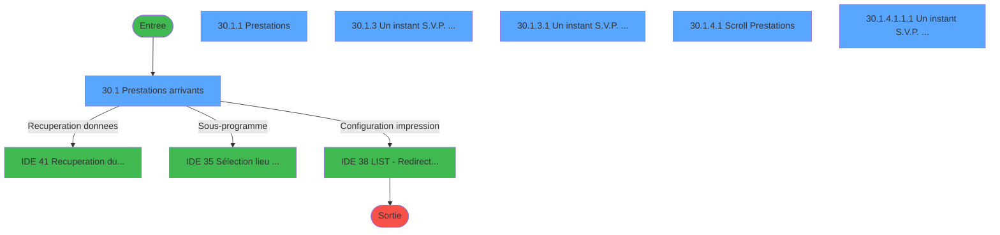
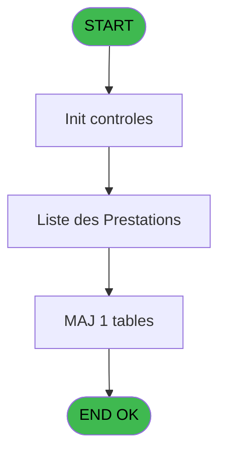
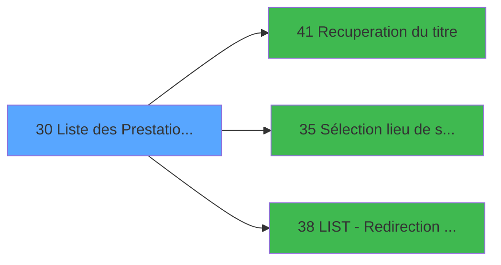

# PTR IDE 30 - Liste des Prestations Arrivant

> **Analyse**: Phases 1-4 2026-02-03 18:18 -> 18:19 (12s) | Assemblage 18:19
> **Pipeline**: V7.2 Enrichi
> **Structure**: 4 onglets (Resume | Ecrans | Donnees | Connexions)

<!-- TAB:Resume -->

## 1. FICHE D'IDENTITE

| Attribut | Valeur |
|----------|--------|
| Projet | PTR |
| IDE Position | 30 |
| Nom Programme | Liste des Prestations Arrivant |
| Fichier source | `Prg_30.xml` |
| Dossier IDE | Listes |
| Taches | 11 (6 ecrans visibles) |
| Tables modifiees | 1 |
| Programmes appeles | 3 |
| :warning: Statut | **ORPHELIN_POTENTIEL** |

## 2. DESCRIPTION FONCTIONNELLE

**Liste des Prestations Arrivant** assure la gestion complete de ce processus.

Le flux de traitement s'organise en **2 blocs fonctionnels** :

- **Traitement** (10 taches) : traitements metier divers
- **Consultation** (1 tache) : ecrans de recherche, selection et consultation

**Donnees modifiees** : 1 tables en ecriture (tempo_selection).

**Logique metier** : 1 regles identifiees couvrant valeurs par defaut.

Detail : phases du traitement

#### Phase 1 : Traitement (10 taches)

- **30** - (sans nom)
- **30.1** - Prestations arrivants **[[ECRAN]](#ecran-t2)**
- **30.1.1** - Prestations **[[ECRAN]](#ecran-t3)**
- **30.1.3** - Un instant S.V.P. ... **[[ECRAN]](#ecran-t5)**
- **30.1.3.1** - Un instant S.V.P. ... **[[ECRAN]](#ecran-t6)**
- **30.1.3.2** - Honey moon
- **30.1.4** - Scroll Prestations **[[ECRAN]](#ecran-t8)**
- **30.1.4.1** - Scroll Prestations **[[ECRAN]](#ecran-t9)**
- **30.1.4.1.1** - Dialogue **[[ECRAN]](#ecran-t10)**
- **30.1.4.1.1.1** - Un instant S.V.P. ... **[[ECRAN]](#ecran-t11)**

Delegue a : [Recuperation du titre (IDE 41)](PTR-IDE-41.md), [Sélection lieu de séjour (IDE 35)](PTR-IDE-35.md), [LIST - Redirection d'un Etat (IDE 38)](PTR-IDE-38.md)

#### Phase 2 : Consultation (1 tache)

- **30.1.2** - Choix date **[[ECRAN]](#ecran-t4)**

Delegue a : [Recuperation du titre (IDE 41)](PTR-IDE-41.md)

#### Tables impactees

| Table | Operations | Role metier |
|-------|-----------|-------------|
| tempo_selection | **W**/L (4 usages) | Table temporaire ecran |

## 3. BLOCS FONCTIONNELS

### 3.1 Traitement (10 taches)

Traitements internes.

---

#### 30 - (sans nom)

**Role** : Tache d'orchestration : point d'entree du programme (10 sous-taches). Coordonne l'enchainement des traitements.

9 sous-taches directes

| Tache | Nom | Bloc |
|-------|-----|------|
| [30.1](#t2) | Prestations arrivants **[[ECRAN]](#ecran-t2)** | Traitement |
| [30.1.1](#t3) | Prestations **[[ECRAN]](#ecran-t3)** | Traitement |
| [30.1.3](#t5) | Un instant S.V.P. ... **[[ECRAN]](#ecran-t5)** | Traitement |
| [30.1.3.1](#t6) | Un instant S.V.P. ... **[[ECRAN]](#ecran-t6)** | Traitement |
| [30.1.3.2](#t7) | Honey moon | Traitement |
| [30.1.4](#t8) | Scroll Prestations **[[ECRAN]](#ecran-t8)** | Traitement |
| [30.1.4.1](#t9) | Scroll Prestations **[[ECRAN]](#ecran-t9)** | Traitement |
| [30.1.4.1.1](#t10) | Dialogue **[[ECRAN]](#ecran-t10)** | Traitement |
| [30.1.4.1.1.1](#t11) | Un instant S.V.P. ... **[[ECRAN]](#ecran-t11)** | Traitement |

**Delegue a** : [Recuperation du titre (IDE 41)](PTR-IDE-41.md), [Sélection lieu de séjour (IDE 35)](PTR-IDE-35.md), [LIST - Redirection d'un Etat (IDE 38)](PTR-IDE-38.md)

---

#### 30.1 - Prestations arrivants [[ECRAN]](#ecran-t2)

**Role** : Traitement : Prestations arrivants.
**Ecran** : 819 x 151 DLU (MDI) | [Voir mockup](#ecran-t2)
**Variables liees** : G (V_Titre Prestations)
**Delegue a** : [Recuperation du titre (IDE 41)](PTR-IDE-41.md), [Sélection lieu de séjour (IDE 35)](PTR-IDE-35.md), [LIST - Redirection d'un Etat (IDE 38)](PTR-IDE-38.md)

---

#### 30.1.1 - Prestations [[ECRAN]](#ecran-t3)

**Role** : Traitement : Prestations.
**Ecran** : 400 x 178 DLU (MDI) | [Voir mockup](#ecran-t3)
**Variables liees** : G (V_Titre Prestations)
**Delegue a** : [Recuperation du titre (IDE 41)](PTR-IDE-41.md), [Sélection lieu de séjour (IDE 35)](PTR-IDE-35.md), [LIST - Redirection d'un Etat (IDE 38)](PTR-IDE-38.md)

---

#### 30.1.3 - Un instant S.V.P. ... [[ECRAN]](#ecran-t5)

**Role** : Traitement : Un instant S.V.P. ....
**Ecran** : 422 x 57 DLU (MDI) | [Voir mockup](#ecran-t5)
**Delegue a** : [Recuperation du titre (IDE 41)](PTR-IDE-41.md), [Sélection lieu de séjour (IDE 35)](PTR-IDE-35.md), [LIST - Redirection d'un Etat (IDE 38)](PTR-IDE-38.md)

---

#### 30.1.3.1 - Un instant S.V.P. ... [[ECRAN]](#ecran-t6)

**Role** : Traitement : Un instant S.V.P. ....
**Ecran** : 422 x 56 DLU (MDI) | [Voir mockup](#ecran-t6)
**Delegue a** : [Recuperation du titre (IDE 41)](PTR-IDE-41.md), [Sélection lieu de séjour (IDE 35)](PTR-IDE-35.md), [LIST - Redirection d'un Etat (IDE 38)](PTR-IDE-38.md)

---

#### 30.1.3.2 - Honey moon

**Role** : Traitement : Honey moon.
**Delegue a** : [Recuperation du titre (IDE 41)](PTR-IDE-41.md), [Sélection lieu de séjour (IDE 35)](PTR-IDE-35.md), [LIST - Redirection d'un Etat (IDE 38)](PTR-IDE-38.md)

---

#### 30.1.4 - Scroll Prestations [[ECRAN]](#ecran-t8)

**Role** : Traitement : Scroll Prestations.
**Ecran** : 726 x 211 DLU (MDI) | [Voir mockup](#ecran-t8)
**Variables liees** : G (V_Titre Prestations)
**Delegue a** : [Recuperation du titre (IDE 41)](PTR-IDE-41.md), [Sélection lieu de séjour (IDE 35)](PTR-IDE-35.md), [LIST - Redirection d'un Etat (IDE 38)](PTR-IDE-38.md)

---

#### 30.1.4.1 - Scroll Prestations [[ECRAN]](#ecran-t9)

**Role** : Traitement : Scroll Prestations.
**Ecran** : 1093 x 274 DLU (MDI) | [Voir mockup](#ecran-t9)
**Variables liees** : G (V_Titre Prestations)
**Delegue a** : [Recuperation du titre (IDE 41)](PTR-IDE-41.md), [Sélection lieu de séjour (IDE 35)](PTR-IDE-35.md), [LIST - Redirection d'un Etat (IDE 38)](PTR-IDE-38.md)

---

#### 30.1.4.1.1 - Dialogue [[ECRAN]](#ecran-t10)

**Role** : Traitement : Dialogue.
**Ecran** : 428 x 56 DLU (MDI) | [Voir mockup](#ecran-t10)
**Delegue a** : [Recuperation du titre (IDE 41)](PTR-IDE-41.md), [Sélection lieu de séjour (IDE 35)](PTR-IDE-35.md), [LIST - Redirection d'un Etat (IDE 38)](PTR-IDE-38.md)

---

#### 30.1.4.1.1.1 - Un instant S.V.P. ... [[ECRAN]](#ecran-t11)

**Role** : Traitement : Un instant S.V.P. ....
**Ecran** : 428 x 56 DLU (MDI) | [Voir mockup](#ecran-t11)
**Delegue a** : [Recuperation du titre (IDE 41)](PTR-IDE-41.md), [Sélection lieu de séjour (IDE 35)](PTR-IDE-35.md), [LIST - Redirection d'un Etat (IDE 38)](PTR-IDE-38.md)

### 3.2 Consultation (1 tache)

Ecrans de recherche et consultation.

---

#### 30.1.2 - Choix date [[ECRAN]](#ecran-t4)

**Role** : Selection par l'operateur : Choix date.
**Ecran** : 104 x 40 DLU (MDI) | [Voir mockup](#ecran-t4)

## 5. REGLES METIER

1 regles identifiees:

### Autres (1 regles)

#### [RM-001] Valeur par defaut si GetParam ('SOCIETE') est vide

| Element | Detail |
|---------|--------|
| **Condition** | `GetParam ('SOCIETE')=''` |
| **Si vrai** | 'C' |
| **Si faux** | GetParam ('SOCIETE')) |
| **Expression source** | Expression 3 : `IF (GetParam ('SOCIETE')='','C',GetParam ('SOCIETE'))` |
| **Exemple** | Si GetParam ('SOCIETE')='' → 'C'. Sinon → GetParam ('SOCIETE')) |

## 6. CONTEXTE

- **Appele par**: (aucun)
- **Appelle**: 3 programmes | **Tables**: 6 (W:1 R:4 L:3) | **Taches**: 11 | **Expressions**: 7

<!-- TAB:Ecrans -->

## 8. ECRANS

### 8.1 Forms visibles (6 / 11)

| # | Position | Tache | Nom | Type | Largeur | Hauteur | Bloc |
|---|----------|-------|-----|------|---------|---------|------|
| 1 | 30.1 | 30.1 | Prestations arrivants | MDI | 819 | 151 | Traitement |
| 2 | 30.1.1 | 30.1.1 | Prestations | MDI | 400 | 178 | Traitement |
| 3 | 30.1.3 | 30.1.3 | Un instant S.V.P. ... | MDI | 422 | 57 | Traitement |
| 4 | 30.1.3.1 | 30.1.3.1 | Un instant S.V.P. ... | MDI | 422 | 56 | Traitement |
| 5 | 30.1.4.1 | 30.1.4.1 | Scroll Prestations | MDI | 1093 | 274 | Traitement |
| 6 | 30.1.4.1.1.1 | 30.1.4.1.1.1 | Un instant S.V.P. ... | MDI | 428 | 56 | Traitement |

### 8.2 Mockups Ecrans

---

#### 30.1 - Prestations arrivants
**Tache** : [30.1](#t2) | **Type** : MDI | **Dimensions** : 819 x 151 DLU
**Bloc** : Traitement | **Titre IDE** : Prestations arrivants

<!-- FORM-DATA:
{
    "width":  819,
    "vFactor":  8,
    "type":  "MDI",
    "hFactor":  8,
    "controls":  [
                     {
                         "x":  0,
                         "type":  "label",
                         "var":  "",
                         "y":  0,
                         "w":  810,
                         "fmt":  "",
                         "name":  "",
                         "h":  20,
                         "color":  "",
                         "text":  "",
                         "parent":  null
                     },
                     {
                         "x":  658,
                         "type":  "label",
                         "var":  "",
                         "y":  30,
                         "w":  151,
                         "fmt":  "",
                         "name":  "",
                         "h":  90,
                         "color":  "",
                         "text":  "",
                         "parent":  null
                     },
                     {
                         "x":  17,
                         "type":  "label",
                         "var":  "",
                         "y":  27,
                         "w":  629,
                         "fmt":  "",
                         "name":  "",
                         "h":  93,
                         "color":  "195",
                         "text":  "Critères",
                         "parent":  null
                     },
                     {
                         "x":  47,
                         "type":  "label",
                         "var":  "",
                         "y":  59,
                         "w":  27,
                         "fmt":  "",
                         "name":  "",
                         "h":  10,
                         "color":  "",
                         "text":  "du",
                         "parent":  6
                     },
                     {
                         "x":  303,
                         "type":  "label",
                         "var":  "",
                         "y":  59,
                         "w":  27,
                         "fmt":  "",
                         "name":  "",
                         "h":  10,
                         "color":  "",
                         "text":  "au",
                         "parent":  6
                     },
                     {
                         "x":  47,
                         "type":  "label",
                         "var":  "",
                         "y":  77,
                         "w":  86,
                         "fmt":  "",
                         "name":  "",
                         "h":  10,
                         "color":  "",
                         "text":  "Sélections",
                         "parent":  6
                     },
                     {
                         "x":  0,
                         "type":  "label",
                         "var":  "",
                         "y":  124,
                         "w":  808,
                         "fmt":  "",
                         "name":  "",
                         "h":  24,
                         "color":  "",
                         "text":  "",
                         "parent":  null
                     },
                     {
                         "x":  47,
                         "type":  "label",
                         "var":  "",
                         "y":  96,
                         "w":  110,
                         "fmt":  "",
                         "name":  "",
                         "h":  10,
                         "color":  "",
                         "text":  "Lieu de séjour",
                         "parent":  6
                     },
                     {
                         "x":  170,
                         "type":  "edit",
                         "var":  "",
                         "y":  59,
                         "w":  126,
                         "fmt":  "DD/MM/YYYYZ",
                         "name":  "",
                         "h":  10,
                         "color":  "110",
                         "text":  "",
                         "parent":  6
                     },
                     {
                         "x":  346,
                         "type":  "edit",
                         "var":  "",
                         "y":  59,
                         "w":  126,
                         "fmt":  "DD/MM/YYYYZ",
                         "name":  "",
                         "h":  10,
                         "color":  "110",
                         "text":  "",
                         "parent":  6
                     },
                     {
                         "x":  170,
                         "type":  "edit",
                         "var":  "",
                         "y":  77,
                         "w":  78,
                         "fmt":  "",
                         "name":  "",
                         "h":  10,
                         "color":  "",
                         "text":  "",
                         "parent":  6
                     },
                     {
                         "x":  9,
                         "type":  "button",
                         "var":  "",
                         "y":  127,
                         "w":  154,
                         "fmt":  "\u0026Quitter",
                         "name":  "B_Quitter",
                         "h":  18,
                         "color":  "",
                         "text":  "",
                         "parent":  14
                     },
                     {
                         "x":  669,
                         "type":  "button",
                         "var":  "",
                         "y":  98,
                         "w":  122,
                         "fmt":  "\u0026Rechercher",
                         "name":  "B_Rechercher",
                         "h":  18,
                         "color":  "",
                         "text":  "",
                         "parent":  null
                     },
                     {
                         "x":  6,
                         "type":  "edit",
                         "var":  "",
                         "y":  6,
                         "w":  396,
                         "fmt":  "30",
                         "name":  "",
                         "h":  8,
                         "color":  "",
                         "text":  "",
                         "parent":  1
                     },
                     {
                         "x":  524,
                         "type":  "edit",
                         "var":  "",
                         "y":  6,
                         "w":  268,
                         "fmt":  "WWW DD MMM YYYYT",
                         "name":  "",
                         "h":  8,
                         "color":  "",
                         "text":  "",
                         "parent":  1
                     },
                     {
                         "x":  671,
                         "type":  "image",
                         "var":  "",
                         "y":  34,
                         "w":  125,
                         "fmt":  "",
                         "name":  "",
                         "h":  62,
                         "color":  "",
                         "text":  "",
                         "parent":  4
                     },
                     {
                         "x":  47,
                         "type":  "edit",
                         "var":  "",
                         "y":  43,
                         "w":  243,
                         "fmt":  "30",
                         "name":  "",
                         "h":  10,
                         "color":  "",
                         "text":  "",
                         "parent":  6
                     },
                     {
                         "x":  168,
                         "type":  "button",
                         "var":  "",
                         "y":  127,
                         "w":  154,
                         "fmt":  "\u0026Prestations",
                         "name":  "",
                         "h":  18,
                         "color":  "",
                         "text":  "",
                         "parent":  14
                     },
                     {
                         "x":  486,
                         "type":  "button",
                         "var":  "",
                         "y":  127,
                         "w":  154,
                         "fmt":  "Date \u0026Du",
                         "name":  "",
                         "h":  18,
                         "color":  "",
                         "text":  "",
                         "parent":  14
                     },
                     {
                         "x":  644,
                         "type":  "button",
                         "var":  "",
                         "y":  127,
                         "w":  154,
                         "fmt":  "\u0026Lieu de séjour",
                         "name":  "",
                         "h":  18,
                         "color":  "",
                         "text":  "",
                         "parent":  14
                     },
                     {
                         "x":  327,
                         "type":  "button",
                         "var":  "",
                         "y":  127,
                         "w":  154,
                         "fmt":  "\u0026Prestations",
                         "name":  "",
                         "h":  18,
                         "color":  "",
                         "text":  "",
                         "parent":  14
                     },
                     {
                         "x":  170,
                         "type":  "edit",
                         "var":  "",
                         "y":  96,
                         "w":  31,
                         "fmt":  "",
                         "name":  "W1 Code Lieu de séjour",
                         "h":  10,
                         "color":  "110",
                         "text":  "",
                         "parent":  6
                     },
                     {
                         "x":  210,
                         "type":  "edit",
                         "var":  "",
                         "y":  96,
                         "w":  262,
                         "fmt":  "",
                         "name":  "W1 Libellé lieu de séjour",
                         "h":  10,
                         "color":  "",
                         "text":  "",
                         "parent":  6
                     }
                 ],
    "taskId":  "30.1",
    "height":  151
}
-->

<strong>Champs : 8 champs</strong>

| Pos (x,y) | Nom | Variable | Type |
|-----------|-----|----------|------|
| 170,59 | DD/MM/YYYYZ | - | edit |
| 346,59 | DD/MM/YYYYZ | - | edit |
| 170,77 | (sans nom) | - | edit |
| 6,6 | 30 | - | edit |
| 524,6 | WWW DD MMM YYYYT | - | edit |
| 47,43 | 30 | - | edit |
| 170,96 | W1 Code Lieu de séjour | - | edit |
| 210,96 | W1 Libellé lieu de séjour | - | edit |

<strong>Boutons : 6 boutons</strong>

| Bouton | Pos (x,y) | Action |
|--------|-----------|--------|
| Quitter | 9,127 | Quitte le programme |
| Rechercher | 669,98 | Ouvre la selection |
| Prestations | 168,127 | Bouton fonctionnel |
| Date Du | 486,127 | Bouton fonctionnel |
| Lieu de séjour | 644,127 | Appel [Sélection lieu de séjour (IDE 35)](PTR-IDE-35.md) |
| Prestations | 327,127 | Bouton fonctionnel |

---

#### 30.1.1 - Prestations
**Tache** : [30.1.1](#t3) | **Type** : MDI | **Dimensions** : 400 x 178 DLU
**Bloc** : Traitement | **Titre IDE** : Prestations

<!-- FORM-DATA:
{
    "width":  400,
    "vFactor":  8,
    "type":  "MDI",
    "hFactor":  8,
    "controls":  [
                     {
                         "x":  9,
                         "type":  "table",
                         "var":  "",
                         "name":  "",
                         "titleH":  12,
                         "color":  "196",
                         "w":  384,
                         "y":  5,
                         "fmt":  "",
                         "parent":  null,
                         "text":  "",
                         "rowH":  12,
                         "h":  124,
                         "cols":  [
                                      {
                                          "title":  "Prestations",
                                          "layer":  1,
                                          "w":  349
                                      }
                                  ],
                         "rows":  1
                     },
                     {
                         "x":  9,
                         "type":  "label",
                         "var":  "",
                         "y":  5,
                         "w":  375,
                         "fmt":  "",
                         "name":  "",
                         "h":  12,
                         "color":  "7",
                         "text":  "Prestation",
                         "parent":  null
                     },
                     {
                         "x":  0,
                         "type":  "label",
                         "var":  "",
                         "y":  153,
                         "w":  394,
                         "fmt":  "",
                         "name":  "",
                         "h":  23,
                         "color":  "",
                         "text":  "",
                         "parent":  null
                     },
                     {
                         "x":  23,
                         "type":  "edit",
                         "var":  "",
                         "y":  20,
                         "w":  75,
                         "fmt":  "",
                         "name":  "",
                         "h":  8,
                         "color":  "177",
                         "text":  "",
                         "parent":  1
                     },
                     {
                         "x":  127,
                         "type":  "edit",
                         "var":  "",
                         "y":  20,
                         "w":  232,
                         "fmt":  "",
                         "name":  "",
                         "h":  8,
                         "color":  "177",
                         "text":  "",
                         "parent":  1
                     },
                     {
                         "x":  9,
                         "type":  "button",
                         "var":  "",
                         "y":  156,
                         "w":  154,
                         "fmt":  "\u0026Sélectionner",
                         "name":  "",
                         "h":  18,
                         "color":  "",
                         "text":  "",
                         "parent":  6
                     },
                     {
                         "x":  227,
                         "type":  "button",
                         "var":  "",
                         "y":  156,
                         "w":  154,
                         "fmt":  "\u0026Toutes",
                         "name":  "",
                         "h":  18,
                         "color":  "",
                         "text":  "",
                         "parent":  6
                     },
                     {
                         "x":  168,
                         "type":  "image",
                         "var":  "",
                         "y":  131,
                         "w":  82,
                         "fmt":  "",
                         "name":  "",
                         "h":  18,
                         "color":  "",
                         "text":  "",
                         "parent":  null
                     }
                 ],
    "taskId":  "30.1.1",
    "height":  178
}
-->

<strong>Champs : 2 champs</strong>

| Pos (x,y) | Nom | Variable | Type |
|-----------|-----|----------|------|
| 23,20 | (sans nom) | - | edit |
| 127,20 | (sans nom) | - | edit |

<strong>Boutons : 2 boutons</strong>

| Bouton | Pos (x,y) | Action |
|--------|-----------|--------|
| Sélectionner | 9,156 | Appel [Sélection lieu de séjour (IDE 35)](PTR-IDE-35.md) |
| Toutes | 227,156 | Bouton fonctionnel |

---

#### 30.1.3 - Un instant S.V.P. ...
**Tache** : [30.1.3](#t5) | **Type** : MDI | **Dimensions** : 422 x 57 DLU
**Bloc** : Traitement | **Titre IDE** : Un instant S.V.P. ...

<!-- FORM-DATA:
{
    "width":  422,
    "vFactor":  8,
    "type":  "MDI",
    "hFactor":  8,
    "controls":  [
                     {
                         "x":  12,
                         "type":  "label",
                         "var":  "",
                         "y":  4,
                         "w":  400,
                         "fmt":  "",
                         "name":  "",
                         "h":  48,
                         "color":  "",
                         "text":  "",
                         "parent":  null
                     },
                     {
                         "x":  92,
                         "type":  "label",
                         "var":  "",
                         "y":  18,
                         "w":  239,
                         "fmt":  "",
                         "name":  "",
                         "h":  8,
                         "color":  "7",
                         "text":  "Preparation en cours ...",
                         "parent":  1
                     },
                     {
                         "x":  22,
                         "type":  "image",
                         "var":  "",
                         "y":  8,
                         "w":  106,
                         "fmt":  "",
                         "name":  "",
                         "h":  40,
                         "color":  "",
                         "text":  "",
                         "parent":  null
                     },
                     {
                         "x":  193,
                         "type":  "edit",
                         "var":  "",
                         "y":  29,
                         "w":  37,
                         "fmt":  "",
                         "name":  "",
                         "h":  15,
                         "color":  "",
                         "text":  "",
                         "parent":  1
                     }
                 ],
    "taskId":  "30.1.3",
    "height":  57
}
-->

<strong>Champs : 1 champs</strong>

| Pos (x,y) | Nom | Variable | Type |
|-----------|-----|----------|------|
| 193,29 | (sans nom) | - | edit |

---

#### 30.1.3.1 - Un instant S.V.P. ...
**Tache** : [30.1.3.1](#t6) | **Type** : MDI | **Dimensions** : 422 x 56 DLU
**Bloc** : Traitement | **Titre IDE** : Un instant S.V.P. ...

<!-- FORM-DATA:
{
    "width":  422,
    "vFactor":  8,
    "type":  "MDI",
    "hFactor":  8,
    "controls":  [
                     {
                         "x":  12,
                         "type":  "label",
                         "var":  "",
                         "y":  4,
                         "w":  400,
                         "fmt":  "",
                         "name":  "",
                         "h":  48,
                         "color":  "",
                         "text":  "",
                         "parent":  null
                     },
                     {
                         "x":  161,
                         "type":  "label",
                         "var":  "",
                         "y":  18,
                         "w":  221,
                         "fmt":  "",
                         "name":  "",
                         "h":  8,
                         "color":  "7",
                         "text":  "Preparation en cours ...",
                         "parent":  1
                     },
                     {
                         "x":  226,
                         "type":  "edit",
                         "var":  "",
                         "y":  29,
                         "w":  37,
                         "fmt":  "",
                         "name":  "",
                         "h":  15,
                         "color":  "",
                         "text":  "",
                         "parent":  1
                     },
                     {
                         "x":  22,
                         "type":  "image",
                         "var":  "",
                         "y":  8,
                         "w":  106,
                         "fmt":  "",
                         "name":  "",
                         "h":  40,
                         "color":  "",
                         "text":  "",
                         "parent":  null
                     }
                 ],
    "taskId":  "30.1.3.1",
    "height":  56
}
-->

<strong>Champs : 1 champs</strong>

| Pos (x,y) | Nom | Variable | Type |
|-----------|-----|----------|------|
| 226,29 | (sans nom) | - | edit |

---

#### 30.1.4.1 - Scroll Prestations
**Tache** : [30.1.4.1](#t9) | **Type** : MDI | **Dimensions** : 1093 x 274 DLU
**Bloc** : Traitement | **Titre IDE** : Scroll Prestations

<!-- FORM-DATA:
{
    "width":  1093,
    "vFactor":  8,
    "type":  "MDI",
    "hFactor":  8,
    "controls":  [
                     {
                         "x":  3,
                         "type":  "label",
                         "var":  "",
                         "y":  1,
                         "w":  1079,
                         "fmt":  "",
                         "name":  "",
                         "h":  20,
                         "color":  "",
                         "text":  "",
                         "parent":  null
                     },
                     {
                         "x":  9,
                         "type":  "table",
                         "var":  "",
                         "name":  "",
                         "titleH":  12,
                         "color":  "110",
                         "w":  1079,
                         "y":  46,
                         "fmt":  "",
                         "parent":  null,
                         "text":  "",
                         "rowH":  12,
                         "h":  195,
                         "cols":  [
                                      {
                                          "title":  "Titre",
                                          "layer":  1,
                                          "w":  45
                                      },
                                      {
                                          "title":  "Nom",
                                          "layer":  2,
                                          "w":  196
                                      },
                                      {
                                          "title":  "Prénom",
                                          "layer":  3,
                                          "w":  133
                                      },
                                      {
                                          "title":  "Début Prestation",
                                          "layer":  4,
                                          "w":  146
                                      },
                                      {
                                          "title":  "Fin Prestation",
                                          "layer":  5,
                                          "w":  139
                                      },
                                      {
                                          "title":  "Début Séjour",
                                          "layer":  6,
                                          "w":  136
                                      },
                                      {
                                          "title":  "Fin Séjour",
                                          "layer":  7,
                                          "w":  134
                                      },
                                      {
                                          "title":  "Prestation",
                                          "layer":  8,
                                          "w":  113
                                      }
                                  ],
                         "rows":  8
                     },
                     {
                         "x":  0,
                         "type":  "label",
                         "var":  "",
                         "y":  248,
                         "w":  1081,
                         "fmt":  "",
                         "name":  "",
                         "h":  24,
                         "color":  "",
                         "text":  "",
                         "parent":  null
                     },
                     {
                         "x":  3,
                         "type":  "label",
                         "var":  "",
                         "y":  24,
                         "w":  1079,
                         "fmt":  "",
                         "name":  "",
                         "h":  20,
                         "color":  "",
                         "text":  "",
                         "parent":  null
                     },
                     {
                         "x":  9,
                         "type":  "label",
                         "var":  "",
                         "y":  28,
                         "w":  139,
                         "fmt":  "",
                         "name":  "",
                         "h":  12,
                         "color":  "",
                         "text":  "Lieu de séjour",
                         "parent":  67
                     },
                     {
                         "x":  949,
                         "type":  "edit",
                         "var":  "",
                         "y":  62,
                         "w":  75,
                         "fmt":  "",
                         "name":  "",
                         "h":  8,
                         "color":  "110",
                         "text":  "",
                         "parent":  4
                     },
                     {
                         "x":  69,
                         "type":  "edit",
                         "var":  "",
                         "y":  62,
                         "w":  176,
                         "fmt":  "",
                         "name":  "",
                         "h":  8,
                         "color":  "110",
                         "text":  "",
                         "parent":  4
                     },
                     {
                         "x":  261,
                         "type":  "edit",
                         "var":  "",
                         "y":  62,
                         "w":  120,
                         "fmt":  "",
                         "name":  "",
                         "h":  8,
                         "color":  "110",
                         "text":  "",
                         "parent":  4
                     },
                     {
                         "x":  16,
                         "type":  "edit",
                         "var":  "",
                         "y":  62,
                         "w":  30,
                         "fmt":  "",
                         "name":  "INP titre",
                         "h":  8,
                         "color":  "110",
                         "text":  "",
                         "parent":  4
                     },
                     {
                         "x":  394,
                         "type":  "edit",
                         "var":  "",
                         "y":  62,
                         "w":  120,
                         "fmt":  "DD/MM/YYYYZ",
                         "name":  "",
                         "h":  8,
                         "color":  "110",
                         "text":  "",
                         "parent":  4
                     },
                     {
                         "x":  541,
                         "type":  "edit",
                         "var":  "",
                         "y":  62,
                         "w":  120,
                         "fmt":  "DD/MM/YYYYZ",
                         "name":  "",
                         "h":  8,
                         "color":  "110",
                         "text":  "",
                         "parent":  4
                     },
                     {
                         "x":  678,
                         "type":  "edit",
                         "var":  "",
                         "y":  62,
                         "w":  120,
                         "fmt":  "DD/MM/YYYYZ",
                         "name":  "",
                         "h":  8,
                         "color":  "110",
                         "text":  "",
                         "parent":  4
                     },
                     {
                         "x":  814,
                         "type":  "edit",
                         "var":  "",
                         "y":  62,
                         "w":  120,
                         "fmt":  "DD/MM/YYYYZ",
                         "name":  "",
                         "h":  8,
                         "color":  "110",
                         "text":  "",
                         "parent":  4
                     },
                     {
                         "x":  591,
                         "type":  "button",
                         "var":  "",
                         "y":  252,
                         "w":  154,
                         "fmt":  "Tri \u0026Nom",
                         "name":  "B_Tri_Nom",
                         "h":  18,
                         "color":  "",
                         "text":  "",
                         "parent":  21
                     },
                     {
                         "x":  752,
                         "type":  "button",
                         "var":  "",
                         "y":  252,
                         "w":  154,
                         "fmt":  "Tri \u0026Prestation",
                         "name":  "B_Tri_Prestation",
                         "h":  18,
                         "color":  "",
                         "text":  "",
                         "parent":  21
                     },
                     {
                         "x":  9,
                         "type":  "edit",
                         "var":  "",
                         "y":  7,
                         "w":  396,
                         "fmt":  "30",
                         "name":  "",
                         "h":  8,
                         "color":  "",
                         "text":  "",
                         "parent":  1
                     },
                     {
                         "x":  804,
                         "type":  "edit",
                         "var":  "",
                         "y":  7,
                         "w":  268,
                         "fmt":  "WWW DD MMM YYYYT",
                         "name":  "",
                         "h":  8,
                         "color":  "",
                         "text":  "",
                         "parent":  1
                     },
                     {
                         "x":  6,
                         "type":  "button",
                         "var":  "",
                         "y":  252,
                         "w":  154,
                         "fmt":  "\u0026Quitter",
                         "name":  "",
                         "h":  18,
                         "color":  "",
                         "text":  "",
                         "parent":  21
                     },
                     {
                         "x":  914,
                         "type":  "button",
                         "var":  "",
                         "y":  252,
                         "w":  154,
                         "fmt":  "\u0026Imprimer",
                         "name":  "",
                         "h":  18,
                         "color":  "",
                         "text":  "",
                         "parent":  21
                     },
                     {
                         "x":  154,
                         "type":  "edit",
                         "var":  "",
                         "y":  28,
                         "w":  243,
                         "fmt":  "",
                         "name":  "W1 Libellé lieu de séjour",
                         "h":  12,
                         "color":  "",
                         "text":  "",
                         "parent":  67
                     }
                 ],
    "taskId":  "30.1.4.1",
    "height":  274
}
-->

<strong>Champs : 11 champs</strong>

| Pos (x,y) | Nom | Variable | Type |
|-----------|-----|----------|------|
| 949,62 | (sans nom) | - | edit |
| 69,62 | (sans nom) | - | edit |
| 261,62 | (sans nom) | - | edit |
| 16,62 | INP titre | - | edit |
| 394,62 | DD/MM/YYYYZ | - | edit |
| 541,62 | DD/MM/YYYYZ | - | edit |
| 678,62 | DD/MM/YYYYZ | - | edit |
| 814,62 | DD/MM/YYYYZ | - | edit |
| 9,7 | 30 | - | edit |
| 804,7 | WWW DD MMM YYYYT | - | edit |
| 154,28 | W1 Libellé lieu de séjour | - | edit |

<strong>Boutons : 4 boutons</strong>

| Bouton | Pos (x,y) | Action |
|--------|-----------|--------|
| Tri Nom | 591,252 | Identification du client |
| Tri Prestation | 752,252 | Bouton fonctionnel |
| Quitter | 6,252 | Quitte le programme |
| Imprimer | 914,252 | Lance l'impression |

---

#### 30.1.4.1.1.1 - Un instant S.V.P. ...
**Tache** : [30.1.4.1.1.1](#t11) | **Type** : MDI | **Dimensions** : 428 x 56 DLU
**Bloc** : Traitement | **Titre IDE** : Un instant S.V.P. ...

<!-- FORM-DATA:
{
    "width":  428,
    "vFactor":  8,
    "type":  "MDI",
    "hFactor":  8,
    "controls":  [
                     {
                         "x":  12,
                         "type":  "label",
                         "var":  "",
                         "y":  4,
                         "w":  400,
                         "fmt":  "",
                         "name":  "",
                         "h":  48,
                         "color":  "",
                         "text":  "",
                         "parent":  null
                     },
                     {
                         "x":  161,
                         "type":  "label",
                         "var":  "",
                         "y":  18,
                         "w":  221,
                         "fmt":  "",
                         "name":  "",
                         "h":  8,
                         "color":  "7",
                         "text":  "Impression en cours ...",
                         "parent":  1
                     },
                     {
                         "x":  22,
                         "type":  "image",
                         "var":  "",
                         "y":  8,
                         "w":  106,
                         "fmt":  "",
                         "name":  "",
                         "h":  40,
                         "color":  "",
                         "text":  "",
                         "parent":  null
                     },
                     {
                         "x":  226,
                         "type":  "edit",
                         "var":  "",
                         "y":  29,
                         "w":  37,
                         "fmt":  "",
                         "name":  "",
                         "h":  15,
                         "color":  "",
                         "text":  "",
                         "parent":  1
                     }
                 ],
    "taskId":  "30.1.4.1.1.1",
    "height":  56
}
-->

<strong>Champs : 1 champs</strong>

| Pos (x,y) | Nom | Variable | Type |
|-----------|-----|----------|------|
| 226,29 | (sans nom) | - | edit |

## 9. NAVIGATION

### 9.1 Enchainement des ecrans

**Detail par enchainement :**

| Depuis | Action | Vers | Retour |
|--------|--------|------|--------|
| Prestations arrivants | Recuperation donnees | [Recuperation du titre (IDE 41)](PTR-IDE-41.md) | Retour ecran |
| Prestations arrivants | Sous-programme | [Sélection lieu de séjour (IDE 35)](PTR-IDE-35.md) | Retour ecran |
| Prestations arrivants | Configuration impression | [LIST - Redirection d'un Etat (IDE 38)](PTR-IDE-38.md) | Retour ecran |

### 9.3 Structure hierarchique (11 taches)

| Position | Tache | Type | Dimensions | Bloc |
|----------|-------|------|------------|------|
| **30.1** | [**(sans nom)** (30)](#t1) | MDI | - | Traitement |
| 30.1.1 | [Prestations arrivants (30.1)](#t2) [mockup](#ecran-t2) | MDI | 819x151 | |
| 30.1.2 | [Prestations (30.1.1)](#t3) [mockup](#ecran-t3) | MDI | 400x178 | |
| 30.1.3 | [Un instant S.V.P. ... (30.1.3)](#t5) [mockup](#ecran-t5) | MDI | 422x57 | |
| 30.1.4 | [Un instant S.V.P. ... (30.1.3.1)](#t6) [mockup](#ecran-t6) | MDI | 422x56 | |
| 30.1.5 | [Honey moon (30.1.3.2)](#t7) | MDI | - | |
| 30.1.6 | [Scroll Prestations (30.1.4)](#t8) [mockup](#ecran-t8) | MDI | 726x211 | |
| 30.1.7 | [Scroll Prestations (30.1.4.1)](#t9) [mockup](#ecran-t9) | MDI | 1093x274 | |
| 30.1.8 | [Dialogue (30.1.4.1.1)](#t10) [mockup](#ecran-t10) | MDI | 428x56 | |
| 30.1.9 | [Un instant S.V.P. ... (30.1.4.1.1.1)](#t11) [mockup](#ecran-t11) | MDI | 428x56 | |
| **30.2** | [**Choix date** (30.1.2)](#t4) [mockup](#ecran-t4) | MDI | 104x40 | Consultation |

### 9.4 Algorigramme

> **Legende**: Vert = START/END OK | Rouge = END KO | Bleu = Decisions
> *Algorigramme auto-genere. Utiliser `/algorigramme` pour une synthese metier detaillee.*

<!-- TAB:Donnees -->

## 10. TABLES

### Tables utilisees (6)

| ID | Nom | Description | Type | R | W | L | Usages |
|----|-----|-------------|------|---|---|---|--------|
| 33 | prestations______pre | Prestations/services vendus | DB | R |   |   | 1 |
| 34 | hebergement______heb | Hebergement (chambres) | DB | R |   |   | 1 |
| 36 | client_gm |  | DB |   |   | L | 1 |
| 118 | tables_imports |  | DB | R |   |   | 1 |
| 135 | libelle_prestation | Prestations/services vendus | DB | R |   | L | 3 |
| 649 | tempo_selection | Table temporaire ecran | DB |   | **W** | L | 4 |

### Colonnes par table (4 / 5 tables avec colonnes identifiees)

Table 33 - prestations______pre (R) - 1 usages

| Lettre | Variable | Acces | Type |
|--------|----------|-------|------|
| G | V_Titre Prestations | R | Alpha |

Table 34 - hebergement______heb (R) - 1 usages

*Table utilisee uniquement en Link ou aucune colonne Real identifiee dans le DataView.*

Table 118 - tables_imports (R) - 1 usages

| Lettre | Variable | Acces | Type |
|--------|----------|-------|------|
| A | W1 code prestation | R | Alpha |
| B | W1 date debut | R | Date |
| C | W1 date fin | R | Date |
| D | W1-Selection | R | Numeric |
| E | W1 Accord Suite | R | Alpha |
| F | W1 Code Lieu de séjour | R | Alpha |
| G | B_Quitter | R | Alpha |
| H | B_Rechercher | R | Alpha |
| I | v Lien Lieu de sejour | R | Logical |

Table 135 - libelle_prestation (R/L) - 3 usages

| Lettre | Variable | Acces | Type |
|--------|----------|-------|------|
| A | W1 code prestation | R | Alpha |
| G | V_Titre Prestations | R | Alpha |
| H | B_Tri_Prestation | R | Alpha |

Table 649 - tempo_selection (**W**/L) - 4 usages

| Lettre | Variable | Acces | Type |
|--------|----------|-------|------|
| A | W3-Boucle | W | Alpha |
| B | W3 Formatage | W | Alpha |
| C | W3 10/17 | W | Alpha |
| D | W3 Impression ? | W | Alpha |
| E | W3 choix action | W | Alpha |
| F | W3 fin tâche | W | Alpha |
| G | B_Tri_Nom | W | Alpha |
| H | B_Tri_Prestation | W | Alpha |

## 11. VARIABLES

### 11.1 Variables de session (1)

Variables persistantes pendant toute la session.

| Lettre | Nom | Type | Usage dans |
|--------|-----|------|-----------|
| I | v Lien Lieu de sejour | Logical | - |

### 11.2 Variables de travail (5)

Variables internes au programme.

| Lettre | Nom | Type | Usage dans |
|--------|-----|------|-----------|
| A | W0 Societe | Alpha | - |
| B | W0 Nom Village | Alpha | - |
| C | W0 Code B078 | Numeric | - |
| D | W0 Code B079 | Numeric | - |
| E | W0 Code B080 | Numeric | - |

### 11.3 Autres (3)

Variables diverses.

| Lettre | Nom | Type | Usage dans |
|--------|-----|------|-----------|
| F | V_Titre | Alpha | - |
| G | V_Titre Prestations | Alpha | - |
| H | B_Rechercher | Alpha | - |

## 12. EXPRESSIONS

**7 / 7 expressions decodees (100%)**

### 12.1 Repartition par type

| Type | Expressions | Regles |
|------|-------------|--------|
| CONDITION | 1 | 5 |
| CONSTANTE | 5 | 0 |
| OTHER | 1 | 0 |

### 12.2 Expressions cles par type

#### CONDITION (1 expressions)

| Type | IDE | Expression | Regle |
|------|-----|------------|-------|
| CONDITION | 3 | `IF (GetParam ('SOCIETE')='','C',GetParam ('SOCIETE'))` | [RM-001](#rm-RM-001) |

#### CONSTANTE (5 expressions)

| Type | IDE | Expression | Regle |
|------|-----|------------|-------|
| CONSTANTE | 6 | `79` | - |
| CONSTANTE | 7 | `80` | - |
| CONSTANTE | 5 | `78` | - |
| CONSTANTE | 1 | `19` | - |
| CONSTANTE | 2 | `18` | - |

#### OTHER (1 expressions)

| Type | IDE | Expression | Regle |
|------|-----|------------|-------|
| OTHER | 4 | `GetParam ('VILLAGE')` | - |

<!-- TAB:Connexions -->

## 13. GRAPHE D'APPELS

### 13.1 Chaine depuis Main (Callers)

**Chemin**: (pas de callers directs)

### 13.2 Callers

| IDE | Nom Programme | Nb Appels |
|-----|---------------|-----------|
| - | (aucun) | - |

### 13.3 Callees (programmes appeles)

### 13.4 Detail Callees avec contexte

| IDE | Nom Programme | Appels | Contexte |
|-----|---------------|--------|----------|
| [41](PTR-IDE-41.md) | Recuperation du titre | 3 | Recuperation donnees |
| [35](PTR-IDE-35.md) | Sélection lieu de séjour | 1 | Sous-programme |
| [38](PTR-IDE-38.md) | LIST - Redirection d'un Etat | 1 | Configuration impression |

## 14. RECOMMANDATIONS MIGRATION

### 14.1 Profil du programme

| Metrique | Valeur | Impact migration |
|----------|--------|-----------------|
| Lignes de logique | 225 | Taille moyenne |
| Expressions | 7 | Peu de logique |
| Tables WRITE | 1 | Impact faible |
| Sous-programmes | 3 | Peu de dependances |
| Ecrans visibles | 6 | Interface complexe multi-ecrans |
| Code desactive | 0% (0 / 225) | Code sain |
| Regles metier | 1 | Quelques regles a preserver |

### 14.2 Plan de migration par bloc

#### Traitement (10 taches: 8 ecrans, 2 traitements)

- **Strategie** : Orchestrateur avec 8 ecrans (Razor/React) et 2 traitements backend (services).
- Les ecrans deviennent des composants UI, les traitements invisibles deviennent des services injectables.
- 3 sous-programme(s) a migrer ou a reutiliser depuis les services existants.
- Decomposer les taches en services unitaires testables.

#### Consultation (1 tache: 1 ecran, 0 traitement)

- **Strategie** : Composants de recherche/selection en modales.
- 1 ecran : Choix date

### 14.3 Dependances critiques

| Dependance | Type | Appels | Impact |
|------------|------|--------|--------|
| tempo_selection | Table WRITE (Database) | 3x | Schema + repository |
| [Recuperation du titre (IDE 41)](PTR-IDE-41.md) | Sous-programme | 3x | **CRITIQUE** - Recuperation donnees |
| [LIST - Redirection d'un Etat (IDE 38)](PTR-IDE-38.md) | Sous-programme | 1x | Normale - Configuration impression |
| [Sélection lieu de séjour (IDE 35)](PTR-IDE-35.md) | Sous-programme | 1x | Normale - Sous-programme |

---
*Spec DETAILED generee par Pipeline V7.2 - 2026-02-03 18:19*
