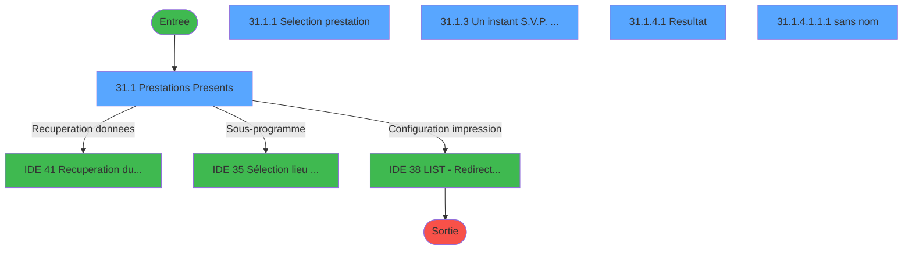
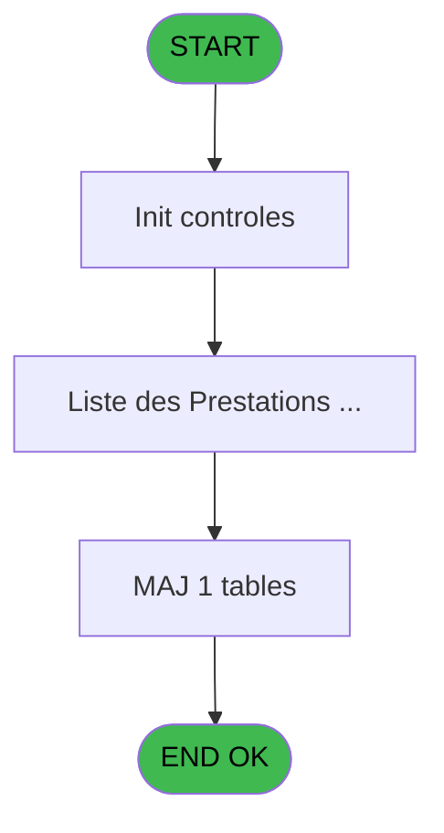
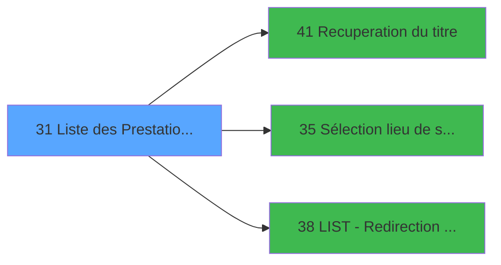

# PTR IDE 31 - Liste des Prestations Presents

> **Analyse**: Phases 1-4 2026-02-03 18:19 -> 18:19 (16s) | Assemblage 18:19
> **Pipeline**: V7.2 Enrichi
> **Structure**: 4 onglets (Resume | Ecrans | Donnees | Connexions)

<!-- TAB:Resume -->

## 1. FICHE D'IDENTITE

| Attribut | Valeur |
|----------|--------|
| Projet | PTR |
| IDE Position | 31 |
| Nom Programme | Liste des Prestations Presents |
| Fichier source | `Prg_31.xml` |
| Dossier IDE | Listes |
| Taches | 11 (5 ecrans visibles) |
| Tables modifiees | 1 |
| Programmes appeles | 3 |
| :warning: Statut | **ORPHELIN_POTENTIEL** |

## 2. DESCRIPTION FONCTIONNELLE

**Liste des Prestations Presents** assure la gestion complete de ce processus.

Le flux de traitement s'organise en **2 blocs fonctionnels** :

- **Traitement** (9 taches) : traitements metier divers
- **Consultation** (2 taches) : ecrans de recherche, selection et consultation

**Donnees modifiees** : 1 tables en ecriture (tempo_selection).

**Logique metier** : 1 regles identifiees couvrant valeurs par defaut.

Detail : phases du traitement

#### Phase 1 : Traitement (9 taches)

- **31** - (sans nom)
- **31.1** - Prestations Presents **[[ECRAN]](#ecran-t2)**
- **31.1.3** - Un instant S.V.P. ... **[[ECRAN]](#ecran-t5)**
- **31.1.3.1** - (sans nom) **[[ECRAN]](#ecran-t6)**
- **31.1.3.2** - Honey moon
- **31.1.4** - Scroll Prestations
- **31.1.4.1** - Resultat **[[ECRAN]](#ecran-t9)**
- **31.1.4.1.1** - Dialogue **[[ECRAN]](#ecran-t10)**
- **31.1.4.1.1.1** - (sans nom) **[[ECRAN]](#ecran-t11)**

Delegue a : [Recuperation du titre (IDE 41)](PTR-IDE-41.md), [Sélection lieu de séjour (IDE 35)](PTR-IDE-35.md), [LIST - Redirection d'un Etat (IDE 38)](PTR-IDE-38.md)

#### Phase 2 : Consultation (2 taches)

- **31.1.1** - Selection prestation **[[ECRAN]](#ecran-t3)**
- **31.1.2** - Choix date **[[ECRAN]](#ecran-t4)**

Delegue a : [Recuperation du titre (IDE 41)](PTR-IDE-41.md)

#### Tables impactees

| Table | Operations | Role metier |
|-------|-----------|-------------|
| tempo_selection | **W** (4 usages) | Table temporaire ecran |

## 3. BLOCS FONCTIONNELS

### 3.1 Traitement (9 taches)

Traitements internes.

---

#### 31 - (sans nom)

**Role** : Tache d'orchestration : point d'entree du programme (9 sous-taches). Coordonne l'enchainement des traitements.

8 sous-taches directes

| Tache | Nom | Bloc |
|-------|-----|------|
| [31.1](#t2) | Prestations Presents **[[ECRAN]](#ecran-t2)** | Traitement |
| [31.1.3](#t5) | Un instant S.V.P. ... **[[ECRAN]](#ecran-t5)** | Traitement |
| [31.1.3.1](#t6) | (sans nom) **[[ECRAN]](#ecran-t6)** | Traitement |
| [31.1.3.2](#t7) | Honey moon | Traitement |
| [31.1.4](#t8) | Scroll Prestations | Traitement |
| [31.1.4.1](#t9) | Resultat **[[ECRAN]](#ecran-t9)** | Traitement |
| [31.1.4.1.1](#t10) | Dialogue **[[ECRAN]](#ecran-t10)** | Traitement |
| [31.1.4.1.1.1](#t11) | (sans nom) **[[ECRAN]](#ecran-t11)** | Traitement |

**Delegue a** : [Recuperation du titre (IDE 41)](PTR-IDE-41.md), [Sélection lieu de séjour (IDE 35)](PTR-IDE-35.md), [LIST - Redirection d'un Etat (IDE 38)](PTR-IDE-38.md)

---

#### 31.1 - Prestations Presents [[ECRAN]](#ecran-t2)

**Role** : Traitement : Prestations Presents.
**Ecran** : 710 x 132 DLU (MDI) | [Voir mockup](#ecran-t2)
**Variables liees** : F (V_Titre Prestations)
**Delegue a** : [Recuperation du titre (IDE 41)](PTR-IDE-41.md), [Sélection lieu de séjour (IDE 35)](PTR-IDE-35.md), [LIST - Redirection d'un Etat (IDE 38)](PTR-IDE-38.md)

---

#### 31.1.3 - Un instant S.V.P. ... [[ECRAN]](#ecran-t5)

**Role** : Traitement : Un instant S.V.P. ....
**Ecran** : 424 x 57 DLU (MDI) | [Voir mockup](#ecran-t5)
**Delegue a** : [Recuperation du titre (IDE 41)](PTR-IDE-41.md), [Sélection lieu de séjour (IDE 35)](PTR-IDE-35.md), [LIST - Redirection d'un Etat (IDE 38)](PTR-IDE-38.md)

---

#### 31.1.3.1 - (sans nom) [[ECRAN]](#ecran-t6)

**Role** : Traitement interne.
**Ecran** : 83 x 37 DLU (MDI) | [Voir mockup](#ecran-t6)
**Delegue a** : [Recuperation du titre (IDE 41)](PTR-IDE-41.md), [Sélection lieu de séjour (IDE 35)](PTR-IDE-35.md), [LIST - Redirection d'un Etat (IDE 38)](PTR-IDE-38.md)

---

#### 31.1.3.2 - Honey moon

**Role** : Traitement : Honey moon.
**Delegue a** : [Recuperation du titre (IDE 41)](PTR-IDE-41.md), [Sélection lieu de séjour (IDE 35)](PTR-IDE-35.md), [LIST - Redirection d'un Etat (IDE 38)](PTR-IDE-38.md)

---

#### 31.1.4 - Scroll Prestations

**Role** : Traitement : Scroll Prestations.
**Variables liees** : F (V_Titre Prestations)
**Delegue a** : [Recuperation du titre (IDE 41)](PTR-IDE-41.md), [Sélection lieu de séjour (IDE 35)](PTR-IDE-35.md), [LIST - Redirection d'un Etat (IDE 38)](PTR-IDE-38.md)

---

#### 31.1.4.1 - Resultat [[ECRAN]](#ecran-t9)

**Role** : Traitement : Resultat.
**Ecran** : 1094 x 279 DLU (MDI) | [Voir mockup](#ecran-t9)
**Delegue a** : [Recuperation du titre (IDE 41)](PTR-IDE-41.md), [Sélection lieu de séjour (IDE 35)](PTR-IDE-35.md), [LIST - Redirection d'un Etat (IDE 38)](PTR-IDE-38.md)

---

#### 31.1.4.1.1 - Dialogue [[ECRAN]](#ecran-t10)

**Role** : Traitement : Dialogue.
**Ecran** : 96 x 24 DLU (MDI) | [Voir mockup](#ecran-t10)
**Delegue a** : [Recuperation du titre (IDE 41)](PTR-IDE-41.md), [Sélection lieu de séjour (IDE 35)](PTR-IDE-35.md), [LIST - Redirection d'un Etat (IDE 38)](PTR-IDE-38.md)

---

#### 31.1.4.1.1.1 - (sans nom) [[ECRAN]](#ecran-t11)

**Role** : Traitement interne.
**Ecran** : 432 x 56 DLU (MDI) | [Voir mockup](#ecran-t11)
**Delegue a** : [Recuperation du titre (IDE 41)](PTR-IDE-41.md), [Sélection lieu de séjour (IDE 35)](PTR-IDE-35.md), [LIST - Redirection d'un Etat (IDE 38)](PTR-IDE-38.md)

### 3.2 Consultation (2 taches)

Ecrans de recherche et consultation.

---

#### 31.1.1 - Selection prestation [[ECRAN]](#ecran-t3)

**Role** : Selection par l'operateur : Selection prestation.
**Ecran** : 395 x 185 DLU (MDI) | [Voir mockup](#ecran-t3)
**Variables liees** : F (V_Titre Prestations)

---

#### 31.1.2 - Choix date [[ECRAN]](#ecran-t4)

**Role** : Selection par l'operateur : Choix date.
**Ecran** : 40 x 8 DLU (MDI) | [Voir mockup](#ecran-t4)

## 5. REGLES METIER

1 regles identifiees:

### Autres (1 regles)

#### [RM-001] Valeur par defaut si GetParam ('SOCIETE') est vide

| Element | Detail |
|---------|--------|
| **Condition** | `GetParam ('SOCIETE')=''` |
| **Si vrai** | 'C' |
| **Si faux** | GetParam ('SOCIETE')) |
| **Expression source** | Expression 3 : `IF (GetParam ('SOCIETE')='','C',GetParam ('SOCIETE'))` |
| **Exemple** | Si GetParam ('SOCIETE')='' → 'C'. Sinon → GetParam ('SOCIETE')) |

## 6. CONTEXTE

- **Appele par**: (aucun)
- **Appelle**: 3 programmes | **Tables**: 6 (W:1 R:3 L:2) | **Taches**: 11 | **Expressions**: 5

<!-- TAB:Ecrans -->

## 8. ECRANS

### 8.1 Forms visibles (5 / 11)

| # | Position | Tache | Nom | Type | Largeur | Hauteur | Bloc |
|---|----------|-------|-----|------|---------|---------|------|
| 1 | 31.1 | 31.1 | Prestations Presents | MDI | 710 | 132 | Traitement |
| 2 | 31.1.1 | 31.1.1 | Selection prestation | MDI | 395 | 185 | Consultation |
| 3 | 31.1.3 | 31.1.3 | Un instant S.V.P. ... | MDI | 424 | 57 | Traitement |
| 4 | 31.1.4.1 | 31.1.4.1 | Resultat | MDI | 1094 | 279 | Traitement |
| 5 | 31.1.4.1.1.1 | 31.1.4.1.1.1 | (sans nom) | MDI | 432 | 56 | Traitement |

### 8.2 Mockups Ecrans

---

#### 31.1 - Prestations Presents
**Tache** : [31.1](#t2) | **Type** : MDI | **Dimensions** : 710 x 132 DLU
**Bloc** : Traitement | **Titre IDE** : Prestations Presents

<!-- FORM-DATA:
{
    "width":  710,
    "vFactor":  8,
    "type":  "MDI",
    "hFactor":  8,
    "controls":  [
                     {
                         "x":  0,
                         "type":  "label",
                         "var":  "",
                         "y":  0,
                         "w":  706,
                         "fmt":  "",
                         "name":  "",
                         "h":  20,
                         "color":  "",
                         "text":  "",
                         "parent":  null
                     },
                     {
                         "x":  520,
                         "type":  "label",
                         "var":  "",
                         "y":  25,
                         "w":  184,
                         "fmt":  "",
                         "name":  "",
                         "h":  78,
                         "color":  "",
                         "text":  "",
                         "parent":  null
                     },
                     {
                         "x":  2,
                         "type":  "label",
                         "var":  "",
                         "y":  29,
                         "w":  500,
                         "fmt":  "",
                         "name":  "",
                         "h":  70,
                         "color":  "195",
                         "text":  "Critères",
                         "parent":  null
                     },
                     {
                         "x":  14,
                         "type":  "label",
                         "var":  "",
                         "y":  55,
                         "w":  27,
                         "fmt":  "",
                         "name":  "",
                         "h":  10,
                         "color":  "",
                         "text":  "le",
                         "parent":  6
                     },
                     {
                         "x":  14,
                         "type":  "label",
                         "var":  "",
                         "y":  69,
                         "w":  86,
                         "fmt":  "",
                         "name":  "",
                         "h":  10,
                         "color":  "",
                         "text":  "Sélections",
                         "parent":  6
                     },
                     {
                         "x":  0,
                         "type":  "label",
                         "var":  "",
                         "y":  106,
                         "w":  706,
                         "fmt":  "",
                         "name":  "",
                         "h":  24,
                         "color":  "",
                         "text":  "",
                         "parent":  null
                     },
                     {
                         "x":  14,
                         "type":  "label",
                         "var":  "",
                         "y":  83,
                         "w":  115,
                         "fmt":  "",
                         "name":  "",
                         "h":  10,
                         "color":  "",
                         "text":  "Lieu de séjour",
                         "parent":  6
                     },
                     {
                         "x":  133,
                         "type":  "edit",
                         "var":  "",
                         "y":  55,
                         "w":  126,
                         "fmt":  "DD/MM/YYYYZ",
                         "name":  "",
                         "h":  10,
                         "color":  "110",
                         "text":  "",
                         "parent":  6
                     },
                     {
                         "x":  133,
                         "type":  "edit",
                         "var":  "",
                         "y":  69,
                         "w":  78,
                         "fmt":  "",
                         "name":  "",
                         "h":  10,
                         "color":  "",
                         "text":  "",
                         "parent":  6
                     },
                     {
                         "x":  6,
                         "type":  "button",
                         "var":  "",
                         "y":  109,
                         "w":  154,
                         "fmt":  "\u0026Quitter",
                         "name":  "B_Quitter",
                         "h":  18,
                         "color":  "",
                         "text":  "",
                         "parent":  12
                     },
                     {
                         "x":  539,
                         "type":  "button",
                         "var":  "",
                         "y":  81,
                         "w":  154,
                         "fmt":  "\u0026Rechercher",
                         "name":  "B_Rechercher",
                         "h":  18,
                         "color":  "",
                         "text":  "",
                         "parent":  null
                     },
                     {
                         "x":  6,
                         "type":  "edit",
                         "var":  "",
                         "y":  6,
                         "w":  396,
                         "fmt":  "30",
                         "name":  "",
                         "h":  8,
                         "color":  "",
                         "text":  "",
                         "parent":  1
                     },
                     {
                         "x":  426,
                         "type":  "edit",
                         "var":  "",
                         "y":  6,
                         "w":  268,
                         "fmt":  "WWW DD MMM YYYYT",
                         "name":  "",
                         "h":  8,
                         "color":  "",
                         "text":  "",
                         "parent":  1
                     },
                     {
                         "x":  530,
                         "type":  "image",
                         "var":  "",
                         "y":  33,
                         "w":  160,
                         "fmt":  "",
                         "name":  "",
                         "h":  44,
                         "color":  "",
                         "text":  "",
                         "parent":  4
                     },
                     {
                         "x":  14,
                         "type":  "edit",
                         "var":  "",
                         "y":  41,
                         "w":  243,
                         "fmt":  "30",
                         "name":  "",
                         "h":  10,
                         "color":  "",
                         "text":  "",
                         "parent":  6
                     },
                     {
                         "x":  203,
                         "type":  "button",
                         "var":  "",
                         "y":  109,
                         "w":  154,
                         "fmt":  "\u0026Prestations",
                         "name":  "",
                         "h":  18,
                         "color":  "",
                         "text":  "",
                         "parent":  12
                     },
                     {
                         "x":  371,
                         "type":  "button",
                         "var":  "",
                         "y":  109,
                         "w":  154,
                         "fmt":  "\u0026Date",
                         "name":  "",
                         "h":  18,
                         "color":  "",
                         "text":  "",
                         "parent":  12
                     },
                     {
                         "x":  539,
                         "type":  "button",
                         "var":  "",
                         "y":  109,
                         "w":  154,
                         "fmt":  "\u0026Lieu de séjour",
                         "name":  "",
                         "h":  18,
                         "color":  "",
                         "text":  "",
                         "parent":  12
                     },
                     {
                         "x":  133,
                         "type":  "edit",
                         "var":  "",
                         "y":  82,
                         "w":  35,
                         "fmt":  "",
                         "name":  "W1-Lieu de sejour",
                         "h":  10,
                         "color":  "110",
                         "text":  "",
                         "parent":  6
                     },
                     {
                         "x":  176,
                         "type":  "edit",
                         "var":  "",
                         "y":  82,
                         "w":  230,
                         "fmt":  "",
                         "name":  "nom_import",
                         "h":  10,
                         "color":  "",
                         "text":  "",
                         "parent":  6
                     }
                 ],
    "taskId":  "31.1",
    "height":  132
}
-->

<strong>Champs : 7 champs</strong>

| Pos (x,y) | Nom | Variable | Type |
|-----------|-----|----------|------|
| 133,55 | DD/MM/YYYYZ | - | edit |
| 133,69 | (sans nom) | - | edit |
| 6,6 | 30 | - | edit |
| 426,6 | WWW DD MMM YYYYT | - | edit |
| 14,41 | 30 | - | edit |
| 133,82 | W1-Lieu de sejour | - | edit |
| 176,82 | nom_import | - | edit |

<strong>Boutons : 5 boutons</strong>

| Bouton | Pos (x,y) | Action |
|--------|-----------|--------|
| Quitter | 6,109 | Quitte le programme |
| Rechercher | 539,81 | Ouvre la selection |
| Prestations | 203,109 | Bouton fonctionnel |
| Date | 371,109 | Bouton fonctionnel |
| Lieu de séjour | 539,109 | Appel [Sélection lieu de séjour (IDE 35)](PTR-IDE-35.md) |

---

#### 31.1.1 - Selection prestation
**Tache** : [31.1.1](#t3) | **Type** : MDI | **Dimensions** : 395 x 185 DLU
**Bloc** : Consultation | **Titre IDE** : Selection prestation

<!-- FORM-DATA:
{
    "width":  395,
    "vFactor":  8,
    "type":  "MDI",
    "hFactor":  8,
    "controls":  [
                     {
                         "x":  7,
                         "type":  "table",
                         "var":  "",
                         "name":  "",
                         "titleH":  12,
                         "color":  "196",
                         "w":  387,
                         "y":  4,
                         "fmt":  "",
                         "parent":  null,
                         "text":  "",
                         "rowH":  12,
                         "h":  124,
                         "cols":  [
                                      {
                                          "title":  "Prestations",
                                          "layer":  1,
                                          "w":  349
                                      }
                                  ],
                         "rows":  1
                     },
                     {
                         "x":  0,
                         "type":  "label",
                         "var":  "",
                         "y":  158,
                         "w":  394,
                         "fmt":  "",
                         "name":  "",
                         "h":  24,
                         "color":  "",
                         "text":  "",
                         "parent":  null
                     },
                     {
                         "x":  19,
                         "type":  "edit",
                         "var":  "",
                         "y":  20,
                         "w":  75,
                         "fmt":  "",
                         "name":  "",
                         "h":  8,
                         "color":  "177",
                         "text":  "",
                         "parent":  1
                     },
                     {
                         "x":  123,
                         "type":  "edit",
                         "var":  "",
                         "y":  20,
                         "w":  232,
                         "fmt":  "",
                         "name":  "",
                         "h":  8,
                         "color":  "177",
                         "text":  "",
                         "parent":  1
                     },
                     {
                         "x":  9,
                         "type":  "button",
                         "var":  "",
                         "y":  161,
                         "w":  154,
                         "fmt":  "\u0026Sélectionner",
                         "name":  "",
                         "h":  18,
                         "color":  "",
                         "text":  "",
                         "parent":  6
                     },
                     {
                         "x":  227,
                         "type":  "button",
                         "var":  "",
                         "y":  161,
                         "w":  154,
                         "fmt":  "\u0026Abandonner",
                         "name":  "",
                         "h":  18,
                         "color":  "",
                         "text":  "",
                         "parent":  6
                     },
                     {
                         "x":  168,
                         "type":  "image",
                         "var":  "",
                         "y":  134,
                         "w":  56,
                         "fmt":  "",
                         "name":  "",
                         "h":  18,
                         "color":  "",
                         "text":  "",
                         "parent":  null
                     }
                 ],
    "taskId":  "31.1.1",
    "height":  185
}
-->

<strong>Champs : 2 champs</strong>

| Pos (x,y) | Nom | Variable | Type |
|-----------|-----|----------|------|
| 19,20 | (sans nom) | - | edit |
| 123,20 | (sans nom) | - | edit |

<strong>Boutons : 2 boutons</strong>

| Bouton | Pos (x,y) | Action |
|--------|-----------|--------|
| Sélectionner | 9,161 | Appel [Sélection lieu de séjour (IDE 35)](PTR-IDE-35.md) |
| Abandonner | 227,161 | Annule et retour au menu |

---

#### 31.1.3 - Un instant S.V.P. ...
**Tache** : [31.1.3](#t5) | **Type** : MDI | **Dimensions** : 424 x 57 DLU
**Bloc** : Traitement | **Titre IDE** : Un instant S.V.P. ...

<!-- FORM-DATA:
{
    "width":  424,
    "vFactor":  8,
    "type":  "MDI",
    "hFactor":  8,
    "controls":  [
                     {
                         "x":  12,
                         "type":  "label",
                         "var":  "",
                         "y":  4,
                         "w":  400,
                         "fmt":  "",
                         "name":  "",
                         "h":  48,
                         "color":  "",
                         "text":  "",
                         "parent":  null
                     },
                     {
                         "x":  102,
                         "type":  "label",
                         "var":  "",
                         "y":  18,
                         "w":  221,
                         "fmt":  "",
                         "name":  "",
                         "h":  8,
                         "color":  "7",
                         "text":  "Preparation en cours ...",
                         "parent":  1
                     },
                     {
                         "x":  22,
                         "type":  "image",
                         "var":  "",
                         "y":  8,
                         "w":  106,
                         "fmt":  "",
                         "name":  "",
                         "h":  40,
                         "color":  "",
                         "text":  "",
                         "parent":  null
                     },
                     {
                         "x":  194,
                         "type":  "edit",
                         "var":  "",
                         "y":  29,
                         "w":  37,
                         "fmt":  "",
                         "name":  "",
                         "h":  15,
                         "color":  "",
                         "text":  "",
                         "parent":  1
                     }
                 ],
    "taskId":  "31.1.3",
    "height":  57
}
-->

<strong>Champs : 1 champs</strong>

| Pos (x,y) | Nom | Variable | Type |
|-----------|-----|----------|------|
| 194,29 | (sans nom) | - | edit |

---

#### 31.1.4.1 - Resultat
**Tache** : [31.1.4.1](#t9) | **Type** : MDI | **Dimensions** : 1094 x 279 DLU
**Bloc** : Traitement | **Titre IDE** : Resultat

<!-- FORM-DATA:
{
    "width":  1094,
    "vFactor":  8,
    "type":  "MDI",
    "hFactor":  8,
    "controls":  [
                     {
                         "x":  9,
                         "type":  "table",
                         "var":  "",
                         "name":  "",
                         "titleH":  12,
                         "color":  "110",
                         "w":  1077,
                         "y":  47,
                         "fmt":  "",
                         "parent":  null,
                         "text":  "",
                         "rowH":  12,
                         "h":  198,
                         "cols":  [
                                      {
                                          "title":  "Titre",
                                          "layer":  1,
                                          "w":  45
                                      },
                                      {
                                          "title":  "Nom",
                                          "layer":  2,
                                          "w":  196
                                      },
                                      {
                                          "title":  "Prénom",
                                          "layer":  3,
                                          "w":  133
                                      },
                                      {
                                          "title":  "Début Prestation",
                                          "layer":  4,
                                          "w":  146
                                      },
                                      {
                                          "title":  "Fin Prestation",
                                          "layer":  5,
                                          "w":  139
                                      },
                                      {
                                          "title":  "Début Séjour",
                                          "layer":  6,
                                          "w":  136
                                      },
                                      {
                                          "title":  "Fin Séjour",
                                          "layer":  7,
                                          "w":  134
                                      },
                                      {
                                          "title":  "Prestation",
                                          "layer":  8,
                                          "w":  113
                                      }
                                  ],
                         "rows":  8
                     },
                     {
                         "x":  3,
                         "type":  "label",
                         "var":  "",
                         "y":  253,
                         "w":  1081,
                         "fmt":  "",
                         "name":  "",
                         "h":  24,
                         "color":  "",
                         "text":  "",
                         "parent":  null
                     },
                     {
                         "x":  8,
                         "type":  "label",
                         "var":  "",
                         "y":  3,
                         "w":  1079,
                         "fmt":  "",
                         "name":  "",
                         "h":  20,
                         "color":  "",
                         "text":  "",
                         "parent":  null
                     },
                     {
                         "x":  8,
                         "type":  "label",
                         "var":  "",
                         "y":  26,
                         "w":  1079,
                         "fmt":  "",
                         "name":  "",
                         "h":  20,
                         "color":  "",
                         "text":  "",
                         "parent":  null
                     },
                     {
                         "x":  14,
                         "type":  "label",
                         "var":  "",
                         "y":  30,
                         "w":  139,
                         "fmt":  "",
                         "name":  "",
                         "h":  12,
                         "color":  "",
                         "text":  "Lieu de séjour",
                         "parent":  60
                     },
                     {
                         "x":  69,
                         "type":  "edit",
                         "var":  "",
                         "y":  63,
                         "w":  176,
                         "fmt":  "",
                         "name":  "",
                         "h":  8,
                         "color":  "110",
                         "text":  "",
                         "parent":  1
                     },
                     {
                         "x":  261,
                         "type":  "edit",
                         "var":  "",
                         "y":  63,
                         "w":  120,
                         "fmt":  "",
                         "name":  "",
                         "h":  8,
                         "color":  "110",
                         "text":  "",
                         "parent":  1
                     },
                     {
                         "x":  16,
                         "type":  "edit",
                         "var":  "",
                         "y":  63,
                         "w":  30,
                         "fmt":  "",
                         "name":  "",
                         "h":  8,
                         "color":  "110",
                         "text":  "",
                         "parent":  1
                     },
                     {
                         "x":  394,
                         "type":  "edit",
                         "var":  "",
                         "y":  63,
                         "w":  120,
                         "fmt":  "DD/MM/YYYYZ",
                         "name":  "",
                         "h":  8,
                         "color":  "110",
                         "text":  "",
                         "parent":  1
                     },
                     {
                         "x":  541,
                         "type":  "edit",
                         "var":  "",
                         "y":  63,
                         "w":  120,
                         "fmt":  "DD/MM/YYYYZ",
                         "name":  "",
                         "h":  8,
                         "color":  "110",
                         "text":  "",
                         "parent":  1
                     },
                     {
                         "x":  678,
                         "type":  "edit",
                         "var":  "",
                         "y":  63,
                         "w":  120,
                         "fmt":  "DD/MM/YYYYZ",
                         "name":  "",
                         "h":  8,
                         "color":  "110",
                         "text":  "",
                         "parent":  1
                     },
                     {
                         "x":  814,
                         "type":  "edit",
                         "var":  "",
                         "y":  63,
                         "w":  120,
                         "fmt":  "DD/MM/YYYYZ",
                         "name":  "",
                         "h":  8,
                         "color":  "110",
                         "text":  "",
                         "parent":  1
                     },
                     {
                         "x":  949,
                         "type":  "edit",
                         "var":  "",
                         "y":  63,
                         "w":  75,
                         "fmt":  "",
                         "name":  "inp_code_prestation",
                         "h":  8,
                         "color":  "110",
                         "text":  "",
                         "parent":  1
                     },
                     {
                         "x":  920,
                         "type":  "button",
                         "var":  "",
                         "y":  256,
                         "w":  154,
                         "fmt":  "\u0026Imprimer",
                         "name":  "",
                         "h":  18,
                         "color":  "",
                         "text":  "",
                         "parent":  null
                     },
                     {
                         "x":  9,
                         "type":  "button",
                         "var":  "",
                         "y":  256,
                         "w":  154,
                         "fmt":  "\u0026Quitter",
                         "name":  "",
                         "h":  18,
                         "color":  "",
                         "text":  "",
                         "parent":  18
                     },
                     {
                         "x":  14,
                         "type":  "edit",
                         "var":  "",
                         "y":  9,
                         "w":  396,
                         "fmt":  "30",
                         "name":  "",
                         "h":  8,
                         "color":  "",
                         "text":  "",
                         "parent":  57
                     },
                     {
                         "x":  809,
                         "type":  "edit",
                         "var":  "",
                         "y":  9,
                         "w":  268,
                         "fmt":  "WWW DD MMM YYYYT",
                         "name":  "",
                         "h":  8,
                         "color":  "",
                         "text":  "",
                         "parent":  57
                     },
                     {
                         "x":  159,
                         "type":  "edit",
                         "var":  "",
                         "y":  30,
                         "w":  243,
                         "fmt":  "",
                         "name":  "W1 Libellé lieu de séjour",
                         "h":  12,
                         "color":  "",
                         "text":  "",
                         "parent":  60
                     }
                 ],
    "taskId":  "31.1.4.1",
    "height":  279
}
-->

<strong>Champs : 11 champs</strong>

| Pos (x,y) | Nom | Variable | Type |
|-----------|-----|----------|------|
| 69,63 | (sans nom) | - | edit |
| 261,63 | (sans nom) | - | edit |
| 16,63 | (sans nom) | - | edit |
| 394,63 | DD/MM/YYYYZ | - | edit |
| 541,63 | DD/MM/YYYYZ | - | edit |
| 678,63 | DD/MM/YYYYZ | - | edit |
| 814,63 | DD/MM/YYYYZ | - | edit |
| 949,63 | inp_code_prestation | - | edit |
| 14,9 | 30 | - | edit |
| 809,9 | WWW DD MMM YYYYT | - | edit |
| 159,30 | W1 Libellé lieu de séjour | - | edit |

<strong>Boutons : 2 boutons</strong>

| Bouton | Pos (x,y) | Action |
|--------|-----------|--------|
| Imprimer | 920,256 | Lance l'impression |
| Quitter | 9,256 | Quitte le programme |

---

#### 31.1.4.1.1.1 - (sans nom)
**Tache** : [31.1.4.1.1.1](#t11) | **Type** : MDI | **Dimensions** : 432 x 56 DLU
**Bloc** : Traitement | **Titre IDE** : (sans nom)

<!-- FORM-DATA:
{
    "width":  432,
    "vFactor":  8,
    "type":  "MDI",
    "hFactor":  8,
    "controls":  [
                     {
                         "x":  12,
                         "type":  "label",
                         "var":  "",
                         "y":  4,
                         "w":  400,
                         "fmt":  "",
                         "name":  "",
                         "h":  48,
                         "color":  "",
                         "text":  "",
                         "parent":  null
                     },
                     {
                         "x":  161,
                         "type":  "label",
                         "var":  "",
                         "y":  18,
                         "w":  221,
                         "fmt":  "",
                         "name":  "",
                         "h":  8,
                         "color":  "7",
                         "text":  "Impression en cours ...",
                         "parent":  1
                     },
                     {
                         "x":  22,
                         "type":  "image",
                         "var":  "",
                         "y":  8,
                         "w":  106,
                         "fmt":  "",
                         "name":  "",
                         "h":  40,
                         "color":  "",
                         "text":  "",
                         "parent":  null
                     },
                     {
                         "x":  226,
                         "type":  "edit",
                         "var":  "",
                         "y":  29,
                         "w":  37,
                         "fmt":  "",
                         "name":  "",
                         "h":  15,
                         "color":  "",
                         "text":  "",
                         "parent":  1
                     }
                 ],
    "taskId":  "31.1.4.1.1.1",
    "height":  56
}
-->

<strong>Champs : 1 champs</strong>

| Pos (x,y) | Nom | Variable | Type |
|-----------|-----|----------|------|
| 226,29 | (sans nom) | - | edit |

## 9. NAVIGATION

### 9.1 Enchainement des ecrans

**Detail par enchainement :**

| Depuis | Action | Vers | Retour |
|--------|--------|------|--------|
| Prestations Presents | Recuperation donnees | [Recuperation du titre (IDE 41)](PTR-IDE-41.md) | Retour ecran |
| Prestations Presents | Sous-programme | [Sélection lieu de séjour (IDE 35)](PTR-IDE-35.md) | Retour ecran |
| Prestations Presents | Configuration impression | [LIST - Redirection d'un Etat (IDE 38)](PTR-IDE-38.md) | Retour ecran |

### 9.3 Structure hierarchique (11 taches)

| Position | Tache | Type | Dimensions | Bloc |
|----------|-------|------|------------|------|
| **31.1** | [**(sans nom)** (31)](#t1) | MDI | - | Traitement |
| 31.1.1 | [Prestations Presents (31.1)](#t2) [mockup](#ecran-t2) | MDI | 710x132 | |
| 31.1.2 | [Un instant S.V.P. ... (31.1.3)](#t5) [mockup](#ecran-t5) | MDI | 424x57 | |
| 31.1.3 | [(sans nom) (31.1.3.1)](#t6) [mockup](#ecran-t6) | MDI | 83x37 | |
| 31.1.4 | [Honey moon (31.1.3.2)](#t7) | MDI | - | |
| 31.1.5 | [Scroll Prestations (31.1.4)](#t8) | MDI | - | |
| 31.1.6 | [Resultat (31.1.4.1)](#t9) [mockup](#ecran-t9) | MDI | 1094x279 | |
| 31.1.7 | [Dialogue (31.1.4.1.1)](#t10) [mockup](#ecran-t10) | MDI | 96x24 | |
| 31.1.8 | [(sans nom) (31.1.4.1.1.1)](#t11) [mockup](#ecran-t11) | MDI | 432x56 | |
| **31.2** | [**Selection prestation** (31.1.1)](#t3) [mockup](#ecran-t3) | MDI | 395x185 | Consultation |
| 31.2.1 | [Choix date (31.1.2)](#t4) [mockup](#ecran-t4) | MDI | 40x8 | |

### 9.4 Algorigramme

> **Legende**: Vert = START/END OK | Rouge = END KO | Bleu = Decisions
> *Algorigramme auto-genere. Utiliser `/algorigramme` pour une synthese metier detaillee.*

<!-- TAB:Donnees -->

## 10. TABLES

### Tables utilisees (6)

| ID | Nom | Description | Type | R | W | L | Usages |
|----|-----|-------------|------|---|---|---|--------|
| 30 | gm-recherche_____gmr | Index de recherche | DB |   |   | L | 1 |
| 33 | prestations______pre | Prestations/services vendus | DB | R |   |   | 1 |
| 34 | hebergement______heb | Hebergement (chambres) | DB |   |   | L | 1 |
| 118 | tables_imports |  | DB | R |   |   | 1 |
| 135 | libelle_prestation | Prestations/services vendus | DB | R |   |   | 1 |
| 649 | tempo_selection | Table temporaire ecran | DB |   | **W** |   | 4 |

### Colonnes par table (4 / 4 tables avec colonnes identifiees)

Table 33 - prestations______pre (R) - 1 usages

| Lettre | Variable | Acces | Type |
|--------|----------|-------|------|
| F | V_Titre Prestations | R | Alpha |

Table 118 - tables_imports (R) - 1 usages

| Lettre | Variable | Acces | Type |
|--------|----------|-------|------|
| A | W1 code prestation | R | Alpha |
| B | W1 libelle | R | Alpha |
| C | W1 date debut | R | Date |
| D | W1-Selection | R | Numeric |
| E | W1-Lieu de sejour | R | Alpha |
| F | W1 Accord Suite | R | Alpha |
| G | B_Quitter | R | Alpha |
| H | B_Rechercher | R | Alpha |
| I | W1-Lien Lieu sejour | R | Logical |

Table 135 - libelle_prestation (R) - 1 usages

| Lettre | Variable | Acces | Type |
|--------|----------|-------|------|
| A | W1 code prestation | R | Alpha |
| B | W1 libelle | R | Alpha |
| F | V_Titre Prestations | R | Alpha |

Table 649 - tempo_selection (**W**) - 4 usages

| Lettre | Variable | Acces | Type |
|--------|----------|-------|------|
| A | W3-Boucle | W | Alpha |
| B | W3 Formatage | W | Alpha |
| C | W3 10/17 | W | Alpha |
| D | W3 Impression ? | W | Alpha |
| E | W3 choix action | W | Alpha |
| F | W3 fin tâche | W | Alpha |

## 11. VARIABLES

### 11.1 Variables de travail (4)

Variables internes au programme.

| Lettre | Nom | Type | Usage dans |
|--------|-----|------|-----------|
| A | W0 Societe | Alpha | - |
| B | W0 Nom Village | Alpha | - |
| C | W0 Code B078 | Numeric | - |
| D | W0 Code B080 | Numeric | - |

### 11.2 Autres (5)

Variables diverses.

| Lettre | Nom | Type | Usage dans |
|--------|-----|------|-----------|
| E | V_Titre | Alpha | - |
| F | V_Titre Prestations | Alpha | - |
| G | B_Quitter | Alpha | - |
| H | B_Rechercher | Alpha | - |
| I | W1-Lien Lieu sejour | Logical | - |

## 12. EXPRESSIONS

**5 / 5 expressions decodees (100%)**

### 12.1 Repartition par type

| Type | Expressions | Regles |
|------|-------------|--------|
| CONDITION | 1 | 5 |
| CONSTANTE | 3 | 0 |
| OTHER | 1 | 0 |

### 12.2 Expressions cles par type

#### CONDITION (1 expressions)

| Type | IDE | Expression | Regle |
|------|-----|------------|-------|
| CONDITION | 3 | `IF (GetParam ('SOCIETE')='','C',GetParam ('SOCIETE'))` | [RM-001](#rm-RM-001) |

#### CONSTANTE (3 expressions)

| Type | IDE | Expression | Regle |
|------|-----|------------|-------|
| CONSTANTE | 5 | `80` | - |
| CONSTANTE | 2 | `19` | - |
| CONSTANTE | 1 | `20` | - |

#### OTHER (1 expressions)

| Type | IDE | Expression | Regle |
|------|-----|------------|-------|
| OTHER | 4 | `GetParam ('VILLAGE')` | - |

<!-- TAB:Connexions -->

## 13. GRAPHE D'APPELS

### 13.1 Chaine depuis Main (Callers)

**Chemin**: (pas de callers directs)

### 13.2 Callers

| IDE | Nom Programme | Nb Appels |
|-----|---------------|-----------|
| - | (aucun) | - |

### 13.3 Callees (programmes appeles)

### 13.4 Detail Callees avec contexte

| IDE | Nom Programme | Appels | Contexte |
|-----|---------------|--------|----------|
| [41](PTR-IDE-41.md) | Recuperation du titre | 3 | Recuperation donnees |
| [35](PTR-IDE-35.md) | Sélection lieu de séjour | 1 | Sous-programme |
| [38](PTR-IDE-38.md) | LIST - Redirection d'un Etat | 1 | Configuration impression |

## 14. RECOMMANDATIONS MIGRATION

### 14.1 Profil du programme

| Metrique | Valeur | Impact migration |
|----------|--------|-----------------|
| Lignes de logique | 199 | Programme compact |
| Expressions | 5 | Peu de logique |
| Tables WRITE | 1 | Impact faible |
| Sous-programmes | 3 | Peu de dependances |
| Ecrans visibles | 5 | Quelques ecrans |
| Code desactive | 1% (2 / 199) | Code sain |
| Regles metier | 1 | Quelques regles a preserver |

### 14.2 Plan de migration par bloc

#### Traitement (9 taches: 6 ecrans, 3 traitements)

- **Strategie** : Orchestrateur avec 6 ecrans (Razor/React) et 3 traitements backend (services).
- Les ecrans deviennent des composants UI, les traitements invisibles deviennent des services injectables.
- 3 sous-programme(s) a migrer ou a reutiliser depuis les services existants.
- Decomposer les taches en services unitaires testables.

#### Consultation (2 taches: 2 ecrans, 0 traitement)

- **Strategie** : Composants de recherche/selection en modales.
- 2 ecrans : Selection prestation, Choix date

### 14.3 Dependances critiques

| Dependance | Type | Appels | Impact |
|------------|------|--------|--------|
| tempo_selection | Table WRITE (Database) | 4x | Schema + repository |
| [Recuperation du titre (IDE 41)](PTR-IDE-41.md) | Sous-programme | 3x | **CRITIQUE** - Recuperation donnees |
| [LIST - Redirection d'un Etat (IDE 38)](PTR-IDE-38.md) | Sous-programme | 1x | Normale - Configuration impression |
| [Sélection lieu de séjour (IDE 35)](PTR-IDE-35.md) | Sous-programme | 1x | Normale - Sous-programme |

---
*Spec DETAILED generee par Pipeline V7.2 - 2026-02-03 18:19*
