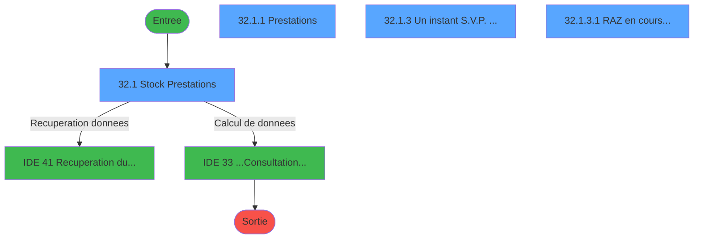
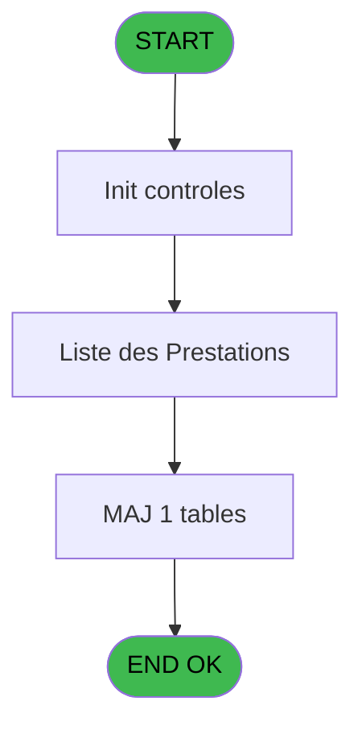
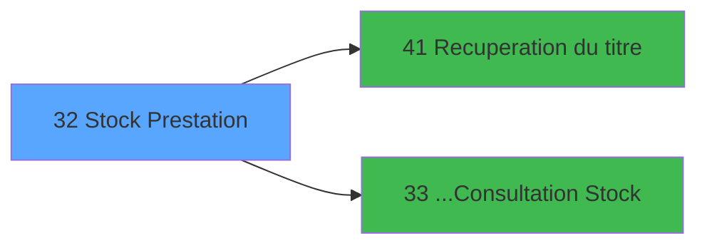

# PTR IDE 32 - Stock Prestation

> **Analyse**: Phases 1-4 2026-02-03 18:19 -> 18:19 (16s) | Assemblage 18:19
> **Pipeline**: V7.2 Enrichi
> **Structure**: 4 onglets (Resume | Ecrans | Donnees | Connexions)

<!-- TAB:Resume -->

## 1. FICHE D'IDENTITE

| Attribut | Valeur |
|----------|--------|
| Projet | PTR |
| IDE Position | 32 |
| Nom Programme | Stock Prestation |
| Fichier source | `Prg_32.xml` |
| Dossier IDE | Listes |
| Taches | 7 (4 ecrans visibles) |
| Tables modifiees | 1 |
| Programmes appeles | 2 |
| :warning: Statut | **ORPHELIN_POTENTIEL** |

## 2. DESCRIPTION FONCTIONNELLE

**Stock Prestation** assure la gestion complete de ce processus.

Le flux de traitement s'organise en **4 blocs fonctionnels** :

- **Traitement** (4 taches) : traitements metier divers
- **Initialisation** (1 tache) : reinitialisation d'etats et de variables de travail
- **Consultation** (1 tache) : ecrans de recherche, selection et consultation
- **Calcul** (1 tache) : calculs de montants, stocks ou compteurs

**Donnees modifiees** : 1 tables en ecriture (tempo_trafic).

**Logique metier** : 1 regles identifiees couvrant valeurs par defaut.

Detail : phases du traitement

#### Phase 1 : Traitement (4 taches)

- **32** - (sans nom)
- **32.1.1** - Prestations **[[ECRAN]](#ecran-t3)**
- **32.1.3** - Un instant S.V.P. ... **[[ECRAN]](#ecran-t5)**
- **32.1.3.2** - Maj Intermediaire

Delegue a : [Recuperation du titre (IDE 41)](PTR-IDE-41.md)

#### Phase 2 : Calcul (1 tache)

- **32.1** - Stock Prestations **[[ECRAN]](#ecran-t2)**

Delegue a : [...Consultation Stock (IDE 33)](PTR-IDE-33.md)

#### Phase 3 : Consultation (1 tache)

- **32.1.2** - Choix date **[[ECRAN]](#ecran-t4)**

Delegue a : [Recuperation du titre (IDE 41)](PTR-IDE-41.md)

#### Phase 4 : Initialisation (1 tache)

- **32.1.3.1** - RAZ en cours... **[[ECRAN]](#ecran-t6)**

#### Tables impactees

| Table | Operations | Role metier |
|-------|-----------|-------------|
| tempo_trafic | **W** (2 usages) | Table temporaire ecran |

## 3. BLOCS FONCTIONNELS

### 3.1 Traitement (4 taches)

Traitements internes.

---

#### 32 - (sans nom)

**Role** : Traitement interne.

3 sous-taches directes

| Tache | Nom | Bloc |
|-------|-----|------|
| [32.1.1](#t3) | Prestations **[[ECRAN]](#ecran-t3)** | Traitement |
| [32.1.3](#t5) | Un instant S.V.P. ... **[[ECRAN]](#ecran-t5)** | Traitement |
| [32.1.3.2](#t7) | Maj Intermediaire | Traitement |

**Delegue a** : [Recuperation du titre (IDE 41)](PTR-IDE-41.md)

---

#### 32.1.1 - Prestations [[ECRAN]](#ecran-t3)

**Role** : Traitement : Prestations.
**Ecran** : 397 x 190 DLU (MDI) | [Voir mockup](#ecran-t3)
**Variables liees** : F (V_Titre prestations)
**Delegue a** : [Recuperation du titre (IDE 41)](PTR-IDE-41.md)

---

#### 32.1.3 - Un instant S.V.P. ... [[ECRAN]](#ecran-t5)

**Role** : Traitement : Un instant S.V.P. ....
**Ecran** : 424 x 57 DLU (MDI) | [Voir mockup](#ecran-t5)
**Delegue a** : [Recuperation du titre (IDE 41)](PTR-IDE-41.md)

---

#### 32.1.3.2 - Maj Intermediaire

**Role** : Traitement : Maj Intermediaire.
**Delegue a** : [Recuperation du titre (IDE 41)](PTR-IDE-41.md)

### 3.2 Calcul (1 tache)

Calculs metier : montants, stocks, compteurs.

---

#### 32.1 - Stock Prestations [[ECRAN]](#ecran-t2)

**Role** : Calcul : Stock Prestations.
**Ecran** : 627 x 160 DLU (MDI) | [Voir mockup](#ecran-t2)
**Variables liees** : F (V_Titre prestations)
**Delegue a** : [...Consultation Stock (IDE 33)](PTR-IDE-33.md)

### 3.3 Consultation (1 tache)

Ecrans de recherche et consultation.

---

#### 32.1.2 - Choix date [[ECRAN]](#ecran-t4)

**Role** : Selection par l'operateur : Choix date.
**Ecran** : 48 x 8 DLU (Modal) | [Voir mockup](#ecran-t4)

### 3.4 Initialisation (1 tache)

Reinitialisation d'etats et variables de travail.

---

#### 32.1.3.1 - RAZ en cours... [[ECRAN]](#ecran-t6)

**Role** : Reinitialisation : RAZ en cours....
**Ecran** : 426 x 56 DLU (MDI) | [Voir mockup](#ecran-t6)

## 5. REGLES METIER

1 regles identifiees:

### Autres (1 regles)

#### [RM-001] Valeur par defaut si GetParam ('SOCIETE') est vide

| Element | Detail |
|---------|--------|
| **Condition** | `GetParam ('SOCIETE')=''` |
| **Si vrai** | 'C' |
| **Si faux** | GetParam ('SOCIETE')) |
| **Expression source** | Expression 3 : `IF (GetParam ('SOCIETE')='','C',GetParam ('SOCIETE'))` |
| **Exemple** | Si GetParam ('SOCIETE')='' → 'C'. Sinon → GetParam ('SOCIETE')) |

## 6. CONTEXTE

- **Appele par**: (aucun)
- **Appelle**: 2 programmes | **Tables**: 5 (W:1 R:2 L:2) | **Taches**: 7 | **Expressions**: 6

<!-- TAB:Ecrans -->

## 8. ECRANS

### 8.1 Forms visibles (4 / 7)

| # | Position | Tache | Nom | Type | Largeur | Hauteur | Bloc |
|---|----------|-------|-----|------|---------|---------|------|
| 1 | 32.1 | 32.1 | Stock Prestations | MDI | 627 | 160 | Calcul |
| 2 | 32.1.1 | 32.1.1 | Prestations | MDI | 397 | 190 | Traitement |
| 3 | 32.1.3 | 32.1.3 | Un instant S.V.P. ... | MDI | 424 | 57 | Traitement |
| 4 | 32.1.3.1 | 32.1.3.1 | RAZ en cours... | MDI | 426 | 56 | Initialisation |

### 8.2 Mockups Ecrans

---

#### 32.1 - Stock Prestations
**Tache** : [32.1](#t2) | **Type** : MDI | **Dimensions** : 627 x 160 DLU
**Bloc** : Calcul | **Titre IDE** : Stock Prestations

<!-- FORM-DATA:
{
    "width":  627,
    "vFactor":  8,
    "type":  "MDI",
    "hFactor":  8,
    "controls":  [
                     {
                         "x":  0,
                         "type":  "label",
                         "var":  "",
                         "y":  0,
                         "w":  626,
                         "fmt":  "",
                         "name":  "",
                         "h":  20,
                         "color":  "",
                         "text":  "",
                         "parent":  null
                     },
                     {
                         "x":  428,
                         "type":  "label",
                         "var":  "",
                         "y":  26,
                         "w":  190,
                         "fmt":  "",
                         "name":  "",
                         "h":  104,
                         "color":  "",
                         "text":  "",
                         "parent":  null
                     },
                     {
                         "x":  64,
                         "type":  "label",
                         "var":  "",
                         "y":  43,
                         "w":  295,
                         "fmt":  "",
                         "name":  "",
                         "h":  67,
                         "color":  "195",
                         "text":  "Critères",
                         "parent":  null
                     },
                     {
                         "x":  88,
                         "type":  "label",
                         "var":  "",
                         "y":  74,
                         "w":  27,
                         "fmt":  "",
                         "name":  "",
                         "h":  10,
                         "color":  "",
                         "text":  "le",
                         "parent":  6
                     },
                     {
                         "x":  88,
                         "type":  "label",
                         "var":  "",
                         "y":  87,
                         "w":  86,
                         "fmt":  "",
                         "name":  "",
                         "h":  10,
                         "color":  "",
                         "text":  "Selections",
                         "parent":  6
                     },
                     {
                         "x":  0,
                         "type":  "label",
                         "var":  "",
                         "y":  135,
                         "w":  626,
                         "fmt":  "",
                         "name":  "",
                         "h":  24,
                         "color":  "",
                         "text":  "",
                         "parent":  null
                     },
                     {
                         "x":  116,
                         "type":  "edit",
                         "var":  "",
                         "y":  74,
                         "w":  126,
                         "fmt":  "DD/MM/YYYYZ",
                         "name":  "",
                         "h":  10,
                         "color":  "110",
                         "text":  "",
                         "parent":  6
                     },
                     {
                         "x":  196,
                         "type":  "edit",
                         "var":  "",
                         "y":  87,
                         "w":  78,
                         "fmt":  "",
                         "name":  "",
                         "h":  10,
                         "color":  "",
                         "text":  "",
                         "parent":  6
                     },
                     {
                         "x":  448,
                         "type":  "button",
                         "var":  "",
                         "y":  104,
                         "w":  154,
                         "fmt":  "\u0026Rechercher",
                         "name":  "B_Rechercher",
                         "h":  18,
                         "color":  "",
                         "text":  "",
                         "parent":  4
                     },
                     {
                         "x":  8,
                         "type":  "button",
                         "var":  "",
                         "y":  138,
                         "w":  154,
                         "fmt":  "\u0026Quitter",
                         "name":  "B_Quitter",
                         "h":  18,
                         "color":  "",
                         "text":  "",
                         "parent":  12
                     },
                     {
                         "x":  6,
                         "type":  "edit",
                         "var":  "",
                         "y":  6,
                         "w":  396,
                         "fmt":  "30",
                         "name":  "",
                         "h":  8,
                         "color":  "",
                         "text":  "",
                         "parent":  1
                     },
                     {
                         "x":  413,
                         "type":  "edit",
                         "var":  "",
                         "y":  6,
                         "w":  203,
                         "fmt":  "WWW DD MMM YYYYT",
                         "name":  "",
                         "h":  8,
                         "color":  "",
                         "text":  "",
                         "parent":  1
                     },
                     {
                         "x":  436,
                         "type":  "image",
                         "var":  "",
                         "y":  32,
                         "w":  168,
                         "fmt":  "",
                         "name":  "",
                         "h":  66,
                         "color":  "",
                         "text":  "",
                         "parent":  4
                     },
                     {
                         "x":  88,
                         "type":  "edit",
                         "var":  "",
                         "y":  61,
                         "w":  243,
                         "fmt":  "30",
                         "name":  "",
                         "h":  10,
                         "color":  "",
                         "text":  "",
                         "parent":  6
                     },
                     {
                         "x":  283,
                         "type":  "button",
                         "var":  "",
                         "y":  138,
                         "w":  154,
                         "fmt":  "\u0026Prestations",
                         "name":  "",
                         "h":  18,
                         "color":  "",
                         "text":  "",
                         "parent":  12
                     },
                     {
                         "x":  458,
                         "type":  "button",
                         "var":  "",
                         "y":  138,
                         "w":  154,
                         "fmt":  "\u0026Date",
                         "name":  "",
                         "h":  18,
                         "color":  "",
                         "text":  "",
                         "parent":  12
                     }
                 ],
    "taskId":  "32.1",
    "height":  160
}
-->

<strong>Champs : 5 champs</strong>

| Pos (x,y) | Nom | Variable | Type |
|-----------|-----|----------|------|
| 116,74 | DD/MM/YYYYZ | - | edit |
| 196,87 | (sans nom) | - | edit |
| 6,6 | 30 | - | edit |
| 413,6 | WWW DD MMM YYYYT | - | edit |
| 88,61 | 30 | - | edit |

<strong>Boutons : 4 boutons</strong>

| Bouton | Pos (x,y) | Action |
|--------|-----------|--------|
| Rechercher | 448,104 | Ouvre la selection |
| Quitter | 8,138 | Quitte le programme |
| Prestations | 283,138 | Bouton fonctionnel |
| Date | 458,138 | Bouton fonctionnel |

---

#### 32.1.1 - Prestations
**Tache** : [32.1.1](#t3) | **Type** : MDI | **Dimensions** : 397 x 190 DLU
**Bloc** : Traitement | **Titre IDE** : Prestations

<!-- FORM-DATA:
{
    "width":  397,
    "vFactor":  8,
    "type":  "MDI",
    "hFactor":  8,
    "controls":  [
                     {
                         "x":  6,
                         "type":  "table",
                         "var":  "",
                         "name":  "",
                         "titleH":  12,
                         "color":  "196",
                         "w":  384,
                         "y":  5,
                         "fmt":  "",
                         "parent":  null,
                         "text":  "",
                         "rowH":  12,
                         "h":  125,
                         "cols":  [
                                      {
                                          "title":  "Prestations",
                                          "layer":  1,
                                          "w":  349
                                      }
                                  ],
                         "rows":  1
                     },
                     {
                         "x":  1,
                         "type":  "label",
                         "var":  "",
                         "y":  163,
                         "w":  394,
                         "fmt":  "",
                         "name":  "",
                         "h":  24,
                         "color":  "",
                         "text":  "",
                         "parent":  null
                     },
                     {
                         "x":  19,
                         "type":  "edit",
                         "var":  "",
                         "y":  20,
                         "w":  75,
                         "fmt":  "",
                         "name":  "",
                         "h":  8,
                         "color":  "177",
                         "text":  "",
                         "parent":  1
                     },
                     {
                         "x":  123,
                         "type":  "edit",
                         "var":  "",
                         "y":  20,
                         "w":  232,
                         "fmt":  "",
                         "name":  "",
                         "h":  8,
                         "color":  "177",
                         "text":  "",
                         "parent":  1
                     },
                     {
                         "x":  11,
                         "type":  "button",
                         "var":  "",
                         "y":  166,
                         "w":  154,
                         "fmt":  "\u0026Selectionner",
                         "name":  "",
                         "h":  18,
                         "color":  "",
                         "text":  "",
                         "parent":  null
                     },
                     {
                         "x":  226,
                         "type":  "button",
                         "var":  "",
                         "y":  166,
                         "w":  154,
                         "fmt":  "\u0026Abandonner",
                         "name":  "",
                         "h":  18,
                         "color":  "",
                         "text":  "",
                         "parent":  null
                     },
                     {
                         "x":  169,
                         "type":  "image",
                         "var":  "",
                         "y":  137,
                         "w":  56,
                         "fmt":  "",
                         "name":  "",
                         "h":  18,
                         "color":  "",
                         "text":  "",
                         "parent":  null
                     }
                 ],
    "taskId":  "32.1.1",
    "height":  190
}
-->

<strong>Champs : 2 champs</strong>

| Pos (x,y) | Nom | Variable | Type |
|-----------|-----|----------|------|
| 19,20 | (sans nom) | - | edit |
| 123,20 | (sans nom) | - | edit |

<strong>Boutons : 2 boutons</strong>

| Bouton | Pos (x,y) | Action |
|--------|-----------|--------|
| Selectionner | 11,166 | Ouvre la selection |
| Abandonner | 226,166 | Annule et retour au menu |

---

#### 32.1.3 - Un instant S.V.P. ...
**Tache** : [32.1.3](#t5) | **Type** : MDI | **Dimensions** : 424 x 57 DLU
**Bloc** : Traitement | **Titre IDE** : Un instant S.V.P. ...

<!-- FORM-DATA:
{
    "width":  424,
    "vFactor":  8,
    "type":  "MDI",
    "hFactor":  8,
    "controls":  [
                     {
                         "x":  12,
                         "type":  "label",
                         "var":  "",
                         "y":  4,
                         "w":  400,
                         "fmt":  "",
                         "name":  "",
                         "h":  48,
                         "color":  "",
                         "text":  "",
                         "parent":  null
                     },
                     {
                         "x":  161,
                         "type":  "label",
                         "var":  "",
                         "y":  18,
                         "w":  221,
                         "fmt":  "",
                         "name":  "",
                         "h":  8,
                         "color":  "7",
                         "text":  "Preparation en cours ...",
                         "parent":  1
                     },
                     {
                         "x":  226,
                         "type":  "edit",
                         "var":  "",
                         "y":  29,
                         "w":  37,
                         "fmt":  "",
                         "name":  "",
                         "h":  15,
                         "color":  "",
                         "text":  "",
                         "parent":  1
                     },
                     {
                         "x":  22,
                         "type":  "image",
                         "var":  "",
                         "y":  8,
                         "w":  106,
                         "fmt":  "",
                         "name":  "",
                         "h":  40,
                         "color":  "",
                         "text":  "",
                         "parent":  null
                     }
                 ],
    "taskId":  "32.1.3",
    "height":  57
}
-->

<strong>Champs : 1 champs</strong>

| Pos (x,y) | Nom | Variable | Type |
|-----------|-----|----------|------|
| 226,29 | (sans nom) | - | edit |

---

#### 32.1.3.1 - RAZ en cours...
**Tache** : [32.1.3.1](#t6) | **Type** : MDI | **Dimensions** : 426 x 56 DLU
**Bloc** : Initialisation | **Titre IDE** : RAZ en cours...

<!-- FORM-DATA:
{
    "width":  426,
    "vFactor":  8,
    "type":  "MDI",
    "hFactor":  8,
    "controls":  [
                     {
                         "x":  12,
                         "type":  "label",
                         "var":  "",
                         "y":  4,
                         "w":  400,
                         "fmt":  "",
                         "name":  "",
                         "h":  48,
                         "color":  "",
                         "text":  "",
                         "parent":  null
                     },
                     {
                         "x":  161,
                         "type":  "label",
                         "var":  "",
                         "y":  18,
                         "w":  221,
                         "fmt":  "",
                         "name":  "",
                         "h":  8,
                         "color":  "7",
                         "text":  "Preparation en cours ...",
                         "parent":  1
                     },
                     {
                         "x":  226,
                         "type":  "edit",
                         "var":  "",
                         "y":  29,
                         "w":  37,
                         "fmt":  "",
                         "name":  "",
                         "h":  15,
                         "color":  "",
                         "text":  "",
                         "parent":  1
                     },
                     {
                         "x":  22,
                         "type":  "image",
                         "var":  "",
                         "y":  8,
                         "w":  106,
                         "fmt":  "",
                         "name":  "",
                         "h":  40,
                         "color":  "",
                         "text":  "",
                         "parent":  null
                     }
                 ],
    "taskId":  "32.1.3.1",
    "height":  56
}
-->

<strong>Champs : 1 champs</strong>

| Pos (x,y) | Nom | Variable | Type |
|-----------|-----|----------|------|
| 226,29 | (sans nom) | - | edit |

## 9. NAVIGATION

### 9.1 Enchainement des ecrans

**Detail par enchainement :**

| Depuis | Action | Vers | Retour |
|--------|--------|------|--------|
| Stock Prestations | Recuperation donnees | [Recuperation du titre (IDE 41)](PTR-IDE-41.md) | Retour ecran |
| Stock Prestations | Calcul de donnees | [...Consultation Stock (IDE 33)](PTR-IDE-33.md) | Retour ecran |

### 9.3 Structure hierarchique (7 taches)

| Position | Tache | Type | Dimensions | Bloc |
|----------|-------|------|------------|------|
| **32.1** | [**(sans nom)** (32)](#t1) | MDI | - | Traitement |
| 32.1.1 | [Prestations (32.1.1)](#t3) [mockup](#ecran-t3) | MDI | 397x190 | |
| 32.1.2 | [Un instant S.V.P. ... (32.1.3)](#t5) [mockup](#ecran-t5) | MDI | 424x57 | |
| 32.1.3 | [Maj Intermediaire (32.1.3.2)](#t7) | MDI | - | |
| **32.2** | [**Stock Prestations** (32.1)](#t2) [mockup](#ecran-t2) | MDI | 627x160 | Calcul |
| **32.3** | [**Choix date** (32.1.2)](#t4) [mockup](#ecran-t4) | Modal | 48x8 | Consultation |
| **32.4** | [**RAZ en cours...** (32.1.3.1)](#t6) [mockup](#ecran-t6) | MDI | 426x56 | Initialisation |

### 9.4 Algorigramme

> **Legende**: Vert = START/END OK | Rouge = END KO | Bleu = Decisions
> *Algorigramme auto-genere. Utiliser `/algorigramme` pour une synthese metier detaillee.*

<!-- TAB:Donnees -->

## 10. TABLES

### Tables utilisees (5)

| ID | Nom | Description | Type | R | W | L | Usages |
|----|-----|-------------|------|---|---|---|--------|
| 31 | gm-complet_______gmc |  | DB |   |   | L | 1 |
| 33 | prestations______pre | Prestations/services vendus | DB | R |   |   | 1 |
| 119 | tables_pays_tel_ |  | DB |   |   | L | 1 |
| 135 | libelle_prestation | Prestations/services vendus | DB | R |   |   | 1 |
| 658 | tempo_trafic | Table temporaire ecran | DB |   | **W** |   | 2 |

### Colonnes par table (3 / 3 tables avec colonnes identifiees)

Table 33 - prestations______pre (R) - 1 usages

| Lettre | Variable | Acces | Type |
|--------|----------|-------|------|
| A | W2-Boucle | R | Alpha |
| B | W2-Type | R | Alpha |

Table 135 - libelle_prestation (R) - 1 usages

| Lettre | Variable | Acces | Type |
|--------|----------|-------|------|
| A | W1 code prestation | R | Alpha |
| B | W1 libelle | R | Alpha |
| F | V_Titre prestations | R | Alpha |

Table 658 - tempo_trafic (**W**) - 2 usages

| Lettre | Variable | Acces | Type |
|--------|----------|-------|------|
| A | W3-Boucle | W | Alpha |
| B | W3 Date Maxi | W | Date |
| C | W3 Fin Tache | W | Alpha |

## 11. VARIABLES

### 11.1 Variables de travail (4)

Variables internes au programme.

| Lettre | Nom | Type | Usage dans |
|--------|-----|------|-----------|
| A | W0 Societe | Alpha | - |
| B | W0 Nom Village | Alpha | - |
| C | W0 Code B078      OK | Numeric | - |
| D | W0 Code B080 | Numeric | - |

### 11.2 Autres (4)

Variables diverses.

| Lettre | Nom | Type | Usage dans |
|--------|-----|------|-----------|
| E | V_Titre | Alpha | - |
| F | V_Titre prestations | Alpha | - |
| G | B_Rechercher | Alpha | - |
| H | B_Quitter | Alpha | - |

## 12. EXPRESSIONS

**6 / 6 expressions decodees (100%)**

### 12.1 Repartition par type

| Type | Expressions | Regles |
|------|-------------|--------|
| CONDITION | 1 | 5 |
| CONSTANTE | 4 | 0 |
| OTHER | 1 | 0 |

### 12.2 Expressions cles par type

#### CONDITION (1 expressions)

| Type | IDE | Expression | Regle |
|------|-----|------------|-------|
| CONDITION | 3 | `IF (GetParam ('SOCIETE')='','C',GetParam ('SOCIETE'))` | [RM-001](#rm-RM-001) |

#### CONSTANTE (4 expressions)

| Type | IDE | Expression | Regle |
|------|-----|------------|-------|
| CONSTANTE | 5 | `78` | - |
| CONSTANTE | 6 | `80` | - |
| CONSTANTE | 1 | `21` | - |
| CONSTANTE | 2 | `19` | - |

#### OTHER (1 expressions)

| Type | IDE | Expression | Regle |
|------|-----|------------|-------|
| OTHER | 4 | `GetParam ('VILLAGE')` | - |

<!-- TAB:Connexions -->

## 13. GRAPHE D'APPELS

### 13.1 Chaine depuis Main (Callers)

**Chemin**: (pas de callers directs)

### 13.2 Callers

| IDE | Nom Programme | Nb Appels |
|-----|---------------|-----------|
| - | (aucun) | - |

### 13.3 Callees (programmes appeles)

### 13.4 Detail Callees avec contexte

| IDE | Nom Programme | Appels | Contexte |
|-----|---------------|--------|----------|
| [41](PTR-IDE-41.md) | Recuperation du titre | 2 | Recuperation donnees |
| [33](PTR-IDE-33.md) | ...Consultation Stock | 1 | Calcul de donnees |

## 14. RECOMMANDATIONS MIGRATION

### 14.1 Profil du programme

| Metrique | Valeur | Impact migration |
|----------|--------|-----------------|
| Lignes de logique | 148 | Programme compact |
| Expressions | 6 | Peu de logique |
| Tables WRITE | 1 | Impact faible |
| Sous-programmes | 2 | Peu de dependances |
| Ecrans visibles | 4 | Quelques ecrans |
| Code desactive | 0% (0 / 148) | Code sain |
| Regles metier | 1 | Quelques regles a preserver |

### 14.2 Plan de migration par bloc

#### Traitement (4 taches: 2 ecrans, 2 traitements)

- **Strategie** : Orchestrateur avec 2 ecrans (Razor/React) et 2 traitements backend (services).
- Les ecrans deviennent des composants UI, les traitements invisibles deviennent des services injectables.
- 2 sous-programme(s) a migrer ou a reutiliser depuis les services existants.
- Decomposer les taches en services unitaires testables.

#### Calcul (1 tache: 1 ecran, 0 traitement)

- **Strategie** : Services de calcul purs (Domain Services).
- Migrer la logique de calcul (stock, compteurs, montants)

#### Consultation (1 tache: 1 ecran, 0 traitement)

- **Strategie** : Composants de recherche/selection en modales.
- 1 ecran : Choix date

#### Initialisation (1 tache: 1 ecran, 0 traitement)

- **Strategie** : Constructeur/methode `InitAsync()` dans l'orchestrateur.

### 14.3 Dependances critiques

| Dependance | Type | Appels | Impact |
|------------|------|--------|--------|
| tempo_trafic | Table WRITE (Database) | 2x | Schema + repository |
| [Recuperation du titre (IDE 41)](PTR-IDE-41.md) | Sous-programme | 2x | Haute - Recuperation donnees |
| [...Consultation Stock (IDE 33)](PTR-IDE-33.md) | Sous-programme | 1x | Normale - Calcul de donnees |

---
*Spec DETAILED generee par Pipeline V7.2 - 2026-02-03 18:19*
