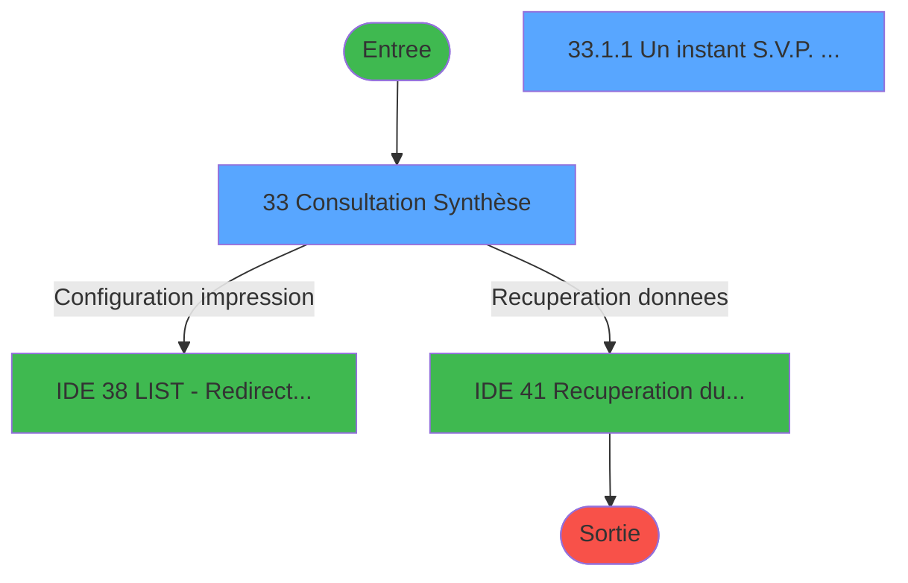
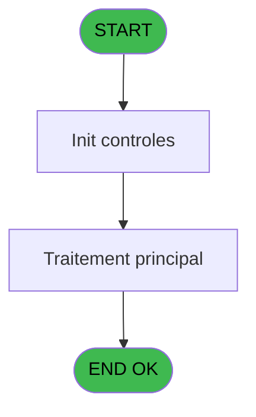
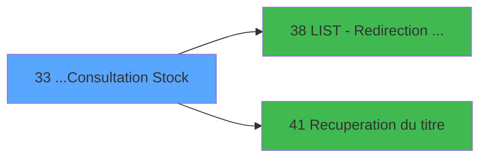

# PTR IDE 33 - ...Consultation Stock

> **Analyse**: Phases 1-4 2026-02-03 18:20 -> 18:20 (15s) | Assemblage 18:20
> **Pipeline**: V7.2 Enrichi
> **Structure**: 4 onglets (Resume | Ecrans | Donnees | Connexions)

<!-- TAB:Resume -->

## 1. FICHE D'IDENTITE

| Attribut | Valeur |
|----------|--------|
| Projet | PTR |
| IDE Position | 33 |
| Nom Programme | ...Consultation Stock |
| Fichier source | `Prg_33.xml` |
| Dossier IDE | Listes |
| Taches | 3 (2 ecrans visibles) |
| Tables modifiees | 0 |
| Programmes appeles | 2 |

## 2. DESCRIPTION FONCTIONNELLE

**...Consultation Stock** assure la gestion complete de ce processus, accessible depuis [Stock Prestation (IDE 32)](PTR-IDE-32.md).

Le flux de traitement s'organise en **1 blocs fonctionnels** :

- **Traitement** (3 taches) : traitements metier divers

**Logique metier** : 16 regles identifiees couvrant conditions metier, valeurs par defaut.

## 3. BLOCS FONCTIONNELS

### 3.1 Traitement (3 taches)

Traitements internes.

---

#### 33 - Consultation Synthèse [[ECRAN]](#ecran-t1)

**Role** : Consultation/chargement : Consultation Synthèse.
**Ecran** : 1266 x 297 DLU (MDI) | [Voir mockup](#ecran-t1)
**Delegue a** : [LIST - Redirection d'un Etat (IDE 38)](PTR-IDE-38.md), [Recuperation du titre (IDE 41)](PTR-IDE-41.md)

---

#### 33.1 - Impression [[ECRAN]](#ecran-t2)

**Role** : Generation du document : Impression.
**Ecran** : 160 x 32 DLU (MDI) | [Voir mockup](#ecran-t2)
**Variables liees** : J (W0 Impression)
**Delegue a** : [LIST - Redirection d'un Etat (IDE 38)](PTR-IDE-38.md), [Recuperation du titre (IDE 41)](PTR-IDE-41.md)

---

#### 33.1.1 - Un instant S.V.P. ... [[ECRAN]](#ecran-t3)

**Role** : Traitement : Un instant S.V.P. ....
**Ecran** : 426 x 56 DLU (MDI) | [Voir mockup](#ecran-t3)
**Delegue a** : [LIST - Redirection d'un Etat (IDE 38)](PTR-IDE-38.md), [Recuperation du titre (IDE 41)](PTR-IDE-41.md)

## 5. REGLES METIER

16 regles identifiees:

### Autres (16 regles)

#### [RM-001] Valeur par defaut si P0-Societe [A] est vide

| Element | Detail |
|---------|--------|
| **Condition** | `P0-Societe [A]=''` |
| **Si vrai** | 'C' |
| **Si faux** | P0-Societe [A]) |
| **Variables** | A (P0-Societe) |
| **Expression source** | Expression 11 : `IF (P0-Societe [A]='','C',P0-Societe [A])` |
| **Exemple** | Si P0-Societe [A]='' → 'C'. Sinon → P0-Societe [A]) |

#### [RM-002] Si W0 Impression [J]>0 alors 141 sinon 7)

| Element | Detail |
|---------|--------|
| **Condition** | `W0 Impression [J]>0` |
| **Si vrai** | 141 |
| **Si faux** | 7) |
| **Variables** | J (W0 Impression) |
| **Expression source** | Expression 13 : `IF (W0 Impression [J]>0,141,7)` |
| **Exemple** | Si W0 Impression [J]>0 → 141. Sinon → 7) |
| **Impact** | [33.1 - Impression](#t2) |

#### [RM-003] Si V_Titre [K]>0 alors 141 sinon 7)

| Element | Detail |
|---------|--------|
| **Condition** | `V_Titre [K]>0` |
| **Si vrai** | 141 |
| **Si faux** | 7) |
| **Variables** | K (V_Titre) |
| **Expression source** | Expression 14 : `IF (V_Titre [K]>0,141,7)` |
| **Exemple** | Si V_Titre [K]>0 → 141. Sinon → 7) |

#### [RM-004] Si [L]>0 alors 141 sinon 7)

| Element | Detail |
|---------|--------|
| **Condition** | `[L]>0` |
| **Si vrai** | 141 |
| **Si faux** | 7) |
| **Expression source** | Expression 15 : `IF ([L]>0,141,7)` |
| **Exemple** | Si [L]>0 → 141. Sinon → 7) |

#### [RM-005] Si [M]>0 alors 141 sinon 7)

| Element | Detail |
|---------|--------|
| **Condition** | `[M]>0` |
| **Si vrai** | 141 |
| **Si faux** | 7) |
| **Expression source** | Expression 16 : `IF ([M]>0,141,7)` |
| **Exemple** | Si [M]>0 → 141. Sinon → 7) |

#### [RM-006] Si [N]>0 alors 141 sinon 7)

| Element | Detail |
|---------|--------|
| **Condition** | `[N]>0` |
| **Si vrai** | 141 |
| **Si faux** | 7) |
| **Expression source** | Expression 17 : `IF ([N]>0,141,7)` |
| **Exemple** | Si [N]>0 → 141. Sinon → 7) |

#### [RM-007] Si [O]>0 alors 141 sinon 7)

| Element | Detail |
|---------|--------|
| **Condition** | `[O]>0` |
| **Si vrai** | 141 |
| **Si faux** | 7) |
| **Expression source** | Expression 18 : `IF ([O]>0,141,7)` |
| **Exemple** | Si [O]>0 → 141. Sinon → 7) |

#### [RM-008] Si [P]>0 alors 141 sinon 7)

| Element | Detail |
|---------|--------|
| **Condition** | `[P]>0` |
| **Si vrai** | 141 |
| **Si faux** | 7) |
| **Expression source** | Expression 19 : `IF ([P]>0,141,7)` |
| **Exemple** | Si [P]>0 → 141. Sinon → 7) |

#### [RM-009] Si [Q]>0 alors 141 sinon 7)

| Element | Detail |
|---------|--------|
| **Condition** | `[Q]>0` |
| **Si vrai** | 141 |
| **Si faux** | 7) |
| **Expression source** | Expression 20 : `IF ([Q]>0,141,7)` |
| **Exemple** | Si [Q]>0 → 141. Sinon → 7) |

#### [RM-010] Si [R]>0 alors 141 sinon 7)

| Element | Detail |
|---------|--------|
| **Condition** | `[R]>0` |
| **Si vrai** | 141 |
| **Si faux** | 7) |
| **Expression source** | Expression 21 : `IF ([R]>0,141,7)` |
| **Exemple** | Si [R]>0 → 141. Sinon → 7) |

#### [RM-011] Si [S]>0 alors 141 sinon 7)

| Element | Detail |
|---------|--------|
| **Condition** | `[S]>0` |
| **Si vrai** | 141 |
| **Si faux** | 7) |
| **Expression source** | Expression 22 : `IF ([S]>0,141,7)` |
| **Exemple** | Si [S]>0 → 141. Sinon → 7) |

#### [RM-012] Si [T]>0 alors 141 sinon 7)

| Element | Detail |
|---------|--------|
| **Condition** | `[T]>0` |
| **Si vrai** | 141 |
| **Si faux** | 7) |
| **Expression source** | Expression 23 : `IF ([T]>0,141,7)` |
| **Exemple** | Si [T]>0 → 141. Sinon → 7) |

#### [RM-013] Si [U]>0 alors 141 sinon 7)

| Element | Detail |
|---------|--------|
| **Condition** | `[U]>0` |
| **Si vrai** | 141 |
| **Si faux** | 7) |
| **Expression source** | Expression 24 : `IF ([U]>0,141,7)` |
| **Exemple** | Si [U]>0 → 141. Sinon → 7) |

#### [RM-014] Si [V]>0 alors 141 sinon 7)

| Element | Detail |
|---------|--------|
| **Condition** | `[V]>0` |
| **Si vrai** | 141 |
| **Si faux** | 7) |
| **Expression source** | Expression 25 : `IF ([V]>0,141,7)` |
| **Exemple** | Si [V]>0 → 141. Sinon → 7) |

#### [RM-015] Si [W]>0 alors 158 sinon 7)

| Element | Detail |
|---------|--------|
| **Condition** | `[W]>0` |
| **Si vrai** | 158 |
| **Si faux** | 7) |
| **Expression source** | Expression 26 : `IF ([W]>0,158,7)` |
| **Exemple** | Si [W]>0 → 158. Sinon → 7) |

#### [RM-016] Si [X]>0 alors 141 sinon 7)

| Element | Detail |
|---------|--------|
| **Condition** | `[X]>0` |
| **Si vrai** | 141 |
| **Si faux** | 7) |
| **Expression source** | Expression 27 : `IF ([X]>0,141,7)` |
| **Exemple** | Si [X]>0 → 141. Sinon → 7) |

## 6. CONTEXTE

- **Appele par**: [Stock Prestation (IDE 32)](PTR-IDE-32.md)
- **Appelle**: 2 programmes | **Tables**: 1 (W:0 R:1 L:0) | **Taches**: 3 | **Expressions**: 43

<!-- TAB:Ecrans -->

## 8. ECRANS

### 8.1 Forms visibles (2 / 3)

| # | Position | Tache | Nom | Type | Largeur | Hauteur | Bloc |
|---|----------|-------|-----|------|---------|---------|------|
| 1 | 33 | 33 | Consultation Synthèse | MDI | 1266 | 297 | Traitement |
| 2 | 33.1.1 | 33.1.1 | Un instant S.V.P. ... | MDI | 426 | 56 | Traitement |

### 8.2 Mockups Ecrans

---

#### 33 - Consultation Synthèse
**Tache** : [33](#t1) | **Type** : MDI | **Dimensions** : 1266 x 297 DLU
**Bloc** : Traitement | **Titre IDE** : Consultation Synthèse

<!-- FORM-DATA:
{
    "width":  1266,
    "vFactor":  8,
    "type":  "MDI",
    "hFactor":  8,
    "controls":  [
                     {
                         "x":  0,
                         "type":  "label",
                         "var":  "",
                         "y":  0,
                         "w":  1260,
                         "fmt":  "",
                         "name":  "",
                         "h":  20,
                         "color":  "",
                         "text":  "",
                         "parent":  null
                     },
                     {
                         "x":  0,
                         "type":  "table",
                         "var":  "",
                         "name":  "",
                         "titleH":  13,
                         "color":  "110",
                         "w":  1266,
                         "y":  37,
                         "fmt":  "",
                         "parent":  null,
                         "text":  "",
                         "rowH":  14,
                         "h":  210,
                         "cols":  [
                                      {
                                          "title":  "Nationalités",
                                          "layer":  1,
                                          "w":  139
                                      },
                                      {
                                          "title":  "MM/YY",
                                          "layer":  2,
                                          "w":  70
                                      },
                                      {
                                          "title":  "MM/YY",
                                          "layer":  3,
                                          "w":  66
                                      },
                                      {
                                          "title":  "MM/YY",
                                          "layer":  4,
                                          "w":  68
                                      },
                                      {
                                          "title":  "MM/YY",
                                          "layer":  5,
                                          "w":  65
                                      },
                                      {
                                          "title":  "MM/YY",
                                          "layer":  6,
                                          "w":  65
                                      },
                                      {
                                          "title":  "MM/YY",
                                          "layer":  7,
                                          "w":  67
                                      },
                                      {
                                          "title":  "MM/YY",
                                          "layer":  8,
                                          "w":  66
                                      },
                                      {
                                          "title":  "MM/YY",
                                          "layer":  9,
                                          "w":  67
                                      },
                                      {
                                          "title":  "MM/YY",
                                          "layer":  10,
                                          "w":  67
                                      },
                                      {
                                          "title":  "MM/YY",
                                          "layer":  11,
                                          "w":  66
                                      },
                                      {
                                          "title":  "MM/YY",
                                          "layer":  12,
                                          "w":  66
                                      },
                                      {
                                          "title":  "MM/YY",
                                          "layer":  13,
                                          "w":  67
                                      },
                                      {
                                          "title":  "MM/YY",
                                          "layer":  14,
                                          "w":  67
                                      },
                                      {
                                          "title":  "MM/YY",
                                          "layer":  15,
                                          "w":  68
                                      },
                                      {
                                          "title":  "MM/YY",
                                          "layer":  16,
                                          "w":  79
                                      },
                                      {
                                          "title":  "Total",
                                          "layer":  17,
                                          "w":  79
                                      }
                                  ],
                         "rows":  17
                     },
                     {
                         "x":  0,
                         "type":  "label",
                         "var":  "",
                         "y":  250,
                         "w":  1257,
                         "fmt":  "",
                         "name":  "",
                         "h":  13,
                         "color":  "7",
                         "text":  "",
                         "parent":  null
                     },
                     {
                         "x":  0,
                         "type":  "label",
                         "var":  "",
                         "y":  270,
                         "w":  1261,
                         "fmt":  "",
                         "name":  "",
                         "h":  24,
                         "color":  "",
                         "text":  "",
                         "parent":  null
                     },
                     {
                         "x":  155,
                         "type":  "edit",
                         "var":  "",
                         "y":  54,
                         "w":  53,
                         "fmt":  "4Z",
                         "name":  "SYN Jour 1",
                         "h":  8,
                         "color":  "110",
                         "text":  "",
                         "parent":  5
                     },
                     {
                         "x":  218,
                         "type":  "edit",
                         "var":  "",
                         "y":  54,
                         "w":  53,
                         "fmt":  "4Z",
                         "name":  "",
                         "h":  8,
                         "color":  "110",
                         "text":  "",
                         "parent":  5
                     },
                     {
                         "x":  283,
                         "type":  "edit",
                         "var":  "",
                         "y":  54,
                         "w":  53,
                         "fmt":  "4Z",
                         "name":  "",
                         "h":  8,
                         "color":  "110",
                         "text":  "",
                         "parent":  5
                     },
                     {
                         "x":  349,
                         "type":  "edit",
                         "var":  "",
                         "y":  54,
                         "w":  53,
                         "fmt":  "4Z",
                         "name":  "",
                         "h":  8,
                         "color":  "110",
                         "text":  "",
                         "parent":  5
                     },
                     {
                         "x":  416,
                         "type":  "edit",
                         "var":  "",
                         "y":  54,
                         "w":  53,
                         "fmt":  "4Z",
                         "name":  "",
                         "h":  8,
                         "color":  "110",
                         "text":  "",
                         "parent":  5
                     },
                     {
                         "x":  485,
                         "type":  "edit",
                         "var":  "",
                         "y":  54,
                         "w":  53,
                         "fmt":  "4Z",
                         "name":  "",
                         "h":  8,
                         "color":  "110",
                         "text":  "",
                         "parent":  5
                     },
                     {
                         "x":  550,
                         "type":  "edit",
                         "var":  "",
                         "y":  54,
                         "w":  53,
                         "fmt":  "4Z",
                         "name":  "",
                         "h":  8,
                         "color":  "110",
                         "text":  "",
                         "parent":  5
                     },
                     {
                         "x":  616,
                         "type":  "edit",
                         "var":  "",
                         "y":  54,
                         "w":  53,
                         "fmt":  "4Z",
                         "name":  "",
                         "h":  8,
                         "color":  "110",
                         "text":  "",
                         "parent":  5
                     },
                     {
                         "x":  682,
                         "type":  "edit",
                         "var":  "",
                         "y":  54,
                         "w":  53,
                         "fmt":  "4Z",
                         "name":  "",
                         "h":  8,
                         "color":  "110",
                         "text":  "",
                         "parent":  5
                     },
                     {
                         "x":  749,
                         "type":  "edit",
                         "var":  "",
                         "y":  54,
                         "w":  53,
                         "fmt":  "4Z",
                         "name":  "",
                         "h":  8,
                         "color":  "110",
                         "text":  "",
                         "parent":  5
                     },
                     {
                         "x":  816,
                         "type":  "edit",
                         "var":  "",
                         "y":  54,
                         "w":  53,
                         "fmt":  "4Z",
                         "name":  "",
                         "h":  8,
                         "color":  "110",
                         "text":  "",
                         "parent":  5
                     },
                     {
                         "x":  880,
                         "type":  "edit",
                         "var":  "",
                         "y":  54,
                         "w":  53,
                         "fmt":  "4Z",
                         "name":  "",
                         "h":  8,
                         "color":  "110",
                         "text":  "",
                         "parent":  5
                     },
                     {
                         "x":  950,
                         "type":  "edit",
                         "var":  "",
                         "y":  54,
                         "w":  53,
                         "fmt":  "4Z",
                         "name":  "",
                         "h":  8,
                         "color":  "110",
                         "text":  "",
                         "parent":  5
                     },
                     {
                         "x":  1018,
                         "type":  "edit",
                         "var":  "",
                         "y":  54,
                         "w":  53,
                         "fmt":  "4Z",
                         "name":  "",
                         "h":  8,
                         "color":  "110",
                         "text":  "",
                         "parent":  5
                     },
                     {
                         "x":  1088,
                         "type":  "edit",
                         "var":  "",
                         "y":  54,
                         "w":  53,
                         "fmt":  "4Z",
                         "name":  "",
                         "h":  8,
                         "color":  "110",
                         "text":  "",
                         "parent":  5
                     },
                     {
                         "x":  1158,
                         "type":  "edit",
                         "var":  "",
                         "y":  52,
                         "w":  70,
                         "fmt":  "",
                         "name":  "SYN Quinzaine",
                         "h":  10,
                         "color":  "110",
                         "text":  "",
                         "parent":  5
                     },
                     {
                         "x":  155,
                         "type":  "edit",
                         "var":  "",
                         "y":  251,
                         "w":  53,
                         "fmt":  "",
                         "name":  "",
                         "h":  10,
                         "color":  "",
                         "text":  "",
                         "parent":  40
                     },
                     {
                         "x":  221,
                         "type":  "edit",
                         "var":  "",
                         "y":  251,
                         "w":  53,
                         "fmt":  "",
                         "name":  "",
                         "h":  10,
                         "color":  "",
                         "text":  "",
                         "parent":  40
                     },
                     {
                         "x":  286,
                         "type":  "edit",
                         "var":  "",
                         "y":  251,
                         "w":  53,
                         "fmt":  "",
                         "name":  "",
                         "h":  10,
                         "color":  "",
                         "text":  "",
                         "parent":  null
                     },
                     {
                         "x":  347,
                         "type":  "edit",
                         "var":  "",
                         "y":  251,
                         "w":  53,
                         "fmt":  "",
                         "name":  "",
                         "h":  10,
                         "color":  "",
                         "text":  "",
                         "parent":  40
                     },
                     {
                         "x":  415,
                         "type":  "edit",
                         "var":  "",
                         "y":  251,
                         "w":  53,
                         "fmt":  "",
                         "name":  "",
                         "h":  10,
                         "color":  "",
                         "text":  "",
                         "parent":  null
                     },
                     {
                         "x":  482,
                         "type":  "edit",
                         "var":  "",
                         "y":  251,
                         "w":  53,
                         "fmt":  "",
                         "name":  "",
                         "h":  10,
                         "color":  "",
                         "text":  "",
                         "parent":  40
                     },
                     {
                         "x":  548,
                         "type":  "edit",
                         "var":  "",
                         "y":  251,
                         "w":  53,
                         "fmt":  "",
                         "name":  "",
                         "h":  10,
                         "color":  "",
                         "text":  "",
                         "parent":  null
                     },
                     {
                         "x":  615,
                         "type":  "edit",
                         "var":  "",
                         "y":  251,
                         "w":  53,
                         "fmt":  "",
                         "name":  "",
                         "h":  10,
                         "color":  "",
                         "text":  "",
                         "parent":  null
                     },
                     {
                         "x":  680,
                         "type":  "edit",
                         "var":  "",
                         "y":  251,
                         "w":  53,
                         "fmt":  "",
                         "name":  "",
                         "h":  10,
                         "color":  "",
                         "text":  "",
                         "parent":  null
                     },
                     {
                         "x":  745,
                         "type":  "edit",
                         "var":  "",
                         "y":  251,
                         "w":  53,
                         "fmt":  "",
                         "name":  "",
                         "h":  10,
                         "color":  "",
                         "text":  "",
                         "parent":  40
                     },
                     {
                         "x":  814,
                         "type":  "edit",
                         "var":  "",
                         "y":  251,
                         "w":  53,
                         "fmt":  "",
                         "name":  "",
                         "h":  10,
                         "color":  "",
                         "text":  "",
                         "parent":  null
                     },
                     {
                         "x":  878,
                         "type":  "edit",
                         "var":  "",
                         "y":  251,
                         "w":  53,
                         "fmt":  "",
                         "name":  "",
                         "h":  10,
                         "color":  "",
                         "text":  "",
                         "parent":  null
                     },
                     {
                         "x":  948,
                         "type":  "edit",
                         "var":  "",
                         "y":  251,
                         "w":  53,
                         "fmt":  "",
                         "name":  "",
                         "h":  10,
                         "color":  "",
                         "text":  "",
                         "parent":  40
                     },
                     {
                         "x":  1016,
                         "type":  "edit",
                         "var":  "",
                         "y":  251,
                         "w":  53,
                         "fmt":  "",
                         "name":  "",
                         "h":  10,
                         "color":  "",
                         "text":  "",
                         "parent":  40
                     },
                     {
                         "x":  1087,
                         "type":  "edit",
                         "var":  "",
                         "y":  251,
                         "w":  53,
                         "fmt":  "",
                         "name":  "",
                         "h":  10,
                         "color":  "",
                         "text":  "",
                         "parent":  null
                     },
                     {
                         "x":  1157,
                         "type":  "edit",
                         "var":  "",
                         "y":  251,
                         "w":  70,
                         "fmt":  "",
                         "name":  "SYN Quinzaine_001",
                         "h":  10,
                         "color":  "",
                         "text":  "",
                         "parent":  40
                     },
                     {
                         "x":  6,
                         "type":  "edit",
                         "var":  "",
                         "y":  6,
                         "w":  396,
                         "fmt":  "30",
                         "name":  "",
                         "h":  8,
                         "color":  "",
                         "text":  "",
                         "parent":  1
                     },
                     {
                         "x":  978,
                         "type":  "edit",
                         "var":  "",
                         "y":  6,
                         "w":  268,
                         "fmt":  "WWW DD MMM YYYYT",
                         "name":  "",
                         "h":  8,
                         "color":  "",
                         "text":  "",
                         "parent":  1
                     },
                     {
                         "x":  0,
                         "type":  "edit",
                         "var":  "",
                         "y":  23,
                         "w":  1255,
                         "fmt":  "80",
                         "name":  "",
                         "h":  10,
                         "color":  "7",
                         "text":  "",
                         "parent":  null
                     },
                     {
                         "x":  13,
                         "type":  "edit",
                         "var":  "",
                         "y":  54,
                         "w":  117,
                         "fmt":  "14",
                         "name":  "",
                         "h":  8,
                         "color":  "146",
                         "text":  "",
                         "parent":  5
                     },
                     {
                         "x":  8,
                         "type":  "edit",
                         "var":  "",
                         "y":  251,
                         "w":  129,
                         "fmt":  "14",
                         "name":  "",
                         "h":  10,
                         "color":  "",
                         "text":  "",
                         "parent":  40
                     },
                     {
                         "x":  9,
                         "type":  "button",
                         "var":  "",
                         "y":  273,
                         "w":  154,
                         "fmt":  "\u0026Quitter",
                         "name":  "",
                         "h":  18,
                         "color":  "",
                         "text":  "",
                         "parent":  58
                     },
                     {
                         "x":  1096,
                         "type":  "button",
                         "var":  "",
                         "y":  273,
                         "w":  154,
                         "fmt":  "\u0026Impression",
                         "name":  "",
                         "h":  18,
                         "color":  "",
                         "text":  "",
                         "parent":  58
                     }
                 ],
    "taskId":  "33",
    "height":  297
}
-->

<strong>Champs : 37 champs</strong>

| Pos (x,y) | Nom | Variable | Type |
|-----------|-----|----------|------|
| 155,54 | SYN Jour 1 | - | edit |
| 218,54 | 4Z | - | edit |
| 283,54 | 4Z | - | edit |
| 349,54 | 4Z | - | edit |
| 416,54 | 4Z | - | edit |
| 485,54 | 4Z | - | edit |
| 550,54 | 4Z | - | edit |
| 616,54 | 4Z | - | edit |
| 682,54 | 4Z | - | edit |
| 749,54 | 4Z | - | edit |
| 816,54 | 4Z | - | edit |
| 880,54 | 4Z | - | edit |
| 950,54 | 4Z | - | edit |
| 1018,54 | 4Z | - | edit |
| 1088,54 | 4Z | - | edit |
| 1158,52 | SYN Quinzaine | - | edit |
| 155,251 | (sans nom) | - | edit |
| 221,251 | (sans nom) | - | edit |
| 286,251 | (sans nom) | - | edit |
| 347,251 | (sans nom) | - | edit |
| 415,251 | (sans nom) | - | edit |
| 482,251 | (sans nom) | - | edit |
| 548,251 | (sans nom) | - | edit |
| 615,251 | (sans nom) | - | edit |
| 680,251 | (sans nom) | - | edit |
| 745,251 | (sans nom) | - | edit |
| 814,251 | (sans nom) | - | edit |
| 878,251 | (sans nom) | - | edit |
| 948,251 | (sans nom) | - | edit |
| 1016,251 | (sans nom) | - | edit |
| 1087,251 | (sans nom) | - | edit |
| 1157,251 | SYN Quinzaine_001 | - | edit |
| 6,6 | 30 | - | edit |
| 978,6 | WWW DD MMM YYYYT | - | edit |
| 0,23 | 80 | - | edit |
| 13,54 | 14 | - | edit |
| 8,251 | 14 | - | edit |

<strong>Boutons : 2 boutons</strong>

| Bouton | Pos (x,y) | Action |
|--------|-----------|--------|
| Quitter | 9,273 | Quitte le programme |
| Impression | 1096,273 | Bouton fonctionnel |

---

#### 33.1.1 - Un instant S.V.P. ...
**Tache** : [33.1.1](#t3) | **Type** : MDI | **Dimensions** : 426 x 56 DLU
**Bloc** : Traitement | **Titre IDE** : Un instant S.V.P. ...

<!-- FORM-DATA:
{
    "width":  426,
    "vFactor":  8,
    "type":  "MDI",
    "hFactor":  8,
    "controls":  [
                     {
                         "x":  12,
                         "type":  "label",
                         "var":  "",
                         "y":  4,
                         "w":  400,
                         "fmt":  "",
                         "name":  "",
                         "h":  48,
                         "color":  "",
                         "text":  "",
                         "parent":  null
                     },
                     {
                         "x":  161,
                         "type":  "label",
                         "var":  "",
                         "y":  18,
                         "w":  221,
                         "fmt":  "",
                         "name":  "",
                         "h":  8,
                         "color":  "7",
                         "text":  "Impression en cours ...",
                         "parent":  1
                     },
                     {
                         "x":  226,
                         "type":  "edit",
                         "var":  "",
                         "y":  29,
                         "w":  37,
                         "fmt":  "",
                         "name":  "",
                         "h":  15,
                         "color":  "",
                         "text":  "",
                         "parent":  1
                     },
                     {
                         "x":  22,
                         "type":  "image",
                         "var":  "",
                         "y":  8,
                         "w":  106,
                         "fmt":  "",
                         "name":  "",
                         "h":  40,
                         "color":  "",
                         "text":  "",
                         "parent":  null
                     }
                 ],
    "taskId":  "33.1.1",
    "height":  56
}
-->

<strong>Champs : 1 champs</strong>

| Pos (x,y) | Nom | Variable | Type |
|-----------|-----|----------|------|
| 226,29 | (sans nom) | - | edit |

## 9. NAVIGATION

### 9.1 Enchainement des ecrans

**Detail par enchainement :**

| Depuis | Action | Vers | Retour |
|--------|--------|------|--------|
| Consultation Synthèse | Configuration impression | [LIST - Redirection d'un Etat (IDE 38)](PTR-IDE-38.md) | Retour ecran |
| Consultation Synthèse | Recuperation donnees | [Recuperation du titre (IDE 41)](PTR-IDE-41.md) | Retour ecran |

### 9.3 Structure hierarchique (3 taches)

| Position | Tache | Type | Dimensions | Bloc |
|----------|-------|------|------------|------|
| **33.1** | [**Consultation Synthèse** (33)](#t1) [mockup](#ecran-t1) | MDI | 1266x297 | Traitement |
| 33.1.1 | [Impression (33.1)](#t2) [mockup](#ecran-t2) | MDI | 160x32 | |
| 33.1.2 | [Un instant S.V.P. ... (33.1.1)](#t3) [mockup](#ecran-t3) | MDI | 426x56 | |

### 9.4 Algorigramme

> **Legende**: Vert = START/END OK | Rouge = END KO | Bleu = Decisions
> *Algorigramme auto-genere. Utiliser `/algorigramme` pour une synthese metier detaillee.*

<!-- TAB:Donnees -->

## 10. TABLES

### Tables utilisees (1)

| ID | Nom | Description | Type | R | W | L | Usages |
|----|-----|-------------|------|---|---|---|--------|
| 658 | tempo_trafic | Table temporaire ecran | DB | R |   |   | 2 |

### Colonnes par table (1 / 1 tables avec colonnes identifiees)

Table 658 - tempo_trafic (R) - 2 usages

| Lettre | Variable | Acces | Type |
|--------|----------|-------|------|
| A | P0-Societe | R | Alpha |
| B | P0-Village | R | Alpha |
| C | P0-Date | R | Date |
| D | P0 Code Prestation | R | Alpha |
| E | P0 Libelle | R | Alpha |
| F | RC_LNK_1 | R | Logical |
| G | W0 Reset Printer | R | Alpha |
| H | W0 Formatage | R | Alpha |
| I | W0 10/17 | R | Alpha |
| J | W0 Impression | R | Alpha |
| K | V_Titre | R | Alpha |

## 11. VARIABLES

### 11.1 Parametres entrants (2)

Variables recues du programme appelant ([Stock Prestation (IDE 32)](PTR-IDE-32.md)).

| Lettre | Nom | Type | Usage dans |
|--------|-----|------|-----------|
| D | P0 Code Prestation | Alpha | 1x parametre entrant |
| E | P0 Libelle | Alpha | 1x parametre entrant |

### 11.2 Variables de travail (4)

Variables internes au programme.

| Lettre | Nom | Type | Usage dans |
|--------|-----|------|-----------|
| G | W0 Reset Printer | Alpha | - |
| H | W0 Formatage | Alpha | 1x calcul interne |
| I | W0 10/17 | Alpha | 16x calcul interne |
| J | W0 Impression | Alpha | [33.1](#t2) |

### 11.3 Autres (5)

Variables diverses.

| Lettre | Nom | Type | Usage dans |
|--------|-----|------|-----------|
| A | P0-Societe | Alpha | 2x refs |
| B | P0-Village | Alpha | - |
| C | P0-Date | Date | - |
| F | RC_LNK_1 | Logical | - |
| K | V_Titre | Alpha | 1x refs |

## 12. EXPRESSIONS

**43 / 43 expressions decodees (100%)**

### 12.1 Repartition par type

| Type | Expressions | Regles |
|------|-------------|--------|
| CONDITION | 16 | 16 |
| CONSTANTE | 3 | 0 |
| CONCATENATION | 1 | 0 |
| DATE | 1 | 0 |
| FORMAT | 15 | 0 |
| OTHER | 4 | 0 |
| REFERENCE_VG | 2 | 0 |
| STRING | 1 | 0 |

### 12.2 Expressions cles par type

#### CONDITION (16 expressions)

| Type | IDE | Expression | Regle |
|------|-----|------------|-------|
| CONDITION | 22 | `IF ([S]>0,141,7)` | [RM-011](#rm-RM-011) |
| CONDITION | 23 | `IF ([T]>0,141,7)` | [RM-012](#rm-RM-012) |
| CONDITION | 20 | `IF ([Q]>0,141,7)` | [RM-009](#rm-RM-009) |
| CONDITION | 21 | `IF ([R]>0,141,7)` | [RM-010](#rm-RM-010) |
| CONDITION | 26 | `IF ([W]>0,158,7)` | [RM-015](#rm-RM-015) |
| ... | | *+11 autres* | |

#### CONSTANTE (3 expressions)

| Type | IDE | Expression | Regle |
|------|-----|------------|-------|
| CONSTANTE | 6 | `'P*'` | - |
| CONSTANTE | 5 | `'A*'` | - |
| CONSTANTE | 2 | `22` | - |

#### CONCATENATION (1 expressions)

| Type | IDE | Expression | Regle |
|------|-----|------------|-------|
| CONCATENATION | 7 | `MlsTrans ('Stock prestation')&' '&Trim (P0 Code Prestation [D])&' '&Trim (P0 Libelle [E])&' '&MlsTrans ('du')&' '&Trim (DStr (W0 10/17 [I],'DD/MM/YYYYZ'))&' '&MlsTrans ('au')&' '&Trim (DStr (W0 10/17 [I]+14,'DD/MM/YYYYZ'))` | - |

#### DATE (1 expressions)

| Type | IDE | Expression | Regle |
|------|-----|------------|-------|
| DATE | 8 | `Date ()` | - |

#### FORMAT (15 expressions)

| Type | IDE | Expression | Regle |
|------|-----|------------|-------|
| FORMAT | 38 | `DStr(W0 10/17 [I]+10,'YY/MM')` | - |
| FORMAT | 37 | `DStr(W0 10/17 [I]+9,'YY/MM')` | - |
| FORMAT | 36 | `DStr(W0 10/17 [I]+8,'YY/MM')` | - |
| FORMAT | 39 | `DStr(W0 10/17 [I]+11,'YY/MM')` | - |
| FORMAT | 42 | `DStr(W0 10/17 [I]+14,'YY/MM')` | - |
| ... | | *+10 autres* | |

#### OTHER (4 expressions)

| Type | IDE | Expression | Regle |
|------|-----|------------|-------|
| OTHER | 10 | `P0-Societe [A]` | - |
| OTHER | 43 | `NOT([AY])` | - |
| OTHER | 3 | `Right ([AB],14)` | - |
| OTHER | 4 | `Right (W0 Formatage [H],14)` | - |

#### REFERENCE_VG (2 expressions)

| Type | IDE | Expression | Regle |
|------|-----|------------|-------|
| REFERENCE_VG | 12 | `VG2` | - |
| REFERENCE_VG | 9 | `VG2` | - |

#### STRING (1 expressions)

| Type | IDE | Expression | Regle |
|------|-----|------------|-------|
| STRING | 1 | `Trim ([AX])` | - |

### 12.3 Toutes les expressions (43)

Voir les 43 expressions

#### CONDITION (16)

| IDE | Expression Decodee |
|-----|-------------------|
| 11 | `IF (P0-Societe [A]='','C',P0-Societe [A])` |
| 13 | `IF (W0 Impression [J]>0,141,7)` |
| 14 | `IF (V_Titre [K]>0,141,7)` |
| 15 | `IF ([L]>0,141,7)` |
| 16 | `IF ([M]>0,141,7)` |
| 17 | `IF ([N]>0,141,7)` |
| 18 | `IF ([O]>0,141,7)` |
| 19 | `IF ([P]>0,141,7)` |
| 20 | `IF ([Q]>0,141,7)` |
| 21 | `IF ([R]>0,141,7)` |
| 22 | `IF ([S]>0,141,7)` |
| 23 | `IF ([T]>0,141,7)` |
| 24 | `IF ([U]>0,141,7)` |
| 25 | `IF ([V]>0,141,7)` |
| 26 | `IF ([W]>0,158,7)` |
| 27 | `IF ([X]>0,141,7)` |

#### CONSTANTE (3)

| IDE | Expression Decodee |
|-----|-------------------|
| 2 | `22` |
| 5 | `'A*'` |
| 6 | `'P*'` |

#### CONCATENATION (1)

| IDE | Expression Decodee |
|-----|-------------------|
| 7 | `MlsTrans ('Stock prestation')&' '&Trim (P0 Code Prestation [D])&' '&Trim (P0 Libelle [E])&' '&MlsTrans ('du')&' '&Trim (DStr (W0 10/17 [I],'DD/MM/YYYYZ'))&' '&MlsTrans ('au')&' '&Trim (DStr (W0 10/17 [I]+14,'DD/MM/YYYYZ'))` |

#### DATE (1)

| IDE | Expression Decodee |
|-----|-------------------|
| 8 | `Date ()` |

#### FORMAT (15)

| IDE | Expression Decodee |
|-----|-------------------|
| 28 | `DStr(W0 10/17 [I],'YY/MM')` |
| 29 | `DStr(W0 10/17 [I]+1,'YY/MM')` |
| 30 | `DStr(W0 10/17 [I]+2,'YY/MM')` |
| 31 | `DStr(W0 10/17 [I]+3,'YY/MM')` |
| 32 | `DStr(W0 10/17 [I]+4,'YY/MM')` |
| 33 | `DStr(W0 10/17 [I]+5,'YY/MM')` |
| 34 | `DStr(W0 10/17 [I]+6,'YY/MM')` |
| 35 | `DStr(W0 10/17 [I]+7,'YY/MM')` |
| 36 | `DStr(W0 10/17 [I]+8,'YY/MM')` |
| 37 | `DStr(W0 10/17 [I]+9,'YY/MM')` |
| 38 | `DStr(W0 10/17 [I]+10,'YY/MM')` |
| 39 | `DStr(W0 10/17 [I]+11,'YY/MM')` |
| 40 | `DStr(W0 10/17 [I]+12,'YY/MM')` |
| 41 | `DStr(W0 10/17 [I]+13,'YY/MM')` |
| 42 | `DStr(W0 10/17 [I]+14,'YY/MM')` |

#### OTHER (4)

| IDE | Expression Decodee |
|-----|-------------------|
| 3 | `Right ([AB],14)` |
| 4 | `Right (W0 Formatage [H],14)` |
| 10 | `P0-Societe [A]` |
| 43 | `NOT([AY])` |

#### REFERENCE_VG (2)

| IDE | Expression Decodee |
|-----|-------------------|
| 9 | `VG2` |
| 12 | `VG2` |

#### STRING (1)

| IDE | Expression Decodee |
|-----|-------------------|
| 1 | `Trim ([AX])` |

<!-- TAB:Connexions -->

## 13. GRAPHE D'APPELS

### 13.1 Chaine depuis Main (Callers)

Main -> ... -> [Stock Prestation (IDE 32)](PTR-IDE-32.md) -> **...Consultation Stock (IDE 33)**

### 13.2 Callers

| IDE | Nom Programme | Nb Appels |
|-----|---------------|-----------|
| [32](PTR-IDE-32.md) | Stock Prestation | 1 |

### 13.3 Callees (programmes appeles)

### 13.4 Detail Callees avec contexte

| IDE | Nom Programme | Appels | Contexte |
|-----|---------------|--------|----------|
| [38](PTR-IDE-38.md) | LIST - Redirection d'un Etat | 1 | Configuration impression |
| [41](PTR-IDE-41.md) | Recuperation du titre | 1 | Recuperation donnees |

## 14. RECOMMANDATIONS MIGRATION

### 14.1 Profil du programme

| Metrique | Valeur | Impact migration |
|----------|--------|-----------------|
| Lignes de logique | 106 | Programme compact |
| Expressions | 43 | Peu de logique |
| Tables WRITE | 0 | Impact faible |
| Sous-programmes | 2 | Peu de dependances |
| Ecrans visibles | 2 | Quelques ecrans |
| Code desactive | 0% (0 / 106) | Code sain |
| Regles metier | 16 | Logique metier riche |

### 14.2 Plan de migration par bloc

#### Traitement (3 taches: 3 ecrans, 0 traitement)

- **Strategie** : 3 composant(s) UI (Razor/React) avec formulaires et validation.
- 2 sous-programme(s) a migrer ou a reutiliser depuis les services existants.
- Decomposer les taches en services unitaires testables.

### 14.3 Dependances critiques

| Dependance | Type | Appels | Impact |
|------------|------|--------|--------|
| [Recuperation du titre (IDE 41)](PTR-IDE-41.md) | Sous-programme | 1x | Normale - Recuperation donnees |
| [LIST - Redirection d'un Etat (IDE 38)](PTR-IDE-38.md) | Sous-programme | 1x | Normale - Configuration impression |

---
*Spec DETAILED generee par Pipeline V7.2 - 2026-02-03 18:20*
