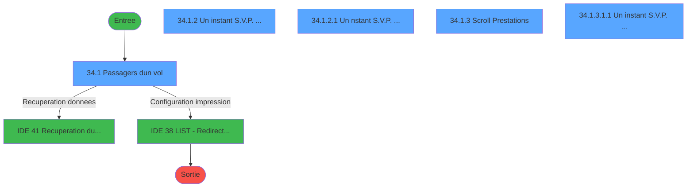
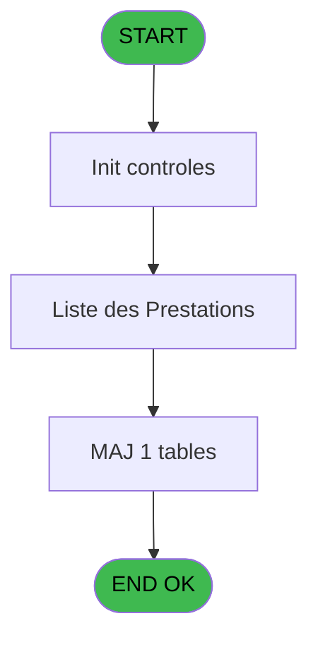

# PTR IDE 34 - Liste des Passagers

> **Analyse**: Phases 1-4 2026-02-03 18:20 -> 18:20 (17s) | Assemblage 18:20
> **Pipeline**: V7.2 Enrichi
> **Structure**: 4 onglets (Resume | Ecrans | Donnees | Connexions)

<!-- TAB:Resume -->

## 1. FICHE D'IDENTITE

| Attribut | Valeur |
|----------|--------|
| Projet | PTR |
| IDE Position | 34 |
| Nom Programme | Liste des Passagers |
| Fichier source | `Prg_34.xml` |
| Dossier IDE | Listes |
| Taches | 9 (5 ecrans visibles) |
| Tables modifiees | 1 |
| Programmes appeles | 2 |
| :warning: Statut | **ORPHELIN_POTENTIEL** |

## 2. DESCRIPTION FONCTIONNELLE

**Liste des Passagers** assure la gestion complete de ce processus.

Le flux de traitement s'organise en **3 blocs fonctionnels** :

- **Traitement** (7 taches) : traitements metier divers
- **Impression** (1 tache) : generation de tickets et documents
- **Consultation** (1 tache) : ecrans de recherche, selection et consultation

**Donnees modifiees** : 1 tables en ecriture (comptes_produit_reference).

**Logique metier** : 1 regles identifiees couvrant conditions metier.

Detail : phases du traitement

#### Phase 1 : Traitement (7 taches)

- **34** - (sans nom)
- **34.1** - Passagers d'un vol **[[ECRAN]](#ecran-t2)**
- **34.1.2** - Un instant S.V.P. ... **[[ECRAN]](#ecran-t4)**
- **34.1.2.1** - Un nstant S.V.P. ... **[[ECRAN]](#ecran-t5)**
- **34.1.2.2** - Honey moon
- **34.1.3** - Scroll Prestations **[[ECRAN]](#ecran-t7)**
- **34.1.3.1.1** - Un instant S.V.P. ... **[[ECRAN]](#ecran-t9)**

Delegue a : [Recuperation du titre (IDE 41)](PTR-IDE-41.md), [LIST - Redirection d'un Etat (IDE 38)](PTR-IDE-38.md)

#### Phase 2 : Consultation (1 tache)

- **34.1.1** - Choix date **[[ECRAN]](#ecran-t3)**

Delegue a : [Recuperation du titre (IDE 41)](PTR-IDE-41.md)

#### Phase 3 : Impression (1 tache)

- **34.1.3.1** - Edition **[[ECRAN]](#ecran-t8)**

Delegue a : [LIST - Redirection d'un Etat (IDE 38)](PTR-IDE-38.md)

#### Tables impactees

| Table | Operations | Role metier |
|-------|-----------|-------------|
| comptes_produit_reference | R/**W**/L (5 usages) | Comptes GM (generaux) |

## 3. BLOCS FONCTIONNELS

### 3.1 Traitement (7 taches)

Traitements internes.

---

#### 34 - (sans nom)

**Role** : Tache d'orchestration : point d'entree du programme (7 sous-taches). Coordonne l'enchainement des traitements.

6 sous-taches directes

| Tache | Nom | Bloc |
|-------|-----|------|
| [34.1](#t2) | Passagers d'un vol **[[ECRAN]](#ecran-t2)** | Traitement |
| [34.1.2](#t4) | Un instant S.V.P. ... **[[ECRAN]](#ecran-t4)** | Traitement |
| [34.1.2.1](#t5) | Un nstant S.V.P. ... **[[ECRAN]](#ecran-t5)** | Traitement |
| [34.1.2.2](#t6) | Honey moon | Traitement |
| [34.1.3](#t7) | Scroll Prestations **[[ECRAN]](#ecran-t7)** | Traitement |
| [34.1.3.1.1](#t9) | Un instant S.V.P. ... **[[ECRAN]](#ecran-t9)** | Traitement |

**Delegue a** : [Recuperation du titre (IDE 41)](PTR-IDE-41.md), [LIST - Redirection d'un Etat (IDE 38)](PTR-IDE-38.md)

---

#### 34.1 - Passagers d'un vol [[ECRAN]](#ecran-t2)

**Role** : Selection par l'operateur : Passagers d'un vol.
**Ecran** : 571 x 159 DLU (MDI) | [Voir mockup](#ecran-t2)
**Delegue a** : [Recuperation du titre (IDE 41)](PTR-IDE-41.md), [LIST - Redirection d'un Etat (IDE 38)](PTR-IDE-38.md)

---

#### 34.1.2 - Un instant S.V.P. ... [[ECRAN]](#ecran-t4)

**Role** : Traitement : Un instant S.V.P. ....
**Ecran** : 426 x 57 DLU (MDI) | [Voir mockup](#ecran-t4)
**Delegue a** : [Recuperation du titre (IDE 41)](PTR-IDE-41.md), [LIST - Redirection d'un Etat (IDE 38)](PTR-IDE-38.md)

---

#### 34.1.2.1 - Un nstant S.V.P. ... [[ECRAN]](#ecran-t5)

**Role** : Traitement : Un nstant S.V.P. ....
**Ecran** : 425 x 56 DLU (MDI) | [Voir mockup](#ecran-t5)
**Delegue a** : [Recuperation du titre (IDE 41)](PTR-IDE-41.md), [LIST - Redirection d'un Etat (IDE 38)](PTR-IDE-38.md)

---

#### 34.1.2.2 - Honey moon

**Role** : Traitement : Honey moon.
**Delegue a** : [Recuperation du titre (IDE 41)](PTR-IDE-41.md), [LIST - Redirection d'un Etat (IDE 38)](PTR-IDE-38.md)

---

#### 34.1.3 - Scroll Prestations [[ECRAN]](#ecran-t7)

**Role** : Traitement : Scroll Prestations.
**Ecran** : 1078 x 256 DLU (MDI) | [Voir mockup](#ecran-t7)
**Delegue a** : [Recuperation du titre (IDE 41)](PTR-IDE-41.md), [LIST - Redirection d'un Etat (IDE 38)](PTR-IDE-38.md)

---

#### 34.1.3.1.1 - Un instant S.V.P. ... [[ECRAN]](#ecran-t9)

**Role** : Traitement : Un instant S.V.P. ....
**Ecran** : 427 x 58 DLU (MDI) | [Voir mockup](#ecran-t9)
**Delegue a** : [Recuperation du titre (IDE 41)](PTR-IDE-41.md), [LIST - Redirection d'un Etat (IDE 38)](PTR-IDE-38.md)

### 3.2 Consultation (1 tache)

Ecrans de recherche et consultation.

---

#### 34.1.1 - Choix date [[ECRAN]](#ecran-t3)

**Role** : Selection par l'operateur : Choix date.
**Ecran** : 40 x 8 DLU (Modal) | [Voir mockup](#ecran-t3)

### 3.3 Impression (1 tache)

Generation des documents et tickets.

---

#### 34.1.3.1 - Edition [[ECRAN]](#ecran-t8)

**Role** : Generation du document : Edition.
**Ecran** : 427 x 58 DLU (MDI) | [Voir mockup](#ecran-t8)

## 5. REGLES METIER

1 regles identifiees:

### Autres (1 regles)

#### [RM-001] Si GetParam ('SOCIETE') alors 'C' sinon GetParam ('SOCIETE'))

| Element | Detail |
|---------|--------|
| **Condition** | `GetParam ('SOCIETE')` |
| **Si vrai** | 'C' |
| **Si faux** | GetParam ('SOCIETE')) |
| **Expression source** | Expression 2 : `IF (GetParam ('SOCIETE'),'C',GetParam ('SOCIETE'))` |
| **Exemple** | Si GetParam ('SOCIETE') → 'C'. Sinon → GetParam ('SOCIETE')) |

## 6. CONTEXTE

- **Appele par**: (aucun)
- **Appelle**: 2 programmes | **Tables**: 3 (W:1 R:2 L:2) | **Taches**: 9 | **Expressions**: 3

<!-- TAB:Ecrans -->

## 8. ECRANS

### 8.1 Forms visibles (5 / 9)

| # | Position | Tache | Nom | Type | Largeur | Hauteur | Bloc |
|---|----------|-------|-----|------|---------|---------|------|
| 1 | 34.1 | 34.1 | Passagers d'un vol | MDI | 571 | 159 | Traitement |
| 2 | 34.1.2 | 34.1.2 | Un instant S.V.P. ... | MDI | 426 | 57 | Traitement |
| 3 | 34.1.2.1 | 34.1.2.1 | Un nstant S.V.P. ... | MDI | 425 | 56 | Traitement |
| 4 | 34.1.3 | 34.1.3 | Scroll Prestations | MDI | 1078 | 256 | Traitement |
| 5 | 34.1.3.1.1 | 34.1.3.1.1 | Un instant S.V.P. ... | MDI | 427 | 58 | Traitement |

### 8.2 Mockups Ecrans

---

#### 34.1 - Passagers d'un vol
**Tache** : [34.1](#t2) | **Type** : MDI | **Dimensions** : 571 x 159 DLU
**Bloc** : Traitement | **Titre IDE** : Passagers d'un vol

<!-- FORM-DATA:
{
    "width":  571,
    "vFactor":  8,
    "type":  "MDI",
    "hFactor":  8,
    "controls":  [
                     {
                         "x":  0,
                         "type":  "label",
                         "var":  "",
                         "y":  1,
                         "w":  564,
                         "fmt":  "",
                         "name":  "",
                         "h":  20,
                         "color":  "",
                         "text":  "",
                         "parent":  null
                     },
                     {
                         "x":  377,
                         "type":  "label",
                         "var":  "",
                         "y":  24,
                         "w":  181,
                         "fmt":  "",
                         "name":  "",
                         "h":  106,
                         "color":  "",
                         "text":  "",
                         "parent":  null
                     },
                     {
                         "x":  0,
                         "type":  "label",
                         "var":  "",
                         "y":  133,
                         "w":  566,
                         "fmt":  "",
                         "name":  "",
                         "h":  24,
                         "color":  "",
                         "text":  "",
                         "parent":  null
                     },
                     {
                         "x":  10,
                         "type":  "label",
                         "var":  "",
                         "y":  43,
                         "w":  356,
                         "fmt":  "",
                         "name":  "",
                         "h":  56,
                         "color":  "195",
                         "text":  "Critères",
                         "parent":  null
                     },
                     {
                         "x":  79,
                         "type":  "label",
                         "var":  "",
                         "y":  57,
                         "w":  54,
                         "fmt":  "",
                         "name":  "",
                         "h":  10,
                         "color":  "",
                         "text":  "Date",
                         "parent":  7
                     },
                     {
                         "x":  79,
                         "type":  "label",
                         "var":  "",
                         "y":  70,
                         "w":  66,
                         "fmt":  "",
                         "name":  "",
                         "h":  10,
                         "color":  "",
                         "text":  "N° Vol",
                         "parent":  7
                     },
                     {
                         "x":  79,
                         "type":  "label",
                         "var":  "",
                         "y":  83,
                         "w":  86,
                         "fmt":  "",
                         "name":  "",
                         "h":  10,
                         "color":  "",
                         "text":  "Sélections",
                         "parent":  7
                     },
                     {
                         "x":  171,
                         "type":  "edit",
                         "var":  "",
                         "y":  57,
                         "w":  126,
                         "fmt":  "DD/MM/YYYYZ",
                         "name":  "W1 date vol",
                         "h":  10,
                         "color":  "6",
                         "text":  "",
                         "parent":  7
                     },
                     {
                         "x":  171,
                         "type":  "edit",
                         "var":  "",
                         "y":  83,
                         "w":  78,
                         "fmt":  "",
                         "name":  "",
                         "h":  10,
                         "color":  "",
                         "text":  "",
                         "parent":  7
                     },
                     {
                         "x":  171,
                         "type":  "edit",
                         "var":  "",
                         "y":  70,
                         "w":  82,
                         "fmt":  "U6A",
                         "name":  "W1 code vol",
                         "h":  10,
                         "color":  "6",
                         "text":  "",
                         "parent":  7
                     },
                     {
                         "x":  389,
                         "type":  "button",
                         "var":  "",
                         "y":  108,
                         "w":  154,
                         "fmt":  "\u0026Rechercher",
                         "name":  "B_Rechercher",
                         "h":  18,
                         "color":  "",
                         "text":  "",
                         "parent":  null
                     },
                     {
                         "x":  355,
                         "type":  "edit",
                         "var":  "",
                         "y":  6,
                         "w":  203,
                         "fmt":  "WWW DD MMM YYYYT",
                         "name":  "",
                         "h":  8,
                         "color":  "",
                         "text":  "",
                         "parent":  1
                     },
                     {
                         "x":  6,
                         "type":  "edit",
                         "var":  "",
                         "y":  7,
                         "w":  267,
                         "fmt":  "20",
                         "name":  "",
                         "h":  8,
                         "color":  "",
                         "text":  "",
                         "parent":  1
                     },
                     {
                         "x":  388,
                         "type":  "image",
                         "var":  "",
                         "y":  37,
                         "w":  160,
                         "fmt":  "",
                         "name":  "",
                         "h":  60,
                         "color":  "",
                         "text":  "",
                         "parent":  4
                     },
                     {
                         "x":  11,
                         "type":  "button",
                         "var":  "",
                         "y":  136,
                         "w":  154,
                         "fmt":  "\u0026Quitter",
                         "name":  "",
                         "h":  18,
                         "color":  "",
                         "text":  "",
                         "parent":  null
                     },
                     {
                         "x":  397,
                         "type":  "button",
                         "var":  "",
                         "y":  136,
                         "w":  154,
                         "fmt":  "\u0026Date",
                         "name":  "",
                         "h":  18,
                         "color":  "",
                         "text":  "",
                         "parent":  null
                     }
                 ],
    "taskId":  "34.1",
    "height":  159
}
-->

<strong>Champs : 5 champs</strong>

| Pos (x,y) | Nom | Variable | Type |
|-----------|-----|----------|------|
| 171,57 | W1 date vol | - | edit |
| 171,83 | (sans nom) | - | edit |
| 171,70 | W1 code vol | - | edit |
| 355,6 | WWW DD MMM YYYYT | - | edit |
| 6,7 | 20 | - | edit |

<strong>Boutons : 3 boutons</strong>

| Bouton | Pos (x,y) | Action |
|--------|-----------|--------|
| Rechercher | 389,108 | Ouvre la selection |
| Quitter | 11,136 | Quitte le programme |
| Date | 397,136 | Bouton fonctionnel |

---

#### 34.1.2 - Un instant S.V.P. ...
**Tache** : [34.1.2](#t4) | **Type** : MDI | **Dimensions** : 426 x 57 DLU
**Bloc** : Traitement | **Titre IDE** : Un instant S.V.P. ...

<!-- FORM-DATA:
{
    "width":  426,
    "vFactor":  8,
    "type":  "MDI",
    "hFactor":  8,
    "controls":  [
                     {
                         "x":  12,
                         "type":  "label",
                         "var":  "",
                         "y":  4,
                         "w":  400,
                         "fmt":  "",
                         "name":  "",
                         "h":  48,
                         "color":  "",
                         "text":  "",
                         "parent":  null
                     },
                     {
                         "x":  161,
                         "type":  "label",
                         "var":  "",
                         "y":  18,
                         "w":  221,
                         "fmt":  "",
                         "name":  "",
                         "h":  8,
                         "color":  "7",
                         "text":  "Préparation en cours ...",
                         "parent":  2
                     },
                     {
                         "x":  22,
                         "type":  "image",
                         "var":  "",
                         "y":  8,
                         "w":  106,
                         "fmt":  "",
                         "name":  "",
                         "h":  40,
                         "color":  "",
                         "text":  "",
                         "parent":  null
                     },
                     {
                         "x":  226,
                         "type":  "edit",
                         "var":  "",
                         "y":  29,
                         "w":  37,
                         "fmt":  "",
                         "name":  "",
                         "h":  15,
                         "color":  "",
                         "text":  "",
                         "parent":  2
                     }
                 ],
    "taskId":  "34.1.2",
    "height":  57
}
-->

<strong>Champs : 1 champs</strong>

| Pos (x,y) | Nom | Variable | Type |
|-----------|-----|----------|------|
| 226,29 | (sans nom) | - | edit |

---

#### 34.1.2.1 - Un nstant S.V.P. ...
**Tache** : [34.1.2.1](#t5) | **Type** : MDI | **Dimensions** : 425 x 56 DLU
**Bloc** : Traitement | **Titre IDE** : Un nstant S.V.P. ...

<!-- FORM-DATA:
{
    "width":  425,
    "vFactor":  8,
    "type":  "MDI",
    "hFactor":  8,
    "controls":  [
                     {
                         "x":  12,
                         "type":  "label",
                         "var":  "",
                         "y":  4,
                         "w":  400,
                         "fmt":  "",
                         "name":  "",
                         "h":  48,
                         "color":  "",
                         "text":  "",
                         "parent":  null
                     },
                     {
                         "x":  161,
                         "type":  "label",
                         "var":  "",
                         "y":  18,
                         "w":  221,
                         "fmt":  "",
                         "name":  "",
                         "h":  8,
                         "color":  "7",
                         "text":  "Préparation en cours ...",
                         "parent":  2
                     },
                     {
                         "x":  22,
                         "type":  "image",
                         "var":  "",
                         "y":  8,
                         "w":  106,
                         "fmt":  "",
                         "name":  "",
                         "h":  40,
                         "color":  "",
                         "text":  "",
                         "parent":  2
                     },
                     {
                         "x":  226,
                         "type":  "edit",
                         "var":  "",
                         "y":  29,
                         "w":  37,
                         "fmt":  "",
                         "name":  "",
                         "h":  15,
                         "color":  "",
                         "text":  "",
                         "parent":  2
                     }
                 ],
    "taskId":  "34.1.2.1",
    "height":  56
}
-->

<strong>Champs : 1 champs</strong>

| Pos (x,y) | Nom | Variable | Type |
|-----------|-----|----------|------|
| 226,29 | (sans nom) | - | edit |

---

#### 34.1.3 - Scroll Prestations
**Tache** : [34.1.3](#t7) | **Type** : MDI | **Dimensions** : 1078 x 256 DLU
**Bloc** : Traitement | **Titre IDE** : Scroll Prestations

<!-- FORM-DATA:
{
    "width":  1078,
    "vFactor":  8,
    "type":  "MDI",
    "hFactor":  8,
    "controls":  [
                     {
                         "x":  0,
                         "type":  "label",
                         "var":  "",
                         "y":  1,
                         "w":  1079,
                         "fmt":  "",
                         "name":  "",
                         "h":  20,
                         "color":  "",
                         "text":  "",
                         "parent":  null
                     },
                     {
                         "x":  0,
                         "type":  "label",
                         "var":  "",
                         "y":  232,
                         "w":  1079,
                         "fmt":  "",
                         "name":  "",
                         "h":  24,
                         "color":  "",
                         "text":  "",
                         "parent":  null
                     },
                     {
                         "x":  16,
                         "type":  "table",
                         "var":  "",
                         "name":  "",
                         "titleH":  12,
                         "color":  "110",
                         "w":  1059,
                         "y":  24,
                         "fmt":  "",
                         "parent":  null,
                         "text":  "",
                         "rowH":  12,
                         "h":  201,
                         "cols":  [
                                      {
                                          "title":  "Titre",
                                          "layer":  1,
                                          "w":  59
                                      },
                                      {
                                          "title":  "Nom",
                                          "layer":  2,
                                          "w":  254
                                      },
                                      {
                                          "title":  "Prénom",
                                          "layer":  3,
                                          "w":  114
                                      },
                                      {
                                          "title":  "Catég.",
                                          "layer":  4,
                                          "w":  91
                                      },
                                      {
                                          "title":  "Cl.",
                                          "layer":  5,
                                          "w":  56
                                      },
                                      {
                                          "title":  "N° PNR",
                                          "layer":  6,
                                          "w":  155
                                      },
                                      {
                                          "title":  "Début séjour",
                                          "layer":  7,
                                          "w":  138
                                      },
                                      {
                                          "title":  "Fin séjour",
                                          "layer":  8,
                                          "w":  157
                                      }
                                  ],
                         "rows":  8
                     },
                     {
                         "x":  96,
                         "type":  "edit",
                         "var":  "",
                         "y":  39,
                         "w":  221,
                         "fmt":  "U19",
                         "name":  "",
                         "h":  8,
                         "color":  "110",
                         "text":  "",
                         "parent":  13
                     },
                     {
                         "x":  338,
                         "type":  "edit",
                         "var":  "",
                         "y":  39,
                         "w":  98,
                         "fmt":  "",
                         "name":  "",
                         "h":  8,
                         "color":  "110",
                         "text":  "",
                         "parent":  13
                     },
                     {
                         "x":  29,
                         "type":  "edit",
                         "var":  "",
                         "y":  39,
                         "w":  30,
                         "fmt":  "",
                         "name":  "TTR Titre",
                         "h":  8,
                         "color":  "110",
                         "text":  "",
                         "parent":  13
                     },
                     {
                         "x":  454,
                         "type":  "edit",
                         "var":  "",
                         "y":  39,
                         "w":  75,
                         "fmt":  "",
                         "name":  "",
                         "h":  8,
                         "color":  "110",
                         "text":  "",
                         "parent":  13
                     },
                     {
                         "x":  546,
                         "type":  "edit",
                         "var":  "",
                         "y":  39,
                         "w":  42,
                         "fmt":  "",
                         "name":  "",
                         "h":  8,
                         "color":  "110",
                         "text":  "",
                         "parent":  13
                     },
                     {
                         "x":  602,
                         "type":  "edit",
                         "var":  "",
                         "y":  39,
                         "w":  142,
                         "fmt":  "",
                         "name":  "",
                         "h":  8,
                         "color":  "110",
                         "text":  "",
                         "parent":  13
                     },
                     {
                         "x":  757,
                         "type":  "edit",
                         "var":  "",
                         "y":  39,
                         "w":  120,
                         "fmt":  "DD/MM/YYYYZ",
                         "name":  "",
                         "h":  8,
                         "color":  "110",
                         "text":  "",
                         "parent":  13
                     },
                     {
                         "x":  901,
                         "type":  "edit",
                         "var":  "",
                         "y":  39,
                         "w":  120,
                         "fmt":  "DD/MM/YYYYZ",
                         "name":  "",
                         "h":  8,
                         "color":  "110",
                         "text":  "",
                         "parent":  13
                     },
                     {
                         "x":  711,
                         "type":  "button",
                         "var":  "",
                         "y":  235,
                         "w":  172,
                         "fmt":  "Impression \u0026Nom",
                         "name":  "B_Imp. Nom",
                         "h":  18,
                         "color":  "",
                         "text":  "",
                         "parent":  null
                     },
                     {
                         "x":  893,
                         "type":  "button",
                         "var":  "",
                         "y":  235,
                         "w":  172,
                         "fmt":  "Impression \u0026PNR",
                         "name":  "B_Imp_PNR",
                         "h":  18,
                         "color":  "",
                         "text":  "",
                         "parent":  null
                     },
                     {
                         "x":  8,
                         "type":  "edit",
                         "var":  "",
                         "y":  7,
                         "w":  396,
                         "fmt":  "30",
                         "name":  "",
                         "h":  8,
                         "color":  "",
                         "text":  "",
                         "parent":  1
                     },
                     {
                         "x":  802,
                         "type":  "edit",
                         "var":  "",
                         "y":  7,
                         "w":  268,
                         "fmt":  "WWW DD MMM YYYYT",
                         "name":  "",
                         "h":  8,
                         "color":  "",
                         "text":  "",
                         "parent":  1
                     },
                     {
                         "x":  10,
                         "type":  "button",
                         "var":  "",
                         "y":  235,
                         "w":  154,
                         "fmt":  "\u0026Quitter",
                         "name":  "",
                         "h":  18,
                         "color":  "",
                         "text":  "",
                         "parent":  12
                     }
                 ],
    "taskId":  "34.1.3",
    "height":  256
}
-->

<strong>Champs : 10 champs</strong>

| Pos (x,y) | Nom | Variable | Type |
|-----------|-----|----------|------|
| 96,39 | U19 | - | edit |
| 338,39 | (sans nom) | - | edit |
| 29,39 | TTR Titre | - | edit |
| 454,39 | (sans nom) | - | edit |
| 546,39 | (sans nom) | - | edit |
| 602,39 | (sans nom) | - | edit |
| 757,39 | DD/MM/YYYYZ | - | edit |
| 901,39 | DD/MM/YYYYZ | - | edit |
| 8,7 | 30 | - | edit |
| 802,7 | WWW DD MMM YYYYT | - | edit |

<strong>Boutons : 3 boutons</strong>

| Bouton | Pos (x,y) | Action |
|--------|-----------|--------|
| Impression Nom | 711,235 | Identification du client |
| Impression PNR | 893,235 | Bouton fonctionnel |
| Quitter | 10,235 | Quitte le programme |

---

#### 34.1.3.1.1 - Un instant S.V.P. ...
**Tache** : [34.1.3.1.1](#t9) | **Type** : MDI | **Dimensions** : 427 x 58 DLU
**Bloc** : Traitement | **Titre IDE** : Un instant S.V.P. ...

<!-- FORM-DATA:
{
    "width":  427,
    "vFactor":  8,
    "type":  "MDI",
    "hFactor":  8,
    "controls":  [
                     {
                         "x":  12,
                         "type":  "label",
                         "var":  "",
                         "y":  4,
                         "w":  400,
                         "fmt":  "",
                         "name":  "",
                         "h":  48,
                         "color":  "",
                         "text":  "",
                         "parent":  null
                     },
                     {
                         "x":  161,
                         "type":  "label",
                         "var":  "",
                         "y":  18,
                         "w":  221,
                         "fmt":  "",
                         "name":  "",
                         "h":  8,
                         "color":  "7",
                         "text":  "Impression en cours ...",
                         "parent":  2
                     },
                     {
                         "x":  22,
                         "type":  "image",
                         "var":  "",
                         "y":  10,
                         "w":  106,
                         "fmt":  "",
                         "name":  "",
                         "h":  40,
                         "color":  "",
                         "text":  "",
                         "parent":  2
                     },
                     {
                         "x":  226,
                         "type":  "edit",
                         "var":  "",
                         "y":  29,
                         "w":  37,
                         "fmt":  "",
                         "name":  "",
                         "h":  15,
                         "color":  "",
                         "text":  "",
                         "parent":  2
                     }
                 ],
    "taskId":  "34.1.3.1.1",
    "height":  58
}
-->

<strong>Champs : 1 champs</strong>

| Pos (x,y) | Nom | Variable | Type |
|-----------|-----|----------|------|
| 226,29 | (sans nom) | - | edit |

## 9. NAVIGATION

### 9.1 Enchainement des ecrans

**Detail par enchainement :**

| Depuis | Action | Vers | Retour |
|--------|--------|------|--------|
| Passagers d'un vol | Recuperation donnees | [Recuperation du titre (IDE 41)](PTR-IDE-41.md) | Retour ecran |
| Passagers d'un vol | Configuration impression | [LIST - Redirection d'un Etat (IDE 38)](PTR-IDE-38.md) | Retour ecran |

### 9.3 Structure hierarchique (9 taches)

| Position | Tache | Type | Dimensions | Bloc |
|----------|-------|------|------------|------|
| **34.1** | [**(sans nom)** (34)](#t1) | MDI | - | Traitement |
| 34.1.1 | [Passagers d'un vol (34.1)](#t2) [mockup](#ecran-t2) | MDI | 571x159 | |
| 34.1.2 | [Un instant S.V.P. ... (34.1.2)](#t4) [mockup](#ecran-t4) | MDI | 426x57 | |
| 34.1.3 | [Un nstant S.V.P. ... (34.1.2.1)](#t5) [mockup](#ecran-t5) | MDI | 425x56 | |
| 34.1.4 | [Honey moon (34.1.2.2)](#t6) | MDI | - | |
| 34.1.5 | [Scroll Prestations (34.1.3)](#t7) [mockup](#ecran-t7) | MDI | 1078x256 | |
| 34.1.6 | [Un instant S.V.P. ... (34.1.3.1.1)](#t9) [mockup](#ecran-t9) | MDI | 427x58 | |
| **34.2** | [**Choix date** (34.1.1)](#t3) [mockup](#ecran-t3) | Modal | 40x8 | Consultation |
| **34.3** | [**Edition** (34.1.3.1)](#t8) [mockup](#ecran-t8) | MDI | 427x58 | Impression |

### 9.4 Algorigramme

> **Legende**: Vert = START/END OK | Rouge = END KO | Bleu = Decisions
> *Algorigramme auto-genere. Utiliser `/algorigramme` pour une synthese metier detaillee.*

<!-- TAB:Donnees -->

## 10. TABLES

### Tables utilisees (3)

| ID | Nom | Description | Type | R | W | L | Usages |
|----|-----|-------------|------|---|---|---|--------|
| 30 | gm-recherche_____gmr | Index de recherche | DB | R |   |   | 1 |
| 167 | troncon__________tro |  | DB |   |   | L | 1 |
| 685 | comptes_produit_reference | Comptes GM (generaux) | DB | R | **W** | L | 5 |

### Colonnes par table (1 / 2 tables avec colonnes identifiees)

Table 30 - gm-recherche_____gmr (R) - 1 usages

*Table utilisee uniquement en Link ou aucune colonne Real identifiee dans le DataView.*

Table 685 - comptes_produit_reference (R/**W**/L) - 5 usages

| Lettre | Variable | Acces | Type |
|--------|----------|-------|------|
| A | W3-Boucle | W | Alpha |
| B | B_Imp. Nom | W | Alpha |
| C | B_Imp_PNR | W | Alpha |
| D | v. titre | W | Alpha |

## 11. VARIABLES

### 11.1 Variables de travail (2)

Variables internes au programme.

| Lettre | Nom | Type | Usage dans |
|--------|-----|------|-----------|
| A | W0 Société | Alpha | - |
| B | W0 Nom Village | Alpha | - |

### 11.2 Autres (4)

Variables diverses.

| Lettre | Nom | Type | Usage dans |
|--------|-----|------|-----------|
| C | V_Titre | Alpha | - |
| D | W1 Accord Suite | Alpha | - |
| E | W1 code vol | Alpha | - |
| F | B_Rechercher | Alpha | - |

## 12. EXPRESSIONS

**3 / 3 expressions decodees (100%)**

### 12.1 Repartition par type

| Type | Expressions | Regles |
|------|-------------|--------|
| CONDITION | 1 | 5 |
| CONSTANTE | 1 | 0 |
| OTHER | 1 | 0 |

### 12.2 Expressions cles par type

#### CONDITION (1 expressions)

| Type | IDE | Expression | Regle |
|------|-----|------------|-------|
| CONDITION | 2 | `IF (GetParam ('SOCIETE'),'C',GetParam ('SOCIETE'))` | [RM-001](#rm-RM-001) |

#### CONSTANTE (1 expressions)

| Type | IDE | Expression | Regle |
|------|-----|------------|-------|
| CONSTANTE | 1 | `17` | - |

#### OTHER (1 expressions)

| Type | IDE | Expression | Regle |
|------|-----|------------|-------|
| OTHER | 3 | `GetParam ('VILLAGE')` | - |

<!-- TAB:Connexions -->

## 13. GRAPHE D'APPELS

### 13.1 Chaine depuis Main (Callers)

**Chemin**: (pas de callers directs)

### 13.2 Callers

| IDE | Nom Programme | Nb Appels |
|-----|---------------|-----------|
| - | (aucun) | - |

### 13.3 Callees (programmes appeles)

### 13.4 Detail Callees avec contexte

| IDE | Nom Programme | Appels | Contexte |
|-----|---------------|--------|----------|
| [41](PTR-IDE-41.md) | Recuperation du titre | 2 | Recuperation donnees |
| [38](PTR-IDE-38.md) | LIST - Redirection d'un Etat | 1 | Configuration impression |

## 14. RECOMMANDATIONS MIGRATION

### 14.1 Profil du programme

| Metrique | Valeur | Impact migration |
|----------|--------|-----------------|
| Lignes de logique | 140 | Programme compact |
| Expressions | 3 | Peu de logique |
| Tables WRITE | 1 | Impact faible |
| Sous-programmes | 2 | Peu de dependances |
| Ecrans visibles | 5 | Quelques ecrans |
| Code desactive | 0% (0 / 140) | Code sain |
| Regles metier | 1 | Quelques regles a preserver |

### 14.2 Plan de migration par bloc

#### Traitement (7 taches: 5 ecrans, 2 traitements)

- **Strategie** : Orchestrateur avec 5 ecrans (Razor/React) et 2 traitements backend (services).
- Les ecrans deviennent des composants UI, les traitements invisibles deviennent des services injectables.
- 2 sous-programme(s) a migrer ou a reutiliser depuis les services existants.
- Decomposer les taches en services unitaires testables.

#### Consultation (1 tache: 1 ecran, 0 traitement)

- **Strategie** : Composants de recherche/selection en modales.
- 1 ecran : Choix date

#### Impression (1 tache: 1 ecran, 0 traitement)

- **Strategie** : Templates HTML -> PDF via wkhtmltopdf ou Puppeteer.
- `PrintService` injectable avec choix imprimante

### 14.3 Dependances critiques

| Dependance | Type | Appels | Impact |
|------------|------|--------|--------|
| comptes_produit_reference | Table WRITE (Database) | 3x | Schema + repository |
| [Recuperation du titre (IDE 41)](PTR-IDE-41.md) | Sous-programme | 2x | Haute - Recuperation donnees |
| [LIST - Redirection d'un Etat (IDE 38)](PTR-IDE-38.md) | Sous-programme | 1x | Normale - Configuration impression |

---
*Spec DETAILED generee par Pipeline V7.2 - 2026-02-03 18:20*
