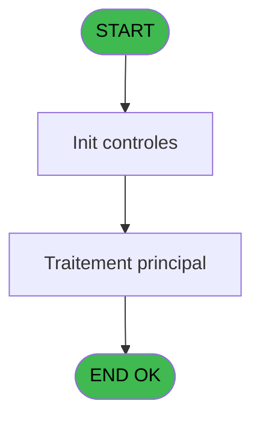
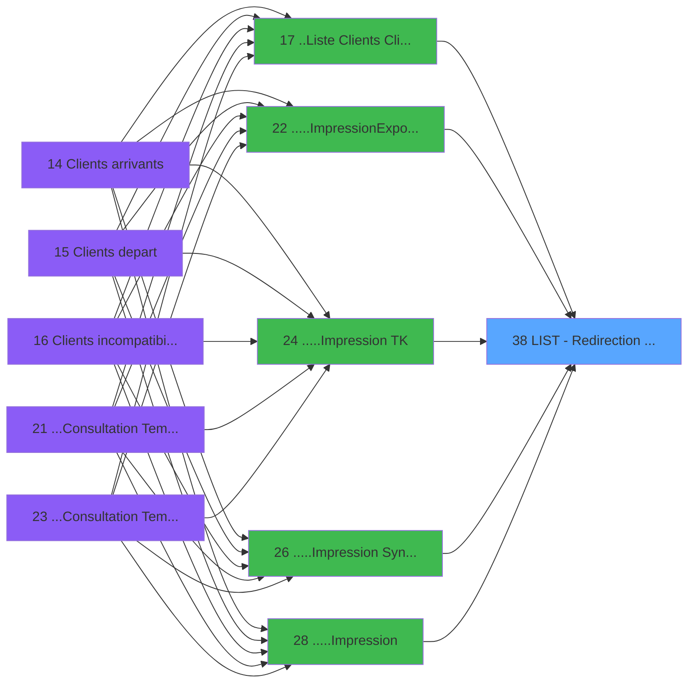

# PTR IDE 38 - LIST - Redirection d'un Etat

> **Analyse**: Phases 1-4 2026-02-03 18:21 -> 18:22 (12s) | Assemblage 18:22
> **Pipeline**: V7.2 Enrichi
> **Structure**: 4 onglets (Resume | Ecrans | Donnees | Connexions)

<!-- TAB:Resume -->

## 1. FICHE D'IDENTITE

| Attribut | Valeur |
|----------|--------|
| Projet | PTR |
| IDE Position | 38 |
| Nom Programme | LIST - Redirection d'un Etat |
| Fichier source | `Prg_38.xml` |
| Dossier IDE | Utilitaires |
| Taches | 1 (1 ecrans visibles) |
| Tables modifiees | 0 |
| Programmes appeles | 0 |

## 2. DESCRIPTION FONCTIONNELLE

**LIST - Redirection d'un Etat** assure la gestion complete de ce processus, accessible depuis [..Liste  Clients (ClipArt)+ (IDE 17)](PTR-IDE-17.md), [.....Impression/Export Tt (IDE 22)](PTR-IDE-22.md), [.....Impression TK (IDE 24)](PTR-IDE-24.md), [.....Impression Synthèse (IDE 26)](PTR-IDE-26.md), [.....Impression (IDE 28)](PTR-IDE-28.md), [Liste Vols Journee (IDE 29)](PTR-IDE-29.md), [Liste des Prestations Arrivant (IDE 30)](PTR-IDE-30.md), [Liste des Prestations Presents (IDE 31)](PTR-IDE-31.md), [...Consultation Stock (IDE 33)](PTR-IDE-33.md), [Liste des Passagers (IDE 34)](PTR-IDE-34.md).

Le flux de traitement s'organise en **1 blocs fonctionnels** :

- **Consultation** (1 tache) : ecrans de recherche, selection et consultation

**Logique metier** : 1 regles identifiees couvrant conditions metier.

## 3. BLOCS FONCTIONNELS

### 3.1 Consultation (1 tache)

Ecrans de recherche et consultation.

---

#### 38 - Selection [[ECRAN]](#ecran-t1)

**Role** : Selection par l'operateur : Selection.
**Ecran** : 419 x 78 DLU (MDI) | [Voir mockup](#ecran-t1)

## 5. REGLES METIER

1 regles identifiees:

### Autres (1 regles)

#### [RM-001] Condition toujours vraie (flag actif)

| Element | Detail |
|---------|--------|
| **Condition** | `V Mode Edition [D]='A'` |
| **Si vrai** | 'TRUE'LOG |
| **Si faux** | 'FALSE'LOG) |
| **Variables** | D (V Mode Edition) |
| **Expression source** | Expression 7 : `IF (V Mode Edition [D]='A','TRUE'LOG,'FALSE'LOG)` |
| **Exemple** | Si V Mode Edition [D]='A' → 'TRUE'LOG. Sinon → 'FALSE'LOG) |

## 6. CONTEXTE

- **Appele par**: [..Liste  Clients (ClipArt)+ (IDE 17)](PTR-IDE-17.md), [.....Impression/Export Tt (IDE 22)](PTR-IDE-22.md), [.....Impression TK (IDE 24)](PTR-IDE-24.md), [.....Impression Synthèse (IDE 26)](PTR-IDE-26.md), [.....Impression (IDE 28)](PTR-IDE-28.md), [Liste Vols Journee (IDE 29)](PTR-IDE-29.md), [Liste des Prestations Arrivant (IDE 30)](PTR-IDE-30.md), [Liste des Prestations Presents (IDE 31)](PTR-IDE-31.md), [...Consultation Stock (IDE 33)](PTR-IDE-33.md), [Liste des Passagers (IDE 34)](PTR-IDE-34.md)
- **Appelle**: 0 programmes | **Tables**: 0 (W:0 R:0 L:0) | **Taches**: 1 | **Expressions**: 7

<!-- TAB:Ecrans -->

## 8. ECRANS

### 8.1 Forms visibles (1 / 1)

| # | Position | Tache | Nom | Type | Largeur | Hauteur | Bloc |
|---|----------|-------|-----|------|---------|---------|------|
| 1 | 38 | 38 | Selection | MDI | 419 | 78 | Consultation |

### 8.2 Mockups Ecrans

---

#### 38 - Selection
**Tache** : [38](#t1) | **Type** : MDI | **Dimensions** : 419 x 78 DLU
**Bloc** : Consultation | **Titre IDE** : Selection

<!-- FORM-DATA:
{
    "width":  419,
    "vFactor":  8,
    "type":  "MDI",
    "hFactor":  8,
    "controls":  [
                     {
                         "x":  9,
                         "type":  "label",
                         "var":  "",
                         "y":  4,
                         "w":  257,
                         "fmt":  "",
                         "name":  "",
                         "h":  48,
                         "color":  "195",
                         "text":  "Impression sur",
                         "parent":  null
                     },
                     {
                         "x":  9,
                         "type":  "label",
                         "var":  "",
                         "y":  53,
                         "w":  257,
                         "fmt":  "",
                         "name":  "",
                         "h":  20,
                         "color":  "",
                         "text":  "",
                         "parent":  null
                     },
                     {
                         "x":  61,
                         "type":  "label",
                         "var":  "",
                         "y":  60,
                         "w":  84,
                         "fmt":  "",
                         "name":  "",
                         "h":  8,
                         "color":  "",
                         "text":  "Dialogue",
                         "parent":  2
                     },
                     {
                         "x":  19,
                         "type":  "radio",
                         "var":  "",
                         "y":  12,
                         "w":  157,
                         "fmt":  "",
                         "name":  "V Mode Edition",
                         "h":  38,
                         "color":  "",
                         "text":  "",
                         "parent":  null
                     },
                     {
                         "x":  37,
                         "type":  "checkbox",
                         "var":  "",
                         "y":  60,
                         "w":  18,
                         "fmt":  "",
                         "name":  "V Dialogue",
                         "h":  8,
                         "color":  "141",
                         "text":  "V Dialogue",
                         "parent":  null
                     },
                     {
                         "x":  281,
                         "type":  "button",
                         "var":  "",
                         "y":  23,
                         "w":  134,
                         "fmt":  "\u0026Quitter",
                         "name":  "V Quitter",
                         "h":  13,
                         "color":  "",
                         "text":  "",
                         "parent":  null
                     },
                     {
                         "x":  281,
                         "type":  "button",
                         "var":  "",
                         "y":  7,
                         "w":  134,
                         "fmt":  "\u0026OK",
                         "name":  "Bouton_OK",
                         "h":  13,
                         "color":  "",
                         "text":  "",
                         "parent":  null
                     },
                     {
                         "x":  281,
                         "type":  "button",
                         "var":  "",
                         "y":  39,
                         "w":  134,
                         "fmt":  "\u0026Paramètres",
                         "name":  "",
                         "h":  13,
                         "color":  "",
                         "text":  "",
                         "parent":  null
                     }
                 ],
    "taskId":  "38",
    "height":  78
}
-->

<strong>Champs : 1 champs</strong>

| Pos (x,y) | Nom | Variable | Type |
|-----------|-----|----------|------|
| 37,60 | V Dialogue | - | checkbox |

<strong>Boutons : 3 boutons</strong>

| Bouton | Pos (x,y) | Action |
|--------|-----------|--------|
| Quitter | 281,23 | Quitte le programme |
| OK | 281,7 | Valide la saisie et enregistre |
| Paramètres | 281,39 | Bouton fonctionnel |

## 9. NAVIGATION

Ecran unique: **Selection**

### 9.3 Structure hierarchique (1 tache)

| Position | Tache | Type | Dimensions | Bloc |
|----------|-------|------|------------|------|
| **38.1** | [**Selection** (38)](#t1) [mockup](#ecran-t1) | MDI | 419x78 | Consultation |

### 9.4 Algorigramme

> **Legende**: Vert = START/END OK | Rouge = END KO | Bleu = Decisions
> *Algorigramme auto-genere. Utiliser `/algorigramme` pour une synthese metier detaillee.*

<!-- TAB:Donnees -->

## 10. TABLES

### Tables utilisees (0)

| ID | Nom | Description | Type | R | W | L | Usages |
|----|-----|-------------|------|---|---|---|--------|

### Colonnes par table (0 / 0 tables avec colonnes identifiees)

## 11. VARIABLES

### 11.1 Parametres entrants (2)

Variables recues du programme appelant ([..Liste  Clients (ClipArt)+ (IDE 17)](PTR-IDE-17.md)).

| Lettre | Nom | Type | Usage dans |
|--------|-----|------|-----------|
| B | P Dialogue | Logical | - |
| C | P Impression | Logical | - |

### 11.2 Variables de session (4)

Variables persistantes pendant toute la session.

| Lettre | Nom | Type | Usage dans |
|--------|-----|------|-----------|
| D | V Mode Edition | Alpha | 2x session |
| E | V Dialogue | Logical | 1x session |
| G | V OK | Alpha | - |
| H | V Quitter | Alpha | - |

### 11.3 Autres (2)

Variables diverses.

| Lettre | Nom | Type | Usage dans |
|--------|-----|------|-----------|
| A | P_Aperçu | Logical | - |
| F | V_Apercu | Alpha | - |

## 12. EXPRESSIONS

**7 / 7 expressions decodees (100%)**

### 12.1 Repartition par type

| Type | Expressions | Regles |
|------|-------------|--------|
| CAST_LOGIQUE | 3 | 5 |
| CONSTANTE | 2 | 0 |
| CONDITION | 1 | 0 |
| OTHER | 1 | 0 |

### 12.2 Expressions cles par type

#### CAST_LOGIQUE (3 expressions)

| Type | IDE | Expression | Regle |
|------|-----|------------|-------|
| CAST_LOGIQUE | 7 | `IF (V Mode Edition [D]='A','TRUE'LOG,'FALSE'LOG)` | [RM-001](#rm-RM-001) |
| CAST_LOGIQUE | 4 | `'TRUE'LOG` | - |
| CAST_LOGIQUE | 3 | `'FALSE'LOG` | - |

#### CONSTANTE (2 expressions)

| Type | IDE | Expression | Regle |
|------|-----|------------|-------|
| CONSTANTE | 6 | `'I'` | - |
| CONSTANTE | 2 | `'%FormBton%quitter.bmp'` | - |

#### CONDITION (1 expressions)

| Type | IDE | Expression | Regle |
|------|-----|------------|-------|
| CONDITION | 1 | `V Mode Edition [D]='I'` | - |

#### OTHER (1 expressions)

| Type | IDE | Expression | Regle |
|------|-----|------------|-------|
| OTHER | 5 | `V Dialogue [E]` | - |

<!-- TAB:Connexions -->

## 13. GRAPHE D'APPELS

### 13.1 Chaine depuis Main (Callers)

Main -> ... -> [..Liste  Clients (ClipArt)+ (IDE 17)](PTR-IDE-17.md) -> **LIST - Redirection d'un Etat (IDE 38)**

Main -> ... -> [.....Impression/Export Tt (IDE 22)](PTR-IDE-22.md) -> **LIST - Redirection d'un Etat (IDE 38)**

Main -> ... -> [.....Impression TK (IDE 24)](PTR-IDE-24.md) -> **LIST - Redirection d'un Etat (IDE 38)**

Main -> ... -> [.....Impression Synthèse (IDE 26)](PTR-IDE-26.md) -> **LIST - Redirection d'un Etat (IDE 38)**

Main -> ... -> [.....Impression (IDE 28)](PTR-IDE-28.md) -> **LIST - Redirection d'un Etat (IDE 38)**

Main -> ... -> [Liste Vols Journee (IDE 29)](PTR-IDE-29.md) -> **LIST - Redirection d'un Etat (IDE 38)**

Main -> ... -> [Liste des Prestations Arrivant (IDE 30)](PTR-IDE-30.md) -> **LIST - Redirection d'un Etat (IDE 38)**

Main -> ... -> [Liste des Prestations Presents (IDE 31)](PTR-IDE-31.md) -> **LIST - Redirection d'un Etat (IDE 38)**

Main -> ... -> [...Consultation Stock (IDE 33)](PTR-IDE-33.md) -> **LIST - Redirection d'un Etat (IDE 38)**

Main -> ... -> [Liste des Passagers (IDE 34)](PTR-IDE-34.md) -> **LIST - Redirection d'un Etat (IDE 38)**

### 13.2 Callers

| IDE | Nom Programme | Nb Appels |
|-----|---------------|-----------|
| [17](PTR-IDE-17.md) | ..Liste  Clients (ClipArt)+ | 1 |
| [22](PTR-IDE-22.md) | .....Impression/Export Tt | 1 |
| [24](PTR-IDE-24.md) | .....Impression TK | 1 |
| [26](PTR-IDE-26.md) | .....Impression Synthèse | 1 |
| [28](PTR-IDE-28.md) | .....Impression | 1 |
| [29](PTR-IDE-29.md) | Liste Vols Journee | 1 |
| [30](PTR-IDE-30.md) | Liste des Prestations Arrivant | 1 |
| [31](PTR-IDE-31.md) | Liste des Prestations Presents | 1 |
| [33](PTR-IDE-33.md) | ...Consultation Stock | 1 |
| [34](PTR-IDE-34.md) | Liste des Passagers | 1 |

### 13.3 Callees (programmes appeles)

### 13.4 Detail Callees avec contexte

| IDE | Nom Programme | Appels | Contexte |
|-----|---------------|--------|----------|
| - | (aucun) | - | - |

## 14. RECOMMANDATIONS MIGRATION

### 14.1 Profil du programme

| Metrique | Valeur | Impact migration |
|----------|--------|-----------------|
| Lignes de logique | 21 | Programme compact |
| Expressions | 7 | Peu de logique |
| Tables WRITE | 0 | Impact faible |
| Sous-programmes | 0 | Peu de dependances |
| Ecrans visibles | 1 | Ecran unique ou traitement batch |
| Code desactive | 0% (0 / 21) | Code sain |
| Regles metier | 1 | Quelques regles a preserver |

### 14.2 Plan de migration par bloc

#### Consultation (1 tache: 1 ecran, 0 traitement)

- **Strategie** : Composants de recherche/selection en modales.
- 1 ecran : Selection

### 14.3 Dependances critiques

| Dependance | Type | Appels | Impact |
|------------|------|--------|--------|

---
*Spec DETAILED generee par Pipeline V7.2 - 2026-02-03 18:22*
