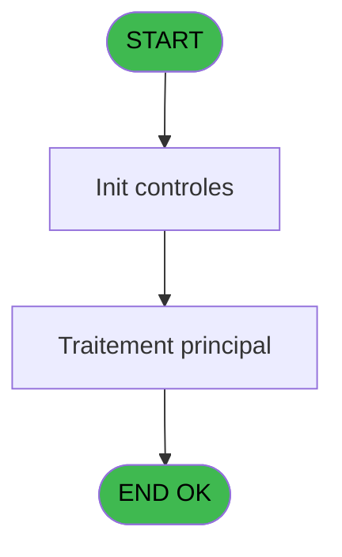
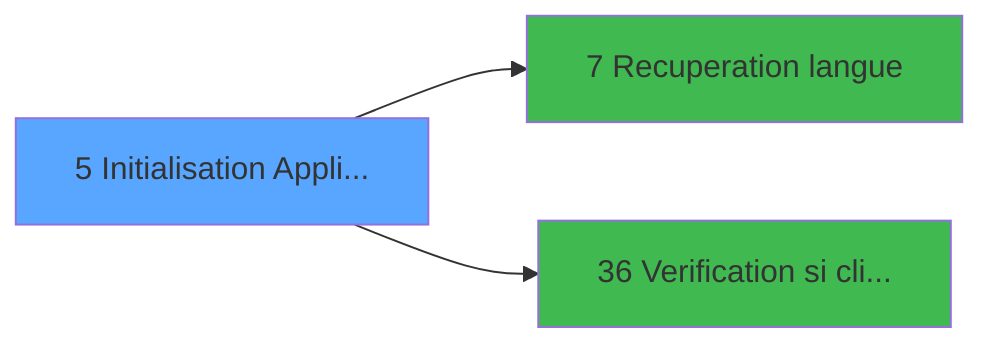

# PTR IDE 5 - Initialisation Application

> **Analyse**: Phases 1-4 2026-02-03 18:09 -> 18:09 (12s) | Assemblage 18:09
> **Pipeline**: V7.2 Enrichi
> **Structure**: 4 onglets (Resume | Ecrans | Donnees | Connexions)

<!-- TAB:Resume -->

## 1. FICHE D'IDENTITE

| Attribut | Valeur |
|----------|--------|
| Projet | PTR |
| IDE Position | 5 |
| Nom Programme | Initialisation Application |
| Fichier source | `Prg_5.xml` |
| Dossier IDE | Demarrage |
| Taches | 5 (1 ecrans visibles) |
| Tables modifiees | 0 |
| Programmes appeles | 2 |

## 2. DESCRIPTION FONCTIONNELLE

**Initialisation Application** assure la gestion complete de ce processus, accessible depuis [Main Program (IDE 1)](PTR-IDE-1.md).

Le flux de traitement s'organise en **2 blocs fonctionnels** :

- **Traitement** (4 taches) : traitements metier divers
- **Impression** (1 tache) : generation de tickets et documents

Detail : phases du traitement

#### Phase 1 : Impression (1 tache)

- **5** - Planning PRINTS

#### Phase 2 : Traitement (4 taches)

- **5.1** - Paramètres Utilisateur
- **5.1.1** - Erreur de login **[[ECRAN]](#ecran-t3)**
- **5.2** - Paramètres Societe
- **5.3** - calc nb lieu sejour

Delegue a : [Recuperation langue (IDE 7)](PTR-IDE-7.md)

## 3. BLOCS FONCTIONNELS

### 3.1 Impression (1 tache)

Generation des documents et tickets.

---

#### 5 - Planning PRINTS

**Role** : Generation du document : Planning PRINTS.

### 3.2 Traitement (4 taches)

Traitements internes.

---

#### 5.1 - Paramètres Utilisateur

**Role** : Traitement : Paramètres Utilisateur.
**Delegue a** : [Recuperation langue (IDE 7)](PTR-IDE-7.md)

---

#### 5.1.1 - Erreur de login [[ECRAN]](#ecran-t3)

**Role** : Traitement : Erreur de login.
**Ecran** : 478 x 64 DLU (MDI) | [Voir mockup](#ecran-t3)
**Delegue a** : [Recuperation langue (IDE 7)](PTR-IDE-7.md)

---

#### 5.2 - Paramètres Societe

**Role** : Traitement : Paramètres Societe.
**Delegue a** : [Recuperation langue (IDE 7)](PTR-IDE-7.md)

---

#### 5.3 - calc nb lieu sejour

**Role** : Traitement : calc nb lieu sejour.
**Delegue a** : [Recuperation langue (IDE 7)](PTR-IDE-7.md)

## 5. REGLES METIER

*(Aucune regle metier identifiee)*

## 6. CONTEXTE

- **Appele par**: [Main Program (IDE 1)](PTR-IDE-1.md)
- **Appelle**: 2 programmes | **Tables**: 3 (W:0 R:3 L:0) | **Taches**: 5 | **Expressions**: 2

<!-- TAB:Ecrans -->

## 8. ECRANS

### 8.1 Forms visibles (1 / 5)

| # | Position | Tache | Nom | Type | Largeur | Hauteur | Bloc |
|---|----------|-------|-----|------|---------|---------|------|
| 1 | 5.1.1 | 5.1.1 | Erreur de login | MDI | 478 | 64 | Traitement |

### 8.2 Mockups Ecrans

---

#### 5.1.1 - Erreur de login
**Tache** : [5.1.1](#t3) | **Type** : MDI | **Dimensions** : 478 x 64 DLU
**Bloc** : Traitement | **Titre IDE** : Erreur de login

<!-- FORM-DATA:
{
    "width":  478,
    "vFactor":  8,
    "type":  "MDI",
    "hFactor":  8,
    "controls":  [
                     {
                         "x":  109,
                         "type":  "label",
                         "var":  "",
                         "y":  2,
                         "w":  309,
                         "fmt":  "",
                         "name":  "",
                         "h":  8,
                         "color":  "143",
                         "text":  "UTILISATEUR NON DECLARE !!",
                         "parent":  null
                     },
                     {
                         "x":  109,
                         "type":  "label",
                         "var":  "",
                         "y":  12,
                         "w":  296,
                         "fmt":  "",
                         "name":  "",
                         "h":  27,
                         "color":  "",
                         "text":  "Vous ne pouvez acceder au programme sans que votre LOGIN ai\r\n ete declare par la GESTION.",
                         "parent":  null
                     },
                     {
                         "x":  0,
                         "type":  "label",
                         "var":  "",
                         "y":  41,
                         "w":  473,
                         "fmt":  "",
                         "name":  "",
                         "h":  21,
                         "color":  "",
                         "text":  "",
                         "parent":  null
                     },
                     {
                         "x":  157,
                         "type":  "button",
                         "var":  "",
                         "y":  44,
                         "w":  159,
                         "fmt":  "\u0026Ok",
                         "name":  "",
                         "h":  16,
                         "color":  "",
                         "text":  "",
                         "parent":  null
                     },
                     {
                         "x":  0,
                         "type":  "image",
                         "var":  "",
                         "y":  0,
                         "w":  77,
                         "fmt":  "",
                         "name":  "",
                         "h":  33,
                         "color":  "",
                         "text":  "",
                         "parent":  null
                     }
                 ],
    "taskId":  "5.1.1",
    "height":  64
}
-->

<strong>Boutons : 1 boutons</strong>

| Bouton | Pos (x,y) | Action |
|--------|-----------|--------|
| Ok | 157,44 | Valide la saisie et enregistre |

## 9. NAVIGATION

Ecran unique: **Erreur de login**

### 9.3 Structure hierarchique (5 taches)

| Position | Tache | Type | Dimensions | Bloc |
|----------|-------|------|------------|------|
| **5.1** | [**Planning PRINTS** (5)](#t1) | MDI | - | Impression |
| **5.2** | [**Paramètres Utilisateur** (5.1)](#t2) | MDI | - | Traitement |
| 5.2.1 | [Erreur de login (5.1.1)](#t3) [mockup](#ecran-t3) | MDI | 478x64 | |
| 5.2.2 | [Paramètres Societe (5.2)](#t4) | MDI | - | |
| 5.2.3 | [calc nb lieu sejour (5.3)](#t11) | - | - | |

### 9.4 Algorigramme

> **Legende**: Vert = START/END OK | Rouge = END KO | Bleu = Decisions
> *Algorigramme auto-genere. Utiliser `/algorigramme` pour une synthese metier detaillee.*

<!-- TAB:Donnees -->

## 10. TABLES

### Tables utilisees (3)

| ID | Nom | Description | Type | R | W | L | Usages |
|----|-----|-------------|------|---|---|---|--------|
| 81 | societe__________soc |  | DB | R |   |   | 1 |
| 109 | table_utilisateurs |  | DB | R |   |   | 1 |
| 118 | tables_imports |  | DB | R |   |   | 1 |

### Colonnes par table (0 / 3 tables avec colonnes identifiees)

Table 81 - societe__________soc (R) - 1 usages

*Table utilisee uniquement en Link ou aucune colonne Real identifiee dans le DataView.*

Table 109 - table_utilisateurs (R) - 1 usages

*Table utilisee uniquement en Link ou aucune colonne Real identifiee dans le DataView.*

Table 118 - tables_imports (R) - 1 usages

*Table utilisee uniquement en Link ou aucune colonne Real identifiee dans le DataView.*

## 11. VARIABLES

*(Programme sans variables locales mappees)*

## 12. EXPRESSIONS

**2 / 2 expressions decodees (100%)**

### 12.1 Repartition par type

| Type | Expressions | Regles |
|------|-------------|--------|
| CONSTANTE | 1 | 0 |
| OTHER | 1 | 0 |

### 12.2 Expressions cles par type

#### CONSTANTE (1 expressions)

| Type | IDE | Expression | Regle |
|------|-----|------------|-------|
| CONSTANTE | 1 | `'PT'` | - |

#### OTHER (1 expressions)

| Type | IDE | Expression | Regle |
|------|-----|------------|-------|
| OTHER | 2 | `SetParam ('VERIF_USERB','O')` | - |

<!-- TAB:Connexions -->

## 13. GRAPHE D'APPELS

### 13.1 Chaine depuis Main (Callers)

Main -> ... -> [Main Program (IDE 1)](PTR-IDE-1.md) -> **Initialisation Application (IDE 5)**

### 13.2 Callers

| IDE | Nom Programme | Nb Appels |
|-----|---------------|-----------|
| [1](PTR-IDE-1.md) | Main Program | 1 |

### 13.3 Callees (programmes appeles)

### 13.4 Detail Callees avec contexte

| IDE | Nom Programme | Appels | Contexte |
|-----|---------------|--------|----------|
| [7](PTR-IDE-7.md) | Recuperation langue | 1 | Recuperation donnees |
| [36](PTR-IDE-36.md) | Verification si client/serveur | 1 | Controle/validation |

## 14. RECOMMANDATIONS MIGRATION

### 14.1 Profil du programme

| Metrique | Valeur | Impact migration |
|----------|--------|-----------------|
| Lignes de logique | 40 | Programme compact |
| Expressions | 2 | Peu de logique |
| Tables WRITE | 0 | Impact faible |
| Sous-programmes | 2 | Peu de dependances |
| Ecrans visibles | 1 | Ecran unique ou traitement batch |
| Code desactive | 0% (0 / 40) | Code sain |
| Regles metier | 0 | Pas de regle identifiee |

### 14.2 Plan de migration par bloc

#### Impression (1 tache: 0 ecran, 1 traitement)

- **Strategie** : Templates HTML -> PDF via wkhtmltopdf ou Puppeteer.
- `PrintService` injectable avec choix imprimante

#### Traitement (4 taches: 1 ecran, 3 traitements)

- **Strategie** : Orchestrateur avec 1 ecrans (Razor/React) et 3 traitements backend (services).
- Les ecrans deviennent des composants UI, les traitements invisibles deviennent des services injectables.
- 2 sous-programme(s) a migrer ou a reutiliser depuis les services existants.
- Decomposer les taches en services unitaires testables.

### 14.3 Dependances critiques

| Dependance | Type | Appels | Impact |
|------------|------|--------|--------|
| [Verification si client/serveur (IDE 36)](PTR-IDE-36.md) | Sous-programme | 1x | Normale - Controle/validation |
| [Recuperation langue (IDE 7)](PTR-IDE-7.md) | Sous-programme | 1x | Normale - Recuperation donnees |

---
*Spec DETAILED generee par Pipeline V7.2 - 2026-02-03 18:09*
