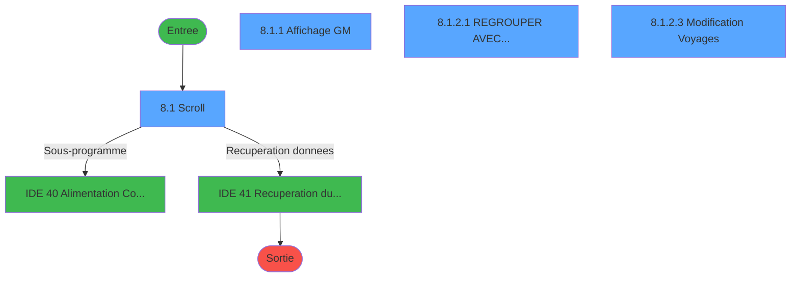
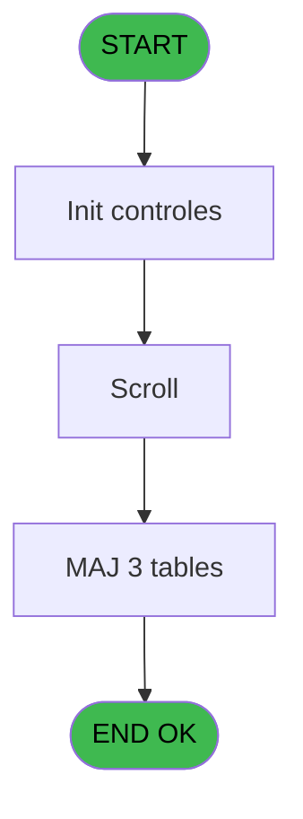

# PTR IDE 8 - Gestion des Codes Vols

> **Analyse**: Phases 1-4 2026-02-03 18:10 -> 18:10 (20s) | Assemblage 18:10
> **Pipeline**: V7.2 Enrichi
> **Structure**: 4 onglets (Resume | Ecrans | Donnees | Connexions)

<!-- TAB:Resume -->

## 1. FICHE D'IDENTITE

| Attribut | Valeur |
|----------|--------|
| Projet | PTR |
| IDE Position | 8 |
| Nom Programme | Gestion des Codes Vols |
| Fichier source | `Prg_8.xml` |
| Dossier IDE | Gestion |
| Taches | 13 (4 ecrans visibles) |
| Tables modifiees | 3 |
| Programmes appeles | 2 |
| :warning: Statut | **ORPHELIN_POTENTIEL** |

## 2. DESCRIPTION FONCTIONNELLE

**Gestion des Codes Vols** assure la gestion complete de ce processus.

Le flux de traitement s'organise en **3 blocs fonctionnels** :

- **Traitement** (9 taches) : traitements metier divers
- **Consultation** (3 taches) : ecrans de recherche, selection et consultation
- **Saisie** (1 tache) : ecrans de saisie utilisateur (formulaires, champs, donnees)

**Donnees modifiees** : 3 tables en ecriture (voyages__________voy, code_vol_________vot, troncon__________tro).

**Logique metier** : 2 regles identifiees couvrant valeurs par defaut.

Detail : phases du traitement

#### Phase 1 : Traitement (9 taches)

- **8** - Gestion Code-Vols **[[ECRAN]](#ecran-t1)**
- **8.1** - Scroll **[[ECRAN]](#ecran-t2)**
- **8.1.2.1** - REGROUPER AVEC... **[[ECRAN]](#ecran-t5)**
- **8.1.2.2** - Confirmation **[[ECRAN]](#ecran-t6)**
- **8.1.2.3** - Modification Voyages **[[ECRAN]](#ecran-t7)**
- **8.1.2.4** - Suppression Origine
- **8.1.5** - (sans nom)
- **8.1.6** - (sans nom)
- **8.1.5.1** - (sans nom)

Delegue a : [Alimentation Combos TRANSPORT (IDE 40)](PTR-IDE-40.md), [Recuperation du titre (IDE 41)](PTR-IDE-41.md)

#### Phase 2 : Consultation (3 taches)

- **8.1.1** - Affichage GM **[[ECRAN]](#ecran-t3)**
- **8.1.3** - Choix Date
- **8.1.4** - Selection

Delegue a : [Recuperation du titre (IDE 41)](PTR-IDE-41.md)

#### Phase 3 : Saisie (1 tache)

- **8.1.2** - Saisie Transport **[[ECRAN]](#ecran-t4)**

#### Tables impactees

| Table | Operations | Role metier |
|-------|-----------|-------------|
| voyages__________voy | R/**W** (4 usages) |  |
| code_vol_________vot | **W**/L (3 usages) |  |
| troncon__________tro | **W**/L (3 usages) |  |

## 3. BLOCS FONCTIONNELS

### 3.1 Traitement (9 taches)

Traitements internes.

---

#### 8 - Gestion Code-Vols [[ECRAN]](#ecran-t1)

**Role** : Tache d'orchestration : point d'entree du programme (9 sous-taches). Coordonne l'enchainement des traitements.
**Ecran** : 1261 x 295 DLU (MDI) | [Voir mockup](#ecran-t1)

8 sous-taches directes

| Tache | Nom | Bloc |
|-------|-----|------|
| [8.1](#t2) | Scroll **[[ECRAN]](#ecran-t2)** | Traitement |
| [8.1.2.1](#t5) | REGROUPER AVEC... **[[ECRAN]](#ecran-t5)** | Traitement |
| [8.1.2.2](#t6) | Confirmation **[[ECRAN]](#ecran-t6)** | Traitement |
| [8.1.2.3](#t7) | Modification Voyages **[[ECRAN]](#ecran-t7)** | Traitement |
| [8.1.2.4](#t8) | Suppression Origine | Traitement |
| [8.1.5](#t11) | (sans nom) | Traitement |
| [8.1.6](#t17) | (sans nom) | Traitement |
| [8.1.5.1](#t18) | (sans nom) | Traitement |

**Delegue a** : [Alimentation Combos TRANSPORT (IDE 40)](PTR-IDE-40.md), [Recuperation du titre (IDE 41)](PTR-IDE-41.md)

---

#### 8.1 - Scroll [[ECRAN]](#ecran-t2)

**Role** : Traitement : Scroll.
**Ecran** : 1264 x 297 DLU (MDI) | [Voir mockup](#ecran-t2)
**Variables liees** : F (W0-Scroll vide), O (V_Police Scrolling)
**Delegue a** : [Alimentation Combos TRANSPORT (IDE 40)](PTR-IDE-40.md), [Recuperation du titre (IDE 41)](PTR-IDE-41.md)

---

#### 8.1.2.1 - REGROUPER AVEC... [[ECRAN]](#ecran-t5)

**Role** : Traitement : REGROUPER AVEC....
**Ecran** : 511 x 197 DLU (MDI) | [Voir mockup](#ecran-t5)
**Delegue a** : [Alimentation Combos TRANSPORT (IDE 40)](PTR-IDE-40.md), [Recuperation du titre (IDE 41)](PTR-IDE-41.md)

---

#### 8.1.2.2 - Confirmation [[ECRAN]](#ecran-t6)

**Role** : Traitement : Confirmation.
**Ecran** : 108 x 32 DLU (MDI) | [Voir mockup](#ecran-t6)
**Delegue a** : [Alimentation Combos TRANSPORT (IDE 40)](PTR-IDE-40.md), [Recuperation du titre (IDE 41)](PTR-IDE-41.md)

---

#### 8.1.2.3 - Modification Voyages [[ECRAN]](#ecran-t7)

**Role** : Traitement : Modification Voyages.
**Ecran** : 140 x 32 DLU (Modal) | [Voir mockup](#ecran-t7)
**Delegue a** : [Alimentation Combos TRANSPORT (IDE 40)](PTR-IDE-40.md), [Recuperation du titre (IDE 41)](PTR-IDE-41.md)

---

#### 8.1.2.4 - Suppression Origine

**Role** : Traitement : Suppression Origine.
**Delegue a** : [Alimentation Combos TRANSPORT (IDE 40)](PTR-IDE-40.md), [Recuperation du titre (IDE 41)](PTR-IDE-41.md)

---

#### 8.1.5 - (sans nom)

**Role** : Traitement interne.
**Delegue a** : [Alimentation Combos TRANSPORT (IDE 40)](PTR-IDE-40.md), [Recuperation du titre (IDE 41)](PTR-IDE-41.md)

---

#### 8.1.6 - (sans nom)

**Role** : Traitement interne.
**Delegue a** : [Alimentation Combos TRANSPORT (IDE 40)](PTR-IDE-40.md), [Recuperation du titre (IDE 41)](PTR-IDE-41.md)

---

#### 8.1.5.1 - (sans nom)

**Role** : Traitement interne.
**Delegue a** : [Alimentation Combos TRANSPORT (IDE 40)](PTR-IDE-40.md), [Recuperation du titre (IDE 41)](PTR-IDE-41.md)

### 3.2 Consultation (3 taches)

Ecrans de recherche et consultation.

---

#### 8.1.1 - Affichage GM [[ECRAN]](#ecran-t3)

**Role** : Reinitialisation : Affichage GM.
**Ecran** : 624 x 196 DLU (Modal) | [Voir mockup](#ecran-t3)

---

#### 8.1.3 - Choix Date

**Role** : Selection par l'operateur : Choix Date.
**Variables liees** : C (W0-Choix), E (W0-Date)

---

#### 8.1.4 - Selection

**Role** : Selection par l'operateur : Selection.

### 3.3 Saisie (1 tache)

L'operateur saisit les donnees de la transaction via 1 ecran (Saisie Transport).

---

#### 8.1.2 - Saisie Transport [[ECRAN]](#ecran-t4)

**Role** : Saisie des donnees : Saisie Transport.
**Ecran** : 228 x 185 DLU (MDI) | [Voir mockup](#ecran-t4)
**Variables liees** : N (V_Combo Transport)

## 5. REGLES METIER

2 regles identifiees:

### Autres (2 regles)

#### [RM-001] Valeur par defaut si GetParam ('SOCIETE') est vide

| Element | Detail |
|---------|--------|
| **Condition** | `GetParam ('SOCIETE')=''` |
| **Si vrai** | 'C' |
| **Si faux** | GetParam ('SOCIETE')) |
| **Expression source** | Expression 4 : `IF (GetParam ('SOCIETE')='','C',GetParam ('SOCIETE'))` |
| **Exemple** | Si GetParam ('SOCIETE')='' → 'C'. Sinon → GetParam ('SOCIETE')) |

#### [RM-002] Valeur par defaut si GetParam ('LANGUE') est vide

| Element | Detail |
|---------|--------|
| **Condition** | `GetParam ('LANGUE')=''` |
| **Si vrai** | 'F' |
| **Si faux** | GetParam ('LANGUE')) |
| **Expression source** | Expression 5 : `IF (GetParam ('LANGUE')='','F',GetParam ('LANGUE'))` |
| **Exemple** | Si GetParam ('LANGUE')='' → 'F'. Sinon → GetParam ('LANGUE')) |

## 6. CONTEXTE

- **Appele par**: (aucun)
- **Appelle**: 2 programmes | **Tables**: 6 (W:3 R:2 L:5) | **Taches**: 13 | **Expressions**: 13

<!-- TAB:Ecrans -->

## 8. ECRANS

### 8.1 Forms visibles (4 / 13)

| # | Position | Tache | Nom | Type | Largeur | Hauteur | Bloc |
|---|----------|-------|-----|------|---------|---------|------|
| 1 | 8.1 | 8.1 | Scroll | MDI | 1264 | 297 | Traitement |
| 2 | 8.1.1 | 8.1.1 | Affichage GM | Modal | 624 | 196 | Consultation |
| 3 | 8.1.2.1 | 8.1.2.1 | REGROUPER AVEC... | MDI | 511 | 197 | Traitement |
| 4 | 8.1.2.3 | 8.1.2.3 | Modification Voyages | Modal | 140 | 32 | Traitement |

### 8.2 Mockups Ecrans

---

#### 8.1 - Scroll
**Tache** : [8.1](#t2) | **Type** : MDI | **Dimensions** : 1264 x 297 DLU
**Bloc** : Traitement | **Titre IDE** : Scroll

<!-- FORM-DATA:
{
    "width":  1264,
    "vFactor":  8,
    "type":  "MDI",
    "hFactor":  8,
    "controls":  [
                     {
                         "x":  2,
                         "type":  "label",
                         "var":  "",
                         "y":  1,
                         "w":  1258,
                         "fmt":  "",
                         "name":  "",
                         "h":  20,
                         "color":  "1",
                         "text":  "",
                         "parent":  null
                     },
                     {
                         "x":  0,
                         "type":  "label",
                         "var":  "",
                         "y":  22,
                         "w":  1258,
                         "fmt":  "",
                         "name":  "",
                         "h":  51,
                         "color":  "195",
                         "text":  "Date des Vols",
                         "parent":  null
                     },
                     {
                         "x":  2,
                         "type":  "table",
                         "var":  "",
                         "name":  "",
                         "titleH":  12,
                         "color":  "110",
                         "w":  619,
                         "y":  79,
                         "fmt":  "",
                         "parent":  null,
                         "text":  "",
                         "rowH":  14,
                         "h":  183,
                         "cols":  [
                                      {
                                          "title":  "Vol",
                                          "layer":  1,
                                          "w":  489
                                      },
                                      {
                                          "title":  "Heure",
                                          "layer":  2,
                                          "w":  85
                                      }
                                  ],
                         "rows":  2
                     },
                     {
                         "x":  0,
                         "type":  "label",
                         "var":  "",
                         "y":  271,
                         "w":  1259,
                         "fmt":  "",
                         "name":  "",
                         "h":  24,
                         "color":  "1",
                         "text":  "",
                         "parent":  null
                     },
                     {
                         "x":  40,
                         "type":  "edit",
                         "var":  "",
                         "y":  93,
                         "w":  69,
                         "fmt":  "U6",
                         "name":  "VOL Code Vol",
                         "h":  12,
                         "color":  "110",
                         "text":  "",
                         "parent":  8
                     },
                     {
                         "x":  115,
                         "type":  "combobox",
                         "var":  "",
                         "y":  93,
                         "w":  276,
                         "fmt":  "",
                         "name":  "VOL Transport",
                         "h":  12,
                         "color":  "110",
                         "text":  "1,2",
                         "parent":  8
                     },
                     {
                         "x":  410,
                         "type":  "edit",
                         "var":  "",
                         "y":  93,
                         "w":  75,
                         "fmt":  "",
                         "name":  "VOL Ville",
                         "h":  12,
                         "color":  "110",
                         "text":  "",
                         "parent":  8
                     },
                     {
                         "x":  499,
                         "type":  "edit",
                         "var":  "",
                         "y":  93,
                         "w":  64,
                         "fmt":  "",
                         "name":  "VOL Heure",
                         "h":  12,
                         "color":  "110",
                         "text":  "",
                         "parent":  8
                     },
                     {
                         "x":  13,
                         "type":  "edit",
                         "var":  "",
                         "y":  7,
                         "w":  267,
                         "fmt":  "30",
                         "name":  "",
                         "h":  8,
                         "color":  "",
                         "text":  "",
                         "parent":  null
                     },
                     {
                         "x":  865,
                         "type":  "edit",
                         "var":  "",
                         "y":  7,
                         "w":  387,
                         "fmt":  "WWW DD MMM YYYYT",
                         "name":  "",
                         "h":  8,
                         "color":  "",
                         "text":  "",
                         "parent":  null
                     },
                     {
                         "x":  191,
                         "type":  "image",
                         "var":  "",
                         "y":  28,
                         "w":  114,
                         "fmt":  "",
                         "name":  "",
                         "h":  43,
                         "color":  "",
                         "text":  "",
                         "parent":  null
                     },
                     {
                         "x":  955,
                         "type":  "image",
                         "var":  "",
                         "y":  28,
                         "w":  114,
                         "fmt":  "",
                         "name":  "",
                         "h":  43,
                         "color":  "",
                         "text":  "",
                         "parent":  4
                     },
                     {
                         "x":  333,
                         "type":  "edit",
                         "var":  "",
                         "y":  45,
                         "w":  594,
                         "fmt":  "WWWWWWWWWW DD MMMMMMMM YYYYT",
                         "name":  "",
                         "h":  10,
                         "color":  "7",
                         "text":  "",
                         "parent":  4
                     },
                     {
                         "x":  7,
                         "type":  "button",
                         "var":  "",
                         "y":  274,
                         "w":  154,
                         "fmt":  "\u0026Quitter",
                         "name":  "",
                         "h":  18,
                         "color":  "",
                         "text":  "",
                         "parent":  14
                     },
                     {
                         "x":  279,
                         "type":  "button",
                         "var":  "",
                         "y":  274,
                         "w":  154,
                         "fmt":  "\u0026Sélection",
                         "name":  "",
                         "h":  18,
                         "color":  "",
                         "text":  "",
                         "parent":  14
                     },
                     {
                         "x":  443,
                         "type":  "button",
                         "var":  "",
                         "y":  274,
                         "w":  154,
                         "fmt":  "\u0026Visualiser",
                         "name":  "",
                         "h":  18,
                         "color":  "",
                         "text":  "",
                         "parent":  14
                     },
                     {
                         "x":  604,
                         "type":  "button",
                         "var":  "",
                         "y":  274,
                         "w":  154,
                         "fmt":  "\u0026Modification",
                         "name":  "",
                         "h":  18,
                         "color":  "",
                         "text":  "",
                         "parent":  14
                     },
                     {
                         "x":  767,
                         "type":  "button",
                         "var":  "",
                         "y":  274,
                         "w":  154,
                         "fmt":  "\u0026Création",
                         "name":  "",
                         "h":  18,
                         "color":  "",
                         "text":  "",
                         "parent":  14
                     },
                     {
                         "x":  930,
                         "type":  "button",
                         "var":  "",
                         "y":  274,
                         "w":  154,
                         "fmt":  "\u0026Regrouper",
                         "name":  "",
                         "h":  18,
                         "color":  "",
                         "text":  "",
                         "parent":  14
                     },
                     {
                         "x":  1096,
                         "type":  "button",
                         "var":  "",
                         "y":  274,
                         "w":  154,
                         "fmt":  "\u0026Date",
                         "name":  "",
                         "h":  18,
                         "color":  "",
                         "text":  "",
                         "parent":  14
                     },
                     {
                         "x":  621,
                         "type":  "subform",
                         "var":  "",
                         "y":  73,
                         "w":  643,
                         "fmt":  "",
                         "name":  "Affichage GM",
                         "h":  196,
                         "color":  "",
                         "text":  "",
                         "parent":  null
                     },
                     {
                         "x":  8,
                         "type":  "edit",
                         "var":  "",
                         "y":  93,
                         "w":  25,
                         "fmt":  "",
                         "name":  "vot_compagnie",
                         "h":  12,
                         "color":  "110",
                         "text":  "",
                         "parent":  8
                     }
                 ],
    "taskId":  "8.1",
    "height":  297
}
-->

<strong>Champs : 8 champs</strong>

| Pos (x,y) | Nom | Variable | Type |
|-----------|-----|----------|------|
| 40,93 | VOL Code Vol | - | edit |
| 115,93 | VOL Transport | - | combobox |
| 410,93 | VOL Ville | - | edit |
| 499,93 | VOL Heure | - | edit |
| 13,7 | 30 | - | edit |
| 865,7 | WWW DD MMM YYYYT | - | edit |
| 333,45 | WWWWWWWWWW DD MMMMMMMM YYYYT | - | edit |
| 8,93 | vot_compagnie | - | edit |

<strong>Boutons : 7 boutons</strong>

| Bouton | Pos (x,y) | Action |
|--------|-----------|--------|
| Quitter | 7,274 | Quitte le programme |
| Sélection | 279,274 | Bouton fonctionnel |
| Visualiser | 443,274 | Bouton fonctionnel |
| Modification | 604,274 | Modifie l'element |
| Création | 767,274 | Bouton fonctionnel |
| Regrouper | 930,274 | Bouton fonctionnel |
| Date | 1096,274 | Bouton fonctionnel |

---

#### 8.1.1 - Affichage GM
**Tache** : [8.1.1](#t3) | **Type** : Modal | **Dimensions** : 624 x 196 DLU
**Bloc** : Consultation | **Titre IDE** : Affichage GM

<!-- FORM-DATA:
{
    "width":  624,
    "vFactor":  8,
    "type":  "Modal",
    "hFactor":  8,
    "controls":  [
                     {
                         "x":  5,
                         "type":  "table",
                         "var":  "",
                         "name":  "",
                         "titleH":  12,
                         "color":  "110",
                         "w":  603,
                         "y":  6,
                         "fmt":  "",
                         "parent":  null,
                         "text":  "",
                         "rowH":  14,
                         "h":  182,
                         "cols":  [
                                      {
                                          "title":  "Titre",
                                          "layer":  1,
                                          "w":  133
                                      },
                                      {
                                          "title":  "Nom",
                                          "layer":  2,
                                          "w":  286
                                      },
                                      {
                                          "title":  "Prénom",
                                          "layer":  3,
                                          "w":  150
                                      }
                                  ],
                         "rows":  3
                     },
                     {
                         "x":  147,
                         "type":  "edit",
                         "var":  "",
                         "y":  20,
                         "w":  278,
                         "fmt":  "",
                         "name":  "",
                         "h":  12,
                         "color":  "110",
                         "text":  "",
                         "parent":  1
                     },
                     {
                         "x":  437,
                         "type":  "edit",
                         "var":  "",
                         "y":  20,
                         "w":  104,
                         "fmt":  "",
                         "name":  "",
                         "h":  12,
                         "color":  "110",
                         "text":  "",
                         "parent":  1
                     },
                     {
                         "x":  14,
                         "type":  "edit",
                         "var":  "",
                         "y":  20,
                         "w":  25,
                         "fmt":  "",
                         "name":  "",
                         "h":  12,
                         "color":  "110",
                         "text":  "",
                         "parent":  1
                     },
                     {
                         "x":  58,
                         "type":  "edit",
                         "var":  "",
                         "y":  20,
                         "w":  30,
                         "fmt":  "UX",
                         "name":  "",
                         "h":  12,
                         "color":  "110",
                         "text":  "",
                         "parent":  1
                     }
                 ],
    "taskId":  "8.1.1",
    "height":  196
}
-->

<strong>Champs : 4 champs</strong>

| Pos (x,y) | Nom | Variable | Type |
|-----------|-----|----------|------|
| 147,20 | (sans nom) | - | edit |
| 437,20 | (sans nom) | - | edit |
| 14,20 | (sans nom) | - | edit |
| 58,20 | UX | - | edit |

---

#### 8.1.2.1 - REGROUPER AVEC...
**Tache** : [8.1.2.1](#t5) | **Type** : MDI | **Dimensions** : 511 x 197 DLU
**Bloc** : Traitement | **Titre IDE** : REGROUPER AVEC...

<!-- FORM-DATA:
{
    "width":  511,
    "vFactor":  8,
    "type":  "MDI",
    "hFactor":  8,
    "controls":  [
                     {
                         "x":  13,
                         "type":  "table",
                         "var":  "",
                         "name":  "",
                         "titleH":  13,
                         "color":  "196",
                         "w":  485,
                         "y":  3,
                         "fmt":  "",
                         "parent":  null,
                         "text":  "",
                         "rowH":  13,
                         "h":  143,
                         "cols":  [
                                      {
                                          "title":  "Vol",
                                          "layer":  1,
                                          "w":  119
                                      },
                                      {
                                          "title":  "Transport",
                                          "layer":  2,
                                          "w":  128
                                      },
                                      {
                                          "title":  "Ville",
                                          "layer":  3,
                                          "w":  110
                                      },
                                      {
                                          "title":  "Heure",
                                          "layer":  4,
                                          "w":  91
                                      }
                                  ],
                         "rows":  4
                     },
                     {
                         "x":  2,
                         "type":  "label",
                         "var":  "",
                         "y":  171,
                         "w":  504,
                         "fmt":  "",
                         "name":  "",
                         "h":  24,
                         "color":  "",
                         "text":  "",
                         "parent":  null
                     },
                     {
                         "x":  389,
                         "type":  "edit",
                         "var":  "",
                         "y":  19,
                         "w":  64,
                         "fmt":  "",
                         "name":  "",
                         "h":  8,
                         "color":  "177",
                         "text":  "",
                         "parent":  1
                     },
                     {
                         "x":  48,
                         "type":  "edit",
                         "var":  "",
                         "y":  19,
                         "w":  64,
                         "fmt":  "",
                         "name":  "",
                         "h":  8,
                         "color":  "177",
                         "text":  "",
                         "parent":  1
                     },
                     {
                         "x":  279,
                         "type":  "edit",
                         "var":  "",
                         "y":  19,
                         "w":  75,
                         "fmt":  "",
                         "name":  "",
                         "h":  8,
                         "color":  "177",
                         "text":  "",
                         "parent":  1
                     },
                     {
                         "x":  151,
                         "type":  "edit",
                         "var":  "",
                         "y":  19,
                         "w":  98,
                         "fmt":  "8",
                         "name":  "",
                         "h":  8,
                         "color":  "177",
                         "text":  "",
                         "parent":  1
                     },
                     {
                         "x":  53,
                         "type":  "button",
                         "var":  "",
                         "y":  174,
                         "w":  154,
                         "fmt":  "\u0026Sélectionner",
                         "name":  "",
                         "h":  18,
                         "color":  "",
                         "text":  "",
                         "parent":  11
                     },
                     {
                         "x":  291,
                         "type":  "button",
                         "var":  "",
                         "y":  174,
                         "w":  154,
                         "fmt":  "\u0026Abandonner",
                         "name":  "",
                         "h":  18,
                         "color":  "",
                         "text":  "",
                         "parent":  11
                     },
                     {
                         "x":  227,
                         "type":  "image",
                         "var":  "",
                         "y":  150,
                         "w":  56,
                         "fmt":  "",
                         "name":  "",
                         "h":  18,
                         "color":  "",
                         "text":  "",
                         "parent":  null
                     },
                     {
                         "x":  19,
                         "type":  "edit",
                         "var":  "",
                         "y":  19,
                         "w":  27,
                         "fmt":  "",
                         "name":  "vot_compagnie",
                         "h":  8,
                         "color":  "177",
                         "text":  "",
                         "parent":  1
                     }
                 ],
    "taskId":  "8.1.2.1",
    "height":  197
}
-->

<strong>Champs : 5 champs</strong>

| Pos (x,y) | Nom | Variable | Type |
|-----------|-----|----------|------|
| 389,19 | (sans nom) | - | edit |
| 48,19 | (sans nom) | - | edit |
| 279,19 | (sans nom) | - | edit |
| 151,19 | 8 | - | edit |
| 19,19 | vot_compagnie | - | edit |

<strong>Boutons : 2 boutons</strong>

| Bouton | Pos (x,y) | Action |
|--------|-----------|--------|
| Sélectionner | 53,174 | Bouton fonctionnel |
| Abandonner | 291,174 | Annule et retour au menu |

## 9. NAVIGATION

### 9.1 Enchainement des ecrans

**Detail par enchainement :**

| Depuis | Action | Vers | Retour |
|--------|--------|------|--------|
| Scroll | Sous-programme | [Alimentation Combos TRANSPORT (IDE 40)](PTR-IDE-40.md) | Retour ecran |
| Scroll | Recuperation donnees | [Recuperation du titre (IDE 41)](PTR-IDE-41.md) | Retour ecran |

### 9.3 Structure hierarchique (13 taches)

| Position | Tache | Type | Dimensions | Bloc |
|----------|-------|------|------------|------|
| **8.1** | [**Gestion Code-Vols** (8)](#t1) [mockup](#ecran-t1) | MDI | 1261x295 | Traitement |
| 8.1.1 | [Scroll (8.1)](#t2) [mockup](#ecran-t2) | MDI | 1264x297 | |
| 8.1.2 | [REGROUPER AVEC... (8.1.2.1)](#t5) [mockup](#ecran-t5) | MDI | 511x197 | |
| 8.1.3 | [Confirmation (8.1.2.2)](#t6) [mockup](#ecran-t6) | MDI | 108x32 | |
| 8.1.4 | [Modification Voyages (8.1.2.3)](#t7) [mockup](#ecran-t7) | Modal | 140x32 | |
| 8.1.5 | [Suppression Origine (8.1.2.4)](#t8) | MDI | - | |
| 8.1.6 | [(sans nom) (8.1.5)](#t11) | - | - | |
| 8.1.7 | [(sans nom) (8.1.6)](#t17) | - | - | |
| 8.1.8 | [(sans nom) (8.1.5.1)](#t18) | - | - | |
| **8.2** | [**Affichage GM** (8.1.1)](#t3) [mockup](#ecran-t3) | Modal | 624x196 | Consultation |
| 8.2.1 | [Choix Date (8.1.3)](#t9) | MDI | - | |
| 8.2.2 | [Selection (8.1.4)](#t10) | MDI | - | |
| **8.3** | [**Saisie Transport** (8.1.2)](#t4) [mockup](#ecran-t4) | MDI | 228x185 | Saisie |

### 9.4 Algorigramme

> **Legende**: Vert = START/END OK | Rouge = END KO | Bleu = Decisions
> *Algorigramme auto-genere. Utiliser `/algorigramme` pour une synthese metier detaillee.*

<!-- TAB:Donnees -->

## 10. TABLES

### Tables utilisees (6)

| ID | Nom | Description | Type | R | W | L | Usages |
|----|-----|-------------|------|---|---|---|--------|
| 29 | voyages__________voy |  | DB | R | **W** |   | 4 |
| 30 | gm-recherche_____gmr | Index de recherche | DB |   |   | L | 2 |
| 34 | hebergement______heb | Hebergement (chambres) | DB |   |   | L | 1 |
| 112 | tables_paris |  | DB | R |   | L | 2 |
| 132 | code_vol_________vot |  | DB |   | **W** | L | 3 |
| 167 | troncon__________tro |  | DB |   | **W** | L | 3 |

### Colonnes par table (3 / 4 tables avec colonnes identifiees)

Table 29 - voyages__________voy (R/**W**) - 4 usages

| Lettre | Variable | Acces | Type |
|--------|----------|-------|------|
| A | P.Societe | W | Alpha |
| B | P.Code a d r | W | Alpha |
| C | P.Code vol | W | Alpha |
| D | P.Compagnie | W | Alpha |
| E | P.Date | W | Date |
| F | W2-Status Heb Aller | W | Numeric |
| G | W2-Status Heb Retour | W | Numeric |
| H | W2 Curseur | W | Alpha |

Table 112 - tables_paris (R/L) - 2 usages

| Lettre | Variable | Acces | Type |
|--------|----------|-------|------|
| A | v.compagnie&code_vol | R | Unicode |
| B | CHG_REASON_vot_heure | R | Numeric |
| C | CHG_PRV_vot_heure | R | Time |

Table 132 - code_vol_________vot (**W**/L) - 3 usages

| Lettre | Variable | Acces | Type |
|--------|----------|-------|------|
| A | W0-Code Societe | W | Alpha |
| B | W0-Code Langue | W | Alpha |
| C | P.Code vol | W | Alpha |

Table 167 - troncon__________tro (**W**/L) - 3 usages

*Table utilisee uniquement en Link ou aucune colonne Real identifiee dans le DataView.*

## 11. VARIABLES

### 11.1 Variables de travail (5)

Variables internes au programme.

| Lettre | Nom | Type | Usage dans |
|--------|-----|------|-----------|
| H | W0 B015 | Alpha | - |
| I | W0 B059 | Alpha | - |
| J | W0 B060 | Alpha | - |
| K | W0 T004 | Alpha | - |
| L | W0 T005 | Alpha | - |

### 11.2 Autres (11)

Variables diverses.

| Lettre | Nom | Type | Usage dans |
|--------|-----|------|-----------|
| A | W0-Code Societe | Alpha | - |
| B | W0-Code Langue | Alpha | - |
| C | W0-Choix | Alpha | - |
| D | W0-Direction Vol | Alpha | - |
| E | W0-Date | Date | - |
| F | W0-Scroll vide | Alpha | - |
| G | W0-MCV(A/R) | Alpha | - |
| M | V_Quitter | Logical | 1x refs |
| N | V_Combo Transport | Alpha | - |
| O | V_Police Scrolling | Numeric | - |
| P | V_Titre | Alpha | - |

Toutes les 16 variables (liste complete)

| Cat | Lettre | Nom Variable | Type |
|-----|--------|--------------|------|
| W0 | **H** | W0 B015 | Alpha |
| W0 | **I** | W0 B059 | Alpha |
| W0 | **J** | W0 B060 | Alpha |
| W0 | **K** | W0 T004 | Alpha |
| W0 | **L** | W0 T005 | Alpha |
| Autre | **A** | W0-Code Societe | Alpha |
| Autre | **B** | W0-Code Langue | Alpha |
| Autre | **C** | W0-Choix | Alpha |
| Autre | **D** | W0-Direction Vol | Alpha |
| Autre | **E** | W0-Date | Date |
| Autre | **F** | W0-Scroll vide | Alpha |
| Autre | **G** | W0-MCV(A/R) | Alpha |
| Autre | **M** | V_Quitter | Logical |
| Autre | **N** | V_Combo Transport | Alpha |
| Autre | **O** | V_Police Scrolling | Numeric |
| Autre | **P** | V_Titre | Alpha |

## 12. EXPRESSIONS

**13 / 13 expressions decodees (100%)**

### 12.1 Repartition par type

| Type | Expressions | Regles |
|------|-------------|--------|
| CONDITION | 2 | 2 |
| CONSTANTE | 8 | 0 |
| DATE | 1 | 0 |
| OTHER | 1 | 0 |
| CAST_LOGIQUE | 1 | 0 |

### 12.2 Expressions cles par type

#### CONDITION (2 expressions)

| Type | IDE | Expression | Regle |
|------|-----|------------|-------|
| CONDITION | 5 | `IF (GetParam ('LANGUE')='','F',GetParam ('LANGUE'))` | [RM-002](#rm-RM-002) |
| CONDITION | 4 | `IF (GetParam ('SOCIETE')='','C',GetParam ('SOCIETE'))` | [RM-001](#rm-RM-001) |

#### CONSTANTE (8 expressions)

| Type | IDE | Expression | Regle |
|------|-----|------------|-------|
| CONSTANTE | 10 | `'B060'` | - |
| CONSTANTE | 9 | `'B059'` | - |
| CONSTANTE | 12 | `'T005'` | - |
| CONSTANTE | 11 | `'T004'` | - |
| CONSTANTE | 2 | `1` | - |
| ... | | *+3 autres* | |

#### DATE (1 expressions)

| Type | IDE | Expression | Regle |
|------|-----|------------|-------|
| DATE | 7 | `Date ()+2` | - |

#### OTHER (1 expressions)

| Type | IDE | Expression | Regle |
|------|-----|------------|-------|
| OTHER | 3 | `V_Quitter [M]` | - |

#### CAST_LOGIQUE (1 expressions)

| Type | IDE | Expression | Regle |
|------|-----|------------|-------|
| CAST_LOGIQUE | 13 | `'TRUE'LOG` | - |

<!-- TAB:Connexions -->

## 13. GRAPHE D'APPELS

### 13.1 Chaine depuis Main (Callers)

**Chemin**: (pas de callers directs)

### 13.2 Callers

| IDE | Nom Programme | Nb Appels |
|-----|---------------|-----------|
| - | (aucun) | - |

### 13.3 Callees (programmes appeles)

### 13.4 Detail Callees avec contexte

| IDE | Nom Programme | Appels | Contexte |
|-----|---------------|--------|----------|
| [40](PTR-IDE-40.md) | Alimentation Combos TRANSPORT | 1 | Sous-programme |
| [41](PTR-IDE-41.md) | Recuperation du titre | 1 | Recuperation donnees |

## 14. RECOMMANDATIONS MIGRATION

### 14.1 Profil du programme

| Metrique | Valeur | Impact migration |
|----------|--------|-----------------|
| Lignes de logique | 253 | Taille moyenne |
| Expressions | 13 | Peu de logique |
| Tables WRITE | 3 | Impact modere |
| Sous-programmes | 2 | Peu de dependances |
| Ecrans visibles | 4 | Quelques ecrans |
| Code desactive | 0% (0 / 253) | Code sain |
| Regles metier | 2 | Quelques regles a preserver |

### 14.2 Plan de migration par bloc

#### Traitement (9 taches: 5 ecrans, 4 traitements)

- **Strategie** : Orchestrateur avec 5 ecrans (Razor/React) et 4 traitements backend (services).
- Les ecrans deviennent des composants UI, les traitements invisibles deviennent des services injectables.
- 2 sous-programme(s) a migrer ou a reutiliser depuis les services existants.
- Decomposer les taches en services unitaires testables.

#### Consultation (3 taches: 1 ecran, 2 traitements)

- **Strategie** : Composants de recherche/selection en modales.
- 1 ecran : Affichage GM

#### Saisie (1 tache: 1 ecran, 0 traitement)

- **Strategie** : Formulaire React/Blazor avec validation Zod/FluentValidation.
- Reproduire 1 ecran : Saisie Transport
- Validation temps reel cote client + serveur

### 14.3 Dependances critiques

| Dependance | Type | Appels | Impact |
|------------|------|--------|--------|
| voyages__________voy | Table WRITE (Database) | 3x | Schema + repository |
| code_vol_________vot | Table WRITE (Database) | 2x | Schema + repository |
| troncon__________tro | Table WRITE (Database) | 1x | Schema + repository |
| [Recuperation du titre (IDE 41)](PTR-IDE-41.md) | Sous-programme | 1x | Normale - Recuperation donnees |
| [Alimentation Combos TRANSPORT (IDE 40)](PTR-IDE-40.md) | Sous-programme | 1x | Normale - Sous-programme |

---
*Spec DETAILED generee par Pipeline V7.2 - 2026-02-03 18:10*
