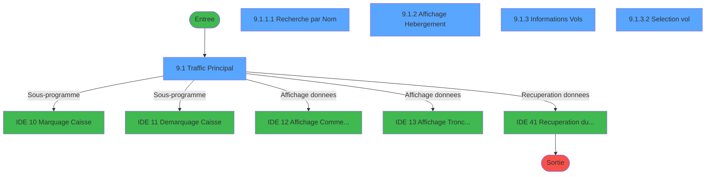
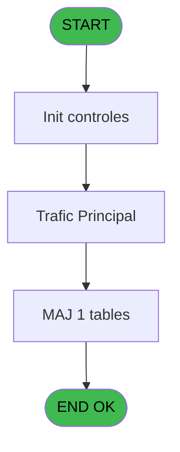
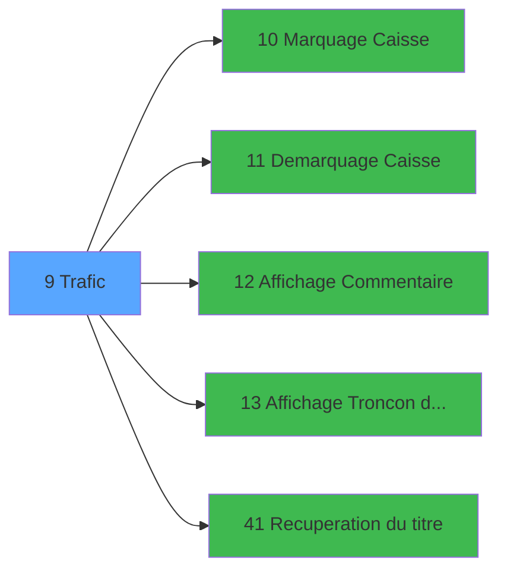

# PTR IDE 9 - Trafic

> **Analyse**: Phases 1-4 2026-02-03 18:10 -> 18:11 (18s) | Assemblage 18:11
> **Pipeline**: V7.2 Enrichi
> **Structure**: 4 onglets (Resume | Ecrans | Donnees | Connexions)

<!-- TAB:Resume -->

## 1. FICHE D'IDENTITE

| Attribut | Valeur |
|----------|--------|
| Projet | PTR |
| IDE Position | 9 |
| Nom Programme | Trafic |
| Fichier source | `Prg_9.xml` |
| Dossier IDE | Gestion |
| Taches | 8 (5 ecrans visibles) |
| Tables modifiees | 1 |
| Programmes appeles | 5 |
| :warning: Statut | **ORPHELIN_POTENTIEL** |

## 2. DESCRIPTION FONCTIONNELLE

**Trafic** assure la gestion complete de ce processus.

Le flux de traitement s'organise en **2 blocs fonctionnels** :

- **Traitement** (5 taches) : traitements metier divers
- **Consultation** (3 taches) : ecrans de recherche, selection et consultation

**Donnees modifiees** : 1 tables en ecriture (voyages__________voy).

**Logique metier** : 2 regles identifiees couvrant valeurs par defaut.

Detail : phases du traitement

#### Phase 1 : Traitement (5 taches)

- **9** - (sans nom)
- **9.1** - Traffic Principal **[[ECRAN]](#ecran-t2)**
- **9.1.1** - (sans nom) **[[ECRAN]](#ecran-t3)**
- **9.1.3** - Informations Vols **[[ECRAN]](#ecran-t6)**
- **9.1.3.1** - Suppression **[[ECRAN]](#ecran-t8)**

Delegue a : [   Marquage Caisse (IDE 10)](PTR-IDE-10.md), [   Demarquage Caisse (IDE 11)](PTR-IDE-11.md), [Recuperation du titre (IDE 41)](PTR-IDE-41.md)

#### Phase 2 : Consultation (3 taches)

- **9.1.1.1** - Recherche par Nom **[[ECRAN]](#ecran-t4)**
- **9.1.2** - Affichage Hebergement **[[ECRAN]](#ecran-t5)**
- **9.1.3.2** - Selection vol **[[ECRAN]](#ecran-t14)**

Delegue a : [Affichage Commentaire (IDE 12)](PTR-IDE-12.md), [Affichage Troncon du Dossier (IDE 13)](PTR-IDE-13.md), [Recuperation du titre (IDE 41)](PTR-IDE-41.md)

#### Tables impactees

| Table | Operations | Role metier |
|-------|-----------|-------------|
| voyages__________voy | **W**/L (2 usages) |  |

## 3. BLOCS FONCTIONNELS

### 3.1 Traitement (5 taches)

Traitements internes.

---

#### 9 - (sans nom)

**Role** : Traitement interne.

4 sous-taches directes

| Tache | Nom | Bloc |
|-------|-----|------|
| [9.1](#t2) | Traffic Principal **[[ECRAN]](#ecran-t2)** | Traitement |
| [9.1.1](#t3) | (sans nom) **[[ECRAN]](#ecran-t3)** | Traitement |
| [9.1.3](#t6) | Informations Vols **[[ECRAN]](#ecran-t6)** | Traitement |
| [9.1.3.1](#t8) | Suppression **[[ECRAN]](#ecran-t8)** | Traitement |

**Delegue a** : [   Marquage Caisse (IDE 10)](PTR-IDE-10.md), [   Demarquage Caisse (IDE 11)](PTR-IDE-11.md), [Recuperation du titre (IDE 41)](PTR-IDE-41.md)

---

#### 9.1 - Traffic Principal [[ECRAN]](#ecran-t2)

**Role** : Traitement : Traffic Principal.
**Ecran** : 1264 x 297 DLU (MDI) | [Voir mockup](#ecran-t2)
**Delegue a** : [   Marquage Caisse (IDE 10)](PTR-IDE-10.md), [   Demarquage Caisse (IDE 11)](PTR-IDE-11.md), [Recuperation du titre (IDE 41)](PTR-IDE-41.md)

---

#### 9.1.1 - (sans nom) [[ECRAN]](#ecran-t3)

**Role** : Traitement interne.
**Ecran** : 240 x 8 DLU (MDI) | [Voir mockup](#ecran-t3)
**Delegue a** : [   Marquage Caisse (IDE 10)](PTR-IDE-10.md), [   Demarquage Caisse (IDE 11)](PTR-IDE-11.md), [Recuperation du titre (IDE 41)](PTR-IDE-41.md)

---

#### 9.1.3 - Informations Vols [[ECRAN]](#ecran-t6)

**Role** : Selection par l'operateur : Informations Vols.
**Ecran** : 763 x 105 DLU (Modal) | [Voir mockup](#ecran-t6)
**Variables liees** : BD (W1-Mode Info Vols)
**Delegue a** : [   Marquage Caisse (IDE 10)](PTR-IDE-10.md), [   Demarquage Caisse (IDE 11)](PTR-IDE-11.md), [Recuperation du titre (IDE 41)](PTR-IDE-41.md)

---

#### 9.1.3.1 - Suppression [[ECRAN]](#ecran-t8)

**Role** : Traitement : Suppression.
**Ecran** : 104 x 32 DLU (MDI) | [Voir mockup](#ecran-t8)
**Delegue a** : [   Marquage Caisse (IDE 10)](PTR-IDE-10.md), [   Demarquage Caisse (IDE 11)](PTR-IDE-11.md), [Recuperation du titre (IDE 41)](PTR-IDE-41.md)

### 3.2 Consultation (3 taches)

Ecrans de recherche et consultation.

---

#### 9.1.1.1 - Recherche par Nom [[ECRAN]](#ecran-t4)

**Role** : Traitement : Recherche par Nom.
**Ecran** : 506 x 94 DLU (MDI) | [Voir mockup](#ecran-t4)
**Delegue a** : [Affichage Commentaire (IDE 12)](PTR-IDE-12.md), [Affichage Troncon du Dossier (IDE 13)](PTR-IDE-13.md)

---

#### 9.1.2 - Affichage Hebergement [[ECRAN]](#ecran-t5)

**Role** : Reinitialisation : Affichage Hebergement.
**Ecran** : 759 x 65 DLU (Modal) | [Voir mockup](#ecran-t5)
**Delegue a** : [Affichage Commentaire (IDE 12)](PTR-IDE-12.md), [Affichage Troncon du Dossier (IDE 13)](PTR-IDE-13.md)

---

#### 9.1.3.2 - Selection vol [[ECRAN]](#ecran-t14)

**Role** : Selection par l'operateur : Selection vol.
**Ecran** : 620 x 239 DLU | [Voir mockup](#ecran-t14)
**Delegue a** : [Affichage Commentaire (IDE 12)](PTR-IDE-12.md), [Affichage Troncon du Dossier (IDE 13)](PTR-IDE-13.md)

## 5. REGLES METIER

2 regles identifiees:

### Autres (2 regles)

#### [RM-001] Valeur par defaut si GetParam ('SOCIETE') est vide

| Element | Detail |
|---------|--------|
| **Condition** | `GetParam ('SOCIETE')=''` |
| **Si vrai** | 'C' |
| **Si faux** | GetParam ('SOCIETE')) |
| **Expression source** | Expression 6 : `IF (GetParam ('SOCIETE')='','C',GetParam ('SOCIETE'))` |
| **Exemple** | Si GetParam ('SOCIETE')='' → 'C'. Sinon → GetParam ('SOCIETE')) |

#### [RM-002] Valeur par defaut si GetParam ('LANGUE') est vide

| Element | Detail |
|---------|--------|
| **Condition** | `GetParam ('LANGUE')=''` |
| **Si vrai** | 'F' |
| **Si faux** | GetParam ('LANGUE')) |
| **Expression source** | Expression 7 : `IF (GetParam ('LANGUE')='','F',GetParam ('LANGUE'))` |
| **Exemple** | Si GetParam ('LANGUE')='' → 'F'. Sinon → GetParam ('LANGUE')) |

## 6. CONTEXTE

- **Appele par**: (aucun)
- **Appelle**: 5 programmes | **Tables**: 13 (W:1 R:2 L:13) | **Taches**: 8 | **Expressions**: 13

<!-- TAB:Ecrans -->

## 8. ECRANS

### 8.1 Forms visibles (5 / 8)

| # | Position | Tache | Nom | Type | Largeur | Hauteur | Bloc |
|---|----------|-------|-----|------|---------|---------|------|
| 1 | 9.1 | 9.1 | Traffic Principal | MDI | 1264 | 297 | Traitement |
| 2 | 9.1.1.1 | 9.1.1.1 | Recherche par Nom | MDI | 506 | 94 | Consultation |
| 3 | 9.1.2 | 9.1.2 | Affichage Hebergement | Modal | 759 | 65 | Consultation |
| 4 | 9.1.3 | 9.1.3 | Informations Vols | Modal | 763 | 105 | Traitement |
| 5 | 9.1.3.2 | 9.1.3.2 | Selection vol | Type0 | 620 | 239 | Consultation |

### 8.2 Mockups Ecrans

---

#### 9.1 - Traffic Principal
**Tache** : [9.1](#t2) | **Type** : MDI | **Dimensions** : 1264 x 297 DLU
**Bloc** : Traitement | **Titre IDE** : Traffic Principal

<!-- FORM-DATA:
{
    "width":  1264,
    "vFactor":  8,
    "type":  "MDI",
    "hFactor":  8,
    "controls":  [
                     {
                         "x":  4,
                         "type":  "label",
                         "var":  "",
                         "y":  1,
                         "w":  1255,
                         "fmt":  "",
                         "name":  "",
                         "h":  20,
                         "color":  "1",
                         "text":  "",
                         "parent":  null
                     },
                     {
                         "x":  477,
                         "type":  "label",
                         "var":  "",
                         "y":  31,
                         "w":  776,
                         "fmt":  "",
                         "name":  "",
                         "h":  110,
                         "color":  "151",
                         "text":  "Identification",
                         "parent":  null
                     },
                     {
                         "x":  6,
                         "type":  "table",
                         "var":  "",
                         "name":  "",
                         "titleH":  13,
                         "color":  "110",
                         "w":  466,
                         "y":  32,
                         "fmt":  "",
                         "parent":  null,
                         "text":  "",
                         "rowH":  14,
                         "h":  227,
                         "cols":  [
                                      {
                                          "title":  "Civilité",
                                          "layer":  1,
                                          "w":  77
                                      },
                                      {
                                          "title":  "Nom",
                                          "layer":  2,
                                          "w":  210
                                      },
                                      {
                                          "title":  "Prénom",
                                          "layer":  3,
                                          "w":  145
                                      }
                                  ],
                         "rows":  3
                     },
                     {
                         "x":  491,
                         "type":  "label",
                         "var":  "",
                         "y":  51,
                         "w":  154,
                         "fmt":  "",
                         "name":  "",
                         "h":  10,
                         "color":  "178",
                         "text":  "Date de naissance",
                         "parent":  4
                     },
                     {
                         "x":  854,
                         "type":  "label",
                         "var":  "",
                         "y":  51,
                         "w":  38,
                         "fmt":  "",
                         "name":  "",
                         "h":  10,
                         "color":  "178",
                         "text":  "Age",
                         "parent":  4
                     },
                     {
                         "x":  491,
                         "type":  "label",
                         "var":  "",
                         "y":  62,
                         "w":  154,
                         "fmt":  "",
                         "name":  "",
                         "h":  10,
                         "color":  "178",
                         "text":  "Dossier",
                         "parent":  4
                     },
                     {
                         "x":  854,
                         "type":  "label",
                         "var":  "",
                         "y":  62,
                         "w":  88,
                         "fmt":  "",
                         "name":  "",
                         "h":  10,
                         "color":  "178",
                         "text":  "Nationalité",
                         "parent":  4
                     },
                     {
                         "x":  477,
                         "type":  "label",
                         "var":  "",
                         "y":  144,
                         "w":  776,
                         "fmt":  "",
                         "name":  "",
                         "h":  116,
                         "color":  "151",
                         "text":  "Vols",
                         "parent":  null
                     },
                     {
                         "x":  2,
                         "type":  "label",
                         "var":  "",
                         "y":  270,
                         "w":  1259,
                         "fmt":  "",
                         "name":  "",
                         "h":  24,
                         "color":  "1",
                         "text":  "",
                         "parent":  null
                     },
                     {
                         "x":  93,
                         "type":  "edit",
                         "var":  "",
                         "y":  49,
                         "w":  176,
                         "fmt":  "",
                         "name":  "VAL Nom",
                         "h":  8,
                         "color":  "110",
                         "text":  "",
                         "parent":  5
                     },
                     {
                         "x":  301,
                         "type":  "edit",
                         "var":  "",
                         "y":  49,
                         "w":  120,
                         "fmt":  "",
                         "name":  "VAL Prenom",
                         "h":  8,
                         "color":  "110",
                         "text":  "",
                         "parent":  5
                     },
                     {
                         "x":  49,
                         "type":  "edit",
                         "var":  "",
                         "y":  49,
                         "w":  30,
                         "fmt":  "",
                         "name":  "",
                         "h":  8,
                         "color":  "110",
                         "text":  "",
                         "parent":  5
                     },
                     {
                         "x":  659,
                         "type":  "edit",
                         "var":  "",
                         "y":  51,
                         "w":  126,
                         "fmt":  "DD/MM/YYYYZ",
                         "name":  "",
                         "h":  10,
                         "color":  "178",
                         "text":  "",
                         "parent":  4
                     },
                     {
                         "x":  920,
                         "type":  "edit",
                         "var":  "",
                         "y":  51,
                         "w":  37,
                         "fmt":  "",
                         "name":  "",
                         "h":  10,
                         "color":  "178",
                         "text":  "",
                         "parent":  4
                     },
                     {
                         "x":  957,
                         "type":  "edit",
                         "var":  "",
                         "y":  62,
                         "w":  37,
                         "fmt":  "",
                         "name":  "",
                         "h":  10,
                         "color":  "178",
                         "text":  "",
                         "parent":  4
                     },
                     {
                         "x":  15,
                         "type":  "edit",
                         "var":  "",
                         "y":  7,
                         "w":  267,
                         "fmt":  "30",
                         "name":  "",
                         "h":  8,
                         "color":  "",
                         "text":  "",
                         "parent":  null
                     },
                     {
                         "x":  1051,
                         "type":  "edit",
                         "var":  "",
                         "y":  7,
                         "w":  203,
                         "fmt":  "WWW DD MMM YYYYT",
                         "name":  "",
                         "h":  8,
                         "color":  "",
                         "text":  "",
                         "parent":  null
                     },
                     {
                         "x":  1080,
                         "type":  "edit",
                         "var":  "",
                         "y":  40,
                         "w":  154,
                         "fmt":  "10",
                         "name":  "",
                         "h":  10,
                         "color":  "164",
                         "text":  "",
                         "parent":  4
                     },
                     {
                         "x":  491,
                         "type":  "edit",
                         "var":  "",
                         "y":  40,
                         "w":  587,
                         "fmt":  "80",
                         "name":  "",
                         "h":  10,
                         "color":  "7",
                         "text":  "",
                         "parent":  4
                     },
                     {
                         "x":  659,
                         "type":  "edit",
                         "var":  "",
                         "y":  62,
                         "w":  182,
                         "fmt":  "15",
                         "name":  "",
                         "h":  10,
                         "color":  "178",
                         "text":  "",
                         "parent":  4
                     },
                     {
                         "x":  9,
                         "type":  "button",
                         "var":  "",
                         "y":  273,
                         "w":  154,
                         "fmt":  "\u0026Quitter",
                         "name":  "",
                         "h":  18,
                         "color":  "",
                         "text":  "",
                         "parent":  23
                     },
                     {
                         "x":  613,
                         "type":  "button",
                         "var":  "",
                         "y":  273,
                         "w":  154,
                         "fmt":  "\u0026Rechercher",
                         "name":  "",
                         "h":  18,
                         "color":  "",
                         "text":  "",
                         "parent":  23
                     },
                     {
                         "x":  774,
                         "type":  "button",
                         "var":  "",
                         "y":  273,
                         "w":  154,
                         "fmt":  "\u0026Modification",
                         "name":  "W1-Mode Info Vols",
                         "h":  18,
                         "color":  "",
                         "text":  "",
                         "parent":  23
                     },
                     {
                         "x":  935,
                         "type":  "button",
                         "var":  "",
                         "y":  273,
                         "w":  154,
                         "fmt":  "\u0026Observations",
                         "name":  "",
                         "h":  18,
                         "color":  "",
                         "text":  "",
                         "parent":  23
                     },
                     {
                         "x":  1096,
                         "type":  "button",
                         "var":  "",
                         "y":  273,
                         "w":  154,
                         "fmt":  "\u0026Voir",
                         "name":  "",
                         "h":  18,
                         "color":  "",
                         "text":  "",
                         "parent":  23
                     },
                     {
                         "x":  487,
                         "type":  "subform",
                         "var":  "",
                         "y":  153,
                         "w":  761,
                         "fmt":  "",
                         "name":  "Affichage Info Vols",
                         "h":  105,
                         "color":  "",
                         "text":  "",
                         "parent":  22
                     },
                     {
                         "x":  12,
                         "type":  "image",
                         "var":  "",
                         "y":  48,
                         "w":  30,
                         "fmt":  "",
                         "name":  "",
                         "h":  11,
                         "color":  "",
                         "text":  "",
                         "parent":  5
                     }
                 ],
    "taskId":  "9.1",
    "height":  297
}
-->

<strong>Champs : 11 champs</strong>

| Pos (x,y) | Nom | Variable | Type |
|-----------|-----|----------|------|
| 93,49 | VAL Nom | - | edit |
| 301,49 | VAL Prenom | - | edit |
| 49,49 | (sans nom) | - | edit |
| 659,51 | DD/MM/YYYYZ | - | edit |
| 920,51 | (sans nom) | - | edit |
| 957,62 | (sans nom) | - | edit |
| 15,7 | 30 | - | edit |
| 1051,7 | WWW DD MMM YYYYT | - | edit |
| 1080,40 | 10 | - | edit |
| 491,40 | 80 | - | edit |
| 659,62 | 15 | - | edit |

<strong>Boutons : 5 boutons</strong>

| Bouton | Pos (x,y) | Action |
|--------|-----------|--------|
| Quitter | 9,273 | Quitte le programme |
| Rechercher | 613,273 | Ouvre la selection |
| Modification | 774,273 | Modifie l'element |
| Observations | 935,273 | Bouton fonctionnel |
| Voir | 1096,273 | Bouton fonctionnel |

---

#### 9.1.1.1 - Recherche par Nom
**Tache** : [9.1.1.1](#t4) | **Type** : MDI | **Dimensions** : 506 x 94 DLU
**Bloc** : Consultation | **Titre IDE** : Recherche par Nom

<!-- FORM-DATA:
{
    "width":  506,
    "vFactor":  8,
    "type":  "MDI",
    "hFactor":  8,
    "controls":  [
                     {
                         "x":  171,
                         "type":  "label",
                         "var":  "",
                         "y":  19,
                         "w":  325,
                         "fmt":  "",
                         "name":  "",
                         "h":  32,
                         "color":  "1",
                         "text":  "",
                         "parent":  null
                     },
                     {
                         "x":  192,
                         "type":  "label",
                         "var":  "",
                         "y":  30,
                         "w":  93,
                         "fmt":  "",
                         "name":  "",
                         "h":  10,
                         "color":  "",
                         "text":  "Recherche",
                         "parent":  2
                     },
                     {
                         "x":  1,
                         "type":  "label",
                         "var":  "",
                         "y":  69,
                         "w":  499,
                         "fmt":  "",
                         "name":  "",
                         "h":  23,
                         "color":  "1",
                         "text":  "",
                         "parent":  null
                     },
                     {
                         "x":  294,
                         "type":  "edit",
                         "var":  "",
                         "y":  30,
                         "w":  182,
                         "fmt":  "",
                         "name":  "",
                         "h":  10,
                         "color":  "110",
                         "text":  "",
                         "parent":  2
                     },
                     {
                         "x":  10,
                         "type":  "button",
                         "var":  "",
                         "y":  72,
                         "w":  154,
                         "fmt":  "\u0026Quitter",
                         "name":  "",
                         "h":  18,
                         "color":  "",
                         "text":  "",
                         "parent":  5
                     },
                     {
                         "x":  339,
                         "type":  "button",
                         "var":  "",
                         "y":  72,
                         "w":  154,
                         "fmt":  "\u0026OK",
                         "name":  "",
                         "h":  18,
                         "color":  "",
                         "text":  "",
                         "parent":  5
                     },
                     {
                         "x":  14,
                         "type":  "image",
                         "var":  "",
                         "y":  6,
                         "w":  146,
                         "fmt":  "",
                         "name":  "",
                         "h":  58,
                         "color":  "7",
                         "text":  "",
                         "parent":  null
                     }
                 ],
    "taskId":  "9.1.1.1",
    "height":  94
}
-->

<strong>Champs : 1 champs</strong>

| Pos (x,y) | Nom | Variable | Type |
|-----------|-----|----------|------|
| 294,30 | (sans nom) | - | edit |

<strong>Boutons : 2 boutons</strong>

| Bouton | Pos (x,y) | Action |
|--------|-----------|--------|
| Quitter | 10,72 | Quitte le programme |
| OK | 339,72 | Valide la saisie et enregistre |

---

#### 9.1.2 - Affichage Hebergement
**Tache** : [9.1.2](#t5) | **Type** : Modal | **Dimensions** : 759 x 65 DLU
**Bloc** : Consultation | **Titre IDE** : Affichage Hebergement

<!-- FORM-DATA:
{
    "width":  759,
    "vFactor":  8,
    "type":  "Modal",
    "hFactor":  8,
    "controls":  [
                     {
                         "x":  0,
                         "type":  "table",
                         "var":  "",
                         "name":  "",
                         "titleH":  12,
                         "color":  "110",
                         "w":  758,
                         "y":  2,
                         "fmt":  "",
                         "parent":  null,
                         "text":  "",
                         "rowH":  12,
                         "h":  60,
                         "cols":  [
                                      {
                                          "title":  "Type",
                                          "layer":  1,
                                          "w":  150
                                      },
                                      {
                                          "title":  "Arrivée",
                                          "layer":  2,
                                          "w":  186
                                      },
                                      {
                                          "title":  "Départ",
                                          "layer":  3,
                                          "w":  191
                                      },
                                      {
                                          "title":  "Qualité",
                                          "layer":  4,
                                          "w":  136
                                      },
                                      {
                                          "title":  "Log.",
                                          "layer":  5,
                                          "w":  87
                                      }
                                  ],
                         "rows":  5
                     },
                     {
                         "x":  11,
                         "type":  "edit",
                         "var":  "",
                         "y":  17,
                         "w":  131,
                         "fmt":  "11",
                         "name":  "",
                         "h":  8,
                         "color":  "110",
                         "text":  "",
                         "parent":  1
                     },
                     {
                         "x":  163,
                         "type":  "edit",
                         "var":  "",
                         "y":  17,
                         "w":  120,
                         "fmt":  "DD/MM/YYYYZ",
                         "name":  "",
                         "h":  8,
                         "color":  "110",
                         "text":  "",
                         "parent":  1
                     },
                     {
                         "x":  298,
                         "type":  "edit",
                         "var":  "",
                         "y":  17,
                         "w":  30,
                         "fmt":  "",
                         "name":  "",
                         "h":  8,
                         "color":  "110",
                         "text":  "",
                         "parent":  1
                     },
                     {
                         "x":  346,
                         "type":  "edit",
                         "var":  "",
                         "y":  17,
                         "w":  120,
                         "fmt":  "DD/MM/YYYYZ",
                         "name":  "",
                         "h":  8,
                         "color":  "110",
                         "text":  "",
                         "parent":  1
                     },
                     {
                         "x":  486,
                         "type":  "edit",
                         "var":  "",
                         "y":  17,
                         "w":  30,
                         "fmt":  "",
                         "name":  "",
                         "h":  8,
                         "color":  "110",
                         "text":  "",
                         "parent":  1
                     },
                     {
                         "x":  541,
                         "type":  "edit",
                         "var":  "",
                         "y":  17,
                         "w":  42,
                         "fmt":  "U3",
                         "name":  "",
                         "h":  8,
                         "color":  "110",
                         "text":  "",
                         "parent":  1
                     },
                     {
                         "x":  602,
                         "type":  "edit",
                         "var":  "",
                         "y":  17,
                         "w":  53,
                         "fmt":  "",
                         "name":  "",
                         "h":  8,
                         "color":  "110",
                         "text":  "",
                         "parent":  1
                     },
                     {
                         "x":  672,
                         "type":  "edit",
                         "var":  "",
                         "y":  17,
                         "w":  75,
                         "fmt":  "",
                         "name":  "",
                         "h":  8,
                         "color":  "110",
                         "text":  "",
                         "parent":  1
                     }
                 ],
    "taskId":  "9.1.2",
    "height":  65
}
-->

<strong>Champs : 8 champs</strong>

| Pos (x,y) | Nom | Variable | Type |
|-----------|-----|----------|------|
| 11,17 | 11 | - | edit |
| 163,17 | DD/MM/YYYYZ | - | edit |
| 298,17 | (sans nom) | - | edit |
| 346,17 | DD/MM/YYYYZ | - | edit |
| 486,17 | (sans nom) | - | edit |
| 541,17 | U3 | - | edit |
| 602,17 | (sans nom) | - | edit |
| 672,17 | (sans nom) | - | edit |

---

#### 9.1.3 - Informations Vols
**Tache** : [9.1.3](#t6) | **Type** : Modal | **Dimensions** : 763 x 105 DLU
**Bloc** : Traitement | **Titre IDE** : Informations Vols

<!-- FORM-DATA:
{
    "width":  763,
    "vFactor":  8,
    "type":  "Modal",
    "hFactor":  8,
    "controls":  [
                     {
                         "x":  0,
                         "type":  "table",
                         "var":  "",
                         "name":  "",
                         "titleH":  12,
                         "color":  "110",
                         "w":  760,
                         "y":  0,
                         "fmt":  "",
                         "parent":  null,
                         "text":  "",
                         "rowH":  14,
                         "h":  82,
                         "cols":  [
                                      {
                                          "title":  "Type",
                                          "layer":  1,
                                          "w":  174
                                      },
                                      {
                                          "title":  "Type Vol",
                                          "layer":  2,
                                          "w":  171
                                      },
                                      {
                                          "title":  "Vol",
                                          "layer":  3,
                                          "w":  140
                                      },
                                      {
                                          "title":  "Aéroport",
                                          "layer":  4,
                                          "w":  268
                                      }
                                  ],
                         "rows":  4
                     },
                     {
                         "x":  22,
                         "type":  "combobox",
                         "var":  "",
                         "y":  15,
                         "w":  136,
                         "fmt":  "",
                         "name":  "VOY Code A/D/R",
                         "h":  12,
                         "color":  "110",
                         "text":  "Aller,Retour",
                         "parent":  1
                     },
                     {
                         "x":  384,
                         "type":  "edit",
                         "var":  "",
                         "y":  17,
                         "w":  67,
                         "fmt":  "",
                         "name":  "",
                         "h":  8,
                         "color":  "110",
                         "text":  "",
                         "parent":  1
                     },
                     {
                         "x":  502,
                         "type":  "edit",
                         "var":  "",
                         "y":  17,
                         "w":  120,
                         "fmt":  "DD/MM/YYYYZ",
                         "name":  "",
                         "h":  8,
                         "color":  "110",
                         "text":  "",
                         "parent":  1
                     },
                     {
                         "x":  660,
                         "type":  "edit",
                         "var":  "",
                         "y":  17,
                         "w":  64,
                         "fmt":  "HH:MMZ",
                         "name":  "",
                         "h":  8,
                         "color":  "110",
                         "text":  "",
                         "parent":  1
                     },
                     {
                         "x":  195,
                         "type":  "edit",
                         "var":  "",
                         "y":  17,
                         "w":  144,
                         "fmt":  "UX13",
                         "name":  "tro_compagnie",
                         "h":  8,
                         "color":  "110",
                         "text":  "",
                         "parent":  1
                     },
                     {
                         "x":  453,
                         "type":  "button",
                         "var":  "",
                         "y":  16,
                         "w":  26,
                         "fmt":  "ò",
                         "name":  "",
                         "h":  11,
                         "color":  "",
                         "text":  "",
                         "parent":  1
                     },
                     {
                         "x":  5,
                         "type":  "button",
                         "var":  "",
                         "y":  88,
                         "w":  154,
                         "fmt":  "\u0026Quitter",
                         "name":  "",
                         "h":  14,
                         "color":  "",
                         "text":  "",
                         "parent":  null
                     },
                     {
                         "x":  168,
                         "type":  "button",
                         "var":  "",
                         "y":  88,
                         "w":  154,
                         "fmt":  "\u0026Annuler",
                         "name":  "",
                         "h":  14,
                         "color":  "",
                         "text":  "",
                         "parent":  null
                     },
                     {
                         "x":  434,
                         "type":  "button",
                         "var":  "",
                         "y":  88,
                         "w":  154,
                         "fmt":  "\u0026Création",
                         "name":  "",
                         "h":  14,
                         "color":  "",
                         "text":  "",
                         "parent":  null
                     },
                     {
                         "x":  598,
                         "type":  "button",
                         "var":  "",
                         "y":  88,
                         "w":  154,
                         "fmt":  "\u0026Supprimer",
                         "name":  "",
                         "h":  14,
                         "color":  "",
                         "text":  "",
                         "parent":  null
                     },
                     {
                         "x":  351,
                         "type":  "edit",
                         "var":  "",
                         "y":  17,
                         "w":  27,
                         "fmt":  "U9",
                         "name":  "",
                         "h":  8,
                         "color":  "110",
                         "text":  "",
                         "parent":  1
                     }
                 ],
    "taskId":  "9.1.3",
    "height":  105
}
-->

<strong>Champs : 6 champs</strong>

| Pos (x,y) | Nom | Variable | Type |
|-----------|-----|----------|------|
| 22,15 | VOY Code A/D/R | - | combobox |
| 384,17 | (sans nom) | - | edit |
| 502,17 | DD/MM/YYYYZ | - | edit |
| 660,17 | HH:MMZ | - | edit |
| 195,17 | tro_compagnie | - | edit |
| 351,17 | U9 | - | edit |

<strong>Boutons : 5 boutons</strong>

| Bouton | Pos (x,y) | Action |
|--------|-----------|--------|
| ò | 453,16 | Bouton fonctionnel |
| Quitter | 5,88 | Quitte le programme |
| Annuler | 168,88 | Annule et retour au menu |
| Création | 434,88 | Bouton fonctionnel |
| Supprimer | 598,88 | Supprime l'element selectionne |

---

#### 9.1.3.2 - Selection vol
**Tache** : [9.1.3.2](#t14) | **Type** : Type0 | **Dimensions** : 620 x 239 DLU
**Bloc** : Consultation | **Titre IDE** : Selection vol

<!-- FORM-DATA:
{
    "width":  620,
    "vFactor":  8,
    "type":  "Type0",
    "hFactor":  8,
    "controls":  [
                     {
                         "x":  13,
                         "type":  "table",
                         "var":  "",
                         "name":  "",
                         "titleH":  12,
                         "color":  "196",
                         "w":  595,
                         "y":  5,
                         "fmt":  "",
                         "parent":  null,
                         "text":  "",
                         "rowH":  13,
                         "h":  184,
                         "cols":  [
                                      {
                                          "title":  "Date",
                                          "layer":  1,
                                          "w":  136
                                      },
                                      {
                                          "title":  "Heure",
                                          "layer":  2,
                                          "w":  74
                                      },
                                      {
                                          "title":  "Vol",
                                          "layer":  3,
                                          "w":  141
                                      },
                                      {
                                          "title":  "Ville",
                                          "layer":  4,
                                          "w":  86
                                      },
                                      {
                                          "title":  "Transport",
                                          "layer":  5,
                                          "w":  124
                                      }
                                  ],
                         "rows":  5
                     },
                     {
                         "x":  13,
                         "type":  "label",
                         "var":  "",
                         "y":  213,
                         "w":  595,
                         "fmt":  "",
                         "name":  "",
                         "h":  24,
                         "color":  "1",
                         "text":  "",
                         "parent":  null
                     },
                     {
                         "x":  21,
                         "type":  "edit",
                         "var":  "",
                         "y":  20,
                         "w":  122,
                         "fmt":  "DD/MM/YYYYZ",
                         "name":  "vot_date",
                         "h":  10,
                         "color":  "",
                         "text":  "",
                         "parent":  20
                     },
                     {
                         "x":  157,
                         "type":  "edit",
                         "var":  "",
                         "y":  20,
                         "w":  66,
                         "fmt":  "",
                         "name":  "vot_heure",
                         "h":  10,
                         "color":  "",
                         "text":  "",
                         "parent":  20
                     },
                     {
                         "x":  232,
                         "type":  "edit",
                         "var":  "",
                         "y":  20,
                         "w":  40,
                         "fmt":  "",
                         "name":  "vot_compagnie",
                         "h":  10,
                         "color":  "",
                         "text":  "",
                         "parent":  20
                     },
                     {
                         "x":  283,
                         "type":  "edit",
                         "var":  "",
                         "y":  20,
                         "w":  82,
                         "fmt":  "",
                         "name":  "vot_code_vol",
                         "h":  10,
                         "color":  "",
                         "text":  "",
                         "parent":  20
                     },
                     {
                         "x":  372,
                         "type":  "edit",
                         "var":  "",
                         "y":  20,
                         "w":  74,
                         "fmt":  "",
                         "name":  "vot_ville",
                         "h":  10,
                         "color":  "",
                         "text":  "",
                         "parent":  20
                     },
                     {
                         "x":  456,
                         "type":  "edit",
                         "var":  "",
                         "y":  20,
                         "w":  120,
                         "fmt":  "",
                         "name":  "libelle_trente (200)",
                         "h":  10,
                         "color":  "",
                         "text":  "",
                         "parent":  20
                     },
                     {
                         "x":  271,
                         "type":  "image",
                         "var":  "",
                         "y":  192,
                         "w":  64,
                         "fmt":  "",
                         "name":  "",
                         "h":  20,
                         "color":  "",
                         "text":  "",
                         "parent":  null
                     },
                     {
                         "x":  26,
                         "type":  "button",
                         "var":  "",
                         "y":  216,
                         "w":  154,
                         "fmt":  "\u0026Sélectionner",
                         "name":  "",
                         "h":  18,
                         "color":  "",
                         "text":  "",
                         "parent":  null
                     },
                     {
                         "x":  442,
                         "type":  "button",
                         "var":  "",
                         "y":  216,
                         "w":  154,
                         "fmt":  "\u0026Abandonner",
                         "name":  "",
                         "h":  18,
                         "color":  "",
                         "text":  "",
                         "parent":  null
                     }
                 ],
    "taskId":  "9.1.3.2",
    "height":  239
}
-->

<strong>Champs : 6 champs</strong>

| Pos (x,y) | Nom | Variable | Type |
|-----------|-----|----------|------|
| 21,20 | vot_date | - | edit |
| 157,20 | vot_heure | - | edit |
| 232,20 | vot_compagnie | - | edit |
| 283,20 | vot_code_vol | - | edit |
| 372,20 | vot_ville | - | edit |
| 456,20 | libelle_trente (200) | - | edit |

<strong>Boutons : 2 boutons</strong>

| Bouton | Pos (x,y) | Action |
|--------|-----------|--------|
| Sélectionner | 26,216 | Bouton fonctionnel |
| Abandonner | 442,216 | Annule et retour au menu |

## 9. NAVIGATION

### 9.1 Enchainement des ecrans

**Detail par enchainement :**

| Depuis | Action | Vers | Retour |
|--------|--------|------|--------|
| Traffic Principal | Sous-programme | [   Marquage Caisse (IDE 10)](PTR-IDE-10.md) | Retour ecran |
| Traffic Principal | Sous-programme | [   Demarquage Caisse (IDE 11)](PTR-IDE-11.md) | Retour ecran |
| Traffic Principal | Affichage donnees | [Affichage Commentaire (IDE 12)](PTR-IDE-12.md) | Retour ecran |
| Traffic Principal | Affichage donnees | [Affichage Troncon du Dossier (IDE 13)](PTR-IDE-13.md) | Retour ecran |
| Traffic Principal | Recuperation donnees | [Recuperation du titre (IDE 41)](PTR-IDE-41.md) | Retour ecran |

### 9.3 Structure hierarchique (8 taches)

| Position | Tache | Type | Dimensions | Bloc |
|----------|-------|------|------------|------|
| **9.1** | [**(sans nom)** (9)](#t1) | MDI | - | Traitement |
| 9.1.1 | [Traffic Principal (9.1)](#t2) [mockup](#ecran-t2) | MDI | 1264x297 | |
| 9.1.2 | [(sans nom) (9.1.1)](#t3) [mockup](#ecran-t3) | MDI | 240x8 | |
| 9.1.3 | [Informations Vols (9.1.3)](#t6) [mockup](#ecran-t6) | Modal | 763x105 | |
| 9.1.4 | [Suppression (9.1.3.1)](#t8) [mockup](#ecran-t8) | MDI | 104x32 | |
| **9.2** | [**Recherche par Nom** (9.1.1.1)](#t4) [mockup](#ecran-t4) | MDI | 506x94 | Consultation |
| 9.2.1 | [Affichage Hebergement (9.1.2)](#t5) [mockup](#ecran-t5) | Modal | 759x65 | |
| 9.2.2 | [Selection vol (9.1.3.2)](#t14) [mockup](#ecran-t14) | - | 620x239 | |

### 9.4 Algorigramme

> **Legende**: Vert = START/END OK | Rouge = END KO | Bleu = Decisions
> *Algorigramme auto-genere. Utiliser `/algorigramme` pour une synthese metier detaillee.*

<!-- TAB:Donnees -->

## 10. TABLES

### Tables utilisees (13)

| ID | Nom | Description | Type | R | W | L | Usages |
|----|-----|-------------|------|---|---|---|--------|
| 29 | voyages__________voy |  | DB |   | **W** | L | 2 |
| 30 | gm-recherche_____gmr | Index de recherche | DB |   |   | L | 1 |
| 31 | gm-complet_______gmc |  | DB |   |   | L | 1 |
| 34 | hebergement______heb | Hebergement (chambres) | DB | R |   | L | 3 |
| 47 | compte_gm________cgm | Comptes GM (generaux) | DB |   |   | L | 1 |
| 112 | tables_paris |  | DB | R |   | L | 2 |
| 131 | fichier_validation |  | DB |   |   | L | 1 |
| 132 | code_vol_________vot |  | DB |   |   | L | 2 |
| 167 | troncon__________tro |  | DB |   |   | L | 1 |
| 171 | commentaire______com |  | DB |   |   | L | 1 |
| 358 | import_mod |  | DB |   |   | L | 1 |
| 738 | pv_selling_unit |  | DB |   |   | L | 1 |
| 844 | stat_vendeur |  | TMP |   |   | L | 1 |

### Colonnes par table (5 / 3 tables avec colonnes identifiees)

Table 29 - voyages__________voy (**W**/L) - 2 usages

| Lettre | Variable | Acces | Type |
|--------|----------|-------|------|
| A | P_Mode Tache | W | Alpha |
| B | P_numero_compte | W | Numeric |
| C | P_filiation_compte | W | Numeric |
| D | V_Suppression | W | Logical |
| E | v.troncon? | W | Logical |
| F | v.Compagnie | W | Unicode |
| G | CHG_REASON_voy_code_a_d_r | W | Numeric |
| H | CHG_PRV_voy_code_a_d_r | W | Unicode |

Table 34 - hebergement______heb (R/L) - 3 usages

| Lettre | Variable | Acces | Type |
|--------|----------|-------|------|
| A | W1-Choix | R | Alpha |
| B | W1-Lettre Blanche | R | Numeric |
| C | W1-Lettre Noir | R | Numeric |
| D | W1-LettreBlancheInvi | R | Numeric |
| E | W1-LettreNoirInvi | R | Numeric |
| F | W1-(R)echerche | R | Alpha |
| G | W1-R(echerche) | R | Alpha |
| H | W1-(M)odification | R | Alpha |
| I | W1-M(odification) | R | Alpha |
| J | W1-(C)reation | R | Alpha |
| K | W1-C(reation) | R | Alpha |
| L | W1-(S)uppression | R | Alpha |
| M | W1-S(uppression) | R | Alpha |
| N | W1-(c)ommentaire | R | Alpha |
| O | W1-c(O)mmentaire | R | Alpha |
| P | W1-cO(mmentaire) | R | Alpha |
| Q | W1-(V)oir | R | Alpha |
| R | W1-V(oir) | R | Alpha |
| S | W1-Retlien Commentai | R | Numeric |
| T | W1-Voyage Aller | R | Numeric |
| U | W1-Voyage Retour | R | Numeric |
| V | W1-Heb/Cir Aller | R | Numeric |
| W | W1-Heb/Cir Retour | R | Numeric |
| X | W1-Aller (A) | R | Numeric |
| Y | W1-Retour (Z) | R | Numeric |
| Z | W1-Couleur | R | Numeric |
| BA | W1-Libelle | R | Alpha |
| BB | W1-Autorisation | R | Alpha |
| BC | W1-Couleur Ano | R | Numeric |
| BD | W1-Mode Info Vols | R | Unicode |

Table 112 - tables_paris (R/L) - 2 usages

*Table utilisee uniquement en Link ou aucune colonne Real identifiee dans le DataView.*

## 11. VARIABLES

### 11.1 Variables de travail (3)

Variables internes au programme.

| Lettre | Nom | Type | Usage dans |
|--------|-----|------|-----------|
| I | W0 Code T001 | Alpha | - |
| J | W0 Code T002 | Alpha | - |
| K | W0 Code T003 | Alpha | - |

### 11.2 Autres (27)

Variables diverses.

| Lettre | Nom | Type | Usage dans |
|--------|-----|------|-----------|
| A | W0-Code Societe | Alpha | - |
| B | W0-Code Langue | Alpha | - |
| C | W0-Fin Programme | Alpha | 1x refs |
| D | W0-Change Cle | Alpha | 2x refs |
| E | W0-Type de vol | Alpha | - |
| F | W0-Nom | Alpha | - |
| G | W0-Prenom | Alpha | - |
| H | W0-Date/Heure System | Numeric | - |
| L | V_Titre | Alpha | - |
| M | W1-S(uppression) | Alpha | - |
| N | W1-(c)ommentaire | Alpha | - |
| O | W1-c(O)mmentaire | Alpha | - |
| P | W1-cO(mmentaire) | Alpha | - |
| Q | W1-(V)oir | Alpha | - |
| R | W1-V(oir) | Alpha | - |
| S | W1-Retlien Commentai | Numeric | - |
| T | W1-Voyage Aller | Numeric | - |
| U | W1-Voyage Retour | Numeric | - |
| V | W1-Heb/Cir Aller | Numeric | - |
| W | W1-Heb/Cir Retour | Numeric | - |
| X | W1-Aller (A) | Numeric | - |
| Y | W1-Retour (Z) | Numeric | - |
| Z | W1-Couleur | Numeric | - |
| BA | W1-Libelle | Alpha | - |
| BB | W1-Autorisation | Alpha | - |
| BC | W1-Couleur Ano | Numeric | - |
| BD | W1-Mode Info Vols | Unicode | - |

Toutes les 30 variables (liste complete)

| Cat | Lettre | Nom Variable | Type |
|-----|--------|--------------|------|
| W0 | **I** | W0 Code T001 | Alpha |
| W0 | **J** | W0 Code T002 | Alpha |
| W0 | **K** | W0 Code T003 | Alpha |
| Autre | **A** | W0-Code Societe | Alpha |
| Autre | **B** | W0-Code Langue | Alpha |
| Autre | **C** | W0-Fin Programme | Alpha |
| Autre | **D** | W0-Change Cle | Alpha |
| Autre | **E** | W0-Type de vol | Alpha |
| Autre | **F** | W0-Nom | Alpha |
| Autre | **G** | W0-Prenom | Alpha |
| Autre | **H** | W0-Date/Heure System | Numeric |
| Autre | **L** | V_Titre | Alpha |
| Autre | **M** | W1-S(uppression) | Alpha |
| Autre | **N** | W1-(c)ommentaire | Alpha |
| Autre | **O** | W1-c(O)mmentaire | Alpha |
| Autre | **P** | W1-cO(mmentaire) | Alpha |
| Autre | **Q** | W1-(V)oir | Alpha |
| Autre | **R** | W1-V(oir) | Alpha |
| Autre | **S** | W1-Retlien Commentai | Numeric |
| Autre | **T** | W1-Voyage Aller | Numeric |
| Autre | **U** | W1-Voyage Retour | Numeric |
| Autre | **V** | W1-Heb/Cir Aller | Numeric |
| Autre | **W** | W1-Heb/Cir Retour | Numeric |
| Autre | **X** | W1-Aller (A) | Numeric |
| Autre | **Y** | W1-Retour (Z) | Numeric |
| Autre | **Z** | W1-Couleur | Numeric |
| Autre | **BA** | W1-Libelle | Alpha |
| Autre | **BB** | W1-Autorisation | Alpha |
| Autre | **BC** | W1-Couleur Ano | Numeric |
| Autre | **BD** | W1-Mode Info Vols | Unicode |

## 12. EXPRESSIONS

**13 / 13 expressions decodees (100%)**

### 12.1 Repartition par type

| Type | Expressions | Regles |
|------|-------------|--------|
| CONDITION | 5 | 2 |
| CONSTANTE | 7 | 0 |
| DATE | 1 | 0 |

### 12.2 Expressions cles par type

#### CONDITION (5 expressions)

| Type | IDE | Expression | Regle |
|------|-----|------------|-------|
| CONDITION | 7 | `IF (GetParam ('LANGUE')='','F',GetParam ('LANGUE'))` | [RM-002](#rm-RM-002) |
| CONDITION | 6 | `IF (GetParam ('SOCIETE')='','C',GetParam ('SOCIETE'))` | [RM-001](#rm-RM-001) |
| CONDITION | 13 | `W0-Change Cle [D]='N'` | - |
| CONDITION | 12 | `W0-Change Cle [D]='O'` | - |
| CONDITION | 8 | `W0-Fin Programme [C]='F'` | - |

#### CONSTANTE (7 expressions)

| Type | IDE | Expression | Regle |
|------|-----|------------|-------|
| CONSTANTE | 9 | `'A'` | - |
| CONSTANTE | 10 | `'F'` | - |
| CONSTANTE | 11 | `'O'` | - |
| CONSTANTE | 4 | `'T003'` | - |
| CONSTANTE | 1 | `2` | - |
| ... | | *+2 autres* | |

#### DATE (1 expressions)

| Type | IDE | Expression | Regle |
|------|-----|------------|-------|
| DATE | 5 | `Date ()*100+Hour (Time ())` | - |

<!-- TAB:Connexions -->

## 13. GRAPHE D'APPELS

### 13.1 Chaine depuis Main (Callers)

**Chemin**: (pas de callers directs)

### 13.2 Callers

| IDE | Nom Programme | Nb Appels |
|-----|---------------|-----------|
| - | (aucun) | - |

### 13.3 Callees (programmes appeles)

### 13.4 Detail Callees avec contexte

| IDE | Nom Programme | Appels | Contexte |
|-----|---------------|--------|----------|
| [10](PTR-IDE-10.md) |    Marquage Caisse | 2 | Sous-programme |
| [11](PTR-IDE-11.md) |    Demarquage Caisse | 2 | Sous-programme |
| [12](PTR-IDE-12.md) | Affichage Commentaire | 2 | Affichage donnees |
| [13](PTR-IDE-13.md) | Affichage Troncon du Dossier | 2 | Affichage donnees |
| [41](PTR-IDE-41.md) | Recuperation du titre | 1 | Recuperation donnees |

## 14. RECOMMANDATIONS MIGRATION

### 14.1 Profil du programme

| Metrique | Valeur | Impact migration |
|----------|--------|-----------------|
| Lignes de logique | 385 | Taille moyenne |
| Expressions | 13 | Peu de logique |
| Tables WRITE | 1 | Impact faible |
| Sous-programmes | 5 | Peu de dependances |
| Ecrans visibles | 5 | Quelques ecrans |
| Code desactive | 0.3% (1 / 385) | Code sain |
| Regles metier | 2 | Quelques regles a preserver |

### 14.2 Plan de migration par bloc

#### Traitement (5 taches: 4 ecrans, 1 traitement)

- **Strategie** : Orchestrateur avec 4 ecrans (Razor/React) et 1 traitements backend (services).
- Les ecrans deviennent des composants UI, les traitements invisibles deviennent des services injectables.
- 5 sous-programme(s) a migrer ou a reutiliser depuis les services existants.
- Decomposer les taches en services unitaires testables.

#### Consultation (3 taches: 3 ecrans, 0 traitement)

- **Strategie** : Composants de recherche/selection en modales.
- 3 ecrans : Recherche par Nom, Affichage Hebergement, Selection vol

### 14.3 Dependances critiques

| Dependance | Type | Appels | Impact |
|------------|------|--------|--------|
| voyages__________voy | Table WRITE (Database) | 1x | Schema + repository |
| [Affichage Commentaire (IDE 12)](PTR-IDE-12.md) | Sous-programme | 2x | Haute - Affichage donnees |
| [Affichage Troncon du Dossier (IDE 13)](PTR-IDE-13.md) | Sous-programme | 2x | Haute - Affichage donnees |
| [   Marquage Caisse (IDE 10)](PTR-IDE-10.md) | Sous-programme | 2x | Haute - Sous-programme |
| [   Demarquage Caisse (IDE 11)](PTR-IDE-11.md) | Sous-programme | 2x | Haute - Sous-programme |
| [Recuperation du titre (IDE 41)](PTR-IDE-41.md) | Sous-programme | 1x | Normale - Recuperation donnees |

---
*Spec DETAILED generee par Pipeline V7.2 - 2026-02-03 18:11*
