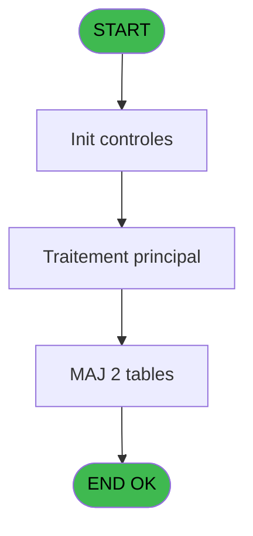
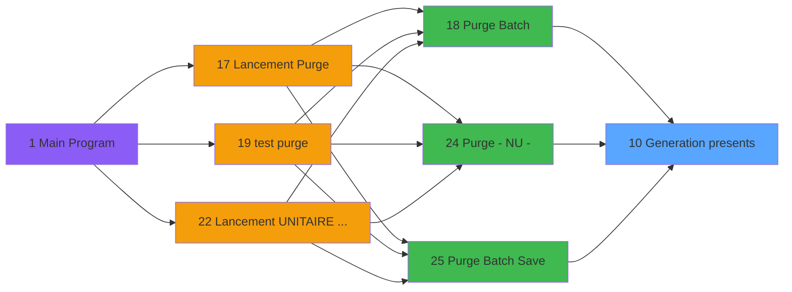

# PUG IDE 10 - Generation presents

> **Analyse**: Phases 1-4 2026-02-03 18:28 -> 18:29 (11s) | Assemblage 18:29
> **Pipeline**: V7.2 Enrichi
> **Structure**: 4 onglets (Resume | Ecrans | Donnees | Connexions)

<!-- TAB:Resume -->

## 1. FICHE D'IDENTITE

| Attribut | Valeur |
|----------|--------|
| Projet | PUG |
| IDE Position | 10 |
| Nom Programme | Generation presents |
| Fichier source | `Prg_10.xml` |
| Dossier IDE | Purge |
| Taches | 2 (1 ecrans visibles) |
| Tables modifiees | 2 |
| Programmes appeles | 0 |

## 2. DESCRIPTION FONCTIONNELLE

**Generation presents** assure la gestion complete de ce processus, accessible depuis [Purge Batch (IDE 18)](PUG-IDE-18.md), [Purge - NU - (IDE 24)](PUG-IDE-24.md), [Purge Batch Save (IDE 25)](PUG-IDE-25.md).

Le flux de traitement s'organise en **1 blocs fonctionnels** :

- **Traitement** (2 taches) : traitements metier divers

**Donnees modifiees** : 2 tables en ecriture (pv_comptable, tempo_chambre_client).

## 3. BLOCS FONCTIONNELS

### 3.1 Traitement (2 taches)

Traitements internes.

---

#### 10 - Generation presents [[ECRAN]](#ecran-t1)

**Role** : Traitement : Generation presents.
**Ecran** : 240 x 80 DLU (MDI) | [Voir mockup](#ecran-t1)

---

#### 10.1 - Update

**Role** : Traitement : Update.

## 5. REGLES METIER

*(Aucune regle metier identifiee)*

## 6. CONTEXTE

- **Appele par**: [Purge Batch (IDE 18)](PUG-IDE-18.md), [Purge - NU - (IDE 24)](PUG-IDE-24.md), [Purge Batch Save (IDE 25)](PUG-IDE-25.md)
- **Appelle**: 0 programmes | **Tables**: 2 (W:2 R:0 L:0) | **Taches**: 2 | **Expressions**: 1

<!-- TAB:Ecrans -->

## 8. ECRANS

### 8.1 Forms visibles (1 / 2)

| # | Position | Tache | Nom | Type | Largeur | Hauteur | Bloc |
|---|----------|-------|-----|------|---------|---------|------|
| 1 | 10 | 10 | Generation presents | MDI | 240 | 80 | Traitement |

### 8.2 Mockups Ecrans

---

#### 10 - Generation presents
**Tache** : [10](#t1) | **Type** : MDI | **Dimensions** : 240 x 80 DLU
**Bloc** : Traitement | **Titre IDE** : Generation presents

<!-- FORM-DATA:
{
    "width":  240,
    "vFactor":  8,
    "type":  "MDI",
    "hFactor":  4,
    "controls":  [
                     {
                         "x":  16,
                         "type":  "label",
                         "var":  "",
                         "y":  12,
                         "w":  208,
                         "fmt":  "",
                         "name":  "",
                         "h":  56,
                         "color":  "",
                         "text":  "",
                         "parent":  null
                     },
                     {
                         "x":  86,
                         "type":  "label",
                         "var":  "",
                         "y":  29,
                         "w":  116,
                         "fmt":  "",
                         "name":  "",
                         "h":  16,
                         "color":  "7",
                         "text":  "Nationality",
                         "parent":  null
                     },
                     {
                         "x":  22,
                         "type":  "image",
                         "var":  "",
                         "y":  15,
                         "w":  52,
                         "fmt":  "",
                         "name":  "",
                         "h":  40,
                         "color":  "",
                         "text":  "",
                         "parent":  null
                     }
                 ],
    "taskId":  "10",
    "height":  80
}
-->

## 9. NAVIGATION

Ecran unique: **Generation presents**

### 9.3 Structure hierarchique (2 taches)

| Position | Tache | Type | Dimensions | Bloc |
|----------|-------|------|------------|------|
| **10.1** | [**Generation presents** (10)](#t1) [mockup](#ecran-t1) | MDI | 240x80 | Traitement |
| 10.1.1 | [Update (10.1)](#t2) | MDI | - | |

### 9.4 Algorigramme

> **Legende**: Vert = START/END OK | Rouge = END KO | Bleu = Decisions
> *Algorigramme auto-genere. Utiliser `/algorigramme` pour une synthese metier detaillee.*

<!-- TAB:Donnees -->

## 10. TABLES

### Tables utilisees (2)

| ID | Nom | Description | Type | R | W | L | Usages |
|----|-----|-------------|------|---|---|---|--------|
| 373 | pv_comptable |  | DB |   | **W** |   | 1 |
| 588 | tempo_chambre_client | Table temporaire ecran | TMP |   | **W** |   | 1 |

### Colonnes par table (0 / 2 tables avec colonnes identifiees)

Table 373 - pv_comptable (**W**) - 1 usages

*Table utilisee uniquement en Link ou aucune colonne Real identifiee dans le DataView.*

Table 588 - tempo_chambre_client (**W**) - 1 usages

*Table utilisee uniquement en Link ou aucune colonne Real identifiee dans le DataView.*

## 11. VARIABLES

*(Programme sans variables locales mappees)*

## 12. EXPRESSIONS

**1 / 1 expressions decodees (100%)**

### 12.1 Repartition par type

| Type | Expressions | Regles |
|------|-------------|--------|
| OTHER | 1 | 0 |

### 12.2 Expressions cles par type

#### OTHER (1 expressions)

| Type | IDE | Expression | Regle |
|------|-----|------------|-------|
| OTHER | 1 | `Stat (0,'D'MODE)` | - |

<!-- TAB:Connexions -->

## 13. GRAPHE D'APPELS

### 13.1 Chaine depuis Main (Callers)

Main -> ... -> [Purge Batch (IDE 18)](PUG-IDE-18.md) -> **Generation presents (IDE 10)**

Main -> ... -> [Purge - NU - (IDE 24)](PUG-IDE-24.md) -> **Generation presents (IDE 10)**

Main -> ... -> [Purge Batch Save (IDE 25)](PUG-IDE-25.md) -> **Generation presents (IDE 10)**

### 13.2 Callers

| IDE | Nom Programme | Nb Appels |
|-----|---------------|-----------|
| [18](PUG-IDE-18.md) | Purge Batch | 1 |
| [24](PUG-IDE-24.md) | Purge - NU - | 1 |
| [25](PUG-IDE-25.md) | Purge Batch Save | 1 |

### 13.3 Callees (programmes appeles)

### 13.4 Detail Callees avec contexte

| IDE | Nom Programme | Appels | Contexte |
|-----|---------------|--------|----------|
| - | (aucun) | - | - |

## 14. RECOMMANDATIONS MIGRATION

### 14.1 Profil du programme

| Metrique | Valeur | Impact migration |
|----------|--------|-----------------|
| Lignes de logique | 12 | Programme compact |
| Expressions | 1 | Peu de logique |
| Tables WRITE | 2 | Impact faible |
| Sous-programmes | 0 | Peu de dependances |
| Ecrans visibles | 1 | Ecran unique ou traitement batch |
| Code desactive | 0% (0 / 12) | Code sain |
| Regles metier | 0 | Pas de regle identifiee |

### 14.2 Plan de migration par bloc

#### Traitement (2 taches: 1 ecran, 1 traitement)

- **Strategie** : Orchestrateur avec 1 ecrans (Razor/React) et 1 traitements backend (services).
- Les ecrans deviennent des composants UI, les traitements invisibles deviennent des services injectables.
- Decomposer les taches en services unitaires testables.

### 14.3 Dependances critiques

| Dependance | Type | Appels | Impact |
|------------|------|--------|--------|
| pv_comptable | Table WRITE (Database) | 1x | Schema + repository |
| tempo_chambre_client | Table WRITE (Temp) | 1x | Schema + repository |

---
*Spec DETAILED generee par Pipeline V7.2 - 2026-02-03 18:29*
