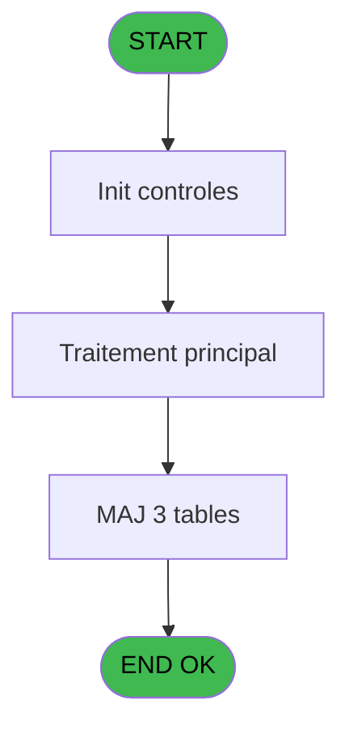
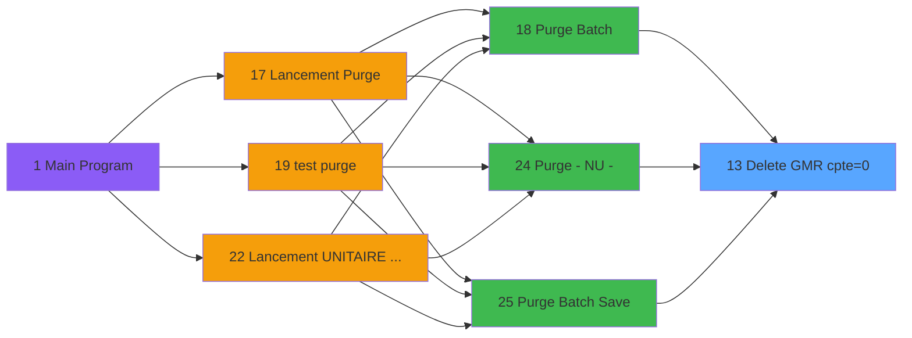

# PUG IDE 13 - Delete GMR cpte=0

> **Analyse**: Phases 1-4 2026-02-03 18:29 -> 18:30 (22s) | Assemblage 18:30
> **Pipeline**: V7.2 Enrichi
> **Structure**: 4 onglets (Resume | Ecrans | Donnees | Connexions)

<!-- TAB:Resume -->

## 1. FICHE D'IDENTITE

| Attribut | Valeur |
|----------|--------|
| Projet | PUG |
| IDE Position | 13 |
| Nom Programme | Delete GMR cpte=0 |
| Fichier source | `Prg_13.xml` |
| Dossier IDE | Purge |
| Taches | 3 (0 ecrans visibles) |
| Tables modifiees | 3 |
| Programmes appeles | 0 |

## 2. DESCRIPTION FONCTIONNELLE

**Delete GMR cpte=0** assure la gestion complete de ce processus, accessible depuis [Purge Batch (IDE 18)](PUG-IDE-18.md), [Purge - NU - (IDE 24)](PUG-IDE-24.md), [Purge Batch Save (IDE 25)](PUG-IDE-25.md).

Le flux de traitement s'organise en **1 blocs fonctionnels** :

- **Traitement** (3 taches) : traitements metier divers

**Donnees modifiees** : 3 tables en ecriture (gm-recherche_____gmr, gm-complet_______gmc, client_gm).

## 3. BLOCS FONCTIONNELS

### 3.1 Traitement (3 taches)

Traitements internes.

---

#### 13 - Delete GMR cpte=0 [[ECRAN]](#ecran-t1)

**Role** : Traitement : Delete GMR cpte=0.
**Ecran** : 505 x 254 DLU (MDI) | [Voir mockup](#ecran-t1)

---

#### 13.1 - GM 14

**Role** : Traitement : GM 14.

---

#### 13.2 - GM 9

**Role** : Traitement : GM 9.

## 5. REGLES METIER

*(Aucune regle metier identifiee)*

## 6. CONTEXTE

- **Appele par**: [Purge Batch (IDE 18)](PUG-IDE-18.md), [Purge - NU - (IDE 24)](PUG-IDE-24.md), [Purge Batch Save (IDE 25)](PUG-IDE-25.md)
- **Appelle**: 0 programmes | **Tables**: 3 (W:3 R:0 L:0) | **Taches**: 3 | **Expressions**: 1

<!-- TAB:Ecrans -->

## 8. ECRANS

*(Programme sans ecran visible)*

## 9. NAVIGATION

### 9.3 Structure hierarchique (3 taches)

| Position | Tache | Type | Dimensions | Bloc |
|----------|-------|------|------------|------|
| **13.1** | [**Delete GMR cpte=0** (13)](#t1) [mockup](#ecran-t1) | MDI | 505x254 | Traitement |
| 13.1.1 | [GM 14 (13.1)](#t2) | MDI | - | |
| 13.1.2 | [GM 9 (13.2)](#t3) | MDI | - | |

### 9.4 Algorigramme

> **Legende**: Vert = START/END OK | Rouge = END KO | Bleu = Decisions
> *Algorigramme auto-genere. Utiliser `/algorigramme` pour une synthese metier detaillee.*

<!-- TAB:Donnees -->

## 10. TABLES

### Tables utilisees (3)

| ID | Nom | Description | Type | R | W | L | Usages |
|----|-----|-------------|------|---|---|---|--------|
| 30 | gm-recherche_____gmr | Index de recherche | DB |   | **W** |   | 1 |
| 31 | gm-complet_______gmc |  | DB |   | **W** |   | 1 |
| 36 | client_gm |  | DB |   | **W** |   | 1 |

### Colonnes par table (0 / 3 tables avec colonnes identifiees)

Table 30 - gm-recherche_____gmr (**W**) - 1 usages

*Table utilisee uniquement en Link ou aucune colonne Real identifiee dans le DataView.*

Table 31 - gm-complet_______gmc (**W**) - 1 usages

*Table utilisee uniquement en Link ou aucune colonne Real identifiee dans le DataView.*

Table 36 - client_gm (**W**) - 1 usages

*Table utilisee uniquement en Link ou aucune colonne Real identifiee dans le DataView.*

## 11. VARIABLES

*(Programme sans variables locales mappees)*

## 12. EXPRESSIONS

**1 / 1 expressions decodees (100%)**

### 12.1 Repartition par type

| Type | Expressions | Regles |
|------|-------------|--------|
| CONSTANTE | 1 | 0 |

### 12.2 Expressions cles par type

#### CONSTANTE (1 expressions)

| Type | IDE | Expression | Regle |
|------|-----|------------|-------|
| CONSTANTE | 1 | `0` | - |

<!-- TAB:Connexions -->

## 13. GRAPHE D'APPELS

### 13.1 Chaine depuis Main (Callers)

Main -> ... -> [Purge Batch (IDE 18)](PUG-IDE-18.md) -> **Delete GMR cpte=0 (IDE 13)**

Main -> ... -> [Purge - NU - (IDE 24)](PUG-IDE-24.md) -> **Delete GMR cpte=0 (IDE 13)**

Main -> ... -> [Purge Batch Save (IDE 25)](PUG-IDE-25.md) -> **Delete GMR cpte=0 (IDE 13)**

### 13.2 Callers

| IDE | Nom Programme | Nb Appels |
|-----|---------------|-----------|
| [18](PUG-IDE-18.md) | Purge Batch | 1 |
| [24](PUG-IDE-24.md) | Purge - NU - | 1 |
| [25](PUG-IDE-25.md) | Purge Batch Save | 1 |

### 13.3 Callees (programmes appeles)

### 13.4 Detail Callees avec contexte

| IDE | Nom Programme | Appels | Contexte |
|-----|---------------|--------|----------|
| - | (aucun) | - | - |

## 14. RECOMMANDATIONS MIGRATION

### 14.1 Profil du programme

| Metrique | Valeur | Impact migration |
|----------|--------|-----------------|
| Lignes de logique | 24 | Programme compact |
| Expressions | 1 | Peu de logique |
| Tables WRITE | 3 | Impact modere |
| Sous-programmes | 0 | Peu de dependances |
| Ecrans visibles | 0 | Ecran unique ou traitement batch |
| Code desactive | 0% (0 / 24) | Code sain |
| Regles metier | 0 | Pas de regle identifiee |

### 14.2 Plan de migration par bloc

#### Traitement (3 taches: 1 ecran, 2 traitements)

- **Strategie** : Orchestrateur avec 1 ecrans (Razor/React) et 2 traitements backend (services).
- Les ecrans deviennent des composants UI, les traitements invisibles deviennent des services injectables.
- Decomposer les taches en services unitaires testables.

### 14.3 Dependances critiques

| Dependance | Type | Appels | Impact |
|------------|------|--------|--------|
| gm-recherche_____gmr | Table WRITE (Database) | 1x | Schema + repository |
| gm-complet_______gmc | Table WRITE (Database) | 1x | Schema + repository |
| client_gm | Table WRITE (Database) | 1x | Schema + repository |

---
*Spec DETAILED generee par Pipeline V7.2 - 2026-02-03 18:30*
