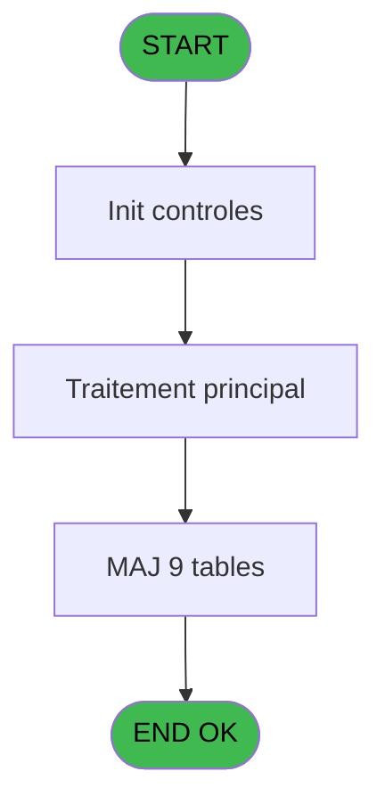
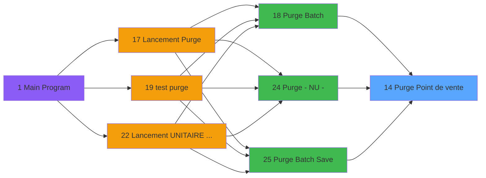

# PUG IDE 14 - Purge Point de vente

> **Analyse**: Phases 1-4 2026-02-03 18:30 -> 18:30 (18s) | Assemblage 18:30
> **Pipeline**: V7.2 Enrichi
> **Structure**: 4 onglets (Resume | Ecrans | Donnees | Connexions)

<!-- TAB:Resume -->

## 1. FICHE D'IDENTITE

| Attribut | Valeur |
|----------|--------|
| Projet | PUG |
| IDE Position | 14 |
| Nom Programme | Purge Point de vente |
| Fichier source | `Prg_14.xml` |
| Dossier IDE | Purge |
| Taches | 9 (0 ecrans visibles) |
| Tables modifiees | 9 |
| Programmes appeles | 1 |

## 2. DESCRIPTION FONCTIONNELLE

**Purge Point de vente** assure la gestion complete de ce processus, accessible depuis [Purge Batch (IDE 18)](PUG-IDE-18.md), [Purge - NU - (IDE 24)](PUG-IDE-24.md), [Purge Batch Save (IDE 25)](PUG-IDE-25.md).

Le flux de traitement s'organise en **3 blocs fonctionnels** :

- **Traitement** (7 taches) : traitements metier divers
- **Calcul** (1 tache) : calculs de montants, stocks ou compteurs
- **Saisie** (1 tache) : ecrans de saisie utilisateur (formulaires, champs, donnees)

**Donnees modifiees** : 9 tables en ecriture (pv_contracts, pv_discount_reasons, pv_cust_rentals, pv_sellers_by_week, pv_ligne_inv_stock, pv_mvt_stock_tempo, pv_inv_stock, trace_modif_package, Table_946).

Detail : phases du traitement

#### Phase 1 : Saisie (1 tache)

- **14** - Purge Point de vente

#### Phase 2 : Traitement (7 taches)

- **14.1** - Archivage
- **14.2** - Rentals
- **14.2.1** - Archivage
- **14.3** - Packages
- **14.3.1** - Archivage
- **14.4.1** - Archivage
- **14.5** - Packages

Delegue a : [Vidage table SQL (IDE 20)](PUG-IDE-20.md)

#### Phase 3 : Calcul (1 tache)

- **14.4** - Comptable

#### Tables impactees

| Table | Operations | Role metier |
|-------|-----------|-------------|
| pv_discount_reasons | **W** (1 usages) |  |
| pv_contracts | **W** (1 usages) |  |
| pv_ligne_inv_stock | **W** (1 usages) | Articles et stock |
| pv_sellers_by_week | **W** (1 usages) |  |
| Table_946 | **W** (1 usages) |  |
| pv_cust_rentals | **W** (1 usages) |  |
| trace_modif_package | **W** (1 usages) |  |
| pv_mvt_stock_tempo | **W** (1 usages) | Table temporaire ecran |
| pv_inv_stock | **W** (1 usages) | Articles et stock |

## 3. BLOCS FONCTIONNELS

### 3.1 Saisie (1 tache)

Ce bloc traite la saisie des donnees de la transaction.

---

#### 14 - Purge Point de vente

**Role** : Saisie des donnees : Purge Point de vente.
**Variables liees** : G (P.Date purge)

### 3.2 Traitement (7 taches)

Traitements internes.

---

#### 14.1 - Archivage

**Role** : Traitement : Archivage.
**Delegue a** : [Vidage table SQL (IDE 20)](PUG-IDE-20.md)

---

#### 14.2 - Rentals

**Role** : Traitement : Rentals.
**Delegue a** : [Vidage table SQL (IDE 20)](PUG-IDE-20.md)

---

#### 14.2.1 - Archivage

**Role** : Traitement : Archivage.
**Delegue a** : [Vidage table SQL (IDE 20)](PUG-IDE-20.md)

---

#### 14.3 - Packages

**Role** : Traitement : Packages.
**Delegue a** : [Vidage table SQL (IDE 20)](PUG-IDE-20.md)

---

#### 14.3.1 - Archivage

**Role** : Traitement : Archivage.
**Delegue a** : [Vidage table SQL (IDE 20)](PUG-IDE-20.md)

---

#### 14.4.1 - Archivage

**Role** : Traitement : Archivage.
**Delegue a** : [Vidage table SQL (IDE 20)](PUG-IDE-20.md)

---

#### 14.5 - Packages

**Role** : Traitement : Packages.
**Delegue a** : [Vidage table SQL (IDE 20)](PUG-IDE-20.md)

### 3.3 Calcul (1 tache)

Calculs metier : montants, stocks, compteurs.

---

#### 14.4 - Comptable

**Role** : Traitement : Comptable.

## 5. REGLES METIER

*(Aucune regle metier identifiee)*

## 6. CONTEXTE

- **Appele par**: [Purge Batch (IDE 18)](PUG-IDE-18.md), [Purge - NU - (IDE 24)](PUG-IDE-24.md), [Purge Batch Save (IDE 25)](PUG-IDE-25.md)
- **Appelle**: 1 programmes | **Tables**: 10 (W:9 R:0 L:1) | **Taches**: 9 | **Expressions**: 3

<!-- TAB:Ecrans -->

## 8. ECRANS

*(Programme sans ecran visible)*

## 9. NAVIGATION

### 9.3 Structure hierarchique (9 taches)

| Position | Tache | Type | Dimensions | Bloc |
|----------|-------|------|------------|------|
| **14.1** | [**Purge Point de vente** (14)](#t1) | MDI | - | Saisie |
| **14.2** | [**Archivage** (14.1)](#t2) | MDI | - | Traitement |
| 14.2.1 | [Rentals (14.2)](#t3) | MDI | - | |
| 14.2.2 | [Archivage (14.2.1)](#t4) | MDI | - | |
| 14.2.3 | [Packages (14.3)](#t5) | MDI | - | |
| 14.2.4 | [Archivage (14.3.1)](#t6) | MDI | - | |
| 14.2.5 | [Archivage (14.4.1)](#t8) | MDI | - | |
| 14.2.6 | [Packages (14.5)](#t11) | MDI | - | |
| **14.3** | [**Comptable** (14.4)](#t7) | MDI | - | Calcul |

### 9.4 Algorigramme

> **Legende**: Vert = START/END OK | Rouge = END KO | Bleu = Decisions
> *Algorigramme auto-genere. Utiliser `/algorigramme` pour une synthese metier detaillee.*

<!-- TAB:Donnees -->

## 10. TABLES

### Tables utilisees (10)

| ID | Nom | Description | Type | R | W | L | Usages |
|----|-----|-------------|------|---|---|---|--------|
| 377 | pv_contracts |  | DB |   | **W** |   | 1 |
| 382 | pv_discount_reasons |  | DB |   | **W** |   | 1 |
| 400 | pv_cust_rentals |  | DB |   | **W** |   | 1 |
| 404 | pv_sellers_by_week |  | DB |   | **W** |   | 1 |
| 761 | pv_ligne_inv_stock | Articles et stock | DB |   | **W** |   | 1 |
| 762 | pv_mvt_stock_tempo | Table temporaire ecran | DB |   | **W** |   | 1 |
| 763 | pv_inv_stock | Articles et stock | DB |   | **W** |   | 1 |
| 764 | trace_modif_package |  | DB |   | **W** |   | 1 |
| 946 | Table_946 |  | MEM |   | **W** |   | 1 |
| 1032 | Table_1032 |  | MEM |   |   | L | 1 |

### Colonnes par table (1 / 9 tables avec colonnes identifiees)

Table 377 - pv_contracts (**W**) - 1 usages

*Table utilisee uniquement en Link ou aucune colonne Real identifiee dans le DataView.*

Table 382 - pv_discount_reasons (**W**) - 1 usages

| Lettre | Variable | Acces | Type |
|--------|----------|-------|------|
| A | p.Code Societe | W | Alpha |
| B | p.compte | W | Numeric |
| C | p.filiation | W | Numeric |
| D | p.date debut | W | Date |
| E | p.date fin | W | Date |
| F | p.qualite | W | Alpha |
| G | P.Date purge | W | Date |

Table 400 - pv_cust_rentals (**W**) - 1 usages

*Table utilisee uniquement en Link ou aucune colonne Real identifiee dans le DataView.*

Table 404 - pv_sellers_by_week (**W**) - 1 usages

*Table utilisee uniquement en Link ou aucune colonne Real identifiee dans le DataView.*

Table 761 - pv_ligne_inv_stock (**W**) - 1 usages

*Table utilisee uniquement en Link ou aucune colonne Real identifiee dans le DataView.*

Table 762 - pv_mvt_stock_tempo (**W**) - 1 usages

*Table utilisee uniquement en Link ou aucune colonne Real identifiee dans le DataView.*

Table 763 - pv_inv_stock (**W**) - 1 usages

*Table utilisee uniquement en Link ou aucune colonne Real identifiee dans le DataView.*

Table 764 - trace_modif_package (**W**) - 1 usages

*Table utilisee uniquement en Link ou aucune colonne Real identifiee dans le DataView.*

Table 946 - Table_946 (**W**) - 1 usages

*Table utilisee uniquement en Link ou aucune colonne Real identifiee dans le DataView.*

## 11. VARIABLES

### 11.1 Parametres entrants (7)

Variables recues du programme appelant ([Purge Batch (IDE 18)](PUG-IDE-18.md)).

| Lettre | Nom | Type | Usage dans |
|--------|-----|------|-----------|
| A | p.Code Societe | Alpha | 1x parametre entrant |
| B | p.compte | Numeric | 1x parametre entrant |
| C | p.filiation | Numeric | 1x parametre entrant |
| D | p.date debut | Date | - |
| E | p.date fin | Date | - |
| F | p.qualite | Alpha | - |
| G | P.Date purge | Date | - |

## 12. EXPRESSIONS

**3 / 3 expressions decodees (100%)**

### 12.1 Repartition par type

| Type | Expressions | Regles |
|------|-------------|--------|
| OTHER | 3 | 0 |

### 12.2 Expressions cles par type

#### OTHER (3 expressions)

| Type | IDE | Expression | Regle |
|------|-----|------------|-------|
| OTHER | 3 | `p.filiation [C]` | - |
| OTHER | 2 | `p.compte [B]` | - |
| OTHER | 1 | `p.Code Societe [A]` | - |

<!-- TAB:Connexions -->

## 13. GRAPHE D'APPELS

### 13.1 Chaine depuis Main (Callers)

Main -> ... -> [Purge Batch (IDE 18)](PUG-IDE-18.md) -> **Purge Point de vente (IDE 14)**

Main -> ... -> [Purge - NU - (IDE 24)](PUG-IDE-24.md) -> **Purge Point de vente (IDE 14)**

Main -> ... -> [Purge Batch Save (IDE 25)](PUG-IDE-25.md) -> **Purge Point de vente (IDE 14)**

### 13.2 Callers

| IDE | Nom Programme | Nb Appels |
|-----|---------------|-----------|
| [18](PUG-IDE-18.md) | Purge Batch | 1 |
| [24](PUG-IDE-24.md) | Purge - NU - | 1 |
| [25](PUG-IDE-25.md) | Purge Batch Save | 1 |

### 13.3 Callees (programmes appeles)

### 13.4 Detail Callees avec contexte

| IDE | Nom Programme | Appels | Contexte |
|-----|---------------|--------|----------|
| [20](PUG-IDE-20.md) | Vidage table SQL | 2 | Sous-programme |

## 14. RECOMMANDATIONS MIGRATION

### 14.1 Profil du programme

| Metrique | Valeur | Impact migration |
|----------|--------|-----------------|
| Lignes de logique | 274 | Taille moyenne |
| Expressions | 3 | Peu de logique |
| Tables WRITE | 9 | Fort impact donnees |
| Sous-programmes | 1 | Peu de dependances |
| Ecrans visibles | 0 | Ecran unique ou traitement batch |
| Code desactive | 0% (0 / 274) | Code sain |
| Regles metier | 0 | Pas de regle identifiee |

### 14.2 Plan de migration par bloc

#### Saisie (1 tache: 0 ecran, 1 traitement)

- **Strategie** : Formulaire React/Blazor avec validation Zod/FluentValidation.
- Validation temps reel cote client + serveur

#### Traitement (7 taches: 0 ecran, 7 traitements)

- **Strategie** : 7 service(s) backend injectable(s) (Domain Services).
- 1 sous-programme(s) a migrer ou a reutiliser depuis les services existants.
- Decomposer les taches en services unitaires testables.

#### Calcul (1 tache: 0 ecran, 1 traitement)

- **Strategie** : Services de calcul purs (Domain Services).
- Migrer la logique de calcul (stock, compteurs, montants)

### 14.3 Dependances critiques

| Dependance | Type | Appels | Impact |
|------------|------|--------|--------|
| pv_contracts | Table WRITE (Database) | 1x | Schema + repository |
| pv_discount_reasons | Table WRITE (Database) | 1x | Schema + repository |
| pv_cust_rentals | Table WRITE (Database) | 1x | Schema + repository |
| pv_sellers_by_week | Table WRITE (Database) | 1x | Schema + repository |
| pv_ligne_inv_stock | Table WRITE (Database) | 1x | Schema + repository |
| pv_mvt_stock_tempo | Table WRITE (Database) | 1x | Schema + repository |
| pv_inv_stock | Table WRITE (Database) | 1x | Schema + repository |
| trace_modif_package | Table WRITE (Database) | 1x | Schema + repository |
| Table_946 | Table WRITE (Memory) | 1x | Schema + repository |
| [Vidage table SQL (IDE 20)](PUG-IDE-20.md) | Sous-programme | 2x | Haute - Sous-programme |

---
*Spec DETAILED generee par Pipeline V7.2 - 2026-02-03 18:30*
