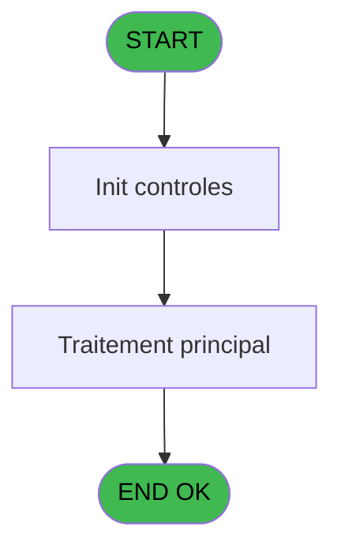
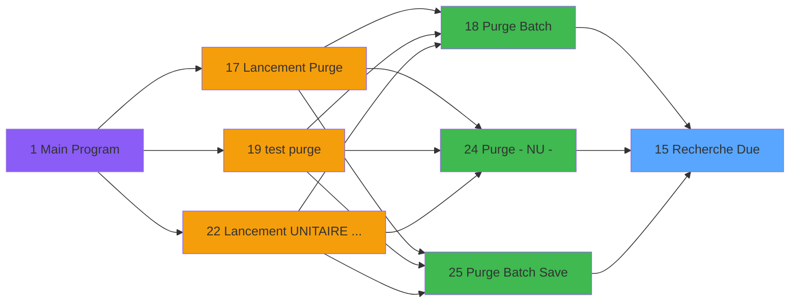

# PUG IDE 15 - Recherche Due

> **Analyse**: Phases 1-4 2026-02-03 18:30 -> 18:31 (20s) | Assemblage 18:31
> **Pipeline**: V7.2 Enrichi
> **Structure**: 4 onglets (Resume | Ecrans | Donnees | Connexions)

<!-- TAB:Resume -->

## 1. FICHE D'IDENTITE

| Attribut | Valeur |
|----------|--------|
| Projet | PUG |
| IDE Position | 15 |
| Nom Programme | Recherche Due |
| Fichier source | `Prg_15.xml` |
| Dossier IDE | Purge |
| Taches | 1 (0 ecrans visibles) |
| Tables modifiees | 0 |
| Programmes appeles | 0 |

## 2. DESCRIPTION FONCTIONNELLE

**Recherche Due** assure la gestion complete de ce processus, accessible depuis [Purge Batch (IDE 18)](PUG-IDE-18.md), [Purge - NU - (IDE 24)](PUG-IDE-24.md), [Purge Batch Save (IDE 25)](PUG-IDE-25.md).

Le flux de traitement s'organise en **1 blocs fonctionnels** :

- **Consultation** (1 tache) : ecrans de recherche, selection et consultation

## 3. BLOCS FONCTIONNELS

### 3.1 Consultation (1 tache)

Ecrans de recherche et consultation.

---

#### 15 - Recherche Due

**Role** : Traitement : Recherche Due.

## 5. REGLES METIER

*(Aucune regle metier identifiee)*

## 6. CONTEXTE

- **Appele par**: [Purge Batch (IDE 18)](PUG-IDE-18.md), [Purge - NU - (IDE 24)](PUG-IDE-24.md), [Purge Batch Save (IDE 25)](PUG-IDE-25.md)
- **Appelle**: 0 programmes | **Tables**: 2 (W:0 R:1 L:1) | **Taches**: 1 | **Expressions**: 6

<!-- TAB:Ecrans -->

## 8. ECRANS

*(Programme sans ecran visible)*

## 9. NAVIGATION

### 9.3 Structure hierarchique (1 tache)

| Position | Tache | Type | Dimensions | Bloc |
|----------|-------|------|------------|------|
| **15.1** | [**Recherche Due** (15)](#t1) | MDI | - | Consultation |

### 9.4 Algorigramme

> **Legende**: Vert = START/END OK | Rouge = END KO | Bleu = Decisions
> *Algorigramme auto-genere. Utiliser `/algorigramme` pour une synthese metier detaillee.*

<!-- TAB:Donnees -->

## 10. TABLES

### Tables utilisees (2)

| ID | Nom | Description | Type | R | W | L | Usages |
|----|-----|-------------|------|---|---|---|--------|
| 382 | pv_discount_reasons |  | DB | R |   |   | 1 |
| 404 | pv_sellers_by_week |  | DB |   |   | L | 1 |

### Colonnes par table (1 / 1 tables avec colonnes identifiees)

Table 382 - pv_discount_reasons (R) - 1 usages

| Lettre | Variable | Acces | Type |
|--------|----------|-------|------|
| A | p.societe | R | Alpha |
| B | p.compte | R | Numeric |
| C | p.have due ? | R | Logical |

## 11. VARIABLES

### 11.1 Parametres entrants (3)

Variables recues du programme appelant ([Purge Batch (IDE 18)](PUG-IDE-18.md)).

| Lettre | Nom | Type | Usage dans |
|--------|-----|------|-----------|
| A | p.societe | Alpha | 1x parametre entrant |
| B | p.compte | Numeric | 1x parametre entrant |
| C | p.have due ? | Logical | 1x parametre entrant |

## 12. EXPRESSIONS

**6 / 6 expressions decodees (100%)**

### 12.1 Repartition par type

| Type | Expressions | Regles |
|------|-------------|--------|
| CONSTANTE | 1 | 0 |
| CAST_LOGIQUE | 1 | 0 |
| OTHER | 4 | 0 |

### 12.2 Expressions cles par type

#### CONSTANTE (1 expressions)

| Type | IDE | Expression | Regle |
|------|-----|------------|-------|
| CONSTANTE | 5 | `'Out'` | - |

#### CAST_LOGIQUE (1 expressions)

| Type | IDE | Expression | Regle |
|------|-----|------------|-------|
| CAST_LOGIQUE | 1 | `'FALSE'LOG` | - |

#### OTHER (4 expressions)

| Type | IDE | Expression | Regle |
|------|-----|------------|-------|
| OTHER | 4 | `[F]` | - |
| OTHER | 6 | `p.have due ? [C]` | - |
| OTHER | 2 | `p.societe [A]` | - |
| OTHER | 3 | `p.compte [B]` | - |

<!-- TAB:Connexions -->

## 13. GRAPHE D'APPELS

### 13.1 Chaine depuis Main (Callers)

Main -> ... -> [Purge Batch (IDE 18)](PUG-IDE-18.md) -> **Recherche Due (IDE 15)**

Main -> ... -> [Purge - NU - (IDE 24)](PUG-IDE-24.md) -> **Recherche Due (IDE 15)**

Main -> ... -> [Purge Batch Save (IDE 25)](PUG-IDE-25.md) -> **Recherche Due (IDE 15)**

### 13.2 Callers

| IDE | Nom Programme | Nb Appels |
|-----|---------------|-----------|
| [18](PUG-IDE-18.md) | Purge Batch | 1 |
| [24](PUG-IDE-24.md) | Purge - NU - | 1 |
| [25](PUG-IDE-25.md) | Purge Batch Save | 1 |

### 13.3 Callees (programmes appeles)

### 13.4 Detail Callees avec contexte

| IDE | Nom Programme | Appels | Contexte |
|-----|---------------|--------|----------|
| - | (aucun) | - | - |

## 14. RECOMMANDATIONS MIGRATION

### 14.1 Profil du programme

| Metrique | Valeur | Impact migration |
|----------|--------|-----------------|
| Lignes de logique | 14 | Programme compact |
| Expressions | 6 | Peu de logique |
| Tables WRITE | 0 | Impact faible |
| Sous-programmes | 0 | Peu de dependances |
| Ecrans visibles | 0 | Ecran unique ou traitement batch |
| Code desactive | 0% (0 / 14) | Code sain |
| Regles metier | 0 | Pas de regle identifiee |

### 14.2 Plan de migration par bloc

#### Consultation (1 tache: 0 ecran, 1 traitement)

- **Strategie** : Composants de recherche/selection en modales.

### 14.3 Dependances critiques

| Dependance | Type | Appels | Impact |
|------------|------|--------|--------|

---
*Spec DETAILED generee par Pipeline V7.2 - 2026-02-03 18:31*
