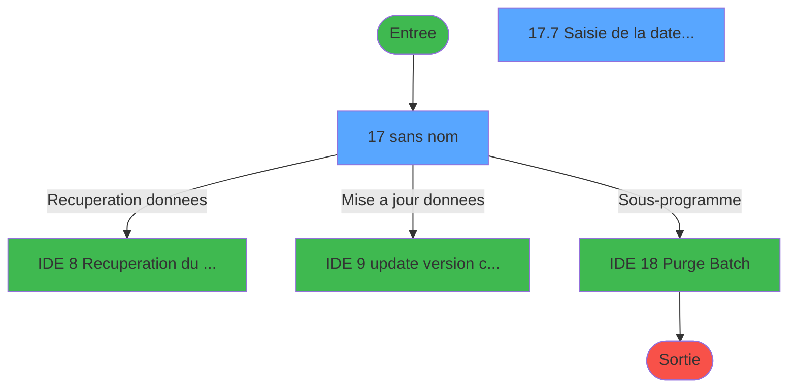
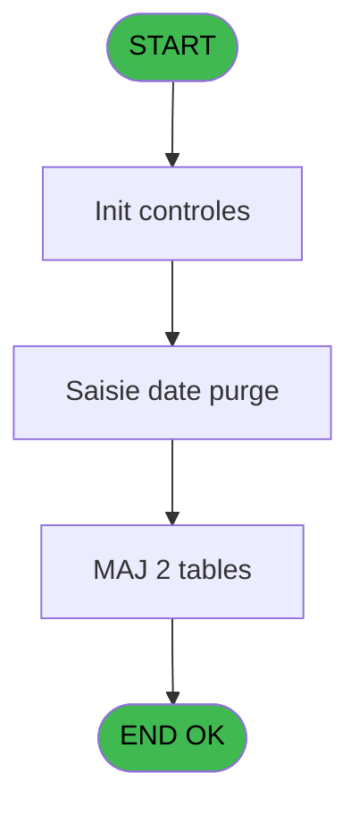
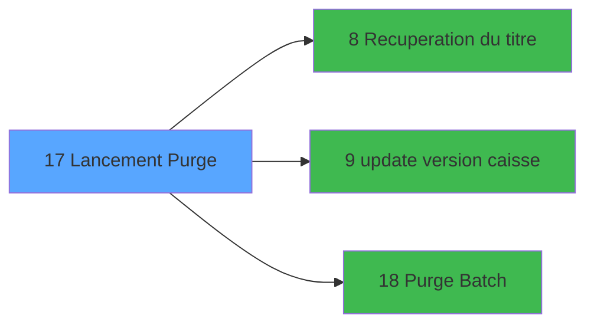

# PUG IDE 17 - Lancement Purge

> **Analyse**: Phases 1-4 2026-02-03 18:31 -> 18:32 (20s) | Assemblage 18:32
> **Pipeline**: V7.2 Enrichi
> **Structure**: 4 onglets (Resume | Ecrans | Donnees | Connexions)

<!-- TAB:Resume -->

## 1. FICHE D'IDENTITE

| Attribut | Valeur |
|----------|--------|
| Projet | PUG |
| IDE Position | 17 |
| Nom Programme | Lancement Purge |
| Fichier source | `Prg_17.xml` |
| Dossier IDE | Purge |
| Taches | 14 (2 ecrans visibles) |
| Tables modifiees | 2 |
| Programmes appeles | 3 |

## 2. DESCRIPTION FONCTIONNELLE

**Lancement Purge** assure la gestion complete de ce processus, accessible depuis [Main Program (IDE 1)](PUG-IDE-1.md).

Le flux de traitement s'organise en **4 blocs fonctionnels** :

- **Traitement** (11 taches) : traitements metier divers
- **Impression** (1 tache) : generation de tickets et documents
- **Saisie** (1 tache) : ecrans de saisie utilisateur (formulaires, champs, donnees)
- **Calcul** (1 tache) : calculs de montants, stocks ou compteurs

**Donnees modifiees** : 2 tables en ecriture (reseau_cloture___rec, histo_sessions_caisse).

**Logique metier** : 4 regles identifiees couvrant conditions metier.

Detail : phases du traitement

#### Phase 1 : Traitement (11 taches)

- **17** - (sans nom) **[[ECRAN]](#ecran-t1)**
- **17.1** - Station eteinte erreur v1
- **17.2** - Test si cloture en cours
- **17.2.1** - Blocage cloture v1
- **17.3** - Lecture paramètres PAR
- **17.4** - Lecture de date purge
- **17.6** - Lecture Param Purge
- **17.8** - Deblocage clôture v1
- **17.9** - Deblocage clôture v1
- **17.10** - Station eteinte erreur v1
- **17.2.2** - Blocage cloture v1

Delegue a : [Recuperation du titre (IDE 8)](PUG-IDE-8.md), [update version caisse (IDE 9)](PUG-IDE-9.md), [Purge Batch (IDE 18)](PUG-IDE-18.md)

#### Phase 2 : Calcul (1 tache)

- **17.5** - Lecture date comptable

#### Phase 3 : Saisie (1 tache)

- **17.7** - Saisie de la date de purge **[[ECRAN]](#ecran-t142)**

#### Phase 4 : Impression (1 tache)

- **17.11** - Purge Tickets

#### Tables impactees

| Table | Operations | Role metier |
|-------|-----------|-------------|
| reseau_cloture___rec | R/**W** (7 usages) | Donnees reseau/cloture |
| histo_sessions_caisse | **W** (1 usages) | Sessions de caisse |

## 3. BLOCS FONCTIONNELS

### 3.1 Traitement (11 taches)

Traitements internes.

---

#### 17 - (sans nom) [[ECRAN]](#ecran-t1)

**Role** : Tache d'orchestration : point d'entree du programme (11 sous-taches). Coordonne l'enchainement des traitements.
**Ecran** : 475 x 128 DLU (MDI) | [Voir mockup](#ecran-t1)

10 sous-taches directes

| Tache | Nom | Bloc |
|-------|-----|------|
| [17.1](#t2) | Station eteinte erreur v1 | Traitement |
| [17.2](#t3) | Test si cloture en cours | Traitement |
| [17.2.1](#t4) | Blocage cloture v1 | Traitement |
| [17.3](#t5) | Lecture paramètres PAR | Traitement |
| [17.4](#t7) | Lecture de date purge | Traitement |
| [17.6](#t10) | Lecture Param Purge | Traitement |
| [17.8](#t279) | Deblocage clôture v1 | Traitement |
| [17.9](#t282) | Deblocage clôture v1 | Traitement |
| [17.10](#t285) | Station eteinte erreur v1 | Traitement |
| [17.2.2](#t288) | Blocage cloture v1 | Traitement |

---

#### 17.1 - Station eteinte erreur v1

**Role** : Traitement : Station eteinte erreur v1.

---

#### 17.2 - Test si cloture en cours

**Role** : Verification : Test si cloture en cours.

---

#### 17.2.1 - Blocage cloture v1

**Role** : Traitement : Blocage cloture v1.

---

#### 17.3 - Lecture paramètres PAR

**Role** : Traitement : Lecture paramètres PAR.

---

#### 17.4 - Lecture de date purge

**Role** : Traitement : Lecture de date purge.
**Variables liees** : D (W0 purge OK(0/1)), E (W0 date purge), B (v. date comptable), C (v. dernière purge), X (V.Purge OK ?)

---

#### 17.6 - Lecture Param Purge

**Role** : Traitement : Lecture Param Purge.
**Variables liees** : D (W0 purge OK(0/1)), E (W0 date purge), C (v. dernière purge), X (V.Purge OK ?)

---

#### 17.8 - Deblocage clôture v1

**Role** : Traitement : Deblocage clôture v1.

---

#### 17.9 - Deblocage clôture v1

**Role** : Traitement : Deblocage clôture v1.

---

#### 17.10 - Station eteinte erreur v1

**Role** : Traitement : Station eteinte erreur v1.

---

#### 17.2.2 - Blocage cloture v1

**Role** : Traitement : Blocage cloture v1.

### 3.2 Calcul (1 tache)

Calculs metier : montants, stocks, compteurs.

---

#### 17.5 - Lecture date comptable

**Role** : Traitement : Lecture date comptable.
**Variables liees** : E (W0 date purge), B (v. date comptable)

### 3.3 Saisie (1 tache)

L'operateur saisit les donnees de la transaction via 1 ecran (Saisie de la date de purge).

---

#### 17.7 - Saisie de la date de purge [[ECRAN]](#ecran-t142)

**Role** : Saisie des donnees : Saisie de la date de purge.
**Ecran** : 448 x 96 DLU (MDI) | [Voir mockup](#ecran-t142)
**Variables liees** : D (W0 purge OK(0/1)), E (W0 date purge), B (v. date comptable), C (v. dernière purge), X (V.Purge OK ?)

### 3.4 Impression (1 tache)

Generation des documents et tickets.

---

#### 17.11 - Purge Tickets

**Role** : Generation du document : Purge Tickets.
**Variables liees** : D (W0 purge OK(0/1)), E (W0 date purge), C (v. dernière purge), X (V.Purge OK ?)

## 5. REGLES METIER

4 regles identifiees:

### Saisie (1 regles)

#### [RM-001] Traitement conditionnel si W0 purge OK(0/1) [D] est a zero

| Element | Detail |
|---------|--------|
| **Condition** | `W0 purge OK(0/1) [D]=0` |
| **Si vrai** | 'Anomalie lors du dernier traitement de purge' |
| **Si faux** | 'OK') |
| **Variables** | D (W0 purge OK(0/1)) |
| **Expression source** | Expression 8 : `IF (W0 purge OK(0/1) [D]=0,'Anomalie lors du dernier traitem` |
| **Exemple** | Si W0 purge OK(0/1) [D]=0 → 'Anomalie lors du dernier traitement de purge'. Sinon → 'OK') |
| **Impact** | [17.11 - Purge Tickets](#t289) |

### Autres (3 regles)

#### [RM-002] Traitement conditionnel si v. date comptable [B] est a zero

| Element | Detail |
|---------|--------|
| **Condition** | `v. date comptable [B]=0` |
| **Si vrai** | 120 |
| **Si faux** | 1) |
| **Variables** | B (v. date comptable) |
| **Expression source** | Expression 11 : `IF (v. date comptable [B]=0,120,1)` |
| **Exemple** | Si v. date comptable [B]=0 → 120. Sinon → 1) |

#### [RM-003] Traitement conditionnel si v. dernière purge [C] est a zero

| Element | Detail |
|---------|--------|
| **Condition** | `v. dernière purge [C]=0` |
| **Si vrai** | 120 |
| **Si faux** | 1) |
| **Variables** | C (v. dernière purge) |
| **Expression source** | Expression 12 : `IF (v. dernière purge [C]=0,120,1)` |
| **Exemple** | Si v. dernière purge [C]=0 → 120. Sinon → 1) |
| **Impact** | [17.11 - Purge Tickets](#t289) |

#### [RM-004] Si [AT] alors Translate('La purge s''est terminée avec succès') sinon Translate('La purge ne s''est pas déroulée normalement'))

| Element | Detail |
|---------|--------|
| **Condition** | `[AT]` |
| **Si vrai** | Translate('La purge s''est terminée avec succès') |
| **Si faux** | Translate('La purge ne s''est pas déroulée normalement')) |
| **Expression source** | Expression 20 : `IF([AT],Translate('La purge s''est terminée avec succès'),Tr` |
| **Exemple** | Si [AT] → Translate('La purge s''est terminée avec succès'). Sinon → Translate('La purge ne s''est pas déroulée normalement')) |
| **Impact** | [17.11 - Purge Tickets](#t289) |

## 6. CONTEXTE

- **Appele par**: [Main Program (IDE 1)](PUG-IDE-1.md)
- **Appelle**: 3 programmes | **Tables**: 8 (W:2 R:5 L:2) | **Taches**: 14 | **Expressions**: 23

<!-- TAB:Ecrans -->

## 8. ECRANS

### 8.1 Forms visibles (2 / 14)

| # | Position | Tache | Nom | Type | Largeur | Hauteur | Bloc |
|---|----------|-------|-----|------|---------|---------|------|
| 1 | 17 | 17 | (sans nom) | MDI | 475 | 128 | Traitement |
| 2 | 17.3 | 17.7 | Saisie de la date de purge | MDI | 448 | 96 | Saisie |

### 8.2 Mockups Ecrans

---

#### 17 - (sans nom)
**Tache** : [17](#t1) | **Type** : MDI | **Dimensions** : 475 x 128 DLU
**Bloc** : Traitement | **Titre IDE** : (sans nom)

<!-- FORM-DATA:
{
    "width":  475,
    "vFactor":  8,
    "type":  "MDI",
    "hFactor":  8,
    "controls":  [
                     {
                         "x":  0,
                         "type":  "label",
                         "var":  "",
                         "y":  1,
                         "w":  472,
                         "fmt":  "",
                         "name":  "",
                         "h":  18,
                         "color":  "",
                         "text":  "",
                         "parent":  null
                     },
                     {
                         "x":  0,
                         "type":  "label",
                         "var":  "",
                         "y":  19,
                         "w":  472,
                         "fmt":  "",
                         "name":  "",
                         "h":  106,
                         "color":  "",
                         "text":  "",
                         "parent":  null
                     },
                     {
                         "x":  17,
                         "type":  "label",
                         "var":  "",
                         "y":  25,
                         "w":  439,
                         "fmt":  "",
                         "name":  "",
                         "h":  92,
                         "color":  "",
                         "text":  "",
                         "parent":  null
                     },
                     {
                         "x":  18,
                         "type":  "label",
                         "var":  "",
                         "y":  26,
                         "w":  437,
                         "fmt":  "",
                         "name":  "",
                         "h":  27,
                         "color":  "",
                         "text":  "",
                         "parent":  null
                     },
                     {
                         "x":  124,
                         "type":  "label",
                         "var":  "",
                         "y":  36,
                         "w":  281,
                         "fmt":  "",
                         "name":  "",
                         "h":  8,
                         "color":  "7",
                         "text":  "Traitement des partants",
                         "parent":  null
                     },
                     {
                         "x":  18,
                         "type":  "label",
                         "var":  "",
                         "y":  53,
                         "w":  437,
                         "fmt":  "",
                         "name":  "",
                         "h":  43,
                         "color":  "",
                         "text":  "",
                         "parent":  null
                     },
                     {
                         "x":  84,
                         "type":  "label",
                         "var":  "",
                         "y":  60,
                         "w":  160,
                         "fmt":  "",
                         "name":  "",
                         "h":  8,
                         "color":  "",
                         "text":  " Date Comptable Caisse",
                         "parent":  null
                     },
                     {
                         "x":  88,
                         "type":  "label",
                         "var":  "",
                         "y":  77,
                         "w":  140,
                         "fmt":  "",
                         "name":  "",
                         "h":  9,
                         "color":  "",
                         "text":  "Date Dernière Purge",
                         "parent":  null
                     },
                     {
                         "x":  6,
                         "type":  "edit",
                         "var":  "",
                         "y":  6,
                         "w":  223,
                         "fmt":  "20",
                         "name":  "",
                         "h":  8,
                         "color":  "",
                         "text":  "",
                         "parent":  1
                     },
                     {
                         "x":  239,
                         "type":  "edit",
                         "var":  "",
                         "y":  6,
                         "w":  225,
                         "fmt":  "WWW DD MMM YYYYT",
                         "name":  "",
                         "h":  8,
                         "color":  "",
                         "text":  "",
                         "parent":  1
                     },
                     {
                         "x":  23,
                         "type":  "image",
                         "var":  "",
                         "y":  28,
                         "w":  52,
                         "fmt":  "",
                         "name":  "",
                         "h":  23,
                         "color":  "",
                         "text":  "",
                         "parent":  null
                     },
                     {
                         "x":  285,
                         "type":  "edit",
                         "var":  "",
                         "y":  59,
                         "w":  103,
                         "fmt":  "",
                         "name":  "",
                         "h":  9,
                         "color":  "1",
                         "text":  "",
                         "parent":  null
                     },
                     {
                         "x":  285,
                         "type":  "edit",
                         "var":  "",
                         "y":  76,
                         "w":  103,
                         "fmt":  "",
                         "name":  "",
                         "h":  9,
                         "color":  "2",
                         "text":  "",
                         "parent":  null
                     },
                     {
                         "x":  22,
                         "type":  "edit",
                         "var":  "",
                         "y":  103,
                         "w":  417,
                         "fmt":  "30",
                         "name":  "",
                         "h":  8,
                         "color":  "120",
                         "text":  "",
                         "parent":  null
                     }
                 ],
    "taskId":  "17",
    "height":  128
}
-->

<strong>Champs : 5 champs</strong>

| Pos (x,y) | Nom | Variable | Type |
|-----------|-----|----------|------|
| 6,6 | 20 | - | edit |
| 239,6 | WWW DD MMM YYYYT | - | edit |
| 285,59 | (sans nom) | - | edit |
| 285,76 | (sans nom) | - | edit |
| 22,103 | 30 | - | edit |

---

#### 17.3 - Saisie de la date de purge
**Tache** : [17.7](#t142) | **Type** : MDI | **Dimensions** : 448 x 96 DLU
**Bloc** : Saisie | **Titre IDE** : Saisie de la date de purge

<!-- FORM-DATA:
{
    "width":  448,
    "vFactor":  8,
    "type":  "MDI",
    "hFactor":  8,
    "controls":  [
                     {
                         "x":  10,
                         "type":  "label",
                         "var":  "",
                         "y":  6,
                         "w":  432,
                         "fmt":  "",
                         "name":  "",
                         "h":  52,
                         "color":  "195",
                         "text":  "Date de purge",
                         "parent":  null
                     },
                     {
                         "x":  0,
                         "type":  "label",
                         "var":  "",
                         "y":  69,
                         "w":  441,
                         "fmt":  "",
                         "name":  "",
                         "h":  23,
                         "color":  "",
                         "text":  "",
                         "parent":  null
                     },
                     {
                         "x":  251,
                         "type":  "edit",
                         "var":  "",
                         "y":  28,
                         "w":  126,
                         "fmt":  "##/##/####A",
                         "name":  "W1 date purge",
                         "h":  10,
                         "color":  "6",
                         "text":  "",
                         "parent":  1
                     },
                     {
                         "x":  9,
                         "type":  "button",
                         "var":  "",
                         "y":  74,
                         "w":  154,
                         "fmt":  "\u0026Ok",
                         "name":  "Bouton Ok",
                         "h":  18,
                         "color":  "",
                         "text":  "",
                         "parent":  4
                     },
                     {
                         "x":  23,
                         "type":  "image",
                         "var":  "",
                         "y":  15,
                         "w":  166,
                         "fmt":  "",
                         "name":  "",
                         "h":  41,
                         "color":  "",
                         "text":  "",
                         "parent":  1
                     },
                     {
                         "x":  280,
                         "type":  "button",
                         "var":  "",
                         "y":  74,
                         "w":  154,
                         "fmt":  "\u0026Quitter",
                         "name":  "Bouton Quitter",
                         "h":  18,
                         "color":  "",
                         "text":  "",
                         "parent":  null
                     }
                 ],
    "taskId":  "17.3",
    "height":  96
}
-->

<strong>Champs : 1 champs</strong>

| Pos (x,y) | Nom | Variable | Type |
|-----------|-----|----------|------|
| 251,28 | W1 date purge | - | edit |

<strong>Boutons : 2 boutons</strong>

| Bouton | Pos (x,y) | Action |
|--------|-----------|--------|
| Ok | 9,74 | Valide la saisie et enregistre |
| Quitter | 280,74 | Quitte le programme |

## 9. NAVIGATION

### 9.1 Enchainement des ecrans

**Detail par enchainement :**

| Depuis | Action | Vers | Retour |
|--------|--------|------|--------|
|  | Recuperation donnees | [Recuperation du titre (IDE 8)](PUG-IDE-8.md) | Retour ecran |
|  | Mise a jour donnees | [update version caisse (IDE 9)](PUG-IDE-9.md) | Retour ecran |
|  | Sous-programme | [Purge Batch (IDE 18)](PUG-IDE-18.md) | Retour ecran |

### 9.3 Structure hierarchique (14 taches)

| Position | Tache | Type | Dimensions | Bloc |
|----------|-------|------|------------|------|
| **17.1** | [**(sans nom)** (17)](#t1) [mockup](#ecran-t1) | MDI | 475x128 | Traitement |
| 17.1.1 | [Station eteinte erreur v1 (17.1)](#t2) | MDI | - | |
| 17.1.2 | [Test si cloture en cours (17.2)](#t3) | MDI | - | |
| 17.1.3 | [Blocage cloture v1 (17.2.1)](#t4) | MDI | - | |
| 17.1.4 | [Lecture paramètres PAR (17.3)](#t5) | MDI | - | |
| 17.1.5 | [Lecture de date purge (17.4)](#t7) | MDI | - | |
| 17.1.6 | [Lecture Param Purge (17.6)](#t10) | MDI | - | |
| 17.1.7 | [Deblocage clôture v1 (17.8)](#t279) | MDI | - | |
| 17.1.8 | [Deblocage clôture v1 (17.9)](#t282) | MDI | - | |
| 17.1.9 | [Station eteinte erreur v1 (17.10)](#t285) | MDI | - | |
| 17.1.10 | [Blocage cloture v1 (17.2.2)](#t288) | MDI | - | |
| **17.2** | [**Lecture date comptable** (17.5)](#t8) | MDI | - | Calcul |
| **17.3** | [**Saisie de la date de purge** (17.7)](#t142) [mockup](#ecran-t142) | MDI | 448x96 | Saisie |
| **17.4** | [**Purge Tickets** (17.11)](#t289) | - | - | Impression |

### 9.4 Algorigramme

> **Legende**: Vert = START/END OK | Rouge = END KO | Bleu = Decisions
> *Algorigramme auto-genere. Utiliser `/algorigramme` pour une synthese metier detaillee.*

<!-- TAB:Donnees -->

## 10. TABLES

### Tables utilisees (8)

| ID | Nom | Description | Type | R | W | L | Usages |
|----|-----|-------------|------|---|---|---|--------|
| 23 | reseau_cloture___rec | Donnees reseau/cloture | DB | R | **W** |   | 7 |
| 63 | parametres___par |  | DB | R |   |   | 1 |
| 70 | date_comptable___dat |  | DB | R |   |   | 1 |
| 71 | derniere_purge___pur |  | DB | R |   |   | 1 |
| 82 | param_purge______ppu |  | DB | R |   |   | 1 |
| 122 | unilateral_bilateral |  | DB |   |   | L | 1 |
| 246 | histo_sessions_caisse | Sessions de caisse | DB |   | **W** |   | 1 |
| 728 | arc_cc_total |  | DB |   |   | L | 1 |

### Colonnes par table (5 / 6 tables avec colonnes identifiees)

Table 23 - reseau_cloture___rec (R/**W**) - 7 usages

| Lettre | Variable | Acces | Type |
|--------|----------|-------|------|
| A | W1 cloture en cours | W | Numeric |

Table 63 - parametres___par (R) - 1 usages

*Table utilisee uniquement en Link ou aucune colonne Real identifiee dans le DataView.*

Table 70 - date_comptable___dat (R) - 1 usages

| Lettre | Variable | Acces | Type |
|--------|----------|-------|------|
| A | W1 date purge | R | Date |
| B | v. date comptable | R | Date |
| E | W0 date purge | R | Date |

Table 71 - derniere_purge___pur (R) - 1 usages

| Lettre | Variable | Acces | Type |
|--------|----------|-------|------|
| A | W1 date purge | R | Date |
| C | v. dernière purge | R | Date |
| D | W0 purge OK(0/1) | R | Numeric |
| E | W0 date purge | R | Date |
| X | V.Purge OK ? | R | Logical |

Table 82 - param_purge______ppu (R) - 1 usages

| Lettre | Variable | Acces | Type |
|--------|----------|-------|------|
| A | W1 date purge | R | Date |
| C | v. dernière purge | R | Date |
| D | W0 purge OK(0/1) | R | Numeric |
| E | W0 date purge | R | Date |
| X | V.Purge OK ? | R | Logical |

Table 246 - histo_sessions_caisse (**W**) - 1 usages

| Lettre | Variable | Acces | Type |
|--------|----------|-------|------|
| A | W1 date purge | W | Date |
| B | Bouton Ok | W | Alpha |

## 11. VARIABLES

### 11.1 Variables de session (9)

Variables persistantes pendant toute la session.

| Lettre | Nom | Type | Usage dans |
|--------|-----|------|-----------|
| A | v. societe | Alpha | - |
| B | v. date comptable | Date | [17.4](#t7), [17.5](#t8), [17.7](#t142) |
| C | v. dernière purge | Date | [17.4](#t7), [17.6](#t10), [17.7](#t142) |
| T | v. execute | Logical | 1x session |
| U | v. titre | Alpha | 1x session |
| V | v Village | Alpha | - |
| W | v Code Devise | Alpha | - |
| X | V.Purge OK ? | Logical | - |
| Y | V.Quitter ? | Logical | - |

### 11.2 Variables de travail (15)

Variables internes au programme.

| Lettre | Nom | Type | Usage dans |
|--------|-----|------|-----------|
| D | W0 purge OK(0/1) | Numeric | [17.4](#t7), [17.6](#t10), [17.7](#t142) |
| E | W0 date purge | Date | - |
| F | W0 confirmation | Numeric | 1x calcul interne |
| G | W0 utilisation caiss | Alpha | 2x calcul interne |
| H | W0 utilisation plann | Alpha | - |
| I | W0 village CAM ? | Alpha | - |
| J | W0 type triplet | Alpha | - |
| K | W0 interface PABX | Alpha | - |
| L | W0 Nb Jour Garde | Numeric | - |
| M | W0 Directory | Alpha | - |
| N | W0 Delai | Numeric | - |
| O | W0 Controle Sauvegarde | Logical | - |
| Q | W0 specif greques | Logical | - |
| R | W0 change bi | Logical | - |
| S | W0 nouvelle gestion caisse | Alpha | - |

### 11.3 Autres (1)

Variables diverses.

| Lettre | Nom | Type | Usage dans |
|--------|-----|------|-----------|
| P | L Session ouverte | Logical | 2x refs |

Toutes les 25 variables (liste complete)

| Cat | Lettre | Nom Variable | Type |
|-----|--------|--------------|------|
| W0 | **D** | W0 purge OK(0/1) | Numeric |
| W0 | **E** | W0 date purge | Date |
| W0 | **F** | W0 confirmation | Numeric |
| W0 | **G** | W0 utilisation caiss | Alpha |
| W0 | **H** | W0 utilisation plann | Alpha |
| W0 | **I** | W0 village CAM ? | Alpha |
| W0 | **J** | W0 type triplet | Alpha |
| W0 | **K** | W0 interface PABX | Alpha |
| W0 | **L** | W0 Nb Jour Garde | Numeric |
| W0 | **M** | W0 Directory | Alpha |
| W0 | **N** | W0 Delai | Numeric |
| W0 | **O** | W0 Controle Sauvegarde | Logical |
| W0 | **Q** | W0 specif greques | Logical |
| W0 | **R** | W0 change bi | Logical |
| W0 | **S** | W0 nouvelle gestion caisse | Alpha |
| V. | **A** | v. societe | Alpha |
| V. | **B** | v. date comptable | Date |
| V. | **C** | v. dernière purge | Date |
| V. | **T** | v. execute | Logical |
| V. | **U** | v. titre | Alpha |
| V. | **V** | v Village | Alpha |
| V. | **W** | v Code Devise | Alpha |
| V. | **X** | V.Purge OK ? | Logical |
| V. | **Y** | V.Quitter ? | Logical |
| Autre | **P** | L Session ouverte | Logical |

## 12. EXPRESSIONS

**23 / 23 expressions decodees (100%)**

### 12.1 Repartition par type

| Type | Expressions | Regles |
|------|-------------|--------|
| CONDITION | 11 | 4 |
| CONSTANTE | 2 | 0 |
| DATE | 1 | 0 |
| OTHER | 4 | 0 |
| REFERENCE_VG | 2 | 0 |
| NEGATION | 2 | 0 |
| STRING | 1 | 0 |

### 12.2 Expressions cles par type

#### CONDITION (11 expressions)

| Type | IDE | Expression | Regle |
|------|-----|------------|-------|
| CONDITION | 12 | `IF (v. dernière purge [C]=0,120,1)` | [RM-003](#rm-RM-003) |
| CONDITION | 20 | `IF([AT],Translate('La purge s''est terminée avec succès'),Translate('La purge ne s''est pas déroulée normalement'))` | [RM-004](#rm-RM-004) |
| CONDITION | 8 | `IF (W0 purge OK(0/1) [D]=0,'Anomalie lors du dernier traitement de purge','OK')` | [RM-001](#rm-RM-001) |
| CONDITION | 11 | `IF (v. date comptable [B]=0,120,1)` | [RM-002](#rm-RM-002) |
| CONDITION | 16 | `W0 nouvelle gestion ca... [S]='O'` | - |
| ... | | *+6 autres* | |

#### CONSTANTE (2 expressions)

| Type | IDE | Expression | Regle |
|------|-----|------------|-------|
| CONSTANTE | 7 | `'C'` | - |
| CONSTANTE | 4 | `1` | - |

#### DATE (1 expressions)

| Type | IDE | Expression | Regle |
|------|-----|------------|-------|
| DATE | 5 | `Date ()` | - |

#### OTHER (4 expressions)

| Type | IDE | Expression | Regle |
|------|-----|------------|-------|
| OTHER | 17 | `L Session ouverte [P] AND NOT(VG10)` | - |
| OTHER | 21 | `NOT([AV])` | - |
| OTHER | 1 | `SetCrsr (2)` | - |
| OTHER | 2 | `SetCrsr (1)` | - |

#### REFERENCE_VG (2 expressions)

| Type | IDE | Expression | Regle |
|------|-----|------------|-------|
| REFERENCE_VG | 23 | `VG7` | - |
| REFERENCE_VG | 6 | `VG2` | - |

#### NEGATION (2 expressions)

| Type | IDE | Expression | Regle |
|------|-----|------------|-------|
| NEGATION | 22 | `NOT VG7` | - |
| NEGATION | 13 | `NOT (v. execute [T])` | - |

#### STRING (1 expressions)

| Type | IDE | Expression | Regle |
|------|-----|------------|-------|
| STRING | 3 | `Trim (v. titre [U])` | - |

### 12.3 Toutes les expressions (23)

Voir les 23 expressions

#### CONDITION (11)

| IDE | Expression Decodee |
|-----|-------------------|
| 8 | `IF (W0 purge OK(0/1) [D]=0,'Anomalie lors du dernier traitement de purge','OK')` |
| 11 | `IF (v. date comptable [B]=0,120,1)` |
| 12 | `IF (v. dernière purge [C]=0,120,1)` |
| 20 | `IF([AT],Translate('La purge s''est terminée avec succès'),Translate('La purge ne s''est pas déroulée normalement'))` |
| 9 | `W0 utilisation caiss [G]='O'` |
| 10 | `W0 utilisation caiss [G]<>'O'` |
| 14 | `W0 purge OK(0/1) [D]=0` |
| 15 | `W0 purge OK(0/1) [D]<>0 OR L Session ouverte [P]` |
| 16 | `W0 nouvelle gestion ca... [S]='O'` |
| 18 | `W0 confirmation [F]=6` |
| 19 | `W0 purge OK(0/1) [D]=0` |

#### CONSTANTE (2)

| IDE | Expression Decodee |
|-----|-------------------|
| 4 | `1` |
| 7 | `'C'` |

#### DATE (1)

| IDE | Expression Decodee |
|-----|-------------------|
| 5 | `Date ()` |

#### OTHER (4)

| IDE | Expression Decodee |
|-----|-------------------|
| 1 | `SetCrsr (2)` |
| 2 | `SetCrsr (1)` |
| 17 | `L Session ouverte [P] AND NOT(VG10)` |
| 21 | `NOT([AV])` |

#### REFERENCE_VG (2)

| IDE | Expression Decodee |
|-----|-------------------|
| 6 | `VG2` |
| 23 | `VG7` |

#### NEGATION (2)

| IDE | Expression Decodee |
|-----|-------------------|
| 13 | `NOT (v. execute [T])` |
| 22 | `NOT VG7` |

#### STRING (1)

| IDE | Expression Decodee |
|-----|-------------------|
| 3 | `Trim (v. titre [U])` |

<!-- TAB:Connexions -->

## 13. GRAPHE D'APPELS

### 13.1 Chaine depuis Main (Callers)

Main -> ... -> [Main Program (IDE 1)](PUG-IDE-1.md) -> **Lancement Purge (IDE 17)**

### 13.2 Callers

| IDE | Nom Programme | Nb Appels |
|-----|---------------|-----------|
| [1](PUG-IDE-1.md) | Main Program | 1 |

### 13.3 Callees (programmes appeles)

### 13.4 Detail Callees avec contexte

| IDE | Nom Programme | Appels | Contexte |
|-----|---------------|--------|----------|
| [8](PUG-IDE-8.md) | Recuperation du titre | 1 | Recuperation donnees |
| [9](PUG-IDE-9.md) | update version caisse | 1 | Mise a jour donnees |
| [18](PUG-IDE-18.md) | Purge Batch | 1 | Sous-programme |

## 14. RECOMMANDATIONS MIGRATION

### 14.1 Profil du programme

| Metrique | Valeur | Impact migration |
|----------|--------|-----------------|
| Lignes de logique | 243 | Taille moyenne |
| Expressions | 23 | Peu de logique |
| Tables WRITE | 2 | Impact faible |
| Sous-programmes | 3 | Peu de dependances |
| Ecrans visibles | 2 | Quelques ecrans |
| Code desactive | 1.2% (3 / 243) | Code sain |
| Regles metier | 4 | Quelques regles a preserver |

### 14.2 Plan de migration par bloc

#### Traitement (11 taches: 1 ecran, 10 traitements)

- **Strategie** : Orchestrateur avec 1 ecrans (Razor/React) et 10 traitements backend (services).
- Les ecrans deviennent des composants UI, les traitements invisibles deviennent des services injectables.
- 3 sous-programme(s) a migrer ou a reutiliser depuis les services existants.
- Decomposer les taches en services unitaires testables.

#### Calcul (1 tache: 0 ecran, 1 traitement)

- **Strategie** : Services de calcul purs (Domain Services).
- Migrer la logique de calcul (stock, compteurs, montants)

#### Saisie (1 tache: 1 ecran, 0 traitement)

- **Strategie** : Formulaire React/Blazor avec validation Zod/FluentValidation.
- Reproduire 1 ecran : Saisie de la date de purge
- Validation temps reel cote client + serveur

#### Impression (1 tache: 0 ecran, 1 traitement)

- **Strategie** : Templates HTML -> PDF via wkhtmltopdf ou Puppeteer.
- `PrintService` injectable avec choix imprimante

### 14.3 Dependances critiques

| Dependance | Type | Appels | Impact |
|------------|------|--------|--------|
| reseau_cloture___rec | Table WRITE (Database) | 6x | Schema + repository |
| histo_sessions_caisse | Table WRITE (Database) | 1x | Schema + repository |
| [Purge Batch (IDE 18)](PUG-IDE-18.md) | Sous-programme | 1x | Normale - Sous-programme |
| [update version caisse (IDE 9)](PUG-IDE-9.md) | Sous-programme | 1x | Normale - Mise a jour donnees |
| [Recuperation du titre (IDE 8)](PUG-IDE-8.md) | Sous-programme | 1x | Normale - Recuperation donnees |

---
*Spec DETAILED generee par Pipeline V7.2 - 2026-02-03 18:32*
