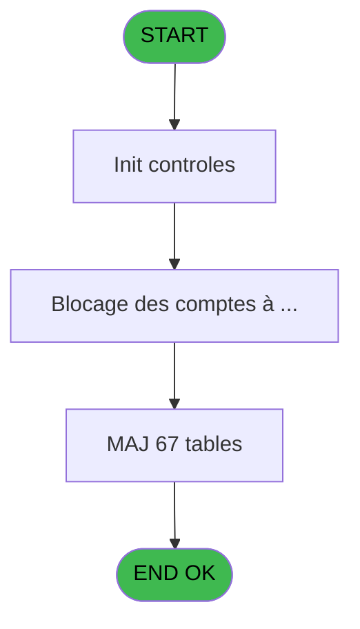
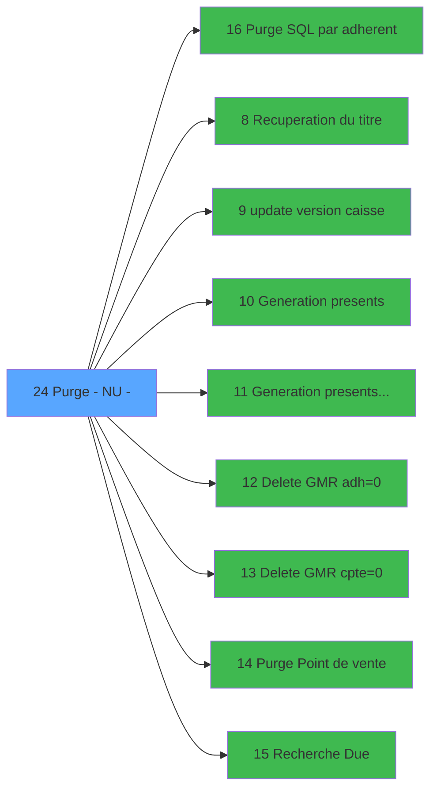

# PUG IDE 24 - Purge - NU -

> **Analyse**: Phases 1-4 2026-02-03 18:35 -> 18:35 (18s) | Assemblage 18:35
> **Pipeline**: V7.2 Enrichi
> **Structure**: 4 onglets (Resume | Ecrans | Donnees | Connexions)

<!-- TAB:Resume -->

## 1. FICHE D'IDENTITE

| Attribut | Valeur |
|----------|--------|
| Projet | PUG |
| IDE Position | 24 |
| Nom Programme | Purge - NU - |
| Fichier source | `Prg_24.xml` |
| Dossier IDE | Sauvegarde |
| Taches | 108 (17 ecrans visibles) |
| Tables modifiees | 67 |
| Programmes appeles | 9 |
| :warning: Statut | **ORPHELIN_POTENTIEL** |

## 2. DESCRIPTION FONCTIONNELLE

**Purge - NU -** assure la gestion complete de ce processus.

Le flux de traitement s'organise en **5 blocs fonctionnels** :

- **Traitement** (89 taches) : traitements metier divers
- **Calcul** (13 taches) : calculs de montants, stocks ou compteurs
- **Creation** (3 taches) : insertion d'enregistrements en base (mouvements, prestations)
- **Saisie** (2 taches) : ecrans de saisie utilisateur (formulaires, champs, donnees)
- **Consultation** (1 tache) : ecrans de recherche, selection et consultation

**Donnees modifiees** : 67 tables en ecriture (transac_detail_bar, transac_entete_bar, bl_detail, reseau_cloture___rec, comptes_speciaux_spc, gm-recherche_____gmr, gm-complet_______gmc, hebergement______heb, personnel_go______go, client_gm, comptable________cte, change___________chg, compte_gm________cgm, ligne_telephone__lgn, compteurs________cpt, derniere_purge___pur, generation_code_gen, commande_autocom_cot, codes_autocom____aut, code_circuit, fichier_validation, code_vol_________vot, groupe_arr_dep___vol, fichier_echanges, historique, nb_code__poste, annulation_______anu, transactions_____tra, comptage_coffre_devise_histo, comptage_coffre_histo, comptage_coffre_montant_histo, comptage_caisse_devise_histo, comptage_caisse_histo, comptage_caisse_montant_histo, histo_sessions_caisse, histo_sessions_caisse_article, histo_sessions_caisse_detail, histo_sessions_caisse_devise, histo_sessions_caisse_remise, liste_user_pour_la_purge, vente, cc_comptable, cc_total_par_type, cc_total, cc_type_detail, ez_card, fi_complet_______gm_go, tai_gm, heure_de_passage, comptage_caisse_devise, Table_741, BarCreditConso, projet, regles_securite, password_interdit, password_historique, Table_750, checkout_log, emaillist, cafil_address_tmp, Country_ISO, comptes_speciaux_spc_cash, table_nettoyage, categorie_operation_mw, Boo_InfosReservation, arc_depot_garantie___dga, go_job).

**Logique metier** : 3 regles identifiees couvrant conditions metier.

Detail : phases du traitement

#### Phase 1 : Traitement (89 taches)

- **24** - (sans nom) **[[ECRAN]](#ecran-t1)**
- **24.1** - Station eteinte anormalement
- **24.2** - Test si cloture en cours
- **24.2.1** - Blocage cloture
- **24.3** - Lecture paramètres PAR
- **24.5** - Lecture de date purge
- **24.7** - Lecture Paramètres tel
- **24.8** - Lecture Param Purge
- **24.9** - (sans nom)
- **24.10** - Veuillez patienter ... **[[ECRAN]](#ecran-t16)**
- **24.10.1** - Modif N° adherent
- **24.10.1.1** - Nouveau N° Adherent Club
- **24.11** - Veuillez patienter ... **[[ECRAN]](#ecran-t24)**
- **24.11.1** - Zuppression GMR
- **24.11.2** - Purge telephone
- **24.11.2.1** - Opposition
- **24.11.2.1.1** - Ecriture ASCII
- **24.11.2.3** - Libeartion de la ligne
- **24.11.2.4** - Libeartion de la ligne
- **24.11.2.5** - Liberation du poste
- **24.11.2.6** - Generation codes
- **24.11.4** - Pour export conso
- **24.11.5** - Export conso
- **24.12** - Veuillez patienter ... **[[ECRAN]](#ecran-t62)**
- **24.12.1** - Zcopy change
- **24.12.1.1** - Zcopy change
- **24.12.2** - Zcopy lignes de solde
- **24.12.3** - Zcopy change
- **24.12.4** - Zcopy change
- **24.12.4.1** - Detail
- **24.12.5** - Zcopy change
- **24.12.6** - Zcopy change
- **24.12.7** - Zcopy change
- **24.12.8** - Zcopy change
- **24.12.9** - Zcopy change
- **24.12.10** - Purge TAIGM
- **24.12.11** - Veuillez patienter ... **[[ECRAN]](#ecran-t101)**
- **24.12.11.1** - Paramètres
- **24.12.11.2** - Liste USER
- **24.12.11.2.1** - Table USER
- **24.12.11.2.2** - Sessions
- **24.12.11.2.2.1** - Pointe USER
- **24.12.11.2.3** - Coffre
- **24.12.11.2.3.1** - Pointe USER
- **24.12.11.3** - (sans nom) **[[ECRAN]](#ecran-t110)**
- **24.12.11.3.1** - Session maxi
- **24.12.11.3.2** - Coffre maxi
- **24.12.11.3.3.1** - Montant
- **24.12.11.3.3.2** - Devise
- **24.12.11.3.4** - session
- **24.12.11.3.4.1** - detail
- **24.12.11.3.4.2** - article
- **24.12.11.3.4.3** - devise
- **24.12.11.3.4.4** - remise
- **24.12.11.3.5** - coffre
- **24.12.11.3.5.1** - montant
- **24.12.11.3.5.2** - devise
- **24.13** - Veuillez patienter ... **[[ECRAN]](#ecran-t124)**
- **24.14** - Veuillez patienter ... **[[ECRAN]](#ecran-t125)**
- **24.15** - Veuillez patienter ... **[[ECRAN]](#ecran-t126)**
- **24.16** - Veuillez patienter ... **[[ECRAN]](#ecran-t127)**
- **24.17** - Veuillez patienter ... **[[ECRAN]](#ecran-t128)**
- **24.18** - Veuillez patienter ... **[[ECRAN]](#ecran-t129)**
- **24.19** - Veuillez patienter ... **[[ECRAN]](#ecran-t131)**
- **24.20** - Traitement Annulation **[[ECRAN]](#ecran-t132)**
- **24.21** - Veuillez patienter ... **[[ECRAN]](#ecran-t133)**
- **24.22** - Veuillez patienter ... **[[ECRAN]](#ecran-t134)**
- **24.23** - MàJ date purge
- **24.24** - Deblocage clôture
- **24.12.4.2** - Archivage bar entete
- **24.12.4.1.1** - Archivage
- **24.12.9.1** - Achivage
- **24.11.1.1** - Archivage
- **24.12.3.1** - Archivage
- **24.11.3.1** - Archivage
- **24.12.12** - Archivage
- **24.12.5.1** - Archivage
- **24.12.7.1** - Archivage
- **24.12.6.1** - Archivage
- **24.12.8.1** - Archivage
- **24.12.2.1** - Archivage
- **24.12.10.1** - Archivage
- **24.11.6.1** - Archivage
- **24.11.7.1** - Archivage
- **24.11.8** - (sans nom)
- **24.26** - Ecrire ligne **[[ECRAN]](#ecran-t267)**
- **24.11.9.1** - Archivage
- **24.12.13** - Zcopy lignes de solde
- **24.12.13.1** - Archivage

Delegue a : [Purge SQL par adherent (IDE 16)](PUG-IDE-16.md), [Recuperation du titre (IDE 8)](PUG-IDE-8.md), [update version caisse (IDE 9)](PUG-IDE-9.md), [Generation presents (IDE 10)](PUG-IDE-10.md), [Generation presents temp (IDE 11)](PUG-IDE-11.md), [   Delete GMR adh=0 (IDE 12)](PUG-IDE-12.md), [   Delete GMR cpte=0 (IDE 13)](PUG-IDE-13.md)

#### Phase 2 : Consultation (1 tache)

- **24.4** - Affich message impossibilite **[[ECRAN]](#ecran-t6)**

Delegue a : [Recuperation du titre (IDE 8)](PUG-IDE-8.md), [   Recherche Due (IDE 15)](PUG-IDE-15.md)

#### Phase 3 : Calcul (13 taches)

- **24.6** - Lecture date comptable
- **24.10.1.2** - Comptes Speciaux
- **24.10.1.3** - Comptes Speciaux
- **24.10.1.4** - Comptes Speciaux
- **24.10.1.5** - Comptes Speciaux
- **24.10.1.6** - Comptes Speciaux
- **24.11.2.2** - Decrementation compteur TEL
- **24.11.3** - Zcopy comptable
- **24.12.11.3.3** - comptage caisse
- **24.11.6** - Zcopy comptable
- **24.11.7** - Zcopy comptable
- **24.11.8.1** - Export conso COMPTA **[[ECRAN]](#ecran-t257)**
- **24.11.9** - Zcopy comptable

#### Phase 4 : Creation (3 taches)

- **24.11.2.1.2** - Creation enreg commande tel
- **24.11.2.1.3** - Creation enreg commande tel
- **24.11.8.3** - Creation temp Conso **[[ECRAN]](#ecran-t259)**

#### Phase 5 : Saisie (2 taches)

- **24.25** - Saisie de la date de purge **[[ECRAN]](#ecran-t142)**
- **24.11.8.2** - Export conso VENTE

Delegue a : [   Purge Point de vente (IDE 14)](PUG-IDE-14.md)

#### Tables impactees

| Table | Operations | Role metier |
|-------|-----------|-------------|
| gm-complet_______gmc | R/**W**/L (6 usages) |  |
| histo_sessions_caisse | R/**W**/L (5 usages) | Sessions de caisse |
| client_gm | **W**/L (5 usages) |  |
| vente | **W**/L (4 usages) | Donnees de ventes |
| liste_user_pour_la_purge | R/**W**/L (4 usages) |  |
| reseau_cloture___rec | R/**W** (4 usages) | Donnees reseau/cloture |
| comptable________cte | **W**/L (4 usages) |  |
| hebergement______heb | **W**/L (4 usages) | Hebergement (chambres) |
| derniere_purge___pur | R/**W** (3 usages) |  |
| comptage_coffre_histo | R/**W** (3 usages) | Etat du coffre |
| gm-recherche_____gmr | R/**W** (3 usages) | Index de recherche |
| compte_gm________cgm | R/**W** (3 usages) | Comptes GM (generaux) |
| Boo_InfosReservation | R/**W** (2 usages) |  |
| change___________chg | **W** (2 usages) |  |
| categorie_operation_mw | **W** (2 usages) | Operations comptables |
| compteurs________cpt | **W** (2 usages) | Comptes GM (generaux) |
| code_circuit | **W** (1 usages) |  |
| groupe_arr_dep___vol | **W** (1 usages) |  |
| transac_entete_bar | **W** (1 usages) |  |
| historique | **W** (1 usages) | Historique / journal |
| histo_sessions_caisse_detail | **W** (1 usages) | Sessions de caisse |
| generation_code_gen | **W** (1 usages) |  |
| tai_gm | **W** (1 usages) |  |
| cc_type_detail | **W** (1 usages) |  |
| password_interdit | **W** (1 usages) |  |
| go_job | **W** (1 usages) |  |
| heure_de_passage | **W** (1 usages) |  |
| histo_sessions_caisse_article | **W** (1 usages) | Articles et stock |
| Table_741 | **W** (1 usages) |  |
| checkout_log | **W** (1 usages) |  |
| projet | **W** (1 usages) |  |
| cafil_address_tmp | **W** (1 usages) | Services / filieres |
| ez_card | **W** (1 usages) |  |
| fichier_validation | **W** (1 usages) |  |
| comptage_caisse_montant_histo | **W** (1 usages) | Sessions de caisse |
| emaillist | **W** (1 usages) |  |
| regles_securite | **W** (1 usages) |  |
| bl_detail | **W** (1 usages) |  |
| arc_depot_garantie___dga | **W** (1 usages) | Depots et garanties |
| histo_sessions_caisse_remise | **W** (1 usages) | Sessions de caisse |
| fi_complet_______gm_go | **W** (1 usages) |  |
| fichier_echanges | **W** (1 usages) |  |
| transac_detail_bar | **W** (1 usages) |  |
| histo_sessions_caisse_devise | **W** (1 usages) | Sessions de caisse |
| comptes_speciaux_spc | **W** (1 usages) | Comptes GM (generaux) |
| comptage_coffre_montant_histo | **W** (1 usages) | Etat du coffre |
| cc_comptable | **W** (1 usages) |  |
| cc_total | **W** (1 usages) |  |
| comptes_speciaux_spc_cash | **W** (1 usages) | Comptes GM (generaux) |
| transactions_____tra | **W** (1 usages) |  |
| Table_750 | **W** (1 usages) |  |
| comptage_caisse_devise | **W** (1 usages) | Sessions de caisse |
| table_nettoyage | **W** (1 usages) |  |
| BarCreditConso | **W** (1 usages) |  |
| nb_code__poste | **W** (1 usages) |  |
| comptage_caisse_devise_histo | **W** (1 usages) | Sessions de caisse |
| code_vol_________vot | **W** (1 usages) |  |
| ligne_telephone__lgn | **W** (1 usages) |  |
| codes_autocom____aut | **W** (1 usages) |  |
| comptage_coffre_devise_histo | **W** (1 usages) | Etat du coffre |
| password_historique | **W** (1 usages) | Historique / journal |
| personnel_go______go | **W** (1 usages) |  |
| commande_autocom_cot | **W** (1 usages) |  |
| cc_total_par_type | **W** (1 usages) |  |
| Country_ISO | **W** (1 usages) |  |
| comptage_caisse_histo | **W** (1 usages) | Sessions de caisse |
| annulation_______anu | **W** (1 usages) |  |

## 3. BLOCS FONCTIONNELS

### 3.1 Traitement (89 taches)

Traitements internes.

---

#### 24 - (sans nom) [[ECRAN]](#ecran-t1)

**Role** : Tache d'orchestration : point d'entree du programme (89 sous-taches). Coordonne l'enchainement des traitements.
**Ecran** : 475 x 128 DLU (MDI) | [Voir mockup](#ecran-t1)

88 sous-taches directes

| Tache | Nom | Bloc |
|-------|-----|------|
| [24.1](#t2) | Station eteinte anormalement | Traitement |
| [24.2](#t3) | Test si cloture en cours | Traitement |
| [24.2.1](#t4) | Blocage cloture | Traitement |
| [24.3](#t5) | Lecture paramètres PAR | Traitement |
| [24.5](#t7) | Lecture de date purge | Traitement |
| [24.7](#t9) | Lecture Paramètres tel | Traitement |
| [24.8](#t10) | Lecture Param Purge | Traitement |
| [24.9](#t15) | (sans nom) | Traitement |
| [24.10](#t16) | Veuillez patienter ... **[[ECRAN]](#ecran-t16)** | Traitement |
| [24.10.1](#t17) | Modif N° adherent | Traitement |
| [24.10.1.1](#t18) | Nouveau N° Adherent Club | Traitement |
| [24.11](#t24) | Veuillez patienter ... **[[ECRAN]](#ecran-t24)** | Traitement |
| [24.11.1](#t25) | Zuppression GMR | Traitement |
| [24.11.2](#t27) | Purge telephone | Traitement |
| [24.11.2.1](#t28) | Opposition | Traitement |
| [24.11.2.1.1](#t29) | Ecriture ASCII | Traitement |
| [24.11.2.3](#t33) | Libeartion de la ligne | Traitement |
| [24.11.2.4](#t34) | Libeartion de la ligne | Traitement |
| [24.11.2.5](#t35) | Liberation du poste | Traitement |
| [24.11.2.6](#t37) | Generation codes | Traitement |
| [24.11.4](#t60) | Pour export conso | Traitement |
| [24.11.5](#t61) | Export conso | Traitement |
| [24.12](#t62) | Veuillez patienter ... **[[ECRAN]](#ecran-t62)** | Traitement |
| [24.12.1](#t64) | Zcopy change | Traitement |
| [24.12.1.1](#t65) | Zcopy change | Traitement |
| [24.12.2](#t68) | Zcopy lignes de solde | Traitement |
| [24.12.3](#t72) | Zcopy change | Traitement |
| [24.12.4](#t89) | Zcopy change | Traitement |
| [24.12.4.1](#t90) | Detail | Traitement |
| [24.12.5](#t91) | Zcopy change | Traitement |
| [24.12.6](#t92) | Zcopy change | Traitement |
| [24.12.7](#t93) | Zcopy change | Traitement |
| [24.12.8](#t94) | Zcopy change | Traitement |
| [24.12.9](#t95) | Zcopy change | Traitement |
| [24.12.10](#t96) | Purge TAIGM | Traitement |
| [24.12.11](#t101) | Veuillez patienter ... **[[ECRAN]](#ecran-t101)** | Traitement |
| [24.12.11.1](#t102) | Paramètres | Traitement |
| [24.12.11.2](#t103) | Liste USER | Traitement |
| [24.12.11.2.1](#t105) | Table USER | Traitement |
| [24.12.11.2.2](#t106) | Sessions | Traitement |
| [24.12.11.2.2.1](#t107) | Pointe USER | Traitement |
| [24.12.11.2.3](#t108) | Coffre | Traitement |
| [24.12.11.2.3.1](#t109) | Pointe USER | Traitement |
| [24.12.11.3](#t110) | (sans nom) **[[ECRAN]](#ecran-t110)** | Traitement |
| [24.12.11.3.1](#t111) | Session maxi | Traitement |
| [24.12.11.3.2](#t112) | Coffre maxi | Traitement |
| [24.12.11.3.3.1](#t114) | Montant | Traitement |
| [24.12.11.3.3.2](#t115) | Devise | Traitement |
| [24.12.11.3.4](#t116) | session | Traitement |
| [24.12.11.3.4.1](#t117) | detail | Traitement |
| [24.12.11.3.4.2](#t118) | article | Traitement |
| [24.12.11.3.4.3](#t119) | devise | Traitement |
| [24.12.11.3.4.4](#t120) | remise | Traitement |
| [24.12.11.3.5](#t121) | coffre | Traitement |
| [24.12.11.3.5.1](#t122) | montant | Traitement |
| [24.12.11.3.5.2](#t123) | devise | Traitement |
| [24.13](#t124) | Veuillez patienter ... **[[ECRAN]](#ecran-t124)** | Traitement |
| [24.14](#t125) | Veuillez patienter ... **[[ECRAN]](#ecran-t125)** | Traitement |
| [24.15](#t126) | Veuillez patienter ... **[[ECRAN]](#ecran-t126)** | Traitement |
| [24.16](#t127) | Veuillez patienter ... **[[ECRAN]](#ecran-t127)** | Traitement |
| [24.17](#t128) | Veuillez patienter ... **[[ECRAN]](#ecran-t128)** | Traitement |
| [24.18](#t129) | Veuillez patienter ... **[[ECRAN]](#ecran-t129)** | Traitement |
| [24.19](#t131) | Veuillez patienter ... **[[ECRAN]](#ecran-t131)** | Traitement |
| [24.20](#t132) | Traitement Annulation **[[ECRAN]](#ecran-t132)** | Traitement |
| [24.21](#t133) | Veuillez patienter ... **[[ECRAN]](#ecran-t133)** | Traitement |
| [24.22](#t134) | Veuillez patienter ... **[[ECRAN]](#ecran-t134)** | Traitement |
| [24.23](#t135) | MàJ date purge | Traitement |
| [24.24](#t136) | Deblocage clôture | Traitement |
| [24.12.4.2](#t145) | Archivage bar entete | Traitement |
| [24.12.4.1.1](#t146) | Archivage | Traitement |
| [24.12.9.1](#t147) | Achivage | Traitement |
| [24.11.1.1](#t148) | Archivage | Traitement |
| [24.12.3.1](#t149) | Archivage | Traitement |
| [24.11.3.1](#t150) | Archivage | Traitement |
| [24.12.12](#t151) | Archivage | Traitement |
| [24.12.5.1](#t152) | Archivage | Traitement |
| [24.12.7.1](#t153) | Archivage | Traitement |
| [24.12.6.1](#t154) | Archivage | Traitement |
| [24.12.8.1](#t155) | Archivage | Traitement |
| [24.12.2.1](#t156) | Archivage | Traitement |
| [24.12.10.1](#t157) | Archivage | Traitement |
| [24.11.6.1](#t161) | Archivage | Traitement |
| [24.11.7.1](#t165) | Archivage | Traitement |
| [24.11.8](#t256) | (sans nom) | Traitement |
| [24.26](#t267) | Ecrire ligne **[[ECRAN]](#ecran-t267)** | Traitement |
| [24.11.9.1](#t272) | Archivage | Traitement |
| [24.12.13](#t275) | Zcopy lignes de solde | Traitement |
| [24.12.13.1](#t276) | Archivage | Traitement |

---

#### 24.1 - Station eteinte anormalement

**Role** : Traitement : Station eteinte anormalement.

---

#### 24.2 - Test si cloture en cours

**Role** : Verification : Test si cloture en cours.

---

#### 24.2.1 - Blocage cloture

**Role** : Traitement : Blocage cloture.

---

#### 24.3 - Lecture paramètres PAR

**Role** : Traitement : Lecture paramètres PAR.

---

#### 24.5 - Lecture de date purge

**Role** : Traitement : Lecture de date purge.
**Variables liees** : D (W0 purge OK(0/1)), E (W0 date purge), B (v. date comptable), C (v. dernière purge)

---

#### 24.7 - Lecture Paramètres tel

**Role** : Traitement : Lecture Paramètres tel.

---

#### 24.8 - Lecture Param Purge

**Role** : Traitement : Lecture Param Purge.
**Variables liees** : D (W0 purge OK(0/1)), E (W0 date purge), C (v. dernière purge)

---

#### 24.9 - (sans nom)

**Role** : Traitement interne.

---

#### 24.10 - Veuillez patienter ... [[ECRAN]](#ecran-t16)

**Role** : Traitement : Veuillez patienter ....
**Ecran** : 429 x 114 DLU (MDI) | [Voir mockup](#ecran-t16)

---

#### 24.10.1 - Modif N° adherent

**Role** : Traitement : Modif N° adherent.

---

#### 24.10.1.1 - Nouveau N° Adherent Club

**Role** : Creation d'enregistrement : Nouveau N° Adherent Club.

---

#### 24.11 - Veuillez patienter ... [[ECRAN]](#ecran-t24)

**Role** : Traitement : Veuillez patienter ....
**Ecran** : 427 x 114 DLU (MDI) | [Voir mockup](#ecran-t24)

---

#### 24.11.1 - Zuppression GMR

**Role** : Traitement : Zuppression GMR.

---

#### 24.11.2 - Purge telephone

**Role** : Traitement : Purge telephone.
**Variables liees** : D (W0 purge OK(0/1)), E (W0 date purge), C (v. dernière purge)

---

#### 24.11.2.1 - Opposition

**Role** : Traitement : Opposition.

---

#### 24.11.2.1.1 - Ecriture ASCII

**Role** : Traitement : Ecriture ASCII.

---

#### 24.11.2.3 - Libeartion de la ligne

**Role** : Traitement : Libeartion de la ligne.

---

#### 24.11.2.4 - Libeartion de la ligne

**Role** : Traitement : Libeartion de la ligne.

---

#### 24.11.2.5 - Liberation du poste

**Role** : Traitement : Liberation du poste.

---

#### 24.11.2.6 - Generation codes

**Role** : Traitement : Generation codes.

---

#### 24.11.4 - Pour export conso

**Role** : Traitement : Pour export conso.

---

#### 24.11.5 - Export conso

**Role** : Traitement : Export conso.

---

#### 24.12 - Veuillez patienter ... [[ECRAN]](#ecran-t62)

**Role** : Traitement : Veuillez patienter ....
**Ecran** : 429 x 114 DLU (MDI) | [Voir mockup](#ecran-t62)

---

#### 24.12.1 - Zcopy change

**Role** : Traitement : Zcopy change.
**Variables liees** : R (W0 change bi)

---

#### 24.12.1.1 - Zcopy change

**Role** : Traitement : Zcopy change.
**Variables liees** : R (W0 change bi)

---

#### 24.12.2 - Zcopy lignes de solde

**Role** : Consultation/chargement : Zcopy lignes de solde.

---

#### 24.12.3 - Zcopy change

**Role** : Traitement : Zcopy change.
**Variables liees** : R (W0 change bi)

---

#### 24.12.4 - Zcopy change

**Role** : Traitement : Zcopy change.
**Variables liees** : R (W0 change bi)

---

#### 24.12.4.1 - Detail

**Role** : Traitement : Detail.

---

#### 24.12.5 - Zcopy change

**Role** : Traitement : Zcopy change.
**Variables liees** : R (W0 change bi)

---

#### 24.12.6 - Zcopy change

**Role** : Traitement : Zcopy change.
**Variables liees** : R (W0 change bi)

---

#### 24.12.7 - Zcopy change

**Role** : Traitement : Zcopy change.
**Variables liees** : R (W0 change bi)

---

#### 24.12.8 - Zcopy change

**Role** : Traitement : Zcopy change.
**Variables liees** : R (W0 change bi)

---

#### 24.12.9 - Zcopy change

**Role** : Traitement : Zcopy change.
**Variables liees** : R (W0 change bi)

---

#### 24.12.10 - Purge TAIGM

**Role** : Traitement : Purge TAIGM.
**Variables liees** : D (W0 purge OK(0/1)), E (W0 date purge), C (v. dernière purge)

---

#### 24.12.11 - Veuillez patienter ... [[ECRAN]](#ecran-t101)

**Role** : Traitement : Veuillez patienter ....
**Ecran** : 424 x 112 DLU (MDI) | [Voir mockup](#ecran-t101)

---

#### 24.12.11.1 - Paramètres

**Role** : Traitement : Paramètres.

---

#### 24.12.11.2 - Liste USER

**Role** : Traitement : Liste USER.

---

#### 24.12.11.2.1 - Table USER

**Role** : Traitement : Table USER.
**Variables liees** : B (v. date comptable)

---

#### 24.12.11.2.2 - Sessions

**Role** : Traitement : Sessions.

---

#### 24.12.11.2.2.1 - Pointe USER

**Role** : Traitement : Pointe USER.

---

#### 24.12.11.2.3 - Coffre

**Role** : Traitement : Coffre.

---

#### 24.12.11.2.3.1 - Pointe USER

**Role** : Traitement : Pointe USER.

---

#### 24.12.11.3 - (sans nom) [[ECRAN]](#ecran-t110)

**Role** : Traitement interne.
**Ecran** : 326 x 63 DLU (MDI) | [Voir mockup](#ecran-t110)

---

#### 24.12.11.3.1 - Session maxi

**Role** : Traitement : Session maxi.
**Variables liees** : P (L Session ouverte)

---

#### 24.12.11.3.2 - Coffre maxi

**Role** : Traitement : Coffre maxi.

---

#### 24.12.11.3.3.1 - Montant

**Role** : Traitement : Montant.

---

#### 24.12.11.3.3.2 - Devise

**Role** : Traitement : Devise.
**Variables liees** : W (v Code Devise)

---

#### 24.12.11.3.4 - session

**Role** : Traitement : session.
**Variables liees** : P (L Session ouverte)

---

#### 24.12.11.3.4.1 - detail

**Role** : Traitement : detail.

---

#### 24.12.11.3.4.2 - article

**Role** : Traitement : article.

---

#### 24.12.11.3.4.3 - devise

**Role** : Traitement : devise.
**Variables liees** : W (v Code Devise)

---

#### 24.12.11.3.4.4 - remise

**Role** : Calcul fidelite/avantage : remise.

---

#### 24.12.11.3.5 - coffre

**Role** : Traitement : coffre.

---

#### 24.12.11.3.5.1 - montant

**Role** : Traitement : montant.

---

#### 24.12.11.3.5.2 - devise

**Role** : Traitement : devise.
**Variables liees** : W (v Code Devise)

---

#### 24.13 - Veuillez patienter ... [[ECRAN]](#ecran-t124)

**Role** : Traitement : Veuillez patienter ....
**Ecran** : 426 x 113 DLU (MDI) | [Voir mockup](#ecran-t124)

---

#### 24.14 - Veuillez patienter ... [[ECRAN]](#ecran-t125)

**Role** : Traitement : Veuillez patienter ....
**Ecran** : 427 x 114 DLU (MDI) | [Voir mockup](#ecran-t125)

---

#### 24.15 - Veuillez patienter ... [[ECRAN]](#ecran-t126)

**Role** : Traitement : Veuillez patienter ....
**Ecran** : 426 x 113 DLU (MDI) | [Voir mockup](#ecran-t126)

---

#### 24.16 - Veuillez patienter ... [[ECRAN]](#ecran-t127)

**Role** : Traitement : Veuillez patienter ....
**Ecran** : 427 x 31 DLU (MDI) | [Voir mockup](#ecran-t127)

---

#### 24.17 - Veuillez patienter ... [[ECRAN]](#ecran-t128)

**Role** : Traitement : Veuillez patienter ....
**Ecran** : 426 x 114 DLU (MDI) | [Voir mockup](#ecran-t128)

---

#### 24.18 - Veuillez patienter ... [[ECRAN]](#ecran-t129)

**Role** : Traitement : Veuillez patienter ....
**Ecran** : 430 x 31 DLU (MDI) | [Voir mockup](#ecran-t129)

---

#### 24.19 - Veuillez patienter ... [[ECRAN]](#ecran-t131)

**Role** : Traitement : Veuillez patienter ....
**Ecran** : 427 x 30 DLU (MDI) | [Voir mockup](#ecran-t131)

---

#### 24.20 - Traitement Annulation [[ECRAN]](#ecran-t132)

**Role** : Traitement : Traitement Annulation.
**Ecran** : 427 x 114 DLU (MDI) | [Voir mockup](#ecran-t132)

---

#### 24.21 - Veuillez patienter ... [[ECRAN]](#ecran-t133)

**Role** : Traitement : Veuillez patienter ....
**Ecran** : 427 x 114 DLU (MDI) | [Voir mockup](#ecran-t133)

---

#### 24.22 - Veuillez patienter ... [[ECRAN]](#ecran-t134)

**Role** : Traitement : Veuillez patienter ....
**Ecran** : 430 x 118 DLU (MDI) | [Voir mockup](#ecran-t134)

---

#### 24.23 - MàJ date purge

**Role** : Traitement : MàJ date purge.
**Variables liees** : D (W0 purge OK(0/1)), E (W0 date purge), B (v. date comptable), C (v. dernière purge)

---

#### 24.24 - Deblocage clôture

**Role** : Traitement : Deblocage clôture.

---

#### 24.12.4.2 - Archivage bar entete

**Role** : Traitement : Archivage bar entete.

---

#### 24.12.4.1.1 - Archivage

**Role** : Traitement : Archivage.

---

#### 24.12.9.1 - Achivage

**Role** : Traitement : Achivage.

---

#### 24.11.1.1 - Archivage

**Role** : Traitement : Archivage.

---

#### 24.12.3.1 - Archivage

**Role** : Traitement : Archivage.

---

#### 24.11.3.1 - Archivage

**Role** : Traitement : Archivage.

---

#### 24.12.12 - Archivage

**Role** : Traitement : Archivage.

---

#### 24.12.5.1 - Archivage

**Role** : Traitement : Archivage.

---

#### 24.12.7.1 - Archivage

**Role** : Traitement : Archivage.

---

#### 24.12.6.1 - Archivage

**Role** : Traitement : Archivage.

---

#### 24.12.8.1 - Archivage

**Role** : Traitement : Archivage.

---

#### 24.12.2.1 - Archivage

**Role** : Traitement : Archivage.

---

#### 24.12.10.1 - Archivage

**Role** : Traitement : Archivage.

---

#### 24.11.6.1 - Archivage

**Role** : Traitement : Archivage.

---

#### 24.11.7.1 - Archivage

**Role** : Traitement : Archivage.

---

#### 24.11.8 - (sans nom)

**Role** : Traitement interne.

---

#### 24.26 - Ecrire ligne [[ECRAN]](#ecran-t267)

**Role** : Traitement : Ecrire ligne.
**Ecran** : 673 x 0 DLU | [Voir mockup](#ecran-t267)

---

#### 24.11.9.1 - Archivage

**Role** : Traitement : Archivage.

---

#### 24.12.13 - Zcopy lignes de solde

**Role** : Consultation/chargement : Zcopy lignes de solde.

---

#### 24.12.13.1 - Archivage

**Role** : Traitement : Archivage.

### 3.2 Consultation (1 tache)

Ecrans de recherche et consultation.

---

#### 24.4 - Affich message impossibilite [[ECRAN]](#ecran-t6)

**Role** : Reinitialisation : Affich message impossibilite.
**Ecran** : 627 x 135 DLU (MDI) | [Voir mockup](#ecran-t6)
**Delegue a** : [   Recherche Due (IDE 15)](PUG-IDE-15.md)

### 3.3 Calcul (13 taches)

Calculs metier : montants, stocks, compteurs.

---

#### 24.6 - Lecture date comptable

**Role** : Traitement : Lecture date comptable.
**Variables liees** : E (W0 date purge), B (v. date comptable)

---

#### 24.10.1.2 - Comptes Speciaux

**Role** : Traitement : Comptes Speciaux.

---

#### 24.10.1.3 - Comptes Speciaux

**Role** : Traitement : Comptes Speciaux.

---

#### 24.10.1.4 - Comptes Speciaux

**Role** : Traitement : Comptes Speciaux.

---

#### 24.10.1.5 - Comptes Speciaux

**Role** : Traitement : Comptes Speciaux.

---

#### 24.10.1.6 - Comptes Speciaux

**Role** : Traitement : Comptes Speciaux.

---

#### 24.11.2.2 - Decrementation compteur TEL

**Role** : Calcul : Decrementation compteur TEL.

---

#### 24.11.3 - Zcopy comptable

**Role** : Traitement : Zcopy comptable.
**Variables liees** : B (v. date comptable)

---

#### 24.12.11.3.3 - comptage caisse

**Role** : Traitement : comptage caisse.
**Variables liees** : S (W0 nouvelle gestion caisse)

---

#### 24.11.6 - Zcopy comptable

**Role** : Traitement : Zcopy comptable.
**Variables liees** : B (v. date comptable)

---

#### 24.11.7 - Zcopy comptable

**Role** : Traitement : Zcopy comptable.
**Variables liees** : B (v. date comptable)

---

#### 24.11.8.1 - Export conso COMPTA [[ECRAN]](#ecran-t257)

**Role** : Traitement : Export conso COMPTA.
**Ecran** : 673 x 362 DLU (MDI) | [Voir mockup](#ecran-t257)
**Variables liees** : B (v. date comptable)

---

#### 24.11.9 - Zcopy comptable

**Role** : Traitement : Zcopy comptable.
**Variables liees** : B (v. date comptable)

### 3.4 Creation (3 taches)

Insertion de nouveaux enregistrements en base.

---

#### 24.11.2.1.2 - Creation enreg commande tel

**Role** : Creation d'enregistrement : Creation enreg commande tel.

---

#### 24.11.2.1.3 - Creation enreg commande tel

**Role** : Creation d'enregistrement : Creation enreg commande tel.

---

#### 24.11.8.3 - Creation temp Conso [[ECRAN]](#ecran-t259)

**Role** : Creation d'enregistrement : Creation temp Conso.
**Ecran** : 248 x 36 DLU | [Voir mockup](#ecran-t259)

### 3.5 Saisie (2 taches)

L'operateur saisit les donnees de la transaction via 1 ecran (Saisie de la date de purge).

---

#### 24.25 - Saisie de la date de purge [[ECRAN]](#ecran-t142)

**Role** : Saisie des donnees : Saisie de la date de purge.
**Ecran** : 448 x 96 DLU (MDI) | [Voir mockup](#ecran-t142)
**Variables liees** : D (W0 purge OK(0/1)), E (W0 date purge), B (v. date comptable), C (v. dernière purge)
**Delegue a** : [   Purge Point de vente (IDE 14)](PUG-IDE-14.md)

---

#### 24.11.8.2 - Export conso VENTE

**Role** : Saisie des donnees : Export conso VENTE.
**Delegue a** : [   Purge Point de vente (IDE 14)](PUG-IDE-14.md)

## 5. REGLES METIER

3 regles identifiees:

### Saisie (1 regles)

#### [RM-001] Traitement conditionnel si W0 purge OK(0/1) [D] est a zero

| Element | Detail |
|---------|--------|
| **Condition** | `W0 purge OK(0/1) [D]=0` |
| **Si vrai** | 'Anomalie lors du dernier traitement de purge' |
| **Si faux** | 'OK') |
| **Variables** | D (W0 purge OK(0/1)) |
| **Expression source** | Expression 8 : `IF (W0 purge OK(0/1) [D]=0,'Anomalie lors du dernier traitem` |
| **Exemple** | Si W0 purge OK(0/1) [D]=0 → 'Anomalie lors du dernier traitement de purge'. Sinon → 'OK') |
| **Impact** | [24.11.2 - Purge telephone](#t27) |

### Autres (2 regles)

#### [RM-002] Traitement conditionnel si v. date comptable [B] est a zero

| Element | Detail |
|---------|--------|
| **Condition** | `v. date comptable [B]=0` |
| **Si vrai** | 120 |
| **Si faux** | 1) |
| **Variables** | B (v. date comptable) |
| **Expression source** | Expression 12 : `IF (v. date comptable [B]=0,120,1)` |
| **Exemple** | Si v. date comptable [B]=0 → 120. Sinon → 1) |
| **Impact** | [24.12.11.2.1 - Table USER](#t105) |

#### [RM-003] Traitement conditionnel si v. dernière purge [C] est a zero

| Element | Detail |
|---------|--------|
| **Condition** | `v. dernière purge [C]=0` |
| **Si vrai** | 120 |
| **Si faux** | 1) |
| **Variables** | C (v. dernière purge) |
| **Expression source** | Expression 13 : `IF (v. dernière purge [C]=0,120,1)` |
| **Exemple** | Si v. dernière purge [C]=0 → 120. Sinon → 1) |
| **Impact** | [24.11.2 - Purge telephone](#t27) |

## 6. CONTEXTE

- **Appele par**: (aucun)
- **Appelle**: 9 programmes | **Tables**: 82 (W:67 R:16 L:15) | **Taches**: 108 | **Expressions**: 24

<!-- TAB:Ecrans -->

## 8. ECRANS

### 8.1 Forms visibles (17 / 108)

| # | Position | Tache | Nom | Type | Largeur | Hauteur | Bloc |
|---|----------|-------|-----|------|---------|---------|------|
| 1 | 24 | 24 | (sans nom) | MDI | 475 | 128 | Traitement |
| 2 | 24.11 | 24.10 | Veuillez patienter ... | MDI | 429 | 114 | Traitement |
| 3 | 24.12 | 24.11 | Veuillez patienter ... | MDI | 427 | 114 | Traitement |
| 4 | 24.13 | 24.12 | Veuillez patienter ... | MDI | 429 | 114 | Traitement |
| 5 | 24.13.13 | 24.12.11 | Veuillez patienter ... | MDI | 424 | 112 | Traitement |
| 6 | 24.13.13.3 | 24.12.11.3 | (sans nom) | MDI | 326 | 63 | Traitement |
| 7 | 24.14 | 24.13 | Veuillez patienter ... | MDI | 426 | 113 | Traitement |
| 8 | 24.15 | 24.14 | Veuillez patienter ... | MDI | 427 | 114 | Traitement |
| 9 | 24.16 | 24.15 | Veuillez patienter ... | MDI | 426 | 113 | Traitement |
| 10 | 24.17 | 24.16 | Veuillez patienter ... | MDI | 427 | 31 | Traitement |
| 11 | 24.18 | 24.17 | Veuillez patienter ... | MDI | 426 | 114 | Traitement |
| 12 | 24.19 | 24.18 | Veuillez patienter ... | MDI | 430 | 31 | Traitement |
| 13 | 24.20 | 24.19 | Veuillez patienter ... | MDI | 427 | 30 | Traitement |
| 14 | 24.21 | 24.20 | Traitement Annulation | MDI | 427 | 114 | Traitement |
| 15 | 24.22 | 24.21 | Veuillez patienter ... | MDI | 427 | 114 | Traitement |
| 16 | 24.23 | 24.22 | Veuillez patienter ... | MDI | 430 | 118 | Traitement |
| 17 | 24.1 | 24.25 | Saisie de la date de purge | MDI | 448 | 96 | Saisie |

### 8.2 Mockups Ecrans

---

#### 24 - (sans nom)
**Tache** : [24](#t1) | **Type** : MDI | **Dimensions** : 475 x 128 DLU
**Bloc** : Traitement | **Titre IDE** : (sans nom)

<!-- FORM-DATA:
{
    "width":  475,
    "vFactor":  8,
    "type":  "MDI",
    "hFactor":  8,
    "controls":  [
                     {
                         "x":  0,
                         "type":  "label",
                         "var":  "",
                         "y":  1,
                         "w":  472,
                         "fmt":  "",
                         "name":  "",
                         "h":  18,
                         "color":  "",
                         "text":  "",
                         "parent":  null
                     },
                     {
                         "x":  0,
                         "type":  "label",
                         "var":  "",
                         "y":  19,
                         "w":  472,
                         "fmt":  "",
                         "name":  "",
                         "h":  106,
                         "color":  "",
                         "text":  "",
                         "parent":  null
                     },
                     {
                         "x":  17,
                         "type":  "label",
                         "var":  "",
                         "y":  25,
                         "w":  439,
                         "fmt":  "",
                         "name":  "",
                         "h":  92,
                         "color":  "",
                         "text":  "",
                         "parent":  null
                     },
                     {
                         "x":  18,
                         "type":  "label",
                         "var":  "",
                         "y":  26,
                         "w":  437,
                         "fmt":  "",
                         "name":  "",
                         "h":  27,
                         "color":  "",
                         "text":  "",
                         "parent":  null
                     },
                     {
                         "x":  124,
                         "type":  "label",
                         "var":  "",
                         "y":  36,
                         "w":  281,
                         "fmt":  "",
                         "name":  "",
                         "h":  8,
                         "color":  "7",
                         "text":  "Traitement des partants",
                         "parent":  null
                     },
                     {
                         "x":  18,
                         "type":  "label",
                         "var":  "",
                         "y":  53,
                         "w":  437,
                         "fmt":  "",
                         "name":  "",
                         "h":  43,
                         "color":  "",
                         "text":  "",
                         "parent":  null
                     },
                     {
                         "x":  84,
                         "type":  "label",
                         "var":  "",
                         "y":  60,
                         "w":  160,
                         "fmt":  "",
                         "name":  "",
                         "h":  8,
                         "color":  "",
                         "text":  " Date Comptable Caisse",
                         "parent":  null
                     },
                     {
                         "x":  88,
                         "type":  "label",
                         "var":  "",
                         "y":  77,
                         "w":  140,
                         "fmt":  "",
                         "name":  "",
                         "h":  9,
                         "color":  "",
                         "text":  "Date Dernière Purge",
                         "parent":  null
                     },
                     {
                         "x":  6,
                         "type":  "edit",
                         "var":  "",
                         "y":  6,
                         "w":  223,
                         "fmt":  "20",
                         "name":  "",
                         "h":  8,
                         "color":  "",
                         "text":  "",
                         "parent":  1
                     },
                     {
                         "x":  239,
                         "type":  "edit",
                         "var":  "",
                         "y":  6,
                         "w":  225,
                         "fmt":  "WWW DD MMM YYYYT",
                         "name":  "",
                         "h":  8,
                         "color":  "",
                         "text":  "",
                         "parent":  1
                     },
                     {
                         "x":  23,
                         "type":  "image",
                         "var":  "",
                         "y":  28,
                         "w":  52,
                         "fmt":  "",
                         "name":  "",
                         "h":  23,
                         "color":  "",
                         "text":  "",
                         "parent":  null
                     },
                     {
                         "x":  285,
                         "type":  "edit",
                         "var":  "",
                         "y":  59,
                         "w":  103,
                         "fmt":  "",
                         "name":  "",
                         "h":  9,
                         "color":  "1",
                         "text":  "",
                         "parent":  null
                     },
                     {
                         "x":  285,
                         "type":  "edit",
                         "var":  "",
                         "y":  76,
                         "w":  103,
                         "fmt":  "",
                         "name":  "",
                         "h":  9,
                         "color":  "2",
                         "text":  "",
                         "parent":  null
                     },
                     {
                         "x":  22,
                         "type":  "edit",
                         "var":  "",
                         "y":  103,
                         "w":  417,
                         "fmt":  "30",
                         "name":  "",
                         "h":  8,
                         "color":  "120",
                         "text":  "",
                         "parent":  null
                     }
                 ],
    "taskId":  "24",
    "height":  128
}
-->

<strong>Champs : 5 champs</strong>

| Pos (x,y) | Nom | Variable | Type |
|-----------|-----|----------|------|
| 6,6 | 20 | - | edit |
| 239,6 | WWW DD MMM YYYYT | - | edit |
| 285,59 | (sans nom) | - | edit |
| 285,76 | (sans nom) | - | edit |
| 22,103 | 30 | - | edit |

---

#### 24.11 - Veuillez patienter ...
**Tache** : [24.10](#t16) | **Type** : MDI | **Dimensions** : 429 x 114 DLU
**Bloc** : Traitement | **Titre IDE** : Veuillez patienter ...

<!-- FORM-DATA:
{
    "width":  429,
    "vFactor":  8,
    "type":  "MDI",
    "hFactor":  8,
    "controls":  [
                     {
                         "x":  0,
                         "type":  "label",
                         "var":  "",
                         "y":  0,
                         "w":  423,
                         "fmt":  "",
                         "name":  "",
                         "h":  29,
                         "color":  "",
                         "text":  "",
                         "parent":  null
                     },
                     {
                         "x":  109,
                         "type":  "label",
                         "var":  "",
                         "y":  10,
                         "w":  275,
                         "fmt":  "",
                         "name":  "",
                         "h":  8,
                         "color":  "7",
                         "text":  "Lecture des comptes GM",
                         "parent":  null
                     },
                     {
                         "x":  0,
                         "type":  "label",
                         "var":  "",
                         "y":  29,
                         "w":  423,
                         "fmt":  "",
                         "name":  "",
                         "h":  83,
                         "color":  "",
                         "text":  "",
                         "parent":  null
                     },
                     {
                         "x":  60,
                         "type":  "table",
                         "var":  "",
                         "name":  "",
                         "titleH":  16,
                         "color":  "110",
                         "w":  310,
                         "y":  37,
                         "fmt":  "",
                         "parent":  null,
                         "text":  "",
                         "rowH":  13,
                         "h":  69,
                         "cols":  [
                                      {
                                          "title":  "Code adhérent",
                                          "layer":  1,
                                          "w":  149
                                      },
                                      {
                                          "title":  "Date limite de solde",
                                          "layer":  2,
                                          "w":  154
                                      }
                                  ],
                         "rows":  2
                     },
                     {
                         "x":  1,
                         "type":  "image",
                         "var":  "",
                         "y":  2,
                         "w":  72,
                         "fmt":  "",
                         "name":  "",
                         "h":  25,
                         "color":  "",
                         "text":  "",
                         "parent":  null
                     },
                     {
                         "x":  81,
                         "type":  "edit",
                         "var":  "",
                         "y":  57,
                         "w":  98,
                         "fmt":  "",
                         "name":  "",
                         "h":  8,
                         "color":  "110",
                         "text":  "",
                         "parent":  5
                     },
                     {
                         "x":  223,
                         "type":  "edit",
                         "var":  "",
                         "y":  57,
                         "w":  120,
                         "fmt":  "##/##/####Z",
                         "name":  "",
                         "h":  8,
                         "color":  "110",
                         "text":  "",
                         "parent":  5
                     }
                 ],
    "taskId":  "24.11",
    "height":  114
}
-->

<strong>Champs : 2 champs</strong>

| Pos (x,y) | Nom | Variable | Type |
|-----------|-----|----------|------|
| 81,57 | (sans nom) | - | edit |
| 223,57 | ##/##/####Z | - | edit |

---

#### 24.12 - Veuillez patienter ...
**Tache** : [24.11](#t24) | **Type** : MDI | **Dimensions** : 427 x 114 DLU
**Bloc** : Traitement | **Titre IDE** : Veuillez patienter ...

<!-- FORM-DATA:
{
    "width":  427,
    "vFactor":  8,
    "type":  "MDI",
    "hFactor":  8,
    "controls":  [
                     {
                         "x":  0,
                         "type":  "label",
                         "var":  "",
                         "y":  0,
                         "w":  423,
                         "fmt":  "",
                         "name":  "",
                         "h":  29,
                         "color":  "",
                         "text":  "",
                         "parent":  null
                     },
                     {
                         "x":  48,
                         "type":  "label",
                         "var":  "",
                         "y":  8,
                         "w":  8,
                         "fmt":  "",
                         "name":  "",
                         "h":  8,
                         "color":  "155",
                         "text":  "Ü",
                         "parent":  null
                     },
                     {
                         "x":  85,
                         "type":  "label",
                         "var":  "",
                         "y":  10,
                         "w":  326,
                         "fmt":  "",
                         "name":  "",
                         "h":  8,
                         "color":  "7",
                         "text":  "Purge en cours (1 ère Partie) ...",
                         "parent":  null
                     },
                     {
                         "x":  0,
                         "type":  "label",
                         "var":  "",
                         "y":  29,
                         "w":  423,
                         "fmt":  "",
                         "name":  "",
                         "h":  83,
                         "color":  "",
                         "text":  "",
                         "parent":  null
                     },
                     {
                         "x":  60,
                         "type":  "table",
                         "var":  "",
                         "name":  "",
                         "titleH":  16,
                         "color":  "110",
                         "w":  310,
                         "y":  37,
                         "fmt":  "",
                         "parent":  null,
                         "text":  "",
                         "rowH":  13,
                         "h":  69,
                         "cols":  [
                                      {
                                          "title":  "Code adhérent",
                                          "layer":  1,
                                          "w":  152
                                      },
                                      {
                                          "title":  "Date limite de solde",
                                          "layer":  2,
                                          "w":  151
                                      }
                                  ],
                         "rows":  2
                     },
                     {
                         "x":  1,
                         "type":  "image",
                         "var":  "",
                         "y":  2,
                         "w":  72,
                         "fmt":  "",
                         "name":  "",
                         "h":  25,
                         "color":  "",
                         "text":  "",
                         "parent":  null
                     },
                     {
                         "x":  81,
                         "type":  "edit",
                         "var":  "",
                         "y":  56,
                         "w":  98,
                         "fmt":  "",
                         "name":  "",
                         "h":  8,
                         "color":  "110",
                         "text":  "",
                         "parent":  6
                     },
                     {
                         "x":  223,
                         "type":  "edit",
                         "var":  "",
                         "y":  56,
                         "w":  120,
                         "fmt":  "##/##/####Z",
                         "name":  "",
                         "h":  8,
                         "color":  "110",
                         "text":  "",
                         "parent":  6
                     }
                 ],
    "taskId":  "24.12",
    "height":  114
}
-->

<strong>Champs : 2 champs</strong>

| Pos (x,y) | Nom | Variable | Type |
|-----------|-----|----------|------|
| 81,56 | (sans nom) | - | edit |
| 223,56 | ##/##/####Z | - | edit |

---

#### 24.13 - Veuillez patienter ...
**Tache** : [24.12](#t62) | **Type** : MDI | **Dimensions** : 429 x 114 DLU
**Bloc** : Traitement | **Titre IDE** : Veuillez patienter ...

<!-- FORM-DATA:
{
    "width":  429,
    "vFactor":  8,
    "type":  "MDI",
    "hFactor":  8,
    "controls":  [
                     {
                         "x":  0,
                         "type":  "label",
                         "var":  "",
                         "y":  0,
                         "w":  423,
                         "fmt":  "",
                         "name":  "",
                         "h":  29,
                         "color":  "",
                         "text":  "",
                         "parent":  null
                     },
                     {
                         "x":  85,
                         "type":  "label",
                         "var":  "",
                         "y":  10,
                         "w":  326,
                         "fmt":  "",
                         "name":  "",
                         "h":  8,
                         "color":  "7",
                         "text":  "Purge en cours (2 ème Partie) ...",
                         "parent":  null
                     },
                     {
                         "x":  0,
                         "type":  "label",
                         "var":  "",
                         "y":  29,
                         "w":  423,
                         "fmt":  "",
                         "name":  "",
                         "h":  83,
                         "color":  "",
                         "text":  "",
                         "parent":  null
                     },
                     {
                         "x":  60,
                         "type":  "table",
                         "var":  "",
                         "name":  "",
                         "titleH":  16,
                         "color":  "110",
                         "w":  312,
                         "y":  37,
                         "fmt":  "",
                         "parent":  null,
                         "text":  "",
                         "rowH":  13,
                         "h":  69,
                         "cols":  [
                                      {
                                          "title":  "Code adhérent",
                                          "layer":  1,
                                          "w":  147
                                      },
                                      {
                                          "title":  "Date limite de solde",
                                          "layer":  2,
                                          "w":  156
                                      }
                                  ],
                         "rows":  2
                     },
                     {
                         "x":  1,
                         "type":  "image",
                         "var":  "",
                         "y":  2,
                         "w":  72,
                         "fmt":  "",
                         "name":  "",
                         "h":  25,
                         "color":  "",
                         "text":  "",
                         "parent":  null
                     },
                     {
                         "x":  81,
                         "type":  "edit",
                         "var":  "",
                         "y":  56,
                         "w":  98,
                         "fmt":  "",
                         "name":  "",
                         "h":  8,
                         "color":  "110",
                         "text":  "",
                         "parent":  5
                     },
                     {
                         "x":  223,
                         "type":  "edit",
                         "var":  "",
                         "y":  56,
                         "w":  120,
                         "fmt":  "##/##/####Z",
                         "name":  "",
                         "h":  8,
                         "color":  "110",
                         "text":  "",
                         "parent":  5
                     }
                 ],
    "taskId":  "24.13",
    "height":  114
}
-->

<strong>Champs : 2 champs</strong>

| Pos (x,y) | Nom | Variable | Type |
|-----------|-----|----------|------|
| 81,56 | (sans nom) | - | edit |
| 223,56 | ##/##/####Z | - | edit |

---

#### 24.13.13 - Veuillez patienter ...
**Tache** : [24.12.11](#t101) | **Type** : MDI | **Dimensions** : 424 x 112 DLU
**Bloc** : Traitement | **Titre IDE** : Veuillez patienter ...

<!-- FORM-DATA:
{
    "width":  424,
    "vFactor":  8,
    "type":  "MDI",
    "hFactor":  8,
    "controls":  [
                     {
                         "x":  91,
                         "type":  "label",
                         "var":  "",
                         "y":  9,
                         "w":  326,
                         "fmt":  "",
                         "name":  "",
                         "h":  8,
                         "color":  "7",
                         "text":  "Purge caisse en cours ...",
                         "parent":  null
                     },
                     {
                         "x":  7,
                         "type":  "image",
                         "var":  "",
                         "y":  1,
                         "w":  72,
                         "fmt":  "",
                         "name":  "",
                         "h":  25,
                         "color":  "",
                         "text":  "",
                         "parent":  null
                     }
                 ],
    "taskId":  "24.13.13",
    "height":  112
}
-->

---

#### 24.13.13.3 - (sans nom)
**Tache** : [24.12.11.3](#t110) | **Type** : MDI | **Dimensions** : 326 x 63 DLU
**Bloc** : Traitement | **Titre IDE** : (sans nom)

<!-- FORM-DATA:
{
    "width":  326,
    "vFactor":  8,
    "type":  "MDI",
    "hFactor":  8,
    "controls":  [
                     {
                         "x":  71,
                         "type":  "table",
                         "var":  "",
                         "name":  "",
                         "titleH":  12,
                         "color":  "110",
                         "w":  186,
                         "y":  0,
                         "fmt":  "",
                         "parent":  null,
                         "text":  "",
                         "rowH":  14,
                         "h":  54,
                         "cols":  [
                                      {
                                          "title":  "User",
                                          "layer":  1,
                                          "w":  177
                                      }
                                  ],
                         "rows":  1
                     },
                     {
                         "x":  75,
                         "type":  "edit",
                         "var":  "",
                         "y":  14,
                         "w":  104,
                         "fmt":  "",
                         "name":  "",
                         "h":  10,
                         "color":  "110",
                         "text":  "",
                         "parent":  1
                     }
                 ],
    "taskId":  "24.13.13.3",
    "height":  63
}
-->

<strong>Champs : 1 champs</strong>

| Pos (x,y) | Nom | Variable | Type |
|-----------|-----|----------|------|
| 75,14 | (sans nom) | - | edit |

---

#### 24.14 - Veuillez patienter ...
**Tache** : [24.13](#t124) | **Type** : MDI | **Dimensions** : 426 x 113 DLU
**Bloc** : Traitement | **Titre IDE** : Veuillez patienter ...

<!-- FORM-DATA:
{
    "width":  426,
    "vFactor":  8,
    "type":  "MDI",
    "hFactor":  8,
    "controls":  [
                     {
                         "x":  0,
                         "type":  "label",
                         "var":  "",
                         "y":  0,
                         "w":  423,
                         "fmt":  "",
                         "name":  "",
                         "h":  29,
                         "color":  "",
                         "text":  "",
                         "parent":  null
                     },
                     {
                         "x":  85,
                         "type":  "label",
                         "var":  "",
                         "y":  3,
                         "w":  326,
                         "fmt":  "",
                         "name":  "",
                         "h":  13,
                         "color":  "7",
                         "text":  "Purge en cours (3 ème Partie) ...",
                         "parent":  null
                     },
                     {
                         "x":  85,
                         "type":  "label",
                         "var":  "",
                         "y":  18,
                         "w":  326,
                         "fmt":  "",
                         "name":  "",
                         "h":  8,
                         "color":  "7",
                         "text":  "Groupe Arrivee / Depart",
                         "parent":  null
                     },
                     {
                         "x":  0,
                         "type":  "label",
                         "var":  "",
                         "y":  29,
                         "w":  423,
                         "fmt":  "",
                         "name":  "",
                         "h":  83,
                         "color":  "",
                         "text":  "",
                         "parent":  null
                     },
                     {
                         "x":  60,
                         "type":  "table",
                         "var":  "",
                         "name":  "",
                         "titleH":  16,
                         "color":  "110",
                         "w":  310,
                         "y":  37,
                         "fmt":  "",
                         "parent":  null,
                         "text":  "",
                         "rowH":  13,
                         "h":  69,
                         "cols":  [
                                      {
                                          "title":  "A/R",
                                          "layer":  1,
                                          "w":  53
                                      },
                                      {
                                          "title":  "Date du vol",
                                          "layer":  2,
                                          "w":  142
                                      },
                                      {
                                          "title":  "Code du vol",
                                          "layer":  3,
                                          "w":  108
                                      }
                                  ],
                         "rows":  3
                     },
                     {
                         "x":  1,
                         "type":  "image",
                         "var":  "",
                         "y":  2,
                         "w":  72,
                         "fmt":  "",
                         "name":  "",
                         "h":  25,
                         "color":  "",
                         "text":  "",
                         "parent":  null
                     },
                     {
                         "x":  79,
                         "type":  "edit",
                         "var":  "",
                         "y":  56,
                         "w":  19,
                         "fmt":  "",
                         "name":  "",
                         "h":  8,
                         "color":  "110",
                         "text":  "",
                         "parent":  6
                     },
                     {
                         "x":  124,
                         "type":  "edit",
                         "var":  "",
                         "y":  56,
                         "w":  120,
                         "fmt":  "",
                         "name":  "",
                         "h":  8,
                         "color":  "110",
                         "text":  "",
                         "parent":  6
                     },
                     {
                         "x":  271,
                         "type":  "edit",
                         "var":  "",
                         "y":  56,
                         "w":  75,
                         "fmt":  "",
                         "name":  "",
                         "h":  8,
                         "color":  "110",
                         "text":  "",
                         "parent":  6
                     }
                 ],
    "taskId":  "24.14",
    "height":  113
}
-->

<strong>Champs : 3 champs</strong>

| Pos (x,y) | Nom | Variable | Type |
|-----------|-----|----------|------|
| 79,56 | (sans nom) | - | edit |
| 124,56 | (sans nom) | - | edit |
| 271,56 | (sans nom) | - | edit |

---

#### 24.15 - Veuillez patienter ...
**Tache** : [24.14](#t125) | **Type** : MDI | **Dimensions** : 427 x 114 DLU
**Bloc** : Traitement | **Titre IDE** : Veuillez patienter ...

<!-- FORM-DATA:
{
    "width":  427,
    "vFactor":  8,
    "type":  "MDI",
    "hFactor":  8,
    "controls":  [
                     {
                         "x":  0,
                         "type":  "label",
                         "var":  "",
                         "y":  0,
                         "w":  423,
                         "fmt":  "",
                         "name":  "",
                         "h":  29,
                         "color":  "",
                         "text":  "",
                         "parent":  null
                     },
                     {
                         "x":  85,
                         "type":  "label",
                         "var":  "",
                         "y":  3,
                         "w":  326,
                         "fmt":  "",
                         "name":  "",
                         "h":  13,
                         "color":  "7",
                         "text":  "Purge en cours (3 ème Partie) ...",
                         "parent":  null
                     },
                     {
                         "x":  85,
                         "type":  "label",
                         "var":  "",
                         "y":  18,
                         "w":  326,
                         "fmt":  "",
                         "name":  "",
                         "h":  8,
                         "color":  "7",
                         "text":  "Code vol",
                         "parent":  null
                     },
                     {
                         "x":  0,
                         "type":  "label",
                         "var":  "",
                         "y":  29,
                         "w":  423,
                         "fmt":  "",
                         "name":  "",
                         "h":  83,
                         "color":  "",
                         "text":  "",
                         "parent":  null
                     },
                     {
                         "x":  60,
                         "type":  "table",
                         "var":  "",
                         "name":  "",
                         "titleH":  16,
                         "color":  "110",
                         "w":  313,
                         "y":  36,
                         "fmt":  "",
                         "parent":  null,
                         "text":  "",
                         "rowH":  13,
                         "h":  69,
                         "cols":  [
                                      {
                                          "title":  "A/R",
                                          "layer":  1,
                                          "w":  58
                                      },
                                      {
                                          "title":  "Date du vol",
                                          "layer":  2,
                                          "w":  136
                                      },
                                      {
                                          "title":  "Code du vol",
                                          "layer":  3,
                                          "w":  114
                                      }
                                  ],
                         "rows":  3
                     },
                     {
                         "x":  1,
                         "type":  "image",
                         "var":  "",
                         "y":  2,
                         "w":  72,
                         "fmt":  "",
                         "name":  "",
                         "h":  25,
                         "color":  "",
                         "text":  "",
                         "parent":  null
                     },
                     {
                         "x":  79,
                         "type":  "edit",
                         "var":  "",
                         "y":  56,
                         "w":  19,
                         "fmt":  "",
                         "name":  "",
                         "h":  8,
                         "color":  "110",
                         "text":  "",
                         "parent":  6
                     },
                     {
                         "x":  124,
                         "type":  "edit",
                         "var":  "",
                         "y":  56,
                         "w":  120,
                         "fmt":  "",
                         "name":  "",
                         "h":  8,
                         "color":  "110",
                         "text":  "",
                         "parent":  6
                     },
                     {
                         "x":  271,
                         "type":  "edit",
                         "var":  "",
                         "y":  56,
                         "w":  75,
                         "fmt":  "",
                         "name":  "",
                         "h":  8,
                         "color":  "110",
                         "text":  "",
                         "parent":  6
                     }
                 ],
    "taskId":  "24.15",
    "height":  114
}
-->

<strong>Champs : 3 champs</strong>

| Pos (x,y) | Nom | Variable | Type |
|-----------|-----|----------|------|
| 79,56 | (sans nom) | - | edit |
| 124,56 | (sans nom) | - | edit |
| 271,56 | (sans nom) | - | edit |

---

#### 24.16 - Veuillez patienter ...
**Tache** : [24.15](#t126) | **Type** : MDI | **Dimensions** : 426 x 113 DLU
**Bloc** : Traitement | **Titre IDE** : Veuillez patienter ...

<!-- FORM-DATA:
{
    "width":  426,
    "vFactor":  8,
    "type":  "MDI",
    "hFactor":  8,
    "controls":  [
                     {
                         "x":  0,
                         "type":  "label",
                         "var":  "",
                         "y":  0,
                         "w":  423,
                         "fmt":  "",
                         "name":  "",
                         "h":  29,
                         "color":  "",
                         "text":  "",
                         "parent":  null
                     },
                     {
                         "x":  85,
                         "type":  "label",
                         "var":  "",
                         "y":  3,
                         "w":  326,
                         "fmt":  "",
                         "name":  "",
                         "h":  13,
                         "color":  "7",
                         "text":  "Purge en cours (5 ème Partie) ...",
                         "parent":  null
                     },
                     {
                         "x":  85,
                         "type":  "label",
                         "var":  "",
                         "y":  18,
                         "w":  326,
                         "fmt":  "",
                         "name":  "",
                         "h":  8,
                         "color":  "7",
                         "text":  "Code circuit",
                         "parent":  null
                     },
                     {
                         "x":  0,
                         "type":  "label",
                         "var":  "",
                         "y":  29,
                         "w":  423,
                         "fmt":  "",
                         "name":  "",
                         "h":  83,
                         "color":  "",
                         "text":  "",
                         "parent":  null
                     },
                     {
                         "x":  84,
                         "type":  "table",
                         "var":  "",
                         "name":  "",
                         "titleH":  16,
                         "color":  "110",
                         "w":  261,
                         "y":  36,
                         "fmt":  "",
                         "parent":  null,
                         "text":  "",
                         "rowH":  13,
                         "h":  69,
                         "cols":  [
                                      {
                                          "title":  "Date début",
                                          "layer":  1,
                                          "w":  138
                                      },
                                      {
                                          "title":  "Code Circuit",
                                          "layer":  2,
                                          "w":  117
                                      }
                                  ],
                         "rows":  2
                     },
                     {
                         "x":  1,
                         "type":  "image",
                         "var":  "",
                         "y":  2,
                         "w":  72,
                         "fmt":  "",
                         "name":  "",
                         "h":  25,
                         "color":  "",
                         "text":  "",
                         "parent":  null
                     },
                     {
                         "x":  95,
                         "type":  "edit",
                         "var":  "",
                         "y":  56,
                         "w":  120,
                         "fmt":  "",
                         "name":  "",
                         "h":  8,
                         "color":  "110",
                         "text":  "",
                         "parent":  6
                     },
                     {
                         "x":  242,
                         "type":  "edit",
                         "var":  "",
                         "y":  56,
                         "w":  75,
                         "fmt":  "",
                         "name":  "",
                         "h":  8,
                         "color":  "110",
                         "text":  "",
                         "parent":  6
                     }
                 ],
    "taskId":  "24.16",
    "height":  113
}
-->

<strong>Champs : 2 champs</strong>

| Pos (x,y) | Nom | Variable | Type |
|-----------|-----|----------|------|
| 95,56 | (sans nom) | - | edit |
| 242,56 | (sans nom) | - | edit |

---

#### 24.17 - Veuillez patienter ...
**Tache** : [24.16](#t127) | **Type** : MDI | **Dimensions** : 427 x 31 DLU
**Bloc** : Traitement | **Titre IDE** : Veuillez patienter ...

<!-- FORM-DATA:
{
    "width":  427,
    "vFactor":  8,
    "type":  "MDI",
    "hFactor":  8,
    "controls":  [
                     {
                         "x":  0,
                         "type":  "label",
                         "var":  "",
                         "y":  0,
                         "w":  423,
                         "fmt":  "",
                         "name":  "",
                         "h":  29,
                         "color":  "",
                         "text":  "",
                         "parent":  null
                     },
                     {
                         "x":  85,
                         "type":  "label",
                         "var":  "",
                         "y":  3,
                         "w":  326,
                         "fmt":  "",
                         "name":  "",
                         "h":  13,
                         "color":  "7",
                         "text":  "Purge en cours (6 ème Partie) ...",
                         "parent":  null
                     },
                     {
                         "x":  85,
                         "type":  "label",
                         "var":  "",
                         "y":  18,
                         "w":  326,
                         "fmt":  "",
                         "name":  "",
                         "h":  8,
                         "color":  "7",
                         "text":  "Chambres indisponibles",
                         "parent":  null
                     },
                     {
                         "x":  1,
                         "type":  "image",
                         "var":  "",
                         "y":  2,
                         "w":  72,
                         "fmt":  "",
                         "name":  "",
                         "h":  25,
                         "color":  "",
                         "text":  "",
                         "parent":  null
                     }
                 ],
    "taskId":  "24.17",
    "height":  31
}
-->

---

#### 24.18 - Veuillez patienter ...
**Tache** : [24.17](#t128) | **Type** : MDI | **Dimensions** : 426 x 114 DLU
**Bloc** : Traitement | **Titre IDE** : Veuillez patienter ...

<!-- FORM-DATA:
{
    "width":  426,
    "vFactor":  8,
    "type":  "MDI",
    "hFactor":  8,
    "controls":  [
                     {
                         "x":  0,
                         "type":  "label",
                         "var":  "",
                         "y":  0,
                         "w":  423,
                         "fmt":  "",
                         "name":  "",
                         "h":  29,
                         "color":  "",
                         "text":  "",
                         "parent":  null
                     },
                     {
                         "x":  85,
                         "type":  "label",
                         "var":  "",
                         "y":  7,
                         "w":  326,
                         "fmt":  "",
                         "name":  "",
                         "h":  13,
                         "color":  "7",
                         "text":  "Purge en cours (7 ème Partie) ...",
                         "parent":  null
                     },
                     {
                         "x":  0,
                         "type":  "label",
                         "var":  "",
                         "y":  29,
                         "w":  423,
                         "fmt":  "",
                         "name":  "",
                         "h":  83,
                         "color":  "",
                         "text":  "",
                         "parent":  null
                     },
                     {
                         "x":  58,
                         "type":  "table",
                         "var":  "",
                         "name":  "",
                         "titleH":  16,
                         "color":  "110",
                         "w":  316,
                         "y":  36,
                         "fmt":  "",
                         "parent":  null,
                         "text":  "",
                         "rowH":  13,
                         "h":  69,
                         "cols":  [
                                      {
                                          "title":  "Code vendeur",
                                          "layer":  1,
                                          "w":  141
                                      },
                                      {
                                          "title":  "Date de transaction",
                                          "layer":  2,
                                          "w":  168
                                      }
                                  ],
                         "rows":  2
                     },
                     {
                         "x":  1,
                         "type":  "image",
                         "var":  "",
                         "y":  2,
                         "w":  72,
                         "fmt":  "",
                         "name":  "",
                         "h":  25,
                         "color":  "",
                         "text":  "",
                         "parent":  null
                     },
                     {
                         "x":  92,
                         "type":  "edit",
                         "var":  "",
                         "y":  56,
                         "w":  53,
                         "fmt":  "",
                         "name":  "",
                         "h":  8,
                         "color":  "110",
                         "text":  "",
                         "parent":  5
                     },
                     {
                         "x":  220,
                         "type":  "edit",
                         "var":  "",
                         "y":  56,
                         "w":  120,
                         "fmt":  "",
                         "name":  "",
                         "h":  8,
                         "color":  "110",
                         "text":  "",
                         "parent":  5
                     }
                 ],
    "taskId":  "24.18",
    "height":  114
}
-->

<strong>Champs : 2 champs</strong>

| Pos (x,y) | Nom | Variable | Type |
|-----------|-----|----------|------|
| 92,56 | (sans nom) | - | edit |
| 220,56 | (sans nom) | - | edit |

---

#### 24.19 - Veuillez patienter ...
**Tache** : [24.18](#t129) | **Type** : MDI | **Dimensions** : 430 x 31 DLU
**Bloc** : Traitement | **Titre IDE** : Veuillez patienter ...

<!-- FORM-DATA:
{
    "width":  430,
    "vFactor":  8,
    "type":  "MDI",
    "hFactor":  8,
    "controls":  [
                     {
                         "x":  0,
                         "type":  "label",
                         "var":  "",
                         "y":  0,
                         "w":  423,
                         "fmt":  "",
                         "name":  "",
                         "h":  29,
                         "color":  "",
                         "text":  "",
                         "parent":  null
                     },
                     {
                         "x":  85,
                         "type":  "label",
                         "var":  "",
                         "y":  8,
                         "w":  326,
                         "fmt":  "",
                         "name":  "",
                         "h":  13,
                         "color":  "7",
                         "text":  "Purge en cours (8 ème Partie) ...",
                         "parent":  null
                     },
                     {
                         "x":  1,
                         "type":  "image",
                         "var":  "",
                         "y":  2,
                         "w":  72,
                         "fmt":  "",
                         "name":  "",
                         "h":  25,
                         "color":  "",
                         "text":  "",
                         "parent":  null
                     }
                 ],
    "taskId":  "24.19",
    "height":  31
}
-->

---

#### 24.20 - Veuillez patienter ...
**Tache** : [24.19](#t131) | **Type** : MDI | **Dimensions** : 427 x 30 DLU
**Bloc** : Traitement | **Titre IDE** : Veuillez patienter ...

<!-- FORM-DATA:
{
    "width":  427,
    "vFactor":  8,
    "type":  "MDI",
    "hFactor":  8,
    "controls":  [
                     {
                         "x":  0,
                         "type":  "label",
                         "var":  "",
                         "y":  0,
                         "w":  423,
                         "fmt":  "",
                         "name":  "",
                         "h":  29,
                         "color":  "",
                         "text":  "",
                         "parent":  null
                     },
                     {
                         "x":  85,
                         "type":  "label",
                         "var":  "",
                         "y":  3,
                         "w":  326,
                         "fmt":  "",
                         "name":  "",
                         "h":  13,
                         "color":  "7",
                         "text":  "Purge en cours (10 ème Partie) ...",
                         "parent":  null
                     },
                     {
                         "x":  85,
                         "type":  "label",
                         "var":  "",
                         "y":  18,
                         "w":  326,
                         "fmt":  "",
                         "name":  "",
                         "h":  8,
                         "color":  "7",
                         "text":  "Historique station",
                         "parent":  null
                     },
                     {
                         "x":  1,
                         "type":  "image",
                         "var":  "",
                         "y":  2,
                         "w":  72,
                         "fmt":  "",
                         "name":  "",
                         "h":  25,
                         "color":  "",
                         "text":  "",
                         "parent":  null
                     }
                 ],
    "taskId":  "24.20",
    "height":  30
}
-->

---

#### 24.21 - Traitement Annulation
**Tache** : [24.20](#t132) | **Type** : MDI | **Dimensions** : 427 x 114 DLU
**Bloc** : Traitement | **Titre IDE** : Traitement Annulation

<!-- FORM-DATA:
{
    "width":  427,
    "vFactor":  8,
    "type":  "MDI",
    "hFactor":  8,
    "controls":  [
                     {
                         "x":  0,
                         "type":  "label",
                         "var":  "",
                         "y":  0,
                         "w":  423,
                         "fmt":  "",
                         "name":  "",
                         "h":  29,
                         "color":  "",
                         "text":  "",
                         "parent":  null
                     },
                     {
                         "x":  85,
                         "type":  "label",
                         "var":  "",
                         "y":  3,
                         "w":  326,
                         "fmt":  "",
                         "name":  "",
                         "h":  13,
                         "color":  "7",
                         "text":  "Purge en cours (11 ème Partie) ...",
                         "parent":  null
                     },
                     {
                         "x":  85,
                         "type":  "label",
                         "var":  "",
                         "y":  18,
                         "w":  326,
                         "fmt":  "",
                         "name":  "",
                         "h":  8,
                         "color":  "7",
                         "text":  "Annulation",
                         "parent":  null
                     },
                     {
                         "x":  0,
                         "type":  "label",
                         "var":  "",
                         "y":  29,
                         "w":  423,
                         "fmt":  "",
                         "name":  "",
                         "h":  83,
                         "color":  "",
                         "text":  "",
                         "parent":  null
                     },
                     {
                         "x":  65,
                         "type":  "table",
                         "var":  "",
                         "name":  "",
                         "titleH":  16,
                         "color":  "110",
                         "w":  298,
                         "y":  36,
                         "fmt":  "",
                         "parent":  null,
                         "text":  "",
                         "rowH":  13,
                         "h":  69,
                         "cols":  [
                                      {
                                          "title":  "Début Séjour",
                                          "layer":  1,
                                          "w":  134
                                      },
                                      {
                                          "title":  "Numéro de Dossier",
                                          "layer":  2,
                                          "w":  156
                                      }
                                  ],
                         "rows":  2
                     },
                     {
                         "x":  1,
                         "type":  "image",
                         "var":  "",
                         "y":  2,
                         "w":  72,
                         "fmt":  "",
                         "name":  "",
                         "h":  25,
                         "color":  "",
                         "text":  "",
                         "parent":  null
                     },
                     {
                         "x":  77,
                         "type":  "edit",
                         "var":  "",
                         "y":  56,
                         "w":  120,
                         "fmt":  "",
                         "name":  "",
                         "h":  8,
                         "color":  "110",
                         "text":  "",
                         "parent":  6
                     },
                     {
                         "x":  224,
                         "type":  "edit",
                         "var":  "",
                         "y":  56,
                         "w":  109,
                         "fmt":  "",
                         "name":  "",
                         "h":  8,
                         "color":  "110",
                         "text":  "",
                         "parent":  6
                     }
                 ],
    "taskId":  "24.21",
    "height":  114
}
-->

<strong>Champs : 2 champs</strong>

| Pos (x,y) | Nom | Variable | Type |
|-----------|-----|----------|------|
| 77,56 | (sans nom) | - | edit |
| 224,56 | (sans nom) | - | edit |

---

#### 24.22 - Veuillez patienter ...
**Tache** : [24.21](#t133) | **Type** : MDI | **Dimensions** : 427 x 114 DLU
**Bloc** : Traitement | **Titre IDE** : Veuillez patienter ...

<!-- FORM-DATA:
{
    "width":  427,
    "vFactor":  8,
    "type":  "MDI",
    "hFactor":  8,
    "controls":  [
                     {
                         "x":  0,
                         "type":  "label",
                         "var":  "",
                         "y":  0,
                         "w":  423,
                         "fmt":  "",
                         "name":  "",
                         "h":  29,
                         "color":  "",
                         "text":  "",
                         "parent":  null
                     },
                     {
                         "x":  85,
                         "type":  "label",
                         "var":  "",
                         "y":  8,
                         "w":  326,
                         "fmt":  "",
                         "name":  "",
                         "h":  13,
                         "color":  "7",
                         "text":  "Purge en cours (12 ème Partie) ...",
                         "parent":  null
                     },
                     {
                         "x":  0,
                         "type":  "label",
                         "var":  "",
                         "y":  29,
                         "w":  423,
                         "fmt":  "",
                         "name":  "",
                         "h":  83,
                         "color":  "",
                         "text":  "",
                         "parent":  null
                     },
                     {
                         "x":  61,
                         "type":  "table",
                         "var":  "",
                         "name":  "",
                         "titleH":  16,
                         "color":  "110",
                         "w":  309,
                         "y":  36,
                         "fmt":  "",
                         "parent":  null,
                         "text":  "",
                         "rowH":  13,
                         "h":  69,
                         "cols":  [
                                      {
                                          "title":  "Date transaction",
                                          "layer":  1,
                                          "w":  147
                                      },
                                      {
                                          "title":  "Heure transaction",
                                          "layer":  2,
                                          "w":  153
                                      }
                                  ],
                         "rows":  2
                     },
                     {
                         "x":  1,
                         "type":  "image",
                         "var":  "",
                         "y":  2,
                         "w":  72,
                         "fmt":  "",
                         "name":  "",
                         "h":  25,
                         "color":  "",
                         "text":  "",
                         "parent":  null
                     },
                     {
                         "x":  75,
                         "type":  "edit",
                         "var":  "",
                         "y":  56,
                         "w":  120,
                         "fmt":  "",
                         "name":  "",
                         "h":  8,
                         "color":  "110",
                         "text":  "",
                         "parent":  5
                     },
                     {
                         "x":  237,
                         "type":  "edit",
                         "var":  "",
                         "y":  56,
                         "w":  98,
                         "fmt":  "",
                         "name":  "",
                         "h":  8,
                         "color":  "110",
                         "text":  "",
                         "parent":  5
                     }
                 ],
    "taskId":  "24.22",
    "height":  114
}
-->

<strong>Champs : 2 champs</strong>

| Pos (x,y) | Nom | Variable | Type |
|-----------|-----|----------|------|
| 75,56 | (sans nom) | - | edit |
| 237,56 | (sans nom) | - | edit |

---

#### 24.23 - Veuillez patienter ...
**Tache** : [24.22](#t134) | **Type** : MDI | **Dimensions** : 430 x 118 DLU
**Bloc** : Traitement | **Titre IDE** : Veuillez patienter ...

<!-- FORM-DATA:
{
    "width":  430,
    "vFactor":  8,
    "type":  "MDI",
    "hFactor":  8,
    "controls":  [
                     {
                         "x":  0,
                         "type":  "label",
                         "var":  "",
                         "y":  0,
                         "w":  423,
                         "fmt":  "",
                         "name":  "",
                         "h":  29,
                         "color":  "",
                         "text":  "",
                         "parent":  null
                     },
                     {
                         "x":  85,
                         "type":  "label",
                         "var":  "",
                         "y":  8,
                         "w":  326,
                         "fmt":  "",
                         "name":  "",
                         "h":  13,
                         "color":  "7",
                         "text":  "Purge en cours (13 ème Partie) ...",
                         "parent":  null
                     },
                     {
                         "x":  2,
                         "type":  "label",
                         "var":  "",
                         "y":  31,
                         "w":  423,
                         "fmt":  "",
                         "name":  "",
                         "h":  83,
                         "color":  "",
                         "text":  "",
                         "parent":  null
                     },
                     {
                         "x":  51,
                         "type":  "table",
                         "var":  "",
                         "name":  "",
                         "titleH":  12,
                         "color":  "110",
                         "w":  320,
                         "y":  39,
                         "fmt":  "",
                         "parent":  null,
                         "text":  "",
                         "rowH":  11,
                         "h":  65,
                         "cols":  [
                                      {
                                          "title":  "Compte",
                                          "layer":  1,
                                          "w":  110
                                      },
                                      {
                                          "title":  "Date de fin",
                                          "layer":  2,
                                          "w":  178
                                      }
                                  ],
                         "rows":  2
                     },
                     {
                         "x":  1,
                         "type":  "image",
                         "var":  "",
                         "y":  2,
                         "w":  72,
                         "fmt":  "",
                         "name":  "",
                         "h":  25,
                         "color":  "",
                         "text":  "",
                         "parent":  null
                     },
                     {
                         "x":  58,
                         "type":  "edit",
                         "var":  "",
                         "y":  54,
                         "w":  98,
                         "fmt":  "",
                         "name":  "",
                         "h":  8,
                         "color":  "110",
                         "text":  "",
                         "parent":  22
                     },
                     {
                         "x":  166,
                         "type":  "edit",
                         "var":  "",
                         "y":  54,
                         "w":  120,
                         "fmt":  "",
                         "name":  "",
                         "h":  8,
                         "color":  "110",
                         "text":  "",
                         "parent":  22
                     }
                 ],
    "taskId":  "24.23",
    "height":  118
}
-->

<strong>Champs : 2 champs</strong>

| Pos (x,y) | Nom | Variable | Type |
|-----------|-----|----------|------|
| 58,54 | (sans nom) | - | edit |
| 166,54 | (sans nom) | - | edit |

---

#### 24.1 - Saisie de la date de purge
**Tache** : [24.25](#t142) | **Type** : MDI | **Dimensions** : 448 x 96 DLU
**Bloc** : Saisie | **Titre IDE** : Saisie de la date de purge

<!-- FORM-DATA:
{
    "width":  448,
    "vFactor":  8,
    "type":  "MDI",
    "hFactor":  8,
    "controls":  [
                     {
                         "x":  10,
                         "type":  "label",
                         "var":  "",
                         "y":  6,
                         "w":  432,
                         "fmt":  "",
                         "name":  "",
                         "h":  52,
                         "color":  "195",
                         "text":  "Date de purge",
                         "parent":  null
                     },
                     {
                         "x":  0,
                         "type":  "label",
                         "var":  "",
                         "y":  69,
                         "w":  441,
                         "fmt":  "",
                         "name":  "",
                         "h":  23,
                         "color":  "",
                         "text":  "",
                         "parent":  null
                     },
                     {
                         "x":  251,
                         "type":  "edit",
                         "var":  "",
                         "y":  28,
                         "w":  126,
                         "fmt":  "##/##/####A",
                         "name":  "W1 date purge",
                         "h":  10,
                         "color":  "6",
                         "text":  "",
                         "parent":  1
                     },
                     {
                         "x":  9,
                         "type":  "button",
                         "var":  "",
                         "y":  72,
                         "w":  154,
                         "fmt":  "\u0026Ok",
                         "name":  "Bouton Ok",
                         "h":  18,
                         "color":  "",
                         "text":  "",
                         "parent":  4
                     },
                     {
                         "x":  23,
                         "type":  "image",
                         "var":  "",
                         "y":  15,
                         "w":  166,
                         "fmt":  "",
                         "name":  "",
                         "h":  41,
                         "color":  "",
                         "text":  "",
                         "parent":  1
                     }
                 ],
    "taskId":  "24.1",
    "height":  96
}
-->

<strong>Champs : 1 champs</strong>

| Pos (x,y) | Nom | Variable | Type |
|-----------|-----|----------|------|
| 251,28 | W1 date purge | - | edit |

<strong>Boutons : 1 boutons</strong>

| Bouton | Pos (x,y) | Action |
|--------|-----------|--------|
| Ok | 9,72 | Valide la saisie et enregistre |

## 9. NAVIGATION

### 9.1 Enchainement des ecrans

```mermaid
flowchart TD
    START([Entree])
    style START fill:#3fb950
    VF1[24 sans nom]
    style VF1 fill:#58a6ff
    VF16[24.10 Veuillez patienter...]
    style VF16 fill:#58a6ff
    VF24[24.11 Veuillez patienter...]
    style VF24 fill:#58a6ff
    VF62[24.12 Veuillez patienter...]
    style VF62 fill:#58a6ff
    VF101[24.12.11 Veuillez patiente...]
    style VF101 fill:#58a6ff
    VF110[24.12.11.3 sans nom]
    style VF110 fill:#58a6ff
    VF124[24.13 Veuillez patiente...]
    style VF124 fill:#58a6ff
    VF125[24.14 Veuillez patiente...]
    style VF125 fill:#58a6ff
    VF126[24.15 Veuillez patiente...]
    style VF126 fill:#58a6ff
    VF127[24.16 Veuillez patiente...]
    style VF127 fill:#58a6ff
    VF128[24.17 Veuillez patiente...]
    style VF128 fill:#58a6ff
    VF129[24.18 Veuillez patiente...]
    style VF129 fill:#58a6ff
    VF131[24.19 Veuillez patiente...]
    style VF131 fill:#58a6ff
    VF132[24.20 Traitement Annula...]
    style VF132 fill:#58a6ff
    VF133[24.21 Veuillez patiente...]
    style VF133 fill:#58a6ff
    VF134[24.22 Veuillez patiente...]
    style VF134 fill:#58a6ff
    VF142[24.25 Saisie de la date...]
    style VF142 fill:#58a6ff
    EXT16[IDE 16 Purge SQL par a...]
    style EXT16 fill:#3fb950
    EXT8[IDE 8 Recuperation du ...]
    style EXT8 fill:#3fb950
    EXT9[IDE 9 update version c...]
    style EXT9 fill:#3fb950
    EXT10[IDE 10 Generation pres...]
    style EXT10 fill:#3fb950
    EXT11[IDE 11 Generation pres...]
    style EXT11 fill:#3fb950
    EXT12[IDE 12 Delete GMR adh=0]
    style EXT12 fill:#3fb950
    EXT13[IDE 13 Delete GMR cpte=0]
    style EXT13 fill:#3fb950
    EXT14[IDE 14 Purge Point de ...]
    style EXT14 fill:#3fb950
    EXT15[IDE 15 Recherche Due]
    style EXT15 fill:#3fb950
    FIN([Sortie])
    style FIN fill:#f85149
    START --> VF1
    VF1 -->|Sous-programme| EXT16
    VF1 -->|Recuperation donnees| EXT8
    VF1 -->|Mise a jour donnees| EXT9
    VF1 -->|Sous-programme| EXT10
    VF1 -->|Sous-programme| EXT11
    VF1 -->|Sous-programme| EXT12
    VF1 -->|Sous-programme| EXT13
    VF1 -->|Sous-programme| EXT14
    EXT15 --> FIN
```

**Detail par enchainement :**

| Depuis | Action | Vers | Retour |
|--------|--------|------|--------|
|  | Sous-programme | [Purge SQL par adherent (IDE 16)](PUG-IDE-16.md) | Retour ecran |
|  | Recuperation donnees | [Recuperation du titre (IDE 8)](PUG-IDE-8.md) | Retour ecran |
|  | Mise a jour donnees | [update version caisse (IDE 9)](PUG-IDE-9.md) | Retour ecran |
|  | Sous-programme | [Generation presents (IDE 10)](PUG-IDE-10.md) | Retour ecran |
|  | Sous-programme | [Generation presents temp (IDE 11)](PUG-IDE-11.md) | Retour ecran |
|  | Sous-programme | [   Delete GMR adh=0 (IDE 12)](PUG-IDE-12.md) | Retour ecran |
|  | Sous-programme | [   Delete GMR cpte=0 (IDE 13)](PUG-IDE-13.md) | Retour ecran |
|  | Sous-programme | [   Purge Point de vente (IDE 14)](PUG-IDE-14.md) | Retour ecran |
|  | Sous-programme | [   Recherche Due (IDE 15)](PUG-IDE-15.md) | Retour ecran |

### 9.3 Structure hierarchique (108 taches)

| Position | Tache | Type | Dimensions | Bloc |
|----------|-------|------|------------|------|
| **24.1** | [**(sans nom)** (24)](#t1) [mockup](#ecran-t1) | MDI | 475x128 | Traitement |
| 24.1.1 | [Station eteinte anormalement (24.1)](#t2) | MDI | - | |
| 24.1.2 | [Test si cloture en cours (24.2)](#t3) | MDI | - | |
| 24.1.3 | [Blocage cloture (24.2.1)](#t4) | MDI | - | |
| 24.1.4 | [Lecture paramètres PAR (24.3)](#t5) | MDI | - | |
| 24.1.5 | [Lecture de date purge (24.5)](#t7) | MDI | - | |
| 24.1.6 | [Lecture Paramètres tel (24.7)](#t9) | MDI | - | |
| 24.1.7 | [Lecture Param Purge (24.8)](#t10) | MDI | - | |
| 24.1.8 | [(sans nom) (24.9)](#t15) | MDI | - | |
| 24.1.9 | [Veuillez patienter ... (24.10)](#t16) [mockup](#ecran-t16) | MDI | 429x114 | |
| 24.1.10 | [Modif N° adherent (24.10.1)](#t17) | MDI | - | |
| 24.1.11 | [Nouveau N° Adherent Club (24.10.1.1)](#t18) | MDI | - | |
| 24.1.12 | [Veuillez patienter ... (24.11)](#t24) [mockup](#ecran-t24) | MDI | 427x114 | |
| 24.1.13 | [Zuppression GMR (24.11.1)](#t25) | MDI | - | |
| 24.1.14 | [Purge telephone (24.11.2)](#t27) | MDI | - | |
| 24.1.15 | [Opposition (24.11.2.1)](#t28) | MDI | - | |
| 24.1.16 | [Ecriture ASCII (24.11.2.1.1)](#t29) | MDI | - | |
| 24.1.17 | [Libeartion de la ligne (24.11.2.3)](#t33) | MDI | - | |
| 24.1.18 | [Libeartion de la ligne (24.11.2.4)](#t34) | MDI | - | |
| 24.1.19 | [Liberation du poste (24.11.2.5)](#t35) | MDI | - | |
| 24.1.20 | [Generation codes (24.11.2.6)](#t37) | MDI | - | |
| 24.1.21 | [Pour export conso (24.11.4)](#t60) | MDI | - | |
| 24.1.22 | [Export conso (24.11.5)](#t61) | MDI | - | |
| 24.1.23 | [Veuillez patienter ... (24.12)](#t62) [mockup](#ecran-t62) | MDI | 429x114 | |
| 24.1.24 | [Zcopy change (24.12.1)](#t64) | MDI | - | |
| 24.1.25 | [Zcopy change (24.12.1.1)](#t65) | MDI | - | |
| 24.1.26 | [Zcopy lignes de solde (24.12.2)](#t68) | MDI | - | |
| 24.1.27 | [Zcopy change (24.12.3)](#t72) | MDI | - | |
| 24.1.28 | [Zcopy change (24.12.4)](#t89) | MDI | - | |
| 24.1.29 | [Detail (24.12.4.1)](#t90) | MDI | - | |
| 24.1.30 | [Zcopy change (24.12.5)](#t91) | MDI | - | |
| 24.1.31 | [Zcopy change (24.12.6)](#t92) | MDI | - | |
| 24.1.32 | [Zcopy change (24.12.7)](#t93) | MDI | - | |
| 24.1.33 | [Zcopy change (24.12.8)](#t94) | MDI | - | |
| 24.1.34 | [Zcopy change (24.12.9)](#t95) | MDI | - | |
| 24.1.35 | [Purge TAIGM (24.12.10)](#t96) | MDI | - | |
| 24.1.36 | [Veuillez patienter ... (24.12.11)](#t101) [mockup](#ecran-t101) | MDI | 424x112 | |
| 24.1.37 | [Paramètres (24.12.11.1)](#t102) | MDI | - | |
| 24.1.38 | [Liste USER (24.12.11.2)](#t103) | MDI | - | |
| 24.1.39 | [Table USER (24.12.11.2.1)](#t105) | MDI | - | |
| 24.1.40 | [Sessions (24.12.11.2.2)](#t106) | MDI | - | |
| 24.1.41 | [Pointe USER (24.12.11.2.2.1)](#t107) | MDI | - | |
| 24.1.42 | [Coffre (24.12.11.2.3)](#t108) | MDI | - | |
| 24.1.43 | [Pointe USER (24.12.11.2.3.1)](#t109) | MDI | - | |
| 24.1.44 | [(sans nom) (24.12.11.3)](#t110) [mockup](#ecran-t110) | MDI | 326x63 | |
| 24.1.45 | [Session maxi (24.12.11.3.1)](#t111) | MDI | - | |
| 24.1.46 | [Coffre maxi (24.12.11.3.2)](#t112) | MDI | - | |
| 24.1.47 | [Montant (24.12.11.3.3.1)](#t114) | MDI | - | |
| 24.1.48 | [Devise (24.12.11.3.3.2)](#t115) | MDI | - | |
| 24.1.49 | [session (24.12.11.3.4)](#t116) | MDI | - | |
| 24.1.50 | [detail (24.12.11.3.4.1)](#t117) | MDI | - | |
| 24.1.51 | [article (24.12.11.3.4.2)](#t118) | MDI | - | |
| 24.1.52 | [devise (24.12.11.3.4.3)](#t119) | MDI | - | |
| 24.1.53 | [remise (24.12.11.3.4.4)](#t120) | MDI | - | |
| 24.1.54 | [coffre (24.12.11.3.5)](#t121) | MDI | - | |
| 24.1.55 | [montant (24.12.11.3.5.1)](#t122) | MDI | - | |
| 24.1.56 | [devise (24.12.11.3.5.2)](#t123) | MDI | - | |
| 24.1.57 | [Veuillez patienter ... (24.13)](#t124) [mockup](#ecran-t124) | MDI | 426x113 | |
| 24.1.58 | [Veuillez patienter ... (24.14)](#t125) [mockup](#ecran-t125) | MDI | 427x114 | |
| 24.1.59 | [Veuillez patienter ... (24.15)](#t126) [mockup](#ecran-t126) | MDI | 426x113 | |
| 24.1.60 | [Veuillez patienter ... (24.16)](#t127) [mockup](#ecran-t127) | MDI | 427x31 | |
| 24.1.61 | [Veuillez patienter ... (24.17)](#t128) [mockup](#ecran-t128) | MDI | 426x114 | |
| 24.1.62 | [Veuillez patienter ... (24.18)](#t129) [mockup](#ecran-t129) | MDI | 430x31 | |
| 24.1.63 | [Veuillez patienter ... (24.19)](#t131) [mockup](#ecran-t131) | MDI | 427x30 | |
| 24.1.64 | [Traitement Annulation (24.20)](#t132) [mockup](#ecran-t132) | MDI | 427x114 | |
| 24.1.65 | [Veuillez patienter ... (24.21)](#t133) [mockup](#ecran-t133) | MDI | 427x114 | |
| 24.1.66 | [Veuillez patienter ... (24.22)](#t134) [mockup](#ecran-t134) | MDI | 430x118 | |
| 24.1.67 | [MàJ date purge (24.23)](#t135) | MDI | - | |
| 24.1.68 | [Deblocage clôture (24.24)](#t136) | MDI | - | |
| 24.1.69 | [Archivage bar entete (24.12.4.2)](#t145) | - | - | |
| 24.1.70 | [Archivage (24.12.4.1.1)](#t146) | - | - | |
| 24.1.71 | [Achivage (24.12.9.1)](#t147) | - | - | |
| 24.1.72 | [Archivage (24.11.1.1)](#t148) | - | - | |
| 24.1.73 | [Archivage (24.12.3.1)](#t149) | - | - | |
| 24.1.74 | [Archivage (24.11.3.1)](#t150) | - | - | |
| 24.1.75 | [Archivage (24.12.12)](#t151) | - | - | |
| 24.1.76 | [Archivage (24.12.5.1)](#t152) | - | - | |
| 24.1.77 | [Archivage (24.12.7.1)](#t153) | - | - | |
| 24.1.78 | [Archivage (24.12.6.1)](#t154) | - | - | |
| 24.1.79 | [Archivage (24.12.8.1)](#t155) | - | - | |
| 24.1.80 | [Archivage (24.12.2.1)](#t156) | - | - | |
| 24.1.81 | [Archivage (24.12.10.1)](#t157) | - | - | |
| 24.1.82 | [Archivage (24.11.6.1)](#t161) | - | - | |
| 24.1.83 | [Archivage (24.11.7.1)](#t165) | - | - | |
| 24.1.84 | [(sans nom) (24.11.8)](#t256) | - | - | |
| 24.1.85 | [Ecrire ligne (24.26)](#t267) [mockup](#ecran-t267) | - | 673x0 | |
| 24.1.86 | [Archivage (24.11.9.1)](#t272) | - | - | |
| 24.1.87 | [Zcopy lignes de solde (24.12.13)](#t275) | MDI | - | |
| 24.1.88 | [Archivage (24.12.13.1)](#t276) | - | - | |
| **24.2** | [**Affich message impossibilite** (24.4)](#t6) [mockup](#ecran-t6) | MDI | 627x135 | Consultation |
| **24.3** | [**Lecture date comptable** (24.6)](#t8) | MDI | - | Calcul |
| 24.3.1 | [Comptes Speciaux (24.10.1.2)](#t19) | MDI | - | |
| 24.3.2 | [Comptes Speciaux (24.10.1.3)](#t20) | MDI | - | |
| 24.3.3 | [Comptes Speciaux (24.10.1.4)](#t21) | MDI | - | |
| 24.3.4 | [Comptes Speciaux (24.10.1.5)](#t22) | MDI | - | |
| 24.3.5 | [Comptes Speciaux (24.10.1.6)](#t23) | MDI | - | |
| 24.3.6 | [Decrementation compteur TEL (24.11.2.2)](#t32) | MDI | - | |
| 24.3.7 | [Zcopy comptable (24.11.3)](#t49) | MDI | - | |
| 24.3.8 | [comptage caisse (24.12.11.3.3)](#t113) | MDI | - | |
| 24.3.9 | [Zcopy comptable (24.11.6)](#t160) | MDI | - | |
| 24.3.10 | [Zcopy comptable (24.11.7)](#t164) | MDI | - | |
| 24.3.11 | [Export conso COMPTA (24.11.8.1)](#t257) [mockup](#ecran-t257) | MDI | 673x362 | |
| 24.3.12 | [Zcopy comptable (24.11.9)](#t271) | MDI | - | |
| **24.4** | [**Creation enreg commande tel** (24.11.2.1.2)](#t30) | MDI | - | Creation |
| 24.4.1 | [Creation enreg commande tel (24.11.2.1.3)](#t31) | MDI | - | |
| 24.4.2 | [Creation temp Conso (24.11.8.3)](#t259) [mockup](#ecran-t259) | - | 248x36 | |
| **24.5** | [**Saisie de la date de purge** (24.25)](#t142) [mockup](#ecran-t142) | MDI | 448x96 | Saisie |
| 24.5.1 | [Export conso VENTE (24.11.8.2)](#t258) | MDI | - | |

### 9.4 Algorigramme

> **Legende**: Vert = START/END OK | Rouge = END KO | Bleu = Decisions
> *Algorigramme auto-genere. Utiliser `/algorigramme` pour une synthese metier detaillee.*

<!-- TAB:Donnees -->

## 10. TABLES

### Tables utilisees (82)

| ID | Nom | Description | Type | R | W | L | Usages |
|----|-----|-------------|------|---|---|---|--------|
| 14 | transac_detail_bar |  | DB |   | **W** |   | 1 |
| 15 | transac_entete_bar |  | DB |   | **W** |   | 1 |
| 19 | bl_detail |  | DB |   | **W** |   | 1 |
| 23 | reseau_cloture___rec | Donnees reseau/cloture | DB | R | **W** |   | 4 |
| 26 | comptes_speciaux_spc | Comptes GM (generaux) | DB |   | **W** |   | 1 |
| 29 | voyages__________voy |  | DB |   |   | L | 1 |
| 30 | gm-recherche_____gmr | Index de recherche | DB | R | **W** |   | 3 |
| 31 | gm-complet_______gmc |  | DB | R | **W** | L | 6 |
| 34 | hebergement______heb | Hebergement (chambres) | DB |   | **W** | L | 4 |
| 35 | personnel_go______go |  | DB |   | **W** |   | 1 |
| 36 | client_gm |  | DB |   | **W** | L | 5 |
| 40 | comptable________cte |  | DB |   | **W** | L | 4 |
| 44 | change___________chg |  | DB |   | **W** |   | 2 |
| 47 | compte_gm________cgm | Comptes GM (generaux) | DB | R | **W** |   | 3 |
| 53 | ligne_telephone__lgn |  | DB |   | **W** |   | 1 |
| 62 | stock_vendeurs___stv | Articles et stock | DB |   |   | L | 1 |
| 63 | parametres___par |  | DB | R |   |   | 1 |
| 68 | compteurs________cpt | Comptes GM (generaux) | DB |   | **W** |   | 2 |
| 69 | initialisation___ini |  | DB | R |   |   | 1 |
| 70 | date_comptable___dat |  | DB | R |   |   | 1 |
| 71 | derniere_purge___pur |  | DB | R | **W** |   | 3 |
| 72 | generation_code_gen |  | DB |   | **W** |   | 1 |
| 75 | commande_autocom_cot |  | DB |   | **W** |   | 1 |
| 77 | articles_________art | Articles et stock | DB |   |   | L | 3 |
| 78 | param__telephone_tel |  | DB | R |   |   | 1 |
| 80 | codes_autocom____aut |  | DB |   | **W** |   | 1 |
| 82 | param_purge______ppu |  | DB | R |   |   | 1 |
| 90 | devises__________dev | Devises / taux de change | DB |   |   | L | 1 |
| 118 | tables_imports |  | DB |   |   | L | 1 |
| 122 | unilateral_bilateral |  | DB |   |   | L | 1 |
| 127 | code_circuit |  | DB |   | **W** |   | 1 |
| 131 | fichier_validation |  | DB |   | **W** |   | 1 |
| 132 | code_vol_________vot |  | DB |   | **W** |   | 1 |
| 134 | groupe_arr_dep___vol |  | DB |   | **W** |   | 1 |
| 136 | fichier_echanges |  | DB |   | **W** |   | 1 |
| 145 | historique | Historique / journal | DB |   | **W** |   | 1 |
| 151 | nb_code__poste |  | DB |   | **W** |   | 1 |
| 170 | annulation_______anu |  | DB |   | **W** |   | 1 |
| 179 | transactions_____tra |  | DB |   | **W** |   | 1 |
| 187 | tips_____________tip |  | DB |   |   | L | 1 |
| 215 | comptage_coffre_devise_histo | Etat du coffre | DB |   | **W** |   | 1 |
| 217 | comptage_coffre_histo | Etat du coffre | DB | R | **W** |   | 3 |
| 218 | comptage_coffre_montant_histo | Etat du coffre | DB |   | **W** |   | 1 |
| 220 | comptage_caisse_devise_histo | Sessions de caisse | DB |   | **W** |   | 1 |
| 222 | comptage_caisse_histo | Sessions de caisse | DB |   | **W** |   | 1 |
| 223 | comptage_caisse_montant_histo | Sessions de caisse | DB |   | **W** |   | 1 |
| 246 | histo_sessions_caisse | Sessions de caisse | DB | R | **W** | L | 5 |
| 247 | histo_sessions_caisse_article | Articles et stock | DB |   | **W** |   | 1 |
| 249 | histo_sessions_caisse_detail | Sessions de caisse | DB |   | **W** |   | 1 |
| 250 | histo_sessions_caisse_devise | Sessions de caisse | DB |   | **W** |   | 1 |
| 251 | histo_sessions_caisse_remise | Sessions de caisse | DB |   | **W** |   | 1 |
| 262 | liste_user_pour_la_purge |  | DB | R | **W** | L | 4 |
| 263 | vente | Donnees de ventes | DB |   | **W** | L | 4 |
| 266 | cc_comptable |  | DB |   | **W** |   | 1 |
| 268 | cc_total_par_type |  | DB |   | **W** |   | 1 |
| 271 | cc_total |  | DB |   | **W** |   | 1 |
| 272 | cc_type_detail |  | DB |   | **W** |   | 1 |
| 312 | ez_card |  | DB |   | **W** |   | 1 |
| 315 | fi_complet_______gm_go |  | DB |   | **W** |   | 1 |
| 454 | tai_gm |  | DB |   | **W** |   | 1 |
| 463 | heure_de_passage |  | DB |   | **W** |   | 1 |
| 474 | comptage_caisse_devise | Sessions de caisse | TMP |   | **W** |   | 1 |
| 697 | droits_applications | Droits operateur | DB | R |   |   | 1 |
| 728 | arc_cc_total |  | DB |   |   | L | 1 |
| 740 | pv_stock_movements | Articles et stock | DB | R |   |   | 1 |
| 741 | Table_741 |  | MEM |   | **W** |   | 1 |
| 742 | BarCreditConso |  | DB |   | **W** |   | 1 |
| 746 | projet |  | DB |   | **W** |   | 1 |
| 747 | regles_securite |  | DB |   | **W** |   | 1 |
| 748 | password_interdit |  | DB |   | **W** |   | 1 |
| 749 | password_historique | Historique / journal | DB |   | **W** |   | 1 |
| 750 | Table_750 |  | MEM |   | **W** |   | 1 |
| 753 | checkout_log |  | DB |   | **W** |   | 1 |
| 754 | emaillist |  | DB |   | **W** |   | 1 |
| 755 | cafil_address_tmp | Services / filieres | DB |   | **W** |   | 1 |
| 756 | Country_ISO |  | DB |   | **W** |   | 1 |
| 758 | comptes_speciaux_spc_cash | Comptes GM (generaux) | DB |   | **W** |   | 1 |
| 760 | table_nettoyage |  | DB |   | **W** |   | 1 |
| 878 | categorie_operation_mw | Operations comptables | DB |   | **W** |   | 2 |
| 898 | Boo_InfosReservation |  | DB | R | **W** |   | 2 |
| 905 | arc_depot_garantie___dga | Depots et garanties | DB |   | **W** |   | 1 |
| 956 | go_job |  | DB |   | **W** |   | 1 |

### Colonnes par table (45 / 74 tables avec colonnes identifiees)

Table 14 - transac_detail_bar (**W**) - 1 usages

| Lettre | Variable | Acces | Type |
|--------|----------|-------|------|
| A | Nbre Transac Det Purges | W | Numeric |

Table 15 - transac_entete_bar (**W**) - 1 usages

| Lettre | Variable | Acces | Type |
|--------|----------|-------|------|
| A | Nbre Transac Det Purges | W | Numeric |

Table 19 - bl_detail (**W**) - 1 usages

*Table utilisee uniquement en Link ou aucune colonne Real identifiee dans le DataView.*

Table 23 - reseau_cloture___rec (R/**W**) - 4 usages

| Lettre | Variable | Acces | Type |
|--------|----------|-------|------|
| A | W1 cloture en cours | W | Numeric |

Table 26 - comptes_speciaux_spc (**W**) - 1 usages

*Table utilisee uniquement en Link ou aucune colonne Real identifiee dans le DataView.*

Table 30 - gm-recherche_____gmr (R/**W**) - 3 usages

| Lettre | Variable | Acces | Type |
|--------|----------|-------|------|
| A | W2 n° adherent | W | Numeric |
| B | W2 filiation | W | Numeric |
| C | W3 fin tâche | W | Alpha |

Table 31 - gm-complet_______gmc (R/**W**/L) - 6 usages

| Lettre | Variable | Acces | Type |
|--------|----------|-------|------|
| A | V.Existe dans gm complet ? | W | Logical |
| B | V Total service devise locale | W | Numeric |
| C | V Total euro Table Compta | W | Numeric |
| D | RUPTURE-COMPTA | W | Alpha |

Table 34 - hebergement______heb (**W**/L) - 4 usages

*Table utilisee uniquement en Link ou aucune colonne Real identifiee dans le DataView.*

Table 35 - personnel_go______go (**W**) - 1 usages

*Table utilisee uniquement en Link ou aucune colonne Real identifiee dans le DataView.*

Table 36 - client_gm (**W**/L) - 5 usages

| Lettre | Variable | Acces | Type |
|--------|----------|-------|------|
| B | P.Num Client | W | Numeric |

Table 40 - comptable________cte (**W**/L) - 4 usages

| Lettre | Variable | Acces | Type |
|--------|----------|-------|------|
| A | W1 code retour comptable | W | Logical |
| B | v. date comptable | W | Date |

Table 44 - change___________chg (**W**) - 2 usages

| Lettre | Variable | Acces | Type |
|--------|----------|-------|------|
| R | W0 change bi | W | Logical |

Table 47 - compte_gm________cgm (R/**W**) - 3 usages

| Lettre | Variable | Acces | Type |
|--------|----------|-------|------|
| A | W1 code retour comptable | W | Logical |
| B | W1 code retour vente | W | Logical |
| C | W1 code retour filiation | W | Logical |
| D | W1 Circuit Apres ? | W | Numeric |
| E | W1 Have Due ? | W | Logical |

Table 53 - ligne_telephone__lgn (**W**) - 1 usages

*Table utilisee uniquement en Link ou aucune colonne Real identifiee dans le DataView.*

Table 63 - parametres___par (R) - 1 usages

*Table utilisee uniquement en Link ou aucune colonne Real identifiee dans le DataView.*

Table 68 - compteurs________cpt (**W**) - 2 usages

*Table utilisee uniquement en Link ou aucune colonne Real identifiee dans le DataView.*

Table 69 - initialisation___ini (R) - 1 usages

*Table utilisee uniquement en Link ou aucune colonne Real identifiee dans le DataView.*

Table 70 - date_comptable___dat (R) - 1 usages

| Lettre | Variable | Acces | Type |
|--------|----------|-------|------|
| A | W1 code retour comptable | R | Logical |
| B | v. date comptable | R | Date |
| E | W0 date purge | R | Date |

Table 71 - derniere_purge___pur (R/**W**) - 3 usages

| Lettre | Variable | Acces | Type |
|--------|----------|-------|------|
| A | Nbre Transac Det Purges | W | Numeric |
| C | v. dernière purge | W | Date |
| D | W0 purge OK(0/1) | W | Numeric |
| E | W0 date purge | W | Date |

Table 72 - generation_code_gen (**W**) - 1 usages

| Lettre | Variable | Acces | Type |
|--------|----------|-------|------|
| A | W1 code retour comptable | W | Logical |
| B | W1 code retour vente | W | Logical |
| C | W1 code retour filiation | W | Logical |
| W | v Code Devise | W | Alpha |

Table 75 - commande_autocom_cot (**W**) - 1 usages

*Table utilisee uniquement en Link ou aucune colonne Real identifiee dans le DataView.*

Table 78 - param__telephone_tel (R) - 1 usages

*Table utilisee uniquement en Link ou aucune colonne Real identifiee dans le DataView.*

Table 80 - codes_autocom____aut (**W**) - 1 usages

*Table utilisee uniquement en Link ou aucune colonne Real identifiee dans le DataView.*

Table 82 - param_purge______ppu (R) - 1 usages

| Lettre | Variable | Acces | Type |
|--------|----------|-------|------|
| A | Nbre Transac Det Purges | R | Numeric |
| C | v. dernière purge | R | Date |
| D | W0 purge OK(0/1) | R | Numeric |
| E | W0 date purge | R | Date |

Table 127 - code_circuit (**W**) - 1 usages

| Lettre | Variable | Acces | Type |
|--------|----------|-------|------|
| A | W1 code retour comptable | W | Logical |
| B | W1 code retour vente | W | Logical |
| C | W1 code retour filiation | W | Logical |
| D | W1 Circuit Apres ? | W | Numeric |
| W | v Code Devise | W | Alpha |

Table 131 - fichier_validation (**W**) - 1 usages

*Table utilisee uniquement en Link ou aucune colonne Real identifiee dans le DataView.*

Table 132 - code_vol_________vot (**W**) - 1 usages

| Lettre | Variable | Acces | Type |
|--------|----------|-------|------|
| A | W1 code retour comptable | W | Logical |
| B | W1 code retour vente | W | Logical |
| C | W1 code retour filiation | W | Logical |
| W | v Code Devise | W | Alpha |

Table 134 - groupe_arr_dep___vol (**W**) - 1 usages

*Table utilisee uniquement en Link ou aucune colonne Real identifiee dans le DataView.*

Table 136 - fichier_echanges (**W**) - 1 usages

*Table utilisee uniquement en Link ou aucune colonne Real identifiee dans le DataView.*

Table 145 - historique (**W**) - 1 usages

| Lettre | Variable | Acces | Type |
|--------|----------|-------|------|
| A | W1 ret lien stock | W | Numeric |
| B | W1 ret lien tips | W | Numeric |

Table 151 - nb_code__poste (**W**) - 1 usages

| Lettre | Variable | Acces | Type |
|--------|----------|-------|------|
| A | W1 code retour comptable | W | Logical |
| B | W1 code retour vente | W | Logical |
| C | W1 code retour filiation | W | Logical |
| W | v Code Devise | W | Alpha |

Table 170 - annulation_______anu (**W**) - 1 usages

*Table utilisee uniquement en Link ou aucune colonne Real identifiee dans le DataView.*

Table 179 - transactions_____tra (**W**) - 1 usages

*Table utilisee uniquement en Link ou aucune colonne Real identifiee dans le DataView.*

Table 215 - comptage_coffre_devise_histo (**W**) - 1 usages

| Lettre | Variable | Acces | Type |
|--------|----------|-------|------|
| B | V ec taux devise | W | Numeric |
| C | V ec code devise | W | Alpha |
| D | Chrono coffre maxi du user | W | Numeric |
| W | v Code Devise | W | Alpha |

Table 217 - comptage_coffre_histo (R/**W**) - 3 usages

| Lettre | Variable | Acces | Type |
|--------|----------|-------|------|
| B | Comptages coffre à conserver | W | Numeric |
| D | Chrono coffre maxi du user | W | Numeric |

Table 218 - comptage_coffre_montant_histo (**W**) - 1 usages

| Lettre | Variable | Acces | Type |
|--------|----------|-------|------|
| B | Comptages coffre à conserver | W | Numeric |
| D | Chrono coffre maxi du user | W | Numeric |

Table 220 - comptage_caisse_devise_histo (**W**) - 1 usages

| Lettre | Variable | Acces | Type |
|--------|----------|-------|------|
| A | Sessions caisse à conserver | W | Numeric |
| B | V ec taux devise | W | Numeric |
| C | V ec code devise | W | Alpha |
| S | W0 nouvelle gestion caisse | W | Alpha |
| W | v Code Devise | W | Alpha |

Table 222 - comptage_caisse_histo (**W**) - 1 usages

| Lettre | Variable | Acces | Type |
|--------|----------|-------|------|
| A | Sessions caisse à conserver | W | Numeric |
| B | Comptages coffre à conserver | W | Numeric |
| S | W0 nouvelle gestion caisse | W | Alpha |

Table 223 - comptage_caisse_montant_histo (**W**) - 1 usages

| Lettre | Variable | Acces | Type |
|--------|----------|-------|------|
| A | Sessions caisse à conserver | W | Numeric |
| B | Comptages coffre à conserver | W | Numeric |
| S | W0 nouvelle gestion caisse | W | Alpha |

Table 246 - histo_sessions_caisse (R/**W**/L) - 5 usages

| Lettre | Variable | Acces | Type |
|--------|----------|-------|------|
| A | W1 date purge | W | Date |
| B | Bouton Ok | W | Alpha |

Table 247 - histo_sessions_caisse_article (**W**) - 1 usages

| Lettre | Variable | Acces | Type |
|--------|----------|-------|------|
| A | Sessions caisse à conserver | W | Numeric |
| S | W0 nouvelle gestion caisse | W | Alpha |

Table 249 - histo_sessions_caisse_detail (**W**) - 1 usages

| Lettre | Variable | Acces | Type |
|--------|----------|-------|------|
| A | Sessions caisse à conserver | W | Numeric |
| S | W0 nouvelle gestion caisse | W | Alpha |

Table 250 - histo_sessions_caisse_devise (**W**) - 1 usages

| Lettre | Variable | Acces | Type |
|--------|----------|-------|------|
| A | Sessions caisse à conserver | W | Numeric |
| B | V ec taux devise | W | Numeric |
| C | V ec code devise | W | Alpha |
| S | W0 nouvelle gestion caisse | W | Alpha |
| W | v Code Devise | W | Alpha |

Table 251 - histo_sessions_caisse_remise (**W**) - 1 usages

| Lettre | Variable | Acces | Type |
|--------|----------|-------|------|
| A | Sessions caisse à conserver | W | Numeric |
| S | W0 nouvelle gestion caisse | W | Alpha |

Table 262 - liste_user_pour_la_purge (R/**W**/L) - 4 usages

| Lettre | Variable | Acces | Type |
|--------|----------|-------|------|
| A | Nbre Transac Det Purges | W | Numeric |
| C | v. dernière purge | W | Date |
| D | W0 purge OK(0/1) | W | Numeric |
| E | W0 date purge | W | Date |

Table 263 - vente (**W**/L) - 4 usages

| Lettre | Variable | Acces | Type |
|--------|----------|-------|------|
| B | W1 code retour vente | W | Logical |
| C | V Total euro Table Vente | W | Numeric |
| D | RUPTURE-VENTE | W | Alpha |

Table 266 - cc_comptable (**W**) - 1 usages

| Lettre | Variable | Acces | Type |
|--------|----------|-------|------|
| A | W1 code retour comptable | W | Logical |
| B | v. date comptable | W | Date |

Table 268 - cc_total_par_type (**W**) - 1 usages

| Lettre | Variable | Acces | Type |
|--------|----------|-------|------|
| B | V Total service devise locale | W | Numeric |
| C | V Total euro Table Compta | W | Numeric |
| J | W0 type triplet | W | Alpha |

Table 271 - cc_total (**W**) - 1 usages

| Lettre | Variable | Acces | Type |
|--------|----------|-------|------|
| B | V Total service devise locale | W | Numeric |
| C | V Total euro Table Compta | W | Numeric |

Table 272 - cc_type_detail (**W**) - 1 usages

| Lettre | Variable | Acces | Type |
|--------|----------|-------|------|
| J | W0 type triplet | W | Alpha |

Table 312 - ez_card (**W**) - 1 usages

*Table utilisee uniquement en Link ou aucune colonne Real identifiee dans le DataView.*

Table 315 - fi_complet_______gm_go (**W**) - 1 usages

| Lettre | Variable | Acces | Type |
|--------|----------|-------|------|
| A | V.Existe dans gm complet ? | W | Logical |

Table 454 - tai_gm (**W**) - 1 usages

*Table utilisee uniquement en Link ou aucune colonne Real identifiee dans le DataView.*

Table 463 - heure_de_passage (**W**) - 1 usages

| Lettre | Variable | Acces | Type |
|--------|----------|-------|------|
| A | v. passage | W | Logical |

Table 474 - comptage_caisse_devise (**W**) - 1 usages

| Lettre | Variable | Acces | Type |
|--------|----------|-------|------|
| A | Sessions caisse à conserver | W | Numeric |
| B | V ec taux devise | W | Numeric |
| C | V ec code devise | W | Alpha |
| S | W0 nouvelle gestion caisse | W | Alpha |
| W | v Code Devise | W | Alpha |

Table 697 - droits_applications (R) - 1 usages

*Table utilisee uniquement en Link ou aucune colonne Real identifiee dans le DataView.*

Table 740 - pv_stock_movements (R) - 1 usages

| Lettre | Variable | Acces | Type |
|--------|----------|-------|------|
| A | W1 ret lien stock | R | Numeric |

Table 741 - Table_741 (**W**) - 1 usages

| Lettre | Variable | Acces | Type |
|--------|----------|-------|------|
| A | W1 code retour comptable | W | Logical |
| B | v. date comptable | W | Date |
| C | V Total euro Table Compta | W | Numeric |

Table 742 - BarCreditConso (**W**) - 1 usages

*Table utilisee uniquement en Link ou aucune colonne Real identifiee dans le DataView.*

Table 746 - projet (**W**) - 1 usages

*Table utilisee uniquement en Link ou aucune colonne Real identifiee dans le DataView.*

Table 747 - regles_securite (**W**) - 1 usages

*Table utilisee uniquement en Link ou aucune colonne Real identifiee dans le DataView.*

Table 748 - password_interdit (**W**) - 1 usages

*Table utilisee uniquement en Link ou aucune colonne Real identifiee dans le DataView.*

Table 749 - password_historique (**W**) - 1 usages

*Table utilisee uniquement en Link ou aucune colonne Real identifiee dans le DataView.*

Table 750 - Table_750 (**W**) - 1 usages

| Lettre | Variable | Acces | Type |
|--------|----------|-------|------|
| A | W1 code retour comptable | W | Logical |
| B | v. date comptable | W | Date |
| C | V Total euro Table Compta | W | Numeric |

Table 753 - checkout_log (**W**) - 1 usages

*Table utilisee uniquement en Link ou aucune colonne Real identifiee dans le DataView.*

Table 754 - emaillist (**W**) - 1 usages

*Table utilisee uniquement en Link ou aucune colonne Real identifiee dans le DataView.*

Table 755 - cafil_address_tmp (**W**) - 1 usages

*Table utilisee uniquement en Link ou aucune colonne Real identifiee dans le DataView.*

Table 756 - Country_ISO (**W**) - 1 usages

*Table utilisee uniquement en Link ou aucune colonne Real identifiee dans le DataView.*

Table 758 - comptes_speciaux_spc_cash (**W**) - 1 usages

*Table utilisee uniquement en Link ou aucune colonne Real identifiee dans le DataView.*

Table 760 - table_nettoyage (**W**) - 1 usages

| Lettre | Variable | Acces | Type |
|--------|----------|-------|------|
| A | W1 code retour comptable | W | Logical |
| B | v. date comptable | W | Date |
| C | V Total euro Table Compta | W | Numeric |

Table 878 - categorie_operation_mw (**W**) - 2 usages

*Table utilisee uniquement en Link ou aucune colonne Real identifiee dans le DataView.*

Table 898 - Boo_InfosReservation (R/**W**) - 2 usages

| Lettre | Variable | Acces | Type |
|--------|----------|-------|------|
| A | P.Societe | W | Unicode |
| B | P.Num Client | W | Numeric |
| C | P.Filiation | W | Numeric |
| D | P.Service | W | Unicode |
| E | Date Dernière opération | W | Date |
| F | P_Num dossier | W | Numeric |
| G | P_Valeur | W | Numeric |

Table 905 - arc_depot_garantie___dga (**W**) - 1 usages

*Table utilisee uniquement en Link ou aucune colonne Real identifiee dans le DataView.*

Table 956 - go_job (**W**) - 1 usages

*Table utilisee uniquement en Link ou aucune colonne Real identifiee dans le DataView.*

## 11. VARIABLES

### 11.1 Variables de session (7)

Variables persistantes pendant toute la session.

| Lettre | Nom | Type | Usage dans |
|--------|-----|------|-----------|
| A | v. societe | Alpha | - |
| B | v. date comptable | Date | [24.5](#t7), [24.6](#t8), [24.11.3](#t49) |
| C | v. dernière purge | Date | [24.5](#t7), [24.8](#t10), [24.11.2](#t27) |
| T | v. execute | Logical | 1x session |
| U | v. titre | Alpha | 1x session |
| V | v Village | Alpha | - |
| W | v Code Devise | Alpha | - |

### 11.2 Variables de travail (15)

Variables internes au programme.

| Lettre | Nom | Type | Usage dans |
|--------|-----|------|-----------|
| D | W0 purge OK(0/1) | Numeric | [24.5](#t7), [24.8](#t10), [24.11.2](#t27) |
| E | W0 date purge | Date | - |
| F | W0 confirmation | Numeric | 1x calcul interne |
| G | W0 utilisation caiss | Alpha | [24.12.11.3.3](#t113) |
| H | W0 utilisation plann | Alpha | - |
| I | W0 village CAM ? | Alpha | 1x calcul interne |
| J | W0 type triplet | Alpha | - |
| K | W0 interface PABX | Alpha | - |
| L | W0 Nb Jour Garde | Numeric | - |
| M | W0 Directory | Alpha | - |
| N | W0 Delai | Numeric | - |
| O | W0 Controle Sauvegarde | Logical | - |
| Q | W0 specif greques | Logical | 1x calcul interne |
| R | W0 change bi | Logical | - |
| S | W0 nouvelle gestion caisse | Alpha | - |

### 11.3 Autres (1)

Variables diverses.

| Lettre | Nom | Type | Usage dans |
|--------|-----|------|-----------|
| P | L Session ouverte | Logical | [24.12.11.2.2](#t106), [24.12.11.3.1](#t111), [24.12.11.3.4](#t116) |

Toutes les 23 variables (liste complete)

| Cat | Lettre | Nom Variable | Type |
|-----|--------|--------------|------|
| W0 | **D** | W0 purge OK(0/1) | Numeric |
| W0 | **E** | W0 date purge | Date |
| W0 | **F** | W0 confirmation | Numeric |
| W0 | **G** | W0 utilisation caiss | Alpha |
| W0 | **H** | W0 utilisation plann | Alpha |
| W0 | **I** | W0 village CAM ? | Alpha |
| W0 | **J** | W0 type triplet | Alpha |
| W0 | **K** | W0 interface PABX | Alpha |
| W0 | **L** | W0 Nb Jour Garde | Numeric |
| W0 | **M** | W0 Directory | Alpha |
| W0 | **N** | W0 Delai | Numeric |
| W0 | **O** | W0 Controle Sauvegarde | Logical |
| W0 | **Q** | W0 specif greques | Logical |
| W0 | **R** | W0 change bi | Logical |
| W0 | **S** | W0 nouvelle gestion caisse | Alpha |
| V. | **A** | v. societe | Alpha |
| V. | **B** | v. date comptable | Date |
| V. | **C** | v. dernière purge | Date |
| V. | **T** | v. execute | Logical |
| V. | **U** | v. titre | Alpha |
| V. | **V** | v Village | Alpha |
| V. | **W** | v Code Devise | Alpha |
| Autre | **P** | L Session ouverte | Logical |

## 12. EXPRESSIONS

**24 / 24 expressions decodees (100%)**

### 12.1 Repartition par type

| Type | Expressions | Regles |
|------|-------------|--------|
| CONDITION | 11 | 3 |
| CONSTANTE | 2 | 0 |
| DATE | 1 | 0 |
| OTHER | 6 | 0 |
| REFERENCE_VG | 1 | 0 |
| NEGATION | 2 | 0 |
| STRING | 1 | 0 |

### 12.2 Expressions cles par type

#### CONDITION (11 expressions)

| Type | IDE | Expression | Regle |
|------|-----|------------|-------|
| CONDITION | 13 | `IF (v. dernière purge [C]=0,120,1)` | [RM-003](#rm-RM-003) |
| CONDITION | 12 | `IF (v. date comptable [B]=0,120,1)` | [RM-002](#rm-RM-002) |
| CONDITION | 8 | `IF (W0 purge OK(0/1) [D]=0,'Anomalie lors du dernier traitement de purge','OK')` | [RM-001](#rm-RM-001) |
| CONDITION | 18 | `W0 village CAM ? [I]='O'` | - |
| CONDITION | 16 | `W0 purge OK(0/1) [D]<>0 OR L Session ouverte [P]` | - |
| ... | | *+6 autres* | |

#### CONSTANTE (2 expressions)

| Type | IDE | Expression | Regle |
|------|-----|------------|-------|
| CONSTANTE | 7 | `'C'` | - |
| CONSTANTE | 4 | `1` | - |

#### DATE (1 expressions)

| Type | IDE | Expression | Regle |
|------|-----|------------|-------|
| DATE | 5 | `Date ()` | - |

#### OTHER (6 expressions)

| Type | IDE | Expression | Regle |
|------|-----|------------|-------|
| OTHER | 19 | `DbDel ('{588,2}'DSOURCE,'%club_user%presparn')` | - |
| OTHER | 21 | `L Session ouverte [P]` | - |
| OTHER | 24 | `NOT(VG6)` | - |
| OTHER | 1 | `SetCrsr (2)` | - |
| OTHER | 2 | `SetCrsr (1)` | - |
| ... | | *+1 autres* | |

#### REFERENCE_VG (1 expressions)

| Type | IDE | Expression | Regle |
|------|-----|------------|-------|
| REFERENCE_VG | 6 | `VG2` | - |

#### NEGATION (2 expressions)

| Type | IDE | Expression | Regle |
|------|-----|------------|-------|
| NEGATION | 22 | `NOT (L Session ouverte [P])` | - |
| NEGATION | 14 | `NOT (v. execute [T])` | - |

#### STRING (1 expressions)

| Type | IDE | Expression | Regle |
|------|-----|------------|-------|
| STRING | 3 | `Trim (v. titre [U])` | - |

### 12.3 Toutes les expressions (24)

Voir les 24 expressions

#### CONDITION (11)

| IDE | Expression Decodee |
|-----|-------------------|
| 8 | `IF (W0 purge OK(0/1) [D]=0,'Anomalie lors du dernier traitement de purge','OK')` |
| 12 | `IF (v. date comptable [B]=0,120,1)` |
| 13 | `IF (v. dernière purge [C]=0,120,1)` |
| 9 | `W0 confirmation [F]=6` |
| 10 | `W0 utilisation caiss [G]='O'` |
| 11 | `W0 utilisation caiss [G]<>'O'` |
| 15 | `W0 purge OK(0/1) [D]=0` |
| 16 | `W0 purge OK(0/1) [D]<>0 OR L Session ouverte [P]` |
| 18 | `W0 village CAM ? [I]='O'` |
| 20 | `W0 nouvelle gestion ca... [S]='O'` |
| 23 | `W0 purge OK(0/1) [D]=0` |

#### CONSTANTE (2)

| IDE | Expression Decodee |
|-----|-------------------|
| 4 | `1` |
| 7 | `'C'` |

#### DATE (1)

| IDE | Expression Decodee |
|-----|-------------------|
| 5 | `Date ()` |

#### OTHER (6)

| IDE | Expression Decodee |
|-----|-------------------|
| 1 | `SetCrsr (2)` |
| 2 | `SetCrsr (1)` |
| 17 | `W0 specif greques [Q]` |
| 19 | `DbDel ('{588,2}'DSOURCE,'%club_user%presparn')` |
| 21 | `L Session ouverte [P]` |
| 24 | `NOT(VG6)` |

#### REFERENCE_VG (1)

| IDE | Expression Decodee |
|-----|-------------------|
| 6 | `VG2` |

#### NEGATION (2)

| IDE | Expression Decodee |
|-----|-------------------|
| 14 | `NOT (v. execute [T])` |
| 22 | `NOT (L Session ouverte [P])` |

#### STRING (1)

| IDE | Expression Decodee |
|-----|-------------------|
| 3 | `Trim (v. titre [U])` |

<!-- TAB:Connexions -->

## 13. GRAPHE D'APPELS

### 13.1 Chaine depuis Main (Callers)

**Chemin**: (pas de callers directs)

### 13.2 Callers

| IDE | Nom Programme | Nb Appels |
|-----|---------------|-----------|
| - | (aucun) | - |

### 13.3 Callees (programmes appeles)

### 13.4 Detail Callees avec contexte

| IDE | Nom Programme | Appels | Contexte |
|-----|---------------|--------|----------|
| [16](PUG-IDE-16.md) | Purge SQL par adherent | 43 | Sous-programme |
| [8](PUG-IDE-8.md) | Recuperation du titre | 1 | Recuperation donnees |
| [9](PUG-IDE-9.md) | update version caisse | 1 | Mise a jour donnees |
| [10](PUG-IDE-10.md) | Generation presents | 1 | Sous-programme |
| [11](PUG-IDE-11.md) | Generation presents temp | 1 | Sous-programme |
| [12](PUG-IDE-12.md) |    Delete GMR adh=0 | 1 | Sous-programme |
| [13](PUG-IDE-13.md) |    Delete GMR cpte=0 | 1 | Sous-programme |
| [14](PUG-IDE-14.md) |    Purge Point de vente | 1 | Sous-programme |
| [15](PUG-IDE-15.md) |    Recherche Due | 1 | Sous-programme |

## 14. RECOMMANDATIONS MIGRATION

### 14.1 Profil du programme

| Metrique | Valeur | Impact migration |
|----------|--------|-----------------|
| Lignes de logique | 1746 | Programme volumineux |
| Expressions | 24 | Peu de logique |
| Tables WRITE | 67 | Fort impact donnees |
| Sous-programmes | 9 | Dependances moderees |
| Ecrans visibles | 17 | Interface complexe multi-ecrans |
| Code desactive | 0.2% (4 / 1746) | Code sain |
| Regles metier | 3 | Quelques regles a preserver |

### 14.2 Plan de migration par bloc

#### Traitement (89 taches: 17 ecrans, 72 traitements)

- **Strategie** : Orchestrateur avec 17 ecrans (Razor/React) et 72 traitements backend (services).
- Les ecrans deviennent des composants UI, les traitements invisibles deviennent des services injectables.
- 9 sous-programme(s) a migrer ou a reutiliser depuis les services existants.
- Decomposer les taches en services unitaires testables.

#### Consultation (1 tache: 1 ecran, 0 traitement)

- **Strategie** : Composants de recherche/selection en modales.
- 1 ecran : Affich message impossibilite

#### Calcul (13 taches: 1 ecran, 12 traitements)

- **Strategie** : Services de calcul purs (Domain Services).
- Migrer la logique de calcul (stock, compteurs, montants)

#### Creation (3 taches: 1 ecran, 2 traitements)

- **Strategie** : Repository pattern avec Entity Framework Core.
- Insertion via `IRepository<T>.CreateAsync()`

#### Saisie (2 taches: 1 ecran, 1 traitement)

- **Strategie** : Formulaire React/Blazor avec validation Zod/FluentValidation.
- Reproduire 1 ecran : Saisie de la date de purge
- Validation temps reel cote client + serveur

### 14.3 Dependances critiques

| Dependance | Type | Appels | Impact |
|------------|------|--------|--------|
| transac_detail_bar | Table WRITE (Database) | 1x | Schema + repository |
| transac_entete_bar | Table WRITE (Database) | 1x | Schema + repository |
| bl_detail | Table WRITE (Database) | 1x | Schema + repository |
| reseau_cloture___rec | Table WRITE (Database) | 3x | Schema + repository |
| comptes_speciaux_spc | Table WRITE (Database) | 1x | Schema + repository |
| gm-recherche_____gmr | Table WRITE (Database) | 2x | Schema + repository |
| gm-complet_______gmc | Table WRITE (Database) | 3x | Schema + repository |
| hebergement______heb | Table WRITE (Database) | 1x | Schema + repository |
| personnel_go______go | Table WRITE (Database) | 1x | Schema + repository |
| client_gm | Table WRITE (Database) | 2x | Schema + repository |
| comptable________cte | Table WRITE (Database) | 1x | Schema + repository |
| change___________chg | Table WRITE (Database) | 2x | Schema + repository |
| compte_gm________cgm | Table WRITE (Database) | 2x | Schema + repository |
| ligne_telephone__lgn | Table WRITE (Database) | 1x | Schema + repository |
| compteurs________cpt | Table WRITE (Database) | 2x | Schema + repository |
| derniere_purge___pur | Table WRITE (Database) | 2x | Schema + repository |
| generation_code_gen | Table WRITE (Database) | 1x | Schema + repository |
| commande_autocom_cot | Table WRITE (Database) | 1x | Schema + repository |
| codes_autocom____aut | Table WRITE (Database) | 1x | Schema + repository |
| code_circuit | Table WRITE (Database) | 1x | Schema + repository |
| fichier_validation | Table WRITE (Database) | 1x | Schema + repository |
| code_vol_________vot | Table WRITE (Database) | 1x | Schema + repository |
| groupe_arr_dep___vol | Table WRITE (Database) | 1x | Schema + repository |
| fichier_echanges | Table WRITE (Database) | 1x | Schema + repository |
| historique | Table WRITE (Database) | 1x | Schema + repository |
| nb_code__poste | Table WRITE (Database) | 1x | Schema + repository |
| annulation_______anu | Table WRITE (Database) | 1x | Schema + repository |
| transactions_____tra | Table WRITE (Database) | 1x | Schema + repository |
| comptage_coffre_devise_histo | Table WRITE (Database) | 1x | Schema + repository |
| comptage_coffre_histo | Table WRITE (Database) | 2x | Schema + repository |
| comptage_coffre_montant_histo | Table WRITE (Database) | 1x | Schema + repository |
| comptage_caisse_devise_histo | Table WRITE (Database) | 1x | Schema + repository |
| comptage_caisse_histo | Table WRITE (Database) | 1x | Schema + repository |
| comptage_caisse_montant_histo | Table WRITE (Database) | 1x | Schema + repository |
| histo_sessions_caisse | Table WRITE (Database) | 3x | Schema + repository |
| histo_sessions_caisse_article | Table WRITE (Database) | 1x | Schema + repository |
| histo_sessions_caisse_detail | Table WRITE (Database) | 1x | Schema + repository |
| histo_sessions_caisse_devise | Table WRITE (Database) | 1x | Schema + repository |
| histo_sessions_caisse_remise | Table WRITE (Database) | 1x | Schema + repository |
| liste_user_pour_la_purge | Table WRITE (Database) | 2x | Schema + repository |
| vente | Table WRITE (Database) | 1x | Schema + repository |
| cc_comptable | Table WRITE (Database) | 1x | Schema + repository |
| cc_total_par_type | Table WRITE (Database) | 1x | Schema + repository |
| cc_total | Table WRITE (Database) | 1x | Schema + repository |
| cc_type_detail | Table WRITE (Database) | 1x | Schema + repository |
| ez_card | Table WRITE (Database) | 1x | Schema + repository |
| fi_complet_______gm_go | Table WRITE (Database) | 1x | Schema + repository |
| tai_gm | Table WRITE (Database) | 1x | Schema + repository |
| heure_de_passage | Table WRITE (Database) | 1x | Schema + repository |
| comptage_caisse_devise | Table WRITE (Temp) | 1x | Schema + repository |
| Table_741 | Table WRITE (Memory) | 1x | Schema + repository |
| BarCreditConso | Table WRITE (Database) | 1x | Schema + repository |
| projet | Table WRITE (Database) | 1x | Schema + repository |
| regles_securite | Table WRITE (Database) | 1x | Schema + repository |
| password_interdit | Table WRITE (Database) | 1x | Schema + repository |
| password_historique | Table WRITE (Database) | 1x | Schema + repository |
| Table_750 | Table WRITE (Memory) | 1x | Schema + repository |
| checkout_log | Table WRITE (Database) | 1x | Schema + repository |
| emaillist | Table WRITE (Database) | 1x | Schema + repository |
| cafil_address_tmp | Table WRITE (Database) | 1x | Schema + repository |
| Country_ISO | Table WRITE (Database) | 1x | Schema + repository |
| comptes_speciaux_spc_cash | Table WRITE (Database) | 1x | Schema + repository |
| table_nettoyage | Table WRITE (Database) | 1x | Schema + repository |
| categorie_operation_mw | Table WRITE (Database) | 2x | Schema + repository |
| Boo_InfosReservation | Table WRITE (Database) | 1x | Schema + repository |
| arc_depot_garantie___dga | Table WRITE (Database) | 1x | Schema + repository |
| go_job | Table WRITE (Database) | 1x | Schema + repository |
| [Purge SQL par adherent (IDE 16)](PUG-IDE-16.md) | Sous-programme | 43x | **CRITIQUE** - Sous-programme |
| [   Delete GMR cpte=0 (IDE 13)](PUG-IDE-13.md) | Sous-programme | 1x | Normale - Sous-programme |
| [   Delete GMR adh=0 (IDE 12)](PUG-IDE-12.md) | Sous-programme | 1x | Normale - Sous-programme |
| [   Recherche Due (IDE 15)](PUG-IDE-15.md) | Sous-programme | 1x | Normale - Sous-programme |
| [   Purge Point de vente (IDE 14)](PUG-IDE-14.md) | Sous-programme | 1x | Normale - Sous-programme |
| [update version caisse (IDE 9)](PUG-IDE-9.md) | Sous-programme | 1x | Normale - Mise a jour donnees |
| [Recuperation du titre (IDE 8)](PUG-IDE-8.md) | Sous-programme | 1x | Normale - Recuperation donnees |
| [Generation presents temp (IDE 11)](PUG-IDE-11.md) | Sous-programme | 1x | Normale - Sous-programme |
| [Generation presents (IDE 10)](PUG-IDE-10.md) | Sous-programme | 1x | Normale - Sous-programme |

---
*Spec DETAILED generee par Pipeline V7.2 - 2026-02-03 18:35*
