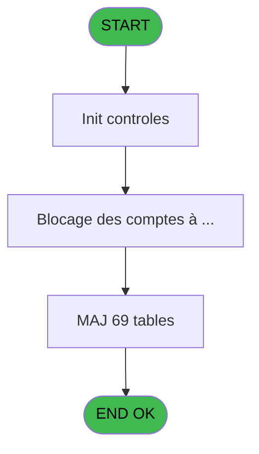
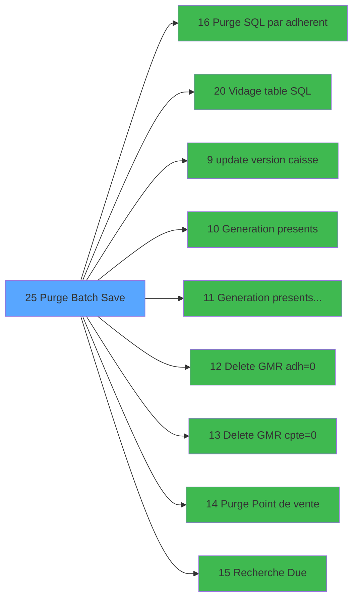

# PUG IDE 25 - Purge Batch Save

> **Analyse**: Phases 1-4 2026-02-03 18:35 -> 18:35 (19s) | Assemblage 18:35
> **Pipeline**: V7.2 Enrichi
> **Structure**: 4 onglets (Resume | Ecrans | Donnees | Connexions)

<!-- TAB:Resume -->

## 1. FICHE D'IDENTITE

| Attribut | Valeur |
|----------|--------|
| Projet | PUG |
| IDE Position | 25 |
| Nom Programme | Purge Batch Save |
| Fichier source | `Prg_25.xml` |
| Dossier IDE | General |
| Taches | 117 (15 ecrans visibles) |
| Tables modifiees | 69 |
| Programmes appeles | 9 |
| :warning: Statut | **ORPHELIN_POTENTIEL** |

## 2. DESCRIPTION FONCTIONNELLE

**Purge Batch Save** assure la gestion complete de ce processus.

Le flux de traitement s'organise en **5 blocs fonctionnels** :

- **Traitement** (97 taches) : traitements metier divers
- **Calcul** (14 taches) : calculs de montants, stocks ou compteurs
- **Creation** (4 taches) : insertion d'enregistrements en base (mouvements, prestations)
- **Saisie** (1 tache) : ecrans de saisie utilisateur (formulaires, champs, donnees)
- **Consultation** (1 tache) : ecrans de recherche, selection et consultation

**Donnees modifiees** : 69 tables en ecriture (transac_detail_bar, transac_entete_bar, bl_detail, reseau_cloture___rec, comptes_speciaux_spc, gm-recherche_____gmr, gm-complet_______gmc, hebergement______heb, personnel_go______go, client_gm, depot_garantie___dga, comptable________cte, change___________chg, compte_gm________cgm, ligne_telephone__lgn, compteurs________cpt, derniere_purge___pur, generation_code_gen, commande_autocom_cot, codes_autocom____aut, code_circuit, fichier_validation, code_vol_________vot, groupe_arr_dep___vol, fichier_echanges, historique, nb_code__poste, annulation_______anu, transactions_____tra, comptage_coffre_devise_histo, comptage_coffre_histo, comptage_coffre_montant_histo, comptage_caisse_devise_histo, comptage_caisse_histo, comptage_caisse_montant_histo, histo_sessions_caisse, histo_sessions_caisse_article, histo_sessions_caisse_detail, histo_sessions_caisse_devise, histo_sessions_caisse_remise, liste_user_pour_la_purge, vente, cc_comptable, cc_total_par_type, cc_total, cc_type_detail, ez_card, fi_complet_______gm_go, tai_gm, heure_de_passage, comptage_caisse_devise, Table_741, BarCreditConso, projet, regles_securite, password_interdit, password_historique, Table_750, checkout_log, emaillist, cafil_address_tmp, Country_ISO, comptes_speciaux_spc_cash, table_nettoyage, categorie_operation_mw, Boo_InfosReservation, arc_depot_garantie___dga, go_job, Table_977).

**Logique metier** : 3 regles identifiees couvrant conditions metier.

Detail : phases du traitement

#### Phase 1 : Consultation (1 tache)

- **25** - Affichage Background **[[ECRAN]](#ecran-t1)**

Delegue a : [   Recherche Due (IDE 15)](PUG-IDE-15.md)

#### Phase 2 : Traitement (97 taches)

- **25.1** - Station eteinte erreur v1
- **25.2** - Lecture paramètres PAR
- **25.3** - Lecture de date purge
- **25.5** - Lecture Paramètres tel
- **25.6** - Lecture Param Purge
- **25.7** - (sans nom)
- **25.8** - Veuillez patienter ... **[[ECRAN]](#ecran-t16)**
- **25.8.1** - Modif N° adherent
- **25.9** - Veuillez patienter ... **[[ECRAN]](#ecran-t24)**
- **25.9.1** - Zuppression GMR
- **25.9.2** - Purge telephone
- **25.9.2.1** - Opposition
- **25.9.2.1.1** - Ecriture ASCII
- **25.9.2.3** - Libeartion de la ligne
- **25.9.2.4** - Libeartion de la ligne
- **25.9.2.5** - Liberation du poste
- **25.9.2.6** - Generation codes
- **25.9.4** - Pour export conso
- **25.9.5** - Export conso
- **25.10** - Veuillez patienter ... **[[ECRAN]](#ecran-t62)**
- **25.10.1** - Zcopy change
- **25.10.1.1** - Zcopy change
- **25.10.2** - Zcopy lignes de solde
- **25.10.3** - Zcopy change
- **25.10.4** - Zcopy change
- **25.10.4.1** - Detail
- **25.10.5** - Zcopy change
- **25.10.6** - Zcopy change
- **25.10.7** - Zcopy change
- **25.10.8** - Zcopy change
- **25.10.9** - Zcopy change
- **25.10.10** - Purge TAIGM
- **25.10.11** - Veuillez patienter ... **[[ECRAN]](#ecran-t101)**
- **25.10.11.1** - Paramètres
- **25.10.11.2** - Liste USER
- **25.10.11.2.1** - Table USER
- **25.10.11.2.2** - Sessions
- **25.10.11.2.2.1** - Pointe USER
- **25.10.11.2.3** - Coffre
- **25.10.11.2.3.1** - Pointe USER
- **25.10.11.3** - (sans nom) **[[ECRAN]](#ecran-t110)**
- **25.10.11.3.1** - Session maxi
- **25.10.11.3.2** - Coffre maxi
- **25.10.11.3.3.1** - Montant
- **25.10.11.3.3.2** - Devise
- **25.10.11.3.4** - session
- **25.10.11.3.4.1** - detail
- **25.10.11.3.4.2** - article
- **25.10.11.3.4.3** - devise
- **25.10.11.3.4.4** - remise
- **25.10.11.3.5** - coffre
- **25.10.11.3.5.1** - montant
- **25.10.11.3.5.2** - devise
- **25.11** - Veuillez patienter ... **[[ECRAN]](#ecran-t124)**
- **25.12** - Veuillez patienter ... **[[ECRAN]](#ecran-t125)**
- **25.13** - Veuillez patienter ... **[[ECRAN]](#ecran-t126)**
- **25.14** - Veuillez patienter ... **[[ECRAN]](#ecran-t127)**
- **25.15** - Veuillez patienter ... **[[ECRAN]](#ecran-t128)**
- **25.16** - Veuillez patienter ... **[[ECRAN]](#ecran-t129)**
- **25.17** - Veuillez patienter ... **[[ECRAN]](#ecran-t131)**
- **25.18** - Traitement Annulation **[[ECRAN]](#ecran-t132)**
- **25.19** - Veuillez patienter ... **[[ECRAN]](#ecran-t133)**
- **25.20** - Veuillez patienter ... **[[ECRAN]](#ecran-t134)**
- **25.21** - MàJ date purge
- **25.22** - Deblocage clôture v1
- **25.10.4.2** - Archivage bar entete
- **25.10.4.1.1** - Archivage
- **25.10.9.1** - Achivage
- **25.9.1.1** - Archivage
- **25.10.3.1** - Archivage
- **25.9.3.1** - Archivage
- **25.10.12** - Archivage
- **25.10.5.1** - Archivage
- **25.10.7.1** - Archivage
- **25.10.6.1** - Archivage
- **25.10.8.1** - Archivage
- **25.10.2.1** - Archivage
- **25.10.10.1** - Archivage
- **25.9.6.1** - Archivage v1
- **25.9.7.1** - Archivage
- **25.9.8** - (sans nom)
- **25.23** - Ecrire ligne **[[ECRAN]](#ecran-t267)**
- **25.9.9.1** - Archivage
- **25.10.13** - Zcopy lignes de solde
- **25.10.13.1** - Archivage
- **25.9.10.1** - Archivage
- **25.24** - Annule adhérents à Purger SQL
- **25.9.7.2** - Archivage
- **25.9.3.2** - Archivage
- **25.9.6.2** - Archivage v1
- **25.25** - Station eteinte erreur v1
- **25.26** - Deblocage clôture v1
- **25.27** - Purge bokkinh orphelin
- **25.8.2** - Date max opération
- **25.28** - Purge bokkinh orphelin
- **25.8.3** - Check Pending Payment
- **25.29** - Purge bokkinh orphelin

Delegue a : [Purge SQL par adherent (IDE 16)](PUG-IDE-16.md), [Vidage table SQL (IDE 20)](PUG-IDE-20.md), [update version caisse (IDE 9)](PUG-IDE-9.md), [Generation presents (IDE 10)](PUG-IDE-10.md), [Generation presents temp (IDE 11)](PUG-IDE-11.md), [   Delete GMR adh=0 (IDE 12)](PUG-IDE-12.md), [   Delete GMR cpte=0 (IDE 13)](PUG-IDE-13.md)

#### Phase 3 : Calcul (14 taches)

- **25.4** - Lecture date comptable
- **25.8.1.1** - Comptes Speciaux
- **25.8.1.2** - Comptes Speciaux
- **25.8.1.3** - Comptes Speciaux
- **25.8.1.4** - Comptes Speciaux
- **25.8.1.5** - Comptes Speciaux
- **25.9.2.2** - Decrementation compteur TEL
- **25.9.3** - Zcopy comptable
- **25.10.11.3.3** - comptage caisse
- **25.9.6** - Zcopy comptable
- **25.9.7** - Zcopy comptable
- **25.9.8.1** - Export conso COMPTA **[[ECRAN]](#ecran-t257)**
- **25.9.9** - Zcopy comptable
- **25.9.10** - Zcopy comptable

#### Phase 4 : Creation (4 taches)

- **25.9.2.1.2** - Creation enreg commande tel
- **25.9.2.1.3** - Creation enreg commande tel
- **25.9.8.3** - Creation temp Conso **[[ECRAN]](#ecran-t259)**
- **25.9.2.1.4** - Creation enreg commande tel

#### Phase 5 : Saisie (1 tache)

- **25.9.8.2** - Export conso VENTE

Delegue a : [   Purge Point de vente (IDE 14)](PUG-IDE-14.md)

#### Tables impactees

| Table | Operations | Role metier |
|-------|-----------|-------------|
| gm-complet_______gmc | R/**W**/L (7 usages) |  |
| client_gm | **W**/L (5 usages) |  |
| comptable________cte | **W**/L (4 usages) |  |
| reseau_cloture___rec | **W** (4 usages) | Donnees reseau/cloture |
| histo_sessions_caisse | R/**W**/L (4 usages) | Sessions de caisse |
| liste_user_pour_la_purge | R/**W**/L (4 usages) |  |
| vente | **W**/L (4 usages) | Donnees de ventes |
| categorie_operation_mw | **W** (4 usages) | Operations comptables |
| hebergement______heb | **W**/L (4 usages) | Hebergement (chambres) |
| gm-recherche_____gmr | R/**W** (3 usages) | Index de recherche |
| comptage_coffre_histo | R/**W** (3 usages) | Etat du coffre |
| derniere_purge___pur | R/**W** (3 usages) |  |
| compte_gm________cgm | R/**W**/L (3 usages) | Comptes GM (generaux) |
| fichier_echanges | **W** (2 usages) |  |
| password_historique | **W** (2 usages) | Historique / journal |
| change___________chg | **W** (2 usages) |  |
| Boo_InfosReservation | R/**W** (2 usages) |  |
| Table_977 | **W** (1 usages) |  |
| historique | **W** (1 usages) | Historique / journal |
| heure_de_passage | **W** (1 usages) |  |
| groupe_arr_dep___vol | **W** (1 usages) |  |
| code_circuit | **W** (1 usages) |  |
| generation_code_gen | **W** (1 usages) |  |
| arc_depot_garantie___dga | **W** (1 usages) | Depots et garanties |
| comptage_caisse_montant_histo | **W** (1 usages) | Sessions de caisse |
| emaillist | **W** (1 usages) |  |
| regles_securite | **W** (1 usages) |  |
| Table_741 | **W** (1 usages) |  |
| histo_sessions_caisse_article | **W** (1 usages) | Articles et stock |
| go_job | **W** (1 usages) |  |
| transac_entete_bar | **W** (1 usages) |  |
| histo_sessions_caisse_detail | **W** (1 usages) | Sessions de caisse |
| projet | **W** (1 usages) |  |
| checkout_log | **W** (1 usages) |  |
| fichier_validation | **W** (1 usages) |  |
| bl_detail | **W** (1 usages) |  |
| tai_gm | **W** (1 usages) |  |
| depot_garantie___dga | **W** (1 usages) | Depots et garanties |
| cafil_address_tmp | **W** (1 usages) | Services / filieres |
| ez_card | **W** (1 usages) |  |
| password_interdit | **W** (1 usages) |  |
| histo_sessions_caisse_remise | **W** (1 usages) | Sessions de caisse |
| fi_complet_______gm_go | **W** (1 usages) |  |
| Table_750 | **W** (1 usages) |  |
| compteurs________cpt | **W** (1 usages) | Comptes GM (generaux) |
| comptes_speciaux_spc | **W** (1 usages) | Comptes GM (generaux) |
| comptage_coffre_montant_histo | **W** (1 usages) | Etat du coffre |
| transac_detail_bar | **W** (1 usages) |  |
| cc_total | **W** (1 usages) |  |
| comptes_speciaux_spc_cash | **W** (1 usages) | Comptes GM (generaux) |
| BarCreditConso | **W** (1 usages) |  |
| cc_comptable | **W** (1 usages) |  |
| comptage_caisse_devise | **W** (1 usages) | Sessions de caisse |
| table_nettoyage | **W** (1 usages) |  |
| transactions_____tra | **W** (1 usages) |  |
| code_vol_________vot | **W** (1 usages) |  |
| nb_code__poste | **W** (1 usages) |  |
| comptage_caisse_devise_histo | **W** (1 usages) | Sessions de caisse |
| comptage_coffre_devise_histo | **W** (1 usages) | Etat du coffre |
| cc_type_detail | **W** (1 usages) |  |
| ligne_telephone__lgn | **W** (1 usages) |  |
| codes_autocom____aut | **W** (1 usages) |  |
| personnel_go______go | **W** (1 usages) |  |
| commande_autocom_cot | **W** (1 usages) |  |
| histo_sessions_caisse_devise | **W** (1 usages) | Sessions de caisse |
| cc_total_par_type | **W** (1 usages) |  |
| Country_ISO | **W** (1 usages) |  |
| comptage_caisse_histo | **W** (1 usages) | Sessions de caisse |
| annulation_______anu | **W** (1 usages) |  |

## 3. BLOCS FONCTIONNELS

### 3.1 Consultation (1 tache)

Ecrans de recherche et consultation.

---

#### 25 - Affichage Background [[ECRAN]](#ecran-t1)

**Role** : Reinitialisation : Affichage Background.
**Ecran** : 475 x 128 DLU (MDI) | [Voir mockup](#ecran-t1)
**Delegue a** : [   Recherche Due (IDE 15)](PUG-IDE-15.md)

### 3.2 Traitement (97 taches)

Traitements internes.

---

#### 25.1 - Station eteinte erreur v1

**Role** : Traitement : Station eteinte erreur v1.

---

#### 25.2 - Lecture paramètres PAR

**Role** : Traitement : Lecture paramètres PAR.

---

#### 25.3 - Lecture de date purge

**Role** : Traitement : Lecture de date purge.
**Variables liees** : A (PI.date purge), C (Po.Purge OK), D (Po Message purge KO), H (W0 purge OK(0/1)), F (v. date comptable)

---

#### 25.5 - Lecture Paramètres tel

**Role** : Traitement : Lecture Paramètres tel.

---

#### 25.6 - Lecture Param Purge

**Role** : Traitement : Lecture Param Purge.
**Variables liees** : A (PI.date purge), C (Po.Purge OK), D (Po Message purge KO), H (W0 purge OK(0/1)), G (v. dernière purge)

---

#### 25.7 - (sans nom)

**Role** : Traitement interne.

---

#### 25.8 - Veuillez patienter ... [[ECRAN]](#ecran-t16)

**Role** : Traitement : Veuillez patienter ....
**Ecran** : 429 x 114 DLU (MDI) | [Voir mockup](#ecran-t16)

---

#### 25.8.1 - Modif N° adherent

**Role** : Traitement : Modif N° adherent.

---

#### 25.9 - Veuillez patienter ... [[ECRAN]](#ecran-t24)

**Role** : Traitement : Veuillez patienter ....
**Ecran** : 427 x 114 DLU (MDI) | [Voir mockup](#ecran-t24)

---

#### 25.9.1 - Zuppression GMR

**Role** : Traitement : Zuppression GMR.

---

#### 25.9.2 - Purge telephone

**Role** : Traitement : Purge telephone.
**Variables liees** : A (PI.date purge), C (Po.Purge OK), D (Po Message purge KO), H (W0 purge OK(0/1)), G (v. dernière purge)

---

#### 25.9.2.1 - Opposition

**Role** : Traitement : Opposition.

---

#### 25.9.2.1.1 - Ecriture ASCII

**Role** : Traitement : Ecriture ASCII.

---

#### 25.9.2.3 - Libeartion de la ligne

**Role** : Traitement : Libeartion de la ligne.

---

#### 25.9.2.4 - Libeartion de la ligne

**Role** : Traitement : Libeartion de la ligne.

---

#### 25.9.2.5 - Liberation du poste

**Role** : Traitement : Liberation du poste.

---

#### 25.9.2.6 - Generation codes

**Role** : Traitement : Generation codes.

---

#### 25.9.4 - Pour export conso

**Role** : Traitement : Pour export conso.

---

#### 25.9.5 - Export conso

**Role** : Traitement : Export conso.

---

#### 25.10 - Veuillez patienter ... [[ECRAN]](#ecran-t62)

**Role** : Traitement : Veuillez patienter ....
**Ecran** : 429 x 114 DLU (MDI) | [Voir mockup](#ecran-t62)

---

#### 25.10.1 - Zcopy change

**Role** : Traitement : Zcopy change.
**Variables liees** : U (W0 change bi)

---

#### 25.10.1.1 - Zcopy change

**Role** : Traitement : Zcopy change.
**Variables liees** : U (W0 change bi)

---

#### 25.10.2 - Zcopy lignes de solde

**Role** : Consultation/chargement : Zcopy lignes de solde.

---

#### 25.10.3 - Zcopy change

**Role** : Traitement : Zcopy change.
**Variables liees** : U (W0 change bi)

---

#### 25.10.4 - Zcopy change

**Role** : Traitement : Zcopy change.
**Variables liees** : U (W0 change bi)

---

#### 25.10.4.1 - Detail

**Role** : Traitement : Detail.

---

#### 25.10.5 - Zcopy change

**Role** : Traitement : Zcopy change.
**Variables liees** : U (W0 change bi)

---

#### 25.10.6 - Zcopy change

**Role** : Traitement : Zcopy change.
**Variables liees** : U (W0 change bi)

---

#### 25.10.7 - Zcopy change

**Role** : Traitement : Zcopy change.
**Variables liees** : U (W0 change bi)

---

#### 25.10.8 - Zcopy change

**Role** : Traitement : Zcopy change.
**Variables liees** : U (W0 change bi)

---

#### 25.10.9 - Zcopy change

**Role** : Traitement : Zcopy change.
**Variables liees** : U (W0 change bi)

---

#### 25.10.10 - Purge TAIGM

**Role** : Traitement : Purge TAIGM.
**Variables liees** : A (PI.date purge), C (Po.Purge OK), D (Po Message purge KO), H (W0 purge OK(0/1)), G (v. dernière purge)

---

#### 25.10.11 - Veuillez patienter ... [[ECRAN]](#ecran-t101)

**Role** : Traitement : Veuillez patienter ....
**Ecran** : 424 x 112 DLU (MDI) | [Voir mockup](#ecran-t101)

---

#### 25.10.11.1 - Paramètres

**Role** : Traitement : Paramètres.

---

#### 25.10.11.2 - Liste USER

**Role** : Traitement : Liste USER.

---

#### 25.10.11.2.1 - Table USER

**Role** : Traitement : Table USER.
**Variables liees** : F (v. date comptable)

---

#### 25.10.11.2.2 - Sessions

**Role** : Traitement : Sessions.

---

#### 25.10.11.2.2.1 - Pointe USER

**Role** : Traitement : Pointe USER.

---

#### 25.10.11.2.3 - Coffre

**Role** : Traitement : Coffre.

---

#### 25.10.11.2.3.1 - Pointe USER

**Role** : Traitement : Pointe USER.

---

#### 25.10.11.3 - (sans nom) [[ECRAN]](#ecran-t110)

**Role** : Traitement interne.
**Ecran** : 326 x 63 DLU (MDI) | [Voir mockup](#ecran-t110)

---

#### 25.10.11.3.1 - Session maxi

**Role** : Traitement : Session maxi.
**Variables liees** : S (L Session ouverte)

---

#### 25.10.11.3.2 - Coffre maxi

**Role** : Traitement : Coffre maxi.

---

#### 25.10.11.3.3.1 - Montant

**Role** : Traitement : Montant.

---

#### 25.10.11.3.3.2 - Devise

**Role** : Traitement : Devise.
**Variables liees** : Z (v Code Devise)

---

#### 25.10.11.3.4 - session

**Role** : Traitement : session.
**Variables liees** : S (L Session ouverte)

---

#### 25.10.11.3.4.1 - detail

**Role** : Traitement : detail.

---

#### 25.10.11.3.4.2 - article

**Role** : Traitement : article.

---

#### 25.10.11.3.4.3 - devise

**Role** : Traitement : devise.
**Variables liees** : Z (v Code Devise)

---

#### 25.10.11.3.4.4 - remise

**Role** : Calcul fidelite/avantage : remise.

---

#### 25.10.11.3.5 - coffre

**Role** : Traitement : coffre.

---

#### 25.10.11.3.5.1 - montant

**Role** : Traitement : montant.

---

#### 25.10.11.3.5.2 - devise

**Role** : Traitement : devise.
**Variables liees** : Z (v Code Devise)

---

#### 25.11 - Veuillez patienter ... [[ECRAN]](#ecran-t124)

**Role** : Traitement : Veuillez patienter ....
**Ecran** : 426 x 113 DLU (MDI) | [Voir mockup](#ecran-t124)

---

#### 25.12 - Veuillez patienter ... [[ECRAN]](#ecran-t125)

**Role** : Traitement : Veuillez patienter ....
**Ecran** : 427 x 114 DLU (MDI) | [Voir mockup](#ecran-t125)

---

#### 25.13 - Veuillez patienter ... [[ECRAN]](#ecran-t126)

**Role** : Traitement : Veuillez patienter ....
**Ecran** : 426 x 113 DLU (MDI) | [Voir mockup](#ecran-t126)

---

#### 25.14 - Veuillez patienter ... [[ECRAN]](#ecran-t127)

**Role** : Traitement : Veuillez patienter ....
**Ecran** : 427 x 31 DLU (MDI) | [Voir mockup](#ecran-t127)

---

#### 25.15 - Veuillez patienter ... [[ECRAN]](#ecran-t128)

**Role** : Traitement : Veuillez patienter ....
**Ecran** : 426 x 114 DLU (MDI) | [Voir mockup](#ecran-t128)

---

#### 25.16 - Veuillez patienter ... [[ECRAN]](#ecran-t129)

**Role** : Traitement : Veuillez patienter ....
**Ecran** : 430 x 31 DLU (MDI) | [Voir mockup](#ecran-t129)

---

#### 25.17 - Veuillez patienter ... [[ECRAN]](#ecran-t131)

**Role** : Traitement : Veuillez patienter ....
**Ecran** : 427 x 30 DLU (MDI) | [Voir mockup](#ecran-t131)

---

#### 25.18 - Traitement Annulation [[ECRAN]](#ecran-t132)

**Role** : Traitement : Traitement Annulation.
**Ecran** : 427 x 114 DLU (MDI) | [Voir mockup](#ecran-t132)

---

#### 25.19 - Veuillez patienter ... [[ECRAN]](#ecran-t133)

**Role** : Traitement : Veuillez patienter ....
**Ecran** : 427 x 114 DLU (MDI) | [Voir mockup](#ecran-t133)

---

#### 25.20 - Veuillez patienter ... [[ECRAN]](#ecran-t134)

**Role** : Traitement : Veuillez patienter ....
**Ecran** : 430 x 118 DLU (MDI) | [Voir mockup](#ecran-t134)

---

#### 25.21 - MàJ date purge

**Role** : Traitement : MàJ date purge.
**Variables liees** : A (PI.date purge), C (Po.Purge OK), D (Po Message purge KO), H (W0 purge OK(0/1)), F (v. date comptable)

---

#### 25.22 - Deblocage clôture v1

**Role** : Traitement : Deblocage clôture v1.

---

#### 25.10.4.2 - Archivage bar entete

**Role** : Traitement : Archivage bar entete.

---

#### 25.10.4.1.1 - Archivage

**Role** : Traitement : Archivage.

---

#### 25.10.9.1 - Achivage

**Role** : Traitement : Achivage.

---

#### 25.9.1.1 - Archivage

**Role** : Traitement : Archivage.

---

#### 25.10.3.1 - Archivage

**Role** : Traitement : Archivage.

---

#### 25.9.3.1 - Archivage

**Role** : Traitement : Archivage.

---

#### 25.10.12 - Archivage

**Role** : Traitement : Archivage.

---

#### 25.10.5.1 - Archivage

**Role** : Traitement : Archivage.

---

#### 25.10.7.1 - Archivage

**Role** : Traitement : Archivage.

---

#### 25.10.6.1 - Archivage

**Role** : Traitement : Archivage.

---

#### 25.10.8.1 - Archivage

**Role** : Traitement : Archivage.

---

#### 25.10.2.1 - Archivage

**Role** : Traitement : Archivage.

---

#### 25.10.10.1 - Archivage

**Role** : Traitement : Archivage.

---

#### 25.9.6.1 - Archivage v1

**Role** : Traitement : Archivage v1.

---

#### 25.9.7.1 - Archivage

**Role** : Traitement : Archivage.

---

#### 25.9.8 - (sans nom)

**Role** : Traitement interne.

---

#### 25.23 - Ecrire ligne [[ECRAN]](#ecran-t267)

**Role** : Traitement : Ecrire ligne.
**Ecran** : 673 x 0 DLU | [Voir mockup](#ecran-t267)

---

#### 25.9.9.1 - Archivage

**Role** : Traitement : Archivage.

---

#### 25.10.13 - Zcopy lignes de solde

**Role** : Consultation/chargement : Zcopy lignes de solde.

---

#### 25.10.13.1 - Archivage

**Role** : Traitement : Archivage.

---

#### 25.9.10.1 - Archivage

**Role** : Traitement : Archivage.

---

#### 25.24 - Annule adhérents à Purger SQL

**Role** : Traitement : Annule adhérents à Purger SQL.

---

#### 25.9.7.2 - Archivage

**Role** : Traitement : Archivage.

---

#### 25.9.3.2 - Archivage

**Role** : Traitement : Archivage.

---

#### 25.9.6.2 - Archivage v1

**Role** : Traitement : Archivage v1.

---

#### 25.25 - Station eteinte erreur v1

**Role** : Traitement : Station eteinte erreur v1.

---

#### 25.26 - Deblocage clôture v1

**Role** : Traitement : Deblocage clôture v1.

---

#### 25.27 - Purge bokkinh orphelin

**Role** : Traitement : Purge bokkinh orphelin.
**Variables liees** : A (PI.date purge), C (Po.Purge OK), D (Po Message purge KO), H (W0 purge OK(0/1)), G (v. dernière purge)

---

#### 25.8.2 - Date max opération

**Role** : Traitement : Date max opération.
**Variables liees** : A (PI.date purge), F (v. date comptable)

---

#### 25.28 - Purge bokkinh orphelin

**Role** : Traitement : Purge bokkinh orphelin.
**Variables liees** : A (PI.date purge), C (Po.Purge OK), D (Po Message purge KO), H (W0 purge OK(0/1)), G (v. dernière purge)

---

#### 25.8.3 - Check Pending Payment

**Role** : Traitement : Check Pending Payment.

---

#### 25.29 - Purge bokkinh orphelin

**Role** : Traitement : Purge bokkinh orphelin.
**Variables liees** : A (PI.date purge), C (Po.Purge OK), D (Po Message purge KO), H (W0 purge OK(0/1)), G (v. dernière purge)

### 3.3 Calcul (14 taches)

Calculs metier : montants, stocks, compteurs.

---

#### 25.4 - Lecture date comptable

**Role** : Traitement : Lecture date comptable.
**Variables liees** : A (PI.date purge), F (v. date comptable)

---

#### 25.8.1.1 - Comptes Speciaux

**Role** : Traitement : Comptes Speciaux.

---

#### 25.8.1.2 - Comptes Speciaux

**Role** : Traitement : Comptes Speciaux.

---

#### 25.8.1.3 - Comptes Speciaux

**Role** : Traitement : Comptes Speciaux.

---

#### 25.8.1.4 - Comptes Speciaux

**Role** : Traitement : Comptes Speciaux.

---

#### 25.8.1.5 - Comptes Speciaux

**Role** : Traitement : Comptes Speciaux.

---

#### 25.9.2.2 - Decrementation compteur TEL

**Role** : Calcul : Decrementation compteur TEL.

---

#### 25.9.3 - Zcopy comptable

**Role** : Traitement : Zcopy comptable.
**Variables liees** : F (v. date comptable)

---

#### 25.10.11.3.3 - comptage caisse

**Role** : Traitement : comptage caisse.
**Variables liees** : V (W0 nouvelle gestion caisse)

---

#### 25.9.6 - Zcopy comptable

**Role** : Traitement : Zcopy comptable.
**Variables liees** : F (v. date comptable)

---

#### 25.9.7 - Zcopy comptable

**Role** : Traitement : Zcopy comptable.
**Variables liees** : F (v. date comptable)

---

#### 25.9.8.1 - Export conso COMPTA [[ECRAN]](#ecran-t257)

**Role** : Traitement : Export conso COMPTA.
**Ecran** : 673 x 362 DLU (MDI) | [Voir mockup](#ecran-t257)
**Variables liees** : F (v. date comptable)

---

#### 25.9.9 - Zcopy comptable

**Role** : Traitement : Zcopy comptable.
**Variables liees** : F (v. date comptable)

---

#### 25.9.10 - Zcopy comptable

**Role** : Traitement : Zcopy comptable.
**Variables liees** : F (v. date comptable)

### 3.4 Creation (4 taches)

Insertion de nouveaux enregistrements en base.

---

#### 25.9.2.1.2 - Creation enreg commande tel

**Role** : Creation d'enregistrement : Creation enreg commande tel.

---

#### 25.9.2.1.3 - Creation enreg commande tel

**Role** : Creation d'enregistrement : Creation enreg commande tel.

---

#### 25.9.8.3 - Creation temp Conso [[ECRAN]](#ecran-t259)

**Role** : Creation d'enregistrement : Creation temp Conso.
**Ecran** : 248 x 36 DLU | [Voir mockup](#ecran-t259)

---

#### 25.9.2.1.4 - Creation enreg commande tel

**Role** : Creation d'enregistrement : Creation enreg commande tel.

### 3.5 Saisie (1 tache)

Ce bloc traite la saisie des donnees de la transaction.

---

#### 25.9.8.2 - Export conso VENTE

**Role** : Saisie des donnees : Export conso VENTE.
**Delegue a** : [   Purge Point de vente (IDE 14)](PUG-IDE-14.md)

## 5. REGLES METIER

3 regles identifiees:

### Autres (3 regles)

#### [RM-001] Traitement conditionnel si Po Message purge KO [D] est a zero

| Element | Detail |
|---------|--------|
| **Condition** | `Po Message purge KO [D]=0` |
| **Si vrai** | 'Anomalie lors du dernier traitement de purge' |
| **Si faux** | 'OK') |
| **Variables** | D (Po Message purge KO) |
| **Expression source** | Expression 7 : `IF (Po Message purge KO [D]=0,'Anomalie lors du dernier trai` |
| **Exemple** | Si Po Message purge KO [D]=0 → 'Anomalie lors du dernier traitement de purge'. Sinon → 'OK') |
| **Impact** | [25.9.2 - Purge telephone](#t27) |

#### [RM-002] Traitement conditionnel si Pi.Code adhérent (Facu... [B] est a zero

| Element | Detail |
|---------|--------|
| **Condition** | `Pi.Code adhérent (Facu... [B]=0` |
| **Si vrai** | 120 |
| **Si faux** | 1) |
| **Expression source** | Expression 9 : `IF (Pi.Code adhérent (Facu... [B]=0,120,1)` |
| **Exemple** | Si Pi.Code adhérent (Facu... [B]=0 → 120. Sinon → 1) |

#### [RM-003] Traitement conditionnel si Po.Purge OK [C] est a zero

| Element | Detail |
|---------|--------|
| **Condition** | `Po.Purge OK [C]=0` |
| **Si vrai** | 120 |
| **Si faux** | 1) |
| **Variables** | C (Po.Purge OK) |
| **Expression source** | Expression 10 : `IF (Po.Purge OK [C]=0,120,1)` |
| **Exemple** | Si Po.Purge OK [C]=0 → 120. Sinon → 1) |
| **Impact** | [25.9.2 - Purge telephone](#t27) |

## 6. CONTEXTE

- **Appele par**: (aucun)
- **Appelle**: 9 programmes | **Tables**: 86 (W:69 R:16 L:17) | **Taches**: 117 | **Expressions**: 22

<!-- TAB:Ecrans -->

## 8. ECRANS

### 8.1 Forms visibles (15 / 117)

| # | Position | Tache | Nom | Type | Largeur | Hauteur | Bloc |
|---|----------|-------|-----|------|---------|---------|------|
| 1 | 25.10 | 25.8 | Veuillez patienter ... | MDI | 429 | 114 | Traitement |
| 2 | 25.11 | 25.9 | Veuillez patienter ... | MDI | 427 | 114 | Traitement |
| 3 | 25.12 | 25.10 | Veuillez patienter ... | MDI | 429 | 114 | Traitement |
| 4 | 25.12.13 | 25.10.11 | Veuillez patienter ... | MDI | 424 | 112 | Traitement |
| 5 | 25.12.13.3 | 25.10.11.3 | (sans nom) | MDI | 326 | 63 | Traitement |
| 6 | 25.13 | 25.11 | Veuillez patienter ... | MDI | 426 | 113 | Traitement |
| 7 | 25.14 | 25.12 | Veuillez patienter ... | MDI | 427 | 114 | Traitement |
| 8 | 25.15 | 25.13 | Veuillez patienter ... | MDI | 426 | 113 | Traitement |
| 9 | 25.16 | 25.14 | Veuillez patienter ... | MDI | 427 | 31 | Traitement |
| 10 | 25.17 | 25.15 | Veuillez patienter ... | MDI | 426 | 114 | Traitement |
| 11 | 25.18 | 25.16 | Veuillez patienter ... | MDI | 430 | 31 | Traitement |
| 12 | 25.19 | 25.17 | Veuillez patienter ... | MDI | 427 | 30 | Traitement |
| 13 | 25.20 | 25.18 | Traitement Annulation | MDI | 427 | 114 | Traitement |
| 14 | 25.21 | 25.19 | Veuillez patienter ... | MDI | 427 | 114 | Traitement |
| 15 | 25.22 | 25.20 | Veuillez patienter ... | MDI | 430 | 118 | Traitement |

### 8.2 Mockups Ecrans

---

#### 25.10 - Veuillez patienter ...
**Tache** : [25.8](#t16) | **Type** : MDI | **Dimensions** : 429 x 114 DLU
**Bloc** : Traitement | **Titre IDE** : Veuillez patienter ...

<!-- FORM-DATA:
{
    "width":  429,
    "vFactor":  8,
    "type":  "MDI",
    "hFactor":  8,
    "controls":  [
                     {
                         "x":  0,
                         "type":  "label",
                         "var":  "",
                         "y":  0,
                         "w":  423,
                         "fmt":  "",
                         "name":  "",
                         "h":  29,
                         "color":  "",
                         "text":  "",
                         "parent":  null
                     },
                     {
                         "x":  109,
                         "type":  "label",
                         "var":  "",
                         "y":  10,
                         "w":  275,
                         "fmt":  "",
                         "name":  "",
                         "h":  8,
                         "color":  "7",
                         "text":  "Lecture des comptes GM",
                         "parent":  null
                     },
                     {
                         "x":  0,
                         "type":  "label",
                         "var":  "",
                         "y":  29,
                         "w":  423,
                         "fmt":  "",
                         "name":  "",
                         "h":  83,
                         "color":  "",
                         "text":  "",
                         "parent":  null
                     },
                     {
                         "x":  60,
                         "type":  "table",
                         "var":  "",
                         "name":  "",
                         "titleH":  16,
                         "color":  "110",
                         "w":  310,
                         "y":  37,
                         "fmt":  "",
                         "parent":  null,
                         "text":  "",
                         "rowH":  13,
                         "h":  69,
                         "cols":  [
                                      {
                                          "title":  "Code adhérent",
                                          "layer":  1,
                                          "w":  149
                                      },
                                      {
                                          "title":  "Date limite de solde",
                                          "layer":  2,
                                          "w":  154
                                      }
                                  ],
                         "rows":  2
                     },
                     {
                         "x":  1,
                         "type":  "image",
                         "var":  "",
                         "y":  2,
                         "w":  72,
                         "fmt":  "",
                         "name":  "",
                         "h":  25,
                         "color":  "",
                         "text":  "",
                         "parent":  null
                     },
                     {
                         "x":  81,
                         "type":  "edit",
                         "var":  "",
                         "y":  57,
                         "w":  98,
                         "fmt":  "",
                         "name":  "",
                         "h":  8,
                         "color":  "110",
                         "text":  "",
                         "parent":  5
                     },
                     {
                         "x":  223,
                         "type":  "edit",
                         "var":  "",
                         "y":  57,
                         "w":  120,
                         "fmt":  "##/##/####Z",
                         "name":  "",
                         "h":  8,
                         "color":  "110",
                         "text":  "",
                         "parent":  5
                     }
                 ],
    "taskId":  "25.10",
    "height":  114
}
-->

<strong>Champs : 2 champs</strong>

| Pos (x,y) | Nom | Variable | Type |
|-----------|-----|----------|------|
| 81,57 | (sans nom) | - | edit |
| 223,57 | ##/##/####Z | - | edit |

---

#### 25.11 - Veuillez patienter ...
**Tache** : [25.9](#t24) | **Type** : MDI | **Dimensions** : 427 x 114 DLU
**Bloc** : Traitement | **Titre IDE** : Veuillez patienter ...

<!-- FORM-DATA:
{
    "width":  427,
    "vFactor":  8,
    "type":  "MDI",
    "hFactor":  8,
    "controls":  [
                     {
                         "x":  0,
                         "type":  "label",
                         "var":  "",
                         "y":  0,
                         "w":  423,
                         "fmt":  "",
                         "name":  "",
                         "h":  29,
                         "color":  "",
                         "text":  "",
                         "parent":  null
                     },
                     {
                         "x":  48,
                         "type":  "label",
                         "var":  "",
                         "y":  8,
                         "w":  8,
                         "fmt":  "",
                         "name":  "",
                         "h":  8,
                         "color":  "155",
                         "text":  "Ü",
                         "parent":  null
                     },
                     {
                         "x":  85,
                         "type":  "label",
                         "var":  "",
                         "y":  10,
                         "w":  326,
                         "fmt":  "",
                         "name":  "",
                         "h":  8,
                         "color":  "7",
                         "text":  "Purge en cours (1 ère Partie) ...",
                         "parent":  null
                     },
                     {
                         "x":  0,
                         "type":  "label",
                         "var":  "",
                         "y":  29,
                         "w":  423,
                         "fmt":  "",
                         "name":  "",
                         "h":  83,
                         "color":  "",
                         "text":  "",
                         "parent":  null
                     },
                     {
                         "x":  60,
                         "type":  "table",
                         "var":  "",
                         "name":  "",
                         "titleH":  16,
                         "color":  "110",
                         "w":  310,
                         "y":  37,
                         "fmt":  "",
                         "parent":  null,
                         "text":  "",
                         "rowH":  13,
                         "h":  69,
                         "cols":  [
                                      {
                                          "title":  "Code adhérent",
                                          "layer":  1,
                                          "w":  152
                                      },
                                      {
                                          "title":  "Date limite de solde",
                                          "layer":  2,
                                          "w":  151
                                      }
                                  ],
                         "rows":  2
                     },
                     {
                         "x":  1,
                         "type":  "image",
                         "var":  "",
                         "y":  2,
                         "w":  72,
                         "fmt":  "",
                         "name":  "",
                         "h":  25,
                         "color":  "",
                         "text":  "",
                         "parent":  null
                     },
                     {
                         "x":  81,
                         "type":  "edit",
                         "var":  "",
                         "y":  56,
                         "w":  98,
                         "fmt":  "",
                         "name":  "",
                         "h":  8,
                         "color":  "110",
                         "text":  "",
                         "parent":  6
                     },
                     {
                         "x":  223,
                         "type":  "edit",
                         "var":  "",
                         "y":  56,
                         "w":  120,
                         "fmt":  "##/##/####Z",
                         "name":  "",
                         "h":  8,
                         "color":  "110",
                         "text":  "",
                         "parent":  6
                     }
                 ],
    "taskId":  "25.11",
    "height":  114
}
-->

<strong>Champs : 2 champs</strong>

| Pos (x,y) | Nom | Variable | Type |
|-----------|-----|----------|------|
| 81,56 | (sans nom) | - | edit |
| 223,56 | ##/##/####Z | - | edit |

---

#### 25.12 - Veuillez patienter ...
**Tache** : [25.10](#t62) | **Type** : MDI | **Dimensions** : 429 x 114 DLU
**Bloc** : Traitement | **Titre IDE** : Veuillez patienter ...

<!-- FORM-DATA:
{
    "width":  429,
    "vFactor":  8,
    "type":  "MDI",
    "hFactor":  8,
    "controls":  [
                     {
                         "x":  0,
                         "type":  "label",
                         "var":  "",
                         "y":  0,
                         "w":  423,
                         "fmt":  "",
                         "name":  "",
                         "h":  29,
                         "color":  "",
                         "text":  "",
                         "parent":  null
                     },
                     {
                         "x":  85,
                         "type":  "label",
                         "var":  "",
                         "y":  10,
                         "w":  326,
                         "fmt":  "",
                         "name":  "",
                         "h":  8,
                         "color":  "7",
                         "text":  "Purge en cours (2 ème Partie) ...",
                         "parent":  null
                     },
                     {
                         "x":  0,
                         "type":  "label",
                         "var":  "",
                         "y":  29,
                         "w":  423,
                         "fmt":  "",
                         "name":  "",
                         "h":  83,
                         "color":  "",
                         "text":  "",
                         "parent":  null
                     },
                     {
                         "x":  60,
                         "type":  "table",
                         "var":  "",
                         "name":  "",
                         "titleH":  16,
                         "color":  "110",
                         "w":  312,
                         "y":  37,
                         "fmt":  "",
                         "parent":  null,
                         "text":  "",
                         "rowH":  13,
                         "h":  69,
                         "cols":  [
                                      {
                                          "title":  "Code adhérent",
                                          "layer":  1,
                                          "w":  147
                                      },
                                      {
                                          "title":  "Date limite de solde",
                                          "layer":  2,
                                          "w":  156
                                      }
                                  ],
                         "rows":  2
                     },
                     {
                         "x":  1,
                         "type":  "image",
                         "var":  "",
                         "y":  2,
                         "w":  72,
                         "fmt":  "",
                         "name":  "",
                         "h":  25,
                         "color":  "",
                         "text":  "",
                         "parent":  null
                     },
                     {
                         "x":  81,
                         "type":  "edit",
                         "var":  "",
                         "y":  56,
                         "w":  98,
                         "fmt":  "",
                         "name":  "",
                         "h":  8,
                         "color":  "110",
                         "text":  "",
                         "parent":  5
                     },
                     {
                         "x":  223,
                         "type":  "edit",
                         "var":  "",
                         "y":  56,
                         "w":  120,
                         "fmt":  "##/##/####Z",
                         "name":  "",
                         "h":  8,
                         "color":  "110",
                         "text":  "",
                         "parent":  5
                     }
                 ],
    "taskId":  "25.12",
    "height":  114
}
-->

<strong>Champs : 2 champs</strong>

| Pos (x,y) | Nom | Variable | Type |
|-----------|-----|----------|------|
| 81,56 | (sans nom) | - | edit |
| 223,56 | ##/##/####Z | - | edit |

---

#### 25.12.13 - Veuillez patienter ...
**Tache** : [25.10.11](#t101) | **Type** : MDI | **Dimensions** : 424 x 112 DLU
**Bloc** : Traitement | **Titre IDE** : Veuillez patienter ...

<!-- FORM-DATA:
{
    "width":  424,
    "vFactor":  8,
    "type":  "MDI",
    "hFactor":  8,
    "controls":  [
                     {
                         "x":  91,
                         "type":  "label",
                         "var":  "",
                         "y":  9,
                         "w":  326,
                         "fmt":  "",
                         "name":  "",
                         "h":  8,
                         "color":  "7",
                         "text":  "Purge caisse en cours ...",
                         "parent":  null
                     },
                     {
                         "x":  7,
                         "type":  "image",
                         "var":  "",
                         "y":  1,
                         "w":  72,
                         "fmt":  "",
                         "name":  "",
                         "h":  25,
                         "color":  "",
                         "text":  "",
                         "parent":  null
                     }
                 ],
    "taskId":  "25.12.13",
    "height":  112
}
-->

---

#### 25.12.13.3 - (sans nom)
**Tache** : [25.10.11.3](#t110) | **Type** : MDI | **Dimensions** : 326 x 63 DLU
**Bloc** : Traitement | **Titre IDE** : (sans nom)

<!-- FORM-DATA:
{
    "width":  326,
    "vFactor":  8,
    "type":  "MDI",
    "hFactor":  8,
    "controls":  [
                     {
                         "x":  71,
                         "type":  "table",
                         "var":  "",
                         "name":  "",
                         "titleH":  12,
                         "color":  "110",
                         "w":  186,
                         "y":  0,
                         "fmt":  "",
                         "parent":  null,
                         "text":  "",
                         "rowH":  14,
                         "h":  54,
                         "cols":  [
                                      {
                                          "title":  "User",
                                          "layer":  1,
                                          "w":  177
                                      }
                                  ],
                         "rows":  1
                     },
                     {
                         "x":  75,
                         "type":  "edit",
                         "var":  "",
                         "y":  14,
                         "w":  104,
                         "fmt":  "",
                         "name":  "",
                         "h":  10,
                         "color":  "110",
                         "text":  "",
                         "parent":  1
                     }
                 ],
    "taskId":  "25.12.13.3",
    "height":  63
}
-->

<strong>Champs : 1 champs</strong>

| Pos (x,y) | Nom | Variable | Type |
|-----------|-----|----------|------|
| 75,14 | (sans nom) | - | edit |

---

#### 25.13 - Veuillez patienter ...
**Tache** : [25.11](#t124) | **Type** : MDI | **Dimensions** : 426 x 113 DLU
**Bloc** : Traitement | **Titre IDE** : Veuillez patienter ...

<!-- FORM-DATA:
{
    "width":  426,
    "vFactor":  8,
    "type":  "MDI",
    "hFactor":  8,
    "controls":  [
                     {
                         "x":  0,
                         "type":  "label",
                         "var":  "",
                         "y":  0,
                         "w":  423,
                         "fmt":  "",
                         "name":  "",
                         "h":  29,
                         "color":  "",
                         "text":  "",
                         "parent":  null
                     },
                     {
                         "x":  85,
                         "type":  "label",
                         "var":  "",
                         "y":  3,
                         "w":  326,
                         "fmt":  "",
                         "name":  "",
                         "h":  13,
                         "color":  "7",
                         "text":  "Purge en cours (3 ème Partie) ...",
                         "parent":  null
                     },
                     {
                         "x":  85,
                         "type":  "label",
                         "var":  "",
                         "y":  18,
                         "w":  326,
                         "fmt":  "",
                         "name":  "",
                         "h":  8,
                         "color":  "7",
                         "text":  "Groupe Arrivee / Depart",
                         "parent":  null
                     },
                     {
                         "x":  0,
                         "type":  "label",
                         "var":  "",
                         "y":  29,
                         "w":  423,
                         "fmt":  "",
                         "name":  "",
                         "h":  83,
                         "color":  "",
                         "text":  "",
                         "parent":  null
                     },
                     {
                         "x":  60,
                         "type":  "table",
                         "var":  "",
                         "name":  "",
                         "titleH":  16,
                         "color":  "110",
                         "w":  310,
                         "y":  37,
                         "fmt":  "",
                         "parent":  null,
                         "text":  "",
                         "rowH":  13,
                         "h":  69,
                         "cols":  [
                                      {
                                          "title":  "A/R",
                                          "layer":  1,
                                          "w":  53
                                      },
                                      {
                                          "title":  "Date du vol",
                                          "layer":  2,
                                          "w":  142
                                      },
                                      {
                                          "title":  "Code du vol",
                                          "layer":  3,
                                          "w":  108
                                      }
                                  ],
                         "rows":  3
                     },
                     {
                         "x":  1,
                         "type":  "image",
                         "var":  "",
                         "y":  2,
                         "w":  72,
                         "fmt":  "",
                         "name":  "",
                         "h":  25,
                         "color":  "",
                         "text":  "",
                         "parent":  null
                     },
                     {
                         "x":  79,
                         "type":  "edit",
                         "var":  "",
                         "y":  56,
                         "w":  19,
                         "fmt":  "",
                         "name":  "",
                         "h":  8,
                         "color":  "110",
                         "text":  "",
                         "parent":  6
                     },
                     {
                         "x":  124,
                         "type":  "edit",
                         "var":  "",
                         "y":  56,
                         "w":  120,
                         "fmt":  "",
                         "name":  "",
                         "h":  8,
                         "color":  "110",
                         "text":  "",
                         "parent":  6
                     },
                     {
                         "x":  271,
                         "type":  "edit",
                         "var":  "",
                         "y":  56,
                         "w":  75,
                         "fmt":  "",
                         "name":  "",
                         "h":  8,
                         "color":  "110",
                         "text":  "",
                         "parent":  6
                     }
                 ],
    "taskId":  "25.13",
    "height":  113
}
-->

<strong>Champs : 3 champs</strong>

| Pos (x,y) | Nom | Variable | Type |
|-----------|-----|----------|------|
| 79,56 | (sans nom) | - | edit |
| 124,56 | (sans nom) | - | edit |
| 271,56 | (sans nom) | - | edit |

---

#### 25.14 - Veuillez patienter ...
**Tache** : [25.12](#t125) | **Type** : MDI | **Dimensions** : 427 x 114 DLU
**Bloc** : Traitement | **Titre IDE** : Veuillez patienter ...

<!-- FORM-DATA:
{
    "width":  427,
    "vFactor":  8,
    "type":  "MDI",
    "hFactor":  8,
    "controls":  [
                     {
                         "x":  0,
                         "type":  "label",
                         "var":  "",
                         "y":  0,
                         "w":  423,
                         "fmt":  "",
                         "name":  "",
                         "h":  29,
                         "color":  "",
                         "text":  "",
                         "parent":  null
                     },
                     {
                         "x":  85,
                         "type":  "label",
                         "var":  "",
                         "y":  3,
                         "w":  326,
                         "fmt":  "",
                         "name":  "",
                         "h":  13,
                         "color":  "7",
                         "text":  "Purge en cours (3 ème Partie) ...",
                         "parent":  null
                     },
                     {
                         "x":  85,
                         "type":  "label",
                         "var":  "",
                         "y":  18,
                         "w":  326,
                         "fmt":  "",
                         "name":  "",
                         "h":  8,
                         "color":  "7",
                         "text":  "Code vol",
                         "parent":  null
                     },
                     {
                         "x":  0,
                         "type":  "label",
                         "var":  "",
                         "y":  29,
                         "w":  423,
                         "fmt":  "",
                         "name":  "",
                         "h":  83,
                         "color":  "",
                         "text":  "",
                         "parent":  null
                     },
                     {
                         "x":  60,
                         "type":  "table",
                         "var":  "",
                         "name":  "",
                         "titleH":  16,
                         "color":  "110",
                         "w":  313,
                         "y":  36,
                         "fmt":  "",
                         "parent":  null,
                         "text":  "",
                         "rowH":  13,
                         "h":  69,
                         "cols":  [
                                      {
                                          "title":  "A/R",
                                          "layer":  1,
                                          "w":  58
                                      },
                                      {
                                          "title":  "Date du vol",
                                          "layer":  2,
                                          "w":  136
                                      },
                                      {
                                          "title":  "Code du vol",
                                          "layer":  3,
                                          "w":  114
                                      }
                                  ],
                         "rows":  3
                     },
                     {
                         "x":  1,
                         "type":  "image",
                         "var":  "",
                         "y":  2,
                         "w":  72,
                         "fmt":  "",
                         "name":  "",
                         "h":  25,
                         "color":  "",
                         "text":  "",
                         "parent":  null
                     },
                     {
                         "x":  79,
                         "type":  "edit",
                         "var":  "",
                         "y":  56,
                         "w":  19,
                         "fmt":  "",
                         "name":  "",
                         "h":  8,
                         "color":  "110",
                         "text":  "",
                         "parent":  6
                     },
                     {
                         "x":  124,
                         "type":  "edit",
                         "var":  "",
                         "y":  56,
                         "w":  120,
                         "fmt":  "",
                         "name":  "",
                         "h":  8,
                         "color":  "110",
                         "text":  "",
                         "parent":  6
                     },
                     {
                         "x":  271,
                         "type":  "edit",
                         "var":  "",
                         "y":  56,
                         "w":  75,
                         "fmt":  "",
                         "name":  "",
                         "h":  8,
                         "color":  "110",
                         "text":  "",
                         "parent":  6
                     }
                 ],
    "taskId":  "25.14",
    "height":  114
}
-->

<strong>Champs : 3 champs</strong>

| Pos (x,y) | Nom | Variable | Type |
|-----------|-----|----------|------|
| 79,56 | (sans nom) | - | edit |
| 124,56 | (sans nom) | - | edit |
| 271,56 | (sans nom) | - | edit |

---

#### 25.15 - Veuillez patienter ...
**Tache** : [25.13](#t126) | **Type** : MDI | **Dimensions** : 426 x 113 DLU
**Bloc** : Traitement | **Titre IDE** : Veuillez patienter ...

<!-- FORM-DATA:
{
    "width":  426,
    "vFactor":  8,
    "type":  "MDI",
    "hFactor":  8,
    "controls":  [
                     {
                         "x":  0,
                         "type":  "label",
                         "var":  "",
                         "y":  0,
                         "w":  423,
                         "fmt":  "",
                         "name":  "",
                         "h":  29,
                         "color":  "",
                         "text":  "",
                         "parent":  null
                     },
                     {
                         "x":  85,
                         "type":  "label",
                         "var":  "",
                         "y":  3,
                         "w":  326,
                         "fmt":  "",
                         "name":  "",
                         "h":  13,
                         "color":  "7",
                         "text":  "Purge en cours (5 ème Partie) ...",
                         "parent":  null
                     },
                     {
                         "x":  85,
                         "type":  "label",
                         "var":  "",
                         "y":  18,
                         "w":  326,
                         "fmt":  "",
                         "name":  "",
                         "h":  8,
                         "color":  "7",
                         "text":  "Code circuit",
                         "parent":  null
                     },
                     {
                         "x":  0,
                         "type":  "label",
                         "var":  "",
                         "y":  29,
                         "w":  423,
                         "fmt":  "",
                         "name":  "",
                         "h":  83,
                         "color":  "",
                         "text":  "",
                         "parent":  null
                     },
                     {
                         "x":  84,
                         "type":  "table",
                         "var":  "",
                         "name":  "",
                         "titleH":  16,
                         "color":  "110",
                         "w":  261,
                         "y":  36,
                         "fmt":  "",
                         "parent":  null,
                         "text":  "",
                         "rowH":  13,
                         "h":  69,
                         "cols":  [
                                      {
                                          "title":  "Date début",
                                          "layer":  1,
                                          "w":  138
                                      },
                                      {
                                          "title":  "Code Circuit",
                                          "layer":  2,
                                          "w":  117
                                      }
                                  ],
                         "rows":  2
                     },
                     {
                         "x":  1,
                         "type":  "image",
                         "var":  "",
                         "y":  2,
                         "w":  72,
                         "fmt":  "",
                         "name":  "",
                         "h":  25,
                         "color":  "",
                         "text":  "",
                         "parent":  null
                     },
                     {
                         "x":  95,
                         "type":  "edit",
                         "var":  "",
                         "y":  56,
                         "w":  120,
                         "fmt":  "",
                         "name":  "",
                         "h":  8,
                         "color":  "110",
                         "text":  "",
                         "parent":  6
                     },
                     {
                         "x":  242,
                         "type":  "edit",
                         "var":  "",
                         "y":  56,
                         "w":  75,
                         "fmt":  "",
                         "name":  "",
                         "h":  8,
                         "color":  "110",
                         "text":  "",
                         "parent":  6
                     }
                 ],
    "taskId":  "25.15",
    "height":  113
}
-->

<strong>Champs : 2 champs</strong>

| Pos (x,y) | Nom | Variable | Type |
|-----------|-----|----------|------|
| 95,56 | (sans nom) | - | edit |
| 242,56 | (sans nom) | - | edit |

---

#### 25.16 - Veuillez patienter ...
**Tache** : [25.14](#t127) | **Type** : MDI | **Dimensions** : 427 x 31 DLU
**Bloc** : Traitement | **Titre IDE** : Veuillez patienter ...

<!-- FORM-DATA:
{
    "width":  427,
    "vFactor":  8,
    "type":  "MDI",
    "hFactor":  8,
    "controls":  [
                     {
                         "x":  0,
                         "type":  "label",
                         "var":  "",
                         "y":  0,
                         "w":  423,
                         "fmt":  "",
                         "name":  "",
                         "h":  29,
                         "color":  "",
                         "text":  "",
                         "parent":  null
                     },
                     {
                         "x":  85,
                         "type":  "label",
                         "var":  "",
                         "y":  3,
                         "w":  326,
                         "fmt":  "",
                         "name":  "",
                         "h":  13,
                         "color":  "7",
                         "text":  "Purge en cours (6 ème Partie) ...",
                         "parent":  null
                     },
                     {
                         "x":  85,
                         "type":  "label",
                         "var":  "",
                         "y":  18,
                         "w":  326,
                         "fmt":  "",
                         "name":  "",
                         "h":  8,
                         "color":  "7",
                         "text":  "Chambres indisponibles",
                         "parent":  null
                     },
                     {
                         "x":  1,
                         "type":  "image",
                         "var":  "",
                         "y":  2,
                         "w":  72,
                         "fmt":  "",
                         "name":  "",
                         "h":  25,
                         "color":  "",
                         "text":  "",
                         "parent":  null
                     }
                 ],
    "taskId":  "25.16",
    "height":  31
}
-->

---

#### 25.17 - Veuillez patienter ...
**Tache** : [25.15](#t128) | **Type** : MDI | **Dimensions** : 426 x 114 DLU
**Bloc** : Traitement | **Titre IDE** : Veuillez patienter ...

<!-- FORM-DATA:
{
    "width":  426,
    "vFactor":  8,
    "type":  "MDI",
    "hFactor":  8,
    "controls":  [
                     {
                         "x":  0,
                         "type":  "label",
                         "var":  "",
                         "y":  0,
                         "w":  423,
                         "fmt":  "",
                         "name":  "",
                         "h":  29,
                         "color":  "",
                         "text":  "",
                         "parent":  null
                     },
                     {
                         "x":  85,
                         "type":  "label",
                         "var":  "",
                         "y":  7,
                         "w":  326,
                         "fmt":  "",
                         "name":  "",
                         "h":  13,
                         "color":  "7",
                         "text":  "Purge en cours (7 ème Partie) ...",
                         "parent":  null
                     },
                     {
                         "x":  0,
                         "type":  "label",
                         "var":  "",
                         "y":  29,
                         "w":  423,
                         "fmt":  "",
                         "name":  "",
                         "h":  83,
                         "color":  "",
                         "text":  "",
                         "parent":  null
                     },
                     {
                         "x":  58,
                         "type":  "table",
                         "var":  "",
                         "name":  "",
                         "titleH":  16,
                         "color":  "110",
                         "w":  316,
                         "y":  36,
                         "fmt":  "",
                         "parent":  null,
                         "text":  "",
                         "rowH":  13,
                         "h":  69,
                         "cols":  [
                                      {
                                          "title":  "Code vendeur",
                                          "layer":  1,
                                          "w":  141
                                      },
                                      {
                                          "title":  "Date de transaction",
                                          "layer":  2,
                                          "w":  168
                                      }
                                  ],
                         "rows":  2
                     },
                     {
                         "x":  1,
                         "type":  "image",
                         "var":  "",
                         "y":  2,
                         "w":  72,
                         "fmt":  "",
                         "name":  "",
                         "h":  25,
                         "color":  "",
                         "text":  "",
                         "parent":  null
                     },
                     {
                         "x":  92,
                         "type":  "edit",
                         "var":  "",
                         "y":  56,
                         "w":  53,
                         "fmt":  "",
                         "name":  "",
                         "h":  8,
                         "color":  "110",
                         "text":  "",
                         "parent":  5
                     },
                     {
                         "x":  220,
                         "type":  "edit",
                         "var":  "",
                         "y":  56,
                         "w":  120,
                         "fmt":  "",
                         "name":  "",
                         "h":  8,
                         "color":  "110",
                         "text":  "",
                         "parent":  5
                     }
                 ],
    "taskId":  "25.17",
    "height":  114
}
-->

<strong>Champs : 2 champs</strong>

| Pos (x,y) | Nom | Variable | Type |
|-----------|-----|----------|------|
| 92,56 | (sans nom) | - | edit |
| 220,56 | (sans nom) | - | edit |

---

#### 25.18 - Veuillez patienter ...
**Tache** : [25.16](#t129) | **Type** : MDI | **Dimensions** : 430 x 31 DLU
**Bloc** : Traitement | **Titre IDE** : Veuillez patienter ...

<!-- FORM-DATA:
{
    "width":  430,
    "vFactor":  8,
    "type":  "MDI",
    "hFactor":  8,
    "controls":  [
                     {
                         "x":  0,
                         "type":  "label",
                         "var":  "",
                         "y":  0,
                         "w":  423,
                         "fmt":  "",
                         "name":  "",
                         "h":  29,
                         "color":  "",
                         "text":  "",
                         "parent":  null
                     },
                     {
                         "x":  85,
                         "type":  "label",
                         "var":  "",
                         "y":  8,
                         "w":  326,
                         "fmt":  "",
                         "name":  "",
                         "h":  13,
                         "color":  "7",
                         "text":  "Purge en cours (8 ème Partie) ...",
                         "parent":  null
                     },
                     {
                         "x":  1,
                         "type":  "image",
                         "var":  "",
                         "y":  2,
                         "w":  72,
                         "fmt":  "",
                         "name":  "",
                         "h":  25,
                         "color":  "",
                         "text":  "",
                         "parent":  null
                     }
                 ],
    "taskId":  "25.18",
    "height":  31
}
-->

---

#### 25.19 - Veuillez patienter ...
**Tache** : [25.17](#t131) | **Type** : MDI | **Dimensions** : 427 x 30 DLU
**Bloc** : Traitement | **Titre IDE** : Veuillez patienter ...

<!-- FORM-DATA:
{
    "width":  427,
    "vFactor":  8,
    "type":  "MDI",
    "hFactor":  8,
    "controls":  [
                     {
                         "x":  0,
                         "type":  "label",
                         "var":  "",
                         "y":  0,
                         "w":  423,
                         "fmt":  "",
                         "name":  "",
                         "h":  29,
                         "color":  "",
                         "text":  "",
                         "parent":  null
                     },
                     {
                         "x":  85,
                         "type":  "label",
                         "var":  "",
                         "y":  3,
                         "w":  326,
                         "fmt":  "",
                         "name":  "",
                         "h":  13,
                         "color":  "7",
                         "text":  "Purge en cours (10 ème Partie) ...",
                         "parent":  null
                     },
                     {
                         "x":  85,
                         "type":  "label",
                         "var":  "",
                         "y":  18,
                         "w":  326,
                         "fmt":  "",
                         "name":  "",
                         "h":  8,
                         "color":  "7",
                         "text":  "Historique station",
                         "parent":  null
                     },
                     {
                         "x":  1,
                         "type":  "image",
                         "var":  "",
                         "y":  2,
                         "w":  72,
                         "fmt":  "",
                         "name":  "",
                         "h":  25,
                         "color":  "",
                         "text":  "",
                         "parent":  null
                     }
                 ],
    "taskId":  "25.19",
    "height":  30
}
-->

---

#### 25.20 - Traitement Annulation
**Tache** : [25.18](#t132) | **Type** : MDI | **Dimensions** : 427 x 114 DLU
**Bloc** : Traitement | **Titre IDE** : Traitement Annulation

<!-- FORM-DATA:
{
    "width":  427,
    "vFactor":  8,
    "type":  "MDI",
    "hFactor":  8,
    "controls":  [
                     {
                         "x":  0,
                         "type":  "label",
                         "var":  "",
                         "y":  0,
                         "w":  423,
                         "fmt":  "",
                         "name":  "",
                         "h":  29,
                         "color":  "",
                         "text":  "",
                         "parent":  null
                     },
                     {
                         "x":  85,
                         "type":  "label",
                         "var":  "",
                         "y":  3,
                         "w":  326,
                         "fmt":  "",
                         "name":  "",
                         "h":  13,
                         "color":  "7",
                         "text":  "Purge en cours (11 ème Partie) ...",
                         "parent":  null
                     },
                     {
                         "x":  85,
                         "type":  "label",
                         "var":  "",
                         "y":  18,
                         "w":  326,
                         "fmt":  "",
                         "name":  "",
                         "h":  8,
                         "color":  "7",
                         "text":  "Annulation",
                         "parent":  null
                     },
                     {
                         "x":  0,
                         "type":  "label",
                         "var":  "",
                         "y":  29,
                         "w":  423,
                         "fmt":  "",
                         "name":  "",
                         "h":  83,
                         "color":  "",
                         "text":  "",
                         "parent":  null
                     },
                     {
                         "x":  65,
                         "type":  "table",
                         "var":  "",
                         "name":  "",
                         "titleH":  16,
                         "color":  "110",
                         "w":  298,
                         "y":  36,
                         "fmt":  "",
                         "parent":  null,
                         "text":  "",
                         "rowH":  13,
                         "h":  69,
                         "cols":  [
                                      {
                                          "title":  "Début Séjour",
                                          "layer":  1,
                                          "w":  134
                                      },
                                      {
                                          "title":  "Numéro de Dossier",
                                          "layer":  2,
                                          "w":  156
                                      }
                                  ],
                         "rows":  2
                     },
                     {
                         "x":  1,
                         "type":  "image",
                         "var":  "",
                         "y":  2,
                         "w":  72,
                         "fmt":  "",
                         "name":  "",
                         "h":  25,
                         "color":  "",
                         "text":  "",
                         "parent":  null
                     },
                     {
                         "x":  77,
                         "type":  "edit",
                         "var":  "",
                         "y":  56,
                         "w":  120,
                         "fmt":  "",
                         "name":  "",
                         "h":  8,
                         "color":  "110",
                         "text":  "",
                         "parent":  6
                     },
                     {
                         "x":  224,
                         "type":  "edit",
                         "var":  "",
                         "y":  56,
                         "w":  109,
                         "fmt":  "",
                         "name":  "",
                         "h":  8,
                         "color":  "110",
                         "text":  "",
                         "parent":  6
                     }
                 ],
    "taskId":  "25.20",
    "height":  114
}
-->

<strong>Champs : 2 champs</strong>

| Pos (x,y) | Nom | Variable | Type |
|-----------|-----|----------|------|
| 77,56 | (sans nom) | - | edit |
| 224,56 | (sans nom) | - | edit |

---

#### 25.21 - Veuillez patienter ...
**Tache** : [25.19](#t133) | **Type** : MDI | **Dimensions** : 427 x 114 DLU
**Bloc** : Traitement | **Titre IDE** : Veuillez patienter ...

<!-- FORM-DATA:
{
    "width":  427,
    "vFactor":  8,
    "type":  "MDI",
    "hFactor":  8,
    "controls":  [
                     {
                         "x":  0,
                         "type":  "label",
                         "var":  "",
                         "y":  0,
                         "w":  423,
                         "fmt":  "",
                         "name":  "",
                         "h":  29,
                         "color":  "",
                         "text":  "",
                         "parent":  null
                     },
                     {
                         "x":  85,
                         "type":  "label",
                         "var":  "",
                         "y":  8,
                         "w":  326,
                         "fmt":  "",
                         "name":  "",
                         "h":  13,
                         "color":  "7",
                         "text":  "Purge en cours (12 ème Partie) ...",
                         "parent":  null
                     },
                     {
                         "x":  0,
                         "type":  "label",
                         "var":  "",
                         "y":  29,
                         "w":  423,
                         "fmt":  "",
                         "name":  "",
                         "h":  83,
                         "color":  "",
                         "text":  "",
                         "parent":  null
                     },
                     {
                         "x":  61,
                         "type":  "table",
                         "var":  "",
                         "name":  "",
                         "titleH":  16,
                         "color":  "110",
                         "w":  309,
                         "y":  36,
                         "fmt":  "",
                         "parent":  null,
                         "text":  "",
                         "rowH":  13,
                         "h":  69,
                         "cols":  [
                                      {
                                          "title":  "Date transaction",
                                          "layer":  1,
                                          "w":  147
                                      },
                                      {
                                          "title":  "Heure transaction",
                                          "layer":  2,
                                          "w":  153
                                      }
                                  ],
                         "rows":  2
                     },
                     {
                         "x":  1,
                         "type":  "image",
                         "var":  "",
                         "y":  2,
                         "w":  72,
                         "fmt":  "",
                         "name":  "",
                         "h":  25,
                         "color":  "",
                         "text":  "",
                         "parent":  null
                     },
                     {
                         "x":  75,
                         "type":  "edit",
                         "var":  "",
                         "y":  56,
                         "w":  120,
                         "fmt":  "",
                         "name":  "",
                         "h":  8,
                         "color":  "110",
                         "text":  "",
                         "parent":  5
                     },
                     {
                         "x":  237,
                         "type":  "edit",
                         "var":  "",
                         "y":  56,
                         "w":  98,
                         "fmt":  "",
                         "name":  "",
                         "h":  8,
                         "color":  "110",
                         "text":  "",
                         "parent":  5
                     }
                 ],
    "taskId":  "25.21",
    "height":  114
}
-->

<strong>Champs : 2 champs</strong>

| Pos (x,y) | Nom | Variable | Type |
|-----------|-----|----------|------|
| 75,56 | (sans nom) | - | edit |
| 237,56 | (sans nom) | - | edit |

---

#### 25.22 - Veuillez patienter ...
**Tache** : [25.20](#t134) | **Type** : MDI | **Dimensions** : 430 x 118 DLU
**Bloc** : Traitement | **Titre IDE** : Veuillez patienter ...

<!-- FORM-DATA:
{
    "width":  430,
    "vFactor":  8,
    "type":  "MDI",
    "hFactor":  8,
    "controls":  [
                     {
                         "x":  0,
                         "type":  "label",
                         "var":  "",
                         "y":  0,
                         "w":  423,
                         "fmt":  "",
                         "name":  "",
                         "h":  29,
                         "color":  "",
                         "text":  "",
                         "parent":  null
                     },
                     {
                         "x":  85,
                         "type":  "label",
                         "var":  "",
                         "y":  8,
                         "w":  326,
                         "fmt":  "",
                         "name":  "",
                         "h":  13,
                         "color":  "7",
                         "text":  "Purge en cours (13 ème Partie) ...",
                         "parent":  null
                     },
                     {
                         "x":  2,
                         "type":  "label",
                         "var":  "",
                         "y":  31,
                         "w":  423,
                         "fmt":  "",
                         "name":  "",
                         "h":  83,
                         "color":  "",
                         "text":  "",
                         "parent":  null
                     },
                     {
                         "x":  51,
                         "type":  "table",
                         "var":  "",
                         "name":  "",
                         "titleH":  12,
                         "color":  "110",
                         "w":  320,
                         "y":  39,
                         "fmt":  "",
                         "parent":  null,
                         "text":  "",
                         "rowH":  11,
                         "h":  65,
                         "cols":  [
                                      {
                                          "title":  "Compte",
                                          "layer":  1,
                                          "w":  110
                                      },
                                      {
                                          "title":  "Date de fin",
                                          "layer":  2,
                                          "w":  178
                                      }
                                  ],
                         "rows":  2
                     },
                     {
                         "x":  1,
                         "type":  "image",
                         "var":  "",
                         "y":  2,
                         "w":  72,
                         "fmt":  "",
                         "name":  "",
                         "h":  25,
                         "color":  "",
                         "text":  "",
                         "parent":  null
                     },
                     {
                         "x":  58,
                         "type":  "edit",
                         "var":  "",
                         "y":  54,
                         "w":  98,
                         "fmt":  "",
                         "name":  "",
                         "h":  8,
                         "color":  "110",
                         "text":  "",
                         "parent":  22
                     },
                     {
                         "x":  166,
                         "type":  "edit",
                         "var":  "",
                         "y":  54,
                         "w":  120,
                         "fmt":  "",
                         "name":  "",
                         "h":  8,
                         "color":  "110",
                         "text":  "",
                         "parent":  22
                     }
                 ],
    "taskId":  "25.22",
    "height":  118
}
-->

<strong>Champs : 2 champs</strong>

| Pos (x,y) | Nom | Variable | Type |
|-----------|-----|----------|------|
| 58,54 | (sans nom) | - | edit |
| 166,54 | (sans nom) | - | edit |

## 9. NAVIGATION

### 9.1 Enchainement des ecrans

```mermaid
flowchart TD
    START([Entree])
    style START fill:#3fb950
    VF16[25.8 Veuillez patienter...]
    style VF16 fill:#58a6ff
    VF24[25.9 Veuillez patienter...]
    style VF24 fill:#58a6ff
    VF62[25.10 Veuillez patienter...]
    style VF62 fill:#58a6ff
    VF101[25.10.11 Veuillez patiente...]
    style VF101 fill:#58a6ff
    VF110[25.10.11.3 sans nom]
    style VF110 fill:#58a6ff
    VF124[25.11 Veuillez patiente...]
    style VF124 fill:#58a6ff
    VF125[25.12 Veuillez patiente...]
    style VF125 fill:#58a6ff
    VF126[25.13 Veuillez patiente...]
    style VF126 fill:#58a6ff
    VF127[25.14 Veuillez patiente...]
    style VF127 fill:#58a6ff
    VF128[25.15 Veuillez patiente...]
    style VF128 fill:#58a6ff
    VF129[25.16 Veuillez patiente...]
    style VF129 fill:#58a6ff
    VF131[25.17 Veuillez patiente...]
    style VF131 fill:#58a6ff
    VF132[25.18 Traitement Annula...]
    style VF132 fill:#58a6ff
    VF133[25.19 Veuillez patiente...]
    style VF133 fill:#58a6ff
    VF134[25.20 Veuillez patiente...]
    style VF134 fill:#58a6ff
    EXT16[IDE 16 Purge SQL par a...]
    style EXT16 fill:#3fb950
    EXT20[IDE 20 Vidage table SQL]
    style EXT20 fill:#3fb950
    EXT9[IDE 9 update version c...]
    style EXT9 fill:#3fb950
    EXT10[IDE 10 Generation pres...]
    style EXT10 fill:#3fb950
    EXT11[IDE 11 Generation pres...]
    style EXT11 fill:#3fb950
    EXT12[IDE 12 Delete GMR adh=0]
    style EXT12 fill:#3fb950
    EXT13[IDE 13 Delete GMR cpte=0]
    style EXT13 fill:#3fb950
    EXT14[IDE 14 Purge Point de ...]
    style EXT14 fill:#3fb950
    EXT15[IDE 15 Recherche Due]
    style EXT15 fill:#3fb950
    FIN([Sortie])
    style FIN fill:#f85149
    START --> VF16
    VF16 -->|Sous-programme| EXT16
    VF16 -->|Sous-programme| EXT20
    VF16 -->|Mise a jour donnees| EXT9
    VF16 -->|Sous-programme| EXT10
    VF16 -->|Sous-programme| EXT11
    VF16 -->|Sous-programme| EXT12
    VF16 -->|Sous-programme| EXT13
    VF16 -->|Sous-programme| EXT14
    EXT15 --> FIN
```

**Detail par enchainement :**

| Depuis | Action | Vers | Retour |
|--------|--------|------|--------|
| Veuillez patienter ... | Sous-programme | [Purge SQL par adherent (IDE 16)](PUG-IDE-16.md) | Retour ecran |
| Veuillez patienter ... | Sous-programme | [Vidage table SQL (IDE 20)](PUG-IDE-20.md) | Retour ecran |
| Veuillez patienter ... | Mise a jour donnees | [update version caisse (IDE 9)](PUG-IDE-9.md) | Retour ecran |
| Veuillez patienter ... | Sous-programme | [Generation presents (IDE 10)](PUG-IDE-10.md) | Retour ecran |
| Veuillez patienter ... | Sous-programme | [Generation presents temp (IDE 11)](PUG-IDE-11.md) | Retour ecran |
| Veuillez patienter ... | Sous-programme | [   Delete GMR adh=0 (IDE 12)](PUG-IDE-12.md) | Retour ecran |
| Veuillez patienter ... | Sous-programme | [   Delete GMR cpte=0 (IDE 13)](PUG-IDE-13.md) | Retour ecran |
| Veuillez patienter ... | Sous-programme | [   Purge Point de vente (IDE 14)](PUG-IDE-14.md) | Retour ecran |
| Veuillez patienter ... | Sous-programme | [   Recherche Due (IDE 15)](PUG-IDE-15.md) | Retour ecran |

### 9.3 Structure hierarchique (117 taches)

| Position | Tache | Type | Dimensions | Bloc |
|----------|-------|------|------------|------|
| **25.1** | [**Affichage Background** (25)](#t1) [mockup](#ecran-t1) | MDI | 475x128 | Consultation |
| **25.2** | [**Station eteinte erreur v1** (25.1)](#t2) | MDI | - | Traitement |
| 25.2.1 | [Lecture paramètres PAR (25.2)](#t5) | MDI | - | |
| 25.2.2 | [Lecture de date purge (25.3)](#t7) | MDI | - | |
| 25.2.3 | [Lecture Paramètres tel (25.5)](#t9) | MDI | - | |
| 25.2.4 | [Lecture Param Purge (25.6)](#t10) | MDI | - | |
| 25.2.5 | [(sans nom) (25.7)](#t15) | MDI | - | |
| 25.2.6 | [Veuillez patienter ... (25.8)](#t16) [mockup](#ecran-t16) | MDI | 429x114 | |
| 25.2.7 | [Modif N° adherent (25.8.1)](#t17) | MDI | - | |
| 25.2.8 | [Veuillez patienter ... (25.9)](#t24) [mockup](#ecran-t24) | MDI | 427x114 | |
| 25.2.9 | [Zuppression GMR (25.9.1)](#t25) | MDI | - | |
| 25.2.10 | [Purge telephone (25.9.2)](#t27) | MDI | - | |
| 25.2.11 | [Opposition (25.9.2.1)](#t28) | MDI | - | |
| 25.2.12 | [Ecriture ASCII (25.9.2.1.1)](#t29) | MDI | - | |
| 25.2.13 | [Libeartion de la ligne (25.9.2.3)](#t33) | MDI | - | |
| 25.2.14 | [Libeartion de la ligne (25.9.2.4)](#t34) | MDI | - | |
| 25.2.15 | [Liberation du poste (25.9.2.5)](#t35) | MDI | - | |
| 25.2.16 | [Generation codes (25.9.2.6)](#t37) | MDI | - | |
| 25.2.17 | [Pour export conso (25.9.4)](#t60) | MDI | - | |
| 25.2.18 | [Export conso (25.9.5)](#t61) | MDI | - | |
| 25.2.19 | [Veuillez patienter ... (25.10)](#t62) [mockup](#ecran-t62) | MDI | 429x114 | |
| 25.2.20 | [Zcopy change (25.10.1)](#t64) | MDI | - | |
| 25.2.21 | [Zcopy change (25.10.1.1)](#t65) | MDI | - | |
| 25.2.22 | [Zcopy lignes de solde (25.10.2)](#t68) | MDI | - | |
| 25.2.23 | [Zcopy change (25.10.3)](#t72) | MDI | - | |
| 25.2.24 | [Zcopy change (25.10.4)](#t89) | MDI | - | |
| 25.2.25 | [Detail (25.10.4.1)](#t90) | MDI | - | |
| 25.2.26 | [Zcopy change (25.10.5)](#t91) | MDI | - | |
| 25.2.27 | [Zcopy change (25.10.6)](#t92) | MDI | - | |
| 25.2.28 | [Zcopy change (25.10.7)](#t93) | MDI | - | |
| 25.2.29 | [Zcopy change (25.10.8)](#t94) | MDI | - | |
| 25.2.30 | [Zcopy change (25.10.9)](#t95) | MDI | - | |
| 25.2.31 | [Purge TAIGM (25.10.10)](#t96) | MDI | - | |
| 25.2.32 | [Veuillez patienter ... (25.10.11)](#t101) [mockup](#ecran-t101) | MDI | 424x112 | |
| 25.2.33 | [Paramètres (25.10.11.1)](#t102) | MDI | - | |
| 25.2.34 | [Liste USER (25.10.11.2)](#t103) | MDI | - | |
| 25.2.35 | [Table USER (25.10.11.2.1)](#t105) | MDI | - | |
| 25.2.36 | [Sessions (25.10.11.2.2)](#t106) | MDI | - | |
| 25.2.37 | [Pointe USER (25.10.11.2.2.1)](#t107) | MDI | - | |
| 25.2.38 | [Coffre (25.10.11.2.3)](#t108) | MDI | - | |
| 25.2.39 | [Pointe USER (25.10.11.2.3.1)](#t109) | MDI | - | |
| 25.2.40 | [(sans nom) (25.10.11.3)](#t110) [mockup](#ecran-t110) | MDI | 326x63 | |
| 25.2.41 | [Session maxi (25.10.11.3.1)](#t111) | MDI | - | |
| 25.2.42 | [Coffre maxi (25.10.11.3.2)](#t112) | MDI | - | |
| 25.2.43 | [Montant (25.10.11.3.3.1)](#t114) | MDI | - | |
| 25.2.44 | [Devise (25.10.11.3.3.2)](#t115) | MDI | - | |
| 25.2.45 | [session (25.10.11.3.4)](#t116) | MDI | - | |
| 25.2.46 | [detail (25.10.11.3.4.1)](#t117) | MDI | - | |
| 25.2.47 | [article (25.10.11.3.4.2)](#t118) | MDI | - | |
| 25.2.48 | [devise (25.10.11.3.4.3)](#t119) | MDI | - | |
| 25.2.49 | [remise (25.10.11.3.4.4)](#t120) | MDI | - | |
| 25.2.50 | [coffre (25.10.11.3.5)](#t121) | MDI | - | |
| 25.2.51 | [montant (25.10.11.3.5.1)](#t122) | MDI | - | |
| 25.2.52 | [devise (25.10.11.3.5.2)](#t123) | MDI | - | |
| 25.2.53 | [Veuillez patienter ... (25.11)](#t124) [mockup](#ecran-t124) | MDI | 426x113 | |
| 25.2.54 | [Veuillez patienter ... (25.12)](#t125) [mockup](#ecran-t125) | MDI | 427x114 | |
| 25.2.55 | [Veuillez patienter ... (25.13)](#t126) [mockup](#ecran-t126) | MDI | 426x113 | |
| 25.2.56 | [Veuillez patienter ... (25.14)](#t127) [mockup](#ecran-t127) | MDI | 427x31 | |
| 25.2.57 | [Veuillez patienter ... (25.15)](#t128) [mockup](#ecran-t128) | MDI | 426x114 | |
| 25.2.58 | [Veuillez patienter ... (25.16)](#t129) [mockup](#ecran-t129) | MDI | 430x31 | |
| 25.2.59 | [Veuillez patienter ... (25.17)](#t131) [mockup](#ecran-t131) | MDI | 427x30 | |
| 25.2.60 | [Traitement Annulation (25.18)](#t132) [mockup](#ecran-t132) | MDI | 427x114 | |
| 25.2.61 | [Veuillez patienter ... (25.19)](#t133) [mockup](#ecran-t133) | MDI | 427x114 | |
| 25.2.62 | [Veuillez patienter ... (25.20)](#t134) [mockup](#ecran-t134) | MDI | 430x118 | |
| 25.2.63 | [MàJ date purge (25.21)](#t135) | MDI | - | |
| 25.2.64 | [Deblocage clôture v1 (25.22)](#t136) | MDI | - | |
| 25.2.65 | [Archivage bar entete (25.10.4.2)](#t145) | - | - | |
| 25.2.66 | [Archivage (25.10.4.1.1)](#t146) | - | - | |
| 25.2.67 | [Achivage (25.10.9.1)](#t147) | - | - | |
| 25.2.68 | [Archivage (25.9.1.1)](#t148) | - | - | |
| 25.2.69 | [Archivage (25.10.3.1)](#t149) | - | - | |
| 25.2.70 | [Archivage (25.9.3.1)](#t150) | - | - | |
| 25.2.71 | [Archivage (25.10.12)](#t151) | - | - | |
| 25.2.72 | [Archivage (25.10.5.1)](#t152) | - | - | |
| 25.2.73 | [Archivage (25.10.7.1)](#t153) | - | - | |
| 25.2.74 | [Archivage (25.10.6.1)](#t154) | - | - | |
| 25.2.75 | [Archivage (25.10.8.1)](#t155) | - | - | |
| 25.2.76 | [Archivage (25.10.2.1)](#t156) | - | - | |
| 25.2.77 | [Archivage (25.10.10.1)](#t157) | - | - | |
| 25.2.78 | [Archivage v1 (25.9.6.1)](#t161) | - | - | |
| 25.2.79 | [Archivage (25.9.7.1)](#t165) | - | - | |
| 25.2.80 | [(sans nom) (25.9.8)](#t256) | - | - | |
| 25.2.81 | [Ecrire ligne (25.23)](#t267) [mockup](#ecran-t267) | - | 673x0 | |
| 25.2.82 | [Archivage (25.9.9.1)](#t272) | - | - | |
| 25.2.83 | [Zcopy lignes de solde (25.10.13)](#t275) | MDI | - | |
| 25.2.84 | [Archivage (25.10.13.1)](#t276) | - | - | |
| 25.2.85 | [Archivage (25.9.10.1)](#t280) | - | - | |
| 25.2.86 | [Annule adhérents à Purger SQL (25.24)](#t283) | - | - | |
| 25.2.87 | [Archivage (25.9.7.2)](#t286) | - | - | |
| 25.2.88 | [Archivage (25.9.3.2)](#t289) | - | - | |
| 25.2.89 | [Archivage v1 (25.9.6.2)](#t292) | - | - | |
| 25.2.90 | [Station eteinte erreur v1 (25.25)](#t298) | MDI | - | |
| 25.2.91 | [Deblocage clôture v1 (25.26)](#t301) | MDI | - | |
| 25.2.92 | [Purge bokkinh orphelin (25.27)](#t303) | - | - | |
| 25.2.93 | [Date max opération (25.8.2)](#t304) | - | - | |
| 25.2.94 | [Purge bokkinh orphelin (25.28)](#t308) | - | - | |
| 25.2.95 | [Check Pending Payment (25.8.3)](#t309) | - | - | |
| 25.2.96 | [Purge bokkinh orphelin (25.29)](#t313) | - | - | |
| **25.3** | [**Lecture date comptable** (25.4)](#t8) | MDI | - | Calcul |
| 25.3.1 | [Comptes Speciaux (25.8.1.1)](#t19) | MDI | - | |
| 25.3.2 | [Comptes Speciaux (25.8.1.2)](#t20) | MDI | - | |
| 25.3.3 | [Comptes Speciaux (25.8.1.3)](#t21) | MDI | - | |
| 25.3.4 | [Comptes Speciaux (25.8.1.4)](#t22) | MDI | - | |
| 25.3.5 | [Comptes Speciaux (25.8.1.5)](#t23) | MDI | - | |
| 25.3.6 | [Decrementation compteur TEL (25.9.2.2)](#t32) | MDI | - | |
| 25.3.7 | [Zcopy comptable (25.9.3)](#t49) | MDI | - | |
| 25.3.8 | [comptage caisse (25.10.11.3.3)](#t113) | MDI | - | |
| 25.3.9 | [Zcopy comptable (25.9.6)](#t160) | MDI | - | |
| 25.3.10 | [Zcopy comptable (25.9.7)](#t164) | MDI | - | |
| 25.3.11 | [Export conso COMPTA (25.9.8.1)](#t257) [mockup](#ecran-t257) | MDI | 673x362 | |
| 25.3.12 | [Zcopy comptable (25.9.9)](#t271) | MDI | - | |
| 25.3.13 | [Zcopy comptable (25.9.10)](#t279) | MDI | - | |
| **25.4** | [**Creation enreg commande tel** (25.9.2.1.2)](#t30) | MDI | - | Creation |
| 25.4.1 | [Creation enreg commande tel (25.9.2.1.3)](#t31) | MDI | - | |
| 25.4.2 | [Creation temp Conso (25.9.8.3)](#t259) [mockup](#ecran-t259) | - | 248x36 | |
| 25.4.3 | [Creation enreg commande tel (25.9.2.1.4)](#t295) | MDI | - | |
| **25.5** | [**Export conso VENTE** (25.9.8.2)](#t258) | MDI | - | Saisie |

### 9.4 Algorigramme

> **Legende**: Vert = START/END OK | Rouge = END KO | Bleu = Decisions
> *Algorigramme auto-genere. Utiliser `/algorigramme` pour une synthese metier detaillee.*

<!-- TAB:Donnees -->

## 10. TABLES

### Tables utilisees (86)

| ID | Nom | Description | Type | R | W | L | Usages |
|----|-----|-------------|------|---|---|---|--------|
| 14 | transac_detail_bar |  | DB |   | **W** |   | 1 |
| 15 | transac_entete_bar |  | DB |   | **W** |   | 1 |
| 16 | backup_compte_gm__cgm | Comptes GM (generaux) | DB | R |   |   | 1 |
| 19 | bl_detail |  | DB |   | **W** |   | 1 |
| 23 | reseau_cloture___rec | Donnees reseau/cloture | DB |   | **W** |   | 4 |
| 26 | comptes_speciaux_spc | Comptes GM (generaux) | DB |   | **W** |   | 1 |
| 29 | voyages__________voy |  | DB |   |   | L | 1 |
| 30 | gm-recherche_____gmr | Index de recherche | DB | R | **W** |   | 3 |
| 31 | gm-complet_______gmc |  | DB | R | **W** | L | 7 |
| 34 | hebergement______heb | Hebergement (chambres) | DB |   | **W** | L | 4 |
| 35 | personnel_go______go |  | DB |   | **W** |   | 1 |
| 36 | client_gm |  | DB |   | **W** | L | 5 |
| 39 | depot_garantie___dga | Depots et garanties | DB |   | **W** |   | 1 |
| 40 | comptable________cte |  | DB |   | **W** | L | 4 |
| 44 | change___________chg |  | DB |   | **W** |   | 2 |
| 47 | compte_gm________cgm | Comptes GM (generaux) | DB | R | **W** | L | 3 |
| 53 | ligne_telephone__lgn |  | DB |   | **W** |   | 1 |
| 62 | stock_vendeurs___stv | Articles et stock | DB |   |   | L | 1 |
| 63 | parametres___par |  | DB | R |   |   | 1 |
| 68 | compteurs________cpt | Comptes GM (generaux) | DB |   | **W** |   | 1 |
| 69 | initialisation___ini |  | DB | R |   |   | 1 |
| 70 | date_comptable___dat |  | DB | R |   |   | 1 |
| 71 | derniere_purge___pur |  | DB | R | **W** |   | 3 |
| 72 | generation_code_gen |  | DB |   | **W** |   | 1 |
| 75 | commande_autocom_cot |  | DB |   | **W** |   | 1 |
| 77 | articles_________art | Articles et stock | DB |   |   | L | 3 |
| 78 | param__telephone_tel |  | DB | R |   |   | 1 |
| 80 | codes_autocom____aut |  | DB |   | **W** |   | 1 |
| 82 | param_purge______ppu |  | DB | R |   |   | 1 |
| 90 | devises__________dev | Devises / taux de change | DB |   |   | L | 1 |
| 118 | tables_imports |  | DB |   |   | L | 1 |
| 122 | unilateral_bilateral |  | DB |   |   | L | 1 |
| 127 | code_circuit |  | DB |   | **W** |   | 1 |
| 131 | fichier_validation |  | DB |   | **W** |   | 1 |
| 132 | code_vol_________vot |  | DB |   | **W** |   | 1 |
| 134 | groupe_arr_dep___vol |  | DB |   | **W** |   | 1 |
| 136 | fichier_echanges |  | DB |   | **W** |   | 2 |
| 145 | historique | Historique / journal | DB |   | **W** |   | 1 |
| 151 | nb_code__poste |  | DB |   | **W** |   | 1 |
| 170 | annulation_______anu |  | DB |   | **W** |   | 1 |
| 179 | transactions_____tra |  | DB |   | **W** |   | 1 |
| 187 | tips_____________tip |  | DB |   |   | L | 1 |
| 215 | comptage_coffre_devise_histo | Etat du coffre | DB |   | **W** |   | 1 |
| 217 | comptage_coffre_histo | Etat du coffre | DB | R | **W** |   | 3 |
| 218 | comptage_coffre_montant_histo | Etat du coffre | DB |   | **W** |   | 1 |
| 220 | comptage_caisse_devise_histo | Sessions de caisse | DB |   | **W** |   | 1 |
| 222 | comptage_caisse_histo | Sessions de caisse | DB |   | **W** |   | 1 |
| 223 | comptage_caisse_montant_histo | Sessions de caisse | DB |   | **W** |   | 1 |
| 246 | histo_sessions_caisse | Sessions de caisse | DB | R | **W** | L | 4 |
| 247 | histo_sessions_caisse_article | Articles et stock | DB |   | **W** |   | 1 |
| 249 | histo_sessions_caisse_detail | Sessions de caisse | DB |   | **W** |   | 1 |
| 250 | histo_sessions_caisse_devise | Sessions de caisse | DB |   | **W** |   | 1 |
| 251 | histo_sessions_caisse_remise | Sessions de caisse | DB |   | **W** |   | 1 |
| 262 | liste_user_pour_la_purge |  | DB | R | **W** | L | 4 |
| 263 | vente | Donnees de ventes | DB |   | **W** | L | 4 |
| 266 | cc_comptable |  | DB |   | **W** |   | 1 |
| 268 | cc_total_par_type |  | DB |   | **W** |   | 1 |
| 271 | cc_total |  | DB |   | **W** |   | 1 |
| 272 | cc_type_detail |  | DB |   | **W** |   | 1 |
| 312 | ez_card |  | DB |   | **W** |   | 1 |
| 315 | fi_complet_______gm_go |  | DB |   | **W** |   | 1 |
| 454 | tai_gm |  | DB |   | **W** |   | 1 |
| 463 | heure_de_passage |  | DB |   | **W** |   | 1 |
| 474 | comptage_caisse_devise | Sessions de caisse | TMP |   | **W** |   | 1 |
| 697 | droits_applications | Droits operateur | DB | R |   |   | 1 |
| 728 | arc_cc_total |  | DB |   |   | L | 1 |
| 740 | pv_stock_movements | Articles et stock | DB | R |   |   | 1 |
| 741 | Table_741 |  | MEM |   | **W** |   | 1 |
| 742 | BarCreditConso |  | DB |   | **W** |   | 1 |
| 746 | projet |  | DB |   | **W** |   | 1 |
| 747 | regles_securite |  | DB |   | **W** |   | 1 |
| 748 | password_interdit |  | DB |   | **W** |   | 1 |
| 749 | password_historique | Historique / journal | DB |   | **W** |   | 2 |
| 750 | Table_750 |  | MEM |   | **W** |   | 1 |
| 753 | checkout_log |  | DB |   | **W** |   | 1 |
| 754 | emaillist |  | DB |   | **W** |   | 1 |
| 755 | cafil_address_tmp | Services / filieres | DB |   | **W** |   | 1 |
| 756 | Country_ISO |  | DB |   | **W** |   | 1 |
| 758 | comptes_speciaux_spc_cash | Comptes GM (generaux) | DB |   | **W** |   | 1 |
| 760 | table_nettoyage |  | DB |   | **W** |   | 1 |
| 878 | categorie_operation_mw | Operations comptables | DB |   | **W** |   | 4 |
| 898 | Boo_InfosReservation |  | DB | R | **W** |   | 2 |
| 905 | arc_depot_garantie___dga | Depots et garanties | DB |   | **W** |   | 1 |
| 956 | go_job |  | DB |   | **W** |   | 1 |
| 977 | Table_977 |  | MEM |   | **W** |   | 1 |
| 1032 | Table_1032 |  | MEM |   |   | L | 2 |

### Colonnes par table (47 / 77 tables avec colonnes identifiees)

Table 14 - transac_detail_bar (**W**) - 1 usages

| Lettre | Variable | Acces | Type |
|--------|----------|-------|------|
| A | Nbre Transac Det Purges | W | Numeric |

Table 15 - transac_entete_bar (**W**) - 1 usages

| Lettre | Variable | Acces | Type |
|--------|----------|-------|------|
| A | Nbre Transac Det Purges | W | Numeric |

Table 16 - backup_compte_gm__cgm (R) - 1 usages

| Lettre | Variable | Acces | Type |
|--------|----------|-------|------|
| A | W1 code retour comptable | R | Logical |
| B | W1 code retour vente | R | Logical |
| C | W1 code retour filiation | R | Logical |
| D | V.vente ass. SKI sans n° sousc? | R | Logical |
| E | W1 Circuit Apres ? | R | Numeric |
| F | W1 Have Due ? | R | Logical |
| G | W1 Date Max | R | Date |
| H | W1 Nb Paiements en attente | R | Numeric |

Table 19 - bl_detail (**W**) - 1 usages

*Table utilisee uniquement en Link ou aucune colonne Real identifiee dans le DataView.*

Table 23 - reseau_cloture___rec (**W**) - 4 usages

*Table utilisee uniquement en Link ou aucune colonne Real identifiee dans le DataView.*

Table 26 - comptes_speciaux_spc (**W**) - 1 usages

*Table utilisee uniquement en Link ou aucune colonne Real identifiee dans le DataView.*

Table 30 - gm-recherche_____gmr (R/**W**) - 3 usages

| Lettre | Variable | Acces | Type |
|--------|----------|-------|------|
| A | W2 n° adherent | W | Numeric |
| B | W2 filiation | W | Numeric |
| C | W3 fin tâche | W | Alpha |

Table 31 - gm-complet_______gmc (R/**W**/L) - 7 usages

| Lettre | Variable | Acces | Type |
|--------|----------|-------|------|
| A | V.Existe dans gm complet ? | W | Logical |
| B | V Total service devise locale | W | Numeric |
| C | V Total euro Table Compta | W | Numeric |
| D | RUPTURE-COMPTA | W | Alpha |

Table 34 - hebergement______heb (**W**/L) - 4 usages

*Table utilisee uniquement en Link ou aucune colonne Real identifiee dans le DataView.*

Table 35 - personnel_go______go (**W**) - 1 usages

*Table utilisee uniquement en Link ou aucune colonne Real identifiee dans le DataView.*

Table 36 - client_gm (**W**/L) - 5 usages

| Lettre | Variable | Acces | Type |
|--------|----------|-------|------|
| B | P.Num Client | W | Numeric |

Table 39 - depot_garantie___dga (**W**) - 1 usages

*Table utilisee uniquement en Link ou aucune colonne Real identifiee dans le DataView.*

Table 40 - comptable________cte (**W**/L) - 4 usages

| Lettre | Variable | Acces | Type |
|--------|----------|-------|------|
| A | W1 code retour comptable | W | Logical |
| F | v. date comptable | W | Date |

Table 44 - change___________chg (**W**) - 2 usages

| Lettre | Variable | Acces | Type |
|--------|----------|-------|------|
| U | W0 change bi | W | Logical |

Table 47 - compte_gm________cgm (R/**W**/L) - 3 usages

| Lettre | Variable | Acces | Type |
|--------|----------|-------|------|
| A | V ec village | W | Alpha |
| B | V ec taux devise | W | Numeric |
| C | V ec code devise | W | Alpha |

Table 53 - ligne_telephone__lgn (**W**) - 1 usages

*Table utilisee uniquement en Link ou aucune colonne Real identifiee dans le DataView.*

Table 63 - parametres___par (R) - 1 usages

*Table utilisee uniquement en Link ou aucune colonne Real identifiee dans le DataView.*

Table 68 - compteurs________cpt (**W**) - 1 usages

*Table utilisee uniquement en Link ou aucune colonne Real identifiee dans le DataView.*

Table 69 - initialisation___ini (R) - 1 usages

*Table utilisee uniquement en Link ou aucune colonne Real identifiee dans le DataView.*

Table 70 - date_comptable___dat (R) - 1 usages

| Lettre | Variable | Acces | Type |
|--------|----------|-------|------|
| A | PI.date purge | R | Date |
| B | Po Date Max | R | Date |
| C | Po Date Max en chiffre | R | Numeric |
| E | P_Date dernière opération | R | Date |
| F | v. date comptable | R | Date |
| G | W1 Date Max | R | Date |

Table 71 - derniere_purge___pur (R/**W**) - 3 usages

| Lettre | Variable | Acces | Type |
|--------|----------|-------|------|
| A | PI.date purge | W | Date |
| C | Po.Purge OK | W | Logical |
| D | Po Message purge KO | W | Unicode |
| G | v. dernière purge | W | Date |
| H | W0 purge OK(0/1) | W | Numeric |

Table 72 - generation_code_gen (**W**) - 1 usages

| Lettre | Variable | Acces | Type |
|--------|----------|-------|------|
| A | W1 code retour comptable | W | Logical |
| B | Pi.Code adhérent (Facultatif) | W | Numeric |
| C | W1 code retour filiation | W | Logical |
| Z | v Code Devise | W | Alpha |

Table 75 - commande_autocom_cot (**W**) - 1 usages

*Table utilisee uniquement en Link ou aucune colonne Real identifiee dans le DataView.*

Table 78 - param__telephone_tel (R) - 1 usages

*Table utilisee uniquement en Link ou aucune colonne Real identifiee dans le DataView.*

Table 80 - codes_autocom____aut (**W**) - 1 usages

*Table utilisee uniquement en Link ou aucune colonne Real identifiee dans le DataView.*

Table 82 - param_purge______ppu (R) - 1 usages

| Lettre | Variable | Acces | Type |
|--------|----------|-------|------|
| A | PI.date purge | R | Date |
| C | Po.Purge OK | R | Logical |
| D | Po Message purge KO | R | Unicode |
| G | v. dernière purge | R | Date |
| H | W0 purge OK(0/1) | R | Numeric |

Table 127 - code_circuit (**W**) - 1 usages

| Lettre | Variable | Acces | Type |
|--------|----------|-------|------|
| A | W1 code retour comptable | W | Logical |
| B | Pi.Code adhérent (Facultatif) | W | Numeric |
| C | W1 code retour filiation | W | Logical |
| E | W1 Circuit Apres ? | W | Numeric |
| Z | v Code Devise | W | Alpha |

Table 131 - fichier_validation (**W**) - 1 usages

*Table utilisee uniquement en Link ou aucune colonne Real identifiee dans le DataView.*

Table 132 - code_vol_________vot (**W**) - 1 usages

| Lettre | Variable | Acces | Type |
|--------|----------|-------|------|
| A | W1 code retour comptable | W | Logical |
| B | Pi.Code adhérent (Facultatif) | W | Numeric |
| C | W1 code retour filiation | W | Logical |
| Z | v Code Devise | W | Alpha |

Table 134 - groupe_arr_dep___vol (**W**) - 1 usages

*Table utilisee uniquement en Link ou aucune colonne Real identifiee dans le DataView.*

Table 136 - fichier_echanges (**W**) - 2 usages

*Table utilisee uniquement en Link ou aucune colonne Real identifiee dans le DataView.*

Table 145 - historique (**W**) - 1 usages

| Lettre | Variable | Acces | Type |
|--------|----------|-------|------|
| A | W1 ret lien stock | W | Numeric |
| B | W1 ret lien tips | W | Numeric |

Table 151 - nb_code__poste (**W**) - 1 usages

| Lettre | Variable | Acces | Type |
|--------|----------|-------|------|
| A | W1 code retour comptable | W | Logical |
| B | Pi.Code adhérent (Facultatif) | W | Numeric |
| C | W1 code retour filiation | W | Logical |
| Z | v Code Devise | W | Alpha |

Table 170 - annulation_______anu (**W**) - 1 usages

*Table utilisee uniquement en Link ou aucune colonne Real identifiee dans le DataView.*

Table 179 - transactions_____tra (**W**) - 1 usages

*Table utilisee uniquement en Link ou aucune colonne Real identifiee dans le DataView.*

Table 215 - comptage_coffre_devise_histo (**W**) - 1 usages

| Lettre | Variable | Acces | Type |
|--------|----------|-------|------|
| B | V ec taux devise | W | Numeric |
| C | V ec code devise | W | Alpha |
| D | Chrono coffre maxi du user | W | Numeric |
| Z | v Code Devise | W | Alpha |

Table 217 - comptage_coffre_histo (R/**W**) - 3 usages

| Lettre | Variable | Acces | Type |
|--------|----------|-------|------|
| B | Comptages coffre à conserver | W | Numeric |
| D | Chrono coffre maxi du user | W | Numeric |

Table 218 - comptage_coffre_montant_histo (**W**) - 1 usages

| Lettre | Variable | Acces | Type |
|--------|----------|-------|------|
| B | Comptages coffre à conserver | W | Numeric |
| D | Chrono coffre maxi du user | W | Numeric |

Table 220 - comptage_caisse_devise_histo (**W**) - 1 usages

| Lettre | Variable | Acces | Type |
|--------|----------|-------|------|
| A | Sessions caisse à conserver | W | Numeric |
| B | V ec taux devise | W | Numeric |
| C | V ec code devise | W | Alpha |
| V | W0 nouvelle gestion caisse | W | Alpha |
| Z | v Code Devise | W | Alpha |

Table 222 - comptage_caisse_histo (**W**) - 1 usages

| Lettre | Variable | Acces | Type |
|--------|----------|-------|------|
| A | Sessions caisse à conserver | W | Numeric |
| B | Comptages coffre à conserver | W | Numeric |
| V | W0 nouvelle gestion caisse | W | Alpha |

Table 223 - comptage_caisse_montant_histo (**W**) - 1 usages

| Lettre | Variable | Acces | Type |
|--------|----------|-------|------|
| A | Sessions caisse à conserver | W | Numeric |
| B | Comptages coffre à conserver | W | Numeric |
| V | W0 nouvelle gestion caisse | W | Alpha |

Table 246 - histo_sessions_caisse (R/**W**/L) - 4 usages

| Lettre | Variable | Acces | Type |
|--------|----------|-------|------|
| A | Sessions caisse à conserver | W | Numeric |
| V | W0 nouvelle gestion caisse | W | Alpha |

Table 247 - histo_sessions_caisse_article (**W**) - 1 usages

| Lettre | Variable | Acces | Type |
|--------|----------|-------|------|
| A | Sessions caisse à conserver | W | Numeric |
| V | W0 nouvelle gestion caisse | W | Alpha |

Table 249 - histo_sessions_caisse_detail (**W**) - 1 usages

| Lettre | Variable | Acces | Type |
|--------|----------|-------|------|
| A | Sessions caisse à conserver | W | Numeric |
| V | W0 nouvelle gestion caisse | W | Alpha |

Table 250 - histo_sessions_caisse_devise (**W**) - 1 usages

| Lettre | Variable | Acces | Type |
|--------|----------|-------|------|
| A | Sessions caisse à conserver | W | Numeric |
| B | V ec taux devise | W | Numeric |
| C | V ec code devise | W | Alpha |
| V | W0 nouvelle gestion caisse | W | Alpha |
| Z | v Code Devise | W | Alpha |

Table 251 - histo_sessions_caisse_remise (**W**) - 1 usages

| Lettre | Variable | Acces | Type |
|--------|----------|-------|------|
| A | Sessions caisse à conserver | W | Numeric |
| V | W0 nouvelle gestion caisse | W | Alpha |

Table 262 - liste_user_pour_la_purge (R/**W**/L) - 4 usages

| Lettre | Variable | Acces | Type |
|--------|----------|-------|------|
| A | PI.date purge | W | Date |
| C | Po.Purge OK | W | Logical |
| D | Po Message purge KO | W | Unicode |
| G | v. dernière purge | W | Date |
| H | W0 purge OK(0/1) | W | Numeric |

Table 263 - vente (**W**/L) - 4 usages

| Lettre | Variable | Acces | Type |
|--------|----------|-------|------|
| B | W1 code retour vente | W | Logical |
| C | V Total euro Table Vente | W | Numeric |
| D | V.vente ass. SKI sans n° sousc? | W | Logical |

Table 266 - cc_comptable (**W**) - 1 usages

| Lettre | Variable | Acces | Type |
|--------|----------|-------|------|
| A | W1 code retour comptable | W | Logical |
| F | v. date comptable | W | Date |

Table 268 - cc_total_par_type (**W**) - 1 usages

| Lettre | Variable | Acces | Type |
|--------|----------|-------|------|
| B | V Total service devise locale | W | Numeric |
| C | V Total euro Table Compta | W | Numeric |
| M | W0 type triplet | W | Alpha |

Table 271 - cc_total (**W**) - 1 usages

| Lettre | Variable | Acces | Type |
|--------|----------|-------|------|
| B | V Total service devise locale | W | Numeric |
| C | V Total euro Table Compta | W | Numeric |

Table 272 - cc_type_detail (**W**) - 1 usages

| Lettre | Variable | Acces | Type |
|--------|----------|-------|------|
| M | W0 type triplet | W | Alpha |

Table 312 - ez_card (**W**) - 1 usages

*Table utilisee uniquement en Link ou aucune colonne Real identifiee dans le DataView.*

Table 315 - fi_complet_______gm_go (**W**) - 1 usages

| Lettre | Variable | Acces | Type |
|--------|----------|-------|------|
| A | V.Existe dans gm complet ? | W | Logical |

Table 454 - tai_gm (**W**) - 1 usages

*Table utilisee uniquement en Link ou aucune colonne Real identifiee dans le DataView.*

Table 463 - heure_de_passage (**W**) - 1 usages

| Lettre | Variable | Acces | Type |
|--------|----------|-------|------|
| A | v. passage | W | Logical |

Table 474 - comptage_caisse_devise (**W**) - 1 usages

| Lettre | Variable | Acces | Type |
|--------|----------|-------|------|
| A | Sessions caisse à conserver | W | Numeric |
| B | V ec taux devise | W | Numeric |
| C | V ec code devise | W | Alpha |
| V | W0 nouvelle gestion caisse | W | Alpha |
| Z | v Code Devise | W | Alpha |

Table 697 - droits_applications (R) - 1 usages

*Table utilisee uniquement en Link ou aucune colonne Real identifiee dans le DataView.*

Table 740 - pv_stock_movements (R) - 1 usages

| Lettre | Variable | Acces | Type |
|--------|----------|-------|------|
| A | W1 ret lien stock | R | Numeric |

Table 741 - Table_741 (**W**) - 1 usages

| Lettre | Variable | Acces | Type |
|--------|----------|-------|------|
| A | W1 code retour comptable | W | Logical |
| C | V Total euro Table Compta | W | Numeric |
| F | v. date comptable | W | Date |

Table 742 - BarCreditConso (**W**) - 1 usages

*Table utilisee uniquement en Link ou aucune colonne Real identifiee dans le DataView.*

Table 746 - projet (**W**) - 1 usages

*Table utilisee uniquement en Link ou aucune colonne Real identifiee dans le DataView.*

Table 747 - regles_securite (**W**) - 1 usages

*Table utilisee uniquement en Link ou aucune colonne Real identifiee dans le DataView.*

Table 748 - password_interdit (**W**) - 1 usages

*Table utilisee uniquement en Link ou aucune colonne Real identifiee dans le DataView.*

Table 749 - password_historique (**W**) - 2 usages

*Table utilisee uniquement en Link ou aucune colonne Real identifiee dans le DataView.*

Table 750 - Table_750 (**W**) - 1 usages

| Lettre | Variable | Acces | Type |
|--------|----------|-------|------|
| A | W1 code retour comptable | W | Logical |
| C | V Total euro Table Compta | W | Numeric |
| F | v. date comptable | W | Date |

Table 753 - checkout_log (**W**) - 1 usages

*Table utilisee uniquement en Link ou aucune colonne Real identifiee dans le DataView.*

Table 754 - emaillist (**W**) - 1 usages

*Table utilisee uniquement en Link ou aucune colonne Real identifiee dans le DataView.*

Table 755 - cafil_address_tmp (**W**) - 1 usages

*Table utilisee uniquement en Link ou aucune colonne Real identifiee dans le DataView.*

Table 756 - Country_ISO (**W**) - 1 usages

*Table utilisee uniquement en Link ou aucune colonne Real identifiee dans le DataView.*

Table 758 - comptes_speciaux_spc_cash (**W**) - 1 usages

*Table utilisee uniquement en Link ou aucune colonne Real identifiee dans le DataView.*

Table 760 - table_nettoyage (**W**) - 1 usages

| Lettre | Variable | Acces | Type |
|--------|----------|-------|------|
| A | W1 code retour comptable | W | Logical |
| C | V Total euro Table Compta | W | Numeric |
| F | v. date comptable | W | Date |

Table 878 - categorie_operation_mw (**W**) - 4 usages

*Table utilisee uniquement en Link ou aucune colonne Real identifiee dans le DataView.*

Table 898 - Boo_InfosReservation (R/**W**) - 2 usages

| Lettre | Variable | Acces | Type |
|--------|----------|-------|------|
| A | P.Societe | W | Unicode |
| B | P.Num Client | W | Numeric |
| C | P.Filiation | W | Numeric |
| D | P.Service | W | Unicode |
| E | Date Dernière opération | W | Date |
| F | P_Num dossier | W | Numeric |
| G | P_Valeur | W | Numeric |

Table 905 - arc_depot_garantie___dga (**W**) - 1 usages

*Table utilisee uniquement en Link ou aucune colonne Real identifiee dans le DataView.*

Table 956 - go_job (**W**) - 1 usages

*Table utilisee uniquement en Link ou aucune colonne Real identifiee dans le DataView.*

Table 977 - Table_977 (**W**) - 1 usages

| Lettre | Variable | Acces | Type |
|--------|----------|-------|------|
| A | W1 code retour comptable | W | Logical |
| C | V Total euro Table Compta | W | Numeric |
| F | v. date comptable | W | Date |

## 11. VARIABLES

### 11.1 Parametres entrants (4)

Variables recues en parametre.

| Lettre | Nom | Type | Usage dans |
|--------|-----|------|-----------|
| A | PI.date purge | Date | - |
| B | Pi.Code adhérent (Facultatif) | Numeric | - |
| C | Po.Purge OK | Logical | 1x parametre entrant |
| D | Po Message purge KO | Unicode | [25.3](#t7), [25.6](#t10), [25.9.2](#t27) |

### 11.2 Variables de session (8)

Variables persistantes pendant toute la session.

| Lettre | Nom | Type | Usage dans |
|--------|-----|------|-----------|
| E | v. societe | Alpha | - |
| F | v. date comptable | Date | - |
| G | v. dernière purge | Date | [25.3](#t7), [25.6](#t10), [25.9.2](#t27) |
| W | v. execute | Logical | - |
| X | v. titre | Alpha | - |
| Y | v Village | Alpha | - |
| Z | v Code Devise | Alpha | - |
| BA | V.au moins un Adhérent traité | Logical | - |

### 11.3 Variables de travail (14)

Variables internes au programme.

| Lettre | Nom | Type | Usage dans |
|--------|-----|------|-----------|
| H | W0 purge OK(0/1) | Numeric | - |
| I | W0 confirmation | Numeric | 1x calcul interne |
| J | W0 utilisation caiss | Alpha | - |
| K | W0 utilisation plann | Alpha | - |
| L | W0 village CAM ? | Alpha | - |
| M | W0 type triplet | Alpha | - |
| N | W0 interface PABX | Alpha | - |
| O | W0 Nb Jour Garde | Numeric | - |
| P | W0 Directory | Alpha | 1x calcul interne |
| Q | W0 Delai | Numeric | 1x calcul interne |
| R | W0 Controle Sauvegarde | Logical | - |
| T | W0 specif greques | Logical | - |
| U | W0 change bi | Logical | [25.10.1](#t64), [25.10.1.1](#t65), [25.10.3](#t72) |
| V | W0 nouvelle gestion caisse | Alpha | - |

### 11.4 Autres (1)

Variables diverses.

| Lettre | Nom | Type | Usage dans |
|--------|-----|------|-----------|
| S | L Session ouverte | Logical | [25.10.11.2.2](#t106), [25.10.11.3.1](#t111), [25.10.11.3.4](#t116) |

Toutes les 27 variables (liste complete)

| Cat | Lettre | Nom Variable | Type |
|-----|--------|--------------|------|
| P0 | **A** | PI.date purge | Date |
| P0 | **B** | Pi.Code adhérent (Facultatif) | Numeric |
| P0 | **C** | Po.Purge OK | Logical |
| P0 | **D** | Po Message purge KO | Unicode |
| W0 | **H** | W0 purge OK(0/1) | Numeric |
| W0 | **I** | W0 confirmation | Numeric |
| W0 | **J** | W0 utilisation caiss | Alpha |
| W0 | **K** | W0 utilisation plann | Alpha |
| W0 | **L** | W0 village CAM ? | Alpha |
| W0 | **M** | W0 type triplet | Alpha |
| W0 | **N** | W0 interface PABX | Alpha |
| W0 | **O** | W0 Nb Jour Garde | Numeric |
| W0 | **P** | W0 Directory | Alpha |
| W0 | **Q** | W0 Delai | Numeric |
| W0 | **R** | W0 Controle Sauvegarde | Logical |
| W0 | **T** | W0 specif greques | Logical |
| W0 | **U** | W0 change bi | Logical |
| W0 | **V** | W0 nouvelle gestion caisse | Alpha |
| V. | **E** | v. societe | Alpha |
| V. | **F** | v. date comptable | Date |
| V. | **G** | v. dernière purge | Date |
| V. | **W** | v. execute | Logical |
| V. | **X** | v. titre | Alpha |
| V. | **Y** | v Village | Alpha |
| V. | **Z** | v Code Devise | Alpha |
| V. | **BA** | V.au moins un Adhérent traité | Logical |
| Autre | **S** | L Session ouverte | Logical |

## 12. EXPRESSIONS

**22 / 22 expressions decodees (100%)**

### 12.1 Repartition par type

| Type | Expressions | Regles |
|------|-------------|--------|
| CONDITION | 10 | 3 |
| CONSTANTE | 1 | 0 |
| DATE | 1 | 0 |
| OTHER | 6 | 0 |
| REFERENCE_VG | 1 | 0 |
| CAST_LOGIQUE | 1 | 0 |
| NEGATION | 1 | 0 |
| STRING | 1 | 0 |

### 12.2 Expressions cles par type

#### CONDITION (10 expressions)

| Type | IDE | Expression | Regle |
|------|-----|------------|-------|
| CONDITION | 10 | `IF (Po.Purge OK [C]=0,120,1)` | [RM-003](#rm-RM-003) |
| CONDITION | 9 | `IF (Pi.Code adhérent (Facu... [B]=0,120,1)` | [RM-002](#rm-RM-002) |
| CONDITION | 7 | `IF (Po Message purge KO [D]=0,'Anomalie lors du dernier traitement de purge','OK')` | [RM-001](#rm-RM-001) |
| CONDITION | 16 | `L Session ouverte [S]='O'` | - |
| CONDITION | 18 | `[AU]=0` | - |
| ... | | *+5 autres* | |

#### CONSTANTE (1 expressions)

| Type | IDE | Expression | Regle |
|------|-----|------------|-------|
| CONSTANTE | 6 | `'C'` | - |

#### DATE (1 expressions)

| Type | IDE | Expression | Regle |
|------|-----|------------|-------|
| DATE | 4 | `Date ()` | - |

#### OTHER (6 expressions)

| Type | IDE | Expression | Regle |
|------|-----|------------|-------|
| OTHER | 15 | `DbDel ('{588,2}'DSOURCE,'%club_user%presparn')` | - |
| OTHER | 17 | `NOT(VG6)` | - |
| OTHER | 22 | `[AV]` | - |
| OTHER | 1 | `SetCrsr (2)` | - |
| OTHER | 2 | `SetCrsr (1)` | - |
| ... | | *+1 autres* | |

#### REFERENCE_VG (1 expressions)

| Type | IDE | Expression | Regle |
|------|-----|------------|-------|
| REFERENCE_VG | 5 | `VG2` | - |

#### CAST_LOGIQUE (1 expressions)

| Type | IDE | Expression | Regle |
|------|-----|------------|-------|
| CAST_LOGIQUE | 19 | `'TRUE'LOG` | - |

#### NEGATION (1 expressions)

| Type | IDE | Expression | Regle |
|------|-----|------------|-------|
| NEGATION | 21 | `NOT VG7` | - |

#### STRING (1 expressions)

| Type | IDE | Expression | Regle |
|------|-----|------------|-------|
| STRING | 3 | `Trim (W0 change bi [U])` | - |

### 12.3 Toutes les expressions (22)

Voir les 22 expressions

#### CONDITION (10)

| IDE | Expression Decodee |
|-----|-------------------|
| 7 | `IF (Po Message purge KO [D]=0,'Anomalie lors du dernier traitement de purge','OK')` |
| 9 | `IF (Pi.Code adhérent (Facu... [B]=0,120,1)` |
| 10 | `IF (Po.Purge OK [C]=0,120,1)` |
| 8 | `v. dernière purge [G]='O'` |
| 11 | `Po Message purge KO [D]=0` |
| 12 | `Po Message purge KO [D]<>0 OR W0 Directory [P]` |
| 14 | `W0 confirmation [I]='O' AND ExpCalc('31'EXP)` |
| 16 | `L Session ouverte [S]='O'` |
| 18 | `[AU]=0` |
| 20 | `[AU]=0 OR [AU]<>0 AND [AX]` |

#### CONSTANTE (1)

| IDE | Expression Decodee |
|-----|-------------------|
| 6 | `'C'` |

#### DATE (1)

| IDE | Expression Decodee |
|-----|-------------------|
| 4 | `Date ()` |

#### OTHER (6)

| IDE | Expression Decodee |
|-----|-------------------|
| 1 | `SetCrsr (2)` |
| 2 | `SetCrsr (1)` |
| 13 | `W0 Delai [Q]` |
| 15 | `DbDel ('{588,2}'DSOURCE,'%club_user%presparn')` |
| 17 | `NOT(VG6)` |
| 22 | `[AV]` |

#### REFERENCE_VG (1)

| IDE | Expression Decodee |
|-----|-------------------|
| 5 | `VG2` |

#### CAST_LOGIQUE (1)

| IDE | Expression Decodee |
|-----|-------------------|
| 19 | `'TRUE'LOG` |

#### NEGATION (1)

| IDE | Expression Decodee |
|-----|-------------------|
| 21 | `NOT VG7` |

#### STRING (1)

| IDE | Expression Decodee |
|-----|-------------------|
| 3 | `Trim (W0 change bi [U])` |

<!-- TAB:Connexions -->

## 13. GRAPHE D'APPELS

### 13.1 Chaine depuis Main (Callers)

**Chemin**: (pas de callers directs)

### 13.2 Callers

| IDE | Nom Programme | Nb Appels |
|-----|---------------|-----------|
| - | (aucun) | - |

### 13.3 Callees (programmes appeles)

### 13.4 Detail Callees avec contexte

| IDE | Nom Programme | Appels | Contexte |
|-----|---------------|--------|----------|
| [16](PUG-IDE-16.md) | Purge SQL par adherent | 43 | Sous-programme |
| [20](PUG-IDE-20.md) | Vidage table SQL | 2 | Sous-programme |
| [9](PUG-IDE-9.md) | update version caisse | 1 | Mise a jour donnees |
| [10](PUG-IDE-10.md) | Generation presents | 1 | Sous-programme |
| [11](PUG-IDE-11.md) | Generation presents temp | 1 | Sous-programme |
| [12](PUG-IDE-12.md) |    Delete GMR adh=0 | 1 | Sous-programme |
| [13](PUG-IDE-13.md) |    Delete GMR cpte=0 | 1 | Sous-programme |
| [14](PUG-IDE-14.md) |    Purge Point de vente | 1 | Sous-programme |
| [15](PUG-IDE-15.md) |    Recherche Due | 1 | Sous-programme |

## 14. RECOMMANDATIONS MIGRATION

### 14.1 Profil du programme

| Metrique | Valeur | Impact migration |
|----------|--------|-----------------|
| Lignes de logique | 2065 | Programme volumineux |
| Expressions | 22 | Peu de logique |
| Tables WRITE | 69 | Fort impact donnees |
| Sous-programmes | 9 | Dependances moderees |
| Ecrans visibles | 15 | Interface complexe multi-ecrans |
| Code desactive | 0.2% (5 / 2065) | Code sain |
| Regles metier | 3 | Quelques regles a preserver |

### 14.2 Plan de migration par bloc

#### Consultation (1 tache: 1 ecran, 0 traitement)

- **Strategie** : Composants de recherche/selection en modales.
- 1 ecran : Affichage Background

#### Traitement (97 taches: 16 ecrans, 81 traitements)

- **Strategie** : Orchestrateur avec 16 ecrans (Razor/React) et 81 traitements backend (services).
- Les ecrans deviennent des composants UI, les traitements invisibles deviennent des services injectables.
- 9 sous-programme(s) a migrer ou a reutiliser depuis les services existants.
- Decomposer les taches en services unitaires testables.

#### Calcul (14 taches: 1 ecran, 13 traitements)

- **Strategie** : Services de calcul purs (Domain Services).
- Migrer la logique de calcul (stock, compteurs, montants)

#### Creation (4 taches: 1 ecran, 3 traitements)

- **Strategie** : Repository pattern avec Entity Framework Core.
- Insertion via `IRepository<T>.CreateAsync()`

#### Saisie (1 tache: 0 ecran, 1 traitement)

- **Strategie** : Formulaire React/Blazor avec validation Zod/FluentValidation.
- Validation temps reel cote client + serveur

### 14.3 Dependances critiques

| Dependance | Type | Appels | Impact |
|------------|------|--------|--------|
| transac_detail_bar | Table WRITE (Database) | 1x | Schema + repository |
| transac_entete_bar | Table WRITE (Database) | 1x | Schema + repository |
| bl_detail | Table WRITE (Database) | 1x | Schema + repository |
| reseau_cloture___rec | Table WRITE (Database) | 4x | Schema + repository |
| comptes_speciaux_spc | Table WRITE (Database) | 1x | Schema + repository |
| gm-recherche_____gmr | Table WRITE (Database) | 2x | Schema + repository |
| gm-complet_______gmc | Table WRITE (Database) | 3x | Schema + repository |
| hebergement______heb | Table WRITE (Database) | 1x | Schema + repository |
| personnel_go______go | Table WRITE (Database) | 1x | Schema + repository |
| client_gm | Table WRITE (Database) | 2x | Schema + repository |
| depot_garantie___dga | Table WRITE (Database) | 1x | Schema + repository |
| comptable________cte | Table WRITE (Database) | 1x | Schema + repository |
| change___________chg | Table WRITE (Database) | 2x | Schema + repository |
| compte_gm________cgm | Table WRITE (Database) | 1x | Schema + repository |
| ligne_telephone__lgn | Table WRITE (Database) | 1x | Schema + repository |
| compteurs________cpt | Table WRITE (Database) | 1x | Schema + repository |
| derniere_purge___pur | Table WRITE (Database) | 2x | Schema + repository |
| generation_code_gen | Table WRITE (Database) | 1x | Schema + repository |
| commande_autocom_cot | Table WRITE (Database) | 1x | Schema + repository |
| codes_autocom____aut | Table WRITE (Database) | 1x | Schema + repository |
| code_circuit | Table WRITE (Database) | 1x | Schema + repository |
| fichier_validation | Table WRITE (Database) | 1x | Schema + repository |
| code_vol_________vot | Table WRITE (Database) | 1x | Schema + repository |
| groupe_arr_dep___vol | Table WRITE (Database) | 1x | Schema + repository |
| fichier_echanges | Table WRITE (Database) | 2x | Schema + repository |
| historique | Table WRITE (Database) | 1x | Schema + repository |
| nb_code__poste | Table WRITE (Database) | 1x | Schema + repository |
| annulation_______anu | Table WRITE (Database) | 1x | Schema + repository |
| transactions_____tra | Table WRITE (Database) | 1x | Schema + repository |
| comptage_coffre_devise_histo | Table WRITE (Database) | 1x | Schema + repository |
| comptage_coffre_histo | Table WRITE (Database) | 2x | Schema + repository |
| comptage_coffre_montant_histo | Table WRITE (Database) | 1x | Schema + repository |
| comptage_caisse_devise_histo | Table WRITE (Database) | 1x | Schema + repository |
| comptage_caisse_histo | Table WRITE (Database) | 1x | Schema + repository |
| comptage_caisse_montant_histo | Table WRITE (Database) | 1x | Schema + repository |
| histo_sessions_caisse | Table WRITE (Database) | 2x | Schema + repository |
| histo_sessions_caisse_article | Table WRITE (Database) | 1x | Schema + repository |
| histo_sessions_caisse_detail | Table WRITE (Database) | 1x | Schema + repository |
| histo_sessions_caisse_devise | Table WRITE (Database) | 1x | Schema + repository |
| histo_sessions_caisse_remise | Table WRITE (Database) | 1x | Schema + repository |
| liste_user_pour_la_purge | Table WRITE (Database) | 2x | Schema + repository |
| vente | Table WRITE (Database) | 1x | Schema + repository |
| cc_comptable | Table WRITE (Database) | 1x | Schema + repository |
| cc_total_par_type | Table WRITE (Database) | 1x | Schema + repository |
| cc_total | Table WRITE (Database) | 1x | Schema + repository |
| cc_type_detail | Table WRITE (Database) | 1x | Schema + repository |
| ez_card | Table WRITE (Database) | 1x | Schema + repository |
| fi_complet_______gm_go | Table WRITE (Database) | 1x | Schema + repository |
| tai_gm | Table WRITE (Database) | 1x | Schema + repository |
| heure_de_passage | Table WRITE (Database) | 1x | Schema + repository |
| comptage_caisse_devise | Table WRITE (Temp) | 1x | Schema + repository |
| Table_741 | Table WRITE (Memory) | 1x | Schema + repository |
| BarCreditConso | Table WRITE (Database) | 1x | Schema + repository |
| projet | Table WRITE (Database) | 1x | Schema + repository |
| regles_securite | Table WRITE (Database) | 1x | Schema + repository |
| password_interdit | Table WRITE (Database) | 1x | Schema + repository |
| password_historique | Table WRITE (Database) | 2x | Schema + repository |
| Table_750 | Table WRITE (Memory) | 1x | Schema + repository |
| checkout_log | Table WRITE (Database) | 1x | Schema + repository |
| emaillist | Table WRITE (Database) | 1x | Schema + repository |
| cafil_address_tmp | Table WRITE (Database) | 1x | Schema + repository |
| Country_ISO | Table WRITE (Database) | 1x | Schema + repository |
| comptes_speciaux_spc_cash | Table WRITE (Database) | 1x | Schema + repository |
| table_nettoyage | Table WRITE (Database) | 1x | Schema + repository |
| categorie_operation_mw | Table WRITE (Database) | 4x | Schema + repository |
| Boo_InfosReservation | Table WRITE (Database) | 1x | Schema + repository |
| arc_depot_garantie___dga | Table WRITE (Database) | 1x | Schema + repository |
| go_job | Table WRITE (Database) | 1x | Schema + repository |
| Table_977 | Table WRITE (Memory) | 1x | Schema + repository |
| [Purge SQL par adherent (IDE 16)](PUG-IDE-16.md) | Sous-programme | 43x | **CRITIQUE** - Sous-programme |
| [Vidage table SQL (IDE 20)](PUG-IDE-20.md) | Sous-programme | 2x | Haute - Sous-programme |
| [   Delete GMR cpte=0 (IDE 13)](PUG-IDE-13.md) | Sous-programme | 1x | Normale - Sous-programme |
| [   Purge Point de vente (IDE 14)](PUG-IDE-14.md) | Sous-programme | 1x | Normale - Sous-programme |
| [   Recherche Due (IDE 15)](PUG-IDE-15.md) | Sous-programme | 1x | Normale - Sous-programme |
| [   Delete GMR adh=0 (IDE 12)](PUG-IDE-12.md) | Sous-programme | 1x | Normale - Sous-programme |
| [update version caisse (IDE 9)](PUG-IDE-9.md) | Sous-programme | 1x | Normale - Mise a jour donnees |
| [Generation presents (IDE 10)](PUG-IDE-10.md) | Sous-programme | 1x | Normale - Sous-programme |
| [Generation presents temp (IDE 11)](PUG-IDE-11.md) | Sous-programme | 1x | Normale - Sous-programme |

---
*Spec DETAILED generee par Pipeline V7.2 - 2026-02-03 18:35*
