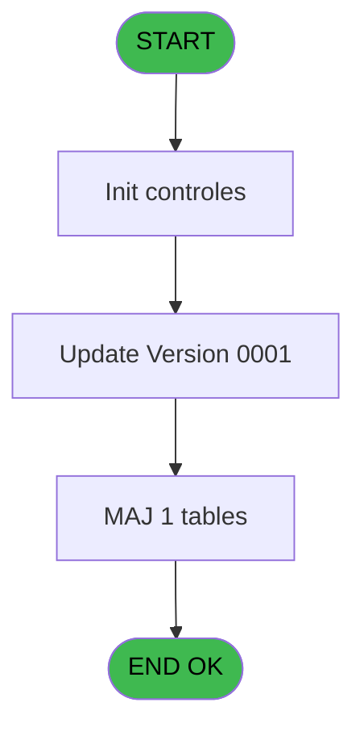
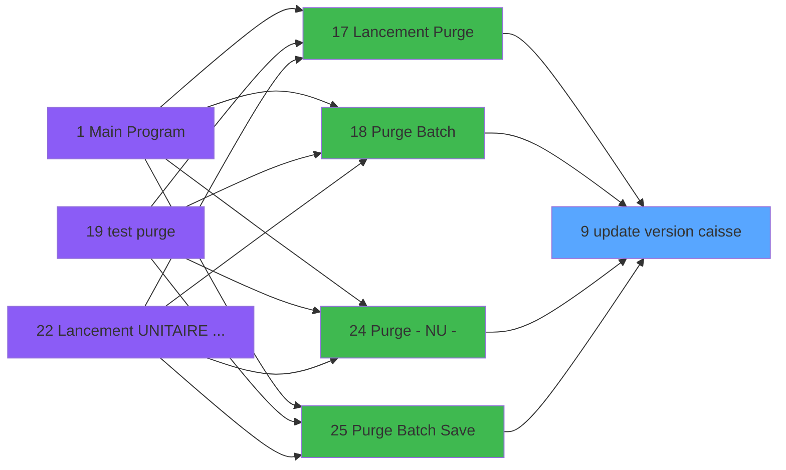

# PUG IDE 9 - update version caisse

> **Analyse**: Phases 1-4 2026-02-03 18:28 -> 18:28 (13s) | Assemblage 18:28
> **Pipeline**: V7.2 Enrichi
> **Structure**: 4 onglets (Resume | Ecrans | Donnees | Connexions)

<!-- TAB:Resume -->

## 1. FICHE D'IDENTITE

| Attribut | Valeur |
|----------|--------|
| Projet | PUG |
| IDE Position | 9 |
| Nom Programme | update version caisse |
| Fichier source | `Prg_9.xml` |
| Dossier IDE | Purge |
| Taches | 6 (1 ecrans visibles) |
| Tables modifiees | 1 |
| Programmes appeles | 0 |

## 2. DESCRIPTION FONCTIONNELLE

**update version caisse** assure la gestion complete de ce processus, accessible depuis [Lancement Purge (IDE 17)](PUG-IDE-17.md), [Purge Batch (IDE 18)](PUG-IDE-18.md), [Purge - NU - (IDE 24)](PUG-IDE-24.md), [Purge Batch Save (IDE 25)](PUG-IDE-25.md).

Le flux de traitement s'organise en **2 blocs fonctionnels** :

- **Traitement** (4 taches) : traitements metier divers
- **Calcul** (2 taches) : calculs de montants, stocks ou compteurs

**Donnees modifiees** : 1 tables en ecriture (pv_parametre_generaux).

Detail : phases du traitement

#### Phase 1 : Traitement (4 taches)

- **9** - update version caisse
- **9.1** - Read version
- **9.2** - Update cash desk 0001 **[[ECRAN]](#ecran-t3)**
- **9.3** - Update version

#### Phase 2 : Calcul (2 taches)

- **9.2.1** - Gen comptage caisse histo
- **9.2.2** - Gen comptage coffre histo

#### Tables impactees

| Table | Operations | Role metier |
|-------|-----------|-------------|
| pv_parametre_generaux | R/**W** (2 usages) |  |

## 3. BLOCS FONCTIONNELS

### 3.1 Traitement (4 taches)

Traitements internes.

---

#### 9 - update version caisse

**Role** : Traitement : update version caisse.

3 sous-taches directes

| Tache | Nom | Bloc |
|-------|-----|------|
| [9.1](#t2) | Read version | Traitement |
| [9.2](#t3) | Update cash desk 0001 **[[ECRAN]](#ecran-t3)** | Traitement |
| [9.3](#t6) | Update version | Traitement |

**Variables liees** : A (V.Version was updated), B (V.Current version)

---

#### 9.1 - Read version

**Role** : Traitement : Read version.
**Variables liees** : A (V.Version was updated), B (V.Current version)

---

#### 9.2 - Update cash desk 0001 [[ECRAN]](#ecran-t3)

**Role** : Traitement : Update cash desk 0001.
**Ecran** : 480 x 48 DLU (MDI) | [Voir mockup](#ecran-t3)
**Variables liees** : A (V.Version was updated)

---

#### 9.3 - Update version

**Role** : Traitement : Update version.
**Variables liees** : A (V.Version was updated), B (V.Current version)

### 3.2 Calcul (2 taches)

Calculs metier : montants, stocks, compteurs.

---

#### 9.2.1 - Gen comptage caisse histo

**Role** : Traitement : Gen comptage caisse histo.

---

#### 9.2.2 - Gen comptage coffre histo

**Role** : Traitement : Gen comptage coffre histo.

## 5. REGLES METIER

*(Aucune regle metier identifiee)*

## 6. CONTEXTE

- **Appele par**: [Lancement Purge (IDE 17)](PUG-IDE-17.md), [Purge Batch (IDE 18)](PUG-IDE-18.md), [Purge - NU - (IDE 24)](PUG-IDE-24.md), [Purge Batch Save (IDE 25)](PUG-IDE-25.md)
- **Appelle**: 0 programmes | **Tables**: 5 (W:1 R:3 L:2) | **Taches**: 6 | **Expressions**: 1

<!-- TAB:Ecrans -->

## 8. ECRANS

### 8.1 Forms visibles (1 / 6)

| # | Position | Tache | Nom | Type | Largeur | Hauteur | Bloc |
|---|----------|-------|-----|------|---------|---------|------|
| 1 | 9.2 | 9.2 | Update cash desk 0001 | MDI | 480 | 48 | Traitement |

### 8.2 Mockups Ecrans

---

#### 9.2 - Update cash desk 0001
**Tache** : [9.2](#t3) | **Type** : MDI | **Dimensions** : 480 x 48 DLU
**Bloc** : Traitement | **Titre IDE** : Update cash desk 0001

<!-- FORM-DATA:
{
    "width":  480,
    "vFactor":  8,
    "type":  "MDI",
    "hFactor":  8,
    "controls":  [
                     {
                         "x":  188,
                         "type":  "label",
                         "var":  "",
                         "y":  20,
                         "w":  221,
                         "fmt":  "",
                         "name":  "",
                         "h":  8,
                         "color":  "7",
                         "text":  "Please wait ...",
                         "parent":  null
                     },
                     {
                         "x":  72,
                         "type":  "image",
                         "var":  "",
                         "y":  12,
                         "w":  72,
                         "fmt":  "",
                         "name":  "",
                         "h":  25,
                         "color":  "",
                         "text":  "",
                         "parent":  null
                     }
                 ],
    "taskId":  "9.2",
    "height":  48
}
-->

## 9. NAVIGATION

Ecran unique: **Update cash desk 0001**

### 9.3 Structure hierarchique (6 taches)

| Position | Tache | Type | Dimensions | Bloc |
|----------|-------|------|------------|------|
| **9.1** | [**update version caisse** (9)](#t1) | MDI | - | Traitement |
| 9.1.1 | [Read version (9.1)](#t2) | MDI | - | |
| 9.1.2 | [Update cash desk 0001 (9.2)](#t3) [mockup](#ecran-t3) | MDI | 480x48 | |
| 9.1.3 | [Update version (9.3)](#t6) | MDI | - | |
| **9.2** | [**Gen comptage caisse histo** (9.2.1)](#t4) | MDI | - | Calcul |
| 9.2.1 | [Gen comptage coffre histo (9.2.2)](#t5) | MDI | - | |

### 9.4 Algorigramme

> **Legende**: Vert = START/END OK | Rouge = END KO | Bleu = Decisions
> *Algorigramme auto-genere. Utiliser `/algorigramme` pour une synthese metier detaillee.*

<!-- TAB:Donnees -->

## 10. TABLES

### Tables utilisees (5)

| ID | Nom | Description | Type | R | W | L | Usages |
|----|-----|-------------|------|---|---|---|--------|
| 216 | _comptage_coffre_histo | Etat du coffre | DB | R |   |   | 1 |
| 217 | comptage_coffre_histo | Etat du coffre | DB |   |   | L | 1 |
| 221 | _comptage_caisse_histo | Sessions de caisse | DB | R |   |   | 1 |
| 222 | comptage_caisse_histo | Sessions de caisse | DB |   |   | L | 1 |
| 710 | pv_parametre_generaux |  | DB | R | **W** |   | 2 |

### Colonnes par table (0 / 3 tables avec colonnes identifiees)

Table 216 - _comptage_coffre_histo (R) - 1 usages

*Table utilisee uniquement en Link ou aucune colonne Real identifiee dans le DataView.*

Table 221 - _comptage_caisse_histo (R) - 1 usages

*Table utilisee uniquement en Link ou aucune colonne Real identifiee dans le DataView.*

Table 710 - pv_parametre_generaux (R/**W**) - 2 usages

*Table utilisee uniquement en Link ou aucune colonne Real identifiee dans le DataView.*

## 11. VARIABLES

### 11.1 Variables de session (2)

Variables persistantes pendant toute la session.

| Lettre | Nom | Type | Usage dans |
|--------|-----|------|-----------|
| A | V.Version was updated | Logical | 1x session |
| B | V.Current version | Numeric | [9](#t1), [9.1](#t2), [9.3](#t6) |

## 12. EXPRESSIONS

**1 / 1 expressions decodees (100%)**

### 12.1 Repartition par type

| Type | Expressions | Regles |
|------|-------------|--------|
| NEGATION | 1 | 0 |

### 12.2 Expressions cles par type

#### NEGATION (1 expressions)

| Type | IDE | Expression | Regle |
|------|-----|------------|-------|
| NEGATION | 1 | `NOT (V.Version was updated [A]) AND V.Current version [B]=0` | - |

<!-- TAB:Connexions -->

## 13. GRAPHE D'APPELS

### 13.1 Chaine depuis Main (Callers)

Main -> ... -> [Lancement Purge (IDE 17)](PUG-IDE-17.md) -> **update version caisse (IDE 9)**

Main -> ... -> [Purge Batch (IDE 18)](PUG-IDE-18.md) -> **update version caisse (IDE 9)**

Main -> ... -> [Purge - NU - (IDE 24)](PUG-IDE-24.md) -> **update version caisse (IDE 9)**

Main -> ... -> [Purge Batch Save (IDE 25)](PUG-IDE-25.md) -> **update version caisse (IDE 9)**

### 13.2 Callers

| IDE | Nom Programme | Nb Appels |
|-----|---------------|-----------|
| [17](PUG-IDE-17.md) | Lancement Purge | 1 |
| [18](PUG-IDE-18.md) | Purge Batch | 1 |
| [24](PUG-IDE-24.md) | Purge - NU - | 1 |
| [25](PUG-IDE-25.md) | Purge Batch Save | 1 |

### 13.3 Callees (programmes appeles)

### 13.4 Detail Callees avec contexte

| IDE | Nom Programme | Appels | Contexte |
|-----|---------------|--------|----------|
| - | (aucun) | - | - |

## 14. RECOMMANDATIONS MIGRATION

### 14.1 Profil du programme

| Metrique | Valeur | Impact migration |
|----------|--------|-----------------|
| Lignes de logique | 121 | Programme compact |
| Expressions | 1 | Peu de logique |
| Tables WRITE | 1 | Impact faible |
| Sous-programmes | 0 | Peu de dependances |
| Ecrans visibles | 1 | Ecran unique ou traitement batch |
| Code desactive | 0% (0 / 121) | Code sain |
| Regles metier | 0 | Pas de regle identifiee |

### 14.2 Plan de migration par bloc

#### Traitement (4 taches: 1 ecran, 3 traitements)

- **Strategie** : Orchestrateur avec 1 ecrans (Razor/React) et 3 traitements backend (services).
- Les ecrans deviennent des composants UI, les traitements invisibles deviennent des services injectables.
- Decomposer les taches en services unitaires testables.

#### Calcul (2 taches: 0 ecran, 2 traitements)

- **Strategie** : Services de calcul purs (Domain Services).
- Migrer la logique de calcul (stock, compteurs, montants)

### 14.3 Dependances critiques

| Dependance | Type | Appels | Impact |
|------------|------|--------|--------|
| pv_parametre_generaux | Table WRITE (Database) | 1x | Schema + repository |

---
*Spec DETAILED generee par Pipeline V7.2 - 2026-02-03 18:28*
