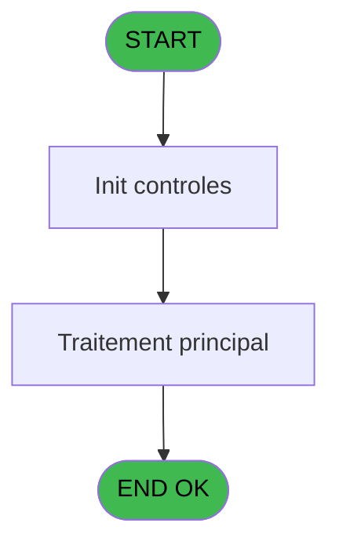
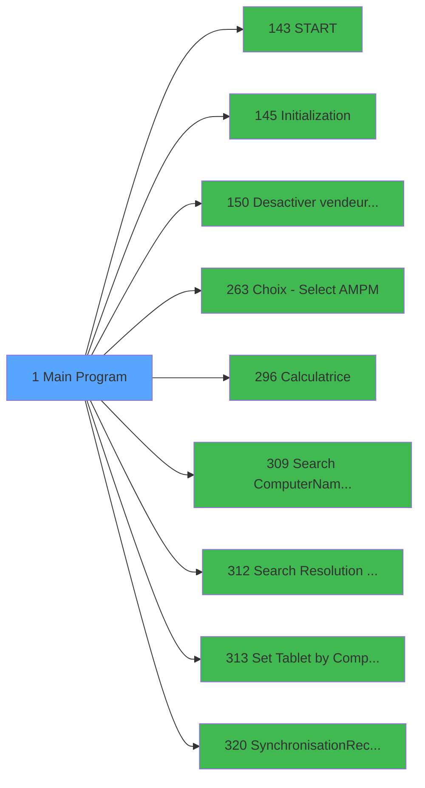

# PVE IDE 1 - Main Program

> **Analyse**: Phases 1-4 2026-02-03 00:44 -> 00:50 (5min) | Assemblage 00:50
> **Pipeline**: V7.2 Enrichi
> **Structure**: 4 onglets (Resume | Ecrans | Donnees | Connexions)

<!-- TAB:Resume -->

## 1. FICHE D'IDENTITE

| Attribut | Valeur |
|----------|--------|
| Projet | PVE |
| IDE Position | 1 |
| Nom Programme | Main Program |
| Fichier source | `Prg_1.xml` |
| Domaine metier | General |
| Taches | 1 (1 ecrans visibles) |
| Tables modifiees | 0 |
| Programmes appeles | 9 |
| :warning: Statut | **ORPHELIN_POTENTIEL** |

## 2. DESCRIPTION FONCTIONNELLE

**Main Program** assure la gestion complete de ce processus.

Le flux de traitement s'organise en **1 blocs fonctionnels** :

- **Saisie** (1 tache) : ecrans de saisie utilisateur (formulaires, champs, donnees)

**Logique metier** : 2 regles identifiees couvrant conditions metier.

## 3. BLOCS FONCTIONNELS

### 3.1 Saisie (1 tache)

L'operateur saisit les donnees de la transaction via 1 ecran (Point de Vente).

---

#### 1 - Point de Vente [[ECRAN]](#ecran-t1)

**Role** : Saisie des donnees : Point de Vente.
**Ecran** : 1008 x 389 DLU (Type11) | [Voir mockup](#ecran-t1)
**Variables liees** : E (VG.Code lieu vente), F (VG.Libelle lieu de vente), I (VG.DROIT PVENTE ADMIN ?), K (VG.DROIT PVENTE PAYMENT ?), L (VG.DROIT PVENTE INPUT ?)

## 5. REGLES METIER

2 regles identifiees:

### Autres (2 regles)

#### [RM-001] Si [AG] vaut 'TB' alors 'WS', sinon 'TB'

| Element | Detail |
|---------|--------|
| **Condition** | `[AG]='TB'` |
| **Si vrai** | 'WS' |
| **Si faux** | 'TB') |
| **Expression source** | Expression 67 : `IF([AG]='TB','WS','TB')` |
| **Exemple** | Si [AG]='TB' → 'WS'. Sinon → 'TB') |

#### [RM-002] Si VG.Interf. Boutiq Colo... [EG] alors 'TB' sinon 'WS')

| Element | Detail |
|---------|--------|
| **Condition** | `VG.Interf. Boutiq Colo... [EG]` |
| **Si vrai** | 'TB' |
| **Si faux** | 'WS') |
| **Expression source** | Expression 100 : `IF(VG.Interf. Boutiq Colo... [EG],'TB','WS')` |
| **Exemple** | Si VG.Interf. Boutiq Colo... [EG] → 'TB'. Sinon → 'WS') |

## 6. CONTEXTE

- **Appele par**: (aucun)
- **Appelle**: 9 programmes | **Tables**: 0 (W:0 R:0 L:0) | **Taches**: 1 | **Expressions**: 108

<!-- TAB:Ecrans -->

## 8. ECRANS

### 8.1 Forms visibles (1 / 1)

| # | Position | Tache | Nom | Type | Largeur | Hauteur | Bloc |
|---|----------|-------|-----|------|---------|---------|------|
| 1 | 1 | 1 | Point de Vente | Type11 | 1008 | 389 | Saisie |

### 8.2 Mockups Ecrans

## 9. NAVIGATION

Ecran unique: **Point de Vente**

### 9.3 Structure hierarchique (1 tache)

| Position | Tache | Type | Dimensions | Bloc |
|----------|-------|------|------------|------|
| **1.1** | [**Point de Vente** (1)](#t1) [mockup](#ecran-t1) | Type11 | 1008x389 | Saisie |

### 9.4 Algorigramme

> **Legende**: Vert = START/END OK | Rouge = END KO | Bleu = Decisions
> *Algorigramme auto-genere. Utiliser `/algorigramme` pour une synthese metier detaillee.*

<!-- TAB:Donnees -->

## 10. TABLES

### Tables utilisees (0)

| ID | Nom | Description | Type | R | W | L | Usages |
|----|-----|-------------|------|---|---|---|--------|

### Colonnes par table (0 / 0 tables avec colonnes identifiees)

## 11. VARIABLES

### 11.1 Variables globales (143)

Variables globales partagees entre programmes.

| Lettre | Nom | Type | Usage dans |
|--------|-----|------|-----------|
| A | VG.LOGIN | Unicode | 6x variable globale |
| B | VG.USER | Unicode | - |
| C | VG.Version | Alpha | 1x variable globale |
| D | VG.Date version | Alpha | 1x variable globale |
| E | VG.Code lieu vente | Alpha | - |
| F | VG.Libelle lieu de vente | Alpha | - |
| G | VG.Vendeur parametré | Logical | - |
| H | VG.Ecran | Alpha | - |
| I | VG.DROIT PVENTE ADMIN ? | Logical | - |
| J | VG.DROIT ACCES I.T. ? | Logical | - |
| K | VG.DROIT PVENTE PAYMENT ? | Logical | - |
| L | VG.DROIT PVENTE INPUT ? | Logical | - |
| M | VG.DROIT PVENTE MANAGER ? | Logical | - |
| N | VG.DROIT PVENTE BASIC USE ? | Logical | - |
| O | VG.COMPTE CASH ACTIF ? | Logical | - |
| P | VG.ECI ACTIF ? | Logical | - |
| Q | VG.CUST ID | Numeric | - |
| R | VG.NEW FID ACTIF | Logical | - |
| S | VG.CODE LANGUE | Unicode | - |
| T | VG.FACTURE TVA | Logical | 1x variable globale |
| U | VG.TPE ACTIF ? | Logical | - |
| V | VG.CODE AXIS | Alpha | - |
| W | VG.CODE VILLAGE | Alpha | - |
| X | VG.TERM INTERFACE TPE | Logical | 2x variable globale |
| Y | VG.NUMERO TPE INTERFACE | Alpha | 2x variable globale |
| Z | VG.TYPE TPE | Unicode | - |
| BA | VG.DEVISE TPE | Numeric | - |
| BB | VG.SUIVI CA HORS PLAC | Logical | - |
| BC | VG.GIFT PASS | Logical | - |
| BD | VG.LVE (Imputation Lieu Vente) | Logical | - |
| BE | VG PME (Porte MonnaieElectron.) | Logical | - |
| BF | VG MOB (Vente en mobilité) | Logical | - |
| BG | VG SUPPORT (Tablette,WorkStatio | Alpha | - |
| BH | VG COMPUTERNAME | Alpha | - |
| BI | VG CODE RESOLUTION ECRAN | Numeric | - |
| BJ | VG.CARTE CREDIT EN MOBILITE | Logical | - |
| BK | VG.SEPARATEUR | Alpha | - |
| BL | VG.CODE_CAISSIER | Unicode | - |
| BM | VG.NOM_CAISSIER | Unicode | - |
| BN | VG.VALIDATION VENTES FILIATIONS | Logical | - |
| BO | VG.RESOLUTION_1024_768 | Logical | - |
| BP | VG.Contain Big Prices | Logical | - |
| BQ | VG.Decimales | Numeric | - |
| BR | VG.BINDING SETTING ACTIF? | Logical | - |
| BS | VG.Retour Chariot | Alpha | - |
| BT | VG.Lib Bt Customer | Alpha | - |
| BU | VG.Customer Id | Numeric | - |
| BV | VG.Societe | Unicode | - |
| BW | VG.Compte | Numeric | - |
| BX | VG.Filiation | Numeric | - |
| BY | VG.POS Payer Id_ Card | Numeric | - |
| BZ | VG.PMS Account_ Card | Numeric | - |
| CA | VG.PMS Filiation_ Card | Numeric | 1x variable globale |
| CB | VG.Club Med Pass | Unicode | 1x variable globale |
| CC | VG.Debut Séjour | Date | 1x variable globale |
| CD | VG.Fin Séjour | Date | - |
| CE | VG.Chambre | Alpha | - |
| CF | VG.Qualite | Alpha | - |
| CG | VG.Onglet | Alpha | - |
| CH | VG.LEX_Libellé_commerciaux | Logical | - |
| CI | VG.IsBookingActifForProject | Logical | - |
| CJ | VG.IsBookingActifForProject v2 | Logical | - |
| CK | VG.IsBookingActifForProject v3 | Logical | - |
| CL | VG.IsBookingActtive RDV | Logical | - |
| CM | VG.IsBookingActifForService | Logical | - |
| CN | VG.BookerUrlAPI | Alpha | - |
| CO | VG.BookerLocationID | Numeric | - |
| CP | VG.ProxAddress | Alpha | - |
| CQ | VG.BookerDeclageHoraire | Numeric | - |
| CR | VG.BookClientID | Unicode | - |
| CS | VG.BookClientSecret | Unicode | - |
| CT | VG.BookUserName | Unicode | - |
| CU | VG.BookPassword | Unicode | - |
| CV | VG.BookAnonymization | Logical | - |
| CW | VG.BookPaymentMethodeName | Unicode | - |
| CX | VG.BookTicketMessage | Blob | - |
| CY | VG.Book.Remise POS/SpecialId | Unicode | - |
| CZ | VG.Book.Subscription-Key v5 | Unicode | - |
| DA | VG.RepertoireLocalTickets | Alpha | 2x variable globale |
| DB | VG.RepertoireLocalImages | Alpha | 2x variable globale |
| DC | VG.RepertoireLocalAppointments | Alpha | - |
| DD | VG.Numérotation Reçus V1.00 | Logical | - |
| DE | VG.Libellés Commerciaux V2.00 | Logical | - |
| DF | VG.Suivi CA Reception Actif | Logical | - |
| DG | VG.Nom Base Archivage | Unicode | - |
| DH | VG.Prise de garantie dans PVE | Logical | - |
| DI | VG.Garantie par le service | Logical | - |
| DJ | VG.Gift Pass V3 | Logical | - |
| DK | VG.Bestof | Alpha | - |
| DL | VG.Ventes Assurances | Logical | - |
| DM | VG.ResortCredit1.00 | Logical | - |
| DN | VG.Gratuit et Interdiction 1.00 | Logical | - |
| DO | VG.Extrait Compte 1.00 | Logical | - |
| DP | VG.Inventaires 1.00 | Logical | 1x variable globale |
| DQ | VG.Reçus en Local 1.00 | Logical | - |
| DR | VG.Free sur Gratuités 1.00 | Logical | - |
| DS | VG.Identification CMP 1.00 | Logical | - |
| DT | VG Forfait Booker V1.00 | Logical | - |
| DU | VG Part Droit Admin V1.00 | Logical | - |
| DV | VG.Code Service | Unicode | - |
| DW | VG.Nom Service | Unicode | - |
| DX | VG.Service Accepte CC | Logical | - |
| DY | VG.Plafond Conso Actif | Logical | - |
| DZ | VG.Hostname au lieu de term | Logical | - |
| EA | VG.Numéro de pseudo terminal | Numeric | - |
| EB | VG.HWND main | Numeric | - |
| EC | VG.Windows Title | Unicode | - |
| ED | VG.Fusion liste operation | Logical | - |
| EE | VG.Contractor Recept | Logical | - |
| EF | VG.Stock par détail new version | Logical | - |
| EG | VG.Interf. Boutiq Colombus V17 | Logical | - |
| EH | VG.Affichage GM sans nom | Logical | - |
| EI | VG.Gestion Taxes Additionnelles | Logical | - |
| EJ | VG.Mail Vente Ass. 0 Soucis | Logical | - |
| EK | VG.Envoi Impress reçu de vente | Logical | - |
| EL | VG.Gestion Garantie API CM | Logical | - |
| EM | VG.Desactiver Confirm Id CMP | Logical | - |
| EN | VG. Code Projet Blocage activé | Logical | - |
| EO | VG.Blocage Modif Package/Sales | Logical | - |
| EP | VG.Facture THAI new | Logical | - |
| EQ | VG.Signature (Blolb) | Blob | - |
| ER | VG.Raison_Mvt_Out_Of_Stock | Logical | - |
| ES | VG.Date creation Prepaid Packag | Logical | - |
| ET | VG.Interface OpenBravo 1.00 | Logical | - |
| EU | VG. BCS 2.00 | Logical | - |
| EV | VG. BCS 2.00 Restricted | Logical | - |
| EW | VG.IncomeSeminar | Logical | - |
| EX | VG.Service ac aide saisie Stock | Logical | - |
| EY | VG.Liste Unité pour aide saisie | Unicode | - |
| EZ | VG.Unité utilisée pr ce Service | Unicode | - |
| FA | VG.Interface TPE Omnicanal | Logical | - |
| FB | VG.Reçu vente Japon | Logical | - |
| FC | VG.Reçu Loi AGEC | Logical | - |
| FD | VG.Parametrage Loi AGEC activé | Logical | - |
| FE | VG.Gestion Codes Barres Ventes | Logical | - |
| FF | VG. Tablet Settings? | Logical | - |
| FG | VG. M&E Prepaid | Logical | - |
| FH | VG. Japan China DIN | Logical | - |
| FI | VG. Manual Prepaid Comment | Logical | - |
| FJ | VG.Great Member Revamped | Logical | - |
| FK | VG.ECI En cours de séjour | Logical | - |
| FL | VG. Serv Voir téléphone | Logical | - |
| FM | VG.texte pour ligne total M&E | Unicode | - |

Toutes les 143 variables (liste complete)

| Cat | Lettre | Nom Variable | Type |
|-----|--------|--------------|------|
| VG | **A** | VG.LOGIN | Unicode |
| VG | **B** | VG.USER | Unicode |
| VG | **C** | VG.Version | Alpha |
| VG | **D** | VG.Date version | Alpha |
| VG | **E** | VG.Code lieu vente | Alpha |
| VG | **F** | VG.Libelle lieu de vente | Alpha |
| VG | **G** | VG.Vendeur parametré | Logical |
| VG | **H** | VG.Ecran | Alpha |
| VG | **I** | VG.DROIT PVENTE ADMIN ? | Logical |
| VG | **J** | VG.DROIT ACCES I.T. ? | Logical |
| VG | **K** | VG.DROIT PVENTE PAYMENT ? | Logical |
| VG | **L** | VG.DROIT PVENTE INPUT ? | Logical |
| VG | **M** | VG.DROIT PVENTE MANAGER ? | Logical |
| VG | **N** | VG.DROIT PVENTE BASIC USE ? | Logical |
| VG | **O** | VG.COMPTE CASH ACTIF ? | Logical |
| VG | **P** | VG.ECI ACTIF ? | Logical |
| VG | **Q** | VG.CUST ID | Numeric |
| VG | **R** | VG.NEW FID ACTIF | Logical |
| VG | **S** | VG.CODE LANGUE | Unicode |
| VG | **T** | VG.FACTURE TVA | Logical |
| VG | **U** | VG.TPE ACTIF ? | Logical |
| VG | **V** | VG.CODE AXIS | Alpha |
| VG | **W** | VG.CODE VILLAGE | Alpha |
| VG | **X** | VG.TERM INTERFACE TPE | Logical |
| VG | **Y** | VG.NUMERO TPE INTERFACE | Alpha |
| VG | **Z** | VG.TYPE TPE | Unicode |
| VG | **BA** | VG.DEVISE TPE | Numeric |
| VG | **BB** | VG.SUIVI CA HORS PLAC | Logical |
| VG | **BC** | VG.GIFT PASS | Logical |
| VG | **BD** | VG.LVE (Imputation Lieu Vente) | Logical |
| VG | **BE** | VG PME (Porte MonnaieElectron.) | Logical |
| VG | **BF** | VG MOB (Vente en mobilité) | Logical |
| VG | **BG** | VG SUPPORT (Tablette,WorkStatio | Alpha |
| VG | **BH** | VG COMPUTERNAME | Alpha |
| VG | **BI** | VG CODE RESOLUTION ECRAN | Numeric |
| VG | **BJ** | VG.CARTE CREDIT EN MOBILITE | Logical |
| VG | **BK** | VG.SEPARATEUR | Alpha |
| VG | **BL** | VG.CODE_CAISSIER | Unicode |
| VG | **BM** | VG.NOM_CAISSIER | Unicode |
| VG | **BN** | VG.VALIDATION VENTES FILIATIONS | Logical |
| VG | **BO** | VG.RESOLUTION_1024_768 | Logical |
| VG | **BP** | VG.Contain Big Prices | Logical |
| VG | **BQ** | VG.Decimales | Numeric |
| VG | **BR** | VG.BINDING SETTING ACTIF? | Logical |
| VG | **BS** | VG.Retour Chariot | Alpha |
| VG | **BT** | VG.Lib Bt Customer | Alpha |
| VG | **BU** | VG.Customer Id | Numeric |
| VG | **BV** | VG.Societe | Unicode |
| VG | **BW** | VG.Compte | Numeric |
| VG | **BX** | VG.Filiation | Numeric |
| VG | **BY** | VG.POS Payer Id_ Card | Numeric |
| VG | **BZ** | VG.PMS Account_ Card | Numeric |
| VG | **CA** | VG.PMS Filiation_ Card | Numeric |
| VG | **CB** | VG.Club Med Pass | Unicode |
| VG | **CC** | VG.Debut Séjour | Date |
| VG | **CD** | VG.Fin Séjour | Date |
| VG | **CE** | VG.Chambre | Alpha |
| VG | **CF** | VG.Qualite | Alpha |
| VG | **CG** | VG.Onglet | Alpha |
| VG | **CH** | VG.LEX_Libellé_commerciaux | Logical |
| VG | **CI** | VG.IsBookingActifForProject | Logical |
| VG | **CJ** | VG.IsBookingActifForProject v2 | Logical |
| VG | **CK** | VG.IsBookingActifForProject v3 | Logical |
| VG | **CL** | VG.IsBookingActtive RDV | Logical |
| VG | **CM** | VG.IsBookingActifForService | Logical |
| VG | **CN** | VG.BookerUrlAPI | Alpha |
| VG | **CO** | VG.BookerLocationID | Numeric |
| VG | **CP** | VG.ProxAddress | Alpha |
| VG | **CQ** | VG.BookerDeclageHoraire | Numeric |
| VG | **CR** | VG.BookClientID | Unicode |
| VG | **CS** | VG.BookClientSecret | Unicode |
| VG | **CT** | VG.BookUserName | Unicode |
| VG | **CU** | VG.BookPassword | Unicode |
| VG | **CV** | VG.BookAnonymization | Logical |
| VG | **CW** | VG.BookPaymentMethodeName | Unicode |
| VG | **CX** | VG.BookTicketMessage | Blob |
| VG | **CY** | VG.Book.Remise POS/SpecialId | Unicode |
| VG | **CZ** | VG.Book.Subscription-Key v5 | Unicode |
| VG | **DA** | VG.RepertoireLocalTickets | Alpha |
| VG | **DB** | VG.RepertoireLocalImages | Alpha |
| VG | **DC** | VG.RepertoireLocalAppointments | Alpha |
| VG | **DD** | VG.Numérotation Reçus V1.00 | Logical |
| VG | **DE** | VG.Libellés Commerciaux V2.00 | Logical |
| VG | **DF** | VG.Suivi CA Reception Actif | Logical |
| VG | **DG** | VG.Nom Base Archivage | Unicode |
| VG | **DH** | VG.Prise de garantie dans PVE | Logical |
| VG | **DI** | VG.Garantie par le service | Logical |
| VG | **DJ** | VG.Gift Pass V3 | Logical |
| VG | **DK** | VG.Bestof | Alpha |
| VG | **DL** | VG.Ventes Assurances | Logical |
| VG | **DM** | VG.ResortCredit1.00 | Logical |
| VG | **DN** | VG.Gratuit et Interdiction 1.00 | Logical |
| VG | **DO** | VG.Extrait Compte 1.00 | Logical |
| VG | **DP** | VG.Inventaires 1.00 | Logical |
| VG | **DQ** | VG.Reçus en Local 1.00 | Logical |
| VG | **DR** | VG.Free sur Gratuités 1.00 | Logical |
| VG | **DS** | VG.Identification CMP 1.00 | Logical |
| VG | **DT** | VG Forfait Booker V1.00 | Logical |
| VG | **DU** | VG Part Droit Admin V1.00 | Logical |
| VG | **DV** | VG.Code Service | Unicode |
| VG | **DW** | VG.Nom Service | Unicode |
| VG | **DX** | VG.Service Accepte CC | Logical |
| VG | **DY** | VG.Plafond Conso Actif | Logical |
| VG | **DZ** | VG.Hostname au lieu de term | Logical |
| VG | **EA** | VG.Numéro de pseudo terminal | Numeric |
| VG | **EB** | VG.HWND main | Numeric |
| VG | **EC** | VG.Windows Title | Unicode |
| VG | **ED** | VG.Fusion liste operation | Logical |
| VG | **EE** | VG.Contractor Recept | Logical |
| VG | **EF** | VG.Stock par détail new version | Logical |
| VG | **EG** | VG.Interf. Boutiq Colombus V17 | Logical |
| VG | **EH** | VG.Affichage GM sans nom | Logical |
| VG | **EI** | VG.Gestion Taxes Additionnelles | Logical |
| VG | **EJ** | VG.Mail Vente Ass. 0 Soucis | Logical |
| VG | **EK** | VG.Envoi Impress reçu de vente | Logical |
| VG | **EL** | VG.Gestion Garantie API CM | Logical |
| VG | **EM** | VG.Desactiver Confirm Id CMP | Logical |
| VG | **EN** | VG. Code Projet Blocage activé | Logical |
| VG | **EO** | VG.Blocage Modif Package/Sales | Logical |
| VG | **EP** | VG.Facture THAI new | Logical |
| VG | **EQ** | VG.Signature (Blolb) | Blob |
| VG | **ER** | VG.Raison_Mvt_Out_Of_Stock | Logical |
| VG | **ES** | VG.Date creation Prepaid Packag | Logical |
| VG | **ET** | VG.Interface OpenBravo 1.00 | Logical |
| VG | **EU** | VG. BCS 2.00 | Logical |
| VG | **EV** | VG. BCS 2.00 Restricted | Logical |
| VG | **EW** | VG.IncomeSeminar | Logical |
| VG | **EX** | VG.Service ac aide saisie Stock | Logical |
| VG | **EY** | VG.Liste Unité pour aide saisie | Unicode |
| VG | **EZ** | VG.Unité utilisée pr ce Service | Unicode |
| VG | **FA** | VG.Interface TPE Omnicanal | Logical |
| VG | **FB** | VG.Reçu vente Japon | Logical |
| VG | **FC** | VG.Reçu Loi AGEC | Logical |
| VG | **FD** | VG.Parametrage Loi AGEC activé | Logical |
| VG | **FE** | VG.Gestion Codes Barres Ventes | Logical |
| VG | **FF** | VG. Tablet Settings? | Logical |
| VG | **FG** | VG. M&E Prepaid | Logical |
| VG | **FH** | VG. Japan China DIN | Logical |
| VG | **FI** | VG. Manual Prepaid Comment | Logical |
| VG | **FJ** | VG.Great Member Revamped | Logical |
| VG | **FK** | VG.ECI En cours de séjour | Logical |
| VG | **FL** | VG. Serv Voir téléphone | Logical |
| VG | **FM** | VG.texte pour ligne total M&E | Unicode |

## 12. EXPRESSIONS

**108 / 108 expressions decodees (100%)**

### 12.1 Repartition par type

| Type | Expressions | Regles |
|------|-------------|--------|
| CONCATENATION | 9 | 0 |
| FORMAT | 2 | 0 |
| CALCULATION | 1 | 0 |
| CONDITION | 8 | 2 |
| CONSTANTE | 59 | 0 |
| CAST_LOGIQUE | 8 | 0 |
| NEGATION | 8 | 0 |
| OTHER | 13 | 0 |

### 12.2 Expressions cles par type

#### CONCATENATION (9 expressions)

| Type | IDE | Expression | Regle |
|------|-----|------------|-------|
| CONCATENATION | 87 | `'cmd /c mkdir '&Translate ('%club_exportdata%')&'appointments\'` | - |
| CONCATENATION | 86 | `'cmd /c mkdir '&Translate ('%club_exportdata%')&'Ticket\'` | - |
| CONCATENATION | 89 | `'cmd /c mkdir '&Translate ('%club_exportdata%')&'ArchivagePos\'` | - |
| CONCATENATION | 88 | `'cmd /c mkdir '&Translate ('%club_exportdata%')&'CGV\'` | - |
| CONCATENATION | 85 | `'cmd /c mkdir '&Translate ('%club_exportdata%')&'PDF\'` | - |
| ... | | *+4 autres* | |

#### FORMAT (2 expressions)

| Type | IDE | Expression | Regle |
|------|-----|------------|-------|
| FORMAT | 81 | `DNSet(DNCast(DotNet.System.Windows.Forms.Control.FromHandle(DNCast(VG.RepertoireLocalImages [DB],DotNet.System.IntPtr)),DotNet.System.Windows.Forms.Form).Text,RTrim(VG.RepertoireLocalAppo... [DC]) & ' Terminal : ' & Trim(Str(VG.RepertoireLocalTickets [DA], '3')) & IF(VG.TERM INTERFACE TPE [X] AND VG.NUMERO TPE INTERFACE [Y]<>'', ' - TPE : '& VG.NUMERO TPE INTERFACE [Y] , '')  )` | - |
| FORMAT | 80 | `DNSet(DNCast(DotNet.System.Windows.Forms.Control.FromHandle(DNCast(VG.RepertoireLocalImages [DB],DotNet.System.IntPtr)),DotNet.System.Windows.Forms.Form).Text,RTrim(VG.RepertoireLocalAppo... [DC]) & ' Computer : ' & GetHostName()& '/' & Trim(Str(VG.RepertoireLocalTickets [DA], '3')) & IF(VG.TERM INTERFACE TPE [X] AND VG.NUMERO TPE INTERFACE [Y]<>'', ' - TPE : '& VG.NUMERO TPE INTERFACE [Y], '') )` | - |

#### CALCULATION (1 expressions)

| Type | IDE | Expression | Regle |
|------|-----|------------|-------|
| CALCULATION | 90 | `'cmd /c attrib +h "'&
Translate ('%club_exportdata%')&'ArchivagePos"'` | - |

#### CONDITION (8 expressions)

| Type | IDE | Expression | Regle |
|------|-----|------------|-------|
| CONDITION | 100 | `IF(VG.Interf. Boutiq Colo... [EG],'TB','WS')` | [RM-002](#rm-RM-002) |
| CONDITION | 67 | `IF([AG]='TB','WS','TB')` | [RM-001](#rm-RM-001) |
| CONDITION | 78 | `[AG]<>'TB' AND [AG]<>'WS'` | - |
| CONDITION | 99 | `VG.Interf. Boutiq Colo... [EG]=NULL()` | - |
| CONDITION | 102 | `[AG]='TB'` | - |
| ... | | *+3 autres* | |

#### CONSTANTE (59 expressions)

| Type | IDE | Expression | Regle |
|------|-----|------------|-------|
| CONSTANTE | 52 | `'RCR'` | - |
| CONSTANTE | 51 | `'PRP'` | - |
| CONSTANTE | 50 | `'PME'` | - |
| CONSTANTE | 53 | `'SCA'` | - |
| CONSTANTE | 56 | `'STK'` | - |
| ... | | *+54 autres* | |

#### CAST_LOGIQUE (8 expressions)

| Type | IDE | Expression | Regle |
|------|-----|------------|-------|
| CAST_LOGIQUE | 7 | `CallProg(ProgIdx('hasRight','TRUE'LOG),VG.LOGIN [A],'PVUSE')` | - |
| CAST_LOGIQUE | 6 | `CallProg(ProgIdx('hasRight','TRUE'LOG),VG.LOGIN [A],'PVMANAGE')` | - |
| CAST_LOGIQUE | 97 | `'TRUE'LOG` | - |
| CAST_LOGIQUE | 63 | `INIPut('EmbedFonts=N','FALSE'LOG)` | - |
| CAST_LOGIQUE | 3 | `CallProg(ProgIdx('hasRight','TRUE'LOG),VG.LOGIN [A],'ACCESALL')` | - |
| ... | | *+3 autres* | |

#### NEGATION (8 expressions)

| Type | IDE | Expression | Regle |
|------|-----|------------|-------|
| NEGATION | 93 | `NOT FileExist (Translate ('%club_exportdata%')&'appointments\')` | - |
| NEGATION | 92 | `NOT FileExist (Translate ('%club_exportdata%')&'Ticket\')` | - |
| NEGATION | 95 | `NOT FileExist (Translate ('%club_exportdata%')&'ArchivagePos\')` | - |
| NEGATION | 94 | `NOT FileExist (Translate ('%club_exportdata%')&'CGV\')` | - |
| NEGATION | 11 | `NOT FileExist('c:\temp')` | - |
| ... | | *+3 autres* | |

#### OTHER (13 expressions)

| Type | IDE | Expression | Regle |
|------|-----|------------|-------|
| OTHER | 76 | `GetPseudoTerminal()` | - |
| OTHER | 75 | `VG.Book.Subscription-K... [CZ]` | - |
| OTHER | 73 | `Term ()` | - |
| OTHER | 101 | `[AH]` | - |
| OTHER | 79 | `StrToken(INIGet('[MAGIC_DATABASES]PMSArchivage'),3,',')` | - |
| ... | | *+8 autres* | |

### 12.3 Toutes les expressions (108)

Voir les 108 expressions

#### CONCATENATION (9)

| IDE | Expression Decodee |
|-----|-------------------|
| 15 | `'Point of Sale - V '&Trim(VG.Version [C])&' - '&Trim(VG.Date version [D])&' - '` |
| 82 | `'cmd /c  if not exist "' & Trim(VG.PMS Filiation_ Card [CA]) & '" mkdir ' & Trim(VG.PMS Filiation_ Card [CA])` |
| 83 | `'cmd /c  if not exist "' & Trim(VG.Club Med Pass [CB]) & '" mkdir ' & Trim(VG.Club Med Pass [CB])` |
| 84 | `'cmd /c  if not exist "' & Trim(VG.Debut Séjour [CC]) & '" mkdir ' & Trim(VG.Debut Séjour [CC])` |
| 85 | `'cmd /c mkdir '&Translate ('%club_exportdata%')&'PDF\'` |
| 86 | `'cmd /c mkdir '&Translate ('%club_exportdata%')&'Ticket\'` |
| 87 | `'cmd /c mkdir '&Translate ('%club_exportdata%')&'appointments\'` |
| 88 | `'cmd /c mkdir '&Translate ('%club_exportdata%')&'CGV\'` |
| 89 | `'cmd /c mkdir '&Translate ('%club_exportdata%')&'ArchivagePos\'` |

#### FORMAT (2)

| IDE | Expression Decodee |
|-----|-------------------|
| 80 | `DNSet(DNCast(DotNet.System.Windows.Forms.Control.FromHandle(DNCast(VG.RepertoireLocalImages [DB],DotNet.System.IntPtr)),DotNet.System.Windows.Forms.Form).Text,RTrim(VG.RepertoireLocalAppo... [DC]) & ' Computer : ' & GetHostName()& '/' & Trim(Str(VG.RepertoireLocalTickets [DA], '3')) & IF(VG.TERM INTERFACE TPE [X] AND VG.NUMERO TPE INTERFACE [Y]<>'', ' - TPE : '& VG.NUMERO TPE INTERFACE [Y], '') )` |
| 81 | `DNSet(DNCast(DotNet.System.Windows.Forms.Control.FromHandle(DNCast(VG.RepertoireLocalImages [DB],DotNet.System.IntPtr)),DotNet.System.Windows.Forms.Form).Text,RTrim(VG.RepertoireLocalAppo... [DC]) & ' Terminal : ' & Trim(Str(VG.RepertoireLocalTickets [DA], '3')) & IF(VG.TERM INTERFACE TPE [X] AND VG.NUMERO TPE INTERFACE [Y]<>'', ' - TPE : '& VG.NUMERO TPE INTERFACE [Y] , '')  )` |

#### CALCULATION (1)

| IDE | Expression Decodee |
|-----|-------------------|
| 90 | `'cmd /c attrib +h "'&
Translate ('%club_exportdata%')&'ArchivagePos"'` |

#### CONDITION (8)

| IDE | Expression Decodee |
|-----|-------------------|
| 67 | `IF([AG]='TB','WS','TB')` |
| 100 | `IF(VG.Interf. Boutiq Colo... [EG],'TB','WS')` |
| 1 | `RunMode ()<=2` |
| 64 | `[AF] AND [AG]='TB'` |
| 65 | `Translate('%club_mobility%')='Y'` |
| 78 | `[AG]<>'TB' AND [AG]<>'WS'` |
| 99 | `VG.Interf. Boutiq Colo... [EG]=NULL()` |
| 102 | `[AG]='TB'` |

#### CONSTANTE (59)

| IDE | Expression Decodee |
|-----|-------------------|
| 10 | `'cmd /c mkdir c:\temp'` |
| 12 | `'4.24'` |
| 13 | `'07/01/2026'` |
| 16 | `'1.00'` |
| 17 | `'2.00'` |
| 18 | `'3.00'` |
| 19 | `'WS'` |
| 20 | `'PV'` |
| 21 | `'TB'` |
| 22 | `'AGC'` |
| 23 | `'BCS'` |
| 24 | `'BKV'` |
| 25 | `'BOO'` |
| 26 | `'BSE'` |
| 27 | `'CBM'` |
| 28 | `'EBD'` |
| 29 | `'FBO'` |
| 30 | `'FEX'` |
| 31 | `'FLO'` |
| 32 | `'FRE'` |
| 33 | `'FTB'` |
| 34 | `'FTV'` |
| 35 | `'GAC'` |
| 36 | `'GAR'` |
| 37 | `'GIV'` |
| 38 | `'GTA'` |
| 39 | `'IDC'` |
| 40 | `'INB'` |
| 41 | `'INS'` |
| 42 | `'IOB'` |
| 43 | `'IPV'` |
| 44 | `'ITO'` |
| 45 | `'JSR'` |
| 46 | `'LEX'` |
| 47 | `'MOB'` |
| 48 | `'MRE'` |
| 49 | `'PAD'` |
| 50 | `'PME'` |
| 51 | `'PRP'` |
| 52 | `'RCR'` |
| 53 | `'SCA'` |
| 54 | `'SCR'` |
| 55 | `'SRE'` |
| 56 | `'STK'` |
| 57 | `'T2H'` |
| 58 | `'TEN'` |
| 59 | `'TPE'` |
| 60 | `'TPR'` |
| 68 | `'c:\data\ticket\'` |
| 69 | `'c:\data\images\'` |
| 70 | `'c:\data\appointments\'` |
| 96 | `'CL,OZ'` |
| 98 | `'SBC'` |
| 103 | `'SEM'` |
| 104 | `'MPC'` |
| 105 | `'GMR'` |
| 106 | `'JCD'` |
| 107 | `'ECI'` |
| 108 | `'Amount charged on the final M&E invoice'` |

#### CAST_LOGIQUE (8)

| IDE | Expression Decodee |
|-----|-------------------|
| 2 | `CallProg(ProgIdx('hasRight','TRUE'LOG),VG.LOGIN [A],'PVADMIN')` |
| 3 | `CallProg(ProgIdx('hasRight','TRUE'LOG),VG.LOGIN [A],'ACCESALL')` |
| 4 | `CallProg(ProgIdx('hasRight','TRUE'LOG),VG.LOGIN [A],'INPUTHD')` |
| 5 | `CallProg(ProgIdx('hasRight','TRUE'LOG),VG.LOGIN [A],'PAYMENT')` |
| 6 | `CallProg(ProgIdx('hasRight','TRUE'LOG),VG.LOGIN [A],'PVMANAGE')` |
| 7 | `CallProg(ProgIdx('hasRight','TRUE'LOG),VG.LOGIN [A],'PVUSE')` |
| 63 | `INIPut('EmbedFonts=N','FALSE'LOG)` |
| 97 | `'TRUE'LOG` |

#### NEGATION (8)

| IDE | Expression Decodee |
|-----|-------------------|
| 8 | `NOT IsComponent()` |
| 11 | `NOT FileExist('c:\temp')` |
| 74 | `NOT VG.Book.Subscription-K... [CZ]` |
| 91 | `NOT FileExist (Translate ('%club_exportdata%')&'PDF\') AND VG.FACTURE TVA [T]` |
| 92 | `NOT FileExist (Translate ('%club_exportdata%')&'Ticket\')` |
| 93 | `NOT FileExist (Translate ('%club_exportdata%')&'appointments\')` |
| 94 | `NOT FileExist (Translate ('%club_exportdata%')&'CGV\')` |
| 95 | `NOT FileExist (Translate ('%club_exportdata%')&'ArchivagePos\')` |

#### OTHER (13)

| IDE | Expression Decodee |
|-----|-------------------|
| 9 | `SetParam ('VERIF_USERB','O')` |
| 14 | `ASCIIChr(13)&ASCIIChr(10)` |
| 61 | `VG.Inventaires 1.00 [DP]` |
| 62 | `MID([AH],5,2)` |
| 66 | `Translate('%club_excel_separator%')` |
| 71 | `IsComponent()` |
| 72 | `WinHWND (0)` |
| 73 | `Term ()` |
| 75 | `VG.Book.Subscription-K... [CZ]` |
| 76 | `GetPseudoTerminal()` |
| 77 | `GetHostName ()` |
| 79 | `StrToken(INIGet('[MAGIC_DATABASES]PMSArchivage'),3,',')` |
| 101 | `[AH]` |

<!-- TAB:Connexions -->

## 13. GRAPHE D'APPELS

### 13.1 Chaine depuis Main (Callers)

**Chemin**: (pas de callers directs)

### 13.2 Callers

| IDE | Nom Programme | Nb Appels |
|-----|---------------|-----------|
| - | (aucun) | - |

### 13.3 Callees (programmes appeles)

### 13.4 Detail Callees avec contexte

| IDE | Nom Programme | Appels | Contexte |
|-----|---------------|--------|----------|
| [143](PVE-IDE-143.md) | START | 1 | Sous-programme |
| [145](PVE-IDE-145.md) | Initialization | 1 | Reinitialisation |
| [150](PVE-IDE-150.md) | Desactiver vendeurs sans login | 1 | Sous-programme |
| [263](PVE-IDE-263.md) | Choix - Select AM/PM | 1 | Selection/consultation |
| [296](PVE-IDE-296.md) | Calculatrice | 1 | Calcul de donnees |
| [309](PVE-IDE-309.md) | Search ComputerName v1 | 1 | Sous-programme |
| [312](PVE-IDE-312.md) | Search Resolution by Computer | 1 | Sous-programme |
| [313](PVE-IDE-313.md) | Set Tablet by Computer | 1 | Sous-programme |
| [320](PVE-IDE-320.md) | SynchronisationRecuPDF | 1 | Recuperation donnees |

## 14. RECOMMANDATIONS MIGRATION

### 14.1 Profil du programme

| Metrique | Valeur | Impact migration |
|----------|--------|-----------------|
| Lignes de logique | 371 | Taille moyenne |
| Expressions | 108 | Logique moderee |
| Tables WRITE | 0 | Impact faible |
| Sous-programmes | 9 | Dependances moderees |
| Ecrans visibles | 1 | Ecran unique ou traitement batch |
| Code desactive | 1.6% (6 / 371) | Code sain |
| Regles metier | 2 | Quelques regles a preserver |

### 14.2 Plan de migration par bloc

#### Saisie (1 tache: 1 ecran, 0 traitement)

- **Strategie** : Formulaire React/Blazor avec validation Zod/FluentValidation.
- Reproduire 1 ecran : Point de Vente
- Validation temps reel cote client + serveur

### 14.3 Dependances critiques

| Dependance | Type | Appels | Impact |
|------------|------|--------|--------|
| [Search Resolution by Computer (IDE 312)](PVE-IDE-312.md) | Sous-programme | 1x | Normale - Sous-programme |
| [Search ComputerName v1 (IDE 309)](PVE-IDE-309.md) | Sous-programme | 1x | Normale - Sous-programme |
| [SynchronisationRecuPDF (IDE 320)](PVE-IDE-320.md) | Sous-programme | 1x | Normale - Recuperation donnees |
| [Set Tablet by Computer (IDE 313)](PVE-IDE-313.md) | Sous-programme | 1x | Normale - Sous-programme |
| [Calculatrice (IDE 296)](PVE-IDE-296.md) | Sous-programme | 1x | Normale - Calcul de donnees |
| [Initialization (IDE 145)](PVE-IDE-145.md) | Sous-programme | 1x | Normale - Reinitialisation |
| [START (IDE 143)](PVE-IDE-143.md) | Sous-programme | 1x | Normale - Sous-programme |
| [Choix - Select AM/PM (IDE 263)](PVE-IDE-263.md) | Sous-programme | 1x | Normale - Selection/consultation |
| [Desactiver vendeurs sans login (IDE 150)](PVE-IDE-150.md) | Sous-programme | 1x | Normale - Sous-programme |

---
*Spec DETAILED generee par Pipeline V7.2 - 2026-02-03 00:50*
