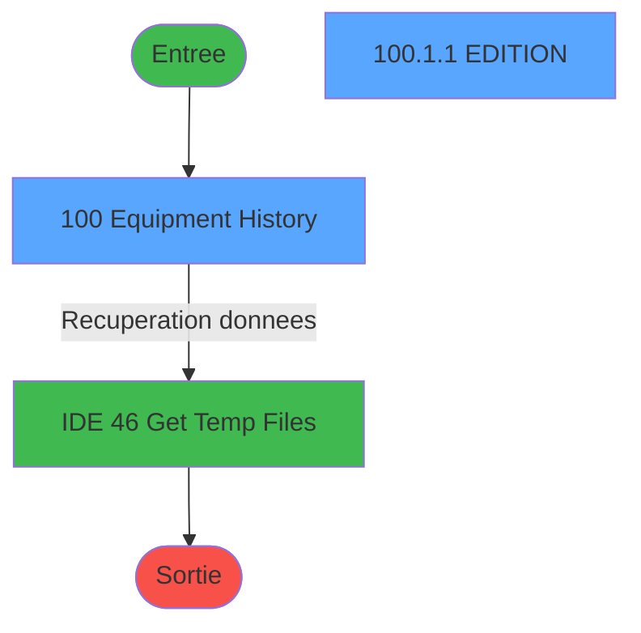
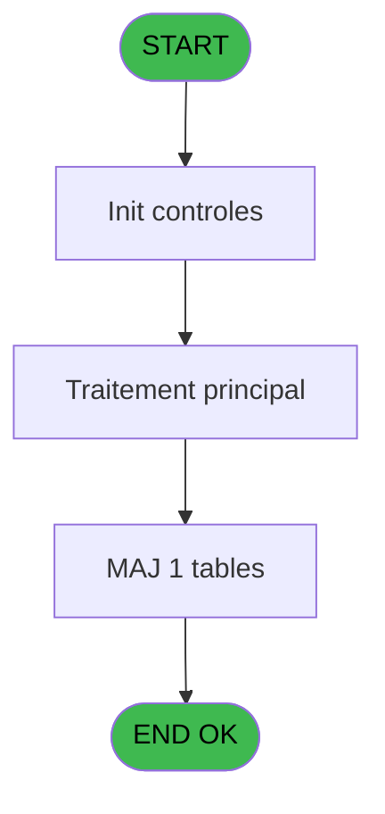
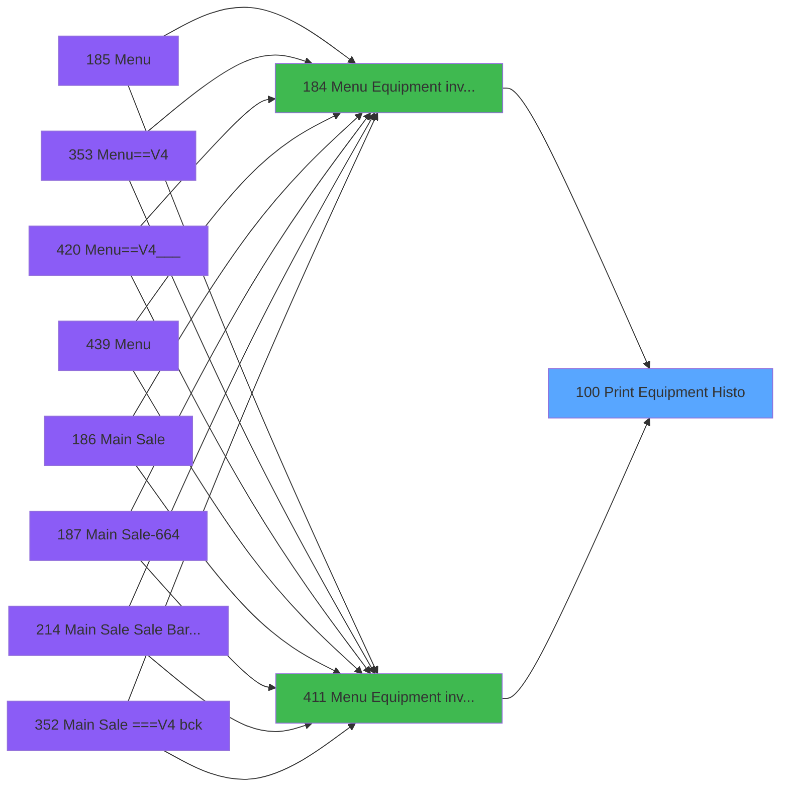
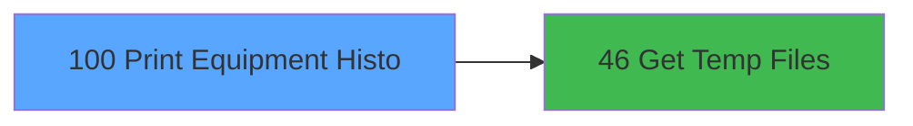

# PVE IDE 100 - Print Equipment Histo

> **Analyse**: Phases 1-4 2026-02-03 09:22 -> 09:22 (20s) | Assemblage 09:22
> **Pipeline**: V7.2 Enrichi
> **Structure**: 4 onglets (Resume | Ecrans | Donnees | Connexions)

<!-- TAB:Resume -->

## 1. FICHE D'IDENTITE

| Attribut | Valeur |
|----------|--------|
| Projet | PVE |
| IDE Position | 100 |
| Nom Programme | Print Equipment Histo |
| Fichier source | `Prg_100.xml` |
| Domaine metier | Impression |
| Taches | 5 (2 ecrans visibles) |
| Tables modifiees | 1 |
| Programmes appeles | 1 |

## 2. DESCRIPTION FONCTIONNELLE

**Print Equipment Histo** assure la gestion complete de ce processus, accessible depuis [Menu Equipment inventory (IDE 184)](PVE-IDE-184.md), [Menu Equipment inventory (IDE 411)](PVE-IDE-411.md).

Le flux de traitement s'organise en **2 blocs fonctionnels** :

- **Traitement** (3 taches) : traitements metier divers
- **Impression** (2 taches) : generation de tickets et documents

**Donnees modifiees** : 1 tables en ecriture (update_table_vues).

Detail : phases du traitement

#### Phase 1 : Traitement (3 taches)

- **100** - Equipment History **[[ECRAN]](#ecran-t1)**
- **100.1.1.1** - Read Temp file
- **100.1.2** - Read Rentals

Delegue a : [Get Temp Files (IDE 46)](PVE-IDE-46.md)

#### Phase 2 : Impression (2 taches)

- **100.1** - Print
- **100.1.1** - EDITION **[[ECRAN]](#ecran-t3)**

#### Tables impactees

| Table | Operations | Role metier |
|-------|-----------|-------------|
| update_table_vues | R/**W** (3 usages) |  |

## 3. BLOCS FONCTIONNELS

### 3.1 Traitement (3 taches)

Traitements internes.

---

#### 100 - Equipment History [[ECRAN]](#ecran-t1)

**Role** : Traitement : Equipment History.
**Ecran** : 314 x 202 DLU (MDI) | [Voir mockup](#ecran-t1)
**Variables liees** : A (P Equipment Id)
**Delegue a** : [Get Temp Files (IDE 46)](PVE-IDE-46.md)

---

#### 100.1.1.1 - Read Temp file

**Role** : Traitement : Read Temp file.
**Delegue a** : [Get Temp Files (IDE 46)](PVE-IDE-46.md)

---

#### 100.1.2 - Read Rentals

**Role** : Traitement : Read Rentals.
**Delegue a** : [Get Temp Files (IDE 46)](PVE-IDE-46.md)

### 3.2 Impression (2 taches)

Generation des documents et tickets.

---

#### 100.1 - Print

**Role** : Generation du document : Print.
**Variables liees** : D (v.Print Preview), E (v.Show Printers)

---

#### 100.1.1 - EDITION [[ECRAN]](#ecran-t3)

**Role** : Generation du document : EDITION.
**Ecran** : 1558 x 336 DLU (MDI) | [Voir mockup](#ecran-t3)

## 5. REGLES METIER

*(Aucune regle metier identifiee)*

## 6. CONTEXTE

- **Appele par**: [Menu Equipment inventory (IDE 184)](PVE-IDE-184.md), [Menu Equipment inventory (IDE 411)](PVE-IDE-411.md)
- **Appelle**: 1 programmes | **Tables**: 3 (W:1 R:1 L:2) | **Taches**: 5 | **Expressions**: 9

<!-- TAB:Ecrans -->

## 8. ECRANS

### 8.1 Forms visibles (2 / 5)

| # | Position | Tache | Nom | Type | Largeur | Hauteur | Bloc |
|---|----------|-------|-----|------|---------|---------|------|
| 1 | 100 | 100 | Equipment History | MDI | 314 | 202 | Traitement |
| 2 | 100.1.1 | 100.1.1 | EDITION | MDI | 1558 | 336 | Impression |

### 8.2 Mockups Ecrans

---

#### 100 - Equipment History
**Tache** : [100](#t1) | **Type** : MDI | **Dimensions** : 314 x 202 DLU
**Bloc** : Traitement | **Titre IDE** : Equipment History

<!-- FORM-DATA:
{
    "width":  314,
    "vFactor":  8,
    "type":  "MDI",
    "hFactor":  4,
    "controls":  [
                     {
                         "x":  16,
                         "type":  "label",
                         "var":  "",
                         "y":  59,
                         "w":  281,
                         "fmt":  "",
                         "name":  "",
                         "h":  8,
                         "color":  "187",
                         "text":  "Select the range of starting dates for equipment out",
                         "parent":  null
                     },
                     {
                         "x":  90,
                         "type":  "label",
                         "var":  "",
                         "y":  83,
                         "w":  48,
                         "fmt":  "",
                         "name":  "",
                         "h":  12,
                         "color":  "183",
                         "text":  "Date min",
                         "parent":  null
                     },
                     {
                         "x":  90,
                         "type":  "label",
                         "var":  "",
                         "y":  107,
                         "w":  51,
                         "fmt":  "",
                         "name":  "",
                         "h":  12,
                         "color":  "183",
                         "text":  "Date max",
                         "parent":  null
                     },
                     {
                         "x":  0,
                         "type":  "label",
                         "var":  "",
                         "y":  0,
                         "w":  312,
                         "fmt":  "",
                         "name":  "",
                         "h":  42,
                         "color":  "182",
                         "text":  "",
                         "parent":  null
                     },
                     {
                         "x":  8,
                         "type":  "label",
                         "var":  "",
                         "y":  16,
                         "w":  253,
                         "fmt":  "",
                         "name":  "",
                         "h":  10,
                         "color":  "186",
                         "text":  "Equipment history for a specific period",
                         "parent":  6
                     },
                     {
                         "x":  0,
                         "type":  "label",
                         "var":  "",
                         "y":  167,
                         "w":  312,
                         "fmt":  "",
                         "name":  "",
                         "h":  34,
                         "color":  "6",
                         "text":  "",
                         "parent":  null
                     },
                     {
                         "x":  143,
                         "type":  "edit",
                         "var":  "",
                         "y":  83,
                         "w":  73,
                         "fmt":  "",
                         "name":  "",
                         "h":  12,
                         "color":  "110",
                         "text":  "",
                         "parent":  null
                     },
                     {
                         "x":  143,
                         "type":  "edit",
                         "var":  "",
                         "y":  107,
                         "w":  73,
                         "fmt":  "",
                         "name":  "",
                         "h":  12,
                         "color":  "110",
                         "text":  "",
                         "parent":  null
                     },
                     {
                         "x":  90,
                         "type":  "checkbox",
                         "var":  "",
                         "y":  126,
                         "w":  72,
                         "fmt":  "",
                         "name":  "",
                         "h":  12,
                         "color":  "183",
                         "text":  "Print Preview ?",
                         "parent":  null
                     },
                     {
                         "x":  90,
                         "type":  "checkbox",
                         "var":  "",
                         "y":  146,
                         "w":  87,
                         "fmt":  "",
                         "name":  "",
                         "h":  12,
                         "color":  "183",
                         "text":  "Show Printers ?",
                         "parent":  null
                     },
                     {
                         "x":  174,
                         "type":  "button",
                         "var":  "",
                         "y":  172,
                         "w":  68,
                         "fmt":  "Display",
                         "name":  "",
                         "h":  28,
                         "color":  "",
                         "text":  "",
                         "parent":  11
                     },
                     {
                         "x":  242,
                         "type":  "button",
                         "var":  "",
                         "y":  172,
                         "w":  68,
                         "fmt":  "Exit",
                         "name":  "",
                         "h":  28,
                         "color":  "",
                         "text":  "",
                         "parent":  11
                     },
                     {
                         "x":  262,
                         "type":  "image",
                         "var":  "",
                         "y":  4,
                         "w":  48,
                         "fmt":  "",
                         "name":  "",
                         "h":  37,
                         "color":  "",
                         "text":  "",
                         "parent":  8
                     }
                 ],
    "taskId":  "100",
    "height":  202
}
-->

<strong>Champs : 4 champs</strong>

| Pos (x,y) | Nom | Variable | Type |
|-----------|-----|----------|------|
| 143,83 | (sans nom) | - | edit |
| 143,107 | (sans nom) | - | edit |
| 90,126 | Print Preview ? | - | checkbox |
| 90,146 | Show Printers ? | - | checkbox |

<strong>Boutons : 2 boutons</strong>

| Bouton | Pos (x,y) | Action |
|--------|-----------|--------|
| Display | 174,172 | Bouton fonctionnel |
| Exit | 242,172 | Quitte le programme |

---

#### 100.1.1 - EDITION
**Tache** : [100.1.1](#t3) | **Type** : MDI | **Dimensions** : 1558 x 336 DLU
**Bloc** : Impression | **Titre IDE** : EDITION

<!-- FORM-DATA:
{
    "width":  1558,
    "vFactor":  8,
    "type":  "MDI",
    "hFactor":  8,
    "controls":  [
                     {
                         "x":  56,
                         "type":  "label",
                         "var":  "",
                         "y":  6,
                         "w":  76,
                         "fmt":  "",
                         "name":  "",
                         "h":  8,
                         "color":  "183",
                         "text":  "Date Out",
                         "parent":  null
                     },
                     {
                         "x":  194,
                         "type":  "label",
                         "var":  "",
                         "y":  6,
                         "w":  76,
                         "fmt":  "",
                         "name":  "",
                         "h":  8,
                         "color":  "183",
                         "text":  "Time Out",
                         "parent":  null
                     },
                     {
                         "x":  310,
                         "type":  "label",
                         "var":  "",
                         "y":  6,
                         "w":  64,
                         "fmt":  "",
                         "name":  "",
                         "h":  8,
                         "color":  "183",
                         "text":  "Date In",
                         "parent":  null
                     },
                     {
                         "x":  448,
                         "type":  "label",
                         "var":  "",
                         "y":  6,
                         "w":  62,
                         "fmt":  "",
                         "name":  "",
                         "h":  8,
                         "color":  "183",
                         "text":  "# Days",
                         "parent":  null
                     },
                     {
                         "x":  530,
                         "type":  "label",
                         "var":  "",
                         "y":  6,
                         "w":  75,
                         "fmt":  "",
                         "name":  "",
                         "h":  8,
                         "color":  "183",
                         "text":  "Name",
                         "parent":  null
                     },
                     {
                         "x":  886,
                         "type":  "label",
                         "var":  "",
                         "y":  6,
                         "w":  97,
                         "fmt":  "",
                         "name":  "",
                         "h":  8,
                         "color":  "183",
                         "text":  "First Name",
                         "parent":  null
                     },
                     {
                         "x":  1130,
                         "type":  "label",
                         "var":  "",
                         "y":  6,
                         "w":  92,
                         "fmt":  "",
                         "name":  "",
                         "h":  8,
                         "color":  "183",
                         "text":  "Quality",
                         "parent":  null
                     },
                     {
                         "x":  1234,
                         "type":  "label",
                         "var":  "",
                         "y":  6,
                         "w":  110,
                         "fmt":  "",
                         "name":  "",
                         "h":  8,
                         "color":  "183",
                         "text":  "Begin of stay",
                         "parent":  null
                     },
                     {
                         "x":  1372,
                         "type":  "label",
                         "var":  "",
                         "y":  6,
                         "w":  92,
                         "fmt":  "",
                         "name":  "",
                         "h":  8,
                         "color":  "183",
                         "text":  "End of stay",
                         "parent":  null
                     },
                     {
                         "x":  50,
                         "type":  "table",
                         "var":  "",
                         "name":  "",
                         "titleH":  12,
                         "color":  "110",
                         "w":  1462,
                         "y":  16,
                         "fmt":  "",
                         "parent":  null,
                         "text":  "",
                         "rowH":  14,
                         "h":  284,
                         "cols":  [
                                      {
                                          "title":  "",
                                          "layer":  1,
                                          "w":  138
                                      },
                                      {
                                          "title":  "",
                                          "layer":  2,
                                          "w":  116
                                      },
                                      {
                                          "title":  "",
                                          "layer":  3,
                                          "w":  138
                                      },
                                      {
                                          "title":  "",
                                          "layer":  4,
                                          "w":  82
                                      },
                                      {
                                          "title":  "",
                                          "layer":  5,
                                          "w":  356
                                      },
                                      {
                                          "title":  "",
                                          "layer":  6,
                                          "w":  244
                                      },
                                      {
                                          "title":  "",
                                          "layer":  7,
                                          "w":  104
                                      },
                                      {
                                          "title":  "",
                                          "layer":  8,
                                          "w":  138
                                      },
                                      {
                                          "title":  "",
                                          "layer":  9,
                                          "w":  138
                                      }
                                  ],
                         "rows":  9
                     },
                     {
                         "x":  530,
                         "type":  "edit",
                         "var":  "",
                         "y":  18,
                         "w":  344,
                         "fmt":  "",
                         "name":  "CTRL_001",
                         "h":  10,
                         "color":  "110",
                         "text":  "",
                         "parent":  10
                     },
                     {
                         "x":  886,
                         "type":  "edit",
                         "var":  "",
                         "y":  18,
                         "w":  232,
                         "fmt":  "",
                         "name":  "CTRL_002",
                         "h":  10,
                         "color":  "110",
                         "text":  "",
                         "parent":  10
                     },
                     {
                         "x":  56,
                         "type":  "edit",
                         "var":  "",
                         "y":  18,
                         "w":  126,
                         "fmt":  "",
                         "name":  "CTRL_003",
                         "h":  10,
                         "color":  "110",
                         "text":  "",
                         "parent":  10
                     },
                     {
                         "x":  194,
                         "type":  "edit",
                         "var":  "",
                         "y":  18,
                         "w":  62,
                         "fmt":  "HH:MM",
                         "name":  "CTRL_004",
                         "h":  10,
                         "color":  "110",
                         "text":  "",
                         "parent":  10
                     },
                     {
                         "x":  310,
                         "type":  "edit",
                         "var":  "",
                         "y":  18,
                         "w":  126,
                         "fmt":  "",
                         "name":  "CTRL_005",
                         "h":  10,
                         "color":  "110",
                         "text":  "",
                         "parent":  10
                     },
                     {
                         "x":  448,
                         "type":  "edit",
                         "var":  "",
                         "y":  18,
                         "w":  70,
                         "fmt":  "",
                         "name":  "CTRL_006",
                         "h":  10,
                         "color":  "110",
                         "text":  "",
                         "parent":  10
                     },
                     {
                         "x":  1234,
                         "type":  "edit",
                         "var":  "",
                         "y":  18,
                         "w":  126,
                         "fmt":  "",
                         "name":  "CTRL_007",
                         "h":  10,
                         "color":  "110",
                         "text":  "",
                         "parent":  10
                     },
                     {
                         "x":  1372,
                         "type":  "edit",
                         "var":  "",
                         "y":  18,
                         "w":  126,
                         "fmt":  "",
                         "name":  "CTRL_008",
                         "h":  10,
                         "color":  "110",
                         "text":  "",
                         "parent":  10
                     },
                     {
                         "x":  1130,
                         "type":  "edit",
                         "var":  "",
                         "y":  18,
                         "w":  37,
                         "fmt":  "",
                         "name":  "CTRL_009",
                         "h":  10,
                         "color":  "110",
                         "text":  "",
                         "parent":  10
                     },
                     {
                         "x":  399,
                         "type":  "button",
                         "var":  "",
                         "y":  313,
                         "w":  275,
                         "fmt":  "\u0026Print",
                         "name":  "*",
                         "h":  14,
                         "color":  "",
                         "text":  "",
                         "parent":  null
                     },
                     {
                         "x":  885,
                         "type":  "button",
                         "var":  "",
                         "y":  313,
                         "w":  275,
                         "fmt":  "\u0026Exit",
                         "name":  "BP Exit",
                         "h":  14,
                         "color":  "",
                         "text":  "",
                         "parent":  null
                     }
                 ],
    "taskId":  "100.1.1",
    "height":  336
}
-->

<strong>Champs : 9 champs</strong>

| Pos (x,y) | Nom | Variable | Type |
|-----------|-----|----------|------|
| 530,18 | CTRL_001 | - | edit |
| 886,18 | CTRL_002 | - | edit |
| 56,18 | CTRL_003 | - | edit |
| 194,18 | CTRL_004 | - | edit |
| 310,18 | CTRL_005 | - | edit |
| 448,18 | CTRL_006 | - | edit |
| 1234,18 | CTRL_007 | - | edit |
| 1372,18 | CTRL_008 | - | edit |
| 1130,18 | CTRL_009 | - | edit |

<strong>Boutons : 2 boutons</strong>

| Bouton | Pos (x,y) | Action |
|--------|-----------|--------|
| Print | 399,313 | Lance l'impression |
| Exit | 885,313 | Quitte le programme |

## 9. NAVIGATION

### 9.1 Enchainement des ecrans

**Detail par enchainement :**

| Depuis | Action | Vers | Retour |
|--------|--------|------|--------|
| Equipment History | Recuperation donnees | [Get Temp Files (IDE 46)](PVE-IDE-46.md) | Retour ecran |

### 9.3 Structure hierarchique (5 taches)

| Position | Tache | Type | Dimensions | Bloc |
|----------|-------|------|------------|------|
| **100.1** | [**Equipment History** (100)](#t1) [mockup](#ecran-t1) | MDI | 314x202 | Traitement |
| 100.1.1 | [Read Temp file (100.1.1.1)](#t4) | MDI | - | |
| 100.1.2 | [Read Rentals (100.1.2)](#t5) | MDI | - | |
| **100.2** | [**Print** (100.1)](#t2) | MDI | - | Impression |
| 100.2.1 | [EDITION (100.1.1)](#t3) [mockup](#ecran-t3) | MDI | 1558x336 | |

### 9.4 Algorigramme

> **Legende**: Vert = START/END OK | Rouge = END KO | Bleu = Decisions
> *Algorigramme auto-genere. Utiliser `/algorigramme` pour une synthese metier detaillee.*

<!-- TAB:Donnees -->

## 10. TABLES

### Tables utilisees (3)

| ID | Nom | Description | Type | R | W | L | Usages |
|----|-----|-------------|------|---|---|---|--------|
| 530 | update_table_vues |  | TMP | R | **W** |   | 3 |
| 1468 | Table_1468 |  | MEM |   |   | L | 1 |
| 1469 | Table_1469 |  | MEM |   |   | L | 1 |

### Colonnes par table (1 / 1 tables avec colonnes identifiees)

Table 530 - update_table_vues (R/**W**) - 3 usages

| Lettre | Variable | Acces | Type |
|--------|----------|-------|------|
| A | * | W | Alpha |
| B | BP Exit | W | Alpha |

## 11. VARIABLES

### 11.1 Parametres entrants (1)

Variables recues du programme appelant ([Menu Equipment inventory (IDE 184)](PVE-IDE-184.md)).

| Lettre | Nom | Type | Usage dans |
|--------|-----|------|-----------|
| A | P Equipment Id | Alpha | [100](#t1) |

### 11.2 Variables de session (2)

Variables persistantes pendant toute la session.

| Lettre | Nom | Type | Usage dans |
|--------|-----|------|-----------|
| D | v.Print Preview | Logical | 1x session |
| E | v.Show Printers | Logical | 1x session |

### 11.3 Autres (2)

Variables diverses.

| Lettre | Nom | Type | Usage dans |
|--------|-----|------|-----------|
| B | Date mini | Date | 1x refs |
| C | Date maxi | Date | - |

## 12. EXPRESSIONS

**9 / 9 expressions decodees (100%)**

### 12.1 Repartition par type

| Type | Expressions | Regles |
|------|-------------|--------|
| DATE | 1 | 0 |
| CONDITION | 2 | 0 |
| OTHER | 5 | 0 |
| STRING | 1 | 0 |

### 12.2 Expressions cles par type

#### DATE (1 expressions)

| Type | IDE | Expression | Regle |
|------|-----|------------|-------|
| DATE | 4 | `Date ()` | - |

#### CONDITION (2 expressions)

| Type | IDE | Expression | Regle |
|------|-----|------------|-------|
| CONDITION | 3 | `GetParam ('ShowPrinters')='O'` | - |
| CONDITION | 2 | `INIGet ('[MAGIC_LOGICAL_NAMES]preview')='O' OR GetParam ('PrintPreview')='O'` | - |

#### OTHER (5 expressions)

| Type | IDE | Expression | Regle |
|------|-----|------------|-------|
| OTHER | 8 | `SetParam ('ShowPrinters','O')` | - |
| OTHER | 9 | `v.Show Printers [E]` | - |
| OTHER | 7 | `v.Print Preview [D]` | - |
| OTHER | 5 | `EOM (Date mini [B])` | - |
| OTHER | 6 | `SetParam ('PrintPreview','O')` | - |

#### STRING (1 expressions)

| Type | IDE | Expression | Regle |
|------|-----|------------|-------|
| STRING | 1 | `Trim (P Equipment Id [A])&' historic'` | - |

<!-- TAB:Connexions -->

## 13. GRAPHE D'APPELS

### 13.1 Chaine depuis Main (Callers)

Main -> ... -> [Menu Equipment inventory (IDE 184)](PVE-IDE-184.md) -> **Print Equipment Histo (IDE 100)**

Main -> ... -> [Menu Equipment inventory (IDE 411)](PVE-IDE-411.md) -> **Print Equipment Histo (IDE 100)**

### 13.2 Callers

| IDE | Nom Programme | Nb Appels |
|-----|---------------|-----------|
| [184](PVE-IDE-184.md) | Menu Equipment inventory | 1 |
| [411](PVE-IDE-411.md) | Menu Equipment inventory | 1 |

### 13.3 Callees (programmes appeles)

### 13.4 Detail Callees avec contexte

| IDE | Nom Programme | Appels | Contexte |
|-----|---------------|--------|----------|
| [46](PVE-IDE-46.md) | Get Temp Files | 1 | Recuperation donnees |

## 14. RECOMMANDATIONS MIGRATION

### 14.1 Profil du programme

| Metrique | Valeur | Impact migration |
|----------|--------|-----------------|
| Lignes de logique | 95 | Programme compact |
| Expressions | 9 | Peu de logique |
| Tables WRITE | 1 | Impact faible |
| Sous-programmes | 1 | Peu de dependances |
| Ecrans visibles | 2 | Quelques ecrans |
| Code desactive | 0% (0 / 95) | Code sain |
| Regles metier | 0 | Pas de regle identifiee |

### 14.2 Plan de migration par bloc

#### Traitement (3 taches: 1 ecran, 2 traitements)

- **Strategie** : Orchestrateur avec 1 ecrans (Razor/React) et 2 traitements backend (services).
- Les ecrans deviennent des composants UI, les traitements invisibles deviennent des services injectables.
- 1 sous-programme(s) a migrer ou a reutiliser depuis les services existants.
- Decomposer les taches en services unitaires testables.

#### Impression (2 taches: 1 ecran, 1 traitement)

- **Strategie** : Templates HTML -> PDF via wkhtmltopdf ou Puppeteer.
- `PrintService` injectable avec choix imprimante

### 14.3 Dependances critiques

| Dependance | Type | Appels | Impact |
|------------|------|--------|--------|
| update_table_vues | Table WRITE (Temp) | 2x | Schema + repository |
| [Get Temp Files (IDE 46)](PVE-IDE-46.md) | Sous-programme | 1x | Normale - Recuperation donnees |

---
*Spec DETAILED generee par Pipeline V7.2 - 2026-02-03 09:22*
