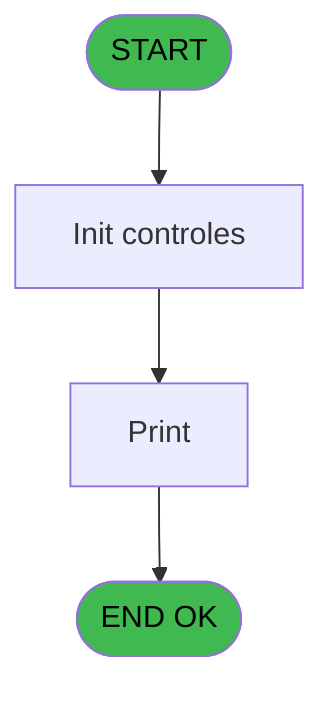
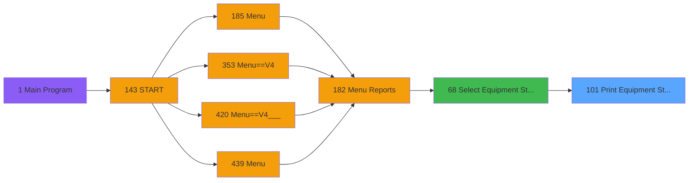

# PVE IDE 101 - Print Equipment / Status

> **Analyse**: Phases 1-4 2026-02-03 09:22 -> 09:23 (22s) | Assemblage 09:23
> **Pipeline**: V7.2 Enrichi
> **Structure**: 4 onglets (Resume | Ecrans | Donnees | Connexions)

<!-- TAB:Resume -->

## 1. FICHE D'IDENTITE

| Attribut | Valeur |
|----------|--------|
| Projet | PVE |
| IDE Position | 101 |
| Nom Programme | Print Equipment / Status |
| Fichier source | `Prg_101.xml` |
| Domaine metier | Impression |
| Taches | 4 (0 ecrans visibles) |
| Tables modifiees | 0 |
| Programmes appeles | 0 |

## 2. DESCRIPTION FONCTIONNELLE

**Print Equipment / Status** assure la gestion complete de ce processus, accessible depuis [Select Equipment / Status (IDE 68)](PVE-IDE-68.md).

Le flux de traitement s'organise en **2 blocs fonctionnels** :

- **Impression** (3 taches) : generation de tickets et documents
- **Traitement** (1 tache) : traitements metier divers

Detail : phases du traitement

#### Phase 1 : Impression (3 taches)

- **101** - Print Equipment / Status
- **101.1** - Print Equipment / Status
- **101.1.1** - EDITION

#### Phase 2 : Traitement (1 tache)

- **101.1.1.1** - Read Equipment

## 3. BLOCS FONCTIONNELS

### 3.1 Impression (3 taches)

Generation des documents et tickets.

---

#### 101 - Print Equipment / Status

**Role** : Generation du document : Print Equipment / Status.
**Variables liees** : A (P.i.Print/Exportation), B (P.i.rented equipment)

---

#### 101.1 - Print Equipment / Status

**Role** : Generation du document : Print Equipment / Status.
**Variables liees** : A (P.i.Print/Exportation), B (P.i.rented equipment)

---

#### 101.1.1 - EDITION

**Role** : Generation du document : EDITION.

### 3.2 Traitement (1 tache)

Traitements internes.

---

#### 101.1.1.1 - Read Equipment

**Role** : Traitement : Read Equipment.
**Variables liees** : B (P.i.rented equipment)

## 5. REGLES METIER

*(Aucune regle metier identifiee)*

## 6. CONTEXTE

- **Appele par**: [Select Equipment / Status (IDE 68)](PVE-IDE-68.md)
- **Appelle**: 0 programmes | **Tables**: 7 (W:0 R:3 L:4) | **Taches**: 4 | **Expressions**: 3

<!-- TAB:Ecrans -->

## 8. ECRANS

*(Programme sans ecran visible)*

## 9. NAVIGATION

### 9.3 Structure hierarchique (4 taches)

| Position | Tache | Type | Dimensions | Bloc |
|----------|-------|------|------------|------|
| **101.1** | [**Print Equipment / Status** (101)](#t1) | - | - | Impression |
| 101.1.1 | [Print Equipment / Status (101.1)](#t2) | MDI | - | |
| 101.1.2 | [EDITION (101.1.1)](#t3) | MDI | - | |
| **101.2** | [**Read Equipment** (101.1.1.1)](#t4) | MDI | - | Traitement |

### 9.4 Algorigramme

> **Legende**: Vert = START/END OK | Rouge = END KO | Bleu = Decisions
> *Algorigramme auto-genere. Utiliser `/algorigramme` pour une synthese metier detaillee.*

<!-- TAB:Donnees -->

## 10. TABLES

### Tables utilisees (7)

| ID | Nom | Description | Type | R | W | L | Usages |
|----|-----|-------------|------|---|---|---|--------|
| 388 | pv_hotel_days |  | DB |   |   | L | 1 |
| 389 | pv_equipment_inventory |  | DB |   |   | L | 1 |
| 398 | pv_prestations | Prestations/services vendus | DB |   |   | L | 1 |
| 399 | pv_package_price |  | DB |   |   | L | 1 |
| 404 | pv_sellers_by_week |  | DB | R |   |   | 1 |
| 525 | update_table_ensemble |  | TMP | R |   |   | 1 |
| 540 | import_recup_numchambre |  | DB | R |   |   | 1 |

### Colonnes par table (3 / 3 tables avec colonnes identifiees)

Table 404 - pv_sellers_by_week (R) - 1 usages

| Lettre | Variable | Acces | Type |
|--------|----------|-------|------|
| A | v. retour | R | Logical |
| B | v. counter | R | Numeric |
| C | v counter model | R | Numeric |

Table 525 - update_table_ensemble (R) - 1 usages

*Table utilisee uniquement en Link ou aucune colonne Real identifiee dans le DataView.*

Table 540 - import_recup_numchambre (R) - 1 usages

| Lettre | Variable | Acces | Type |
|--------|----------|-------|------|
| A | v. print status ? | R | Logical |
| B | v. counter status | R | Numeric |
| C | v.counter total | R | Numeric |
| D | v.Extract Line | R | Alpha |
| E | v.is item selected | R | Logical |

## 11. VARIABLES

### 11.1 Parametres entrants (4)

Variables recues du programme appelant ([Select Equipment / Status (IDE 68)](PVE-IDE-68.md)).

| Lettre | Nom | Type | Usage dans |
|--------|-----|------|-----------|
| A | P.i.Print/Exportation | Alpha | 1x parametre entrant |
| B | P.i.rented equipment | Alpha | - |
| C | P.i.ownership | Numeric | - |
| D | P.i.length | Numeric | - |

### 11.2 Variables de session (2)

Variables persistantes pendant toute la session.

| Lettre | Nom | Type | Usage dans |
|--------|-----|------|-----------|
| E | v.fichier csv | Alpha | 1x session |
| F | v.afficher  csv/excel | Logical | 1x session |

## 12. EXPRESSIONS

**3 / 3 expressions decodees (100%)**

### 12.1 Repartition par type

| Type | Expressions | Regles |
|------|-------------|--------|
| OTHER | 1 | 0 |
| CONDITION | 1 | 0 |
| CONCATENATION | 1 | 0 |

### 12.2 Expressions cles par type

#### OTHER (1 expressions)

| Type | IDE | Expression | Regle |
|------|-----|------------|-------|
| OTHER | 2 | `v.fichier csv [E]` | - |

#### CONDITION (1 expressions)

| Type | IDE | Expression | Regle |
|------|-----|------------|-------|
| CONDITION | 3 | `P.i.Print/Exportation [A]='E' AND v.afficher  csv/excel [F]` | - |

#### CONCATENATION (1 expressions)

| Type | IDE | Expression | Regle |
|------|-----|------------|-------|
| CONCATENATION | 1 | `Translate('%club_exportdata%')&Trim (GetParam ('VILLAGECODE'))&Trim (GetParam ('SERVICE'))&'_EquipmentsInventory'&'.csv'` | - |

<!-- TAB:Connexions -->

## 13. GRAPHE D'APPELS

### 13.1 Chaine depuis Main (Callers)

Main -> ... -> [Select Equipment / Status (IDE 68)](PVE-IDE-68.md) -> **Print Equipment / Status (IDE 101)**

### 13.2 Callers

| IDE | Nom Programme | Nb Appels |
|-----|---------------|-----------|
| [68](PVE-IDE-68.md) | Select Equipment / Status | 1 |

### 13.3 Callees (programmes appeles)

### 13.4 Detail Callees avec contexte

| IDE | Nom Programme | Appels | Contexte |
|-----|---------------|--------|----------|
| - | (aucun) | - | - |

## 14. RECOMMANDATIONS MIGRATION

### 14.1 Profil du programme

| Metrique | Valeur | Impact migration |
|----------|--------|-----------------|
| Lignes de logique | 128 | Programme compact |
| Expressions | 3 | Peu de logique |
| Tables WRITE | 0 | Impact faible |
| Sous-programmes | 0 | Peu de dependances |
| Ecrans visibles | 0 | Ecran unique ou traitement batch |
| Code desactive | 0% (0 / 128) | Code sain |
| Regles metier | 0 | Pas de regle identifiee |

### 14.2 Plan de migration par bloc

#### Impression (3 taches: 0 ecran, 3 traitements)

- **Strategie** : Templates HTML -> PDF via wkhtmltopdf ou Puppeteer.
- `PrintService` injectable avec choix imprimante

#### Traitement (1 tache: 0 ecran, 1 traitement)

- **Strategie** : 1 service(s) backend injectable(s) (Domain Services).
- Decomposer les taches en services unitaires testables.

### 14.3 Dependances critiques

| Dependance | Type | Appels | Impact |
|------------|------|--------|--------|

---
*Spec DETAILED generee par Pipeline V7.2 - 2026-02-03 09:23*
