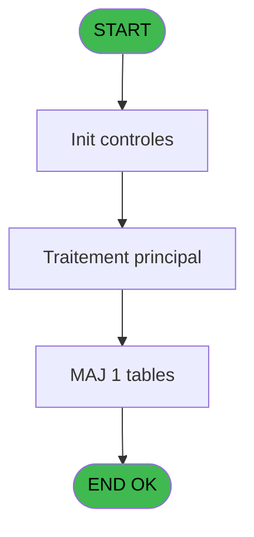
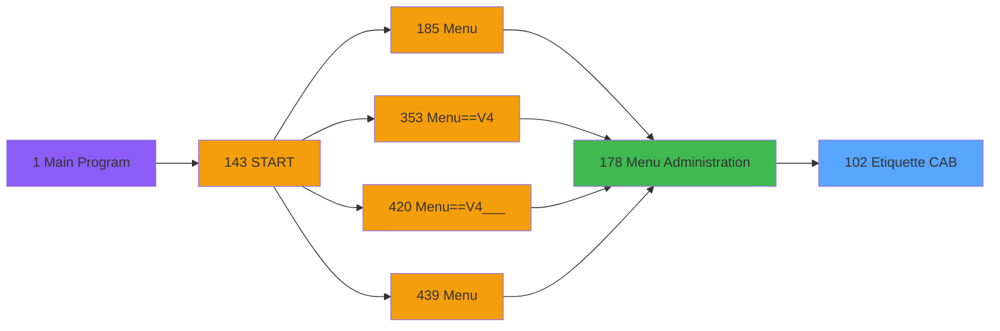
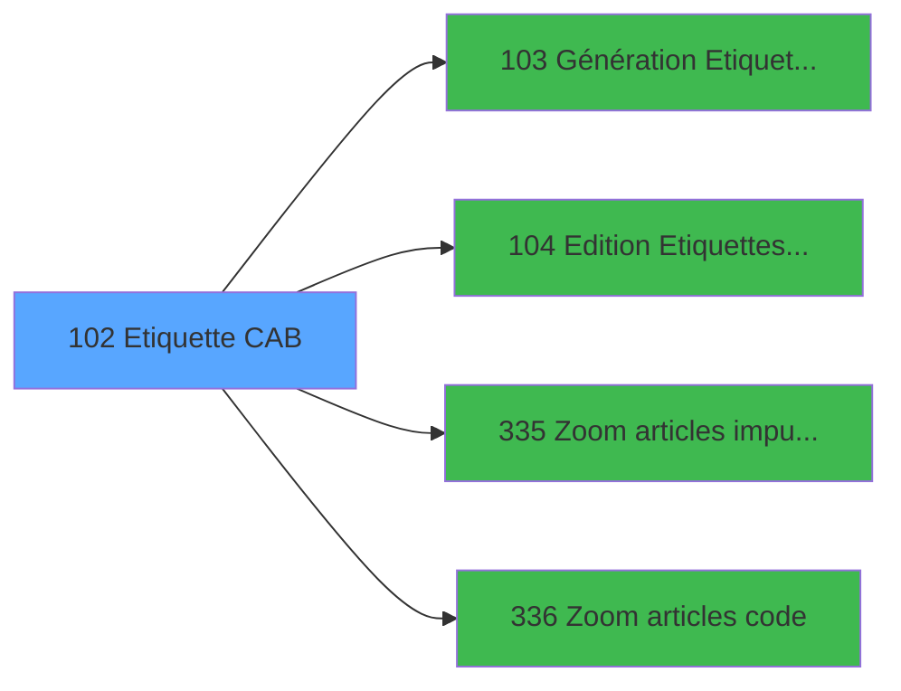

# PVE IDE 102 - Etiquette CAB

> **Analyse**: Phases 1-4 2026-02-03 09:23 -> 09:23 (19s) | Assemblage 09:23
> **Pipeline**: V7.2 Enrichi
> **Structure**: 4 onglets (Resume | Ecrans | Donnees | Connexions)

<!-- TAB:Resume -->

## 1. FICHE D'IDENTITE

| Attribut | Valeur |
|----------|--------|
| Projet | PVE |
| IDE Position | 102 |
| Nom Programme | Etiquette CAB |
| Fichier source | `Prg_102.xml` |
| Domaine metier | General |
| Taches | 5 (1 ecrans visibles) |
| Tables modifiees | 1 |
| Programmes appeles | 4 |

## 2. DESCRIPTION FONCTIONNELLE

**Etiquette CAB** assure la gestion complete de ce processus, accessible depuis [Menu Administration (IDE 178)](PVE-IDE-178.md).

Le flux de traitement s'organise en **2 blocs fonctionnels** :

- **Traitement** (3 taches) : traitements metier divers
- **Calcul** (2 taches) : calculs de montants, stocks ou compteurs

**Donnees modifiees** : 1 tables en ecriture (arc_cc_comptable).

**Logique metier** : 4 regles identifiees couvrant conditions metier.

Detail : phases du traitement

#### Phase 1 : Traitement (3 taches)

- **102** - Label CAB **[[ECRAN]](#ecran-t1)**
- **102.1** - groupe_user
- **102.3** - pointe tout

Delegue a : [Génération Etiquettes CAB (IDE 103)](PVE-IDE-103.md)

#### Phase 2 : Calcul (2 taches)

- **102.2** - raz calcul
- **102.4** - Calcul

#### Tables impactees

| Table | Operations | Role metier |
|-------|-----------|-------------|
| arc_cc_comptable | **W**/L (4 usages) |  |

## 3. BLOCS FONCTIONNELS

### 3.1 Traitement (3 taches)

Traitements internes.

---

#### 102 - Label CAB [[ECRAN]](#ecran-t1)

**Role** : Traitement : Label CAB.
**Ecran** : 706 x 238 DLU (MDI) | [Voir mockup](#ecran-t1)
**Delegue a** : [Génération Etiquettes CAB (IDE 103)](PVE-IDE-103.md)

---

#### 102.1 - groupe_user

**Role** : Traitement : groupe_user.
**Delegue a** : [Génération Etiquettes CAB (IDE 103)](PVE-IDE-103.md)

---

#### 102.3 - pointe tout

**Role** : Traitement : pointe tout.
**Delegue a** : [Génération Etiquettes CAB (IDE 103)](PVE-IDE-103.md)

### 3.2 Calcul (2 taches)

Calculs metier : montants, stocks, compteurs.

---

#### 102.2 - raz calcul

**Role** : Calcul : raz calcul.

---

#### 102.4 - Calcul

**Role** : Calcul : Calcul.

## 5. REGLES METIER

4 regles identifiees:

### Autres (4 regles)

#### [RM-001] Si [AD] alors 175 sinon 110)

| Element | Detail |
|---------|--------|
| **Condition** | `[AD]` |
| **Si vrai** | 175 |
| **Si faux** | 110) |
| **Expression source** | Expression 5 : `IF ([AD],175,110)` |
| **Exemple** | Si [AD] → 175. Sinon → 110) |

#### [RM-002] Si [AE] alors 175 sinon 110)

| Element | Detail |
|---------|--------|
| **Condition** | `[AE]` |
| **Si vrai** | 175 |
| **Si faux** | 110) |
| **Expression source** | Expression 6 : `IF ([AE],175,110)` |
| **Exemple** | Si [AE] → 175. Sinon → 110) |

#### [RM-003] Si [AF] alors 175 sinon 110)

| Element | Detail |
|---------|--------|
| **Condition** | `[AF]` |
| **Si vrai** | 175 |
| **Si faux** | 110) |
| **Expression source** | Expression 7 : `IF ([AF],175,110)` |
| **Exemple** | Si [AF] → 175. Sinon → 110) |

#### [RM-004] Si [AG] alors 175 sinon 110)

| Element | Detail |
|---------|--------|
| **Condition** | `[AG]` |
| **Si vrai** | 175 |
| **Si faux** | 110) |
| **Expression source** | Expression 8 : `IF ([AG],175,110)` |
| **Exemple** | Si [AG] → 175. Sinon → 110) |

## 6. CONTEXTE

- **Appele par**: [Menu Administration (IDE 178)](PVE-IDE-178.md)
- **Appelle**: 4 programmes | **Tables**: 4 (W:1 R:2 L:2) | **Taches**: 5 | **Expressions**: 29

<!-- TAB:Ecrans -->

## 8. ECRANS

### 8.1 Forms visibles (1 / 5)

| # | Position | Tache | Nom | Type | Largeur | Hauteur | Bloc |
|---|----------|-------|-----|------|---------|---------|------|
| 1 | 102 | 102 | Label CAB | MDI | 706 | 238 | Traitement |

### 8.2 Mockups Ecrans

---

#### 102 - Label CAB
**Tache** : [102](#t1) | **Type** : MDI | **Dimensions** : 706 x 238 DLU
**Bloc** : Traitement | **Titre IDE** : Label CAB

<!-- FORM-DATA:
{
    "width":  706,
    "vFactor":  8,
    "type":  "MDI",
    "hFactor":  8,
    "controls":  [
                     {
                         "x":  16,
                         "type":  "label",
                         "var":  "",
                         "y":  23,
                         "w":  168,
                         "fmt":  "",
                         "name":  "",
                         "h":  12,
                         "color":  "183",
                         "text":  "Preview",
                         "parent":  null
                     },
                     {
                         "x":  384,
                         "type":  "label",
                         "var":  "",
                         "y":  25,
                         "w":  313,
                         "fmt":  "",
                         "name":  "",
                         "h":  12,
                         "color":  "146",
                         "text":  "First label page",
                         "parent":  null
                     },
                     {
                         "x":  16,
                         "type":  "label",
                         "var":  "",
                         "y":  38,
                         "w":  168,
                         "fmt":  "",
                         "name":  "",
                         "h":  12,
                         "color":  "183",
                         "text":  "Marge du haut",
                         "parent":  null
                     },
                     {
                         "x":  262,
                         "type":  "label",
                         "var":  "",
                         "y":  38,
                         "w":  96,
                         "fmt":  "",
                         "name":  "",
                         "h":  12,
                         "color":  "",
                         "text":  "( x 0.3 mm)",
                         "parent":  null
                     },
                     {
                         "x":  16,
                         "type":  "label",
                         "var":  "",
                         "y":  57,
                         "w":  168,
                         "fmt":  "",
                         "name":  "",
                         "h":  12,
                         "color":  "142",
                         "text":  "Service",
                         "parent":  null
                     },
                     {
                         "x":  16,
                         "type":  "label",
                         "var":  "",
                         "y":  72,
                         "w":  168,
                         "fmt":  "",
                         "name":  "",
                         "h":  12,
                         "color":  "142",
                         "text":  "Product #",
                         "parent":  null
                     },
                     {
                         "x":  16,
                         "type":  "label",
                         "var":  "",
                         "y":  87,
                         "w":  168,
                         "fmt":  "",
                         "name":  "",
                         "h":  12,
                         "color":  "142",
                         "text":  "Product label",
                         "parent":  null
                     },
                     {
                         "x":  16,
                         "type":  "label",
                         "var":  "",
                         "y":  102,
                         "w":  168,
                         "fmt":  "",
                         "name":  "",
                         "h":  12,
                         "color":  "142",
                         "text":  "Imputation",
                         "parent":  null
                     },
                     {
                         "x":  16,
                         "type":  "label",
                         "var":  "",
                         "y":  117,
                         "w":  168,
                         "fmt":  "",
                         "name":  "",
                         "h":  12,
                         "color":  "142",
                         "text":  "Imputation label",
                         "parent":  null
                     },
                     {
                         "x":  16,
                         "type":  "label",
                         "var":  "",
                         "y":  132,
                         "w":  168,
                         "fmt":  "",
                         "name":  "",
                         "h":  12,
                         "color":  "142",
                         "text":  "Sort by",
                         "parent":  null
                     },
                     {
                         "x":  16,
                         "type":  "label",
                         "var":  "",
                         "y":  147,
                         "w":  168,
                         "fmt":  "",
                         "name":  "",
                         "h":  12,
                         "color":  "142",
                         "text":  "Number of copies",
                         "parent":  null
                     },
                     {
                         "x":  16,
                         "type":  "label",
                         "var":  "",
                         "y":  162,
                         "w":  168,
                         "fmt":  "",
                         "name":  "",
                         "h":  12,
                         "color":  "142",
                         "text":  "Copies groupées",
                         "parent":  null
                     },
                     {
                         "x":  16,
                         "type":  "label",
                         "var":  "",
                         "y":  177,
                         "w":  168,
                         "fmt":  "",
                         "name":  "",
                         "h":  12,
                         "color":  "142",
                         "text":  "First label",
                         "parent":  null
                     },
                     {
                         "x":  16,
                         "type":  "label",
                         "var":  "",
                         "y":  192,
                         "w":  356,
                         "fmt":  "",
                         "name":  "",
                         "h":  12,
                         "color":  "143",
                         "text":  "Input the number, then ENTER",
                         "parent":  null
                     },
                     {
                         "x":  2,
                         "type":  "label",
                         "var":  "",
                         "y":  211,
                         "w":  701,
                         "fmt":  "",
                         "name":  "",
                         "h":  24,
                         "color":  "",
                         "text":  "",
                         "parent":  null
                     },
                     {
                         "x":  384,
                         "type":  "table",
                         "var":  "",
                         "name":  "",
                         "titleH":  12,
                         "color":  "110",
                         "w":  315,
                         "y":  37,
                         "fmt":  "",
                         "parent":  null,
                         "text":  "",
                         "rowH":  14,
                         "h":  168,
                         "cols":  [
                                      {
                                          "title":  "",
                                          "layer":  1,
                                          "w":  67
                                      },
                                      {
                                          "title":  "Col1",
                                          "layer":  2,
                                          "w":  63
                                      },
                                      {
                                          "title":  "Col2",
                                          "layer":  3,
                                          "w":  57
                                      },
                                      {
                                          "title":  "Col3",
                                          "layer":  4,
                                          "w":  61
                                      },
                                      {
                                          "title":  "Col4",
                                          "layer":  5,
                                          "w":  60
                                      }
                                  ],
                         "rows":  5
                     },
                     {
                         "x":  9,
                         "type":  "button",
                         "var":  "",
                         "y":  215,
                         "w":  154,
                         "fmt":  "",
                         "name":  "bouton quitter",
                         "h":  18,
                         "color":  "",
                         "text":  "",
                         "parent":  23
                     },
                     {
                         "x":  536,
                         "type":  "button",
                         "var":  "",
                         "y":  215,
                         "w":  154,
                         "fmt":  "",
                         "name":  "bouton validation",
                         "h":  18,
                         "color":  "",
                         "text":  "",
                         "parent":  null
                     },
                     {
                         "x":  200,
                         "type":  "checkbox",
                         "var":  "",
                         "y":  23,
                         "w":  32,
                         "fmt":  "",
                         "name":  "print_preview",
                         "h":  12,
                         "color":  "183",
                         "text":  "",
                         "parent":  null
                     },
                     {
                         "x":  200,
                         "type":  "edit",
                         "var":  "",
                         "y":  38,
                         "w":  56,
                         "fmt":  "",
                         "name":  "cadrage",
                         "h":  12,
                         "color":  "110",
                         "text":  "",
                         "parent":  null
                     },
                     {
                         "x":  198,
                         "type":  "edit",
                         "var":  "",
                         "y":  57,
                         "w":  80,
                         "fmt":  "",
                         "name":  "",
                         "h":  12,
                         "color":  "110",
                         "text":  "",
                         "parent":  null
                     },
                     {
                         "x":  198,
                         "type":  "edit",
                         "var":  "",
                         "y":  72,
                         "w":  75,
                         "fmt":  "6P0Z",
                         "name":  "Numéro article",
                         "h":  12,
                         "color":  "110",
                         "text":  "",
                         "parent":  null
                     },
                     {
                         "x":  198,
                         "type":  "edit",
                         "var":  "",
                         "y":  87,
                         "w":  160,
                         "fmt":  "",
                         "name":  "",
                         "h":  12,
                         "color":  "110",
                         "text":  "",
                         "parent":  null
                     },
                     {
                         "x":  197,
                         "type":  "edit",
                         "var":  "",
                         "y":  102,
                         "w":  160,
                         "fmt":  "10Z",
                         "name":  "Imputation",
                         "h":  12,
                         "color":  "110",
                         "text":  "",
                         "parent":  null
                     },
                     {
                         "x":  197,
                         "type":  "edit",
                         "var":  "",
                         "y":  117,
                         "w":  160,
                         "fmt":  "",
                         "name":  "",
                         "h":  12,
                         "color":  "110",
                         "text":  "",
                         "parent":  null
                     },
                     {
                         "x":  198,
                         "type":  "combobox",
                         "var":  "",
                         "y":  132,
                         "w":  160,
                         "fmt":  "",
                         "name":  "Tri",
                         "h":  12,
                         "color":  "110",
                         "text":  "",
                         "parent":  null
                     },
                     {
                         "x":  198,
                         "type":  "edit",
                         "var":  "",
                         "y":  147,
                         "w":  80,
                         "fmt":  "",
                         "name":  "Nombre de copies",
                         "h":  12,
                         "color":  "110",
                         "text":  "",
                         "parent":  null
                     },
                     {
                         "x":  198,
                         "type":  "combobox",
                         "var":  "",
                         "y":  162,
                         "w":  160,
                         "fmt":  "",
                         "name":  "Copies groupées",
                         "h":  12,
                         "color":  "110",
                         "text":  "",
                         "parent":  null
                     },
                     {
                         "x":  198,
                         "type":  "edit",
                         "var":  "",
                         "y":  177,
                         "w":  40,
                         "fmt":  "",
                         "name":  "NUMPREMIERE",
                         "h":  12,
                         "color":  "110",
                         "text":  "",
                         "parent":  null
                     },
                     {
                         "x":  456,
                         "type":  "edit",
                         "var":  "",
                         "y":  50,
                         "w":  56,
                         "fmt":  "",
                         "name":  "CTRL_001",
                         "h":  14,
                         "color":  "110",
                         "text":  "",
                         "parent":  26
                     },
                     {
                         "x":  517,
                         "type":  "edit",
                         "var":  "",
                         "y":  50,
                         "w":  56,
                         "fmt":  "",
                         "name":  "CTRL_002",
                         "h":  14,
                         "color":  "110",
                         "text":  "",
                         "parent":  26
                     },
                     {
                         "x":  576,
                         "type":  "edit",
                         "var":  "",
                         "y":  50,
                         "w":  56,
                         "fmt":  "",
                         "name":  "CTRL_003",
                         "h":  14,
                         "color":  "110",
                         "text":  "",
                         "parent":  26
                     },
                     {
                         "x":  637,
                         "type":  "edit",
                         "var":  "",
                         "y":  50,
                         "w":  58,
                         "fmt":  "",
                         "name":  "CTRL_004",
                         "h":  14,
                         "color":  "110",
                         "text":  "",
                         "parent":  26
                     },
                     {
                         "x":  394,
                         "type":  "edit",
                         "var":  "",
                         "y":  51,
                         "w":  56,
                         "fmt":  "6",
                         "name":  "",
                         "h":  11,
                         "color":  "142",
                         "text":  "",
                         "parent":  26
                     },
                     {
                         "x":  190,
                         "type":  "edit",
                         "var":  "",
                         "y":  217,
                         "w":  323,
                         "fmt":  "30",
                         "name":  "",
                         "h":  12,
                         "color":  "143",
                         "text":  "",
                         "parent":  null
                     }
                 ],
    "taskId":  "102",
    "height":  238
}
-->

<strong>Champs : 17 champs</strong>

| Pos (x,y) | Nom | Variable | Type |
|-----------|-----|----------|------|
| 200,23 | print_preview | - | checkbox |
| 200,38 | cadrage | - | edit |
| 198,57 | (sans nom) | - | edit |
| 198,72 | Numéro article | - | edit |
| 198,87 | (sans nom) | - | edit |
| 197,102 | Imputation | - | edit |
| 197,117 | (sans nom) | - | edit |
| 198,132 | Tri | - | combobox |
| 198,147 | Nombre de copies | - | edit |
| 198,162 | Copies groupées | - | combobox |
| 198,177 | NUMPREMIERE | - | edit |
| 456,50 | CTRL_001 | - | edit |
| 517,50 | CTRL_002 | - | edit |
| 576,50 | CTRL_003 | - | edit |
| 637,50 | CTRL_004 | - | edit |
| 394,51 | 6 | - | edit |
| 190,217 | 30 | - | edit |

<strong>Boutons : 2 boutons</strong>

| Bouton | Pos (x,y) | Action |
|--------|-----------|--------|
| quitter | 9,215 | Quitte le programme |
| validation | 536,215 | Valide la saisie et enregistre |

## 9. NAVIGATION

Ecran unique: **Label CAB**

### 9.3 Structure hierarchique (5 taches)

| Position | Tache | Type | Dimensions | Bloc |
|----------|-------|------|------------|------|
| **102.1** | [**Label CAB** (102)](#t1) [mockup](#ecran-t1) | MDI | 706x238 | Traitement |
| 102.1.1 | [groupe_user (102.1)](#t2) | MDI | - | |
| 102.1.2 | [pointe tout (102.3)](#t4) | MDI | - | |
| **102.2** | [**raz calcul** (102.2)](#t3) | MDI | - | Calcul |
| 102.2.1 | [Calcul (102.4)](#t5) | MDI | - | |

### 9.4 Algorigramme

> **Legende**: Vert = START/END OK | Rouge = END KO | Bleu = Decisions
> *Algorigramme auto-genere. Utiliser `/algorigramme` pour une synthese metier detaillee.*

<!-- TAB:Donnees -->

## 10. TABLES

### Tables utilisees (4)

| ID | Nom | Description | Type | R | W | L | Usages |
|----|-----|-------------|------|---|---|---|--------|
| 77 | articles_________art | Articles et stock | DB | R |   |   | 1 |
| 209 | plan_comptable_central |  | DB |   |   | L | 1 |
| 726 | arc_cc_comptable |  | DB |   | **W** | L | 4 |
| 740 | pv_stock_movements | Articles et stock | DB | R |   |   | 1 |

### Colonnes par table (1 / 3 tables avec colonnes identifiees)

Table 77 - articles_________art (R) - 1 usages

| Lettre | Variable | Acces | Type |
|--------|----------|-------|------|
| A | P. Société | R | Alpha |
| B | P. Service | R | Alpha |
| C | P. Service Libellé | R | Alpha |
| D | abandon | R | Logical |
| E | bouton quitter | R | Alpha |
| F | bouton validation | R | Alpha |
| G | print_preview | R | Logical |
| H | cadrage | R | Numeric |
| I | Service | R | Alpha |
| J | Numéro article | R | Numeric |
| K | Imputation | R | Numeric |
| L | Tri | R | Alpha |
| M | Nombre de copies | R | Numeric |
| N | Copies groupées | R | Alpha |
| O | GroupeUser | R | Alpha |
| P | EcranUpdated | R | Logical |
| Q | Première étiquette | R | Numeric |
| R | V Masque montant | R | Alpha |

Table 726 - arc_cc_comptable (**W**/L) - 4 usages

*Table utilisee uniquement en Link ou aucune colonne Real identifiee dans le DataView.*

Table 740 - pv_stock_movements (R) - 1 usages

*Table utilisee uniquement en Link ou aucune colonne Real identifiee dans le DataView.*

## 11. VARIABLES

### 11.1 Parametres entrants (3)

Variables recues du programme appelant ([Menu Administration (IDE 178)](PVE-IDE-178.md)).

| Lettre | Nom | Type | Usage dans |
|--------|-----|------|-----------|
| A | P. Société | Alpha | 1x parametre entrant |
| B | P. Service | Alpha | 1x parametre entrant |
| C | P. Service Libellé | Alpha | - |

### 11.2 Variables de session (1)

Variables persistantes pendant toute la session.

| Lettre | Nom | Type | Usage dans |
|--------|-----|------|-----------|
| R | V Masque montant | Alpha | - |

### 11.3 Autres (14)

Variables diverses.

| Lettre | Nom | Type | Usage dans |
|--------|-----|------|-----------|
| D | abandon | Logical | 2x refs |
| E | bouton quitter | Alpha | - |
| F | bouton validation | Alpha | - |
| G | print_preview | Logical | - |
| H | cadrage | Numeric | 1x refs |
| I | Service | Alpha | 1x refs |
| J | Numéro article | Numeric | 2x refs |
| K | Imputation | Numeric | - |
| L | Tri | Alpha | - |
| M | Nombre de copies | Numeric | 3x refs |
| N | Copies groupées | Alpha | - |
| O | GroupeUser | Alpha | - |
| P | EcranUpdated | Logical | - |
| Q | Première étiquette | Numeric | - |

Toutes les 18 variables (liste complete)

| Cat | Lettre | Nom Variable | Type |
|-----|--------|--------------|------|
| P0 | **A** | P. Société | Alpha |
| P0 | **B** | P. Service | Alpha |
| P0 | **C** | P. Service Libellé | Alpha |
| V. | **R** | V Masque montant | Alpha |
| Autre | **D** | abandon | Logical |
| Autre | **E** | bouton quitter | Alpha |
| Autre | **F** | bouton validation | Alpha |
| Autre | **G** | print_preview | Logical |
| Autre | **H** | cadrage | Numeric |
| Autre | **I** | Service | Alpha |
| Autre | **J** | Numéro article | Numeric |
| Autre | **K** | Imputation | Numeric |
| Autre | **L** | Tri | Alpha |
| Autre | **M** | Nombre de copies | Numeric |
| Autre | **N** | Copies groupées | Alpha |
| Autre | **O** | GroupeUser | Alpha |
| Autre | **P** | EcranUpdated | Logical |
| Autre | **Q** | Première étiquette | Numeric |

## 12. EXPRESSIONS

**29 / 29 expressions decodees (100%)**

### 12.1 Repartition par type

| Type | Expressions | Regles |
|------|-------------|--------|
| CONCATENATION | 1 | 0 |
| CONDITION | 9 | 4 |
| CONSTANTE | 9 | 0 |
| OTHER | 3 | 0 |
| CAST_LOGIQUE | 3 | 0 |
| NEGATION | 1 | 0 |
| STRING | 3 | 0 |

### 12.2 Expressions cles par type

#### CONCATENATION (1 expressions)

| Type | IDE | Expression | Regle |
|------|-----|------------|-------|
| CONCATENATION | 26 | `'Marge du haut = '&Str (cadrage [H]*0.3,'3.2')&' mm'` | - |

#### CONDITION (9 expressions)

| Type | IDE | Expression | Regle |
|------|-----|------------|-------|
| CONDITION | 7 | `IF ([AF],175,110)` | [RM-003](#rm-RM-003) |
| CONDITION | 8 | `IF ([AG],175,110)` | [RM-004](#rm-RM-004) |
| CONDITION | 5 | `IF ([AD],175,110)` | [RM-001](#rm-RM-001) |
| CONDITION | 6 | `IF ([AE],175,110)` | [RM-002](#rm-RM-002) |
| CONDITION | 27 | `[X]=0 AND NOT (abandon [D])` | - |
| ... | | *+4 autres* | |

#### CONSTANTE (9 expressions)

| Type | IDE | Expression | Regle |
|------|-----|------------|-------|
| CONSTANTE | 20 | `0` | - |
| CONSTANTE | 13 | `1` | - |
| CONSTANTE | 25 | `15` | - |
| CONSTANTE | 21 | `''` | - |
| CONSTANTE | 12 | `'S'` | - |
| ... | | *+4 autres* | |

#### OTHER (3 expressions)

| Type | IDE | Expression | Regle |
|------|-----|------------|-------|
| OTHER | 15 | `P. Société [A]` | - |
| OTHER | 14 | `Numéro article [J]` | - |
| OTHER | 3 | `P. Service [B]` | - |

#### CAST_LOGIQUE (3 expressions)

| Type | IDE | Expression | Regle |
|------|-----|------------|-------|
| CAST_LOGIQUE | 24 | `'TRUE'LOG` | - |
| CAST_LOGIQUE | 23 | `'TRUE'LOG` | - |
| CAST_LOGIQUE | 22 | `'FALSE'LOG` | - |

#### NEGATION (1 expressions)

| Type | IDE | Expression | Regle |
|------|-----|------------|-------|
| NEGATION | 29 | `NOT ([W])` | - |

#### STRING (3 expressions)

| Type | IDE | Expression | Regle |
|------|-----|------------|-------|
| STRING | 17 | `Val (MID (Str (Nombre de copies [M],'9'),7,3),'3')` | - |
| STRING | 16 | `Val (Left (Str (Nombre de copies [M],'9'),6),'6')` | - |
| STRING | 4 | `'Lig '&Str ([Y],'2')` | - |

### 12.3 Toutes les expressions (29)

Voir les 29 expressions

#### CONCATENATION (1)

| IDE | Expression Decodee |
|-----|-------------------|
| 26 | `'Marge du haut = '&Str (cadrage [H]*0.3,'3.2')&' mm'` |

#### CONDITION (9)

| IDE | Expression Decodee |
|-----|-------------------|
| 5 | `IF ([AD],175,110)` |
| 6 | `IF ([AE],175,110)` |
| 7 | `IF ([AF],175,110)` |
| 8 | `IF ([AG],175,110)` |
| 9 | `[X]<>0 AND [W]` |
| 18 | `Nombre de copies [M]=0` |
| 19 | `Numéro article [J]=0` |
| 27 | `[X]=0 AND NOT (abandon [D])` |
| 28 | `[X]>44 AND NOT (abandon [D])` |

#### CONSTANTE (9)

| IDE | Expression Decodee |
|-----|-------------------|
| 1 | `'Quitter'` |
| 2 | `'&Validation'` |
| 10 | `0` |
| 11 | `'A'` |
| 12 | `'S'` |
| 13 | `1` |
| 20 | `0` |
| 21 | `''` |
| 25 | `15` |

#### OTHER (3)

| IDE | Expression Decodee |
|-----|-------------------|
| 3 | `P. Service [B]` |
| 14 | `Numéro article [J]` |
| 15 | `P. Société [A]` |

#### CAST_LOGIQUE (3)

| IDE | Expression Decodee |
|-----|-------------------|
| 22 | `'FALSE'LOG` |
| 23 | `'TRUE'LOG` |
| 24 | `'TRUE'LOG` |

#### NEGATION (1)

| IDE | Expression Decodee |
|-----|-------------------|
| 29 | `NOT ([W])` |

#### STRING (3)

| IDE | Expression Decodee |
|-----|-------------------|
| 4 | `'Lig '&Str ([Y],'2')` |
| 16 | `Val (Left (Str (Nombre de copies [M],'9'),6),'6')` |
| 17 | `Val (MID (Str (Nombre de copies [M],'9'),7,3),'3')` |

<!-- TAB:Connexions -->

## 13. GRAPHE D'APPELS

### 13.1 Chaine depuis Main (Callers)

Main -> ... -> [Menu Administration (IDE 178)](PVE-IDE-178.md) -> **Etiquette CAB (IDE 102)**

### 13.2 Callers

| IDE | Nom Programme | Nb Appels |
|-----|---------------|-----------|
| [178](PVE-IDE-178.md) | Menu Administration | 1 |

### 13.3 Callees (programmes appeles)

### 13.4 Detail Callees avec contexte

| IDE | Nom Programme | Appels | Contexte |
|-----|---------------|--------|----------|
| [103](PVE-IDE-103.md) | Génération Etiquettes CAB | 1 | Sous-programme |
| [104](PVE-IDE-104.md) | Edition Etiquettes CAB | 1 | Impression ticket/document |
| [335](PVE-IDE-335.md) | Zoom articles imputation | 1 | Selection/consultation |
| [336](PVE-IDE-336.md) | Zoom articles code | 1 | Selection/consultation |

## 14. RECOMMANDATIONS MIGRATION

### 14.1 Profil du programme

| Metrique | Valeur | Impact migration |
|----------|--------|-----------------|
| Lignes de logique | 142 | Programme compact |
| Expressions | 29 | Peu de logique |
| Tables WRITE | 1 | Impact faible |
| Sous-programmes | 4 | Peu de dependances |
| Ecrans visibles | 1 | Ecran unique ou traitement batch |
| Code desactive | 0% (0 / 142) | Code sain |
| Regles metier | 4 | Quelques regles a preserver |

### 14.2 Plan de migration par bloc

#### Traitement (3 taches: 1 ecran, 2 traitements)

- **Strategie** : Orchestrateur avec 1 ecrans (Razor/React) et 2 traitements backend (services).
- Les ecrans deviennent des composants UI, les traitements invisibles deviennent des services injectables.
- 4 sous-programme(s) a migrer ou a reutiliser depuis les services existants.
- Decomposer les taches en services unitaires testables.

#### Calcul (2 taches: 0 ecran, 2 traitements)

- **Strategie** : Services de calcul purs (Domain Services).
- Migrer la logique de calcul (stock, compteurs, montants)

### 14.3 Dependances critiques

| Dependance | Type | Appels | Impact |
|------------|------|--------|--------|
| arc_cc_comptable | Table WRITE (Database) | 3x | Schema + repository |
| [Zoom articles imputation (IDE 335)](PVE-IDE-335.md) | Sous-programme | 1x | Normale - Selection/consultation |
| [Zoom articles code (IDE 336)](PVE-IDE-336.md) | Sous-programme | 1x | Normale - Selection/consultation |
| [Génération Etiquettes CAB (IDE 103)](PVE-IDE-103.md) | Sous-programme | 1x | Normale - Sous-programme |
| [Edition Etiquettes CAB (IDE 104)](PVE-IDE-104.md) | Sous-programme | 1x | Normale - Impression ticket/document |

---
*Spec DETAILED generee par Pipeline V7.2 - 2026-02-03 09:23*
