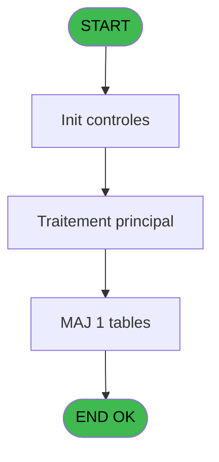
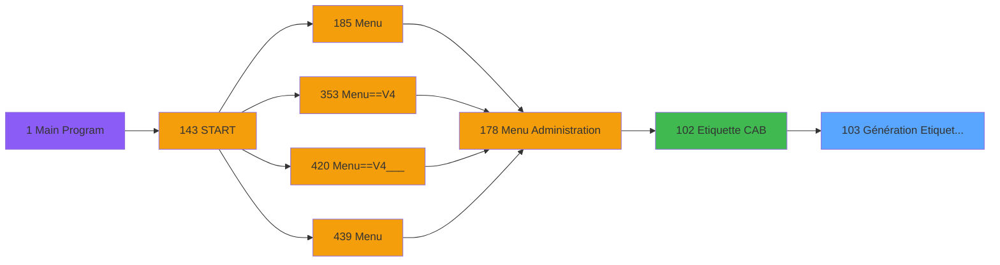

# PVE IDE 103 - Génération Etiquettes CAB

> **Analyse**: Phases 1-4 2026-02-03 09:24 -> 09:24 (20s) | Assemblage 09:24
> **Pipeline**: V7.2 Enrichi
> **Structure**: 4 onglets (Resume | Ecrans | Donnees | Connexions)

<!-- TAB:Resume -->

## 1. FICHE D'IDENTITE

| Attribut | Valeur |
|----------|--------|
| Projet | PVE |
| IDE Position | 103 |
| Nom Programme | Génération Etiquettes CAB |
| Fichier source | `Prg_103.xml` |
| Domaine metier | General |
| Taches | 6 (0 ecrans visibles) |
| Tables modifiees | 1 |
| Programmes appeles | 0 |

## 2. DESCRIPTION FONCTIONNELLE

**Génération Etiquettes CAB** assure la gestion complete de ce processus, accessible depuis [Etiquette CAB (IDE 102)](PVE-IDE-102.md).

Le flux de traitement s'organise en **2 blocs fonctionnels** :

- **Traitement** (5 taches) : traitements metier divers
- **Creation** (1 tache) : insertion d'enregistrements en base (mouvements, prestations)

**Donnees modifiees** : 1 tables en ecriture (pv_stats).

Detail : phases du traitement

#### Phase 1 : Traitement (5 taches)

- **103** - Génération Etiquettes CAB
- **103.1** - Génère étiquettes déjà éditées
- **103.2** - gestion des copies distinctes
- **103.2.1** - Lecture des articles
- **103.2.1.1** - gestion des copies groupées

#### Phase 2 : Creation (1 tache)

- **103.2.1.1.1** - creation

#### Tables impactees

| Table | Operations | Role metier |
|-------|-----------|-------------|
| pv_stats | **W** (2 usages) |  |

## 3. BLOCS FONCTIONNELS

### 3.1 Traitement (5 taches)

Traitements internes.

---

#### 103 - Génération Etiquettes CAB

**Role** : Traitement : Génération Etiquettes CAB.

4 sous-taches directes

| Tache | Nom | Bloc |
|-------|-----|------|
| [103.1](#t2) | Génère étiquettes déjà éditées | Traitement |
| [103.2](#t3) | gestion des copies distinctes | Traitement |
| [103.2.1](#t4) | Lecture des articles | Traitement |
| [103.2.1.1](#t5) | gestion des copies groupées | Traitement |

---

#### 103.1 - Génère étiquettes déjà éditées

**Role** : Traitement : Génère étiquettes déjà éditées.

---

#### 103.2 - gestion des copies distinctes

**Role** : Gestion du moyen de paiement : gestion des copies distinctes.
**Variables liees** : G (param copies), H (param copies groupées)

---

#### 103.2.1 - Lecture des articles

**Role** : Traitement : Lecture des articles.

---

#### 103.2.1.1 - gestion des copies groupées

**Role** : Gestion du moyen de paiement : gestion des copies groupées.
**Variables liees** : G (param copies), H (param copies groupées)

### 3.2 Creation (1 tache)

Insertion de nouveaux enregistrements en base.

---

#### 103.2.1.1.1 - creation

**Role** : Creation d'enregistrement : creation.

## 5. REGLES METIER

*(Aucune regle metier identifiee)*

## 6. CONTEXTE

- **Appele par**: [Etiquette CAB (IDE 102)](PVE-IDE-102.md)
- **Appelle**: 0 programmes | **Tables**: 2 (W:1 R:1 L:0) | **Taches**: 6 | **Expressions**: 2

<!-- TAB:Ecrans -->

## 8. ECRANS

*(Programme sans ecran visible)*

## 9. NAVIGATION

### 9.3 Structure hierarchique (6 taches)

| Position | Tache | Type | Dimensions | Bloc |
|----------|-------|------|------------|------|
| **103.1** | [**Génération Etiquettes CAB** (103)](#t1) | MDI | - | Traitement |
| 103.1.1 | [Génère étiquettes déjà éditées (103.1)](#t2) | MDI | - | |
| 103.1.2 | [gestion des copies distinctes (103.2)](#t3) | MDI | - | |
| 103.1.3 | [Lecture des articles (103.2.1)](#t4) | MDI | - | |
| 103.1.4 | [gestion des copies groupées (103.2.1.1)](#t5) | MDI | - | |
| **103.2** | [**creation** (103.2.1.1.1)](#t6) | MDI | - | Creation |

### 9.4 Algorigramme

> **Legende**: Vert = START/END OK | Rouge = END KO | Bleu = Decisions
> *Algorigramme auto-genere. Utiliser `/algorigramme` pour une synthese metier detaillee.*

<!-- TAB:Donnees -->

## 10. TABLES

### Tables utilisees (2)

| ID | Nom | Description | Type | R | W | L | Usages |
|----|-----|-------------|------|---|---|---|--------|
| 77 | articles_________art | Articles et stock | DB | R |   |   | 1 |
| 520 | pv_stats |  | TMP |   | **W** |   | 2 |

### Colonnes par table (0 / 2 tables avec colonnes identifiees)

Table 77 - articles_________art (R) - 1 usages

*Table utilisee uniquement en Link ou aucune colonne Real identifiee dans le DataView.*

Table 520 - pv_stats (**W**) - 2 usages

*Table utilisee uniquement en Link ou aucune colonne Real identifiee dans le DataView.*

## 11. VARIABLES

### 11.1 Autres (9)

Variables diverses.

| Lettre | Nom | Type | Usage dans |
|--------|-----|------|-----------|
| A | param service | Alpha | - |
| B | param numero article | Numeric | - |
| C | param libelle article | Alpha | - |
| D | param imputation | Numeric | - |
| E | param libelle imputation | Alpha | - |
| F | param tri | Alpha | - |
| G | param copies | Numeric | - |
| H | param copies groupées | Alpha | - |
| I | param premiere etiquette | Numeric | [103](#t1) |

## 12. EXPRESSIONS

**2 / 2 expressions decodees (100%)**

### 12.1 Repartition par type

| Type | Expressions | Regles |
|------|-------------|--------|
| OTHER | 1 | 0 |
| CONDITION | 1 | 0 |

### 12.2 Expressions cles par type

#### OTHER (1 expressions)

| Type | IDE | Expression | Regle |
|------|-----|------------|-------|
| OTHER | 1 | `DbDel ('{520,3}'DSOURCE,'')` | - |

#### CONDITION (1 expressions)

| Type | IDE | Expression | Regle |
|------|-----|------------|-------|
| CONDITION | 2 | `param premiere etiquette [I]>1` | - |

<!-- TAB:Connexions -->

## 13. GRAPHE D'APPELS

### 13.1 Chaine depuis Main (Callers)

Main -> ... -> [Etiquette CAB (IDE 102)](PVE-IDE-102.md) -> **Génération Etiquettes CAB (IDE 103)**

### 13.2 Callers

| IDE | Nom Programme | Nb Appels |
|-----|---------------|-----------|
| [102](PVE-IDE-102.md) | Etiquette CAB | 1 |

### 13.3 Callees (programmes appeles)

### 13.4 Detail Callees avec contexte

| IDE | Nom Programme | Appels | Contexte |
|-----|---------------|--------|----------|
| - | (aucun) | - | - |

## 14. RECOMMANDATIONS MIGRATION

### 14.1 Profil du programme

| Metrique | Valeur | Impact migration |
|----------|--------|-----------------|
| Lignes de logique | 48 | Programme compact |
| Expressions | 2 | Peu de logique |
| Tables WRITE | 1 | Impact faible |
| Sous-programmes | 0 | Peu de dependances |
| Ecrans visibles | 0 | Ecran unique ou traitement batch |
| Code desactive | 0% (0 / 48) | Code sain |
| Regles metier | 0 | Pas de regle identifiee |

### 14.2 Plan de migration par bloc

#### Traitement (5 taches: 0 ecran, 5 traitements)

- **Strategie** : 5 service(s) backend injectable(s) (Domain Services).
- Decomposer les taches en services unitaires testables.

#### Creation (1 tache: 0 ecran, 1 traitement)

- **Strategie** : Repository pattern avec Entity Framework Core.
- Insertion via `IRepository<T>.CreateAsync()`

### 14.3 Dependances critiques

| Dependance | Type | Appels | Impact |
|------------|------|--------|--------|
| pv_stats | Table WRITE (Temp) | 2x | Schema + repository |

---
*Spec DETAILED generee par Pipeline V7.2 - 2026-02-03 09:24*
