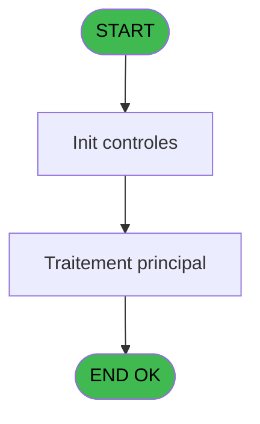
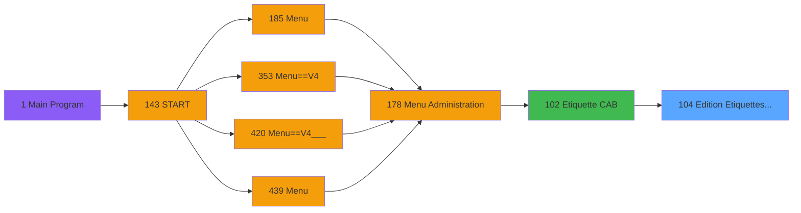

# PVE IDE 104 - Edition Etiquettes CAB

> **Analyse**: Phases 1-4 2026-02-03 09:24 -> 09:24 (20s) | Assemblage 09:24
> **Pipeline**: V7.2 Enrichi
> **Structure**: 4 onglets (Resume | Ecrans | Donnees | Connexions)

<!-- TAB:Resume -->

## 1. FICHE D'IDENTITE

| Attribut | Valeur |
|----------|--------|
| Projet | PVE |
| IDE Position | 104 |
| Nom Programme | Edition Etiquettes CAB |
| Fichier source | `Prg_104.xml` |
| Domaine metier | Impression |
| Taches | 3 (0 ecrans visibles) |
| Tables modifiees | 0 |
| Programmes appeles | 0 |

## 2. DESCRIPTION FONCTIONNELLE

**Edition Etiquettes CAB** assure la gestion complete de ce processus, accessible depuis [Etiquette CAB (IDE 102)](PVE-IDE-102.md).

Le flux de traitement s'organise en **2 blocs fonctionnels** :

- **Traitement** (2 taches) : traitements metier divers
- **Initialisation** (1 tache) : reinitialisation d'etats et de variables de travail

Detail : phases du traitement

#### Phase 1 : Traitement (2 taches)

- **104** - PRO-0010 Edt Codes Barres
- **104.2** - entete paramétrée

#### Phase 2 : Initialisation (1 tache)

- **104.1** - raz

## 3. BLOCS FONCTIONNELS

### 3.1 Traitement (2 taches)

Traitements internes.

---

#### 104 - PRO-0010 Edt Codes Barres

**Role** : Traitement : PRO-0010 Edt Codes Barres.

---

#### 104.2 - entete paramétrée

**Role** : Traitement : entete paramétrée.
**Variables liees** : D (param_hauteur_entete)

### 3.2 Initialisation (1 tache)

Reinitialisation d'etats et variables de travail.

---

#### 104.1 - raz

**Role** : Reinitialisation des variables de travail.

## 5. REGLES METIER

*(Aucune regle metier identifiee)*

## 6. CONTEXTE

- **Appele par**: [Etiquette CAB (IDE 102)](PVE-IDE-102.md)
- **Appelle**: 0 programmes | **Tables**: 1 (W:0 R:1 L:0) | **Taches**: 3 | **Expressions**: 21

<!-- TAB:Ecrans -->

## 8. ECRANS

*(Programme sans ecran visible)*

## 9. NAVIGATION

### 9.3 Structure hierarchique (3 taches)

| Position | Tache | Type | Dimensions | Bloc |
|----------|-------|------|------------|------|
| **104.1** | [**PRO-0010 Edt Codes Barres** (104)](#t1) | MDI | - | Traitement |
| 104.1.1 | [entete paramétrée (104.2)](#t3) | MDI | - | |
| **104.2** | [**raz** (104.1)](#t2) | MDI | - | Initialisation |

### 9.4 Algorigramme

> **Legende**: Vert = START/END OK | Rouge = END KO | Bleu = Decisions
> *Algorigramme auto-genere. Utiliser `/algorigramme` pour une synthese metier detaillee.*

<!-- TAB:Donnees -->

## 10. TABLES

### Tables utilisees (1)

| ID | Nom | Description | Type | R | W | L | Usages |
|----|-----|-------------|------|---|---|---|--------|
| 520 | pv_stats |  | TMP | R |   |   | 1 |

### Colonnes par table (1 / 1 tables avec colonnes identifiees)

Table 520 - pv_stats (R) - 1 usages

| Lettre | Variable | Acces | Type |
|--------|----------|-------|------|
| A | param masque montant | R | Alpha |
| B | param_groupe_user | R | Alpha |
| C | param_print_preview | R | Logical |
| D | param_hauteur_entete | R | Numeric |
| E | numéro article 1 | R | Numeric |
| F | libellé article 1 | R | Alpha |
| G | prix article 1 | R | Numeric |
| H | numéro article 2 | R | Numeric |
| I | libellé article 2 | R | Alpha |
| J | prix article 2 | R | Numeric |
| K | numéro article 3 | R | Numeric |
| L | libellé article 3 | R | Alpha |
| M | prix article 3 | R | Numeric |
| N | numéro article 4 | R | Numeric |
| O | libellé article 4 | R | Alpha |
| P | prix article 4 | R | Numeric |
| Q | counter ligne | R | Numeric |

## 11. VARIABLES

### 11.1 Autres (17)

Variables diverses.

| Lettre | Nom | Type | Usage dans |
|--------|-----|------|-----------|
| A | param masque montant | Alpha | [104.2](#t3) |
| B | param_groupe_user | Alpha | 1x refs |
| C | param_print_preview | Logical | 1x refs |
| D | param_hauteur_entete | Numeric | - |
| E | numéro article 1 | Numeric | - |
| F | libellé article 1 | Alpha | 1x refs |
| G | prix article 1 | Numeric | 1x refs |
| H | numéro article 2 | Numeric | - |
| I | libellé article 2 | Alpha | 1x refs |
| J | prix article 2 | Numeric | 3x refs |
| K | numéro article 3 | Numeric | - |
| L | libellé article 3 | Alpha | - |
| M | prix article 3 | Numeric | 3x refs |
| N | numéro article 4 | Numeric | - |
| O | libellé article 4 | Alpha | - |
| P | prix article 4 | Numeric | 3x refs |
| Q | counter ligne | Numeric | - |

Toutes les 17 variables (liste complete)

| Cat | Lettre | Nom Variable | Type |
|-----|--------|--------------|------|
| Autre | **A** | param masque montant | Alpha |
| Autre | **B** | param_groupe_user | Alpha |
| Autre | **C** | param_print_preview | Logical |
| Autre | **D** | param_hauteur_entete | Numeric |
| Autre | **E** | numéro article 1 | Numeric |
| Autre | **F** | libellé article 1 | Alpha |
| Autre | **G** | prix article 1 | Numeric |
| Autre | **H** | numéro article 2 | Numeric |
| Autre | **I** | libellé article 2 | Alpha |
| Autre | **J** | prix article 2 | Numeric |
| Autre | **K** | numéro article 3 | Numeric |
| Autre | **L** | libellé article 3 | Alpha |
| Autre | **M** | prix article 3 | Numeric |
| Autre | **N** | numéro article 4 | Numeric |
| Autre | **O** | libellé article 4 | Alpha |
| Autre | **P** | prix article 4 | Numeric |
| Autre | **Q** | counter ligne | Numeric |

## 12. EXPRESSIONS

**21 / 21 expressions decodees (100%)**

### 12.1 Repartition par type

| Type | Expressions | Regles |
|------|-------------|--------|
| CONCATENATION | 4 | 0 |
| CALCULATION | 1 | 0 |
| CONSTANTE | 1 | 0 |
| OTHER | 4 | 0 |
| CONDITION | 11 | 0 |

### 12.2 Expressions cles par type

#### CONCATENATION (4 expressions)

| Type | IDE | Expression | Regle |
|------|-----|------------|-------|
| CONCATENATION | 16 | `'*'&Str (prix article 4 [P],'6P0')&'*'` | - |
| CONCATENATION | 17 | `'*'&Str ([S],'6P0')&'*'` | - |
| CONCATENATION | 14 | `'*'&Str (prix article 2 [J],'6P0')&'*'` | - |
| CONCATENATION | 15 | `'*'&Str (prix article 3 [M],'6P0')&'*'` | - |

#### CALCULATION (1 expressions)

| Type | IDE | Expression | Regle |
|------|-----|------------|-------|
| CALCULATION | 19 | `[V]+1` | - |

#### CONSTANTE (1 expressions)

| Type | IDE | Expression | Regle |
|------|-----|------------|-------|
| CONSTANTE | 21 | `0` | - |

#### OTHER (4 expressions)

| Type | IDE | Expression | Regle |
|------|-----|------------|-------|
| OTHER | 8 | `prix article 1 [G]` | - |
| OTHER | 9 | `libellé article 2 [I]` | - |
| OTHER | 1 | `param masque montant [A]` | - |
| OTHER | 7 | `libellé article 1 [F]` | - |

#### CONDITION (11 expressions)

| Type | IDE | Expression | Regle |
|------|-----|------------|-------|
| CONDITION | 12 | `prix article 4 [P]<>0` | - |
| CONDITION | 11 | `prix article 3 [M]<>0` | - |
| CONDITION | 13 | `[S]<>0` | - |
| CONDITION | 20 | `[V]=11` | - |
| CONDITION | 18 | `prix article 2 [J]<>0 OR prix article 3 [M]<>0 OR prix article 4 [P]<>0` | - |
| ... | | *+6 autres* | |

### 12.3 Toutes les expressions (21)

Voir les 21 expressions

#### CONCATENATION (4)

| IDE | Expression Decodee |
|-----|-------------------|
| 14 | `'*'&Str (prix article 2 [J],'6P0')&'*'` |
| 15 | `'*'&Str (prix article 3 [M],'6P0')&'*'` |
| 16 | `'*'&Str (prix article 4 [P],'6P0')&'*'` |
| 17 | `'*'&Str ([S],'6P0')&'*'` |

#### CALCULATION (1)

| IDE | Expression Decodee |
|-----|-------------------|
| 19 | `[V]+1` |

#### CONSTANTE (1)

| IDE | Expression Decodee |
|-----|-------------------|
| 21 | `0` |

#### OTHER (4)

| IDE | Expression Decodee |
|-----|-------------------|
| 1 | `param masque montant [A]` |
| 7 | `libellé article 1 [F]` |
| 8 | `prix article 1 [G]` |
| 9 | `libellé article 2 [I]` |

#### CONDITION (11)

| IDE | Expression Decodee |
|-----|-------------------|
| 2 | `param_groupe_user [B]='INFORMATICIEN' OR param_print_preview [C]` |
| 3 | `Counter (0) MOD 4=1` |
| 4 | `Counter (0) MOD 4=2` |
| 5 | `Counter (0) MOD 4=3` |
| 6 | `Counter (0) MOD 4=0` |
| 10 | `prix article 2 [J]<>0` |
| 11 | `prix article 3 [M]<>0` |
| 12 | `prix article 4 [P]<>0` |
| 13 | `[S]<>0` |
| 18 | `prix article 2 [J]<>0 OR prix article 3 [M]<>0 OR prix article 4 [P]<>0` |
| 20 | `[V]=11` |

<!-- TAB:Connexions -->

## 13. GRAPHE D'APPELS

### 13.1 Chaine depuis Main (Callers)

Main -> ... -> [Etiquette CAB (IDE 102)](PVE-IDE-102.md) -> **Edition Etiquettes CAB (IDE 104)**

### 13.2 Callers

| IDE | Nom Programme | Nb Appels |
|-----|---------------|-----------|
| [102](PVE-IDE-102.md) | Etiquette CAB | 1 |

### 13.3 Callees (programmes appeles)

### 13.4 Detail Callees avec contexte

| IDE | Nom Programme | Appels | Contexte |
|-----|---------------|--------|----------|
| - | (aucun) | - | - |

## 14. RECOMMANDATIONS MIGRATION

### 14.1 Profil du programme

| Metrique | Valeur | Impact migration |
|----------|--------|-----------------|
| Lignes de logique | 86 | Programme compact |
| Expressions | 21 | Peu de logique |
| Tables WRITE | 0 | Impact faible |
| Sous-programmes | 0 | Peu de dependances |
| Ecrans visibles | 0 | Ecran unique ou traitement batch |
| Code desactive | 0% (0 / 86) | Code sain |
| Regles metier | 0 | Pas de regle identifiee |

### 14.2 Plan de migration par bloc

#### Traitement (2 taches: 0 ecran, 2 traitements)

- **Strategie** : 2 service(s) backend injectable(s) (Domain Services).
- Decomposer les taches en services unitaires testables.

#### Initialisation (1 tache: 0 ecran, 1 traitement)

- **Strategie** : Constructeur/methode `InitAsync()` dans l'orchestrateur.

### 14.3 Dependances critiques

| Dependance | Type | Appels | Impact |
|------------|------|--------|--------|

---
*Spec DETAILED generee par Pipeline V7.2 - 2026-02-03 09:24*
