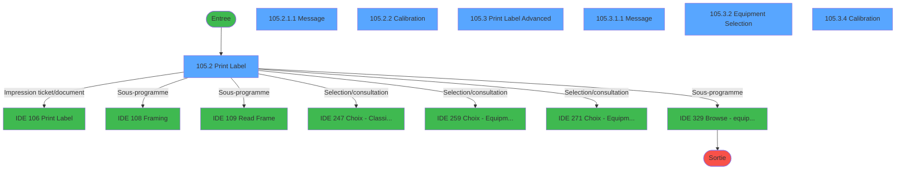
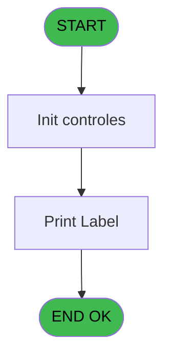
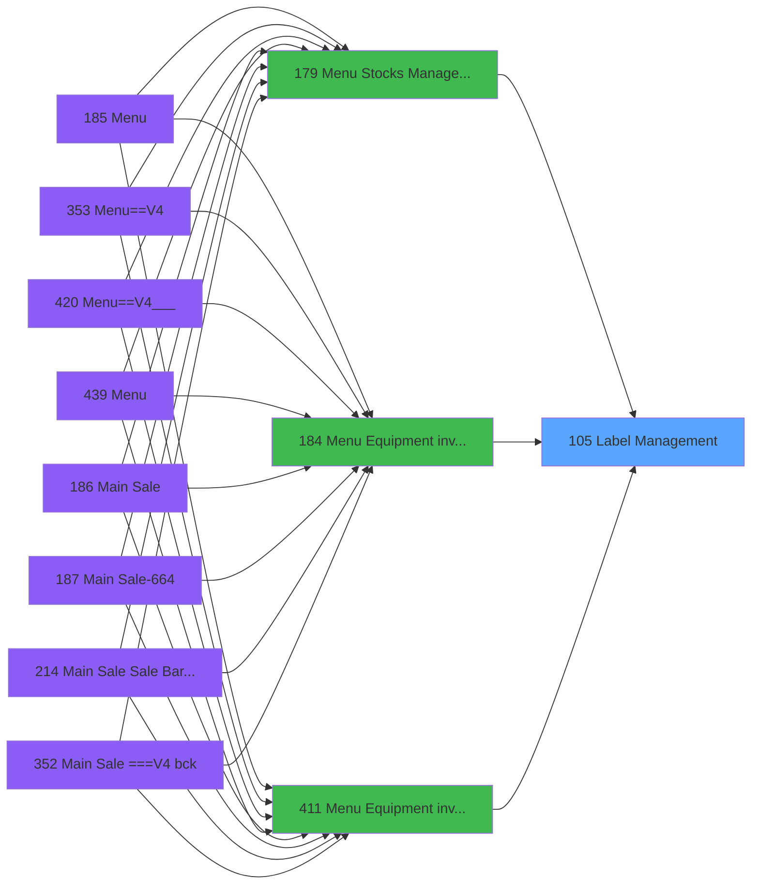
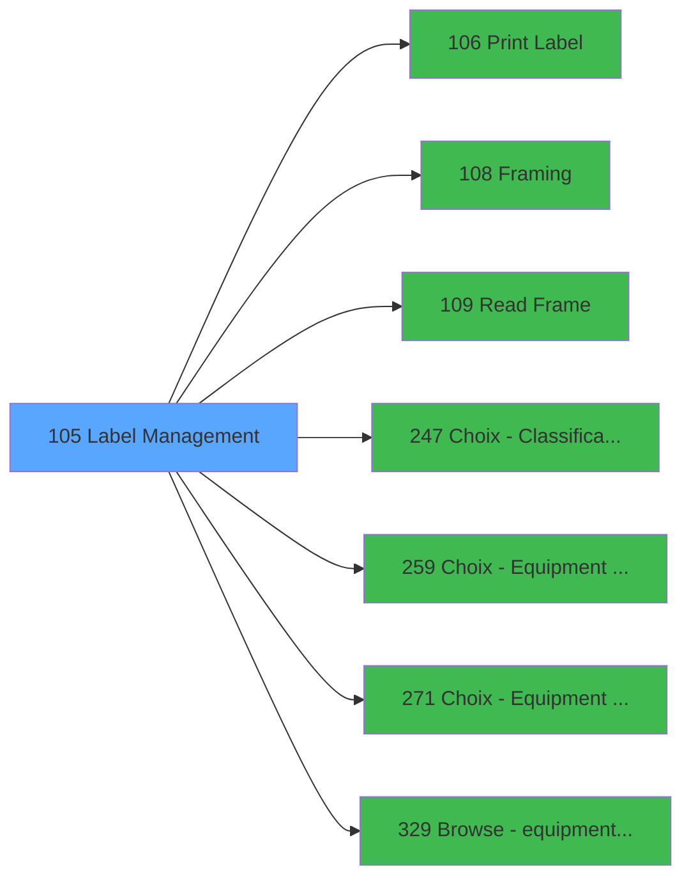

# PVE IDE 105 - Label Management

> **Analyse**: Phases 1-4 2026-02-03 09:24 -> 09:25 (19s) | Assemblage 09:25
> **Pipeline**: V7.2 Enrichi
> **Structure**: 4 onglets (Resume | Ecrans | Donnees | Connexions)

<!-- TAB:Resume -->

## 1. FICHE D'IDENTITE

| Attribut | Valeur |
|----------|--------|
| Projet | PVE |
| IDE Position | 105 |
| Nom Programme | Label Management |
| Fichier source | `Prg_105.xml` |
| Domaine metier | General |
| Taches | 16 (7 ecrans visibles) |
| Tables modifiees | 0 |
| Programmes appeles | 7 |

## 2. DESCRIPTION FONCTIONNELLE

**Label Management** assure la gestion complete de ce processus, accessible depuis [Menu Equipment inventory (IDE 184)](PVE-IDE-184.md), [Menu Equipment inventory (IDE 411)](PVE-IDE-411.md), [Menu Stocks Management (IDE 179)](PVE-IDE-179.md).

Le flux de traitement s'organise en **4 blocs fonctionnels** :

- **Traitement** (10 taches) : traitements metier divers
- **Impression** (3 taches) : generation de tickets et documents
- **Consultation** (2 taches) : ecrans de recherche, selection et consultation
- **Initialisation** (1 tache) : reinitialisation d'etats et de variables de travail

Detail : phases du traitement

#### Phase 1 : Traitement (10 taches)

- **105** - Label Management
- **105.1** - Parameters
- **105.1.1** - Village
- **105.2.1.1** - Message **[[ECRAN]](#ecran-t6)**
- **105.2.2** - Calibration **[[ECRAN]](#ecran-t7)**
- **105.2.2.1** - Calibration
- **105.3.1** - Read Equipment TYPE **[[ECRAN]](#ecran-t10)**
- **105.3.1.1** - Message **[[ECRAN]](#ecran-t11)**
- **105.3.4** - Calibration **[[ECRAN]](#ecran-t15)**
- **105.3.4.1** - Calibration

Delegue a : [Framing (IDE 108)](PVE-IDE-108.md), [Read Frame (IDE 109)](PVE-IDE-109.md), [Browse - equipment lenght (IDE 329)](PVE-IDE-329.md)

#### Phase 2 : Impression (3 taches)

- **105.2** - Print Label **[[ECRAN]](#ecran-t4)**
- **105.2.1** - Print **[[ECRAN]](#ecran-t5)**
- **105.3** - Print Label Advanced **[[ECRAN]](#ecran-t9)**

Delegue a : [Print Label (IDE 106)](PVE-IDE-106.md)

#### Phase 3 : Consultation (2 taches)

- **105.3.2** - Equipment Selection **[[ECRAN]](#ecran-t12)**
- **105.3.2.1** - Equipment Selection **[[ECRAN]](#ecran-t13)**

Delegue a : [Choix - Classification (IDE 247)](PVE-IDE-247.md), [Choix - Equipment models (IDE 259)](PVE-IDE-259.md), [Choix - Equipment type (IDE 271)](PVE-IDE-271.md)

#### Phase 4 : Initialisation (1 tache)

- **105.3.3** - Init

## 3. BLOCS FONCTIONNELS

### 3.1 Traitement (10 taches)

Traitements internes.

---

#### 105 - Label Management

**Role** : Tache d'orchestration : point d'entree du programme (10 sous-taches). Coordonne l'enchainement des traitements.

9 sous-taches directes

| Tache | Nom | Bloc |
|-------|-----|------|
| [105.1](#t2) | Parameters | Traitement |
| [105.1.1](#t3) | Village | Traitement |
| [105.2.1.1](#t6) | Message **[[ECRAN]](#ecran-t6)** | Traitement |
| [105.2.2](#t7) | Calibration **[[ECRAN]](#ecran-t7)** | Traitement |
| [105.2.2.1](#t8) | Calibration | Traitement |
| [105.3.1](#t10) | Read Equipment TYPE **[[ECRAN]](#ecran-t10)** | Traitement |
| [105.3.1.1](#t11) | Message **[[ECRAN]](#ecran-t11)** | Traitement |
| [105.3.4](#t15) | Calibration **[[ECRAN]](#ecran-t15)** | Traitement |
| [105.3.4.1](#t16) | Calibration | Traitement |

**Variables liees** : J (PrintedLabel)
**Delegue a** : [Framing (IDE 108)](PVE-IDE-108.md), [Read Frame (IDE 109)](PVE-IDE-109.md), [Browse - equipment lenght (IDE 329)](PVE-IDE-329.md)

---

#### 105.1 - Parameters

**Role** : Traitement : Parameters.
**Delegue a** : [Framing (IDE 108)](PVE-IDE-108.md), [Read Frame (IDE 109)](PVE-IDE-109.md), [Browse - equipment lenght (IDE 329)](PVE-IDE-329.md)

---

#### 105.1.1 - Village

**Role** : Traitement : Village.
**Variables liees** : E (Village)
**Delegue a** : [Framing (IDE 108)](PVE-IDE-108.md), [Read Frame (IDE 109)](PVE-IDE-109.md), [Browse - equipment lenght (IDE 329)](PVE-IDE-329.md)

---

#### 105.2.1.1 - Message [[ECRAN]](#ecran-t6)

**Role** : Traitement : Message.
**Ecran** : 456 x 12 DLU (Modal) | [Voir mockup](#ecran-t6)
**Variables liees** : I (Message)
**Delegue a** : [Framing (IDE 108)](PVE-IDE-108.md), [Read Frame (IDE 109)](PVE-IDE-109.md), [Browse - equipment lenght (IDE 329)](PVE-IDE-329.md)

---

#### 105.2.2 - Calibration [[ECRAN]](#ecran-t7)

**Role** : Traitement : Calibration.
**Ecran** : 640 x 0 DLU (MDI) | [Voir mockup](#ecran-t7)
**Delegue a** : [Framing (IDE 108)](PVE-IDE-108.md), [Read Frame (IDE 109)](PVE-IDE-109.md), [Browse - equipment lenght (IDE 329)](PVE-IDE-329.md)

---

#### 105.2.2.1 - Calibration

**Role** : Traitement : Calibration.
**Delegue a** : [Framing (IDE 108)](PVE-IDE-108.md), [Read Frame (IDE 109)](PVE-IDE-109.md), [Browse - equipment lenght (IDE 329)](PVE-IDE-329.md)

---

#### 105.3.1 - Read Equipment TYPE [[ECRAN]](#ecran-t10)

**Role** : Traitement : Read Equipment TYPE.
**Ecran** : 310 x 12 DLU (Modal) | [Voir mockup](#ecran-t10)
**Variables liees** : B (Param Equipment Id)
**Delegue a** : [Framing (IDE 108)](PVE-IDE-108.md), [Read Frame (IDE 109)](PVE-IDE-109.md), [Browse - equipment lenght (IDE 329)](PVE-IDE-329.md)

---

#### 105.3.1.1 - Message [[ECRAN]](#ecran-t11)

**Role** : Traitement : Message.
**Ecran** : 480 x 12 DLU (Modal) | [Voir mockup](#ecran-t11)
**Variables liees** : I (Message)
**Delegue a** : [Framing (IDE 108)](PVE-IDE-108.md), [Read Frame (IDE 109)](PVE-IDE-109.md), [Browse - equipment lenght (IDE 329)](PVE-IDE-329.md)

---

#### 105.3.4 - Calibration [[ECRAN]](#ecran-t15)

**Role** : Traitement : Calibration.
**Ecran** : 640 x 0 DLU (MDI) | [Voir mockup](#ecran-t15)
**Delegue a** : [Framing (IDE 108)](PVE-IDE-108.md), [Read Frame (IDE 109)](PVE-IDE-109.md), [Browse - equipment lenght (IDE 329)](PVE-IDE-329.md)

---

#### 105.3.4.1 - Calibration

**Role** : Traitement : Calibration.
**Delegue a** : [Framing (IDE 108)](PVE-IDE-108.md), [Read Frame (IDE 109)](PVE-IDE-109.md), [Browse - equipment lenght (IDE 329)](PVE-IDE-329.md)

### 3.2 Impression (3 taches)

Generation des documents et tickets.

---

#### 105.2 - Print Label [[ECRAN]](#ecran-t4)

**Role** : Generation du document : Print Label.
**Ecran** : 314 x 235 DLU (MDI) | [Voir mockup](#ecran-t4)
**Variables liees** : J (PrintedLabel)
**Delegue a** : [Print Label (IDE 106)](PVE-IDE-106.md)

---

#### 105.2.1 - Print [[ECRAN]](#ecran-t5)

**Role** : Generation du document : Print.
**Ecran** : 470 x 22 DLU (Modal) | [Voir mockup](#ecran-t5)
**Variables liees** : J (PrintedLabel)
**Delegue a** : [Print Label (IDE 106)](PVE-IDE-106.md)

---

#### 105.3 - Print Label Advanced [[ECRAN]](#ecran-t9)

**Role** : Generation du document : Print Label Advanced.
**Ecran** : 313 x 277 DLU (MDI) | [Voir mockup](#ecran-t9)
**Variables liees** : J (PrintedLabel)
**Delegue a** : [Print Label (IDE 106)](PVE-IDE-106.md)

### 3.3 Consultation (2 taches)

Ecrans de recherche et consultation.

---

#### 105.3.2 - Equipment Selection [[ECRAN]](#ecran-t12)

**Role** : Selection par l'operateur : Equipment Selection.
**Ecran** : 322 x 222 DLU (MDI) | [Voir mockup](#ecran-t12)
**Variables liees** : B (Param Equipment Id), F (selection mini), G (selection maxi)
**Delegue a** : [Choix - Classification (IDE 247)](PVE-IDE-247.md), [Choix - Equipment models (IDE 259)](PVE-IDE-259.md), [Choix - Equipment type (IDE 271)](PVE-IDE-271.md)

---

#### 105.3.2.1 - Equipment Selection [[ECRAN]](#ecran-t13)

**Role** : Selection par l'operateur : Equipment Selection.
**Ecran** : 124 x 39 DLU (MDI) | [Voir mockup](#ecran-t13)
**Variables liees** : B (Param Equipment Id), F (selection mini), G (selection maxi)
**Delegue a** : [Choix - Classification (IDE 247)](PVE-IDE-247.md), [Choix - Equipment models (IDE 259)](PVE-IDE-259.md), [Choix - Equipment type (IDE 271)](PVE-IDE-271.md)

### 3.4 Initialisation (1 tache)

Reinitialisation d'etats et variables de travail.

---

#### 105.3.3 - Init

**Role** : Reinitialisation : Init.

## 5. REGLES METIER

*(Aucune regle metier identifiee)*

## 6. CONTEXTE

- **Appele par**: [Menu Equipment inventory (IDE 184)](PVE-IDE-184.md), [Menu Equipment inventory (IDE 411)](PVE-IDE-411.md), [Menu Stocks Management (IDE 179)](PVE-IDE-179.md)
- **Appelle**: 7 programmes | **Tables**: 5 (W:0 R:3 L:2) | **Taches**: 16 | **Expressions**: 3

<!-- TAB:Ecrans -->

## 8. ECRANS

### 8.1 Forms visibles (7 / 16)

| # | Position | Tache | Nom | Type | Largeur | Hauteur | Bloc |
|---|----------|-------|-----|------|---------|---------|------|
| 1 | 105.2 | 105.2 | Print Label | MDI | 314 | 235 | Impression |
| 2 | 105.2.1.1 | 105.2.1.1 | Message | Modal | 456 | 12 | Traitement |
| 3 | 105.2.2 | 105.2.2 | Calibration | MDI | 640 | 0 | Traitement |
| 4 | 105.3 | 105.3 | Print Label Advanced | MDI | 313 | 277 | Impression |
| 5 | 105.3.1.1 | 105.3.1.1 | Message | Modal | 480 | 12 | Traitement |
| 6 | 105.3.2 | 105.3.2 | Equipment Selection | MDI | 322 | 222 | Consultation |
| 7 | 105.3.4 | 105.3.4 | Calibration | MDI | 640 | 0 | Traitement |

### 8.2 Mockups Ecrans

---

#### 105.2 - Print Label
**Tache** : [105.2](#t4) | **Type** : MDI | **Dimensions** : 314 x 235 DLU
**Bloc** : Impression | **Titre IDE** : Print Label

<!-- FORM-DATA:
{
    "width":  314,
    "vFactor":  8,
    "type":  "MDI",
    "hFactor":  4,
    "controls":  [
                     {
                         "x":  0,
                         "type":  "label",
                         "var":  "",
                         "y":  0,
                         "w":  312,
                         "fmt":  "",
                         "name":  "",
                         "h":  42,
                         "color":  "182",
                         "text":  "",
                         "parent":  null
                     },
                     {
                         "x":  13,
                         "type":  "label",
                         "var":  "",
                         "y":  15,
                         "w":  246,
                         "fmt":  "",
                         "name":  "",
                         "h":  10,
                         "color":  "186",
                         "text":  "Select the number of labels to print for this equipment",
                         "parent":  1
                     },
                     {
                         "x":  35,
                         "type":  "label",
                         "var":  "",
                         "y":  53,
                         "w":  240,
                         "fmt":  "",
                         "name":  "",
                         "h":  135,
                         "color":  "183",
                         "text":  "",
                         "parent":  null
                     },
                     {
                         "x":  84,
                         "type":  "label",
                         "var":  "",
                         "y":  116,
                         "w":  72,
                         "fmt":  "",
                         "name":  "",
                         "h":  16,
                         "color":  "183",
                         "text":  "Number of copies",
                         "parent":  4
                     },
                     {
                         "x":  0,
                         "type":  "label",
                         "var":  "",
                         "y":  199,
                         "w":  312,
                         "fmt":  "",
                         "name":  "",
                         "h":  34,
                         "color":  "6",
                         "text":  "",
                         "parent":  null
                     },
                     {
                         "x":  162,
                         "type":  "edit",
                         "var":  "",
                         "y":  116,
                         "w":  28,
                         "fmt":  "",
                         "name":  "",
                         "h":  16,
                         "color":  "183",
                         "text":  "",
                         "parent":  4
                     },
                     {
                         "x":  40,
                         "type":  "image",
                         "var":  "",
                         "y":  60,
                         "w":  56,
                         "fmt":  "",
                         "name":  "",
                         "h":  42,
                         "color":  "29",
                         "text":  "",
                         "parent":  4
                     },
                     {
                         "x":  38,
                         "type":  "button",
                         "var":  "",
                         "y":  159,
                         "w":  68,
                         "fmt":  "\u0026Calibration",
                         "name":  "",
                         "h":  28,
                         "color":  "",
                         "text":  "",
                         "parent":  null
                     },
                     {
                         "x":  205,
                         "type":  "button",
                         "var":  "",
                         "y":  159,
                         "w":  68,
                         "fmt":  "\u0026Framing",
                         "name":  "",
                         "h":  28,
                         "color":  "",
                         "text":  "",
                         "parent":  null
                     },
                     {
                         "x":  174,
                         "type":  "button",
                         "var":  "",
                         "y":  204,
                         "w":  68,
                         "fmt":  "\u0026Print",
                         "name":  "",
                         "h":  28,
                         "color":  "",
                         "text":  "",
                         "parent":  null
                     },
                     {
                         "x":  242,
                         "type":  "button",
                         "var":  "",
                         "y":  204,
                         "w":  68,
                         "fmt":  "\u0026Exit",
                         "name":  "",
                         "h":  28,
                         "color":  "",
                         "text":  "",
                         "parent":  null
                     },
                     {
                         "x":  262,
                         "type":  "image",
                         "var":  "",
                         "y":  4,
                         "w":  48,
                         "fmt":  "",
                         "name":  "",
                         "h":  37,
                         "color":  "",
                         "text":  "",
                         "parent":  1
                     }
                 ],
    "taskId":  "105.2",
    "height":  235
}
-->

<strong>Champs : 1 champs</strong>

| Pos (x,y) | Nom | Variable | Type |
|-----------|-----|----------|------|
| 162,116 | (sans nom) | - | edit |

<strong>Boutons : 4 boutons</strong>

| Bouton | Pos (x,y) | Action |
|--------|-----------|--------|
| Calibration | 38,159 | Bouton fonctionnel |
| Framing | 205,159 | Appel [Framing (IDE 108)](PVE-IDE-108.md) |
| Print | 174,204 | Appel [Print Label (IDE 106)](PVE-IDE-106.md) |
| Exit | 242,204 | Quitte le programme |

---

#### 105.2.1.1 - Message
**Tache** : [105.2.1.1](#t6) | **Type** : Modal | **Dimensions** : 456 x 12 DLU
**Bloc** : Traitement | **Titre IDE** : Message

<!-- FORM-DATA:
{
    "width":  456,
    "vFactor":  8,
    "type":  "Modal",
    "hFactor":  8,
    "controls":  [
                     {
                         "x":  0,
                         "type":  "edit",
                         "var":  "",
                         "y":  0,
                         "w":  456,
                         "fmt":  "",
                         "name":  "",
                         "h":  12,
                         "color":  "188",
                         "text":  "",
                         "parent":  null
                     }
                 ],
    "taskId":  "105.2.1.1",
    "height":  12
}
-->

<strong>Champs : 1 champs</strong>

| Pos (x,y) | Nom | Variable | Type |
|-----------|-----|----------|------|
| 0,0 | (sans nom) | - | edit |

---

#### 105.2.2 - Calibration
**Tache** : [105.2.2](#t7) | **Type** : MDI | **Dimensions** : 640 x 0 DLU
**Bloc** : Traitement | **Titre IDE** : Calibration

<!-- FORM-DATA:
{
    "width":  640,
    "vFactor":  8,
    "type":  "MDI",
    "hFactor":  8,
    "controls":  [
                     {
                         "x":  82,
                         "type":  "label",
                         "var":  "",
                         "y":  49,
                         "w":  476,
                         "fmt":  "",
                         "name":  "",
                         "h":  65,
                         "color":  "",
                         "text":  "",
                         "parent":  null
                     },
                     {
                         "x":  205,
                         "type":  "label",
                         "var":  "",
                         "y":  68,
                         "w":  231,
                         "fmt":  "",
                         "name":  "",
                         "h":  14,
                         "color":  "",
                         "text":  "Label Calibration",
                         "parent":  1
                     },
                     {
                         "x":  212,
                         "type":  "checkbox",
                         "var":  "",
                         "y":  89,
                         "w":  216,
                         "fmt":  "",
                         "name":  "Confirmation",
                         "h":  14,
                         "color":  "",
                         "text":  " Confirmation",
                         "parent":  null
                     },
                     {
                         "x":  398,
                         "type":  "button",
                         "var":  "",
                         "y":  137,
                         "w":  160,
                         "fmt":  "Calibration",
                         "name":  "Bouton Confirmation",
                         "h":  14,
                         "color":  "",
                         "text":  "",
                         "parent":  null
                     },
                     {
                         "x":  82,
                         "type":  "button",
                         "var":  "",
                         "y":  137,
                         "w":  160,
                         "fmt":  "Exit",
                         "name":  "",
                         "h":  14,
                         "color":  "",
                         "text":  "",
                         "parent":  null
                     }
                 ],
    "taskId":  "105.2.2",
    "height":  0
}
-->

<strong>Champs : 1 champs</strong>

| Pos (x,y) | Nom | Variable | Type |
|-----------|-----|----------|------|
| 212,89 | Confirmation | - | checkbox |

<strong>Boutons : 2 boutons</strong>

| Bouton | Pos (x,y) | Action |
|--------|-----------|--------|
| Calibration | 398,137 | Bouton fonctionnel |
| Exit | 82,137 | Quitte le programme |

---

#### 105.3 - Print Label Advanced
**Tache** : [105.3](#t9) | **Type** : MDI | **Dimensions** : 313 x 277 DLU
**Bloc** : Impression | **Titre IDE** : Print Label Advanced

<!-- FORM-DATA:
{
    "width":  313,
    "vFactor":  8,
    "type":  "MDI",
    "hFactor":  4,
    "controls":  [
                     {
                         "x":  0,
                         "type":  "label",
                         "var":  "",
                         "y":  0,
                         "w":  312,
                         "fmt":  "",
                         "name":  "",
                         "h":  41,
                         "color":  "182",
                         "text":  "",
                         "parent":  null
                     },
                     {
                         "x":  13,
                         "type":  "label",
                         "var":  "",
                         "y":  15,
                         "w":  243,
                         "fmt":  "",
                         "name":  "",
                         "h":  10,
                         "color":  "186",
                         "text":  "Select your options to print labels in series",
                         "parent":  1
                     },
                     {
                         "x":  36,
                         "type":  "label",
                         "var":  "",
                         "y":  48,
                         "w":  240,
                         "fmt":  "",
                         "name":  "",
                         "h":  180,
                         "color":  "183",
                         "text":  "",
                         "parent":  null
                     },
                     {
                         "x":  45,
                         "type":  "label",
                         "var":  "",
                         "y":  100,
                         "w":  67,
                         "fmt":  "",
                         "name":  "",
                         "h":  12,
                         "color":  "183",
                         "text":  "Type",
                         "parent":  4
                     },
                     {
                         "x":  45,
                         "type":  "label",
                         "var":  "",
                         "y":  116,
                         "w":  67,
                         "fmt":  "",
                         "name":  "",
                         "h":  12,
                         "color":  "183",
                         "text":  "Classification",
                         "parent":  4
                     },
                     {
                         "x":  45,
                         "type":  "label",
                         "var":  "",
                         "y":  132,
                         "w":  67,
                         "fmt":  "",
                         "name":  "",
                         "h":  12,
                         "color":  "183",
                         "text":  "Lenght",
                         "parent":  4
                     },
                     {
                         "x":  45,
                         "type":  "label",
                         "var":  "",
                         "y":  148,
                         "w":  67,
                         "fmt":  "",
                         "name":  "",
                         "h":  12,
                         "color":  "183",
                         "text":  "Model",
                         "parent":  4
                     },
                     {
                         "x":  45,
                         "type":  "label",
                         "var":  "",
                         "y":  170,
                         "w":  69,
                         "fmt":  "",
                         "name":  "",
                         "h":  12,
                         "color":  "183",
                         "text":  "Number of copies",
                         "parent":  4
                     },
                     {
                         "x":  0,
                         "type":  "label",
                         "var":  "",
                         "y":  241,
                         "w":  312,
                         "fmt":  "",
                         "name":  "",
                         "h":  35,
                         "color":  "183",
                         "text":  "",
                         "parent":  null
                     },
                     {
                         "x":  117,
                         "type":  "edit",
                         "var":  "",
                         "y":  100,
                         "w":  31,
                         "fmt":  "2P0Z",
                         "name":  "Type",
                         "h":  12,
                         "color":  "110",
                         "text":  "",
                         "parent":  4
                     },
                     {
                         "x":  152,
                         "type":  "edit",
                         "var":  "",
                         "y":  100,
                         "w":  120,
                         "fmt":  "",
                         "name":  "",
                         "h":  12,
                         "color":  "183",
                         "text":  "",
                         "parent":  4
                     },
                     {
                         "x":  117,
                         "type":  "edit",
                         "var":  "",
                         "y":  116,
                         "w":  31,
                         "fmt":  "2P0Z",
                         "name":  "Classification",
                         "h":  12,
                         "color":  "110",
                         "text":  "",
                         "parent":  4
                     },
                     {
                         "x":  152,
                         "type":  "edit",
                         "var":  "",
                         "y":  116,
                         "w":  120,
                         "fmt":  "",
                         "name":  "",
                         "h":  12,
                         "color":  "183",
                         "text":  "",
                         "parent":  4
                     },
                     {
                         "x":  117,
                         "type":  "edit",
                         "var":  "",
                         "y":  132,
                         "w":  31,
                         "fmt":  "3P0Z",
                         "name":  "Lenght",
                         "h":  12,
                         "color":  "110",
                         "text":  "",
                         "parent":  4
                     },
                     {
                         "x":  117,
                         "type":  "edit",
                         "var":  "",
                         "y":  170,
                         "w":  31,
                         "fmt":  "",
                         "name":  "Copy",
                         "h":  12,
                         "color":  "110",
                         "text":  "",
                         "parent":  4
                     },
                     {
                         "x":  262,
                         "type":  "image",
                         "var":  "",
                         "y":  3,
                         "w":  48,
                         "fmt":  "",
                         "name":  "",
                         "h":  37,
                         "color":  "",
                         "text":  "",
                         "parent":  3
                     },
                     {
                         "x":  41,
                         "type":  "image",
                         "var":  "",
                         "y":  55,
                         "w":  56,
                         "fmt":  "",
                         "name":  "",
                         "h":  42,
                         "color":  "29",
                         "text":  "",
                         "parent":  8
                     },
                     {
                         "x":  152,
                         "type":  "edit",
                         "var":  "",
                         "y":  132,
                         "w":  120,
                         "fmt":  "30",
                         "name":  "",
                         "h":  12,
                         "color":  "183",
                         "text":  "",
                         "parent":  4
                     },
                     {
                         "x":  37,
                         "type":  "button",
                         "var":  "",
                         "y":  199,
                         "w":  68,
                         "fmt":  "\u0026Calibration",
                         "name":  "",
                         "h":  28,
                         "color":  "",
                         "text":  "",
                         "parent":  4
                     },
                     {
                         "x":  139,
                         "type":  "button",
                         "var":  "",
                         "y":  199,
                         "w":  68,
                         "fmt":  "\u0026Display",
                         "name":  "",
                         "h":  28,
                         "color":  "",
                         "text":  "",
                         "parent":  4
                     },
                     {
                         "x":  206,
                         "type":  "button",
                         "var":  "",
                         "y":  199,
                         "w":  68,
                         "fmt":  "\u0026Framing",
                         "name":  "",
                         "h":  28,
                         "color":  "",
                         "text":  "",
                         "parent":  4
                     },
                     {
                         "x":  1,
                         "type":  "button",
                         "var":  "",
                         "y":  247,
                         "w":  68,
                         "fmt":  "\u0026Init",
                         "name":  "",
                         "h":  28,
                         "color":  "",
                         "text":  "",
                         "parent":  null
                     },
                     {
                         "x":  174,
                         "type":  "button",
                         "var":  "",
                         "y":  247,
                         "w":  68,
                         "fmt":  "\u0026Print",
                         "name":  "",
                         "h":  28,
                         "color":  "",
                         "text":  "",
                         "parent":  null
                     },
                     {
                         "x":  242,
                         "type":  "button",
                         "var":  "",
                         "y":  247,
                         "w":  68,
                         "fmt":  "\u0026Exit",
                         "name":  "",
                         "h":  28,
                         "color":  "",
                         "text":  "",
                         "parent":  null
                     },
                     {
                         "x":  117,
                         "type":  "edit",
                         "var":  "",
                         "y":  148,
                         "w":  31,
                         "fmt":  "3P0Z",
                         "name":  "Model_0001",
                         "h":  12,
                         "color":  "110",
                         "text":  "",
                         "parent":  4
                     },
                     {
                         "x":  152,
                         "type":  "edit",
                         "var":  "",
                         "y":  148,
                         "w":  120,
                         "fmt":  "30",
                         "name":  "model_name",
                         "h":  12,
                         "color":  "183",
                         "text":  "",
                         "parent":  4
                     }
                 ],
    "taskId":  "105.3",
    "height":  277
}
-->

<strong>Champs : 9 champs</strong>

| Pos (x,y) | Nom | Variable | Type |
|-----------|-----|----------|------|
| 117,100 | Type | - | edit |
| 152,100 | (sans nom) | - | edit |
| 117,116 | Classification | - | edit |
| 152,116 | (sans nom) | - | edit |
| 117,132 | Lenght | - | edit |
| 117,170 | Copy | - | edit |
| 152,132 | 30 | - | edit |
| 117,148 | Model_0001 | - | edit |
| 152,148 | model_name | - | edit |

<strong>Boutons : 6 boutons</strong>

| Bouton | Pos (x,y) | Action |
|--------|-----------|--------|
| Calibration | 37,199 | Bouton fonctionnel |
| Display | 139,199 | Bouton fonctionnel |
| Framing | 206,199 | Appel [Framing (IDE 108)](PVE-IDE-108.md) |
| Init | 1,247 | Bouton fonctionnel |
| Print | 174,247 | Appel [Print Label (IDE 106)](PVE-IDE-106.md) |
| Exit | 242,247 | Quitte le programme |

---

#### 105.3.1.1 - Message
**Tache** : [105.3.1.1](#t11) | **Type** : Modal | **Dimensions** : 480 x 12 DLU
**Bloc** : Traitement | **Titre IDE** : Message

<!-- FORM-DATA:
{
    "width":  480,
    "vFactor":  8,
    "type":  "Modal",
    "hFactor":  8,
    "controls":  [
                     {
                         "x":  0,
                         "type":  "edit",
                         "var":  "",
                         "y":  0,
                         "w":  480,
                         "fmt":  "",
                         "name":  "",
                         "h":  12,
                         "color":  "188",
                         "text":  "",
                         "parent":  null
                     }
                 ],
    "taskId":  "105.3.1.1",
    "height":  12
}
-->

<strong>Champs : 1 champs</strong>

| Pos (x,y) | Nom | Variable | Type |
|-----------|-----|----------|------|
| 0,0 | (sans nom) | - | edit |

---

#### 105.3.2 - Equipment Selection
**Tache** : [105.3.2](#t12) | **Type** : MDI | **Dimensions** : 322 x 222 DLU
**Bloc** : Consultation | **Titre IDE** : Equipment Selection

<!-- FORM-DATA:
{
    "width":  322,
    "vFactor":  8,
    "type":  "MDI",
    "hFactor":  4,
    "controls":  [
                     {
                         "x":  8,
                         "type":  "label",
                         "var":  "",
                         "y":  9,
                         "w":  303,
                         "fmt":  "",
                         "name":  "",
                         "h":  14,
                         "color":  "183",
                         "text":  "Type   Classification   Identification   Serial",
                         "parent":  null
                     },
                     {
                         "x":  8,
                         "type":  "table",
                         "var":  "",
                         "name":  "",
                         "titleH":  12,
                         "color":  "110",
                         "w":  305,
                         "y":  22,
                         "fmt":  "",
                         "parent":  null,
                         "text":  "",
                         "rowH":  24,
                         "h":  145,
                         "cols":  [
                                      {
                                          "title":  "",
                                          "layer":  1,
                                          "w":  27
                                      },
                                      {
                                          "title":  "",
                                          "layer":  2,
                                          "w":  45
                                      },
                                      {
                                          "title":  "",
                                          "layer":  3,
                                          "w":  53
                                      },
                                      {
                                          "title":  "",
                                          "layer":  4,
                                          "w":  164
                                      }
                                  ],
                         "rows":  4
                     },
                     {
                         "x":  1,
                         "type":  "label",
                         "var":  "",
                         "y":  186,
                         "w":  318,
                         "fmt":  "",
                         "name":  "",
                         "h":  34,
                         "color":  "6",
                         "text":  "",
                         "parent":  null
                     },
                     {
                         "x":  12,
                         "type":  "edit",
                         "var":  "",
                         "y":  25,
                         "w":  20,
                         "fmt":  "",
                         "name":  "",
                         "h":  19,
                         "color":  "6",
                         "text":  "",
                         "parent":  3
                     },
                     {
                         "x":  41,
                         "type":  "edit",
                         "var":  "",
                         "y":  25,
                         "w":  20,
                         "fmt":  "",
                         "name":  "",
                         "h":  19,
                         "color":  "6",
                         "text":  "",
                         "parent":  3
                     },
                     {
                         "x":  135,
                         "type":  "edit",
                         "var":  "",
                         "y":  25,
                         "w":  74,
                         "fmt":  "",
                         "name":  "",
                         "h":  19,
                         "color":  "6",
                         "text":  "",
                         "parent":  3
                     },
                     {
                         "x":  85,
                         "type":  "edit",
                         "var":  "",
                         "y":  25,
                         "w":  46,
                         "fmt":  "",
                         "name":  "",
                         "h":  19,
                         "color":  "6",
                         "text":  "",
                         "parent":  3
                     },
                     {
                         "x":  250,
                         "type":  "button",
                         "var":  "",
                         "y":  191,
                         "w":  68,
                         "fmt":  "Exit",
                         "name":  "",
                         "h":  28,
                         "color":  "",
                         "text":  "",
                         "parent":  null
                     },
                     {
                         "x":  79,
                         "type":  "edit",
                         "var":  "",
                         "y":  172,
                         "w":  162,
                         "fmt":  "30",
                         "name":  "",
                         "h":  10,
                         "color":  "183",
                         "text":  "",
                         "parent":  null
                     }
                 ],
    "taskId":  "105.3.2",
    "height":  222
}
-->

<strong>Champs : 5 champs</strong>

| Pos (x,y) | Nom | Variable | Type |
|-----------|-----|----------|------|
| 12,25 | (sans nom) | - | edit |
| 41,25 | (sans nom) | - | edit |
| 135,25 | (sans nom) | - | edit |
| 85,25 | (sans nom) | - | edit |
| 79,172 | 30 | - | edit |

<strong>Boutons : 1 boutons</strong>

| Bouton | Pos (x,y) | Action |
|--------|-----------|--------|
| Exit | 250,191 | Quitte le programme |

---

#### 105.3.4 - Calibration
**Tache** : [105.3.4](#t15) | **Type** : MDI | **Dimensions** : 640 x 0 DLU
**Bloc** : Traitement | **Titre IDE** : Calibration

<!-- FORM-DATA:
{
    "width":  640,
    "vFactor":  8,
    "type":  "MDI",
    "hFactor":  8,
    "controls":  [
                     {
                         "x":  82,
                         "type":  "label",
                         "var":  "",
                         "y":  49,
                         "w":  476,
                         "fmt":  "",
                         "name":  "",
                         "h":  65,
                         "color":  "",
                         "text":  "",
                         "parent":  null
                     },
                     {
                         "x":  205,
                         "type":  "label",
                         "var":  "",
                         "y":  68,
                         "w":  231,
                         "fmt":  "",
                         "name":  "",
                         "h":  14,
                         "color":  "",
                         "text":  "Label Calibration",
                         "parent":  1
                     },
                     {
                         "x":  212,
                         "type":  "checkbox",
                         "var":  "",
                         "y":  89,
                         "w":  216,
                         "fmt":  "",
                         "name":  "Confirmation",
                         "h":  14,
                         "color":  "",
                         "text":  " Confirmation",
                         "parent":  null
                     },
                     {
                         "x":  398,
                         "type":  "button",
                         "var":  "",
                         "y":  137,
                         "w":  160,
                         "fmt":  "Calibration",
                         "name":  "Bouton Confirmation",
                         "h":  14,
                         "color":  "",
                         "text":  "",
                         "parent":  null
                     },
                     {
                         "x":  82,
                         "type":  "button",
                         "var":  "",
                         "y":  137,
                         "w":  160,
                         "fmt":  "Exit",
                         "name":  "",
                         "h":  14,
                         "color":  "",
                         "text":  "",
                         "parent":  null
                     }
                 ],
    "taskId":  "105.3.4",
    "height":  0
}
-->

<strong>Champs : 1 champs</strong>

| Pos (x,y) | Nom | Variable | Type |
|-----------|-----|----------|------|
| 212,89 | Confirmation | - | checkbox |

<strong>Boutons : 2 boutons</strong>

| Bouton | Pos (x,y) | Action |
|--------|-----------|--------|
| Calibration | 398,137 | Bouton fonctionnel |
| Exit | 82,137 | Quitte le programme |

## 9. NAVIGATION

### 9.1 Enchainement des ecrans

**Detail par enchainement :**

| Depuis | Action | Vers | Retour |
|--------|--------|------|--------|
| Print Label | Impression ticket/document | [Print Label (IDE 106)](PVE-IDE-106.md) | Retour ecran |
| Print Label | Sous-programme | [Framing (IDE 108)](PVE-IDE-108.md) | Retour ecran |
| Print Label | Sous-programme | [Read Frame (IDE 109)](PVE-IDE-109.md) | Retour ecran |
| Print Label | Selection/consultation | [Choix - Classification (IDE 247)](PVE-IDE-247.md) | Retour ecran |
| Print Label | Selection/consultation | [Choix - Equipment models (IDE 259)](PVE-IDE-259.md) | Retour ecran |
| Print Label | Selection/consultation | [Choix - Equipment type (IDE 271)](PVE-IDE-271.md) | Retour ecran |
| Print Label | Sous-programme | [Browse - equipment lenght (IDE 329)](PVE-IDE-329.md) | Retour ecran |

### 9.3 Structure hierarchique (16 taches)

| Position | Tache | Type | Dimensions | Bloc |
|----------|-------|------|------------|------|
| **105.1** | [**Label Management** (105)](#t1) | MDI | - | Traitement |
| 105.1.1 | [Parameters (105.1)](#t2) | MDI | - | |
| 105.1.2 | [Village (105.1.1)](#t3) | MDI | - | |
| 105.1.3 | [Message (105.2.1.1)](#t6) [mockup](#ecran-t6) | Modal | 456x12 | |
| 105.1.4 | [Calibration (105.2.2)](#t7) [mockup](#ecran-t7) | MDI | 640x0 | |
| 105.1.5 | [Calibration (105.2.2.1)](#t8) | MDI | - | |
| 105.1.6 | [Read Equipment TYPE (105.3.1)](#t10) [mockup](#ecran-t10) | Modal | 310x12 | |
| 105.1.7 | [Message (105.3.1.1)](#t11) [mockup](#ecran-t11) | Modal | 480x12 | |
| 105.1.8 | [Calibration (105.3.4)](#t15) [mockup](#ecran-t15) | MDI | 640x0 | |
| 105.1.9 | [Calibration (105.3.4.1)](#t16) | MDI | - | |
| **105.2** | [**Print Label** (105.2)](#t4) [mockup](#ecran-t4) | MDI | 314x235 | Impression |
| 105.2.1 | [Print (105.2.1)](#t5) [mockup](#ecran-t5) | Modal | 470x22 | |
| 105.2.2 | [Print Label Advanced (105.3)](#t9) [mockup](#ecran-t9) | MDI | 313x277 | |
| **105.3** | [**Equipment Selection** (105.3.2)](#t12) [mockup](#ecran-t12) | MDI | 322x222 | Consultation |
| 105.3.1 | [Equipment Selection (105.3.2.1)](#t13) [mockup](#ecran-t13) | MDI | 124x39 | |
| **105.4** | [**Init** (105.3.3)](#t14) | MDI | - | Initialisation |

### 9.4 Algorigramme

> **Legende**: Vert = START/END OK | Rouge = END KO | Bleu = Decisions
> *Algorigramme auto-genere. Utiliser `/algorigramme` pour une synthese metier detaillee.*

<!-- TAB:Donnees -->

## 10. TABLES

### Tables utilisees (5)

| ID | Nom | Description | Type | R | W | L | Usages |
|----|-----|-------------|------|---|---|---|--------|
| 27 | donnees_village__dvi |  | DB | R |   |   | 1 |
| 380 | pv_day_modes |  | DB | R |   |   | 1 |
| 388 | pv_hotel_days |  | DB |   |   | L | 1 |
| 389 | pv_equipment_inventory |  | DB | R |   |   | 4 |
| 419 | realise_articles_caution | Articles et stock | DB |   |   | L | 1 |

### Colonnes par table (3 / 3 tables avec colonnes identifiees)

Table 27 - donnees_village__dvi (R) - 1 usages

| Lettre | Variable | Acces | Type |
|--------|----------|-------|------|
| E | Village | R | Alpha |

Table 380 - pv_day_modes (R) - 1 usages

| Lettre | Variable | Acces | Type |
|--------|----------|-------|------|
| A | Type | R | Numeric |
| B | Classification | R | Numeric |
| C | Manufacturer Id | R | Numeric |
| D | Model | R | Numeric |
| E | Lenght | R | Numeric |
| F | selection mini | R | Alpha |
| G | selection maxi | R | Alpha |
| H | Copy | R | Numeric |
| I | Message | R | Alpha |
| J | PrintedLabel | R | Numeric |
| K | p.counter | R | Numeric |

Table 389 - pv_equipment_inventory (R) - 4 usages

| Lettre | Variable | Acces | Type |
|--------|----------|-------|------|
| B | Param Equipment Id | R | Alpha |

## 11. VARIABLES

### 11.1 Parametres entrants (1)

Variables recues du programme appelant ([Menu Equipment inventory (IDE 184)](PVE-IDE-184.md)).

| Lettre | Nom | Type | Usage dans |
|--------|-----|------|-----------|
| K | p.counter | Numeric | - |

### 11.2 Autres (10)

Variables diverses.

| Lettre | Nom | Type | Usage dans |
|--------|-----|------|-----------|
| A | Param ButtonName | Alpha | [105.1](#t2) |
| B | Param Equipment Id | Alpha | - |
| C | X | Numeric | - |
| D | Y | Numeric | - |
| E | Village | Alpha | - |
| F | selection mini | Alpha | - |
| G | selection maxi | Alpha | - |
| H | Copy | Numeric | - |
| I | Message | Alpha | - |
| J | PrintedLabel | Numeric | - |

## 12. EXPRESSIONS

**3 / 3 expressions decodees (100%)**

### 12.1 Repartition par type

| Type | Expressions | Regles |
|------|-------------|--------|
| CONDITION | 3 | 0 |

### 12.2 Expressions cles par type

#### CONDITION (3 expressions)

| Type | IDE | Expression | Regle |
|------|-----|------------|-------|
| CONDITION | 3 | `Param ButtonName [A]=''` | - |
| CONDITION | 2 | `Param ButtonName [A]='ALABEL'` | - |
| CONDITION | 1 | `Param ButtonName [A]='LABEL'` | - |

<!-- TAB:Connexions -->

## 13. GRAPHE D'APPELS

### 13.1 Chaine depuis Main (Callers)

Main -> ... -> [Menu Equipment inventory (IDE 184)](PVE-IDE-184.md) -> **Label Management (IDE 105)**

Main -> ... -> [Menu Equipment inventory (IDE 411)](PVE-IDE-411.md) -> **Label Management (IDE 105)**

Main -> ... -> [Menu Stocks Management (IDE 179)](PVE-IDE-179.md) -> **Label Management (IDE 105)**

### 13.2 Callers

| IDE | Nom Programme | Nb Appels |
|-----|---------------|-----------|
| [184](PVE-IDE-184.md) | Menu Equipment inventory | 2 |
| [411](PVE-IDE-411.md) | Menu Equipment inventory | 2 |
| [179](PVE-IDE-179.md) | Menu Stocks Management | 1 |

### 13.3 Callees (programmes appeles)

### 13.4 Detail Callees avec contexte

| IDE | Nom Programme | Appels | Contexte |
|-----|---------------|--------|----------|
| [106](PVE-IDE-106.md) | Print Label | 2 | Impression ticket/document |
| [108](PVE-IDE-108.md) | Framing | 2 | Sous-programme |
| [109](PVE-IDE-109.md) | Read Frame | 1 | Sous-programme |
| [247](PVE-IDE-247.md) | Choix - Classification | 1 | Selection/consultation |
| [259](PVE-IDE-259.md) | Choix - Equipment models | 1 | Selection/consultation |
| [271](PVE-IDE-271.md) | Choix - Equipment type | 1 | Selection/consultation |
| [329](PVE-IDE-329.md) | Browse - equipment lenght | 1 | Sous-programme |

## 14. RECOMMANDATIONS MIGRATION

### 14.1 Profil du programme

| Metrique | Valeur | Impact migration |
|----------|--------|-----------------|
| Lignes de logique | 202 | Taille moyenne |
| Expressions | 3 | Peu de logique |
| Tables WRITE | 0 | Impact faible |
| Sous-programmes | 7 | Dependances moderees |
| Ecrans visibles | 7 | Interface complexe multi-ecrans |
| Code desactive | 0% (0 / 202) | Code sain |
| Regles metier | 0 | Pas de regle identifiee |

### 14.2 Plan de migration par bloc

#### Traitement (10 taches: 5 ecrans, 5 traitements)

- **Strategie** : Orchestrateur avec 5 ecrans (Razor/React) et 5 traitements backend (services).
- Les ecrans deviennent des composants UI, les traitements invisibles deviennent des services injectables.
- 7 sous-programme(s) a migrer ou a reutiliser depuis les services existants.
- Decomposer les taches en services unitaires testables.

#### Impression (3 taches: 3 ecrans, 0 traitement)

- **Strategie** : Templates HTML -> PDF via wkhtmltopdf ou Puppeteer.
- `PrintService` injectable avec choix imprimante

#### Consultation (2 taches: 2 ecrans, 0 traitement)

- **Strategie** : Composants de recherche/selection en modales.
- 2 ecrans : Equipment Selection, Equipment Selection

#### Initialisation (1 tache: 0 ecran, 1 traitement)

- **Strategie** : Constructeur/methode `InitAsync()` dans l'orchestrateur.

### 14.3 Dependances critiques

| Dependance | Type | Appels | Impact |
|------------|------|--------|--------|
| [Framing (IDE 108)](PVE-IDE-108.md) | Sous-programme | 2x | Haute - Sous-programme |
| [Print Label (IDE 106)](PVE-IDE-106.md) | Sous-programme | 2x | Haute - Impression ticket/document |
| [Choix - Equipment type (IDE 271)](PVE-IDE-271.md) | Sous-programme | 1x | Normale - Selection/consultation |
| [Browse - equipment lenght (IDE 329)](PVE-IDE-329.md) | Sous-programme | 1x | Normale - Sous-programme |
| [Choix - Equipment models (IDE 259)](PVE-IDE-259.md) | Sous-programme | 1x | Normale - Selection/consultation |
| [Read Frame (IDE 109)](PVE-IDE-109.md) | Sous-programme | 1x | Normale - Sous-programme |
| [Choix - Classification (IDE 247)](PVE-IDE-247.md) | Sous-programme | 1x | Normale - Selection/consultation |

---
*Spec DETAILED generee par Pipeline V7.2 - 2026-02-03 09:25*
