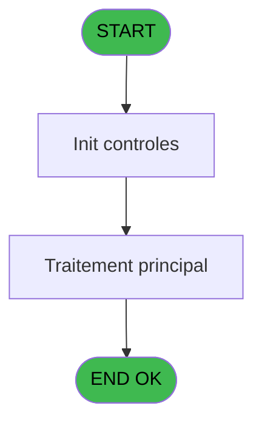
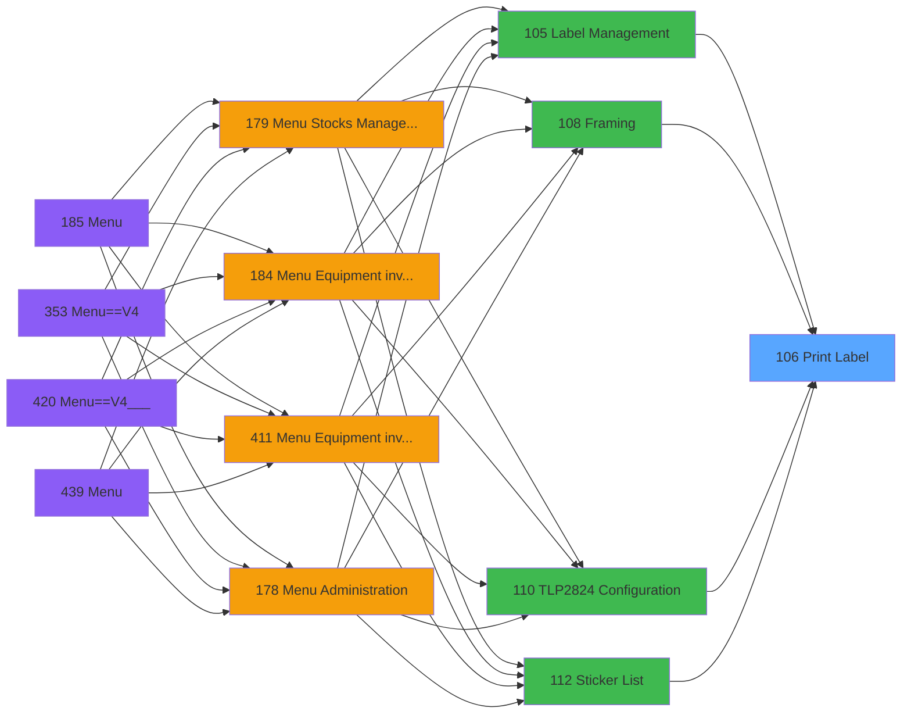

# PVE IDE 106 - Print Label

> **Analyse**: Phases 1-4 2026-02-03 09:25 -> 09:25 (20s) | Assemblage 09:25
> **Pipeline**: V7.2 Enrichi
> **Structure**: 4 onglets (Resume | Ecrans | Donnees | Connexions)

<!-- TAB:Resume -->

## 1. FICHE D'IDENTITE

| Attribut | Valeur |
|----------|--------|
| Projet | PVE |
| IDE Position | 106 |
| Nom Programme | Print Label |
| Fichier source | `Prg_106.xml` |
| Domaine metier | Impression |
| Taches | 1 (1 ecrans visibles) |
| Tables modifiees | 0 |
| Programmes appeles | 0 |

## 2. DESCRIPTION FONCTIONNELLE

**Print Label** assure la gestion complete de ce processus, accessible depuis [TLP2824 Configuration (IDE 110)](PVE-IDE-110.md), [Label Management (IDE 105)](PVE-IDE-105.md), [Framing (IDE 108)](PVE-IDE-108.md), [Sticker List (IDE 112)](PVE-IDE-112.md).

Le flux de traitement s'organise en **1 blocs fonctionnels** :

- **Traitement** (1 tache) : traitements metier divers

## 3. BLOCS FONCTIONNELS

### 3.1 Traitement (1 tache)

Traitements internes.

---

#### 106 - (sans nom) [[ECRAN]](#ecran-t1)

**Role** : Traitement interne.
**Ecran** : 480 x 80 DLU (MDI) | [Voir mockup](#ecran-t1)

## 5. REGLES METIER

*(Aucune regle metier identifiee)*

## 6. CONTEXTE

- **Appele par**: [TLP2824 Configuration (IDE 110)](PVE-IDE-110.md), [Label Management (IDE 105)](PVE-IDE-105.md), [Framing (IDE 108)](PVE-IDE-108.md), [Sticker List (IDE 112)](PVE-IDE-112.md)
- **Appelle**: 0 programmes | **Tables**: 0 (W:0 R:0 L:0) | **Taches**: 1 | **Expressions**: 33

<!-- TAB:Ecrans -->

## 8. ECRANS

### 8.1 Forms visibles (1 / 1)

| # | Position | Tache | Nom | Type | Largeur | Hauteur | Bloc |
|---|----------|-------|-----|------|---------|---------|------|
| 1 | 106 | 106 | (sans nom) | MDI | 480 | 80 | Traitement |

### 8.2 Mockups Ecrans

---

#### 106 - (sans nom)
**Tache** : [106](#t1) | **Type** : MDI | **Dimensions** : 480 x 80 DLU
**Bloc** : Traitement | **Titre IDE** : (sans nom)

<!-- FORM-DATA:
{
    "width":  480,
    "vFactor":  8,
    "type":  "MDI",
    "hFactor":  8,
    "controls":  [
                     {
                         "x":  93,
                         "type":  "label",
                         "var":  "",
                         "y":  18,
                         "w":  296,
                         "fmt":  "",
                         "name":  "",
                         "h":  16,
                         "color":  "187",
                         "text":  "Printing  Label",
                         "parent":  null
                     },
                     {
                         "x":  93,
                         "type":  "label",
                         "var":  "",
                         "y":  50,
                         "w":  296,
                         "fmt":  "",
                         "name":  "",
                         "h":  16,
                         "color":  "187",
                         "text":  "Please wait ...",
                         "parent":  null
                     }
                 ],
    "taskId":  "106",
    "height":  80
}
-->

## 9. NAVIGATION

Ecran unique: ****

### 9.3 Structure hierarchique (1 tache)

| Position | Tache | Type | Dimensions | Bloc |
|----------|-------|------|------------|------|
| **106.1** | [**(sans nom)** (106)](#t1) [mockup](#ecran-t1) | MDI | 480x80 | Traitement |

### 9.4 Algorigramme

> **Legende**: Vert = START/END OK | Rouge = END KO | Bleu = Decisions
> *Algorigramme auto-genere. Utiliser `/algorigramme` pour une synthese metier detaillee.*

<!-- TAB:Donnees -->

## 10. TABLES

### Tables utilisees (0)

| ID | Nom | Description | Type | R | W | L | Usages |
|----|-----|-------------|------|---|---|---|--------|

### Colonnes par table (0 / 0 tables avec colonnes identifiees)

## 11. VARIABLES

### 11.1 Autres (14)

Variables diverses.

| Lettre | Nom | Type | Usage dans |
|--------|-----|------|-----------|
| A | Param ParamActive | Logical | 1x refs |
| B | Param NomSki | Alpha | 1x refs |
| C | Param TailleSki | Numeric | 1x refs |
| D | Param CAB | Alpha | 3x refs |
| E | Param ClubMed | Alpha | 1x refs |
| F | Param Village | Alpha | 1x refs |
| G | Param Copy | Numeric | 2x refs |
| H | Param X | Numeric | 8x refs |
| I | Param Y | Numeric | 8x refs |
| J | Param Speed | Numeric | 2x refs |
| K | Param Density | Numeric | 2x refs |
| L | Buf | Alpha | 11x refs |
| M | CR | Alpha | 12x refs |
| N | LF | Alpha | 12x refs |

## 12. EXPRESSIONS

**33 / 33 expressions decodees (100%)**

### 12.1 Repartition par type

| Type | Expressions | Regles |
|------|-------------|--------|
| CONCATENATION | 11 | 0 |
| CONSTANTE | 11 | 0 |
| NEGATION | 1 | 0 |
| OTHER | 4 | 0 |
| CONDITION | 6 | 0 |

### 12.2 Expressions cles par type

#### CONCATENATION (11 expressions)

| Type | IDE | Expression | Regle |
|------|-----|------------|-------|
| CONCATENATION | 6 | `RTrim (Buf [L])&'N'&CR [M]&LF [N]` | - |
| CONCATENATION | 15 | `RTrim (Buf [L])&'GG'&Str (110+Param X [H],'3P0')&','&Str (105+Param Y [I],'3P0')&',"CLUBMED"'&CR [M]&LF [N]` | - |
| CONCATENATION | 7 | `RTrim (Buf [L])&'S'&Str (Param Speed [J],'1')&CR [M]&LF [N]` | - |
| CONCATENATION | 16 | `RTrim (Buf [L])&'P'&Trim (Str (Param Copy [G],'4'))&CR [M]&LF [N]` | - |
| CONCATENATION | 8 | `RTrim (Buf [L])&'D'&Trim (Str (Param Density [K],'2'))&CR [M]&LF [N]` | - |
| ... | | *+6 autres* | |

#### CONSTANTE (11 expressions)

| Type | IDE | Expression | Regle |
|------|-----|------------|-------|
| CONSTANTE | 24 | `0` | - |
| CONSTANTE | 23 | `1` | - |
| CONSTANTE | 25 | `0` | - |
| CONSTANTE | 27 | `15` | - |
| CONSTANTE | 26 | `4` | - |
| ... | | *+6 autres* | |

#### NEGATION (1 expressions)

| Type | IDE | Expression | Regle |
|------|-----|------------|-------|
| NEGATION | 1 | `NOT (Param ParamActive [A])` | - |

#### OTHER (4 expressions)

| Type | IDE | Expression | Regle |
|------|-----|------------|-------|
| OTHER | 5 | `CR [M]&LF [N]` | - |
| OTHER | 17 | `Delay (5)` | - |
| OTHER | 2 | `ASCIIChr (13)` | - |
| OTHER | 3 | `ASCIIChr (10)` | - |

#### CONDITION (6 expressions)

| Type | IDE | Expression | Regle |
|------|-----|------------|-------|
| CONDITION | 31 | `Param Speed [J]=0` | - |
| CONDITION | 32 | `Param Density [K]=0` | - |
| CONDITION | 33 | `Param CAB [D]<>''` | - |
| CONDITION | 28 | `Param Copy [G]=0` | - |
| CONDITION | 29 | `Param X [H]=0` | - |
| ... | | *+1 autres* | |

### 12.3 Toutes les expressions (33)

Voir les 33 expressions

#### CONCATENATION (11)

| IDE | Expression Decodee |
|-----|-------------------|
| 9 | `RTrim (Buf [L])&'A'&Str (110+Param X [H],'3P0')&','&Str (0+Param Y [I],'3P0')&',0,3,2,3,N,"'&Trim (Param NomSki [B])&'"'&CR [M]&LF [N]` |
| 10 | `RTrim (Buf [L])&'A'&Str (285+Param X [H],'3P0')&','&Str (102+Param Y [I],'3P0')&',0,4,1,1,N,"'&Trim (Str (Param TailleSki [C],'3Z'))&'"'&CR [M]&LF [N]` |
| 11 | `RTrim (Buf [L])&'B'&Str (115+Param X [H],'3P0')&','&Str (50+Param Y [I],'3P0')&',0,9,2,5,50,N,"'&Param CAB [D]&'"'&CR [M]&LF [N]` |
| 12 | `RTrim (Buf [L])&'A'&Str (160+Param X [H],'3P0')&','&Str (105+Param Y [I],'3P0')&',0,1,1,1,N,"'&Trim (Param CAB [D])&'"'&CR [M]&LF [N]` |
| 13 | `RTrim (Buf [L])&'A'&Str (160+Param X [H],'3P0')&','&Str (135+Param Y [I],'3P0')&',0,1,1,1,N,"'&Param ClubMed [E]&'"'&CR [M]&LF [N]` |
| 14 | `RTrim (Buf [L])&'A'&Str (270+Param X [H],'3P0')&','&Str (125+Param Y [I],'3P0')&',0,4,1,1,N,"'&Right ('    '&Trim (Param Village [F]),4)&'"'&CR [M]&LF [N]` |
| 15 | `RTrim (Buf [L])&'GG'&Str (110+Param X [H],'3P0')&','&Str (105+Param Y [I],'3P0')&',"CLUBMED"'&CR [M]&LF [N]` |
| 6 | `RTrim (Buf [L])&'N'&CR [M]&LF [N]` |
| 7 | `RTrim (Buf [L])&'S'&Str (Param Speed [J],'1')&CR [M]&LF [N]` |
| 8 | `RTrim (Buf [L])&'D'&Trim (Str (Param Density [K],'2'))&CR [M]&LF [N]` |
| 16 | `RTrim (Buf [L])&'P'&Trim (Str (Param Copy [G],'4'))&CR [M]&LF [N]` |

#### CONSTANTE (11)

| IDE | Expression Decodee |
|-----|-------------------|
| 4 | `''` |
| 18 | `'SKINAME'` |
| 19 | `180` |
| 20 | `'SKINAME'` |
| 21 | `'CLUB MED'` |
| 22 | `'TEST'` |
| 23 | `1` |
| 24 | `0` |
| 25 | `0` |
| 26 | `4` |
| 27 | `15` |

#### NEGATION (1)

| IDE | Expression Decodee |
|-----|-------------------|
| 1 | `NOT (Param ParamActive [A])` |

#### OTHER (4)

| IDE | Expression Decodee |
|-----|-------------------|
| 2 | `ASCIIChr (13)` |
| 3 | `ASCIIChr (10)` |
| 5 | `CR [M]&LF [N]` |
| 17 | `Delay (5)` |

#### CONDITION (6)

| IDE | Expression Decodee |
|-----|-------------------|
| 28 | `Param Copy [G]=0` |
| 29 | `Param X [H]=0` |
| 30 | `Param Y [I]=0` |
| 31 | `Param Speed [J]=0` |
| 32 | `Param Density [K]=0` |
| 33 | `Param CAB [D]<>''` |

<!-- TAB:Connexions -->

## 13. GRAPHE D'APPELS

### 13.1 Chaine depuis Main (Callers)

Main -> ... -> [TLP2824 Configuration (IDE 110)](PVE-IDE-110.md) -> **Print Label (IDE 106)**

Main -> ... -> [Label Management (IDE 105)](PVE-IDE-105.md) -> **Print Label (IDE 106)**

Main -> ... -> [Framing (IDE 108)](PVE-IDE-108.md) -> **Print Label (IDE 106)**

Main -> ... -> [Sticker List (IDE 112)](PVE-IDE-112.md) -> **Print Label (IDE 106)**

### 13.2 Callers

| IDE | Nom Programme | Nb Appels |
|-----|---------------|-----------|
| [110](PVE-IDE-110.md) | TLP2824 Configuration | 4 |
| [105](PVE-IDE-105.md) | Label Management | 2 |
| [108](PVE-IDE-108.md) | Framing | 1 |
| [112](PVE-IDE-112.md) | Sticker List | 1 |

### 13.3 Callees (programmes appeles)

### 13.4 Detail Callees avec contexte

| IDE | Nom Programme | Appels | Contexte |
|-----|---------------|--------|----------|
| - | (aucun) | - | - |

## 14. RECOMMANDATIONS MIGRATION

### 14.1 Profil du programme

| Metrique | Valeur | Impact migration |
|----------|--------|-----------------|
| Lignes de logique | 54 | Programme compact |
| Expressions | 33 | Peu de logique |
| Tables WRITE | 0 | Impact faible |
| Sous-programmes | 0 | Peu de dependances |
| Ecrans visibles | 1 | Ecran unique ou traitement batch |
| Code desactive | 0% (0 / 54) | Code sain |
| Regles metier | 0 | Pas de regle identifiee |

### 14.2 Plan de migration par bloc

#### Traitement (1 tache: 1 ecran, 0 traitement)

- **Strategie** : 1 composant(s) UI (Razor/React) avec formulaires et validation.
- Decomposer les taches en services unitaires testables.

### 14.3 Dependances critiques

| Dependance | Type | Appels | Impact |
|------------|------|--------|--------|

---
*Spec DETAILED generee par Pipeline V7.2 - 2026-02-03 09:25*
