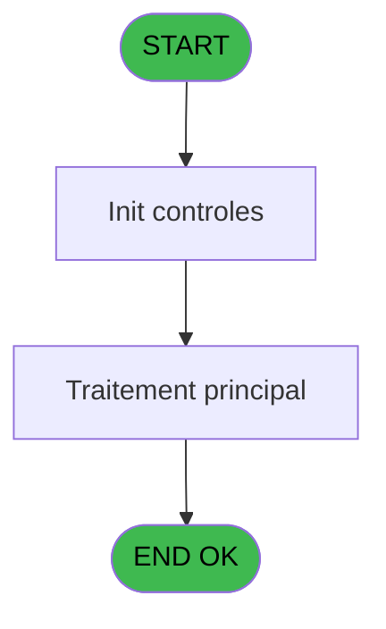
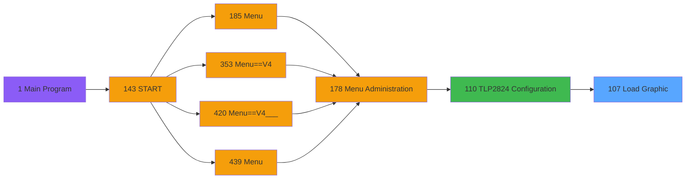

# PVE IDE 107 - Load Graphic

> **Analyse**: Phases 1-4 2026-02-03 09:25 -> 09:26 (20s) | Assemblage 09:26
> **Pipeline**: V7.2 Enrichi
> **Structure**: 4 onglets (Resume | Ecrans | Donnees | Connexions)

<!-- TAB:Resume -->

## 1. FICHE D'IDENTITE

| Attribut | Valeur |
|----------|--------|
| Projet | PVE |
| IDE Position | 107 |
| Nom Programme | Load Graphic |
| Fichier source | `Prg_107.xml` |
| Domaine metier | General |
| Taches | 10 (1 ecrans visibles) |
| Tables modifiees | 0 |
| Programmes appeles | 0 |

## 2. DESCRIPTION FONCTIONNELLE

**Load Graphic** assure la gestion complete de ce processus, accessible depuis [TLP2824 Configuration (IDE 110)](PVE-IDE-110.md).

Le flux de traitement s'organise en **1 blocs fonctionnels** :

- **Traitement** (10 taches) : traitements metier divers

Detail : phases du traitement

#### Phase 1 : Traitement (10 taches)

- **107** - Load Graphic **[[ECRAN]](#ecran-t1)**
- **107.1** - (sans nom) **[[ECRAN]](#ecran-t2)**
- **107.1.1** - Search for computername
- **107.2** - (sans nom) **[[ECRAN]](#ecran-t4)**
- **107.3** - (sans nom) **[[ECRAN]](#ecran-t5)**
- **107.4** - (sans nom) **[[ECRAN]](#ecran-t6)**
- **107.5** - (sans nom) **[[ECRAN]](#ecran-t7)**
- **107.6** - (sans nom) **[[ECRAN]](#ecran-t8)**
- **107.7** - CONTROL
- **107.7.1** - Search for computername

## 3. BLOCS FONCTIONNELS

### 3.1 Traitement (10 taches)

Traitements internes.

---

#### 107 - Load Graphic [[ECRAN]](#ecran-t1)

**Role** : Tache d'orchestration : point d'entree du programme (10 sous-taches). Coordonne l'enchainement des traitements.
**Ecran** : 480 x 80 DLU (MDI) | [Voir mockup](#ecran-t1)

9 sous-taches directes

| Tache | Nom | Bloc |
|-------|-----|------|
| [107.1](#t2) | (sans nom) **[[ECRAN]](#ecran-t2)** | Traitement |
| [107.1.1](#t3) | Search for computername | Traitement |
| [107.2](#t4) | (sans nom) **[[ECRAN]](#ecran-t4)** | Traitement |
| [107.3](#t5) | (sans nom) **[[ECRAN]](#ecran-t5)** | Traitement |
| [107.4](#t6) | (sans nom) **[[ECRAN]](#ecran-t6)** | Traitement |
| [107.5](#t7) | (sans nom) **[[ECRAN]](#ecran-t7)** | Traitement |
| [107.6](#t8) | (sans nom) **[[ECRAN]](#ecran-t8)** | Traitement |
| [107.7](#t9) | CONTROL | Traitement |
| [107.7.1](#t10) | Search for computername | Traitement |

---

#### 107.1 - (sans nom) [[ECRAN]](#ecran-t2)

**Role** : Traitement interne.
**Ecran** : 480 x 80 DLU (MDI) | [Voir mockup](#ecran-t2)

---

#### 107.1.1 - Search for computername

**Role** : Traitement : Search for computername.
**Variables liees** : A (ComputerName)

---

#### 107.2 - (sans nom) [[ECRAN]](#ecran-t4)

**Role** : Traitement interne.
**Ecran** : 480 x 80 DLU (MDI) | [Voir mockup](#ecran-t4)

---

#### 107.3 - (sans nom) [[ECRAN]](#ecran-t5)

**Role** : Traitement interne.
**Ecran** : 480 x 80 DLU (MDI) | [Voir mockup](#ecran-t5)

---

#### 107.4 - (sans nom) [[ECRAN]](#ecran-t6)

**Role** : Traitement interne.
**Ecran** : 480 x 80 DLU (MDI) | [Voir mockup](#ecran-t6)

---

#### 107.5 - (sans nom) [[ECRAN]](#ecran-t7)

**Role** : Traitement interne.
**Ecran** : 480 x 80 DLU (MDI) | [Voir mockup](#ecran-t7)

---

#### 107.6 - (sans nom) [[ECRAN]](#ecran-t8)

**Role** : Traitement interne.
**Ecran** : 480 x 80 DLU (MDI) | [Voir mockup](#ecran-t8)

---

#### 107.7 - CONTROL

**Role** : Traitement : CONTROL.

---

#### 107.7.1 - Search for computername

**Role** : Traitement : Search for computername.
**Variables liees** : A (ComputerName)

## 5. REGLES METIER

*(Aucune regle metier identifiee)*

## 6. CONTEXTE

- **Appele par**: [TLP2824 Configuration (IDE 110)](PVE-IDE-110.md)
- **Appelle**: 0 programmes | **Tables**: 0 (W:0 R:0 L:0) | **Taches**: 10 | **Expressions**: 16

<!-- TAB:Ecrans -->

## 8. ECRANS

### 8.1 Forms visibles (1 / 10)

| # | Position | Tache | Nom | Type | Largeur | Hauteur | Bloc |
|---|----------|-------|-----|------|---------|---------|------|
| 1 | 107 | 107 | Load Graphic | MDI | 480 | 80 | Traitement |

### 8.2 Mockups Ecrans

---

#### 107 - Load Graphic
**Tache** : [107](#t1) | **Type** : MDI | **Dimensions** : 480 x 80 DLU
**Bloc** : Traitement | **Titre IDE** : Load Graphic

<!-- FORM-DATA:
{
    "width":  480,
    "vFactor":  8,
    "type":  "MDI",
    "hFactor":  8,
    "controls":  [
                     {
                         "x":  93,
                         "type":  "label",
                         "var":  "",
                         "y":  18,
                         "w":  296,
                         "fmt":  "",
                         "name":  "",
                         "h":  16,
                         "color":  "158",
                         "text":  "Loading Club Med Graphic",
                         "parent":  null
                     },
                     {
                         "x":  93,
                         "type":  "label",
                         "var":  "",
                         "y":  50,
                         "w":  296,
                         "fmt":  "",
                         "name":  "",
                         "h":  16,
                         "color":  "158",
                         "text":  "Please wait ...",
                         "parent":  null
                     },
                     {
                         "x":  6,
                         "type":  "edit",
                         "var":  "",
                         "y":  70,
                         "w":  471,
                         "fmt":  "",
                         "name":  "",
                         "h":  10,
                         "color":  "158",
                         "text":  "",
                         "parent":  null
                     }
                 ],
    "taskId":  "107",
    "height":  80
}
-->

<strong>Champs : 1 champs</strong>

| Pos (x,y) | Nom | Variable | Type |
|-----------|-----|----------|------|
| 6,70 | (sans nom) | - | edit |

## 9. NAVIGATION

Ecran unique: **Load Graphic**

### 9.3 Structure hierarchique (10 taches)

| Position | Tache | Type | Dimensions | Bloc |
|----------|-------|------|------------|------|
| **107.1** | [**Load Graphic** (107)](#t1) [mockup](#ecran-t1) | MDI | 480x80 | Traitement |
| 107.1.1 | [(sans nom) (107.1)](#t2) [mockup](#ecran-t2) | MDI | 480x80 | |
| 107.1.2 | [Search for computername (107.1.1)](#t3) | MDI | - | |
| 107.1.3 | [(sans nom) (107.2)](#t4) [mockup](#ecran-t4) | MDI | 480x80 | |
| 107.1.4 | [(sans nom) (107.3)](#t5) [mockup](#ecran-t5) | MDI | 480x80 | |
| 107.1.5 | [(sans nom) (107.4)](#t6) [mockup](#ecran-t6) | MDI | 480x80 | |
| 107.1.6 | [(sans nom) (107.5)](#t7) [mockup](#ecran-t7) | MDI | 480x80 | |
| 107.1.7 | [(sans nom) (107.6)](#t8) [mockup](#ecran-t8) | MDI | 480x80 | |
| 107.1.8 | [CONTROL (107.7)](#t9) | MDI | - | |
| 107.1.9 | [Search for computername (107.7.1)](#t10) | MDI | - | |

### 9.4 Algorigramme

> **Legende**: Vert = START/END OK | Rouge = END KO | Bleu = Decisions
> *Algorigramme auto-genere. Utiliser `/algorigramme` pour une synthese metier detaillee.*

<!-- TAB:Donnees -->

## 10. TABLES

### Tables utilisees (0)

| ID | Nom | Description | Type | R | W | L | Usages |
|----|-----|-------------|------|---|---|---|--------|

### Colonnes par table (0 / 0 tables avec colonnes identifiees)

## 11. VARIABLES

### 11.1 Autres (4)

Variables diverses.

| Lettre | Nom | Type | Usage dans |
|--------|-----|------|-----------|
| A | ComputerName | Alpha | - |
| B | Message | Alpha | - |
| C | ZebraTLP2824_is_found | Logical | 2x refs |
| D | ZebraTLP2824_LookFor_Done | Logical | - |

## 12. EXPRESSIONS

**16 / 16 expressions decodees (100%)**

### 12.1 Repartition par type

| Type | Expressions | Regles |
|------|-------------|--------|
| CONSTANTE | 6 | 0 |
| OTHER | 7 | 0 |
| NEGATION | 2 | 0 |
| REFERENCE_VG | 1 | 0 |

### 12.2 Expressions cles par type

#### CONSTANTE (6 expressions)

| Type | IDE | Expression | Regle |
|------|-----|------------|-------|
| CONSTANTE | 4 | `'Load graphic'` | - |
| CONSTANTE | 5 | `'Print loaded graphic'` | - |
| CONSTANTE | 6 | `'Reset printer interface'` | - |
| CONSTANTE | 1 | `'Search for computer name'` | - |
| CONSTANTE | 2 | `'Initialize printer interface'` | - |
| ... | | *+1 autres* | |

#### OTHER (7 expressions)

| Type | IDE | Expression | Regle |
|------|-----|------------|-------|
| OTHER | 11 | `Delay (10)` | - |
| OTHER | 13 | `ZebraTLP2824_is_found [C]` | - |
| OTHER | 16 | `GetHostName()` | - |
| OTHER | 10 | `Delay (10)` | - |
| OTHER | 7 | `Delay (10)` | - |
| ... | | *+2 autres* | |

#### NEGATION (2 expressions)

| Type | IDE | Expression | Regle |
|------|-----|------------|-------|
| NEGATION | 14 | `NOT VG104` | - |
| NEGATION | 12 | `NOT (ZebraTLP2824_is_found [C])` | - |

#### REFERENCE_VG (1 expressions)

| Type | IDE | Expression | Regle |
|------|-----|------------|-------|
| REFERENCE_VG | 15 | `VG104` | - |

<!-- TAB:Connexions -->

## 13. GRAPHE D'APPELS

### 13.1 Chaine depuis Main (Callers)

Main -> ... -> [TLP2824 Configuration (IDE 110)](PVE-IDE-110.md) -> **Load Graphic (IDE 107)**

### 13.2 Callers

| IDE | Nom Programme | Nb Appels |
|-----|---------------|-----------|
| [110](PVE-IDE-110.md) | TLP2824 Configuration | 1 |

### 13.3 Callees (programmes appeles)

### 13.4 Detail Callees avec contexte

| IDE | Nom Programme | Appels | Contexte |
|-----|---------------|--------|----------|
| - | (aucun) | - | - |

## 14. RECOMMANDATIONS MIGRATION

### 14.1 Profil du programme

| Metrique | Valeur | Impact migration |
|----------|--------|-----------------|
| Lignes de logique | 111 | Programme compact |
| Expressions | 16 | Peu de logique |
| Tables WRITE | 0 | Impact faible |
| Sous-programmes | 0 | Peu de dependances |
| Ecrans visibles | 1 | Ecran unique ou traitement batch |
| Code desactive | 0% (0 / 111) | Code sain |
| Regles metier | 0 | Pas de regle identifiee |

### 14.2 Plan de migration par bloc

#### Traitement (10 taches: 7 ecrans, 3 traitements)

- **Strategie** : Orchestrateur avec 7 ecrans (Razor/React) et 3 traitements backend (services).
- Les ecrans deviennent des composants UI, les traitements invisibles deviennent des services injectables.
- Decomposer les taches en services unitaires testables.

### 14.3 Dependances critiques

| Dependance | Type | Appels | Impact |
|------------|------|--------|--------|

---
*Spec DETAILED generee par Pipeline V7.2 - 2026-02-03 09:26*
