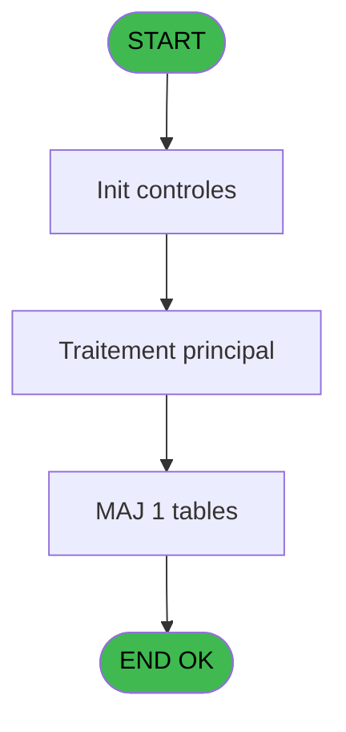
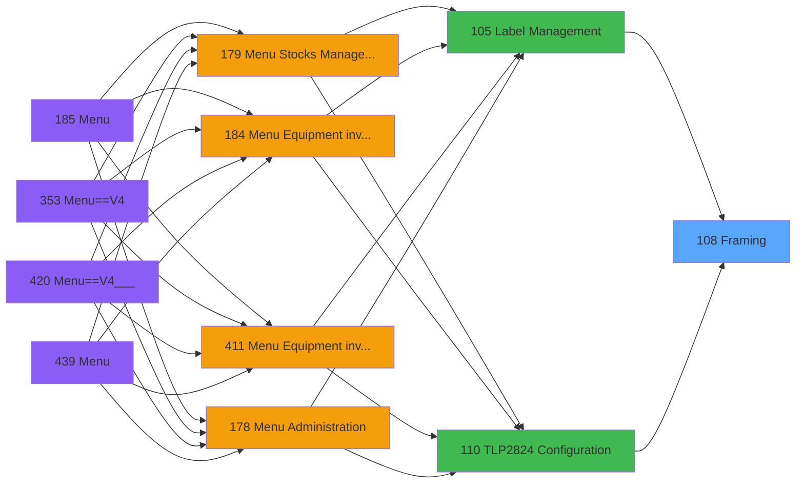
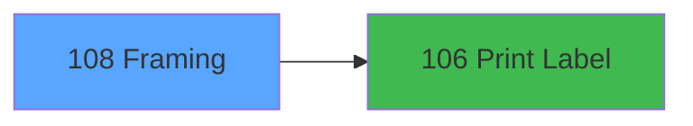

# PVE IDE 108 - Framing

> **Analyse**: Phases 1-4 2026-02-03 09:26 -> 09:26 (20s) | Assemblage 09:26
> **Pipeline**: V7.2 Enrichi
> **Structure**: 4 onglets (Resume | Ecrans | Donnees | Connexions)

<!-- TAB:Resume -->

## 1. FICHE D'IDENTITE

| Attribut | Valeur |
|----------|--------|
| Projet | PVE |
| IDE Position | 108 |
| Nom Programme | Framing |
| Fichier source | `Prg_108.xml` |
| Domaine metier | General |
| Taches | 3 (1 ecrans visibles) |
| Tables modifiees | 1 |
| Programmes appeles | 1 |

## 2. DESCRIPTION FONCTIONNELLE

**Framing** assure la gestion complete de ce processus, accessible depuis [Label Management (IDE 105)](PVE-IDE-105.md), [TLP2824 Configuration (IDE 110)](PVE-IDE-110.md).

Le flux de traitement s'organise en **1 blocs fonctionnels** :

- **Traitement** (3 taches) : traitements metier divers

**Donnees modifiees** : 1 tables en ecriture (pv_inventory).

## 3. BLOCS FONCTIONNELS

### 3.1 Traitement (3 taches)

Traitements internes.

---

#### 108 - Framing [[ECRAN]](#ecran-t1)

**Role** : Traitement : Framing.
**Ecran** : 314 x 164 DLU (MDI) | [Voir mockup](#ecran-t1)

---

#### 108.1 - read File

**Role** : Traitement : read File.

---

#### 108.2 - Update File

**Role** : Traitement : Update File.

## 5. REGLES METIER

*(Aucune regle metier identifiee)*

## 6. CONTEXTE

- **Appele par**: [Label Management (IDE 105)](PVE-IDE-105.md), [TLP2824 Configuration (IDE 110)](PVE-IDE-110.md)
- **Appelle**: 1 programmes | **Tables**: 1 (W:1 R:1 L:0) | **Taches**: 3 | **Expressions**: 13

<!-- TAB:Ecrans -->

## 8. ECRANS

### 8.1 Forms visibles (1 / 3)

| # | Position | Tache | Nom | Type | Largeur | Hauteur | Bloc |
|---|----------|-------|-----|------|---------|---------|------|
| 1 | 108 | 108 | Framing | MDI | 314 | 164 | Traitement |

### 8.2 Mockups Ecrans

---

#### 108 - Framing
**Tache** : [108](#t1) | **Type** : MDI | **Dimensions** : 314 x 164 DLU
**Bloc** : Traitement | **Titre IDE** : Framing

<!-- FORM-DATA:
{
    "width":  314,
    "vFactor":  8,
    "type":  "MDI",
    "hFactor":  4,
    "controls":  [
                     {
                         "x":  0,
                         "type":  "label",
                         "var":  "",
                         "y":  0,
                         "w":  312,
                         "fmt":  "",
                         "name":  "",
                         "h":  42,
                         "color":  "182",
                         "text":  "",
                         "parent":  null
                     },
                     {
                         "x":  13,
                         "type":  "label",
                         "var":  "",
                         "y":  15,
                         "w":  246,
                         "fmt":  "",
                         "name":  "",
                         "h":  10,
                         "color":  "186",
                         "text":  "Select the number of labels to print for this equipment",
                         "parent":  1
                     },
                     {
                         "x":  32,
                         "type":  "label",
                         "var":  "",
                         "y":  58,
                         "w":  259,
                         "fmt":  "",
                         "name":  "",
                         "h":  57,
                         "color":  "183",
                         "text":  "",
                         "parent":  null
                     },
                     {
                         "x":  123,
                         "type":  "label",
                         "var":  "",
                         "y":  67,
                         "w":  44,
                         "fmt":  "",
                         "name":  "",
                         "h":  10,
                         "color":  "183",
                         "text":  "X Margin",
                         "parent":  4
                     },
                     {
                         "x":  123,
                         "type":  "label",
                         "var":  "",
                         "y":  81,
                         "w":  44,
                         "fmt":  "",
                         "name":  "",
                         "h":  10,
                         "color":  "183",
                         "text":  "Y Margin",
                         "parent":  4
                     },
                     {
                         "x":  0,
                         "type":  "label",
                         "var":  "",
                         "y":  128,
                         "w":  312,
                         "fmt":  "",
                         "name":  "",
                         "h":  34,
                         "color":  "6",
                         "text":  "",
                         "parent":  null
                     },
                     {
                         "x":  196,
                         "type":  "edit",
                         "var":  "",
                         "y":  67,
                         "w":  68,
                         "fmt":  "",
                         "name":  "New X",
                         "h":  10,
                         "color":  "183",
                         "text":  "",
                         "parent":  4
                     },
                     {
                         "x":  196,
                         "type":  "edit",
                         "var":  "",
                         "y":  81,
                         "w":  68,
                         "fmt":  "",
                         "name":  "New Y",
                         "h":  10,
                         "color":  "183",
                         "text":  "",
                         "parent":  4
                     },
                     {
                         "x":  123,
                         "type":  "checkbox",
                         "var":  "",
                         "y":  97,
                         "w":  64,
                         "fmt":  "",
                         "name":  "PrintLabel",
                         "h":  10,
                         "color":  "183",
                         "text":  " Print Label",
                         "parent":  null
                     },
                     {
                         "x":  175,
                         "type":  "button",
                         "var":  "",
                         "y":  133,
                         "w":  68,
                         "fmt":  "Validate",
                         "name":  "Bouton validation",
                         "h":  28,
                         "color":  "",
                         "text":  "",
                         "parent":  null
                     },
                     {
                         "x":  262,
                         "type":  "image",
                         "var":  "",
                         "y":  4,
                         "w":  48,
                         "fmt":  "",
                         "name":  "",
                         "h":  37,
                         "color":  "",
                         "text":  "",
                         "parent":  1
                     },
                     {
                         "x":  37,
                         "type":  "image",
                         "var":  "",
                         "y":  60,
                         "w":  55,
                         "fmt":  "",
                         "name":  "",
                         "h":  24,
                         "color":  "29",
                         "text":  "",
                         "parent":  4
                     },
                     {
                         "x":  242,
                         "type":  "button",
                         "var":  "",
                         "y":  133,
                         "w":  68,
                         "fmt":  "Exit",
                         "name":  "",
                         "h":  28,
                         "color":  "",
                         "text":  "",
                         "parent":  null
                     }
                 ],
    "taskId":  "108",
    "height":  164
}
-->

<strong>Champs : 3 champs</strong>

| Pos (x,y) | Nom | Variable | Type |
|-----------|-----|----------|------|
| 196,67 | New X | - | edit |
| 196,81 | New Y | - | edit |
| 123,97 | PrintLabel | - | checkbox |

<strong>Boutons : 2 boutons</strong>

| Bouton | Pos (x,y) | Action |
|--------|-----------|--------|
| Validate | 175,133 | Valide la saisie et enregistre |
| Exit | 242,133 | Quitte le programme |

## 9. NAVIGATION

Ecran unique: **Framing**

### 9.3 Structure hierarchique (3 taches)

| Position | Tache | Type | Dimensions | Bloc |
|----------|-------|------|------------|------|
| **108.1** | [**Framing** (108)](#t1) [mockup](#ecran-t1) | MDI | 314x164 | Traitement |
| 108.1.1 | [read File (108.1)](#t2) | MDI | - | |
| 108.1.2 | [Update File (108.2)](#t3) | MDI | - | |

### 9.4 Algorigramme

> **Legende**: Vert = START/END OK | Rouge = END KO | Bleu = Decisions
> *Algorigramme auto-genere. Utiliser `/algorigramme` pour une synthese metier detaillee.*

<!-- TAB:Donnees -->

## 10. TABLES

### Tables utilisees (1)

| ID | Nom | Description | Type | R | W | L | Usages |
|----|-----|-------------|------|---|---|---|--------|
| 390 | pv_inventory |  | DB | R | **W** |   | 2 |

### Colonnes par table (0 / 1 tables avec colonnes identifiees)

Table 390 - pv_inventory (R/**W**) - 2 usages

*Table utilisee uniquement en Link ou aucune colonne Real identifiee dans le DataView.*

## 11. VARIABLES

### 11.1 Autres (4)

Variables diverses.

| Lettre | Nom | Type | Usage dans |
|--------|-----|------|-----------|
| A | New X | Numeric | 1x refs |
| B | New Y | Numeric | 1x refs |
| C | PrintLabel | Logical | 1x refs |
| D | Bouton validation | Alpha | - |

## 12. EXPRESSIONS

**13 / 13 expressions decodees (100%)**

### 12.1 Repartition par type

| Type | Expressions | Regles |
|------|-------------|--------|
| CONSTANTE | 9 | 0 |
| CAST_LOGIQUE | 1 | 0 |
| OTHER | 3 | 0 |

### 12.2 Expressions cles par type

#### CONSTANTE (9 expressions)

| Type | IDE | Expression | Regle |
|------|-----|------------|-------|
| CONSTANTE | 10 | `4` | - |
| CONSTANTE | 7 | `1` | - |
| CONSTANTE | 12 | `'Validation'` | - |
| CONSTANTE | 11 | `15` | - |
| CONSTANTE | 6 | `'XYXY'` | - |
| ... | | *+4 autres* | |

#### CAST_LOGIQUE (1 expressions)

| Type | IDE | Expression | Regle |
|------|-----|------------|-------|
| CAST_LOGIQUE | 1 | `'TRUE'LOG` | - |

#### OTHER (3 expressions)

| Type | IDE | Expression | Regle |
|------|-----|------------|-------|
| OTHER | 13 | `PrintLabel [C]` | - |
| OTHER | 9 | `New Y [B]` | - |
| OTHER | 8 | `New X [A]` | - |

<!-- TAB:Connexions -->

## 13. GRAPHE D'APPELS

### 13.1 Chaine depuis Main (Callers)

Main -> ... -> [Label Management (IDE 105)](PVE-IDE-105.md) -> **Framing (IDE 108)**

Main -> ... -> [TLP2824 Configuration (IDE 110)](PVE-IDE-110.md) -> **Framing (IDE 108)**

### 13.2 Callers

| IDE | Nom Programme | Nb Appels |
|-----|---------------|-----------|
| [105](PVE-IDE-105.md) | Label Management | 2 |
| [110](PVE-IDE-110.md) | TLP2824 Configuration | 1 |

### 13.3 Callees (programmes appeles)

### 13.4 Detail Callees avec contexte

| IDE | Nom Programme | Appels | Contexte |
|-----|---------------|--------|----------|
| [106](PVE-IDE-106.md) | Print Label | 1 | Impression ticket/document |

## 14. RECOMMANDATIONS MIGRATION

### 14.1 Profil du programme

| Metrique | Valeur | Impact migration |
|----------|--------|-----------------|
| Lignes de logique | 28 | Programme compact |
| Expressions | 13 | Peu de logique |
| Tables WRITE | 1 | Impact faible |
| Sous-programmes | 1 | Peu de dependances |
| Ecrans visibles | 1 | Ecran unique ou traitement batch |
| Code desactive | 0% (0 / 28) | Code sain |
| Regles metier | 0 | Pas de regle identifiee |

### 14.2 Plan de migration par bloc

#### Traitement (3 taches: 1 ecran, 2 traitements)

- **Strategie** : Orchestrateur avec 1 ecrans (Razor/React) et 2 traitements backend (services).
- Les ecrans deviennent des composants UI, les traitements invisibles deviennent des services injectables.
- 1 sous-programme(s) a migrer ou a reutiliser depuis les services existants.
- Decomposer les taches en services unitaires testables.

### 14.3 Dependances critiques

| Dependance | Type | Appels | Impact |
|------------|------|--------|--------|
| pv_inventory | Table WRITE (Database) | 1x | Schema + repository |
| [Print Label (IDE 106)](PVE-IDE-106.md) | Sous-programme | 1x | Normale - Impression ticket/document |

---
*Spec DETAILED generee par Pipeline V7.2 - 2026-02-03 09:26*
