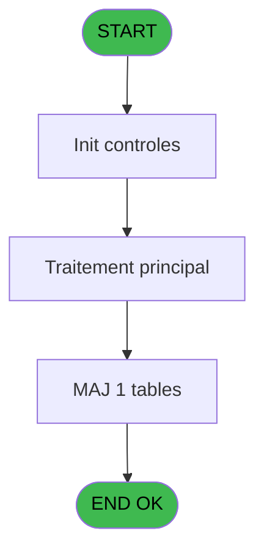
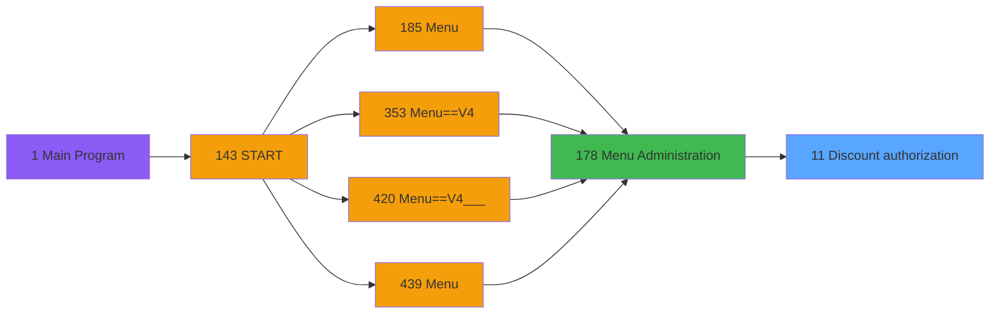

# PVE IDE 11 - Discount authorization

> **Analyse**: Phases 1-4 2026-02-03 00:59 -> 00:59 (38s) | Assemblage 00:59
> **Pipeline**: V7.2 Enrichi
> **Structure**: 4 onglets (Resume | Ecrans | Donnees | Connexions)

<!-- TAB:Resume -->

## 1. FICHE D'IDENTITE

| Attribut | Valeur |
|----------|--------|
| Projet | PVE |
| IDE Position | 11 |
| Nom Programme | Discount authorization |
| Fichier source | `Prg_11.xml` |
| Domaine metier | General |
| Taches | 3 (1 ecrans visibles) |
| Tables modifiees | 1 |
| Programmes appeles | 0 |

## 2. DESCRIPTION FONCTIONNELLE

**Discount authorization** assure la gestion complete de ce processus, accessible depuis [Menu Administration (IDE 178)](PVE-IDE-178.md).

Le flux de traitement s'organise en **1 blocs fonctionnels** :

- **Traitement** (3 taches) : traitements metier divers

**Donnees modifiees** : 1 tables en ecriture (articles_________art).

## 3. BLOCS FONCTIONNELS

### 3.1 Traitement (3 taches)

Traitements internes.

---

#### 11 - Discount authorization [[ECRAN]](#ecran-t1)

**Role** : Traitement : Discount authorization.
**Ecran** : 718 x 193 DLU (MDI) | [Voir mockup](#ecran-t1)

---

#### 11.1 - TOUT

**Role** : Traitement : TOUT.

---

#### 11.2 - AUCUN

**Role** : Traitement : AUCUN.

## 5. REGLES METIER

*(Aucune regle metier identifiee)*

## 6. CONTEXTE

- **Appele par**: [Menu Administration (IDE 178)](PVE-IDE-178.md)
- **Appelle**: 0 programmes | **Tables**: 1 (W:1 R:0 L:0) | **Taches**: 3 | **Expressions**: 2

<!-- TAB:Ecrans -->

## 8. ECRANS

### 8.1 Forms visibles (1 / 3)

| # | Position | Tache | Nom | Type | Largeur | Hauteur | Bloc |
|---|----------|-------|-----|------|---------|---------|------|
| 1 | 11 | 11 | Discount authorization | MDI | 718 | 193 | Traitement |

### 8.2 Mockups Ecrans

---

#### 11 - Discount authorization
**Tache** : [11](#t1) | **Type** : MDI | **Dimensions** : 718 x 193 DLU
**Bloc** : Traitement | **Titre IDE** : Discount authorization

<!-- FORM-DATA:
{
    "width":  718,
    "vFactor":  8,
    "type":  "MDI",
    "hFactor":  8,
    "controls":  [
                     {
                         "x":  14,
                         "type":  "table",
                         "var":  "",
                         "name":  "",
                         "titleH":  12,
                         "color":  "110",
                         "w":  690,
                         "y":  5,
                         "fmt":  "",
                         "parent":  null,
                         "text":  "",
                         "rowH":  12,
                         "h":  160,
                         "cols":  [
                                      {
                                          "title":  "Service",
                                          "layer":  1,
                                          "w":  168
                                      },
                                      {
                                          "title":  "Product",
                                          "layer":  2,
                                          "w":  148
                                      },
                                      {
                                          "title":  "Product Name",
                                          "layer":  3,
                                          "w":  161
                                      },
                                      {
                                          "title":  "Authorization",
                                          "layer":  4,
                                          "w":  178
                                      }
                                  ],
                         "rows":  4
                     },
                     {
                         "x":  550,
                         "type":  "button",
                         "var":  "",
                         "y":  170,
                         "w":  154,
                         "fmt":  "\u0026Exit",
                         "name":  "BP. Exit",
                         "h":  18,
                         "color":  "",
                         "text":  "",
                         "parent":  null
                     },
                     {
                         "x":  189,
                         "type":  "edit",
                         "var":  "",
                         "y":  19,
                         "w":  82,
                         "fmt":  "",
                         "name":  "",
                         "h":  10,
                         "color":  "110",
                         "text":  "",
                         "parent":  1
                     },
                     {
                         "x":  336,
                         "type":  "edit",
                         "var":  "",
                         "y":  19,
                         "w":  149,
                         "fmt":  "",
                         "name":  "",
                         "h":  10,
                         "color":  "110",
                         "text":  "",
                         "parent":  1
                     },
                     {
                         "x":  21,
                         "type":  "edit",
                         "var":  "",
                         "y":  19,
                         "w":  156,
                         "fmt":  "",
                         "name":  "",
                         "h":  10,
                         "color":  "110",
                         "text":  "",
                         "parent":  1
                     },
                     {
                         "x":  573,
                         "type":  "checkbox",
                         "var":  "",
                         "y":  19,
                         "w":  22,
                         "fmt":  "",
                         "name":  "CTRL_001",
                         "h":  9,
                         "color":  "110",
                         "text":  "",
                         "parent":  1
                     },
                     {
                         "x":  14,
                         "type":  "button",
                         "var":  "",
                         "y":  170,
                         "w":  154,
                         "fmt":  "ALL",
                         "name":  "ALL",
                         "h":  18,
                         "color":  "",
                         "text":  "",
                         "parent":  null
                     },
                     {
                         "x":  185,
                         "type":  "button",
                         "var":  "",
                         "y":  170,
                         "w":  154,
                         "fmt":  "NONE",
                         "name":  "NONE",
                         "h":  18,
                         "color":  "",
                         "text":  "",
                         "parent":  null
                     }
                 ],
    "taskId":  "11",
    "height":  193
}
-->

<strong>Champs : 4 champs</strong>

| Pos (x,y) | Nom | Variable | Type |
|-----------|-----|----------|------|
| 189,19 | (sans nom) | - | edit |
| 336,19 | (sans nom) | - | edit |
| 21,19 | (sans nom) | - | edit |
| 573,19 | CTRL_001 | - | checkbox |

<strong>Boutons : 3 boutons</strong>

| Bouton | Pos (x,y) | Action |
|--------|-----------|--------|
| Exit | 550,170 | Quitte le programme |
| ALL | 14,170 | Bouton fonctionnel |
| NONE | 185,170 | Bouton fonctionnel |

## 9. NAVIGATION

Ecran unique: **Discount authorization**

### 9.3 Structure hierarchique (3 taches)

| Position | Tache | Type | Dimensions | Bloc |
|----------|-------|------|------------|------|
| **11.1** | [**Discount authorization** (11)](#t1) [mockup](#ecran-t1) | MDI | 718x193 | Traitement |
| 11.1.1 | [TOUT (11.1)](#t2) | MDI | - | |
| 11.1.2 | [AUCUN (11.2)](#t3) | MDI | - | |

### 9.4 Algorigramme

> **Legende**: Vert = START/END OK | Rouge = END KO | Bleu = Decisions
> *Algorigramme auto-genere. Utiliser `/algorigramme` pour une synthese metier detaillee.*

<!-- TAB:Donnees -->

## 10. TABLES

### Tables utilisees (1)

| ID | Nom | Description | Type | R | W | L | Usages |
|----|-----|-------------|------|---|---|---|--------|
| 77 | articles_________art | Articles et stock | DB |   | **W** |   | 3 |

### Colonnes par table (1 / 1 tables avec colonnes identifiees)

Table 77 - articles_________art (**W**) - 3 usages

| Lettre | Variable | Acces | Type |
|--------|----------|-------|------|
| A | P. Service | W | Alpha |
| B | BP. Exit | W | Alpha |

## 11. VARIABLES

### 11.1 Parametres entrants (1)

Variables recues du programme appelant ([Menu Administration (IDE 178)](PVE-IDE-178.md)).

| Lettre | Nom | Type | Usage dans |
|--------|-----|------|-----------|
| A | P. Service | Alpha | 1x parametre entrant |

### 11.2 Autres (1)

Variables diverses.

| Lettre | Nom | Type | Usage dans |
|--------|-----|------|-----------|
| B | BP. Exit | Alpha | - |

## 12. EXPRESSIONS

**2 / 2 expressions decodees (100%)**

### 12.1 Repartition par type

| Type | Expressions | Regles |
|------|-------------|--------|
| CONSTANTE | 1 | 0 |
| OTHER | 1 | 0 |

### 12.2 Expressions cles par type

#### CONSTANTE (1 expressions)

| Type | IDE | Expression | Regle |
|------|-----|------------|-------|
| CONSTANTE | 2 | `'&Exit'` | - |

#### OTHER (1 expressions)

| Type | IDE | Expression | Regle |
|------|-----|------------|-------|
| OTHER | 1 | `P. Service [A]` | - |

<!-- TAB:Connexions -->

## 13. GRAPHE D'APPELS

### 13.1 Chaine depuis Main (Callers)

Main -> ... -> [Menu Administration (IDE 178)](PVE-IDE-178.md) -> **Discount authorization (IDE 11)**

### 13.2 Callers

| IDE | Nom Programme | Nb Appels |
|-----|---------------|-----------|
| [178](PVE-IDE-178.md) | Menu Administration | 1 |

### 13.3 Callees (programmes appeles)

### 13.4 Detail Callees avec contexte

| IDE | Nom Programme | Appels | Contexte |
|-----|---------------|--------|----------|
| - | (aucun) | - | - |

## 14. RECOMMANDATIONS MIGRATION

### 14.1 Profil du programme

| Metrique | Valeur | Impact migration |
|----------|--------|-----------------|
| Lignes de logique | 29 | Programme compact |
| Expressions | 2 | Peu de logique |
| Tables WRITE | 1 | Impact faible |
| Sous-programmes | 0 | Peu de dependances |
| Ecrans visibles | 1 | Ecran unique ou traitement batch |
| Code desactive | 0% (0 / 29) | Code sain |
| Regles metier | 0 | Pas de regle identifiee |

### 14.2 Plan de migration par bloc

#### Traitement (3 taches: 1 ecran, 2 traitements)

- **Strategie** : Orchestrateur avec 1 ecrans (Razor/React) et 2 traitements backend (services).
- Les ecrans deviennent des composants UI, les traitements invisibles deviennent des services injectables.
- Decomposer les taches en services unitaires testables.

### 14.3 Dependances critiques

| Dependance | Type | Appels | Impact |
|------------|------|--------|--------|
| articles_________art | Table WRITE (Database) | 3x | Schema + repository |

---
*Spec DETAILED generee par Pipeline V7.2 - 2026-02-03 00:59*
