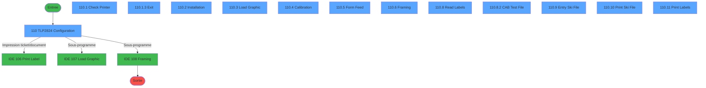
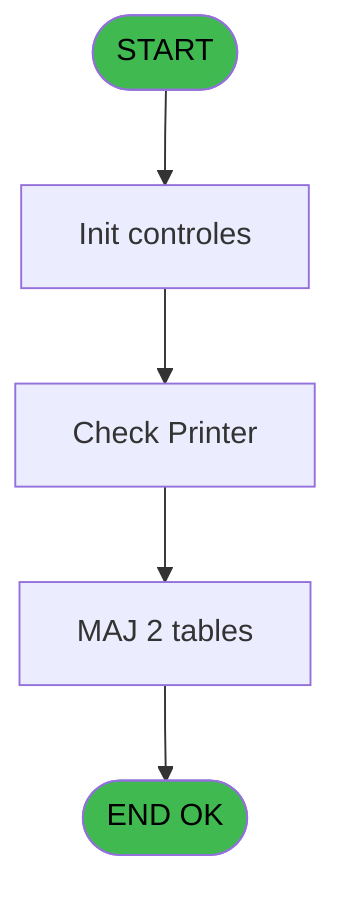
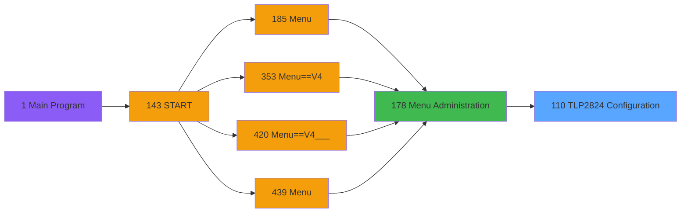
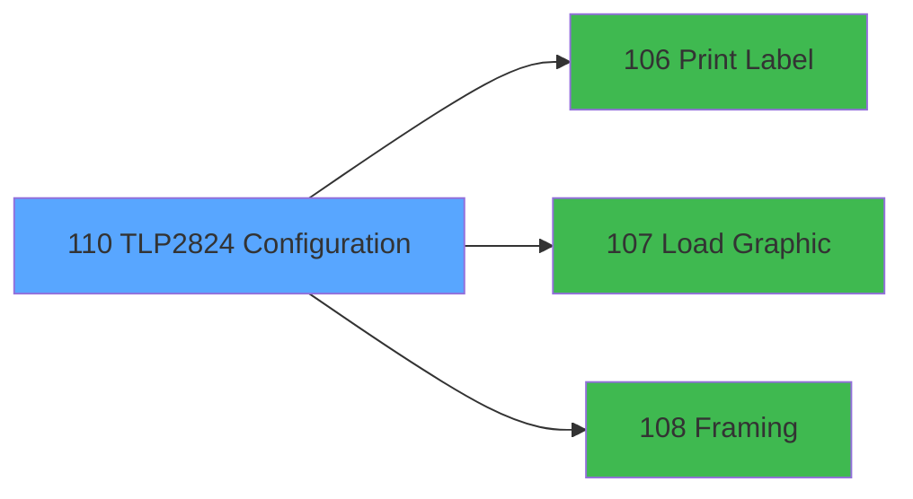

# PVE IDE 110 - TLP2824 Configuration

> **Analyse**: Phases 1-4 2026-02-03 09:27 -> 09:27 (20s) | Assemblage 09:27
> **Pipeline**: V7.2 Enrichi
> **Structure**: 4 onglets (Resume | Ecrans | Donnees | Connexions)

<!-- TAB:Resume -->

## 1. FICHE D'IDENTITE

| Attribut | Valeur |
|----------|--------|
| Projet | PVE |
| IDE Position | 110 |
| Nom Programme | TLP2824 Configuration |
| Fichier source | `Prg_110.xml` |
| Domaine metier | General |
| Taches | 38 (13 ecrans visibles) |
| Tables modifiees | 2 |
| Programmes appeles | 3 |

## 2. DESCRIPTION FONCTIONNELLE

**TLP2824 Configuration** assure la gestion complete de ce processus, accessible depuis [Menu Administration (IDE 178)](PVE-IDE-178.md).

Le flux de traitement s'organise en **2 blocs fonctionnels** :

- **Traitement** (27 taches) : traitements metier divers
- **Impression** (11 taches) : generation de tickets et documents

**Donnees modifiees** : 2 tables en ecriture (pv_type_matos, pv_payment_type).

**Logique metier** : 1 regles identifiees couvrant conditions metier.

Detail : phases du traitement

#### Phase 1 : Traitement (27 taches)

- **110** - TLP2824 Configuration **[[ECRAN]](#ecran-t1)**
- **110.1.1.1** - Control
- **110.1.1.1.1** - Search for computername
- **110.1.1.1.2** - Search for computername
- **110.1.2** - (sans nom) **[[ECRAN]](#ecran-t7)**
- **110.1.2.1** - Search for computername
- **110.1.3** - Exit **[[ECRAN]](#ecran-t9)**
- **110.2** - Installation **[[ECRAN]](#ecran-t10)**
- **110.2.1.1** - Control
- **110.2.1.1.1** - Search for computername
- **110.2.1.1.2** - Search for computername
- **110.2.2.1** - Control
- **110.2.2.1.1** - Search for computername
- **110.2.3.1** - Control
- **110.2.3.1.1** - Search for computername
- **110.2.4** - (sans nom) **[[ECRAN]](#ecran-t21)**
- **110.2.4.1** - Search for computername
- **110.3** - Load Graphic **[[ECRAN]](#ecran-t23)**
- **110.4** - Calibration **[[ECRAN]](#ecran-t24)**
- **110.4.1** - Calibration
- **110.5** - Form Feed **[[ECRAN]](#ecran-t26)**
- **110.6** - Framing **[[ECRAN]](#ecran-t28)**
- **110.6.1** - Read Frame
- **110.8** - Read Labels **[[ECRAN]](#ecran-t31)**
- **110.8.1** - Write File
- **110.8.2** - CAB Test File **[[ECRAN]](#ecran-t33)**
- **110.9** - Entry Ski File **[[ECRAN]](#ecran-t34)**

Delegue a : [Load Graphic (IDE 107)](PVE-IDE-107.md), [Framing (IDE 108)](PVE-IDE-108.md)

#### Phase 2 : Impression (11 taches)

- **110.1** - Check Printer **[[ECRAN]](#ecran-t2)**
- **110.1.1** - Execute print test
- **110.2.1** - Execute print test
- **110.2.2** - Execute print test
- **110.2.3** - Execute print test
- **110.5.1** - Print 10 Labels
- **110.7** - Execute print test
- **110.10** - Print Ski File **[[ECRAN]](#ecran-t35)**
- **110.10.1** - Print Ski File
- **110.11** - Print Labels **[[ECRAN]](#ecran-t37)**
- **110.11.1** - Print 10 Labels

Delegue a : [Print Label (IDE 106)](PVE-IDE-106.md)

#### Tables impactees

| Table | Operations | Role metier |
|-------|-----------|-------------|
| pv_payment_type | R/**W** (2 usages) |  |
| pv_type_matos | **W** (2 usages) |  |

## 3. BLOCS FONCTIONNELS

### 3.1 Traitement (27 taches)

Traitements internes.

---

#### 110 - TLP2824 Configuration [[ECRAN]](#ecran-t1)

**Role** : Tache d'orchestration : point d'entree du programme (27 sous-taches). Coordonne l'enchainement des traitements.
**Ecran** : 640 x 0 DLU (MDI) | [Voir mockup](#ecran-t1)

26 sous-taches directes

| Tache | Nom | Bloc |
|-------|-----|------|
| [110.1.1.1](#t4) | Control | Traitement |
| [110.1.1.1.1](#t5) | Search for computername | Traitement |
| [110.1.1.1.2](#t6) | Search for computername | Traitement |
| [110.1.2](#t7) | (sans nom) **[[ECRAN]](#ecran-t7)** | Traitement |
| [110.1.2.1](#t8) | Search for computername | Traitement |
| [110.1.3](#t9) | Exit **[[ECRAN]](#ecran-t9)** | Traitement |
| [110.2](#t10) | Installation **[[ECRAN]](#ecran-t10)** | Traitement |
| [110.2.1.1](#t12) | Control | Traitement |
| [110.2.1.1.1](#t13) | Search for computername | Traitement |
| [110.2.1.1.2](#t14) | Search for computername | Traitement |
| [110.2.2.1](#t16) | Control | Traitement |
| [110.2.2.1.1](#t17) | Search for computername | Traitement |
| [110.2.3.1](#t19) | Control | Traitement |
| [110.2.3.1.1](#t20) | Search for computername | Traitement |
| [110.2.4](#t21) | (sans nom) **[[ECRAN]](#ecran-t21)** | Traitement |
| [110.2.4.1](#t22) | Search for computername | Traitement |
| [110.3](#t23) | Load Graphic **[[ECRAN]](#ecran-t23)** | Traitement |
| [110.4](#t24) | Calibration **[[ECRAN]](#ecran-t24)** | Traitement |
| [110.4.1](#t25) | Calibration | Traitement |
| [110.5](#t26) | Form Feed **[[ECRAN]](#ecran-t26)** | Traitement |
| [110.6](#t28) | Framing **[[ECRAN]](#ecran-t28)** | Traitement |
| [110.6.1](#t29) | Read Frame | Traitement |
| [110.8](#t31) | Read Labels **[[ECRAN]](#ecran-t31)** | Traitement |
| [110.8.1](#t32) | Write File | Traitement |
| [110.8.2](#t33) | CAB Test File **[[ECRAN]](#ecran-t33)** | Traitement |
| [110.9](#t34) | Entry Ski File **[[ECRAN]](#ecran-t34)** | Traitement |

---

#### 110.1.1.1 - Control

**Role** : Traitement : Control.

---

#### 110.1.1.1.1 - Search for computername

**Role** : Traitement : Search for computername.

---

#### 110.1.1.1.2 - Search for computername

**Role** : Traitement : Search for computername.

---

#### 110.1.2 - (sans nom) [[ECRAN]](#ecran-t7)

**Role** : Traitement interne.
**Ecran** : 480 x 80 DLU (MDI) | [Voir mockup](#ecran-t7)

---

#### 110.1.2.1 - Search for computername

**Role** : Traitement : Search for computername.

---

#### 110.1.3 - Exit [[ECRAN]](#ecran-t9)

**Role** : Traitement : Exit.
**Ecran** : 160 x 14 DLU (MDI) | [Voir mockup](#ecran-t9)

---

#### 110.2 - Installation [[ECRAN]](#ecran-t10)

**Role** : Traitement : Installation.
**Ecran** : 640 x 0 DLU (MDI) | [Voir mockup](#ecran-t10)

---

#### 110.2.1.1 - Control

**Role** : Traitement : Control.

---

#### 110.2.1.1.1 - Search for computername

**Role** : Traitement : Search for computername.

---

#### 110.2.1.1.2 - Search for computername

**Role** : Traitement : Search for computername.

---

#### 110.2.2.1 - Control

**Role** : Traitement : Control.

---

#### 110.2.2.1.1 - Search for computername

**Role** : Traitement : Search for computername.

---

#### 110.2.3.1 - Control

**Role** : Traitement : Control.

---

#### 110.2.3.1.1 - Search for computername

**Role** : Traitement : Search for computername.

---

#### 110.2.4 - (sans nom) [[ECRAN]](#ecran-t21)

**Role** : Traitement interne.
**Ecran** : 480 x 80 DLU (MDI) | [Voir mockup](#ecran-t21)

---

#### 110.2.4.1 - Search for computername

**Role** : Traitement : Search for computername.

---

#### 110.3 - Load Graphic [[ECRAN]](#ecran-t23)

**Role** : Traitement : Load Graphic.
**Ecran** : 640 x 0 DLU (MDI) | [Voir mockup](#ecran-t23)

---

#### 110.4 - Calibration [[ECRAN]](#ecran-t24)

**Role** : Traitement : Calibration.
**Ecran** : 640 x 0 DLU (MDI) | [Voir mockup](#ecran-t24)

---

#### 110.4.1 - Calibration

**Role** : Traitement : Calibration.

---

#### 110.5 - Form Feed [[ECRAN]](#ecran-t26)

**Role** : Traitement : Form Feed.
**Ecran** : 640 x 0 DLU (MDI) | [Voir mockup](#ecran-t26)

---

#### 110.6 - Framing [[ECRAN]](#ecran-t28)

**Role** : Traitement : Framing.
**Ecran** : 640 x 0 DLU (MDI) | [Voir mockup](#ecran-t28)

---

#### 110.6.1 - Read Frame

**Role** : Traitement : Read Frame.
**Variables liees** : K (PrinterReady)

---

#### 110.8 - Read Labels [[ECRAN]](#ecran-t31)

**Role** : Traitement : Read Labels.
**Ecran** : 640 x 0 DLU (MDI) | [Voir mockup](#ecran-t31)
**Variables liees** : K (PrinterReady)

---

#### 110.8.1 - Write File

**Role** : Traitement : Write File.

---

#### 110.8.2 - CAB Test File [[ECRAN]](#ecran-t33)

**Role** : Verification : CAB Test File.
**Ecran** : 320 x 200 DLU (MDI) | [Voir mockup](#ecran-t33)

---

#### 110.9 - Entry Ski File [[ECRAN]](#ecran-t34)

**Role** : Traitement : Entry Ski File.
**Ecran** : 640 x 0 DLU (MDI) | [Voir mockup](#ecran-t34)

### 3.2 Impression (11 taches)

Generation des documents et tickets.

---

#### 110.1 - Check Printer [[ECRAN]](#ecran-t2)

**Role** : Generation du document : Check Printer.
**Ecran** : 640 x 0 DLU (MDI) | [Voir mockup](#ecran-t2)
**Variables liees** : K (PrinterReady)

---

#### 110.1.1 - Execute print test

**Role** : Generation du document : Execute print test.
**Variables liees** : K (PrinterReady)

---

#### 110.2.1 - Execute print test

**Role** : Generation du document : Execute print test.
**Variables liees** : K (PrinterReady)

---

#### 110.2.2 - Execute print test

**Role** : Generation du document : Execute print test.
**Variables liees** : K (PrinterReady)

---

#### 110.2.3 - Execute print test

**Role** : Generation du document : Execute print test.
**Variables liees** : K (PrinterReady)

---

#### 110.5.1 - Print 10 Labels

**Role** : Generation du document : Print 10 Labels.
**Variables liees** : K (PrinterReady)

---

#### 110.7 - Execute print test

**Role** : Generation du document : Execute print test.
**Variables liees** : K (PrinterReady)

---

#### 110.10 - Print Ski File [[ECRAN]](#ecran-t35)

**Role** : Generation du document : Print Ski File.
**Ecran** : 640 x 0 DLU (MDI) | [Voir mockup](#ecran-t35)
**Variables liees** : K (PrinterReady)

---

#### 110.10.1 - Print Ski File

**Role** : Generation du document : Print Ski File.
**Variables liees** : K (PrinterReady)

---

#### 110.11 - Print Labels [[ECRAN]](#ecran-t37)

**Role** : Generation du document : Print Labels.
**Ecran** : 640 x 0 DLU (MDI) | [Voir mockup](#ecran-t37)
**Variables liees** : K (PrinterReady)

---

#### 110.11.1 - Print 10 Labels

**Role** : Generation du document : Print 10 Labels.
**Variables liees** : K (PrinterReady)

## 5. REGLES METIER

1 regles identifiees:

### Autres (1 regles)

#### [RM-001] Si Speed [I]=1 alors 5 sinon IF (Speed [I]=2,5,IF (Speed [I]=3,7,IF (Speed [I]=4,15,0))))

| Element | Detail |
|---------|--------|
| **Condition** | `Speed [I]=1` |
| **Si vrai** | 5 |
| **Si faux** | IF (Speed [I]=2,5,IF (Speed [I]=3,7,IF (Speed [I]=4,15,0)))) |
| **Variables** | I (Speed) |
| **Expression source** | Expression 10 : `IF (Speed [I]=1,5,IF (Speed [I]=2,5,IF (Speed [I]=3,7,IF (Sp` |
| **Exemple** | Si Speed [I]=1 → 5 |

## 6. CONTEXTE

- **Appele par**: [Menu Administration (IDE 178)](PVE-IDE-178.md)
- **Appelle**: 3 programmes | **Tables**: 3 (W:2 R:2 L:0) | **Taches**: 38 | **Expressions**: 11

<!-- TAB:Ecrans -->

## 8. ECRANS

### 8.1 Forms visibles (13 / 38)

| # | Position | Tache | Nom | Type | Largeur | Hauteur | Bloc |
|---|----------|-------|-----|------|---------|---------|------|
| 1 | 110 | 110 | TLP2824 Configuration | MDI | 640 | 0 | Traitement |
| 2 | 110.1 | 110.1 | Check Printer | MDI | 640 | 0 | Impression |
| 3 | 110.1.3 | 110.1.3 | Exit | MDI | 160 | 14 | Traitement |
| 4 | 110.2 | 110.2 | Installation | MDI | 640 | 0 | Traitement |
| 5 | 110.3 | 110.3 | Load Graphic | MDI | 640 | 0 | Traitement |
| 6 | 110.4 | 110.4 | Calibration | MDI | 640 | 0 | Traitement |
| 7 | 110.5 | 110.5 | Form Feed | MDI | 640 | 0 | Traitement |
| 8 | 110.6 | 110.6 | Framing | MDI | 640 | 0 | Traitement |
| 9 | 110.8 | 110.8 | Read Labels | MDI | 640 | 0 | Traitement |
| 10 | 110.8.2 | 110.8.2 | CAB Test File | MDI | 320 | 200 | Traitement |
| 11 | 110.9 | 110.9 | Entry Ski File | MDI | 640 | 0 | Traitement |
| 12 | 110.10 | 110.10 | Print Ski File | MDI | 640 | 0 | Impression |
| 13 | 110.11 | 110.11 | Print Labels | MDI | 640 | 0 | Impression |

### 8.2 Mockups Ecrans

---

#### 110 - TLP2824 Configuration
**Tache** : [110](#t1) | **Type** : MDI | **Dimensions** : 640 x 0 DLU
**Bloc** : Traitement | **Titre IDE** : TLP2824 Configuration

<!-- FORM-DATA:
{
    "width":  640,
    "vFactor":  8,
    "type":  "MDI",
    "hFactor":  8,
    "controls":  [
                     {
                         "x":  12,
                         "type":  "label",
                         "var":  "",
                         "y":  4,
                         "w":  88,
                         "fmt":  "",
                         "name":  "",
                         "h":  10,
                         "color":  "158",
                         "text":  "Ski Name",
                         "parent":  null
                     },
                     {
                         "x":  310,
                         "type":  "label",
                         "var":  "",
                         "y":  5,
                         "w":  320,
                         "fmt":  "",
                         "name":  "",
                         "h":  48,
                         "color":  "158",
                         "text":  "",
                         "parent":  null
                     },
                     {
                         "x":  12,
                         "type":  "label",
                         "var":  "",
                         "y":  18,
                         "w":  88,
                         "fmt":  "",
                         "name":  "",
                         "h":  10,
                         "color":  "158",
                         "text":  "Ski Length",
                         "parent":  null
                     },
                     {
                         "x":  12,
                         "type":  "label",
                         "var":  "",
                         "y":  32,
                         "w":  88,
                         "fmt":  "",
                         "name":  "",
                         "h":  10,
                         "color":  "158",
                         "text":  "Barcode",
                         "parent":  null
                     },
                     {
                         "x":  12,
                         "type":  "label",
                         "var":  "",
                         "y":  46,
                         "w":  88,
                         "fmt":  "",
                         "name":  "",
                         "h":  10,
                         "color":  "158",
                         "text":  "ClubMed",
                         "parent":  null
                     },
                     {
                         "x":  310,
                         "type":  "label",
                         "var":  "",
                         "y":  59,
                         "w":  320,
                         "fmt":  "",
                         "name":  "",
                         "h":  30,
                         "color":  "158",
                         "text":  "",
                         "parent":  null
                     },
                     {
                         "x":  12,
                         "type":  "label",
                         "var":  "",
                         "y":  60,
                         "w":  88,
                         "fmt":  "",
                         "name":  "",
                         "h":  10,
                         "color":  "158",
                         "text":  "Village",
                         "parent":  null
                     },
                     {
                         "x":  12,
                         "type":  "label",
                         "var":  "",
                         "y":  74,
                         "w":  88,
                         "fmt":  "",
                         "name":  "",
                         "h":  10,
                         "color":  "158",
                         "text":  "Copy",
                         "parent":  null
                     },
                     {
                         "x":  12,
                         "type":  "label",
                         "var":  "",
                         "y":  88,
                         "w":  88,
                         "fmt":  "",
                         "name":  "",
                         "h":  10,
                         "color":  "158",
                         "text":  "X Margin",
                         "parent":  null
                     },
                     {
                         "x":  310,
                         "type":  "label",
                         "var":  "",
                         "y":  95,
                         "w":  320,
                         "fmt":  "",
                         "name":  "",
                         "h":  30,
                         "color":  "158",
                         "text":  "",
                         "parent":  null
                     },
                     {
                         "x":  12,
                         "type":  "label",
                         "var":  "",
                         "y":  102,
                         "w":  88,
                         "fmt":  "",
                         "name":  "",
                         "h":  10,
                         "color":  "158",
                         "text":  "Y Margin",
                         "parent":  null
                     },
                     {
                         "x":  12,
                         "type":  "label",
                         "var":  "",
                         "y":  116,
                         "w":  88,
                         "fmt":  "",
                         "name":  "",
                         "h":  10,
                         "color":  "158",
                         "text":  "Speed",
                         "parent":  null
                     },
                     {
                         "x":  12,
                         "type":  "label",
                         "var":  "",
                         "y":  130,
                         "w":  88,
                         "fmt":  "",
                         "name":  "",
                         "h":  10,
                         "color":  "158",
                         "text":  "Density",
                         "parent":  null
                     },
                     {
                         "x":  310,
                         "type":  "label",
                         "var":  "",
                         "y":  131,
                         "w":  320,
                         "fmt":  "",
                         "name":  "",
                         "h":  30,
                         "color":  "158",
                         "text":  "",
                         "parent":  null
                     },
                     {
                         "x":  310,
                         "type":  "label",
                         "var":  "",
                         "y":  167,
                         "w":  320,
                         "fmt":  "",
                         "name":  "",
                         "h":  30,
                         "color":  "158",
                         "text":  "",
                         "parent":  null
                     },
                     {
                         "x":  159,
                         "type":  "edit",
                         "var":  "",
                         "y":  4,
                         "w":  136,
                         "fmt":  "U8",
                         "name":  "",
                         "h":  10,
                         "color":  "158",
                         "text":  "",
                         "parent":  null
                     },
                     {
                         "x":  159,
                         "type":  "edit",
                         "var":  "",
                         "y":  18,
                         "w":  136,
                         "fmt":  "",
                         "name":  "",
                         "h":  10,
                         "color":  "158",
                         "text":  "",
                         "parent":  null
                     },
                     {
                         "x":  159,
                         "type":  "edit",
                         "var":  "",
                         "y":  32,
                         "w":  136,
                         "fmt":  "U8",
                         "name":  "",
                         "h":  10,
                         "color":  "158",
                         "text":  "",
                         "parent":  null
                     },
                     {
                         "x":  159,
                         "type":  "edit",
                         "var":  "",
                         "y":  46,
                         "w":  136,
                         "fmt":  "",
                         "name":  "",
                         "h":  10,
                         "color":  "158",
                         "text":  "",
                         "parent":  null
                     },
                     {
                         "x":  159,
                         "type":  "edit",
                         "var":  "",
                         "y":  60,
                         "w":  136,
                         "fmt":  "",
                         "name":  "",
                         "h":  10,
                         "color":  "158",
                         "text":  "",
                         "parent":  null
                     },
                     {
                         "x":  159,
                         "type":  "edit",
                         "var":  "",
                         "y":  74,
                         "w":  136,
                         "fmt":  "",
                         "name":  "",
                         "h":  10,
                         "color":  "158",
                         "text":  "",
                         "parent":  null
                     },
                     {
                         "x":  159,
                         "type":  "edit",
                         "var":  "",
                         "y":  88,
                         "w":  136,
                         "fmt":  "",
                         "name":  "",
                         "h":  10,
                         "color":  "158",
                         "text":  "",
                         "parent":  null
                     },
                     {
                         "x":  159,
                         "type":  "edit",
                         "var":  "",
                         "y":  102,
                         "w":  136,
                         "fmt":  "",
                         "name":  "",
                         "h":  10,
                         "color":  "158",
                         "text":  "",
                         "parent":  null
                     },
                     {
                         "x":  159,
                         "type":  "edit",
                         "var":  "",
                         "y":  116,
                         "w":  136,
                         "fmt":  "",
                         "name":  "",
                         "h":  10,
                         "color":  "158",
                         "text":  "",
                         "parent":  null
                     },
                     {
                         "x":  159,
                         "type":  "edit",
                         "var":  "",
                         "y":  130,
                         "w":  136,
                         "fmt":  "",
                         "name":  "",
                         "h":  10,
                         "color":  "158",
                         "text":  "",
                         "parent":  null
                     },
                     {
                         "x":  329,
                         "type":  "image",
                         "var":  "",
                         "y":  8,
                         "w":  112,
                         "fmt":  "",
                         "name":  "",
                         "h":  42,
                         "color":  "29",
                         "text":  "",
                         "parent":  null
                     },
                     {
                         "x":  353,
                         "type":  "image",
                         "var":  "",
                         "y":  62,
                         "w":  64,
                         "fmt":  "",
                         "name":  "",
                         "h":  25,
                         "color":  "29",
                         "text":  "",
                         "parent":  null
                     },
                     {
                         "x":  330,
                         "type":  "image",
                         "var":  "",
                         "y":  98,
                         "w":  110,
                         "fmt":  "",
                         "name":  "",
                         "h":  24,
                         "color":  "29",
                         "text":  "",
                         "parent":  null
                     },
                     {
                         "x":  330,
                         "type":  "image",
                         "var":  "",
                         "y":  134,
                         "w":  110,
                         "fmt":  "",
                         "name":  "",
                         "h":  24,
                         "color":  "29",
                         "text":  "",
                         "parent":  null
                     },
                     {
                         "x":  330,
                         "type":  "image",
                         "var":  "",
                         "y":  170,
                         "w":  110,
                         "fmt":  "",
                         "name":  "",
                         "h":  24,
                         "color":  "29",
                         "text":  "",
                         "parent":  null
                     },
                     {
                         "x":  468,
                         "type":  "button",
                         "var":  "",
                         "y":  8,
                         "w":  136,
                         "fmt":  "Check Printer",
                         "name":  "",
                         "h":  14,
                         "color":  "",
                         "text":  "",
                         "parent":  null
                     },
                     {
                         "x":  468,
                         "type":  "button",
                         "var":  "",
                         "y":  36,
                         "w":  136,
                         "fmt":  "Install Printer",
                         "name":  "",
                         "h":  14,
                         "color":  "",
                         "text":  "",
                         "parent":  null
                     },
                     {
                         "x":  468,
                         "type":  "button",
                         "var":  "",
                         "y":  67,
                         "w":  136,
                         "fmt":  "Load Graphic",
                         "name":  "",
                         "h":  14,
                         "color":  "",
                         "text":  "",
                         "parent":  null
                     },
                     {
                         "x":  468,
                         "type":  "button",
                         "var":  "",
                         "y":  103,
                         "w":  136,
                         "fmt":  "Calibration",
                         "name":  "",
                         "h":  14,
                         "color":  "",
                         "text":  "",
                         "parent":  null
                     },
                     {
                         "x":  468,
                         "type":  "button",
                         "var":  "",
                         "y":  139,
                         "w":  136,
                         "fmt":  "Form Feed",
                         "name":  "",
                         "h":  14,
                         "color":  "",
                         "text":  "",
                         "parent":  null
                     },
                     {
                         "x":  12,
                         "type":  "button",
                         "var":  "",
                         "y":  147,
                         "w":  136,
                         "fmt":  "Print Test",
                         "name":  "",
                         "h":  14,
                         "color":  "",
                         "text":  "",
                         "parent":  null
                     },
                     {
                         "x":  159,
                         "type":  "button",
                         "var":  "",
                         "y":  147,
                         "w":  136,
                         "fmt":  "Entry Ski File",
                         "name":  "",
                         "h":  14,
                         "color":  "",
                         "text":  "",
                         "parent":  null
                     },
                     {
                         "x":  12,
                         "type":  "button",
                         "var":  "",
                         "y":  165,
                         "w":  136,
                         "fmt":  "Read Barcode",
                         "name":  "",
                         "h":  14,
                         "color":  "",
                         "text":  "",
                         "parent":  null
                     },
                     {
                         "x":  159,
                         "type":  "button",
                         "var":  "",
                         "y":  165,
                         "w":  136,
                         "fmt":  "Print Ski File",
                         "name":  "",
                         "h":  14,
                         "color":  "",
                         "text":  "",
                         "parent":  null
                     },
                     {
                         "x":  468,
                         "type":  "button",
                         "var":  "",
                         "y":  175,
                         "w":  136,
                         "fmt":  "Framing",
                         "name":  "",
                         "h":  14,
                         "color":  "",
                         "text":  "",
                         "parent":  null
                     },
                     {
                         "x":  12,
                         "type":  "button",
                         "var":  "",
                         "y":  183,
                         "w":  136,
                         "fmt":  "Exit",
                         "name":  "",
                         "h":  14,
                         "color":  "",
                         "text":  "",
                         "parent":  null
                     },
                     {
                         "x":  159,
                         "type":  "button",
                         "var":  "",
                         "y":  183,
                         "w":  136,
                         "fmt":  "Print Labels",
                         "name":  "",
                         "h":  14,
                         "color":  "",
                         "text":  "",
                         "parent":  null
                     }
                 ],
    "taskId":  "110",
    "height":  0
}
-->

<strong>Champs : 10 champs</strong>

| Pos (x,y) | Nom | Variable | Type |
|-----------|-----|----------|------|
| 159,4 | U8 | - | edit |
| 159,18 | (sans nom) | - | edit |
| 159,32 | U8 | - | edit |
| 159,46 | (sans nom) | - | edit |
| 159,60 | (sans nom) | - | edit |
| 159,74 | (sans nom) | - | edit |
| 159,88 | (sans nom) | - | edit |
| 159,102 | (sans nom) | - | edit |
| 159,116 | (sans nom) | - | edit |
| 159,130 | (sans nom) | - | edit |

<strong>Boutons : 12 boutons</strong>

| Bouton | Pos (x,y) | Action |
|--------|-----------|--------|
| Check Printer | 468,8 | Lance l'impression Selectionne l'imprimante |
| Install Printer | 468,36 | Lance l'impression Selectionne l'imprimante |
| Load Graphic | 468,67 | Appel [Load Graphic (IDE 107)](PVE-IDE-107.md) |
| Calibration | 468,103 | Bouton fonctionnel |
| Form Feed | 468,139 | Bouton fonctionnel |
| Print Test | 12,147 | Appel [Print Label (IDE 106)](PVE-IDE-106.md) |
| Entry Ski File | 159,147 | Bouton fonctionnel |
| Read Barcode | 12,165 | Bouton fonctionnel |
| Print Ski File | 159,165 | Appel [Print Label (IDE 106)](PVE-IDE-106.md) |
| Framing | 468,175 | Appel [Framing (IDE 108)](PVE-IDE-108.md) |
| Exit | 12,183 | Quitte le programme |
| Print Labels | 159,183 | Appel [Print Label (IDE 106)](PVE-IDE-106.md) |

---

#### 110.1 - Check Printer
**Tache** : [110.1](#t2) | **Type** : MDI | **Dimensions** : 640 x 0 DLU
**Bloc** : Impression | **Titre IDE** : Check Printer

<!-- FORM-DATA:
{
    "width":  640,
    "vFactor":  8,
    "type":  "MDI",
    "hFactor":  8,
    "controls":  [
                     {
                         "x":  120,
                         "type":  "label",
                         "var":  "",
                         "y":  7,
                         "w":  400,
                         "fmt":  "",
                         "name":  "",
                         "h":  10,
                         "color":  "157",
                         "text":  "ZEBRA TLP2824 CHECK PRINTER",
                         "parent":  null
                     },
                     {
                         "x":  4,
                         "type":  "line",
                         "var":  "",
                         "y":  152,
                         "w":  633,
                         "fmt":  "",
                         "name":  "",
                         "h":  0,
                         "color":  "29",
                         "text":  "",
                         "parent":  null
                     },
                     {
                         "x":  22,
                         "type":  "edit",
                         "var":  "",
                         "y":  86,
                         "w":  605,
                         "fmt":  "",
                         "name":  "",
                         "h":  16,
                         "color":  "157",
                         "text":  "",
                         "parent":  null
                     },
                     {
                         "x":  22,
                         "type":  "edit",
                         "var":  "",
                         "y":  167,
                         "w":  605,
                         "fmt":  "",
                         "name":  "",
                         "h":  10,
                         "color":  "144",
                         "text":  "",
                         "parent":  null
                     },
                     {
                         "x":  22,
                         "type":  "edit",
                         "var":  "",
                         "y":  184,
                         "w":  605,
                         "fmt":  "",
                         "name":  "",
                         "h":  10,
                         "color":  "144",
                         "text":  "",
                         "parent":  null
                     }
                 ],
    "taskId":  "110.1",
    "height":  0
}
-->

<strong>Champs : 3 champs</strong>

| Pos (x,y) | Nom | Variable | Type |
|-----------|-----|----------|------|
| 22,86 | (sans nom) | - | edit |
| 22,167 | (sans nom) | - | edit |
| 22,184 | (sans nom) | - | edit |

---

#### 110.1.3 - Exit
**Tache** : [110.1.3](#t9) | **Type** : MDI | **Dimensions** : 160 x 14 DLU
**Bloc** : Traitement | **Titre IDE** : Exit

<!-- FORM-DATA:
{
    "width":  160,
    "vFactor":  8,
    "type":  "MDI",
    "hFactor":  8,
    "controls":  [
                     {
                         "x":  0,
                         "type":  "button",
                         "var":  "",
                         "y":  0,
                         "w":  154,
                         "fmt":  "Exit",
                         "name":  "",
                         "h":  14,
                         "color":  "",
                         "text":  "",
                         "parent":  null
                     }
                 ],
    "taskId":  "110.1.3",
    "height":  14
}
-->

<strong>Boutons : 1 boutons</strong>

| Bouton | Pos (x,y) | Action |
|--------|-----------|--------|
| Exit | 0,0 | Quitte le programme |

---

#### 110.2 - Installation
**Tache** : [110.2](#t10) | **Type** : MDI | **Dimensions** : 640 x 0 DLU
**Bloc** : Traitement | **Titre IDE** : Installation

<!-- FORM-DATA:
{
    "width":  640,
    "vFactor":  8,
    "type":  "MDI",
    "hFactor":  8,
    "controls":  [
                     {
                         "x":  40,
                         "type":  "label",
                         "var":  "",
                         "y":  7,
                         "w":  560,
                         "fmt":  "",
                         "name":  "",
                         "h":  10,
                         "color":  "157",
                         "text":  "ZEBRA TLP2824 PRINTER INSTALLATION FOR XTRACK",
                         "parent":  null
                     },
                     {
                         "x":  22,
                         "type":  "label",
                         "var":  "",
                         "y":  28,
                         "w":  280,
                         "fmt":  "",
                         "name":  "",
                         "h":  39,
                         "color":  "158",
                         "text":  "",
                         "parent":  null
                     },
                     {
                         "x":  347,
                         "type":  "label",
                         "var":  "",
                         "y":  28,
                         "w":  280,
                         "fmt":  "",
                         "name":  "",
                         "h":  39,
                         "color":  "158",
                         "text":  "",
                         "parent":  null
                     },
                     {
                         "x":  30,
                         "type":  "label",
                         "var":  "",
                         "y":  33,
                         "w":  264,
                         "fmt":  "",
                         "name":  "",
                         "h":  8,
                         "color":  "158",
                         "text":  "ZEBRA TLP2824 MUST BE",
                         "parent":  null
                     },
                     {
                         "x":  355,
                         "type":  "label",
                         "var":  "",
                         "y":  33,
                         "w":  264,
                         "fmt":  "",
                         "name":  "",
                         "h":  8,
                         "color":  "158",
                         "text":  "For XTRACK",
                         "parent":  null
                     },
                     {
                         "x":  30,
                         "type":  "label",
                         "var":  "",
                         "y":  44,
                         "w":  264,
                         "fmt":  "",
                         "name":  "",
                         "h":  8,
                         "color":  "158",
                         "text":  "--\u003e connected to USB port",
                         "parent":  null
                     },
                     {
                         "x":  355,
                         "type":  "label",
                         "var":  "",
                         "y":  44,
                         "w":  264,
                         "fmt":  "",
                         "name":  "",
                         "h":  8,
                         "color":  "158",
                         "text":  "The printer must be installed",
                         "parent":  null
                     },
                     {
                         "x":  30,
                         "type":  "label",
                         "var":  "",
                         "y":  55,
                         "w":  264,
                         "fmt":  "",
                         "name":  "",
                         "h":  8,
                         "color":  "158",
                         "text":  "--\u003e installed (windows driver)",
                         "parent":  null
                     },
                     {
                         "x":  355,
                         "type":  "label",
                         "var":  "",
                         "y":  55,
                         "w":  264,
                         "fmt":  "",
                         "name":  "",
                         "h":  8,
                         "color":  "158",
                         "text":  "with generic text driver",
                         "parent":  null
                     },
                     {
                         "x":  22,
                         "type":  "label",
                         "var":  "",
                         "y":  79,
                         "w":  280,
                         "fmt":  "",
                         "name":  "",
                         "h":  12,
                         "color":  "144",
                         "text":  "If not, contact Support Team",
                         "parent":  null
                     },
                     {
                         "x":  347,
                         "type":  "label",
                         "var":  "",
                         "y":  79,
                         "w":  280,
                         "fmt":  "",
                         "name":  "",
                         "h":  12,
                         "color":  "146",
                         "text":  "Use installation button below",
                         "parent":  null
                     },
                     {
                         "x":  4,
                         "type":  "line",
                         "var":  "",
                         "y":  177,
                         "w":  633,
                         "fmt":  "",
                         "name":  "",
                         "h":  0,
                         "color":  "29",
                         "text":  "",
                         "parent":  null
                     },
                     {
                         "x":  22,
                         "type":  "edit",
                         "var":  "",
                         "y":  185,
                         "w":  605,
                         "fmt":  "",
                         "name":  "",
                         "h":  10,
                         "color":  "144",
                         "text":  "",
                         "parent":  null
                     },
                     {
                         "x":  347,
                         "type":  "button",
                         "var":  "",
                         "y":  129,
                         "w":  280,
                         "fmt":  "50",
                         "name":  "CONFIRMATION",
                         "h":  14,
                         "color":  "",
                         "text":  "",
                         "parent":  null
                     },
                     {
                         "x":  22,
                         "type":  "button",
                         "var":  "",
                         "y":  103,
                         "w":  280,
                         "fmt":  "Check Zebra TLP2824 Printer",
                         "name":  "",
                         "h":  14,
                         "color":  "",
                         "text":  "",
                         "parent":  null
                     },
                     {
                         "x":  347,
                         "type":  "button",
                         "var":  "",
                         "y":  103,
                         "w":  280,
                         "fmt":  "Check TLP2824 Printer",
                         "name":  "",
                         "h":  14,
                         "color":  "",
                         "text":  "",
                         "parent":  null
                     },
                     {
                         "x":  22,
                         "type":  "button",
                         "var":  "",
                         "y":  129,
                         "w":  280,
                         "fmt":  "Exit",
                         "name":  "",
                         "h":  14,
                         "color":  "",
                         "text":  "",
                         "parent":  null
                     },
                     {
                         "x":  22,
                         "type":  "edit",
                         "var":  "",
                         "y":  157,
                         "w":  605,
                         "fmt":  "100",
                         "name":  "",
                         "h":  10,
                         "color":  "158",
                         "text":  "",
                         "parent":  null
                     }
                 ],
    "taskId":  "110.2",
    "height":  0
}
-->

<strong>Champs : 2 champs</strong>

| Pos (x,y) | Nom | Variable | Type |
|-----------|-----|----------|------|
| 22,185 | (sans nom) | - | edit |
| 22,157 | 100 | - | edit |

<strong>Boutons : 4 boutons</strong>

| Bouton | Pos (x,y) | Action |
|--------|-----------|--------|
| 50 | 347,129 | Bouton fonctionnel |
| Check Zebra TLP2824 Printer | 22,103 | Lance l'impression Selectionne l'imprimante |
| Check TLP2824 Printer | 347,103 | Lance l'impression Selectionne l'imprimante |
| Exit | 22,129 | Quitte le programme |

---

#### 110.3 - Load Graphic
**Tache** : [110.3](#t23) | **Type** : MDI | **Dimensions** : 640 x 0 DLU
**Bloc** : Traitement | **Titre IDE** : Load Graphic

<!-- FORM-DATA:
{
    "width":  640,
    "vFactor":  8,
    "type":  "MDI",
    "hFactor":  8,
    "controls":  [
                     {
                         "x":  82,
                         "type":  "label",
                         "var":  "",
                         "y":  49,
                         "w":  476,
                         "fmt":  "",
                         "name":  "",
                         "h":  65,
                         "color":  "",
                         "text":  "",
                         "parent":  null
                     },
                     {
                         "x":  162,
                         "type":  "label",
                         "var":  "",
                         "y":  68,
                         "w":  316,
                         "fmt":  "",
                         "name":  "",
                         "h":  14,
                         "color":  "",
                         "text":  "Load Club Med Logo",
                         "parent":  1
                     },
                     {
                         "x":  212,
                         "type":  "checkbox",
                         "var":  "",
                         "y":  89,
                         "w":  216,
                         "fmt":  "",
                         "name":  "Confirmation",
                         "h":  14,
                         "color":  "",
                         "text":  " Confirmation",
                         "parent":  null
                     },
                     {
                         "x":  398,
                         "type":  "button",
                         "var":  "",
                         "y":  137,
                         "w":  160,
                         "fmt":  "Load Graphic",
                         "name":  "Bouton Confirmation",
                         "h":  14,
                         "color":  "",
                         "text":  "",
                         "parent":  null
                     },
                     {
                         "x":  82,
                         "type":  "button",
                         "var":  "",
                         "y":  137,
                         "w":  160,
                         "fmt":  "Exit",
                         "name":  "",
                         "h":  14,
                         "color":  "",
                         "text":  "",
                         "parent":  null
                     }
                 ],
    "taskId":  "110.3",
    "height":  0
}
-->

<strong>Champs : 1 champs</strong>

| Pos (x,y) | Nom | Variable | Type |
|-----------|-----|----------|------|
| 212,89 | Confirmation | - | checkbox |

<strong>Boutons : 2 boutons</strong>

| Bouton | Pos (x,y) | Action |
|--------|-----------|--------|
| Load Graphic | 398,137 | Appel [Load Graphic (IDE 107)](PVE-IDE-107.md) |
| Exit | 82,137 | Quitte le programme |

---

#### 110.4 - Calibration
**Tache** : [110.4](#t24) | **Type** : MDI | **Dimensions** : 640 x 0 DLU
**Bloc** : Traitement | **Titre IDE** : Calibration

<!-- FORM-DATA:
{
    "width":  640,
    "vFactor":  8,
    "type":  "MDI",
    "hFactor":  8,
    "controls":  [
                     {
                         "x":  82,
                         "type":  "label",
                         "var":  "",
                         "y":  49,
                         "w":  476,
                         "fmt":  "",
                         "name":  "",
                         "h":  65,
                         "color":  "",
                         "text":  "",
                         "parent":  null
                     },
                     {
                         "x":  205,
                         "type":  "label",
                         "var":  "",
                         "y":  68,
                         "w":  231,
                         "fmt":  "",
                         "name":  "",
                         "h":  14,
                         "color":  "",
                         "text":  "Label Calibration",
                         "parent":  1
                     },
                     {
                         "x":  212,
                         "type":  "checkbox",
                         "var":  "",
                         "y":  89,
                         "w":  216,
                         "fmt":  "",
                         "name":  "Confirmation",
                         "h":  14,
                         "color":  "",
                         "text":  " Confirmation",
                         "parent":  null
                     },
                     {
                         "x":  398,
                         "type":  "button",
                         "var":  "",
                         "y":  137,
                         "w":  160,
                         "fmt":  "Calibration",
                         "name":  "Bouton Confirmation",
                         "h":  14,
                         "color":  "",
                         "text":  "",
                         "parent":  null
                     },
                     {
                         "x":  82,
                         "type":  "button",
                         "var":  "",
                         "y":  137,
                         "w":  160,
                         "fmt":  "Exit",
                         "name":  "",
                         "h":  14,
                         "color":  "",
                         "text":  "",
                         "parent":  null
                     }
                 ],
    "taskId":  "110.4",
    "height":  0
}
-->

<strong>Champs : 1 champs</strong>

| Pos (x,y) | Nom | Variable | Type |
|-----------|-----|----------|------|
| 212,89 | Confirmation | - | checkbox |

<strong>Boutons : 2 boutons</strong>

| Bouton | Pos (x,y) | Action |
|--------|-----------|--------|
| Calibration | 398,137 | Bouton fonctionnel |
| Exit | 82,137 | Quitte le programme |

---

#### 110.5 - Form Feed
**Tache** : [110.5](#t26) | **Type** : MDI | **Dimensions** : 640 x 0 DLU
**Bloc** : Traitement | **Titre IDE** : Form Feed

<!-- FORM-DATA:
{
    "width":  640,
    "vFactor":  8,
    "type":  "MDI",
    "hFactor":  8,
    "controls":  [
                     {
                         "x":  82,
                         "type":  "label",
                         "var":  "",
                         "y":  49,
                         "w":  476,
                         "fmt":  "",
                         "name":  "",
                         "h":  65,
                         "color":  "",
                         "text":  "",
                         "parent":  null
                     },
                     {
                         "x":  141,
                         "type":  "label",
                         "var":  "",
                         "y":  61,
                         "w":  187,
                         "fmt":  "",
                         "name":  "",
                         "h":  14,
                         "color":  "",
                         "text":  "# to skip",
                         "parent":  null
                     },
                     {
                         "x":  212,
                         "type":  "checkbox",
                         "var":  "",
                         "y":  89,
                         "w":  216,
                         "fmt":  "",
                         "name":  "Confirmation",
                         "h":  14,
                         "color":  "2",
                         "text":  " Confirmation",
                         "parent":  null
                     },
                     {
                         "x":  345,
                         "type":  "edit",
                         "var":  "",
                         "y":  61,
                         "w":  154,
                         "fmt":  "",
                         "name":  "# to skip",
                         "h":  14,
                         "color":  "110",
                         "text":  "",
                         "parent":  null
                     },
                     {
                         "x":  398,
                         "type":  "button",
                         "var":  "",
                         "y":  137,
                         "w":  160,
                         "fmt":  "Execute FF",
                         "name":  "Bouton Confirmation",
                         "h":  14,
                         "color":  "",
                         "text":  "",
                         "parent":  null
                     },
                     {
                         "x":  82,
                         "type":  "button",
                         "var":  "",
                         "y":  137,
                         "w":  160,
                         "fmt":  "Exit",
                         "name":  "",
                         "h":  14,
                         "color":  "",
                         "text":  "",
                         "parent":  null
                     }
                 ],
    "taskId":  "110.5",
    "height":  0
}
-->

<strong>Champs : 2 champs</strong>

| Pos (x,y) | Nom | Variable | Type |
|-----------|-----|----------|------|
| 212,89 | Confirmation | - | checkbox |
| 345,61 | # to skip | - | edit |

<strong>Boutons : 2 boutons</strong>

| Bouton | Pos (x,y) | Action |
|--------|-----------|--------|
| Execute FF | 398,137 | Bouton fonctionnel |
| Exit | 82,137 | Quitte le programme |

---

#### 110.6 - Framing
**Tache** : [110.6](#t28) | **Type** : MDI | **Dimensions** : 640 x 0 DLU
**Bloc** : Traitement | **Titre IDE** : Framing

<!-- FORM-DATA:
{
    "width":  640,
    "vFactor":  8,
    "type":  "MDI",
    "hFactor":  8,
    "controls":  [
                     {
                         "x":  82,
                         "type":  "label",
                         "var":  "",
                         "y":  49,
                         "w":  476,
                         "fmt":  "",
                         "name":  "",
                         "h":  65,
                         "color":  "",
                         "text":  "",
                         "parent":  null
                     },
                     {
                         "x":  212,
                         "type":  "checkbox",
                         "var":  "",
                         "y":  74,
                         "w":  216,
                         "fmt":  "",
                         "name":  "Confirmation",
                         "h":  14,
                         "color":  "",
                         "text":  " Confirmation",
                         "parent":  null
                     },
                     {
                         "x":  398,
                         "type":  "button",
                         "var":  "",
                         "y":  137,
                         "w":  160,
                         "fmt":  "Execute Framing",
                         "name":  "Bouton Confirmation",
                         "h":  14,
                         "color":  "",
                         "text":  "",
                         "parent":  null
                     },
                     {
                         "x":  82,
                         "type":  "button",
                         "var":  "",
                         "y":  137,
                         "w":  160,
                         "fmt":  "Exit",
                         "name":  "",
                         "h":  14,
                         "color":  "",
                         "text":  "",
                         "parent":  null
                     }
                 ],
    "taskId":  "110.6",
    "height":  0
}
-->

<strong>Champs : 1 champs</strong>

| Pos (x,y) | Nom | Variable | Type |
|-----------|-----|----------|------|
| 212,74 | Confirmation | - | checkbox |

<strong>Boutons : 2 boutons</strong>

| Bouton | Pos (x,y) | Action |
|--------|-----------|--------|
| Execute Framing | 398,137 | Bouton fonctionnel |
| Exit | 82,137 | Quitte le programme |

---

#### 110.8 - Read Labels
**Tache** : [110.8](#t31) | **Type** : MDI | **Dimensions** : 640 x 0 DLU
**Bloc** : Traitement | **Titre IDE** : Read Labels

<!-- FORM-DATA:
{
    "width":  640,
    "vFactor":  8,
    "type":  "MDI",
    "hFactor":  8,
    "controls":  [
                     {
                         "x":  82,
                         "type":  "label",
                         "var":  "",
                         "y":  49,
                         "w":  476,
                         "fmt":  "",
                         "name":  "",
                         "h":  65,
                         "color":  "",
                         "text":  "",
                         "parent":  null
                     },
                     {
                         "x":  196,
                         "type":  "edit",
                         "var":  "",
                         "y":  73,
                         "w":  248,
                         "fmt":  "",
                         "name":  "CAB",
                         "h":  16,
                         "color":  "110",
                         "text":  "",
                         "parent":  null
                     },
                     {
                         "x":  398,
                         "type":  "button",
                         "var":  "",
                         "y":  137,
                         "w":  160,
                         "fmt":  "CAB Test File",
                         "name":  "Bouton CAB TEst File",
                         "h":  14,
                         "color":  "",
                         "text":  "",
                         "parent":  null
                     },
                     {
                         "x":  82,
                         "type":  "button",
                         "var":  "",
                         "y":  137,
                         "w":  160,
                         "fmt":  "Exit",
                         "name":  "",
                         "h":  14,
                         "color":  "",
                         "text":  "",
                         "parent":  null
                     }
                 ],
    "taskId":  "110.8",
    "height":  0
}
-->

<strong>Champs : 1 champs</strong>

| Pos (x,y) | Nom | Variable | Type |
|-----------|-----|----------|------|
| 196,73 | CAB | - | edit |

<strong>Boutons : 2 boutons</strong>

| Bouton | Pos (x,y) | Action |
|--------|-----------|--------|
| CAB Test File | 398,137 | Bouton fonctionnel |
| Exit | 82,137 | Quitte le programme |

---

#### 110.8.2 - CAB Test File
**Tache** : [110.8.2](#t33) | **Type** : MDI | **Dimensions** : 320 x 200 DLU
**Bloc** : Traitement | **Titre IDE** : CAB Test File

<!-- FORM-DATA:
{
    "width":  320,
    "vFactor":  8,
    "type":  "MDI",
    "hFactor":  4,
    "controls":  [
                     {
                         "x":  4,
                         "type":  "table",
                         "var":  "",
                         "name":  "",
                         "titleH":  11,
                         "color":  "110",
                         "w":  203,
                         "y":  8,
                         "fmt":  "",
                         "parent":  null,
                         "text":  "",
                         "rowH":  12,
                         "h":  181,
                         "cols":  [
                                      {
                                          "title":  "CAB",
                                          "layer":  1,
                                          "w":  57
                                      },
                                      {
                                          "title":  "Date",
                                          "layer":  2,
                                          "w":  70
                                      },
                                      {
                                          "title":  "Time",
                                          "layer":  3,
                                          "w":  58
                                      }
                                  ],
                         "rows":  3
                     },
                     {
                         "x":  8,
                         "type":  "edit",
                         "var":  "",
                         "y":  21,
                         "w":  49,
                         "fmt":  "",
                         "name":  "",
                         "h":  8,
                         "color":  "110",
                         "text":  "",
                         "parent":  1
                     },
                     {
                         "x":  65,
                         "type":  "edit",
                         "var":  "",
                         "y":  21,
                         "w":  62,
                         "fmt":  "",
                         "name":  "",
                         "h":  8,
                         "color":  "110",
                         "text":  "",
                         "parent":  1
                     },
                     {
                         "x":  135,
                         "type":  "edit",
                         "var":  "",
                         "y":  21,
                         "w":  47,
                         "fmt":  "",
                         "name":  "",
                         "h":  8,
                         "color":  "110",
                         "text":  "",
                         "parent":  1
                     }
                 ],
    "taskId":  "110.8.2",
    "height":  200
}
-->

<strong>Champs : 3 champs</strong>

| Pos (x,y) | Nom | Variable | Type |
|-----------|-----|----------|------|
| 8,21 | (sans nom) | - | edit |
| 65,21 | (sans nom) | - | edit |
| 135,21 | (sans nom) | - | edit |

---

#### 110.9 - Entry Ski File
**Tache** : [110.9](#t34) | **Type** : MDI | **Dimensions** : 640 x 0 DLU
**Bloc** : Traitement | **Titre IDE** : Entry Ski File

<!-- FORM-DATA:
{
    "width":  640,
    "vFactor":  8,
    "type":  "MDI",
    "hFactor":  8,
    "controls":  [
                     {
                         "x":  240,
                         "type":  "table",
                         "var":  "",
                         "name":  "",
                         "titleH":  11,
                         "color":  "110",
                         "w":  165,
                         "y":  8,
                         "fmt":  "",
                         "parent":  null,
                         "text":  "",
                         "rowH":  12,
                         "h":  183,
                         "cols":  [
                                      {
                                          "title":  "Name",
                                          "layer":  1,
                                          "w":  133
                                      }
                                  ],
                         "rows":  1
                     },
                     {
                         "x":  245,
                         "type":  "edit",
                         "var":  "",
                         "y":  21,
                         "w":  125,
                         "fmt":  "",
                         "name":  "CTRL_001",
                         "h":  10,
                         "color":  "110",
                         "text":  "",
                         "parent":  1
                     },
                     {
                         "x":  38,
                         "type":  "button",
                         "var":  "",
                         "y":  179,
                         "w":  154,
                         "fmt":  "Exit",
                         "name":  "",
                         "h":  14,
                         "color":  "",
                         "text":  "",
                         "parent":  null
                     }
                 ],
    "taskId":  "110.9",
    "height":  0
}
-->

<strong>Champs : 1 champs</strong>

| Pos (x,y) | Nom | Variable | Type |
|-----------|-----|----------|------|
| 245,21 | CTRL_001 | - | edit |

<strong>Boutons : 1 boutons</strong>

| Bouton | Pos (x,y) | Action |
|--------|-----------|--------|
| Exit | 38,179 | Quitte le programme |

---

#### 110.10 - Print Ski File
**Tache** : [110.10](#t35) | **Type** : MDI | **Dimensions** : 640 x 0 DLU
**Bloc** : Impression | **Titre IDE** : Print Ski File

<!-- FORM-DATA:
{
    "width":  640,
    "vFactor":  8,
    "type":  "MDI",
    "hFactor":  8,
    "controls":  [
                     {
                         "x":  82,
                         "type":  "label",
                         "var":  "",
                         "y":  49,
                         "w":  476,
                         "fmt":  "",
                         "name":  "",
                         "h":  65,
                         "color":  "",
                         "text":  "",
                         "parent":  null
                     },
                     {
                         "x":  141,
                         "type":  "label",
                         "var":  "",
                         "y":  61,
                         "w":  187,
                         "fmt":  "",
                         "name":  "",
                         "h":  14,
                         "color":  "",
                         "text":  "Label number",
                         "parent":  null
                     },
                     {
                         "x":  212,
                         "type":  "checkbox",
                         "var":  "",
                         "y":  89,
                         "w":  216,
                         "fmt":  "",
                         "name":  "Confirmation",
                         "h":  14,
                         "color":  "",
                         "text":  " Confirmation",
                         "parent":  null
                     },
                     {
                         "x":  345,
                         "type":  "edit",
                         "var":  "",
                         "y":  61,
                         "w":  154,
                         "fmt":  "",
                         "name":  "",
                         "h":  14,
                         "color":  "110",
                         "text":  "",
                         "parent":  null
                     },
                     {
                         "x":  398,
                         "type":  "button",
                         "var":  "",
                         "y":  137,
                         "w":  160,
                         "fmt":  "Print Ski File",
                         "name":  "Bouton Confirmation",
                         "h":  14,
                         "color":  "",
                         "text":  "",
                         "parent":  null
                     },
                     {
                         "x":  82,
                         "type":  "button",
                         "var":  "",
                         "y":  137,
                         "w":  160,
                         "fmt":  "Exit",
                         "name":  "",
                         "h":  14,
                         "color":  "",
                         "text":  "",
                         "parent":  null
                     }
                 ],
    "taskId":  "110.10",
    "height":  0
}
-->

<strong>Champs : 2 champs</strong>

| Pos (x,y) | Nom | Variable | Type |
|-----------|-----|----------|------|
| 212,89 | Confirmation | - | checkbox |
| 345,61 | (sans nom) | - | edit |

<strong>Boutons : 2 boutons</strong>

| Bouton | Pos (x,y) | Action |
|--------|-----------|--------|
| Print Ski File | 398,137 | Appel [Print Label (IDE 106)](PVE-IDE-106.md) |
| Exit | 82,137 | Quitte le programme |

---

#### 110.11 - Print Labels
**Tache** : [110.11](#t37) | **Type** : MDI | **Dimensions** : 640 x 0 DLU
**Bloc** : Impression | **Titre IDE** : Print Labels

<!-- FORM-DATA:
{
    "width":  640,
    "vFactor":  8,
    "type":  "MDI",
    "hFactor":  8,
    "controls":  [
                     {
                         "x":  82,
                         "type":  "label",
                         "var":  "",
                         "y":  49,
                         "w":  476,
                         "fmt":  "",
                         "name":  "",
                         "h":  65,
                         "color":  "",
                         "text":  "",
                         "parent":  null
                     },
                     {
                         "x":  141,
                         "type":  "label",
                         "var":  "",
                         "y":  61,
                         "w":  187,
                         "fmt":  "",
                         "name":  "",
                         "h":  14,
                         "color":  "",
                         "text":  "Label number",
                         "parent":  null
                     },
                     {
                         "x":  212,
                         "type":  "checkbox",
                         "var":  "",
                         "y":  89,
                         "w":  216,
                         "fmt":  "",
                         "name":  "Confirmation",
                         "h":  14,
                         "color":  "",
                         "text":  " Confirmation",
                         "parent":  null
                     },
                     {
                         "x":  345,
                         "type":  "edit",
                         "var":  "",
                         "y":  61,
                         "w":  154,
                         "fmt":  "",
                         "name":  "Label number",
                         "h":  14,
                         "color":  "110",
                         "text":  "",
                         "parent":  null
                     },
                     {
                         "x":  398,
                         "type":  "button",
                         "var":  "",
                         "y":  137,
                         "w":  160,
                         "fmt":  "Print Labels",
                         "name":  "Bouton Confirmation",
                         "h":  14,
                         "color":  "",
                         "text":  "",
                         "parent":  null
                     },
                     {
                         "x":  82,
                         "type":  "button",
                         "var":  "",
                         "y":  137,
                         "w":  160,
                         "fmt":  "Exit",
                         "name":  "",
                         "h":  14,
                         "color":  "",
                         "text":  "",
                         "parent":  null
                     }
                 ],
    "taskId":  "110.11",
    "height":  0
}
-->

<strong>Champs : 2 champs</strong>

| Pos (x,y) | Nom | Variable | Type |
|-----------|-----|----------|------|
| 212,89 | Confirmation | - | checkbox |
| 345,61 | Label number | - | edit |

<strong>Boutons : 2 boutons</strong>

| Bouton | Pos (x,y) | Action |
|--------|-----------|--------|
| Print Labels | 398,137 | Appel [Print Label (IDE 106)](PVE-IDE-106.md) |
| Exit | 82,137 | Quitte le programme |

## 9. NAVIGATION

### 9.1 Enchainement des ecrans

**Detail par enchainement :**

| Depuis | Action | Vers | Retour |
|--------|--------|------|--------|
| TLP2824 Configuration | Impression ticket/document | [Print Label (IDE 106)](PVE-IDE-106.md) | Retour ecran |
| TLP2824 Configuration | Sous-programme | [Load Graphic (IDE 107)](PVE-IDE-107.md) | Retour ecran |
| TLP2824 Configuration | Sous-programme | [Framing (IDE 108)](PVE-IDE-108.md) | Retour ecran |

### 9.3 Structure hierarchique (38 taches)

| Position | Tache | Type | Dimensions | Bloc |
|----------|-------|------|------------|------|
| **110.1** | [**TLP2824 Configuration** (110)](#t1) [mockup](#ecran-t1) | MDI | 640x0 | Traitement |
| 110.1.1 | [Control (110.1.1.1)](#t4) | MDI | - | |
| 110.1.2 | [Search for computername (110.1.1.1.1)](#t5) | MDI | - | |
| 110.1.3 | [Search for computername (110.1.1.1.2)](#t6) | MDI | - | |
| 110.1.4 | [(sans nom) (110.1.2)](#t7) [mockup](#ecran-t7) | MDI | 480x80 | |
| 110.1.5 | [Search for computername (110.1.2.1)](#t8) | MDI | - | |
| 110.1.6 | [Exit (110.1.3)](#t9) [mockup](#ecran-t9) | MDI | 160x14 | |
| 110.1.7 | [Installation (110.2)](#t10) [mockup](#ecran-t10) | MDI | 640x0 | |
| 110.1.8 | [Control (110.2.1.1)](#t12) | MDI | - | |
| 110.1.9 | [Search for computername (110.2.1.1.1)](#t13) | MDI | - | |
| 110.1.10 | [Search for computername (110.2.1.1.2)](#t14) | MDI | - | |
| 110.1.11 | [Control (110.2.2.1)](#t16) | MDI | - | |
| 110.1.12 | [Search for computername (110.2.2.1.1)](#t17) | MDI | - | |
| 110.1.13 | [Control (110.2.3.1)](#t19) | MDI | - | |
| 110.1.14 | [Search for computername (110.2.3.1.1)](#t20) | MDI | - | |
| 110.1.15 | [(sans nom) (110.2.4)](#t21) [mockup](#ecran-t21) | MDI | 480x80 | |
| 110.1.16 | [Search for computername (110.2.4.1)](#t22) | MDI | - | |
| 110.1.17 | [Load Graphic (110.3)](#t23) [mockup](#ecran-t23) | MDI | 640x0 | |
| 110.1.18 | [Calibration (110.4)](#t24) [mockup](#ecran-t24) | MDI | 640x0 | |
| 110.1.19 | [Calibration (110.4.1)](#t25) | MDI | - | |
| 110.1.20 | [Form Feed (110.5)](#t26) [mockup](#ecran-t26) | MDI | 640x0 | |
| 110.1.21 | [Framing (110.6)](#t28) [mockup](#ecran-t28) | MDI | 640x0 | |
| 110.1.22 | [Read Frame (110.6.1)](#t29) | MDI | - | |
| 110.1.23 | [Read Labels (110.8)](#t31) [mockup](#ecran-t31) | MDI | 640x0 | |
| 110.1.24 | [Write File (110.8.1)](#t32) | MDI | - | |
| 110.1.25 | [CAB Test File (110.8.2)](#t33) [mockup](#ecran-t33) | MDI | 320x200 | |
| 110.1.26 | [Entry Ski File (110.9)](#t34) [mockup](#ecran-t34) | MDI | 640x0 | |
| **110.2** | [**Check Printer** (110.1)](#t2) [mockup](#ecran-t2) | MDI | 640x0 | Impression |
| 110.2.1 | [Execute print test (110.1.1)](#t3) | MDI | - | |
| 110.2.2 | [Execute print test (110.2.1)](#t11) | MDI | - | |
| 110.2.3 | [Execute print test (110.2.2)](#t15) | MDI | - | |
| 110.2.4 | [Execute print test (110.2.3)](#t18) | MDI | - | |
| 110.2.5 | [Print 10 Labels (110.5.1)](#t27) | MDI | - | |
| 110.2.6 | [Execute print test (110.7)](#t30) | MDI | - | |
| 110.2.7 | [Print Ski File (110.10)](#t35) [mockup](#ecran-t35) | MDI | 640x0 | |
| 110.2.8 | [Print Ski File (110.10.1)](#t36) | MDI | - | |
| 110.2.9 | [Print Labels (110.11)](#t37) [mockup](#ecran-t37) | MDI | 640x0 | |
| 110.2.10 | [Print 10 Labels (110.11.1)](#t38) | MDI | - | |

### 9.4 Algorigramme

> **Legende**: Vert = START/END OK | Rouge = END KO | Bleu = Decisions
> *Algorigramme auto-genere. Utiliser `/algorigramme` pour une synthese metier detaillee.*

<!-- TAB:Donnees -->

## 10. TABLES

### Tables utilisees (3)

| ID | Nom | Description | Type | R | W | L | Usages |
|----|-----|-------------|------|---|---|---|--------|
| 390 | pv_inventory |  | DB | R |   |   | 1 |
| 415 | pv_type_matos |  | DB |   | **W** |   | 2 |
| 416 | pv_payment_type |  | DB | R | **W** |   | 2 |

### Colonnes par table (0 / 3 tables avec colonnes identifiees)

Table 390 - pv_inventory (R) - 1 usages

*Table utilisee uniquement en Link ou aucune colonne Real identifiee dans le DataView.*

Table 415 - pv_type_matos (**W**) - 2 usages

*Table utilisee uniquement en Link ou aucune colonne Real identifiee dans le DataView.*

Table 416 - pv_payment_type (R/**W**) - 2 usages

*Table utilisee uniquement en Link ou aucune colonne Real identifiee dans le DataView.*

## 11. VARIABLES

### 11.1 Autres (11)

Variables diverses.

| Lettre | Nom | Type | Usage dans |
|--------|-----|------|-----------|
| A | NomSki | Alpha | 1x refs |
| B | TailleSki | Numeric | - |
| C | CAB | Alpha | - |
| D | ClubMed | Alpha | - |
| E | Village | Alpha | - |
| F | COPY | Numeric | - |
| G | Cadrage X | Numeric | - |
| H | Cadrage Y | Numeric | - |
| I | Speed | Numeric | 1x refs |
| J | Density | Numeric | - |
| K | PrinterReady | Logical | 1x refs |

## 12. EXPRESSIONS

**11 / 11 expressions decodees (100%)**

### 12.1 Repartition par type

| Type | Expressions | Regles |
|------|-------------|--------|
| CONDITION | 1 | 5 |
| CONSTANTE | 8 | 0 |
| OTHER | 2 | 0 |

### 12.2 Expressions cles par type

#### CONDITION (1 expressions)

| Type | IDE | Expression | Regle |
|------|-----|------------|-------|
| CONDITION | 10 | `IF (Speed [I]=1,5,IF (Speed [I]=2,5,IF (Speed [I]=3,7,IF (Speed [I]=4,15,0))))` | [RM-001](#rm-RM-001) |

#### CONSTANTE (8 expressions)

| Type | IDE | Expression | Regle |
|------|-----|------------|-------|
| CONSTANTE | 7 | `0` | - |
| CONSTANTE | 6 | `1` | - |
| CONSTANTE | 9 | `4` | - |
| CONSTANTE | 8 | `0` | - |
| CONSTANTE | 2 | `180` | - |
| ... | | *+3 autres* | |

#### OTHER (2 expressions)

| Type | IDE | Expression | Regle |
|------|-----|------------|-------|
| OTHER | 11 | `PrinterReady [K]` | - |
| OTHER | 3 | `NomSki [A]` | - |

<!-- TAB:Connexions -->

## 13. GRAPHE D'APPELS

### 13.1 Chaine depuis Main (Callers)

Main -> ... -> [Menu Administration (IDE 178)](PVE-IDE-178.md) -> **TLP2824 Configuration (IDE 110)**

### 13.2 Callers

| IDE | Nom Programme | Nb Appels |
|-----|---------------|-----------|
| [178](PVE-IDE-178.md) | Menu Administration | 1 |

### 13.3 Callees (programmes appeles)

### 13.4 Detail Callees avec contexte

| IDE | Nom Programme | Appels | Contexte |
|-----|---------------|--------|----------|
| [106](PVE-IDE-106.md) | Print Label | 4 | Impression ticket/document |
| [107](PVE-IDE-107.md) | Load Graphic | 1 | Sous-programme |
| [108](PVE-IDE-108.md) | Framing | 1 | Sous-programme |

## 14. RECOMMANDATIONS MIGRATION

### 14.1 Profil du programme

| Metrique | Valeur | Impact migration |
|----------|--------|-----------------|
| Lignes de logique | 369 | Taille moyenne |
| Expressions | 11 | Peu de logique |
| Tables WRITE | 2 | Impact faible |
| Sous-programmes | 3 | Peu de dependances |
| Ecrans visibles | 13 | Interface complexe multi-ecrans |
| Code desactive | 0% (0 / 369) | Code sain |
| Regles metier | 1 | Quelques regles a preserver |

### 14.2 Plan de migration par bloc

#### Traitement (27 taches: 12 ecrans, 15 traitements)

- **Strategie** : Orchestrateur avec 12 ecrans (Razor/React) et 15 traitements backend (services).
- Les ecrans deviennent des composants UI, les traitements invisibles deviennent des services injectables.
- 3 sous-programme(s) a migrer ou a reutiliser depuis les services existants.
- Decomposer les taches en services unitaires testables.

#### Impression (11 taches: 3 ecrans, 8 traitements)

- **Strategie** : Templates HTML -> PDF via wkhtmltopdf ou Puppeteer.
- `PrintService` injectable avec choix imprimante

### 14.3 Dependances critiques

| Dependance | Type | Appels | Impact |
|------------|------|--------|--------|
| pv_type_matos | Table WRITE (Database) | 2x | Schema + repository |
| pv_payment_type | Table WRITE (Database) | 1x | Schema + repository |
| [Print Label (IDE 106)](PVE-IDE-106.md) | Sous-programme | 4x | **CRITIQUE** - Impression ticket/document |
| [Framing (IDE 108)](PVE-IDE-108.md) | Sous-programme | 1x | Normale - Sous-programme |
| [Load Graphic (IDE 107)](PVE-IDE-107.md) | Sous-programme | 1x | Normale - Sous-programme |

---
*Spec DETAILED generee par Pipeline V7.2 - 2026-02-03 09:27*
