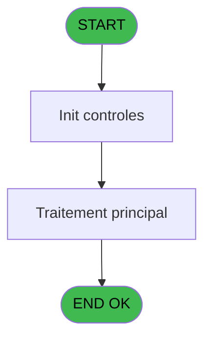
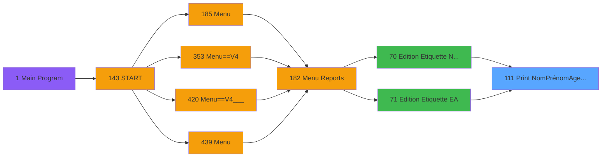

# PVE IDE 111 - Print NomPrénomAge sur TLP2824

> **Analyse**: Phases 1-4 2026-02-03 09:27 -> 09:28 (22s) | Assemblage 09:28
> **Pipeline**: V7.2 Enrichi
> **Structure**: 4 onglets (Resume | Ecrans | Donnees | Connexions)

<!-- TAB:Resume -->

## 1. FICHE D'IDENTITE

| Attribut | Valeur |
|----------|--------|
| Projet | PVE |
| IDE Position | 111 |
| Nom Programme | Print NomPrénomAge sur TLP2824 |
| Fichier source | `Prg_111.xml` |
| Domaine metier | Impression |
| Taches | 3 (1 ecrans visibles) |
| Tables modifiees | 0 |
| Programmes appeles | 0 |

## 2. DESCRIPTION FONCTIONNELLE

**Print NomPrénomAge sur TLP2824** assure la gestion complete de ce processus, accessible depuis [Edition Etiquette NomPrénomAge (IDE 70)](PVE-IDE-70.md), [Edition Etiquette (EA) (IDE 71)](PVE-IDE-71.md).

Le flux de traitement s'organise en **2 blocs fonctionnels** :

- **Traitement** (2 taches) : traitements metier divers
- **Impression** (1 tache) : generation de tickets et documents

Detail : phases du traitement

#### Phase 1 : Traitement (2 taches)

- **111** - (sans nom) **[[ECRAN]](#ecran-t1)**
- **111.2** - Read framing

#### Phase 2 : Impression (1 tache)

- **111.1** - Edition selon copies

## 3. BLOCS FONCTIONNELS

### 3.1 Traitement (2 taches)

Traitements internes.

---

#### 111 - (sans nom) [[ECRAN]](#ecran-t1)

**Role** : Traitement interne.
**Ecran** : 480 x 80 DLU (MDI) | [Voir mockup](#ecran-t1)

---

#### 111.2 - Read framing

**Role** : Traitement : Read framing.

### 3.2 Impression (1 tache)

Generation des documents et tickets.

---

#### 111.1 - Edition selon copies

**Role** : Generation du document : Edition selon copies.
**Variables liees** : E (Param Copies)

## 5. REGLES METIER

*(Aucune regle metier identifiee)*

## 6. CONTEXTE

- **Appele par**: [Edition Etiquette NomPrénomAge (IDE 70)](PVE-IDE-70.md), [Edition Etiquette (EA) (IDE 71)](PVE-IDE-71.md)
- **Appelle**: 0 programmes | **Tables**: 1 (W:0 R:1 L:0) | **Taches**: 3 | **Expressions**: 35

<!-- TAB:Ecrans -->

## 8. ECRANS

### 8.1 Forms visibles (1 / 3)

| # | Position | Tache | Nom | Type | Largeur | Hauteur | Bloc |
|---|----------|-------|-----|------|---------|---------|------|
| 1 | 111 | 111 | (sans nom) | MDI | 480 | 80 | Traitement |

### 8.2 Mockups Ecrans

---

#### 111 - (sans nom)
**Tache** : [111](#t1) | **Type** : MDI | **Dimensions** : 480 x 80 DLU
**Bloc** : Traitement | **Titre IDE** : (sans nom)

<!-- FORM-DATA:
{
    "width":  480,
    "vFactor":  8,
    "type":  "MDI",
    "hFactor":  8,
    "controls":  [
                     {
                         "x":  93,
                         "type":  "label",
                         "var":  "",
                         "y":  18,
                         "w":  296,
                         "fmt":  "",
                         "name":  "",
                         "h":  16,
                         "color":  "187",
                         "text":  "Printing  Label",
                         "parent":  null
                     },
                     {
                         "x":  93,
                         "type":  "label",
                         "var":  "",
                         "y":  50,
                         "w":  296,
                         "fmt":  "",
                         "name":  "",
                         "h":  16,
                         "color":  "187",
                         "text":  "Please wait ...",
                         "parent":  null
                     }
                 ],
    "taskId":  "111",
    "height":  80
}
-->

## 9. NAVIGATION

Ecran unique: ****

### 9.3 Structure hierarchique (3 taches)

| Position | Tache | Type | Dimensions | Bloc |
|----------|-------|------|------------|------|
| **111.1** | [**(sans nom)** (111)](#t1) [mockup](#ecran-t1) | MDI | 480x80 | Traitement |
| 111.1.1 | [Read framing (111.2)](#t3) | MDI | - | |
| **111.2** | [**Edition selon copies** (111.1)](#t2) | MDI | - | Impression |

### 9.4 Algorigramme

> **Legende**: Vert = START/END OK | Rouge = END KO | Bleu = Decisions
> *Algorigramme auto-genere. Utiliser `/algorigramme` pour une synthese metier detaillee.*

<!-- TAB:Donnees -->

## 10. TABLES

### Tables utilisees (1)

| ID | Nom | Description | Type | R | W | L | Usages |
|----|-----|-------------|------|---|---|---|--------|
| 390 | pv_inventory |  | DB | R |   |   | 1 |

### Colonnes par table (0 / 1 tables avec colonnes identifiees)

Table 390 - pv_inventory (R) - 1 usages

*Table utilisee uniquement en Link ou aucune colonne Real identifiee dans le DataView.*

## 11. VARIABLES

### 11.1 Autres (19)

Variables diverses.

| Lettre | Nom | Type | Usage dans |
|--------|-----|------|-----------|
| A | Param ParamActive | Logical | 1x refs |
| B | Param Nom | Alpha | 1x refs |
| C | Param Prenom | Alpha | 4x refs |
| D | Param Age | Alpha | 2x refs |
| E | Param Copies | Numeric | - |
| F | Param Room | Unicode | - |
| G | Param Date fin | Date | - |
| H | _Param TailleSki | Numeric | - |
| I | _Param CAB | Alpha | - |
| J | _Param ClubMed | Alpha | 2x refs |
| K | _Param Village | Alpha | 6x refs |
| L | _Param Copy | Numeric | 6x refs |
| M | _Param X | Numeric | 2x refs |
| N | _Param Y | Numeric | 2x refs |
| O | _Param Speed | Numeric | 9x refs |
| P | _Param Density | Numeric | 10x refs |
| Q | Buf | Alpha | 10x refs |
| R | CR | Alpha | 1x refs |
| S | LF | Alpha | 1x refs |

Toutes les 19 variables (liste complete)

| Cat | Lettre | Nom Variable | Type |
|-----|--------|--------------|------|
| Autre | **A** | Param ParamActive | Logical |
| Autre | **B** | Param Nom | Alpha |
| Autre | **C** | Param Prenom | Alpha |
| Autre | **D** | Param Age | Alpha |
| Autre | **E** | Param Copies | Numeric |
| Autre | **F** | Param Room | Unicode |
| Autre | **G** | Param Date fin | Date |
| Autre | **H** | _Param TailleSki | Numeric |
| Autre | **I** | _Param CAB | Alpha |
| Autre | **J** | _Param ClubMed | Alpha |
| Autre | **K** | _Param Village | Alpha |
| Autre | **L** | _Param Copy | Numeric |
| Autre | **M** | _Param X | Numeric |
| Autre | **N** | _Param Y | Numeric |
| Autre | **O** | _Param Speed | Numeric |
| Autre | **P** | _Param Density | Numeric |
| Autre | **Q** | Buf | Alpha |
| Autre | **R** | CR | Alpha |
| Autre | **S** | LF | Alpha |

## 12. EXPRESSIONS

**35 / 35 expressions decodees (100%)**

### 12.1 Repartition par type

| Type | Expressions | Regles |
|------|-------------|--------|
| CONCATENATION | 8 | 0 |
| CONSTANTE | 13 | 0 |
| FORMAT | 1 | 0 |
| NEGATION | 1 | 0 |
| OTHER | 4 | 0 |
| CONDITION | 7 | 0 |
| CAST_LOGIQUE | 1 | 0 |

### 12.2 Expressions cles par type

#### CONCATENATION (8 expressions)

| Type | IDE | Expression | Regle |
|------|-----|------------|-------|
| CONCATENATION | 7 | `RTrim (_Param Speed [O])&'S'&Str (_Param X [M],'1')&_Param Density [P]&Buf [Q]` | - |
| CONCATENATION | 6 | `RTrim (_Param Speed [O])&'N'&_Param Density [P]&Buf [Q]` | - |
| CONCATENATION | 14 | `RTrim (_Param Speed [O])&'P'&Trim (Str (_Param ClubMed [J],'4'))&_Param Density [P]&Buf [Q]` | - |
| CONCATENATION | 8 | `RTrim (_Param Speed [O])&'D'&Trim (Str (_Param Y [N],'2'))&_Param Density [P]&Buf [Q]` | - |
| CONCATENATION | 10 | `RTrim (_Param Speed [O])&'A'&Str (80+_Param Village [K],'3P0')&','&Str (110+_Param Copy [L],'3P0')&',0,3,2,2,N,"'&Trim (Upper (Param Prenom [C]))&'"'&_Param Density [P]&Buf [Q]` | - |
| ... | | *+3 autres* | |

#### CONSTANTE (13 expressions)

| Type | IDE | Expression | Regle |
|------|-----|------------|-------|
| CONSTANTE | 24 | `0` | - |
| CONSTANTE | 23 | `1` | - |
| CONSTANTE | 22 | `'TEST'` | - |
| CONSTANTE | 27 | `15` | - |
| CONSTANTE | 26 | `4` | - |
| ... | | *+8 autres* | |

#### FORMAT (1 expressions)

| Type | IDE | Expression | Regle |
|------|-----|------------|-------|
| FORMAT | 13 | `RTrim (_Param Speed [O])&'A'&Str (80+_Param Village [K],'3P0')&','&Str (170+_Param Copy [L],'3P0')&',0,3,1,2,N,"'&Trim (Param Age [D])&' ans'&' '&Trim(CR [R])&' '&IF(LF [S]<>'00/00/0000'DATE AND LF [S]<>'01/01/1901'DATE,Trim(DStr(LF [S],'DD/MM/YYYYZ')),'')&'"'&_Param Density [P]&Buf [Q]` | - |

#### NEGATION (1 expressions)

| Type | IDE | Expression | Regle |
|------|-----|------------|-------|
| NEGATION | 1 | `NOT (Param ParamActive [A])` | - |

#### OTHER (4 expressions)

| Type | IDE | Expression | Regle |
|------|-----|------------|-------|
| OTHER | 5 | `_Param Density [P]&Buf [Q]` | - |
| OTHER | 15 | `Delay (5)` | - |
| OTHER | 2 | `ASCIIChr (13)` | - |
| OTHER | 3 | `ASCIIChr (10)` | - |

#### CONDITION (7 expressions)

| Type | IDE | Expression | Regle |
|------|-----|------------|-------|
| CONDITION | 32 | `_Param Y [N]=0` | - |
| CONDITION | 33 | `Len (Trim (Param Prenom [C]))<=10` | - |
| CONDITION | 34 | `Len (Trim (Param Prenom [C]))>10` | - |
| CONDITION | 31 | `_Param X [M]=0` | - |
| CONDITION | 28 | `_Param ClubMed [J]=0` | - |
| ... | | *+2 autres* | |

#### CAST_LOGIQUE (1 expressions)

| Type | IDE | Expression | Regle |
|------|-----|------------|-------|
| CAST_LOGIQUE | 35 | `'FALSE'LOG` | - |

### 12.3 Toutes les expressions (35)

Voir les 35 expressions

#### CONCATENATION (8)

| IDE | Expression Decodee |
|-----|-------------------|
| 9 | `RTrim (_Param Speed [O])&'A'&Str (80+_Param Village [K],'3P0')&','&Str (50+_Param Copy [L],'3P0')&',0,3,1,2,N,"'&Trim (Param Nom [B])&'"'&_Param Density [P]&Buf [Q]` |
| 10 | `RTrim (_Param Speed [O])&'A'&Str (80+_Param Village [K],'3P0')&','&Str (110+_Param Copy [L],'3P0')&',0,3,2,2,N,"'&Trim (Upper (Param Prenom [C]))&'"'&_Param Density [P]&Buf [Q]` |
| 11 | `RTrim (_Param Speed [O])&'A'&Str (80+_Param Village [K],'3P0')&','&Str (110+_Param Copy [L],'3P0')&',0,3,1,2,N,"'&Trim (Upper (Param Prenom [C]))&'"'&_Param Density [P]&Buf [Q]` |
| 12 | `RTrim (_Param Speed [O])&'A'&Str (80+_Param Village [K],'3P0')&','&Str (170+_Param Copy [L],'3P0')&',0,3,1,2,N,"'&Trim (Param Age [D])&' ans'&'"'&_Param Density [P]&Buf [Q]` |
| 6 | `RTrim (_Param Speed [O])&'N'&_Param Density [P]&Buf [Q]` |
| 7 | `RTrim (_Param Speed [O])&'S'&Str (_Param X [M],'1')&_Param Density [P]&Buf [Q]` |
| 8 | `RTrim (_Param Speed [O])&'D'&Trim (Str (_Param Y [N],'2'))&_Param Density [P]&Buf [Q]` |
| 14 | `RTrim (_Param Speed [O])&'P'&Trim (Str (_Param ClubMed [J],'4'))&_Param Density [P]&Buf [Q]` |

#### CONSTANTE (13)

| IDE | Expression Decodee |
|-----|-------------------|
| 4 | `''` |
| 16 | `'NOM ENFANT'` |
| 17 | `'Prenom'` |
| 18 | `'5'` |
| 19 | `180` |
| 20 | `'SKINAME'` |
| 21 | `'CLUB MED'` |
| 22 | `'TEST'` |
| 23 | `1` |
| 24 | `0` |
| 25 | `0` |
| 26 | `4` |
| 27 | `15` |

#### FORMAT (1)

| IDE | Expression Decodee |
|-----|-------------------|
| 13 | `RTrim (_Param Speed [O])&'A'&Str (80+_Param Village [K],'3P0')&','&Str (170+_Param Copy [L],'3P0')&',0,3,1,2,N,"'&Trim (Param Age [D])&' ans'&' '&Trim(CR [R])&' '&IF(LF [S]<>'00/00/0000'DATE AND LF [S]<>'01/01/1901'DATE,Trim(DStr(LF [S],'DD/MM/YYYYZ')),'')&'"'&_Param Density [P]&Buf [Q]` |

#### NEGATION (1)

| IDE | Expression Decodee |
|-----|-------------------|
| 1 | `NOT (Param ParamActive [A])` |

#### OTHER (4)

| IDE | Expression Decodee |
|-----|-------------------|
| 2 | `ASCIIChr (13)` |
| 3 | `ASCIIChr (10)` |
| 5 | `_Param Density [P]&Buf [Q]` |
| 15 | `Delay (5)` |

#### CONDITION (7)

| IDE | Expression Decodee |
|-----|-------------------|
| 28 | `_Param ClubMed [J]=0` |
| 29 | `_Param Village [K]=0` |
| 30 | `_Param Copy [L]=0` |
| 31 | `_Param X [M]=0` |
| 32 | `_Param Y [N]=0` |
| 33 | `Len (Trim (Param Prenom [C]))<=10` |
| 34 | `Len (Trim (Param Prenom [C]))>10` |

#### CAST_LOGIQUE (1)

| IDE | Expression Decodee |
|-----|-------------------|
| 35 | `'FALSE'LOG` |

<!-- TAB:Connexions -->

## 13. GRAPHE D'APPELS

### 13.1 Chaine depuis Main (Callers)

Main -> ... -> [Edition Etiquette NomPrénomAge (IDE 70)](PVE-IDE-70.md) -> **Print NomPrénomAge sur TLP2824 (IDE 111)**

Main -> ... -> [Edition Etiquette (EA) (IDE 71)](PVE-IDE-71.md) -> **Print NomPrénomAge sur TLP2824 (IDE 111)**

### 13.2 Callers

| IDE | Nom Programme | Nb Appels |
|-----|---------------|-----------|
| [70](PVE-IDE-70.md) | Edition Etiquette NomPrénomAge | 4 |
| [71](PVE-IDE-71.md) | Edition Etiquette (EA) | 2 |

### 13.3 Callees (programmes appeles)

### 13.4 Detail Callees avec contexte

| IDE | Nom Programme | Appels | Contexte |
|-----|---------------|--------|----------|
| - | (aucun) | - | - |

## 14. RECOMMANDATIONS MIGRATION

### 14.1 Profil du programme

| Metrique | Valeur | Impact migration |
|----------|--------|-----------------|
| Lignes de logique | 82 | Programme compact |
| Expressions | 35 | Peu de logique |
| Tables WRITE | 0 | Impact faible |
| Sous-programmes | 0 | Peu de dependances |
| Ecrans visibles | 1 | Ecran unique ou traitement batch |
| Code desactive | 1.2% (1 / 82) | Code sain |
| Regles metier | 0 | Pas de regle identifiee |

### 14.2 Plan de migration par bloc

#### Traitement (2 taches: 1 ecran, 1 traitement)

- **Strategie** : Orchestrateur avec 1 ecrans (Razor/React) et 1 traitements backend (services).
- Les ecrans deviennent des composants UI, les traitements invisibles deviennent des services injectables.
- Decomposer les taches en services unitaires testables.

#### Impression (1 tache: 0 ecran, 1 traitement)

- **Strategie** : Templates HTML -> PDF via wkhtmltopdf ou Puppeteer.
- `PrintService` injectable avec choix imprimante

### 14.3 Dependances critiques

| Dependance | Type | Appels | Impact |
|------------|------|--------|--------|

---
*Spec DETAILED generee par Pipeline V7.2 - 2026-02-03 09:28*
