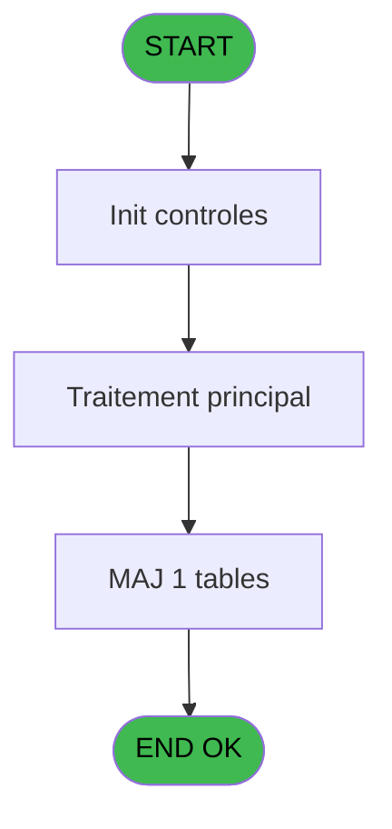
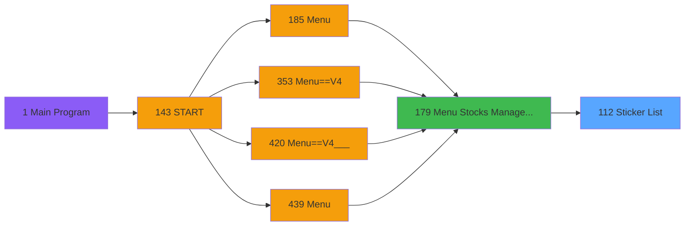
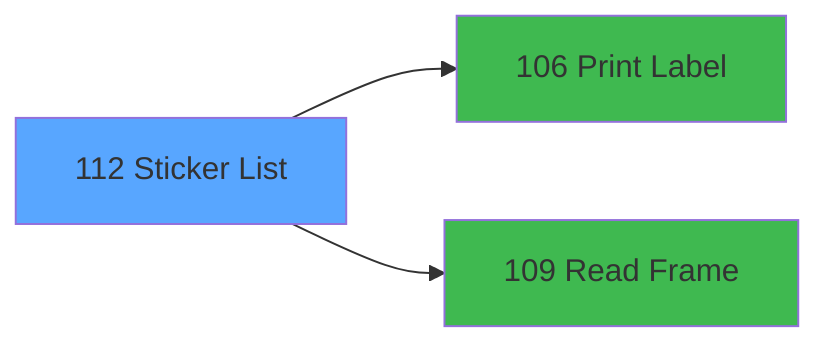

# PVE IDE 112 - Sticker List

> **Analyse**: Phases 1-4 2026-02-03 09:28 -> 09:28 (20s) | Assemblage 09:28
> **Pipeline**: V7.2 Enrichi
> **Structure**: 4 onglets (Resume | Ecrans | Donnees | Connexions)

<!-- TAB:Resume -->

## 1. FICHE D'IDENTITE

| Attribut | Valeur |
|----------|--------|
| Projet | PVE |
| IDE Position | 112 |
| Nom Programme | Sticker List |
| Fichier source | `Prg_112.xml` |
| Domaine metier | General |
| Taches | 3 (1 ecrans visibles) |
| Tables modifiees | 1 |
| Programmes appeles | 2 |

## 2. DESCRIPTION FONCTIONNELLE

**Sticker List** assure la gestion complete de ce processus, accessible depuis [Menu Stocks Management (IDE 179)](PVE-IDE-179.md).

Le flux de traitement s'organise en **3 blocs fonctionnels** :

- **Traitement** (1 tache) : traitements metier divers
- **Impression** (1 tache) : generation de tickets et documents
- **Calcul** (1 tache) : calculs de montants, stocks ou compteurs

**Donnees modifiees** : 1 tables en ecriture (tranche_age_taxe).

**Logique metier** : 1 regles identifiees couvrant conditions metier.

Detail : phases du traitement

#### Phase 1 : Calcul (1 tache)

- **112** - Stock Stickers **[[ECRAN]](#ecran-t2)**

#### Phase 2 : Impression (1 tache)

- **112.1** - Print Stickers

Delegue a : [Print Label (IDE 106)](PVE-IDE-106.md)

#### Phase 3 : Traitement (1 tache)

- **112.1.1** - Village

Delegue a : [Read Frame (IDE 109)](PVE-IDE-109.md)

#### Tables impactees

| Table | Operations | Role metier |
|-------|-----------|-------------|
| tranche_age_taxe | **W**/L (2 usages) |  |

## 3. BLOCS FONCTIONNELS

### 3.1 Calcul (1 tache)

Calculs metier : montants, stocks, compteurs.

---

#### 112 - Stock Stickers [[ECRAN]](#ecran-t2)

**Role** : Calcul : Stock Stickers.
**Ecran** : 540 x 392 DLU (MDI) | [Voir mockup](#ecran-t2)

### 3.2 Impression (1 tache)

Generation des documents et tickets.

---

#### 112.1 - Print Stickers

**Role** : Generation du document : Print Stickers.
**Delegue a** : [Print Label (IDE 106)](PVE-IDE-106.md)

### 3.3 Traitement (1 tache)

Traitements internes.

---

#### 112.1.1 - Village

**Role** : Traitement : Village.
**Delegue a** : [Read Frame (IDE 109)](PVE-IDE-109.md)

## 5. REGLES METIER

1 regles identifiees:

### Autres (1 regles)

#### [RM-001] Si [V]='O' alors 6 sinon 3)

| Element | Detail |
|---------|--------|
| **Condition** | `[V]='O'` |
| **Si vrai** | 6 |
| **Si faux** | 3) |
| **Expression source** | Expression 11 : `IF([V]='O',6,3)` |
| **Exemple** | Si [V]='O' → 6. Sinon → 3) |

## 6. CONTEXTE

- **Appele par**: [Menu Stocks Management (IDE 179)](PVE-IDE-179.md)
- **Appelle**: 2 programmes | **Tables**: 5 (W:1 R:2 L:3) | **Taches**: 3 | **Expressions**: 15

<!-- TAB:Ecrans -->

## 8. ECRANS

### 8.1 Forms visibles (1 / 3)

| # | Position | Tache | Nom | Type | Largeur | Hauteur | Bloc |
|---|----------|-------|-----|------|---------|---------|------|
| 1 | 112.1 | 112 | Stock Stickers | MDI | 540 | 392 | Calcul |

### 8.2 Mockups Ecrans

---

#### 112.1 - Stock Stickers
**Tache** : [112](#t2) | **Type** : MDI | **Dimensions** : 540 x 392 DLU
**Bloc** : Calcul | **Titre IDE** : Stock Stickers

<!-- FORM-DATA:
{
    "width":  540,
    "vFactor":  8,
    "type":  "MDI",
    "hFactor":  4,
    "controls":  [
                     {
                         "x":  2,
                         "type":  "label",
                         "var":  "",
                         "y":  0,
                         "w":  537,
                         "fmt":  "",
                         "name":  "",
                         "h":  43,
                         "color":  "188",
                         "text":  "",
                         "parent":  null
                     },
                     {
                         "x":  22,
                         "type":  "label",
                         "var":  "",
                         "y":  11,
                         "w":  52,
                         "fmt":  "",
                         "name":  "",
                         "h":  14,
                         "color":  "183",
                         "text":  "Filters :",
                         "parent":  1
                     },
                     {
                         "x":  156,
                         "type":  "label",
                         "var":  "",
                         "y":  18,
                         "w":  233,
                         "fmt":  "",
                         "name":  "",
                         "h":  14,
                         "color":  "188",
                         "text":  "STICKERS MANAGEMENT",
                         "parent":  1
                     },
                     {
                         "x":  8,
                         "type":  "table",
                         "var":  "",
                         "name":  "",
                         "titleH":  24,
                         "color":  "110",
                         "w":  494,
                         "y":  50,
                         "fmt":  "",
                         "parent":  null,
                         "text":  "",
                         "rowH":  21,
                         "h":  294,
                         "cols":  [
                                      {
                                          "title":  "Category",
                                          "layer":  1,
                                          "w":  124
                                      },
                                      {
                                          "title":  "Sub category",
                                          "layer":  2,
                                          "w":  126
                                      },
                                      {
                                          "title":  "Product",
                                          "layer":  3,
                                          "w":  131
                                      },
                                      {
                                          "title":  "Bar Code",
                                          "layer":  4,
                                          "w":  73
                                      },
                                      {
                                          "title":  "Quantity",
                                          "layer":  5,
                                          "w":  37
                                      }
                                  ],
                         "rows":  5
                     },
                     {
                         "x":  0,
                         "type":  "label",
                         "var":  "",
                         "y":  359,
                         "w":  537,
                         "fmt":  "",
                         "name":  "",
                         "h":  33,
                         "color":  "6",
                         "text":  "",
                         "parent":  null
                     },
                     {
                         "x":  12,
                         "type":  "edit",
                         "var":  "",
                         "y":  77,
                         "w":  118,
                         "fmt":  "",
                         "name":  "V Category",
                         "h":  16,
                         "color":  "6",
                         "text":  "",
                         "parent":  9
                     },
                     {
                         "x":  137,
                         "type":  "edit",
                         "var":  "",
                         "y":  77,
                         "w":  119,
                         "fmt":  "",
                         "name":  "V S/Category",
                         "h":  16,
                         "color":  "6",
                         "text":  "",
                         "parent":  9
                     },
                     {
                         "x":  264,
                         "type":  "edit",
                         "var":  "",
                         "y":  77,
                         "w":  121,
                         "fmt":  "",
                         "name":  "CTRL_001",
                         "h":  16,
                         "color":  "6",
                         "text":  "",
                         "parent":  9
                     },
                     {
                         "x":  392,
                         "type":  "edit",
                         "var":  "",
                         "y":  77,
                         "w":  70,
                         "fmt":  "6P0",
                         "name":  "BarCode",
                         "h":  16,
                         "color":  "6",
                         "text":  "",
                         "parent":  9
                     },
                     {
                         "x":  466,
                         "type":  "edit",
                         "var":  "",
                         "y":  77,
                         "w":  34,
                         "fmt":  "3",
                         "name":  "Quantity",
                         "h":  16,
                         "color":  "6",
                         "text":  "",
                         "parent":  9
                     },
                     {
                         "x":  490,
                         "type":  "image",
                         "var":  "",
                         "y":  8,
                         "w":  48,
                         "fmt":  "",
                         "name":  "",
                         "h":  35,
                         "color":  "",
                         "text":  "",
                         "parent":  1
                     },
                     {
                         "x":  503,
                         "type":  "button",
                         "var":  "",
                         "y":  51,
                         "w":  32,
                         "fmt":  "ñ",
                         "name":  "",
                         "h":  145,
                         "color":  "",
                         "text":  "",
                         "parent":  null
                     },
                     {
                         "x":  503,
                         "type":  "button",
                         "var":  "",
                         "y":  196,
                         "w":  32,
                         "fmt":  "ò",
                         "name":  "",
                         "h":  149,
                         "color":  "",
                         "text":  "",
                         "parent":  null
                     },
                     {
                         "x":  2,
                         "type":  "button",
                         "var":  "",
                         "y":  364,
                         "w":  86,
                         "fmt":  "\u0026Validate",
                         "name":  "VALIDATE",
                         "h":  28,
                         "color":  "",
                         "text":  "",
                         "parent":  null
                     },
                     {
                         "x":  448,
                         "type":  "button",
                         "var":  "",
                         "y":  364,
                         "w":  87,
                         "fmt":  "\u0026Exit",
                         "name":  "",
                         "h":  28,
                         "color":  "",
                         "text":  "",
                         "parent":  null
                     },
                     {
                         "x":  22,
                         "type":  "combobox",
                         "var":  "",
                         "y":  25,
                         "w":  95,
                         "fmt":  "",
                         "name":  "V.Combo article Actif",
                         "h":  12,
                         "color":  "183",
                         "text":  "A,O,N",
                         "parent":  null
                     }
                 ],
    "taskId":  "112.1",
    "height":  392
}
-->

<strong>Champs : 6 champs</strong>

| Pos (x,y) | Nom | Variable | Type |
|-----------|-----|----------|------|
| 12,77 | V Category | - | edit |
| 137,77 | V S/Category | - | edit |
| 264,77 | CTRL_001 | - | edit |
| 392,77 | BarCode | - | edit |
| 466,77 | Quantity | - | edit |
| 22,25 | V.Combo article Actif | - | combobox |

<strong>Boutons : 4 boutons</strong>

| Bouton | Pos (x,y) | Action |
|--------|-----------|--------|
| ñ | 503,51 | Bouton fonctionnel |
| ò | 503,196 | Bouton fonctionnel |
| Validate | 2,364 | Valide la saisie et enregistre |
| Exit | 448,364 | Quitte le programme |

## 9. NAVIGATION

Ecran unique: **Stock Stickers**

### 9.3 Structure hierarchique (3 taches)

| Position | Tache | Type | Dimensions | Bloc |
|----------|-------|------|------------|------|
| **112.1** | [**Stock Stickers** (112)](#t2) [mockup](#ecran-t2) | MDI | 540x392 | Calcul |
| **112.2** | [**Print Stickers** (112.1)](#t22) | - | - | Impression |
| **112.3** | [**Village** (112.1.1)](#t25) | MDI | - | Traitement |

### 9.4 Algorigramme

> **Legende**: Vert = START/END OK | Rouge = END KO | Bleu = Decisions
> *Algorigramme auto-genere. Utiliser `/algorigramme` pour une synthese metier detaillee.*

<!-- TAB:Donnees -->

## 10. TABLES

### Tables utilisees (5)

| ID | Nom | Description | Type | R | W | L | Usages |
|----|-----|-------------|------|---|---|---|--------|
| 27 | donnees_village__dvi |  | DB | R |   |   | 1 |
| 379 | pv_customer_temp |  | DB | R |   |   | 1 |
| 403 | pv_sellers |  | DB |   |   | L | 1 |
| 413 | pv_tva |  | DB |   |   | L | 1 |
| 795 | tranche_age_taxe |  | DB |   | **W** | L | 2 |

### Colonnes par table (3 / 3 tables avec colonnes identifiees)

Table 27 - donnees_village__dvi (R) - 1 usages

| Lettre | Variable | Acces | Type |
|--------|----------|-------|------|
| C | v.Village | R | Alpha |

Table 379 - pv_customer_temp (R) - 1 usages

| Lettre | Variable | Acces | Type |
|--------|----------|-------|------|
| A | BP. Historic | R | Alpha |
| B | BP. Input movement | R | Alpha |
| C | BP. Input inventory | R | Alpha |
| D | L Preview | R | Logical |
| E | V Category | R | Alpha |
| F | V S/Category | R | Alpha |
| G | v.Code Barre | R | Numeric |
| H | V.Combo article Actif | R | Unicode |
| I | CHG_REASON_V.Combo article Act | R | Numeric |
| J | CHG_PRV_V.Combo article Actif | R | Unicode |

Table 795 - tranche_age_taxe (**W**/L) - 2 usages

| Lettre | Variable | Acces | Type |
|--------|----------|-------|------|
| A | X | W | Numeric |
| B | Y | W | Numeric |
| C | v.Village | W | Alpha |

## 11. VARIABLES

### 11.1 Variables de session (4)

Variables persistantes pendant toute la session.

| Lettre | Nom | Type | Usage dans |
|--------|-----|------|-----------|
| E | V Category | Alpha | 1x session |
| F | V S/Category | Alpha | 3x session |
| G | v.Code Barre | Numeric | 3x session |
| H | V.Combo article Actif | Unicode | 2x session |

### 11.2 Autres (6)

Variables diverses.

| Lettre | Nom | Type | Usage dans |
|--------|-----|------|-----------|
| A | BP. Historic | Alpha | - |
| B | BP. Input movement | Alpha | - |
| C | BP. Input inventory | Alpha | - |
| D | L Preview | Logical | - |
| I | CHG_REASON_V.Combo article Act | Numeric | - |
| J | CHG_PRV_V.Combo article Actif | Unicode | - |

## 12. EXPRESSIONS

**15 / 15 expressions decodees (100%)**

### 12.1 Repartition par type

| Type | Expressions | Regles |
|------|-------------|--------|
| CONCATENATION | 2 | 0 |
| CALCULATION | 1 | 0 |
| CONDITION | 2 | 5 |
| CONSTANTE | 4 | 0 |
| OTHER | 5 | 0 |
| CAST_LOGIQUE | 1 | 0 |

### 12.2 Expressions cles par type

#### CONCATENATION (2 expressions)

| Type | IDE | Expression | Regle |
|------|-----|------------|-------|
| CONCATENATION | 6 | `Str (v.Code Barre [G],'2P0')&' - '&[P]` | - |
| CONCATENATION | 4 | `Str (V S/Category [F],'2P0')&' - '&[K]` | - |

#### CALCULATION (1 expressions)

| Type | IDE | Expression | Regle |
|------|-----|------------|-------|
| CALCULATION | 15 | `V S/Category [F]*10000+v.Code Barre [G]*100+V.Combo article Actif [H]` | - |

#### CONDITION (2 expressions)

| Type | IDE | Expression | Regle |
|------|-----|------------|-------|
| CONDITION | 11 | `IF([V]='O',6,3)` | [RM-001](#rm-RM-001) |
| CONDITION | 13 | `CndRange([AJ]<>'A' AND [AJ]<>'',[AJ])` | - |

#### CONSTANTE (4 expressions)

| Type | IDE | Expression | Regle |
|------|-----|------------|-------|
| CONSTANTE | 10 | `'&Input In&ventory'` | - |
| CONSTANTE | 12 | `'A'` | - |
| CONSTANTE | 8 | `'&Historic'` | - |
| CONSTANTE | 9 | `'&Input movement'` | - |

#### OTHER (5 expressions)

| Type | IDE | Expression | Regle |
|------|-----|------------|-------|
| OTHER | 5 | `v.Code Barre [G]` | - |
| OTHER | 14 | `V.Combo article Actif [H]` | - |
| OTHER | 3 | `V S/Category [F]` | - |
| OTHER | 1 | `GetParam ('SERVICE')` | - |
| OTHER | 2 | `V Category [E]` | - |

#### CAST_LOGIQUE (1 expressions)

| Type | IDE | Expression | Regle |
|------|-----|------------|-------|
| CAST_LOGIQUE | 7 | `'FALSE'LOG` | - |

<!-- TAB:Connexions -->

## 13. GRAPHE D'APPELS

### 13.1 Chaine depuis Main (Callers)

Main -> ... -> [Menu Stocks Management (IDE 179)](PVE-IDE-179.md) -> **Sticker List (IDE 112)**

### 13.2 Callers

| IDE | Nom Programme | Nb Appels |
|-----|---------------|-----------|
| [179](PVE-IDE-179.md) | Menu Stocks Management | 1 |

### 13.3 Callees (programmes appeles)

### 13.4 Detail Callees avec contexte

| IDE | Nom Programme | Appels | Contexte |
|-----|---------------|--------|----------|
| [106](PVE-IDE-106.md) | Print Label | 1 | Impression ticket/document |
| [109](PVE-IDE-109.md) | Read Frame | 1 | Sous-programme |

## 14. RECOMMANDATIONS MIGRATION

### 14.1 Profil du programme

| Metrique | Valeur | Impact migration |
|----------|--------|-----------------|
| Lignes de logique | 64 | Programme compact |
| Expressions | 15 | Peu de logique |
| Tables WRITE | 1 | Impact faible |
| Sous-programmes | 2 | Peu de dependances |
| Ecrans visibles | 1 | Ecran unique ou traitement batch |
| Code desactive | 0% (0 / 64) | Code sain |
| Regles metier | 1 | Quelques regles a preserver |

### 14.2 Plan de migration par bloc

#### Calcul (1 tache: 1 ecran, 0 traitement)

- **Strategie** : Services de calcul purs (Domain Services).
- Migrer la logique de calcul (stock, compteurs, montants)

#### Impression (1 tache: 0 ecran, 1 traitement)

- **Strategie** : Templates HTML -> PDF via wkhtmltopdf ou Puppeteer.
- `PrintService` injectable avec choix imprimante

#### Traitement (1 tache: 0 ecran, 1 traitement)

- **Strategie** : 1 service(s) backend injectable(s) (Domain Services).
- 2 sous-programme(s) a migrer ou a reutiliser depuis les services existants.
- Decomposer les taches en services unitaires testables.

### 14.3 Dependances critiques

| Dependance | Type | Appels | Impact |
|------------|------|--------|--------|
| tranche_age_taxe | Table WRITE (Database) | 1x | Schema + repository |
| [Read Frame (IDE 109)](PVE-IDE-109.md) | Sous-programme | 1x | Normale - Sous-programme |
| [Print Label (IDE 106)](PVE-IDE-106.md) | Sous-programme | 1x | Normale - Impression ticket/document |

---
*Spec DETAILED generee par Pipeline V7.2 - 2026-02-03 09:28*
