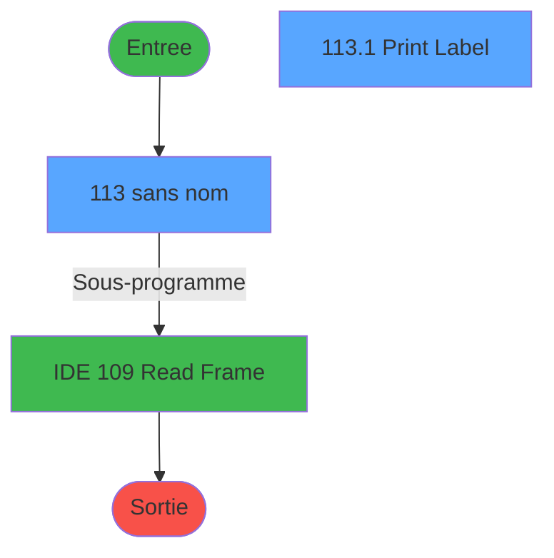
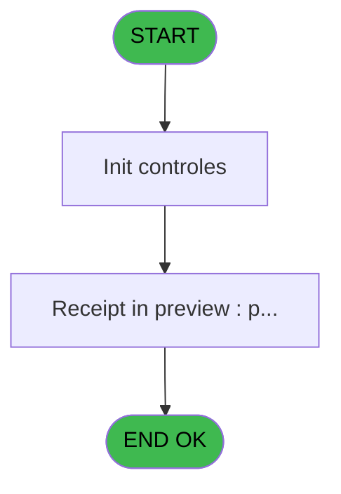
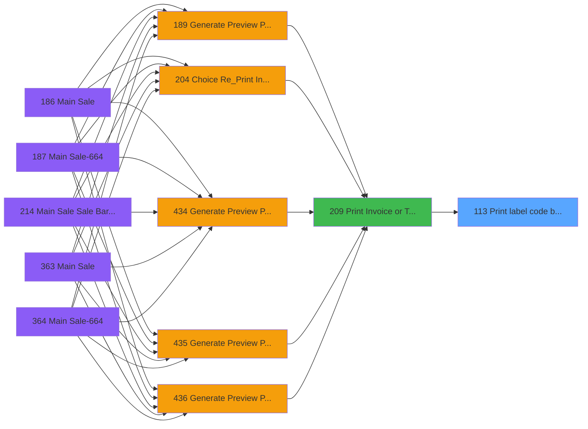

# PVE IDE 113 - Print label code barre DIN

> **Analyse**: Phases 1-4 2026-02-03 09:28 -> 09:29 (19s) | Assemblage 09:29
> **Pipeline**: V7.2 Enrichi
> **Structure**: 4 onglets (Resume | Ecrans | Donnees | Connexions)

<!-- TAB:Resume -->

## 1. FICHE D'IDENTITE

| Attribut | Valeur |
|----------|--------|
| Projet | PVE |
| IDE Position | 113 |
| Nom Programme | Print label code barre DIN |
| Fichier source | `Prg_113.xml` |
| Domaine metier | Impression |
| Taches | 2 (2 ecrans visibles) |
| Tables modifiees | 0 |
| Programmes appeles | 1 |

## 2. DESCRIPTION FONCTIONNELLE

**Print label code barre DIN** assure la gestion complete de ce processus, accessible depuis [Print Invoice or Ticket-664 (IDE 209)](PVE-IDE-209.md).

Le flux de traitement s'organise en **2 blocs fonctionnels** :

- **Impression** (1 tache) : generation de tickets et documents
- **Traitement** (1 tache) : traitements metier divers

Detail : phases du traitement

#### Phase 1 : Traitement (1 tache)

- **113** - (sans nom) **[[ECRAN]](#ecran-t1)**

Delegue a : [Read Frame (IDE 109)](PVE-IDE-109.md)

#### Phase 2 : Impression (1 tache)

- **113.1** - Print Label **[[ECRAN]](#ecran-t2)**

## 3. BLOCS FONCTIONNELS

### 3.1 Traitement (1 tache)

Traitements internes.

---

#### 113 - (sans nom) [[ECRAN]](#ecran-t1)

**Role** : Traitement interne.
**Ecran** : 480 x 80 DLU (MDI) | [Voir mockup](#ecran-t1)
**Delegue a** : [Read Frame (IDE 109)](PVE-IDE-109.md)

### 3.2 Impression (1 tache)

Generation des documents et tickets.

---

#### 113.1 - Print Label [[ECRAN]](#ecran-t2)

**Role** : Generation du document : Print Label.
**Ecran** : 314 x 235 DLU (MDI) | [Voir mockup](#ecran-t2)

## 5. REGLES METIER

*(Aucune regle metier identifiee)*

## 6. CONTEXTE

- **Appele par**: [Print Invoice or Ticket-664 (IDE 209)](PVE-IDE-209.md)
- **Appelle**: 1 programmes | **Tables**: 0 (W:0 R:0 L:0) | **Taches**: 2 | **Expressions**: 24

<!-- TAB:Ecrans -->

## 8. ECRANS

### 8.1 Forms visibles (2 / 2)

| # | Position | Tache | Nom | Type | Largeur | Hauteur | Bloc |
|---|----------|-------|-----|------|---------|---------|------|
| 1 | 113 | 113 | (sans nom) | MDI | 480 | 80 | Traitement |
| 2 | 113.1 | 113.1 | Print Label | MDI | 314 | 235 | Impression |

### 8.2 Mockups Ecrans

---

#### 113 - (sans nom)
**Tache** : [113](#t1) | **Type** : MDI | **Dimensions** : 480 x 80 DLU
**Bloc** : Traitement | **Titre IDE** : (sans nom)

<!-- FORM-DATA:
{
    "width":  480,
    "vFactor":  8,
    "type":  "MDI",
    "hFactor":  8,
    "controls":  [
                     {
                         "x":  93,
                         "type":  "label",
                         "var":  "",
                         "y":  18,
                         "w":  296,
                         "fmt":  "",
                         "name":  "",
                         "h":  16,
                         "color":  "187",
                         "text":  "Printing  Label",
                         "parent":  null
                     },
                     {
                         "x":  93,
                         "type":  "label",
                         "var":  "",
                         "y":  50,
                         "w":  296,
                         "fmt":  "",
                         "name":  "",
                         "h":  16,
                         "color":  "187",
                         "text":  "Please wait ...",
                         "parent":  null
                     }
                 ],
    "taskId":  "113",
    "height":  80
}
-->

---

#### 113.1 - Print Label
**Tache** : [113.1](#t2) | **Type** : MDI | **Dimensions** : 314 x 235 DLU
**Bloc** : Impression | **Titre IDE** : Print Label

<!-- FORM-DATA:
{
    "width":  314,
    "vFactor":  8,
    "type":  "MDI",
    "hFactor":  4,
    "controls":  [
                     {
                         "x":  0,
                         "type":  "label",
                         "var":  "",
                         "y":  0,
                         "w":  312,
                         "fmt":  "",
                         "name":  "",
                         "h":  42,
                         "color":  "182",
                         "text":  "",
                         "parent":  null
                     },
                     {
                         "x":  8,
                         "type":  "label",
                         "var":  "",
                         "y":  15,
                         "w":  251,
                         "fmt":  "",
                         "name":  "",
                         "h":  10,
                         "color":  "186",
                         "text":  "Does receipt \"in preview\" require a label to be printed?",
                         "parent":  1
                     },
                     {
                         "x":  35,
                         "type":  "label",
                         "var":  "",
                         "y":  53,
                         "w":  240,
                         "fmt":  "",
                         "name":  "",
                         "h":  135,
                         "color":  "183",
                         "text":  "",
                         "parent":  null
                     },
                     {
                         "x":  98,
                         "type":  "label",
                         "var":  "",
                         "y":  116,
                         "w":  79,
                         "fmt":  "",
                         "name":  "",
                         "h":  19,
                         "color":  "183",
                         "text":  "Don\u0027t print a label",
                         "parent":  4
                     },
                     {
                         "x":  0,
                         "type":  "label",
                         "var":  "",
                         "y":  199,
                         "w":  312,
                         "fmt":  "",
                         "name":  "",
                         "h":  34,
                         "color":  "6",
                         "text":  "",
                         "parent":  null
                     },
                     {
                         "x":  40,
                         "type":  "image",
                         "var":  "",
                         "y":  60,
                         "w":  56,
                         "fmt":  "",
                         "name":  "",
                         "h":  42,
                         "color":  "29",
                         "text":  "",
                         "parent":  4
                     },
                     {
                         "x":  242,
                         "type":  "button",
                         "var":  "",
                         "y":  204,
                         "w":  68,
                         "fmt":  "\u0026Continue",
                         "name":  "",
                         "h":  28,
                         "color":  "",
                         "text":  "",
                         "parent":  null
                     },
                     {
                         "x":  262,
                         "type":  "image",
                         "var":  "",
                         "y":  4,
                         "w":  48,
                         "fmt":  "",
                         "name":  "",
                         "h":  37,
                         "color":  "",
                         "text":  "",
                         "parent":  1
                     },
                     {
                         "x":  174,
                         "type":  "checkbox",
                         "var":  "",
                         "y":  116,
                         "w":  26,
                         "fmt":  "",
                         "name":  "Print Preview",
                         "h":  19,
                         "color":  "183",
                         "text":  "",
                         "parent":  null
                     }
                 ],
    "taskId":  "113.1",
    "height":  235
}
-->

<strong>Champs : 1 champs</strong>

| Pos (x,y) | Nom | Variable | Type |
|-----------|-----|----------|------|
| 174,116 | Print Preview | - | checkbox |

<strong>Boutons : 1 boutons</strong>

| Bouton | Pos (x,y) | Action |
|--------|-----------|--------|
| Continue | 242,204 | Bouton fonctionnel |

## 9. NAVIGATION

### 9.1 Enchainement des ecrans

**Detail par enchainement :**

| Depuis | Action | Vers | Retour |
|--------|--------|------|--------|
|  | Sous-programme | [Read Frame (IDE 109)](PVE-IDE-109.md) | Retour ecran |

### 9.3 Structure hierarchique (2 taches)

| Position | Tache | Type | Dimensions | Bloc |
|----------|-------|------|------------|------|
| **113.1** | [**(sans nom)** (113)](#t1) [mockup](#ecran-t1) | MDI | 480x80 | Traitement |
| **113.2** | [**Print Label** (113.1)](#t2) [mockup](#ecran-t2) | MDI | 314x235 | Impression |

### 9.4 Algorigramme

> **Legende**: Vert = START/END OK | Rouge = END KO | Bleu = Decisions
> *Algorigramme auto-genere. Utiliser `/algorigramme` pour une synthese metier detaillee.*

<!-- TAB:Donnees -->

## 10. TABLES

### Tables utilisees (0)

| ID | Nom | Description | Type | R | W | L | Usages |
|----|-----|-------------|------|---|---|---|--------|

### Colonnes par table (0 / 0 tables avec colonnes identifiees)

## 11. VARIABLES

### 11.1 Parametres entrants (5)

Variables recues du programme appelant ([Print Invoice or Ticket-664 (IDE 209)](PVE-IDE-209.md)).

| Lettre | Nom | Type | Usage dans |
|--------|-----|------|-----------|
| A | P.i.receipt in preview | Logical | 1x parametre entrant |
| B | P.i.# de copies (0 => 1 copie) | Numeric | - |
| C | P.i.Nom_gm | Alpha | 4x parametre entrant |
| D | P.i.Prenom_gm | Alpha | 2x parametre entrant |
| E | P.i.DIN | Numeric | 1x parametre entrant |

### 11.2 Variables de session (9)

Variables persistantes pendant toute la session.

| Lettre | Nom | Type | Usage dans |
|--------|-----|------|-----------|
| F | v.X | Numeric | 6x session |
| G | v.left (x) | Numeric | 5x session |
| H | v.Y | Numeric | 6x session |
| I | v.Buf | Alpha | 10x session |
| J | v.CR | Alpha | 11x session |
| K | v.LF | Alpha | 11x session |
| L | v.Speed | Numeric | 1x session |
| M | v.Density | Numeric | 1x session |
| N | v.NE PAS imprimer etiquette | Logical | - |

## 12. EXPRESSIONS

**24 / 24 expressions decodees (100%)**

### 12.1 Repartition par type

| Type | Expressions | Regles |
|------|-------------|--------|
| CONCATENATION | 10 | 0 |
| CONSTANTE | 5 | 0 |
| OTHER | 5 | 0 |
| CONDITION | 2 | 0 |
| CAST_LOGIQUE | 1 | 0 |
| NEGATION | 1 | 0 |

### 12.2 Expressions cles par type

#### CONCATENATION (10 expressions)

| Type | IDE | Expression | Regle |
|------|-----|------------|-------|
| CONCATENATION | 5 | `RTrim (v.Buf [I])&'N'&v.CR [J]&v.LF [K]` | - |
| CONCATENATION | 13 | `RTrim (v.Buf [I])&'A'&Str (190+v.X [F],'3P0')&','&Str (95+v.Y [H],'3P0')&',0,3,2,3,N,"'&Trim (Str (P.i.DIN [E],'3.3Z'))&'"'&v.CR [J]&v.LF [K]` | - |
| CONCATENATION | 6 | `RTrim (v.Buf [I])&'S'&Str (v.Speed [L],'1')&v.CR [J]&v.LF [K]` | - |
| CONCATENATION | 14 | `RTrim (v.Buf [I])&'P'&Trim (Str (P.i.# de copies (0 => ... [B],'4'))&v.CR [J]&v.LF [K]` | - |
| CONCATENATION | 7 | `RTrim (v.Buf [I])&'D'&Trim (Str (v.Density [M],'2'))&v.CR [J]&v.LF [K]` | - |
| ... | | *+5 autres* | |

#### CONSTANTE (5 expressions)

| Type | IDE | Expression | Regle |
|------|-----|------------|-------|
| CONSTANTE | 18 | `15` | - |
| CONSTANTE | 24 | `105` | - |
| CONSTANTE | 17 | `4` | - |
| CONSTANTE | 3 | `''` | - |
| CONSTANTE | 16 | `1` | - |

#### OTHER (5 expressions)

| Type | IDE | Expression | Regle |
|------|-----|------------|-------|
| OTHER | 15 | `Delay (5)` | - |
| OTHER | 21 | `P.i.receipt in preview [A]` | - |
| OTHER | 4 | `v.CR [J]&v.LF [K]` | - |
| OTHER | 1 | `ASCIIChr (13)` | - |
| OTHER | 2 | `ASCIIChr (10)` | - |

#### CONDITION (2 expressions)

| Type | IDE | Expression | Regle |
|------|-----|------------|-------|
| CONDITION | 20 | `Len(Trim(P.i.Nom_gm [C]))>14` | - |
| CONDITION | 19 | `P.i.# de copies (0 => ... [B]=0` | - |

#### CAST_LOGIQUE (1 expressions)

| Type | IDE | Expression | Regle |
|------|-----|------------|-------|
| CAST_LOGIQUE | 22 | `'FALSE'LOG` | - |

#### NEGATION (1 expressions)

| Type | IDE | Expression | Regle |
|------|-----|------------|-------|
| NEGATION | 23 | `NOT v.NE PAS imprimer etiq... [N]` | - |

### 12.3 Toutes les expressions (24)

Voir les 24 expressions

#### CONCATENATION (10)

| IDE | Expression Decodee |
|-----|-------------------|
| 8 | `RTrim (v.Buf [I])&'A'&Str (v.left (x) [G]+v.X [F],'3P0')&','&Str (25+v.Y [H],'3P0')&',0,1,1,1,N,"'&Trim (Left(P.i.Nom_gm [C],23))&'"'&v.CR [J]&v.LF [K]` |
| 9 | `RTrim (v.Buf [I])&'A'&Str (v.left (x) [G]+v.X [F],'3P0')&','&Str (25+v.Y [H],'3P0')&',0,4,1,1,N,"'&Trim (P.i.Nom_gm [C])&'"'&v.CR [J]&v.LF [K]` |
| 10 | `RTrim (v.Buf [I])&'A'&Str (v.left (x) [G]+v.X [F],'3P0')&','&Str (60+v.Y [H],'3P0')&',0,1,1,1,N,"'& Trim(MID(Trim(P.i.Nom_gm [C]),24,6)&' '&Trim (P.i.Prenom_gm [D]))&'"'&v.CR [J]&v.LF [K]` |
| 11 | `RTrim (v.Buf [I])&'A'&Str (v.left (x) [G]+v.X [F],'3P0')&','&Str (60+v.Y [H],'3P0')&',0,4,1,1,N,"'&Trim (P.i.Prenom_gm [D])&'"'&v.CR [J]&v.LF [K]` |
| 12 | `RTrim (v.Buf [I])&'A'&Str (v.left (x) [G]+v.X [F],'3P0')&','&Str (115+v.Y [H],'3P0')&',0,4,1,1,N,"'&'DIN = '&'"'&v.CR [J]&v.LF [K]` |
| 13 | `RTrim (v.Buf [I])&'A'&Str (190+v.X [F],'3P0')&','&Str (95+v.Y [H],'3P0')&',0,3,2,3,N,"'&Trim (Str (P.i.DIN [E],'3.3Z'))&'"'&v.CR [J]&v.LF [K]` |
| 5 | `RTrim (v.Buf [I])&'N'&v.CR [J]&v.LF [K]` |
| 6 | `RTrim (v.Buf [I])&'S'&Str (v.Speed [L],'1')&v.CR [J]&v.LF [K]` |
| 7 | `RTrim (v.Buf [I])&'D'&Trim (Str (v.Density [M],'2'))&v.CR [J]&v.LF [K]` |
| 14 | `RTrim (v.Buf [I])&'P'&Trim (Str (P.i.# de copies (0 => ... [B],'4'))&v.CR [J]&v.LF [K]` |

#### CONSTANTE (5)

| IDE | Expression Decodee |
|-----|-------------------|
| 3 | `''` |
| 16 | `1` |
| 17 | `4` |
| 18 | `15` |
| 24 | `105` |

#### OTHER (5)

| IDE | Expression Decodee |
|-----|-------------------|
| 1 | `ASCIIChr (13)` |
| 2 | `ASCIIChr (10)` |
| 4 | `v.CR [J]&v.LF [K]` |
| 15 | `Delay (5)` |
| 21 | `P.i.receipt in preview [A]` |

#### CONDITION (2)

| IDE | Expression Decodee |
|-----|-------------------|
| 19 | `P.i.# de copies (0 => ... [B]=0` |
| 20 | `Len(Trim(P.i.Nom_gm [C]))>14` |

#### CAST_LOGIQUE (1)

| IDE | Expression Decodee |
|-----|-------------------|
| 22 | `'FALSE'LOG` |

#### NEGATION (1)

| IDE | Expression Decodee |
|-----|-------------------|
| 23 | `NOT v.NE PAS imprimer etiq... [N]` |

<!-- TAB:Connexions -->

## 13. GRAPHE D'APPELS

### 13.1 Chaine depuis Main (Callers)

Main -> ... -> [Print Invoice or Ticket-664 (IDE 209)](PVE-IDE-209.md) -> **Print label code barre DIN (IDE 113)**

### 13.2 Callers

| IDE | Nom Programme | Nb Appels |
|-----|---------------|-----------|
| [209](PVE-IDE-209.md) | Print Invoice or Ticket-664 | 1 |

### 13.3 Callees (programmes appeles)

### 13.4 Detail Callees avec contexte

| IDE | Nom Programme | Appels | Contexte |
|-----|---------------|--------|----------|
| [109](PVE-IDE-109.md) | Read Frame | 1 | Sous-programme |

## 14. RECOMMANDATIONS MIGRATION

### 14.1 Profil du programme

| Metrique | Valeur | Impact migration |
|----------|--------|-----------------|
| Lignes de logique | 59 | Programme compact |
| Expressions | 24 | Peu de logique |
| Tables WRITE | 0 | Impact faible |
| Sous-programmes | 1 | Peu de dependances |
| Ecrans visibles | 2 | Quelques ecrans |
| Code desactive | 0% (0 / 59) | Code sain |
| Regles metier | 0 | Pas de regle identifiee |

### 14.2 Plan de migration par bloc

#### Traitement (1 tache: 1 ecran, 0 traitement)

- **Strategie** : 1 composant(s) UI (Razor/React) avec formulaires et validation.
- 1 sous-programme(s) a migrer ou a reutiliser depuis les services existants.
- Decomposer les taches en services unitaires testables.

#### Impression (1 tache: 1 ecran, 0 traitement)

- **Strategie** : Templates HTML -> PDF via wkhtmltopdf ou Puppeteer.
- `PrintService` injectable avec choix imprimante

### 14.3 Dependances critiques

| Dependance | Type | Appels | Impact |
|------------|------|--------|--------|
| [Read Frame (IDE 109)](PVE-IDE-109.md) | Sous-programme | 1x | Normale - Sous-programme |

---
*Spec DETAILED generee par Pipeline V7.2 - 2026-02-03 09:29*
