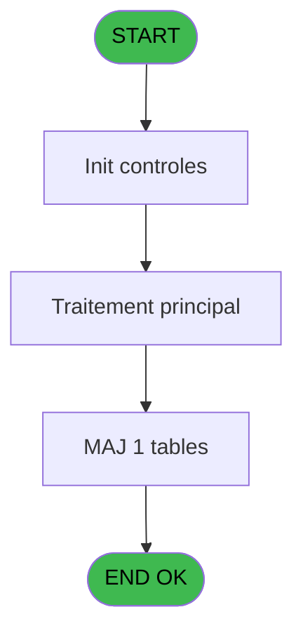
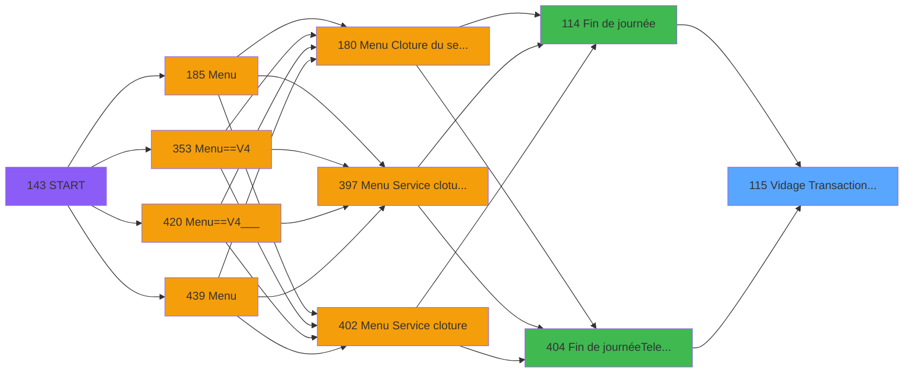

# PVE IDE 115 - Vidage Transactions en attente

> **Analyse**: Phases 1-4 2026-02-03 09:29 -> 09:30 (19s) | Assemblage 09:30
> **Pipeline**: V7.2 Enrichi
> **Structure**: 4 onglets (Resume | Ecrans | Donnees | Connexions)

<!-- TAB:Resume -->

## 1. FICHE D'IDENTITE

| Attribut | Valeur |
|----------|--------|
| Projet | PVE |
| IDE Position | 115 |
| Nom Programme | Vidage Transactions en attente |
| Fichier source | `Prg_115.xml` |
| Domaine metier | Ventes |
| Taches | 2 (0 ecrans visibles) |
| Tables modifiees | 1 |
| Programmes appeles | 0 |

## 2. DESCRIPTION FONCTIONNELLE

**Vidage Transactions en attente** assure la gestion complete de ce processus, accessible depuis [Fin de journée (IDE 114)](PVE-IDE-114.md), [Fin de journée(Telecollecte) (IDE 404)](PVE-IDE-404.md).

Le flux de traitement s'organise en **2 blocs fonctionnels** :

- **Creation** (1 tache) : insertion d'enregistrements en base (mouvements, prestations)
- **Saisie** (1 tache) : ecrans de saisie utilisateur (formulaires, champs, donnees)

**Donnees modifiees** : 1 tables en ecriture (comptable________cte).

Detail : phases du traitement

#### Phase 1 : Saisie (1 tache)

- **115** - Vidage Transactions en attente

#### Phase 2 : Creation (1 tache)

- **115.1** - Creation 18

#### Tables impactees

| Table | Operations | Role metier |
|-------|-----------|-------------|
| comptable________cte | **W** (1 usages) |  |

## 3. BLOCS FONCTIONNELS

### 3.1 Saisie (1 tache)

Ce bloc traite la saisie des donnees de la transaction.

---

#### 115 - Vidage Transactions en attente

**Role** : Saisie des donnees : Vidage Transactions en attente.

### 3.2 Creation (1 tache)

Insertion de nouveaux enregistrements en base.

---

#### 115.1 - Creation 18

**Role** : Creation d'enregistrement : Creation 18.

## 5. REGLES METIER

*(Aucune regle metier identifiee)*

## 6. CONTEXTE

- **Appele par**: [Fin de journée (IDE 114)](PVE-IDE-114.md), [Fin de journée(Telecollecte) (IDE 404)](PVE-IDE-404.md)
- **Appelle**: 0 programmes | **Tables**: 3 (W:1 R:1 L:1) | **Taches**: 2 | **Expressions**: 5

<!-- TAB:Ecrans -->

## 8. ECRANS

*(Programme sans ecran visible)*

## 9. NAVIGATION

### 9.3 Structure hierarchique (2 taches)

| Position | Tache | Type | Dimensions | Bloc |
|----------|-------|------|------------|------|
| **115.1** | [**Vidage Transactions en attente** (115)](#t1) | MDI | - | Saisie |
| **115.2** | [**Creation 18** (115.1)](#t2) | MDI | - | Creation |

### 9.4 Algorigramme

> **Legende**: Vert = START/END OK | Rouge = END KO | Bleu = Decisions
> *Algorigramme auto-genere. Utiliser `/algorigramme` pour une synthese metier detaillee.*

<!-- TAB:Donnees -->

## 10. TABLES

### Tables utilisees (3)

| ID | Nom | Description | Type | R | W | L | Usages |
|----|-----|-------------|------|---|---|---|--------|
| 30 | gm-recherche_____gmr | Index de recherche | DB | R |   |   | 1 |
| 40 | comptable________cte |  | DB |   | **W** |   | 1 |
| 173 | intermed_compta__ite |  | DB |   |   | L | 1 |

### Colonnes par table (3 / 2 tables avec colonnes identifiees)

Table 30 - gm-recherche_____gmr (R) - 1 usages

| Lettre | Variable | Acces | Type |
|--------|----------|-------|------|
| A | P. Date comptable | R | Date |
| B | L Compte GM | R | Logical |

Table 40 - comptable________cte (**W**) - 1 usages

| Lettre | Variable | Acces | Type |
|--------|----------|-------|------|
| A | P. Date comptable | W | Date |

## 11. VARIABLES

### 11.1 Parametres entrants (1)

Variables recues du programme appelant ([Fin de journée (IDE 114)](PVE-IDE-114.md)).

| Lettre | Nom | Type | Usage dans |
|--------|-----|------|-----------|
| A | P. Date comptable | Date | - |

### 11.2 Autres (1)

Variables diverses.

| Lettre | Nom | Type | Usage dans |
|--------|-----|------|-----------|
| B | L Compte GM | Logical | 1x refs |

## 12. EXPRESSIONS

**5 / 5 expressions decodees (100%)**

### 12.1 Repartition par type

| Type | Expressions | Regles |
|------|-------------|--------|
| OTHER | 5 | 0 |

### 12.2 Expressions cles par type

#### OTHER (5 expressions)

| Type | IDE | Expression | Regle |
|------|-----|------------|-------|
| OTHER | 4 | `Stat (0,'M'MODE) AND [W]` | - |
| OTHER | 5 | `[W]` | - |
| OTHER | 3 | `[D]` | - |
| OTHER | 1 | `L Compte GM [B]` | - |
| OTHER | 2 | `[C]` | - |

<!-- TAB:Connexions -->

## 13. GRAPHE D'APPELS

### 13.1 Chaine depuis Main (Callers)

Main -> ... -> [Fin de journée (IDE 114)](PVE-IDE-114.md) -> **Vidage Transactions en attente (IDE 115)**

Main -> ... -> [Fin de journée(Telecollecte) (IDE 404)](PVE-IDE-404.md) -> **Vidage Transactions en attente (IDE 115)**

### 13.2 Callers

| IDE | Nom Programme | Nb Appels |
|-----|---------------|-----------|
| [114](PVE-IDE-114.md) | Fin de journée | 1 |
| [404](PVE-IDE-404.md) | Fin de journée(Telecollecte) | 1 |

### 13.3 Callees (programmes appeles)

### 13.4 Detail Callees avec contexte

| IDE | Nom Programme | Appels | Contexte |
|-----|---------------|--------|----------|
| - | (aucun) | - | - |

## 14. RECOMMANDATIONS MIGRATION

### 14.1 Profil du programme

| Metrique | Valeur | Impact migration |
|----------|--------|-----------------|
| Lignes de logique | 56 | Programme compact |
| Expressions | 5 | Peu de logique |
| Tables WRITE | 1 | Impact faible |
| Sous-programmes | 0 | Peu de dependances |
| Ecrans visibles | 0 | Ecran unique ou traitement batch |
| Code desactive | 0% (0 / 56) | Code sain |
| Regles metier | 0 | Pas de regle identifiee |

### 14.2 Plan de migration par bloc

#### Saisie (1 tache: 0 ecran, 1 traitement)

- **Strategie** : Formulaire React/Blazor avec validation Zod/FluentValidation.
- Validation temps reel cote client + serveur

#### Creation (1 tache: 0 ecran, 1 traitement)

- **Strategie** : Repository pattern avec Entity Framework Core.
- Insertion via `IRepository<T>.CreateAsync()`

### 14.3 Dependances critiques

| Dependance | Type | Appels | Impact |
|------------|------|--------|--------|
| comptable________cte | Table WRITE (Database) | 1x | Schema + repository |

---
*Spec DETAILED generee par Pipeline V7.2 - 2026-02-03 09:30*
