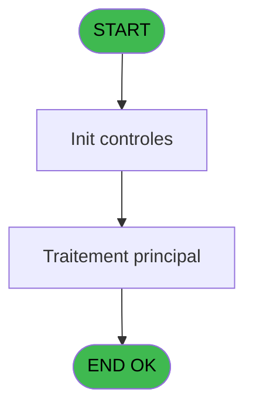
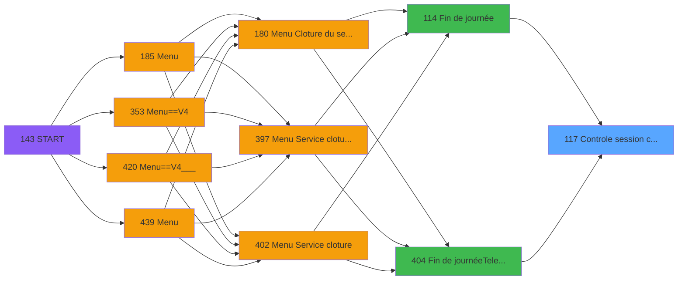

# PVE IDE 117 - Controle session caisse

> **Analyse**: Phases 1-4 2026-02-03 09:30 -> 09:31 (18s) | Assemblage 09:31
> **Pipeline**: V7.2 Enrichi
> **Structure**: 4 onglets (Resume | Ecrans | Donnees | Connexions)

<!-- TAB:Resume -->

## 1. FICHE D'IDENTITE

| Attribut | Valeur |
|----------|--------|
| Projet | PVE |
| IDE Position | 117 |
| Nom Programme | Controle session caisse |
| Fichier source | `Prg_117.xml` |
| Domaine metier | Caisse |
| Taches | 3 (0 ecrans visibles) |
| Tables modifiees | 0 |
| Programmes appeles | 0 |

## 2. DESCRIPTION FONCTIONNELLE

**Controle session caisse** assure la gestion complete de ce processus, accessible depuis [Fin de journée (IDE 114)](PVE-IDE-114.md), [Fin de journée(Telecollecte) (IDE 404)](PVE-IDE-404.md).

Le flux de traitement s'organise en **1 blocs fonctionnels** :

- **Traitement** (3 taches) : traitements metier divers

## 3. BLOCS FONCTIONNELS

### 3.1 Traitement (3 taches)

Traitements internes.

---

#### 117 - Control session

**Role** : Traitement : Control session.

---

#### 117.1 - Control session

**Role** : Traitement : Control session.

---

#### 117.2 - Control session

**Role** : Traitement : Control session.

## 5. REGLES METIER

*(Aucune regle metier identifiee)*

## 6. CONTEXTE

- **Appele par**: [Fin de journée (IDE 114)](PVE-IDE-114.md), [Fin de journée(Telecollecte) (IDE 404)](PVE-IDE-404.md)
- **Appelle**: 0 programmes | **Tables**: 2 (W:0 R:1 L:1) | **Taches**: 3 | **Expressions**: 2

<!-- TAB:Ecrans -->

## 8. ECRANS

*(Programme sans ecran visible)*

## 9. NAVIGATION

### 9.3 Structure hierarchique (3 taches)

| Position | Tache | Type | Dimensions | Bloc |
|----------|-------|------|------------|------|
| **117.1** | [**Control session** (117)](#t1) | MDI | - | Traitement |
| 117.1.1 | [Control session (117.1)](#t2) | MDI | - | |
| 117.1.2 | [Control session (117.2)](#t3) | MDI | - | |

### 9.4 Algorigramme

> **Legende**: Vert = START/END OK | Rouge = END KO | Bleu = Decisions
> *Algorigramme auto-genere. Utiliser `/algorigramme` pour une synthese metier detaillee.*

<!-- TAB:Donnees -->

## 10. TABLES

### Tables utilisees (2)

| ID | Nom | Description | Type | R | W | L | Usages |
|----|-----|-------------|------|---|---|---|--------|
| 246 | histo_sessions_caisse | Sessions de caisse | DB | R |   |   | 2 |
| 249 | histo_sessions_caisse_detail | Sessions de caisse | DB |   |   | L | 2 |

### Colonnes par table (2 / 1 tables avec colonnes identifiees)

Table 246 - histo_sessions_caisse (R) - 2 usages

| Lettre | Variable | Acces | Type |
|--------|----------|-------|------|
| A | CAISSE OUVERTE | R | Logical |
| B | CAISSE REC AVEC FDR | R | Logical |

## 11. VARIABLES

### 11.1 Parametres entrants (1)

Variables recues du programme appelant ([Fin de journée (IDE 114)](PVE-IDE-114.md)).

| Lettre | Nom | Type | Usage dans |
|--------|-----|------|-----------|
| A | p.o.Déjà connecté | Logical | - |

### 11.2 Autres (1)

Variables diverses.

| Lettre | Nom | Type | Usage dans |
|--------|-----|------|-----------|
| B | CAISSE REC AVEC FDR | Logical | - |

## 12. EXPRESSIONS

**2 / 2 expressions decodees (100%)**

### 12.1 Repartition par type

| Type | Expressions | Regles |
|------|-------------|--------|
| NEGATION | 1 | 0 |
| REFERENCE_VG | 1 | 0 |

### 12.2 Expressions cles par type

#### NEGATION (1 expressions)

| Type | IDE | Expression | Regle |
|------|-----|------------|-------|
| NEGATION | 1 | `NOT VG104` | - |

#### REFERENCE_VG (1 expressions)

| Type | IDE | Expression | Regle |
|------|-----|------------|-------|
| REFERENCE_VG | 2 | `VG104` | - |

<!-- TAB:Connexions -->

## 13. GRAPHE D'APPELS

### 13.1 Chaine depuis Main (Callers)

Main -> ... -> [Fin de journée (IDE 114)](PVE-IDE-114.md) -> **Controle session caisse (IDE 117)**

Main -> ... -> [Fin de journée(Telecollecte) (IDE 404)](PVE-IDE-404.md) -> **Controle session caisse (IDE 117)**

### 13.2 Callers

| IDE | Nom Programme | Nb Appels |
|-----|---------------|-----------|
| [114](PVE-IDE-114.md) | Fin de journée | 1 |
| [404](PVE-IDE-404.md) | Fin de journée(Telecollecte) | 1 |

### 13.3 Callees (programmes appeles)

### 13.4 Detail Callees avec contexte

| IDE | Nom Programme | Appels | Contexte |
|-----|---------------|--------|----------|
| - | (aucun) | - | - |

## 14. RECOMMANDATIONS MIGRATION

### 14.1 Profil du programme

| Metrique | Valeur | Impact migration |
|----------|--------|-----------------|
| Lignes de logique | 116 | Programme compact |
| Expressions | 2 | Peu de logique |
| Tables WRITE | 0 | Impact faible |
| Sous-programmes | 0 | Peu de dependances |
| Ecrans visibles | 0 | Ecran unique ou traitement batch |
| Code desactive | 0% (0 / 116) | Code sain |
| Regles metier | 0 | Pas de regle identifiee |

### 14.2 Plan de migration par bloc

#### Traitement (3 taches: 0 ecran, 3 traitements)

- **Strategie** : 3 service(s) backend injectable(s) (Domain Services).
- Decomposer les taches en services unitaires testables.

### 14.3 Dependances critiques

| Dependance | Type | Appels | Impact |
|------------|------|--------|--------|

---
*Spec DETAILED generee par Pipeline V7.2 - 2026-02-03 09:31*
