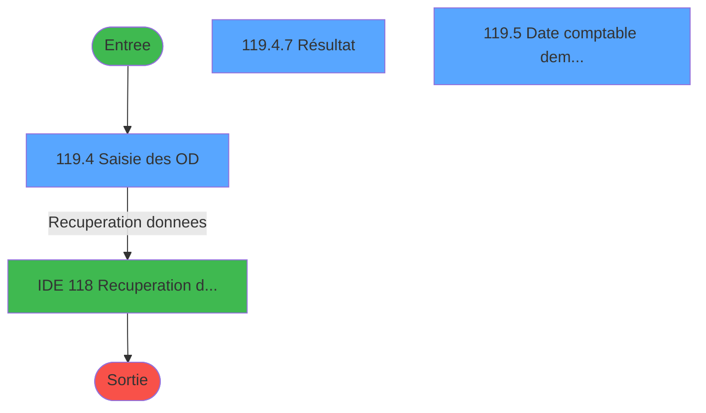
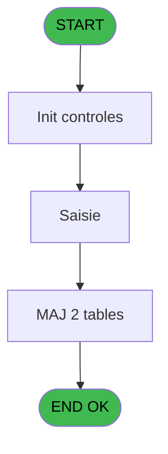
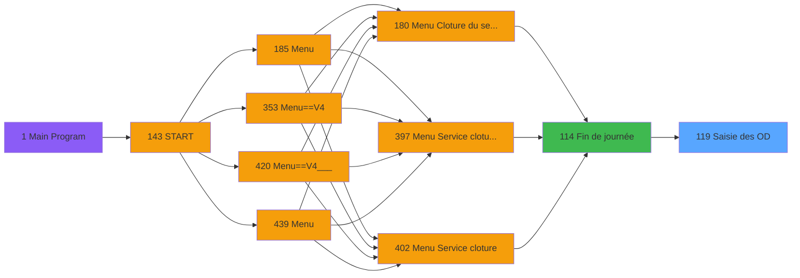
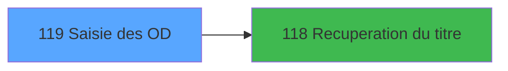

# PVE IDE 119 - Saisie des OD

> **Analyse**: Phases 1-4 2026-02-03 09:31 -> 09:31 (17s) | Assemblage 09:32
> **Pipeline**: V7.2 Enrichi
> **Structure**: 4 onglets (Resume | Ecrans | Donnees | Connexions)

<!-- TAB:Resume -->

## 1. FICHE D'IDENTITE

| Attribut | Valeur |
|----------|--------|
| Projet | PVE |
| IDE Position | 119 |
| Nom Programme | Saisie des OD |
| Fichier source | `Prg_119.xml` |
| Domaine metier | General |
| Taches | 21 (3 ecrans visibles) |
| Tables modifiees | 2 |
| Programmes appeles | 1 |

## 2. DESCRIPTION FONCTIONNELLE

**Saisie des OD** assure la gestion complete de ce processus, accessible depuis [Fin de journée (IDE 114)](PVE-IDE-114.md).

Le flux de traitement s'organise en **5 blocs fonctionnels** :

- **Calcul** (7 taches) : calculs de montants, stocks ou compteurs
- **Traitement** (6 taches) : traitements metier divers
- **Saisie** (4 taches) : ecrans de saisie utilisateur (formulaires, champs, donnees)
- **Initialisation** (3 taches) : reinitialisation d'etats et de variables de travail
- **Validation** (1 tache) : controles et verifications de coherence

**Donnees modifiees** : 2 tables en ecriture (total_od, saisie_od_par_service).

Detail : phases du traitement

#### Phase 1 : Saisie (4 taches)

- **119** - Saisie des tickets TPE 251
- **119.4** - Saisie des OD **[[ECRAN]](#ecran-t7)**
- **119.4.5** - montant saisie
- **119.4.5.1** - total saisie

#### Phase 2 : Traitement (6 taches)

- **119.1** - param caisse
- **119.2.1** - Chargement OD
- **119.3.1** - Chargement OD
- **119.4.6** - Ecart
- **119.4.7** - Résultat **[[ECRAN]](#ecran-t18)**
- **119.5.1.1** - secu pour abandon

Delegue a : [Recuperation du titre (IDE 118)](PVE-IDE-118.md)

#### Phase 3 : Initialisation (3 taches)

- **119.2** - Initialisation
- **119.3** - Initialisation
- **119.4.1** - Raz

#### Phase 4 : Calcul (7 taches)

- **119.4.2** - montant calcul
- **119.4.2.1** - total calculé
- **119.4.3** - montant calcul
- **119.4.3.1** - total calculé
- **119.4.4** - montant calcul bout
- **119.4.4.1** - total calculé
- **119.5** - Date comptable demandée **[[ECRAN]](#ecran-t19)**

#### Phase 5 : Validation (1 tache)

- **119.5.1** - Validation

#### Tables impactees

| Table | Operations | Role metier |
|-------|-----------|-------------|
| total_od | **W**/L (8 usages) |  |
| saisie_od_par_service | R/**W** (5 usages) | Services / filieres |

## 3. BLOCS FONCTIONNELS

### 3.1 Saisie (4 taches)

L'operateur saisit les donnees de la transaction via 1 ecran (Saisie des OD).

---

#### 119 - Saisie des tickets TPE 251

**Role** : Saisie des donnees : Saisie des tickets TPE 251.

3 sous-taches directes

| Tache | Nom | Bloc |
|-------|-----|------|
| [119.4](#t7) | Saisie des OD **[[ECRAN]](#ecran-t7)** | Saisie |
| [119.4.5](#t15) | montant saisie | Saisie |
| [119.4.5.1](#t16) | total saisie | Saisie |

---

#### 119.4 - Saisie des OD [[ECRAN]](#ecran-t7)

**Role** : Saisie des donnees : Saisie des OD.
**Ecran** : 1123 x 0 DLU (MDI) | [Voir mockup](#ecran-t7)

---

#### 119.4.5 - montant saisie

**Role** : Saisie des donnees : montant saisie.
**Variables liees** : L (v montant secu od)

---

#### 119.4.5.1 - total saisie

**Role** : Saisie des donnees : total saisie.

### 3.2 Traitement (6 taches)

Traitements internes.

---

#### 119.1 - param caisse

**Role** : Traitement : param caisse.
**Variables liees** : A (Param societe), B (Param date comptable), C (Param masque), D (Param code service), E (Param ecart corrigé)
**Delegue a** : [Recuperation du titre (IDE 118)](PVE-IDE-118.md)

---

#### 119.2.1 - Chargement OD

**Role** : Traitement : Chargement OD.
**Delegue a** : [Recuperation du titre (IDE 118)](PVE-IDE-118.md)

---

#### 119.3.1 - Chargement OD

**Role** : Traitement : Chargement OD.
**Delegue a** : [Recuperation du titre (IDE 118)](PVE-IDE-118.md)

---

#### 119.4.6 - Ecart

**Role** : Traitement : Ecart.
**Variables liees** : J (v existe ecart), E (Param ecart corrigé)
**Delegue a** : [Recuperation du titre (IDE 118)](PVE-IDE-118.md)

---

#### 119.4.7 - Résultat [[ECRAN]](#ecran-t18)

**Role** : Traitement : Résultat.
**Ecran** : 1125 x 201 DLU (MDI) | [Voir mockup](#ecran-t18)
**Delegue a** : [Recuperation du titre (IDE 118)](PVE-IDE-118.md)

---

#### 119.5.1.1 - secu pour abandon

**Role** : Traitement : secu pour abandon.
**Variables liees** : L (v montant secu od)
**Delegue a** : [Recuperation du titre (IDE 118)](PVE-IDE-118.md)

### 3.3 Initialisation (3 taches)

Reinitialisation d'etats et variables de travail.

---

#### 119.2 - Initialisation

**Role** : Reinitialisation : Initialisation.

---

#### 119.3 - Initialisation

**Role** : Reinitialisation : Initialisation.

---

#### 119.4.1 - Raz

**Role** : Reinitialisation des variables de travail.

### 3.4 Calcul (7 taches)

Calculs metier : montants, stocks, compteurs.

---

#### 119.4.2 - montant calcul

**Role** : Calcul : montant calcul.
**Variables liees** : L (v montant secu od)

---

#### 119.4.2.1 - total calculé

**Role** : Calcul : total calculé.

---

#### 119.4.3 - montant calcul

**Role** : Calcul : montant calcul.
**Variables liees** : L (v montant secu od)

---

#### 119.4.3.1 - total calculé

**Role** : Calcul : total calculé.

---

#### 119.4.4 - montant calcul bout

**Role** : Calcul : montant calcul bout.
**Variables liees** : K (v imputation boutique), L (v montant secu od), G (Param est un poste BOUT)

---

#### 119.4.4.1 - total calculé

**Role** : Calcul : total calculé.

---

#### 119.5 - Date comptable demandée [[ECRAN]](#ecran-t19)

**Role** : Traitement : Date comptable demandée.
**Ecran** : 562 x 201 DLU (MDI) | [Voir mockup](#ecran-t19)
**Variables liees** : B (Param date comptable), F (Param date demandée)

### 3.5 Validation (1 tache)

Controles de coherence : 1 tache verifie les donnees et conditions.

---

#### 119.5.1 - Validation

**Role** : Verification : Validation.

## 5. REGLES METIER

*(Aucune regle metier identifiee)*

## 6. CONTEXTE

- **Appele par**: [Fin de journée (IDE 114)](PVE-IDE-114.md)
- **Appelle**: 1 programmes | **Tables**: 6 (W:2 R:5 L:2) | **Taches**: 21 | **Expressions**: 7

<!-- TAB:Ecrans -->

## 8. ECRANS

### 8.1 Forms visibles (3 / 21)

| # | Position | Tache | Nom | Type | Largeur | Hauteur | Bloc |
|---|----------|-------|-----|------|---------|---------|------|
| 1 | 119.4 | 119.4 | Saisie des OD | MDI | 1123 | 0 | Saisie |
| 2 | 119.4.7 | 119.4.7 | Résultat | MDI | 1125 | 201 | Traitement |
| 3 | 119.5 | 119.5 | Date comptable demandée | MDI | 562 | 201 | Calcul |

### 8.2 Mockups Ecrans

---

#### 119.4 - Saisie des OD
**Tache** : [119.4](#t7) | **Type** : MDI | **Dimensions** : 1123 x 0 DLU
**Bloc** : Saisie | **Titre IDE** : Saisie des OD

<!-- FORM-DATA:
{
    "width":  1123,
    "vFactor":  8,
    "type":  "MDI",
    "hFactor":  8,
    "controls":  [
                     {
                         "x":  2,
                         "type":  "label",
                         "var":  "",
                         "y":  1,
                         "w":  1116,
                         "fmt":  "",
                         "name":  "",
                         "h":  18,
                         "color":  "",
                         "text":  "",
                         "parent":  null
                     },
                     {
                         "x":  383,
                         "type":  "label",
                         "var":  "",
                         "y":  22,
                         "w":  190,
                         "fmt":  "",
                         "name":  "",
                         "h":  10,
                         "color":  "7",
                         "text":  "Date comptable",
                         "parent":  null
                     },
                     {
                         "x":  387,
                         "type":  "label",
                         "var":  "",
                         "y":  68,
                         "w":  70,
                         "fmt":  "",
                         "name":  "",
                         "h":  8,
                         "color":  "",
                         "text":  "Montant",
                         "parent":  null
                     },
                     {
                         "x":  2,
                         "type":  "label",
                         "var":  "",
                         "y":  175,
                         "w":  1116,
                         "fmt":  "",
                         "name":  "",
                         "h":  24,
                         "color":  "",
                         "text":  "",
                         "parent":  null
                     },
                     {
                         "x":  459,
                         "type":  "edit",
                         "var":  "",
                         "y":  68,
                         "w":  221,
                         "fmt":  "N## ### ### ###.###Z",
                         "name":  "",
                         "h":  8,
                         "color":  "",
                         "text":  "",
                         "parent":  null
                     },
                     {
                         "x":  893,
                         "type":  "edit",
                         "var":  "",
                         "y":  6,
                         "w":  216,
                         "fmt":  "WWW  DD MMM YYYYT",
                         "name":  "",
                         "h":  8,
                         "color":  "",
                         "text":  "",
                         "parent":  null
                     },
                     {
                         "x":  581,
                         "type":  "edit",
                         "var":  "",
                         "y":  22,
                         "w":  158,
                         "fmt":  "",
                         "name":  "",
                         "h":  10,
                         "color":  "7",
                         "text":  "",
                         "parent":  null
                     },
                     {
                         "x":  940,
                         "type":  "button",
                         "var":  "",
                         "y":  178,
                         "w":  154,
                         "fmt":  "\u0026Continue",
                         "name":  "",
                         "h":  18,
                         "color":  "",
                         "text":  "",
                         "parent":  null
                     },
                     {
                         "x":  6,
                         "type":  "edit",
                         "var":  "",
                         "y":  6,
                         "w":  384,
                         "fmt":  "30",
                         "name":  "",
                         "h":  8,
                         "color":  "",
                         "text":  "",
                         "parent":  null
                     }
                 ],
    "taskId":  "119.4",
    "height":  0
}
-->

<strong>Champs : 4 champs</strong>

| Pos (x,y) | Nom | Variable | Type |
|-----------|-----|----------|------|
| 459,68 | N## ### ### ###.###Z | - | edit |
| 893,6 | WWW  DD MMM YYYYT | - | edit |
| 581,22 | (sans nom) | - | edit |
| 6,6 | 30 | - | edit |

<strong>Boutons : 1 boutons</strong>

| Bouton | Pos (x,y) | Action |
|--------|-----------|--------|
| Continue | 940,178 | Bouton fonctionnel |

---

#### 119.4.7 - Résultat
**Tache** : [119.4.7](#t18) | **Type** : MDI | **Dimensions** : 1125 x 201 DLU
**Bloc** : Traitement | **Titre IDE** : Résultat

<!-- FORM-DATA:
{
    "width":  1125,
    "vFactor":  8,
    "type":  "MDI",
    "hFactor":  8,
    "controls":  [
                     {
                         "x":  3,
                         "type":  "label",
                         "var":  "",
                         "y":  2,
                         "w":  1116,
                         "fmt":  "",
                         "name":  "",
                         "h":  18,
                         "color":  "",
                         "text":  "",
                         "parent":  null
                     },
                     {
                         "x":  461,
                         "type":  "label",
                         "var":  "",
                         "y":  150,
                         "w":  200,
                         "fmt":  "",
                         "name":  "",
                         "h":  10,
                         "color":  "144",
                         "text":  "Aucun écart",
                         "parent":  null
                     },
                     {
                         "x":  3,
                         "type":  "label",
                         "var":  "",
                         "y":  175,
                         "w":  1116,
                         "fmt":  "",
                         "name":  "",
                         "h":  24,
                         "color":  "",
                         "text":  "",
                         "parent":  null
                     },
                     {
                         "x":  321,
                         "type":  "label",
                         "var":  "",
                         "y":  178,
                         "w":  480,
                         "fmt":  "",
                         "name":  "",
                         "h":  18,
                         "color":  "144",
                         "text":  "ATTENTION ECART",
                         "parent":  null
                     },
                     {
                         "x":  70,
                         "type":  "table",
                         "var":  "",
                         "name":  "",
                         "titleH":  12,
                         "color":  "110",
                         "w":  950,
                         "y":  38,
                         "fmt":  "",
                         "parent":  null,
                         "text":  "",
                         "rowH":  13,
                         "h":  103,
                         "cols":  [
                                      {
                                          "title":  "MOP",
                                          "layer":  1,
                                          "w":  65
                                      },
                                      {
                                          "title":  "Libellé",
                                          "layer":  2,
                                          "w":  250
                                      },
                                      {
                                          "title":  "Montant calculé",
                                          "layer":  3,
                                          "w":  233
                                      },
                                      {
                                          "title":  "Montant saisi",
                                          "layer":  4,
                                          "w":  233
                                      },
                                      {
                                          "title":  "Ecart",
                                          "layer":  5,
                                          "w":  138
                                      }
                                  ],
                         "rows":  5
                     },
                     {
                         "x":  77,
                         "type":  "edit",
                         "var":  "",
                         "y":  52,
                         "w":  53,
                         "fmt":  "",
                         "name":  "",
                         "h":  10,
                         "color":  "110",
                         "text":  "",
                         "parent":  7
                     },
                     {
                         "x":  390,
                         "type":  "edit",
                         "var":  "",
                         "y":  52,
                         "w":  221,
                         "fmt":  "",
                         "name":  "",
                         "h":  10,
                         "color":  "110",
                         "text":  "",
                         "parent":  7
                     },
                     {
                         "x":  624,
                         "type":  "edit",
                         "var":  "",
                         "y":  52,
                         "w":  221,
                         "fmt":  "",
                         "name":  "",
                         "h":  10,
                         "color":  "110",
                         "text":  "",
                         "parent":  7
                     },
                     {
                         "x":  902,
                         "type":  "checkbox",
                         "var":  "",
                         "y":  52,
                         "w":  30,
                         "fmt":  "",
                         "name":  "",
                         "h":  10,
                         "color":  "110",
                         "text":  "",
                         "parent":  7
                     },
                     {
                         "x":  141,
                         "type":  "edit",
                         "var":  "",
                         "y":  52,
                         "w":  238,
                         "fmt":  "",
                         "name":  "",
                         "h":  10,
                         "color":  "110",
                         "text":  "",
                         "parent":  7
                     },
                     {
                         "x":  894,
                         "type":  "edit",
                         "var":  "",
                         "y":  7,
                         "w":  216,
                         "fmt":  "WWW  DD MMM YYYYT",
                         "name":  "",
                         "h":  8,
                         "color":  "",
                         "text":  "",
                         "parent":  null
                     },
                     {
                         "x":  945,
                         "type":  "button",
                         "var":  "",
                         "y":  178,
                         "w":  154,
                         "fmt":  "\u0026Quitter",
                         "name":  "",
                         "h":  18,
                         "color":  "",
                         "text":  "",
                         "parent":  null
                     },
                     {
                         "x":  7,
                         "type":  "edit",
                         "var":  "",
                         "y":  7,
                         "w":  384,
                         "fmt":  "30",
                         "name":  "",
                         "h":  8,
                         "color":  "",
                         "text":  "",
                         "parent":  null
                     }
                 ],
    "taskId":  "119.4.7",
    "height":  201
}
-->

<strong>Champs : 7 champs</strong>

| Pos (x,y) | Nom | Variable | Type |
|-----------|-----|----------|------|
| 77,52 | (sans nom) | - | edit |
| 390,52 | (sans nom) | - | edit |
| 624,52 | (sans nom) | - | edit |
| 902,52 | (sans nom) | - | checkbox |
| 141,52 | (sans nom) | - | edit |
| 894,7 | WWW  DD MMM YYYYT | - | edit |
| 7,7 | 30 | - | edit |

<strong>Boutons : 1 boutons</strong>

| Bouton | Pos (x,y) | Action |
|--------|-----------|--------|
| Quitter | 945,178 | Quitte le programme |

---

#### 119.5 - Date comptable demandée
**Tache** : [119.5](#t19) | **Type** : MDI | **Dimensions** : 562 x 201 DLU
**Bloc** : Calcul | **Titre IDE** : Date comptable demandée

<!-- FORM-DATA:
{
    "width":  562,
    "vFactor":  8,
    "type":  "MDI",
    "hFactor":  8,
    "controls":  [
                     {
                         "x":  2,
                         "type":  "label",
                         "var":  "",
                         "y":  1,
                         "w":  556,
                         "fmt":  "",
                         "name":  "",
                         "h":  18,
                         "color":  "",
                         "text":  "",
                         "parent":  null
                     },
                     {
                         "x":  264,
                         "type":  "label",
                         "var":  "",
                         "y":  76,
                         "w":  250,
                         "fmt":  "",
                         "name":  "",
                         "h":  8,
                         "color":  "",
                         "text":  "Date comptable demandée",
                         "parent":  null
                     },
                     {
                         "x":  2,
                         "type":  "label",
                         "var":  "",
                         "y":  175,
                         "w":  556,
                         "fmt":  "",
                         "name":  "",
                         "h":  24,
                         "color":  "",
                         "text":  "",
                         "parent":  null
                     },
                     {
                         "x":  326,
                         "type":  "edit",
                         "var":  "",
                         "y":  97,
                         "w":  126,
                         "fmt":  "",
                         "name":  "",
                         "h":  10,
                         "color":  "110",
                         "text":  "",
                         "parent":  null
                     },
                     {
                         "x":  331,
                         "type":  "edit",
                         "var":  "",
                         "y":  6,
                         "w":  216,
                         "fmt":  "WWW  DD MMM YYYYT",
                         "name":  "",
                         "h":  8,
                         "color":  "",
                         "text":  "",
                         "parent":  null
                     },
                     {
                         "x":  57,
                         "type":  "image",
                         "var":  "",
                         "y":  69,
                         "w":  147,
                         "fmt":  "",
                         "name":  "",
                         "h":  45,
                         "color":  "",
                         "text":  "",
                         "parent":  null
                     },
                     {
                         "x":  393,
                         "type":  "button",
                         "var":  "",
                         "y":  178,
                         "w":  154,
                         "fmt":  "Validation",
                         "name":  "",
                         "h":  18,
                         "color":  "",
                         "text":  "",
                         "parent":  null
                     },
                     {
                         "x":  6,
                         "type":  "edit",
                         "var":  "",
                         "y":  6,
                         "w":  384,
                         "fmt":  "30",
                         "name":  "",
                         "h":  8,
                         "color":  "",
                         "text":  "",
                         "parent":  null
                     }
                 ],
    "taskId":  "119.5",
    "height":  201
}
-->

<strong>Champs : 3 champs</strong>

| Pos (x,y) | Nom | Variable | Type |
|-----------|-----|----------|------|
| 326,97 | (sans nom) | - | edit |
| 331,6 | WWW  DD MMM YYYYT | - | edit |
| 6,6 | 30 | - | edit |

<strong>Boutons : 1 boutons</strong>

| Bouton | Pos (x,y) | Action |
|--------|-----------|--------|
| Validation | 393,178 | Valide la saisie et enregistre |

## 9. NAVIGATION

### 9.1 Enchainement des ecrans

**Detail par enchainement :**

| Depuis | Action | Vers | Retour |
|--------|--------|------|--------|
| Saisie des OD | Recuperation donnees | [Recuperation du titre (IDE 118)](PVE-IDE-118.md) | Retour ecran |

### 9.3 Structure hierarchique (21 taches)

| Position | Tache | Type | Dimensions | Bloc |
|----------|-------|------|------------|------|
| **119.1** | [**Saisie des tickets TPE 251** (119)](#t1) | MDI | - | Saisie |
| 119.1.1 | [Saisie des OD (119.4)](#t7) [mockup](#ecran-t7) | MDI | 1123x0 | |
| 119.1.2 | [montant saisie (119.4.5)](#t15) | MDI | - | |
| 119.1.3 | [total saisie (119.4.5.1)](#t16) | MDI | - | |
| **119.2** | [**param caisse** (119.1)](#t2) | MDI | - | Traitement |
| 119.2.1 | [Chargement OD (119.2.1)](#t4) | MDI | - | |
| 119.2.2 | [Chargement OD (119.3.1)](#t6) | MDI | - | |
| 119.2.3 | [Ecart (119.4.6)](#t17) | MDI | - | |
| 119.2.4 | [Résultat (119.4.7)](#t18) [mockup](#ecran-t18) | MDI | 1125x201 | |
| 119.2.5 | [secu pour abandon (119.5.1.1)](#t21) | MDI | - | |
| **119.3** | [**Initialisation** (119.2)](#t3) | MDI | - | Initialisation |
| 119.3.1 | [Initialisation (119.3)](#t5) | MDI | - | |
| 119.3.2 | [Raz (119.4.1)](#t8) | MDI | - | |
| **119.4** | [**montant calcul** (119.4.2)](#t9) | MDI | - | Calcul |
| 119.4.1 | [total calculé (119.4.2.1)](#t10) | MDI | - | |
| 119.4.2 | [montant calcul (119.4.3)](#t11) | MDI | - | |
| 119.4.3 | [total calculé (119.4.3.1)](#t12) | MDI | - | |
| 119.4.4 | [montant calcul bout (119.4.4)](#t13) | MDI | - | |
| 119.4.5 | [total calculé (119.4.4.1)](#t14) | MDI | - | |
| 119.4.6 | [Date comptable demandée (119.5)](#t19) [mockup](#ecran-t19) | MDI | 562x201 | |
| **119.5** | [**Validation** (119.5.1)](#t20) | MDI | - | Validation |

### 9.4 Algorigramme

> **Legende**: Vert = START/END OK | Rouge = END KO | Bleu = Decisions
> *Algorigramme auto-genere. Utiliser `/algorigramme` pour une synthese metier detaillee.*

<!-- TAB:Donnees -->

## 10. TABLES

### Tables utilisees (6)

| ID | Nom | Description | Type | R | W | L | Usages |
|----|-----|-------------|------|---|---|---|--------|
| 40 | comptable________cte |  | DB | R |   |   | 3 |
| 89 | moyen_paiement___mop |  | DB | R |   |   | 1 |
| 239 | total_od |  | DB |   | **W** | L | 8 |
| 245 | saisie_od_par_service | Services / filieres | DB | R | **W** |   | 5 |
| 697 | droits_applications | Droits operateur | DB | R |   |   | 1 |
| 734 | arc_pv_cust_packages |  | DB | R |   | L | 2 |

### Colonnes par table (2 / 6 tables avec colonnes identifiees)

Table 40 - comptable________cte (R) - 3 usages

| Lettre | Variable | Acces | Type |
|--------|----------|-------|------|
| A | date comptable demandée | R | Date |
| B | Param date comptable | R | Date |

Table 89 - moyen_paiement___mop (R) - 1 usages

*Table utilisee uniquement en Link ou aucune colonne Real identifiee dans le DataView.*

Table 239 - total_od (**W**/L) - 8 usages

*Table utilisee uniquement en Link ou aucune colonne Real identifiee dans le DataView.*

Table 245 - saisie_od_par_service (R/**W**) - 5 usages

| Lettre | Variable | Acces | Type |
|--------|----------|-------|------|
| A | est un terminal du service | W | Logical |
| D | Param code service | W | Alpha |
| H | v service | W | Alpha |
| I | v service libellé | W | Alpha |

Table 697 - droits_applications (R) - 1 usages

*Table utilisee uniquement en Link ou aucune colonne Real identifiee dans le DataView.*

Table 734 - arc_pv_cust_packages (R/L) - 2 usages

*Table utilisee uniquement en Link ou aucune colonne Real identifiee dans le DataView.*

## 11. VARIABLES

### 11.1 Variables de session (5)

Variables persistantes pendant toute la session.

| Lettre | Nom | Type | Usage dans |
|--------|-----|------|-----------|
| H | v service | Alpha | - |
| I | v service libellé | Alpha | - |
| J | v existe ecart | Logical | - |
| K | v imputation boutique | Numeric | - |
| L | v montant secu od | Numeric | - |

### 11.2 Autres (7)

Variables diverses.

| Lettre | Nom | Type | Usage dans |
|--------|-----|------|-----------|
| A | Param societe | Alpha | - |
| B | Param date comptable | Date | [119.1](#t2), [119.5](#t19) |
| C | Param masque | Alpha | - |
| D | Param code service | Alpha | - |
| E | Param ecart corrigé | Logical | - |
| F | Param date demandée | Date | - |
| G | Param est un poste BOUT | Logical | - |

## 12. EXPRESSIONS

**7 / 7 expressions decodees (100%)**

### 12.1 Repartition par type

| Type | Expressions | Regles |
|------|-------------|--------|
| CAST_LOGIQUE | 2 | 0 |
| OTHER | 3 | 0 |
| NEGATION | 1 | 0 |
| REFERENCE_VG | 1 | 0 |

### 12.2 Expressions cles par type

#### CAST_LOGIQUE (2 expressions)

| Type | IDE | Expression | Regle |
|------|-----|------------|-------|
| CAST_LOGIQUE | 2 | `'TRUE'LOG` | - |
| CAST_LOGIQUE | 1 | `'FALSE'LOG` | - |

#### OTHER (3 expressions)

| Type | IDE | Expression | Regle |
|------|-----|------------|-------|
| OTHER | 5 | `GetParam ('SERVICELIB')` | - |
| OTHER | 4 | `GetParam ('SERVICE')` | - |
| OTHER | 3 | `Param date comptable [B]` | - |

#### NEGATION (1 expressions)

| Type | IDE | Expression | Regle |
|------|-----|------------|-------|
| NEGATION | 6 | `NOT VG104` | - |

#### REFERENCE_VG (1 expressions)

| Type | IDE | Expression | Regle |
|------|-----|------------|-------|
| REFERENCE_VG | 7 | `VG104` | - |

<!-- TAB:Connexions -->

## 13. GRAPHE D'APPELS

### 13.1 Chaine depuis Main (Callers)

Main -> ... -> [Fin de journée (IDE 114)](PVE-IDE-114.md) -> **Saisie des OD (IDE 119)**

### 13.2 Callers

| IDE | Nom Programme | Nb Appels |
|-----|---------------|-----------|
| [114](PVE-IDE-114.md) | Fin de journée | 1 |

### 13.3 Callees (programmes appeles)

### 13.4 Detail Callees avec contexte

| IDE | Nom Programme | Appels | Contexte |
|-----|---------------|--------|----------|
| [118](PVE-IDE-118.md) | Recuperation du titre | 1 | Recuperation donnees |

## 14. RECOMMANDATIONS MIGRATION

### 14.1 Profil du programme

| Metrique | Valeur | Impact migration |
|----------|--------|-----------------|
| Lignes de logique | 214 | Taille moyenne |
| Expressions | 7 | Peu de logique |
| Tables WRITE | 2 | Impact faible |
| Sous-programmes | 1 | Peu de dependances |
| Ecrans visibles | 3 | Quelques ecrans |
| Code desactive | 0% (0 / 214) | Code sain |
| Regles metier | 0 | Pas de regle identifiee |

### 14.2 Plan de migration par bloc

#### Saisie (4 taches: 1 ecran, 3 traitements)

- **Strategie** : Formulaire React/Blazor avec validation Zod/FluentValidation.
- Reproduire 1 ecran : Saisie des OD
- Validation temps reel cote client + serveur

#### Traitement (6 taches: 1 ecran, 5 traitements)

- **Strategie** : Orchestrateur avec 1 ecrans (Razor/React) et 5 traitements backend (services).
- Les ecrans deviennent des composants UI, les traitements invisibles deviennent des services injectables.
- 1 sous-programme(s) a migrer ou a reutiliser depuis les services existants.
- Decomposer les taches en services unitaires testables.

#### Initialisation (3 taches: 0 ecran, 3 traitements)

- **Strategie** : Constructeur/methode `InitAsync()` dans l'orchestrateur.

#### Calcul (7 taches: 1 ecran, 6 traitements)

- **Strategie** : Services de calcul purs (Domain Services).
- Migrer la logique de calcul (stock, compteurs, montants)

#### Validation (1 tache: 0 ecran, 1 traitement)

- **Strategie** : FluentValidation avec validators specifiques.
- Chaque tache de validation -> un validator injectable

### 14.3 Dependances critiques

| Dependance | Type | Appels | Impact |
|------------|------|--------|--------|
| total_od | Table WRITE (Database) | 6x | Schema + repository |
| saisie_od_par_service | Table WRITE (Database) | 3x | Schema + repository |
| [Recuperation du titre (IDE 118)](PVE-IDE-118.md) | Sous-programme | 1x | Normale - Recuperation donnees |

---
*Spec DETAILED generee par Pipeline V7.2 - 2026-02-03 09:32*
