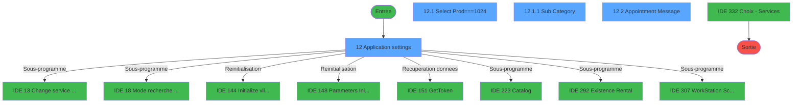
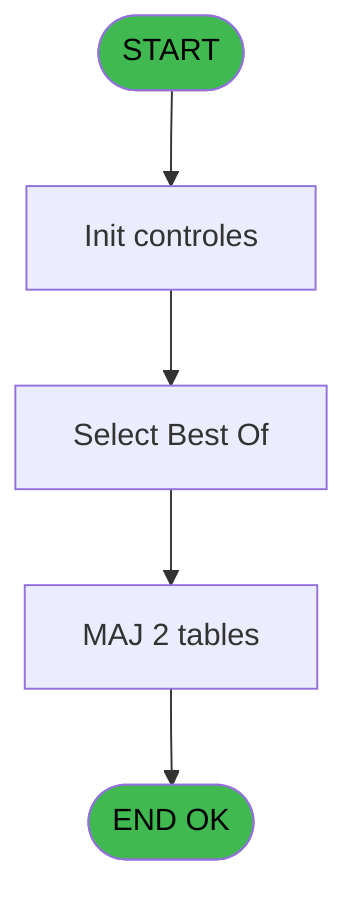
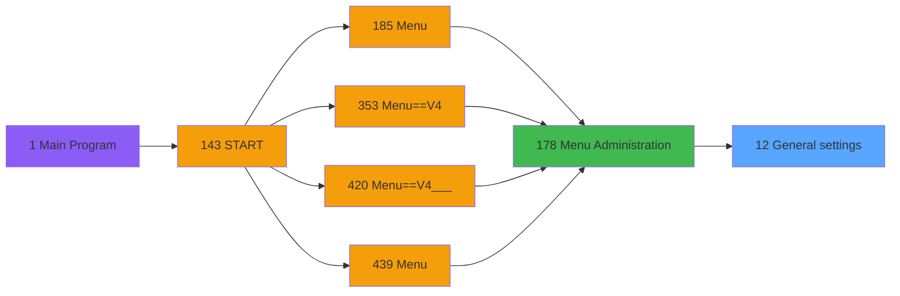
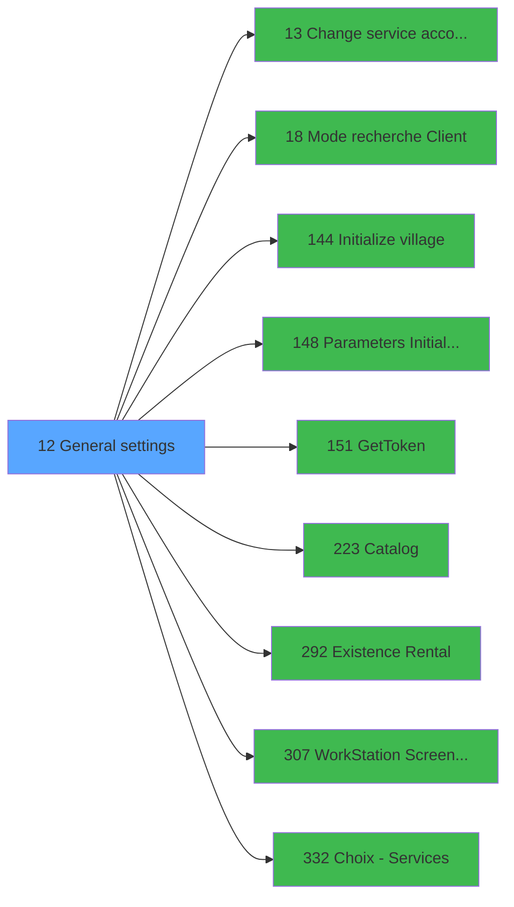

# PVE IDE 12 - General settings

> **Analyse**: Phases 1-4 2026-02-03 01:00 -> 01:00 (40s) | Assemblage 01:00
> **Pipeline**: V7.2 Enrichi
> **Structure**: 4 onglets (Resume | Ecrans | Donnees | Connexions)

<!-- TAB:Resume -->

## 1. FICHE D'IDENTITE

| Attribut | Valeur |
|----------|--------|
| Projet | PVE |
| IDE Position | 12 |
| Nom Programme | General settings |
| Fichier source | `Prg_12.xml` |
| Domaine metier | General |
| Taches | 5 (4 ecrans visibles) |
| Tables modifiees | 2 |
| Programmes appeles | 9 |

## 2. DESCRIPTION FONCTIONNELLE

**General settings** assure la gestion complete de ce processus, accessible depuis [Menu Administration (IDE 178)](PVE-IDE-178.md).

Le flux de traitement s'organise en **2 blocs fonctionnels** :

- **Traitement** (4 taches) : traitements metier divers
- **Consultation** (1 tache) : ecrans de recherche, selection et consultation

**Donnees modifiees** : 2 tables en ecriture (pv_customer_temp, pv_tva).

**Logique metier** : 6 regles identifiees couvrant conditions metier.

Detail : phases du traitement

#### Phase 1 : Traitement (4 taches)

- **12** - Application settings **[[ECRAN]](#ecran-t1)**
- **12.1.1** - Sub Category **[[ECRAN]](#ecran-t3)**
- **12.2** - Appointment Message **[[ECRAN]](#ecran-t4)**
- **12.3** - Supprimer CGV File

Delegue a : [Change service accounting date (IDE 13)](PVE-IDE-13.md), [GetToken (IDE 151)](PVE-IDE-151.md), [Catalog (IDE 223)](PVE-IDE-223.md), [Existence Rental (IDE 292)](PVE-IDE-292.md), [WorkStation Screen Resolution (IDE 307)](PVE-IDE-307.md)

#### Phase 2 : Consultation (1 tache)

- **12.1** - Select Prod===1024 **[[ECRAN]](#ecran-t2)**

Delegue a : [Mode recherche Client (IDE 18)](PVE-IDE-18.md), [GetToken (IDE 151)](PVE-IDE-151.md), [Choix - Services (IDE 332)](PVE-IDE-332.md)

#### Tables impactees

| Table | Operations | Role metier |
|-------|-----------|-------------|
| pv_tva | **W**/L (3 usages) |  |
| pv_customer_temp | **W**/L (2 usages) |  |

## 3. BLOCS FONCTIONNELS

### 3.1 Traitement (4 taches)

Traitements internes.

---

#### 12 - Application settings [[ECRAN]](#ecran-t1)

**Role** : Traitement : Application settings.
**Ecran** : 595 x 387 DLU (MDI) | [Voir mockup](#ecran-t1)

3 sous-taches directes

| Tache | Nom | Bloc |
|-------|-----|------|
| [12.1.1](#t3) | Sub Category **[[ECRAN]](#ecran-t3)** | Traitement |
| [12.2](#t4) | Appointment Message **[[ECRAN]](#ecran-t4)** | Traitement |
| [12.3](#t5) | Supprimer CGV File | Traitement |

**Delegue a** : [Change service accounting date (IDE 13)](PVE-IDE-13.md), [GetToken (IDE 151)](PVE-IDE-151.md), [Catalog (IDE 223)](PVE-IDE-223.md)

---

#### 12.1.1 - Sub Category [[ECRAN]](#ecran-t3)

**Role** : Traitement : Sub Category.
**Ecran** : 138 x 218 DLU | [Voir mockup](#ecran-t3)
**Delegue a** : [Change service accounting date (IDE 13)](PVE-IDE-13.md), [GetToken (IDE 151)](PVE-IDE-151.md), [Catalog (IDE 223)](PVE-IDE-223.md)

---

#### 12.2 - Appointment Message [[ECRAN]](#ecran-t4)

**Role** : Traitement : Appointment Message.
**Ecran** : 479 x 166 DLU (Type6) | [Voir mockup](#ecran-t4)
**Variables liees** : U (v.Message login booker), Q (Btn.AppointmentMessage)
**Delegue a** : [Change service accounting date (IDE 13)](PVE-IDE-13.md), [GetToken (IDE 151)](PVE-IDE-151.md), [Catalog (IDE 223)](PVE-IDE-223.md)

---

#### 12.3 - Supprimer CGV File

**Role** : Traitement : Supprimer CGV File.
**Variables liees** : J (v.sales_cgv_file), K (v.rentals_cgv_file), M (v.SalesFileSelected), N (v.RentalsFileSelected), L (Btn.SearchSalesFile)
**Delegue a** : [Change service accounting date (IDE 13)](PVE-IDE-13.md), [GetToken (IDE 151)](PVE-IDE-151.md), [Catalog (IDE 223)](PVE-IDE-223.md)

### 3.2 Consultation (1 tache)

Ecrans de recherche et consultation.

---

#### 12.1 - Select Prod===1024 [[ECRAN]](#ecran-t2)

**Role** : Traitement : Select Prod===1024.
**Ecran** : 563 x 306 DLU (Type6) | [Voir mockup](#ecran-t2)
**Variables liees** : M (v.SalesFileSelected), N (v.RentalsFileSelected)
**Delegue a** : [Mode recherche Client (IDE 18)](PVE-IDE-18.md), [Choix - Services (IDE 332)](PVE-IDE-332.md)

## 5. REGLES METIER

6 regles identifiees:

### Autres (6 regles)

#### [RM-001] Si Trim([AU]) <> '' alors 'File uploaded' sinon 'No file uploaded')

| Element | Detail |
|---------|--------|
| **Condition** | `Trim([AU]) <> ''` |
| **Si vrai** | 'File uploaded' |
| **Si faux** | 'No file uploaded') |
| **Expression source** | Expression 23 : `IF(Trim([AU]) <> '', 'File uploaded', 'No file uploaded')` |
| **Exemple** | Si Trim([AU]) <> '' → 'File uploaded'. Sinon → 'No file uploaded') |

#### [RM-002] Si Trim([AV]) <> '' alors 'File uploaded' sinon 'No file uploaded')

| Element | Detail |
|---------|--------|
| **Condition** | `Trim([AV]) <> ''` |
| **Si vrai** | 'File uploaded' |
| **Si faux** | 'No file uploaded') |
| **Expression source** | Expression 24 : `IF(Trim([AV]) <> '', 'File uploaded', 'No file uploaded')` |
| **Exemple** | Si Trim([AV]) <> '' → 'File uploaded'. Sinon → 'No file uploaded') |

#### [RM-003] Si [AX]=0 OR [AY]=0 alors '' sinon Str([AX],'2P0')&Str([AY],'2P0'))

| Element | Detail |
|---------|--------|
| **Condition** | `[AX]=0 OR [AY]=0` |
| **Si vrai** | '' |
| **Si faux** | Str([AX],'2P0')&Str([AY],'2P0')) |
| **Expression source** | Expression 28 : `IF([AX]=0 OR [AY]=0,'',Str([AX],'2P0')&Str([AY],'2P0'))` |
| **Exemple** | Si [AX]=0 OR [AY]=0 → ''. Sinon → Str([AX],'2P0')&Str([AY],'2P0')) |

#### [RM-004] Si VG10 OR [BV] alors '1 sinon 2'&IF([CD],',3',IF(VG61,',4','')), '1'  &IF([CD],',3',IF(VG61,',4','')))

| Element | Detail |
|---------|--------|
| **Condition** | `VG10 OR [BV]` |
| **Si vrai** | '1 |
| **Si faux** | 2'&IF([CD],',3',IF(VG61,',4','')), '1'  &IF([CD],',3',IF(VG61,',4',''))) |
| **Expression source** | Expression 48 : `IF(VG10 OR [BV],'1,2'&IF([CD],',3',IF(VG61,',4','')), '1'  &` |
| **Exemple** | Si VG10 OR [BV] → '1 |

#### [RM-005] Si VG63 alors [AN] sinon '')

| Element | Detail |
|---------|--------|
| **Condition** | `VG63` |
| **Si vrai** | [AN] |
| **Si faux** | '') |
| **Expression source** | Expression 63 : `IF(VG63, [AN], '')` |
| **Exemple** | Si VG63 → [AN]. Sinon → '') |

#### [RM-006] Si VarMod('[AB]'VAR) alors IF([AB] sinon 'Booker activated ', 'Booker disabled '), '') & IF(VarMod('[AK]'VAR), StrBuild('Token was updated from @1@', VarPrev('[AK]'VAR)), '')

| Element | Detail |
|---------|--------|
| **Condition** | `VarMod('[AB]'VAR)` |
| **Si vrai** | IF([AB] |
| **Si faux** | 'Booker activated ', 'Booker disabled '), '') & IF(VarMod('[AK]'VAR), StrBuild('Token was updated from @1@', VarPrev('[AK]'VAR)), '') |
| **Expression source** | Expression 83 : `IF(VarMod('[AB]'VAR), IF([AB], 'Booker activated ', 'Booker ` |
| **Exemple** | Si VarMod('[AB]'VAR) → IF([AB] |

## 6. CONTEXTE

- **Appele par**: [Menu Administration (IDE 178)](PVE-IDE-178.md)
- **Appelle**: 9 programmes | **Tables**: 6 (W:2 R:1 L:5) | **Taches**: 5 | **Expressions**: 94

<!-- TAB:Ecrans -->

## 8. ECRANS

### 8.1 Forms visibles (4 / 5)

| # | Position | Tache | Nom | Type | Largeur | Hauteur | Bloc |
|---|----------|-------|-----|------|---------|---------|------|
| 1 | 12 | 12 | Application settings | MDI | 595 | 387 | Traitement |
| 2 | 12.1 | 12.1 | Select Prod===1024 | Type6 | 563 | 306 | Consultation |
| 3 | 12.1.1 | 12.1.1 | Sub Category | Type0 | 138 | 218 | Traitement |
| 4 | 12.2 | 12.2 | Appointment Message | Type6 | 479 | 166 | Traitement |

### 8.2 Mockups Ecrans

---

#### 12 - Application settings
**Tache** : [12](#t1) | **Type** : MDI | **Dimensions** : 595 x 387 DLU
**Bloc** : Traitement | **Titre IDE** : Application settings

<!-- FORM-DATA:
{
    "width":  595,
    "vFactor":  8,
    "type":  "MDI",
    "hFactor":  4,
    "controls":  [
                     {
                         "x":  4,
                         "type":  "label",
                         "var":  "",
                         "y":  5,
                         "w":  587,
                         "fmt":  "",
                         "name":  "",
                         "h":  22,
                         "color":  "180",
                         "text":  "",
                         "parent":  null
                     },
                     {
                         "x":  38,
                         "type":  "label",
                         "var":  "",
                         "y":  10,
                         "w":  46,
                         "fmt":  "",
                         "name":  "",
                         "h":  12,
                         "color":  "180",
                         "text":  "Service",
                         "parent":  null
                     },
                     {
                         "x":  4,
                         "type":  "label",
                         "var":  "",
                         "y":  31,
                         "w":  587,
                         "fmt":  "",
                         "name":  "",
                         "h":  250,
                         "color":  "182",
                         "text":  "",
                         "parent":  null
                     },
                     {
                         "x":  188,
                         "type":  "label",
                         "var":  "",
                         "y":  35,
                         "w":  197,
                         "fmt":  "",
                         "name":  "",
                         "h":  15,
                         "color":  "186",
                         "text":  "General settings",
                         "parent":  null
                     },
                     {
                         "x":  4,
                         "type":  "label",
                         "var":  "",
                         "y":  69,
                         "w":  587,
                         "fmt":  "",
                         "name":  "",
                         "h":  281,
                         "color":  "182",
                         "text":  "",
                         "parent":  8
                     },
                     {
                         "x":  5,
                         "type":  "label",
                         "var":  "",
                         "y":  69,
                         "w":  586,
                         "fmt":  "",
                         "name":  "",
                         "h":  282,
                         "color":  "182",
                         "text":  "",
                         "parent":  8
                     },
                     {
                         "x":  5,
                         "type":  "label",
                         "var":  "",
                         "y":  69,
                         "w":  586,
                         "fmt":  "",
                         "name":  "",
                         "h":  281,
                         "color":  "182",
                         "text":  "",
                         "parent":  8
                     },
                     {
                         "x":  5,
                         "type":  "label",
                         "var":  "",
                         "y":  69,
                         "w":  586,
                         "fmt":  "",
                         "name":  "",
                         "h":  279,
                         "color":  "182",
                         "text":  "",
                         "parent":  8
                     },
                     {
                         "x":  20,
                         "type":  "label",
                         "var":  "",
                         "y":  76,
                         "w":  365,
                         "fmt":  "",
                         "name":  "",
                         "h":  18,
                         "color":  "187",
                         "text":  "  Print stocklist automatically every week",
                         "parent":  8
                     },
                     {
                         "x":  312,
                         "type":  "label",
                         "var":  "",
                         "y":  84,
                         "w":  274,
                         "fmt":  "",
                         "name":  "",
                         "h":  18,
                         "color":  "187",
                         "text":  " Client ID",
                         "parent":  10
                     },
                     {
                         "x":  10,
                         "type":  "label",
                         "var":  "",
                         "y":  85,
                         "w":  298,
                         "fmt":  "",
                         "name":  "",
                         "h":  18,
                         "color":  "187",
                         "text":  " Link with Booking Application",
                         "parent":  10
                     },
                     {
                         "x":  30,
                         "type":  "label",
                         "var":  "",
                         "y":  85,
                         "w":  322,
                         "fmt":  "",
                         "name":  "",
                         "h":  18,
                         "color":  "187",
                         "text":  "Autorise payment if no guaranty",
                         "parent":  12
                     },
                     {
                         "x":  10,
                         "type":  "label",
                         "var":  "",
                         "y":  109,
                         "w":  298,
                         "fmt":  "",
                         "name":  "",
                         "h":  18,
                         "color":  "187",
                         "text":  " Booker Api Address",
                         "parent":  10
                     },
                     {
                         "x":  312,
                         "type":  "label",
                         "var":  "",
                         "y":  109,
                         "w":  274,
                         "fmt":  "",
                         "name":  "",
                         "h":  18,
                         "color":  "187",
                         "text":  " Client secret",
                         "parent":  10
                     },
                     {
                         "x":  30,
                         "type":  "label",
                         "var":  "",
                         "y":  111,
                         "w":  322,
                         "fmt":  "",
                         "name":  "",
                         "h":  18,
                         "color":  "187",
                         "text":  "Sales Cancelation Delay (in days)",
                         "parent":  12
                     },
                     {
                         "x":  312,
                         "type":  "label",
                         "var":  "",
                         "y":  132,
                         "w":  274,
                         "fmt":  "",
                         "name":  "",
                         "h":  18,
                         "color":  "187",
                         "text":  " User name",
                         "parent":  10
                     },
                     {
                         "x":  10,
                         "type":  "label",
                         "var":  "",
                         "y":  133,
                         "w":  298,
                         "fmt":  "",
                         "name":  "",
                         "h":  18,
                         "color":  "187",
                         "text":  " Proxy Address",
                         "parent":  10
                     },
                     {
                         "x":  30,
                         "type":  "label",
                         "var":  "",
                         "y":  137,
                         "w":  322,
                         "fmt":  "",
                         "name":  "",
                         "h":  18,
                         "color":  "187",
                         "text":  "Validate sales on all filiations",
                         "parent":  12
                     },
                     {
                         "x":  10,
                         "type":  "label",
                         "var":  "",
                         "y":  157,
                         "w":  298,
                         "fmt":  "",
                         "name":  "",
                         "h":  18,
                         "color":  "187",
                         "text":  " Booker Location ID",
                         "parent":  10
                     },
                     {
                         "x":  312,
                         "type":  "label",
                         "var":  "",
                         "y":  157,
                         "w":  274,
                         "fmt":  "",
                         "name":  "",
                         "h":  18,
                         "color":  "187",
                         "text":  " Password",
                         "parent":  10
                     },
                     {
                         "x":  30,
                         "type":  "label",
                         "var":  "",
                         "y":  163,
                         "w":  322,
                         "fmt":  "",
                         "name":  "",
                         "h":  18,
                         "color":  "187",
                         "text":  "Use credit card on mobility",
                         "parent":  12
                     },
                     {
                         "x":  167,
                         "type":  "label",
                         "var":  "",
                         "y":  186,
                         "w":  34,
                         "fmt":  "",
                         "name":  "",
                         "h":  9,
                         "color":  "",
                         "text":  "Best Of",
                         "parent":  8
                     },
                     {
                         "x":  11,
                         "type":  "label",
                         "var":  "",
                         "y":  191,
                         "w":  298,
                         "fmt":  "",
                         "name":  "",
                         "h":  18,
                         "color":  "187",
                         "text":  " Time difference",
                         "parent":  10
                     },
                     {
                         "x":  30,
                         "type":  "label",
                         "var":  "",
                         "y":  200,
                         "w":  272,
                         "fmt":  "",
                         "name":  "",
                         "h":  18,
                         "color":  "187",
                         "text":  " Category",
                         "parent":  8
                     },
                     {
                         "x":  11,
                         "type":  "label",
                         "var":  "",
                         "y":  215,
                         "w":  298,
                         "fmt":  "",
                         "name":  "",
                         "h":  18,
                         "color":  "187",
                         "text":  " Anonymization",
                         "parent":  10
                     },
                     {
                         "x":  312,
                         "type":  "label",
                         "var":  "",
                         "y":  215,
                         "w":  274,
                         "fmt":  "",
                         "name":  "",
                         "h":  18,
                         "color":  "187",
                         "text":  " Refresh token",
                         "parent":  10
                     },
                     {
                         "x":  21,
                         "type":  "label",
                         "var":  "",
                         "y":  220,
                         "w":  365,
                         "fmt":  "",
                         "name":  "",
                         "h":  18,
                         "color":  "187",
                         "text":  "  Desactivate confirm. message for assigning Club Med Pass",
                         "parent":  8
                     },
                     {
                         "x":  30,
                         "type":  "label",
                         "var":  "",
                         "y":  227,
                         "w":  272,
                         "fmt":  "",
                         "name":  "",
                         "h":  18,
                         "color":  "187",
                         "text":  " Sub Category",
                         "parent":  8
                     },
                     {
                         "x":  11,
                         "type":  "label",
                         "var":  "",
                         "y":  239,
                         "w":  298,
                         "fmt":  "",
                         "name":  "",
                         "h":  18,
                         "color":  "187",
                         "text":  "Payment method",
                         "parent":  10
                     },
                     {
                         "x":  312,
                         "type":  "label",
                         "var":  "",
                         "y":  239,
                         "w":  274,
                         "fmt":  "",
                         "name":  "",
                         "h":  18,
                         "color":  "187",
                         "text":  " Subscription Key",
                         "parent":  10
                     },
                     {
                         "x":  21,
                         "type":  "label",
                         "var":  "",
                         "y":  242,
                         "w":  365,
                         "fmt":  "",
                         "name":  "",
                         "h":  18,
                         "color":  "187",
                         "text":  "  Restricted Modification",
                         "parent":  9
                     },
                     {
                         "x":  21,
                         "type":  "label",
                         "var":  "",
                         "y":  264,
                         "w":  365,
                         "fmt":  "",
                         "name":  "",
                         "h":  18,
                         "color":  "187",
                         "text":  "  Product Restricted Modification",
                         "parent":  9
                     },
                     {
                         "x":  11,
                         "type":  "label",
                         "var":  "",
                         "y":  270,
                         "w":  298,
                         "fmt":  "",
                         "name":  "",
                         "h":  18,
                         "color":  "187",
                         "text":  " Special ID",
                         "parent":  10
                     },
                     {
                         "x":  20,
                         "type":  "label",
                         "var":  "",
                         "y":  83,
                         "w":  365,
                         "fmt":  "",
                         "name":  "",
                         "h":  28,
                         "color":  "183",
                         "text":  "Message Management",
                         "parent":  8
                     },
                     {
                         "x":  20,
                         "type":  "label",
                         "var":  "",
                         "y":  87,
                         "w":  340,
                         "fmt":  "",
                         "name":  "",
                         "h":  28,
                         "color":  "183",
                         "text":  "Geographic zone",
                         "parent":  8
                     },
                     {
                         "x":  20,
                         "type":  "label",
                         "var":  "",
                         "y":  114,
                         "w":  365,
                         "fmt":  "",
                         "name":  "",
                         "h":  28,
                         "color":  "183",
                         "text":  "Sales terms and conditions file",
                         "parent":  9
                     },
                     {
                         "x":  20,
                         "type":  "label",
                         "var":  "",
                         "y":  119,
                         "w":  340,
                         "fmt":  "",
                         "name":  "",
                         "h":  28,
                         "color":  "183",
                         "text":  "",
                         "parent":  8
                     },
                     {
                         "x":  20,
                         "type":  "label",
                         "var":  "",
                         "y":  145,
                         "w":  365,
                         "fmt":  "",
                         "name":  "",
                         "h":  28,
                         "color":  "183",
                         "text":  "Rentals terms and conditions file",
                         "parent":  9
                     },
                     {
                         "x":  20,
                         "type":  "label",
                         "var":  "",
                         "y":  152,
                         "w":  340,
                         "fmt":  "",
                         "name":  "",
                         "h":  28,
                         "color":  "183",
                         "text":  "",
                         "parent":  8
                     },
                     {
                         "x":  20,
                         "type":  "label",
                         "var":  "",
                         "y":  176,
                         "w":  365,
                         "fmt":  "",
                         "name":  "",
                         "h":  28,
                         "color":  "183",
                         "text":  "Guaranty Management",
                         "parent":  9
                     },
                     {
                         "x":  20,
                         "type":  "label",
                         "var":  "",
                         "y":  269,
                         "w":  365,
                         "fmt":  "",
                         "name":  "",
                         "h":  64,
                         "color":  "182",
                         "text":  "",
                         "parent":  8
                     },
                     {
                         "x":  407,
                         "type":  "label",
                         "var":  "",
                         "y":  273,
                         "w":  151,
                         "fmt":  "",
                         "name":  "",
                         "h":  28,
                         "color":  "183",
                         "text":  "Number of copies",
                         "parent":  9
                     },
                     {
                         "x":  22,
                         "type":  "label",
                         "var":  "",
                         "y":  127,
                         "w":  284,
                         "fmt":  "",
                         "name":  "",
                         "h":  18,
                         "color":  "187",
                         "text":  "Insurance category ID",
                         "parent":  61
                     },
                     {
                         "x":  22,
                         "type":  "label",
                         "var":  "",
                         "y":  160,
                         "w":  284,
                         "fmt":  "",
                         "name":  "",
                         "h":  18,
                         "color":  "187",
                         "text":  "Default # days auto-generated per subcat",
                         "parent":  67
                     },
                     {
                         "x":  165,
                         "type":  "label",
                         "var":  "",
                         "y":  268,
                         "w":  34,
                         "fmt":  "",
                         "name":  "",
                         "h":  9,
                         "color":  "",
                         "text":  "Best Of",
                         "parent":  76
                     },
                     {
                         "x":  28,
                         "type":  "label",
                         "var":  "",
                         "y":  282,
                         "w":  272,
                         "fmt":  "",
                         "name":  "",
                         "h":  18,
                         "color":  "187",
                         "text":  " Category",
                         "parent":  76
                     },
                     {
                         "x":  28,
                         "type":  "label",
                         "var":  "",
                         "y":  309,
                         "w":  272,
                         "fmt":  "",
                         "name":  "",
                         "h":  18,
                         "color":  "187",
                         "text":  " Sub Category",
                         "parent":  76
                     },
                     {
                         "x":  415,
                         "type":  "label",
                         "var":  "",
                         "y":  285,
                         "w":  45,
                         "fmt":  "",
                         "name":  "",
                         "h":  13,
                         "color":  "187",
                         "text":  "Receipt",
                         "parent":  77
                     },
                     {
                         "x":  5,
                         "type":  "label",
                         "var":  "",
                         "y":  348,
                         "w":  586,
                         "fmt":  "",
                         "name":  "",
                         "h":  36,
                         "color":  "182",
                         "text":  "",
                         "parent":  null
                     },
                     {
                         "x":  256,
                         "type":  "combobox",
                         "var":  "",
                         "y":  71,
                         "w":  49,
                         "fmt":  "",
                         "name":  "bokking_is_active",
                         "h":  12,
                         "color":  "110",
                         "text":  "Yes,No",
                         "parent":  8
                     },
                     {
                         "x":  110,
                         "type":  "edit",
                         "var":  "",
                         "y":  110,
                         "w":  197,
                         "fmt":  "",
                         "name":  "booker_api_url",
                         "h":  16,
                         "color":  "110",
                         "text":  "",
                         "parent":  18
                     },
                     {
                         "x":  110,
                         "type":  "edit",
                         "var":  "",
                         "y":  134,
                         "w":  197,
                         "fmt":  "",
                         "name":  "proxy_address",
                         "h":  16,
                         "color":  "110",
                         "text":  "",
                         "parent":  25
                     },
                     {
                         "x":  110,
                         "type":  "edit",
                         "var":  "",
                         "y":  158,
                         "w":  197,
                         "fmt":  "10Z",
                         "name":  "booker_location_id",
                         "h":  16,
                         "color":  "110",
                         "text":  "",
                         "parent":  29
                     },
                     {
                         "x":  274,
                         "type":  "edit",
                         "var":  "",
                         "y":  192,
                         "w":  34,
                         "fmt":  "",
                         "name":  "booker_decalage_horaire",
                         "h":  16,
                         "color":  "110",
                         "text":  "",
                         "parent":  35
                     },
                     {
                         "x":  256,
                         "type":  "combobox",
                         "var":  "",
                         "y":  201,
                         "w":  49,
                         "fmt":  "",
                         "name":  "book_anonymization",
                         "h":  12,
                         "color":  "110",
                         "text":  "Yes,No",
                         "parent":  8
                     },
                     {
                         "x":  135,
                         "type":  "edit",
                         "var":  "",
                         "y":  240,
                         "w":  173,
                         "fmt":  "",
                         "name":  "book_payment_name",
                         "h":  16,
                         "color":  "110",
                         "text":  "",
                         "parent":  45
                     },
                     {
                         "x":  135,
                         "type":  "edit",
                         "var":  "",
                         "y":  271,
                         "w":  173,
                         "fmt":  "20",
                         "name":  "book_id_special",
                         "h":  16,
                         "color":  "110",
                         "text":  "",
                         "parent":  51
                     },
                     {
                         "x":  412,
                         "type":  "edit",
                         "var":  "",
                         "y":  85,
                         "w":  173,
                         "fmt":  "",
                         "name":  "book_client_id",
                         "h":  16,
                         "color":  "110",
                         "text":  "",
                         "parent":  14
                     },
                     {
                         "x":  412,
                         "type":  "edit",
                         "var":  "",
                         "y":  110,
                         "w":  173,
                         "fmt":  "",
                         "name":  "book_client_secret",
                         "h":  16,
                         "color":  "110",
                         "text":  "",
                         "parent":  19
                     },
                     {
                         "x":  412,
                         "type":  "edit",
                         "var":  "",
                         "y":  133,
                         "w":  173,
                         "fmt":  "",
                         "name":  "book_username",
                         "h":  16,
                         "color":  "110",
                         "text":  "",
                         "parent":  24
                     },
                     {
                         "x":  412,
                         "type":  "edit",
                         "var":  "",
                         "y":  158,
                         "w":  173,
                         "fmt":  "",
                         "name":  "book_password",
                         "h":  16,
                         "color":  "110",
                         "text":  "",
                         "parent":  30
                     },
                     {
                         "x":  412,
                         "type":  "edit",
                         "var":  "",
                         "y":  216,
                         "w":  173,
                         "fmt":  "",
                         "name":  "book_refresh_token_0001",
                         "h":  16,
                         "color":  "110",
                         "text":  "",
                         "parent":  40
                     },
                     {
                         "x":  412,
                         "type":  "edit",
                         "var":  "",
                         "y":  240,
                         "w":  173,
                         "fmt":  "",
                         "name":  "book_ocp_apim_subscriptio_0001",
                         "h":  16,
                         "color":  "110",
                         "text":  "",
                         "parent":  46
                     },
                     {
                         "x":  365,
                         "type":  "button",
                         "var":  "",
                         "y":  259,
                         "w":  179,
                         "fmt":  "\\Appointment Message",
                         "name":  "Btn.AppointmentMessage",
                         "h":  21,
                         "color":  "",
                         "text":  "",
                         "parent":  10
                     },
                     {
                         "x":  88,
                         "type":  "edit",
                         "var":  "",
                         "y":  10,
                         "w":  50,
                         "fmt":  "",
                         "name":  "",
                         "h":  12,
                         "color":  "63",
                         "text":  "",
                         "parent":  null
                     },
                     {
                         "x":  147,
                         "type":  "edit",
                         "var":  "",
                         "y":  10,
                         "w":  170,
                         "fmt":  "30",
                         "name":  "",
                         "h":  12,
                         "color":  "180",
                         "text":  "",
                         "parent":  null
                     },
                     {
                         "x":  5,
                         "type":  "tab",
                         "var":  "",
                         "y":  54,
                         "w":  586,
                         "fmt":  "",
                         "name":  "V.Onglet",
                         "h":  297,
                         "color":  "",
                         "text":  "1,2,3,4",
                         "parent":  null
                     },
                     {
                         "x":  407,
                         "type":  "button",
                         "var":  "",
                         "y":  87,
                         "w":  151,
                         "fmt":  "\u0026Village configuration",
                         "name":  "",
                         "h":  30,
                         "color":  "",
                         "text":  "",
                         "parent":  9
                     },
                     {
                         "x":  407,
                         "type":  "button",
                         "var":  "",
                         "y":  85,
                         "w":  151,
                         "fmt":  "Change the accounting date",
                         "name":  "",
                         "h":  30,
                         "color":  "",
                         "text":  "",
                         "parent":  12
                     },
                     {
                         "x":  300,
                         "type":  "combobox",
                         "var":  "",
                         "y":  70,
                         "w":  49,
                         "fmt":  "",
                         "name":  "CTRL_003",
                         "h":  12,
                         "color":  "110",
                         "text":  "Yes,No",
                         "parent":  12
                     },
                     {
                         "x":  318,
                         "type":  "edit",
                         "var":  "",
                         "y":  160,
                         "w":  34,
                         "fmt":  "",
                         "name":  "CTRL_001",
                         "h":  16,
                         "color":  "110",
                         "text":  "",
                         "parent":  67
                     },
                     {
                         "x":  302,
                         "type":  "edit",
                         "var":  "",
                         "y":  112,
                         "w":  49,
                         "fmt":  "2.1",
                         "name":  "sales_cancel",
                         "h":  16,
                         "color":  "110",
                         "text":  "",
                         "parent":  12
                     },
                     {
                         "x":  25,
                         "type":  "edit",
                         "var":  "",
                         "y":  125,
                         "w":  283,
                         "fmt":  "",
                         "name":  "v.sales_cgv_file",
                         "h":  14,
                         "color":  "110",
                         "text":  "",
                         "parent":  60
                     },
                     {
                         "x":  407,
                         "type":  "button",
                         "var":  "",
                         "y":  120,
                         "w":  151,
                         "fmt":  "\u0026Workstation Screen Resolution",
                         "name":  "",
                         "h":  30,
                         "color":  "",
                         "text":  "",
                         "parent":  9
                     },
                     {
                         "x":  407,
                         "type":  "button",
                         "var":  "",
                         "y":  122,
                         "w":  151,
                         "fmt":  "\u0026Payment Terminal Settings",
                         "name":  "",
                         "h":  30,
                         "color":  "",
                         "text":  "",
                         "parent":  12
                     },
                     {
                         "x":  318,
                         "type":  "edit",
                         "var":  "",
                         "y":  127,
                         "w":  34,
                         "fmt":  "",
                         "name":  "CTRL_004",
                         "h":  17,
                         "color":  "110",
                         "text":  "",
                         "parent":  61
                     },
                     {
                         "x":  300,
                         "type":  "combobox",
                         "var":  "",
                         "y":  122,
                         "w":  49,
                         "fmt":  "",
                         "name":  "pg2_logique_2_0001",
                         "h":  12,
                         "color":  "110",
                         "text":  "Yes,No",
                         "parent":  28
                     },
                     {
                         "x":  25,
                         "type":  "edit",
                         "var":  "",
                         "y":  154,
                         "w":  283,
                         "fmt":  "",
                         "name":  "v.rentals_cgv_file",
                         "h":  14,
                         "color":  "110",
                         "text":  "",
                         "parent":  65
                     },
                     {
                         "x":  407,
                         "type":  "button",
                         "var":  "",
                         "y":  153,
                         "w":  151,
                         "fmt":  "Default customer search mode",
                         "name":  "Btn.ModeRecherche",
                         "h":  30,
                         "color":  "",
                         "text":  "",
                         "parent":  9
                     },
                     {
                         "x":  300,
                         "type":  "combobox",
                         "var":  "",
                         "y":  148,
                         "w":  49,
                         "fmt":  "",
                         "name":  "pg2_logique_3_0001",
                         "h":  12,
                         "color":  "110",
                         "text":  "Yes,No",
                         "parent":  33
                     },
                     {
                         "x":  121,
                         "type":  "edit",
                         "var":  "",
                         "y":  202,
                         "w":  179,
                         "fmt":  "",
                         "name":  "label  \u003e\u003e Catégorie \u003c\u003c_0001",
                         "h":  15,
                         "color":  "110",
                         "text":  "",
                         "parent":  8
                     },
                     {
                         "x":  310,
                         "type":  "button",
                         "var":  "",
                         "y":  283,
                         "w":  22,
                         "fmt":  "",
                         "name":  "ZOOM",
                         "h":  15,
                         "color":  "",
                         "text":  "",
                         "parent":  76
                     },
                     {
                         "x":  334,
                         "type":  "button",
                         "var":  "",
                         "y":  283,
                         "w":  22,
                         "fmt":  "",
                         "name":  "RAZ Best Of",
                         "h":  15,
                         "color":  "",
                         "text":  "",
                         "parent":  76
                     },
                     {
                         "x":  121,
                         "type":  "edit",
                         "var":  "",
                         "y":  229,
                         "w":  179,
                         "fmt":  "",
                         "name":  "label \u003e\u003e Sub Catégorie \u003c\u003c_0001",
                         "h":  15,
                         "color":  "110",
                         "text":  "",
                         "parent":  8
                     },
                     {
                         "x":  490,
                         "type":  "button",
                         "var":  "",
                         "y":  353,
                         "w":  99,
                         "fmt":  "\u0026Exit",
                         "name":  "",
                         "h":  29,
                         "color":  "",
                         "text":  "",
                         "parent":  null
                     },
                     {
                         "x":  334,
                         "type":  "button",
                         "var":  "",
                         "y":  124,
                         "w":  22,
                         "fmt":  "",
                         "name":  "Btn.DeleteSalesFile",
                         "h":  15,
                         "color":  "",
                         "text":  "",
                         "parent":  60
                     },
                     {
                         "x":  310,
                         "type":  "button",
                         "var":  "",
                         "y":  124,
                         "w":  22,
                         "fmt":  "",
                         "name":  "Btn.SearchSalesFile",
                         "h":  15,
                         "color":  "",
                         "text":  "",
                         "parent":  60
                     },
                     {
                         "x":  310,
                         "type":  "button",
                         "var":  "",
                         "y":  153,
                         "w":  22,
                         "fmt":  "",
                         "name":  "Btn.SearchRentalsFile",
                         "h":  15,
                         "color":  "",
                         "text":  "",
                         "parent":  65
                     },
                     {
                         "x":  334,
                         "type":  "button",
                         "var":  "",
                         "y":  153,
                         "w":  22,
                         "fmt":  "",
                         "name":  "Btn.DeleteRentalsFile",
                         "h":  15,
                         "color":  "",
                         "text":  "",
                         "parent":  65
                     },
                     {
                         "x":  445,
                         "type":  "combobox",
                         "var":  "",
                         "y":  8,
                         "w":  143,
                         "fmt":  "",
                         "name":  "v.ComboService",
                         "h":  12,
                         "color":  "110",
                         "text":  "Service",
                         "parent":  null
                     },
                     {
                         "x":  119,
                         "type":  "edit",
                         "var":  "",
                         "y":  284,
                         "w":  179,
                         "fmt":  "",
                         "name":  "label  \u003e\u003e Catégorie \u003c\u003c",
                         "h":  15,
                         "color":  "110",
                         "text":  "",
                         "parent":  76
                     },
                     {
                         "x":  119,
                         "type":  "edit",
                         "var":  "",
                         "y":  311,
                         "w":  179,
                         "fmt":  "",
                         "name":  "label \u003e\u003e Sub Catégorie \u003c\u003c",
                         "h":  15,
                         "color":  "110",
                         "text":  "",
                         "parent":  76
                     },
                     {
                         "x":  25,
                         "type":  "combobox",
                         "var":  "",
                         "y":  185,
                         "w":  283,
                         "fmt":  "",
                         "name":  "pg2_garantie_service",
                         "h":  12,
                         "color":  "110",
                         "text":  "",
                         "parent":  69
                     },
                     {
                         "x":  24,
                         "type":  "combobox",
                         "var":  "",
                         "y":  92,
                         "w":  283,
                         "fmt":  "",
                         "name":  "pg2_logique_1_0001",
                         "h":  12,
                         "color":  "110",
                         "text":  "",
                         "parent":  56
                     },
                     {
                         "x":  25,
                         "type":  "combobox",
                         "var":  "",
                         "y":  96,
                         "w":  283,
                         "fmt":  "",
                         "name":  "geographic_zone_0001",
                         "h":  12,
                         "color":  "110",
                         "text":  "1 US,2 Europe,3 Asia",
                         "parent":  58
                     },
                     {
                         "x":  312,
                         "type":  "button",
                         "var":  "",
                         "y":  180,
                         "w":  272,
                         "fmt":  "",
                         "name":  "b.Access token",
                         "h":  14,
                         "color":  "",
                         "text":  "",
                         "parent":  10
                     },
                     {
                         "x":  329,
                         "type":  "combobox",
                         "var":  "",
                         "y":  62,
                         "w":  49,
                         "fmt":  "",
                         "name":  "pg2_Print_weekly_stocklis_0001",
                         "h":  12,
                         "color":  "110",
                         "text":  "Yes,No",
                         "parent":  13
                     },
                     {
                         "x":  328,
                         "type":  "combobox",
                         "var":  "",
                         "y":  206,
                         "w":  49,
                         "fmt":  "",
                         "name":  "pg2_desactiver_confirm_id",
                         "h":  12,
                         "color":  "110",
                         "text":  "Yes,No",
                         "parent":  42
                     },
                     {
                         "x":  328,
                         "type":  "combobox",
                         "var":  "",
                         "y":  228,
                         "w":  49,
                         "fmt":  "",
                         "name":  "pg2_Restricted_Modificati_0001",
                         "h":  12,
                         "color":  "110",
                         "text":  "Yes,No",
                         "parent":  49
                     },
                     {
                         "x":  359,
                         "type":  "button",
                         "var":  "",
                         "y":  124,
                         "w":  22,
                         "fmt":  "",
                         "name":  "Btn.ViewSalesFile",
                         "h":  15,
                         "color":  "",
                         "text":  "",
                         "parent":  60
                     },
                     {
                         "x":  359,
                         "type":  "button",
                         "var":  "",
                         "y":  153,
                         "w":  22,
                         "fmt":  "",
                         "name":  "Btn.ViewRentalsFile",
                         "h":  15,
                         "color":  "",
                         "text":  "",
                         "parent":  65
                     },
                     {
                         "x":  328,
                         "type":  "combobox",
                         "var":  "",
                         "y":  251,
                         "w":  49,
                         "fmt":  "",
                         "name":  "pg2_Restrinct_Modificatio_0001",
                         "h":  12,
                         "color":  "110",
                         "text":  "Yes,No",
                         "parent":  50
                     },
                     {
                         "x":  478,
                         "type":  "edit",
                         "var":  "",
                         "y":  284,
                         "w":  71,
                         "fmt":  "",
                         "name":  "book_nb_copie_service_loc_0001",
                         "h":  14,
                         "color":  "110",
                         "text":  "",
                         "parent":  77
                     }
                 ],
    "taskId":  "12",
    "height":  387
}
-->

<strong>Champs : 37 champs</strong>

| Pos (x,y) | Nom | Variable | Type |
|-----------|-----|----------|------|
| 256,71 | bokking_is_active | - | combobox |
| 110,110 | booker_api_url | - | edit |
| 110,134 | proxy_address | - | edit |
| 110,158 | booker_location_id | - | edit |
| 274,192 | booker_decalage_horaire | - | edit |
| 256,201 | book_anonymization | - | combobox |
| 135,240 | book_payment_name | - | edit |
| 135,271 | book_id_special | - | edit |
| 412,85 | book_client_id | - | edit |
| 412,110 | book_client_secret | - | edit |
| 412,133 | book_username | - | edit |
| 412,158 | book_password | - | edit |
| 412,216 | book_refresh_token_0001 | - | edit |
| 412,240 | book_ocp_apim_subscriptio_0001 | - | edit |
| 88,10 | (sans nom) | - | edit |
| 147,10 | 30 | - | edit |
| 300,70 | CTRL_003 | - | combobox |
| 318,160 | CTRL_001 | - | edit |
| 302,112 | sales_cancel | - | edit |
| 25,125 | v.sales_cgv_file | - | edit |
| 318,127 | CTRL_004 | - | edit |
| 300,122 | pg2_logique_2_0001 | - | combobox |
| 25,154 | v.rentals_cgv_file | - | edit |
| 300,148 | pg2_logique_3_0001 | - | combobox |
| 121,202 | label  >> Catégorie <<_0001 | - | edit |
| 121,229 | label >> Sub Catégorie <<_0001 | - | edit |
| 445,8 | v.ComboService | - | combobox |
| 119,284 | label  >> Catégorie << | - | edit |
| 119,311 | label >> Sub Catégorie << | - | edit |
| 25,185 | pg2_garantie_service | - | combobox |
| 24,92 | pg2_logique_1_0001 | - | combobox |
| 25,96 | geographic_zone_0001 | - | combobox |
| 329,62 | pg2_Print_weekly_stocklis_0001 | - | combobox |
| 328,206 | pg2_desactiver_confirm_id | - | combobox |
| 328,228 | pg2_Restricted_Modificati_0001 | - | combobox |
| 328,251 | pg2_Restrinct_Modificatio_0001 | - | combobox |
| 478,284 | book_nb_copie_service_loc_0001 | - | edit |

<strong>Boutons : 16 boutons</strong>

| Bouton | Pos (x,y) | Action |
|--------|-----------|--------|
| \Appointment Message | 365,259 | Bouton fonctionnel |
| Village configuration | 407,87 | Appel [Initialize village (IDE 144)](PVE-IDE-144.md) |
| Change the accounting date | 407,85 | Appel [Change service accounting date (IDE 13)](PVE-IDE-13.md) |
| Workstation Screen Resolution | 407,120 | Appel [WorkStation Screen Resolution (IDE 307)](PVE-IDE-307.md) |
| Payment Terminal Settings | 407,122 | Bouton fonctionnel |
| Default customer search mode | 407,153 | Ouvre la selection |
| ZOOM | 310,283 | Ouvre la selection |
| RAZ Best Of | 334,283 | Bouton fonctionnel |
| Exit | 490,353 | Quitte le programme |
| Btn.DeleteSalesFile | 334,124 | Supprime l'element selectionne |
| Btn.SearchSalesFile | 310,124 | Ouvre la selection |
| Btn.SearchRentalsFile | 310,153 | Ouvre la selection |
| Btn.DeleteRentalsFile | 334,153 | Supprime l'element selectionne |
| b.Access token | 312,180 | Valide la saisie et enregistre |
| Btn.ViewSalesFile | 359,124 | Bouton fonctionnel |
| Btn.ViewRentalsFile | 359,153 | Bouton fonctionnel |

---

#### 12.1 - Select Prod===1024
**Tache** : [12.1](#t2) | **Type** : Type6 | **Dimensions** : 563 x 306 DLU
**Bloc** : Consultation | **Titre IDE** : Select Prod===1024

<!-- FORM-DATA:
{
    "width":  563,
    "vFactor":  8,
    "type":  "Type6",
    "hFactor":  8,
    "controls":  [
                     {
                         "x":  0,
                         "type":  "label",
                         "var":  "",
                         "y":  0,
                         "w":  556,
                         "fmt":  "",
                         "name":  "",
                         "h":  31,
                         "color":  "189",
                         "text":  "",
                         "parent":  null
                     },
                     {
                         "x":  140,
                         "type":  "label",
                         "var":  "",
                         "y":  11,
                         "w":  282,
                         "fmt":  "",
                         "name":  "",
                         "h":  10,
                         "color":  "186",
                         "text":  "Select your Sub Category",
                         "parent":  1
                     },
                     {
                         "x":  1,
                         "type":  "label",
                         "var":  "",
                         "y":  31,
                         "w":  557,
                         "fmt":  "",
                         "name":  "",
                         "h":  231,
                         "color":  "183",
                         "text":  "",
                         "parent":  null
                     },
                     {
                         "x":  7,
                         "type":  "label",
                         "var":  "",
                         "y":  33,
                         "w":  180,
                         "fmt":  "",
                         "name":  "",
                         "h":  7,
                         "color":  "183",
                         "text":  "Category",
                         "parent":  null
                     },
                     {
                         "x":  348,
                         "type":  "label",
                         "var":  "",
                         "y":  33,
                         "w":  142,
                         "fmt":  "",
                         "name":  "",
                         "h":  7,
                         "color":  "183",
                         "text":  "Sub Category",
                         "parent":  null
                     },
                     {
                         "x":  0,
                         "type":  "label",
                         "var":  "",
                         "y":  279,
                         "w":  556,
                         "fmt":  "",
                         "name":  "",
                         "h":  24,
                         "color":  "6",
                         "text":  "",
                         "parent":  null
                     },
                     {
                         "x":  3,
                         "type":  "table",
                         "var":  "",
                         "name":  "",
                         "titleH":  12,
                         "color":  "183",
                         "w":  190,
                         "y":  42,
                         "fmt":  "",
                         "parent":  null,
                         "text":  "",
                         "rowH":  24,
                         "h":  218,
                         "cols":  [
                                      {
                                          "title":  "label",
                                          "layer":  1,
                                          "w":  184
                                      }
                                  ],
                         "rows":  1
                     },
                     {
                         "x":  482,
                         "type":  "image",
                         "var":  "",
                         "y":  2,
                         "w":  70,
                         "fmt":  "",
                         "name":  "",
                         "h":  27,
                         "color":  "",
                         "text":  "",
                         "parent":  1
                     },
                     {
                         "x":  7,
                         "type":  "button",
                         "var":  "",
                         "y":  43,
                         "w":  180,
                         "fmt":  "",
                         "name":  "label",
                         "h":  24,
                         "color":  "",
                         "text":  "",
                         "parent":  8
                     },
                     {
                         "x":  193,
                         "type":  "button",
                         "var":  "",
                         "y":  42,
                         "w":  72,
                         "fmt":  "ñ",
                         "name":  "UP",
                         "h":  108,
                         "color":  "",
                         "text":  "",
                         "parent":  null
                     },
                     {
                         "x":  269,
                         "type":  "subform",
                         "var":  "",
                         "y":  43,
                         "w":  283,
                         "fmt":  "",
                         "name":  "SF_CATEG",
                         "h":  218,
                         "color":  "",
                         "text":  "",
                         "parent":  null
                     },
                     {
                         "x":  193,
                         "type":  "button",
                         "var":  "",
                         "y":  150,
                         "w":  72,
                         "fmt":  "ò",
                         "name":  "DOWN",
                         "h":  110,
                         "color":  "",
                         "text":  "",
                         "parent":  null
                     },
                     {
                         "x":  13,
                         "type":  "button",
                         "var":  "",
                         "y":  282,
                         "w":  256,
                         "fmt":  "Cancel",
                         "name":  "CANCEL",
                         "h":  18,
                         "color":  "",
                         "text":  "",
                         "parent":  null
                     },
                     {
                         "x":  287,
                         "type":  "button",
                         "var":  "",
                         "y":  283,
                         "w":  256,
                         "fmt":  "Select",
                         "name":  "VALID",
                         "h":  18,
                         "color":  "",
                         "text":  "",
                         "parent":  null
                     }
                 ],
    "taskId":  "12.1",
    "height":  306
}
-->

<strong>Boutons : 5 boutons</strong>

| Bouton | Pos (x,y) | Action |
|--------|-----------|--------|
| label | 7,43 | Bouton fonctionnel |
| ñ | 193,42 | Bouton fonctionnel |
| ò | 193,150 | Bouton fonctionnel |
| Cancel | 13,282 | Annule et retour au menu |
| Select | 287,283 | Ouvre la selection |

---

#### 12.1.1 - Sub Category
**Tache** : [12.1.1](#t3) | **Type** : Type0 | **Dimensions** : 138 x 218 DLU
**Bloc** : Traitement | **Titre IDE** : Sub Category

<!-- FORM-DATA:
{
    "width":  138,
    "vFactor":  8,
    "type":  "Type0",
    "hFactor":  4,
    "controls":  [
                     {
                         "x":  0,
                         "type":  "table",
                         "var":  "",
                         "name":  "",
                         "titleH":  12,
                         "color":  "183",
                         "w":  99,
                         "y":  0,
                         "fmt":  "",
                         "parent":  null,
                         "text":  "",
                         "rowH":  24,
                         "h":  217,
                         "cols":  [
                                      {
                                          "title":  "",
                                          "layer":  1,
                                          "w":  96
                                      }
                                  ],
                         "rows":  1
                     },
                     {
                         "x":  2,
                         "type":  "button",
                         "var":  "",
                         "y":  1,
                         "w":  94,
                         "fmt":  "",
                         "name":  "SUB_CAT",
                         "h":  23,
                         "color":  "",
                         "text":  "",
                         "parent":  1
                     },
                     {
                         "x":  99,
                         "type":  "button",
                         "var":  "",
                         "y":  0,
                         "w":  36,
                         "fmt":  "ñ",
                         "name":  "UP",
                         "h":  108,
                         "color":  "",
                         "text":  "",
                         "parent":  null
                     },
                     {
                         "x":  99,
                         "type":  "button",
                         "var":  "",
                         "y":  108,
                         "w":  36,
                         "fmt":  "ò",
                         "name":  "DOWN",
                         "h":  109,
                         "color":  "",
                         "text":  "",
                         "parent":  null
                     }
                 ],
    "taskId":  "12.1.1",
    "height":  218
}
-->

<strong>Boutons : 3 boutons</strong>

| Bouton | Pos (x,y) | Action |
|--------|-----------|--------|
| SUB_CAT | 2,1 | Bouton fonctionnel |
| ñ | 99,0 | Bouton fonctionnel |
| ò | 99,108 | Bouton fonctionnel |

---

#### 12.2 - Appointment Message
**Tache** : [12.2](#t4) | **Type** : Type6 | **Dimensions** : 479 x 166 DLU
**Bloc** : Traitement | **Titre IDE** : Appointment Message

<!-- FORM-DATA:
{
    "width":  479,
    "vFactor":  8,
    "type":  "Type6",
    "hFactor":  4,
    "controls":  [
                     {
                         "x":  1,
                         "type":  "label",
                         "var":  "",
                         "y":  1,
                         "w":  477,
                         "fmt":  "",
                         "name":  "",
                         "h":  38,
                         "color":  "182",
                         "text":  "",
                         "parent":  null
                     },
                     {
                         "x":  16,
                         "type":  "label",
                         "var":  "",
                         "y":  16,
                         "w":  271,
                         "fmt":  "",
                         "name":  "",
                         "h":  10,
                         "color":  "186",
                         "text":  "Modify a message",
                         "parent":  1
                     },
                     {
                         "x":  1,
                         "type":  "label",
                         "var":  "",
                         "y":  39,
                         "w":  477,
                         "fmt":  "",
                         "name":  "",
                         "h":  85,
                         "color":  "182",
                         "text":  "Appointment Message",
                         "parent":  null
                     },
                     {
                         "x":  1,
                         "type":  "label",
                         "var":  "",
                         "y":  124,
                         "w":  477,
                         "fmt":  "",
                         "name":  "",
                         "h":  36,
                         "color":  "182",
                         "text":  "",
                         "parent":  null
                     },
                     {
                         "x":  427,
                         "type":  "image",
                         "var":  "",
                         "y":  6,
                         "w":  48,
                         "fmt":  "",
                         "name":  "",
                         "h":  31,
                         "color":  "",
                         "text":  "",
                         "parent":  1
                     },
                     {
                         "x":  7,
                         "type":  "edit",
                         "var":  "",
                         "y":  48,
                         "w":  463,
                         "fmt":  "",
                         "name":  "book_ticket_message",
                         "h":  71,
                         "color":  "110",
                         "text":  "",
                         "parent":  4
                     },
                     {
                         "x":  6,
                         "type":  "button",
                         "var":  "",
                         "y":  130,
                         "w":  70,
                         "fmt":  "\u0026Modify mode",
                         "name":  "Btn.Modify",
                         "h":  28,
                         "color":  "",
                         "text":  "",
                         "parent":  6
                     },
                     {
                         "x":  329,
                         "type":  "button",
                         "var":  "",
                         "y":  130,
                         "w":  70,
                         "fmt":  "\u0026Cancel",
                         "name":  "Btn.Cancel",
                         "h":  28,
                         "color":  "",
                         "text":  "",
                         "parent":  6
                     },
                     {
                         "x":  401,
                         "type":  "button",
                         "var":  "",
                         "y":  130,
                         "w":  70,
                         "fmt":  "\u0026OK",
                         "name":  "Btn.Valider",
                         "h":  28,
                         "color":  "",
                         "text":  "",
                         "parent":  6
                     }
                 ],
    "taskId":  "12.2",
    "height":  166
}
-->

<strong>Champs : 1 champs</strong>

| Pos (x,y) | Nom | Variable | Type |
|-----------|-----|----------|------|
| 7,48 | book_ticket_message | - | edit |

<strong>Boutons : 3 boutons</strong>

| Bouton | Pos (x,y) | Action |
|--------|-----------|--------|
| Modify mode | 6,130 | Modifie l'element |
| Cancel | 329,130 | Annule et retour au menu |
| OK | 401,130 | Valide la saisie et enregistre |

## 9. NAVIGATION

### 9.1 Enchainement des ecrans

**Detail par enchainement :**

| Depuis | Action | Vers | Retour |
|--------|--------|------|--------|
| Application settings | Sous-programme | [Change service accounting date (IDE 13)](PVE-IDE-13.md) | Retour ecran |
| Application settings | Sous-programme | [Mode recherche Client (IDE 18)](PVE-IDE-18.md) | Retour ecran |
| Application settings | Reinitialisation | [Initialize village (IDE 144)](PVE-IDE-144.md) | Retour ecran |
| Application settings | Reinitialisation | [Parameters Initialization (IDE 148)](PVE-IDE-148.md) | Retour ecran |
| Application settings | Recuperation donnees | [GetToken (IDE 151)](PVE-IDE-151.md) | Retour ecran |
| Application settings | Sous-programme | [Catalog (IDE 223)](PVE-IDE-223.md) | Retour ecran |
| Application settings | Sous-programme | [Existence Rental (IDE 292)](PVE-IDE-292.md) | Retour ecran |
| Application settings | Sous-programme | [WorkStation Screen Resolution (IDE 307)](PVE-IDE-307.md) | Retour ecran |
| Application settings | Selection/consultation | [Choix - Services (IDE 332)](PVE-IDE-332.md) | Retour ecran |

### 9.3 Structure hierarchique (5 taches)

| Position | Tache | Type | Dimensions | Bloc |
|----------|-------|------|------------|------|
| **12.1** | [**Application settings** (12)](#t1) [mockup](#ecran-t1) | MDI | 595x387 | Traitement |
| 12.1.1 | [Sub Category (12.1.1)](#t3) [mockup](#ecran-t3) | - | 138x218 | |
| 12.1.2 | [Appointment Message (12.2)](#t4) [mockup](#ecran-t4) | Type6 | 479x166 | |
| 12.1.3 | [Supprimer CGV File (12.3)](#t5) | - | - | |
| **12.2** | [**Select Prod===1024** (12.1)](#t2) [mockup](#ecran-t2) | Type6 | 563x306 | Consultation |

### 9.4 Algorigramme

> **Legende**: Vert = START/END OK | Rouge = END KO | Bleu = Decisions
> *Algorigramme auto-genere. Utiliser `/algorigramme` pour une synthese metier detaillee.*

<!-- TAB:Donnees -->

## 10. TABLES

### Tables utilisees (6)

| ID | Nom | Description | Type | R | W | L | Usages |
|----|-----|-------------|------|---|---|---|--------|
| 67 | tables___________tab |  | DB | R |   |   | 1 |
| 379 | pv_customer_temp |  | DB |   | **W** | L | 2 |
| 413 | pv_tva |  | DB |   | **W** | L | 3 |
| 728 | arc_cc_total |  | DB |   |   | L | 1 |
| 731 | arc_tai_gm |  | DB |   |   | L | 1 |
| 740 | pv_stock_movements | Articles et stock | DB |   |   | L | 1 |

### Colonnes par table (3 / 3 tables avec colonnes identifiees)

Table 67 - tables___________tab (R) - 1 usages

*Table utilisee uniquement en Link ou aucune colonne Real identifiee dans le DataView.*

Table 379 - pv_customer_temp (**W**/L) - 2 usages

| Lettre | Variable | Acces | Type |
|--------|----------|-------|------|
| A | P.io.Cat | W | Numeric |
| B | P.io.Sub Cat | W | Numeric |
| C | v.Stock | W | Numeric |
| D | v.Qté | W | Alpha |
| E | V.Désigantion | W | Alpha |
| F | v.Fin | W | Logical |
| G | v.StopDelete | W | Logical |
| H | RetourQuestion | W | Numeric |
| I | v.TotalTicket | W | Numeric |
| J | v.PrixSaisie | W | Alpha |
| K | v.PrixZero | W | Logical |
| L | v.Cat | W | Numeric |
| M | v.Sub_Cat | W | Numeric |
| N | v.Prod_ID | W | Numeric |
| O | T S/Catégorie | W | Logical |
| P | v.TotalAValider | W | Numeric |
| Q | v.NbrProdWithoutBooking | W | Numeric |
| R | v.BookingID | W | Unicode |
| S | v.OrderID | W | Numeric |
| T | v.PackageID | W | Numeric |
| U | v.ProductIdBooker | W | Numeric |
| V | v.BtnQuitSearchClicked | W | Logical |

Table 413 - pv_tva (**W**/L) - 3 usages

*Table utilisee uniquement en Link ou aucune colonne Real identifiee dans le DataView.*

## 11. VARIABLES

### 11.1 Variables de session (18)

Variables persistantes pendant toute la session.

| Lettre | Nom | Type | Usage dans |
|--------|-----|------|-----------|
| A | v.ComboService | Unicode | 3x session |
| B | v.Record Update | Logical | 2x session |
| C | v.User responsable ski ? | Logical | - |
| E | V.Cat BestOf | Numeric | - |
| F | V.SubCat BestOf | Numeric | - |
| H | V.Quitte écran Best of via CANC | Logical | - |
| J | v.sales_cgv_file | Unicode | 1x session |
| K | v.rentals_cgv_file | Unicode | 1x session |
| M | v.SalesFileSelected | Unicode | - |
| N | v.RentalsFileSelected | Unicode | - |
| P | V.Onglet | Numeric | - |
| R | V.Login RFI | Logical | - |
| S | v.Login RDS? | Logical | - |
| T | v.Login booker OK ? | Logical | - |
| U | v.Message login booker | Unicode | - |
| V | v.Confirmation booker | Numeric | 1x session |
| W | v.Service visualisé RENTAL? | Logical | - |
| Y | V.Chemin | Unicode | - |

### 11.2 Autres (13)

Variables diverses.

| Lettre | Nom | Type | Usage dans |
|--------|-----|------|-----------|
| D | b.Access token | Alpha | - |
| G | label  >> Catégorie <<_0001 | Unicode | - |
| I | label >> Sub Catégorie <<_0001 | Unicode | - |
| L | Btn.SearchSalesFile | Unicode | - |
| O | Btn.ModeRecherche | Alpha | - |
| Q | Btn.AppointmentMessage | Alpha | - |
| X | >Rentals? | Logical | - |
| Z | CHG_REASON_v.ComboService | Numeric | - |
| BA | CHG_PRV_v.ComboService | Unicode | 1x refs |
| BB | CHG_REASON_book_refresh_token | Numeric | - |
| BC | CHG_PRV_book_refresh_token | Unicode | - |
| BD | CHG_REASON_pg2_logique_4 | Numeric | - |
| BE | CHG_PRV_pg2_logique_4 | Logical | - |

Toutes les 31 variables (liste complete)

| Cat | Lettre | Nom Variable | Type |
|-----|--------|--------------|------|
| V. | **A** | v.ComboService | Unicode |
| V. | **B** | v.Record Update | Logical |
| V. | **C** | v.User responsable ski ? | Logical |
| V. | **E** | V.Cat BestOf | Numeric |
| V. | **F** | V.SubCat BestOf | Numeric |
| V. | **H** | V.Quitte écran Best of via CANC | Logical |
| V. | **J** | v.sales_cgv_file | Unicode |
| V. | **K** | v.rentals_cgv_file | Unicode |
| V. | **M** | v.SalesFileSelected | Unicode |
| V. | **N** | v.RentalsFileSelected | Unicode |
| V. | **P** | V.Onglet | Numeric |
| V. | **R** | V.Login RFI | Logical |
| V. | **S** | v.Login RDS? | Logical |
| V. | **T** | v.Login booker OK ? | Logical |
| V. | **U** | v.Message login booker | Unicode |
| V. | **V** | v.Confirmation booker | Numeric |
| V. | **W** | v.Service visualisé RENTAL? | Logical |
| V. | **Y** | V.Chemin | Unicode |
| Autre | **D** | b.Access token | Alpha |
| Autre | **G** | label  >> Catégorie <<_0001 | Unicode |
| Autre | **I** | label >> Sub Catégorie <<_0001 | Unicode |
| Autre | **L** | Btn.SearchSalesFile | Unicode |
| Autre | **O** | Btn.ModeRecherche | Alpha |
| Autre | **Q** | Btn.AppointmentMessage | Alpha |
| Autre | **X** | >Rentals? | Logical |
| Autre | **Z** | CHG_REASON_v.ComboService | Numeric |
| Autre | **BA** | CHG_PRV_v.ComboService | Unicode |
| Autre | **BB** | CHG_REASON_book_refresh_token | Numeric |
| Autre | **BC** | CHG_PRV_book_refresh_token | Unicode |
| Autre | **BD** | CHG_REASON_pg2_logique_4 | Numeric |
| Autre | **BE** | CHG_PRV_pg2_logique_4 | Logical |

## 12. EXPRESSIONS

**94 / 94 expressions decodees (100%)**

### 12.1 Repartition par type

| Type | Expressions | Regles |
|------|-------------|--------|
| CALCULATION | 2 | 0 |
| CONDITION | 14 | 6 |
| CONSTANTE | 15 | 0 |
| FORMAT | 1 | 0 |
| OTHER | 44 | 0 |
| CAST_LOGIQUE | 2 | 0 |
| NEGATION | 3 | 0 |
| REFERENCE_VG | 6 | 0 |
| STRING | 6 | 0 |
| CONCATENATION | 1 | 0 |

### 12.2 Expressions cles par type

#### CALCULATION (2 expressions)

| Type | IDE | Expression | Regle |
|------|-----|------------|-------|
| CALCULATION | 74 | `'00/00/0000'DATE` | - |
| CALCULATION | 18 | `FileDlg('','*.pdf')` | - |

#### CONDITION (14 expressions)

| Type | IDE | Expression | Regle |
|------|-----|------------|-------|
| CONDITION | 48 | `IF(VG10 OR [BV],'1,2'&IF([CD],',3',IF(VG61,',4','')), '1'  &IF([CD],',3',IF(VG61,',4','')))` | [RM-004](#rm-RM-004) |
| CONDITION | 63 | `IF(VG63, [AN], '')` | [RM-005](#rm-RM-005) |
| CONDITION | 83 | `IF(VarMod('[AB]'VAR), IF([AB], 'Booker activated ', 'Booker disabled '), '') & IF(VarMod('[AK]'VAR), StrBuild('Token was updated from @1@', VarPrev('[AK]'VAR)), '')` | [RM-006](#rm-RM-006) |
| CONDITION | 23 | `IF(Trim([AU]) <> '', 'File uploaded', 'No file uploaded')` | [RM-001](#rm-RM-001) |
| CONDITION | 24 | `IF(Trim([AV]) <> '', 'File uploaded', 'No file uploaded')` | [RM-002](#rm-RM-002) |
| ... | | *+9 autres* | |

#### CONSTANTE (15 expressions)

| Type | IDE | Expression | Regle |
|------|-----|------------|-------|
| CONSTANTE | 78 | `'O'` | - |
| CONSTANTE | 76 | `'SPA'` | - |
| CONSTANTE | 72 | `'https://clubmedlogin.pure-informatique.com/'` | - |
| CONSTANTE | 79 | `'PARAM'` | - |
| CONSTANTE | 94 | `'RENTAL'` | - |
| ... | | *+10 autres* | |

#### FORMAT (1 expressions)

| Type | IDE | Expression | Regle |
|------|-----|------------|-------|
| FORMAT | 69 | `StrBuild('If the interface with Booker is not working, please try to enter a new token (the last update was the @1@ at @2@)',
   DStr([AL], '##/##/####Z*'), 
   TStr([AM], 'HH:MM:SSZ*')
)` | - |

#### OTHER (44 expressions)

| Type | IDE | Expression | Regle |
|------|-----|------------|-------|
| OTHER | 61 | `[AQ]` | - |
| OTHER | 60 | `[AP]` | - |
| OTHER | 62 | `[AR]` | - |
| OTHER | 65 | `([BV] OR VG10)` | - |
| OTHER | 64 | `[CA]` | - |
| ... | | *+39 autres* | |

#### CAST_LOGIQUE (2 expressions)

| Type | IDE | Expression | Regle |
|------|-----|------------|-------|
| CAST_LOGIQUE | 13 | `'TRUE'LOG` | - |
| CAST_LOGIQUE | 10 | `'FALSE'LOG` | - |

#### NEGATION (3 expressions)

| Type | IDE | Expression | Regle |
|------|-----|------------|-------|
| NEGATION | 92 | `NOT (VG119)` | - |
| NEGATION | 49 | `NOT [AB]` | - |
| NEGATION | 31 | `NOT ([BH])
` | - |

#### REFERENCE_VG (6 expressions)

| Type | IDE | Expression | Regle |
|------|-----|------------|-------|
| REFERENCE_VG | 68 | `VG61` | - |
| REFERENCE_VG | 77 | `VG1` | - |
| REFERENCE_VG | 85 | `VG10` | - |
| REFERENCE_VG | 38 | `VG10` | - |
| REFERENCE_VG | 44 | `VG99` | - |
| ... | | *+1 autres* | |

#### STRING (6 expressions)

| Type | IDE | Expression | Regle |
|------|-----|------------|-------|
| STRING | 25 | `Val(Left([AW],2),'2P0')` | - |
| STRING | 26 | `Val(Right([AW],2),'2P0')` | - |
| STRING | 91 | `Blb2File(IF([CE],[AV],[AU]),Trim([CF]))` | - |
| STRING | 9 | `Trim([BU])` | - |
| STRING | 19 | `File2Blb(Trim([BM]))` | - |
| ... | | *+1 autres* | |

#### CONCATENATION (1 expressions)

| Type | IDE | Expression | Regle |
|------|-----|------------|-------|
| CONCATENATION | 89 | `Trim([CF])&Trim(v.Record Update [B])&'_'&IF([CE],'Rentals','Sales')&'_Terms&Conditions.pdf'` | - |

### 12.3 Toutes les expressions (94)

Voir les 94 expressions

#### CALCULATION (2)

| IDE | Expression Decodee |
|-----|-------------------|
| 18 | `FileDlg('','*.pdf')` |
| 74 | `'00/00/0000'DATE` |

#### CONDITION (14)

| IDE | Expression Decodee |
|-----|-------------------|
| 23 | `IF(Trim([AU]) <> '', 'File uploaded', 'No file uploaded')` |
| 24 | `IF(Trim([AV]) <> '', 'File uploaded', 'No file uploaded')` |
| 28 | `IF([AX]=0 OR [AY]=0,'',Str([AX],'2P0')&Str([AY],'2P0'))` |
| 48 | `IF(VG10 OR [BV],'1,2'&IF([CD],',3',IF(VG61,',4','')), '1'  &IF([CD],',3',IF(VG61,',4','')))` |
| 63 | `IF(VG63, [AN], '')` |
| 83 | `IF(VarMod('[AB]'VAR), IF([AB], 'Booker activated ', 'Booker disabled '), '') & IF(VarMod('[AK]'VAR), StrBuild('Token was updated from @1@', VarPrev('[AK]'VAR)), '')` |
| 7 | `v.sales_cgv_file [J]='O'` |
| 11 | `VG10 OR GetParam ('GROUP')='GESTION'` |
| 12 | `(GetParam ('GROUP')='INFORMATICIEN' OR GetParam ('GROUP')='GESTION')` |
| 45 | `GetParam('GROUP')='GESTION'` |
| 66 | `[CC]=7` |
| 87 | `VG125 AND (VG10 OR GetParam('GROUP')='GESTION')` |
| 21 | `Trim([BM]) <> ''` |
| 22 | `Trim([BN]) <> ''` |

#### CONSTANTE (15)

| IDE | Expression Decodee |
|-----|-------------------|
| 5 | `''` |
| 6 | `'C'` |
| 32 | `'sales_cgv_file'` |
| 33 | `'rentals_cgv_file'` |
| 34 | `''` |
| 35 | `'VSERV'` |
| 36 | `'O'` |
| 47 | `'O'` |
| 72 | `'https://clubmedlogin.pure-informatique.com/'` |
| 76 | `'SPA'` |
| 78 | `'O'` |
| 79 | `'PARAM'` |
| 80 | `'Booker'` |
| 81 | `'OK'` |
| 94 | `'RENTAL'` |

#### FORMAT (1)

| IDE | Expression Decodee |
|-----|-------------------|
| 69 | `StrBuild('If the interface with Booker is not working, please try to enter a new token (the last update was the @1@ at @2@)',
   DStr([AL], '##/##/####Z*'), 
   TStr([AM], 'HH:MM:SSZ*')
)` |

#### OTHER (44)

| IDE | Expression Decodee |
|-----|-------------------|
| 1 | `GetParam ('SERVICE')` |
| 2 | `GetParam('COMBOSERV')` |
| 3 | `GetParam ('SERVICE')` |
| 4 | `v.ComboService [A]` |
| 8 | `SetParam ('LOGO',v.rentals_cgv_file [K])` |
| 14 | `v.Confirmation booker [V]` |
| 15 | `[AB] AND VG10` |
| 16 | `VG62 AND VG10` |
| 17 | `[AB] AND VG62 AND VG10` |
| 27 | `CHG_PRV_v.ComboService [BA]` |
| 29 | `[AX]` |
| 30 | `[AY]` |
| 37 | `GetParam('COMBOSERV')` |
| 39 | `SetParam ('COMBOSERV',v.ComboService [A])` |
| 40 | `GetParam('COMBOSERV')` |
| 41 | `CHG_REASON_book_refres... [BB]` |
| 42 | `[BG]` |
| 43 | `NOT(VG99)` |
| 50 | `[AB]` |
| 51 | `[AC]` |
| 52 | `[AD]` |
| 53 | `[AE]` |
| 54 | `[AF]` |
| 55 | `[AG]` |
| 56 | `[AH]` |
| 57 | `[AI]` |
| 58 | `[AJ]` |
| 59 | `[AO]` |
| 60 | `[AP]` |
| 61 | `[AQ]` |
| 62 | `[AR]` |
| 64 | `[CA]` |
| 65 | `([BV] OR VG10)` |
| 67 | `StrBuild ('Booker set to inactive by @1@',VG1)` |
| 70 | `[AB] AND VG63 AND VG10` |
| 71 | `[AB] AND VG63 AND (VG10 OR [AA])` |
| 73 | `[AT]` |
| 75 | `'00:00:00'TIME` |
| 82 | `VG61 AND (VarMod('[AB]'VAR) OR VarMod('[AK]'VAR))` |
| 84 | `StrBuild('@1@ service', v.Record Update [B])` |
| 86 | `VG118 AND (VG10)` |
| 88 | `Translate('%TempDir%')` |
| 90 | `[CF]` |
| 93 | `[CD]` |

#### CAST_LOGIQUE (2)

| IDE | Expression Decodee |
|-----|-------------------|
| 10 | `'FALSE'LOG` |
| 13 | `'TRUE'LOG` |

#### NEGATION (3)

| IDE | Expression Decodee |
|-----|-------------------|
| 31 | `NOT ([BH])
` |
| 49 | `NOT [AB]` |
| 92 | `NOT (VG119)` |

#### REFERENCE_VG (6)

| IDE | Expression Decodee |
|-----|-------------------|
| 38 | `VG10` |
| 44 | `VG99` |
| 46 | `VG1` |
| 68 | `VG61` |
| 77 | `VG1` |
| 85 | `VG10` |

#### STRING (6)

| IDE | Expression Decodee |
|-----|-------------------|
| 9 | `Trim([BU])` |
| 19 | `File2Blb(Trim([BM]))` |
| 20 | `File2Blb(Trim([BN]))` |
| 25 | `Val(Left([AW],2),'2P0')` |
| 26 | `Val(Right([AW],2),'2P0')` |
| 91 | `Blb2File(IF([CE],[AV],[AU]),Trim([CF]))` |

#### CONCATENATION (1)

| IDE | Expression Decodee |
|-----|-------------------|
| 89 | `Trim([CF])&Trim(v.Record Update [B])&'_'&IF([CE],'Rentals','Sales')&'_Terms&Conditions.pdf'` |

<!-- TAB:Connexions -->

## 13. GRAPHE D'APPELS

### 13.1 Chaine depuis Main (Callers)

Main -> ... -> [Menu Administration (IDE 178)](PVE-IDE-178.md) -> **General settings (IDE 12)**

### 13.2 Callers

| IDE | Nom Programme | Nb Appels |
|-----|---------------|-----------|
| [178](PVE-IDE-178.md) | Menu Administration | 1 |

### 13.3 Callees (programmes appeles)

### 13.4 Detail Callees avec contexte

| IDE | Nom Programme | Appels | Contexte |
|-----|---------------|--------|----------|
| [13](PVE-IDE-13.md) | Change service accounting date | 1 | Sous-programme |
| [18](PVE-IDE-18.md) | Mode recherche Client | 1 | Sous-programme |
| [144](PVE-IDE-144.md) | Initialize village | 1 | Reinitialisation |
| [148](PVE-IDE-148.md) | Parameters Initialization | 1 | Reinitialisation |
| [151](PVE-IDE-151.md) | GetToken | 1 | Recuperation donnees |
| [223](PVE-IDE-223.md) | Catalog | 1 | Sous-programme |
| [292](PVE-IDE-292.md) | Existence Rental | 1 | Sous-programme |
| [307](PVE-IDE-307.md) | WorkStation Screen Resolution | 1 | Sous-programme |
| [332](PVE-IDE-332.md) | Choix - Services | 1 | Selection/consultation |

## 14. RECOMMANDATIONS MIGRATION

### 14.1 Profil du programme

| Metrique | Valeur | Impact migration |
|----------|--------|-----------------|
| Lignes de logique | 318 | Taille moyenne |
| Expressions | 94 | Logique moderee |
| Tables WRITE | 2 | Impact faible |
| Sous-programmes | 9 | Dependances moderees |
| Ecrans visibles | 4 | Quelques ecrans |
| Code desactive | 0.6% (2 / 318) | Code sain |
| Regles metier | 6 | Quelques regles a preserver |

### 14.2 Plan de migration par bloc

#### Traitement (4 taches: 3 ecrans, 1 traitement)

- **Strategie** : Orchestrateur avec 3 ecrans (Razor/React) et 1 traitements backend (services).
- Les ecrans deviennent des composants UI, les traitements invisibles deviennent des services injectables.
- 9 sous-programme(s) a migrer ou a reutiliser depuis les services existants.
- Decomposer les taches en services unitaires testables.

#### Consultation (1 tache: 1 ecran, 0 traitement)

- **Strategie** : Composants de recherche/selection en modales.
- 1 ecran : Select Prod===1024

### 14.3 Dependances critiques

| Dependance | Type | Appels | Impact |
|------------|------|--------|--------|
| pv_customer_temp | Table WRITE (Database) | 1x | Schema + repository |
| pv_tva | Table WRITE (Database) | 1x | Schema + repository |
| [Existence Rental (IDE 292)](PVE-IDE-292.md) | Sous-programme | 1x | Normale - Sous-programme |
| [Catalog (IDE 223)](PVE-IDE-223.md) | Sous-programme | 1x | Normale - Sous-programme |
| [Choix - Services (IDE 332)](PVE-IDE-332.md) | Sous-programme | 1x | Normale - Selection/consultation |
| [WorkStation Screen Resolution (IDE 307)](PVE-IDE-307.md) | Sous-programme | 1x | Normale - Sous-programme |
| [GetToken (IDE 151)](PVE-IDE-151.md) | Sous-programme | 1x | Normale - Recuperation donnees |
| [Mode recherche Client (IDE 18)](PVE-IDE-18.md) | Sous-programme | 1x | Normale - Sous-programme |
| [Change service accounting date (IDE 13)](PVE-IDE-13.md) | Sous-programme | 1x | Normale - Sous-programme |
| [Parameters Initialization (IDE 148)](PVE-IDE-148.md) | Sous-programme | 1x | Normale - Reinitialisation |
| [Initialize village (IDE 144)](PVE-IDE-144.md) | Sous-programme | 1x | Normale - Reinitialisation |

---
*Spec DETAILED generee par Pipeline V7.2 - 2026-02-03 01:00*
