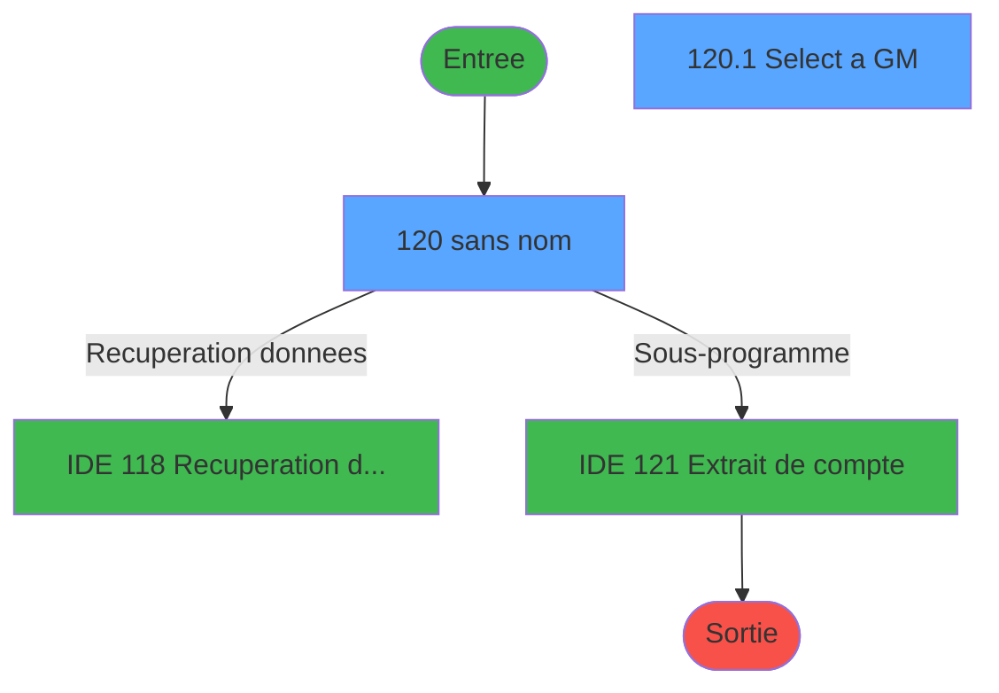
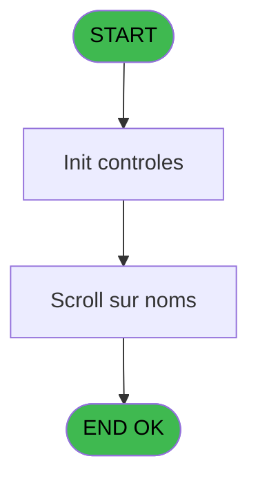
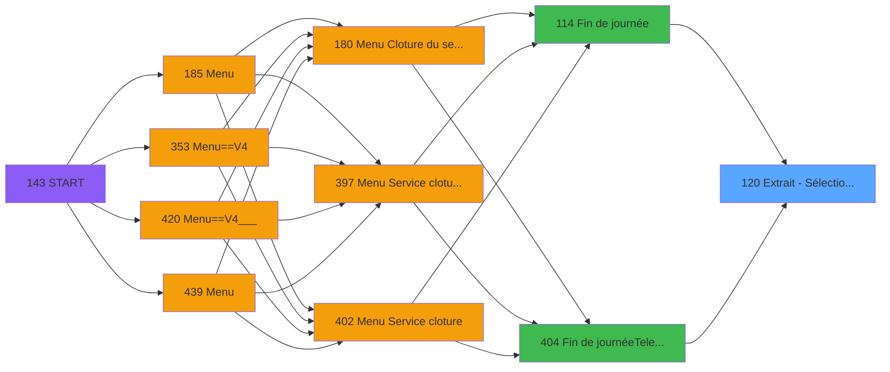
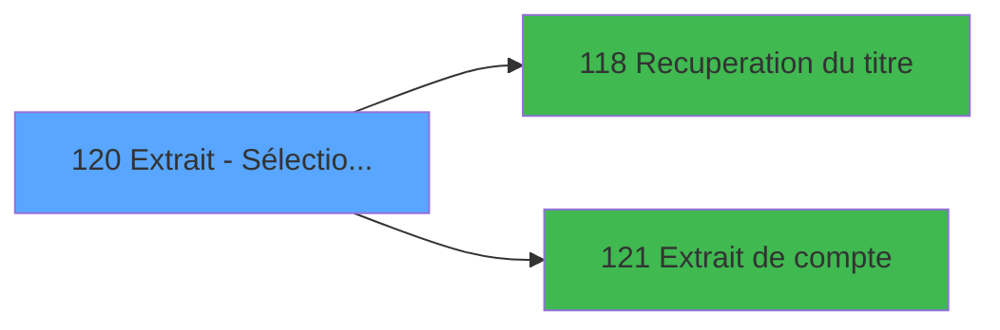

# PVE IDE 120 - Extrait - Sélection d'un GM

> **Analyse**: Phases 1-4 2026-02-03 09:32 -> 09:32 (17s) | Assemblage 09:32
> **Pipeline**: V7.2 Enrichi
> **Structure**: 4 onglets (Resume | Ecrans | Donnees | Connexions)

<!-- TAB:Resume -->

## 1. FICHE D'IDENTITE

| Attribut | Valeur |
|----------|--------|
| Projet | PVE |
| IDE Position | 120 |
| Nom Programme | Extrait - Sélection d'un GM |
| Fichier source | `Prg_120.xml` |
| Domaine metier | Comptabilite |
| Taches | 2 (2 ecrans visibles) |
| Tables modifiees | 0 |
| Programmes appeles | 2 |

## 2. DESCRIPTION FONCTIONNELLE

**Extrait - Sélection d'un GM** assure la gestion complete de ce processus, accessible depuis [Fin de journée (IDE 114)](PVE-IDE-114.md), [Fin de journée(Telecollecte) (IDE 404)](PVE-IDE-404.md).

Le flux de traitement s'organise en **2 blocs fonctionnels** :

- **Consultation** (1 tache) : ecrans de recherche, selection et consultation
- **Traitement** (1 tache) : traitements metier divers

Detail : phases du traitement

#### Phase 1 : Traitement (1 tache)

- **120** - (sans nom) **[[ECRAN]](#ecran-t1)**

Delegue a : [Recuperation du titre (IDE 118)](PVE-IDE-118.md)

#### Phase 2 : Consultation (1 tache)

- **120.1** - Select a GM **[[ECRAN]](#ecran-t2)**

Delegue a : [Recuperation du titre (IDE 118)](PVE-IDE-118.md)

## 3. BLOCS FONCTIONNELS

### 3.1 Traitement (1 tache)

Traitements internes.

---

#### 120 - (sans nom) [[ECRAN]](#ecran-t1)

**Role** : Traitement interne.
**Ecran** : 592 x 375 DLU (MDI) | [Voir mockup](#ecran-t1)
**Delegue a** : [Recuperation du titre (IDE 118)](PVE-IDE-118.md)

### 3.2 Consultation (1 tache)

Ecrans de recherche et consultation.

---

#### 120.1 - Select a GM [[ECRAN]](#ecran-t2)

**Role** : Traitement : Select a GM.
**Ecran** : 517 x 284 DLU (MDI) | [Voir mockup](#ecran-t2)

## 5. REGLES METIER

*(Aucune regle metier identifiee)*

## 6. CONTEXTE

- **Appele par**: [Fin de journée (IDE 114)](PVE-IDE-114.md), [Fin de journée(Telecollecte) (IDE 404)](PVE-IDE-404.md)
- **Appelle**: 2 programmes | **Tables**: 3 (W:0 R:1 L:2) | **Taches**: 2 | **Expressions**: 4

<!-- TAB:Ecrans -->

## 8. ECRANS

### 8.1 Forms visibles (2 / 2)

| # | Position | Tache | Nom | Type | Largeur | Hauteur | Bloc |
|---|----------|-------|-----|------|---------|---------|------|
| 1 | 120 | 120 | (sans nom) | MDI | 592 | 375 | Traitement |
| 2 | 120.1 | 120.1 | Select a GM | MDI | 517 | 284 | Consultation |

### 8.2 Mockups Ecrans

---

#### 120 - (sans nom)
**Tache** : [120](#t1) | **Type** : MDI | **Dimensions** : 592 x 375 DLU
**Bloc** : Traitement | **Titre IDE** : (sans nom)

<!-- FORM-DATA:
{
    "width":  592,
    "vFactor":  8,
    "type":  "MDI",
    "hFactor":  8,
    "controls":  [
                     {
                         "x":  7,
                         "type":  "label",
                         "var":  "",
                         "y":  8,
                         "w":  284,
                         "fmt":  "",
                         "name":  "",
                         "h":  38,
                         "color":  "187",
                         "text":  "Input the name of the GM",
                         "parent":  null
                     },
                     {
                         "x":  423,
                         "type":  "image",
                         "var":  "",
                         "y":  5,
                         "w":  160,
                         "fmt":  "",
                         "name":  "",
                         "h":  46,
                         "color":  "",
                         "text":  "",
                         "parent":  null
                     },
                     {
                         "x":  30,
                         "type":  "edit",
                         "var":  "",
                         "y":  25,
                         "w":  232,
                         "fmt":  "",
                         "name":  "WP0 chaîne recherche",
                         "h":  10,
                         "color":  "6",
                         "text":  "",
                         "parent":  2
                     },
                     {
                         "x":  7,
                         "type":  "subform",
                         "var":  "",
                         "y":  56,
                         "w":  579,
                         "fmt":  "",
                         "name":  "Scroll sur noms",
                         "h":  313,
                         "color":  "",
                         "text":  "",
                         "parent":  null
                     }
                 ],
    "taskId":  "120",
    "height":  375
}
-->

<strong>Champs : 1 champs</strong>

| Pos (x,y) | Nom | Variable | Type |
|-----------|-----|----------|------|
| 30,25 | WP0 chaîne recherche | - | edit |

---

#### 120.1 - Select a GM
**Tache** : [120.1](#t2) | **Type** : MDI | **Dimensions** : 517 x 284 DLU
**Bloc** : Consultation | **Titre IDE** : Select a GM

<!-- FORM-DATA:
{
    "width":  517,
    "vFactor":  8,
    "type":  "MDI",
    "hFactor":  8,
    "controls":  [
                     {
                         "x":  6,
                         "type":  "label",
                         "var":  "",
                         "y":  251,
                         "w":  504,
                         "fmt":  "",
                         "name":  "",
                         "h":  31,
                         "color":  "183",
                         "text":  "",
                         "parent":  null
                     },
                     {
                         "x":  18,
                         "type":  "table",
                         "var":  "",
                         "name":  "",
                         "titleH":  12,
                         "color":  "110",
                         "w":  490,
                         "y":  14,
                         "fmt":  "",
                         "parent":  null,
                         "text":  "",
                         "rowH":  12,
                         "h":  234,
                         "cols":  [
                                      {
                                          "title":  "Nom",
                                          "layer":  1,
                                          "w":  224
                                      },
                                      {
                                          "title":  "Prénom",
                                          "layer":  2,
                                          "w":  231
                                      }
                                  ],
                         "rows":  2
                     },
                     {
                         "x":  22,
                         "type":  "label",
                         "var":  "",
                         "y":  28,
                         "w":  23,
                         "fmt":  "",
                         "name":  "",
                         "h":  9,
                         "color":  "144",
                         "text":  "8",
                         "parent":  2
                     },
                     {
                         "x":  50,
                         "type":  "label",
                         "var":  "",
                         "y":  28,
                         "w":  18,
                         "fmt":  "",
                         "name":  "",
                         "h":  9,
                         "color":  "142",
                         "text":  "è",
                         "parent":  2
                     },
                     {
                         "x":  400,
                         "type":  "label",
                         "var":  "",
                         "y":  29,
                         "w":  18,
                         "fmt":  "",
                         "name":  "",
                         "h":  8,
                         "color":  "149",
                         "text":  "m",
                         "parent":  2
                     },
                     {
                         "x":  78,
                         "type":  "edit",
                         "var":  "",
                         "y":  29,
                         "w":  165,
                         "fmt":  "U14",
                         "name":  "",
                         "h":  8,
                         "color":  "110",
                         "text":  "",
                         "parent":  2
                     },
                     {
                         "x":  251,
                         "type":  "edit",
                         "var":  "",
                         "y":  28,
                         "w":  98,
                         "fmt":  "",
                         "name":  "",
                         "h":  8,
                         "color":  "110",
                         "text":  "",
                         "parent":  2
                     },
                     {
                         "x":  343,
                         "type":  "button",
                         "var":  "",
                         "y":  258,
                         "w":  154,
                         "fmt":  "Extrait",
                         "name":  "BP. ExtraitCompte",
                         "h":  18,
                         "color":  "",
                         "text":  "",
                         "parent":  1
                     },
                     {
                         "x":  362,
                         "type":  "edit",
                         "var":  "",
                         "y":  28,
                         "w":  30,
                         "fmt":  "2",
                         "name":  "",
                         "h":  8,
                         "color":  "110",
                         "text":  "",
                         "parent":  2
                     },
                     {
                         "x":  437,
                         "type":  "image",
                         "var":  "",
                         "y":  29,
                         "w":  26,
                         "fmt":  "",
                         "name":  "",
                         "h":  8,
                         "color":  "",
                         "text":  "",
                         "parent":  2
                     },
                     {
                         "x":  26,
                         "type":  "button",
                         "var":  "",
                         "y":  258,
                         "w":  154,
                         "fmt":  "\u0026Exit",
                         "name":  "BP. Exit",
                         "h":  18,
                         "color":  "",
                         "text":  "",
                         "parent":  1
                     }
                 ],
    "taskId":  "120.1",
    "height":  284
}
-->

<strong>Champs : 3 champs</strong>

| Pos (x,y) | Nom | Variable | Type |
|-----------|-----|----------|------|
| 78,29 | U14 | - | edit |
| 251,28 | (sans nom) | - | edit |
| 362,28 | 2 | - | edit |

<strong>Boutons : 2 boutons</strong>

| Bouton | Pos (x,y) | Action |
|--------|-----------|--------|
| Extrait | 343,258 | Appel [Extrait de compte (IDE 121)](PVE-IDE-121.md) |
| Exit | 26,258 | Quitte le programme |

## 9. NAVIGATION

### 9.1 Enchainement des ecrans

**Detail par enchainement :**

| Depuis | Action | Vers | Retour |
|--------|--------|------|--------|
|  | Recuperation donnees | [Recuperation du titre (IDE 118)](PVE-IDE-118.md) | Retour ecran |
|  | Sous-programme | [Extrait de compte (IDE 121)](PVE-IDE-121.md) | Retour ecran |

### 9.3 Structure hierarchique (2 taches)

| Position | Tache | Type | Dimensions | Bloc |
|----------|-------|------|------------|------|
| **120.1** | [**(sans nom)** (120)](#t1) [mockup](#ecran-t1) | MDI | 592x375 | Traitement |
| **120.2** | [**Select a GM** (120.1)](#t2) [mockup](#ecran-t2) | MDI | 517x284 | Consultation |

### 9.4 Algorigramme

> **Legende**: Vert = START/END OK | Rouge = END KO | Bleu = Decisions
> *Algorigramme auto-genere. Utiliser `/algorigramme` pour une synthese metier detaillee.*

<!-- TAB:Donnees -->

## 10. TABLES

### Tables utilisees (3)

| ID | Nom | Description | Type | R | W | L | Usages |
|----|-----|-------------|------|---|---|---|--------|
| 30 | gm-recherche_____gmr | Index de recherche | DB | R |   |   | 1 |
| 31 | gm-complet_______gmc |  | DB |   |   | L | 1 |
| 47 | compte_gm________cgm | Comptes GM (generaux) | DB |   |   | L | 1 |

### Colonnes par table (2 / 1 tables avec colonnes identifiees)

Table 30 - gm-recherche_____gmr (R) - 1 usages

| Lettre | Variable | Acces | Type |
|--------|----------|-------|------|
| A | P Societe | R | Alpha |
| B | W1 code GM | R | Numeric |
| C | W1 affiliation | R | Numeric |
| D | W1 control_fin | R | Alpha |
| E | W1 détecte '*' | R | Alpha |
| F | W1 chaîne_recherchée | R | Alpha |
| G | v. titre | R | Alpha |
| H | BP. Exit | R | Alpha |
| I | BP. ExtraitCompte | R | Alpha |

## 11. VARIABLES

### 11.1 Parametres entrants (8)

Variables recues du programme appelant ([Fin de journée (IDE 114)](PVE-IDE-114.md)).

| Lettre | Nom | Type | Usage dans |
|--------|-----|------|-----------|
| A | P. Société | Alpha | 1x parametre entrant |
| B | P. Nbre_de_décimales | Numeric | - |
| C | P. Masque montant | Alpha | - |
| D | P. Devise locale | Alpha | - |
| E | P. Code village | Alpha | - |
| F | P. Nom village | Alpha | - |
| G | P. Choix (H/I) | Alpha | - |
| H | P. Service | Alpha | - |

### 11.2 Variables de travail (1)

Variables internes au programme.

| Lettre | Nom | Type | Usage dans |
|--------|-----|------|-----------|
| I | W0 choix action | Logical | 1x calcul interne |

### 11.3 Autres (3)

Variables diverses.

| Lettre | Nom | Type | Usage dans |
|--------|-----|------|-----------|
| J | WP0 chaîne recherche | Alpha | - |
| K | WP0 code GM | Numeric | - |
| L | WP0 filiation | Numeric | - |

## 12. EXPRESSIONS

**4 / 4 expressions decodees (100%)**

### 12.1 Repartition par type

| Type | Expressions | Regles |
|------|-------------|--------|
| CONSTANTE | 1 | 0 |
| CONDITION | 1 | 0 |
| OTHER | 1 | 0 |
| CAST_LOGIQUE | 1 | 0 |

### 12.2 Expressions cles par type

#### CONSTANTE (1 expressions)

| Type | IDE | Expression | Regle |
|------|-----|------------|-------|
| CONSTANTE | 2 | `'C'` | - |

#### CONDITION (1 expressions)

| Type | IDE | Expression | Regle |
|------|-----|------------|-------|
| CONDITION | 1 | `P. Société [A]=''` | - |

#### OTHER (1 expressions)

| Type | IDE | Expression | Regle |
|------|-----|------------|-------|
| OTHER | 3 | `W0 choix action [I]` | - |

#### CAST_LOGIQUE (1 expressions)

| Type | IDE | Expression | Regle |
|------|-----|------------|-------|
| CAST_LOGIQUE | 4 | `'FALSE'LOG` | - |

<!-- TAB:Connexions -->

## 13. GRAPHE D'APPELS

### 13.1 Chaine depuis Main (Callers)

Main -> ... -> [Fin de journée (IDE 114)](PVE-IDE-114.md) -> **Extrait - Sélection d'un GM (IDE 120)**

Main -> ... -> [Fin de journée(Telecollecte) (IDE 404)](PVE-IDE-404.md) -> **Extrait - Sélection d'un GM (IDE 120)**

### 13.2 Callers

| IDE | Nom Programme | Nb Appels |
|-----|---------------|-----------|
| [114](PVE-IDE-114.md) | Fin de journée | 1 |
| [404](PVE-IDE-404.md) | Fin de journée(Telecollecte) | 1 |

### 13.3 Callees (programmes appeles)

### 13.4 Detail Callees avec contexte

| IDE | Nom Programme | Appels | Contexte |
|-----|---------------|--------|----------|
| [118](PVE-IDE-118.md) | Recuperation du titre | 1 | Recuperation donnees |
| [121](PVE-IDE-121.md) | Extrait de compte | 1 | Sous-programme |

## 14. RECOMMANDATIONS MIGRATION

### 14.1 Profil du programme

| Metrique | Valeur | Impact migration |
|----------|--------|-----------------|
| Lignes de logique | 58 | Programme compact |
| Expressions | 4 | Peu de logique |
| Tables WRITE | 0 | Impact faible |
| Sous-programmes | 2 | Peu de dependances |
| Ecrans visibles | 2 | Quelques ecrans |
| Code desactive | 0% (0 / 58) | Code sain |
| Regles metier | 0 | Pas de regle identifiee |

### 14.2 Plan de migration par bloc

#### Traitement (1 tache: 1 ecran, 0 traitement)

- **Strategie** : 1 composant(s) UI (Razor/React) avec formulaires et validation.
- 2 sous-programme(s) a migrer ou a reutiliser depuis les services existants.
- Decomposer les taches en services unitaires testables.

#### Consultation (1 tache: 1 ecran, 0 traitement)

- **Strategie** : Composants de recherche/selection en modales.
- 1 ecran : Select a GM

### 14.3 Dependances critiques

| Dependance | Type | Appels | Impact |
|------------|------|--------|--------|
| [Extrait de compte (IDE 121)](PVE-IDE-121.md) | Sous-programme | 1x | Normale - Sous-programme |
| [Recuperation du titre (IDE 118)](PVE-IDE-118.md) | Sous-programme | 1x | Normale - Recuperation donnees |

---
*Spec DETAILED generee par Pipeline V7.2 - 2026-02-03 09:32*
