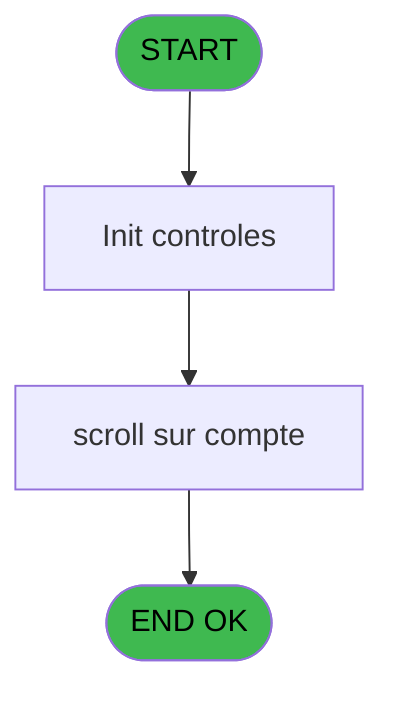
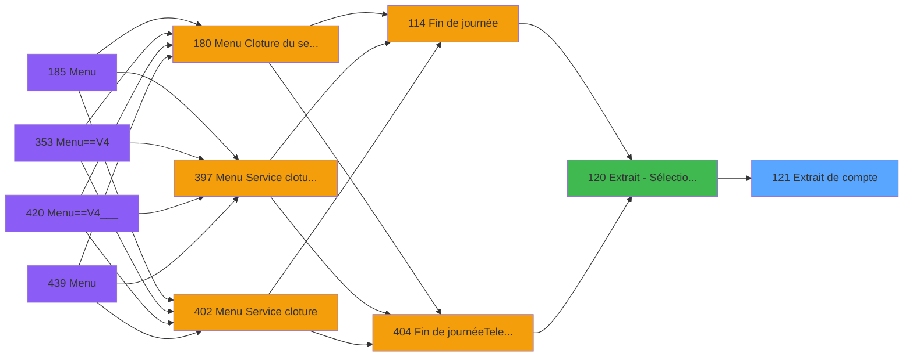
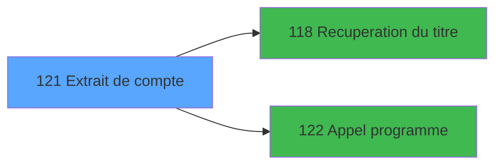

# PVE IDE 121 - Extrait de compte

> **Analyse**: Phases 1-4 2026-02-03 09:32 -> 09:32 (19s) | Assemblage 09:32
> **Pipeline**: V7.2 Enrichi
> **Structure**: 4 onglets (Resume | Ecrans | Donnees | Connexions)

<!-- TAB:Resume -->

## 1. FICHE D'IDENTITE

| Attribut | Valeur |
|----------|--------|
| Projet | PVE |
| IDE Position | 121 |
| Nom Programme | Extrait de compte |
| Fichier source | `Prg_121.xml` |
| Domaine metier | Comptabilite |
| Taches | 2 (1 ecrans visibles) |
| Tables modifiees | 0 |
| Programmes appeles | 2 |

## 2. DESCRIPTION FONCTIONNELLE

**Extrait de compte** assure la gestion complete de ce processus, accessible depuis [Extrait - Sélection d'un GM (IDE 120)](PVE-IDE-120.md).

Le flux de traitement s'organise en **1 blocs fonctionnels** :

- **Calcul** (2 taches) : calculs de montants, stocks ou compteurs

## 3. BLOCS FONCTIONNELS

### 3.1 Calcul (2 taches)

Calculs metier : montants, stocks, compteurs.

---

#### 121 - Extrait de compte [[ECRAN]](#ecran-t1)

**Role** : Traitement : Extrait de compte.
**Ecran** : 166 x 15 DLU (MDI) | [Voir mockup](#ecran-t1)

---

#### 121.1 - Scroll compte origine [[ECRAN]](#ecran-t2)

**Role** : Traitement : Scroll compte origine.
**Ecran** : 1109 x 276 DLU (MDI) | [Voir mockup](#ecran-t2)

## 5. REGLES METIER

*(Aucune regle metier identifiee)*

## 6. CONTEXTE

- **Appele par**: [Extrait - Sélection d'un GM (IDE 120)](PVE-IDE-120.md)
- **Appelle**: 2 programmes | **Tables**: 5 (W:0 R:2 L:3) | **Taches**: 2 | **Expressions**: 5

<!-- TAB:Ecrans -->

## 8. ECRANS

### 8.1 Forms visibles (1 / 2)

| # | Position | Tache | Nom | Type | Largeur | Hauteur | Bloc |
|---|----------|-------|-----|------|---------|---------|------|
| 1 | 121.1 | 121.1 | Scroll compte origine | MDI | 1109 | 276 | Calcul |

### 8.2 Mockups Ecrans

---

#### 121.1 - Scroll compte origine
**Tache** : [121.1](#t2) | **Type** : MDI | **Dimensions** : 1109 x 276 DLU
**Bloc** : Calcul | **Titre IDE** : Scroll compte origine

<!-- FORM-DATA:
{
    "width":  1109,
    "vFactor":  8,
    "type":  "MDI",
    "hFactor":  8,
    "controls":  [
                     {
                         "x":  0,
                         "type":  "label",
                         "var":  "",
                         "y":  1,
                         "w":  1106,
                         "fmt":  "",
                         "name":  "",
                         "h":  19,
                         "color":  "",
                         "text":  "",
                         "parent":  null
                     },
                     {
                         "x":  21,
                         "type":  "label",
                         "var":  "",
                         "y":  166,
                         "w":  663,
                         "fmt":  "",
                         "name":  "",
                         "h":  79,
                         "color":  "",
                         "text":  "",
                         "parent":  null
                     },
                     {
                         "x":  239,
                         "type":  "label",
                         "var":  "",
                         "y":  170,
                         "w":  434,
                         "fmt":  "",
                         "name":  "",
                         "h":  70,
                         "color":  "",
                         "text":  "",
                         "parent":  null
                     },
                     {
                         "x":  242,
                         "type":  "label",
                         "var":  "",
                         "y":  171,
                         "w":  430,
                         "fmt":  "",
                         "name":  "",
                         "h":  68,
                         "color":  "",
                         "text":  "",
                         "parent":  null
                     },
                     {
                         "x":  267,
                         "type":  "label",
                         "var":  "",
                         "y":  175,
                         "w":  186,
                         "fmt":  "",
                         "name":  "",
                         "h":  43,
                         "color":  "",
                         "text":  "",
                         "parent":  null
                     },
                     {
                         "x":  453,
                         "type":  "label",
                         "var":  "",
                         "y":  175,
                         "w":  208,
                         "fmt":  "",
                         "name":  "",
                         "h":  43,
                         "color":  "",
                         "text":  "",
                         "parent":  null
                     },
                     {
                         "x":  268,
                         "type":  "label",
                         "var":  "",
                         "y":  176,
                         "w":  37,
                         "fmt":  "",
                         "name":  "",
                         "h":  41,
                         "color":  "",
                         "text":  "",
                         "parent":  null
                     },
                     {
                         "x":  454,
                         "type":  "label",
                         "var":  "",
                         "y":  176,
                         "w":  37,
                         "fmt":  "",
                         "name":  "",
                         "h":  41,
                         "color":  "",
                         "text":  "",
                         "parent":  null
                     },
                     {
                         "x":  313,
                         "type":  "label",
                         "var":  "",
                         "y":  181,
                         "w":  127,
                         "fmt":  "",
                         "name":  "",
                         "h":  8,
                         "color":  "142",
                         "text":  "Cumulé",
                         "parent":  null
                     },
                     {
                         "x":  499,
                         "type":  "label",
                         "var":  "",
                         "y":  181,
                         "w":  154,
                         "fmt":  "",
                         "name":  "",
                         "h":  8,
                         "color":  "142",
                         "text":  "Libelle",
                         "parent":  null
                     },
                     {
                         "x":  313,
                         "type":  "label",
                         "var":  "",
                         "y":  193,
                         "w":  127,
                         "fmt":  "",
                         "name":  "",
                         "h":  8,
                         "color":  "142",
                         "text":  "Date",
                         "parent":  null
                     },
                     {
                         "x":  499,
                         "type":  "label",
                         "var":  "",
                         "y":  193,
                         "w":  154,
                         "fmt":  "",
                         "name":  "",
                         "h":  8,
                         "color":  "142",
                         "text":  "Nom",
                         "parent":  null
                     },
                     {
                         "x":  313,
                         "type":  "label",
                         "var":  "",
                         "y":  205,
                         "w":  127,
                         "fmt":  "",
                         "name":  "",
                         "h":  8,
                         "color":  "142",
                         "text":  "Imputation",
                         "parent":  null
                     },
                     {
                         "x":  499,
                         "type":  "label",
                         "var":  "",
                         "y":  205,
                         "w":  154,
                         "fmt":  "",
                         "name":  "",
                         "h":  8,
                         "color":  "142",
                         "text":  "Date / Imput.",
                         "parent":  null
                     },
                     {
                         "x":  368,
                         "type":  "label",
                         "var":  "",
                         "y":  225,
                         "w":  120,
                         "fmt":  "",
                         "name":  "",
                         "h":  9,
                         "color":  "",
                         "text":  "Votre choix",
                         "parent":  null
                     },
                     {
                         "x":  0,
                         "type":  "label",
                         "var":  "",
                         "y":  250,
                         "w":  1106,
                         "fmt":  "",
                         "name":  "",
                         "h":  24,
                         "color":  "",
                         "text":  "",
                         "parent":  null
                     },
                     {
                         "x":  18,
                         "type":  "table",
                         "var":  "",
                         "name":  "",
                         "titleH":  14,
                         "color":  "110",
                         "w":  1077,
                         "y":  24,
                         "fmt":  "",
                         "parent":  null,
                         "text":  "",
                         "rowH":  11,
                         "h":  137,
                         "cols":  [
                                      {
                                          "title":  "Crédit/Débit",
                                          "layer":  1,
                                          "w":  122
                                      },
                                      {
                                          "title":  "Date",
                                          "layer":  2,
                                          "w":  140
                                      },
                                      {
                                          "title":  "Libellé",
                                          "layer":  3,
                                          "w":  210
                                      },
                                      {
                                          "title":  "Libellé Supplem.",
                                          "layer":  4,
                                          "w":  242
                                      },
                                      {
                                          "title":  "Nbre d\u0027articles",
                                          "layer":  5,
                                          "w":  131
                                      },
                                      {
                                          "title":  "Montant",
                                          "layer":  6,
                                          "w":  199
                                      }
                                  ],
                         "rows":  6
                     },
                     {
                         "x":  690,
                         "type":  "label",
                         "var":  "",
                         "y":  163,
                         "w":  394,
                         "fmt":  "",
                         "name":  "",
                         "h":  29,
                         "color":  "",
                         "text":  "",
                         "parent":  null
                     },
                     {
                         "x":  692,
                         "type":  "line",
                         "var":  "",
                         "y":  178,
                         "w":  391,
                         "fmt":  "",
                         "name":  "",
                         "h":  0,
                         "color":  "",
                         "text":  "",
                         "parent":  37
                     },
                     {
                         "x":  698,
                         "type":  "label",
                         "var":  "",
                         "y":  179,
                         "w":  83,
                         "fmt":  "",
                         "name":  "",
                         "h":  10,
                         "color":  "142",
                         "text":  "Opérateur",
                         "parent":  36
                     },
                     {
                         "x":  146,
                         "type":  "edit",
                         "var":  "",
                         "y":  40,
                         "w":  112,
                         "fmt":  "##/##/####Z",
                         "name":  "CTRL_001",
                         "h":  8,
                         "color":  "110",
                         "text":  "",
                         "parent":  22
                     },
                     {
                         "x":  304,
                         "type":  "edit",
                         "var":  "",
                         "y":  40,
                         "w":  176,
                         "fmt":  "",
                         "name":  "",
                         "h":  8,
                         "color":  "110",
                         "text":  "",
                         "parent":  22
                     },
                     {
                         "x":  525,
                         "type":  "edit",
                         "var":  "",
                         "y":  40,
                         "w":  176,
                         "fmt":  "U15",
                         "name":  "CTRL_002",
                         "h":  8,
                         "color":  "110",
                         "text":  "",
                         "parent":  22
                     },
                     {
                         "x":  30,
                         "type":  "edit",
                         "var":  "",
                         "y":  40,
                         "w":  30,
                         "fmt":  "UX",
                         "name":  "",
                         "h":  8,
                         "color":  "110",
                         "text":  "",
                         "parent":  22
                     },
                     {
                         "x":  869,
                         "type":  "edit",
                         "var":  "",
                         "y":  40,
                         "w":  176,
                         "fmt":  "15",
                         "name":  "",
                         "h":  8,
                         "color":  "110",
                         "text":  "",
                         "parent":  22
                     },
                     {
                         "x":  786,
                         "type":  "edit",
                         "var":  "",
                         "y":  40,
                         "w":  30,
                         "fmt":  "2Z",
                         "name":  "",
                         "h":  8,
                         "color":  "110",
                         "text":  "",
                         "parent":  22
                     },
                     {
                         "x":  966,
                         "type":  "edit",
                         "var":  "",
                         "y":  179,
                         "w":  101,
                         "fmt":  "",
                         "name":  "",
                         "h":  10,
                         "color":  "142",
                         "text":  "",
                         "parent":  36
                     },
                     {
                         "x":  500,
                         "type":  "edit",
                         "var":  "",
                         "y":  224,
                         "w":  26,
                         "fmt":  "",
                         "name":  "W1 Choix_action",
                         "h":  10,
                         "color":  "110",
                         "text":  "",
                         "parent":  null
                     },
                     {
                         "x":  10,
                         "type":  "edit",
                         "var":  "",
                         "y":  6,
                         "w":  256,
                         "fmt":  "20",
                         "name":  "",
                         "h":  8,
                         "color":  "",
                         "text":  "",
                         "parent":  null
                     },
                     {
                         "x":  895,
                         "type":  "edit",
                         "var":  "",
                         "y":  6,
                         "w":  203,
                         "fmt":  "WWW DD MMM YYYYT",
                         "name":  "",
                         "h":  8,
                         "color":  "",
                         "text":  "",
                         "parent":  null
                     },
                     {
                         "x":  757,
                         "type":  "edit",
                         "var":  "",
                         "y":  40,
                         "w":  19,
                         "fmt":  "1",
                         "name":  "",
                         "h":  8,
                         "color":  "110",
                         "text":  "",
                         "parent":  22
                     },
                     {
                         "x":  696,
                         "type":  "edit",
                         "var":  "",
                         "y":  167,
                         "w":  371,
                         "fmt":  "40",
                         "name":  "",
                         "h":  11,
                         "color":  "142",
                         "text":  "",
                         "parent":  36
                     },
                     {
                         "x":  44,
                         "type":  "image",
                         "var":  "",
                         "y":  177,
                         "w":  160,
                         "fmt":  "",
                         "name":  "",
                         "h":  58,
                         "color":  "",
                         "text":  "",
                         "parent":  null
                     },
                     {
                         "x":  272,
                         "type":  "button",
                         "var":  "",
                         "y":  179,
                         "w":  26,
                         "fmt":  "C",
                         "name":  "C",
                         "h":  9,
                         "color":  "",
                         "text":  "",
                         "parent":  null
                     },
                     {
                         "x":  458,
                         "type":  "button",
                         "var":  "",
                         "y":  180,
                         "w":  26,
                         "fmt":  "L",
                         "name":  "L",
                         "h":  9,
                         "color":  "",
                         "text":  "",
                         "parent":  null
                     },
                     {
                         "x":  272,
                         "type":  "button",
                         "var":  "",
                         "y":  192,
                         "w":  26,
                         "fmt":  "D",
                         "name":  "D",
                         "h":  9,
                         "color":  "",
                         "text":  "",
                         "parent":  null
                     },
                     {
                         "x":  458,
                         "type":  "button",
                         "var":  "",
                         "y":  192,
                         "w":  26,
                         "fmt":  "N",
                         "name":  "N",
                         "h":  9,
                         "color":  "",
                         "text":  "",
                         "parent":  null
                     },
                     {
                         "x":  894,
                         "type":  "image",
                         "var":  "",
                         "y":  202,
                         "w":  124,
                         "fmt":  "",
                         "name":  "",
                         "h":  42,
                         "color":  "",
                         "text":  "",
                         "parent":  null
                     },
                     {
                         "x":  272,
                         "type":  "button",
                         "var":  "",
                         "y":  204,
                         "w":  26,
                         "fmt":  "I",
                         "name":  "I",
                         "h":  9,
                         "color":  "",
                         "text":  "",
                         "parent":  null
                     },
                     {
                         "x":  458,
                         "type":  "button",
                         "var":  "",
                         "y":  204,
                         "w":  26,
                         "fmt":  "O",
                         "name":  "O",
                         "h":  9,
                         "color":  "",
                         "text":  "",
                         "parent":  null
                     },
                     {
                         "x":  9,
                         "type":  "button",
                         "var":  "",
                         "y":  253,
                         "w":  168,
                         "fmt":  "\u0026Quitter",
                         "name":  "",
                         "h":  18,
                         "color":  "",
                         "text":  "",
                         "parent":  null
                     }
                 ],
    "taskId":  "121.1",
    "height":  276
}
-->

<strong>Champs : 12 champs</strong>

| Pos (x,y) | Nom | Variable | Type |
|-----------|-----|----------|------|
| 146,40 | CTRL_001 | - | edit |
| 304,40 | (sans nom) | - | edit |
| 525,40 | CTRL_002 | - | edit |
| 30,40 | UX | - | edit |
| 869,40 | 15 | - | edit |
| 786,40 | 2Z | - | edit |
| 966,179 | (sans nom) | - | edit |
| 500,224 | W1 Choix_action | - | edit |
| 10,6 | 20 | - | edit |
| 895,6 | WWW DD MMM YYYYT | - | edit |
| 757,40 | 1 | - | edit |
| 696,167 | 40 | - | edit |

<strong>Boutons : 7 boutons</strong>

| Bouton | Pos (x,y) | Action |
|--------|-----------|--------|
| C | 272,179 | Bouton fonctionnel |
| L | 458,180 | Bouton fonctionnel |
| D | 272,192 | Bouton fonctionnel |
| N | 458,192 | Bouton fonctionnel |
| I | 272,204 | Bouton fonctionnel |
| O | 458,204 | Bouton fonctionnel |
| Quitter | 9,253 | Quitte le programme |

## 9. NAVIGATION

Ecran unique: **Scroll compte origine**

### 9.3 Structure hierarchique (2 taches)

| Position | Tache | Type | Dimensions | Bloc |
|----------|-------|------|------------|------|
| **121.1** | [**Extrait de compte** (121)](#t1) [mockup](#ecran-t1) | MDI | 166x15 | Calcul |
| 121.1.1 | [Scroll compte origine (121.1)](#t2) [mockup](#ecran-t2) | MDI | 1109x276 | |

### 9.4 Algorigramme

> **Legende**: Vert = START/END OK | Rouge = END KO | Bleu = Decisions
> *Algorigramme auto-genere. Utiliser `/algorigramme` pour une synthese metier detaillee.*

<!-- TAB:Donnees -->

## 10. TABLES

### Tables utilisees (5)

| ID | Nom | Description | Type | R | W | L | Usages |
|----|-----|-------------|------|---|---|---|--------|
| 30 | gm-recherche_____gmr | Index de recherche | DB |   |   | L | 1 |
| 40 | comptable________cte |  | DB | R |   |   | 1 |
| 70 | date_comptable___dat |  | DB |   |   | L | 1 |
| 77 | articles_________art | Articles et stock | DB |   |   | L | 1 |
| 786 | qualite_avant_reprise |  | DB | R |   |   | 1 |

### Colonnes par table (2 / 2 tables avec colonnes identifiees)

Table 40 - comptable________cte (R) - 1 usages

| Lettre | Variable | Acces | Type |
|--------|----------|-------|------|
| A | W1 extrait de compte present | R | Logical |
| B | W1 Choix_action | R | Alpha |
| C | v.titre | R | Alpha |

Table 786 - qualite_avant_reprise (R) - 1 usages

| Lettre | Variable | Acces | Type |
|--------|----------|-------|------|
| A | > société | R | Alpha |
| B | > code_adhérent | R | Numeric |
| C | > filiation | R | Numeric |
| D | > masque mtt | R | Alpha |
| E | > service | R | Alpha |

## 11. VARIABLES

### 11.1 Autres (5)

Variables diverses.

| Lettre | Nom | Type | Usage dans |
|--------|-----|------|-----------|
| A | > société | Alpha | 2x refs |
| B | > code_adhérent | Numeric | 1x refs |
| C | > filiation | Numeric | 1x refs |
| D | > masque mtt | Alpha | - |
| E | > service | Alpha | - |

## 12. EXPRESSIONS

**5 / 5 expressions decodees (100%)**

### 12.1 Repartition par type

| Type | Expressions | Regles |
|------|-------------|--------|
| CONSTANTE | 1 | 0 |
| CONDITION | 4 | 0 |

### 12.2 Expressions cles par type

#### CONSTANTE (1 expressions)

| Type | IDE | Expression | Regle |
|------|-----|------------|-------|
| CONSTANTE | 2 | `'C'` | - |

#### CONDITION (4 expressions)

| Type | IDE | Expression | Regle |
|------|-----|------------|-------|
| CONDITION | 4 | `> code_adhérent [B]` | - |
| CONDITION | 5 | `> filiation [C]` | - |
| CONDITION | 1 | `> société [A]=''` | - |
| CONDITION | 3 | `> société [A]` | - |

<!-- TAB:Connexions -->

## 13. GRAPHE D'APPELS

### 13.1 Chaine depuis Main (Callers)

Main -> ... -> [Extrait - Sélection d'un GM (IDE 120)](PVE-IDE-120.md) -> **Extrait de compte (IDE 121)**

### 13.2 Callers

| IDE | Nom Programme | Nb Appels |
|-----|---------------|-----------|
| [120](PVE-IDE-120.md) | Extrait - Sélection d'un GM | 1 |

### 13.3 Callees (programmes appeles)

### 13.4 Detail Callees avec contexte

| IDE | Nom Programme | Appels | Contexte |
|-----|---------------|--------|----------|
| [118](PVE-IDE-118.md) | Recuperation du titre | 1 | Recuperation donnees |
| [122](PVE-IDE-122.md) | Appel programme | 1 | Sous-programme |

## 14. RECOMMANDATIONS MIGRATION

### 14.1 Profil du programme

| Metrique | Valeur | Impact migration |
|----------|--------|-----------------|
| Lignes de logique | 81 | Programme compact |
| Expressions | 5 | Peu de logique |
| Tables WRITE | 0 | Impact faible |
| Sous-programmes | 2 | Peu de dependances |
| Ecrans visibles | 1 | Ecran unique ou traitement batch |
| Code desactive | 0% (0 / 81) | Code sain |
| Regles metier | 0 | Pas de regle identifiee |

### 14.2 Plan de migration par bloc

#### Calcul (2 taches: 2 ecrans, 0 traitement)

- **Strategie** : Services de calcul purs (Domain Services).
- Migrer la logique de calcul (stock, compteurs, montants)

### 14.3 Dependances critiques

| Dependance | Type | Appels | Impact |
|------------|------|--------|--------|
| [Appel programme (IDE 122)](PVE-IDE-122.md) | Sous-programme | 1x | Normale - Sous-programme |
| [Recuperation du titre (IDE 118)](PVE-IDE-118.md) | Sous-programme | 1x | Normale - Recuperation donnees |

---
*Spec DETAILED generee par Pipeline V7.2 - 2026-02-03 09:32*
