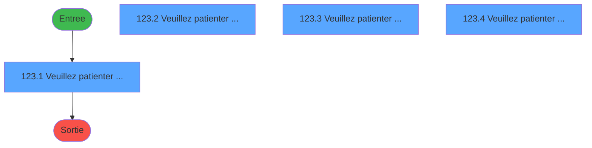
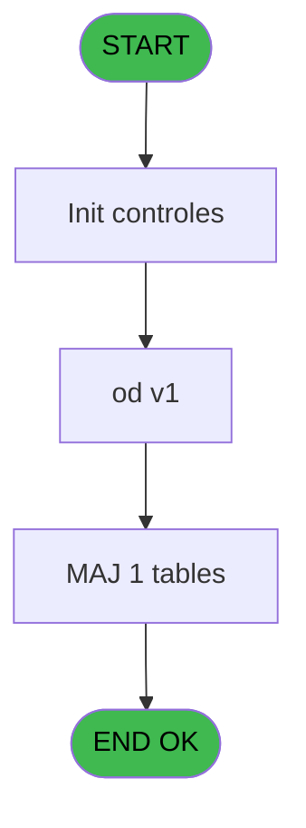
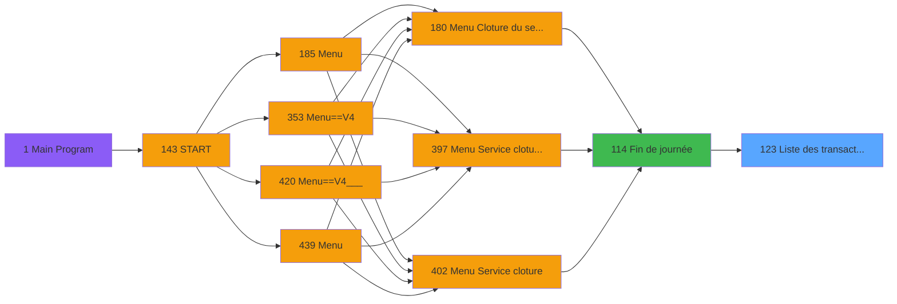

# PVE IDE 123 - Liste des transactions imprim

> **Analyse**: Phases 1-4 2026-02-03 09:33 -> 09:33 (18s) | Assemblage 09:33
> **Pipeline**: V7.2 Enrichi
> **Structure**: 4 onglets (Resume | Ecrans | Donnees | Connexions)

<!-- TAB:Resume -->

## 1. FICHE D'IDENTITE

| Attribut | Valeur |
|----------|--------|
| Projet | PVE |
| IDE Position | 123 |
| Nom Programme | Liste des transactions imprim |
| Fichier source | `Prg_123.xml` |
| Domaine metier | Ventes |
| Taches | 10 (4 ecrans visibles) |
| Tables modifiees | 1 |
| Programmes appeles | 0 |

## 2. DESCRIPTION FONCTIONNELLE

**Liste des transactions imprim** assure la gestion complete de ce processus, accessible depuis [Fin de journée (IDE 114)](PVE-IDE-114.md).

Le flux de traitement s'organise en **3 blocs fonctionnels** :

- **Traitement** (8 taches) : traitements metier divers
- **Reglement** (1 tache) : gestion des moyens de paiement et reglements
- **Saisie** (1 tache) : ecrans de saisie utilisateur (formulaires, champs, donnees)

**Donnees modifiees** : 1 tables en ecriture (tempo_ecran_logement).

**Logique metier** : 2 regles identifiees couvrant conditions metier.

Detail : phases du traitement

#### Phase 1 : Saisie (1 tache)

- **123** - Liste des transactions imprim **[[ECRAN]](#ecran-t1)**

#### Phase 2 : Traitement (8 taches)

- **123.1** - Veuillez patienter ..... **[[ECRAN]](#ecran-t2)**
- **123.1.1** - recap
- **123.2** - Veuillez patienter ..... **[[ECRAN]](#ecran-t4)**
- **123.2.1** - recap
- **123.3** - Veuillez patienter ..... **[[ECRAN]](#ecran-t6)**
- **123.3.1** - recap
- **123.4** - Veuillez patienter ..... **[[ECRAN]](#ecran-t8)**
- **123.4.1** - recap

#### Phase 3 : Reglement (1 tache)

- **123.5** - Récap par MOP

#### Tables impactees

| Table | Operations | Role metier |
|-------|-----------|-------------|
| tempo_ecran_logement | **W**/L (7 usages) | Table temporaire ecran |

## 3. BLOCS FONCTIONNELS

### 3.1 Saisie (1 tache)

L'operateur saisit les donnees de la transaction via 1 ecran (Liste des transactions imprim).

---

#### 123 - Liste des transactions imprim [[ECRAN]](#ecran-t1)

**Role** : Saisie des donnees : Liste des transactions imprim.
**Ecran** : 422 x 56 DLU (MDI) | [Voir mockup](#ecran-t1)
**Variables liees** : D (param total des transactions)

### 3.2 Traitement (8 taches)

Traitements internes.

---

#### 123.1 - Veuillez patienter ..... [[ECRAN]](#ecran-t2)

**Role** : Traitement : Veuillez patienter ......
**Ecran** : 426 x 58 DLU (MDI) | [Voir mockup](#ecran-t2)

---

#### 123.1.1 - recap

**Role** : Traitement : recap.

---

#### 123.2 - Veuillez patienter ..... [[ECRAN]](#ecran-t4)

**Role** : Traitement : Veuillez patienter ......
**Ecran** : 426 x 58 DLU (MDI) | [Voir mockup](#ecran-t4)

---

#### 123.2.1 - recap

**Role** : Traitement : recap.

---

#### 123.3 - Veuillez patienter ..... [[ECRAN]](#ecran-t6)

**Role** : Traitement : Veuillez patienter ......
**Ecran** : 426 x 57 DLU (MDI) | [Voir mockup](#ecran-t6)

---

#### 123.3.1 - recap

**Role** : Traitement : recap.

---

#### 123.4 - Veuillez patienter ..... [[ECRAN]](#ecran-t8)

**Role** : Traitement : Veuillez patienter ......
**Ecran** : 426 x 57 DLU (MDI) | [Voir mockup](#ecran-t8)

---

#### 123.4.1 - recap

**Role** : Traitement : recap.

### 3.3 Reglement (1 tache)

Gestion des moyens de paiement : 1 tache de reglement.

---

#### 123.5 - Récap par MOP

**Role** : Traitement : Récap par MOP.

## 5. REGLES METIER

2 regles identifiees:

### Autres (2 regles)

#### [RM-001] Si param total des transa... [D]<0 alors param total des transa... [D] sinon 0)

| Element | Detail |
|---------|--------|
| **Condition** | `param total des transa... [D]<0` |
| **Si vrai** | param total des transa... [D] |
| **Si faux** | 0) |
| **Expression source** | Expression 6 : `IF (param total des transa... [D]<0,param total des transa..` |
| **Exemple** | Si param total des transa... [D]<0 → param total des transa... [D]. Sinon → 0) |

#### [RM-002] Traitement conditionnel si param total des transa... [D]> est a zero

| Element | Detail |
|---------|--------|
| **Condition** | `param total des transa... [D]>=0` |
| **Si vrai** | param total des transa... [D] |
| **Si faux** | 0) |
| **Expression source** | Expression 7 : `IF (param total des transa... [D]>=0,param total des transa.` |
| **Exemple** | Si param total des transa... [D]>=0 → param total des transa... [D]. Sinon → 0) |

## 6. CONTEXTE

- **Appele par**: [Fin de journée (IDE 114)](PVE-IDE-114.md)
- **Appelle**: 0 programmes | **Tables**: 9 (W:1 R:2 L:7) | **Taches**: 10 | **Expressions**: 15

<!-- TAB:Ecrans -->

## 8. ECRANS

### 8.1 Forms visibles (4 / 10)

| # | Position | Tache | Nom | Type | Largeur | Hauteur | Bloc |
|---|----------|-------|-----|------|---------|---------|------|
| 1 | 123.1 | 123.1 | Veuillez patienter ..... | MDI | 426 | 58 | Traitement |
| 2 | 123.2 | 123.2 | Veuillez patienter ..... | MDI | 426 | 58 | Traitement |
| 3 | 123.3 | 123.3 | Veuillez patienter ..... | MDI | 426 | 57 | Traitement |
| 4 | 123.4 | 123.4 | Veuillez patienter ..... | MDI | 426 | 57 | Traitement |

### 8.2 Mockups Ecrans

---

#### 123.1 - Veuillez patienter .....
**Tache** : [123.1](#t2) | **Type** : MDI | **Dimensions** : 426 x 58 DLU
**Bloc** : Traitement | **Titre IDE** : Veuillez patienter .....

<!-- FORM-DATA:
{
    "width":  426,
    "vFactor":  8,
    "type":  "MDI",
    "hFactor":  8,
    "controls":  [
                     {
                         "x":  0,
                         "type":  "label",
                         "var":  "",
                         "y":  0,
                         "w":  423,
                         "fmt":  "",
                         "name":  "",
                         "h":  29,
                         "color":  "",
                         "text":  "",
                         "parent":  null
                     },
                     {
                         "x":  117,
                         "type":  "label",
                         "var":  "",
                         "y":  10,
                         "w":  275,
                         "fmt":  "",
                         "name":  "",
                         "h":  8,
                         "color":  "7",
                         "text":  "Impression en cours",
                         "parent":  null
                     },
                     {
                         "x":  0,
                         "type":  "label",
                         "var":  "",
                         "y":  29,
                         "w":  423,
                         "fmt":  "",
                         "name":  "",
                         "h":  27,
                         "color":  "",
                         "text":  "",
                         "parent":  null
                     },
                     {
                         "x":  70,
                         "type":  "label",
                         "var":  "",
                         "y":  39,
                         "w":  282,
                         "fmt":  "",
                         "name":  "",
                         "h":  8,
                         "color":  "",
                         "text":  "Impression listing comptable",
                         "parent":  null
                     },
                     {
                         "x":  1,
                         "type":  "image",
                         "var":  "",
                         "y":  2,
                         "w":  72,
                         "fmt":  "",
                         "name":  "",
                         "h":  25,
                         "color":  "",
                         "text":  "",
                         "parent":  null
                     }
                 ],
    "taskId":  "123.1",
    "height":  58
}
-->

---

#### 123.2 - Veuillez patienter .....
**Tache** : [123.2](#t4) | **Type** : MDI | **Dimensions** : 426 x 58 DLU
**Bloc** : Traitement | **Titre IDE** : Veuillez patienter .....

<!-- FORM-DATA:
{
    "width":  426,
    "vFactor":  8,
    "type":  "MDI",
    "hFactor":  8,
    "controls":  [
                     {
                         "x":  0,
                         "type":  "label",
                         "var":  "",
                         "y":  0,
                         "w":  423,
                         "fmt":  "",
                         "name":  "",
                         "h":  29,
                         "color":  "",
                         "text":  "",
                         "parent":  null
                     },
                     {
                         "x":  117,
                         "type":  "label",
                         "var":  "",
                         "y":  10,
                         "w":  275,
                         "fmt":  "",
                         "name":  "",
                         "h":  8,
                         "color":  "7",
                         "text":  "Impression en cours",
                         "parent":  null
                     },
                     {
                         "x":  0,
                         "type":  "label",
                         "var":  "",
                         "y":  29,
                         "w":  423,
                         "fmt":  "",
                         "name":  "",
                         "h":  27,
                         "color":  "",
                         "text":  "",
                         "parent":  null
                     },
                     {
                         "x":  70,
                         "type":  "label",
                         "var":  "",
                         "y":  39,
                         "w":  282,
                         "fmt":  "",
                         "name":  "",
                         "h":  8,
                         "color":  "",
                         "text":  "Impression listing comptable",
                         "parent":  null
                     },
                     {
                         "x":  1,
                         "type":  "image",
                         "var":  "",
                         "y":  2,
                         "w":  72,
                         "fmt":  "",
                         "name":  "",
                         "h":  25,
                         "color":  "",
                         "text":  "",
                         "parent":  null
                     }
                 ],
    "taskId":  "123.2",
    "height":  58
}
-->

---

#### 123.3 - Veuillez patienter .....
**Tache** : [123.3](#t6) | **Type** : MDI | **Dimensions** : 426 x 57 DLU
**Bloc** : Traitement | **Titre IDE** : Veuillez patienter .....

<!-- FORM-DATA:
{
    "width":  426,
    "vFactor":  8,
    "type":  "MDI",
    "hFactor":  8,
    "controls":  [
                     {
                         "x":  0,
                         "type":  "label",
                         "var":  "",
                         "y":  0,
                         "w":  423,
                         "fmt":  "",
                         "name":  "",
                         "h":  29,
                         "color":  "",
                         "text":  "",
                         "parent":  null
                     },
                     {
                         "x":  117,
                         "type":  "label",
                         "var":  "",
                         "y":  10,
                         "w":  275,
                         "fmt":  "",
                         "name":  "",
                         "h":  8,
                         "color":  "7",
                         "text":  "Impression en cours",
                         "parent":  null
                     },
                     {
                         "x":  0,
                         "type":  "label",
                         "var":  "",
                         "y":  29,
                         "w":  423,
                         "fmt":  "",
                         "name":  "",
                         "h":  27,
                         "color":  "",
                         "text":  "",
                         "parent":  null
                     },
                     {
                         "x":  70,
                         "type":  "label",
                         "var":  "",
                         "y":  39,
                         "w":  282,
                         "fmt":  "",
                         "name":  "",
                         "h":  8,
                         "color":  "",
                         "text":  "Impression listing comptable",
                         "parent":  null
                     },
                     {
                         "x":  1,
                         "type":  "image",
                         "var":  "",
                         "y":  2,
                         "w":  72,
                         "fmt":  "",
                         "name":  "",
                         "h":  25,
                         "color":  "",
                         "text":  "",
                         "parent":  null
                     }
                 ],
    "taskId":  "123.3",
    "height":  57
}
-->

---

#### 123.4 - Veuillez patienter .....
**Tache** : [123.4](#t8) | **Type** : MDI | **Dimensions** : 426 x 57 DLU
**Bloc** : Traitement | **Titre IDE** : Veuillez patienter .....

<!-- FORM-DATA:
{
    "width":  426,
    "vFactor":  8,
    "type":  "MDI",
    "hFactor":  8,
    "controls":  [
                     {
                         "x":  0,
                         "type":  "label",
                         "var":  "",
                         "y":  0,
                         "w":  423,
                         "fmt":  "",
                         "name":  "",
                         "h":  29,
                         "color":  "",
                         "text":  "",
                         "parent":  null
                     },
                     {
                         "x":  117,
                         "type":  "label",
                         "var":  "",
                         "y":  10,
                         "w":  275,
                         "fmt":  "",
                         "name":  "",
                         "h":  8,
                         "color":  "7",
                         "text":  "Impression en cours",
                         "parent":  null
                     },
                     {
                         "x":  0,
                         "type":  "label",
                         "var":  "",
                         "y":  29,
                         "w":  423,
                         "fmt":  "",
                         "name":  "",
                         "h":  27,
                         "color":  "",
                         "text":  "",
                         "parent":  null
                     },
                     {
                         "x":  70,
                         "type":  "label",
                         "var":  "",
                         "y":  39,
                         "w":  282,
                         "fmt":  "",
                         "name":  "",
                         "h":  8,
                         "color":  "",
                         "text":  "Impression listing comptable",
                         "parent":  null
                     },
                     {
                         "x":  1,
                         "type":  "image",
                         "var":  "",
                         "y":  2,
                         "w":  72,
                         "fmt":  "",
                         "name":  "",
                         "h":  25,
                         "color":  "",
                         "text":  "",
                         "parent":  null
                     }
                 ],
    "taskId":  "123.4",
    "height":  57
}
-->

## 9. NAVIGATION

### 9.1 Enchainement des ecrans

**Detail par enchainement :**

| Depuis | Action | Vers | Retour |
|--------|--------|------|--------|

### 9.3 Structure hierarchique (10 taches)

| Position | Tache | Type | Dimensions | Bloc |
|----------|-------|------|------------|------|
| **123.1** | [**Liste des transactions imprim** (123)](#t1) [mockup](#ecran-t1) | MDI | 422x56 | Saisie |
| **123.2** | [**Veuillez patienter .....** (123.1)](#t2) [mockup](#ecran-t2) | MDI | 426x58 | Traitement |
| 123.2.1 | [recap (123.1.1)](#t3) | MDI | - | |
| 123.2.2 | [Veuillez patienter ..... (123.2)](#t4) [mockup](#ecran-t4) | MDI | 426x58 | |
| 123.2.3 | [recap (123.2.1)](#t5) | MDI | - | |
| 123.2.4 | [Veuillez patienter ..... (123.3)](#t6) [mockup](#ecran-t6) | MDI | 426x57 | |
| 123.2.5 | [recap (123.3.1)](#t7) | MDI | - | |
| 123.2.6 | [Veuillez patienter ..... (123.4)](#t8) [mockup](#ecran-t8) | MDI | 426x57 | |
| 123.2.7 | [recap (123.4.1)](#t9) | MDI | - | |
| **123.3** | [**Récap par MOP** (123.5)](#t10) | MDI | - | Reglement |

### 9.4 Algorigramme

> **Legende**: Vert = START/END OK | Rouge = END KO | Bleu = Decisions
> *Algorigramme auto-genere. Utiliser `/algorigramme` pour une synthese metier detaillee.*

<!-- TAB:Donnees -->

## 10. TABLES

### Tables utilisees (9)

| ID | Nom | Description | Type | R | W | L | Usages |
|----|-----|-------------|------|---|---|---|--------|
| 30 | gm-recherche_____gmr | Index de recherche | DB | R |   |   | 4 |
| 31 | gm-complet_______gmc |  | DB |   |   | L | 4 |
| 40 | comptable________cte |  | DB |   |   | L | 2 |
| 65 | comptes_recette__cre | Comptes GM (generaux) | DB |   |   | L | 4 |
| 77 | articles_________art | Articles et stock | DB |   |   | L | 4 |
| 89 | moyen_paiement___mop |  | DB | R |   |   | 1 |
| 263 | vente | Donnees de ventes | DB |   |   | L | 2 |
| 593 | tempo_ecran_logement | Table temporaire ecran | TMP |   | **W** | L | 7 |
| 734 | arc_pv_cust_packages |  | DB |   |   | L | 2 |

### Colonnes par table (3 / 3 tables avec colonnes identifiees)

Table 30 - gm-recherche_____gmr (R) - 4 usages

| Lettre | Variable | Acces | Type |
|--------|----------|-------|------|
| A | P0 société | R | Alpha |
| B | P0 masque cumul | R | Alpha |
| C | P0 date comptable | R | Date |
| D | P0 résultat J | R | Numeric |
| E | P0 nom village | R | Alpha |
| F | P0 user | R | Alpha |
| G | W0 config imp | R | Alpha |
| H | W0 date listing | R | Date |
| I | W0 heure listing | R | Time |
| J | W0 cumul cr ss-imput | R | Numeric |
| K | W0 cumul db ss-imput | R | Numeric |
| L | W0 cumul cr imput | R | Numeric |
| M | W0 cumul db imput | R | Numeric |
| N | v. cdr file 9 | R | Logical |
| O | v terminal du service | R | Logical |

Table 89 - moyen_paiement___mop (R) - 1 usages

*Table utilisee uniquement en Link ou aucune colonne Real identifiee dans le DataView.*

Table 593 - tempo_ecran_logement (**W**/L) - 7 usages

*Table utilisee uniquement en Link ou aucune colonne Real identifiee dans le DataView.*

## 11. VARIABLES

### 11.1 Variables de session (6)

Variables persistantes pendant toute la session.

| Lettre | Nom | Type | Usage dans |
|--------|-----|------|-----------|
| I | v masqueEdition | Alpha | 1x session |
| J | v total par type de vente | Numeric | - |
| K | v service | Alpha | - |
| L | v libellé service | Alpha | - |
| N | v. cdr file 9 | Logical | - |
| O | v terminal du service | Logical | - |

### 11.2 Variables de travail (1)

Variables internes au programme.

| Lettre | Nom | Type | Usage dans |
|--------|-----|------|-----------|
| M | W0 cumul db imput | Numeric | - |

### 11.3 Autres (8)

Variables diverses.

| Lettre | Nom | Type | Usage dans |
|--------|-----|------|-----------|
| A | param societe | Alpha | - |
| B | param masque cumul | Alpha | 1x refs |
| C | param date comptable | Date | - |
| D | param total des transactions | Numeric | - |
| E | param devise | Alpha | - |
| F | param nom village | Alpha | - |
| G | param user | Alpha | - |
| H | param tout le service | Logical | 2x refs |

## 12. EXPRESSIONS

**15 / 15 expressions decodees (100%)**

### 12.1 Repartition par type

| Type | Expressions | Regles |
|------|-------------|--------|
| CONCATENATION | 2 | 0 |
| CONDITION | 3 | 2 |
| OTHER | 7 | 0 |
| NEGATION | 2 | 0 |
| REFERENCE_VG | 1 | 0 |

### 12.2 Expressions cles par type

#### CONCATENATION (2 expressions)

| Type | IDE | Expression | Regle |
|------|-----|------------|-------|
| CONCATENATION | 2 | `DStr (Date (),'DD/MM/YYYY')&' - '&TStr (Time (),'HH:MM:SS')` | - |
| CONCATENATION | 4 | `'- '&Str (Page (0,1),'3P0Z0')&' -'` | - |

#### CONDITION (3 expressions)

| Type | IDE | Expression | Regle |
|------|-----|------------|-------|
| CONDITION | 7 | `IF (param total des transa... [D]>=0,param total des transa... [D],0)` | [RM-002](#rm-RM-002) |
| CONDITION | 6 | `IF (param total des transa... [D]<0,param total des transa... [D],0)` | [RM-001](#rm-RM-001) |
| CONDITION | 3 | `INIGet ('[MAGIC_LOGICAL_NAMES]preview')='O'` | - |

#### OTHER (7 expressions)

| Type | IDE | Expression | Regle |
|------|-----|------------|-------|
| OTHER | 11 | `param tout le service [H]` | - |
| OTHER | 12 | `GetParam ('SERVICE')` | - |
| OTHER | 13 | `GetParam ('SERVICELIB')` | - |
| OTHER | 9 | `GetParam ('TERMINAL_IMS')` | - |
| OTHER | 1 | `DbDel ('{593,3}'DSOURCE,'')` | - |
| ... | | *+2 autres* | |

#### NEGATION (2 expressions)

| Type | IDE | Expression | Regle |
|------|-----|------------|-------|
| NEGATION | 14 | `NOT VG104` | - |
| NEGATION | 10 | `NOT (param tout le service [H])` | - |

#### REFERENCE_VG (1 expressions)

| Type | IDE | Expression | Regle |
|------|-----|------------|-------|
| REFERENCE_VG | 15 | `VG104` | - |

<!-- TAB:Connexions -->

## 13. GRAPHE D'APPELS

### 13.1 Chaine depuis Main (Callers)

Main -> ... -> [Fin de journée (IDE 114)](PVE-IDE-114.md) -> **Liste des transactions imprim (IDE 123)**

### 13.2 Callers

| IDE | Nom Programme | Nb Appels |
|-----|---------------|-----------|
| [114](PVE-IDE-114.md) | Fin de journée | 2 |

### 13.3 Callees (programmes appeles)

### 13.4 Detail Callees avec contexte

| IDE | Nom Programme | Appels | Contexte |
|-----|---------------|--------|----------|
| - | (aucun) | - | - |

## 14. RECOMMANDATIONS MIGRATION

### 14.1 Profil du programme

| Metrique | Valeur | Impact migration |
|----------|--------|-----------------|
| Lignes de logique | 496 | Taille moyenne |
| Expressions | 15 | Peu de logique |
| Tables WRITE | 1 | Impact faible |
| Sous-programmes | 0 | Peu de dependances |
| Ecrans visibles | 4 | Quelques ecrans |
| Code desactive | 0% (0 / 496) | Code sain |
| Regles metier | 2 | Quelques regles a preserver |

### 14.2 Plan de migration par bloc

#### Saisie (1 tache: 1 ecran, 0 traitement)

- **Strategie** : Formulaire React/Blazor avec validation Zod/FluentValidation.
- Reproduire 1 ecran : Liste des transactions imprim
- Validation temps reel cote client + serveur

#### Traitement (8 taches: 4 ecrans, 4 traitements)

- **Strategie** : Orchestrateur avec 4 ecrans (Razor/React) et 4 traitements backend (services).
- Les ecrans deviennent des composants UI, les traitements invisibles deviennent des services injectables.
- Decomposer les taches en services unitaires testables.

#### Reglement (1 tache: 0 ecran, 1 traitement)

- **Strategie** : Service `IReglementService` avec pattern Strategy par mode de paiement.
- Integration TPE si applicable

### 14.3 Dependances critiques

| Dependance | Type | Appels | Impact |
|------------|------|--------|--------|
| tempo_ecran_logement | Table WRITE (Temp) | 4x | Schema + repository |

---
*Spec DETAILED generee par Pipeline V7.2 - 2026-02-03 09:33*
