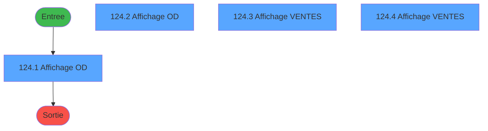
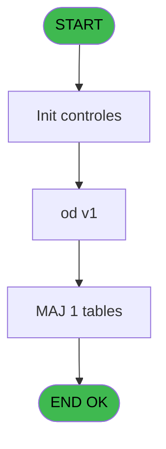
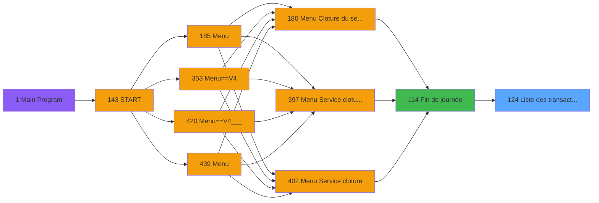
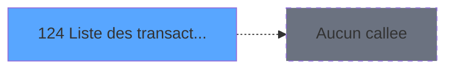

# PVE IDE 124 - Liste des transactions écran

> **Analyse**: Phases 1-4 2026-02-03 09:33 -> 09:34 (18s) | Assemblage 09:34
> **Pipeline**: V7.2 Enrichi
> **Structure**: 4 onglets (Resume | Ecrans | Donnees | Connexions)

<!-- TAB:Resume -->

## 1. FICHE D'IDENTITE

| Attribut | Valeur |
|----------|--------|
| Projet | PVE |
| IDE Position | 124 |
| Nom Programme | Liste des transactions écran |
| Fichier source | `Prg_124.xml` |
| Domaine metier | Ventes |
| Taches | 9 (4 ecrans visibles) |
| Tables modifiees | 1 |
| Programmes appeles | 0 |

## 2. DESCRIPTION FONCTIONNELLE

**Liste des transactions écran** assure la gestion complete de ce processus, accessible depuis [Fin de journée (IDE 114)](PVE-IDE-114.md).

Le flux de traitement s'organise en **3 blocs fonctionnels** :

- **Traitement** (4 taches) : traitements metier divers
- **Saisie** (3 taches) : ecrans de saisie utilisateur (formulaires, champs, donnees)
- **Consultation** (2 taches) : ecrans de recherche, selection et consultation

**Donnees modifiees** : 1 tables en ecriture (tempo_ecran_logement).

Detail : phases du traitement

#### Phase 1 : Saisie (3 taches)

- **124** - Liste des transactions écran
- **124.3** - Affichage VENTES **[[ECRAN]](#ecran-t6)**
- **124.4** - Affichage VENTES **[[ECRAN]](#ecran-t8)**

#### Phase 2 : Consultation (2 taches)

- **124.1** - Affichage OD **[[ECRAN]](#ecran-t2)**
- **124.2** - Affichage OD **[[ECRAN]](#ecran-t4)**

#### Phase 3 : Traitement (4 taches)

- **124.1.1** - recap
- **124.2.1** - recap
- **124.3.1** - recap
- **124.4.1** - recap

#### Tables impactees

| Table | Operations | Role metier |
|-------|-----------|-------------|
| tempo_ecran_logement | **W**/L (8 usages) | Table temporaire ecran |

## 3. BLOCS FONCTIONNELS

### 3.1 Saisie (3 taches)

L'operateur saisit les donnees de la transaction via 2 ecrans (Affichage VENTES, Affichage VENTES).

---

#### 124 - Liste des transactions écran

**Role** : Saisie des donnees : Liste des transactions écran.
**Variables liees** : D (param total des transactions)

---

#### 124.3 - Affichage VENTES [[ECRAN]](#ecran-t6)

**Role** : Saisie des donnees : Affichage VENTES.
**Ecran** : 1203 x 240 DLU (MDI) | [Voir mockup](#ecran-t6)

---

#### 124.4 - Affichage VENTES [[ECRAN]](#ecran-t8)

**Role** : Saisie des donnees : Affichage VENTES.
**Ecran** : 1203 x 240 DLU (MDI) | [Voir mockup](#ecran-t8)

### 3.2 Consultation (2 taches)

Ecrans de recherche et consultation.

---

#### 124.1 - Affichage OD [[ECRAN]](#ecran-t2)

**Role** : Reinitialisation : Affichage OD.
**Ecran** : 1203 x 240 DLU (MDI) | [Voir mockup](#ecran-t2)

---

#### 124.2 - Affichage OD [[ECRAN]](#ecran-t4)

**Role** : Reinitialisation : Affichage OD.
**Ecran** : 1203 x 240 DLU (MDI) | [Voir mockup](#ecran-t4)

### 3.3 Traitement (4 taches)

Traitements internes.

---

#### 124.1.1 - recap

**Role** : Traitement : recap.

---

#### 124.2.1 - recap

**Role** : Traitement : recap.

---

#### 124.3.1 - recap

**Role** : Traitement : recap.

---

#### 124.4.1 - recap

**Role** : Traitement : recap.

## 5. REGLES METIER

*(Aucune regle metier identifiee)*

## 6. CONTEXTE

- **Appele par**: [Fin de journée (IDE 114)](PVE-IDE-114.md)
- **Appelle**: 0 programmes | **Tables**: 9 (W:1 R:1 L:8) | **Taches**: 9 | **Expressions**: 8

<!-- TAB:Ecrans -->

## 8. ECRANS

### 8.1 Forms visibles (4 / 9)

| # | Position | Tache | Nom | Type | Largeur | Hauteur | Bloc |
|---|----------|-------|-----|------|---------|---------|------|
| 1 | 124.1 | 124.1 | Affichage OD | MDI | 1203 | 240 | Consultation |
| 2 | 124.2 | 124.2 | Affichage OD | MDI | 1203 | 240 | Consultation |
| 3 | 124.3 | 124.3 | Affichage VENTES | MDI | 1203 | 240 | Saisie |
| 4 | 124.4 | 124.4 | Affichage VENTES | MDI | 1203 | 240 | Saisie |

### 8.2 Mockups Ecrans

---

#### 124.1 - Affichage OD
**Tache** : [124.1](#t2) | **Type** : MDI | **Dimensions** : 1203 x 240 DLU
**Bloc** : Consultation | **Titre IDE** : Affichage OD

<!-- FORM-DATA:
{
    "width":  1203,
    "vFactor":  8,
    "type":  "MDI",
    "hFactor":  8,
    "controls":  [
                     {
                         "x":  0,
                         "type":  "label",
                         "var":  "",
                         "y":  2,
                         "w":  1200,
                         "fmt":  "",
                         "name":  "",
                         "h":  19,
                         "color":  "",
                         "text":  "",
                         "parent":  null
                     },
                     {
                         "x":  0,
                         "type":  "label",
                         "var":  "",
                         "y":  215,
                         "w":  1200,
                         "fmt":  "",
                         "name":  "",
                         "h":  24,
                         "color":  "",
                         "text":  "",
                         "parent":  null
                     },
                     {
                         "x":  35,
                         "type":  "table",
                         "var":  "",
                         "name":  "",
                         "titleH":  12,
                         "color":  "110",
                         "w":  1138,
                         "y":  29,
                         "fmt":  "",
                         "parent":  null,
                         "text":  "",
                         "rowH":  10,
                         "h":  179,
                         "cols":  [
                                      {
                                          "title":  "Nom",
                                          "layer":  1,
                                          "w":  170
                                      },
                                      {
                                          "title":  "Prénom",
                                          "layer":  2,
                                          "w":  96
                                      },
                                      {
                                          "title":  "MOP",
                                          "layer":  3,
                                          "w":  69
                                      },
                                      {
                                          "title":  "Libellé",
                                          "layer":  4,
                                          "w":  173
                                      },
                                      {
                                          "title":  "Libellé sup",
                                          "layer":  5,
                                          "w":  177
                                      },
                                      {
                                          "title":  "Annul.",
                                          "layer":  6,
                                          "w":  71
                                      },
                                      {
                                          "title":  "Débit",
                                          "layer":  7,
                                          "w":  172
                                      },
                                      {
                                          "title":  "Crédit",
                                          "layer":  8,
                                          "w":  178
                                      }
                                  ],
                         "rows":  8
                     },
                     {
                         "x":  379,
                         "type":  "edit",
                         "var":  "",
                         "y":  43,
                         "w":  160,
                         "fmt":  "",
                         "name":  "",
                         "h":  8,
                         "color":  "110",
                         "text":  "",
                         "parent":  6
                     },
                     {
                         "x":  554,
                         "type":  "edit",
                         "var":  "",
                         "y":  43,
                         "w":  160,
                         "fmt":  "",
                         "name":  "",
                         "h":  8,
                         "color":  "110",
                         "text":  "",
                         "parent":  6
                     },
                     {
                         "x":  307,
                         "type":  "edit",
                         "var":  "",
                         "y":  43,
                         "w":  59,
                         "fmt":  "",
                         "name":  "",
                         "h":  8,
                         "color":  "110",
                         "text":  "",
                         "parent":  6
                     },
                     {
                         "x":  42,
                         "type":  "edit",
                         "var":  "",
                         "y":  43,
                         "w":  160,
                         "fmt":  "",
                         "name":  "",
                         "h":  8,
                         "color":  "110",
                         "text":  "",
                         "parent":  6
                     },
                     {
                         "x":  214,
                         "type":  "edit",
                         "var":  "",
                         "y":  43,
                         "w":  80,
                         "fmt":  "",
                         "name":  "",
                         "h":  8,
                         "color":  "110",
                         "text":  "",
                         "parent":  6
                     },
                     {
                         "x":  7,
                         "type":  "edit",
                         "var":  "",
                         "y":  7,
                         "w":  192,
                         "fmt":  "30",
                         "name":  "",
                         "h":  8,
                         "color":  "",
                         "text":  "",
                         "parent":  null
                     },
                     {
                         "x":  972,
                         "type":  "edit",
                         "var":  "",
                         "y":  7,
                         "w":  219,
                         "fmt":  "WWW DD MMM YYYYT",
                         "name":  "",
                         "h":  8,
                         "color":  "",
                         "text":  "",
                         "parent":  null
                     },
                     {
                         "x":  730,
                         "type":  "edit",
                         "var":  "",
                         "y":  43,
                         "w":  56,
                         "fmt":  "30",
                         "name":  "",
                         "h":  8,
                         "color":  "110",
                         "text":  "",
                         "parent":  6
                     },
                     {
                         "x":  798,
                         "type":  "edit",
                         "var":  "",
                         "y":  43,
                         "w":  160,
                         "fmt":  "4",
                         "name":  "",
                         "h":  8,
                         "color":  "110",
                         "text":  "",
                         "parent":  6
                     },
                     {
                         "x":  970,
                         "type":  "edit",
                         "var":  "",
                         "y":  43,
                         "w":  160,
                         "fmt":  "4",
                         "name":  "",
                         "h":  8,
                         "color":  "110",
                         "text":  "",
                         "parent":  6
                     },
                     {
                         "x":  1011,
                         "type":  "button",
                         "var":  "",
                         "y":  218,
                         "w":  154,
                         "fmt":  "Quitter",
                         "name":  "",
                         "h":  18,
                         "color":  "",
                         "text":  "",
                         "parent":  null
                     },
                     {
                         "x":  400,
                         "type":  "edit",
                         "var":  "",
                         "y":  6,
                         "w":  400,
                         "fmt":  "30",
                         "name":  "",
                         "h":  10,
                         "color":  "142",
                         "text":  "",
                         "parent":  null
                     }
                 ],
    "taskId":  "124.1",
    "height":  240
}
-->

<strong>Champs : 11 champs</strong>

| Pos (x,y) | Nom | Variable | Type |
|-----------|-----|----------|------|
| 379,43 | (sans nom) | - | edit |
| 554,43 | (sans nom) | - | edit |
| 307,43 | (sans nom) | - | edit |
| 42,43 | (sans nom) | - | edit |
| 214,43 | (sans nom) | - | edit |
| 7,7 | 30 | - | edit |
| 972,7 | WWW DD MMM YYYYT | - | edit |
| 730,43 | 30 | - | edit |
| 798,43 | 4 | - | edit |
| 970,43 | 4 | - | edit |
| 400,6 | 30 | - | edit |

<strong>Boutons : 1 boutons</strong>

| Bouton | Pos (x,y) | Action |
|--------|-----------|--------|
| Quitter | 1011,218 | Quitte le programme |

---

#### 124.2 - Affichage OD
**Tache** : [124.2](#t4) | **Type** : MDI | **Dimensions** : 1203 x 240 DLU
**Bloc** : Consultation | **Titre IDE** : Affichage OD

<!-- FORM-DATA:
{
    "width":  1203,
    "vFactor":  8,
    "type":  "MDI",
    "hFactor":  8,
    "controls":  [
                     {
                         "x":  0,
                         "type":  "label",
                         "var":  "",
                         "y":  2,
                         "w":  1200,
                         "fmt":  "",
                         "name":  "",
                         "h":  19,
                         "color":  "",
                         "text":  "",
                         "parent":  null
                     },
                     {
                         "x":  0,
                         "type":  "label",
                         "var":  "",
                         "y":  215,
                         "w":  1200,
                         "fmt":  "",
                         "name":  "",
                         "h":  24,
                         "color":  "",
                         "text":  "",
                         "parent":  null
                     },
                     {
                         "x":  35,
                         "type":  "table",
                         "var":  "",
                         "name":  "",
                         "titleH":  12,
                         "color":  "110",
                         "w":  1138,
                         "y":  29,
                         "fmt":  "",
                         "parent":  null,
                         "text":  "",
                         "rowH":  10,
                         "h":  179,
                         "cols":  [
                                      {
                                          "title":  "Nom",
                                          "layer":  1,
                                          "w":  170
                                      },
                                      {
                                          "title":  "Prénom",
                                          "layer":  2,
                                          "w":  96
                                      },
                                      {
                                          "title":  "MOP",
                                          "layer":  3,
                                          "w":  69
                                      },
                                      {
                                          "title":  "Libellé",
                                          "layer":  4,
                                          "w":  173
                                      },
                                      {
                                          "title":  "Libellé sup",
                                          "layer":  5,
                                          "w":  177
                                      },
                                      {
                                          "title":  "Annul.",
                                          "layer":  6,
                                          "w":  71
                                      },
                                      {
                                          "title":  "Débit",
                                          "layer":  7,
                                          "w":  172
                                      },
                                      {
                                          "title":  "Crédit",
                                          "layer":  8,
                                          "w":  178
                                      }
                                  ],
                         "rows":  8
                     },
                     {
                         "x":  379,
                         "type":  "edit",
                         "var":  "",
                         "y":  43,
                         "w":  160,
                         "fmt":  "",
                         "name":  "",
                         "h":  8,
                         "color":  "110",
                         "text":  "",
                         "parent":  6
                     },
                     {
                         "x":  554,
                         "type":  "edit",
                         "var":  "",
                         "y":  43,
                         "w":  160,
                         "fmt":  "",
                         "name":  "",
                         "h":  8,
                         "color":  "110",
                         "text":  "",
                         "parent":  6
                     },
                     {
                         "x":  307,
                         "type":  "edit",
                         "var":  "",
                         "y":  43,
                         "w":  59,
                         "fmt":  "",
                         "name":  "",
                         "h":  8,
                         "color":  "110",
                         "text":  "",
                         "parent":  6
                     },
                     {
                         "x":  42,
                         "type":  "edit",
                         "var":  "",
                         "y":  43,
                         "w":  160,
                         "fmt":  "",
                         "name":  "",
                         "h":  8,
                         "color":  "110",
                         "text":  "",
                         "parent":  6
                     },
                     {
                         "x":  214,
                         "type":  "edit",
                         "var":  "",
                         "y":  43,
                         "w":  80,
                         "fmt":  "",
                         "name":  "",
                         "h":  8,
                         "color":  "110",
                         "text":  "",
                         "parent":  6
                     },
                     {
                         "x":  7,
                         "type":  "edit",
                         "var":  "",
                         "y":  7,
                         "w":  192,
                         "fmt":  "30",
                         "name":  "",
                         "h":  8,
                         "color":  "",
                         "text":  "",
                         "parent":  null
                     },
                     {
                         "x":  972,
                         "type":  "edit",
                         "var":  "",
                         "y":  7,
                         "w":  219,
                         "fmt":  "WWW DD MMM YYYYT",
                         "name":  "",
                         "h":  8,
                         "color":  "",
                         "text":  "",
                         "parent":  null
                     },
                     {
                         "x":  730,
                         "type":  "edit",
                         "var":  "",
                         "y":  43,
                         "w":  56,
                         "fmt":  "30",
                         "name":  "",
                         "h":  8,
                         "color":  "110",
                         "text":  "",
                         "parent":  6
                     },
                     {
                         "x":  798,
                         "type":  "edit",
                         "var":  "",
                         "y":  43,
                         "w":  160,
                         "fmt":  "4",
                         "name":  "",
                         "h":  8,
                         "color":  "110",
                         "text":  "",
                         "parent":  6
                     },
                     {
                         "x":  970,
                         "type":  "edit",
                         "var":  "",
                         "y":  43,
                         "w":  160,
                         "fmt":  "4",
                         "name":  "",
                         "h":  8,
                         "color":  "110",
                         "text":  "",
                         "parent":  6
                     },
                     {
                         "x":  1011,
                         "type":  "button",
                         "var":  "",
                         "y":  218,
                         "w":  154,
                         "fmt":  "Quitter",
                         "name":  "",
                         "h":  18,
                         "color":  "",
                         "text":  "",
                         "parent":  null
                     },
                     {
                         "x":  400,
                         "type":  "edit",
                         "var":  "",
                         "y":  6,
                         "w":  400,
                         "fmt":  "30",
                         "name":  "",
                         "h":  10,
                         "color":  "142",
                         "text":  "",
                         "parent":  null
                     }
                 ],
    "taskId":  "124.2",
    "height":  240
}
-->

<strong>Champs : 11 champs</strong>

| Pos (x,y) | Nom | Variable | Type |
|-----------|-----|----------|------|
| 379,43 | (sans nom) | - | edit |
| 554,43 | (sans nom) | - | edit |
| 307,43 | (sans nom) | - | edit |
| 42,43 | (sans nom) | - | edit |
| 214,43 | (sans nom) | - | edit |
| 7,7 | 30 | - | edit |
| 972,7 | WWW DD MMM YYYYT | - | edit |
| 730,43 | 30 | - | edit |
| 798,43 | 4 | - | edit |
| 970,43 | 4 | - | edit |
| 400,6 | 30 | - | edit |

<strong>Boutons : 1 boutons</strong>

| Bouton | Pos (x,y) | Action |
|--------|-----------|--------|
| Quitter | 1011,218 | Quitte le programme |

---

#### 124.3 - Affichage VENTES
**Tache** : [124.3](#t6) | **Type** : MDI | **Dimensions** : 1203 x 240 DLU
**Bloc** : Saisie | **Titre IDE** : Affichage VENTES

<!-- FORM-DATA:
{
    "width":  1203,
    "vFactor":  8,
    "type":  "MDI",
    "hFactor":  8,
    "controls":  [
                     {
                         "x":  0,
                         "type":  "label",
                         "var":  "",
                         "y":  0,
                         "w":  1200,
                         "fmt":  "",
                         "name":  "",
                         "h":  19,
                         "color":  "",
                         "text":  "",
                         "parent":  null
                     },
                     {
                         "x":  0,
                         "type":  "label",
                         "var":  "",
                         "y":  213,
                         "w":  1200,
                         "fmt":  "",
                         "name":  "",
                         "h":  24,
                         "color":  "",
                         "text":  "",
                         "parent":  null
                     },
                     {
                         "x":  35,
                         "type":  "table",
                         "var":  "",
                         "name":  "",
                         "titleH":  12,
                         "color":  "110",
                         "w":  1138,
                         "y":  27,
                         "fmt":  "",
                         "parent":  null,
                         "text":  "",
                         "rowH":  10,
                         "h":  180,
                         "cols":  [
                                      {
                                          "title":  "Nom",
                                          "layer":  1,
                                          "w":  170
                                      },
                                      {
                                          "title":  "Prénom",
                                          "layer":  2,
                                          "w":  96
                                      },
                                      {
                                          "title":  "MOP",
                                          "layer":  3,
                                          "w":  69
                                      },
                                      {
                                          "title":  "Libellé",
                                          "layer":  4,
                                          "w":  173
                                      },
                                      {
                                          "title":  "Libellé sup",
                                          "layer":  5,
                                          "w":  177
                                      },
                                      {
                                          "title":  "Annul.",
                                          "layer":  6,
                                          "w":  71
                                      },
                                      {
                                          "title":  "Débit",
                                          "layer":  7,
                                          "w":  172
                                      },
                                      {
                                          "title":  "Crédit",
                                          "layer":  8,
                                          "w":  178
                                      }
                                  ],
                         "rows":  8
                     },
                     {
                         "x":  379,
                         "type":  "edit",
                         "var":  "",
                         "y":  41,
                         "w":  160,
                         "fmt":  "",
                         "name":  "",
                         "h":  8,
                         "color":  "110",
                         "text":  "",
                         "parent":  6
                     },
                     {
                         "x":  554,
                         "type":  "edit",
                         "var":  "",
                         "y":  41,
                         "w":  160,
                         "fmt":  "",
                         "name":  "",
                         "h":  8,
                         "color":  "110",
                         "text":  "",
                         "parent":  6
                     },
                     {
                         "x":  307,
                         "type":  "edit",
                         "var":  "",
                         "y":  41,
                         "w":  59,
                         "fmt":  "",
                         "name":  "",
                         "h":  8,
                         "color":  "110",
                         "text":  "",
                         "parent":  6
                     },
                     {
                         "x":  42,
                         "type":  "edit",
                         "var":  "",
                         "y":  41,
                         "w":  160,
                         "fmt":  "",
                         "name":  "",
                         "h":  8,
                         "color":  "110",
                         "text":  "",
                         "parent":  6
                     },
                     {
                         "x":  214,
                         "type":  "edit",
                         "var":  "",
                         "y":  41,
                         "w":  80,
                         "fmt":  "",
                         "name":  "",
                         "h":  8,
                         "color":  "110",
                         "text":  "",
                         "parent":  6
                     },
                     {
                         "x":  6,
                         "type":  "edit",
                         "var":  "",
                         "y":  5,
                         "w":  384,
                         "fmt":  "30",
                         "name":  "",
                         "h":  8,
                         "color":  "",
                         "text":  "",
                         "parent":  null
                     },
                     {
                         "x":  971,
                         "type":  "edit",
                         "var":  "",
                         "y":  5,
                         "w":  219,
                         "fmt":  "WWW DD MMM YYYYT",
                         "name":  "",
                         "h":  8,
                         "color":  "",
                         "text":  "",
                         "parent":  null
                     },
                     {
                         "x":  730,
                         "type":  "edit",
                         "var":  "",
                         "y":  41,
                         "w":  56,
                         "fmt":  "30",
                         "name":  "",
                         "h":  8,
                         "color":  "110",
                         "text":  "",
                         "parent":  6
                     },
                     {
                         "x":  798,
                         "type":  "edit",
                         "var":  "",
                         "y":  41,
                         "w":  160,
                         "fmt":  "4",
                         "name":  "",
                         "h":  8,
                         "color":  "110",
                         "text":  "",
                         "parent":  6
                     },
                     {
                         "x":  970,
                         "type":  "edit",
                         "var":  "",
                         "y":  41,
                         "w":  160,
                         "fmt":  "4",
                         "name":  "",
                         "h":  8,
                         "color":  "110",
                         "text":  "",
                         "parent":  6
                     },
                     {
                         "x":  1010,
                         "type":  "button",
                         "var":  "",
                         "y":  216,
                         "w":  154,
                         "fmt":  "Quitter",
                         "name":  "",
                         "h":  18,
                         "color":  "",
                         "text":  "",
                         "parent":  null
                     },
                     {
                         "x":  399,
                         "type":  "edit",
                         "var":  "",
                         "y":  4,
                         "w":  400,
                         "fmt":  "30",
                         "name":  "",
                         "h":  10,
                         "color":  "142",
                         "text":  "",
                         "parent":  null
                     }
                 ],
    "taskId":  "124.3",
    "height":  240
}
-->

<strong>Champs : 11 champs</strong>

| Pos (x,y) | Nom | Variable | Type |
|-----------|-----|----------|------|
| 379,41 | (sans nom) | - | edit |
| 554,41 | (sans nom) | - | edit |
| 307,41 | (sans nom) | - | edit |
| 42,41 | (sans nom) | - | edit |
| 214,41 | (sans nom) | - | edit |
| 6,5 | 30 | - | edit |
| 971,5 | WWW DD MMM YYYYT | - | edit |
| 730,41 | 30 | - | edit |
| 798,41 | 4 | - | edit |
| 970,41 | 4 | - | edit |
| 399,4 | 30 | - | edit |

<strong>Boutons : 1 boutons</strong>

| Bouton | Pos (x,y) | Action |
|--------|-----------|--------|
| Quitter | 1010,216 | Quitte le programme |

---

#### 124.4 - Affichage VENTES
**Tache** : [124.4](#t8) | **Type** : MDI | **Dimensions** : 1203 x 240 DLU
**Bloc** : Saisie | **Titre IDE** : Affichage VENTES

<!-- FORM-DATA:
{
    "width":  1203,
    "vFactor":  8,
    "type":  "MDI",
    "hFactor":  8,
    "controls":  [
                     {
                         "x":  0,
                         "type":  "label",
                         "var":  "",
                         "y":  0,
                         "w":  1200,
                         "fmt":  "",
                         "name":  "",
                         "h":  19,
                         "color":  "",
                         "text":  "",
                         "parent":  null
                     },
                     {
                         "x":  0,
                         "type":  "label",
                         "var":  "",
                         "y":  213,
                         "w":  1200,
                         "fmt":  "",
                         "name":  "",
                         "h":  24,
                         "color":  "",
                         "text":  "",
                         "parent":  null
                     },
                     {
                         "x":  35,
                         "type":  "table",
                         "var":  "",
                         "name":  "",
                         "titleH":  12,
                         "color":  "110",
                         "w":  1138,
                         "y":  27,
                         "fmt":  "",
                         "parent":  null,
                         "text":  "",
                         "rowH":  10,
                         "h":  180,
                         "cols":  [
                                      {
                                          "title":  "Nom",
                                          "layer":  1,
                                          "w":  170
                                      },
                                      {
                                          "title":  "Prénom",
                                          "layer":  2,
                                          "w":  96
                                      },
                                      {
                                          "title":  "MOP",
                                          "layer":  3,
                                          "w":  69
                                      },
                                      {
                                          "title":  "Libellé",
                                          "layer":  4,
                                          "w":  173
                                      },
                                      {
                                          "title":  "Libellé sup",
                                          "layer":  5,
                                          "w":  177
                                      },
                                      {
                                          "title":  "Annul.",
                                          "layer":  6,
                                          "w":  71
                                      },
                                      {
                                          "title":  "Débit",
                                          "layer":  7,
                                          "w":  172
                                      },
                                      {
                                          "title":  "Crédit",
                                          "layer":  8,
                                          "w":  178
                                      }
                                  ],
                         "rows":  8
                     },
                     {
                         "x":  379,
                         "type":  "edit",
                         "var":  "",
                         "y":  41,
                         "w":  160,
                         "fmt":  "",
                         "name":  "",
                         "h":  8,
                         "color":  "110",
                         "text":  "",
                         "parent":  6
                     },
                     {
                         "x":  554,
                         "type":  "edit",
                         "var":  "",
                         "y":  41,
                         "w":  160,
                         "fmt":  "",
                         "name":  "",
                         "h":  8,
                         "color":  "110",
                         "text":  "",
                         "parent":  6
                     },
                     {
                         "x":  307,
                         "type":  "edit",
                         "var":  "",
                         "y":  41,
                         "w":  59,
                         "fmt":  "",
                         "name":  "",
                         "h":  8,
                         "color":  "110",
                         "text":  "",
                         "parent":  6
                     },
                     {
                         "x":  42,
                         "type":  "edit",
                         "var":  "",
                         "y":  41,
                         "w":  160,
                         "fmt":  "",
                         "name":  "",
                         "h":  8,
                         "color":  "110",
                         "text":  "",
                         "parent":  6
                     },
                     {
                         "x":  214,
                         "type":  "edit",
                         "var":  "",
                         "y":  41,
                         "w":  80,
                         "fmt":  "",
                         "name":  "",
                         "h":  8,
                         "color":  "110",
                         "text":  "",
                         "parent":  6
                     },
                     {
                         "x":  6,
                         "type":  "edit",
                         "var":  "",
                         "y":  5,
                         "w":  384,
                         "fmt":  "30",
                         "name":  "",
                         "h":  8,
                         "color":  "",
                         "text":  "",
                         "parent":  null
                     },
                     {
                         "x":  971,
                         "type":  "edit",
                         "var":  "",
                         "y":  5,
                         "w":  219,
                         "fmt":  "WWW DD MMM YYYYT",
                         "name":  "",
                         "h":  8,
                         "color":  "",
                         "text":  "",
                         "parent":  null
                     },
                     {
                         "x":  730,
                         "type":  "edit",
                         "var":  "",
                         "y":  41,
                         "w":  56,
                         "fmt":  "30",
                         "name":  "",
                         "h":  8,
                         "color":  "110",
                         "text":  "",
                         "parent":  6
                     },
                     {
                         "x":  798,
                         "type":  "edit",
                         "var":  "",
                         "y":  41,
                         "w":  160,
                         "fmt":  "4",
                         "name":  "",
                         "h":  8,
                         "color":  "110",
                         "text":  "",
                         "parent":  6
                     },
                     {
                         "x":  970,
                         "type":  "edit",
                         "var":  "",
                         "y":  41,
                         "w":  160,
                         "fmt":  "4",
                         "name":  "",
                         "h":  8,
                         "color":  "110",
                         "text":  "",
                         "parent":  6
                     },
                     {
                         "x":  1010,
                         "type":  "button",
                         "var":  "",
                         "y":  216,
                         "w":  154,
                         "fmt":  "Quitter",
                         "name":  "",
                         "h":  18,
                         "color":  "",
                         "text":  "",
                         "parent":  null
                     },
                     {
                         "x":  399,
                         "type":  "edit",
                         "var":  "",
                         "y":  4,
                         "w":  400,
                         "fmt":  "30",
                         "name":  "",
                         "h":  10,
                         "color":  "142",
                         "text":  "",
                         "parent":  null
                     }
                 ],
    "taskId":  "124.4",
    "height":  240
}
-->

<strong>Champs : 11 champs</strong>

| Pos (x,y) | Nom | Variable | Type |
|-----------|-----|----------|------|
| 379,41 | (sans nom) | - | edit |
| 554,41 | (sans nom) | - | edit |
| 307,41 | (sans nom) | - | edit |
| 42,41 | (sans nom) | - | edit |
| 214,41 | (sans nom) | - | edit |
| 6,5 | 30 | - | edit |
| 971,5 | WWW DD MMM YYYYT | - | edit |
| 730,41 | 30 | - | edit |
| 798,41 | 4 | - | edit |
| 970,41 | 4 | - | edit |
| 399,4 | 30 | - | edit |

<strong>Boutons : 1 boutons</strong>

| Bouton | Pos (x,y) | Action |
|--------|-----------|--------|
| Quitter | 1010,216 | Quitte le programme |

## 9. NAVIGATION

### 9.1 Enchainement des ecrans

**Detail par enchainement :**

| Depuis | Action | Vers | Retour |
|--------|--------|------|--------|

### 9.3 Structure hierarchique (9 taches)

| Position | Tache | Type | Dimensions | Bloc |
|----------|-------|------|------------|------|
| **124.1** | [**Liste des transactions écran** (124)](#t1) | MDI | - | Saisie |
| 124.1.1 | [Affichage VENTES (124.3)](#t6) [mockup](#ecran-t6) | MDI | 1203x240 | |
| 124.1.2 | [Affichage VENTES (124.4)](#t8) [mockup](#ecran-t8) | MDI | 1203x240 | |
| **124.2** | [**Affichage OD** (124.1)](#t2) [mockup](#ecran-t2) | MDI | 1203x240 | Consultation |
| 124.2.1 | [Affichage OD (124.2)](#t4) [mockup](#ecran-t4) | MDI | 1203x240 | |
| **124.3** | [**recap** (124.1.1)](#t3) | MDI | - | Traitement |
| 124.3.1 | [recap (124.2.1)](#t5) | MDI | - | |
| 124.3.2 | [recap (124.3.1)](#t7) | MDI | - | |
| 124.3.3 | [recap (124.4.1)](#t9) | MDI | - | |

### 9.4 Algorigramme

> **Legende**: Vert = START/END OK | Rouge = END KO | Bleu = Decisions
> *Algorigramme auto-genere. Utiliser `/algorigramme` pour une synthese metier detaillee.*

<!-- TAB:Donnees -->

## 10. TABLES

### Tables utilisees (9)

| ID | Nom | Description | Type | R | W | L | Usages |
|----|-----|-------------|------|---|---|---|--------|
| 30 | gm-recherche_____gmr | Index de recherche | DB | R |   |   | 4 |
| 31 | gm-complet_______gmc |  | DB |   |   | L | 4 |
| 40 | comptable________cte |  | DB |   |   | L | 2 |
| 65 | comptes_recette__cre | Comptes GM (generaux) | DB |   |   | L | 4 |
| 77 | articles_________art | Articles et stock | DB |   |   | L | 4 |
| 263 | vente | Donnees de ventes | DB |   |   | L | 2 |
| 593 | tempo_ecran_logement | Table temporaire ecran | TMP |   | **W** | L | 8 |
| 734 | arc_pv_cust_packages |  | DB |   |   | L | 2 |
| 1464 | Table_1464 |  | MEM |   |   | L | 1 |

### Colonnes par table (4 / 2 tables avec colonnes identifiees)

Table 30 - gm-recherche_____gmr (R) - 4 usages

| Lettre | Variable | Acces | Type |
|--------|----------|-------|------|
| A | P0 société | R | Alpha |
| B | P0 masque cumul | R | Alpha |
| C | P0 date comptable | R | Date |
| D | P0 résultat J | R | Numeric |
| E | P0 nom village | R | Alpha |
| F | P0 user | R | Alpha |
| G | W0 config imp | R | Alpha |
| H | W0 date listing | R | Date |
| I | W0 heure listing | R | Time |
| J | W0 cumul cr ss-imput | R | Numeric |
| K | W0 cumul db ss-imput | R | Numeric |
| L | W0 cumul cr imput | R | Numeric |
| M | W0 cumul db imput | R | Numeric |
| N | T GM | R | Logical |
| O | T Terminal du service | R | Logical |
| P | V Curseur | R | Logical |
| Q | V Curseur | R | Logical |

Table 593 - tempo_ecran_logement (**W**/L) - 8 usages

*Table utilisee uniquement en Link ou aucune colonne Real identifiee dans le DataView.*

## 11. VARIABLES

### 11.1 Variables de session (6)

Variables persistantes pendant toute la session.

| Lettre | Nom | Type | Usage dans |
|--------|-----|------|-----------|
| J | v masqueEdition | Alpha | - |
| K | v total par type de vente | Numeric | - |
| L | v service | Alpha | - |
| M | v libellé service | Alpha | - |
| P | V Curseur | Logical | - |
| Q | V Curseur | Logical | - |

### 11.2 Autres (11)

Variables diverses.

| Lettre | Nom | Type | Usage dans |
|--------|-----|------|-----------|
| A | param societe | Alpha | - |
| B | param masque cumul | Alpha | 1x refs |
| C | param date comptable | Date | - |
| D | param total des transactions | Numeric | - |
| E | param devise | Alpha | - |
| F | param nom village | Alpha | - |
| G | param user | Alpha | - |
| H | param tout le service | Logical | - |
| I | param OD ou VENTE | Alpha | [124.3](#t6), [124.4](#t8) |
| N | T GM | Logical | - |
| O | T Terminal du service | Logical | - |

Toutes les 17 variables (liste complete)

| Cat | Lettre | Nom Variable | Type |
|-----|--------|--------------|------|
| V. | **J** | v masqueEdition | Alpha |
| V. | **K** | v total par type de vente | Numeric |
| V. | **L** | v service | Alpha |
| V. | **M** | v libellé service | Alpha |
| V. | **P** | V Curseur | Logical |
| V. | **Q** | V Curseur | Logical |
| Autre | **A** | param societe | Alpha |
| Autre | **B** | param masque cumul | Alpha |
| Autre | **C** | param date comptable | Date |
| Autre | **D** | param total des transactions | Numeric |
| Autre | **E** | param devise | Alpha |
| Autre | **F** | param nom village | Alpha |
| Autre | **G** | param user | Alpha |
| Autre | **H** | param tout le service | Logical |
| Autre | **I** | param OD ou VENTE | Alpha |
| Autre | **N** | T GM | Logical |
| Autre | **O** | T Terminal du service | Logical |

## 12. EXPRESSIONS

**8 / 8 expressions decodees (100%)**

### 12.1 Repartition par type

| Type | Expressions | Regles |
|------|-------------|--------|
| OTHER | 4 | 0 |
| CONDITION | 2 | 0 |
| NEGATION | 1 | 0 |
| REFERENCE_VG | 1 | 0 |

### 12.2 Expressions cles par type

#### OTHER (4 expressions)

| Type | IDE | Expression | Regle |
|------|-----|------------|-------|
| OTHER | 5 | `GetParam ('SERVICE')` | - |
| OTHER | 6 | `GetParam ('SERVICELIB')` | - |
| OTHER | 1 | `DbDel ('{593,3}'DSOURCE,'')` | - |
| OTHER | 2 | `param masque cumul [B]` | - |

#### CONDITION (2 expressions)

| Type | IDE | Expression | Regle |
|------|-----|------------|-------|
| CONDITION | 4 | `param OD ou VENTE [I]='V'` | - |
| CONDITION | 3 | `param OD ou VENTE [I]='O'` | - |

#### NEGATION (1 expressions)

| Type | IDE | Expression | Regle |
|------|-----|------------|-------|
| NEGATION | 7 | `NOT VG104` | - |

#### REFERENCE_VG (1 expressions)

| Type | IDE | Expression | Regle |
|------|-----|------------|-------|
| REFERENCE_VG | 8 | `VG104` | - |

<!-- TAB:Connexions -->

## 13. GRAPHE D'APPELS

### 13.1 Chaine depuis Main (Callers)

Main -> ... -> [Fin de journée (IDE 114)](PVE-IDE-114.md) -> **Liste des transactions écran (IDE 124)**

### 13.2 Callers

| IDE | Nom Programme | Nb Appels |
|-----|---------------|-----------|
| [114](PVE-IDE-114.md) | Fin de journée | 1 |

### 13.3 Callees (programmes appeles)

### 13.4 Detail Callees avec contexte

| IDE | Nom Programme | Appels | Contexte |
|-----|---------------|--------|----------|
| - | (aucun) | - | - |

## 14. RECOMMANDATIONS MIGRATION

### 14.1 Profil du programme

| Metrique | Valeur | Impact migration |
|----------|--------|-----------------|
| Lignes de logique | 365 | Taille moyenne |
| Expressions | 8 | Peu de logique |
| Tables WRITE | 1 | Impact faible |
| Sous-programmes | 0 | Peu de dependances |
| Ecrans visibles | 4 | Quelques ecrans |
| Code desactive | 0% (0 / 365) | Code sain |
| Regles metier | 0 | Pas de regle identifiee |

### 14.2 Plan de migration par bloc

#### Saisie (3 taches: 2 ecrans, 1 traitement)

- **Strategie** : Formulaire React/Blazor avec validation Zod/FluentValidation.
- Reproduire 2 ecrans : Affichage VENTES, Affichage VENTES
- Validation temps reel cote client + serveur

#### Consultation (2 taches: 2 ecrans, 0 traitement)

- **Strategie** : Composants de recherche/selection en modales.
- 2 ecrans : Affichage OD, Affichage OD

#### Traitement (4 taches: 0 ecran, 4 traitements)

- **Strategie** : 4 service(s) backend injectable(s) (Domain Services).
- Decomposer les taches en services unitaires testables.

### 14.3 Dependances critiques

| Dependance | Type | Appels | Impact |
|------------|------|--------|--------|
| tempo_ecran_logement | Table WRITE (Temp) | 4x | Schema + repository |

---
*Spec DETAILED generee par Pipeline V7.2 - 2026-02-03 09:34*
