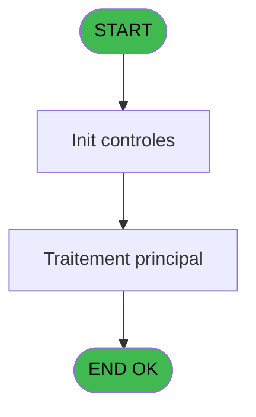
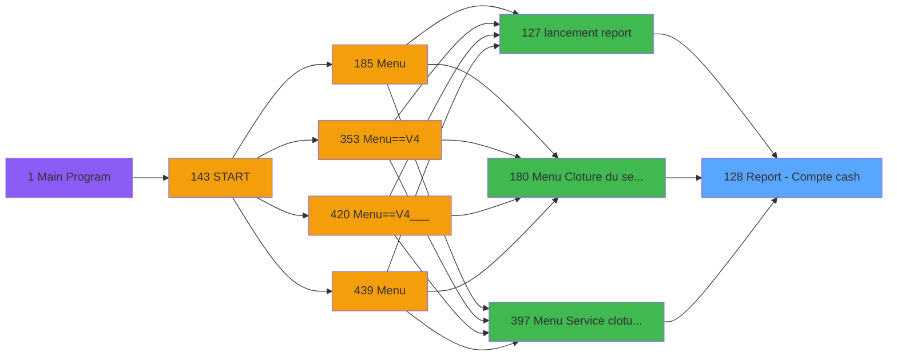

# PVE IDE 128 - Report - Compte cash

> **Analyse**: Phases 1-4 2026-02-03 09:35 -> 09:35 (18s) | Assemblage 09:35
> **Pipeline**: V7.2 Enrichi
> **Structure**: 4 onglets (Resume | Ecrans | Donnees | Connexions)

<!-- TAB:Resume -->

## 1. FICHE D'IDENTITE

| Attribut | Valeur |
|----------|--------|
| Projet | PVE |
| IDE Position | 128 |
| Nom Programme | Report - Compte cash |
| Fichier source | `Prg_128.xml` |
| Domaine metier | Comptabilite |
| Taches | 4 (0 ecrans visibles) |
| Tables modifiees | 0 |
| Programmes appeles | 0 |

## 2. DESCRIPTION FONCTIONNELLE

**Report - Compte cash** assure la gestion complete de ce processus, accessible depuis [lancement report (IDE 127)](PVE-IDE-127.md), [Menu Cloture du service (IDE 180)](PVE-IDE-180.md), [Menu Service cloture v2 (IDE 397)](PVE-IDE-397.md).

Le flux de traitement s'organise en **3 blocs fonctionnels** :

- **Impression** (2 taches) : generation de tickets et documents
- **Traitement** (1 tache) : traitements metier divers
- **Calcul** (1 tache) : calculs de montants, stocks ou compteurs

Detail : phases du traitement

#### Phase 1 : Calcul (1 tache)

- **128** - Report - Compte cash **[[ECRAN]](#ecran-t1)**

#### Phase 2 : Impression (2 taches)

- **128.1** - Print
- **128.1.1** - EDITION

#### Phase 3 : Traitement (1 tache)

- **128.1.1.1** - Lines

## 3. BLOCS FONCTIONNELS

### 3.1 Calcul (1 tache)

Calculs metier : montants, stocks, compteurs.

---

#### 128 - Report - Compte cash [[ECRAN]](#ecran-t1)

**Role** : Traitement : Report - Compte cash.
**Ecran** : 312 x 57 DLU (MDI) | [Voir mockup](#ecran-t1)

### 3.2 Impression (2 taches)

Generation des documents et tickets.

---

#### 128.1 - Print

**Role** : Generation du document : Print.

---

#### 128.1.1 - EDITION

**Role** : Generation du document : EDITION.

### 3.3 Traitement (1 tache)

Traitements internes.

---

#### 128.1.1.1 - Lines

**Role** : Traitement : Lines.

## 5. REGLES METIER

*(Aucune regle metier identifiee)*

## 6. CONTEXTE

- **Appele par**: [lancement report (IDE 127)](PVE-IDE-127.md), [Menu Cloture du service (IDE 180)](PVE-IDE-180.md), [Menu Service cloture v2 (IDE 397)](PVE-IDE-397.md)
- **Appelle**: 0 programmes | **Tables**: 4 (W:0 R:2 L:2) | **Taches**: 4 | **Expressions**: 9

<!-- TAB:Ecrans -->

## 8. ECRANS

*(Programme sans ecran visible)*

## 9. NAVIGATION

### 9.3 Structure hierarchique (4 taches)

| Position | Tache | Type | Dimensions | Bloc |
|----------|-------|------|------------|------|
| **128.1** | [**Report - Compte cash** (128)](#t1) [mockup](#ecran-t1) | MDI | 312x57 | Calcul |
| **128.2** | [**Print** (128.1)](#t2) | MDI | - | Impression |
| 128.2.1 | [EDITION (128.1.1)](#t3) | MDI | - | |
| **128.3** | [**Lines** (128.1.1.1)](#t4) | MDI | - | Traitement |

### 9.4 Algorigramme

> **Legende**: Vert = START/END OK | Rouge = END KO | Bleu = Decisions
> *Algorigramme auto-genere. Utiliser `/algorigramme` pour une synthese metier detaillee.*

<!-- TAB:Donnees -->

## 10. TABLES

### Tables utilisees (4)

| ID | Nom | Description | Type | R | W | L | Usages |
|----|-----|-------------|------|---|---|---|--------|
| 30 | gm-recherche_____gmr | Index de recherche | DB | R |   |   | 1 |
| 40 | comptable________cte |  | DB | R |   |   | 1 |
| 47 | compte_gm________cgm | Comptes GM (generaux) | DB |   |   | L | 1 |
| 786 | qualite_avant_reprise |  | DB |   |   | L | 1 |

### Colonnes par table (0 / 2 tables avec colonnes identifiees)

Table 30 - gm-recherche_____gmr (R) - 1 usages

*Table utilisee uniquement en Link ou aucune colonne Real identifiee dans le DataView.*

Table 40 - comptable________cte (R) - 1 usages

*Table utilisee uniquement en Link ou aucune colonne Real identifiee dans le DataView.*

## 11. VARIABLES

### 11.1 Parametres entrants (3)

Variables recues du programme appelant ([lancement report (IDE 127)](PVE-IDE-127.md)).

| Lettre | Nom | Type | Usage dans |
|--------|-----|------|-----------|
| A | P. Masque | Alpha | - |
| B | P. Masque sans Z | Alpha | - |
| C | P.I Flag Cloture Service | Logical | 1x parametre entrant |

### 11.2 Variables de session (5)

Variables persistantes pendant toute la session.

| Lettre | Nom | Type | Usage dans |
|--------|-----|------|-----------|
| D | V.Service | Alpha | - |
| E | V Date mini | Date | 2x session |
| F | V Date maxi | Date | 3x session |
| G | V NomFichier Pdf | Alpha | 2x session |
| H | V NomFichier Pdf Archivage | Alpha | - |

## 12. EXPRESSIONS

**9 / 9 expressions decodees (100%)**

### 12.1 Repartition par type

| Type | Expressions | Regles |
|------|-------------|--------|
| CONDITION | 1 | 0 |
| DATE | 2 | 0 |
| CONCATENATION | 2 | 0 |
| OTHER | 2 | 0 |
| STRING | 2 | 0 |

### 12.2 Expressions cles par type

#### CONDITION (1 expressions)

| Type | IDE | Expression | Regle |
|------|-----|------------|-------|
| CONDITION | 1 | `V Date maxi [F]<>'00/00/0000'DATE` | - |

#### DATE (2 expressions)

| Type | IDE | Expression | Regle |
|------|-----|------------|-------|
| DATE | 3 | `Date()` | - |
| DATE | 2 | `Date()-3` | - |

#### CONCATENATION (2 expressions)

| Type | IDE | Expression | Regle |
|------|-----|------------|-------|
| CONCATENATION | 6 | `Translate ('%club_exportdata%')&'ArchivagePos\'&
Trim (GetParam ('VILLAGECODE'))&Trim (GetParam ('SERVICE'))&
'_CashAccount_'&DStr (V Date mini [E],'YYYYMMDD')&
'_'&DStr (V Date maxi [F],'YYYYMMDD')&'.Pdf'` | - |
| CONCATENATION | 5 | `Translate ('%club_exportdata%')&
Trim (GetParam ('VILLAGECODE'))&Trim (GetParam ('SERVICE'))&
'_CashAccount_'&DStr (V Date mini [E],'YYYYMMDD')&
'_'&DStr (V Date maxi [F],'YYYYMMDD')&'.Pdf'` | - |

#### OTHER (2 expressions)

| Type | IDE | Expression | Regle |
|------|-----|------------|-------|
| OTHER | 7 | `P.I Flag Cloture Service [C]` | - |
| OTHER | 4 | `GetParam('SERVICE')` | - |

#### STRING (2 expressions)

| Type | IDE | Expression | Regle |
|------|-----|------------|-------|
| STRING | 9 | `FileExist(Trim(V NomFichier Pdf [G]))` | - |
| STRING | 8 | `FileCopy(Trim(V NomFichier Pdf [G]),Trim(V NomFichier Pdf Archi... [H]))` | - |

<!-- TAB:Connexions -->

## 13. GRAPHE D'APPELS

### 13.1 Chaine depuis Main (Callers)

Main -> ... -> [lancement report (IDE 127)](PVE-IDE-127.md) -> **Report - Compte cash (IDE 128)**

Main -> ... -> [Menu Cloture du service (IDE 180)](PVE-IDE-180.md) -> **Report - Compte cash (IDE 128)**

Main -> ... -> [Menu Service cloture v2 (IDE 397)](PVE-IDE-397.md) -> **Report - Compte cash (IDE 128)**

### 13.2 Callers

| IDE | Nom Programme | Nb Appels |
|-----|---------------|-----------|
| [127](PVE-IDE-127.md) | lancement report | 1 |
| [180](PVE-IDE-180.md) | Menu Cloture du service | 1 |
| [397](PVE-IDE-397.md) | Menu Service cloture v2 | 1 |

### 13.3 Callees (programmes appeles)

### 13.4 Detail Callees avec contexte

| IDE | Nom Programme | Appels | Contexte |
|-----|---------------|--------|----------|
| - | (aucun) | - | - |

## 14. RECOMMANDATIONS MIGRATION

### 14.1 Profil du programme

| Metrique | Valeur | Impact migration |
|----------|--------|-----------------|
| Lignes de logique | 51 | Programme compact |
| Expressions | 9 | Peu de logique |
| Tables WRITE | 0 | Impact faible |
| Sous-programmes | 0 | Peu de dependances |
| Ecrans visibles | 0 | Ecran unique ou traitement batch |
| Code desactive | 0% (0 / 51) | Code sain |
| Regles metier | 0 | Pas de regle identifiee |

### 14.2 Plan de migration par bloc

#### Calcul (1 tache: 1 ecran, 0 traitement)

- **Strategie** : Services de calcul purs (Domain Services).
- Migrer la logique de calcul (stock, compteurs, montants)

#### Impression (2 taches: 0 ecran, 2 traitements)

- **Strategie** : Templates HTML -> PDF via wkhtmltopdf ou Puppeteer.
- `PrintService` injectable avec choix imprimante

#### Traitement (1 tache: 0 ecran, 1 traitement)

- **Strategie** : 1 service(s) backend injectable(s) (Domain Services).
- Decomposer les taches en services unitaires testables.

### 14.3 Dependances critiques

| Dependance | Type | Appels | Impact |
|------------|------|--------|--------|

---
*Spec DETAILED generee par Pipeline V7.2 - 2026-02-03 09:35*
